<!-- Begin: JG102_The_Caverns_of_Thracia_01_Intro_Tables_1-20 -->

<!-- The Caverns of Thracia, Page 001 -->

# THE CAVERNS OF THRACIA

By Jennell Jaquays

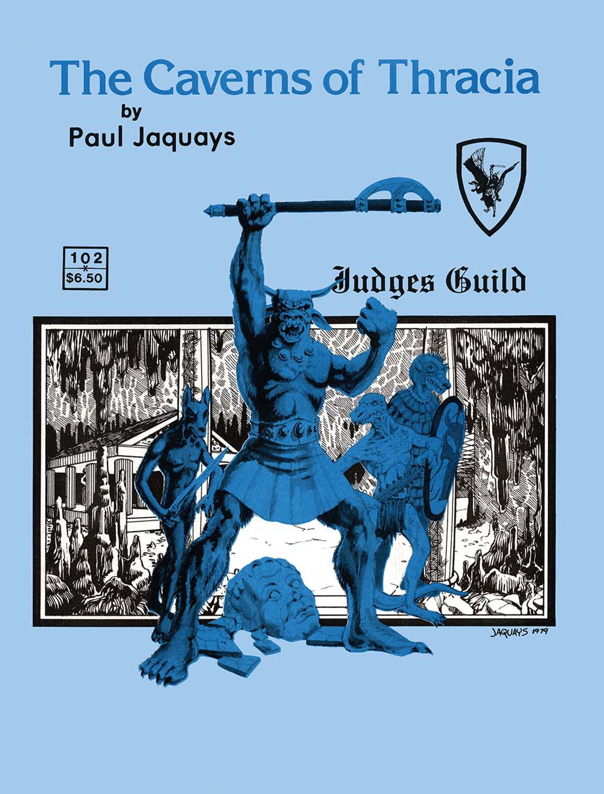

> [@JG102_The_Caverns_of_Thracia, _p._ _1_]

<!-- The Caverns of Thracia, Page 002 -->

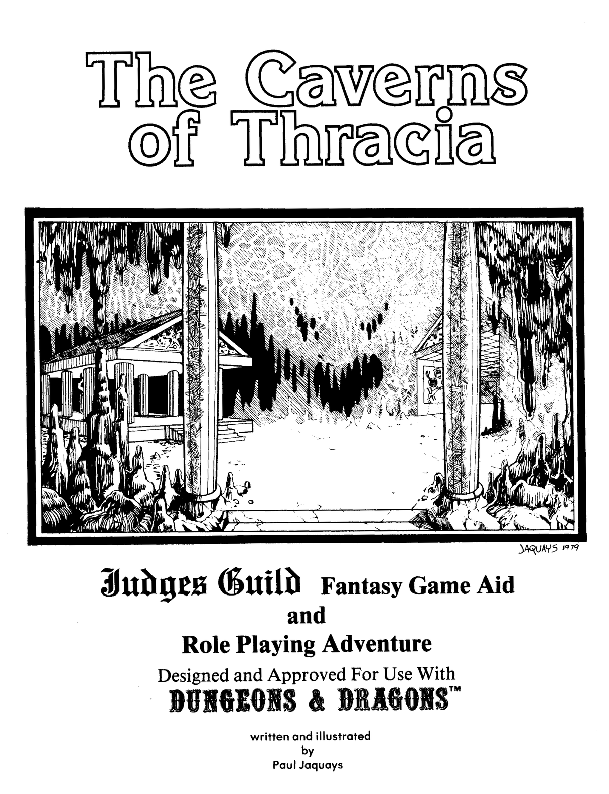

> [@JG102_The_Caverns_of_Thracia, _p._ _2_]

<!-- The Caverns of Thracia, Page 003 -->

THIS PAGE INTENTIONALLY LEFT BLANK

> [@JG102_The_Caverns_of_Thracia, _p._ _3_]

<!-- The Caverns of Thracia, Page 004 -->

## Table of Contents

- Forward 5
- Designer's Comments 5
- Notes for the Judge 5
- A Short History of the Caverns of Thracia 6
- Notes on the Thracian Language 7
- Random Encounters Tables and Information 8
- Gnoll Patrol Tables 13
- Lizard Men Patrol Tables 14
- Taverns of Thracia (Legends & Rumors) 14
- The Lost City of Thracia 16
- Level 1 21
- Level 2 31
- Level 3a 55
- Level 3 62
- Level 4 74

### Maps

- The Lost City of Thracia 17
- Level 1 22
- Level 2 32
- Room Complex 40 A-I 42
- Room 41B 42
- Room Complex 45 A-I 48
- Room Complex 53 A-J 54
- Vertical Cross-Section of Caverns 56
- Maps Key 56
- Level 3a 56
- Level 3 64-65
- Level 4 75

### Illustrations

- Armored Tribesmen Guards (PJ) 10
- Area Around Thracia (PJ + W) 18-20
- Incarnation of Death (PJ) 24
- G'ruk: Shaman of the Lizard Men (PJ) 34
- Giant Spider (KS) 36
- Disembodied Mouth & Grasping Guardian (PJ) 40
- Grasping Guardian (BB) 59
- Old Stone Bridges (level 2) (W) 60-61
- Officers of the Guard (PJ) 72

(PJ) = by Jennell Jaquays (BB) = by Bob Bingham
(KS) = by Kevin Siembieda (W) = old woodcuts

Copyright 1979 by Judges Guild. All rights reserved.
All characters portrayed herein are fictional and any
resemblance to anyone living or dead is coincidental.
Any resemblance of monsters herein to any real
monsters is coincidental and unexplainable.

This book was typeset by Penny Gooding and Layout
was by Mark Holmer. Both had assists from Chuck
Anshell, Bob Bingham and Dave Sering.

> [@JG102_The_Caverns_of_Thracia, _p._ _4_]

<!-- The Caverns of Thracia, Page 005 -->

## Forward

The Caverns of Thracia is the first in a series of dungeons and adventure scenarios designed and illustrated in entirety by Jennell Jaquays for use with TSR’s original Dungeons and Dragons® Rules systems. The contents of this adventure may need to be changed by the individual referee to suit the campaign he or she moderates. This product has been approved by TSR for use with Dungeons and Dragons®. No similarity between any of the names, characters, persons and/or institutions in this publication with those of any living or dead person or institution is intended, and any such similarity which may exist is purely coincidental. Printed in the U.S.A. Copyright 1979 by Judges Guild.

### Designer’s Comments

The Caverns of Thracia has been designed to accommodate adventurers of the 1st and higher levels. There are some segments of the adventure that will be a pushover for low level groups while one or two areas will send the higher level characters ducking for cover if played correctly. As you read through this scenario, and I do recommend reading through it before commencing play, you may notice at times that the designer (self) becomes quite informal. This is intended, since this adventure was not designed to have snob appeal or be the last word in gaming aids. This is now your adventure. I have put down possibilities and probabilities and a few remarks to go with them. It is now up to you to breathe life into the denizens of this scenario. There are no high power artifacts in these caverns and only one creature has very high power magic use. I would surmise that even a group of fighters could survive in this adventure (although they would definitely miss out on some historical aspects and clues) and haul out a goodly sum of loot. Treasure is purposefully rare (although there are some rather nice ones) and the monsters that are aware of each other in this dungeon are usually working together. The only opposing groups in this game are the humans and the beast men and since they don’t frequent the same areas, there is little interaction between them except for constant raiding.

### Starting the Adventure

The best place to start any adventure is in a place of familiarity to the characters. Drop a few hints and let the players take it from there asking pertinent questions of the locals and being generally nosey, a pre-requisite for all adventurers. To speed things up, the referee might want to use the section titled, *The Taverns of Thracia*, to randomly assign knowledge to characters.

### Notes for the Judge

A\) This adventure is not specifically located on the Judges Guild world. It can be, but it is not. Suggested areas for its location would include: A large, misted, off-shore island, possibly once connected via landbridge to the mainland; A ruined city near the edge of a subtropical forest; A ruined city on the edge of a mountain or in large, forsaken hills.

B\) I have tried something different in the numbering system used. Instead of renumbering each time a level is changed, I have simply continued with consecutive numbers. Thus, instead of Level 2, Room 23, it is merely Room 50.

C\) Some rooms may have to be beefed up or toned down and some of their contents changed altogether if they do not match your world.

D\) There are several monsters in this adventure that were created especially for the scenarios presented. They are not to be taken as official D&D monsters, but instead are just local color to foil the rule book memorizers in an adventuring party. Nothing seems to scare someone who knows the rules like something totally unknown.

> [@JG102_The_Caverns_of_Thracia, _p._ _5_]

<!-- The Caverns of Thracia, Page 006 -->

E\) A complete table of random encounters for each level is provided with the adventure. If a wandering monster is indicated, use the chart for that level. If a level does not have a chart, it does not have wandering monsters.

F\) Due to the size of this adventure, it is doubtful that it can be played in one sitting.

G\) In the Caverns of Thracia there exists a religion that may not exist elsewhere. These are the worshippers of Thanatos, the death god or as he is currently called “The Dark One”. Clerics in the service of this lawful evil god assume a lawful evil alignment although actual followers need not be of any particular alignment, since death can work through anything. The clerics in the service of this god speak and read in the Thracian language (but not the very ancient language, see history for details). They have the following special abilities: At 4th level they may animate dead as per the spell once per day; at 6th level they may speak with dead as per the spell once per day; at 7th level they may use finger of death once per day as per the spell. These spells are not in addition or extra to their normal number of clerical spells. In addition to the above, the cleric in the service of death may control a number of undead equal to those turned by a good cleric. A cleric may never control more undead than the indicated maximum number of beings that are turnable (2d6 or maximum of 12). A “D” on the chart indicates instant control. A number indicates that the number must be rolled over on 2d8; a “T” indicates control of 1d6 of the undead creatures. Once these creatures are under the control of a cleric of Thanatos, they will obey his or her command until they are destroyed. Undead of 5+ hit dice may make a saving roll once per day of equal to or over the controlling cleric’s wisdom +2.

H\) Have fun and enjoy yourselves. As real as gaming may seem at times, it’s still only a game. Direct any questions, complaints, hate mail, etc. to Jennell Jaquays c/o Judges Guild, 1165 N. University Ave., Decatur, IL 62526. If a question or topic is pertinent, the answer may be published in one or both of the magazines put out by Judges Guild.

## The Caverns of Thracia

### A Short History

This history is not provided to give the players a background on the history of the caverns. As far as the players are concerned, the caverns are a part of a lost civilization(s) that disappeared centuries before. Little is known of them except, possibly, its location and a few wild stories (see *The Taverns of Thracia*). Instead, this history is provided to give the referee a historical index of various events that occurred in the development of the cavern societies. It will also include an overview of the cultural development of the early Thracian civilizations.

Before man existed, or possibly before he discovered the benefits and curses of civilization, there existed the reptile race. The reptile race, while not large, had its own centers of civilization, including large cities and underground temple complexes. As man waxed, the reptile race waned, losing much of its arcane civilization and slowly degenerating or regressing into the race of beings that men call “lizard men”. A few pockets of more advanced lizard men exist, but they are slowly dwindling as the race dies out. Long before man discovered the caverns, the reptile race was beginning to slip backwards. The Immortal King, the ruler of the tattered remnants of lizard men who still know the ways of sorcery, was near death and had been dying for several centuries. With the coming of man to the area (a new source of food and slaves for the still powerful reptiles) came the death of the Immortal King. But his was not a true death. The dead body remained animated by the creature’s spirit. Even in death the Immortal King continued to rule as a lich, entombed in the ancient underground temple. Slowly the reptile race regressed to their present state, but not before they had watched the now plentiful humans discover the caverns and build their own temple and burial complexes. The lizard men at last sealed up the various entrances to their now crumbling great hall and slunk off into the fetid swamps, to return later as mercenaries for the beast kings.

Meanwhile, the humans had discovered the caverns, not realizing that the once feared reptile men (they were merely legendary now and the Immortal King was a bogeyman to scare children) still occupied hidden portions of the caverns. At this point the men were beginning to develop a civilization comparable to the early Mycenaean or Cretan civilizations of this world’s past. The art and architecture were almost

> [@JG102_The_Caverns_of_Thracia, _p._ _6_]

<!-- The Caverns of Thracia, Page 007 -->

identical with the above mentioned cultures. Eventually they sealed off several of their tomb complexes and began to concentrate on the civilization above ground. Half a millennium later they would construct the temples on second level and 200 years after that they would begin the golden age of Thracian culture.

The actual golden age began with the discovery of an immense cavern, deep below the natural caverns. It was not a natural chamber, but no note was taken of that. About this same time, the Thracian people had begun to use sub-human creatures for slaves, such as the gnolls, minotaurs and dog brothers, who began to carve the underground caverns into a huge garden and palace. During the reign of Argos II the vast work was completed and the underground area became a playground for the Thracian royalty. However, during the reign of Agamemnos, Argos’ grandson, the huge number of beast men that laired in the caverns revolted and took over the palace, wounding the king to the death and causing his gentry to flee. Most never made it to the surface. Those who did inspired either fear or fierceness into persons hearing the tale. The few bands of vengeful citizens that entered the caverns were never seen again.

Thus, did the beast men set themselves up in the underground domain, retaining control of the entire 3rd, 4th and 2nd levels while allowing the 1st level to go untouched. They chose an intelligent minotaur to rule them and then set down to decide what to do with their numerous captives.

Some 150 years later the worship of Thanatos, the death god, was outlawed and the few priests who served death were either tortured to death or were sealed in the chapel of Thanatos on the 1st level.

The first wave of invaders came soon after. On the Sesquicentennial anniversary (150) years of the overthrow of Thanatos, an invading army of barbarians (all non-Thracians are barbarians) was spurred on by descendants of the death worshippers to utterly destroy the city. The lax Thracian army was no match for frenzied barbarians and all but a fraction of the city’s population were put to the sword or carried off into slavery. During the destruction, the entrances to the caverns were destroyed and covered with rubble.

The few remaining Thracians attempted to make some kind of reconstruction but less than a quarter century later a second invasion of vicious invaders struck again. Those Thracians who fled into the encroaching jungle survived while the rest died. The few who did escape slipped back into savagery. 200 years later, they rediscovered the caverns and with them they found not only a new/old religion in the worship of the god known only through legend as “The Dark One”, but also the beast men.

The beast men by this time had taken over the entire cavern complex (those parts they could easily find without looking hard) and had opened up the caverns to the surface again. With the coming of humans again, they saw entirely new possibilities for food and pleasure. Soon after the caverns were reopened, the reptile race once again sought the location of their legends and in doing so allied themselves with the beast men.

The caverns are now the holy places both for the descendants of the Thracians and for the once powerful reptile race whose degenerated offspring still seek the reason for their existence.

### Some Notes About The Thracian Language

The very ancient Thracians had a written language. There are a few instances where it can be found in the caverns. However, between the time of the sealing of the Ancient Thracian tombs and the beginning of the golden age, the Thracian language changed drastically (something like the difference between classical Latin and modern Italian). A character who can read the Thracian language may pick out one word in ten of the Ancient Thracian language.

> [@JG102_The_Caverns_of_Thracia, _p._ _7_]

<!-- The Caverns of Thracia, Page 008 -->

## Random Encounter Tables

### (Wandering Monsters)

Random encounters in The Cavern of Thracia dungeon complex will be checked for every full turn by rolling a 6 on a d6. After an encounter is determined, the referee should then locate it according to his or her own system of placement. Some of the encounters will be with specific personalities that are already described in the text of the dungeon. A room number will follow such a listing in the tables below.

The encounters marked with an asterisk (*) will be described below. It should be stressed here, that if a “personality” has been killed in its lair or in a previous random encounter it will not appear again on the encounter tables. Conversely, if a “personality” is killed in a random encounter, it will not be found in its lair or location as designated in the text of the dungeon. However, should a creature be only wounded in an encounter, either in its lair or as a wanderer, all subsequent encounters will be with the creature or creatures bearing all wounds sustained and not having the use of any spells previously used (unless there has been sufficient time and/or opportunity for wounds to have been healed and spell regained. If there is a possibility of a creature obtaining healing, it will be indicated).

Because the composition of some groups of wandering monsters would necessitate much flipping back and forth between pages to keep track of individual specifics, it is suggested by the designer that the referee pre-roll several encounters on each level and have them set up and ready to go before the game begins.

The encounter tables below are set up by level with the rooms they encompass in parentheses. Once an encounter has been indicated, determine which level the adventuring group is on and go to the proper table. If there is no table for a particular level or sublevel, then there will be no wandering monster there (and the players breathe a sigh of relief).

Specific encounters on each level will be rolled for with a single d10. With instructions in hand now, have at it!

### Level One

Rooms: *(1 - 27B, excluding Room 9 - 13)*
| d10 | Result |
| --- | --- |
| 1 | Gnoll Patrol A* |
| 2 | Lizard men Patrol A* |
| 3 | 4 Giant Rats* |
| 4 | Band of Bold Tribesmen* |
| 5 | Gelatinous Cube* |
| 6 | Tribesmen Funerary Party (only in Rooms 5 - 27B) |
| 7 | 1-4 Stirges* |
| 8 | Tribes Men Religious Procession (only in Rooms 15 - 27B. If this encounter is indicated religious ceremonies will be going on. See Room 23, Duration: 18 turns). |
| 9 | Gnoll Patrol B* |
| 10 | Random encounter from level 2 (reroll on level 2) |

### Level Two

Rooms: *(28 - 53, excluding 37, 39A, 40, 41, 53)*
| d10 | Result |
| --- | --- |
| 1 | Lizard men Patrol B* |
| 2 | Gnoll Patrol B* |
| 3 | Gnoll Patrol C* |
| 4 | 2-5 Stirges* |
| 5 | 2 Spiders* |
| 6 | Ochre Jelly* |
| 7 | Band of bold Tribesmen (see level 1 table, No. 4)* |
| 8 | Battle between Tribesmen and Lizard men* |
| 9 | Living stone statue* |
| 10 | Encounter from (roll d10) 1-2: 1st level table, 3-10: palace table* |

Room Complex 40 (A - I): No wandering monsters, until this area is discovered by adventurers. On subsequent adventures, this area may be intruded upon by wandering monsters from the 2nd level encounter table (also see Room Complex 45).

Room 41 (A - B): As per Room Complex 40 above (also see Room Complex 45).

Room Complex 45 (A - I): As per Room Complex 40 above. However, once its location is discovered by adventurers, the monsters will only discover it on a d10 roll of 1-2 between adventures or if searching for the location of adventurers who mysteriously disappeared.

Room Complex 53 (A - J):

| d10 | Result |
| --- | --- |
| 1-2 | Special, see below* |
| 3-9 | No encounter (small spiders and little insects make scurrying noise) |
| 10 | G’ruk, the lizard man Shaman (Room 31)* |

> [@JG102_The_Caverns_of_Thracia, _p._ _8_]

<!-- The Caverns of Thracia, Page 009 -->

### Level Three: The Gardens

Rooms: *(54 - 69)*
| d10 | Result |
| --- | --- |
| 1 | The Dryad Astraea (56) |
| 2 | The Dryad Eidothera (60) |
| 3 | The Dryad Calliste (58) |
| 4 | The Dryad Jocasta (65) |
| 5 | Herd of 20 Cattle* |
| 6 | Gnoll Patrol D* |
| 7 | Troupe of Human slaves* |
| 8 | Hydra (Room 70) |
| 9 | Encounter from the Level 2 table (reroll on Level 2) |
| 10 | Encounter from Level 3: The Palace and Dungeon (reroll on Palace and Dungeon table) |

### Level Three: The Palace and Level Four: The Dungeons

Rooms: *(70 - 116)*
| d10 | Result |
| --- | --- |
| 1 | Gnoll Patrol E* |
| 2 | Lizard men Patrol C* |
| 3 | Human Slaves* |
| 4 | The Minotaur King and his entourage |
| 5 | 2 Minotaur guards* |
| 6 | A random Dryad* |
| 7 | The leaders of the various Beast Men (Room 83) |
| 8 | Lizard men Patrol C* |
| 9 | The Clerical Minotaur Cow (Room 111)* |
| 10 | Encounter from Level 3: The Gardens (reroll on Garden table) |

NOTE I: No. 5, the herd of cattle may be found on the Palace level, but never on the dungeon level.

NOTE II: If a dryad is indicated, ignore Dryad name and treat as a random Dryad and refer to No. 6 of the Palace and Dungeon level table.

Room 117: There will be no wandering monster or encounter in this chamber, but an encounter outside of it will be rolled on the Level 3: Garden tables.

Level Three - A (118 - 126): Any wandering monster indicated on this level will be the wandering Statue of Bronze (see Level 3 - A, Introductory Note).

### Random Encounter Descriptions

These are the descriptions and some rationalizations for the various encounters listed above. Some of the encounters will refer to material in the text of the dungeon. Others will refer to additional following tables.

#### Level One

1\) Gnoll Patrol A: see GNOLL PATROL tables below.

2\) Lizard men Patrol A: see LIZARD MEN PATROL tables below.

3\) 4 Giant Rats: AC: 7, Move: 12", HD: 1/2, Damage: bite for 1 - 3 + saving throw vs. poison to avoid contamination with disease. There is a 5% chance that any given rat will be a disease carrier, HP: 1, 3 (x2), 4.

4\) Band of Bold Tribesmen: There will be a total of 6 Tribesmen in 1 of 3 bands. Band 1: Led by a 2nd level fighter in platemail (see illustration of armored Tribesmen guards), Align: N, AC: 3, Move: 6", HD: 2, Damage: Spear for 1 - 6 and Broadsword for 1 - 8, HP: 11, STR: 12, DEX: 13. The next character of note is a 4th level Cleric of The Dark One, Align: LE, AC: 6 (Leather and Shield), Move: 12", HD: 2+4, Damage: Mace for 1 - 6, HP: 12, Spells: Cure Light Wounds, Cure Light Wounds, Animate 3 Undead (Skeletons or Zombies) once daily and Control Undead of a number equal to the turning ability of a good Cleric (see Designer’s Notes for further information).

> [@JG102_The_Caverns_of_Thracia, _p._ _9_]

<!-- The Caverns of Thracia, Page 010 -->

The rest of the band is made up of 1st level fighters armed with Leather Armor, Shield and Spear. Align: N, AC: 6, Move: 12", HD: 1, Damage: 1 - 6 with Spear, HP: 6, 8, 4, 7. The group will also have split between them the following: Two 50' Coils of Rope, 36 Torches, 5 Bronze Spikes, Rations for 6 men for 4 days, 6 Flagons of Water, 1 Flagon of Weak Wine, 2 Bronze Daggers, a Stone Hammer, a rock on the end of a stick with a Continual Light spell on it. The glowing rock has a hood attached to hide the light. It is carried by the Cleric.

Band 2: All 6 of these men are 1st level fighters as above with the same armor and weapons. Hit Points are: 2, 5, 4 (x3), 6. They will have the same extra supplies except for the Wand of Light (glowing rock on a stick). These fellows have been whipped up to a battle frenzy by the Clerics and since they do not fear death, but rather seek it in combat, they will fight like berserkers.

Band 3: This is a group of escaped slaves from the 3rd level. They are AC: 9, Move: 9", HD: 1/2, Damage: 1 - 2 or by weapon type -1, HP: 2 (4), 1. They are scared for their lives and there is a 60% chance that a Gnoll Patrol will be hot on their heels (2 - 5 melee rounds behind them. See GNOLL PATROL tables below).

5\) Gelatinous Cube: AC: 8, Move: 6", HD: 4, Damage: 2 - 8 + save vs. paralyzation or be anesthetized, HP: 24, Immune to Lightning, Cold, Paralyzation, Fear, and Polymorph. This cube had 34 GP, 10 SP, a Bronze Dagger, a 200 GP Topaz Gem Stone, a Steel ball-bearing (useless, but who knows?), and a marble from Room 89.

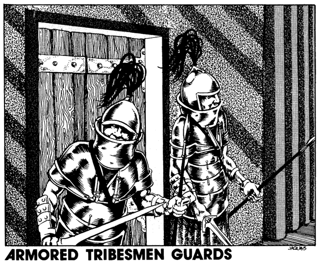

> [@JG102_The_Caverns_of_Thracia, _p._ _10_]

<!-- The Caverns of Thracia, Page 011 -->

6\) **Tribesman Funerary Procession:** This group will only be in the designated area. If it is indicated as an encounter and the adventuring party is not in the appropriate area, the procession will be located in Room 27B and will remain there for 3 - 18 turns after the encounter is determined. The funeral procession will consist of the same entourage as in the Tribesmen religious ceremony described in Room 23. However, there will be an additional 1 - 12 0 level types. All will be garbed in black robes and the 0 level types will have their faces painted in bright, garish colors. The body is borne by 6 men (0 levels) of 4 Hit Points each. There also will only be four 1st level fighters in plate mail, AC: 3, Move: 6", HD: 1, Damage: Spear for 1 - 6 and Broadsword for 1 - 8, HP: 4, 6, 3, 8; plus one 2nd level fighter in plate mail, AC: 3, Move: 6", HD: 2, Damage: Spear for 1 - 6 and Sword for 1 - 8, HP: 13.

7\) **1 - 4 Stirges:** AC: 7, Move: 18", HD: 1, Damage: 1 - 3 + 1 - 4 points automatic blood drain per round thereafter, HP: 8, 6, 4 (x2).

9\) **Gnoll Patrol B:** See GNOLL PATROL tables below.

#### Level Two

1\) **Lizard Men Patrol B:** See LIZARD MEN PATROL tables below.

2\) **Gnoll Patrol B:** See GNOLL PATROL tables below.

3\) **Gnoll Patrol C:** See GNOLL PATROL tables below.

4\) **2 - 5 Stirges:** AC: 7, Move: 18", HD: 1, Damage: 1 - 3 + 1 - 4 points automatic blood drain per round thereafter, HP: 6, 7, 4, 5, 3.

5\) **2 Spiders:** AC: 5, Move: 15", HD: 3, Damage: bite for 1 - 4 + save vs. poison or be paralyzed for 11 - 16 (10+1d6) turns. Each additional bite raises number needed to save by 1.

6\) **Ochre Jelly:** AC: 8, Move: 3", HD: 5, Damage: 2 - 12, HP: 24.

8\) **Battle between Tribesmen and Lizard Men:** A battle will be in process between a band of Tribesmen (see Level 1, No. 4, Band 2) and a patrol of Lizard Men (see LIZARD MEN PATROL tables below and randomly determine which group will be in play). One Tribesman and one Lizard man will be dead and at least two members on either side will be minus 1 - 3 Hit Points from wounds. The Tribesmen are outclassed by their reptilian opponents and if unaided, they will all be killed except for the fighter with 2 Hit Points who will be taken unconscious back to whichever group the Lizard Men are directly in the service of (see LIZARD MEN PATROL tables).

9\) **Living Stone Statue:** This is an animated stone statue that wanders about the caverns and destroys all living creatures it meets. It is unintelligent and will fight until destroyed. Once destroyed, however, it will begin to put itself together by regenerating stone out of the surrounding walls and within 3 turns, it will be whole again and begin to stalk the caverns once more. There is a 10% chance each turn that it will randomly teleport to some other place in the caverns. The only way to permanently destroy the statue is to place the head on some non stone - or earth related item, such as a wooden table or to carry it (200 encumbrance points). The statue is AC: 2, Move: 6", HD: 8, Damage: 2 - 12 per round, HP: 32. Unless the head is taken care of, this creature may be encountered more than once.

#### Room Complex 53

1\) **Special:** Nothing unless Door No. 3 (to the Astral Plane) is opened in Room 53 A. If so, then a Type I Demon will have entered through the door and be prowling around on this level for booty. AC: 0, Move: 12/18", HD: 8, Damage: 2 claws for 1 - 4 each, 2 talons for 1 - 8 each, 1 bite for 1 - 6, HP: 47.

2\) **Special:** Nothing unless the Immortal King in Room 53 E has been disturbed. If so, then it will be that undead creature as it prowls about its former demesne in search of living flesh to devour. This creature can and will leave the Room 53 Complex if the door to Room 53 from 53 A is not spiked shut. It will not attempt to leave through either of the other exits from this level, although it may seek to travel either astrally or ethereally.

> [@JG102_The_Caverns_of_Thracia, _p._ _11_]

<!-- The Caverns of Thracia, Page 012 -->

10\) **G’ruk the Lizard Shaman:** (see Room 31 for further details on this creature). He will be exploring the sacred area and may be found in any unsealed area except for 53 E.

#### Level Three: The Gardens

5\) **Herd of 20 Cattle:** AC: 7, Move: 15", HD: 2, Damage: 1 - 4, HP: roll as necessary. This is the Beast Men’s on-the-hoof food supply. The herd will be found wandering around the gardens and occasionally will be chased into the palace itself when the hydra is hungry and out stalking prey.

6\) **Gnoll Patrol D:** See GNOLL PATROL tables below.

7\) **Troupe of Human Slaves:** AC: 9, Move: 9", HD: 1/2, Damage: 1 - 2 or by weapon type -1, HP: roll as necessary. There are 12 slaves in the troupe and they will be performing various maintenance chores ranging from scrubbing walls to watering trees and/or trimming shrubbery. These slaves, if freed, will join with an adventuring party, but the first time that a Beast Man Commander of any race shows himself, they will be completely cowed and will change sides faster than greased lightning, even to the point of attempting to subdue adventurers. They have a morale of 2d6 which must be rolled under on a d20 every time melee is enjoined, or the freed slaves will run away with a 10% cumulative chance of changing sides each time (Yes, you guessed it! The original gutless wonders).

#### Level Three: The Palace and Level Four: The Dungeons

1\) **Gnoll Patrol E:** See GNOLL PATROL tables below.

2\) **Lizard Men Patrol C:** See LIZARD MEN PATROL tables below.

3\) **Human Slaves:** Treat this group of slaves as per the Troupe of Human Slaves (Level 3: The Gardens, No. 7) but there will only be 8 slaves.

4\) **The Minotaur King and his Entourage:** This group will be as described in Room 72. There is an additional 45% chance that the king will be accompanied by a second Gnoll patrol (see GNOLL PATROL tables below and determine one randomly). The King may obtain up to 4d8 of healing per day from his grandmother.

5\) **Two Minotaur Guards:** AC: 6, Move: 12", HD: 6, Damage: butt for 2 - 8, bite for 1 - 3 and battle axe for 1 - 12, HP: 28, 36.

6\) **A Random Dryad:** This will be one of the Dryads from the Garden area (No. 56 - 65). Determine which one on the table below, then go to the second table and determine the reason for her being in the palace, since it is basically out of bounds to the tree people who will not go there unless physically forced.

##### Table I: Random Dryad (d10)

| d10 | Result |
| --- | --- |
| 1 | Astraea (56) |
| 2 | Briseis (57) |
| 3 | Calliste (58) |
| 4 | Deianira (59) |
| 5 | Eidothera (60) |
| 6 | Flora (61) |
| 7 | Gaia (62) |
| 8 | Hypermnestra (63) |
| 9 | Iphigenia (64) |
| 10 | Jocasta (65) |

##### Table II: Reason (d20)

| d20 | Result |
| --- | --- |
| 1-8 | Captive and escorted by two Gnoll guards, AC: 5, Move: 9", HD: 2, Damage: 1 - 10 with two-handed Sword, HP: 14, 4. |

> [@JG102_The_Caverns_of_Thracia, _p._ _12_]

<!-- The Caverns of Thracia, Page 013 -->

| d20 | Result |
| --- | --- |
| 9-12 | Escaping Captivity. 50% chance of being pursued by 1 - 4 Gnoll guards (see Stats above). HP: 6, 14, 9, 13. |
| 13-14 | Subverted to aid of Minotaur King. She will lead adventurers into a trap (*Detect Evil* will reveal her nature). |
| 15-16 | She is dying (20% chance that she is already dead). There is a 60% chance that a Gnoll patrol will be standing over her body. Determine composition of patrol on GNOLL PATROL tables below. |
| 17-19 | She is in hiding and will attempt to remain hidden, even from adventurers. |
| 20 | She is insane and allowed to wander about the palace and grounds. She will bear the marks of torture. Her face is marred beyond all repair. |

### GNOLL PATROL TABLES

#### Table I: Patrol Composition

If the identity of a given Gnoll patrol is not predetermined, roll once on a d6. All patrols are AC: 5, Move: 9", Damage: by weapon type, HD: 2. Hit Points are indicated for each patrol. If a special is indicated, roll on Table III to determine nature of additions to the standard patrol. Weapon type (Table II) must be determined for all Gnoll patrols. Roll once on a d6.

| d6 | Result |
| --- | --- |
| 1 | (A) 4 Gnolls, HP: 8 (x2), 10, 9. |
| 2 | (B) 4 Gnolls + Special, HP: 12, 9, 8 (x2). |
| 3 | (C) 6 Gnolls, HP: 10 (x2), 9, 7, 4, 6. |
| 4 | (D) 6 Gnolls + Special, HP: 8, 11, 10, 7, 9 (x2). |
| 5 | (E) 8 Gnolls, HP: 12 (x2), 8, 11, 13, 9 (x2), 10. |
| 6 | (F) 8 Gnolls + Special, HP: 15, 8 (x3), 11 (x2), 9, 10. |

#### Table II: Weapon Type

| d6 | Result |
| --- | --- |
| 1 | Halberds |
| 2 | Halberds |
| 3 | Two-Handed Sword |
| 4 | Halberds and Longbows |
| 5 | Longbows and Morning Stars |
| 6 | Battle Axes |

#### Table III: Special Patrol Members

| d6 | Result |
| --- | --- |
| 1 | **Dog Brother fighter:** AC: 6, Move: 12", HD: 4, Damage: Sword for 1 - 8 and/or bite for 1 - 4, HP: 25. He is the Patrol Commander. |
| 2 | **Dog Brother Magic User:** AC: 6, Move: 12", HD: 4, Damage: two Daggers for 1 - 4 each and/or bite for 1 - 4, HP: 27, Spells: (as a 4th level Magic User) *Charm Person* (x2), *Shield*, *Sleep*, *Web* (x2). |
| 3 | **Minotaur:** AC: 6, Move: 12", HD: 6, Damage: butt for 2 - 8, bite for 1 - 3 and/or Battle Axe for 1 - 12, HP: 35. |

> [@JG102_The_Caverns_of_Thracia, _p._ _13_]

<!-- The Caverns of Thracia, Page 014 -->

#### Table III: Special Patrol Members (continues)

| d6 | Result |
| --- | --- |
| 4 | **2 Lizard Men:** AC: 4, Move: 6/12" (swimming), HD: 2+1, Damage: club for 1 - 8 and 4 darts for 1 - 4 each, HP: 9, 7. |
| 5 | **1 - 6 Human Captives.** These will be Tribesmen slaves who have attempted to escape and are being returned for punishment or possible execution. They are desperate. AC: 9, Move: 9", HD: 1/2, Damage: 1 - 2 or by weapon type -1, HP: 2 (x2), 3, 4 (x3). If freed, they will willingly serve as slaves to their saviors. They speak Gnollic and some Tribesman. |
| 6 | **2 of the Above.** Reroll and ignore rolls of 6. Duplications are allowed. |

### LIZARD MEN PATROL TABLE

All of the patrols listed below are in the service of the Minotaur King with the exception of Patrol A. They are Lizard Tribesmen under the leadership of G’ruk the Shaman of the Lizard People. Their statistics will be listed under A. All other patrols are AC: 4 (armed with Shield), Move: 6/12" (swimming), HD: 2+1, Damage: club for 1 - 8 and 4 darts for 1 - 4. Hit Points are indicated for each patrol. If a special is indicated, roll on GNOLL PATROL Table III.

| d4 | Result |
| --- | --- |
| 1 | (A) Lizard men in the service of G’ruk the Shaman. AC: 5, Move: 6/12", Damage: 2 claws for 1 - 3 each and a bite for 1 - 8, HP: 9, 11, 10, 7. There is a 10% chance that they will be accompanied by the Shaman G’ruk (see Room 31). |
| 2 | (B) 6 Lizard Men in the service of the Minotaur King. HP: 12 (x2), 9, 8, 11, 12. |
| 3 | (C) 6 Lizard Men in the service of the Minotaur King + a 50% chance of a Special. HP: 17, 15, 8, 11, 14, 10. |
| 4 | (D) 6 Lizard Men in the service of the Minotaur King + a Special patrol member. HP: 6, 11 (x2), 10, 12, 9. |

The individual patrols are not to be treated as individual characters. A patrol may be rolled up more than once.

## The Taverns of Thracia

The use of this section is optional. It provides a set of legends (more like bits and pieces of legends) that can either be assigned to various NPC’s in the referee’s campaign or to speed up a game, they can be given directly to the players as indicated below. The method is left up to the individual referee. If the system of giving legends directly to the player characters is used, the following mechanics should allow for fair distribution.

Roll once on a d4 on Table One. This will determine the number of information bits known by the character, usually from 0 - 3. Then, go to Table Two and roll a d20 the number of times as indicated on Table One. Write down each character’s known pieces of legendry on a separate piece of paper and inform them that they know these things about the future adventure and that they may keep them secret if they wish. Not all the pieces of information are true. Those that are not are suffixed by an “F” in parentheses. The referee is not obligated to inform the player as to the veracity of his information.

### Table One

| d4 | Result |
| --- | --- |
| 1 | 1 piece of information |
| 2 | 2 pieces of information |
| 3 | 3 pieces of information |
| 4 | No pieces of information |

> [@JG102_The_Caverns_of_Thracia, _p._ _14_]

<!-- The Caverns of Thracia, Page 015 -->

### Table Two

| d20 | Result |
| --- | --- |
| 1 | The Beast Men are Humans under a curse (F). |
| 2 | A collector has expressed interest in obtaining Thracian historical artifacts. He will pay 2d100 (2 - 200) Gold Pieces per intact item brought out. |
| 3 | Beware the Yellow Death! |
| 4 | Don’t trust the trees! |
| 5 | The Tribesmen perform Human sacrifice. |
| 6 | You have learned to read the Thracian Language (modern). This gives you a one-time 30% chance of reading anything inscribed in that language. |
| 7 | Beware the God of Death! |
| 8 | The rope bridges are rotted out and unsafe (F). |
| 9 | For safety, seek ye the Pool of the Watery Wonders. |
| 10 | The Hall of Laughing Skulls leads to riches untold. |
| 11 | Be wary of statuary! |
| 12 | Deep under the earth there is a sunlit garden and a sparkling palace. |
| 13 | Seek aid from the Halfling Hermit. |
| 14 | Buried with a dead king is a powerful, but evil Sword. |
| 15 | The caverns go no deeper than two levels (F). |
| 16 | The leader of the Beast Men hoards vast amounts of wealth (F). |
| 17 | A remnant of an ancient pre-Human civilization may yet exist deep in the bowels of the earth. |
| 18 | The Beast Men are enslaving Humans. |
| 19 | The touch of the Good will destroy Undead (F). |
| 20 | You have learned to speak the language of the Tribesmen. You have a 65% chance of speaking clearly to any Tribesman. If the 65% roll is not made, clarity of conversation must be determined on Room 73’s Interpretation tables. |

> [@JG102_The_Caverns_of_Thracia, _p._ _15_]

<!-- The Caverns of Thracia, Page 016 -->

## The Lost City of Thracia

Note: The tree symbols on the map represent actual trees. There are many, many more trees in the jungle, but to indicate them all would clutter the map severely. However, on the building foundations themselves, there are no more trees than indicated.

Note II: The surface of the street is cobblestone and is well choked with thick grass, at least waist high.

A\) **Entrance to Room 1:** At this point the stairs descend down to level one, Room 1. There is a 60% chance that a Gnoll patrol will be guarding this entrance. (Use GNOLL PATROL Tables in Random Encounter section to randomly determine a patrol). There is an additional 50% chance that half the patrol will be in ambush up in the trees. The stairs come up onto a weathered pedestal that was once the base of a temple. There is rubble lying about on the surface and trees are growing up around the edge of the pedestal and out of cracks in it. The pedestal is 10' higher than the surrounding terrain.

B\) **The Tribesmen’s Secret Entrance:** This set of stairs leads down to 18 on the first level map. There will be a band of Tribesmen lurking about here (see Random Encounter Tables, Level One, No. 4, “Band of Bold Tribesmen”. They will be the equivalent of Band 2, but with the following Hit Points: 8, 6, 5, 4, 7, 9). These characters will definitely attack from ambush.

C\) **The Remnants of an Ancient Building:** There is little left besides the foundation and a couple of walls. There is a 30% chance of a Random Encounter at this point. Roll on the 2nd level table. A search of the premises will reveal a tablet written in Dwarvish. If a member of the party can read it, it will state that the writer has found the location of the secret entrance into the caverns below. The building described will be “A squat, dark building constructed of black stone”. This is the building that houses the Tribesmen’s secret entrance (B).

D\) **Another Building Foundation:** This one is 5' higher than the surrounding area and juts out into the swamp. Standing at the west end of it will cause the character(s) to be hit by a volley of 4 - 12 darts cast by Lizard Men (see E below).

E\) **A Hunting Party:** Slurping quietly about in the swamp is a patrol of Lizard Men (determine a random Lizard Men Patrol on the LIZARD MEN PATROL Tables under the Random Encounter section). If undetected, they will attack with surprise and return to beneath the waters, seeking at all times to ambush without actually joining combat with intruders.

F\) **A Hole in the Ground:** This is a 5' diameter hole that lets sunlight down into the cavern below and at high noon is focused directly on the semicircular area of 23. The drop is 65' for 6d6 +2 damage. If the character falling survives and does not hang on there is an additional 20% chance that he or she will slip off and fall an additional 50' to land on the east bank of the river, taking another 4d6 +2 damage.

> [@JG102_The_Caverns_of_Thracia, _p._ _16_]

<!-- The Caverns of Thracia, Page 017 -->

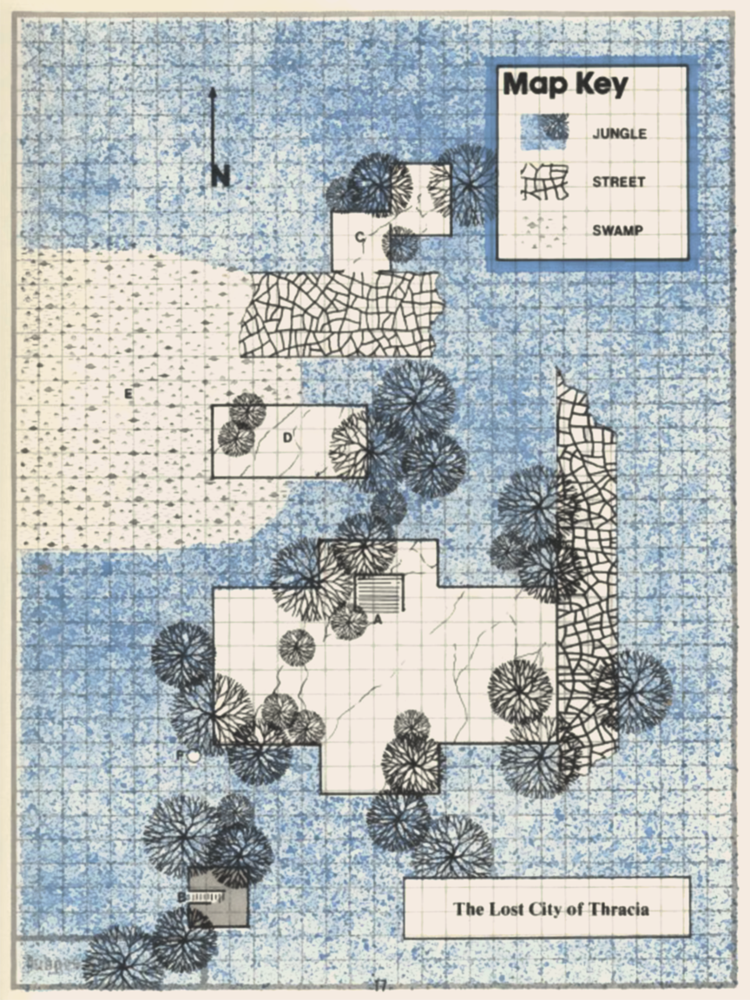

> [@JG102_The_Caverns_of_Thracia, _p._ _17_]

<!-- The Caverns of Thracia, Page 018 -->

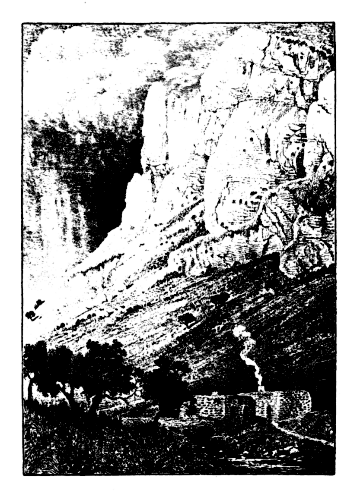

> [@JG102_The_Caverns_of_Thracia, _p._ _18_]

<!-- The Caverns of Thracia, Page 019 -->

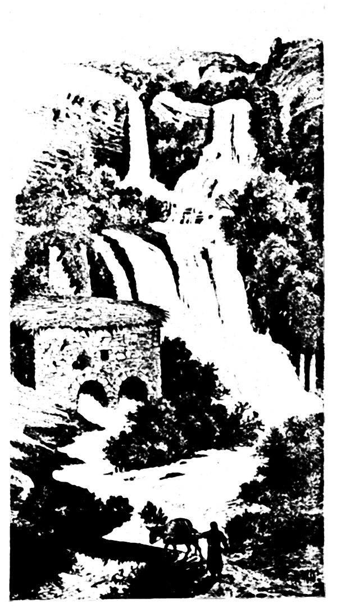

> [@JG102_The_Caverns_of_Thracia, _p._ _19_]

<!-- The Caverns of Thracia, Page 020 -->

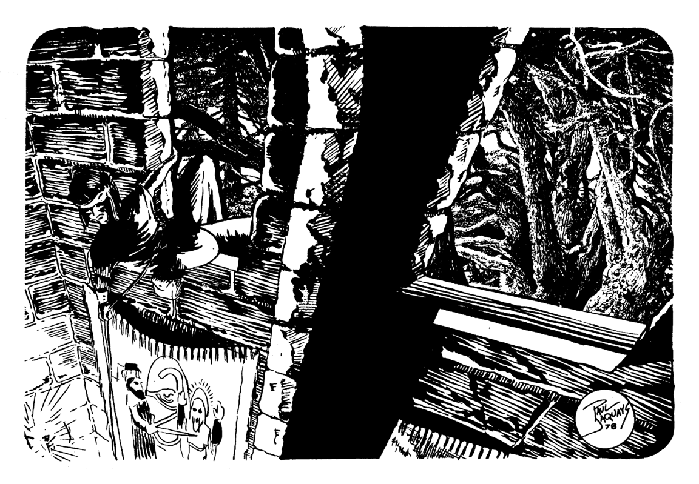

> [@JG102_The_Caverns_of_Thracia, _p._ _20_]

<!-- Begin: JG102_The_Caverns_of_Thracia_02_Caverns_Level_01_21-30 -->

<!-- The Caverns of Thracia, Page 021 -->

# Level One

> [@JG102_The_Caverns_of_Thracia, _p._ _21_]

<!-- The Caverns of Thracia, Page 022 -->

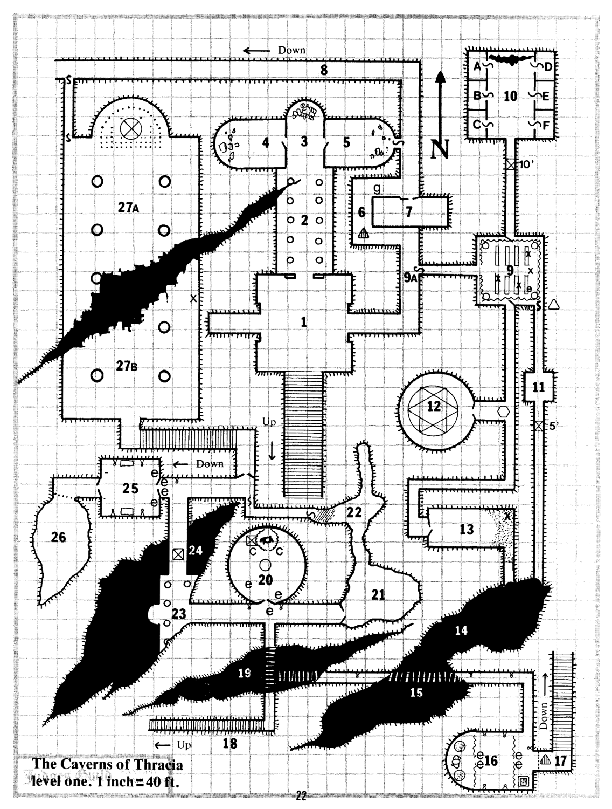

> [@JG102_The_Caverns_of_Thracia, _p._ _22_]

<!-- The Caverns of Thracia, Page 023 -->

## Level One

1\) **Entry Hall**: The stairs out of this room or down to this room lead to the surface and come out among a pile of ruins. The walls of this room appear to have been painted once in bright colors with scenes of ceremonies and worship, however now they are faded, worn, chipped and discolored with age and wear. The air in the room stinks of bat guano and hanging from the ceiling are several hundred normal bats. The ceiling, which is 30' high, is covered with them. The bats will be mildly irritated by torches but a *Light* spell will send them winging about through the air, severely agitated. The guano on the floor makes it slippery and will require a saving throw on a d20 of under the character's Dexterity +2 per turn spent running through the muck or per round spent fighting in it. Failure to make the throw indicates slipping and falling into the goo (-3 Charisma penalty).

2\) **Hall of the Bats**: This is a columned hall that has at least 6-8" of bat guano on the floor. The 20' ceiling is literally swarming with normal bats who will become agitated by the presence of light and *Light* spells or bright, directional lanterns will send the critters winging and make vision beyond 5' impossible due to their number. Running or fighting in this room will require a saving throw to be made against slippage (see Room 1 above), however, saving throws will be made at Dexterity -2.

3\) **Alcove of the Bats**: This room is exactly like Room 2 as far as bats are concerned (including saving throws). At the north end of the alcove is a pile of rubble that appears to have once been a statue of some sort. If the rubble is dug through (approximately 1 turn) the head can be found. It will be the head of the goddess Athena. The door into Room 5 is ajar and the door to Room 4 is jammed shut so that it is -1 on opening capability. If characters choose to notice, they will find that it appears that trails have been worn through the muck on the floor, leading to both Rooms 4 and 5 and into and through Rooms 2 and 1.

4\) **Centipede Chapel**: This room is not full of bat guano. It contains a pile of rubble that appears to once have been a winged, robed, female figure (imagine the statue "winged victory" in a heap). Crawling about the room are 19 centipedes, bright red in color, AC: 9, HD: 1/4, Damage: Poison (+4 saving throw), HP: 1 (x9), 2 (x10). There has been a recent struggle in the room. Several additional centipedes lie mashed on the floor (currently being hastily cleaned up by their still living fellows) and some blood has been spilled.

5\) **Lizard Men on a Hunting Foray**: 4 Lizard Men are in here, AC: 4, Move: 6", HD: 2 + 1, Damage: club for 1-8, HP: 13, 9, 16, 8 (13). Two of the Lizard Men are on guard and ready while the 3rd is seeing to the wounds of the 4th who, though he can fight, is reeling somewhat from the effects of centipede poison. (The 13 reflects the creature's actual hit points before suffering damage from the centipedes.) On the floor is a string of about 12 centipedes with their heads removed. Several are still wriggling, coiling and uncoiling. 2 centipedes have already been cracked open and the meat devoured out of them. The wounded Lizard Man will fight at -1 hit probability. Scattered about the floor are the remains of a statue that is shattered beyond any recognition. The secret door at the rear of the room is disguised to look like an ornamental panel.

6\) **Spear Trap**: As the location of the "6" is passed on the map, there is a 1-4 chance on a d6 that 2 spears will come flying out of the south wall, headed north and hit as if cast by a 7th level fighter. There is a 25% chance that the Gnoll guard, AC: 5, HD: 2, HP: 13, Weapon: Morning Star, will be dozing at point "g". If he hears approaching adventurers, he will slip into Room 7 and the Gnolls in there will have an ambush ready.

7\) **Gnoll Guardpost**: This is a guardpost occupied by 6 Gnolls (in addition to the one above) who are in the service of the Minotaur King. AC: 5, Move: 9", HD: 2, HP: 13, 14, 7, 15, 8, 10, Damage: Longbow for 1-6, and Battle Axe for 1-10. Each Gnoll has 4 SP, and 6 GP on his person.

> [@JG102_The_Caverns_of_Thracia, _p._ _23_]

<!-- The Caverns of Thracia, Page 024 -->

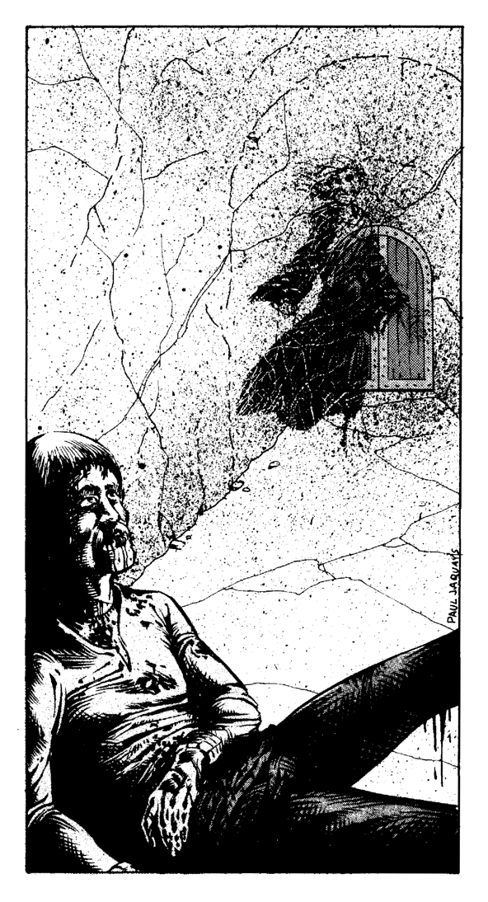

### Rooms 9A through 13

**The Incarnation of Death**

| Frequency | Very Rare (see below) |
| --- | --- |
| Number Appearing | 0-1 |
| Armor Class | -2 |
| Move | 12" |
| Hit Dice | 4 (20 Hit Points) |
| % in Lair | Nil |
| Treasure Type | Nil |
| Number of Attacks | 1 |
| Damage/Attack | Nil |
| Special Attacks | Energy Drain (see below) |
| Special Defenses | Invisibility; May only be hit by iron weapons. |
| Magic Resistance | 20%; plus immune to *Sleep*, *Charm*, and *Hold* spells. |
| Intelligence | Average |
| Alignment | Lawful Evil |
| Size | M |
| Psionic Ability | Nil |
| Attack/Defense Modes | Nil |

In this section, there will be one special wandering monster, The Incarnation of Death. This is a minor, physical manifestation of the death god, Thanatos. The creature appears as a tall, gaunt man in flowing black robes. He has a darkly beautiful face, but appears morbidly sad. He will gesture to severely wounded characters that they should step forward and embrace him.

The Incarnation of Death will only appear to characters who are within 3 Hit Points of death. If a character normally has 3 or less Hit Points, then he or she will also see the Incarnation.

The Incarnation will appear any time that a character reaches 3 or less Hit Points and will only be visible to that character. However, a *Detect Invisible* spell will also reveal the location of the creature.

The presence of the creature will lower (raise the number required to save) the saving throws and morale of all who can see it by 2 points.

Once a living being dies in the presence of the Incarnation, the creature will snatch the soul of the dead one, making any form of Resurrection or Reincarnation impossible without a *Full Wish*.

If a character, even an unwounded one, willingly embraces the Incarnation of Death, he or she will die (no saving throw) and may not be brought back to life in any way without having a *Wish* of some sort.

*Protection from Evil* will keep the Incarnation at bay (regardless of caster's level).

*Dispel Evil* or *Dispel Magic* will drive the creature away until the time that an additional living being is brought within 3 Hit Points of death.

The creature is normally invisible, but once attacked it becomes visible. It will drain one energy (life) level when it scores a hit.

> [@JG102_The_Caverns_of_Thracia, _p._ _24_]

<!-- The Caverns of Thracia, Page 025 -->

9 A\) **The Gates of Death**: This secret door leads to the ancient chapel of the god, Thanatos (death personified). The door is plastered over and can not be detected unless looked for. Once the plaster is chipped away, an inscription will be visible, written in ancient Thracian.

It states:

> "KNOW YE THAT BEYOND THIS PORTAL LIES THE DEMESNE OF THANATOS, THE CURSED, HATER OF LIFE, GOD OF DEATH. SEEK NOT TO PASS THIS GATE FOR IT LEADS ONLY TO HIS BOSOM. THOSE WHO CHERISH LIFE HAVE SEALED THESE CHAMBERS FOR AN ETERNITY. BE WARNED, THERE IS NO RETURN THROUGH THIS DOOR. ONCE PASSED, IT IS PASSED FOREVER."

Once this door is passed through, adventurers will find themselves in a 30' long hallway, 5' wide. If they look behind them, there will be no door, only hall. The hall itself is magically dark (undispellable). No torch, lantern or *Light* spell will cast more than a 5' radius of illumination. *Infravision* will be useless. Regardless of which direction the adventurers move (east or west), they will find themselves entering into Room 9 after traversing a distance of 30'. Re-entering the hall from Room 9 will still bring a character back to Room 9 after moving 30'. There is no way back to 9A from 9, at least by physical means.

9\) **The Chapel of Thanatos**: This square room is lit, dimly by 4 low incense burners, located at the room's corners. Each gives off an eerie green glow and a thin trail of sweet-smelling vapor. The vapor is a sleep inducing incense. A saving throw must be made against poison or the victim will succumb in 1-6 melee rounds after entering the room. Victim will stay asleep for 1-6 turns after incense stops burning. Standing directly over a burner and inhaling the concentrated fumes will lower the dice roll of the saving throw by 2 and cause sleep immediately upon failure to make the throw.

The walls are draped from ceiling to floor with black curtains of heavy fabric. Each individual wall is covered by a single piece of cloth. 8 black, marble benches are set in two rows from east to west. The small "x's" represent the locations of seated or kneeling, motionless figures draped in black cowled robes. The figures are long-dead human worshippers of Thanatos. Upon touch they will crumble to dust, leaving behind only a few bones, shreds of black cloth and a silver chain and skull shaped pendant with turquoise eyes (value 25 GP). There are 4 figures and 4 pendants. The "e" is another figure that looks like the others. It is a very patient wight, AC: 5, Move: 9", HD: 3, HP: 20, Damage: 1 level energy drain. If touched it will attack with surprise on a 1-2 roll of a d6. If left alone it will follow and attempt to attack from behind. The wight wears no jewelry.

The walls behind the drapes are plastered and contain frescoes depicting a dark-robed faceless being (Thanatos) reigning triumphantly over all variety of mortal creatures of all religions. Above and below the frescoes is inscribed over and over "NOTHING ESCAPES DEATH" in the ancient Thracian language.

The north door is made of stone bound with iron. It is locked. The wight has the key to the door in a belt pouch. The key has a death's head at both ends, but it is still recognizably a key.

The south door is Wizard Locked as if by a 10th level Magic User. A skull with glowing red eyes is set into the stone of the door. The skull will hiss (*Magic Mouth*) at any who attempt to open the door and say (*Magic Mouth*), "ENTER FOOLS! JOIN ME IN THE BLISS THAT IS THANATOS! BECOME ONE WITH BLESSED DEATH! IT IS IN THE FINAL END THAT FULFILLMENT LIES."

The secret door in the south wall is covered by plaster. The door is locked (again the wight's key will open it, see above). There is a 1 spear trap set to fire on a d6 roll of 1-4 directly above the door, as if fired by a 7th level fighter. The trap is triggered by inserting the key in the lock.

10\) **Crypt of the Waking Dead**: The hall leading from Room 9 to this room has a pit trap, 10' deep that opens on a 1-3 roll of a d6.

The amorphous black blob at the north end of the room is a "scarecrow" made of a large black robe draped over a statue. The statue is 20' tall. A continual magical wind blows outward from the north wall as if cast by a 10th level Magic User. Only by removing the robe from the statue can the wind be stopped or by casting a successful *Dispel Magic*. Protected flames have a 20% chance of being extinguished while all unprotected flames will be blown out immediately upon entering the room. The wind cannot be felt until the room itself is entered.

All the secret doors into Rooms 10A-F are covered by a layer of plaster. Painted over the locations of each door is a somber, human face, approximately 4' tall.

> [@JG102_The_Caverns_of_Thracia, _p._ _25_]

<!-- The Caverns of Thracia, Page 026 -->

10 A\) **Empty Crypt**: Whatever was buried in here has long since crumbled to dust. The tomb contains nothing of value.

10 B\) **The Living Dead**: 3 Skeletons wait in here. AC: 7, Move: 6", HD: 1, HP: 4 (x2), 8, Damage: 1-6. Each skeleton is dressed in shredded black robes and wears a turquoise-eyed silver skull pendant around its neck (value 25 GP each). They are weaponless.

10 C\) **More Living Dead**: 4 Skeletons in here. AC: 7, Move: 6", HD: 1, HP: 2, 3, 4 (x2), Damage: 1-6. They are dressed exactly like those in 10B.

10 D\) **Even More Living Dead**: Another 4 Skeletons guard this crypt. AC: 7, Move: 6", HD: 1, HP: 3, 4, 2 (x2), Damage: 1-6. Again they are dressed as those in Room 10B.

10 E\) **A Second Empty Crypt**: The occupant of this room disintegrated to its primal components years ago. All that remains is a pile of dust and black rags, along with a single skull pendant as described in Room 10B.

10 F\) **A Not-So-Empty Crypt**: This crypt contains 6 Skeletons in chainmail, armed with broad swords, AC: 5, HD: 1, HP: 7, 3, 5, 4 (x2), 6, Damage: 1-6. If the door to this crypt is opened, the doors to all the other crypts will spring or burst open and release any surviving occupants who will immediately begin to attack any intruders. In a locked box against the room's north wall is 200 SP, 40 GP, and a Potion of Levitation in a skull-shaped flask.

11\) **Perfectly Preserved Curate**: Placed in a state of Stasis is a 5th level Cleric of Thanatos. Macreus, 6th level Cleric of Thanatos, Align: LE, HP: 18, Armor: Chainmail, AC: 5, Weapon: Stone Mace. His regular Clerical spells include the following: *Dark* (reverse of *Light*), *Protection from Good*, *Hold Person*, *Silence 15' Radius*. Macreus was entombed here at a time 150 years after the downfall of King Agamemnos (see history) when the worship of death was not so popular. However, his followers had found a way to preserve him indefinitely and keep him alive so they could rescue him in the near future when things cooled down a bit for the death worshippers. It seems rather, that Macreus was forgotten and left in Stasis for 950 years. Macreus will speak both the language of the Thracians (see Room 37 for translation difficulties) and also the language of the ancient Thracians, being able to read and speak it fluently. He knows of the location of Level 3A and how to get to it. He knows of the sphinx. He is aware of the Room Complex No. 45 and has heard legends of Room Complex 53.

Macreus is guarded by 6 Skeletons, AC: 7, HD: 1, HP: 5, 7 (x2), 6, 8 (x2). Opening the secret door in Room 9 will break the Stasis and animate the skeletons. Around the neck of Macreus is a turquoise-eyed silver skull pendant (value 25 GP) and at his belt is a pouch containing a *Confusion* (4d8) dust that must be inhaled (10' x 10' cloud). In the south corridor is a 5' deep pit trap (roll under or equal to dexterity score on a d20 or take 1-3 points of damage). The trap springs on a d6 roll of 1-3. On the floor of the pit is a locked chest containing 800 CP, and 200 SP. There is also a strong but lightweight rope ladder (value 50 GP) that is 50' long. One end of the ladder has two stone balls attached to it that will fit into a pair of reinforced holes at the end of the corridor, which ends looking out into a cavern. The balls will hold the ladder in place.

12\) **Oracular Skulls**: The entry hall to this room is guarded by 2 crossbow traps that will hit as if shot by a 4th level fighter on a d6 roll of 1-4. They are aimed at the center of the 10' doors to Room 12. Opening the door will work to trigger the trap.

The floor of the room is set in large, red, ceramic tiles, glazed and very smooth. Inscribed on the floor in glowing green lines is a hexagram, a six-pointed star drawn within a circle. The walls and the hemisphere of the 50' high domed ceiling appear to be a night sky with constellations moving across them. The room is 10 degrees F colder than the hallway (the hall is approximately 55 degrees F).

Floating 15' off the ground in the center of the hexagram is a green, glowing, human skull with ram's horns apparently growing out from it. The skull has living eyes and will watch persons entering the room, and will chuckle ominously. Once the door closes, the skull will say, "SPEAK PETITIONER AND HAVE THY SAY, THAT I MAY ANSWER YE YEA OR NAY." The skull

> [@JG102_The_Caverns_of_Thracia, _p._ _26_]

<!-- The Caverns of Thracia, Page 027 -->

will then allow everyone present to ask one yes or no question which the referee must answer truthfully. No character may ever ask more than one question, regardless if they return again to the room. Once the question has been asked and answered, the skull will speak again and say, "YOUR QUESTIONS HAVE BEEN ANSWERED AND YE ARE NOW THANATOS' OWN." At that point, a small, white, skull-shaped blemish will appear on the back of the right hand of every character who asked a question. It actually means nothing, except as an identifying mark for a worshipper of Thanatos.

If the skull is attacked it is AC: -2, HD: 5, HP: 31, Damage: 2 *Magic Missiles* per round at up to 2 targets, Move: Fly at 24".

A final note on the skull-shaped blemish. Any character so marked will be visited by the Incarnation of Death when he or she is within 3 Hit Points of dying, regardless of where he or she may be (see The Incarnation of Death). The skull may be removed by a combination of *Remove Curse* and *Cure Serious Wounds*.

13\) **Moldy Bones**: The door to this room is bolted with a heavy stone bar from the west side. The toned area in this room represents a colony of yellow mold, AC: 9. However, out of that mold will rise 6 Skeletons, AC: 7, Move: 6", HD: 1, HP: 6, 3 (x2), 5 (x2), 4, Damage: 1-6. The skeletons appear fuzzy because they are coated with a growth of yellow mold. Striking them will have a 50% chance of releasing a 5' x 5' x 5' cloud of spores. There is an additional 30% chance that instead of releasing the small spore cloud that it will release all its spores at once in a 10' x 10' x 10' cloud. Each skeleton is good for two small clouds or one big cloud of spores. Holy Water will not affect the skeletons until the mold on them is removed.

In a stone box (location marked by the "x") is 200 SP, 40 GP and a Wand that looks like a miniature, skull-headed, obsidian Wand of the demon prince Orcus (value 150 GP). It has a magic value in the hands of an evil character. It will allow them to Control Undead as per a Cleric of Thanatos of the same level as themselves (see Designer's Comments).

The hall to the south leads to a cavern and a 50' drop. Note: both this opening and the opening to Room 11 are disguised by walls of *Permanent Illusion* and are visible (normally) from either below or the rope bridge (15).

14\) **Upper Reaches**: This is the upper part of the caverns that are mapped on Level 2. From the level of the rope bridge, they descend 50' to the floor below and rise from 10' to 40' upwards. Various stalactites hang from the ceilings. Among the stalactites are a group of 20 huge bats, AC: 4, HD: 1/2, HP: Roll as necessary, Damage: 1-3 (bite), Move: 24". These creatures have a wingspread of approximately 5'. Torches and normal lanterns moving across the rope bridge will dislodge 1-2 of them. *Light* spells and bullseye lanterns pointed in their direction will dislodge all 20. If the bats score a hit against a character on the rope bridge, that character must roll less than or equal to his Dexterity +2 on a d20. Only one roll is made. Multiple hits will lower the score needed by 2 per hit. Falling will do 5d6 of damage.

15\) **The Rope Bridge**: This is a 40' long bridge of fairly recent construction made of strong hemp ropes woven and tied around closely set planks of wood. At waist height there is a rope hand rail on both sides. The bridge is firmly attached at both ends. It would be the work of but one or two sword chops to effectively sever the bridge, AC: 8, HP: 5 points of damage to each of the two supporting strands. Due to the dampness of the air, the rope bridge will not readily burn unless first liberally doused with oil (3-4 flasks).

16\) **Sanctuary of the Dark One**: This is a worship hall devoted to Thanatos, but under his recent name of "The Dark One". The chapel is about a century old and is used by the local tribesmen. The room is divided into three parts. The easternmost part contains a ritual purification basin and two guards (described later). The central section is the worship chamber. The westernmost section is the location of a statue of the deity and a pair of iron braziers. This section may only be entered by a Cleric of Thanatos.

Each section is partitioned from the other by a ceiling to floor drapes of heavy black material. Each drape is made of two pieces. The central and eastern section are lit by torches while the statuary nook is lit by the braziers. The 4 "e's" are 4 2nd level fighting men, Align: N, Platemail, AC: 3, Weapons: Spear and Broadsword, HP: 14, 10, 16, 19.

> [@JG102_The_Caverns_of_Thracia, _p._ _27_]

<!-- The Caverns of Thracia, Page 028 -->

Entry into the statuary nook will result in a curse being cast on all intruders (reverse of *Remove Curse* as if cast by a 12th level Cleric). Only Clerics of Thanatos may safely pass through. The statue is an 8' tall wooden carving of a humanoid in black robes with a skull face. Each eye of the statue is a 200 GP turquoise. Any attempt to liberate these gems will cause the flames in the braziers to explode for 1d8 of damage to all within a 5' radius and to set the nearest curtains on fire. Due to the drying of the braziers, these curtains are tinder dry.

17\) **Bars, Visions, Spears and Slides**: The entrance to this area is blocked off by iron bars. They are somewhat rusty. They will bend on a d20 roll of under a character's strength score -10.

To any who fail a saving throw vs magic, it will appear that a comely Dryad is trying to break free from the bars. She seems to be in fear of something and will retreat and cower against the east wall of Room 17.

Once the bars are passed, a spear trap will fire on a 1-2 roll of a d6. Two spears will be fired as if by a 4th level fighter, for 2-12 points of damage.

The stairs go down to Level 2. There is a 30% chance that when any weight is placed upon the stairs they will form into a slick 45 degree angle slide. Every 5' moved down the stairs adds another 5% to the chance of the stairs becoming a slide. This should be checked every 5'. The odds are that a character will possibly be dumped into the river.

18\) **Stairs to the Surface**: This set of stairs goes up to the ruins above. It is the access route of the priests of "The Dark One" when they come to perform their semi-monthly ceremonies here in the holy of holies. Any artificial light coming down this stair will be visible to the guard ("e") posted in front of Room 20. He will then blow a high pitched magical whistle that only the servants of "The Dark One" can hear, thus allowing them to prepare ambushes. This whistle can be heard in Rooms 14 through 26.

19\) **A Second Rope Bridge**: This is an approximately 25' long, "T" shaped bridge of fairly recent construction made of strong hemp ropes woven and tied around closely set planks of wood. At waist height, there is a rope hand rail on both sides. The bridge is firmly attached at both ends. The cords attaching the bridge to the rock are AC: 8, HP: 5 for each cord (2). Due to the dampness in the air, the rope will not readily burn unless first liberally doused with oil (4-5 flasks).

Hanging amongst the stalactites are 5 huge bats, AC: 4, HD: 1/2, HP: 3 (x2), 1, 4 (x2), Damage: bite for 1-3, Move: 24". These creatures have a wingspread of approximately 5'. Torches and normal lanterns moving along the rope bridge will dislodge 1-2 of them. *Light* spells and directional lanterns, if pointed in their direction, will dislodge all 5. If the bats score a hit against a character on the rope bridge, that character must roll less than or equal to his dexterity +2 on a d20. Only one roll is made. Multiple hits will lower the score needed to be under by 2 points per hit. Falling will do 5d6 of damage.

Light moving along this bridge will alert the guard posted at the door to Room 20. See Room 18 above for consequences.

20\) **Ritual Hall of Purification**: Posted outside of this room is a 2nd level fighter ("e"), Align: N, Platemail, AC: 3, Weapon: Spear and Broadsword, HP: 15. He has a magical whistle made of bronze that he will blow when intruders are spotted. This whistle will alert all fighters and servants of "The Dark One" in Rooms 14 through 26, who will then prepare ambushes. If the characters have been "branded" by Thanatos in Room 12, they too will be able to hear the whistle.

The room is a purification chamber where the priests of "The Dark One" ceremonial clean themselves before entering into any holy rites. The circle in the room's center is a 5' diameter basin that sets on a 3' tall pillar of skulls. At the north end of the room is a 10' diameter column of black drapery that hangs from the ceiling 20' overhead to the floor. If the two sections of drapes are pulled back all characters viewing the black statue behind it must save vs. paralyzation or be paralyzed for 1-6 turns (not rounds). Worshippers of Thanatos (and those wearing his brand) are immune. The two "c's" flanking the statue are a pair of adepts in the service of "The Dark One", 2nd level Clerics, Align: LE, Leather Armor and Shield, AC: 6, Damage: Mace for 1-6, HP: 7, 8, spells: *Cure Light Wounds* (reverse). The 2 "e's" in the room are a pair of fighters in the service of the god. 2nd level fighters, Align: N, Platemail, AC: 3, Weapons: Spear for 1-6, and Broadsword for 1-8, HP: 13, 14. The eyes of the statue are a pair of matched citrines worth 150 GP each.

> [@JG102_The_Caverns_of_Thracia, _p._ _28_]

<!-- The Caverns of Thracia, Page 029 -->

21\) **Outer Lair of the Wolverine**: This rough-carved room reeks of animal waste and a skunk-like odor. Any noise, movement, breathing, etc, in here will bring the giant wolverine, AC: 4, HD: 4 + 4, 3 attacks 2-5/2-5/2-8, + musk as per a skunk at rear opponents, HP: 26. The creature also attacks with a +4 hit probability.

Lying about the floor in this room are various Weapons (1 Broadsword, 3 Spears, a Light Crossbow and 10 Quarrels, a Hand Axe, and 2 Daggers), a Helmet (full head, closed) and two or three pieces of Platemail similar to that worn by the guards in Rooms 20 and 16. All the equipment is drenched in wolverine musk and is unusable until well washed and/or aired out for several days.

22\) **The Lair of the Giant Wolverine**: This rough-carved chamber reeks so badly that any character entering it must make a saving throw vs. nausea (roll under constitution on a d20) or lose half his or her strength for 1-6 turns, effect immediate. The wolverine (see Room 21) will normally (95%) be in this chamber. There is absolutely nothing of value in here (unless one likes garbage, bones and wolverine stench). The concealed door in the west wall is quite visible if the huge pile of garbage (shaded area) is dug away.

23\) **The Sacrificial Altar of The Dark One**: There is a 06% chance that a sacrificial ceremony will be going on here. If so, the following personae will be present: an 8th level Patriarch of "The Dark One", Align: LE, Armor: Chainmail, AC: 5, Weapon: Hammer, HP: 36, spells: *Protection from Good*, *Cause Light Wounds*, *Hold Person*, *Silence 15' Radius*, *Cure Serious Wounds*, *Sticks to Snakes*, *Dispel Good*, *Animate Dead*, *Speak with Dead*, *Finger of Death* (see Gods and Worshippers); two 4th level Vicars of "The Dark One", Align: LE, Armor: Leather, AC: 7, Weapon: Hammer, HP: 15, 20, spells: *Cure Light Wounds* (x2), *Hold Person*. Also in attendance are 10 various 0 level types of various ages and sexes who are serving as witnesses, trainees, body servants, etc. (level 0 characters attack as level 1/2 hit die creatures). Roll hit points (1-4) as needed for the 0 levels.

Guarding the ceremony will be an additional 8 fighters in Platemail, 1st level fighters, Align: N, Armor: Platemail, AC: 3, Weapon: Spear and Broadsword, HP: 3 (x2), 8 (x3), 6 (x2), 7. In addition there will be three bound victims who are about to be pushed into the abyss. The victims are naked. Two 0 level young women and a 1st level Elven fighter, HP: 7 (roll stats if necessary).

If there is no sacrificial ceremony in progress there will be 10 huge bats, AC: 4, HD: 1/2, HP: 4 (x3), 1 (x3), 2, 3 (x3), bite for 1-3, Move: 24". Any light in this area will disturb all the bats and they will attack anything that ventures past the pillars and out onto the bridge (24). Any fall from this area into the caverns below will do 5d6 of damage.

24\) **Trapdoor**: This is a trap that will open on a d6 roll of 1-4 and then remain open until pulled shut again. It will drop victims to the pool below the rapids on the 2nd level (Room 31). The bridge is made of mortared stone.

25\) **Vault of the Ceremonial Treasures**: This is the storage place of the cult of "The Dark One"'s holy relics, ceremonial trappings and other things of cultic and worldly value. The 4 "e's", in and outside of the room represent 2nd level fighters that are guarding the loot, Align: N, Armor: Platemail, AC: 3, Weapons: Spear for 1-6, Broadsword for 1-8, HP: 11, 12, 10, 8, 16, 13. If it appears that the fighting ability of the guards is near equal to any invaders, then the north west guard will pull a lever that will release the 1 black bear from Room 26 (see Room 26 for statistics) who will then join the fracas in 1 round, attacking anything not in the distinctive platemail of the guards.

The room is lit by four torches that flank chests on the north and south walls. Each chest is locked and has a Curse (as per the reverse of *Remove Curse*) that has an 8 turn duration. The Curse will unfailingly lower the strength of any non-Clerics of "The Dark One" who touch it to 3. This curse will apply only to the 1st character to actually physically touch either of the boxes or their contents, including touching with weapons or lock picks. The north box is empty except that a cloud of sleep gas will be released into the room (save vs. poison) which will put characters not saving to sleep for the number of turns equal to their constitution subtracted from 20. The south box contains the following: a jeweled Mace valued at 200 GP, an Iron Box containing 100 GP, a Leather Bag with five 10 GP Gems, a 200 GP Gem, and a 150 GP Gem. There is also a skull-shaped silver goblet set with gem chips valued at 50 GP and Platinum Box, intricately carved with ancient runes valued at 250 GP (the runes merely state that this box was crafted for his high excellence the King of

> [@JG102_The_Caverns_of_Thracia, _p._ _29_]

<!-- The Caverns of Thracia, Page 030 -->

Thracia, Argos II). Inside the platinum box is a pair of glass beads that appear to be exact replicas of human eyes. If a character loses one or both of his or her eyes, they can be replaced with these magic eyes which will grant *Infravision* and on a 2 times per day basis, X-ray Vision.

26\) **The Bear Lair**: In this rough-carved room resides a black bear, AC: 7, HD: 3 + 3, Damage: 1-3/1-3/1-6, Hugs for 2-8, HP: 24. This bear will attack any characters not in the guards' distinctive Platemail. The bars to its cave are raised and lowered by a lever in Room 25.

27 A\) **Jets of Flame**: This is the northern half of an immense hall that appears to have been cleft in half by a deep chasm that extends into the walls both east and west. Any character being so unlucky as to fall into this chasm will take 8d6 of damage as they fall 80'. There is a 10% chance that the floor within 1' of the edge will crumble away when weight is placed upon it. It will then require a saving throw on a d20 of under the character's Dexterity -2 to keep from falling in. The secret door in the north wall is disguised in the ornate panel work and can normally be discovered only on a roll of 1 on a d6. The room reeks of decaying flesh.

Passing between the two northernmost pillars will effect the following: A melee round later, flame will come spouting out of holes in the floor of the half circle area to the north (the holes are marked by dots on the map). Any character standing over these holes will take 1d6 of fire damage and any items on their person must save against normal fire. Any character remaining over a fire-spout will continue to take 1d6 of damage per round. After 3 rounds of flame (which leaves no smoke since it results from burning gas), a statue of a demon will appear to rise up out of the flames, all the while *Magic Mouth* spells set up a horrible, evil laughing. Flames pour out of the statue's mouth and its eyes glitter and sparkle for they are each a 300 GP gem. After 1-6 melee rounds the statue will begin to sink on its platform down to Room 53 on Level 2. After the head of the statue passes the floor level, 2' thick stone panels will seal the shaft closed and the fires will suddenly die out. The walls of the shaft itself are constructed of a slick, oily textured stone. The statue will work but once per week (it takes that long for the gas to recollect).

27 B\) **The Burial Crypt of the Cult of the Dark One**: The reek of decaying flesh permeates the air here and in 27A. For a further description of this room see above (27A). Lying in ordered rows are rank upon rank of corpses. Most are long decayed and in skeletal form, but many are still fairly fresh, not having been dead more than a few weeks (if you can call that fresh!). Lurking about and feeding on the cadavers is 1 carrion crawler, AC: 3, Move: 12", HD: 3 + 1, Damage: paralysis, 8 attacks, HP: 17. There is a 20% chance that the crawler will be hanging in the chasm. In one of the corpses is a clutch of 20 carrion crawler eggs.

If the southernmost pair of columns is approached within 5' or if the columns are passed between or to either side, 1-4 skeletons will animate and begin to attack intruders. Each additional melee round 1-4 more skeletons will animate as long as there are living intruders to fight, up to a total of 400 skeletons. Skeletons, AC: 7, Move: 12", HD: 1, Damage: 1-6, HP: 3.

The "x" along the east wall represents a locked, stone chest. The chest is guarded by a magic trap that will do 2-12 points of electric damage to the first character to physically touch the box. The box contains personal possessions and valuables of the local patriarch of "The Dark One". Inside the chest is the following: a map that shows every room and secret passage in the holy of holies area of "The Dark One" (Rooms 14 through 27); a wooden box containing two 50 GP gems, a scroll written in ancient Thracian that tells of the sealed crypt of "The Dark One" (Rooms 9A through 13); and a begemmed statue of Athena, stolen from the palace of the Minotaur King long since, valued at 400 GP. The scroll that hints of the location of the crypt of Thanatos reads as follows:

> "Dark God, Death's Head,
> Sealed Forever in Ceaseless Mourning.
> Captive and Kept From Service to Man,
> Lost to Man is the Oracle Wise."

> [@JG102_The_Caverns_of_Thracia, _p._ _30_]

<!-- Begin: JG102_The_Caverns_of_Thracia_03_Caverns_Level_02_31-54 -->

<!-- The Caverns of Thracia, Page 031 -->

# Level Two

> [@JG102_The_Caverns_of_Thracia, _p._ _31_]

<!-- The Caverns of Thracia, Page 032 -->

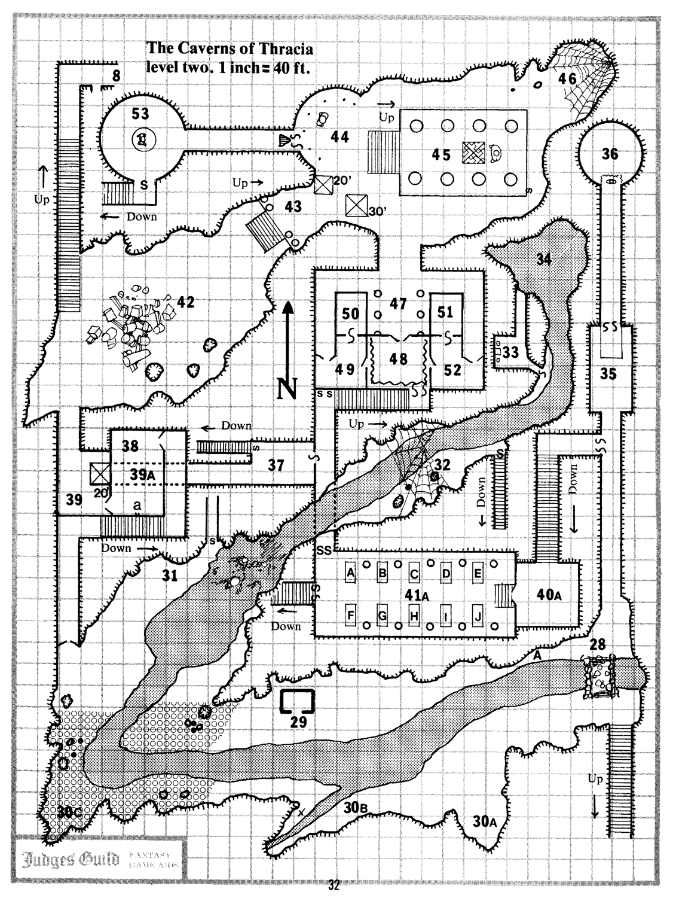

> [@JG102_The_Caverns_of_Thracia, _p._ _32_]

<!-- The Caverns of Thracia, Page 033 -->

## Level Two

28\) **Bridge of the Giant Gnome**: Sitting on the stone bridge is what appears to be a small giant. Instead it is a giant Gnome named Grastic Hammerclay, AC: 6, HD: 5, Move: 12”, Damage: 1 - 10, Weapon: Club and Spear, HP: 26. Hammerclay is a freak and was driven from his people years ago. He is severely disturbed and intensely paranoid. He is referred to by the Tribesmen (the worshippers of The Dark One) as “The Old Man of the Bridge”. The Gnome survives on snared Stirges and crayfish. He would really appreciate being given some real food and would let a party of adventurers pass by him unscathed for a weeks worth of rations. If attacked he can also function as a 4th level Illusionist (see *Strategic Review*, Vol. 1, No. 4) using the following spells: *Phantasmal Forces, Hypnotism,* and *Hypnotic Pattern*. In a sack near the wall the Gnome giant has 89 GP, 68 SP, 221 CP, a small gem worth 30 GP, and a large, rusty iron key (see below). He is willing to trade some of his “pretties” for more food. If wounded more than 50%, the Gnome will fling himself into the river and hide under the bridge. If his location is investigated he will whimper out “Go away!” “Leave me alone.” or “Everybody hates me.” The large, rusty, iron key in Grastic’s treasure bag is actually a master key to the cell doors in Rooms 103, 104 and Room 105 A, B, and C.

The passageway leading to the north out of this area is smoothly carved and the floor is inlaid with polished marble tiles.

28 A\) **Slippery Edge**: This is a narrow ledge leading along the river’s edge. At the location of the “A” the floor is extremely slippery, due to water flowing down and across the ledge. If special precautions are not taken, such as roping characters together or driving spikes into the walls, it is possible that the unlucky may plunge into the dark river. Each character passing over the slippery point must roll under their Dexterity -3 on a d20 or fall in the river. Note: On a roll of 20, even special precautions will not prevent falling in. The river is 15 feet deep and has a current of 10 feet per second. Under the surface of the water are jagged rocks and boulders. If characters do fall in, they will be swept downstream to fetch up against a rocky ledge. The trip downstream will inflict 1d8 of damage unless the character can roll under his Dexterity on a d20. If the roll is made only 1d4 of damage will occur. Slipping into the water but being held by rope will only inflict 1 point of damage on a roll of 1 or 2 on 1d6.

29\) **Dead Halflings**: This is a run down cottage, constructed of fieldstone and roofed with straw thatch, now moldy and rotting in the high humidity. The floor of the cavern at this point is deeply covered with sand. Thrust into the sand in front of the cottage is a crude Spear. Mounted on the protruding shaft of the Spear is the clean skull of a Lizard Man. Various arcane, but crude symbols are painted on the brow of the skull. It is obviously a warning of some kind. To the Lizard Men who dwell throughout the caverns, this place is taboo. If they discover that it has been tampered with or entered, look out! It’s holy war with every Lizard Man fighting at a +1 hit probability to the death (they think it is some how connected with their ancestors). Inside the cottage (which is slightly ransacked and contains evidence that the worshippers of Thanatos were responsible), is a cot and a table and chair. On the cot is the dessicated corpse of a Halfling in long, tattered robes. Lying on the chest of the skeleton is an open scroll. The scroll (written in ancient Thracian, incomprehensible without *Read Languages* spell, and only a 30% chance of being read by any character with a natural read languages ability), tells of the wonders of King Agamemno’s palace and the wonderful gardens that surround it deep within the earth. Various passages will refer to the “Beast Men” who serve the King and of the living trees. On the table is a wax candle that once lit, will act as a *Continual Light* spell until extinguished. It may only be re-lit 6 times. A gust of wind has a 10% chance of dousing the light. Around the neck of the corpse is a fish-shaped silver medallion (value 69 GP) that if taken from the cottage will attract 1 - 3 berserk Lizard Men each round on a d6 roll of 4 - 6. AC: 5, HD: 2+1, Move: 6/12, Damage: 1 - 2/1 - 2/1 - 8, HP: Roll as necessary.

30 A\) **Stirge Strike**: This area is a natural indentation into the cavern wall. Possibly at some distant time in the past a tributary to the main river may have flowed from this point. Now, however, the niche is occupied by the shards and fragments of several ornate columns and a shattered statue to some now indistinguishable god. Any in-depth search of the area will reveal scattered, half-buried human bones and 1 or 2 weapons (a heavily tarnished and dull Bronze Sword and a Stone Mace). It is doubtful

> [@JG102_The_Caverns_of_Thracia, _p._ _33_]

<!-- The Caverns of Thracia, Page 034 -->

that this search will be made since the niche is also the dwelling place of a colony of 10 Stirges, AC: 7, Move: 18”, HD: 1, Damage: 1 - 3 + Blood Drain of 1 - 4 points each round thereafter up to a maximum of 12 points, HP: 2 (x2), 6, 7 (x2), 8, 4, 1, 5, 3. The Stirges will be well hidden in the rock formations, giving them a 1 - 4 chance on a d6 of surprising the unwary.

30 B\) **Shallow Stream**: This is a shallow flow of water coming out of the rock wall. It is approximately 5’ wide but only inches deep. Lying about the stream are the long-dead bodies of 3 Tribesmen. One appears to have been crushed to death. Strewn about them are 2 Spears and a Shield. In a pouch on the crushed man’s body is a soft leather cloth containing four 20 GP turquoise gem stones folded carefully in it. One of the other dead men has a Bronze Dagger with a magic looking rune carved on it (a good luck charm and nothing else). The small “x” located on the west bank of the streamlet marks the location of a Piercer, AC: 3, Move: 1”, HD: 2, Damage: 2 - 12, HP: 11. It will drop from the ceiling on any creature passing below it. The Piercer appears as a 3’ long stalactite. It is assisted by a pair of Stirges, AC: 7, Move: 18”, HD: 1, Damage: 1 - 3 + Blood Drain of 1 - 4 points up to 12 each round thereafter, HP: 1, 5. Again, the Stirges are well hidden, allowing them to attack with surprise on a d6 roll of 1 - 4.

30 C\) **Lair of the Falling Stalactites**: You will not find the circle pattern in this area on the map key. It indicates the possible locations for a group of Piercers. The black dots mark the location of 4 of the creatures. The remaining 7 should be randomly located by the referee and marked upon the map as to size and placement. 11 Piercers, AC: 3, Move: 1”, HD: 1 to 4, Damage: Variable (see below), HP: (by size of hit dice with damage following), 1 HD: 5 (x3), Damage: 1 - 6; 3 HD: 6, 18 (x2), 8, 12, Damage: 3 - 18; 4 HD: 21 (x2), Damage: 4 - 24. Location of Piercers as marked on map: West Bank: 1 HD and 3 HD; East Bank: 1 HD and 4 HD. The Lizard Men usually pass through this area in the water and avoid any problems with the hanging menaces.

31\) **The Lizard Encampment**: The west bank of the cavern at this point is the lair of a small tribe of Lizard Men, numbering 15 (there are other members of this tribe but they are not present and are elsewhere in the caverns). This tribe owes it fealty to the Minotaur King. They are presided over by a religious leader, a Shaman, who operates as a 4th level Cleric. He can whip the Lizard Men up to a battle-frenzy (60% chance) giving the creatures +1 hit probability. If he is killed, the Lizard Men will either (1 - 25%) run in terror, (26 - 60%) continue to fight normally, (61 - 85%) continue to fight in battle frenzy at +1 hit probability, or (86 - 00%) go into berserker rage that will cause them to fight at +2 hit probability and damage and also add half again the number of their hit points to their total since they are fighting

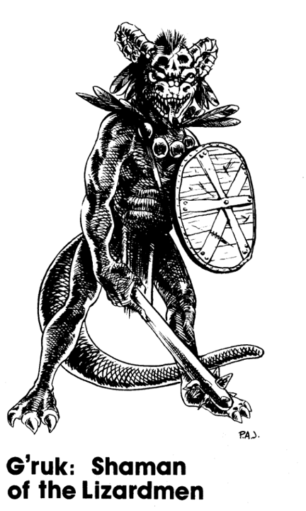

**G’ruk: Shaman of the Lizardmen**

> [@JG102_The_Caverns_of_Thracia, _p._ _34_]

<!-- The Caverns of Thracia, Page 035 -->

without regards to pain (lowers AC by 3 when fighting as berserker). **Lizard Shaman (G’ruk the Fish-finder)**, AC: 4, Armor: Skin and Shield, Move 6”/12” (swimming), HD: 4, Damage: Mace 1 - 8, spells: *Cause Light Wounds, Cause Fear, Hold Person*. On his person the Shaman has a satchel that contains a Potion of Undead Control, 18 GP, 4 Sacred Rocks (useless), a mummified Human Hand, 6 Teeth of various Creatures, 4 Bags of various Powders (1 is alum, 2 and 3 are useless, 4 is a poison dust that is -1 on saving throw. Failure to save means death while a save indicates taking 1 - 8 points of damage. This is very virulent poison! It may be inhaled since the full bag of dust will form a 10’ x 10’ x 10’ cloud, mixed with water and taken internally for up to 5 dosages or smeared on weapons as a paste, 2 applications), a Set of 20 Divining Sticks, 5 or 6 Strips of dried Human Flesh and a Human Jawbone. As a last resort, the Shaman will cast the poison dust as a missile weapon creating a cloud of dust (see above) when it hits. There is a 10% chance that the bag will not burst on impact. The magic potion was obtained from the treasure trove in Room 33. About 5 Lizard Braves died obtaining this bottle. Since then the Shaman has learned of the legend that requires human blood to obtain the treasure. “Cast the blood of man upon the troubled waters.” (False) is how the phrase goes. The Shaman has been waiting for a living human to come his way for some time (the Lizard Men usually only bring back pieces). G’ruk knows of a secret door in the north wall and has a secret Lair in Room 53 H.

The composition of the rest of the Lizard Band will be as follows: 5 mercenary warriors on leave from the Minotaur’s guard, AC: 4, Armor: Skin and Shield, Move: 6”/12” (swimming), HD: 2 + 1, Weapons: Club, Damage: 1 - 8, 4 Darts, Damage: 1 - 4, HP: 12, 8, 15 (x2), 14. These Lizard Men will not turn and run if the Shaman is killed, as they are trained for battle. The 12 hit point Lizard Man has a key to the north door. If any of the humans are captured, there is a 10% chance that one of these Lizard Men will suggest taking one or more captives to the palace of the Minotaur King.

The remaining 9 Lizard Men will be mixed male and female (no difference in statistics), AC: 5, Move: 6”/12” (swimming), HD: 2 + 1, Weapon: claw/claw/bite, Damage: 1 - 3/1 - 3/1 - 8. These are standard issue savage Lizard Men without weapons or extra armor. When encountered for the first time they will be devouring the corpses of several dismembered Tribesmen. There will be 1 - 4 Lizard Men in the water who will be invisible to anyone not looking for them. These Lizard Men will wait until an opportune moment to attack.

The doors to the passage leading north are of heavy oak, covered with moss and bound with weathered bronze. The doors are locked and one of the Lizard mercenaries (see above) has the key.

32\) **Spiderweb (And Spider!)**: At this point in the cavern (see map), passage is blocked by an immense spiderweb that is connected to all the walls, ceiling and floor. So dense is it woven that it would take a full turn of chopping to create a single, mansized passage through it. The web will also snare any item floating on the surface of the river. Any creature with 18 or greater strength can break free, if entrapped, in 1 melee round, a 17 strength requires 2 melee rounds, etc. Hidden in a shadowy niche in the cavern ceiling is the giant spider, AC: 4, Move: 3”/12” (in web), HD: 4 + 4, Weapon: Bite, Damage: 2 - 8 + poison, save or die. Near the spider and visible from the cavern floor is a large leathery sack of spider silk containing her foul offspring. Unless cut open, there is a 05% chance that the egg sack will burst open, unleashing a torrent of mouse and rat-sized baby spiders. Most of the youngsters will busy themselves with eating each other, but 10 - 100 will attack something else, adventurers most likely. Each baby spider has 1 - 2 hit points and is AC: 7. They will attack viciously as 1 - 1 hit die creatures and do 1 point of damage + inject a small dose of poison. Each time a character is bitten by one of these little creatures, a save vs. poison must be made. However, due to their small size, the character may take half his constitution and subtract it from the number needed to save. He then must roll over that number or die (probably from an allergic reaction). Each additional time that a character is bitten, the roll must be made, except that the number needed to save increases by one point each time and may even become greater than the original base number if a character is bitten and saves often enough.

One may well ask what a giant spider’s lair is doing so close to the lair of the Lizard Men. Well, it’s more a case of mutual toleration than anything else. The Lizard Men feed the spider an occasional living Tribesman, and the spider lets them pass beneath her web without interference.

> [@JG102_The_Caverns_of_Thracia, _p._ _35_]

<!-- The Caverns of Thracia, Page 036 -->

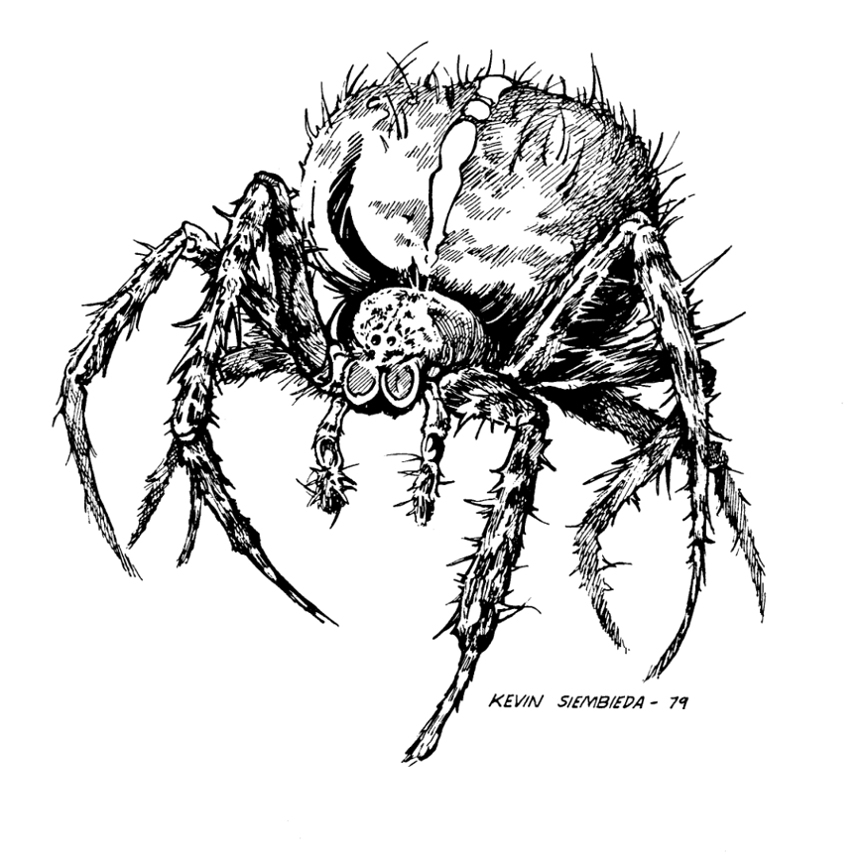

> [@JG102_The_Caverns_of_Thracia, _p._ _36_]

<!-- The Caverns of Thracia, Page 037 -->

33 \) **A Seemingly Abandoned Treasure Vault**: This is a dark little vault carved into the stone. The walls are painted with images of huge fanged mouths. It appears that the vault has been entered recently and the dust that has settled on the floor over the ages has been disturbed. There are dark stains along the floor in the hall leading to the north out of the room. The north hall is also slightly damp. The constant gurgling of water can be heard from Room 34. In the vault itself are 3 boxes, 1 large and 2 small. The small box on the right of the large box is open and empty (both small boxes are approximately the same size as shoe boxes). The small box on the left and the large box are both locked and sealed with wax seals. In the small box is a Potion of Invisibility and a +1 Dagger with a solid Garnet hilt and an apparent jewelry value of 1200 GP. The box is protected or more correctly “haunted” by a spectral, disembodied mouthful of sharp teeth. The mouth will bite any hand that is thrust into the box (it is invisible) and then appear for 3 melee rounds, darting in and about biting at will. If not destroyed in the initial encounter the creature will disappear, to reappear 5 - 10 rounds later. It will gain 4 hit points each time it disappears and instead of biting for 1 - 4 points of damage it will bite for 1 - 6. Then, when it appears a third time (with an additional 4 hit points), it will bite for 1 - 8 points of damage and so on. It will continue to attack in this fashion (appearing every 5 - 10 turns and attacking for 1 - 3 melee rounds, then disappearing for another 5 - 10 rounds) until it is destroyed or the treasure it was guarding is discarded.

**Disembodied Mouth**: AC: 0, Move: 24, HD: Variable, but starts at 3, then goes up 1 each time it reappears, Weapon: Bite, Damage: Variable, starts at 1 - 4, but each time it reappears it goes to the next larger dice size. Once d20 is reached the next attack will be at 1d20 + 1d4, and so on, HP: Variable, but starts at 8 hit points and goes up by 4 hit points each time it reappears.

The Disembodied Mouth is an enchanted creature and may be defended against with *Protection from Evil*. A *Dispel Magic* spell will destroy it, however, it is allowed a saving throw. It can not be charmed or slept. The creature will attack the first time for three melee rounds and then disappear for 5 - 10 turns, reappearing and attacking for 1 - 3 melee rounds then disappear again and so on. If not destroyed soon, it gets very nasty, very quickly.

The large box is protected in a similar fashion to the small box on its left. It contains a disembodied mouth which will attack in exactly the same fashion as the one in the smaller container. The large box is approximately 3’ square and 2’ tall. It contains 10 bags with 100 GP each (1000 GP total), a +1 Shield that is decorated with a silver and platinum tracery and studded with 70 carnelians. It has an apparent jewelry value of 170 GP. However this will be reduced by 100 GP each time it is used in melee. There is a non-intelligent +1 Sword and Sheath; a 50 GP silver Mirror; a 900 GP iron Axe, studded with green glass and jade; a 140 GP gold Brooch; and a 100 GP Anklet of solid obsidian with intricate designs inlaid into it in an unknown alloy and electrum.

At this point, most adventurers are ready to relax, having obtained the treasure, however, they have not yet tangled with the real guardian beast (see Room 34). 2 - 7 melee rounds after the large chest is opened, 1 - 2 armored tentacles will come snaking in through the north corridor and begin to attack.

34 \) **Great Grasping Guardians**: Usually dormant, this creature lies beneath the bubbling waters which are the source of the river. If the treasure in Room 33 is disturbed (see above) then it will begin to attack by sending **The Guardian Beast**, AC: 3, Move: 18”, HD: 6, Weapon: Tentacles, Damage: 1 - 8, HP: See Below. The guardian is a variation on the octopus theme. The creature has 6 tentacles, all armored and 50’ long. The body of the beast takes 30 hit points and each tentacle takes 20. Tentacles hits may be regenerated at a rate of 3 points per turn if the wounded appendage is withdrawn from combat. Hits to the body can not be regenerated. A single blow of 10+ points of damage will sever that tentacle entirely and it will be immediately withdrawn from melee and will not be used for at least 15 rounds. When a tentacle has taken 20 points of damage it will be automatically withdrawn from the fracas. The body of the creature is always submerged beneath the water. It sees by using the eyes on the ends of its appendages. Blinking an eye does not blind that appendage, but blinding all eyes will functionally blind the beast. The creature attacks by using its crushing tentacles to wrap around victims and crush them to death. Once a victim is latched onto the creature gains an automatic hit of 1 - 8 on subsequent rounds until the victim is freed by destroying the tentacle. To complicate matters, the victim will be dragged at a rate of 20’ per round toward the water. A victim may survive underwater without breathing a number of melee rounds equal to his constitution divided by 4 (drop fractions). At that point he or she suffers death by drowning. Also remember

> [@JG102_The_Caverns_of_Thracia, _p._ _37_]

<!-- The Caverns of Thracia, Page 038 -->

that non-magical armor is incredibly heavy in the water. There is a 50% chance that a victim entrapped by the guardian beast will have his Sword or weapon arm impaired and will be unable to escape unaided. If the creature is slain, it will rise to the surface and slowly float downstream to be trapped in the spider’s web (if it still exists). The creature has a single eye that is formed of a huge jelly-like gem stone that will dry and harden and shrink into a 3000 GP diamond.

The bubbling pool that is the source of the river is very, very deep. The water rises up through a pipe or shaft that extends far into the depths of the earth. It can not be traversed by swimming. Up through it, come the escape pods from Level 3 (see Room 117).

35 \) **Hall of the Sphinx**: The hall leading north between area 28 and Room 35 has an inlaid marble floor of pearly gray stone. The walls are constructed of panels of marble. Each panel is 5’ wide and 15’ tall. In the center of each panel and about 5’ off the ground is a Human skull that is set into the stone. The hall is illumined in dim green light that seems to emanate from the eyes of the skulls. If any of the skulls are touched, a low chuckling laughter can be heard (*Magic Mouth*). The secret door on the west wall is disguised as a normal section of wall. To open the door, both skulls on the door panels must be pressed simultaneously. There is a 40% chance that either skull will try to bite the hand that is touching it (as 1 hit die monster) for 1 - 2 points of damage. Again the low, chuckling laughter will be audible.

From the hallway, Room 35 appears to be dark and empty. The only distinguishing feature will be the 7’ high, 10’ x 15’ pedestle at the north end of the chamber. The ceiling in this room is 40’ high and barrel (circular) vaulted. The walls appear blank. Once the room is entered, the situation changes. A near-blinding column of golden light is shining directly down on the pedestle. None of the light directly touches anything but the pedestle, but it serves to sufficiently illumine the remainder of the room. The walls are decorated with ornate fresco paintings (painted plaster) showing the activities of some unknown gods and heroes. Lying upon the pedestle is a large sphinx, who has obviously been aware of and watching any intruders for quite some time. Sphinx (named Ontussa): AC: -1, Move: 15”/24”, HD: 8, Weapons: 2 claws, Damage: 2 - 8/2 - 8, HP: 47, Align: N, Spells (each usable once per day): *Detect Magic, Read Magic, Read Languages, Detect Invisible, Locate Object, Dispel Magic, Clairaudience, Clairvoyance, Remove Curse, Legend Lore*. This sphinx is also a Sage, average in 3 categories (65% chance of answering a question correctly). Whether she is right or not she will provide an answer. Being neutral, she is not in the pay of the Minotaur King. However, she does require that a fee be paid her, even if she does not answer the question. Minimum fee for a question is 100 GP. Minimum fee for entering the room is 10 GP per person. If either fee is not paid she will activate the doors which block the passage to the south and must be treated as *Wizard Locked* doors. The golden light acts as a magic absorbing field also providing *Protection from normal Missiles* and serving to douse all natural fires. If the sphinx is killed by adventurers she will lay a *Curse* on them with her dying breath that will lower one randomly determined ability (Strength, Intelligence, Wisdom, etc.) by 1 point. This lowering will be permanent and only rectifiable by a *Remove Curse*. Upon the death of the sphinx, the secret doors, up til now invisible (not by spell) will appear. They are locked and at -5% on opening by thieves. The death of the sphinx will not open the south doors. They will remain closed until the sphinx wills them to open or until her blood is smeared upon them.

36 \) **Intriguing Treasures and Deep Shafts**: The hall leading to this room from Room 35 is normally lit with a magical green light. However, if the sphinx has been killed to obtain passage to this hall, then the walls will glow with a throbbing red light instead of the normal cool green. At the northern end of the hall is a statue of a lion-headed man with glowing orange eyes. He is flanked by red curtains on his left and right and to his rear. If the secret doors from Room 35 are passed through, and the hall entered by more than 10’, he will come to life. The lion man is 9’ tall, AC: 3, Move: 12”, HD: 5, Weapon: Mace, Damage: 2 - 12, HP: 32. Lodged in the chest of the statue creature is a 500 GP gem. If the walls glow green, then the gem merely makes him half immune to edged weapons allowing him to take only half damage from all cuts and thrusts. If the walls glow red, then he has the above ability plus, wherever he walks, the ground, be it stone or earth, in a 5’ radius, around him turns to 2’ deep mud for 2 melee rounds. The lion man can walk on top of the mud like it was solid earth. This creature is intelligent, but it will also fight to the death. It does not wish to preserve its life so much as it desires to protect that which lies beyond the curtains. If the gem in his chest (a 500 GP diamond) is removed or destroyed it loses all magic powers except that it will allow the bearer a +1 on all saving throws.

> [@JG102_The_Caverns_of_Thracia, _p._ _38_]

<!-- The Caverns of Thracia, Page 039 -->

If the curtains to Room 36 touch living flesh (not armor or clothing) they will immediately adhere to it (no saving throw) and cannot be removed except by *Dispel Magic*. The curtains may be pulled down but they can not be physically affected (cut, burned, torn, etc.) until the *Dispel Magic* has been cast. There are 3 sections of drapery (east, west and north) and each one will adhere to any living flesh until a *Dispel Magic* has been cast upon it. The height of the curtains is 15’. The width of the side curtains is 8’ and the back curtain is 16’ wide (specifics are gone into here because someone is certainly going to figure out that these things can be used as weapons or traps).

This is the treasure room of the sphinx. It is lit by dim, amber light. The two most immediately obvious features of the circular room are two holes. One is 10’ wide and located in the exact center of the room. It is circular and 120’ deep. This smooth-walled shaft leads down to Room 118 on Level 3 A. If a character has bare hands and feet, they will act like suction pads and he may climb down as a thief of the same level. The shaft itself is 70’ long with a final drop of 30’. The second hole is circular and 6’ in diameter. It is positioned on the north wall of the room. It is 3’ from the floor to the bottom edge of the hole. In reality this hole is a portable hole.

In plain sight at the back of the portable hole is a large wooden box. It appears to be attached to the back wall of the hole. This is because there is a gravity orientation in the hole and that no matter which direction the hole faces, the bottom is "down". So strong is this gravitational pull, that anyone passing within 5’ of the hole opening (directly "over" it only) will be drawn into it as if he were falling (for 1d6 + 1 points of falling damage, save vs. magic applicable). A character with below average strength (or less) will be unable to climb out of the hole unaided by rope or friends. Inside the box are the following: 4000 GP in 100 GP ingots and 2000 SP in coin, an ornate Stone Axe worth 150 GP, a 300 GP Ring of electrum and a 1200 GP heavy platinum Chain. Also a Helm of Telepathy. The box itself is locked. Smashing the lock will fracture the Helm, making it worthless.

37 \) **Frost Vault**: This room is in a section of the caverns that has not been rediscovered or opened in at least a millennium (1000 years). If approached from the east hall, the door seems to be a part of the blank, stone wall. However, if the wall is felt, the 5’ section that is the door will be 20 to 30 degrees (Fahrenheit) colder than the rest of the wall. Each character feeling the wall or touching the wall at that particular point must save against magic or lose 1 energy level. The door is actually a living creature of some foul kind and it has not eaten for a long, long time. The door creature is AC: 2, HD: 4, Damage: Touch Drains One Life Level, HP: 22. It is of the chaotic evil alignment. After the second melee round when it is touched or attacked, the door will start spewing forth a frosty vapor from beneath it that will *charm* any living creature touched by it at +2 saving throw. The charmed creature will then seek to embrace the door until it or the door is destroyed. The vapor cloud will travel at the rate of 10’ per melee round up to a distance of 40’ in any direction. The vapor, being intensely cold, will negate any infravision into or out of its area of effect.

In Room 37 itself, the door creature is invisible or at least appears to be a part of the wall. The room is thickly coated in a layer of frost and snow is 1 - 2’ deep about the room and also 10 - 20’ up into hallway 39A. Lying frozen on the floor are two bodies. One is a man and the other a woman. They are Thracian fighters. Both are dressed in body-fitting Platemail of odd design and wear plumed helmets. The man is dead, but if the female is taken from the room she will revive. Since she speaks ancient Thracian, of which there is no known surviving tongue (as far as the character’s may know). The language of the Tribesmen is a form of ancient Thracian. A Tribesman would be able to basically understand what the fighting woman is saying and vice versa. If the adventurers use a Tribesman interpreter to talk with this woman the following may result:

Determine the intelligence of the interpreter and subtract the score from 14 (a positive remainder indicates a greater difficulty in understanding the language, whereas a negative remainder would indicate an ease of translation). Then, go to the chart below and roll each time a verbal interchange is made between a Tribesman interpreter and the Thracian fighting woman, adding the remainder to the die roll of a d20. Based on the die roll, the referee may determine the outcome of a given conversation.

> [@JG102_The_Caverns_of_Thracia, _p._ _39_]

<!-- The Caverns of Thracia, Page 040 -->

**Interpretation Chart**

*Roll on a d20*

|  Roll | Interpretation |
| ---: | --- |
| 01–09 | Correct Interpretation, message clear. |
| 10–13 | Vague Interpretation, message or part of message unclear. |
| 14–15 | Opposite meaning than intended is **received**. |
| 16 | Message comes across as an insult. |
| 17–20 | Total message is incomprehensible, nothing understood. |

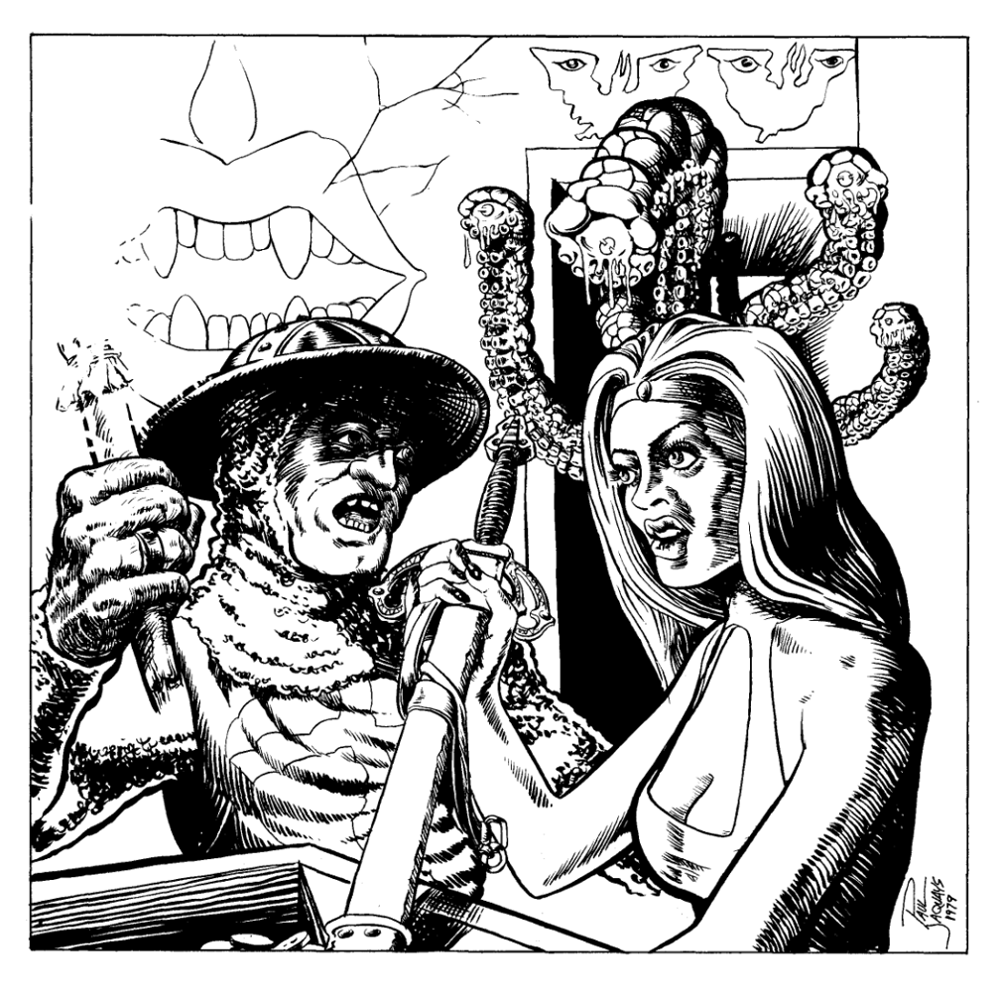

> [@JG102_The_Caverns_of_Thracia, _p._ _40_]

<!-- The Caverns of Thracia, Page 041 -->

**Epicaste, Fighting Woman**, Align: Lawful Good, Level 3, AC: -2, HD: 3, Armor: +1 magic Plate Armor and non-magic Shield, Weapon: Longsword, HP: 21, STR: 14, INT: 14, WIS: 10, DEX: 17, CON: 16, CHR: 13. Epicaste is a fighting woman in the service of her King, Agamemnos, who has been dead for at least 1100 years. The last thing that she remembers is coming down into this room via the trap door in Room 39 with 3 other soldiers. She and **Danaus** (the dead man) must have been affected by something in the room. She will vaguely remember a cold mist. Danaus can be found lying in front of the door creature. Epicaste will say that the reason they were down here was that they were investigating the possible hiding places where the **Beast Men** could be headquartering. There are rumors that they are planning an uprise (unless it is made clear to her that over a millennium has passed since she and her companion were overcome, Epicaste will be adamant that only hours could have gone by since she lost consciousness). Epicaste will know her way through the northern part of the 2nd level (Rooms 31, 38, 39, 39A, 42 - 47), Rooms 1 - 8 of the 1st level, the north wing of the palace on the 3rd level and all of the dungeon on the 4th level. However, she will not know of their present occupants and she will not know of any secret doors (past or present). If any character can speak in the Gnollic tongue (**Beast Men**), Epicaste may communicate with them as per the interpreting chart. To see if the intent or meaning of a phrase is understood, follow the direction for the chart, the person trying to understand the phrase operating as the interpreter. If no adventurer speaks Thracian, the language of the Tribesmen, or Gnollic, then communication will be possible only via hand signals or a variation of *Read Languages* (Epicaste is 65% capable of writing legibly in her own tongue).

Epicaste’s armor will not fit a male character nor will it fit a character taller or shorter than the 5’ 2” to 5’ 5” height range.

Danaus’ armor is not magic but it will fit any character of 13 - 16 Strength and 5’ 6” to 5’ 9” tall.

38 \) **Gnoll Guardpost**: Barracked in this room are 8 Gnoll warriors (one will not be in the room for he is standing guard in Room 39). **The Gnolls**: AC: 5, Move: 9”, HD: 2, Weapon and HP: See Below.

* **Grotch** (leader): Two-handed Sword, HP: 15; 9 SP, 7 GP.
* **Vredd** (2nd in command): Two-handed Sword, HP: 15; 6 SP, 8 GP.
* **Gnoll 1**: Morning Star, HP: 8; 7 SP, 5 GP.
* **Gnoll 2**: Two-handed Sword, HP: 12; 2 SP, 4 GP.
* **Gnoll 3**: Battle Axe, HP: 11; 7 SP, 5 GP.
* **Gnoll 4**: Longbow and Battle Axe, HP: 12; 10 SP, 2 GP.
* **Gnoll 5**: Two-handed Sword, HP: 5; 4 SP, 6 GP.

Human slave named **Grassus** (Tribesman): AC: 9, HD: 1, HP: 2.

The room is filthy with offal, food scraps, bits of armor, scraps of leather, broken weapons (useless), discarded boxes, broken furniture, shreds of cloth, various nameless disgusting pieces of assorted garbage and a motley collection of disconnected bones. The human slave will be of no assistance to adventurers in combat, since he is rather dull-witted and scared of his masters. He was captured by the Gnolls as a child from his home village almost 30 years ago and speaks only the Gnollic tongue.

The letter "a" in the room represents a spy-hole in the wall looking in on the stairwell. There is a 75% probability that one of the Gnolls will be at this viewport and will see any movement along the stair, thus alerting the rest of the guardpost. The reason for the existence of this post is to keep an eye on the Lizard Men, who are basically trustworthy but somewhat unpredictable due to the presence of the Shaman G’ruk.

If necessary, both doors in this room can be bolted with a heavy oaken bar from the inside.

> [@JG102_The_Caverns_of_Thracia, _p._ _41_]

<!-- The Caverns of Thracia, Page 042 -->

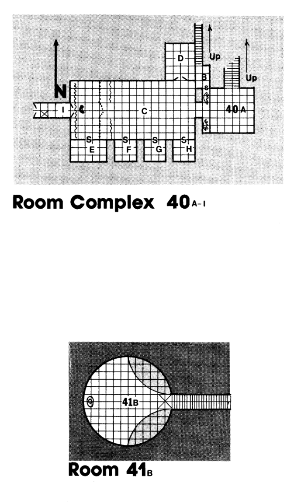

> [@JG102_The_Caverns_of_Thracia, _p._ _42_]

<!-- The Caverns of Thracia, Page 043 -->

39 \) **A Lone Guard**: Standing before the double doors to Room 38 is a single Gnoll guard, AC: 5, Move: 9, HD: 2, Weapon: Sword, HP: 9. He is standing in one of the few places in the room that is not covered with heaps of garbage (some of the garbage piles are 1000 years old!). The floor itself is covered with at least a full foot of ancient compressed garbage. If the floor is so intended for hollow spaces, the 10' square trap door marked by the large "x" on the floor will be evident. However, the large pile of garbage that covers that area must first be moved. There will be nothing of value in the garbage heaps. Reward any characters who diligently search the piles though with 1 - 6 SP and 1 - 10 CP.

39 A\) **A Chillsome Hall**: It is a 20' drop from Room 39 to the level of this hallway. The hall itself is much colder than the rest of the dungeon - once it leads into the frozen Room 37. The last 10 to 20' of the hall going east are covered with 1 - 2' of snowy frost. Where the walls are not covered by frost, very archaic almost crude wall paintings will be evident. They were created by the people who first discovered the caverns and dug much of the crypts in this area. The more advanced civilization that created King Agamemnos’ underground palace developed out of this culture. The statuary in Room 41 will show the signs of being from the same period.

40 A\) **A Chamber of Skeletons**: The secret doors in the hall leading to Room 35 open up a short hall ending in a set of roughly carved stairs leading further in to the depths of the earth. The room they enter has a ceiling 35’ in height. The blank stone walls are lined with human skeletons. Each 5’ section of wall contains 1 skeleton (total of 20): AC: 7, Move: 6”, HD: 1, Damage: 1 - 6, HP: 4. The eyes of the skeletons glow with an eerie orange light.

A special note about the stair leading down to this room. The stairwell is filled with the ancient, but still strong, webs of a long dead giant spider, whose husk can still be found about 30’ down the stair. Passage down the stair can only be affected by somehow removing the webs. Fire is the simplest method.

The west wall of the room contains a locked, 10’ wide door on the floor level and also another locked 10’ wide door 20’ above the floor (which goes to 40 C). However this upper door is *illusioned* to appear as blank wall. This door has a 5’ wide ledge in front of it that runs the width of the room. Flanking the door on the left and right are a pair of stone gargoyles. These statues can not be chipped, broken or knocked out of place. The north wall of the ledge is a secret door (to 40 B). (Room 40 and 41 are split level on level 2.)

The doors on the lower level are magicked so that anyone attempting to open them will be bitten by a variation of the *Magic Mouth* spell. Instead of an illusionary mouth appearing and speaking, a mouth filled with very sharp teeth will appear at the exact location that is being touched by the opener and bite for 1 - 4 points of damage (saving throw vs. magic applicable). This will occur a total of 4 times. *Dispel Magic* will remove the mouth permanently.

40 B\) **Guardian of Singular Combat**: The single fighting man in this room will never be surprised. He appears to be garbed from head to toe in cunningly crafted platemail. His face is hidden by a visor. The guardian is armed with Sword and Shield. He will fight at a minimum level of 4th or as a fighter 2 levels higher than his opponent. Guardian: AC: 2, Move: 9”, HD: 4+, Damage: 1 - 8, HP: 25. The guardian will mentally say to any who enter: “I am the guardian. To pass me, I must be defeated and destroyed. Choose your champion.” The guardian will not attack until a single champion has been determined from intruding adventurers. If he is attacked en masse, then the first adventurer to cross swords with him or hit him with a spell (or join combat in any manner) will be his opponent. At that point he is impervious to all attacks or attempts at hindrance by any other being. Any further attempt at touching or attacking the guardian will pass through him as if he were smoke or immaterial, and he will go for his opponent. Once locked in combat with the guardian, it is to the death. If the guardian is defeated by the adventurer, the combatants into a pile of jumbled and rusting armor. His sword, however, remains bright and shiny since it will now function as a +1 magic blade. If the adventurer halts the hit point he has lost and make the challenge again (see above). If at any point, the adventurers leave the room without defeating the guardian, the guardian will immediately regain all lost hit points. The door opposite the one entered will close with a *Wizard Lock* until the guardian dies.

> [@JG102_The_Caverns_of_Thracia, _p._ _43_]

<!-- The Caverns of Thracia, Page 044 -->

40 C\) **The Throne Hall**: This large, unlit hall is draped at the western end. A 10’ wide opening is in the 1st pair of drapes, but the curtains behind the throne are unbroken and run from ceiling to floor and wall to wall. A wall of bars with a 10’ wide door in the center will prevent intruders from approaching the throne. The gate in the bars is locked and -15% on picking due to some complicated inner workings. The bars are of iron and extremely thick.

The throne itself, though somewhat crudely constructed and decorated with monster faces and strange runic symbols (even a *Read Languages* spell will make no sense of them), is apparently gold-plated (value 5000 GP). If the throne is sat in, the sitter must make a -2 saving throw vs. magic or have his alignment immediately change to chaotic evil. This change will only be apparent to the character affected. Any attempt to touch the throne other than sitting in it will paralyze the toucher (as per a ghoul touch, but this also includes Elves) until *Dispel Magic* or until the victim is touched by a lawful good character. When a victim is paralyzed, a glistening wetness will appear on the north wall that will form into an ochre jelly in 3 melee rounds and drop to the floor, immediately heading for the throne area and any victims. Ochre Jelly: AC: 8, Move: 3”, HD: 5, Damage: 2 - 12, HP: 30.

If the question of "What happens when a lawfully good aligned character touches the throne?" arises, the answer is that, instead of just paralyzing the victim it will also deal out alignment shock as per a magic sword, doing 2 - 12 points of damage. A maximum of 24 points of damage will be dealt out. At that point the chair will lose its ability to paralyze, change alignment and do shock damage. However, it will also then change to worthless lead (weight, 500 encumbrance points).

Behind the curtains at the west end of the hall are a pair of stone doors, each carved with the face of a beneficent looking man.

40 D\) **The Crypt of the Mummy**: The door to this room is locked and also closed with 2 heavy bars of strong oak. On the lock is a wax seal bearing the signet of a dead king of ancient Thracia (at least 2000 years old). Extending 10’ out from the north wall is a 5’ wide, 3’ tall stone crypt. It is featureless and has a hingeless stone lid (a 5’ x 10’ stone slab). Touching the crypt with anything (hand, weapon, pole, rock, etc.) will cause the slab to explode for 1 - 3 points of automatic damage to all characters within 5’ of the crypt. A tall, gaunt figure will spring up, armed with a black sword. The being is a mummified, ancient king of Thracia, doomed by his evil life to live forever. AC: 3, Move: 6”, HD: 5 + 1, Damage: 1 - 12 + Level Drain or 1 - 12 + Rotting Disease (see below), HP: 26. The mummy is armed with the magic sword "Thirster" (see below) and there is a 50% chance each round of combat that he will use it to attack with instead of just clawing. The sword is in his right hand.

**Thirster**: This chaotic evil sword has no pluses, but instead it drains one energy level each time it hits in addition to normal sword damage. The sword has an Intelligence of 12 and an Ego of 8, speaks Chaotic, Red Dragon and Troll, detects gems, good and sloping passages, locates secret doors and endows the bearer with *ESP*. The sword may communicate telepathically with its bearer as well as speak in audible words. Thirster also has an idiosyncrasy of being afraid of Undead creatures. While this problem does not affect the sword directly, the phobia will be passed on to the bearer. In the presence of Undead a control roll must be made (if the bearer is not controlled by the sword already) and 4 points must be added to the sword’s ego. If the control is made by the sword, the bearer will either go berserk until restrained (50% chance) or passively withdraw and go into shock until the situation is removed.

The bottom of the crypt is covered with 2000 GP and near the north end of the crypt is a bone scroll case. In the case is a scroll containing a single spell, *Limited Wish*. In a bottle near the south end of the crypt is a potion of longevity.

40 E\) **A Burial Vault**: Buried in ancient times, the occupants of this chamber have not "fed" for millennia. Two wights haunt this room with their honor guard of 6 skeletons. Wights, AC: 5, Move: 9”, HD: 3, Damage: Level Drain, HP: 16, 17. Skeletons, AC: 6, (armed with Shield), Move: 6”, Damage: 1 - 6, Weapon: Sword, HP: 1, 4 (x3), 7, 3. The room will be "deathly quiet" until the door is opened.

40 F\) **A Second Burial Vault**: This vault contains a moldering, dead skeleton. However, after the room is entered, the body will animate, sit up and turn to face any intruders. It will speak in a very ancient tongue (only a *Read Languages* spell that has been previously cast will allow any understanding). It will say: "Long have I lain here, storing up my hatred for those who have entombed my brethren. Now they shall be unleashed on those who have wronged them!" The skeleton will then rise from its

> [@JG102_The_Caverns_of_Thracia, _p._ _44_]

<!-- The Caverns of Thracia, Page 045 -->

bier and begin to walk toward the door. It will not attempt to attack any being. If it is not obstructed it will tap the doors to crypts E, G, and H, releasing the Undead in there. The released Undead will then begin to attack anything in sight. Once they have defeated any living creatures, they will begin an organized assault on living creatures in the caverns. If the skeleton from this crypt is not destroyed, he can convert any dead creature (recent) into a zombie or any long dead creature into a skeleton. If this skeleton is destroyed there is a 75% chance that his imbuing spirit will be transferred to any available dead body within 200’. Skeleton: AC: 7, Move: 6”, HD: 4, Damage: 1 - 6, HP: 30, Turns as a Spectre. Any Undead encountered by this creature will immediately follow it.

40 G\) **Another Burial Vault**: Locked in this vault are a pair of **Doppelgangers** who will hide in the shadows until a chance to reveal themselves is possible. Doppelgangers: AC: 5, Move: 9”, HD: 4, Damage: 1 - 12, HP: 20, 23. Note that Doppelgangers are not Undead. At the south end of the room in the center of the wall, sitting on the floor, is a chest with a transparent crystal top. Visible in the top (which is about 3” thick) is a sword. The crystal is unbreakable and can only be removed from the sword by *Dispel Magic*. The sword is a -2 Cursed Sword, chaotic evil in alignment. Inside the chest itself, 3000 GP will be visible. They will cover the entire bottom of the chest. In a secret compartment, accessible from the left side of the chest will be a Potion of Speed, a Potion of Diminuation and a Clerical Scroll containing *Protection from Evil, 10’ Radius* and *Sticks to Snakes*. The latch to this secret compartment is guarded by a crossbow trap that will fire directly beside the chest (which is immovable, by the way) at the location that one must be in to work the latch and open the secret compartment.

40 H\) **Yes, You Guessed It! Still Another Burial Vault**: However, this vault is empty. There is no body or any other item in this room. The only distinguishing feature in the room is a line of writing carved into the east wall, legible from 5’ or closer (i.e., the room must be entered to read the writing). The writing is in very ancient Thracian and readable only via *Read Languages*. It says: "I have been waiting for you." If the message is said out loud or if the adventurers remain in the room more than 2 melee rounds, each adventurer will hear clearly in his mind the following: "Ahhh...it's been a long time! I have been waiting for you to come...ha ha ha ha ha!" At that point the door will *Wizard Lock* shut. If at least 3 spikes have been set to keep the door openable, it will take a full melee round for the door to close. A character of 18+ Strength may hold the door for 1 - 2 melee rounds. Nothing will happen to those characters sealed into the room except that they must find some way of escape before they die of suffocation or starvation. The door opens inward.

40 I\) **Wily Water Trap**: This is a trap of the nasty variety. But, it is not without a possible escape route. The room appears to be a short corridor, leading from Room 40 C to some other chamber. However, the doors at the west end leads not to another room, but to doom and destruction. Touching those doors will seal the doors at the east end with a *Wizard Lock*. Opening the west doors will release water from the river through a metal grate behind the doors. The force of the water will thrust the doors open and make them totally unclosable, except by a human or creature with 18 (00) Strength or better and then it will only allow a 15% chance of doing so. An attempt to close will take 3 melee rounds and the room will fill to the ceiling in 5. The ceiling is 10’ high and in this ceiling, at the location marked by the "x" on the map is a 5’ square opening. This opening is a vertical shaft or chimney that leads upwards to the 1st level. From the ceiling of 40 I to the floor of Room 20 (see map Level 1, spot marked with "x" in Room 20), the distance is 70’. There are no handholds in the shaft except those that would be findable by a trained thief.

41 A\) **Hall of Ancient Statuary**: From the east, a set of stairs descend 10’ down into this room. The ceiling is 25’ high. The chamber is illumined by 10 glowing pillars that give off an eerie yellow-green light that seems to flicker almost like torchlight. Every 5 melee rounds the light will go out for 1 - 5 melee rounds, then flash into activity again like 10 giant strobes. This will blind any characters not making a saving roll against paralyzation for 1 - 2 melee rounds and eliminate the ability to see in the dark for 1 - 6 turns. Every so often a low rumble can be heard in this room. Moving about will set off noises that sound like traps being released or monsters moving about.

The rectangles marked with letters represent 6’ tall pedestles, upon which sit a variety of statuary, carved from several kinds of stone.

> [@JG102_The_Caverns_of_Thracia, _p._ _45_]

<!-- The Caverns of Thracia, Page 046 -->

| Pedestal | Statuary | Carved of | Eyes |
| ---: | --- | --- | --- |
| A | Sphinx | porphyry (volcanic) | huge quartz spheres valued at 200 GP each |
| B | Hydra, 8-headed | black marble (not full sized) | amber; each eye valued at 25 GP |
| C | Minotaur | soft soapstone | jade eyes valued at 400 GP each |
| D | Dryad | black basalt | small citrines valued at 50 GP each |
| E | Griffon | glistening white marble | fire opals, valued at 350 GP each |
| F | Manticore | black marble | a pair of red tourmalines valued at 200 GP each |
| G | Harpy | green marble | brilliant cut green emeralds valued at 400 GP each |
| H | Hippogriff | black lava | pupils of the eyes are small peridots valued at 50 GP each |
| I | Satyr (man with goat legs and goat horns) | pink granite | a ruby set on a diamond; total value of each eye is 1000 GP |
| J | Centaur | white marble | aquamarines valued at 300 GP each |

The statuary seem to be unguarded, but… for every 10 GP worth of gems pried out of the eyes of any statue there will be a 1% chance of summoning the guardian of the hall. This chance is cumulative and must be checked each time a new gem is pried loose (each gem will require 1 - 2 melee rounds of time to release it intact from its setting). Thus when the 100% mark is reached (1000 GP worth of gems) the guardian will appear regardless (see Room 41 B for guardian’s statistics). In two melee rounds after the guardian has been summoned it will appear, bursting through the secret doors in the west wall. The creature appears as an 8’ tall black statue of a regal appearing man wearing a black crown and having flaming eyes and mouth. He will attack and pursue any being possessing the stolen gemstone eyes.

The secret doors in the north wall, when searched for, will appear to be part of the wall. The secret doors in the west wall will be undetectable unless a *Detect Magic* is placed on that wall or a magical light (other than that already in the room) is shone upon them. At that point they will show a glowing outline with palm shaped areas glowing 4’ off the ground in the center of each door. The doors will open by pressing an open hand to each glowing palm.

41 B\) **Audience Chamber of the Stone King**: The stair down to this room descends 40’ from Room 41 A. It is lit by a blue violet light that tends to cause drowsiness (save vs. magic or be -1 hit probability and armor class for 10 melee rounds). At the base of the stairs is a large circular chamber that is lit by walls that seem to burn with a cold, violet fire. Flanking the base of the stairs is a pair of placid pools of water. Every so often the pools will gurgle and a ripple will move across the surface. There is nothing down there, but who wants to test it and find out?

At the west end of the chamber is a large statue. It is standing stock still. The thing is actually the guardian of Room 41 A and if it is destroyed there or has even entered that room, it will not be down in here. The statue appears as a black man, 8’ tall and of regal bearing, wearing a crown set with three large, violet gems, valued at 500 GP each. The statue’s eyes and mouth burn with orange flame. He is AC: 1, Move: 9”, HD: 11, HP: 50. The guardian can not be hit by non-magic weapons since only weapons of +1 or better will affect it. Edged weapons will do half damage. Lightning will do full damage and magic fire will regenerate hits upon the monster equal to the damage that it would normally do. Non-magic fire and no spells except *Rock to Mud*, *Stone to Flesh*, and *Disintegrate* will affect this monster. It will attack once per round for 2 - 12 points of damage with its fists and every other round it will spew forth a blast of fire from its eyes and mouth that will do 3 dice of damage (3 - 18 points, saving throw applicable) to all creatures in a 10’ wide by 20’ long cone in front of it. The statue can not be pushed over as every step is firmly rooted to the ground.

It will not attack if its room is entered. However, if the gem-eyes of the statues in Room 41 A

> [@JG102_The_Caverns_of_Thracia, _p._ _46_]

<!-- The Caverns of Thracia, Page 047 -->

are removed (see above) or if an attempt to remove the gems from its crown is made or if the statue is attacked, it will begin to attack. This creature can detect the presence of the gems from Room 41 A at any distance and will pursue and destroy any being possessing those gems to the ends of the earth.

While in this room (41 B) the stone king may cause the trap door in front of the stair to drop away leaving a 10’ wide gap of open water (20’ deep) between the room and the stairway, but he will not do so if he has not yet been animated.

42 \) **Rubble-filled Caverns**: This is a large cavern with a stone floor. It is fairly dry and there are stalactite and stalagmite formations along the south wall only. The stair to the north leads up to Level 1. The floor of the cave is littered near the center with debris from Room 27 on the 1st level. There is a large chasm in the ceiling that connects with that room on the level above. While there are no dangerous monsters in this chamber *per se*, inhabiting the rubble pile is a colony of rats. If the rubble pile is entered, they will begin to squeal and shriek. Any noise in this cavern or any light will alert the attention of guards located at 43.

43 \) **Guardpoints and Pit Traps**: A short stair at this point goes upward approximately 10’. In amongst the pillars are 4 Gnoll guards, each armed with Longbows and Halberds. Gnolls: AC: 5, Move: 9”, HD: 2, Damage: 1 - 6 with Bow, 1 - 10 with Halberd, HP: 14, 5, 10, 11. These guards will be alerted and ready by any noise or light in cavern 42 or from the east cavern.

The two pit traps are very well disguised and only a Dwarf or a Thief would be able to distinguish that they exist (if he were looking for them). The shallower pit (20’) is a normal pit. However, its bottom is filled with sharpened stakes. The pit will do 4d6 of damage to whoever falls in. This pit is of recent make and will open on a d6 roll of 1 - 3 every time it is crossed. Once the pit opens it then snaps shut again. However, its presence will then be detectable since the sand on the floor of this cavern will have been disturbed.

The 30’ deep pit is extremely ancient and its location is unknown to current dungeon inhabitants. Though locked shut for 2000 years, a portion of the mechanism has corroded through allowing the trapdoor to function once again. It will only open on a d10 roll of 1 and when it does it will make a good deal of noise as it swiftly creaks open and snaps shut again (the mechanism hasn’t been oiled in a couple of millennia or so). Instead of being a straight shaft, the pit becomes a slide, sending victims shooting southward into room "C" of Room Complex 45. No damage will be taken by the fall. Once opened the trap door will close, jamming and wedging shut for eternity as the mechanism snaps. A percentage roll of 90%+ by a character of 18 (00) Strength can force it open though, although any tool used for leverage will snap after a few moments.

44\) **Statue of a Long Forgotten God**: This cavern was once the shrine area of many a now forgotten god and godling of the ancient Thracian race. In this alcove is a fairly intact sculpture of a fair-looking young man. The pearly-white marble has been weathered and stained by the passage of time and water. The head is somewhat worn away by constant erosion and stalactites hang off the chin and arms. Written in ancient Thracian is the following, "Oh Apollo, blessed healer, touch me and make me whole." If this phrase is spoken while touching the statue, a *Cure Light Wounds* spell will be cast upon the beseecher. This will only work 1 - 4 times before the ancient magic is exhausted. The walls of the alcove are of rough-carved rock with two marble bas-relief panels of acts of the god set into the living rock. One east and the other north. The east panel is actually a secret door. If the door is open, a pair of Spears will spring forth to impale the opener, being thrown as if fired by a 7th level fighting man.

45\) **The Temple of Athena... Or... The Temple of the Descension**: A set of stairs leads upwards 10’ to a massive temple (Greek design) with heavy doric pillars. The base of the temple is carved with high relief sculpture panels with scenes depicting the Thracian deities in combat with demons and sea monsters. On the east wall of the temple’s base is a secret door, disguised as a carved panel. It opens up on a narrow stair that leads down to Room Complex 45 A.

At the east end of the temple is a tall statue (10’) of a regal woman in long loose, greek style clothing. She bears a Shield and Spear and wears a Helm. The 10’ square area before the statue (marked with an "x" on the map) is a Teleportation pad. Standing on it for 1 melee round will activate it and send those upon the square to area 54 on the 3rd Level map (see 89 if a special marble is possessed).

> [@JG102_The_Caverns_of_Thracia, _p._ _47_]

<!-- The Caverns of Thracia, Page 048 -->

Guarding this strategic location is a squad of 8 Gnolls, AC: 5, Move: 9", HD: 2, Damage: 1 - 6 with Longbow, 1 - 10 with Halberd, HP: 7 (x3), 8, 10 (x2), 9, 12. Each Gnoll will have 11 SP and 2 GP on his person.

Any light or noise in the cavern will alert the Gnolls, who will hide among the pillars and wait to ambush. If outnumbered or taking heavy losses, the Gnolls will retreat to the teleportation pad and seek to create another ambush on the 3rd Level with reinforcements to be found there.

### Room Complex 45 A - I

45 A\) **Weapon Storage Vault**: This room is filled with about a dozen large, sealed, wooden boxes. The boxes are all in remarkably good shape.

- **Box 1:** Wrapped in oil-soaked cloth are 20 Bronze Swords. These swords are half-again as heavy as an iron sword and after 3 hits are scored with them, they will be -1 hit probability until resharpened.
- **Box 2:** Wrapped in oil-soaked cloth are 30 Spears.
- **Box 3:** Carefully wrapped up in oil-soaked cloth is a suit of Plate Armor of archaic design. Without modification, it will fit a Human of 11 - 14 Strength and 5'2" to 5'5" in height. The armor is +1.
- **Box 4:** This box is open and the contents have rusted and tarnished. It contains 30 Spears. It is 40% likely the pile of them will collapse into debris if handled.
- **Box 5:** Wrapped in oil cloth are 60 Crossbow Quarrels.

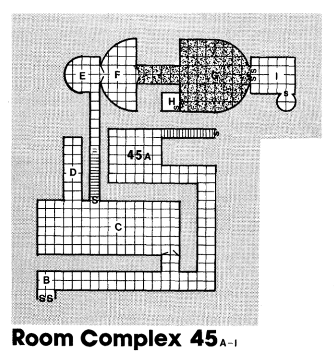

> [@JG102_The_Caverns_of_Thracia, _p._ _48_]

<!-- The Caverns of Thracia, Page 049 -->

- **Box 6, 7, 8:** In these boxes are the components of a special mechanism that will throw 6 Crossbow quarrels per round for a total of 6 rounds before having to be reloaded. There are no assembly instructions and the parts, although well protected, are incomprehensible. A fighting man will have a percentage chance equal to his Intelligence score -10 x 5. If the fighting man has access to a knowledgeable Sage, his chance of constructing the machine properly will go up by 20%. If it is known how to assemble the machine, it will take a minimum of 2 turns to put it together properly. If the machine is put together and carried (weight of 1000 GP + Quarrels) it will take the averaged Dexterity of all characters doing the assembling subtracted from 20 in melee rounds to put the thing in working order and capable of firing on the next melee round. If a fighter is trying to put the machine together for the first time, subtract his Intelligence from 25 and the resultant number will be the number of hours required to puzzle the thing together (if he or she can do it at all). An improperly constructed machine will not work at all. Treat as Light Crossbow for accuracy.
- **Box 9:** Another box of carefully wrapped Crossbow Quarrels, 60 in number.
- **Box 10:** 4 circular Shields with the head of a bull emblazoned on them in green paint.
- **Box 11:** Another box of wrapped Crossbow Quarrels, 60 in number.
- **Box 12:** This box is differently constructed from all the rest. Completely unfamiliar writing, alien to every type of writing that the adventurers may have seen till now is emblazoned on the box. It will look very much like Chinese characters, but you don't have to tell the players this. If read by the use of a *Read Languages* spell, it will say "Wing Tu, weapon-maker for his excellency the undying Emperor." Inside, preserved by some strange magic are some very odd weapons. Created from high grade steel are 10 star-shaped items with sharpened edges (shuriken). If the use of these is learned they will operate as throwing Daggers and do 1 - 4 points of damage each, being non-magically +1 due to the high grade of the metal used. There are a pair of black sticks, 12” long and joined by 4” of chain (nunchaku). If the use of these is learned, they will work as morning stars and do 1 - 8 points of damage. However, if a character is not already trained in the use of the Morning Star, there is an 80% chance that any concerted use of them will do 1 - 2 points of damage to the character concerned. There is also a 40” long Sword of strange design with an extremely light and sharp blade. It will be +1 and non-magical due to the quality of craftsmanship and the high grade of steel used. The oddest item in the box are 20 tubes constructed of some type of heavy parchment and mounted on short, thin sticks (sky rockets). If lit (fuse sticks out the end with the stick) they will shoot off with a range of 500’ and explode in a flash of bright, sparkling colors. If used as weapons, they will have the range of a short bow, but at -5 to hit. There is a 30% chance that they will explode on contact with a target for 1 - 6 points of damage, blinding the victim for 1 - 4 melee rounds in the process. If they do not explode, damage is negligible (as if they glanced off).

45 B\) **Doors to the Hidden Tombs**: These doors are not secret from this side. Written on the door in Ancient Thracian is the following inscription; "It is not given that man should interrupt the sleep of his ancestors. Do not transgress beyond this point." These doors will not yield even to magic.

45 C\) **Demesne of the Minotaur Lizard**: A large reptilian creature has been in a sort of stasis-like trance for some centuries now. Originally placed as a guard for the secret door in the north wall, it was forgotten long ago. The spell placed on it is such that if the room is entered, it will awaken and attack. Once it has defeated and devoured its victims it will fall back into the stasis again. Minotaur Lizard: AC: 3, Move: 9”, HD: 8, Damage: Bite: 4 - 32, Claw: 2 - 20, Claw: 2 - 20, HP: 46. The secret door in the north wall is further guarded by two spells. The first is a *Polymorph Other* spell. The first creature to touch the door with the intention of opening it must make a saving throw vs magic or be polymorphed into a house cat. The second one to touch the door will be hit with a *Magic Missile* spell of 7th level. Thereafter the door will be safe to open, except that it is *Wizard Locked*.

> [@JG102_The_Caverns_of_Thracia, _p._ _49_]

<!-- The Caverns of Thracia, Page 050 -->

45 D\) **Slippery Slide from the Trap Above**: This is the slide that comes from the 30’ deep trap described in area 43. The slide is so designed that no actual damage is done in the drop. The slide is steep, but the Minotaur Lizard can climb it. The trap door cannot be opened or sprung from beneath.

45 E\) **A Sealed-Off Retreat**: This was the route taken by the last human survivors of the beast-men revolution that captured the palace of King Agamemnos over 1000 years ago. The room is scorched and blasted as if a fireball had been set off in there and had set the remainder of the contents of the room on fire. The door to room 45F is barred from the other side and will be -2 on opening.

45 F\) **Chamber of Forgotten Finery**: The walls of this room are covered with ornate stylized paintings of magic and sorcery. Various statues of kings and queens and goddesses line the east wall (these are real statues, honest, no tricks!). The stone doors to room 45G seem to have a sort of yellowish powder around the edges. It is really dried up yellow mold. (It does no damage but should serve as a hint).

45 G\) **Court of Foul Fungus**: If the door to this room is forced open (from either end) a 10’ x 10’ x 10’ cloud of spores will be knocked loose from the gigantic yellow mold colony that has spawned in this chamber. Any character breathing the spores must save vs poison or die. The only way to destroy this mass of putrid plant is to burn it. Physically disturbing the mold will send up a cloud of spores in the area affected. This room was once a well-equipped magical laboratory. However, now all that remains of the great lab are shattered shards of glassware and approximately 300 GP worth of small gems used in experiments along with 100 GP of gold wire and 50 GP of silver wire. Both doors in this room would normally be hidden behind secret panels in the once-rich woodwork that lined this room. However, the mold has long since destroyed the wood and now covers the walls and ceiling, hiding any traces of possible doors.

45 H\) **An Empowering Globe**: In the center of this small chamber is a stone table upon which sits a glass globe that glows with a golden light. On a bookshelf against the north wall are several scroll cases, totalling 5. Each one has a different color wax seal on the case.

**Red Seal:** The seal on this scroll case is whole and unbroken. On the scroll is an inventory of magic items stored on the shelves. (The shelves are now empty.) The scroll is written in the Thracian language of the same period as King Agamemnos and the revolution.

**Black Seal:** This unopened scroll is written in the ancient Thracian language that predates the time period of Agamemnos by about 1000 years. It describes the wondrous statues in room 41A, telling of their jeweled eyes. It does not mention any type of guardian, though.

**Blue Seal:** This scroll has explosive runes written on it.

**Green Seal:** This scroll is inscribed with four magic spells of the third level, *Fire Ball, Dispel Magic, Invisibility 10’ Radius,* *Infravision*. A *Read Magic* spell will be required to read this scroll.

**Gold Seal:** This seal is broken and has been resealed several times. It is a maintenance log on the globe and describes its functions.

The golden globe is the source of power for the teleportation system between levels 2 and 3. If it is destroyed, the system will no longer function and any creature on the second level will be trapped until an alternate method of transportation is devised or discovered. Casting a *Dispel Magic* on the item will negate its powers for 3 turns. If the globe is broken, it will require a *Teleportation* spell and a *Permanent* spell to repair it, not to mention a new glass globe. Shattering the globe will destroy it. It is fragile and any hit will do the job. If the globe is removed from the room the teleportation unit will cease to function. The globe is 8” in diameter and is hollow.

45 I\) **The Last Stronghold**: It was in this room that the remnants of King Agamemnos’ court and guard made their escape and that their dead and mortally wounded were left. If Epicaste from room 37 is with a group of adventurers, she will be able to identify several of the corpses as friends and acquaintances of hers. One of the bodies in the room is not completely dead yet. Powerful magic was used to keep the near-dead Anteus, a soldier in the King’s Guard, alive or partially alive for 1100 years. Anteus appears as a tall (6’) man in plate armor and shield (+1 plate) bearing a two-handed sword. In addition, he has a +2 dexterity bonus. AC: -1, Move: 9”, HD: 7, Damage: 1 - 10 + 2 (for strength), HP: 41. His vocal chords have atrophied and he has lost the power of speech. If any can speak the language of the tribesman or the Thracian tongue then he might be made to understand peaceful intentions (see room 37 for translation charts). If he is not immediately made to understand that the adventurers are not servants of the beast-men, he will attack. The small, circular room on the south wall of this room is actually a shaft that leads from room 36 to 118 (see room 36). From this point, it is 60’ up to the floor of room 36 and 40’ down to the ceiling of room 118 and an additional 20’ beyond that to the floor. Falling from this point will do 6d6 of damage.

> [@JG102_The_Caverns_of_Thracia, _p._ _50_]

<!-- The Caverns of Thracia, Page 051 -->

46\) **Giant Spider**: AC: 4, Move: 3”/12” (in web), HD: 4 + 4, Damage: Bite 2 - 8 + save vs poison or die, HP: 28. Once per round this spider may also shoot a strand of web at the victim. If the victim is hit he must make a saving throw of under his Strength -4 on a d20. Treat each level of extraordinary strength as a separate strength point.

47\) **A Deteriorated Outer Sanctuary**: The once brilliant paint is peeling off the low relief sculptures of inter-deity combat that line every wall in the temple area. The place does not appear to be in any kind of use, however, if the adventurers entering this room are determined to be enemies of the gnolls (an almost 100% certain possibility), they will suddenly be rained upon by 4 crossbow bolts coming from the east and west walls. The missiles are fired by gnolls (2 hit dice creatures) from light crossbows at short range. The bolts are fired out of arrow ports that have been cunningly and almost invisibly carved into the sculptured walls. Each of the four crossbows will fire once each round. The ports are not large enough for a flask of oil to be thrown through and, also, can be closed from the inside, if necessary.

48\) **A Draped Inner Sanctuary**: This room reeks of long occupancy by members of the ursine race, i.e., it's a bear lair. Lairing in this room are two trained war bears. They are brown bears with special fighting training so that they attack with a +1 and will fight to the death. AC: 6, Move: 12”, HD: 5, 2 claws at 1 - 6 each, bite for 1 - 8 and on paw hits of 17+ a hug for 2 - 12 additional points, HP: 36, 44. The two bears will be assisted in winning battles by their trainers, 3 gnolls: AC: 5, Move: 9”, HD: 2, Damage: 1 - 6 with longbow and 1 - 8 with morning star, HP: 11, 14, 13. Each of the gnolls have 3 SP and 6 GP on their persons.

49\) **Gnoll Barracks**: This is the actual lair of the gnolls in this section. There are sleeping provisions for 12 gnolls. Because they always have a guard posted, and being bloodthirsty creatures, they will always be ready for combat at a moment’s notice. There will always be 3 armed gnolls in this room, AC: 5, Move: 9”, HD: 2, Weapons: battle axe for 1 - 8 points of damage. Each of these gnolls will have 3 SP and 1 GP on its person.

50\) **A Converted Crypt**: This is an additional living space for the gnolls and for the most part it is filled with junk and litter. In this room will be the gnolls who fire the crossbows from the west wall into room 47. There are three of them. Each is armed with a light crossbow and a battle axe. If the door to this room is breached they will fire off their crossbows into the enemy and charge with their weapons. AC: 5, Move: 9”, HD: 2, Damage: crossbow 1 - 6, battle axe 1 - 8, HP: 12, 8, 11. Each of these gnolls will have 2 SP and 4 GP on his person.

51\) **Another Converted Crypt**: This room will be exactly like room 50 except that the gnolls have the following: HP: 15 (he is the commander), 13, 9.

52\) **Barracks of Allied Mercenary Lizard Men**: This is the barracks of an allied troop of mercenary lizard men. They are under the command of the gnoll in room 51, but if things get rough they will break for it. 6 lizard men: AC: 4 (skin and shield), Move: 6”/12” (swimming), HD: 2 + 1, Weapons: club for 1 - 8 damage and 4 darts each for 1 - 4, HP: 8, 8, 7, 7, 11, 10. These lizard men will attempt to get back to their tribe. One of the lizards has recently discovered secret doors in the south wall of room 48 and there is a 40% chance that if that avenue of escape is possible they will use it. The 10 HP lizard man speaks the common tongue and may offer to ransom himself and the other lizard men with tales of great treasure (room 33) and directions on how to reach it. He won’t necessarily reveal any of the guardian creatures or traps unless magically forced to.

> [@JG102_The_Caverns_of_Thracia, _p._ _51_]

<!-- The Caverns of Thracia, Page 052 -->

53\) **The Rising Demon Image**: This is the sculpture of a demon that rises up in flames into room 27A. Its location is unknown to the locals. The statue is carved of black granite and has borne the ravages of time with a great deal of grace. Its eyes are large, 300 GP, faceted amber gemstones. Its mouth is hollow and an odor of methane is detectable from it. An odd quirk about this statue is that it will always turn and face (rotate in place) a good cleric, regardless of where he or she stands in the room. If there is more than one in the room, it will face the one of highest level. To the south of the room are a pair of hidden 10’ wide doors. They are covered over with plaster and faded frescoes are painted into the plaster, itself. To get at the door, the plaster must be chipped away. Behind the doors are stairs that lead downward. This complex is old; older than the Ancient Thracian tomb complexes of rooms 37 - 41. Their use was ended soon after the coming of the ancient Thracians. Some say that this is the remnant of an ancient race of civilized lizard men. No one can be certain, except that humans are not portrayed in any but the more recent frescoes and then only as sacrifices of lizard-headed men. The stairs are crumbly and deep with dust and fallen rubble. No plaster remains on the walls. The ceiling of the stairwell is covered with stalactites and the floor with stalagmites. In places they have grown together and almost blocked the passage. The dust on the floor is undisturbed.

### Room Complex 53 A-J

53 A\) **The Grand Temple of the Reptile Race**: This vast hall was once the worship place for hundreds of highly intelligent lizard men who worshipped a supposedly immortal giant king. The floor is thick with dust, undisturbed except for a path that leads from the door of room 53G to the steps of the altar, where it seems that a creature of some kind has kneeled several times. This cavernous hall has long since fallen into ruin, time and moisture doing their work well. The ceiling is covered with stalactites that form occasional pillars as they meet with stalagmites thrusting up from the floor. The northwest corner has caved-in and it seems that many other places in the walls are weakening, also. Along each wall are a series of 4 doors. Along the east wall, the door to the south end of room 53F is sealed shut by the random formation of stalagmite pillars in front of it. The doors are great stone constructions, 10’ wide and 15’ tall. There is a 25% chance that any given set of doors will open freely (without great effort). If a door is stuck, it will be -2 on opening check for each door as it is encountered. On the west wall there are 4 doors, but they do not lead to places on this, the prime material plane.

**Door 1:** Leads to the Ethereal Plane. The door is *Wizard Locked*.

**Door 2:** Is blocked by stalagmite pillars and cannot be opened. Besides, it has lost the magic that once powered it.

**Door 3:** Leads to a small 10’ square room. That room is an extension of this plane into the astral plane. There a character may astrally leave his body without requiring the necessary spell. Players will be able to sense their astral selves ease of movement as though their astral bodies were continually flowing in and out of their prime material bodies. This door is *Wizard Locked*.

**Door 4:** Is also blocked by stalagmite columns. It, too, has lost the magic that once powered it and leads nowhere but into a stone wall.

The stairs at the south end of the room lead upward 10’ to a ceremonial podium flanked by rotted tatters of an ancient tapestry, ruined beyond recognition. All that remains of the altar furniture is a crumbling marble podium and that, too, will tumble to marble dust if touched. In the south wall there are a pair of doors that are hidden from view by what remains of the drapes. Touching the curtains will powder them and the doors will be revealed.

53 B\) **A Ceremonial Chamber with a View**: The original function of this chamber will be forever lost. But it can be determined that it was used to keep an eye on encroaching Humans during the waning of the Reptile race. The secret doors in the east wall are only secret to occupants of Room 41 B (see 41 B for that room’s contents). The 10’ x 10’ portal in the wall is 25’ above the level of Room 41 B’s floor. The walls of this room are covered with flaking plaster. Visible will be a few faded images of Reptile Men in jeweled robes and at least one picture of a gigantic winged Lizard Man. One valve of the south doors will be eternally jammed closed.

53 C\) **Urns and Ashes**: This small room is filled with shards of pottery and a few small, unbroken ceramic urns. The quality of the pottery is excellent and the 4 surviving pieces would be valued at 1000 GP each if taken to the right buyer (someone who is very interested in ancient, prehuman history). The urns seem to contain ashes of some sort. The secret door in the north wall is disguised by a glaze of stalactite material that has formed over it and hidden the edges of the door.

> [@JG102_The_Caverns_of_Thracia, _p._ _52_]

<!-- The Caverns of Thracia, Page 053 -->

53 D\) **A Preliminary Crypt**: Two piles of dust and debris flank the north door in this room. They are in actuality a pair of skeletal Lizard warriors who will spring to life if the room is entered, forming up right out of the dust. These Undead do not fear Human Clerics in the least, due to the special evil magic rings that they wear. Skeletal Lizard Men: AC: 5, Move: 6”, HD: 6, Damage: 1 - 10, HP: 32 each. *Protection from Evil* will keep these creatures at bay for 6 melee rounds and then they will actually shatter the spell with some sort of counter magic. When they are killed, they return to dust, as do their rings.

53 E\) **The Sepulcher of the Immortal King**: This room is just as decayed and decrepit as the rest of the complex. However, sitting on a pedestle at the east end of the room is what appears to be a giant, mummified, desiccated cross between a gargoyle and a Lizard Man. If it stood, the creature would be 10’ tall with huge, parchment-like bat wings springing from its scaly but withered back. The monster sits amongst its pile of treasure, unmoving and dead. If the room is entered the monster will slowly shift its head to face the intruders and it will be immediately apparent that its eyes are glowing malevolently. The monster is an incredibly ancient Lich: AC: 3, Move: 6”, HD: 12, Damage: 2 claws for 1 - 8 each, and a bite for 1 - 12, HP: 57, spells: *Charm Person*, *Hold Portal*, *Magic Missile* (x2), *Protection from Good*, *ESP*, *Invisibility*, *Levitate*, *Web*, *Wizard Lock*, *Dispel Magic*, *Fireball*, *Haste Spell*, *Slow Spell*, *Confusion* (x2), *Fear*, *Polymorph Others*, *Teleport* (x2), *Conjure Elemental*, *Cloud Kill*, *Death Spell*, *Invisible Stalker*, *Anti-Magic Shell*, *Delayed Blast Fireball*. His first probable action will be to *Teleport* to the altar in Room 53 A and summon an earth elemental to do his fighting for him. If the Rings in Room 53 D have been destroyed, he will be alerted and the spell will have been cast and he will be fading out. It is also probable that he will cast a *Haste Spell* upon himself to make sure that he can react faster than his opponents. Note that *Haste* does not increase the speed of spell casting. The Immortal King will avoid placing himself in any danger. Piled about the pedestle upon which the Immortal King sits are 5000 SP and 16,000 GP in loose piles, a lawful Red Dragon slaying Sword +2, a Potion of Fire Resistance and a Wand of Paralyzation. The west end of the room opens into a 10’ wide corridor that has been sealed off due to cave in.

53 F\) **Another Room of Unidentifiable Purpose**: What this room once may have been is now unknown. The ceiling is covered with stalactites and the floor is littered with stalagmites, some of them blocking passage in the room. The narrow stair at the south end of the room leads upwards 25’ to Room 37. The door into that room is both secret and covered by ice, making it detectable by 1 less point on a d6 (instead of an Elf locating the door on a d6 roll of 1 - 4 he will only be able to find it on a roll of 1 - 3).

53 G\) **A Makeshift Chapel**: The footprints in the dust lead to this room. Upon entering the room, it will be immediately noticeable that the dust on the floor has been swept away. The room looks as if someone or something has been maintaining it to some extent. There is no debris on the floor and it appears that a crude, man-shaped stick figure has been drawn in ochre on the south wall. The figure seems to have wings and a tail. The chapel has been created and kept clean by the Shaman G’ruk of the Lizard Men in Room 31. He and only he has discovered the secret door in the north wall of their lair area. He has devoted this area to his private and secretive worship of the Immortal King, not knowing that it actually still lives.

53 H\) **Secret Lair of the Lizard Men Shaman**: There is a 20% chance that G’ruk, Shaman of the Lizard people will be in this, his private lair (if he has already been killed in Room 31, then he will have 0% chance of appearing here). There is a pile of sleeping rags in one corner and a bag containing several strips of dried Human meat along with some glass beads and a few sharpened stone implements. There is nothing of real value in here. The stair to the south goes up a total of 75’ and eventually joins up with Room 31.

31\) **A Sealed Room**: This room is sealed off from Room 53 G. Its walls and contents are fairly intact. The walls show scenes of a ritualistic sacrifice of a Human victim and several Lizard Man victims by a group of gowned Lizard Priests. In the background, there is a hazy image of the ever present Immortal King, a tall winged Lizard Man wearing a silver crown. On a table in the center of the room (more like a 3’ cube of granite) is a golden mask designed to fit a Lizard Man. It has a demonic countenance. The mask is valued at 2000 GP.

> [@JG102_The_Caverns_of_Thracia, _p._ _53_]

<!-- The Caverns of Thracia, Page 054 -->

53 J\) **The Secret Sacrificial Shaft of the Lizard Priests**: The frescoes in this room are intact also and show images of a giant winged Lizard Man (the Immortal King) devouring huge numbers of Humans, Lizard Men and Dinosaurs. Along the south wall, there is a 5’ square shaft for the sacrifice of living victims. The shaft is 45’ long but it opens up on the 3rd level for an additional drop of 200’ (2d6 of damage).

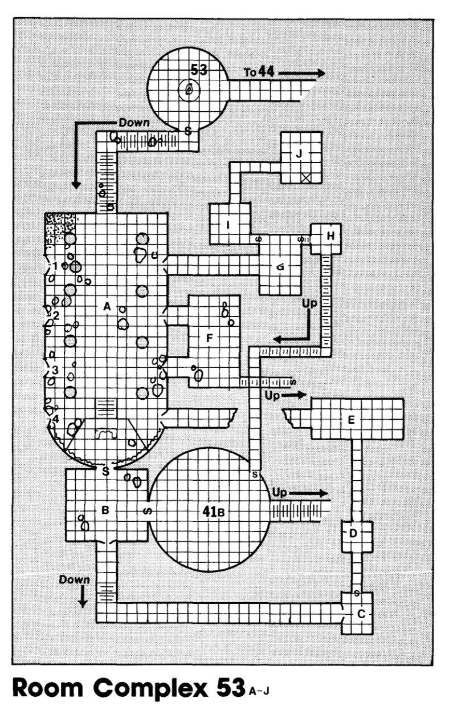

> [@JG102_The_Caverns_of_Thracia, _p._ _54_]

<!-- Begin: JG102_The_Caverns_of_Thracia_04_Caverns_Level_03a_55-61 -->

<!-- The Caverns of Thracia, Page 055 -->

# Level 3a

> [@JG102_The_Caverns_of_Thracia, _p._ _55_]

<!-- The Caverns of Thracia, Page 056 -->

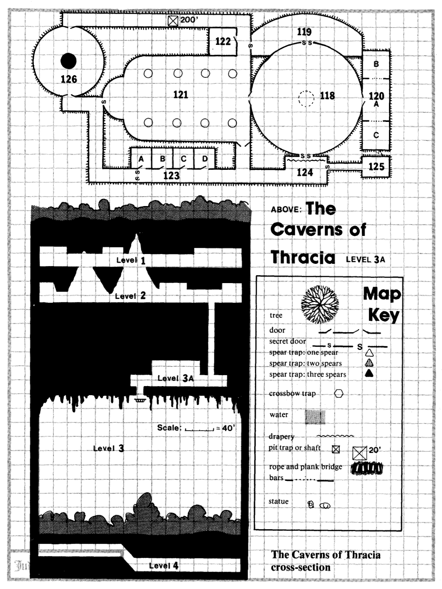

> [@JG102_The_Caverns_of_Thracia, _p._ _56_]

<!-- The Caverns of Thracia, Page 057 -->

## Level Three A

Introductory Note: There is one and only one wandering monster on this level. It is an 8" tall animated bronze statue, cast in the likeness of the god Thanatos, appearing as a solid version of the Incarnation of Death, AC: 2, Move: 6", HD: 8, Damage: 2-16, HP: 36. In addition to its normal damage, the creature shoots off a paralysis ray from its eye every round. The effective range of the ray is 60' and it is 10' wide. Any living being hit by the ray must save vs. paralysis or be immobilized for a number of turns equal to his or her constitution subtracted from 20. The statue will attempt to destroy any living being on this level. It can be encountered in any room or in any hallway.

Note: This entire level was once a temple and worship area devoted to the god Thanatos. Because of this, images of Thanatos (see Rooms 9A-13) will appear in this entire room complex.

118) **Great Audience Hall**: This room appears to have been a meeting hall of some kind. The shaft from Room 36 comes down in the center of the 20' high ceiling. Located directly below the opening is what appears to be an ancient firepit. The floor is blackened and there is evidence of charcoal around the area. Surrounding the firepit area are dozens of wooden benches in various states of falling apart from age or dry rot. In the north and south walls are secret doors that are cleverly disguised to look like part of the wall. In the east and west walls are great bronze doors, 20' tall and carved with strange runes (meaningless even with Read Languages).

119) **A Private Gallery**: This room is sort of the "royal opera box". The south wall of this room (facing Room 118) is transparent from this side, but opaque from Room 118. The walls are carved ornately with flowers and geometric designs. The walls are also painted in brilliant, but restful colors. Instead of rotted wooden benches, there are several ornate marble couches and seats, covered with cushions that will powder to dust if touched. There is nothing of other than historical value in here.

120A) **A Holding Area**: This room contains a marble table and two or three marble chairs. They are decorated with carving and worn gilding. Several rolls of blank parchment lie about on the desk and there is a robed skeleton sprawled over the desk with a sword thrust through the ribs and sticking out the back. Around the neck of the long dead corpse is a silver skull on a silver chain. The skull has turquoise eyes and is worth 25 GP. If the figure is touched it will crumble to dust.

120B) **A Long Past Slaughter**: Lying about this cell are 21 long dead corpses of men and women in strange, but rich clothing. Each corpse will have a silver skull pendant with turquoise eyes (value 25 GP). These were all worshippers of Thanatos who sought death rather than capture by the Beast Men. They were all put to death by the man at the table who then fell on his sword. There will also be 30 pieces of random jewelry in the room, on the corpses, valued at a total of 5000 GP. The cell door is locked.

120C) **A Cruel Death by Starvation**: Although the noblemen and women who worshipped Thanatos were given honorable deaths, their servants, who were most likely not worshippers of the death god, were left to die of starvation, locked in this cell. Because of this, their souls were not completely freed from the mortal plane when their bodies expired. Locked in this room are 3 Wights, 6 Skeletons. Wights: AC: 5, Move: 9", HD: 3, Damage: 1 Level Energy Drain, HP: 13, 11, 17. Skeletons: AC: 7, Move: 6", HD: 1, Damage: 1-6, HP: 3, 1, 6, 2, 8 (x2). If they sense any living beings in Room 120A or 120B, they will animate and come out of hiding and cause the bars to burst outward, doing 1-4 points of damage to any living thing within 10' of them. The Undead will then begin to attack with blind fury all the living creatures they can find.

121) **Sanctuary of the God of Death**: The walls of this large, pillared hall are lined with jet black stone. The walls, the ceiling, the floors, the pillars, all are intensely black. Add to this a permanent Darkness spell throughout the chamber and you will have the temple of Thanatos. The entire room has also been permanently Silenced by magic. Where there would normally be a statue, there is none, for the statue wanders the entire level, seeking to destroy intruders (it actually makes no distinction between Beast Men and Humans. After all, an intruder is an intruder). Lying about on the floor of this room are the corpses of 5 Gnolls. They have been dead for at least a millennium. If their bones are touched, they will crumble to dust.

> [@JG102_The_Caverns_of_Thracia, _p._ _57_]

<!-- The Caverns of Thracia, Page 058 -->

122) **The Robing Room**: In this chamber will be found the crumbling remains of the priests of Thanatos' ceremonial vestments in a chest (locked, with a poison pin containing a poison that paralyzes, but does not kill. So potent is this poison that it is -2 saving throw and its effect is immediate. There is a 25% chance the victim will appear dead.) Inside the box is a golden Helm studded with black sapphires that is worth 3000 GP and a ceremonial Dagger with a carved platinum hilt valued at 1200 GP. The various robes and ritual costumes are all decayed with age and will be valueless. There is a body of a man in the robes of a priest lying near the door. Around his neck is the silver skull with turquoise eyes (25 GP). The front of his robes seem to have been slashed open and several ribs are broken. Lying next to the box containing the jewelry is the body of a Gnoll. If the box is touched a loud moaning will be heard and the dead body of the priest will seem to stand up and then collapse as if the animating spirit has left it. A Spectre will then form and attack. Spectre: AC: 2, Move: 15"/30", HD: 6, Damage: 1-8 and 2 Levels of Energy Drain, HP: 29. Trap in North Hall: This pit will open up on a d6 roll of 1-2. The drop is 200' down to the third Level.

123) **Cells of the Unholy Brothers**: These rooms were a series of clerical cells. Each one contains 4 rotted cots, a table of marble with a wash basin set on top of it, 3 or 4 candle sconces set into the walls and a few rotted articles of clothing. Room C has occupants.

123C) **The Shadow Knows**: Set in the middle of the floor of this chamber are 3 human skulls with gem-like eyes. Kneeling around this arrangement are the corpses of 12 men in ragged clerical robes. Each corpse will have a silver skull with turquoise eyes hanging about its neck (value 25 GP). If the room is entered, 6 shadows will rise up out of the skull arrangement and attack, AC: 7, Move: 9", HD: 2 + 2, Damage: 1-4 plus Drain of 1 Strength Point, HP: 12, 7, 13, 15, 9, 11. The gems in the skulls eyes are worth a total of 3000 GP. If the gem eyes are removed from the skulls, the shadows will disappear. Each removed eye will remove one shadow.

124) **Prayer Chapel**: This is a small chapel devoted to meditation and repose. The secret door in the north wall is hidden behind some remarkably intact drapes. These drapes can be used to form one suit of light-weight clothing that acts as chainmail (AC: 5) but will not impede movement. The secret door in the east wall is plastered over and hidden. Only by removing the plaster can the door be opened.

125) **The Crypt of King Agamemnos**: King Agamemnos was sorely wounded in the escape from the Beast Men. He died subsequently and was interred in a wing of the prayer chapel. His subjects then either found some other means of escape or committed suicide. The body of the King is laid out in state with him in his kingly apparel. Scattered about the floor is 550 GP, 1000 SP, a couple of Gold Rings (50 GP each), and a small Sceptre worth 1000 GP. Upon the King's skeletal head is a gold Circlet with a single diamond worth 2500 GP. A swiftly carved marble plaque (it looks like the back of a marble serving tray) states in Thracian: "Here lies Agamemnos, King of Thracia and noble servant of the gods, cut down by the arrow of a slave beast."

126) **Crank and Cradle**: This room houses the mechanism made of polished bronze that was magically preserved to prevent rust and corrosion. It consists of a manually operated crank, a set of strange roller apparatus (pulleys) and iron cables that attach to the drum that the crank rotates, go up to the ceiling and then down through a hole in the floor to disappear in the wisps of mist floating up out of the hole. This machinery is what raises and lowers a sort of elevator basket from this level to the next. It is also operated by a magical device from Level 4 Room 112. The basket or elevator cannot be seen through the hole since it is hidden by cloud-like mist. There is light coming up through the hole. It is much brighter than magical light, but not quite so bright as a sunny day. A ladder extends down into the hole. If it is descended, the character will find himself in a bronze cage with a crank-like apparatus. The crank is used to lower the cage on the steel ropes. When lowered to Level 3 it will end up a little north west of Tree 60. The cage will be visible to all guards posted on the 3rd level and it is an almost sure thing that they will have an ambush ready.

> [@JG102_The_Caverns_of_Thracia, _p._ _58_]

<!-- The Caverns of Thracia, Page 059 -->

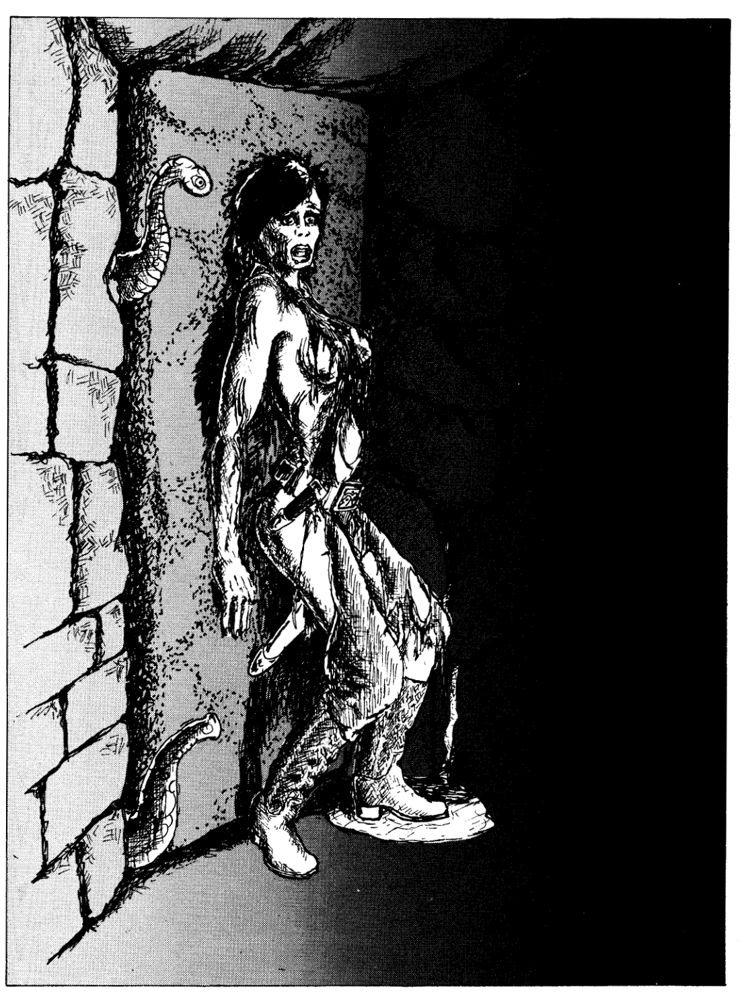

> [@JG102_The_Caverns_of_Thracia, _p._ _59_]

<!-- The Caverns of Thracia, Page 060 -->

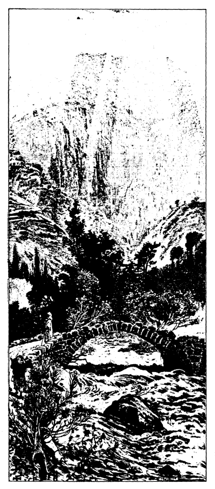

> [@JG102_The_Caverns_of_Thracia, _p._ _60_]

<!-- The Caverns of Thracia, Page 061 -->

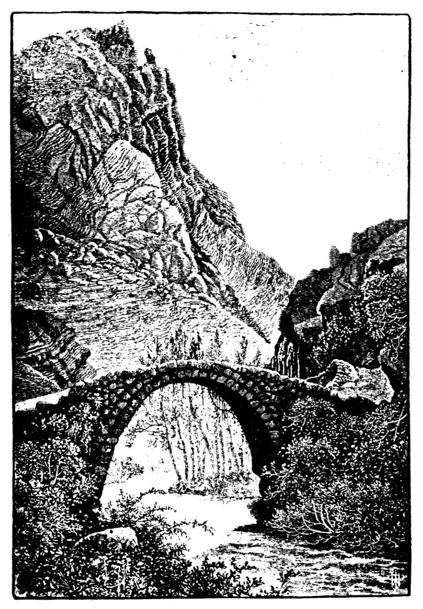

> [@JG102_The_Caverns_of_Thracia, _p._ _61_]

<!-- Begin: JG102_The_Caverns_of_Thracia_05_Caverns_Level_03_62-73 -->

<!-- The Caverns of Thracia, Page 062 -->

# Level 3

> [@JG102_The_Caverns_of_Thracia, _p._ _62_]

<!-- The Caverns of Thracia, Page 063 -->

## Level Three

This level is the palace and garden that once belonged to the Thracian King, Agamemnos. This whole level, at least the "outdoors" part of it, is lit by an intensely powerful light that almost, but not quite, equals sunlight. There is a thin layer of cloud near the ceiling that covers the stalactites and any activity that may occur up there. The only known access to this level is via the teleportation pads located at Number 54 near the east end of the gardens and Room 89 in the palace. The garden is patrolled by Gnolls and Lizard Men who will attempt to capture anyone they find. In the east end of the garden there will be numerous Dryads. They are deathly afraid of the Beast Men and will do nothing to aid any group of adventurers, even if it may mean defeat of the Minotaur and his minions.

54\) **Teleportation Pad**: This circular area is rimmed by low trees that bear fruit continually. The fruit are fist-sized strawberries. They are quite nutritious and will serve as both water and rations. They do not keep well, however, and must be eaten within 1 day of picking or they go mushy and rot. 6 Gnolls will be on guard here. One or two will be plucking and eating fruit while the rest are on guard. They will be in the shade of the trees so that they will be somewhat covered and camouflaged. Each Gnoll is armed with a Longbow and a Halberd. AC: 5, Move: 9", HD: 2, Damage: 1-6 with Bow, 1-10 with Halberd, HP: 13, 7, 8, 5, 10, 9. The teleportation pad is activated by standing on the 10' square section at the center of the pad for one full melee round. Any being standing in that area will be teleported to the pad in Temple 45 on the 2nd level.

55\) **Transparent Tower of Water**: This item is a complete mystery to the occupants of this level. It is apparently a 10' diameter transparent tube containing sparkling, bubbling water that seems to rise 200' from the floor of the garden up to the ceiling of the great cavern. It is assumed that this is the source of the river. This tube goes through Room 117 down below the surface of the garden and rises up to Room or Chamber 34 on the 2nd level. The tube itself is AC: -8 and any given section must take 100 hit points for it to be cracked.

56-65\) **The Dryads**: Each Dryad will be individually described, but to save time and space, the consistent statistics will be listed here and can be referred back to when necessary. AC: 5, Move: 12", HD: 2, Damage: 1-4, HP: see below. These Dryads will not willingly go further than 240' from their trees (6" on the map). Each Dryad has unlimited use of a +2 Charm Person spell (the +2 is in the Dryad's favor). The Dryads will not Charm or fight the Gnolls normally, as their uprooting and destruction has been threatened if they cause any trouble.

56\) **Astraea**: Her tree is an Oak. HP: 13.

57\) **Briseis**: Her tree is an Ash. HP: 12.

58\) **Calliste**: Her tree is an Elm. HP: 14.

59\) **Deianira**: Her tree is an Oak. HP: 6.

60\) **Eidothera**: Her tree is a Maple. HP: 14.

61\) **Flora**: Her tree is a Hickory. HP: 15. She is aware of a trap door hidden beneath the sod on the south side of her tree's trunk. She is not certain what it is, only that it has been there longer than she has.

62\) **Gaia**: Her tree is a Walnut. HP: 10.

63\) **Hypermnestra**: Her tree is an Ash. HP: 7.

64\) **Iphigenia**: Her tree is a Willow. HP: 12.

65\) **Jocasta**: Her tree is an Oak. HP: 12.

> [@JG102_The_Caverns_of_Thracia, _p._ _63_]

<!-- The Caverns of Thracia, Page 064 -->

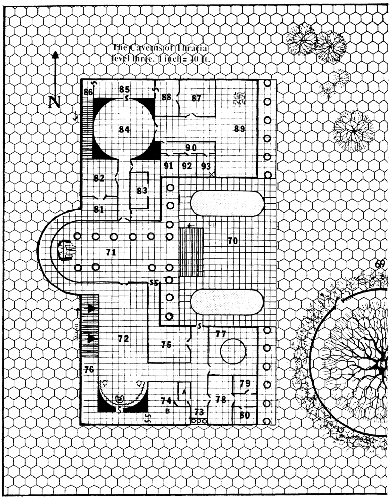

> [@JG102_The_Caverns_of_Thracia, _p._ _64_]

<!-- The Caverns of Thracia, Page 065 -->

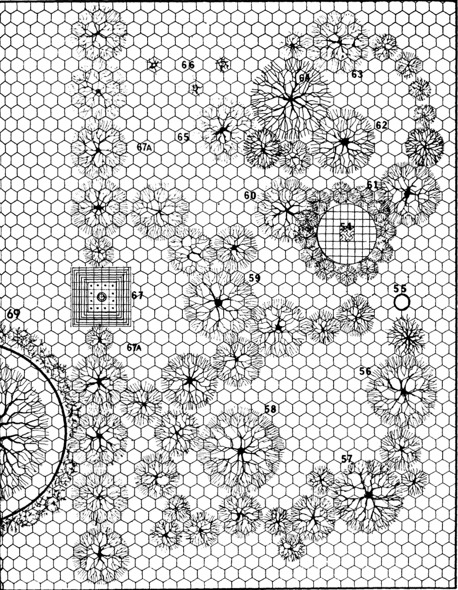

> [@JG102_The_Caverns_of_Thracia, _p._ _65_]

<!-- The Caverns of Thracia, Page 066 -->

66\) **The Stumps of Lost Trees**: Recently the Minotaur King has been removing trees to fuel the boilers in the cellars beneath his palace. The supply of wood from the surface has dwindled lately (the Tribesmen are flexing their muscles and refusing to pay tribute to the Minotaur King). Several of the removed trees were Dryad-containing trees. Their loss is mourned and if this information is used as a verbal weapon, the Dryads' aid might be gained against the minions of the Minotaur.

67\) **Chapel of the Wondrous Well**: This small, Greek-looking temple is flanked on all sides by a 10' stair that rises vertically only 5'. It is roofed over and in its center is a 5' diameter well that may seem to contain water. Climbing more than 10' down into the well will teleport the character doing so to the center of Room 3 on the 1st level. However, this will work effectively for a total of 4 characters. After that there is a 5% cumulative chance that it will not work each time it is used. If it ever stops functioning, it will cease to function forever. This chapel is the only safe passage through the tree wall (67A) and is guarded by a Minotaur, 5 Gnolls and 2 Lizard Men. Minotaur: AC: 6, Move: 12", HD: 6, Damage: Butt for 2-8, Bite for 1-3 and Halberd for 1-10, HP: 31. 5 Gnolls: AC: 5, Move: 9", HD: 2, Damage: Longbow for 1-6, Battle Axe for 1-8, HP: 8, 12 (x2), 14, 15. Lizard Men: AC: 4, Move: 6", HD: 2 + 1, Damage: Club for 1-8, 4 Darts for 1-4 each, HP: 10, 6. One of the Gnolls will be posted in the clump of trees near the teleportation pad and will report back to the guard group at the chapel.

67 A\) **Aroused and Evil Trees**: This row of trees were planted and trained by the Shamen, G'ruk, to act as a vicious fence to keep out unwanted intruders. The trees will allow cows, Minotaurs, Lizard Men, and Gnolls to pass freely beneath them. But, if a Human approaches within 50' of them, they will lower a network of branches that will act like a barrier of thorns to any character trying to cut his way through. Trees: AC: 5, HD: 6, Damage: 3 attacks per turn at 1-8, HP: 33, 24 (x2), 37, 16, 21, 46, 27, 23, 26 (ten trees total). To cut a path through the thorn fence of the trees, a total of 40 hit points must be done to the fence. This will create an approximately man-sized tunnel, 15' long through the thorny barrier. This damage does not count as damage done against the trees themselves. To kill the trees, the trunks must first be reached. At least 20 hit points must be done to the thorn barrier that even surrounds the tree trunks. The thorns are AC: 7. The sap of these trees is fire-resistant and has a healing quality. If it is allowed to flow onto a wound, it will heal 1-8 points of damage per character.

68\) **The Ancient Oak**: This walled-in oak tree existed from the time of King Agamemnos over 1100 years ago. It houses an ancient and wise Dryad named Kore. She appears as a middle-aged, yet attractive woman. From the vantage point of the air or from the steps of the chapel (67) she can often be seen sunning herself between patches of shade on the lawn surrounding her tree. In fact, she will often couch her head on the scaly hide of the Golden Lizard that guards her tree. The lizard is not very intelligent and it will not distinguish between friend or foe. It has kept her safe for a millennium now, but both it and the Dryad are slowly dying. Even now his scales are losing their shine and her tree is becoming patchy with bare spots amongst the branches. Lizard: AC: 3, Move: 9", HD: 15, Damage: Bite for 4-24, 2 Claws for 2-12 each, HP: 59. The lizard has been permanently endowed with Protection from Normal Missiles. Kore, the Dryad: AC: 5, Move: 12", HD: 2, Damage: 1-4, spells: +2 Charm Person. She knows her way about in the south wing of the palace and can give directions concerning the north wing. She has never been into the tunnels beneath and knows nothing of them. Not even hearsay. Because she is not a threat, the Beast Men have left her alone. But lately, the Minotaur King and his lieutenants have been eyeing her tree for the wood value.

69\) **Jailers for a Noble Tree**: Surrounding the tree is a 12' tall stone wall that is topped with spikes and large pieces of broken glass. The sharpened spikes point outward. There is a gate to the northwest that is hidden by the brambles that guard the enclosure. The brambles are AC: 4 (tough!!) and require 50 hit points of damage to be given before a man-sized hole or passage can be cut through them. When cut, these brambles exude sickly smelling vapor that will cause sleep if a saving throw vs. poison is not made. Sleep will last for a number of turns equal to the character's constitution subtracted from 20. If a character falls asleep in a path cut through the brambles and is left there, the brambles will regenerate 2 hit points every melee round (they grow back swiftly) and if they regenerate back half the damage taken they will begin to absorb 1 life level every two melee rounds from a sleeping victim, who if he awakens will have to cut him or herself free of brambles. Fire will do damage to the plants, but it will not spread.

> [@JG102_The_Caverns_of_Thracia, _p._ _66_]

<!-- The Caverns of Thracia, Page 067 -->

Guarding against aerial attack are 5 Harpies. They will sit on the southeastern roof of the palace and watch with malevolent little eyes as adventurers sneak by. If an assault is made on the hedge, they will swoop down, harassing and attempting to Charm and lead victims away to be devoured. If an attempt to reach the Dryad is made through the air, the Harpies will immediately attack to kill. AC: 7, Move: 6"/15", Damage: 2 Claws for 1-3 each, and a Sword for 1-6, HP: 15 (x2), 11, 9, 19.

**The Palace of the Minotaur King**: This gleaming marble structure appears very Greek in design with a gabled roof, ionic columns and sculpture-filled pediments. Although most of the original furnishings of the palace are long gone from continual use, the building itself remains structurally sound. The rulers of this place have not allowed their subjects to deface the rooms and statuary.

70\) **The Courtyard**: The courtyard of the palace is tiled with large, white marble panels. The two pools of water that flank the stairs going up into the palace itself are 10' deep and the water in them is 100 degrees Fahrenheit. The level of the floor of the palace itself is 10' higher than the level of the courtyard. Guarding the courtyard is a 5-headed Hydra, AC: 5, Move: 12", HD: 5, Damage: 5 Bites at 1-6 each, HP: 35. If wounded badly, the creature will try to escape into the temple area and raise an incredibly loud hissing and honking noise to draw reinforcements, which will come in the form of a group of wandering monsters from the Palace Encounter Table (if the encounter rolled is not one that would normally come to the aid of an embattled Hydra, the creature will have to finish its battle unaided). Embedded between the eyes of each head is a 100 GP sapphire.

71\) **Temple Hall of the God, Zeus**: The stonework in this hall is ornately carved and richly decorated with scenes of battle, magic and the lives of the gods. Behind the statue on the west wall are a pair of crossed thunderbolts. The statue at the west end of the hall is of the god, Zeus. It appears as a bearded, muscular man clutching a pair of crossed thunderbolts in his right hand. If the statue is approached within 20', the sounds of thunder can be heard as if from a distance. The throne upon which the statue sits appears to be constructed of solid gold. It is not and is merely gilt marble (the gilding is worth over 1000 GP though). If the statue is touched, the toucher will receive a mild, harmless, but tingly electric shock. The doors in the north wall seem to be constructed of solid gold, as do the doors in the south wall. Actually they are gilt wood. The secret doors in the south wall are disguised as relief sculpture panels.

72\) **Throne Room of the Minotaur King**: This ornate room is where the Minotaur King holds his occasional court. The floor is carpeted, but the carpet is very worn and threadbare in places, with the marble floor showing through. The walls are decorated with alternating panels of low relief sculpture and panels of intricately wrought paintings of hunts, ceremonies, banquets, and orgies. The throne is large and crudely sculpted out of black stone with little or no decoration. It is, however, large enough to support the Minotaur's huge frame. The draperies on the walls behind the throne part in the middle and are woven of very tough fabric. They are a bit brittle with age though. The braziers to the right and left of the throne are wrought of iron and are quite rusty. They are usually lit and produce a dim light with little smoke. They are the only light in the room. There is a 30% chance that the first time the room is entered the Minotaur will be holding court and will have a squad of Gnolls present and one of his lieutenants, the Dog Brothers in attendance.

**Stronghoen, The Minotaur King**: AC: 6, Move: 12", HD: 8, Damage: 1 Butt for 2-12, 1 Bite for 1-6, Battle Axe for 2-16, HP: 50. This Minotaur is the descendant of a long line of Minotaurs who have consistently produced intelligent offspring. It is suspected that his ancestors were magically altered in some way. Not only does this monster function as a powerful fighter, but he may also throw magic as a 6th level Magician with the following spells available: Charm Person (x2), Shield, Sleep, Invisibility, Wizard Lock, Fireball, Haste (these spells may be changed at the discretion of the referee).

The Gnoll squad is made up of 6 Gnolls armed with two-handed Swords. Three of the Gnolls will have Longbows. AC: 5, Move: 9", HD: 2, Damage: 1-6 with Longbow, 1-10 with Two-handed Sword, HP: 8 (x2), 9, 10, 14, 11. Each Gnoll will have 7 SP and 6 GP on his person.

**Dog Brothers**: These are a crew of intelligent, man-like dogs. They act as guides and overseers for the rapacious Gnolls. These dog-men will rarely be seen outside of the palace level or its dungeon complex. If they are encountered, it will be as a commander of a Gnoll guard squad. The

> [@JG102_The_Caverns_of_Thracia, _p._ _67_]

<!-- The Caverns of Thracia, Page 068 -->

**Dog Brother, Bitterbark**: AC: 6, Move: 12", HD: 4, Damage: Bite for 1-4 or by weapon type, in this case, a Sword for 1-8, Align: Neutral, HP: 17. Often a Dog Brother may operate solely as a Magic User, never going beyond the 5th level of expertise. If the court is attacked, the Minotaur King and the Dog Brother will stick around long enough to ascertain the direction the battle is going and then if in danger leave by the quickest route available.

73\) **The Singing Caryatids**: Three Caryatids (columns that are carved as sculptures, in this case as three beautiful nude women) support the lintel over this window. The caryatids are 8' tall and carved from white marble. From the floor to the ledge upon which they stand, the distance is 3'. From the outside lawn, the distance is 13'. If these sculptures are touched in any way, they will begin to sing beautifully, but loudly. This action will definitely draw the attention of any being in the southern wing of the palace. The singing also has the function that it acts as a Hold Person spell on any creature hearing it for the first time. However, a being listening to it may save as two levels higher. The singing will last 1 full turn and the Hold spell will last the entire duration. There is no way to stop the singing until it is finished, save destroying the statuary.

74 A\) **Storeroom Clerk's Office**: Seated at a desk in the north end of this room is a little man, about 40-50 years old named Grassus, AC: 9, Move: 12", HD: 1, Damage: Dagger for 1-4, HP: 7, STR: 13, INT: 13, WIS: 16, DEX: 12, CON: 14, CHR: 15. He can converse in the tongue of the Tribesmen, Gnollic, Minotaur and can read a smattering of the Thracian language (he cannot speak it though). Grassus is the clerk in charge of the Minotaur King's food stores. He is a trusted slave and he prefers his position with the Beast Men to any possibility of freedom. Given the chance, he will escape and betray any intruders to his masters. If the room is entered, he will be going over the list of stores, written in Thracian, since the Tribesmen have no written language and the Beast Men's tongues are not suited to clerkly material. There will be 2 Gnolls in this room engaged in idle conversation and armed with Swords. AC: 5, Move: 9", HD: 2, Damage: 1-8 with Sword, HP: 13, 8. If attacked they will yell for help to come from Room 74B.

74 B\) **Storeroom**: This is the palace's food warehouse. The walls are lined with shelves that are packed with urns, amphorae and boxes containing various foodstuffs. Items included will be: grain, wine, olive oil, dried meat (beef and Human), hard cakes, honey, nuts, flour, wild rice, spices, salt, dried fruit (apples and pears) and onions. The secret doors will be visible if the pile of boxes containing dried figs is moved. Guarding this room and supervising the Human slaves who are taking inventory are a patrol of 6 Gnolls, AC: 5, Move: 9", HD: 2, Damage: Morning Stars for 1-8, HP: 11 (x2), 9, 8, 5, 14, and a Dog Brother named Wuffletree, AC: 6, Move: 12", HD: 4, Damage: Bite for 1-4 plus 2 Daggers for 1-4 each, HP: 13, spells: Charm Person, Detect Magic, Hold Portal, Sleep, Phantasmal Forces, Pyrotechnics, Haste Spell. Wuffletree values his hide in the extreme and if faced with certain death (or even the possibility of death), he will surrender or flee.

75\) **Lair of the Minotaur King**: This is the chamber that the King of the Beast Men calls home. It is high ceilinged and lit both by skylights and by the fire that 3 Minotauresses, paragons of bovine beauty, are tending upon which turns a spit containing the roasted carcass of a Human female. Running about the room will be 2 small Minotaur calves, butting and playing. There is a 10% chance that the Minotaur King will be in here (see Room 72). Minotaur Females: AC: 6, Move: 12", HD: 5, Damage: Butt for 2-8, Bite for 1-3 and/or Carving Knife for 1-6, HP: 29, 28, 20. The largest of the Minotaur Cows is the mother of the two calves and will fight berserkly (+2 hit probability and +10 hit points). The smallest Cow has a fairly high intelligence and has been taught to function as a 2nd level Magic User, using Charm Person (x2). The Minotaur Calves will attack immediately anything Human that does not resemble a slave and even then, they will roughhouse that person. The calves are only semi-intelligent and are always hungry. Calves: AC: 6, Move: 9", HD: 3, Damage: Butt for 1-6 points of damage and Bite for 1-2, HP: 13 (x2). The room is furnished with several stone benches draped with furs. One of the benches is actually a chest containing 1000 GP, and a Potion of Heroism. The "secret doors" to the temple are not secret from this side. However, they are trapped. If the stone face in the center of the right hand door is not spun so that it is upside down when the door is opened, a hail of large rocks will be dropped on top of victims for 4-24 points of damage each (no saving throw).

> [@JG102_The_Caverns_of_Thracia, _p._ _68_]

<!-- The Caverns of Thracia, Page 069 -->

76\) **Stairway into the Dungeons**: This stair leads down into the dungeons and lower recess of the palace itself. Since the Beast Men took over, the stair has been rigged with a pair of traps firing 3 Spears each (see Room 76 on Level 4 Map). These traps are maintained regularly and were set up to keep slaves from escaping this way or from bothering the Manticores in Room 94. The traps will be fired off horizontally to hit chest high at the point marked on the map. They will hit as if thrown by a heavy Crossbow being fired by an 8th level fighter. Any, repeat, any noise in this stair will alert the manticores to the presence of visitors. The manticores will then prepare an ambush if the correct password is not spoken. (Determine password in effect below.)

Passwords:
1) The Rocks Bleed Black Blood
2) Speak the Spell
3) Lost Lairs of the Lizard King
4) Dead Men Tell No Tales
5) Kill the Humans
6) Thanatos is Dead

If the password is spoken, the Manticores will judge the speaker to be alright. The commander of each patrol of all the different species will know the password.

77\) **Pool of Watery Wonders**: While this is not a magic pool, in and of itself, it can be used to work magical wonders. The pool was originally a bath and is still heated from below. The water is 120 degrees Fahrenheit and the room is filled with water vapor. The floor is tiled with glazed ceramic and set in various aquatic designs portraying fish, nymphs sea gods and sea monsters. Occasionally it is still used for this purpose by the Minotaur Cows in Room 75. It has a second purpose, much more arcane though. Located at the 4 cardinal points of the compass (N, E, S, W) are 4 white, marble bowls mounted on 3' tall pillars of black marble. The bowls are empty, but there is writing in magic on the rim of each bowl. The bowls are magic devices, using the water from the pools to power them. The Minotaur King knows the function of them, but he has never used any of them. If necessary to protect his domain, he will. The Dog Brother, Wuffletree, has used all functions of the pool (including bathing) except for its Conjure Elemental power.

**North Bowl**: This bowl's writing describes the process for summoning a water elemental. The process requires filling the bowl with water from the pool and speaking the proper ritual. The process will summon in one turn a 12 die water elemental that will use all the water in the pool to form itself. AC: 2, Move: 6", HD: 12, Damage: 3-30, HP: 53. It is immune to non-magic weapons.

**East Bowl**: The writing on this bowl describes a process by which the person casting the listed spell may cause the bowl to operate as a Locate Object spell of unlimited range (unlimited as far as the dungeon is concerned, it will not work on anything outside of the caverns). Once the water is magicked, a needle or pointer will seem to appear on the surface of the liquid and point in the direction of the desired object, even pointing up or down. The bowl is designed so that the water may be poured off into a different vessel and thus become portable. Once the item is found, the water vaporizes (doing 1-3 points of damage to whoever is holding the bowl or container, unless they are protected from heat damage). Spell will last 1-6 hours.

**South Bowl**: This bowl will function as a special clairvoyance spell when properly magicked. It will reveal any desired location within the caverns of Thracia. It will reveal up to 4 separate locations (if a random room is asked for or if no specific room is desired, roll on a d100 and check the room indicated). The room desired will appear in the large pool.

**West Bowl**: This bowl is the teleportation bowl. It specifies that for it to work, the south bowl must first be activated and a destination determined (you see, it only works inside the caverns and provides a one-way trip). Then the east bowl must be brought into function and the locate object power brought to bear on the room depicted on the pool. At this point the teleportation unit is primed and the image in the pool will disappear. As long as there is water in the three bowls and the pool it will stay primed. There is a cord on the underside of the west bowl that will open up a drain in the bottom of the vessel. Once pulled the bowl will drain in 1 melee round. The teleport is activated by jumping into the 4' deep pool. The jumper will then arrive, slightly damp, at the predetermined site. If neither the clairvoyance bowl, nor the locate bowl is used then a random destination will be determined and those entering the pool will be sent there. However, there will be an error factor of 1-10 involved. See below.

A roll on the percentile die of 01-50% indicates that teleportees reached their destination with an error factor of no more than 1-6" too high, incurring no damage as they land, only a lack

> [@JG102_The_Caverns_of_Thracia, _p._ _69_]

<!-- The Caverns of Thracia, Page 070 -->

of initiative if placed in a problem situation (subtract 1 point from initiative roll for each inch that a teleportee lands too high). A roll of 51-90% indicates that the teleportees came in 1-20' too high and a resultant drop will do damage equal to 1d6 per 10' of fall. Also, victims may lose a chance for an initiative roll (this is up to the referee) if they are dropped into a situation requiring such a roll to be made.

A roll of 91-00% indicates that the victim has come in too low by 1-10'. This could have several possible results (mostly instant death) and it should be up to the referee to determine those results on the situation involved.

The only escape from death when a limb or limbs are partially entrapped is by immediate severance of the trapped member, but this should be up to the referee.

Back to the bowls. Removing them will destroy their power.

A water elemental may be sent through the teleport by setting up the teleport and then creating the elemental who will then be sent to the desired location, emptying the pool of all water. This is one way in which the Minotaur King might wreak revenge on intruders. Set up the locate so that it shows the offending party, wherever he, she or they are, and send the elemental through to them, maintaining control by viewing the scene in the clairvoyance bowl. The water in the pool will refill in three turns.

78\) **Weapons Room of the Dog Brothers**: This is a once ornate room that has ratty drapes that hang from the ceiling down to about 10' from the floor. The drapes are torn and ragged (what remains of them) and all color has either faded from them or is covered by dense soot. The ceiling and upper walls are also coated with a thick layer of carbon black. The room is lit by light filtering in from the skylights in the ceiling and from the campfire in the south end of the room. Several shields of tribesmen hang from the walls and in the northeast corner is a pile of weapons containing a stone mace, a bronze sword, a morning star, a two-handed sword (broken at the hilt, it is in two pieces) and a spiked ball off of another morning star. Two lizard men will be practicing with weapons while a third looks on. Lizard men: AC: 4, Move: 6", HD: 2 + 1, Damage: club for 1-8, 4 darts at 1-4 each, HP: 11, 13, 10. The heavy wooden doors on the east wall are barred from the other side to prevent entry.

79\) **Lush Lair of a Dog Brother**: The short hall connecting rooms 79 & 80 is dark except for a flickering candle stuck in a sconce at the east end of the corridor. The door to room 79 is ornately carved with images of goddesses and concubines. The room itself is illuminated by a pair of candles that glow with continual light. If other portions of the palace are grim and devoid of finery, then here it must all be collected. Rich, bright tapestries hang on the walls, depicting the goddess of love and her paramours. The floor is covered with a deep luxurious carpet of brilliant color. The east end of the room is deep with cushions and furs. A low table at the west end is set with artfully cut crystal ware. There are ripe fruits set out and on the table is a huge roast of beef, seemingly simmering with juices. The table is magic. It will conjure up enough food to feed eight people daily. The food will always be different from day to day and it will be rich and tasty. (Create Food spells were never like this!!) The table is delicate. If dropped it will splinter and break. Its weight, at most, is no more than 250 gp and it is 3' x 3' x 2 1/2'. There is a 25% chance that it will still function, but that the food it produces will be foul tasting or foul looking and have a 40% chance of being poisonous. Two female dog brothers named Spittletongue and Sniffletail (dog sisters in this case) will be in this chamber. One will be eating at the table, the other will be giving suck to a litter of 6 pups. AC: 6, Move: 12", HD: 4, Damage: bite for 1-4 +1 dagger for 1-4, HP: 18, 18. The pups are AC: 9, HD: %, HP: 5, 5, 5, 5, 5, 5.

80\) **A Second Lush Lair**: This room is much the same as room 79. The door into it is carved with scenes of passion. The room itself is hung with ornate draperies, sewn and stitched artfully with gold and silver thread. The floor is thickly carpeted and cushions lie about everywhere. There is a tray of food on the floor containing 4 goblets of wine, a huge portion of roast beef and several spice cakes. A dog brother, Wark, AC: 6, Move: 12", HD: 4, Damage: sword for 1-8 and bite for 1-4, HP: 20, is being entertained by a trio of comely (to another dog brother) young dog sisters, Flashtail, Prettyclaws and Pinkfang, AC: 6, Move: 12", Damage: bite for 1-4, HD: 4, HP: 26, 19, 25. There is a chest against the north wall covered by furs containing 8000 cp and 2000 gp.

81\) **A Gnollic Guardpoint**: Ever watchful at this point are a squad of 6 gnolls, AC: 5, Move: 9", HD: 2, Damage: two-handed swords for 1-10, HP: 9, 8, 7, 10, 10, 6. The air in this room, besides being

> [@JG102_The_Caverns_of_Thracia, _p._ _70_]

<!-- The Caverns of Thracia, Page 071 -->

permeated with the odor of raunchy gnoll, smells heavily of cooked food. Each gnoll will have 4 sp & 2 gp on his person. A fracas in here will draw wary minotaurs from room 82.

82\) **Kitchen**: This steamy, warm room is the kitchen for the bulk of the troops living in the palace. The food cooked here is neither eye-appealing nor taste-tempting. It all looks like a grey mush with greasy lumps floating in it. If it can be gagged down, it will serve as rations. The stuff will also keep for up to a week, then it will begin to get moldy (which actually seems to improve the taste, even though eating it then will cause botulism - a form of food poisoning). Tending the kitchen are 6 human slaves. The slaves have never known any other life than living in the palace. They speak the language of tribesmen and Gnollic. They are AC: 9, Move: 9", HD: 1/2, Damage: 1-2 or by weapon type, HP: 1, 2, 4, 4, 3, 3. They are as follows: 2 attractive young females, a male child, an old woman and a young man. These particular slaves sleep here at night (a dimming of the overhead lights). They will be scared out of their wits by intruders. Guarding the slaves and the kitchen from invasions of hungry residents are a pair of minotaurs aptly named Moos and Horrni, AC: 5 (skin & shield), Move: 12", HD: 6, Damage: Butt for 2-8, bite for 1-3 or battle axe for 1-10, HP: 35, 31. These boys do not fight in silence and will moo for all they're worth while fighting. This will begin to draw at least one party of wandering monsters and should draw all troops within 50' into the fray.

83\) **Office of the Guard**: This is the chief guardroom and in it will be the commanders of the various beast-men, discussing placement of guards, expansion of patrols and procurement of more slaves and supplies. Gradsh, commander of the gnolls, AC: 5, Move: 9", HD: 2, Damage: two-handed sword for 1-10, HP: 16. Bullick, chief of the minotaurs and second in command only to the Minotaur King (also his oldest son), AC: 6, Move: 9", HD: 6, Damage: battle axe for 1-12, HP: 43. Barkbite, hetman of the dog brothers, AC: 4, Move: 12", HD: 4, Damage: sword for 1-8 and/or bite for 1-4, HP: 30. Hssssdk, warleader of the lizard men mercenaries, AC: 4, Move: 6"/12' (swimming), HD: 2 + 1, Damage: sawtoothed club for 2-9, 4 darts for 1-4 each, HP: 16. There will be a gnoll guard, AC: 5, Move: 9", HD: 2, Damage: halberd for 1-10, HP: 11, 14 at each of the doors to the hall. They will be inside the 83 area (the halls, not the room) with their backs against the east wall, facing west very alert. In this room will be a locked case containing the valuables of the commanders. The case will contain 4000 cp and 2000 gp, in small bags of 100 coins each. There will be crude maps of the dungeon complex known to the beast-men rolled up on a desk. The maps will include portions of the first, second, third and fourth levels, but no secret areas or sublevels will be indicated.

84\) **Beam of Blasting Light**: This room is a large dome, 50' in diameter and 40' from floor to peak. Although there is no hole in the ceiling, there appears to be a shaft of sunlight coming out of the ceiling. The light forms a 10' diameter circle on the floor, directly in front of the secret door. The sound of light sizzling can be heard. Chained in the center of the floor and spread-eagled, face up, is a 4th level tribesman cleric named Holoste. He was captured by a lizard men patrol and was the only member of his band not to be torn apart and eaten. He is AC: 9, Align: LE, Move: 12", HD: 4, Damage: by weapon type, HP: 21, Spells: Cure Light Wounds, Protection from Good, Find Traps. His group was caught on level 2 in room 31. The shaft of light is slowly moving down the wall and has reached the floor, moving at a rate of 5' per turn. In three turns the light will be falling on Holoste. The light does 8d6 of damage every round. The light causes intense heat. A saving throw vs. dragon breath will save the victim from half the damage. There will be 3 gnoll cubs waiting for Holoste to die (see room 87).

85\) **An... Empty Room**: Yes! In every dungeon complex there has to be at least one. A room with nothing interesting in it. A space to rest momentarily from pursuit. A place no monster would think to look. This is one of those places. Except for a giant pair of baleful, glowing amber-colored eyes on the north wall and secret doors hidden in the east, west, and south walls, disguised as unadorned marble panels, there is nothing here. Did I mention that the eyes radiate a definite feeling of evil and seem to chill the very soul? Well, they do. Any character staying in this room more than 3 melee rounds must save vs. magic or he will think he is being paralyzed (a delusion).

86\) **Hall of Harrowing Hands**: (Actually this is a stairway, but stair isn't alliterative with hands.) When this room is entered, the walls will seem to sprout hands on long arms. The hands will be the temperature of rock but will be fairly soft. All they will do is feel anything passing through them. The walls on both the east and west sides of the stair will sprout hands for a distance of 20' down the stairway.

> [@JG102_The_Caverns_of_Thracia, _p._ _71_]

<!-- The Caverns of Thracia, Page 072 -->

> [@JG102_The_Caverns_of_Thracia, _p._ _72_]

<!-- The Caverns of Thracia, Page 073 -->

The hands are harmless unless they are attacked (AC: 8, Move: 0, HD: %, Damage: attack as 4 hit dice monsters for 1-4 each, HP: 2 (x70)). Each 10' section of wall will contain 10 hands. The arms telescope and can reach 6' out into the stairwell. Fire will not harm the hands, but a fireball will paralyze them for 1-4 melee rounds. Once the hands have been irritated, they will not calm down for 12 turns and will try to attack anything trying to pass through at that time. (2-8 will attack each person each round.) They will continue to remain agitated for 2 hours after every encounter in which they are damaged or attacked.

87\) **Habitat of Gnoll Females and Cubs**: Whatever this room may have served for before, it is now the home for 20 female gnolls, AC: 7, Move: 9", HD: 2, Damage: 1-8 or by weapon type, HP: roll as necessary. These female gnolls will normally not attack if the room is entered. Nor will they get upset if a cub is killed. However, if the females themselves are attacked or intruders begin a wholesale slaughter of the young, they will attack and fight to the death. Along with the females are 35 cubs that are from a few weeks old to almost a year old. The gnoll matures quickly and within four and a half years they are full grown and capable of reproducing. The cubs are AC: 7, Move: 8", HD: %, Damage: bite for 1-3, HP: roll as necessary. Roll a d6 to determine size. A 1-3 indicates hit dice are d4s. A 4-5 indicate full d8s and a roll of 6 indicates an almost full-grown youngster who ought to be in military training with 1 + 1 hit dice.

88\) **The Inner Habitat**: These are the older gnoll matrons whose wisdom rules this small tribe. Gnoll males only know how to bully and fight, so the females must control the society, allowing the males to think they are in control and making the decisions. There are 6 old gnoll females in here, AC: 7, Move: 6", HD: 2, Damage: bite for 1-3, HP: 12, 11, 2, 9, 14, 8. They will have 3 or 4 young cubs, HD: % in the room with them. In a box in the NE corner (an old gnoll is sitting on it) are 1000 gp and 5 small semi-precious stones - 4 100 gp ambers and 1 50 gp turquoise.

89\) **Temple of Teleportation**: This is yet another temple area in the palace. The 10' square patterned area on the map represents a 3rd teleportation pad that will take troops directly to the pad in room 54. In baskets to either side of the pad are small glass marbles. If one of these marbles is carried on the pad and the pad in room 45 is activated, the teleportee will be transported to room 45 instead of room 54. For safety's sake, none of the troops garrisoned on the first and second levels carry these marbles. Guarding this area are 4 warrior minotaurs, AC: 6, Move: 12", HD: 6, Damage: butt for 2-8, bite for 1-3 or battle axe for 1-10, HP: 32, 25, 23, 34. The upper reaches of the walls are decorated with friezes of titanic battles between beast-headed men and heroic gods and goddesses. Located at the north and south ends of the room are piles of rubble that appear to have once been statues.

90\) **Connecting Hall**: This short hall connects the three gnollic warrior barracks together. There is a 50% chance that a single guard will be on duty here at all times. AC: 5, Move: 9", HD: 2, Damage: 1-6 with crossbow and 1-8 with morning-star, HP: 11.

91-93\) **The Barracks of the Gnoll Guards**: These three rooms house the warlike male gnolls of the tribe. Each room quarters approximately 20 gnolls (patrols are in and out so often that it is never certain where a specific gnoll will be at a given time). They just sleep here when off duty on this level. Because of the transient nature of the occupants, there will be no treasure in this room, except what is on the person of the individual creatures. Each room will have from 6-11 occupants in it at all times. Gnolls are AC: 5, Move: 9", HD: 2, Damage: 1-8 or by weapon type, HP: roll as necessary. At least 60% of the room's occupants will be asleep. The remainder will be eating and gambling for personal stakes. Each gnoll will have from 1-12 sp and 1-8 gp. In the southeast corner of room 93 is a 5' square secret trapdoor on the floor. It opens on a 5' square shaft with stone walls and rungs set into the stone. It goes downward 70' to room 115. This trapdoor is hidden from view by a pile of ratty sleeping rags.

> [@JG102_The_Caverns_of_Thracia, _p._ _73_]

<!-- Begin: JG102_The_Caverns_of_Thracia_06_Caverns_Level_04_74-78 -->

<!-- The Caverns of Thracia, Page 074 -->

# Level 4

## Level Four

94\) **The Manticores**: These are the two manticores mentioned in stairway 76. If any noise is made while descending the stair, the manticores will be alerted and will wait for a password (see 76) to be spoken. If the word is not spoken or is incorrect, they will attack, surprising on a d6 roll of 1-4, with volleys of spikes. The manticores are AC: 4, Move: 12"/18", HD: 6 + 1, Damage: 2 claws for 1-3 each and bite for 1-8 and 24 spikes for 1-6 each, HP: 41, 38. The ceiling of the room is 30' high and the walls are decorated with flaking wall paintings of sumptuous banquets and expansive gardens. There are a few rotting wood couches strewn about the room and some shattered marble slabs may have been tables. This was once a banquet hall. Leaning up against the north wall are 6 heavy ceramic urns. Each contains approximately 660 gold pieces. At the bottom of urns 1 and 5 are potion bottles. Number 1 is a potion of Hill Giant control while number 5 is polymorph self. In urn 6 is a +2 chaotic evil sword with a dark blue blade.

95\) **A Vacant Chamber**: The walls of the room are carved with bas-relief friezes of men fighting beasts of all sorts. Both doors out of (or into) this room are locked. If entered from the south or east there is a 25% chance that 1 or both manticores from room 94 will be in here.

96\) **A Lizard Men Guardpost**: There will be 4 lizard men, AC: 4, Move: 6", HD: 2 + 1, Damage: club for 1-8 and 4 darts for 1-4 each, HP: 8, 10, 11, 14. The heavy oak doors into this room are barred from the inside and will be -2 on breaking down. If more than one assault is made on a door, there will be 8 extra lizard men from room 97 waiting to do battle.

97\) **The Bilious Boiler Room**: This is the source of the hot water in the various pools and basins on this level of the palace. The boiler is a huge bronze contraption that is fired by wood placed in a firebox beneath it. The room is full of smoke and steam. Working the great pump bellows are 10 slaves while another 2 slaves feed wood into the firebox. Pipes lead up to the pools and are controlled by two large valves. Guarding this room are 10 lizard men, AC: 4, Move: 6", HD: 2 + 1, Damage: clubs for 1-8 and 4 darts for 1-4 each, HP: 7, 7, 7, 7, 11, 6, 4, 5, 9, 13. If these lizard men go into combat with intruders, at least 2 will always stay guard on to prevent any escape of the slaves. The slaves are all male and in pretty sorry shape, AC: 9, Move: 9", HD: 1/2, Damage: by weapon type only, HP: roll as necessary. The boiler is AC: 3 and it will require 25 hit points at any given location to puncture it. If the water is spilled out, it will do at least 1d8 of damage to any creature it touches (heat damage) for 2 melee rounds thereafter.

98\) **The Guard at the Pipe**: A single lizard man guards this pipe from damage and inspects for possible leaks. While it is not smokey down at this point, it is still steamy (the lizard men enjoy that). The lizard man is AC: 4, Move: 6", HD: 2 + 1, Damage: club for 1-8 and 4 darts for 1-4 each, HP: 11.

99\) **Barracks of the Lizard Men Mercenaries**: At any given time there will be 3-12 lizard men in this chamber, resting and devouring various disgusting foodstuffs. If surprised it will take them at least a full melee round to arm themselves. The lizard men are AC: 5 (they will not have shields immediately handy), Move: 6", HD: 2 + 1, Damage: 2 claws for 1-3 each and a bite for 1-8 or club for 1-8, HP: roll as necessary.

100\) **Shrine of the Ancient Ones and Treasure Vault**: This is the worship area of the lizard mercenaries. It is a form of ancestor worship. Over the centuries, the lizards have discovered various treasures and items that are both valuable and related to the ancient lizard culture that once existed. A simple stone carving of a lizard man is set up on a short piece of marble pillar and has flayed human skin draped over it. The eyes are mismatched, though. The left eye is a 1000 gp peridot and the right eye is a 5000 gp sapphire. Elsewhere on the carving there is a 500 gp jade stone and a 10 gp amber chip.

> [@JG102_The_Caverns_of_Thracia, _p._ _74_]

<!-- The Caverns of Thracia, Page 075 -->

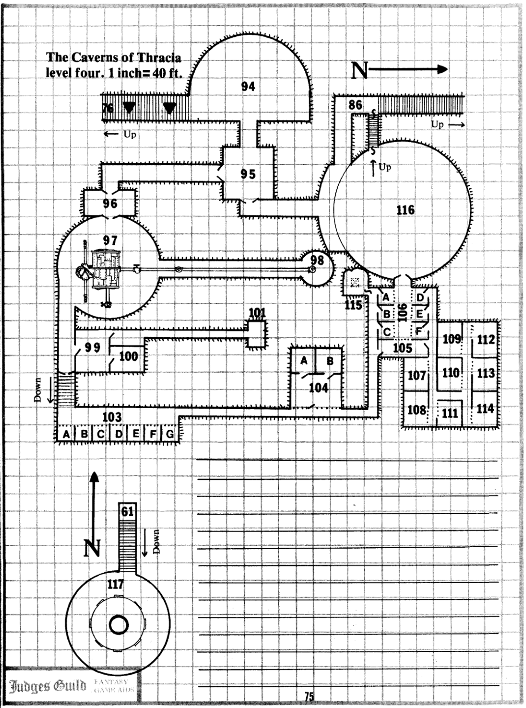

> [@JG102_The_Caverns_of_Thracia, _p._ _75_]

<!-- The Caverns of Thracia, Page 076 -->

On a tray in front of the small altar there rests two potions and a rolled scroll of some ancient, tough skin (possibly dinosaur hide). One of the potions is human control and the other invisibility. The scroll has a curse on it and will polymorph the opener into a small, extinct reptile, AC: 6, Move: 12", HD: 1, Damage: bite for 1-3, HP: 7 and unintelligent. A saving throw against magic is applicable. To read the scroll a *Read Languages* spell is necessary. It is a map that will lead to the location of the grand temple of the reptile race. It will only show the location of the door into the area from 53 and will also reveal the entrance to that chamber. This shrine is guarded by a pair of fanatic lizard men, AC: 4, Move: 6", HD: 2 + 1, Damage: club for 1-8 and 4 darts for 1-4 each, HP: 8, 8. Both lizard men know the function of the human control potion and will attempt to drink it if they are attacked. They do not know the function of the other potion, but are aware that the map is a great artifact, even though they do not know what it is. Stealing the shrine or its gems will cause every lizard man mercenary to desert his post and come looking for the thieves. Within 15 turns of the theft, they will have used the pool in room 77 through the help of one of the dog brothers, and from 5-25 lizard men will teleport directly to the location of the gems and fight like berserkers to the death to regain their holy object. This will continue once every 4 turns until a total of 60 lizard men have been killed or the shrine and its valuables are returned.

101\) **Green Slime Garderobe**: A garderobe is a medieval version of indoor plumbing. This room and 30' of the connecting hallway are coated in a thick, juicy layer of green slime (harmless). On the north wall of the room itself, in the center of that wall, it appears that there may be a door. There is not a door, it just looks like there might be one.

102\) **The Mysterious Missing Chamber**: Look as you might you will not find this room on the map. It never was there and exists only in the mind of the designer, who refuses to admit that he may have made an oversight when numbering his creation and doesn't feel like sticking the number "102" somewhere on the map and letting it go like that.

103\) **The Cells of the Tribesman Slaves**: All the tribesmen will be AC: 9, Move: 9", HD: 4, Damage: by weapon type only, HP: roll as necessary. During the "Daylight" hours, there will only be 1-2 slaves in each cell and they will be older ones. At night, all slaves will be in. They are taken to their various jobs around the palace up through room 97 over to stair 76 and into the throne room. Old slaves, useless to their masters, are left behind to take care of the cells.
A. 5 slaves: 3 men, two women
B. 4 slaves: 1 man, 2 old women, 1 girl
C. 5 slaves: 3 men, 1 woman, 1 boy
D. 4 slaves: 1 man, 3 old women
E. 5 slaves: 2 men, 2 women, 1 old man
F. 6 slaves: 1 man, 3 women, 1 old woman, 1 boy
G. 5 slaves: 2 women, 1 old man, 1 boy, 1 girl

104\) **The Torture Chamber**: Although this area is not normally used, captured adventurers will be brought here and placed into 104A. The door is solid oak and locked. All possessions will be placed in 104B except for items of obvious value which the gnolls and dog brother in charge of this area will place in room 115. The room contains various archaic modes of torture. Very few of them will be as sophisticated as current contraptions but they will do the job. If a character is indeed tortured (a 40% chance if they carried any valuables on them or spoke cryptically to their captors or if part of the intruder party got away) a mode of torture will be selected that will reduce a characteristic by 1 point for each full turn the torture is applied. Use this chart to determine the characteristic in a random manner: 1=Strength; 2=Intelligence; 3=Wisdom; 4=Dexterity; 5=Constitution; 6=Charisma, 7=2 characteristics will be affected, reroll; 8=1 will be affected, but twice as fast, reroll. The application of *Cure Serious Wounds* will heal 1-2 points of damage but may only be done once and to only 1 characteristic affected, when more than one is. A characteristic that is damaged will naturally heal back 1 point (in a month) but all other loss to that characteristic is permanent unless healed as above. A *Limited Wish* would also remove damage taken. Thus, if a character was tortured and lost 3 points of intelligence and 4 points of charisma, he would heal back 1 point of each in one month's time and a *Cure Critical Wounds* could reduce the damage further to one of the characteristics by an additional 1-2 points. Note: If Constitution is reduced below 3, the character will die. Characters should be informed each turn that they are tortured that they have lost a certain amount of points. Each time a character is tortured, the affected characteristic should be determined anew.

> [@JG102_The_Caverns_of_Thracia, _p._ _76_]

<!-- The Caverns of Thracia, Page 077 -->

This room is run by Dog Brother Fangfriend, AC: 6, Move: 12", HD: 4, Damage: Sword for 1-8 or Bite for 1-4, HP: 21; and three Gnolls, AC: 5, Move: 9", HD: 2, Damage: Halberds for 1-10, HP: 6, 11, 8. They know of their secret treasure secreted away in Room 115. If they are tortured or threatened with loss of life, they might reveal the location of the treasure.

105\) **An Abandoned Guard Room**: This room is devoid of contents, but it appears to have been once used as a guard room. On the west wall, to the south of the bars, there is a series of three levers. Pulling down on one of them will raise the bars in one of the left set of cells for Room 106. The lever that is farthest south of the bars will open gate A and so on. To the north of the bars on the same wall there is another set of 4 levers. The lever that is farthest north from the bars is down already and it will be visible that the gate in Room 106D is up. The lever closest to the bars will open the gate into Room 116 from Room 106.

106\) **Gladiatorial Cells**: In these cells the combatants in ancient gladiatorial contests were held. Now they are empty except for small rats and spiders. The floor is covered with ancient straw. The gates are all down except for Room D which is up. The doors to Room 116 are closed. The cell gates are controlled by levers in Room 105.

107-114\) **Ancient Animal Holding Cells**: These barred rooms were once used to keep the animals for gladiatorial combat. Various types of creatures were once kept in these rooms, but none now remain. Only three of these rooms contain anything at all and they are listed below:

108\) **Minotaur Lair I**: In this cell are a Minotaur Cow and her 2 Calves. The Cow is AC: 6, Move: 12", HD: 5, Damage: Butt for 2-8, Bite for 1-3 or Mace for 1-8, HP: 26. The two Calves are AC: 6, Move: 9", HD: 1/2, Damage: nil, HP: 3, 3. The Calves are only a week or so old. There are 600 GP in a wooden chest against the south wall.

111\) **Minotaur Lair II**: This lair also contains a Minotaur Cow, however, she is older and past child bearing. She has above average intelligence for a Minotaur. Her name is Bova, AC: 7, Move: 6", HD: 5, Damage: Butt for 2-5, Bite for 1-2, no weapon, Align: CN. She speaks Gnollic, Minotaur and Tribesman. The old lady is partially blind and if attacked she will not try to defend herself. Her grandson is the Minotaur King.

112\) **The Treasure Trove of the Minotaur King**: In this room there will always be a large Minotaur and a magic-using Dog Brother, guarding the King's treasure. The Minotaur, Thundahuuf, AC: 6, Move: 12", HD: 6, Damage: Battle Axe for 1-12, Butt for 2-8, and Bite for 1-3, HP: 40. The Dog Brother, Woofworth, AC: 6, Move: 12", HD: 4, Damage: Bite for 1-4 or two Daggers for 1-4 each, HP: 19, spells: *Charm Person* (x 3), *Magic Missile*, *Web* (x 2), *Haste*. The treasure consists of a large box of stone containing 2000 SP and 5000 GP. Buried under the coins is a locked iron box of ingenious design and ornately wrought, studded with 4 diamonds and valued at 4000 GP. This box may be opened, but doing so will release a creature exactly like the one guarding the chests in Room 33 (see 33 for details on the Disembodied Mouth). Inside the iron box is the following: a Ring of Contrariness, a Marble Elephant (the miscellaneous magic item), a Sword Sheath formed of thin plates of citrine valued at 1700 GP and a set of gold, silver and pink coral Beads worth 2900 GP. High, on an apparently empty shelf in the southeast corner of the room, is an invisible box. Not even the Minotaur King and his minions suspect its presence. Inside the box are two items, a glowing, green glass globe and a strange contraption made of brass that appears to be a box with a hand pointing upward on its top and a hand crank on its side. The glass globe is the powering element for the teleporter in Room 89. If it is broken or taken out of the palace, the glow will fade and the teleporter will cease to function, neither sending nor receiving. The brass box is a summoning agent for the basket that lowers from Room 126. By turning the crank and pointing the hand skyward, a small, magical electric force will be generated which will cause the basket to descend to the floor of the 3rd level. The crank must be turned continuously until the basket reaches the ground. It will only work outside of the palace. It will take approximately 1 full turn for the basket to descend and at least a melee round for it to be visible below the mists which blanket the ceiling of the cavern. These two items were hidden here by the last remaining Humans in the palace when the Beasts took over 1100 years ago.

> [@JG102_The_Caverns_of_Thracia, _p._ _77_]

<!-- The Caverns of Thracia, Page 078 -->

115\) **Torturers Treasure**: This small, roughly carved room has a chimney of shaft leading up from its low (6') ceiling to Room 93. Buried under a tile in the floor and covered with dirt is the treasure that the torturers in Room 104 have extorted from their victims. The treasure consists of 200 SP, a Silver Amulet worth 50 GP and a Cloak woven of mithril thread/wire and studded with bloodstones valued at 2300 GP.

116\) **An Ancient Arena**: This large room has a sand covered floor. The distance from floor to ceiling is 40'. The open section along the south wall originally housed ornate box seats and elegant draperies. All that remains are a few shattered statues and some ratty shreds of faded fabric. The distance from the sand floor of the arena to the balcony is 20'. There is a 25% chance that a band of Lizard Men will be in here practicing with swords. If so there will be 6 Lizard Men, AC: 4, Move: 6, HD: 2 + 1, Damage: 1-8 with Sword, HP: 9 (x3), 13, 11 (x2). The Lizard Men will be at -1 hit probability because of unfamiliarity with their weapons.

117\) **The Lost Escape Tubes**: This is another secret device whose purpose and knowledge of existence was lost in the Beast Man coup over 1100 years previous. Located under the roots of Tree 61 is a rusted bronze trap door. It is covered by several inches of sod and dirt. If the dirt is moved, a 5' square, verdigrised bronze door will be visible. This must be pried open to reveal a 10' drop to a 10' square room with a stair leading down out of the south side. The stair opens up on a large circular room with a 30' ceiling. There will be roots hanging down from the ceiling. The prepossessing item in the room though, is a polished bronze dome in the center of the room. It is 30' in diameter. Rising up from the center of the dome is a 10' diameter transparent pillar that seems to be filled with gurgling water, rising upward. Located at 8 points about the circumference of the dome are openings with hinged doors on them. If these doors are climbed into and sealed from the inside, it will form eight small can-like containers which will then be released into the rising water and be carried up to the 2nd level to rise up in Area 34 and float down stream. If passage is not stopped by the spiderweb at 32, it definitely will be stopped by the bridge at 28. This whole complex was designed as a last resort escape route but was never used.

This ends the description of the rooms, chamber, caverns and traps of The Caverns of Thracia.

Happy Adventuring! Jennell Jaquays

> [@JG102_The_Caverns_of_Thracia, _p._ _78_]

<!-- Begin: JG102_The_Caverns_of_Thracia_07_Outro_79-80 -->

<!-- The Caverns of Thracia, Page 079 -->

SEE YOUR DEALER FOR THESE
OTHER FINE PRODUCTS FROM
Judges Guild

| ID | Title | Price |
| --- | --- | --- |
| 14* | Ready Ref Book | $2.99 |
| 27* | Tegel Manor | $4.50 |
| 28* | Judges Shield | $1.98 |
| 34* | Modron | $3.50 |
| 36* | Character Chronicle Cards | $1.98 |
| 37 | First Fantasy Campaign | $7.98 |
| 43* | Barbarian Altanis/Glowworm Steppes | $5.50 |
| 46x4 | Wilderlands Hex Sheets | $3.00 |
| 48* | Wilderlands of High Fantasy | $8.50 |
| 52* | Thieves of Badabaskor | $3.00 |
| 55* | GenCon IX Dungeons | $3.50 |
| 59* | Village Book I | $2.75 |
| 60* | Castle Book I | $2.75 |
| 61* | Island Book I | $2.75 |
| 62* | Revised City/State Invincible Overlord | $8.00 |
| 63* | Citadel of Fire | $3.00 |
| 66 | Sea Steeds and Wave Riders | $6.50 |
| 67* | Fantastic Wilderlands Beyond | $8.00 |
| 68 | War Cry and Battle Lust | $4.00 |
| 69 | Flotilla One | $5.00 |
| 71 | Frontier Forts of Kelnore | $3.00 |
| 75+ | Traveller Referee Screen | $2.50 |
| 76* | Dragon Crown | $1.75 |
| 78+ | Traveller Logbook | $3.00 |
| 80* | Of Skulls and Scrapfaggot Green | $4.50 |
| 87** | Character Codex | $4.50 |
| 88** | Dark Tower | $5.50 |
| 89+ | Starships & Spacecraft for Traveller | $5.50 |
| 92* | Wilderlands of the Magic Realm | $8.50 |
| 93* | Under the Storm Giant's Castle | $3.00 |
| 96 | Treasury of Archaic Names | $4.95 |
| 100 | TREK-80 (for the TRS-80) | $15.00 |
| 102* | Caverns of Thracia | $6.50 |
| 104* | Village Book II | $3.00 |
| 105 | Dra'K'ne Station (for Traveller) | $4.95 |
| 107% | Broken Tree Inn (for Runequest) | $4.00 |
| 108* | Verbosh | $6.50 |

DON'T FORGET OUR FINE MAGAZINES
WHILE YOU'RE THERE

| ID | Title | Price |
| --- | --- | --- |
| 77+ | Journal 12 (U) with contest winners | $2.00 |
| 82 | Journal 13 (V) | $1.00 |
| 90 | Journal 14 (W) | $1.50 |
| 97 | Journal 15 (X) | $1.50 |
| 103 | Journal 16 (Y) with contest winners | $2.80 |
| 73 | The Dungeoneer Compendium of 1-6 | $2.50 |
| 85 | The Dungeoneer 7 (5 1/2 x 8 1/2) | $0.85 |
| 86 | The Dungeoneer 8 (5 1/2 x 8 1/2) | $1.25 |
| 81 | The Dungeoneer 9 | $1.75 |
| 84 | The Dungeoneer 10 | $1.75 |
| 94 | The Dungeoneer 11 | $2.80 |
| 101 | The Dungeoneer 12 | $2.80 |
| 106 | The Dungeoneer 13 (special superhero issue available Sept 14) | $2.80 |

Products above are approved for use with the
following games as indicated below:
*=D&D **=AD&D ft=Traveller %=Runequest 719

> [@JG102_The_Caverns_of_Thracia, _p._ _79_]

<!-- The Caverns of Thracia, Page 080 -->

## The Caverns of Thracia

They Have Been Waiting.

For over a thousand years the things that lurk beneath
the waters, skulk in the darkness and lie hungrily in
dank crypts have been patient, while all around them
men and monsters bicker amongst themselves, bold
enough to traverse the dark caverns' depths, but afraid
or perhaps wise enough to leave the forgotten vaults
and hidden passages alone.
And still, they wait, undisturbed. They are waiting
for you!

Judges Guild

> [@JG102_The_Caverns_of_Thracia, _p._ _80_]
