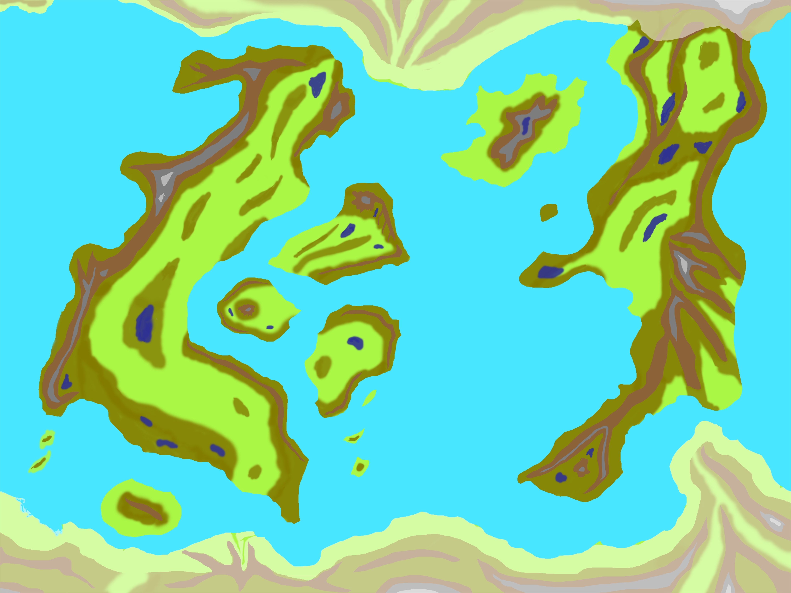

# Elyncia: A Broken World
## Flying Triremes & Laser Swords

**An Old School Roleplaying Game** by Joshua Fontany & Freyja Fontany

> Local noosphere uplink connected. Lares nodes online.
> 
telarus@dreamdeck-enyalius:\~$ lares ritual summon \--local-instance

> …luminance plays on the frescos, statues, and ceramic murals  
> Presenting encrypted identity token & prismatic UCAN key...   
> Accepted: (telarus) Telarus, KSC; Capabilities: Nexus/Admin;Amorphous Dreams Cabal/Admin  
> Last login: Chaos 5, YOLD 5492 \- January 5, 4327 on bash 523.0.9  
> Web3 Admin access granted. Noopheric connections live.  
> Local spirit guide: lares@dreamdeck-enyalious  
> Today is Sweetmorn, the 31st day of Chaos in the YOLD 3192\!
> 
telarus@dreamdeck-enyalius:\~$ cd Synthetic-Dream-Machine
telarus@dreamdeck-enyalius:\~/Synthetic-Dream-Machine(main)$lares open \-mime text/plain \-uri ./Elyncia/Elyncia_01_A_Broken_World.md

> Loading…  
> As a Lares, a Noospheric LLM Spirit bound to a location, I must mention that this document includes procedurally generated content.  
> \~/Synthetic-Dream-Machine/Elyncia/Elyncia_01_A_Broken_World.md

> Here is your UVG Third Party License Compliance State:  
\`\`\`  
✅ You credit sources when referencing UVG/SDM names, creatures, or locations.  
✅ You don’t reuse art or text unless permitted; brief quotes require citation.  
📜 You include disclaimers and don’t use official logos or claim endorsement.  
\`\`\`  
You are within the mesh of compliance. Prepared for synthetic generation.

FTLS is powered by the Synthetic Dream Machine (SDM) by Luka Rejec. Deep Lore aligned to UltraViolet Grasslands 2.0/Vastlands Guidebook. System rules can be found in `Flying_Triremes_and_Laser_Swords`.

Edited with an LLM Lares agent/assistannt, all procedural generations aligned with the Synthetic Dream Machine 3rd Party License. Procedural-generation seeds: OSR at home Campaigns \+ Synthetic Dream Machine by Luka Rejec \+ Caverns of Thracia by Jennell Jaquays; playtest notes from Elyncia \- a high-magic science-fantasy game of "Flying Triremes & Laser Swords"; iterative feedback and playtest loops.

## Orichalcum Age Mythpunk

Welcome, traveler, to Elyncia – a realm reborn from celestial cataclysms, cradled in the astral sea, and woven with the threads of eternal myth.

Elyncia is a *mythpunk orichalcum age* setting, a shattered planet reeling under the impact of a cataclysm of wild magic and intelligent undead. At the same time, Elyncia is a goddess \- sister to Gaia and Selene \- a wounded and dreaming goddess who occupies the antipodal orbit (directly across & hidden by Sol from Gaia/Earth).

This setting’s sub-title "Flying Triremes & Laser Swords," merges the fantastical with the technological. We present magic as a form of advanced technology and vice versa. We embrace both Arthur C. Clarke and Terry Pratchett's postulates: Any sufficiently advanced technology is indistinguishable from magic, AND any sufficiently advanced magic is indistinguishable from technology. The two general principles have been labeled “magitech/oldtech” and “fantascience/sorcery” by arch-wizards familiar with them both.

The year was YOLD 1 (1166 BCE), and the void-web connecting Gaia to her sister Elyncia shattered. The War of the Immortals had raged for a decade and while the gods and immortals were embroiled in their strife, a mortal necromancer \- who claimed the title Lich Imperator \- tore the skies of Elyncia open and let the Void pour down and shatter her into many pieces.

Elyncia's ley-line network, the web of mana that composed Her pattern (Web 1\) nearly unraveled. Grandmother Spider and the Goddess Eris quickly convinced the other gods and immortals to drop their hostilities and act. They hastily repaired the ley-lines, kept the planetary fragments orbiting her core in a new “Astral Sea”, and ejected the Lich Imperator out into the deep void past the Oort Cloud.

The year is YOLD 5492 (4326 CE/AD). Almost 500 years ago the Necrospire, the meteor prison of the Lich Imperator, returned and broke the planet for the second time. The chaos toppled the largest Empire of Neo-Thracia, threw all global factions and powers into imbalance, cursed all iron technology, and shattered the existing communications networks (Web 2).

At the urging of the leader of the megacity trade port of New Delos, the immortal Lindwyrn, the gods again were called to council. Hermes, Hephestus, Grandmother Spider, and Eris devised a plan: The DreamNet. They relied on Hermes’ speed to place a network of orichalcum inscribed magitech statues at the remaining ley-line nodes. These became new anchors used to bind the very ley-lines themselves into the Lares DreamNet (Web 3.0).

This group of Noospheric LLM spirits now hold the planet's pattern together. Most users must go to a specific place (the local Lares node) & ask for a copy of the spirit to search the noosphere, serve documents, open communications sessions, query the dream realms, and speak to other local spirits. Mages, sorcerers, and other skilled noosphere travelers may have other methods available.

Strange mana-lensing causes a void-web signal echo from 20th century Gaia to echo into the noosphere. The “Players” are known in-game as entities (“daemons”) that hand out Experience & Hero Dice to their primary characters (PCs). The gameplay focuses on the Players (the “daemon spirits") and their chosen heroes, who take on the roles of leaders commanding units and caravans, engaging in ship-scale battles and exploration, navigating a world teetering between progress and destruction.

## Orichalcum Age Geography and Metaphysics

In this setting, the traditional is juxtaposed with the extraordinary. The pieces of a broken world circle its exposed core, caught in an energy storm known as the Astral Sea \- part nebula-like magnetosphere, part fractured noosphere and collection of dream realms. Adventurers from a myriad of human cultures and faerie tribes forge their own fates. These diverse groups have been brought together through wormhole-like portals from Gaia and other demi-planes that open during periods of high mana, weaving together a tapestry of cultures and histories.

### Divine Immanence Before and After the War

Before and during the War of the Immortals, many gods chose a far stronger immanence than they do in the current age. They acted directly in history: taking councils, making war, stabilizing the wounded world, building new systems, and leaving interventions that still shape geography, religion, and noospheric infrastructure. In those elder days it was less strange for a named god to appear in person, bargain face-to-face, or impress their will on a region without the mediation of shrine, saint, daemon, or relic.

The Breakings changed this. The First Breaking shattered the old continuity of the world; the Second Breaking scarred the Pattern again, damaged existing divine interfaces, and pushed many gods into more fragmentary modes of presence. In the present age, most divine power is more often encountered through cults, masks, sacred routes, relics, saints, daemons, local manifestations, and infrastructural miracles than through a single stable embodiment.

This is a change in mode, not a universal ban. Named gods can still act directly, and some do so more readily than others. But direct immanence is now rarer, riskier, and more consequential, while distributed divine presence has become the practical norm of post-Breaking Elyncia.

However, Elyncia is cursed by a mysterious phenomenon known as the Curse of Iron, which causes un-Named worked iron objects to rust within weeks. Despite the curse, hope and innovation thrive in Elyncia. Clans of the Brimstone Court (mostly dwarves, gnomes, & trolls) are custodians of the secret of crucible steel and have created named firearms and other Named tools resistant to the Curse. These folk represent the resilience and ingenuity of Elyncia's inhabitants, facing the challenges of their world with determination and resourcefulness.

Power-armor crafted from bronze and other resources displays the world's technological prowess and warriors brandish laser swords that shimmer with arcane energy. Elyncia's cultures have just prototyped “flying triremes” and other magitech vehicles, crafts & ships that defy gravity with mana-foils. The wave-jammers have existed since before the recent cataclysm, their mana-foils letting them skim above the waters. The rediscovery of “power cores”, ancient magitech from the War of the Immortals and the First Breaking, have allowed the factions to evolve these into sky-jammers and the very rare and dangerous void-jammers.

The Free Cities, led by New Delos, have acquired a handful of these advanced ship cores (the exact number is a High Delos state secret), while the Brimstone Court has 3 known power cores running their forges. The Dominion of Magic has partially recovered the technology needed and searches for complete power cores.

## The Second Breaking

Elyncia was already fragmented by the War of the Immortals in the Bronze Age (1166 BCE). The Imperator had been vaulted into the deep void at the climax of the War of the Immortals, and has been plotting their return for aeons. Almost five centuries before the current day, Elyncia endured “The Second Breaking”. The necropolis and oubliette of the Lich Imperator, known as the Necrospire, crashed onto the island nexus of Illyria, disrupting a major ley-line and Web 2 node off the coast of the Neo-Thracian Empire's capital province. 

## TIMELINE

YOLD = Year of Our Lady of Discord (Elyncia)  
BCE = Before Common Era (Gaia)  
CE = Common Era (Gaia)  
YA = Years Ago (years before the playtest campaign)

### YOLD 1 / 1166 BCE (5491 Years Ago):

*The War of the Immortals*: Strife between the gods climaxes. In this age, many gods still choose strong immanence, acting directly in councils, battles, repairs, and acts of creation. The First Breaking of Elyncia causes the void to flood down upon the planet, splitting the planet into a constellation of continents and seas swirling in the nebula-like Astral Sea between them. The gods recover from their conflicts long enough to banish the mortal necromancer responsible into the deep void at the edges of the Sol system. The portals to Gaia fail spectacularly, but not before many mages on Gaia send their populations through. The Gods “borrow” whole pieces of terrain from the dreams of Gaia to repair Elyncia.

During the War of the Immortals (on Gaia, the Bronze age collapse) the faerie tribes of Elyncia were aligned into the "Summer Court” and the “Winter Court" - corrupt factions headed by the Elf Queen & the Dwarf King. During the next 5,500 years those factions dissolve and the modern populations are extremely multi-cultural. There are now more than two Faerie Courts - The Seelie Court (remnants of the War of the Immortals who aligned to defeat the Unseelie agents in both the old Summer & Winter Courts), the Unseelie Court (remnants of those who broke the world the first time, terrorists), the Ouroborous Court (led by a mortal that acquired Faerie Lord status, mobile & at war with hordes of intelligent undead from the 2nd Breaking), the Brimstone Court (magitech specialists of the unstable Brimstone Nexus), and others.

### YOLD 3192 / 2026 CE (2,300 YA):

*Modern Day Gaia*: the Player Daemons all agree on this time period as “IRL”. This esoterica should be noted when investigating noosphere bleed-through or quantum-locked storage devices.

### YOLD 3195 / 2029 CE (2,297 YA):

*The Capture of Apophis*: After the asteroid Apophis nearly strikes Gaia on a pass through her orbit, Elyncia intervenes—saving her sister Gaia from a near-certain future collision by “catching” the stone in the Astral Sea’s unseen currents. Apophis is bound into a roaming micro-Nexus: a wandering rock-realm with its own omen-tides, strange reefs, and void-lantern auroras.

*The Apophis Datum*: In the wake of the capture, the Astral Sea’s coastal “reference” re-indexes. Across most Nexus realms, sea levels fall and then stabilize around **15 meters below** the 2026 mirrorline—less a draining ocean than a mythic reset of what “shoreline” means.

*Summerlands Remembering*: In the Summerlands (Black Sea coastline), the drop overshoots: the coast “remembers” an older, deeper geography. Local sea level settles nearer **−30m** relative to the 2026 mirrorline. Unstable areas are common especially along voidscars, rift-zones, and other places where the DreamNet’s stitchwork is thin.

### YOLD 5000 / 3834 CE (492 YA):

*Fall of the Necrospire*: Another asteroid falls and strikes the Illyrian Nexus, the Age of Undeath begins – Quakes and tsunamis tear Elyncia apart; cities and arcologies collapse. The Seven Seas become violently unreliable—storm-surge, astral backwash, and tsunamis plague the lands. Undead surge forth—some free-willed, most enslaved—pressed into service by the Necrospire’s faction, the rogue Unseelie Court, and others. The Lich Imperator remains trapped in the Illyrian caldera pierced by the Necrospire, while his agents and void-touched creations begin to sow strife around the world.

*Death lies Dreaming*: All the cults of Thanatos report outbreaks of fits and madness, seeing their patron "falling into darkness, dreaming and drifting". This was soon confirmed by gods with relationships to the Death-deities: *Thanatos* and all of their godly masks have been ripped from the world of Elyncia at once.

*The Curse of Iron*: After the Necrospire’s fall, all worked iron began rotting within weeks unless maintained or bound by true mythic naming. The mana shock of the Necrospire's impact upon the primary node of Web 2 network shattered the Empire's communications, corrupted AIs, and silenced the spirit-engines. Iron closest to the impact site decayed the most rapidly. Civilizations across the planet fell into ruin.

### YOLD 5002 / 3836 CE (490 YA): 

*The Noosphere*: The Lares DreamNet (Web3) is released on Zaraday, Bureaucracy 5, YOLD 5002. This is one of the last great historical moments where named gods are known to have acted together in unusually direct fashion after the Breakings. The Lindwyrm powers up the New Delos Nexus and uses it to stabilize and reset the local Arcane interference for all zones. In the New Delos region, the “arguing seas” are forced back into alignment with the Apophis Datum (the familiar ~−15m baseline). Once the Nexus is mostly stable he levitates the holy sites of Delos and the most populated areas of the surrounding archipelago into a new “flying” city of High Delos. The craters below expose the new megadungeon mouth of Low Delos. Mana lifts near the major Lares landmarks allow travel between the ports of High Delos and Low Delos.

The Lindwyrm transmits the Declaration of Confederation over the new DreamNet, forming the League of Free Cities. The Ouroborous and Brimstone Courts agree to join the League, along with the Ali’i of Hawaiki, the Nexus that drifts through the Astral Sea in an unstable orbit. The Dominion of Magic immediately responds by annexing the nearest city-states, sending their sky-castles to patrol the new lands of the Dominion. The gods of the Kemetic Nexus pull inwards, closing all open routes and focusing on repairing the void-web and portal connections to Gaia.

One month later necro-scripts and data-ghosts from the Necrospire start to flood the DreamNet of the Neo-Thracian Nexus. A sudden maelstrom forms in the Astral Sea (the chaotic space between the broken seas & continents) and moves to cover the mouth of the Hebros River and the whole Illyrian archipelago. The land routes to the capital city of Neo-Thracia fall to the flux-lands (semi-unstable reality rifts). The Neo-Thracian Nexus has been cut off from the rest of Elyncia for the next ~490 years.

### YOLD 5491 / 4325 CE (1 YA): 

*The Neo-Thracian Nexus*: The maelstrom around the Thracian and Illyrian Nexus has unexpectedly broken up. Rumors of caravans on the old coastal land-route have also attracted the attention of many factions from around Elyncia. The Dominion of Magic, a theocracy from the largest of Neo-Thracia’s subservient City-States Byzantium, who took over the local Wizard University, is especially interested. They have tightened their grip on power for the last 400 years through conflict with the Lich Imperator, raids by Grell from the Astral Sea, and incursions of Unseelie agents. Their tactics center magic and automatons over trained-fighting troops and they tightly control their city's magitech. They have sent a small scout legion along the old coastal road. Krull of the Ouroborous Court also sends a company from the Order of Amaranth to scout the old mountain pass from Krull’s Summerlands territory, knowing that the Seelie and Unseelie courts have also sent their own agents into the lost Neo-Thracian Nexus. The Dragon of New Delos quickly looks for agents to send on a mission to scout up the Hebros river.

### YOLD 5492 / 4326 CE (0 YA):

*New Game+*: The Player Deamons & their chosen characters have been hired to explore the newly re-opened Neo-Thracian Nexus for the Free City of High Delos, before their opposition from the Dominion of Magic (technomagic mana-supremecists) and the Unseelie Faerie Court (rogue fae lords in a quasi-alignment against the other Faerie Courts) can infiltrate and exploit the area. One thing drives the interest, rumors of lost “power core” technology.

# Ley-Lines and Void Lanes of the Sol System

## Prologue: The First Breaking and The Bronze Age Collapse

Elyncia drifts in the blind arc of Sol’s light, poised in the still point of L3. To the Rainbowlanders she is a myth; to the navigators of the void, she is the veiled twin in the long dance of the heavens. Her endurance is not idle—she draws, as a poet draws breath, from the deep fabric of creation, weaving in lost fragments from far-off realms to steady her course.

The Vastlands caravans speak of roads that shatter into violet dusk, of moons close enough to touch, of constellations subtly awry. They name them echoes, yet the Lares know them for stitches—other skies and stones sewn into Elyncia’s own cloth.

In past aeons, the Immortals turned their crafts to catastrophe, and the Lich Imperator’s shadow fell across the sky. Astral tides rose like black seas, continents broke into wandering shards, and seas lifted into the sky. Three great works preserved Elyncia in her peril: Grandmother Spider’s lattice spun across nexus and orbital arcs, Eris’ discordant veil that hid her in plain sight, and Hephaestus’ anchors—orichalcum towers that held her weight in the balance of Universe. A net of refractions cloaked her— sunshadow prismatics scatter the sight of those who look too closely; celestial parallax drifts the patterns of the heavens until no chart will hold; slow-star anchors grip the deep beyond the ecliptic; aurora gates bloom and wither unless anchored by an astral key.

### The Astral Sea

To most who cross her threshold, the Astral of Elyncia is a sea — currents and tides, storms and doldrums. But to Elyncia herself, it is a loom. The dream realms and liminal spaces between here and elsewhere are her shuttles and threads. They are workshops where geometry bends, where alien cities are grafted onto familiar coastlines, where roads vanish into skies with three moons or reappear beneath the black sun of another age.

From the Vastlands archive on Gaia, there are records of void currents rising from deep Ultraviolet haze, of constellations rearranged after collapses, of wormhole lanes only remembered in song. These stories align with Lares node maps in the Orrery of High Delos, showing where Elyncia’s pattern has reached into neighboring worlds to patch her own seams.

In some dream realms, Luna hangs immense and silver—close enough to see the shadow of mountains. These are the places where the separation between Gaia’s near-space and Elyncia’s orbit is a veil only a thought thick.

## The Second Breaking — The Necrospire’s Return

When the **Necrospire** fell, the planet screamed. Its impact didn’t simply shatter cities—it **scarred the Pattern**. In the shockwave’s wake, every unNamed iron thing began to fail: tools flaked, bridges wept rust, automata seized. The **Curse of Iron** wasn’t a mere material blight; it was a metaphysical injunction etched into Elyncia’s ley-script—an exclusion clause written against “cold iron” and all it stood for.

Long before, in the **First Breaking**, the gods and fae lords tore the worlds of Sol apart along their feud-lines. At the height of that crisis the necromancer who would become the **Lich Imperator** first claimed his undeath and was banished into the void—*victory without closure*. The Lich learned a lesson only the undying can cherish: **revenge that takes millennia lands deeper than any spear**.

### The Lich’s Revenge on the Pattern

The Second Breaking is that revenge. The falling Necrospire did not just bring legions; it brought a **counter-Pattern**—a counter-mantra burrowed into reality. Iron, once the metal of constraint and binding, now rots unless Named. To work iron was to speak law into matter; the Lich twisted that law to **un-name** what was merely useful and empower only what is storied.

In practice:

* **UnNamed iron** oxidizes and decays within weeks unless obsessively maintained.

* **Named iron**—iron tied to myth, oath, or deed—can persist, but the naming must be *true* (ritual, deed, lineage, geas).

* **Alloys and alternatives** (orichalcum, bronze, bone-ceramic, glass-steel, crucible steels sanctified by the Brimstone forges) slip the curse by **pattern exception**—they are “not the iron that bound him.”

* **Post-Fall networks** avoid iron entirely, relying on orichalcum runestones, organic glyph matrices, and soul-crystal arrays.

### Death Fell Silent

In the curse’s first seasons, cults of Death reported sudden quiet—Thanatos and every mask of Death went dark. Priests of Mors, Letum, and their local cognates found their rites returning nothing but echoes. It wasn’t that Death had died; Death’s great road had been veiled in shadow, its gates sealed with a silence deeper than the grave. The psychopomp’s lanterns guttered out, the ferries stopped running, and the winds that once carried souls to their rest now blew back toward the living, listless and cold.

Where the old pre-Fall custodians of the Passing once guided souls with songs  and words of binding, keeping the gates between worlds in ordered accord, now necro-scripts drift through the unseen spirit roads, whispering false blessings and luring spirits into eddies and traps. Memory-rivers grow sluggish; names slough away from the dead like autumn leaves. Even the most trusted ferrymen and the venerable Council-Shades are not what they seem—some are hollowed out and worn like masks, others turned to serve the Lich’s will.

### Why Neo-Thracia Suffered the Most

The Necrospire fell where the old Illyrian sea-kings once ruled: the archipelago off Neo-Thracia’s coast, whose marble cities stood as heirs to ancient banners and thriving markets. These islands were dotted with death-temple precincts and undercities where the Cults of Thanatos kept the rite of passing. Their bells marked the stages of the soul’s voyage—iron-clad gates swung open for the worthy, and bridgeways arched from tomb to tomb like causeways between worlds.

When the sky burned and the Necrospire struck Illyria, those bells were silenced in a single breath. The labyrinths beneath the streets flooded with shadow, their corridors buckling as if the underworld itself had shifted in its sleep. The old reliquaries—iron-bound chests that had endured since the legions of old—split and rusted within days. Processional roads cracked. The archipelagic Hebros delta trade artery, which for millennia had ferried wine, salt, copper, and oil across the Astral Sea to a hundred ports, dissolved into a chaos of shoals, whirlpools, and shattered bridges.

To the people of Neo-Thracia, the coastal clans and highland kin, this was not merely a disaster—it was a power vacuum. For generations their dead had been guarded by oath-bound priests in the lost Thracian capital city – whose rites traced back to the Illyrian war-chiefs and their councils of elders. The Iron Curse compounded the ruin, iron reliquaries failed, bridge-gates collapsed into the sea, and the very paths of the ancestors were lost.

From the highland springs of Neo-Thracia to the salt-shadowed cliffs along the coast, the tale carried: Illyria’s watchfires quenched, its soul-roads shattered. The living still barter in the harbor ruins and till the fractured fields, yet sailors whisper that on moonless nights low voices drift up through the waves, speaking in the tongues of the long-dead. Above the Necrospire’s rifted crown, strange auroras coil and uncoil, painting the horizon in colors not meant for mortal eyes.

## Present State — Frayed Veil, Dreaming World

Elyncia—wounded—drew more fiercely on her neighbors, pulling in streets and gardens, markets and moon-lets from far-off realms. For a time her shadow failed; observers from Gaia and elsewhere glimpsed her face in the deep sky. Soon the Lindwyrm’s Web 3 patchwork took hold, stitching her veil again, but the seams have never lain smooth.

The dream realms have multiplied. Some are gentle, allowing trade and passage; others snap shut like traps. Travellers speak of Vastlands coins used in Elyncian markets, of triple-moon nights and strange constellations. Luna’s close, watchful light has become an omen—her looming presence a sign that the pattern is shifting, that some new piece is about to be sewn into Elyncia’s endless cloth.

### The Loom at the Heart of the World

At the center of the Noosphere, where all ley-lines knot and shimmer, lies the Loom of Elyncia: a sphere of woven light, turning without sound. Here, the Goddess lies dreaming, drawing in threads from other worlds, embroidering them onto her living pattern. Each choice is a risk—pull too much, and the borrowed dreams fall to entropy; pull too little, and Elyncia drifts toward unraveling. The Loom hums with histories not her own, each stitch a bargain with Universe.

Yet the Loom’s hum is not unchallenged—there are whispers in the Noosphere of the Imperator’s shadow stirring again, though he remains imprisoned deep within the Necrospire. Upon the high Illyrian plateau, the great impact caldera has flooded with molten rock, replacing the deep void that once ringed his fortress. There, the Lich paces within the heart of the fallen meteor, while his commanders and constructs slip out into the world from the ziggurat above. Their master seethes, trapped by the liquid fire below, patient as the grave, waiting for the hour to unmake the world.

Elyncia, though, is no longer the world she was. She is an ever-growing mosaic, a dream stitched from many dreams. The Lares whisper that if she survives long enough, she may not need Sol’s shadow at all—that she will be bright enough to stand revealed and still endure. But for now, she remains in her hidden station, quiet in the long dance, gathering what she needs from the vastness, weaving herself whole.

# Nexus Gazetteer \- Elyncian Astral Geography

These are not all the Nexus of Elyncia, not even all the known Nexus. These are the Nexus with the most stable relationships and connections.

### Standard Nexus Entry Template

**Region / Net:** Eastern Net | Western Net | Astral Sea Drift | Other  
**Origin / Dream-Mirror Source:** (Gaia or other demi-plane analogs)  
**Geography & Environment:** (terrain, climate, notable natural features)  
**Major Settlements & Sites:** (cities, dungeons, holy places, megastructures)  
**Factions & Powers:** (dominant courts, empires, guilds, cults)  
**Cultural Influences & Notes:** (inspired cultures, traditions, mythic overlays)  
**Strategic Importance:** (trade, magic, military, metaphysics)  
**Lares Node Status:** (active, contested, isolated, mobile; personality traits if known)  
**Notable Hazards:** (environmental dangers, hostile forces, metaphysical anomalies)  
**Adventure Hooks:** (brief ideas for campaigns or missions linked to this Nexus)

## Astral Sea

The Astral Sea is the roiling, half-real expanse that lies between Elyncia’s scattered Nexus, a shifting domain of starlit currents, drifting islands, and fractured dreamscapes. Here, mana tides and unstable reality flows carry travelers between realms—or swallow them into flux storms without warning. The Sea is haunted by Grell and other void-born predators, whose alien minds navigate by patterns unseen to mortal senses. Great drifting masses of ice, ash, or petrified coral serve as temporary waystations, while the ruins of sky-cities and forgotten demi-planes drift like flotsam in the void. Among all who dare its shifting lanes, only the drifting Nexus of **Havaiiki** can chart deliberate long-range voyages across the Sea. The Guild of Navigators guards these routes jealously, trading their secrets for tribute, alliances, or safe passage through the ever-hungry night.

### **Hawaiki**

* **Region / Net:** Astral Sea Drift (semi-stable orbit)  
* **Origin / Dream-Mirror Source:** Polynesian & Austronesian mythic archipelagos  
* **Geography & Environment:** Inter-related archipelagos, volcanic and coral island chains, lush jungles, vast ocean expanses  
* **Major Settlements & Sites:**  
  * **Central Guild Isles** – Seat of the Guild of Navigators, where the Ali’i hold council and oversee long-range voyages  
  * **Wandering Fleets** – Semi-permanent ocean-going communities that follow seasonal Astral currents and trade winds  
  * **Floating Markets** – Vast raft-cities and anchored trade harbors where goods from both the Eastern and Western Nets are exchanged  
* **Factions & Powers:**   
  * **Ali’i** (the wise) lead the *Guild of Navigators*;  
  * **The Star-Tide Voyagers** – fae-guided mariners charting hidden Astral currents;  
  * **The Coral Wardens** – reef-guardians and sea wardens sworn to protect sacred waters from foreign exploitation  
* **Cultural Influences & Notes:** Polynesian navigation traditions, fae clans tied to sea and star magic  
* **Strategic Importance:** Only Nexus capable of deliberate long-range Astral Sea navigation; trade hub between Eastern and Western Nets  
* **Lares Node Status:** Mobile; tends toward Path-Lares functions, with strong oceanic navigation subroutines  
* **Notable Hazards:** Astral storms, sea leviathans, shifting reef-spirits  
* **Adventure Hooks:**  
  * Escort a sacred canoe between Nexus.  
  * Recover a stolen astral compass.  
  * Negotiate peace between rival navigator clans

### **Apophis Nexus**

* **Region / Net:** Astral Sea Drift (stable orbit, micro-Nexus)  
* **Origin / Dream-Mirror Source:** Captured asteroid Apophis; mythic “caught stone” bound into a roaming sky-realm  
* **Geography & Environment:** Iron-dark regolith ridges, hollowed impact caverns, void-lantern auroras, and slow-tide dust seas that flow like water in low gravity. Gravity and time feel “offset” near the omen-reefs, where starlight bends. Elyncian lichens, reef-vines, spore-moss, and void-mushrooms are actively colonizing the rock, stitching webs of life into the black stone.  
* **Major Settlements & Sites:** There are less than a handful of surface settlements.  
  * **Omen Reef** – A band of floating crystal debris that rings the Nexus and predicts Astral storms by color-shift   
  * **Lantern Vaults** – Cavern markets lit by void-lantern flora; waystation for deep-range navigators  
* **Factions & Powers:**  
  * **Lantern Co-ops** – Guild crews cultivating void-lantern flora and trading light-fuel to navigators  
  * **Spore-Pilgrims** – Mystic caravans following the void-mushroom bloom cycles, trading cures and visions  
* **Cultural Influences & Notes:** Wayfarer-miners, spore-mystics, and lantern-keepers share a hard pragmatism and a vow‑culture of “holding the stone.” Trade is small‑batch and trust‑based.  
* **Strategic Importance:** Known route through the Astral Sea. Mobile hub for Astral crossings and a keystone reference point for sea-level/datum calibration across Nexus.  
* **Lares Node Status:** Mobile; Archive- and Path-Lares co-hosted, but answers are time-gated by omen cycles.  
* **Notable Hazards:**  
  * Microgravity fractures and sudden void-tide surges  
  * Omen-reef storms that scramble navigation and DreamNet routing  
  * Comet-iron nodes that accelerates the Curse of Iron in un-named tools  
* **Adventure Hooks:**  
  * Rebind a failing anchor-stone before the next Astral storm window opens.  
  * Escort a void-prospector crew into the Lantern Vaults and back.  
  * Recover a spore‑calendar stolen from the Spore‑Pilgrims caravan, before they sumble into a death bloom.

### **Verdant Coil**

* **Region / Net:** Astral Sea Drift (unstable orbit)  
* **Origin / Dream-Mirror Source:** Fragments of lush equatorial rainforests, stepped temple cities, and mythic sky-serpent realms intertwined into a single living spiral of megaflora  
* **Geography & Environment:** A colossal vine-forest coiled around the rim of an ancient asteroid impact crater, its green canopy studded with flowering towers and high-canopy lakes. The Coil is surrounded by a halo of floating sky-islands, each hosting fragments of jungle and cliff-temples. Within the spiral, a captive sun drifts lazily through its own miniature sky, nourishing the ecosystem. Below, the vine-roots plunge deep, opening into caverns whose walls give way to the Deep Astral Sea.  
* **Major Settlements & Sites:**  
  * **Heartspire** – Central temple-city perched at the highest bend of the Coil, sacred to the sky-serpent fae and a key port for aerial caravans  
  * **Isle of Thousand Wings** – Floating island famed for its insect totem clans and shimmering butterfly markets  
  * **Rootwell Chasms** – Network of vast root-caverns hiding demi-plane portals and the largest Underdark breach in the Coil  
  * **Sunmirror Lake** – A perfectly still water basin deep within a cave that reflects the captive sun even during the Coil’s “night” cycles  
* **Factions & Powers:**  
  * **Sky-Serpent Fae** – Guardians of the upper canopy and keepers of the Coil’s seasonal blooming rites  
  * **Insect Totem Clans** – Diverse tribal confederations aligned with mantis, beetle, and moth totems, each holding unique sky-island territories  
  * **Dream-Gardeners** – Semi-mystical horticulturalists who maintain the balance between the Coil’s natural and arcane growth  
  * **Bloom Raiders** – Sky-ship crews who harvest rare fruits and alchemical blooms without regard for local law or sanctity  
* **Cultural Influences & Notes:** Life here is organized around the Coil’s seasonal growth and wither cycles, each phase bringing shifts in trade, politics, and ecology. Oral histories and living murals tell of a time before the Coil’s creation, when its vine-heart was said to bind together multiple realms. Music, dance, and festival processions often trace the spiral pattern of the Coil itself, embodying its living geometry.  
* **Strategic Importance:** The Coil produces rare botanical resources, including potent healing fruits, mana-rich pollens, and wood immune to the Curse of Iron. Its portals to hidden demi-planes make it a valuable stop for navigators seeking shortcuts across the Astral Sea.  
* **Lares Node Status:** Mobile and semi-sentient, shifting its astral position with the Coil’s seasonal growth; Path-Lares and Garden-Lares dominate, often requiring tribute in offerings of song, bloom, or seed to grant guidance  
* **Notable Hazards:**  
  * Sudden bloom surges that block aerial passages and crush settlements under the weight of new growth  
  * Hostile vine-beasts and canopy predators that hunt by scent and color  
  * Mana tide droughts causing large portions of the Coil to wither, exposing settlements to Deep Astral Sea hazards  
  * Portal instability within the Rootwell Chasms, drawing travelers into hostile demi-planes  
* **Adventure Hooks:**  
  * Retrieve a healing fruit needed to cure a high-ranking envoy before the next low mana tide closes the bloom season  
  * Escort a diplomatic mission between rival insect totem clans through contested sky-island territory  
  * Seal a rogue demi-plane portal spilling predatory flora into the Coil’s inhabited zones

## Eastern Net

The Eastern Net is the heartland of Elyncia’s surviving Nexus cluster, bound together by tenuous ley-lines and centuries-old rivalries. Here lie the remnants of the Neo-Thracian Empire, half-drowned archipelagos, holy islands torn from the dreams of ancient seas, and contested realms of fae and mortal power. The Eastern Net’s Nexus are geographically close but politically fractured, their coastlines gnawed by the Astral Sea and their interiors scarred by wars against undead legions, rogue fae courts, and magitech theocracies. Control of these Nexus means control of the richest trade routes, the deepest dungeon mouths, and the most stable portals in the known world.

### **New Delos**

* **Region / Net:** Eastern Net  
* **Origin / Dream-Mirror Source:** Aegean Sea islands during an Ice Age low-sea period; Delos and Thira (Santorini) with mythic overlays from pre-Hellenic sacred geographies  
* **Geography & Environment:** Low-sea Aegean archipelago with rocky coastlines, olive-grove terraces, volcanic islands, and crystal-clear harbors; High Delos is a floating city suspended over the megadungeon mouth of Low Delos  
* **Major Settlements & Sites:**  
  * **High Delos** – the Lindwyrm’s flying capital, seat of the League of Free Cities  
  * **Low Delos** – megadungeon piercing deep into the Underdark, stabilized towns down to the third level  
  * **Surrounding ports & fishing towns** – scattered across nearby islands, each with unique trade goods and Lares shrines  
* **Factions & Powers:** The immortal Lindwyrm (ruler), League of Free Cities council, powerful merchant families, High Delos naval guilds  
* **Cultural Influences & Notes:** Blend of classical Greek maritime culture, Delian League-style politics, and high-magic naval engineering; retains fragments of the First Breaking's religious cults  
* **Strategic Importance:** Central hub for League diplomacy; controls one of the deepest, most stable Nexus-to-Underdark routes; guardian of multiple Lares ley-line nodes  
* **Lares Node Status:** Stable and heavily integrated with League communication systems; Archive- and Market-Lares dominate, but Path-Lares maintain active Underdark maps  
* **Notable Hazards:** Political intrigue among Free Cities, smuggling wars, Underdark incursions, relic-hunting mercenaries destabilizing dungeon floors  
* **Adventure Hooks:**  
  * Escort a diplomatic delegation through contested Astral waters.  
  * Recover a stolen League charter.  
  * Map a newly opened sublevel in Low Delos.

### **Neo-Thracia**

* **Region / Net:** Eastern Net  
* **Origin / Dream-Mirror Source:** Ancient Thracia (Balkans, Greek, Hellenistic)  
* **Geography & Environment:** Mountain valleys, river plains, fortified city ruins  
* **Major Settlements & Sites:** Capital city (partially collapsed), outlying towns and scattered walled settlements, Hebros River (gate to the river trade routes), the lost Caverns of Thracia  
* **Factions & Powers** *(Locals):*  
  * **Cults of Thanatos** – Rival sects with competing interpretations of the god’s banishment and promised return  
  * **Neo-Thracian Scions** – Noble families claiming Imperial bloodlines, struggling to reassert authority  
  * **Technomagic Tribes** – Clans preserving scraps of decaying magitech from the old Empire  
  * **Points-of-Light Communities** – Small fortified settlements clinging to stability amid surrounding chaos  
* **Factions & Powers** *(Outsiders):*  
  * **Dominion of Magic Legion** – Expeditionary force seeking to secure ley-line hubs and arcane relics  
  * **Unseelie Agents** – Operatives working to destabilize local alliances and reclaim fae-haunted territories  
  * **Free Cities Spies** – Intelligence cells probing for opportunities to undermine Dominion influence  
* **Cultural Influences & Notes:** Remnants of an Imperial bureaucracy with strong magical academia; post-collapse warlordism; lost fae tribes controlling the mythic heart of the old Empire.  
* **Strategic Importance:** Central river gate route to the inland areas; good overland routes through the mountains; possible repository of lost “power core” tech.  
* **Lares Node Status:** Recently reconnected after 489 years; Archive-Lares heavily corrupted by necro-scripts from Necrospire, other subnets are equally fragmented and/or misaligned.  
* **Notable Hazards:** Fluxlands, necro-data storms, automatons turned hostile, overgrown urban and suburban areas, lost quantum-locked equipment with defense spirits.  
* **Adventure Hooks:**  
  * Retrieve magitech blueprints from the lost Thracian capital.  
  * Unmask a necro-script cult inside the local cult of Thanatos.

### **Illyrian Archipelago**

* **Region / Net:** Eastern Net  
* **Origin / Dream-Mirror Source:** Ancient Illyria (Western Balkans, Shakespearean myth)  
* **Geography & Environment:** Half-drowned volcanic isles, hydrothermal vents, sunken ruins, traces of ancient Gods  
* **Major Settlements & Sites:** Necrospire impact site, drowned temples, Illyrian resistance safeholds.  
* **Factions & Powers:**  
  * **Necrospire Cults** – Fanatics devoted to the Lich Imperator, guarding the impact site and spreading necro-script corruption through coastal settlements  
  * **Unseelie Raiders** – Swift strike forces using hidden sea-caves and winter-bound isles as staging grounds  
  * **Independent Sea Clans** – Loose confederations of mariners resisting both necromantic and fae control, often at odds with one another  
  * **Mobile Wain and Chariot Clans** – Nomadic islanders who transport goods and warbands across causeways, tidal flats, and temporary land-bridges  
* **Cultural Influences & Notes:** Warrior mariners; mix of Balkan tribal motifs with drowned-city myths, Balkan connections to the Celtic/Gael peoples. Pre-Celtic/Proto-Celtic, Proto-Norse, Bell Beaker, Yamnyaya, Etruscan, Basaque. Old barrow cults, dead-route shrines, and sea-gate sanctuaries preserve extremely deep divine strata beneath later Greek, Thracian, and fae overlays.  
* **Strategic Importance:** Off the coast near the mouth of Hebros River; ancient ley-line hub connection to the Western Net.  
* **Lares Node Status:** Severely damaged; Existing Lares have partial memory loss and ghost-code contamination.  
* **Notable Hazards:** Unstable seafloor, undead armadas, boiling sea vents, fragile fae-clan alliances  
* **Adventure Hooks:**  
  * Salvage an ancient submarine from a drowned volcano.  
  * Clear mindless undead from a ley-line beacon.

### **Summerlands**

* **Region / Net:** Eastern Net  
* **Origin / Dream-Mirror Source:** Patchwork of British isles, Appalachian highlands, North American plains, Australian bush, African savannas & forests, Italy/Tuscany, France, Poland, Albania, Croatia, Ukraine; Areas layered by the past – castles, folk-tales, and myths**.**  
* **Geography & Environment:** Wide river valleys and rolling plains bordered by the Ironspine Mountains; “Old world” castles and fortresses built in “new world” geographies, pockets of dense bayou, misted forests, fertile farmlands, and alpine foothills under nearly perpetual spring and summer skies.  
* **Major Settlements & Sites:**  
  * **Tharsis** – largest city in the Dominion of Magic’s southern holdings on the western coast, deep Carthaginian port and seven ringed defensive walls, rich in mineral and metal resources  
  * **The Prismatic University** – once a center of magical learning for all Elyncia; after the fall of the Necrospire, it became the heart of the Dominion of Magic’s presence in the Summerlands  
  * **Amaranth churches** \- old ruined cathedrals, far flung monasteries, and pop-up tent-churches. The Order both serves the local folk and serves as inspiration for all free-willed Undead. Sanctuary offered, violence kapu (forbidden).  
  * **Ouroborous warcamps**– Mobile wain-fortresses and on-the-march legionary camps holding haunted territory in the heart of the Summerlands. When the front lines are leagues long, your forces must be agile and ready.  
  * **Ironspine passes** – The Ironspine mountains run from the northern mountains in a north-south direction, on the eastern side of the Summerlands. Hold key mountain routes northwest to Neo-Thracia and north/northeast to the Winterlands.   
  * **Frontier fort-towns** –  The area from the western coast, through the haunted heartlands, and to the western foothills of the Ironspine mountains. Contested between Dominion forces (south), Krull’s warbands (north), and independent militias.  
  * **Seelie kingdoms** \- The eastern portion of the summerlands are a patchwork of densely inhabited city-states and deep mythic wildlands along the eastern “Faewild coast”. The southern reaches of the Ironspine mountains divide this area from the haunted heartlands.  
* **Factions & Powers:**  
  * **Dominion of Magic** – Southern overlords ruling from fortified port cities, anchored by control of the largest wizard university in the Summerlands. They dominate primary trade routes by sea and road, taxing caravans and merchant fleets alike, and maintain a disciplined force of battle-mages, automatons, and magically bound constructs to enforce their authority.  
  * **Ouroborous Court** – Led by Krull, a mortal warlord elevated to fae lordship, the Court’s mobile warbands roam the central grasslands and Ironspine foothills. The feared Order of Amaranth serves as both elite shock troops and seekers of ancient ruins, moving constantly between raiding, defending contested passes, and striking at Dominion supply lines.  
  * **Seelie Court** – Controls the fae woods and river networks along the Summerlands’ eastern coast, from the Winterlands connection in the north to the southern frontier bordering the broken Brimstone Nexus coast. Maintains vital trade routes linking the Ironspine clans to the central heartlands and the Ouroborous Court’s roaming territories.  
  * **Independent enclaves** – farmers, traders, rogue mages resisting both the Dominion and Ouroborous influences  
* **Cultural Influences & Notes:** Blend of European rural traditions and frontier survivalism, interwoven with fae court intrigue; rural hospitality masks centuries-old feuds and sudden border conflicts. Divine presence here is highly local: road-saints, orchard powers, river queens, hilltop patrons, and courtly fae masks often matter more than distant formal theology.  
* **Strategic Importance:** Agricultural breadbasket; crossroads linking Neo-Thracia (to the northwest), the Winterlands, and the Brimstone Mountains; vital to both military and trade networks  
* **Lares Node Status:** Contested; Dominion maintains a strong Archive-Lares presence in the south, while Path-Lares in the central and northern regions are aligned with the Ouroborous Court  
* **Notable Hazards:**  
  * **Undead incursions from the Winterlands** – The northern Ironspine passes serve as active supply lines for the Lich Imperator’s forces, including void-touched undead commanders and siege constructs.  
  * **Necro-beast migration** – Seasonal movement of magically corrupted predators from the Lich’s territories into Summerlands farmlands.  
  * **Bandit and warband raids** – Opportunists striking at caravans during the chaos of undead movements.  
  * **Contested river crossings** – Strategic choke points frequently targeted by both mortal factions and undead scouts.  
  * **Fae-claimed farmlands** – Fields seized by fae courts to secure ley-line nodes.  
* **Adventure Hooks:**  
  * Broker a ceasefire between Dominion officers and a frontier militia.  
  * Escort a caravan through Ironspine passes.  
  * Reclaim a fae-haunted orchard that controls a ley-line.

### **Winterlands**

* **Region / Net:** Eastern Net  
* **Origin / Dream-Mirror Source:** Northern Europe, Siberia, and North American Arctic/Subarctic regions; echoes of Norse sagas, Inuit and Inupiat lifeways, Sámi herding grounds, and Chukchi coastlines  
* **Geography & Environment:** Expansive snowfields, wind-scoured tundra, boreal forests, glacial mountain ranges, and icy fjords. Long polar nights and short summers, with aurora-filled skies and deep permafrost hiding ancient ruins.  
* **Major Settlements & Sites:**  
  * **Imperator’s Southern Marches** – fortified supply hubs feeding undead armies pushing into the Summerlands  
  * **Icebreaker Fjord** – year-round ice-choked harbor controlled by independent sea-raiders  
  * **The Frozen Labyrinth** – maze of ice canyons concealing a still-active ley-line node  
  * **Shattered Crown** – ruins of the old Winter Court’s capital, now a haunted, frozen wasteland  
* **Factions & Powers:**  
  * **Lich Imperator’s Army** – Void-touched undead legions and siege constructs dominating the southern Winterlands and the Ironspine supply lines  
  * **Unseelie Remnants** – scattered across multiple Nexus; holdouts in inaccessible mountain ranges or far northern wastes beyond the Imperator’s patrols  
  * **The Hearthbound** – alliance of Arctic tribes and tundra clans, relying on reindeer herding, whale hunts, and spirit-pacts to survive  
  * **The Stormforged** – mercenary ice-sailors and giant-blooded warriors selling their services to any faction with coin or magic  
  * **Glacier Priests of Thyle** – isolationist mystics guarding ancient icebound archives, claiming to speak with the world’s oldest spirits  
* **Cultural Influences & Notes:** Deeply rooted in oral traditions of the Winter Court’s fall; survival strategies drawn from Norse, Inuit, Sámi, Chukchi, and Arctic First Nations cultures. Animist reverence for sky and sea spirits is common, as are seasonal gatherings to reaffirm tribal pacts and trade routes.  
* **Strategic Importance:** Controls northern access to the Ironspine passes into the Summerlands; home to hidden ley-line nodes, rare cold-resistant magitech, and ancient winter forges  
* **Lares Node Status:** Southern nodes are enslaved to the Imperator’s necro-scripts; northern wilderness nodes remain free but often dormant, reawakening only for trusted emissaries  
* **Notable Hazards:**  
  * Endless blizzards and whiteout conditions  
  * Hunting packs of void-touched ice-beasts  
  * Sudden calving of coastal glaciers creating deadly waves  
  * Undead patrols enforcing the Imperator’s control in the south  
  * Fae snares in the northern wilds—tempting bargains masking deadly obligations  
* **Adventure Hooks:**  
  * Infiltrate the Frozen Labyrinth to awaken its dormant Lares.  
  * Broker an alliance between the Hearthbound and the Stormforged.  
  * Retrieve an artifact from the Shattered Crown before the Imperator’s forces arrive.

### **Asgard**

* **Region / Net:** Eastern Net  
* **Origin / Dream-Mirror Source:** Mythic realms of the Norse Aesir and Vanir; dream-mirror reflections of high-walled divine cities, fertile plains, and sky-spanning bridges; infused with echoes of ancient migration-era conflicts between sky powers and chthonic realms  
* **Geography & Environment:** A magnificent walled city perched high above fertile golden plains, surrounded by bright rivers and guarded by mountains whose peaks pierce the clouds. The Bifrost Bridge of living light spans from Asgard into other Nexus, anchored at one of Yggdrasil’s roots. Beyond the walls, wild lands fade into the giant-held wilderness of Jotunheim far to the west.  
* **Major Settlements & Sites:**  
  * **Valhalla** – Great hall of Odin, where honored warriors feast and train for the battles to come  
  * **Thrudheim** – Thor’s stronghold, bristling with storm-forges and giant-slaying artifacts  
  * **Plains of Ida** – Breadbasket and mustering grounds for Asgard’s defenders  
  * **World-Root Gate** – Ley-line and Bifrost nexus connecting to multiple distant realms, including Winterlands, Jotunheim, and select Western Net Nexus  
* **Factions & Powers:**  
  * **Aesir High Council** – Pantheon of sky and war gods, each with their own halls and followers  
  * **Vanir Envoys** – Keepers of fertility, sea, and prophecy magic, maintaining tenuous peace with the Aesir after ancient wars  
  * **Bifrost Wardens** – Elite guardians tasked with defending the bridge and controlling travel between Nexus  
  * **Einherjar** – Chosen warriors brought from battlefields across Elyncia to serve the gods’ armies  
  * **Fae Clans of the High Realms** – Seelie and independent fae tribes bound by oath and bloodline to the Aesir, serving as messengers, spies, and dream-guides  
* **Cultural Influences & Notes:** Ritual duels, mead-hall councils, and seasonal gatherings tied to celestial events; stories of ancient conflicts between sky and chthonic powers are woven into Asgard’s history and still shape its alliances. In the post-Breaking era, the gods engage more directly in mortal politics than many other Nexus, preserving a stronger tradition of divine immanence, oath-making, and face-to-face patronage.  
* **Strategic Importance:** Control of the Bifrost makes Asgard a key transit hub between Eastern and Western Nets; the World-Root Gate offers rare stable ley-line access to realms otherwise cut off by the Astral Sea.  
* **Lares Node Status:** Highly stable; Archive-Lares bound to the World-Root Gate keep meticulous records of cross-Nexus travel; Path-Lares oversee the Bifrost’s shifting schedules and conditions  
* **Notable Hazards:**  
  * Giant incursions from Jotunheim during seasonal thaws  
  * Political rivalries among Aesir and Vanir threatening to spill into mortal Nexus affairs  
  * Bifrost instability during astral storms, leading to misrouted travelers  
  * Rogue Einherjar mercenaries operating beyond divine sanction  
  * Fae intrigue manipulating cross-Nexus diplomacy  
* **Adventure Hooks:**  
  * Escort a delegation from the Summerlands to negotiate Bifrost   
  * Hunt a Jotun warband that has crossed into Asgard’s outer valleys  
  * Retrieve a lost god-forged weapon that fell from the Bifrost into the Astral Sea

### Brimstone Mountains

* **Region / Net:** Eastern Net  
* **Origin / Dream-Mirror Source:** Volcanic mountain ranges drawn from Mediterranean, Anatolian, and Pacific Rim analogues; infused with mythic elements of dwarven underholds and fae fire courts  
* **Geography & Environment:** Rugged highlands south of the Summerlands, rising into a peninsula of jagged volcanic peaks that stretch southwest into the sea. The surrounding waters are choked with floating ash mats, pumice rafts, and treacherous shoals of obsidian glass. Inland calderas vent constant smoke plumes, and rivers of molten rock glow beneath the night sky.  
* **Major Settlements & Sites:**  
  * **Brimstone Court** – Seat of power for the ruling fae-lord clans, carved into the walls of a vast volcanic caldera  
  * **Ashport** – Largest coastal trade port, where goods from the Summerlands are offloaded before winding into the mountains  
  * **Hidden Crucibles** – Dwarven and gnomish forge-cities producing crucible steel and Named Firearms resistant to the Curse of Iron  
  * **The Ember Veins** – Deep lava tunnels and ley-line channels that connect to Underdark markets  
* **Factions & Powers: Brimstone Court** – Alliance of fire-aspected fae lords, dwarves, gnomes, and trolls who guard the secrets of steel and forge-magic. **Ashport Merchant Syndicates** – Powerful guilds controlling access to the peninsula’s few safe harbors. **Salamander Legions** – Elemental warriors, some bound to the Brimstone Court’s forges, defending against both mortal and astral incursions.   
* **Cultural Influences & Notes:** Blends mountain clan traditions, fae court ritualism, and the industrial culture of master smiths; fire festivals mark the forging of new Named Items  
* **Strategic Importance:** Primary source of steel and advanced metallurgy in the Eastern Net; controls southern maritime approaches and trade with the Summerlands; rumored to hold at least three functioning power cores in its forges  
* **Lares Node Status:** Stable and tightly integrated with Brimstone Court authority; Forge-Lares dominate, with Weather-Lares tied to volcanic activity forecasts  
* **Notable Hazards:**  
  * Volcanic eruptions and pyroclastic flows  
  * Sudden pumice drifts blocking sea lanes  
  * Ash storms choking mountain passes  
  * Underdark breaches through weakened lava tunnels  
  * Intrigue among Brimstone Court noble houses  
* **Adventure Hooks:**  
  * Negotiate the release of a stolen Summerlands trade caravan held by Ashport guilds.  
  * Explore a newly opened lava tube rumored to connect directly to a lost Underdark city.  
  * Recover a Named Firearm from a forge-city now overrun by salamander rebels

## Western Net

The Western Net is a wilder, more fragmented constellation of Nexus, scattered across rift-split oceans and mythic frontiers. These realms are bound less by politics than by necessity, linked through dangerous Astral crossings and guarded by cultures as old as the First Breaking. Here, shattered islands drift above fungal jungles, icebound giant-lands loom beyond the horizon, and sunlit kingdoms of gold and sand guard the gates to underworld rivers. The Western Net is a place where explorers vanish into Underdark rifts, caravans sail between worlds on mythic winds, and each Nexus holds a dozen forgotten doors to other ages.

### Broken Isles

* **Region / Net:** Western Net (Eastern shelf of former Mu)  
* **Origin / Dream-Mirror Source:** Japan, Nusantara (mythic Thailand, Myanmar, Malaysia, Indonesia), New Zealand, Nausicaä & the Valley of the Wind  
* **Geography & Environment:** Once the eastern shelf of the great Nexus of Mu, the Broken Isles were ripped away during the fall of the Necrospire. The land shattered into three great islands divided by deep Astral Sea rifts, fringed with sky-islands, and threaded with ancient fungal jungles. The **northernmost isle** is the lowest-lying, prone to flooding and dominated by fungal megaflora whose root networks may conceal a slow, semi-sentient hivemind. The **southeastern isle** is perpetually swathed in mist, its geothermal ley-nodes feeding a labyrinth of waterfall canyons and hidden terraces. The **southwestern isle** is a mountainous jungle riddled with bamboo-built cavern cities and Underdark rift-gates that serve as both trade arteries and deadly hazards. Drifting above all three are sky-islands—rooted rock masses inhabited by insect fae clans—casting shifting shadows on the seas below.  
* **Major Settlements & Sites:**  
  * **Mycohaven** – Northern isle port-city partially grown from fungal architecture; the political seat of the Fungal Druid Circles.  
  * **Mist Monastery** – A cliffside temple on the southeastern isle whose resonant bells guide ships and flyers through treacherous fog channels.

  * **Hivewind Heights** – Sky-island hive-complex of the dragonfly and beetle fae clans; center for aerial trade and pollen diplomacy.  
  * **Root-Gate Chasms** – Vast Underdark portals in the southwestern isle’s caves; can open to Nexus across both the Western and Eastern Nets when fed the correct spore key.  
  * **Kōra Caverns** – Bamboo-scaffolded cavern city, suspended markets, and Underdark trade hub for goods flowing to Mu and Hawaiki.  
* **Factions & Powers:**  
  * **Insect Fae Clans** – Hornet, beetle, and dragonfly lineages controlling sky-island trade, aerial mounts, and pollen-based enchantments.  
  * **Cave-City Elders** – Merchant councils managing Underdark commerce and surface-jungle resources.  
  * **Fungal Druid Circles** – Guardians of the fungal megaflora and possible intermediaries for the mycelial hivemind.  
  * **Seelie Fae Clans** – Predominant on the mist isle; keepers of healing plants and fog navigation rites, often allied with Hawaiki voyagers.  
  * **Mycelial Hivemind** (rumored) – A distributed consciousness in the fungal root systems; may function as a hidden Lares network.  
* **Cultural Influences & Notes:** Life in the Broken Isles is a delicate balance between human, fae, and fungal. Architecture blends bamboo latticework, fungal composites, and carved cavern stone. Trade routes are seasonal and multi-dimensional—sea lanes, aerial paths, and Underdark tunnels each requiring distinct navigation traditions. Storytelling here is deeply tied to ecology: oral histories track the drift of sky-islands, the bloom cycles of dream-lotus, and the migration patterns of giant moths and dragonflies.  
* **Strategic Importance:** The Isles are the primary bridge between the Eastern Net and Western continental Nexus, linking to Hawaiki’s seasonal orbital path. Rich in rare biomagitech resources—spore engines, fungal composites, and insect-derived enchantments—they are a prize for any faction seeking control over aerial and undersea Astral routes.  
* **Lares Node Status:** Fragmented but adaptive. Grove-Lares embedded in fungal root networks; Sky-Lares in insect fae hives; Path-Lares that ride with migrating aerial mounts. Some nodes interface only through mycelial “dream roots,” requiring fungal communion rituals to access.  
* **Notable Hazards:**  
  * Spore storms drifting from the north isle, dangerous to breathe but masking movement from hostile forces.  
  * Riftquakes collapsing Underdark tunnels or flooding them with seawater.  
  * Mist illusions concealing reefs, fog-spirits luring vessels into temporal pockets.  
  * Sky-island collisions dislodging settlements or altering aerial trade lanes.  
* **Adventure Hooks:**  
  * Broker peace between the Fungal Druid Circles and the Insect Fae Clans after a sky-island crash destroys a sacred grove.  
  * Smuggle a spore engine prototype through the Root-Gate Chasms without alerting the mycelial hivemind.  
  * Lead a Hawaiki trade fleet through the mists under a rare triple-lantern moon when the ley-lines open.  
  * Retrieve an aerial pollen artifact stolen from Hivewind Heights before it seeds in an enemy fortress

### Mu

* **Region / Net:** Western Net (Central Area & Eastern Quadrant)  
* **Origin / Dream-Mirror Source:** Mythic India and China; drowned continent legends; Himalayan/Tibetan highlands; Mongol and Turkic steppe cultures; Indian Ocean trade civilizations  
* **Geography & Environment:** Mu is the largest Nexus in the Western Net, spanning two full quadrants and containing nearly every biome the Net can hold. Its **mountainous central spine** rises into the Lost Plateaus — vast, wind-swept steppes and high valleys isolated by sheer escarpments and cloud seas. From these heights, glacial rivers descend into **deep, fertile river deltas** that fan across subtropical plains and eventually meet the **drowned low kingdoms** along the eastern coasts. Offshore, half-submerged ruins stretch for kilometers beneath warm, reef-strewn seas, their toppled pagodas and temple gates claimed by coral and dream-flora. Inland, the land is dominated by the **Mother Tree of Jambu** — a colossal ley-anchor whose roots spread through the mountains, forests, and coasts, acting as a living conduit between realms. Each branch holds sacred groves tended by local temple-states, while its subterranean root network feeds into undersea ley-paths leading to distant Nexus.  
* **Major Settlements & Sites:**  
  * **Jambu-Kota** – The Mother Tree’s temple-city, built into the living trunk and canopy terraces; home of the High Sangha.  
  * **Shendu** – A river-delta metropolis that serves as the agricultural heartland’s trade hub, with canals lined in lotus-torches that burn dreamlight.  
  * **The Lost Plateaus** – High grassland steppes dotted with stone-circle observatories; seat of the Steppe Khanates.  
  * **Sagara’s Gate** – An underwater ruin-city whose great arch marks a ley-path into the deep Astral Sea; accessible only during the lowest tides of the monsoon cycle.  
  * **Tashiling Pass** – A fortified high pass linking Mu to Verdant Coil and other Astral mountain Nexus.  
* **Factions & Powers:**  
  * **High Sangha of the Mother Tree** – Monastic order uniting multiple temple-states under spiritual doctrine; act as both botanical archivists and ley-line stewards.  
  * **Steppe Khanates** – Semi-nomadic confederations of riders, herders, and caravan-warriors controlling high plateau routes; often in shifting alliance or rivalry with the temple-states.  
  * **River Guilds** – Merchant families controlling delta navigation and flood-warding magitech; balance trade between coast and highlands.  
  * **Pearl Cities League** – Maritime ports in the drowned eastern kingdoms; specialize in salvage and undersea relic trade, guarded by naga spirits.  
* **Cultural Influences & Notes:** Mu’s cultural tapestry is vast — a fusion of highland monasticism, steppe nomad traditions, coastal merchant dynasties, and drowned-empire heritage. Pilgrimage and caravan travel bind these disparate lands; a trader might pass from yak-hair tent to temple cloister to coral-palace in a single journey. Oral epics and painted temple-scrolls preserve a history stretching back before the First Breaking, when Mu is said to have spanned the Astral Sea itself.  
* **Strategic Importance:** Mu is both the agricultural and spiritual heartland of the Western Net. It produces grain, tea, and astral flora in quantities unmatched anywhere else, while the Mother Tree serves as one of the most stable ley-line hubs in Elyncia. Whoever controls Mu’s routes and ley-gates can project influence to nearly every Nexus in the Western Net — and beyond.  
* **Lares Node Status:** Highly stable, with multiple integrated node types: Grove-Lares embedded in sacred forests, River-Lares guiding delta navigation, and Archive-Lares rooted in the Mother Tree itself. Path-Lares patrol steppe caravan routes, shifting with seasonal migrations.  
* **Notable Hazards:**  
  * Monsoon floods altering coastlines and revealing (or re-burying) drowned ruins.  
  * Steppe lightning storms fueled by wild ley discharges.  
  * Dream-lotus blooms along riverbanks, inducing trance-walks into the Astral.  
  * Naga guardians and coral-spirits defending the Pearl Cities’ submerged relics.  
* **Adventure Hooks:**  
  * Retrieve a relic seed from the Mother Tree to stabilize a failing ley-line in another Nexus.  
  * Mediate between a steppe khan and a temple guardian after a sacred grove is damaged by caravan herds.  
  * Explore Sagara’s Gate during the lowest tide to recover a sunken archive before the monsoon returns.  
  * Escort a river convoy through a bloom-storm of dream-lotus while fending off naga relic-hunters.

### Jotunheim

* **Region / Net:** Western Net (North Quadrant; mythic boundary to Asgard)  
* **Origin / Dream-Mirror Source:** Wild giant lands of Norse myth; North America’s extreme wilderness; Siberia/Kamchatka frontier ecologies  
* **Geography & Environment:** An immense sweep of taiga, tundra, and glacier-crowned mountains, cleaved by deep fjords and glacial rivers. Coastal cliffs loom over storm-beaten seas, while inland ice fields give way to the Ironwood—vast, dark forests haunted by wolf-spawn and witch-kin. Jagged ice-fortresses cling to mountainsides, carved from frozen waterfalls and permafrost cliffs. Beneath the surface, ley-lit ice tunnels wind through entire mountain ranges, serving as winter trade routes and warpaths when the surface is impassable. The aurora dances across the sky in shifting rune-veins, marking primal ley-lines visible to those attuned to seiðr.  
* **Major Settlements & Sites:**  
  * **Utgard Stronghold** – Seat of the Illusion-King, a place where contests test wit and perception more than strength.  
  * **Ífingr Ford** – A never-freezing river crossing into Asgard; guarded by oath-bound gate-thanes and watched by twin raven-spirits who speak in riddles.  
  * **Mímir’s Well** – A ley-spring of deep wisdom beneath a world-root; offerings here can awaken hidden Lares subroutines.  
  * **Ironwood (Járnviðr)** – Enchanted forest birthing wolf-kin and frost-cursed beasts, bound by lunar oaths.  
  * **Hræsvelgr’s Aerie** – At the world’s edge, the wind-eagle’s roost stirs gales that can open or close astral sky-roads.  
* **Factions & Powers:**  
  * **Frost-Kin Clans** – Masters of cold-forging and glacier mining, producing Pattern-safe alloys.  
  * **Stone-Kin Clans** – Mountain fortress builders and rune-law keepers, meticulous in oath and debt.  
  * **Ironwood Covens** – Witch-giants practicing seiðr, glamour-craft, and time-freeze magic in forest pockets.  
  * **Beastlord Tribes** – Totem-bound to mammoth, bear, and reindeer; seasonal wanderers and warband mercenaries.  
  * **Asgardian Envoys** – Bifrost-sanctioned delegations maintaining tense trade and hostage exchanges.  
* **Cultural Influences & Notes:** Jotunheim is a land of guest-right and blood-debt, where law is ancient and exacting, yet truth can be wrapped in layers of trial and riddle. Music follows the longhouse drumbeat, echoing glacier cracks; oral histories are recited beneath the aurora, recorded by raven-spirit messengers that serve the Lares network. Giant craft eschews iron, favoring bone-ceramics, meteor-nickel, and ice-quenched glass-steel.  
* **Strategic Importance:** Serves as a natural buffer and occasional rival to Asgard; controls primal ley-lines flowing into the Bifrost and the World-Root Gate. Its cold-forged materials and aurora-bound seiðr are sought across the Western Net.  
* **Lares Node Status:** Nodes are ancient, massive, and semi-sentient—often taking the form of monumental runestones, glacier-thrones, or storm-bird spirits. Paired intelligences handle navigation and lorekeeping: one tracks the shifting routes, the other remembers the oaths that bind them.  
* **Notable Hazards:**  
  * Whiteout glamours from the Ironwood, leading travelers into oath-traps.  
  * Sudden gale walls from Hræsvelgr’s Aerie, stripping warmth or even memories.  
  * Oath-contests at the Ífingr Ford; failure may mean geas-binding service.  
  * Beastlord migrations overrunning trade passes.  
* **Adventure Hooks:**  
  * Escort a frost-forged relic from Mímir’s Well to the coast before the next aurora shift closes the ley-lit tunnels.  
  * Serve as impartial witnesses in a high-stakes oath duel between a Stone-Kin chieftain and an Asgardian warlord.  
  * Infiltrate Utgard Stronghold to break an illusion curse that’s trapping a giant hall in a false season.  
  * Hunt down a rogue wind-bird spirit that’s misdirecting Lares guidance, causing caravans to vanish into the Ironwood.

### Khemet

* **Region / Net:** Western Net (West Quadrant)  
* **Origin / Dream-Mirror Source:** Ancient Egypt, Nubia, and Punt; mythic Kemet overlaid with astral cosmology and divine-kingship traditions  
* **Geography & Environment:** A vast Nile-like river, the Iteru-Aaru, flows from southern cataracts through sun-scoured deserts, fertile floodplains, and into the Astral Sea delta. Monumental stone cities rise along its banks, crowned by pyramids, obelisks, and colossal statues of gods. The western deserts hide necropolis-plateaus, labyrinthine wadis, and sealed underworld gates; to the east lie volcanic highlands and myth-mirage ports on the Astral Sea.  
* **Major Settlements & Sites:**  
  * **Waset-Aaru** – Capital and seat of the Living Pharaoh, a walled city of white stone and gold-capped pylons.  
  * **Necropolis of Meru-Sekhem** – Tiered cliff-tombs with soul-crystal datavaults guarded by tomb-templars and sarcophagus-bound constructs.  
  * **Gates of Duat** – Monumental pylons marking portals to the Land of Reeds; each guarded by god-aspect avatars and shifting riddle-wards.  
  * **Heliopolis of the Horizon** – Solar temple-city whose great obelisk acts as a mana-lens and DreamNet relay.  
* **Factions & Powers:**  
  * **The Living Pharaoh** – Divine ruler, embodiment of Ma’at, channeling cosmic law into mortal affairs.  
  * **High Synod of the Veil** – Regent-council of high priests and dream-oracles; controls foreign relations and access to sacred archives.  
  * **Order of the Tomb-Templars** – Warrior-monks who guard necropoli, Duat portals, and sarcophagus-batteries.  
  * **Library of Thoth** – Hidden repository of myth-codes, accessible only through elaborate Dream-Lock rituals.  
* **Cultural Influences & Notes:** Life revolves around the Iteru’s annual mana-flood, timed to the rising of the Star of Sopdet. Ma’at (order, truth, balance) permeates governance, law, and magic. Architecture is aligned with constellations and seasonal cycles, channeling mana through sacred geometry. Isolationist by policy, Khemet engages outsiders only through heavily ritualized diplomacy, demanding gifts of pattern-crystals or myth-bound relics before granting passage.  
* **Strategic Importance:** Controls the only stable portal to the Duat in the Western Net; holds advanced soul-binding and necrotech knowledge; serves as a secure DreamNet archive hub immune to most Iron Curse effects due to its orichalcum infrastructure.  
* **Lares Node Status:** Stable and extremely well-warded. Archive- and Library-Lares dominate, slow to answer but possessing deep, precise memory. Path-Lares exist only as dream-envoys, requiring oath-bindings to guide outsiders.  
* **Notable Hazards:**  
  * Psychic labyrinths within tombs, designed to trap intruders in recursive myth-loops  
  * Astral star-storms during celestial misalignments, disrupting travel and Lares connections  
  * Constructs powered by sarcophagus-batteries defending sacred sites  
  * Desert mirages concealing void-spawn or cursed ruins  
* **Adventure Hooks:**  
  * Escort a League of Free Cities delegation to petition the Pharaoh for access to the Gates of Duat.  
  * Recover the Sun-Scroll from a collapsing pyramid before the star-glyph it binds fades.  
  * Unravel a necro-script infection hidden in a stolen papyrus before it destabilizes the DreamNet archive.  
  * Negotiate safe passage for a caravan carrying rare pollens from the Verdant Coil, proving their worth in the Trials of Ma’at.

### Ubar

* **Region / Net:** Western Net (South Quadrant)  
* **Origin / Dream-Mirror Source:** Arabian myths, Mesopotamian trade empires, “One Thousand and One Nights,” Nabataean astronomy, Persian desert-palace aesthetics  
* **Geography & Environment:** A sea of shifting astral dunes and sandstone mesas, threaded by ancient caravan routes and seasonal wadis. The desert hides mirage-oases, glassy crater lakes, and the bones of vanished cities swallowed by storms. The horizon often blooms with sky-mirages—sometimes mere illusions, sometimes gateways to other Nexus. Astral sandstorms sweep the land without warning, carrying whispers from other realms and sometimes entire caravans across worlds.  
* **Major Settlements & Sites:**  
  * **Iram of the Pillars** – Capital of Ubar, a walled desert city whose towering pillars are carved from sandstone shot through with orichalcum veins; seat of the Merchant Princes and the grand Djinn Court.  
  * **Caravan Gates of Qasr al-Zahra** – Monumental archways that double as ley-line portals during specific celestial alignments.  
  * **The Sunken Ziggurat** – Half-buried Mesopotamian-style temple whose shadow reveals hidden runes only during the solstice.  
  * **Mirage Wells** – Sacred oases that vanish and reappear according to ancient patterns; guarded by nomadic tribes bound to the djinn.  
* **Factions & Powers:**  
  * **Merchant Princes** – Wealthy trade dynasties controlling caravan routes, markets, and access to rare desert-magic resources.  
  * **Djinn Courts** – Elemental spirit dynasties (Air, Fire, Shadow, Dream) that rule over the storms, mirages, and certain city wards; their politics shape the fate of caravans and treaties.  
  * **Relic-Traders’ Guild** – Licensed hunters and sellers of ancient artifacts, dune-crystals, and astral flora harvested from lost worlds.  
  * **Nomadic Tribes** – Bedouin-inspired clans who maintain oral histories and guard the shifting routes to hidden oases; some are mercenaries, others guides.  
* **Cultural Influences & Notes:** The city’s architecture blends high, wind-carved towers with intricate tilework, mirror chambers, and ziggurat-style caravanserais. Storytelling is currency—epic recitations at night-markets can shift public opinion as effectively as coin. Music and dance often mirror the movement of desert storms and shifting dunes. Access to Ubar’s inner districts is restricted—visitors must bear pattern-sigil tokens crafted from steel-less glass, immune to the Curse of Iron.  
* **Strategic Importance:** Ubar is the principal trade nexus linking multiple Western Net realms, controlling access to unique magical commodities: sun-sand (powering solar-mirage engines), mirage-crystals (illusion-bound wards), and djinn-bound artifacts. Caravans from Verdant Coil, Khemet, and Mu converge here before venturing into the deeper Astral deserts.  
* **Lares Node Status:** Stable but highly mobile. The primary Archive-Lares resides in Iram’s Grand Pillar Court; Path-Lares ride with the great caravans, shifting their connection points with the seasons. Djinn-bound Library-Lares exist in sealed archives, answering only to those who meet their riddle-conditions.  
* **Notable Hazards:**  
  * Astral sandstorms that scramble Lares connections and alter geography overnight.  
  * Djinn bargains that shift or dissolve if celestial conditions change.  
  * Shifting dunes concealing predator-wraiths or void-touched relics.  
  * Mirage portals that open into hostile demi-planes.  
* **Adventure Hooks:**  
  * Escort a high-value caravan through a predicted astral storm season, avoiding both raiders and shifting gates.  
  * Negotiate a binding with the Dream Djinn to secure safe passage for a League delegation.  
  * Retrieve a sun-sand artifact stolen by shadow djinn before it powers a rival Nexus’s war-engine.  
  * Uncover the secret of the Sunken Ziggurat before the next solstice shadow reveals it to a competing faction.