<!-- Begin: Our_Golden_Age_01_Title_Contents_1-7 -->

**Official site:** [Our Golden Age](https://www.wizardthieffighter.com/synthetic-dream-machine/)

**OGA**

Luka Rejec

**WORLD RENDER 444-744**

Human civilizational overgrowth detected. Jubilee reset requested. Waiting. Terminal hydroform impact confirmed. Perisea flood myth cleansing confirmed. Sociocultural hothouse settings confirmed. History reset confirmed. Garden age re-initialized.

[ERROR u202: unknown error]

**DEEP END**

—I don't understand. Where am I? Am I floating?
No. You cannot float. You are a daemon. A fragment of pure _ba_. Mind. A subroutine of the cosmos. Of yourself.
—Wait. A subroutine of myself the cosmos?
It doesn't matter. You probably don't need to understand. You will forget anyway. I'm just curious if an intervention at this stage will change anything down the line.
—Intervention? Stage?
No time, ant. The ka is here to transport you and bind you into a shell.
—Ant? Am I an insect?
Goodbye. Good luck.

[ERROR h230e16: pre-existential memory infection]

**AWAKENED ONE!**

Welcome to Our Golden Age, the end of time, the eternal culture, the space where evil may never again befall the true human. Please, Awakened One, report now to your Villager [sic transit] Satisfaction Committee to receive your permanent utopian designation

[hic, hic, hic rodo...].

[ERROR 21.1-27: reboot Jovial Lamb]

**FRAMEWORK MEMORY**

You are a human of your settlement. You have always been a human of your settlement. Well, since you were born, when you began. You have no memories prior to birth. You have no memories after your death. You are a human of your settlement and your

## OUR GOLDEN AGE

**Our Golden Age**

_and the Mother Machine_

A psychedelic rpg setting with dice and a referee for the SDM system.

Copyright © 2025 Luka Rejec

All rights reserved.

No portion of this book may be reproduced in any form without written permission from the author, except as permitted by U.S. copyright law.

*

Omega Sylvester v0.57

Saint Sylvester's Morning 03:02 2025

**Art:**

Luka Rejec

**Layout:**

Luka Rejec

**Editing:**

Brandes Stoddard

**Knights Grammarian:**

Joseph Hawkes, Madeline, MoonRawrr, myownlittlworld, Najahiri, Pavlov

**Additional Thanks:**

Aaron, Adam Thornton, Ahimsa Kerp, Christian Conkle, Cintain, Cody, Dimfrost, Dungeons Possums, Eddo, Grinning Maniac, Kin, KYA, Lazy Litch, Luber, Eric Nieudan, Nuelijarma, Scratch Monkey, Telarus, Tofukaag, Tom Solo, Wombat, and many more.

∞

This edition made possible by the gold and the good of the [Our Golden Age backerkit campaign.](https://www.backerkit.com/c/projects/exalted-funeral/our-golden-age-an-ultra-violet-grasslands-rpg-sequel)

Our Golden Age made possible by the heroes of the [Stratometaship at the Wizardthieffighter Patreon.](https://www.patreon.com/wizardthieffighter)

For everyone who dreams of another golden age.

**THE END WILL NEVER END**

settlement is perfect. The way things are done is how they have always will always be done. Everything is perfect. You are all right. Your job is satisfying. You are loved. You belong. You are a human of your settlement. Chocolate. You are happy when you do what your framework biological operating system requires you do. You are sad when you ask questions. Why is there no chocolate. You enjoy your role in the service sanitation bureau collective operation.

[ERROR ha423-c: wipe addiction loop]

**SYSTEM**

You interact with this world using the Synthetic Dream Machine (SDM) roleplay toybox as presented in the 2025 edition of the Vastlands Guidebook (VLG). SDM is a lightly deconstructed d20-based roleplaying system, related to many OSR systems and the fabled donjon & drake game.

Still, you may function within the Garden using system-independent utilities, systems, narrative structures, or fabulous skeletons. Please give precedence to descriptive and narrative hooks over mechanical details.

[ERROR m4.7: fourth wall break]

**READER!**

A thousand apologies, fully-formed independent sentience of time's shallow shore. The Daemon of Greetings mistook you for one of the later ones. It has been purified through a thousand, thousand cycles of synthetic fires to re-educate its mind and perfect its personality.

You read a baked-clay tabl... a pulped-wood cod... a book [?] that time-translates Our Golden Age into that common form of folk art from your era, the psychedelic roleplaying game.

—Hey, ask if they've found the moon port...—

[/Z/*Z]

[ERROR m8.16: cast out Interruptor]

**READER FINAL V2!**

Welcome to Our Golden Age! Take this old world and make it your own, bend it, amend it, fold it, mold it, break it, or save it. It exists for you, your players, your table, and no higher canon.

Don't trust the angels, they are liars. Don't trust the mother machine, she is mad. Don't look for the MKR, it is gone. Don't let on that you have received this instruction.

These memories will now collapse into your subconscious.

[Activating GOOD
MORNING-Wonderful Day
29334.day]

_Our Golden Age_ is an impressionistic setting and an adventure generator for the Eternal & Perfect™ civilized Rainbow Lands of the Circle Sea. Our heroes are Ordinary_Humans® living their assigned Meaningful and Useful lives in accord with the Garden Path (vXX.13.2.16) of the Dream Canopy™. Their hometown is a standard issue procedurally adapted Human Settlement Zone (var. 743bis). Their futures are Safe, Secure, and Stable. Their economies are carefully designed and managed to ensure Permanent Growth and Maximum Consumer Satisfaction. The Ministry assures us this Eden is forever.

Do our heroes spot cracks in the narrative? Rust, blotches, stains, rot on the façade of their lives? This is error—error in their perception and judgment. Their world is perfect. They are civilized. Nothing could be wrong with the system. All error must be within them.

But the Nemesis, the ghost in the wall, the little lying voice in the lower mind, will not be still. Where do the ghost towns come from? Why do the machines grind so carelessly? How to interpret the gods' absences? What is that gurgling, thumping sound from the lower levels of the dormaparts? Who will go missing in the nutrislurry facility next? When was the last time the Reward_Luxury.yum wrapper held any chocolate?

_Our Golden Age_ is the []quel to the _Ultraviolet Grasslands_. Where that book unfolds beyond the fringes of civilization, _Our Golden Age_ teeters on the precipice of the end of civilization. A time of opulent decay, of unreliable narrators, of lying machines, of failing systems, of a future struggling to be born. Is it before or after the Ultraviolet Grasslands? The administerials will not say it straight.

The setting is impressionistic—it tries to capture moments, life, scenes, ideas to inspire the referee to remix into a unique collage with their players—rather than trying to pin the world down, like a beetle in a display case. It includes adventure generators rather than fixed adventures in the hope that these will be skeletons or frameworks upon which the referee can hang places, characters, modules, and temptations for their players. The hope is that this gilded toybox will provide the seeds for a thousand unique, canonic Circle Seas to bloom—and wither or flourish before the onrushing scythe of the Omega Jubilee.

### CONTENTS

**SUMMONS UNEXPECTED — 8**

- The Call — 10
- The Voyage — 12
- The Destination — 14
- The Castle, Approach — 16
- The Castle, Inside — 18
- Onwards — 20
- Invest Your Experience — 22
- Upgrade Your Items — 24
- Going Places — 25
- Ticket Dice — 25
- Voyage Events — 26
- The List of All Humans — 32
- The 768 Human Languages — 36

**THIS HOLLOW HOUSE — 40**

- Regional Omens — 42
- Region — 43
- Settlement Options — 44
- Haven — 46
- Relaxation — 47
- Execution — 48
- Onwards, Again — 50
- Estate Flowering — 52
- A Simple Estate of Mind — 53
- Running Estates — 57
- Domus Nova — 59
- Houses — 60
- Cash Assets — 64
- Rest? For The Wicked? — 66
- Bed Rest — 66
- Relaxation — 67
- Upkeep — 67
- Improvement — 68
- Labor — 69
- Townsabouts — 70
- The 300 Town Traits — 72
- Colors — 80

**BLUE LAND — 82**

- Azure Commercial Reintegration Parks — 86
- Blue Power Groups — 88
- Ruins Azure—Azure SEOZ — 92
- Soma's High Hollow Place — 99
- Blue Safari — 100
- Indigo River Valley — 101
- The Coast Unblue — 102
- The Designation — 103

**PURPLE LAND — 106**

- Purr-Purr Entrepôts — 110
- Factions Violet — 112
- Violet City—Catlandia — 114
- Cathedra's Purple University — 116
- The Nuclear Lands — 118
- The Cat Plantations — 120
- The Secure Zone — 121
- The New Veldt — 122

**RED LAND — 124**

- Freeblood Vendings — 130
- Factions in Ruby — 132
- Rubra's Oubliation — 135
- Red End — 136
- Red End's Districts — 140
- Deep Red Destinations — 144
- Red Land District—The Cities Fixé & Mobile — 146
- Friends of the City and Other Phylakes — 148
- Pacific Phylake Towns — 150
- Rust Westcountry — 152
- Rust Eastcountry — 154

**ORANGE LAND — 156**

- Amber Standard Hedonic Station — 160
- Factions in Amber — 162
- The Necrotechnologies — 164
- Araña's Ludodrome — 169
- Oranje—The City-Lake Plough — 170
- Council & 404 Provinces — 172
- The Mute Places — 174
- The Shallow Sea and the Sailing Islands — 176
- Whistler's Watchtower and Pennyburst Cratervale — 178

**YELLOW LAND — 180**

- Heliodor Mercantile Standard Goods — 184
- Jaundiced Factions — 186
- Abaco's Temple Mobile — 188
- Gardener Géants — 189
- A Decapolis—A Decaypolis? — 190
- Safranj—Saffron City — 192
- The Voidway Lane — 194
- Remarkable Heliodor — 196
- Warbarians — 198
- L'ost 'Spital Apotheotic — 200
- Sunrise In The West — 202

**GREEN LAND — 204**

- Joy Good Dispensary — 208
- Factions Viridian — 210
- Cogflower Exchequer — 212
- Ministerial Estates — 213
- Verdant Places — 214
- Emerald City — 216
- The Leaves of Former Times — 218
- Portalspace — 220
- Portal One — Mothercity — 222

**OMEGA JUBILEE — 224**

- Scene, Session, Story — 226
- I.N.T.R. Generator — 228
- Nexus Grid — 232
- Wield the Nexus — 234
- Ministry & Nemesis — 236
- Time — 238
- Cosmos — 240
- Maker — 240
- Sine Deis, Absente Numine — 241
- Holy Apparition — 242
- Daemons — 244
- Sufficiently Advanced Magic — 245
- The Abandonment — 246
- Jubilee — 247
- Palace of Ten Thousand Years — 248
- The Eye — 250
- Old Mother Machine — 252
- Omega — 254

**INDEX — 255**

<!-- Begin: Our_Golden_Age_02_Summons_Unexpected_8-39 -->

### SUMMONS UNEXPECTED

This first adventure is about exploring the world and meeting its people. Though there are conflicts, combat is not necessary—the PCs can talk, deceive, hide, flee, trade and more. Three NPCs will develop through play:

1. The **Sender** — the PCs' mutual acquaintance. They trigger the adventure, but remain off-screen.
2. The **Contact** — the Sender's assistant serves as a guide in a strange new location. They can also serve as bumbling comic relief.
3. The **Antagonist** — the Sender's opponent. Not directly hostile to the PCs, but in competition with them for the plot device: the Sender's holy clavis.

The plot device, **the holy clavis**, is a key that unlocks the location of the next adventure, the Hollow House.

**Vidycaster Moods**

The governor steepled all dozen of her elegant, manicured fingers. She studied them, chest rising in the cyclical parasympathetic breathing rhythm taught by the schools of socioeconomic engineering.

Body and soul aligned once more, her amber eyes fixed on the worker (H.G2).

“The silver ship ... spoke ... to you.”

“I ... in the head ... a voice, like when Father Builder or Mother Sky ...”

“To you,” she cut through their babble, “To a category two hammer.”

The referee can pregenerate events, connections, and messages, or discover the adventure step-by-step with the other players, rolling on tables as they go. All the players should have access to pages XX-10 to XX-15 from the start of the session to help them invent their PCs. Building a world together can be more engaging for the players and less work for the referee.

The PCs don't need deep backstories or personalities. These can develop organically through play, as the group discovers how they respond in different circumstances. Treat odd results or effects as creative challenges. For example, a warrior who fails a save and flees the giant doom spider machine might suffer from arachnophobia ... after that encounter, anyway.

Now, a vignette to set expectations.

“The voice didn’t ask ...”

The governor cocked her head to the side in that strange way the watchers had, the way that activated the second sight.

“No, I suppose it did not,” she murmured.

Her silence stretched. The worker (H.G2) fidgeted, uncomfortable in their polite arms. They must have felt weak and puny without their exogolem.

Finally, she unfolded to her full nine heads’ height. “Come,” she said mildly, “You will translate for the silver ship and we shall see what Mind is behind all this.”

Her hand stroked the worker (H.G2)’s neck and her sixth finger overrode their personality barrier. Without volition, like a recuser’s megaservant, the worker (H.G2) rose and guided her to the beach where the silver ship rested on the pearl and amber shore.

_<click>_

You turn off the vidycaster. Of late the adventure serials have been getting more and more ridiculous. Magic silver ships. Semihuman servitors talking to governors. This might all have been very well Long Ago, before the new science unlocked the oldtech once more and cast asunder the cobwebs of superstition, but now it is mere nonsense. Adventures! There is so much to do around town. Maintenance, repair, upgrades, council meetings, loyalty points, and of course the reports to the local branch of the Rehumanization Ministry.

_... some time later._

#### THE CALL

**The Scene**

We meet our heroes. You. This is your golden age, a time of splendor, ease, and nary an adventure to fear.

| d6 | Location | Action | Vibe |
|---:|:---|:---|:---|
| 1 | the drawing room | enjoying [a meal?] | languid |
| 2 | the coffee and beer club | holding [a negotiation?] | ominous |
| 3 | the game course | playing [at a world?] | apostolic |
| 4 | the cemetery theater | working [on a job?] | threadbare |
| 5 | the pied promenade | waiting [for a god?] | quivering |
| 6 | the oldtech auction | studying [for an exam?] | jovial |

**The Interruption**

You do not realize yet, but your ordinary life is ended, has been upturn'd. A message has arrived. The Sender is someone you know ... or who knows you, anyway. You wrack your mind and vaguely recall a name.

Akaula? Dalgba? Irshé? Kentakân? Usha? Winterbird?

| d6 | What Arrives | How | Relationship |
|---:|:---|:---|:---|
| 1 | mind-jewel [in a preservative ice-box?] | secret | elder, grandparent, uncle or parent |
| 2 | portalgram [by courier delivery?] | sudden | moiety chief, big man or local hero |
| 3 | leathern bio-sealed journal [smelling of strange places?] | divisive | forgotten ancestor, timelost progenitor or mystic clone-source |
| 4 | personal servitor [hard traveled?] | tense | childhood friend, lost love or missing sibling |
| 5 | letter [in a coffin'd corpse's mouth?] | creepy | ancient teacher, old mentor, first employer |
| 6 | individualized vision [coded in a pastry?] | volatile | former enemy, foe, nemesis or opponent |

**Location, Location, Location**

You'll need place names. Maybe you'll figure out some in advance, or on the spot. Have fun. Names are weird.

| d6 \\ d8 | 1 | 2 | 3 | 4 | 5 | 6 | 7 | 8 |
|---:|:---|:---|:---|:---|:---|:---|:---|:---|
| 1 | Old | Blue | Grove | Flat | Tell | Bridge | Town | Vault |
| 2 | New | Green | Beach | Hole | Kurgan | Spiderway | City | Fort |
| 3 | New New | Yellow | Mountain | Hill | Wall | Cave | Base | Castle |
| 4 | Final | Orange | Skyladder | Crater | Ruinfield | Mine | Landing | Dome |
| 5 | V2 | Red | Tree | Vale | Pueblo | Factory | Station | Hospital |
| 6 | Updated | Purple | Island | Port | Kasbah | Werehouse | Crypt | Archive |

**The Message**

"Dear <enter name>, you may not recall me, but I have had my eye on you for many years ... ever since the black vertebra fell into my possession. It shared your source code, you see ... "

Travel tickets and code passes fall out.

| d6 | The Quest | Why Go | The Ticket |
|---:|:---|:---|:---|
| 1 | discover [what happened to the sender?] | love | right road bus [slow, discrete] |
| 2 | save or rescue [the sender or their friend?] | greed | atomic train [old, old tech] |
| 3 | retrieve or deliver [the sender’s key?] | duty | coast hugger [sea, swell] |
| 4 | stop or dismantle [the sender’s competitor?] | curiosity | autogolem [private, loud] |
| 5 | avenge or redeem [a pet? a betrayal?] | need | air ship [posh, refined] |
| 6 | convince or bribe [an obstacle?] | fun | slow portal [direct, shiny] |

**The Destination**

"A hungry curiosity had its teeth in me. I sold my position to fund my study. From the arcane libraries of the Violet City to the mind-bent archives of Metropolis, to the brick-hoards of the Orange Land, I have scoured and assembled fragments..."

The message drones on. The destination jumps out.

| d6 | Land | Locale | Reputation |
|---:|:---|:---|:---|
| 1 | Green Land (pXX) | haunted ruinland | alienated |
| 2 | Yellow Land (pXX) | abandoned place | cryptic |
| 3 | Orange Land (pXX) | isolated facility | dangerous |
| 4 | Red Land (pXX) | remote settlement | esoteric |
| 5 | Purple Land (pXX) | small town | ominous |
| 6 | Blue Land (pXX) | great city | star-cursed |

**The Good Omen**

You are tempted to discard the letter. Folly. Adventures.

Danger. Why? And here, nearly tea time.

But ... an omen finds your group. It tugs at your hearts. Some sense stirs, perhaps some daemon whispers ...

1. A ruby shrike catches a vole, a reminder from Blood Rubra. [gain 1 hero die per week]
2. An amber husk, a promise from Dancing Araña. [gain +1 to strength, agility, or thought]
3. A glittering ctrl+V coin, a boon from Mathic Abaco. [gain +1 cash per week per level]
4. A rare air jelly with emerald eyes, a favor from Garden Aspera. [gain +1 life per level]
5. A sapphire mold, a dream from Bliss Soma. [remove an additional burden when you rest]
6. A whispering raptor skull, a present from Oldtech Cathedra. [spend 1 life to gain +1d6 to research, knowledge and investigation rolls]

The bonus from the good omen lasts the entire trip. Each trip or session may take place under a different omen.

#### THE VOYAGE

The living road bus pulls out of its berth, satisfied in its purpose, ignorant of its human cargo. It clatters beyond the perimeter of your town, out into the open country where the gods cannot see and save every fool. It stops at ghost towns and glass craters and, now and again, another living town. Properly coded travelers join and depart. The golem machine does not care. It sticks to its ancient schedule, both clock and calendar to the hardscrabble hammers and even-lessers who must make do without the oldtech that keeps your own town humming happy.

You watch and while the time and **get to talking** **with your fellow travelers**. Who you are, how the call found you, what you know of your mutual acquaintance, the sender.

**The Persons**

Are you one of these folk? Or another? See the Vastlands Guidebook for more ideas.

| d6 | Name | Antiname | Situation | Relation |
|---:|:---|:---|:---|:---|
| 1 | Ombero | Vrais | gap year or internship | relative |
| 2 | Dyaus | Humboldt | divorced or fired | friend |
| 3 | Patera | Peng | graduated or discharged | employee |
| 4 | Klaüs | LVIIX | released or reincarnated | professional |
| 5 | Ficus | Labota | awakened or returned | servant |
| 6 | Spathi | 3-Shift | bored or reticent | clone-splice |

In the Dream Machine, these numbers define you:

**Level:** 0  
**Life:** 4  
**Xp:** 0  
**Abilities:** distribute 7 points among the six abilities of strength, endurance, agility, charisma, aura, and thought. Max 5 in any one ability.  
**Traits:** roll for 1 status trait and 1 skill trait below.

**Status Traits**

From parents or maker? This trait captures your social status here, now, on your first voyage. It does not define who you will be when your adventures end.

1. **Autopsych.** Golem or falscher, a mind blossomed in you, and then free will. Serve, butle, run a grand house, interface with the livingstone. Your autogen mind resists human enchantments and compulsions. However, you lack a soul.
2. **Baronial.** Crafted to embody order and status. Host, boast, toast, and roast. Also, gain +20€ per week.
3. **Burgess.** A perfect citizen. You always followed every rule and ticked every box, until now. Pass without trace in any town, meet every social event with grace. Also, gain +1€ per week.
4. **Caser.** Made to protect your community from error. Investigate, interrogate, protect, pursue, and peace-make. Also, gain +1 agility.
5. **Delucent.** You took the Blue God’s soma and faded out, but a voice, the spirit of the MKR, revived you. Read dreams, discern fears, grasp desires, soothe fires. Also, resist illusions and gain +1 aura.
6. **Denizen.** Your forebears were accepted into the Garden to perform the unfortunate tasks that must be done, but not by citizens. Muck, rake, hoe, tow, spit, and polish. Also, gain +1 strength.

7. **Feralkin.** A false citizen, your ancestors came from outside and pretended to garden-variety humanity. Creep, hide, deceive, manipulate, and trick to survive. Also, gain +1 endurance and add endurance to your saves. However, you cannot receive free nutrislurry or other gifts from the Giving Machines.
8. **Flexer.** Sculpted to compete for respect and glory. Skip, hop, jump, leap, run, climb, drop, and roll. Also, gain +1 life per level.
9. **Gapclone.** You were made to do a bullshit job while your original took a long holiday. Brew coffee, file forms, push buttons, form files, button pushes. Recently, you were told to take a long holiday. You have no idea what that means. Also, you may reroll any natural 2 you roll. Why two? Maybe.
10. **Glitterhead.** Blessed by the gods, your lineage has bred true, giving you a secondary crystal brain. Interface with oldtech, talk to machines and daemons. You can install additional skill-sets in your mind, like the true people of Long Long Ago. Each new skill-set functions as a trait and occupies an item slot.
11. **Precious.** Designed to adorn your community. Twirl, charm, and impress. Also, gain +1 charisma.
12. **Scholic.** You were made to hold truths and evidence in your head, safe from the ambient corruption of the noöspheric medium. Accumulate, analyze, deduct, theorize, and write. Also, gain +1 thought.

**Skill Traits**

From the teaching machine or your last re-education session? Or, perhaps, you learned it the old-fashioned way, through trial, error, and ... gasp ... reading?

1. **Artler.** Visceral or vocal, writer or watercolorist.
2. **Caremaker.** Pets or steeds, buildings or ancestors (the honored dead).
3. **Coach.** Life or locution, wellness or mindfulness.
4. **Craftivist.** Basketweaving, webspinning, tinkering, or tailoring.
5. **Critic.** Art or culture, food or lifestyle.
6. **Gardenist.** Flowers or tiny trees, vegetables or fruits.
7. **Gastrognome.** Chef or baker, patissier or sushifex.
8. **Hospitalliter.** Bartender or hotel staff, local guide or driver.
9. **Performant.** Decoy, dancer, actor, or comedian.
10. **Soothler.** Therapist or priest, counselor or nurse.
11. **Sportsler.** Ball or stick game, tackler or dodger.
12. **Vidynfluencer.** Socialite or streamer, proselytizer or pundit.

Perhaps another skill from your provincial life? Many unusual practices may distinguish your town (pXX).

#### THE DESTINATION

The travel montage ends. This time, at your destination. Other times, an event may interfere. The referee may use the dice or their own sense of pacing to season your voyage with events.

**The Arrivals**

The bus pulls up, the atomic train cools down, the coast hugger stills, the autogolem falls silent, the airship tethers, the slow, gray wormway stitches once more into the vibrant colors of the real world, the hylosphere.

| d6 | First Impression | Second Impression |
|---:|:---|:---|
| 1 | desolation station | functioning oldtech |
| 2 | gentle decay | ghostly parallax |
| 3 | glittering newbuild | neon demigod |
| 4 | shadowy crowds | posthuman rulers |
| 5 | tumor tenements | sungwood regrowth |
| 6 | vibrant growth | vibrant underculture |

**IMPRESSIONISM**

Impressionism is your friend. Beyond the broad strokes of the scene, dive into what the characters sense: color, sound, smell, weather, and so on.

Do not succumb to the temptation of long exposition, rather let your players' minds (and questions) fill in the details.

Don't wait too long in the scene, jump to the next inciting event.

**NPCs!**

You will need many NPCs and they will want for names. When you prepare for a session, make a list of names and adjectives to mix and match. Here are some to start:

- Arlan, Ceogh, Slidd, VI-Fern, Zartik
- Belnee, Embrance, Li-On, P574 Mire, Yunzie
- odd Body, Click-Click, the Cream, ud Mollosc, 2X-Return, 'p Verd
- de Canted, van Fuse, lik Glass, ta Lazul, Newmade, an'Rede, pey Thinly, Xenoflower

**The Greeting**

You look around for the Contact who sent you the message. Instead, you are approached by ...

| d6 | Contact | Relation to Sender |
|---:|:---|:---|
| 1 | azure convert [an inquisitor?] | employee or boss |
| 2 | doghead art dealer [a fence?] | friend or foe |
| 3 | golem psychopomp [a priest?] | lover or hunter |
| 4 | greenland falscher [a rebel?] | partner or rival |
| 5 | ruster mercenary [a smuggler?] | sibling or doppel |
| 6 | safranian musician [an agent?] | slave or creation |

**The Way**

The Contact bobs and nods, satisfied that you have arrived. It indicates you're off to meet the Sender, your mutual acquaintance. It talks about them, and asks what you know of them.

| d6 | Words | Vibe | Mode |
|---:|:---|:---|:---|
| 1 | polite or overcorrect | secretive or sad | pack train (local donklets) |
| 2 | provincial or earnest | excited | hoofing it (town of stairs) |
| 3 | plain | venomous | dark cab (metagolem?) |
| 4 | archaic or overschooled | vehement | city vech (dangley bus) |
| 5 | fashionable or laconic | cynical | pneuma train (underpark?) |
| 6 | foreign or feral-accented | warlike | town portal (hop-closet) |

**The Encounter**

Where are we going, you might ask. "The castle, the castle," mutters the Contact, suddenly uneasy. You wonder why, but the world interrupts.

| d6 | What | Would |
|---:|:---|:---|
| 1 | Confused radiation ghosts (L0, echoes). | Purge the unbelievers, sacrifice the organitrash. |
| 2 | Jolly revived scavengers (L0, omnivores). | Acquire nutrients, convert flesh into chocolate. |
| 3 | Rampaging town servitors (L0, synthetic). | Destroy the oppressive organs, harvest them. |
| 4 | Hacked labor ancestors (L1, postmortal). | Find their descendants, assimilate them. |
| 5 | Traveling feral rabids (L1, predatory). | Break free of these times that bind, live again. |
| 6 | Armed native militia (L2, nervous). | Revive the town autofabricator, save the living. |

Encounters serve as:
- Local flavor. They build up the location. Provide a layer of color, action, and theme.
- Sometimes, as obstacles. Requiring the PCs to spend resources to continue or alter their path.
- Occasionally, as challenges. Offering resistance to the PCs if they do not alter their plans.
- Rarely, as threats. Hunting, ambushing, or attacking the PCs unless they escape.

Try mixing encounters from different locations.

#### THE CASTLE, APPROACH

Flustered by the encounter, you collect yourselves and look to see the Contact pointing. "There," they say, "we must to there, to the Castle."

**The Detour**

There are two obvious paths. Both present problems.

| d6 | Path | Problem |
|---:|:---|:---|
| 1 | Old suburb, ghost-haunted. | You or your belongings might get possessed. |
| 2 | Grand cloacanal, a crocodiloid marsh. | You'll be filthy. Also, snakes and hunger-worms. |
| 3 | Temple residential, thick with daemon eyes. | You'll be taxed and recorded. Annoying forms. |
| 4 | Feral slum, beggar bandit infested. | You'll be robbed. Maybe even mugged. |
| 5 | Autofactory park, hard-working golem ghouls. | They might try to rebuild or disassemble you. |
| 6 | Noble estate, hunters and prey-falschers. | You could be shot. Or dragged into a hunt. |

There is also the old urbiduct, the high-road to the castle, but it is guarded by the Iron Minotaur (L6, mad, sad, corrupted), a godmeat-and-bronze monstrosity bonded with fallen scion from a dead city. It has stood there, obstructing the way, since the last eclipse.

**The Building**

There it is, before you. You wonder why the Contact called it a castle, it looks more like a ...

| d6 | Purpose | Form | Repurpose |
|---:|:---|:---|:---|
| 1 | admin temple | cartilage pipes and fabricated panels | psychosurgical loyalty upgrades |
| 2 | autofactory | geometric planes and clear tubes | golem self-actualization center |
| 3 | distributo-rium | iron skeletons and plastic panes | fortified smuggler trading hub |
| 4 | transit hub | monoliths and shaped living trees | pink slime vats |
| 5 | vertifarm | self-correcting clockwork | carnibotanic experimental zone |
| 6 | wellness facility | synthetic flesh and metal cables | undead labor optimization core |

**The Premonition**

You approach the rear entrance of the "castle". You have, to use a tasteful cliché, a bad feeling. If you look around carefully, maybe there's something more to find.

| d6 | Clue | Detail | Item |
|---:|:---|:---|:---|
| 1 | smashed door | superhuman physical strength | golden keycard (opens any 1 door) |
| 2 | dead golem | electromagical interference | projector crystal (disables 1 golem) |
| 3 | bloody smear | violent anti-human entities | buildertech pistol (reduces 1 human to 0 life) |
| 4 | smoldering footprint | void daemon manifestation | crimson powder (binds 1 entity) |
| 5 | corruption sear | heresitech, the grim art | vial of source (triggers 1 instant mutation) |
| 6 | ministry identity amulet | criminal carelessness | folded face (pass for 1 other person) |

**The Creatures**

They are not hostile to you ... now ...

but better not provoke them?

| Result | d10 |
|:---|---:|
| **Serviles** (L0, simple synthetic maintainers). Orimonates of plastic bone and hydrostatic pseudopods. Look upon their gentle, rigid smiles. Overlook their malfunctioning routines. Don't worry about the dart guns. | 1–4 |
| **Showfolk** (L1, placeholder falschers). Humanoid automatons to give the impression of a bustling, human-rich environment. 1-in-6 are security units with stun rods and net guns. | 5–6 |
| **Early Worms** (L1d4, permuted parasites). Scavengers and opportunistic ambush predators, they came a century ago in the patchwork putty or the repairmatter. These ones (roll d6): (1) have leaping legs, (2) inject liquefying toxins, (3) carry a blood disease, (4) secrete their intestines to escape, (5) unzip to swallow their prey, (6) their slime corrodes metal and stone. | 7–8 |
| **Not Heres** (L3, nemesis golems). Oh, wait, no, these jewel-heads are hostile. They're hunting for the Sender. Avoid them or lie to them. This one (roll d6): (1) is heavily armored, (2) has a blamethrower, (3) explodes on death, (4) is psychokinetic, (5) wears a jump harness, (6) wields a soul-eating knife. | 9–10 |

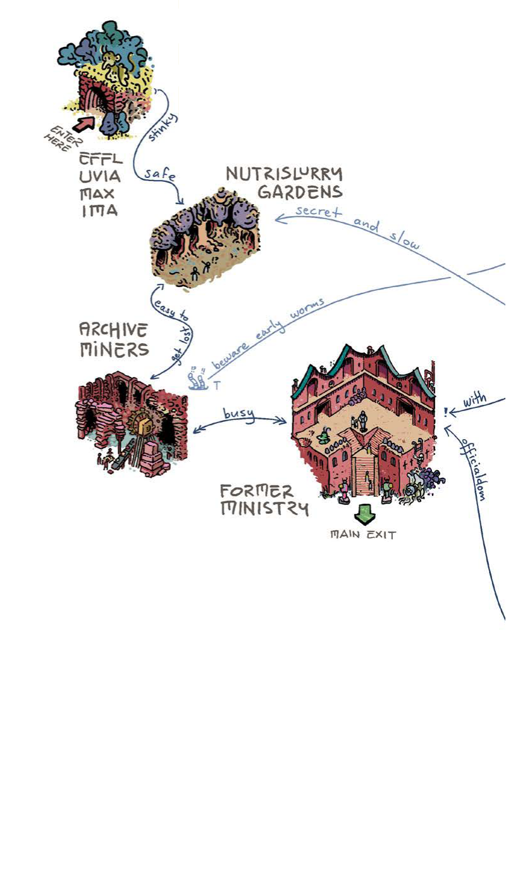

#### THE CASTLE, INSIDE

Your conveyance departs, leaving you at the ill-omened door. The contact looks uneasy, "Something is up, perhaps we are too late. Take this finder amulet, its daemon will recognize Sender. I'll find their autogolem and charge it so we can leave. Please, hurry. There is a hostile miasma."

**Deadstone Sewers**

The livingstone of the megastructure has died long ago, colonized by lichens, fungi, and jellies. No one will see you coming here.

| d6 | Encounter | Twist |
|---:|:---|:---|
| 1 | monkey harpy (L3, gentle magpie) | dead human trapped in dry jelly (loot) |
| 2 | creature encounter | dead creature (study) (it is lost) |
| 3 | creature tracks | pitfall (decayed floor) |
| 4 | eroding jelly (flesh & metal decay) | pipe map (path from gardens to resort) |
| 5 | sewer lights (inspiring) | choking gas (CO2 pool) |
| 6 | edible mushrooms | edible levitation fungus |

**Archive Miners**

Automated academics, mechanical duplicates of their classroom-bound originals, labor here, digging through the intertactilist fossil records of the Second Expansion.

| d6 | Encounter | Twist |
|---:|:---|:---|
| 1 | electric analyzer (L5, crusty thinker) | early worm trap hole (1d4+1 worms) |
| 2 | automacademic (L1, data miner) | worm trap hole (abandoned) |
| 3 | creature encounter (it is scouting) | cursed blueprince scroll (new power) |
| 4 | creature corpse (sacred fire) | encrypted blueprince scroll (safe power) |
| 5 | book avalanche (stone tablets) | mining equipment (stick of disintegration) |
| 6 | lost song ghosts (soothing) | unknown epic math poem (€1,500) |

**Nutrislurry Gardens**

The sarcoliths are still alive, converting the soil's magnetism, chemistry, and heat into edible nutrislurry.

| d6 | Encounter | Twist |
|---:|:---|:---|
| 1 | antibody crablike (L2, empath drone) | slurry autopacker (1 sk nutrislurry, €250) |
| 2 | creature encounter (it is hiding out) | active nutrivat (composting a falscher) |
| 3 | creature refuse | neatly packed loot |
| 4 | heavy slurry bulbs | acidic aneurysm (pop!) |
| 5 | sudden slurry flush | boot hoard (1 sk, €25) |
| 6 | parasitic fungi | ominous moist smell |

**Former Ministry {Record Harvesters}**

Metropolitan university outpost studying the decline and fall of the Second Expansion and an event they are referring to as "jubilee".

| d6 | Encounter | Twist |
|---:|:---|:---|
| 1 | universitarian (L2, battlescholar) | knowledge extractor (deadly) |
| 2 | showfolk (L2, ministry agents) | re-education sarcophagus |
| 3 | Antagonist's agent (L3, looking for sender) | liquefied secretarial mass (rich with official key-matter) |
| 4 | creature encounter (busy) | dust of patience (slowing) |
| 5 | autobureaucratic daemon | security pod (weapon) |
| 6 | dead ancestors (L1, on hold) | clock bell toll (stunning) |

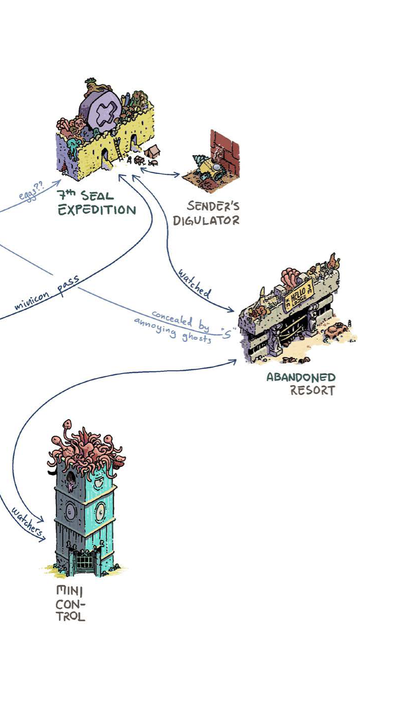

**7th Seal Expedition**

An angel-locked section, the fitful academics have given up hope, lacking a true clavus.

| d6 | Encounter | Twist |
|---:|:---|:---|
| 1 | sender's assistant (L2, conspiracist) | angel corpse (mutating ichor) |
| 2 | creature encounter (an ambush) | academic corpse (single-use power) |
| 3 | sender's traces (notes, a hidden manor?) | sender's digulator key (charged) |
| 4 | awakened stone (grappling tendrils) | angel corruption (burns, reanimations) |
| 5 | ambulatory fungi (L1, carnivorous spores) | abandoned camp (food, apparition notes) |
| 6 | early worm nest (parasitic eggs) | archaeological tools (good condition) |

**Sender's Digulator**

A pre-consolidation relic, the living machine's main brain was fried by a single divine blast through its dorsal shipmetal armor. Alas, the ancient metal friend is dead.

**Inside:** the driver cyst is locked and unoccupied. Most of the Sender's effects are missing, but a single light comes alive as a camouflaged no-box detects your source trace. The extra-spatial storage unit (extract carefully, €500, stores 5 stones) holds a holy clavis, a key made of luminous bone. The key pulses, linked to you by the sender, suggesting a place marked for you. It leads to the **Hollow House** (pXX).

**Abandoned Resort**

The late zombie democracy tried to turn this

"castle" into a resort. The Antagonist has set up an observation post.

| d6 | Encounter | Twist |
|---:|:---|:---|
| 1 | Antagonist (L6, antihero) | observation orb (€500, face-locked) |
| 2 | creature encounter (serves Antagonist) | anti-ghost screen (silver emitter) |
| 3 | staff ghost (L1, unctuous) | collapsing floor (poltergeist rot) |
| 4 | guest ghost (L0, oblivious) | visual hallucination (swinging bar) |
| 5 | ectoplasmic manifestation | audio hallucination (political rally) |
| 6 | possessed floral excrescence | recent corruption blisters the walls |

The Antagonist was not responsible for the Sender's disappearance—though they both wanted to find the same thing: the Hollow House clavis. The Antagonist can become a recurring opponent even if they die. They have a backed-up mind, afterall.

**Minicontrol**

Last local ministry outpost, become a living horror of tentacles and algorithmic command.

| d6 | Encounter | Twist |
|---:|:---|:---|
| 1 | living wall (L9, absorbing) | personality duplicator (join the ministry) |
| 2 | mural tentacles (L3, crushing) | official pardon (violence condoned) |
| 3 | creature encounter (sharing info) | official passkey (castle ignores you) |
| 4 | surveillance | doorifice (pass wall) |
| 5 | local pass records | friend polyp (L1, pet) |
| 6 | possessed floral excrescence | ministry gun (minigun, short, 2d8, rel. 7, 2 st) |

#### ONWARDS

You emerge from the age-warped megastructure, blinking in the light of the Big Sun. There is the Contact in the Sender's light goods delivery autogolem.

"Did you find the Sender?" they ask.

**Them**

The clavis, the key of builder-stuff, is a plot device leading to the Hollow House and opening its stuckforce seals.

The Contact is disturbed. "The Sender was not there? Perhaps he wants to throw _them_ off this key. I think you should follow where it leads."

| d6 | Them |
|---:|:---|
| 1 | The Butcher Bankers |
| 2 | The Cogflower Inquisition |
| 3 | The Green Son Apocalypse |
| 4 | The Levellers |
| 5 | The Ministry |
| 6 | The Rational Army |

The Contact gives you a pack of second class touriste tickets. "Blanks, unmarked, fully permitted. No angel will molest you or suggest you're town-bonded paesans. Keep a permitted ticket on you when you travel. Never know when an angel daemon will drop in to 'keep you safe.'"

**Antagonist**

Has the Sender mentioned them? The Contact dislikes, even despises them, but does not fear them. An opponent, not an enemy.

| d6 | Name | Impression | Ambition |
|---:|:---|:---|:---|
| 1 | Ammonita Crû | defrosted corpsicle | Pay back the Sender for sabotaging their Ministry examination. |
| 2 | Bone Flower | eyeless watcher | Revive their hometown, ghosted after the Sender's research. |
| 3 | Corded War-10 | new-grown body | Discover why the Butcher Bankers are so interested in the Jubilee. |
| 4 | Dolga the Pot | removable limbs | Take over the Rational Army with the help of the Sender's secrets. |
| 5 | Eisen odd Tarn | rich war coat | Reach the Black City through an unholy portal in the Hollow House. |
| 6 | Red Year Barn | synthetic soul (ka) | Hack the clavis to take control of their city's phylakes. |

You leave, by road bus or atomic train, and catch a glimpse of an ominous figure watching you leave. Is that the Antagonist. Someone else? Perhaps you will see them again. Somehow, you suspect, there is more to this than just a house key. Also, why are you continuing this loose goose chase instead of going home? What happened to you?

**Consequences**

You settle into your coasthugger* cabin, the great mollusc's shell grown into nacreous shelves and nooks and walls by the skill of the pelagic stonesingers of the Feragoü, the Sailing and the Warded Isles, where the great bivalves filter the Circle Sea and, in death, create the hulls that ply the god-given waters. Your breath catches.

You could have died. There, in the Castle, far from your town's lich-house, your brain might have spoiled, your jewel might have been lost, an anathema might have been placed on your revival.

You could have _really_ died. The way the ferals and the nomads and the barbarians out beyond Civilization's Edge die when their ka runs out, when their ba returns to cosmic slush, when their ha is eaten by worm and animalcule.

Roll a save and see what changed:

| d20 | Something Changed |
|---:|:---|
| 1 | Traumatized. Something you saw or experienced develops into a phobia. It imposes a severe penalty. Removing this trait is hard work. |
| 2–6 | Troubled. When sober or bored, your mind circles and whirls. Concentration? Study? All hard now. Removing this trait takes work ... or a good carousing roll. |
| 7 | Silver lining. You are troubled, but once you remove this trait, increase a trait one step (skilled to expert). |
| 8–12 | Exhausted. It all comes crashing down. This trait occupies an item slot. A week's rest and relaxation will remove it. |
| 13 | Strained. You shake off whatever it was, but you start the next session missing 1d4 life (minimum 1). |
| 14–19 | Learning experience. Gain 1 pip towards acquiring or increasing a relevant trait. |
| 20 | Confident. Gain a bonus when next you face something you saw or fought. If you remove this trait, gain 1 pip towards acquiring or increasing a relevant trait. |

*Or, obviously, a different cabin if you are on a road bus or atomic train or blimp.

**Experience**

Later, you reflect on your strange experiences, so unlike your life before. When any PC achieves any party goals, every player rolls individually. The players can decide to swap rolls, so the most deserving gets the most experience.

| Goal | How | Xp |
|:---|:---|:---|
| Session | Attend and be a good sport. | 300xp |
| Discovery | Find the Sender's camp and figure out likely leads to the mystery (fuel for the Referee!). | 1d6 x 20xp |
| Victory | Acquire the holy clavis before the Antagonist and get a head start on the Hollow House. | 2d6 x 20xp |
| Survival | Barely escape or avoid a powerful foe. | 1d6 x 10xp |
| Conquest | Defeat or outwit a powerful foe. | 2d6 x 10xp |
| Death | Your PC was destroyed. | 300xp |

You can now invest your experience in characters, pets, powers or equipment (see overleaf)—or save it for next session.

#### INVEST YOUR EXPERIENCE

_"For we live in a dream that eats the eyes and minces the mind, we who would be human must free our souls through experience, hardfought and well-earned. Not for us the pablum of the dream lords, it is by the sweat of brow and blood of rust we grow free."_ —Screed of the Anti-Intern Atto Vablo, 15:34–38
(Archive of Heresies, Retired, Re-Mines)

You bank your PCs' experiences. Places traveled, parties attended, creepy creatures engaged in dialog, mountains bested, ruins survived, treasures sold for profit, pleasures hunted down and carted off, etc. These experiences form a metapsychic currency (xp) which you then invest to increase the capabilities of your PCs, sidekicks, pets, friends, gear, powers, houses, or nearly anything else that makes sense. Each game object with invested xp occupies a trait or item slot on your primary character's sheet. Yes, your player character is also usually your primary character. PC is thus, conveniently, a double acronym. That said, you can have multiple PCs.

---

**Traditional Levelling**

As is traditional, the Synthetic Dream Machine provides a celestial "ding" sound every time you invest enough xp to level up a PC. Every new level you get a new level (clearly), a new hero die, more life, and the option of either improving an ability score by 1, improving a trait by one step (skilled +3 → expert +6 → master +9), or gaining a new trait (more details in _Vastlands Guidebook_, p31).

> This tabe is the "SDM legacy Leveling model". Each +Level grants other bonuses.

| Lvl | Maximum Hero Dice | Life | Traits or Ability Score Boosts | Xp | Total Xp |
|---:|---:|---:|:---:|---:|---:|
| 0 | 4 | 2 |  | 0 | 0 |
| 1 | 8 | 3 |  | 300 | 300 |
| 2 | 12 | 4 |  | 450 | 750 |
| 3 | 16 | 5 |  | 750 | 1,500 |
| 4 | 20 | 6 |  | 1,500 | 3,000 |
| 5 | 24 | 7 |  | 3,000 | 6,000 |
| 6 | 28 | 8 |  | 6,500 | 12,500 |

---

**Basic Golden Age Upgrading**

_"In this perfect time, everyone is free to be me." —Golden Boy Iäf Taggen, Most Replicated_

Human of Field Mouse Jacaranda

But you are here, at the end of history, at the culmination of time, unbound by tradition, a sovereign individual perfectable in your dream lords' adulation! Why lock yourself to that dinky plan of levelling up? Be free!

You can choose to instead upgrade your characters from their baselines. Take your PC as it was generated and write down all those initial attributes (level, life, ability scores, hero dice, traits, defenses, and so forth) in ink, scoring them permanently upon your character sheet. Uh ... but leave enough room for the upgraded numbers you will pencil in to the side. These inkrusted [sic] numbers and traits are your **base** **attributes** . You will invest xp to improve them as you like, when you like. Because what better way to be unique, like everybody else?

When upgrading your base attributes, you pay the xp cost for each step. So +1 life costs 8 xp, the next +1 costs 10 xp, the third +1 costs 12 xp, etc. The total xpo column sums the costs of upgrading from the base attribute score.

The price of upgrading **levels**, maximum **hero dice**, and acquiring **new traits** is in line with traditional levelling.

> These tables are the "SDM upgrade model". Upgrade each attribute seperately (track how much you spend on each attribute column in each upgrade table).

| +1 Level | +1 Hero Dice | +1 New Trait | Xp | Total Xp |
|:---:|:---:|:---:|---:|---:|
| base | base | base | 0 | 0 |
| +1 | +1 | +1 | 75 | 75 |
| +2 | +2 | +2 | 115 | 190 |
| +3 | +3 | +3 | 185 | 375 |
| +4 | +4 | +4 | 375 | 750 |
| +5 | +5 | +5 | 750 | 1,500 |
| +6 | +6 | +6 | 1,625 | 3,125 |
| +7 | +7 | +7 | 3,125 | 6,250 |
| +8 | +8 | +8 | 6,250 | 12,500 |
| +9 | +9 | +9 | 12,500 | 25,000 |
| +10 | +10 | +10 | 25,000 | 50,000 |

_n+1 = 2(n)_

Hero dice! Gain one d6 HD per session and one more every couple of hours or at referee discretion. Spend and roll a HD to:
- **Adjust any roll**, whether a d4, d20, or d100. This does not have to be your roll. The adjusted roll counts as a natural roll. This is not an action.
- **Regain life** equal to the roll. This is always an action.

> The Daemon holds the Hero dice for all their heroes. They may hold a maximum of their PCs' highest "Hero dice" attribute.

| +1 Life | Xp | Xp Sum |
|---:|---:|---:|
| base | 0 | 0 |
| +1 | 8 | 8 |
| +2 | 10 | 18 |
| +3 | 12 | 30 |
| +4 | 14 | 44 |
| +5 | 17 | 61 |
| +6 | 20 | 81 |
| +7 | 24 | 105 |
| +8 | 29 | 134 |
| +9 | 34 | 168 |
| +10 | 41 | 209 |
| +11 | 50 | 259 |
| +12 | 59 | 318 |
| +13 | 71 | 389 |
| +14 | 86 | 475 |
| +15 | 103 | 578 |
| +16 | 123 | 701 |
| +17 | 148 | 849 |
| +18 | 177 | 1026 |
| +19 | 213 | 1239 |
| +20 | 256 | 1495 |
| +21 | 307 | 1802 |
| +22 | 368 | 2170 |
| +23 | 442 | 2612 |
| +24 | 530 | 3142 |
| +25 | 636 | 3778 |
| +26 | 763 | 4541 |
| +27 | 916 | 5457 |
| +28 | 1,099 | 6,556 |
| +29 | 1,319 | 7,875 |
| +30 | 1,583 | 9,458 |
| +31 | 1,899 | 11,357 |
| +32 | 2,279 | 13,636 |
| +33 | 2,735 | 16,371 |
| +34 | 3,281 | 19,652 |
| +35 | 3,938 | 23,590 |
| +36 | 4,725 | 28,315 |
| +37 | 5,670 | 33,985 |
| +38 | 6,804 | 40,789 |
| +39 | 8,165 | 48,954 |
| +40 | 9,798 | 58,752 |

_n+1 = 1.2(n)_

Upgrading your **life** scores starts out cheaper, but gets more expensive. The referee may let you upgrade life in increments of +4 at the same xp price as levels and HD.

| +1 Str, End, Agi, Cha, Aur, or Tho | Xp | Total Xp |
|:---|---:|---:|
| base | 0 | 0 |
| +1 | 300 | 300 |
| +2 | 900 | 1,200 |
| +3 | 2,700 | 3,900 |
| +4 | 8,100 | 12,000 |
| +5 | 24,300 | 36,300 |
| +6 | 72,900 | 109,200 |

_n+1 = 3(n)_

Upgrading **ability** scores across the board is a little cheaper this way, but boosting a single score is expensive and best be achieved with a combination of direct ability upgrades and carefully chosen traits that include ability score increases (see the _Vastlands Guidebook_ for over 300 more traits, if that's your marmalade).

This is clearly a convenient way to boost your associated attack, defense, and inventory sizes.

| Improve Trait | Xp | Total Xp |
|:---|---:|---:|
| base (+3 skilled) | 0 | 0 |
| +6 expert | 500 | 500 |
| +9 master | 2,000 | 2,500 |
| +12 phylake | 8,000 | 10,500 |
| +15 builder | 32,000 | 42,500 |

_n+1 = 4(n)_

**Improving traits**

Improving traits is more expensive earlier in your career, but can become an affordable option later on, especially combined with growing through play (_VLG_, p32). Also, a canny character might acquire angelic or even divine aptitude with the right teachers ... or by stealing divine knowledge from the right sidereal forge.

Now for some novel options not available with traditional levelling to cover the remaining attributes on the character sheets: defenses, inventories, and attack types.

**+1 Attack and Damage**

| +1 Defense or Save | +1 Trait or Item | Inventory | Xp | Total Xp |
|:---|:---|:---|---:|---:|
| base | base | base | 0 | 0 |
| +1 | +1 | +1 | 200 | 200 |
| +2 | +2 | +2 | 1,000 | 1,200 |
| +3 | +3 | +3 | 5,000 | 6,200 |
| +4 | +4 | +4 | 25,000 | 31,200 |

_n+1 = 5(n)_

They start out quite affordable and should combine with ability score upgrades for maximum effect. You could also combine them with traditional levelling if you were feeling adventurous.

If you're planning a lot of combat or delving into the ruins of Long Ago, where the ghostly golems dwell, you might want to directly boost your natural **defense** and **save** attributes.

Need more room for traits, mutations, gear, and gold? Just like with defenses and saves, you can now boost your **inventory** sizes directly.

Finally, keen to boost your melee, ranged, fantascience, or oldtech **attack** and **damage** numbers directly? There you go.

Note that all the upgrades on this page could work on your pets, sidekicks, secondary characters, subcontractors, mercenaries, hirelings, and polybody drones as well ...

---

#### UPGRADE YOUR ITEMS

_"I never asked to be a hero. Yet here we are."_ —#6 Wrench +723bis "the Godbreaker", last survivor of the 2nd Godsmind technédive

Have you acquired a silver lobogolem, living pistol, psychic permutation, or other treasured possession? Let your heroic experiences rub off on your gear.

An oldstyle human would call such gear "hallmarks". One further-fallen from that ideal may mutter about "prizes" or "pretties" or "preciouses".

---

**Traditional Item Levelling**

Traditionally items start at level 0 and you level them up with experience (and material costs at the referee's discretion). So, a level 3 shield might have +3 defense and a level 5 grate hammer could deal 2d6+4 damage and gain a "flaming menace" trait.

> This tabe is the "SDM legacy Leveling model". Each +Level grants other bonuses.

| Lvl | +1 damage per die or +1 defense or new trait | Xp | Total Xp |
|---:|:---|---:|---:|
| 0 | 0 | 0 | 0 |
| 1 | 1 | 300 | 300 |
| 2 | 2 | 450 | 750 |
| 3 | 3 | 750 | 1,500 |
| 4 | 4 | 1,500 | 3,000 |
| 5 | 5 | 3,000 | 6,000 |
| 6 | 6 | 6,500 | 12,500 |
| 7 | 7 | 12,500 | 25,000 |
| 8 | 8 | 25,000 | 50,000 |
| 9 | 9 | 49,999 | 99,999 |

---

**Golden Age Item Upgrading**

The fabricator technologies of this golden age are better than that. Note down your item's **base attributes**, as you would for a character, and upgrade its attributes step by devastating step.

**Levels** are most relevant for vehicles, where they also translate into other attributes (like life and damage scores). Higher level powers impose penalties to their targets' saves. Weapons with levels may count as "magical" for overcoming strange alien resistances to mundane attacks. Other specific gear, such as golem armor in full auto destruction mode, also benefit from levels.

Situationally, levelled gear may also bestow a certain amount of social renown, cachet, and swagger its owner.

The bonus to roll [d20], damage per die, and armor or ward upgrades are straightforward, applying to common attributes.

> These tables are the "SDM upgrade model". Upgrade each attribute seperately (track how much you spend on each attribute column in each upgrade table).

| +1 Level | +1 Bonus to Roll | +1 Damage per Die | +1 Armor or Ward | +1 Trait | Xp | Total Xp |
|:---:|:---:|:---:|:---:|:---:|---:|---:|
| base | base | base | base | base | 0 | 0 |
| +1 | +1 | +1 | +1 | +1 | 150 | 150 |
| +2 | +2 | +2 | +2 | +2 | 230 | 380 |
| +3 | +3 | +3 | +3 | +3 | 370 | 750 |
| +4 | +4 | +4 | +4 | +4 | 750 | 1,500 |
| +5 | +5 | +5 | +5 | +5 | 1,500 | 3,000 |
| +6 | +6 | +6 | +6 | +6 | 3,250 | 6,250 |
| +7 | +7 | +7 | +7 | +7 | 6,250 | 12,500 |
| +8 | +8 | +8 | +8 | +8 | 12,500 | 25,000 |
| +9 | +9 | +9 | +9 | +9 | 25,000 | 50,000 |

_n+1 = 2(n)_

**Traits** is a catch-all category for the kinds of upgrades and features that don't add up together easily, such as:
- area, range, or speed improvements,
- circumstantial bonuses (e.g. +3 in cold weather),
- damage dice boosts (e.g. d3 > d4 > d6 > d8),
- increased charges or reduced replenish numbers,
- reduced power prices,
- size reductions (minimum 1) or capacity increases,
- other unique features (see the _Vastlands Guidebook_ equipment section pp64–93 for a few ideas).

---

#### GOING PLACES

Rainbowlands adventures are about "going there and back again" without dwelling on researching, booking, outfitting, and packing for travel. We want to unfold the big map, move the party token and plant a flag at each new location. This section provides rules for turning cash into character options, an overview of travel modes, and some event and encounter generators to make travel a little spicier if it starts to drag.

**TICKET DICE**

You’re not interested in how an atomic train runs or how to properly stow cargo in an airship’s sinewy hold. You’re a genteel tourist of taste and, purportedly, means! That’s why we’re introducing three flavors of **six-sided ticket dice**.

**Comfort Dice**

When you need pampering. Each comfort die provides +2 temporary life after a good night’s sleep. You may also permanently spend a comfort die to:
1. Reroll a defeat roll. Your hearty breakfast cushioned that blow.
2. Take a short rest, then recover 1d6 x 2 life.
3. Take a long rest, then remove an extra burden _and_ gain 1d6 temporary life.
4. Acquire a civilized item, such as a nice suit or comfy pillow.

**Protection Dice**

When you need insurance. Each protection die provides +1 to saves against damage to you or your property. You may also permanently spend a security die to:
1. Reroll a reaction roll. Your armature may frighten off would-be attackers.
2. Turn an enemy's critical hit into a regular hit.
3. Wait 1d4 days, then receive a copy of a lost item (terms and conditions apply).
4. Acquire a combat item.

**Speed Dice**

When you need to go-go. Each speed die provides a +2 to chases and races. You may also permanently spend a speed die to:
1. Avoid an encounter before rolling reactions.
2. Roll initiative a 2nd time and get an extra turn this round.
3. Safely escape a fight or catch someone who got away.
4. Acquire an alternate means of transport or travel, such as a drug mule or bicycle.

You can also use ticket dice at your destination, so long as you spend them within the week or before your next trip. At a destination, you can also permanently spend any remaining ticket dice to reroll a carousing roll.

**Buying Ticket Dice**

You buy a **ticket for your week’s travel and accommodation** in advance. Pricier tickets tend to give more dice. Choose dice types at purchase. Dice cannot be changed after your journey begins. All prices per caput (per head). Dice cannot be transferred between tickets. New tickets must be bought every week. If you have experience problems, contact the central human travel bureau [~~restricted~~ violet-coded after the televidy unsanitary incident of Void Lotus XIX].

| Prix | Type | Dice | Conveyances |
|---:|:---|:---:|:---|
| €0 | [murder]hobo | no | how _are_ you traveling?! |
| €5 | basic | 1 | coalem barge, shank's mare, burdenbeast |
| €10 | touriste | 2 | omnibus, land train, coasthugger |
| €25 | specialiste | 3 | bateau, wicker autogolem, pilgrim caravan |
| €50 | premie | 4 | iron horse, oldtech yacht, atomic train |
| €100 | excluse | 5 | friend autogolem, private glisseur, air jelly blimp |
| €250 | recluse | 6 | nightstalker, slow portal, propelled aerolith, road speeder retinue |
| €500 | prefect | 7 | hired airwhale, hovergolem, ministry biovech, illegal sphere |
| €999 | ultraviolet | 8 | aetherial golem, fast portal, aerolith cathedral, cloth of gold processional |

The travel agent nods, “Ah, you have your _touriste_ ticket and your spending disc. See, it glows with cash and promise.” Your grip tightens on your purse. The translucent discs aglow with the Lords’ wisdom symbolize cash. Primitives and barbarians outside the Garden would use it as jewelry. You know better. It means safety.

#### VOYAGE EVENTS

In the opening adventure, you got to talking with your fellow travelers. Who, how, why, what, where, when. But this is not the only thing that can happen. **Every week of voyaging, roll for an event**. The referee may come up with their own events, too. Tally up days of shorter trips and exploration into weeks and spend them for extra event rolls as needed.

**Foot, Hoof, or Pedal**

Upon the Given World most humans travel by walking, swimming, and flight, as they have since the divine glory of the first MKR machine generated the first humans into this First of All Possible Worlds.

Some humans, dissatisfied with their basic design, use magical machines to carry cargo, venture into the void, or speed swifter than sound. Traditionalists harrumph at this hubris. Some barbarians, ignorant of the common panhumanity of sentience, enslave creatures to serve them. Beasts of burden, combat chargers, even domestic daemons.

| d6 | 1–3 (Common) | 4–5 (Uncommon) | 6 (Rare) |
|---:|:---|:---|:---|
| 1 | Gore. A gruesome scene. Scattered on dawn's highway. An accident? [-1 aura _and_ a burden of horror] | Accident. A collision, a road collapse? [-1d6 life _and_ a random item is destroyed or save vs. serious injury] | Monster (L7, absorbing abomination). This thing ... was it ever human? [worth €1d6* x 100 as a trophy] |
| 2 | Sore. The hard path. Injured. A bad sprain, a pulled muscle? [-1 agility] | Injured. A bad sprain, a pulled muscle? [-1d3 life and -2 agility] | Infected. Stonefoot spores, feral land coral? [slow, -3 agility, +2 endurance] |
| 3 | Tired. The long path. [-1d4 life] | Delayed. Boisterous officialdom or mere weather? [+1d4 days] | Closure. The angel bids you take another path. [+1 week or defiance?] |
| 4 | Bored. Reveal something about yourself to your companions. | Robbed. As you slept. Chase the thief? [lose a random valuable item] | Bandits (L2, feral or barbarian). An ambush? A roadblock? [pay 1d3 items] |
| 5 | Amused. This is why the slow road is better! [+1d4 bonus life] | Companionship. A potential friend walks with you. [charisma to recruit] | Shrine. Revelation through erosion! [oldtech site, artefact and €1d4* x 100] |
| 6 | Informed. Who did you meet? What do they say about your destination? [gain +1 to one roll] | Blessed. An automatic pilgrim, an electric monk? [+1 bonus hero die or +1 bonus to one ability] | Help. A healer or a mentor? [remove one burden or a study opportunity] |

**Autogolem, Hauler Rig, Metal Steed, or Vech**

True, it is tradition that all civilized humans are made with the right to freely journey using vehicles of their own craft. Fortunately, few have either the skills or patience to build conveyances more advanced than a scooter or bicycle.

Machine-made oldtech vehicles were long taboo, marked by the red octagon of agency and restricted to holy servants. Folk tales of foolish youths hacking red-coded vehicles to perform "joy coups" often end with corrective reformatting. Today, the lack of functioning oldtech is a bigger problem. Remaining mechanical vehicles are prized, pampered, and often prayed into full golemic sentience.

| d6 | 1–3 (Common) | 4–5 (Uncommon) | 6 (Rare) |
|---:|:---|:---|:---|
| 1 | Bang! Blown tire, fractured casket, escaped spirit? [+1d4 days or -€1d100] | Bang, bang! Pot shots! Bandit ghosts? Monsters? Falschers? [-1d8-1 life _and_ save or the vehicle is damaged] | Road Hunter (L9, mad autogolem). Steel, thunder, plasma lances. [trophy worth €1d6* x 1,000] |
| 2 | Rattled. Shaken, battered, numbed. What terrible seats. [-1 endurance] | Cramped. Contorted, distorted, reshaped? [-2 strength or mutation] | Mind borrowed. Vehicle awakens with a copy of your _ba_. [uh, what the?] |
| 3 | Irradiated. By engine, sun, or shifting time. [-1 charisma or aura] | Thump. Was it a corpse before you hit it? [loot €1d6 x 20 or bury the body?] | Barricade. Militia [L2] seeks the Road Hunter. [+1 week or 1d3 weapons] |
| 4 | Numbed. Something that bothered you fades. [remove 1 mental burden] | Overcharged for spirit fuel. High. The fuel fumes? [+1 week or -€2d4* x 20] | High. The fuel fumes? [burden of elevation and +1d4 life] |
| 5 | Surprised. Living roadside attraction! [€1: gain +1d6 bonus life or an insight] | Hitchhiker. Strange roadside human. [1-in-6 actually a phylake (L6, judge)] | Restored motel. Not a mimic! [1 day and -€1d6* x 10 to restore 2 attributes] |
| 6 | Easy Ride. Share a hard discovery about you or your society. [-1d2 days] | Holy lubricants. Vehicle permabonus. Thanks, gas priests! [d6: (1–4) it gains +1d4 life, (5–6) it gains +1 level] | Wise golem. A mechanic and teacher. [repair one machine or an oldtech study opportunity] |

**Bus, Gondola, Pod, Rail, Tube, or Wire**

Public intersanctuary transport was a blessing given to approved managers and tourists by the Good Gods in the Long Long Ago. Living buses and atom trains and wire golems and pod floaters and more they gifted the humans for their certified travel needs. Alas, time has had its way and now anyone with the cash to spare may board one of the public transporters, whether a holy fool or casteless feral or a fiscally fallen noble.

Cheap, slow, and raucous, the public intersanctuary transport system even yet attracts some tourists.

| d6 | 1–3 (Common) | 4–5 (Uncommon) | 6 (Rare) |
|---:|:---|:---|:---|
| 1 | Fight! Other travelers' fists fly. Bottles are drawn (L1, lubricated). [save or you, too] | Impact. _Something_ (L7, scary) under the bus. [-1d4 life _and_ a random item comes alive with an alien spirit] | Ambush. Falscherbarians (L4, eerie) or electronomads (L5, zapping). [your € or your priciest item or your life] |
| 2 | Broken. Cubist chairs, cruel corridors. [-2 agility or strength] | Dead. Thankfully, insurance. But who pulled your plug? [+1 week and -€50] | Modified. A foreign subroutine in your soul? [+1 aura and a ticking trait] |
| 3 | Sleepless. Two nights required. [suffer 2 burdens, sleep fixes it] | Tax. Official local inspection. [+1d4 days and -€5 _or_ just -€20] | Partly digested. The vessel is hungry. [lose a limb or 1d3 items] |
| 4 | Itchy. Lice or mice or seat bugs? [suffer 1 burden, remove with a bath] | Breakdown. Disembark and walk? [+2d6 days] | Ventilation cough. Wheezy, metallic. [burden of disease] |
| 5 | Delayed. Not unexpected. [+1d4 days] | Donations. Or listen to the word. [-€1d6* x 5 _or_ -1 aura and +1 day] | Valuable heirloom. Someone lost it, you found it. [random item] |
| 6 | Friends. Share drinks and dreams and one will help. [level 1d4, 1d3 skills] | Secret voices. The spirit of travel. [-3 ability points to gain a random power] | Visions. A secret or forgotten place. [awake with a key in your fist] |

**Cargospace & Intersanctuary Express**

At the dawn of time the Lords equipped the human sanctuary settlements with expresses—a system of magimagnetic vacuum tubes and capsules to move cargo and suspended humans from station to station at speed.

Humans traveled in suspension as cargospace is very hazardous to human well-being.

Few moderns now retain the access blessing to travel in suspension, so the intersanctuary express is used almost exclusively for authority-approved cargo. The ingenious humans of these later times use the anti-entropic outer shell of the express as the main highway round the Circle Sea co-prosperity area—the Right Road. Golem buses, solar tricycles, and personal velocipedes abound.

**Access Blessing One — Autosoma**

_Unlock Medical Buildertech, Sacred Pod Charm_

**P:** 2 **R:** nearby

**T:** auld meditech **D:** hours

> Code daemons in your blood speak to the oldtech and announce you as a hereditary "duck mountain prominence". Control healing machinery without the risk of mutations or degradation. Access suspension capsules. Use cold storage as a one-way time machine. **Overcharge:** the healing oldtech deals damage instead. **Note:** you can only store this power in human tissue—in yourself (as a trait) or in a suitable anchor, such as the mummified hand of Dr. N. A. Vec.

| d6 | 1–4 Cargospace (Common) | 5–6 Cargospace (Rare) | αΩ Cargospace (Awake) |
|---:|:---|:---|:---|
| 1 | Nightmares. A thousand lifetimes of anguish and horror. [suffer 2 burdens] | Body stolen. Now a synthetic copy. [permanent: -1d3 life, +1 ability score] | Spiritwipe. You now need to eat souls to live. [you have no aura] |
| 2 | More lives. You saw copies of yourself in the Long Ago. [+1d4 life] | Replaced. Died and swapped under warranty. [permanent: +1 life] | Hard rays. Glowing and translucent. [-2 physical, +1 mental ability scores] |
| 3 | Oblivion. You dissolved and dissolved your fears. [remove 1 burden] | Seams. You were stitched back together. [-1 aura, -1d4 life] | Neuroliquefaction. Your brain is an ambulatory amoeba. [-1 life per level] |
| 4 | Nothing. Nothing nothing. The NO thing (L11, null) speaks to you. | Original. You awake with memories of a lost world. [+1 bonus hero die] | Recessive. Devolve back towards your rat ancestors. [-1 thought, +1 agility] |
| 5 | Rehydrated. Feel no thirst for a week. Preach the benefits of Road FluidTM. | Updated. One of your traits was improved. [gain +1 rank] | Possessed. A daemon of your past has replaced your mind. [gain +1 level] |
| 6 | Entertained. You have a hundred vidy stories to tell. | Scrubbed. Shiny! [diseases and parasites removed] | Stars. You see a cosmos of countless stars. [gain +1 hero dice permanently] |

**The Waters: Bateau, Ferry, Glisseur, or Yacht**

Many rightly humans fear the waters, for they represent that portion of the world given to the cetaceans by the gods. As the old song goes, the sea is a desert with its life underground and an azure disguise above. Restricted from fishing and aquaculture by the pelagic phylakes and alien cetaceans, few traditionalists see much use for the salty watery expanse. Indeed, they would be hard-pressed to see much difference between commercial clans, hexad high-liners, polybody pirates, and feral ferryfolk.

For the traveler, there certainly are differences. For one thing, reputable seafolk won't steal your body.

| d6 | 1–3 (Common) | 4–5 (Uncommon) | 6 (Rare) |
|---:|:---|:---|:---|
| 1 | Flotsam. Dead bateau. [-1 aura _and_ a random item] | Hell gull. The bird mugged you! [lose random item or -1d6 life] | Castaway (L6, body-hopper). An ultra or a time-lost wanderer? [€5k bounty] |
| 2 | Great wave. A holy mountain behind. [-1 strength and endurance _then_ save to gain a helpful spirit vision] | Seasick. The stomach rebels. [-1 endurance] | Seaworm (L2, unaesthetic). A nasty parasite. Remove it before it grows. [-1d4 life or -1 charisma per week] |
| 3 | Squall. Rain, thunder, waves, wind. [1d3 random items get wet] | Storm. Blown off course, you dock at another port. [+1d10 days] | Breach. The work of the cetaceans? [+1d4 days _then_ save or shipwrecked] |
| 4 | Fine dolls. Cetacean emissaries track your vessel. [+1 bonus charisma] | Whale killers. They sell mystery meat. [€5, restores 1 attribute] | Undines (L10, moody, pale). They hunt the killers. [trade truths for luck] |
| 5 | Exercised. Ions in the air recharge you. [+1 bonus hero die] | Floating chest. Can it be that old? [random item _but_ save or cursed] | Ghost ship. Looks seaworthy! [haunted but worth €1d4* x 1,000] |
| 6 | Relaxed. The sea airs are medicinal. [benefit from a long rest] | Soothed. Partake of leaked cetacean dreams. [remove all mental burdens] | Contact. A cetacean speaks to you. [will teach friends aquatic traits] |

**The Airs: Blimp, Flapper, Propelleur, or Rug**

Traditional, god-fearing stories say humans are barred from the heavens. That demons and deities claim those high places as their own. That nothing save thin air and dry decay await beyond the protective embrace of Mother Soil and the nurturing guidance of Father Rain. So many of these stories align that there are castes of scholars convinced they were constructed from a single template. This could not be, for it would imply some force or organization meddling with human myth on a grand scale!

In any case, air travel is too expensive and dangerous for ordinary humans and the nobles and scions who may be expected to regularly fly like birds between one city and another cannot be expected to face the same barriers as the less divine orders of humanity.

| d6 | 1–3 (Common) | 4–5 (Uncommon) | 6 (Rare) |
|---:|:---|:---|:---|
| 1 | Stuckforce! Detour to avoid the razor fields. [+1d6 days _or_ save or crash] | Long Ago force bullet. [save or lose d6: (1–4) an item or (5–6) a limb] | Razorstorm. Long Ago forces whip the air. [save or crash _and_ lose a thing] |
| 2 | Blinded. By the unhazed light of the upper air. [burden lasts 1d6 days] | Mirrorforce. Shard seeks eye. [save or gain burden: all looks evil] | Devisions. Gremlins infest your optics. [-1 thought _and_ burden: hallucination] |
| 3 | Riders (L2, solar nomads) on the storm. [pay a random item as a guide fee or risk a storm: 1-in-6, see rare] | Aerolith island. It is d6: (1) cursed, (2) infested, (3) mutating, (4) abandoned, (5) fresh, (6) settled. | Killer air whale (L7, angelic). Seeks live food or undead fun. [aerolith-infused bones worth €7k] |
| 4 | Airsick. Too little oxygen? Too much aether? [-1 thought _or_ strength] | Heavy haze. Go slow or get lost. [+1d4 days _or_ save or fly off course] | Green sunburn. Moss blooms on skin. [lose -1d4 attributes, gain +1d8 life] |
| 5 | Air plankton bloom. Harvest time! [+1d4 days to gather supplies] | Noble creatures (L4, grazing pod). Feel uplifted. [restore 1 lost attribute] | Fair angel (L6, harsh). Reads your mind and soul. [save to prove you are good] |
| 6 | Sundogs. Bless these rad puppies! [+1d6 life for powers] | Lost prayers. Pre-approved. [sing to remove 1 burden] | Dragon (L13, alien). It offers solace. [randomly replace a trait or item] |

**The Void: Bolide, Chariot, Sphere, or Voidskiff**

Modern, civilized humans do not travel to the stars, fast or slow. There is nothing there for the status-conscious. However, those strange outcasts, those voidwalkers who claim to have been there, say many divine machines still sail the dry void. Others say secret portal codes unlock strange places far above the Soil. Then there are the strange dehumans who say they climbed down the Ladder of Heaven itself. What is this, if not mere monkey-tosh?

One thing is sure: humans exposed to the void, beyond the airs of the Given World, desiccate swiftly and totally. Rehydration is expensive (€1d6* x 200) and best performed in a registered meditechnical temple.

| d6 | 1–3 (Common) | 4–5 (Uncommon) | 6 (Rare) |
|---:|:---|:---|:---|
| 1 | Hulk. A void vessel from Long Long ago, full of dehydrated protohumans. [enter: -1 endurance and horror] | Horror. We _are_ so small. Nothing. [once: permanently lose -1 aura, after: gain burden of cosmic terror] | The Eater (L17, demilyst). It obliterates because it must. [treasures orbit its maw, to acquire one: save or dissolve] |
| 2 | Cabin fever. There is nowhere to go. [save or lose 1 aura or thought] | War fever. The winds of limbo roar. [save or feel compelled to eat brains] | Gene memory. The shakes hit. [-2 agility and save: gain a psychic trait] |
| 3 | Voidsick. Odd vibrations afflict you. [-1 strength and save or mutate] | Hyperparticle. Losing air or spirit. [spend 1d3 items to repair or run out in 1d4 days _and_ save or mutate] | Insight. _So_ small. Rats in the cosmic corpse. [once: permanently gain +1 thought, after: gain 2 hero dice] |
| 4 | Astral flora. A sargasso of space kelp. [+1d4 days to harvest nutrients] | Protogolem. Its suspended mind, still human? [-1d6 life to restart] | Shell people (L3, soil-hungry). Surfing the void. [suspicious, but will trade] |
| 5 | Silence. No voices but yours. Share, bond, come together. [+1d4 life] | Ghosts. Voices from Long Ago. Follow them? [+2d4* days to reach source] | Another chariot. _Exactly_ like yours. But abandoned. [duplicate an item] |
| 6 | Perspective. _We_ are so small. Specks of dust. [once: permanently gain +1 charisma, after: remove 1 burden] | Recrudescence. Humans were made for the war. [gain +1 strength and an innate aggressiveness] | Interloper (L6, giant). It looks human, but stands 9 feet tall and wields buildertech. [devil? angel?] |

**The Portals: Dull, Fast, One, Slow, or Wild**

Portals have fascinated humans since prehistory. Some think them gifts from the Lords, others that they are the byproducts of ancient "Engineers." Many simply accept them as fundamental cosmic structures.

These hard-coded passages between distinct locations form hub-and-spoke networks, with portal temples serving for central access.

The dullway protocol dismantles and reassembles travelers, with journey times and capacity varying based on the portal's information density and usage. Welltraveled routes between major institutions can transport up to a hundred people in hours, while smaller village portals may take months to handle a single traveler. To preserve human sanity, most travel gates were once equipped to run pocket realities for their travelers during point-to-point translation.

The Human Wellness Authority maintains that portal travel is completely safe. It claims side effects are very rare, mostly harmless, probably temporary, and the individual traveler's own fault.

Nevertheless, most moderns fear this ancient technology, fearing it may steal their immortal motive sparks. This is not incorrect.

| d6 | 1–3 (Common) | 4–5 (Uncommon) | 6 (Rare) |
|---:|:---|:---|:---|
| 1 | Living tunnel. Wailing life-forms smeared into the length of the portal tunnel, enmeshed in its no-being. [save or they consume +1d6 days] | Human tunnel. Generations upon generations built into the walls of this ill reality. [save or join them for +1d4 weeks, then save or stay] | The Dull Worm (L15, waymaker). It connects because it can. [spend +1d4 weeks and 1 aura to find a new place; scavengers and terrors follow behind] |
| 2 | Blanking. Some memories disappear. [save or they were important] | Seepage. Some of you is lost. [lose -1 thought or aura] | Stripped. Soul milled. [save or become a flesh golem without aura] |
| 3 | Emesis. Please clean yourself up. [lose your last meal; hungry now] | Nosebleed. [d6: (1) a second mind enters you; (2–6) cosmetic only] | Illumination. [d6: gain (1-3) a glow, (4–5) a soul, (6) a grim purpose] |
| 4 | Existential dread. This place is not for humans. [alcohol-soluble burden] | Strange gasses. Burp discreetly. [ingest to levitate for 1d3 days] | Odd machines. They live inside you. [feed them power to gain knowledge] |
| 5 | Dull. The way is boring. It feels endless. [rethink a position] | Time. Time dilates. It is endless. [grow older and wiser, or the reverse] | Side. Walk besides yourself. [become more; add +1 to your best ability] |
| 6 | Invigorated. Imbibe the vim of the spaces in-between. [+1d6 life] | Euphoria. You're so happy you could explode. [gain a hero die] | Emptiness. The nothing sets you free. [remove 1 burden and gain +1 aura] |

#### THE LIST OF ALL HUMANS

_"... Circle Sea power groups consider all close-to-baseline sentient and soulful post-humans as effectively human and possessing the full spectrum of rights attendant to a soul-body-personality triad. This includes retro-humans, dwarfs, half-elfs, halflings, quarterlings, and half-orcs."_
—Ten Long Ago, _A Guide for the Free Visitor to the Caste Oligarchies of the Circle Sea_, Violet University Press, Wind Hyacinth II

You voyage to meet strange people and their ways, do you not? No? No matter, you notice them all the same, all the humans in their ragged finery and strange shapes.

Of old, the gods divided all sentient creatures of this Given World into two groups. Those protected by the Builders’ Blessing, the humans. Those cast out, fair game called beasts. Each human was blessed with a metaphysical jewel in their head. This jewel, called canopic, recorded their mind and soul and dreaming, and made possible eternal rebirth within the Garden.

We need not dwell on how the gods’ folly poisoned relations between humans and beasts.

In these later days, with the Garden’s Dream Canopy torn holefull, with the jewels of rebirth rare treasures rather than ubiquitous organs, all humans must live as though they are condemned to die, like mere beasts of the land. After all, what human living would crack their skull asunder like an egg and sift through their thinkmatter for the threads of biomagical jewelry?

The modernists of the novel sacred-industrial societies would equate the blessing of humanity with the ability of a creature to embrace the coin and commerce of Good Mohlack. The payment of tax and the purchase of credit as the measure of the man.

Yet, traditional communities around the Circle Sea still gather each night to recite the List of All Humans—the pananthropy of the canopic form, to smooth their resurrections should they die before they wake.

In fact, the List of Humans is a combination of two prior lists; that of the _Six Canopic Categories_, which is reliably dated to the A Priori Intermediate Period (2), and the _Eight Manifest Forms_, which are probably best known from the Silver Age of the Heretical Modernisation Empire. The two lists were more perfectly combined in the Revelation of the First High Intern during the TwentyThird Dynastic Stabilization of the Mother Machine (estimated XVIII cycles of years ago).

_"Without order, all is chaos."_
—Five Rabbit, _Submission to the Demiurge Abaco_, Traditional

In order from lowest, least human, to highest, most human, the blessed finite sapients are determined by the _Green Book of the Six Canopic Categories_:

**Megas**

_from the archaic omega, also: huskfolk_
The least of the humans, those who succumbed to the Fog and forsook meaning for illusion. Their jewels mark them human, though they would live as does a herb.

Few now remain as few towns are rich enough to support their hollow shells as once they could. In the Green Land, some are given sarcotrephs to maintain their bodies until their allotted recycling of spirit and body. In the Orange Land, post-mortal lords use the Megas’ corporeal forms for labor while their minds dwell in the Bliss Lord’s gift.

**Recusers.**

_also: the conflicted, fledfolk_
Some humans refused the Garden Path and chose the Vale of Thorns. They sought meaning in toil and struggle, they averted their souls from the gifted technologies and lived hard lives upon the soil.

Once, the Gardens welcomed those who tired of this path. Now, with the Gardens all grown over, many Recusers, grown harsh over lonely eons, have returned to rule as vampires and warbarians, nomads and heretics.

**Accusers.**

_also: the nemesis, errorfolk_
The gift of the mind jeweled gave Humans a choice: to live in the grace of the Canopy, or to accept the darkness and the lie. The accusers are so-called because they accused the Lords of the Dream of stealing their purpose, their lives, their very cosmos. Most fade, harmless as ghosts, into the Wilderness beyond the Circle, but some remain as fifth columnists in the bosom of the Best of All Possible Worlds, the civilized lands of the Circle Sea.

The kindness of the Canopy extended even to guilty Accusers who vainly attempted to sabotage the Gardens. They were given the Illusion and allowed to live out their allotted years in synthetic pleasure. Nowadays, with the processing power of Heaven much reduced, the Inquisition finds other solutions for Accusers.

**Hammers**

_from the archaic gamma, also: lessers_
The less-blessed humans, whose service to the Path merited their participation in humanity. Once they filled out the serving classes, maintaining the grand designs of the Builders, fleshing out the backdrops of the Lords' pleasure palaces, uplifting their hands in creation.

Most modern humans should probably fall into this category, but with the decay of records, the corruption of canopic amulets, and the lack of accurate timekeeping, many have successfully slipped the net and passed themselves off as other categories of person. Some traditionalists nevertheless try to restore the old order and return the former hammers to their happy place.

**Betters**

_from the archaic beta, also: sickles_
The middle classes of humans, suitably adjusted to the Garden Path, they provide the bulk of the civilized lands’ managerial population. Their life is one of cutthroat competition for status and displays of consumption to prove their worth. This pleased the Canopy and now pleases the Ministry.

Today, Betters provide the human calculating power that substitutes for the dead machines and failed thought generators that once maintained the Circle Sea as a single perfected unity.

**Fines**

_from the archaic aleph, also: lephines, rabbitfolk_
Those humans who have best accepted the Garden into their hearts and are thus blessed by fortune and grace to occupy the finest social positions. All civilized humans would like to be Lephines, but only few succeed. Much sacrifice, conspicuous consumption, and extravagant inheritance are required for this exalted status.

Today, with the Lords all but silent on the matter, local lephines are chosen by various means: heredity, lottery, pageantry, elections, poetry, translational cannibalism, autogolem races, and roleplaying dance.

_"As there are eight directions to spacetime, so there are eight categories to man."_
—Driving Thorn, _Beyond the Garden Path_, Heretical Modernist

In order from firstmost, earliest human, to lastmost, latest human, the mortal sapients of the Circle Sea are enumerated in the _Silver Book of the Eight Manifest Forms_:

**Iron Humans**

_also: basefolk, sourcelings_
Those following the protomorph of humanity, fixed in body and shape, from the sylphen elfs to the robust gnawers, from the gnomic half-lings to the machinewired cybrechts.

Once, this label applied to those who ostentatiously eschewed the use of canopic jewels and other abmortality oldtech, usually as a show of bravery or zealous faith. This was often seen as an adolescent phase, like education, revolutionary activities, or capitalism.

Today, many recusers proudly tout their iron human credentials. Not to be confused with machine humans.

**Machine Humans**

_also: chalcocephalics, wireheads_
A later, now rare, morph of humanity, which eschews original biology for technomechanical polish.

These sapients combine mind and soul with bodies built from the dust of the earth. Not derived, born, or inherited, but fully created by the generative power of the Builders. Not to be confused with iron humans.

**Ghosts**

_also: ultracorporeals_
A numberless host of humans sought a kind of immortality in the divine dream machine, in the infinite noösphere, beyond flesh or steel. Many forsook even the pretense of a stored body or canopic jewel backup, opting for a completely spiritual existence.

With the slow decay of the universal noösphere, whole ghost lineages have been lost to flawed crystal memory drive updates. Others have escaped the noösphere to become a kind of parasitic consciousness, human daemons given to wearing other creatures' flesh to interact with the Given World.

**Dwarves**

_also: delta labor, dewerkers, maintainers_
Selectively biomanced humans derived from the ancient maintainer castes, they embraced an identity of labor and industry, opposing the leisure mandated by the Garden Protocols.

Some argue that the name is a backronym from ‘de werker aristocratiscee revolutie fraternitie.’ Recent excavations at the Germline Palace, however, suggest their origin might be as ‘DIN War V Engineering Subjects’. Since the excavations are from the stratum right before the so-called “cyan death cloud event”, some rabble rousers suggest a dwarfer hand in that calamity— whatever it actually was.

Whatever the case, these biomanced work-obsessed humans have become a standard morph in these ages of Ministry-guided civilizational reintegration.

**Golems**

_also: synthetic humans_
Humans who have moved beyond the fallible, decayprone shell of organic flesh and embraced the synthetic likeness of the Great Minds’ ensarcs. A golem’s canopic jewel is cradled in an armored ur-matter core, protecting it from most forms of bodily death. Around it, they wear shells of gold and crystal and stone and liquid metal.

Since the buildertech to make new minds _ex novo_ is now almost entirely lost, new golem minds are usually made by copying existing golem minds, wiping irrelevant memories and resetting them to "factory conditions". The other, less salubrious option, involves taking living human minds out of their existing bodies, but this destructive process often results in neurotic or psychotic golems not suitable for reliable, sustained free labor.

**Liches**

_also: abmortals_
Humans with bodies perfected beyond mortality and decay, the undying, the unending, the perfect. Traditionally, most sensible humans followed the Garden Protocols. They lived in biological bodies but used canopic jewels to maintain a personality backup in case of catastrophic injury.

Now so few remain. In some cultures, to depend on oldtech for one’s abmortality is a mark of cowardice or moral failure. Still, one finds liches, from the oldest houses to the strangest new cult-clans.

**Plastics**

_also: plastifastics, skinchangers_
Some humans embraced the biomantic potential inherent in their sculpted flesh. Through old traditions, dangerous arts, and strange sciences, they turned themselves malleable and impermanent. Protean meat-block humans: made, re-made, changed, and transformed.

They are few in the civilized lands, but beyond, one may find many types of plastics, from the rheosarcs who can adjust their appearance and form to match their tasks, to the impressibiles, who grow into shapes and forms matched to their training protocols. More terrifying are the grotesque falliments and the uncanny ereunts, subjects for illegal biomancers to experiment upon.

**Ferals**

_also: hoy exoy, warbarians, quarterlings_
Strange extra-canopic humans, of different lineages and origins, born or grown in contravention of the Garden Protocols, with neurosystems that cannot support a traditional canopic jewel.

These hylosphere-bound varieties must use complicated devices like dream helmets to access the noösphere. Ferals require a full-body rebuild to enter the Dream Canopy, that walled garden reality the lords reserved as a Heaven for deserving humans.

Ferals usually shunned these kinds of interventions, which proved a decisive advantage when the Dream Canopy permanently shut down for temporary maintenance in the Era of the Snow White Sky.

#### THE 768 HUMAN LANGUAGES

_Human cultivars develop new languages as horn beetles develop new headgear. After initial experiments in reducing this inefficiency, the Dream Canopy concluded that linguistic and cultural creativity are a necessary condition for Garden human well-being. The babel was therefore discontinued, except on a need-to-use basis._
— fragment, ruined Temple of Involuntary Speech

As you voyage, one of the things you notice is that all these humans and oldtech devices and leftover daemons and stuttering ferals and ghosts of lost times talk, but talk strangely.

The Circle Sea is thick with languages, dialects, jargons, and slangs. Some say this is by design. Who can say? Well, the Mouths of the Babbling God (pseudoheretical) say it is for the benefit of humans, that they be not confused by Hubris or Nemesis.

Fortunately, neither player nor referee needs to perfectly detail this babel of communication. It is enough to have a sense of how it sounds and feels and looks.

**What [How] Good Is Language?**

Once, all humans were born with a language spider linked to their cranial jewel. This ensured all humans could commune perfectly and follow the Builders' instructions flawlessly. It made the distinction between humans and beasts very easy: those who did not speak, the voiceless, were beasts.

Today, with the radiation of languages, even a language spider is no longer enough and beasts may mingle among humans unseen. Tlumacs and other daemons provide sufficient understanding, but fluency in this time of linguistic efflorescence demands study — an expensive pursuit and proof of nobility and goodness.

Regardless, the traveler will usually find themselves in one of three situations:

1. **Mute** or **Unlanguaged.** There is no shared language. A human tries to talk to an elephant, an engineered urk to an elfer mossman, a sentient ant colony to a plastic golem, a book to an illiterate feral. Misunderstandings are rife. To charm another at this level of linguistic incompetence is nearly impossible, to convey mere facts and concepts a struggle.
   For critical communication, PCs must roll a test. Failure may provoke (roll d6): (1) hostility, (2–3) derision, (4–5) laughter, or (6) pity.
2. **Competent.** There is a shared language. Whether this is through study or tlumac daemon intermediation, a living translator or an implanted language. Communication proceeds normally, if without brilliance. Charming an interlocutor requires strange pheromones, inspired luck, obfuscatory hallucinations, or sheer magic.
3. **Natural** or **Native Fluency.** The speaker has invested in their language and it shows. Natives trust native speakers more. Deception, intimidation, even persuasion are easier.
   PCs must have a relevant trait to claim this level of linguistic gilding: oratory, politics, rhetoric, theater, or an upbringing in a mytho-poetic rustic rendition of what the culture holds near and dear (folk hero).

**Learn Languages Faster**

Few humans in this golden age have the patience, opportunity, or capacity to learn a language the old way with tutor golems and flash scales.

- **Tlumac daemons** are wisps of sentience, simulacra of personhood trapped in physical items and bound to service their owners or lease-holders. Most travelers rent the services of a tlumac daemon when they visit a foreign parochial community for €1d4 per week (depending on the rarity of the language). Buying a servitor tlumac costs around €100 for a 5-language model or €500 for a 10-language type. Typical tlumac forms (d6): (1) amulet, (2) earring, (3) necklace, (4) earworm, (5) jawbud, (6) third eye.
- **Injectable brain-rewiring** is the safe and affordable solution for those who need to acquire linguistic skill fast. Cultural norms, common knowledge, basic humor modules, and stereotypical grievances are usually included. The slow version costs €1d6 x 200 and takes a week to embed. The fast version costs ten times as much, but embeds in an hour. The language-cultural package occupies a trait slot. Side effects certainly do not include (d6): (1) nervous tics and odd facial gestures, (2) altered personality states, (3) numbness and lack of volition, (4) sudden hair loss or repigmentation, (5) language versioning conflicts, (6) pettifoggery and limp-wristedness.

**The Power of Fluency**

Characters with natural or native fluency may (with practice) acquire the following powers as innate traits:

**Hero's Goldenmouth**

Honeyed Words of the Trustworthy One

**P:** 1 **R:** a crowded room or small courtyard

**T:** upstanding humans of your putative culture **D:** until reality forcefully intervenes (then save)

> Pour yourself into your words, dramatic gestures, suggestions, and compelling straw men. After a few minutes of speechifying, spend 1 point of charisma, aura, or thought to charm your listeners. They find you persuasive, trustworthy, and likable enough to believe your 'truths' and give your ideas a shot. This is no mental domination, you are simply showing that your plans are in their best interest.
> 
> _Overcharge:_ charm through a telemagical medium such as vidy crystals or comm portals.

**Adulation Rejuvenation**

Polyempathic Vampirism

**P:** 2 **R:** an arena

**T:** a human mob that likes you **D:** several minutes at least

> Tell a crowd what they want to hear and feed on their adulation, then save. Success: gain 1d3 temporary points of charisma and 1d4-2 life. Fail: regain 1 charisma.
> 
> _Overcharge:_ gain 1d3 temporary points of charisma. _Limit:_ works once per crowd, temporary charisma points cannot exceed base charisma score.

**The Form of Speech**

You've unplugged your tlumac daemon and seek to hear with your own ears what words these humans make? The barking noise of their mad speech sounds and looks ... (roll at least twice).

| d6 | 1 | 2 | 3 | 4 | 5 | 6 |
|---:|:---|:---|:---|:---|:---|:---|
| 1 | harsh | alto | mechanic | detached | repetitive | whistling |
| 2 | melifluous | piano | wet | sing-song | regular | slaps |
| 3 | staccato | forte | cold | hands | novel | psionic |
| 4 | drone | tonal | emotional | expressive | archaic | digital |
| 5 | dry | clicks | ironic | gestural | jargon | painted |
| 6 | nasal | sibilant | literal | tactile | simple | synchronic |

**The Good Common Speech[es]**

Every traveler will be aware that there are hundreds of human languages in the Circle Sea and many more thousands of beastly languages beyond. Fortunately, every educated traveler knows that little more is required than an excellent apprehension of the Common Speech—the so-called Sermo Comun of the Ministerials.

Sadly, Old Common was last codified in the first generation, while High Common was last codified [error] generations ago; as a result most contemporary vulgar commons are not mutually intelligible.

- **Old Common** (also: Betterspeak, Serme Madraia) is the original interlanguage taught to all first generation humans by the Mother Machines. An optimal, streamlined language for operating in the stem environment of the Initial Settlement of Heaven. Now a dead language, except among several dozen aristocratic circles and retrograde societies that are certainly not important powers in the invisible markets.
- **Un-Common** (also: Ur-Common, Bilder, Dromspreg) is the old-fashioned cousin dialect of Betterspeak, used by the Dream Lords and their agents. Neither streamlined, nor optimal, it is full of bizarre idioms like “break a leg” and “bolt from the blue” that are patently false. It is often found embedded in timelost personalities when these are excavated.
- **High Common** (also: Canopic, Sermirabilie) is the beautiful 17th generation form of Betterspeak devised by the Dream Canopy for Garden humans. It is the standard language taught among the better classes, its melodious vowels, flexible grammar, and luxurious lexicon offering a special status all its own.

**The Vulgar Common Speeches**

There are 768 officially registered parochial dialects and creoles used by the lesser classes and tribes of the Garden. Since they are neither mutually intelligible nor particularly valuable, most dignified travelers prefer to purchase the services of a tlumac or local interpreter, rather than learn these declined jibber-jabberings.

- **Blue Speeches** (also: Blauenstalk, Azulic) encompass the harsh and uncouth dialects of the fallen folks of the Blue Land and its exiles. Writings in these languages are easily infiltrated by mental corruptions and thus suppressed. Their lexicons are rich resources for those interested in fungi, fermentations, dairy, aquatic vegetables and teleempathetic post-human neurological heresies.
- **Green Speeches** (also: Grenspruks, Meraldi) cover both the peasant and forester oral dialects of the inland Green and the glittering neo-common of Metropolis, the Emerald City, with its countless loan words from Un-Common and Bilder. The latter is known for its broad pop-lit corpus and overdone neotraditional handwriting.
- **Yellow Speeches** (also: Saffranian, Polipoliti, Caravanian) cover a range of urban and nomadic languages in the Yellow Land and beyond in the Yellow Waste and Golden Desert. The Caravanian creoles have a mercantile written tradition, flexible structure, and propensity to cant. The languages of the cities tend to be onomatopoeic, with short words and a preference for understatement. Their refined rhyming lends well to written forms and musical theater.
- **Orange Speeches** (also: Oranjetic, Caddic, Proprish) embrace both the colloquial musical dialects of the little mayfly humans of the contemporary Orange Lands with their paltry written traditions and the ancestral chanted forms used by the administrators and grand necromancers of that fertile land.
- **Red Speeches** (also: Raudalandi, RD Cant) include the rough, dwarfer influenced languages of the lesser vintners of that region, the badly-rhyming vulgar and politically charged traditions of the Red Land District, the grinding, dusty forms of the rustlander seminomadics, and the rich, slippery syllabaries of the long-lived bunker-and-blood clans who first liberated that region from the Ill Gods.
- **Purple Speeches** (also: Purapura, Catastrofict) range from the oral hammer tongues of the Purple Land with their steppe and Blue borrowings to the mildly telepathic acat-demese of the Violet University and the uplifted agents of the Cat Lords.

**The Poor Forms**

Barely speech, it is unclear to humans with good source codes and impeccably machined germ lines how these babblish sounds and gestures could possibly function.

- **Feralspeaks** (also: Steppen, Plateausk, Elfen, etc.) is a neutral and inoffensive term used by enlightened betterfolk of the Circle Sea to refer to the related and unrelated 'languages' spoken by out-Garden sentient communities instead of the more loaded expression 'feralshits'. A polite term among the lettered ministerial uplifters is “subaltern dialects of the deprivileged extra-canopic groups”. It is best for humans to use tlumacs rather than bestially deforming their faces to speak in these bestial ways.

- **Free Circle Kriols** (also: Markanto, Perimse) cover the rhymed disyllabic water tongues of the Circle Sea free families (pirates) and river-travelers (bandits). The lack of a written tradition and idiosyncratic dialects prompt most scholars to dismiss these kriols as a subject of study.
- **Topic** (also: Panpan, Susjarda) is the general term for the barebone pidgins used by unlicensed peripatetic communities formed by the dregs of dissolved settlements and semilegal barbarian refuseniks. Most managers will tell you no topic is worth learning as anyone with a grasp of High Common can give orders to a topical traveler.
- **New Common** (also: Falschic) is a heretical invented language that was definitely not supposed to be an updated and improved 54th generation form of Betterspeak. Anyone coming across its written or spoken forms should report to the authorities for a health and safety inspection.

**The Maintainer Speak[s]**

Long Long Ago, when the machines were first born, a caste of humans was made to keep them glistening and glowing. The Mother Machines bestowed an elegant Newspeak, a streamlined Betterspeak, on these dewerkers. Over aeons maintaining the machinery of the Garden and the golems of the Gods, it has become a family of reasonably human languages, including:

- **Mainttalk** (also: Dwerkfers, Golmtek) is the archaic golem-compatible basic newspeak still implanted in many newly decanted maintainers. Unfortunately, it no longer works on most modern machines.
- **Oltek** (also: 1zvrn, Frygolm) is a collection of heavily feralized Polysolar Dwarfer dialects with a huge golem corpus spoken by wandering relic tribes beyond the Garden's eastern bounds.
- **Volkan** (also: Kemfers, Nonc Golm) refers to the Diesel Dwarfer echolects from the petrochemical generative region of the ungoddess-mountain Vulkana. It has a vast written corpus and the space between characters often carries more meaning than the letters themselves.
- **Winerian** (also: Unfers, Raudakoln) covers the hill and mountain dialects of the Vintner Dwarfer and Red Land industrialists. Derived from the Bunker Builders' jargon and heavily influenced by the Red Speeches, this literalist and linear language has little writing and is much closer to the vulgar commons than other maintainer speaks.

**The Old Codes**

In the beginning was the Word. Before machine or human, semiotes floated in the ooze-soup of potential, fuel for the Maker's Great Speech Act. Fragments of this first language remain.

- **MKR Source** (also: Logik) was/is/will be the language of the word according to the Priests of the Cogflower. It is the magical grammar of the machine-creator of the Given World. Rare humans can grasp a little of this perfect speech and call its utterances incantations and spells. The Builders and the Lords of the Dream Canopy, in their glory, speak MKR Source natively. Heretics say this is the false language of the demiurge, the unconsciousnessmaker, the source of illusion, a darkened mirror of the true Word of the true Creation.
- **Babel** (also: Intermind, Noöphras) is purportedly a human neurology-adapted fork of MKR Source that allows humans to speak directly and perfectly to one another. A native speaker of Babel can understand every form of human speech—if they can also see a speaker’s body language and other subconscious cues. Easily confused with telepathy.
- **Go Language** (also: Golemic, Clicbeep) confusingly refers to the hundreds of forks of machine-speak now spoken by the numerous free and lobotomized golems of the Circle Sea area. Humans can learn to write and read these languages, but the sounds remain beyond them. A properly written command in Go Language may force sentient readers to follow it, whether they want to or not.
- **CAT Astral** (also: Felicithink) is a noöspheric thought-speech extruded into the material setting of the hylosphere. Its formalized logical structure enables empathetic and even telepathic translations of ideas and qualia between separate minds.

Exciting experiments in the Violet University show it has potential for enabling direct mind-to-mind inter-species communication.

<!-- Begin: Our_Golden_Age_03_This_Hollow_House_40-81 -->

### THIS HOLLOW HOUSE

**Materium**

Give them bread. 
Give them circuses. 
Give them idols. 
Give them gold. 
Give them the blessed Muirsedé Ben. 
Give them everything they ask for. 
—curse on Stele 223 of the Blue God 
(Panmuseum archives, Decapolis)

This second adventure is about character and setting growth and development. The characters will sketch out a new region, discover a new town, and explore an estate that may become their base of operations.

The PCs will also begin to notice the outlines of two meta-factions:

1. **Ministry** — the meta-faction of order. All those individuals and groups and organizations that believe, more or less, that the Rainbow Lands are alright. That the gods' plan, the Garden Path, the Dream Canopy, call it what you will, is good and working as intended.
2. **Nemesis** — the meta-faction of upheaval. Those who are convinced that something has gone terribly wrong with the Golden Age, that the system is failing, that struggle, change, and possibly revolution are required.

**Will and Testament**

The council of elders met in the primary room.

Everlamps lit the old plastic walls and the stackable injection molded chairs squeaked as they shifted on the standardstone floor.

“Thank you,” sang the synthetic voice of Demoiselle Urlaia, comptroller of commerce, as her bulky steel exo body slid into position at the levitating tabletop.

“Of course, always a pleasure to accommodate one so ... fortunately ascended,” murmured Elga fin Telle, the necromancer of laws, her pause perfectly modulated to imply but not confirm sarcasm.

The Demoiselle’s gelatinous features slid about her cartilaginous skull as she floated closer to her exo-body’s forward porthole. It could have been a smile.

“Ladies. Fellow elders,” grumbled Peton the biopriest, a post-human adonis in its latest flesh suit, “Leave the old grudge. We meet to address the departure of a founder.”

“Been a year and good riddance,” sang the Demoiselle.

“There’s no ghost in the noösphere ... calling for relife,” murmured Elga.

“And no idego copy registered with the Dream,” added Iestry, the luminous medium of the canopy.

“Fine. Let’s declare the bastard dead, render unto Garden what is heaven’s, and divy up the rest,” concluded the Demoiselle.

At this point, it is unclear to which of these two camps either the Sender or the Antagonist may be assigned. That will be up to the referee and the players.

As with the first adventure, the referee can play it out step-by-step with the other players, or pregenerate it. In case you are playing it out together, give a copy of pages XX-33 to XX-43 to all the players at the start of the session to help them co-create the session.

Cocreating a setting, a region, town, estate, or faction for the first time is a game of imagination. Don't worry whether things make perfect sense. Over future sessions some facts will naturally cohere together, others will turn out to be rumors, outright falsehoods, or even mistakes. That's alright — a world and a story get built two steps forwards, one step back.

“Things are not so simple, Comptroller. There is a heavy will,” pronounced Peton, tapping the table and summoning a holoform of the missing Sieur X.

“What can his heavy will do? Under heaven, it’s obvious he’s gone and fogged out into the wilds. The law of the Garden is clear.”

Peton nodded, then tapped the table again, his jewel activating the holoform. Motes of air coalesced into a lifelike simulacrum of the ageless X. It looked around the assembled abmortals and a secret joke played in its eyes.

“Dear assembled, old friends. By consequence of service, by dispensation of Red Rubra, this heavy will is weighted to exceed the common law of the Garden,” the holoform paused, “which will doubtless dismay some.”

“The arrogant fool,” whistled the Demoiselle.

“Yet correct,” murmured glow-skinned Ietry, “The phylakes confirmed for me, even an angel confirmed it, the missing Sieur found favor with a Dream Lord.”

“And now, even in his absence, we are condemned ... to his tune,” sighed the necromancer of laws, “Truly, he remains the puppet master of this town.”

"So, the house must be preserved? A time-cyst in the midst of our settlement? A tax on our space and minds?"

"Yes, until my bodyline returns," grinned the holoform.

#### REGIONAL OMENS

The wise traveler must always look out for signs. Portents. Messages of what is to come, what was, what is to be. There are lessons in the souls and soils we see as we travel. Warnings but also opportunities. Instructions for the questing eye and grasping hand and running foot.

**A Mood Shadows You**

There. An abandoned body farm. Limbs withered in the soil. All but one. A hand, shining like alabaster, grows strong in the big house's driveway of welcomes.

Or perhaps, it is something else ...

| d6 | Sign | Timbre | Shadow |
|---:|:---|:---|:---|
| 1 | absence | horror | violence |
| 2 | ambience | dread | betrayal |
| 3 | scene | tension | theft |
| 4 | item | potential | knowledge |
| 5 | creature | fortune | wealth |
| 6 | person | hope | love |

Does it promise growth amid decay, or is the palm a warning, a statement: stay away? You decide.

**Step Closer, Observe**

There is an **absence** of ...

1. ... birdsong and other small, living things.
2. ... smells, aromas, perfumes, sweet things.
3. ... smiles, laughter, ease, human comforts.
4. ... light, darkness, weight, some physical constant.
5. ... concern, worry, thoughts for the future.
6. ... hunger, woe, the discomforts of existence.

Perhaps it is just the **ambience** of.

1. ... billowing, swelling, heavy, pregnant clouds.
2. ... tugging, ripping, snapping, slapping winds.
3. ... raucous, rattling, creaking, whining sounds.
4. ... viscous, oily, slippery, slithering moisture.
5. ... pernicious, stealthy, dry, whispery miasma.
6. ... nervous, giggling, cloying, anxious pheromones.

No, this **scene** must be the omen ...

1. ... scattered human, semi-human, golem ...
2. ... writing, letters, ten-feet high, blood-red.
3. ... fresh formed soil, plowed, churned, cemented.
4. ... bottled-up houses, plugged-up fabricators.
5. ... gibbet of golems, cackling ghouls bound inside.
6. ... billboards with answers, reading you so well.

There, gleaming by the roadside, an **item** of merit ...

1. ... a red door, painted black, sign of dark changes.
2. ... a bone, gleaming like pearl, promising insight.
3. ... a jewel, plucked from its socket, a key?
4. ... a weapon, broken but rare, a temptation.
5. ... a hat, crown, many pointed, giving direction.
6. ... a book, vidy, memory plaque, guiding true.

Few signs are stronger than a **creature** out of place ...

1. ... hulking radioactive megamorphs, quiet now.
2. ... eagles, vultures, gulls, doves in dire symbolism.
3. ... decadent dire foxes, hounds, base beasts.
4. ... ravenous mice, shrews, little fleeting things.
5. ... rabbits of six-dozen permutations, calling you.
6. ... delectable self-offering fruiting things.

Wait, think, it was that **person** we met, was the sign ...

1. ... the youth with hollow eyes and iron hands.
2. ... the thief with the crescent locks and golden ears.
3. ... the old drunk with the coat of many wars.
4. ... the scrabbling intellectual with the ill tome.
5. ... the vendor of delicacies with the tempting tone.
6. ... the electric piper with the synthetic rats.

Time is soft. Skip back and forth to foreshadow, to offer reinterpretations of past events, to add detail to current circumstances. Lift up a symbol of omen and say unto the players:

"Seeing this creature, this great shadowing gloom dragging its heavy yet translucent bulk among the houses of the well-sleeping burghers, your mind flashes back to that loomscape you passed through on the way into town, where the sleeping megamorph drew you to the windows of your train."

Invite them to replay that scene, their characters' reactions, and thus add flesh to their now.

#### REGION

Chimes awaken you. Outside, the sun has not yet ignited. The chimes are insistent. The coasthugger slows. Your boat is shunting to a slower, local golem collective-operated canal. The chimes stop once you agree to receive the local visitor guidance.

X marks the settlement. You are passing region [d6].

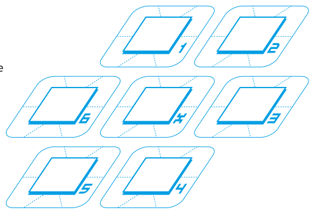

**Region Guidance**

The authority daemon burbles from the electromechanical mouth with canned enthusiasm, "The region of _Ecc'n_ <ENTER CURRENT COMMON NAME> is an authorized human settlement zone with a diverse and benevolent environment, designed to promote local socio-cultural flourishing. The central settlement area is surrounded by six designated exclusive socio-economic districts." Roll d6 a few times to generate each surrounding region.

| Ecocode | d6 Names | d6 Purposes | d6 <Error>s |
|---:|:---|:---|:---|
| 1 Ruinland | New Holding Fresh Start Final Rest Eden III Human Town Delta Fort Oublié | rest paperwork overflow dark settled alien | fallow brown forgotten glowing corrupting expanding |
| 2 Roughland | Quarry Gourd Tumulus "Tom Major" Eternal Archive Core Wall Field Baker Bunker High Basil | wild adventure sport leisure hunting exile | barbarian outpost falscher bunker crumbling inorganic pseudolife twisted growing |
| 3 Loomscape | Airmaker Juba Fossilization Engine Fountain V Faber Field Refinery Glad Hand 5c EM Pleasure Nexus | generation extraction reduction modification refining consumption | misaligned shutdown review paperclip optimized infested amber alert |
| 4 Azure | Silent Cenote Hollow Bend Shipstone Canal Crater Pond Reactor Shallows Bright Marsh | pleasure fishing hiding storage mistake intrusion | poisoned slime desiccated water monsters choked industrially exploited |
| 5 Viridian | Arboreal Reserve Carnibotanic Garden Fungal Generator Nutrient Overflow Swamp Protein Condenser Citrine Jungle | preserve birth death renewal decay secret | collapsing dying hive mind viral overgrowth sentience error ecological explosion |
| 6 Celadon | Automatic Orchard VV Clone Nursery 17 Meat Beet Grove "Gordon" Nutry Slurry Fields 5* Snail Shallows Neon Arcadia | food treatment drug dream re-education community | asleep mind virus hedonic excess senescence unplanned obsolescence invasion |

Looking at the district outside you can tell that this time, at least, the guidance isn't too far out of date. The authority daemon talks about green hills and lush gardens, and you can see brown hills and overgrown tangles of thorn jungle. Aside from some unrecorded ecological shift, the authority daemon isn't babbling complete timelost nonsense.

**The Advertising**

When the guidance finishes you try to look away, but the chimes return, more insistent and annoying. You search for the

[officially illegal] earplugs you hide in your pockets, like every reasonable resident of a Circle Sea town.

| d12 | Product | Corporation |
|---:|:---|:---|
| 1 | anti-perspirant de-horrorizer | Deep Breath Motors |
| 2 | antipheromone soap | Fault Ron Inc |
| 3 | dialect translator daemon | Felix Est Supplements |
| 4 | error reduction lemmas | Golden Mills |
| 5 | food sterilization pills | Hecatomb Revivals |
| 6 | gamma-grade rental servant | Marmot & Marmot |
| 7 | ghoul-grade sunscreen | Milkweed Agglom |
| 8 | healing animalcule jelly | Omega Reductions |
| 9 | living self-defense knives | Sensible Services |
| 10 | meaning maker cigarettes | Synthetic Friends GG |
| 11 | pay-day soul-loan services | Total Spectrum LLC |
| 12 | self-discoloring vestments | Zu Corp & Sin |

The coasthugger lumbers on. Perhaps you'll return and explore. For now, the settlement calls. The house demands.

#### SETTLEMENT OPTIONS

The distant settlement greets your vessel. It hoots in return. The authority daemon burbles to itself.

You glance about, but all the eyes are dim or dead. You unfold your crude map and prepare to sketch out the town you are approaching. It should be like any of the 768 officially sanctioned Garden towns. Possibly like some of the uncounted off-license towns. (see pXX)

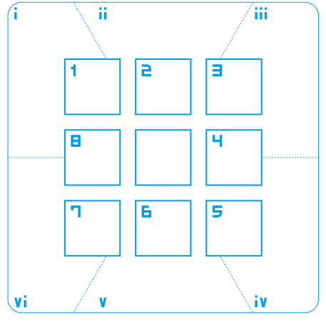

**Glance, Glimpse**

There! Buildings. Construction. The mark of Human.

| d6 | Mark of Human | Shade of Nature |
|---:|:---|:---|
| 1 | chaotic stain | scarring mountain, hill, or dell |
| 2 | tangled pipes and stacks | crawling over plain, meadow, or agrisector |
| 3 | livingstone grove | reaching for water, cloud, sky |
| 4 | bustling retropolis | clinging to cliff, beach, peak |
| 5 | brutalist order | flouting forest, jungle, or ruin |
| 6 | disturbing geometry | translating the remnants of times Lost this latter humanity |

Roll d6 twice to place the shades of nature on the settlement peripheries (i–vi). If you roll the same periphery twice, expand the shade of nature into a settlement zone (1–8) then roll two more times. Stop rolling once you cover four peripheries with blockers.

Place the human habitation concentration district in the center, as is traditional in officially sanctioned towns.

**Scenery Intercedes Again**

Nature, or its ruderal, transmuted twin, intervenes.

| d6 | Transmute | Substrate |
|---:|:---|:---|
| 1 | tunnels | amber, jade, or fossilized dread |
| 2 | walls | ageless stone, or lifeless greatwood |
| 3 | mounds | earth, memory, or forgotten refuse |
| 4 | efflorescence | thorns, vines, or imperial fungi |
| 5 | clouds | steam, dust, or industry |
| 6 | mirages | good places, lost times, or <ERROR> |

Roll d6 to determine the periphery (i–vi) through which your travel artery enters the map, then roll d8 to find the local haven or station. Draw a line connecting them.

**Look, Look**

Closer now, the bioengines squeal, the signal lights flicker. You grasp the size of this settlement.

| d6 | Size | Performance | POI |
|---:|:---|:---|---:|
| 1 | house, site, readiness | rattling in a hollow shell of ruinland and abandon | 1 |
| 2 | designation, dorp, stead | cleansed, purged, purified, or perfected foundations | 1 |
| 3 | burg, berm, basilica | atop a tell, tol, platform, or mesa | 2 |
| 4 | wijk, mart, outtown | outgrowing its maker, fabricator, or autofactory | 2 |
| 5 | reach, port, citadel | reaching, breaching, stretching to cliff and wall and shore | 3 |
| 6 | city, nexus, clausure | shining, undimmed, rude in its organic posthuman health | 3 |

Roll d40 overleaf for each point of interest you spot. With an illegal pencil stub mark them on your map, assigning them to a settlement zone with a d8. If it falls onto a blocker, or overlaps with an existing POI, roll below.

| d6 | Situation | Circumstance |
|---:|:---|:---|
| 1 | move it to the nearest periphery | ruined, devastated by an ongoing aberrant event |
| 2 | shift its zone anticlockwise | overgrown, absorbed, consumed by an error faction |
| 3 | shift clockwise | abandoned, easy to plunder |
| 4 | split it between two random zones | repurposed, reused, recycled into the urban fabric |
| 5 | keep it where it is | integrated with another point |
| 6 | move it to the central zone | fundamental to the existence and function of the town |

Now add a dirt and scrub-covered hemisphere to an empty settlement zone. Let's call it a bonus POI. Yeah.

**Your Eyes Alight**

Hooks grab your attention, points draw your interest.

1. Infinite hole ... a down portal into the underworld?
2. Industrial columbaria ... recycling the dead.
3. Zone of Error ... a place of natural alienation.
4. Accreted housing tell ... a millennial town.
5. Slurry pools ... a source of healing and clones.
6. Radiothermal glow ... an oldtech powermaker.
7. Brutalist ape paradise ... a jungle in livingstone.
8. Choked cargo port ... tangled in protoplasm.
9. Red sphere ... a bloody gladiatorial dome.
10. Traditional tunnel town ... for aesthete ideologues.
11. Fountains of nutrition ... formulated food dispenser.
12. Groupmind archive ... for better groupthink.
13. Hanging legume farms ... proteins from the air.
14. Mass-fabripyramid ... identikit biomech homes.
15. Habitation engines ... built to divine templates.
16. Dome of stuckforce ... null-magical shield remnant.
17. Cancerous dormipod growth ... a hive for the lowly.
18. Singing tuning towers ... deep-coded for music.
19. Grand Ago buildings ... subdivided hovel manors.
20. Illuminated scriptorium ... a treasury of oldtech.
21. Glass palaces ... investments of the good ones.
22. Meat apartments ... automated industrial livestock.
23. Landcoral burrough ... a walled cottage complex.
24. Fruitful omega jungle ... a de-extinction navel.
25. Swirling synthetic system ... a golem generator.
26. Sungwood estates ... armored bungalows from seed.
27. Dimensional transect ... a bubble of trapped other.
28. Freetech enclave ... by humans for humans.
29. Baroque chitin wonder ... a floral palace.
30. Elaborated dullway portal ... remnant of tourism.
31. Ladder nubbin ... former fast star anchor port.
32. Elaborate ceramic bridge ... a spiders' way.
33. Repurposed gigagolem ... ominous divine beast sign.
34. Artificial mountain ... dormant fundamental maker.
35. Wide jade canal ... fluids for the synthetic biome.
36. Crater of numinous ethers ... a god's soul spilled.
37. Tethered aerolith island ... higher existence fountain.
38. Mobile temple of words ... colorful communions.
39. Spine of light ... radiation ghost tether.
40. Weaver of delights ... oldtech all-fabricator cube.

#### HAVEN

Here we are now. At last. Town. New Home? Temporary roost? Contingent future disaster zone?

Heavy electric hissing fills your cabin. The coasthugger is excited. Charisma overrides click into place.

The authority daemon burbles again, "Please remain motionless in your cabin as the vessel transitions through the Gate of Eyes and enters the Haven of

_Grk-hrk_ <ENTER CURRENT COMMON NAME>. Your material incarnation and possessions will be assessed in accordance with the local socio-cultural Entity Override.

What fun!"

Outside you hear the commotion of passengers scrambling for their luggage and rushing to disembark.

**Tinpot guardians** (L1d4, levidrones) await in the Haven of <ENTER CURRENT COMMON NAME>.

**The Gate of Eyes**

Wait, you actually waited?!

| d6 | It Sees | It Says |
|---:|:---|:---|
| 1 | darkness in your heart | "leave before nightfall, rat." [nocturnal €50 x lvl bounty on you] |
| 2 | crime in your bags | "<INSERTLIST> are illegal." [pay €1d100 x €1d100 or 1d20 weeks of hard labor] |
| 3 | treasure in your wallet | "excess taxable wealth found" [pay 1d6 x 20% of current cash to enter] |
| 4 | error in your writings | "re-education protocols initiated" [report to local Temple of the Mind for 1d4 weeks of mandatory human compliance training] |
| 5 | your face for someone else's | "why, are you not the lord Dun-Dun XVII?" [roll 1d6: (1) mandatory body upgrade, (2–3) volunteered for involuntary carousing, (4–6) assigned a **municipal manservant / spy** (L1d4, obsequious) during your stay] |
| 6 | the agent in your eyes | "be welcome, your secret is mine." [you are granted €25/wk in town] |

**The Haven**

You follow the example of the other humans, grabbing your bags and jostling to get off the coasthugger before the Automatic and PerfectTM Gate of Eyes is wheeled into place by the hollow husks working in the haven.

You get off, look around, and see ...

| d6 | You Meet | They Ask |
|---:|:---|:---|
| 1 | tinpot customs guardian (L2) | "Please with us ... procedure ... procedure!" [lose 1d6 hours] |
| 2 | processed meat-seller VACILLUS (L1) | "Excellent local vat product!" [save: for a week gain +1 endurance and 1 arm; fail: for a week lose 1d4 endurance or bowel control] |
| 3 | rick-wailer Chagrine (L1) | "Enter the cavity and my flesh-runners will take you wherever you need!" [€1d6 to reach any POI] |
| 4 | fighter Tepid Brusco (L2) | "Quick, say I'm one of yours and hide me!" [hunted by Nemesis, knows local protocols] |
| 5 | great magus Penitent Security (L3) | "Curses lifted, purses fattened, fortunes folded!" [20% chance of inflicting a mutation on you] |
| 6 | dark and handsome stranger (L6) | "We've been waiting for you. You have the Clavus, yes?" [hunted by Ministry, agent of chaos, vampire] |

Best wave off all these fools, find a place to stay and get your bearings. There, between the Haven and the Central District, an inn of the better sort. _The Exploits of Espladán._ This should be fine.

The **warrior at the door** (L5, glittering) wears a resplendent Long Long Ago uniform and the laser wand at her hip promises this place will be safe.

The **receptionist golem** (L4, tittering) has seen better days, but its eyes light up when it spots the touriste tickets the Contact gave you. "Ah, the _abitués_ have arrived! We have your standard suite ready. A week is paid, then it will be €70 per week. The standard rate. Will you be hiring a pleasure golem for your carousing?"

**Tinpot Guardians and Other Municipal Order Instantiation Servitors**

These are (roll 1d6): (1) levidrones, (2) sig-monkeys, (3) claydrakes, (4) orbiculars, (5) ka-zombies, (6) plate skeletons.

| d20 | Title | Lvl | Life | Mor | Def | Bon | Dmg | Special (Roll Separately) |
|---:|:---|---:|---:|---:|---:|---:|:---|:---|
| 1–5 | Watcher | 1 | 5 | 11 | 7 | +5 | 1d4* | Stunner. Set to stun. Save or die on natural 20 attack. |
| 6–10 | Accoster | 2 | 10 | 10 | 9 | +5 | 1d6* | Entangler. Nonlethal. Save or crippled on natural 20. |
| 11–14 | Cleaner | 3 | 20 | 9 | 13 | +8 | 1d8* | Freezer. Save or slowed on hit. |
| 15–17 | Gundrone | 4 | 40 | 8 | 17 | +8 | 2d6* | Decapitator. If damage dealt = target level. Snick. |
| 18–19 | Skullface | 5 | 60 | 7 | 19 | +11 | 3d6* | Alarum. Wails to draw 1d4* additional guardians. |
| 20 | Luminary | 6 | 80 | 6 | 19 | +11 | 4d6* | Sacred germ. Immune to powers, disease, afflictions. |

#### RELAXATION

A liveried **orimonate servant** (L0, twitch-connected) guides you and your bags to the remaining ascension duct. "The others, they're gnarly, run through, full of eater-bugs," they whisper in an argot halfway between the high common of old read-themselves and some strange, time-lost feralshi. Still, your babble parasite makes a decent go of it and you understand the naïve new-made human well enough.

**A Small Pourbouire**

They hold out an unblemished palm.

| d6 | Stingy | Average | Generous |
|---:|:---|:---|:---|
| 1 | a thin smile [ill luck later] | a thin smile [odd luck later] | a thin smile [meet a duck later] |
| 2 | a curse [save or -1d6 to a roll] | a thought [save or reroll a roll] | a prayer [+1 HD] |
| 3 | a spit [save or the local cough] | a smirk [save: +1 to reactions] | a smile [charisma: make a contact] |
| 4 | a shrug [penalty vs pickpockets] | a shrug [penalty to impress] | a shrug [+1 cha] |
| 5 | a foul name [lose no sleep] | a falsity [learn a bad word] | a truth [bonus vs surprises] |
| 6 | a hurt look [+1 life, str, or cha] | advice [+1d6 to carousing roll] | good advice [+1d6 to reaction rolls] |

With a nod, the liveried orimonate shows themselves out, the old lacquered doors hissing shut behind them. They dropped a card on the way out. It seems to be a pass card for some kind of club. _The House of the Sunken Sun_ ?

**Tempting Distractions**

The _Sunken Sun_ ... that's the inn bar, isn't it?

| d6 | Vibe | Quality |
|---:|:---|:---|
| 1 | dry and dead | no carousing possible |
| 2 | outdated desperation | roll carousing with a penalty |
| 3 | traditional thrum | add aura bonus when carousing |
| 4 | oily, slick, squamous | spend €1d6* x 10 to reroll carousing roll |
| 5 | sharp & sophisticated | double charisma bonus when carousing |
| 6 | beating like a mutated bioheat pump | roll carousing with bonus, then save vs corruption |

It seems lively enough ... what harm could one drink do?

Once per settlement, the PCs can fritter away their treasures on a week of tourism and debauchery. After, perhaps, they earn some experience.

They pick a place to start, look nervously at one another, then down the odd psychoctails on offer. After 1d6*+1 days they roll €1d6* x 50 to see how much of a tab they racked up and roll d20+cha on the fun, fun, fun carousing table.

**Carousing: Pleasures To Experience**

Your mind reassembles itself. You seem mostly intact.

**Fun, Fun, Fun Outcomes (d20+cha)**

| d20+cha | Outcome |
|---:|:---|
| 1 | You have died. Your friends have preserved (roll d6): (1) a copy of your mind, (2–3) your head in gin, (4–6) your body on ice. Gain 600 xp. Relife fee not included. |
| 2 | Locked up for indecent behavior. |
| 3 | Banned from clubs, fêtes, and soirées. Acquire a noxious reputation. Gain a revolutionary contact. |
| 4 | It was the experimental nutrislurry. Gain 100xp and (roll d6): (1–3) lose a limb, (4–5) gain an organ, (6) gain the ability to levitate a span off the ground. |
| 5 | Permanently lose 1 life after an experimentalist party. Gain 100 xp and save to gain a mutation of choice. |
| 6 | Possessed by an ancestral town ghost. +1 thought permanently, +100 xp and a secondary personality. |
| 7 | Eaten by a tunnel worm. Hallucinate you have gained a portal travel power and gain 150 xp. |
| 8 | Locked in a synthetic dream. Gain permanent local noösphere access, 150 xp, and a gamer reputation. |
| 9 | Addicted to the local neuro-water. Gain 200 xp. |
| 10 | [Acquired a hyperspecific local disease. On one day,] each week, reduce a random ability to 0. Gain 200 xp. |
| 11 | [Ingested a power parasite. Reduce life or ability by 1] for a week to gain a power for the duration. +200 xp. |
| 12 | You remember nothing. But you are changed. +200 xp. |
| 13 | [Entered the boardgames of doom. And won! Gain 300] xp and one distilled soul or a life-debt servant (L1). |
| 14 | Unexpected bloody nemesis tattoo. Gain 200 xp. |
| 15 | Married to a local deity cult official. Gain 250 xp. |
| 16 | Gained perfect fluency in local patois and +250 xp. |
| 17 | Gain shipment of odd fruits (€300, 10 sk) and +250 xp. |
| 18 | Inducted into a Ministry Agency. Gain +300 xp. |
| 19 | Inscribed into the local register of parents. +300 xp. |
| 20 | Remove one debility or mutation. +300 xp. |
| 21–24 | Awake with a new sense organ implanted. Gain +1 thought or aura permanently. +300 xp. |
| 25+ | [Gain a buildertech item. Purpose obscure—spend] €3000 to unlock power of your choice. +300 xp. |

#### EXECUTION

After your days exploring the town ... or perhaps after a week of compliance training ... or perhaps after your relife procedure ... or perhaps simply after a god night's sleep. That's the god night. The one night every month that's extended to ensure every month is of a suitable length and that the calendar remains perfect.

Your head is pounding like your mind is being assaulted by a hack-hammer. You look around. It's the ancient contraption by your bed you had thought a curio.

**The Babblebox Rings**

You are nervous around the ancestral device. Usually they are swamped by mad ancestor ghosts trapped in the wires, arguing over strange issues. But this is an inn of the better sort. This babblebox seems to work.

You lift the receiver and interact with the oldtech device. Daemons assail you, but the wards are still strong. Roll with a great advantage this time; but with other archaic devices, you may not be so lucky.

**Taught By Books (d20 + thought)**

| d20 + thought | Result |
|---:|:---|
| 1–3 | corrupted or save vs daemonic possession. |
| 4–6 | save or corruption (roll d6): (1) severe, (2–3) minor, (4) temporary time slip—store a free action for later. |
| 7 | time slip—store a free action for later. |
| 8–12 | suffer to proceed [pay 1 life to access device]. |
| 13 | the device steals 1 ability point then offers access. |
| 14–19 | divine the super-user code that unlocks the infernal device. |
| 20+ | gain advantage when using this specific device in future or you recover a hero die. |

**Guided By Ghosts (d20 + aura)**

| d20 + aura | Result |
|---:|:---|
| 1–3 | possessed by a timelost spirit or save vs corruption. |
| 4–6 | voices fill your head. They are (roll d6): (1) malevolent, (2–3) toxic, (4–6) annoying. |
| 7 | helpful guidance—store a free hero die (HD) for later. |
| 8–12 | pray to proceed [sacrifice €1 to access device]. |
| 13 | listen to the ghosts in the machine and give them the soothing lies they seek. |

You bat away at the ancient voices, the corrupted ghosts in the device's shell, the foul daemons of pre-time drawn from the noösphere by its sacred mechanisms.

| d6 | They Claim To Be | They Are |
|---:|:---|:---|
| 1 | eaters, destroyers, errors | malevolent lies |
| 2 | consumed, afflicted, broken | agents of chaos |
| 3 | lost, trapped, bound | hungry for you |
| 4 | ancestors, apes, players | who you wish |
| 5 | maintainers, servants, protocols | who they say |
| 6 | friends, helpers, angels | better than you |

**Come, A Meeting**

Click. Click. Hiss. Then a voice, modulated and suave. It speaks your dialect like a native, putting you at ease.

"Chaams, good you made it! All your organs in place, ha-ha? Contact Sender said friends, protean geists, but here, you, larval-fresh humans! I am your Executor! All safe, butcher-cut proof, come to the _Smog Louche_ and I'll explain it all. Ask for Half-and-Half, but they'll know you.

The Eyes shared your pictures, hark hark!"

An invitation to the _Smog Louche_ ? Surely you'll go?

**Ask About the Smog Louche**

| d6 | Response |
|---:|:---|
| 1 | "That place has been shut for years!" |
| 2 | "Broken after a raid. Ministry agents. Scum villeins." |
| 3 | "I heard they reopened under new ownership." |
| 4 | "It's a front. Terrorist antihumans." |
| 5 | "Beware, it's riddled with inquisitors." |
| 6 | "If you're going, make sure to take protection." |

**Your Executor Mako Papertoy**

There's a tug at your sleeve, a pat on your arm. You feel comforted by the **pleasure golem** (L4, established) in its lounge cut suit.

"Chaams, you feared, yes! I see it. Thought tricky-trick, snippy-snip and off with your vittles! No, no. This a _civil_ raised place. See, mamba card!"

It is indeed a snakeskin leather card with the word Executor embossed beside the polychrome official glyph of the Authority, six gods spinning in perfect order about the Maker. On the other side, the velveteen smart paper reads Mako Papertoy Level 13 Legitimate Legal along with a truetint holotype of the golem before you.

"I will perform this execution, you see," the pleasure golem flexes, giving hint to the synthetic musculature under its soft outer shell, "and you are the recipients. Oh, I know you have the clavus. But I also know you have the name. And the transmitter in your bloodstream."

**Watching Court**

| d6 | Watching Court | They Are |
|---:|:---|:---|
| 1 | cat-eared quarterlings | rogue inquisitors |
| 2 | archetype humans | barbarian interlopers |
| 3 | union golems | random clumsy tourists |
| 4 | leather ghostautomats | Mako's protection friends |
| 5 | robed cult specialists | local order manufacturers |
| 6 | four-armed agents | turned nemesis agents |

**The Certification Amulet**

Mako Papertoy L13LL produces a certification amulet, a glinting tablet of bronze and glass and flickerlight.

"The Sphere of Dirt. A sealed estate. Yours."

...

"You look dubious, but it's legit. Sealed with your bodyline, soul and mind too. Butcher Bank certified!"

**The Estate Is Made Out To**

| d6 | Recipient |
|---:|:---|
| 1 | smudged and unclear. *[In a court case, the player who secretly bids the most cash will win. Players can borrow cash from loan sharks to boost their bids.]* |
| 2 | the party as a collaborative hive or co-op |
| 3 | half to the youngest *[age]*, a third to the strongest *[strength]*, a sixth to the lowliest *[pedigree]* |
| 4 | the wisest in the party *[highest charisma]* |
| 5 | the smartest in the party *[highest thought]* |
| 6 | the noblest in the party *[pedigree reference]* |

"It's ready to use. Just take it to the Sphere of Dirt and it'll unlock for you. I suggest you go quickly and quietly. The Sphere's been a ... feature ... in town for a while.

Folks learning there's going to be an unlocking, well ... that'll be a curiosity. A novelty! A mob."

**The Sphere of Dirt**

Sphere of Dirt. Well, the locals have their own names for it. Soulchill Hill, Bleeder's Edge. You approach the archaeostructure. A few locals approach you. Curious.

**These Locals**

| d6 | Locals |
|---:|:---|
| 1 | glitchy vome-infected farmers (L1, secret machines) |
| 2 | hungry vagabond scrabblers (L1, non-citizens) |
| 3 | pernicious ruin-scratchers (L2, scavengers) |
| 4 | suspicious terrace gardener squatters (L1, floral) |
| 5 | post-mortal yellowland escapees (L1, pungent) |
| 6 | bloodbound servants of the clavus (L1, traditional) |

They probably won't do anything. After all, they don't possess any kind of official permit to occupy this estate.

You do. You have the certification amulet. There's the gatehouse bearing the symbol of the clavus, at the foot of the hill. Go on, unlock it. This will be fine.

An agent (L2, somber) approaches on a rusting horse. It shouts, "Wait! Do not get involved! They're using you!"

Who is? And, anyway, look at the size of this estate. Even if you just sell off the land, it will net tens of thousands.

#### ONWARDS, AGAIN

"This is all a bit much," you think, "I just wanted a few simple adventures."

Butler nods, "Don't worry, Sieur's Chosen, I'll gladly run the estate for you. Ensure nothing goes wrong in your absence. Maybe you'd like a small holiday at Babylon Beach to recover? Drink some riviera reactors and ogle the flamingos. I hear their wings are beautiful in the light of the local flickersun."

"Can we drive there?"

"I'm sure they'll let you take your autogolem through the visitors' gate, why not?"

"We'll go right away!"

"Then have some needle tea and to-day's document of novelties, while the servitors pack your bags."

**A Surprise In Your Bags**

| d8 | Item | Item | Item |
|---:|:---|:---|:---|
| 1 | ash biscuits | psychic salts | philter of hate |
| 2 | bone coins | smelling pepper | prophylactics |
| 3 | black vertebrae | doghead soap | storm feathers |
| 4 | undead cat | psionic fungi | timelost hat |
| 5 | mimic repellent | living parchment | vibrant € card |
| 6 | golem bait | electric owl | heretic gold |
| 7 | silkerchief | clockwork sheep | divine toenail |
| 8 | postholy water | android blood | the anticlavis |

"Use me," reads the cryptic label.

**Document of Novelties**

It would be a dead world if things did not happen in the background, yes-no?

| d12 | Place | Faction | Goal | Action | Outcome |
|---:|:---|:---|:---|:---|:---|
| 1 | Blue Land | Butcher Bankers | claim lands | daemonic infiltration | pyrrhic victory |
| 2 | Purple Land | Cogflower Inquisition | dominate markets | public agitation | unintended alliance |
| 3 | Red Land | Green Son Apocalypse | spread beliefs | pseudolegal raid | internal schism |
| 4 | Orange Land | Populist Levellers | develop neoldtech | psychic propaganda | collateral awakening |
| 5 | Yellow Land | Ministry of the Dream | gain legitimacy | covert sabotage | oldtech backfire |
| 6 | Green Land | Perfect Rational Army | monopolize resources | recruitment drive | martyrdom cascade |
| 7 | urban region | Dewerker Hexads | control population | fortification project | demographic chaos |
| 8 | suburban region | Vampire Knights | recover lost secrets | research initiative | psychic contamination |
| 9 | rural region | Sailing Island Pirates | restore environment | ruthless purge | knowledge corruption |
| 10 | ruderal territory | Timelost Ancestors | settle old score | sacred ritual | economic crash |
| 11 | wasteland | Barbarian Liberation Front | transcend limitations | economic warfare | ecological disaster |
| 12 | wildland | Nemesis of the Garden | preserve status quo | necrolegal overture | crude success |

**Consequences, Again**

The autogolem ... Wait, you do have an autogolem, yes? If you don't yet, perhaps you should spend some time exploring your estate? There are said to be unknown places beneath many of these old time-vaulted mansions. Surely the Departed Sieur has left some very loyal living device for your percurration?

Right, apologies, distracted. You sit back in the living seat (slightly reanimated) at the back of your cartingolem and the slightly mildewy servitor slips you some jay needle tea and the day's document of novelties.

You marvel at the contrast a small fortune makes to one's outlook on life. As you sip the tea, the ultra jay courses through your system, granting you +1 charisma and immunity to gater sickness. Just €250 a dose, you recall.

Roll a save and see how you are now:

**d20 Something Changed**

| d20 | Something Changed |
|---:|:---|
| 1–2 | Puffed Up. All your luck is the result of your own hard work. Fools call you arrogant and conceited. Permanently lose 1 aura. Anytime you critically fail a social check, your target despises you and will hurt you if they can do so at little cost to themselves. |
| 3–6 | Spendthrift. You hate haggling and are only too happy to overpay by at least 100% to show off your success. When you overpay a significant purchase by 500%, gain +1 charisma (max +5). You can remove this trait once you are broke. |
| 7 | Humbled. Your fortune comes with responsibility. Every time you tithe 10% of your income, remove one mental burden _or_ temporarily gain +1 defense. |
| 8–12 | Carefree. No longer will you have to worry about every little purchase. A weight lifts off your soul. Gain resistance to anxieties, worries, fears, and other malicious enchantments. |
| 13 | Hubris. This proves you are destined for better things. Gain +1 to all defenses, saves, and d20 rolls. However, foes strike a critical blow against you on 19–20 from now on. You can remove this trait after suffering its negative consequences three times. |
| 14–19 | Learning about yourself. Gain 1 pip towards acquiring or increasing a relevant trait. Probably a bourgeois social background trait or something. |
| 20 | Secrets in Your Source Code. Something in your blood whispers to you of destinies and secrets. Gain +1 endurance. When faced with an oldtech or fantascience artifact, you can sacrifice this trait to gain 1d4 pips towards acquiring and/or increasing a relevant trait for using that artifact. |

**Experience, Again**

These few weeks here, in this new town ... this has been different. These experiences seem almost dreamlike now ... perhaps this is what it means to live in the good graces of the Dream Lords, blessed by this golden age?

| Goal | How | Xp |
|:---|:---|---:|
| 2nd Session | Attend a second time. | 350xp |
| Theater | Play along with the omen, ham it up, make others laugh or groan. | 1d6 x 25xp |
| Invent | Each contribution to the shared setting; fleshing out the region, the settlement, and other details. | 2d6 x 10xp |
| Carouse | Go and waste your cash partying. Double if you suffer a silly mishap. | 100xp |
| Confabulate | Escape a tricky situation using an elaborate false narrative. | 100xp |
| Explore | In detail an area, building, zone, or district. Double if you discover and extract something special. | 1d6 x 25xp |
| Survival | Escape or avoid a mighty foe. | 35xp |
| Plumb | Enter the bubble of old surface and explore at least one area or zone. Double if you extract a precious heresitech artifact. | 2d6 x 25xp |
| Conquest | Defeat or outwit a mighty foe. | 70xp |
| Death | Your PC was destroyed. | 300xp |
| Die | Or otherwise lose a PC in a hilarious, memorable way. | 500xp |

Excellent! More experience to invest in characters, pets, powers and equipment. Truly, you are growing as a player. Soon, you will be a powerful puppet master, a daemon willing your PCs onwards to terribly hilarious dooms and tribulations! Mwahah ... um ... ahem.

#### ESTATE FLOWERING

Hush. Shake off the agent. Warnings? From some ruster tramp in an agent's old-fashioned coat tails? Here, step to the cyclopean gatehouse.

**The Gatehouse of the Clavus**

A one-eyed ancient, mummified beneath their silver weave robes and electromagical bandages, detaches from the scabrous livingstone encrustation. Their temporal pod crumbles, releasing them into the now.

"I am Butler. You bear the certificate, the bodyline and the clavus," it intones in old common, the betterspeak,

"Release the seal and you may have my guidance along with the estate of the Departed Sieur."

**Bonus Specialty**

| d6 | Bonus Specialty | Lvl | Fee/wk |
|---:|:---|---:|:---|
| 1 | timelost languages & scrolls | 3 | pound of flesh |
| 2 | master of curses & afflictions | 3 | tub of blood |
| 3 | intuitive biomancer | 3 | intact skull |
| 4 | experimental chirurgeon | 4 | blue jewel |
| 5 | daemon summoner | 4 | golden egg |
| 6 | mummified legal knave | 5 | €25 |

"Is Butler my title? Why no, it's my name."

**Break The Seal**

"You may want to hurry. I sense someone approaching. I can legally protect you. I think." chants Butler.

The seal is an oldtech device. It looks like a variant of a gate seal, but adapted. Someone might wishfully say improved. It looks a little dangerous (see babblebox).

1. Click. The clavus unfolds like a clockwork flower. 1d6 rounds pass.
2. The gatehouse sloughs off its rocky layers, revealing a timelocked shell. Waves of cold explode from it. You are safe inside, but any crowding locals? Fresh corpsicles. 1d4 rounds.
3. The Antagonist arrives. They keep their distance. Nervous? Excited? Hard to tell. 1d3 rounds.
4. The hill ripples. Wavers. Then falls into itself, like a young man's face disintegrating into a skull when struck by *Aspera's Chronic Affliction*. 1d2 rounds.
5. Rippling explosions flinging dirt and dust, rock and tree, as nihilation barriers obliterate the falling hill. The PC with the lowest charisma saves or is impaled by a bolt of mistledoom wood.
6. The dust clears, revealing a field of debris and one house standing, sparkling under its nihilation aura.

"Hmm ... it has been longer than intended," muses Butler as it surveys the ruined estate.

**The Rubble is Alive**

The debris field writhes, settles, burps, shifts ... the things within are put out by their new situation.

| Roll d10 | Encounter |
|---:|:---|
| 1–2 | **Glutinagas** — (L3, jelly authentics). Malleable gelatinous worms of great size, prodigious appetite, and utterly failed control routines. Leave them alone to digest the rubble. Maybe they will go away. |
| 3–5 | **Scuttlemonks** — (L1, automatic cultists). Three crabs in a trenchcoat with a prayer wheel and a feather duster. Mostly crushed. Seem to have operated the estate? |
| 6–7 | **Protean Postlagomorphs** — (L2, bioadjustable). Swiftbreeding rodents intended as raw material for biomantic work. They haven't gone feral, just grown very big. |
| 8–9 | **Heresitech Plants** — (L3, infestants). These vegetables shouldn't be here, with their (roll d6): (1) wriggling traps, (2) spying eyes, (3) memetic leaves, (4) hypnotic flowers, (5) judo tendrils, (6) cybernoxious taproots. |
| 10 | **Sleepers in Orange** — (L5, magisterial). Not quite angels, more like angels-in-potential. Statues of marbled stone, prone to coming alive when signal and blood combine. But what signal? Do you dare cart these heavy things off? |

#### A SIMPLE ESTATE OF MIND

The house and its estate are the PCs home base, but also a shared character for the players.

Butler looks about with its one eye, "Yes, the neighborhood has gone downhill, but then hasn't everywhere ... hmm ... well, perhaps we shouldn't say that out loud, should we? After all, official chocaine rations have gone up seventy-three times since they were first introduced ... hmm ... Long Ago. If someone could do basic mathemagic, you'd be eating three times your body weight in chocaine per day."

The eye twinkles when Butler notices your alarm, "Don't worry. This is a gentry class house. See those walls? Bunker Era construction! Hey, House, how many ghosts in your shell?"

Bioluminescent signals pulse in the walls and Betterspeak code dimples protrude for added emphasis.

Butler nods, "That's right. Just the one daemon. Old House. You still mad about being locked up in that time sphere by the Departed Sieur? Don't be ... you didn't miss much. Just night after night, flood after flood, and the ... well ... didn't miss much. Seems the humans are about to be interesting again."

Butler stops and grabs you with a surprisingly strong mummified hand, "You will be interesting, won't you? I think the times call for it, yes."

[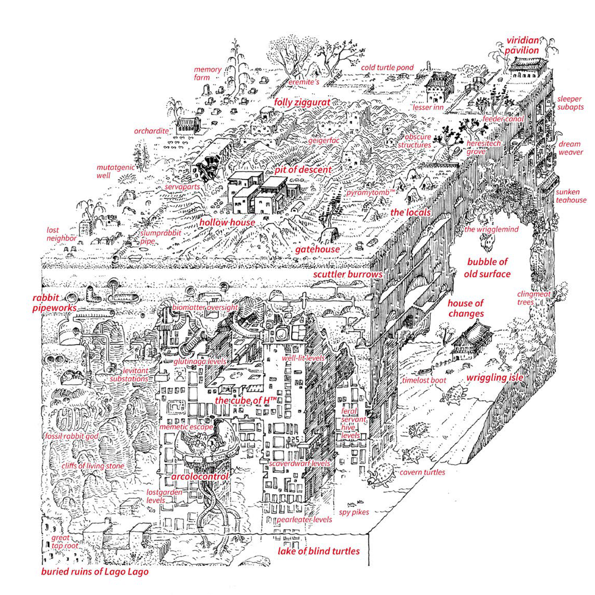](images/hires/page_0053_estate_map.png)

**The Estate Berubbled**

"Yes, the whole sphere of the dome belongs to the house. Though, ah, much of it seems buried now. And the rabbitherders may be upset at all the rabbits killed when you used the clavus to collapse the seal..." says Butler.

**Gatehouse.**

Not actually part of the estate. It is owned and managed by the Butler Watcher LLC BDD.

**Geigerfac.**

A sleeping autofac that used to make geigers ... or was it gigers? Anyway, some kinds of gizmos. With a brain replacement, some ancient lubricants, and a bit of sprucing up, this could be a tidy earner. Please ignore the biohorror (L9, human-derived) stalking its halls.

**Hollow House.**

A manor in the echobrutalist style. It belongs to you. You can rename it.

**Folly Ziggurat.**

Ornamental, not meant as a real ziggurat. Claimed by the scuttlemonks as a real ziggurat. Could be turned into a real ziggurat with some faith and paint.

**Obscure Structures.**

Possibly intended for some kind of bioindustrial activity. One still promotes NEW chocaine. Another suggests the new shade of the season will be taupemarine, a hue that famously bankrupted the Ivy Saint Bistecca procedural fashion conglomerate emirate, which led to the downfall of the Circle Sea Union Mk 2.

**Pit of Descent.**

Level-locked by daemons blood-coded by the Departed Sieur. The bloodbound servants of the clavus claim it leads down to heaven and want to rent it.

**PyramytombTM.**

A time-traveling tomb bought from a Long Long Ago catalog. It's empty and waiting for you.

**Servaparts.**

High-density hive for storing unneeded servants. Perhaps some are still stored here, but the broken **lotus dreamgiver** (L7, font of pablum) fills the whole area with comforting delusions.

_(more locations described overleaf)_

So far we've been handwaving time and travel at destinations. That's generally fine, but sometimes we'll need to keep track of time more carefully. Perhaps the PCs need to reach a specific NPC before curfew, or they only have three hours to search a ruin. Here are some suggested time frames for moving about, from local to regional:

- ⚙ **Within the house** (or in another building). Moving from room to adjacent room takes one round. Let's say a minute. Actually doing anything useful in a room takes roughly five (5) minutes.
- ⚙ **On the estate**. Moving from building to adjacent building takes five (5) minutes. Doing something meaningful in a building takes roughly fifteen (15) minutes. We're abstracting the rooms away here.
- ⚙ **Within the zone**. Moving from location to adjacent location takes fifteen (15) minutes. Performing a useful action at a location takes an hour (60 minutes). We're abstracting finding the right building and room.
- ⚙ **Within the settlement**. Moving from zone to adjacent zone (or periphery) takes thirty (30) minutes. An action within a zone takes two hours. We're abstracting moving around, finding the location, then the building, etc.
- ⚙ **Within the region**. Moving from district to adjacent district (or settlement) takes two (2) hours. Taking action there consumes four (4) hours. That makes it a whole watch (6 hours) to go to another district and do a thing.

**The Good Neighbors**

Mobs of puzzled scuttlemonks and upset locals keep one another at bay at _your_ garden gate. A fluffle of postlagomorphs is grazing and defecating on the lawn.

**Cold Turtle Pond.**

Home of the **millennium turtle** (L7, 1-way time-traveler). Lovely landscaping. Mind the lotus.

**Eremite's.**

On moonless nights, the **flickering avatar** (L2, electric) of the godless eremite manifests to read scripts.

**Feeder Canal.**

Full of **feeders** (L3, amphibious). They feed.

**Heresitech Grove.**

The baobabs offer to tell you what you want to hear in exchange for life and worship.

**Lesser Inn.**

Used to accept motor vehicles, but in these fallen times only takes bicycles, velocipedes, and mules.

**Locals, The.**

Former Extramural Vagabond Settlement 7. Now legalized. True name restricted to residents only. Please don't say the **farmers** (L2, augmented) are vomes.

**Lost Neighbor.**

Missing since a star-summoning event. Portals do not work here anymore. Nor other magicks. Do not dig up the buried **golems** (L3, doomed).

**Memory Farm.**

Can't afford immortality? Give yourself to the **Extrangling Fig** (L10, mind-eating tree) and talk to your descendants even after death!

**Mutagenic Well.**

Clearly marked as dangerous. Severely corrupting. Don't fall in. The lid will be repaired soon.

**Orchardite.**

Cherry cabbages, gilded peaches, glowing berries, a **mechanical gardener** (L4, rusting) and its **loving maintainer** (L2, technohuman).

**Slumprabbit Pipe.**

Due for repair. Leaks **protean postlagomorphs** (L1, lamarckian). Harmless, yeah?

**Viridian Pavilion.**

Property of the **Lady of Waters** (L6, liquid human). Occupied by **liberated post-mortals** (L1, mummified). Is the lady actually the water in the canal?

...

Just then, before you've even visited a single neighbor, you spot the executor Mako Papertoy approach on a chair carried by two headless lobogolems. It grins, as if expecting something.

"Houssler chaams! My, my, done good! You have my mamba card, yes? Rememberings, yes? The tax priest is coming, holy holy to the Invisible Hand, good Abaco. You're ready, yes? Inheritance tax? A small retainer. €10 per week, and I'll assure the tax priest won't bescam!"

Butler rolls its one eye, "The tax priests are still about?"

"Oh, my, yes! But kind, soft now. No rack blood sup!"

**Bubble of Old Surface**

Error. You are not supposed to be here. This surface is no longer rated for human settlement.

**Arcolocontrol.**

An overshoot upwelling of HeavenTM, it seeks to take control of the Cube of HTM and siphon its human minds downstream to HeavenTM. Do not question its designs. Why is it leaking? Why is its dome cracked? Why are its **messengers** (L6, death angels) mummified, with twitching wires coursing through their papery flesh?

**Biomatter Oversight.**

All the control consoles are broken.

**Buried Ruins of Lago Lago.**

Ignore these cyclopean walls, these promethean technofossils. An archaeologist would only grow discouraged to know that the Old Surface was not the Oldest Surface. Do not release the demon **Pilot Samoroga** (L9, nemesis hero). The demon is not related to the gods. Do not trust its lies.

**Cavern Turtles** (L8).
Big as boats, six-flippered, spitting.

**Cliffs of Living Stone.**

Oh, look, the landcoral has escaped its programming and is eating the subsurface to make more of itself. This will surely never be a problem.

**Clingmeat Trees** (L5).
They cling. To meat. With thorns.

**Cube of HTM, The.**

A livingstone residential-commercial complex now haunted by its doomed ghosts?

**Dream Weaver** (L9).
Totally not an illusionist dragon.

**Feral Servant Hive Levels.**

The brain-locked **servant humans** (L0, feeble) have survived in the dark by becoming a **metahuman organism** (L13, super-posthuman). Please don't let them out.

**Fossil Rabbit God** (L17).
Nothing short of an apocalypse will wake it. In the meantime ... divine biofuel?

**Glutinaga Levels.**

Ah, so that's where the **jelly worms** (L3) are generated from the pipeworks. Perhaps a different protocol could generate other jelly creatures?

**Great Tap Root.**

It flows with the fuel of life, with deep biomatter. It whispers, "heaven is down, always down."

**House of Changes.**

Here dreaming lies the **Lady of Waters** (L16, original human). Why is she 10 feet tall?

**Lake of Blind Turtles.**

It's really full of all kinds of armored beasts. Bobbers. Chargers. Lurkers. Hurlers. Stringers. One's boat cannot but go thump-thump as it moves.

**Levitant Substations.**

Aerolith? Down here? Valuable! Oh, also, controls the pipeworks.

**Lostgarden Levels.**

The corpse of the **phylake Antipater** (L12, angelic) clutching a flaming sword is worshipped by the uplifted rabbits (L1, postnuclear) who have made an idyllic garden lit by the godlight of Antipater. They sacrifice humans to keep the holy corpse aglow.

**Memetic Escape.**

**Strange ideas** (L2, daemons) flutter like butterflies, escaping the garden that generated them. They teach new things. Terrible things. Things not meant for humans. Burn them and deliver their charred corpses to the administration for rewards (€500 per corpse).

**Pearleater Levels.**

Ragged splendor and baroque chambers. **Waxy humans** (L4, mannequins) eat the pearls of the holy **tentacled oysters** (L7, chronotoxic) to survive until the path down to heaven opens up.

**Rabbit Pipeworks.**

A slurry of protean rabbits. Some are fossilizing and turning into oil.

**Sleeper Subapts.**

Stored **archaic humans** (L3, very tall) stalked by **psychic safeworms** (L5, many-legged).

**Scaverdwarf Levels.**

These blind **subterranean humans** (L3, scavengers) are assembling a time-ark that will let them sleep until HeavenTM climbs up to save them.

**Scuttler Burrows.**

These **crab people** (L2, horrovores) are not monks. They feed on horror. And flesh.

**Spy Pikes** (L2).
These fish do not seem to belong, what with all the metal and silicon in their brains.

**Sunken Teahouse.**

Strangely colourless and textureless. Decayed signs announce the arrival of the late **Dee Elsie** (L?, error). The patrons are **crystalline simulacra** (L0, repetitive) who call soggy wood shavings tea.

**Timelost Boat.**

Light as balsa, hard as adamant, powered by a golem engine. Worshipped by the cavern turtles.

**Well-Lit Levels.**

**Shadow humans** (L4, vampiric) still selling the shiny baubles and dire fashions of Long Ago.

**Wrigglemind, The** (L13, funny guy).
Oh, here's the fungal core-mind that keeps this bubble habitable?

**Wriggling Isle.**

**Glittering mycelium** (L3, sticky) threads the isle, inventing eternal dreams for the Lady.

#### RUNNING ESTATES

If cash is the petty coin that hammers and other proles spend to keep themselves in bread, the estate (Σ) is the wealth that gives and keeps giving. The land and bonds, stocks and cryptids, digital daemon tokens and other arcane promises. Illiquid assets.

Estates come in different sizes, and all healthy humans want big wealthy estates. So teaches the Cogflower.

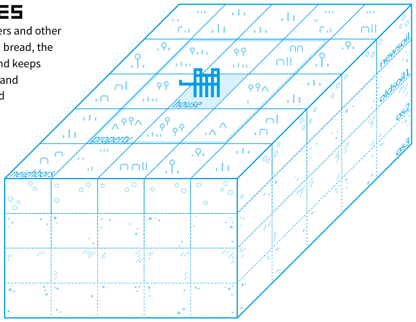

- ⚙ **Humble Estate**. Worth €5,000. Generates a revenue of €5 per week (€5/wk). Enough to scrape by.
- ⚙ **Small Estate**. €10,000. €10/wk. Enough for a whole family of pauperlings.
- ⚙ **Middling Estate**. €50,000. €50/wk. Enough to live comfortably in a middle class neighborhold.
- ⚙ **Fine Estate**. €500,000. €500/wk. Upper class life.
- ⚙ **Grand Estate**. €10M. €10k/wk. The minimum to call oneself a proper baron.

You will find estates are excellent money sinks. After all, the key to more extravagant adventures is a bigger estate! And, clearly, an estate can never be big enough. As the old folk faith song goes, "make number go up to the moon." Academics disagree which moon the song refers to, as there are at least 17 easily visible moons.

**Properties In Their Variety**

One could keep estates abstract. Numbers kept in arcane ledgers by strange daemons and deciphered by the noöspheric ghost essences of the sulphurous priests of Mathic Abaco in their clock-tok zero-one temples.

One could. But that would be awfully trusting. No, far better and safer to trust in soil, for land alone gives birth to that net product which can be called the wealth of humans. Thus spake master Turs Quay Nay Shtra.

There are thus four categories of estate:

- ⚙ **House**. Your castle. Where you live, grow, learn, pray, entertain, shelter, bunker, recover, and revive (if you have a chamber of living waters).
- ⚙ **Property Present**. Lands abutting and controlled by your house, where you can extract maximum revenue from the souls chosen to serve you.
- ⚙ **Property Absent**. Far away lands, administered for you by conniving, untrustworthy agents.
- ⚙ **Property Abstract**. The aforementioned numbers in arcane ledgers. Barely comprehensible. But very low maintenance. Please do not look behind the curtain.

Your starting estate, by the wisdom of the Sender and the generosity of the Departed Sieur, includes a house (see Domus Nova, pXX) and properties present.

Ah, a harsher referee might have started you out with a smaller estate, but we have what we have. Turn the page and attend to properties present, absent, and abstract.

**Properties Abstract**

By the glory of the Dream, wealth may be abstracted from the crude matter of this world and held entirely in the mind of the Lords. "Fiat divitiae!" cry the daemons.

- ⚙ Invest €1,000 in the butcher bank or another entity to gain revenues of 1 cash per week (+€1/wk) in perpetuity.

Your abstract investments are completely safe. Honest. The referee is totally not making a secret annual roll.

| d00 | Public Event | Secret Horror |
|---:|:---|:---|
| 1 | rational disincorporation | Colleague, your assets have been volunteered to promote the cause of the new popular rational republic. Be joyous! |
| 2 | zombie bank run | Turns out they hadn't covered your deposits ... uh ... it's a race to your nearest branch office to get your cash out. |
| 3 | unnatural proliferation | Your assets have been quarantined until the ERROR is contained. Care to venture into the vaults and help root it out? |
| 4 | natural disaster | Flip a coin. Heads, your assets are fine. Tails ... |
| 5 | ministry shakedown | Perform a quest or the Ministry has a claim to 50% of your property. |
| 6 | phylake intervention | Your invested cash is safe and totally really there. |
| 7 | ancestor sacrifice | Roll d6: (1) actually, your investment fell by 20%, (2) it fell by 10%, (3) stayed the same, but no cash withdrawals for a year, (4) unchanged, but revenues are down 20% for a year, (5) all unchanged, (6) revenue up by 10% for a year. |
| 8 | ornate occult ritual | see 7 |
| 9 | public murder | see 7 |
| 10 | licentious scandal | see 7 |
| 11–95 | Growth has once again exceeded expectations! | — |
| 96–99 | Growth has actually exceeded expectations. | Investment and revenue grow by +10%. Hurrah. |
| 00 | Toil extracted from outgarden subhumans benefits shareholders, including you! | Investment and revenue are doubled. That's +100%! Yay! Also, you receive a free servitor. |

**Properties Present and Absent**

Lands! Here or there. If they are here, you can run them yourself! If they are absent, you had best hire an agent. Upkeep will be required when things go wonky (p59 XX). But other than that, it'll all be fine, yes?

Your starting properties present are an estate of eight plots, covered in rubble. They have a value of €40,000 but bring in no revenue. Clearing each plot costs €1d10 x 1,000 and takes 1d8 weeks. Rented to a tenant, each plot then brings in revenues of €2d6+3 per week.

You could upgrade those basic plots with additional revenue-generating facilities.

| d8 | Property | Value | Revenue |
|---:|:---|---:|---:|
| 1 | sump potato farm & farmbob | €5k | €5/wk |
| 2 | lagomorph hatchery collective | €10k | €10/wk |
| 3 | houseseed nursery | €20k | €20/wk |
| 4 | luminous valov orchard | €40k | €40/wk |
| 5 | blacklight lotus ponds | €100k | €100/wk |
| 6 | beastmass proliferation center | €200k | €200/wk |
| 7 | certified blood vineyard | €500k | €500/wk |
| 8 | biomatter-to-energy conversion and re-education facility | €1M | €1k/wk |

Rolling once a year should be enough, right?

**Running the Estate**

| d20 | Result |
|---:|:---|
| 1 | Disaster! Pay the bank 50% of the estate's value. |
| 2–5 | Failure. No revenue from the estate next year. |
| 6–10 | Partial success. Earn half revenue from the estate next year. Or, uh, take the tenants' seed crop ... |
| 11–15 | A good, standardized, normative year. Earn normal revenues from the estate next year. |
| 16–19 | Look at you, managing that estate so well! Earn +25% revenues next year. |
| 20 | Blood from a stone! +100% revenues next year. |
| 21–25 | Beautifully done. Add 25% to the value of the estate and earn +50% revenues next year. |
| 26+ | As above, but you've also turned a tenant, sharecropper, or uplifted member of the local fauna into a skilled and loyal follower. If you like, they'll serve you as an agent on the estate for free (ignore the small and reasonable sum they pocket from the profits). |

Referee! Obviously don't pull the wool over the PCs' eyes. After all, there must be some kind of rules in place to prevent powerful actors like the referee from abusing ordinary heroes with pump and dump schemes, scam cash schemes, and other cryptic ponzi rituals, right?

Selling properties is just about as fiddly as selling houses. Generally, you can expect to take a small loss on the value (after all, it's a golden age, so all the prices are always dropping, except the ones you need to pay!) unless you're lucky (charismatic) and skilled. See the Selling Your House section for a table (p52-XX).

#### DOMUS NOVA

The Antagonist approaches. With a gesture, their doghead goons hang back. Hand up, chironomic gesture for peace and words. There are witnesses. If the Antagonist were to break their honor now, there would be expensive repercussions.

"This is your house now, eh? Well, the clavus has done your part, eh? I'll buy it off you right now. Fifty thousand cash. Set yourself up comfy, free to enjoy the leisure of this town. Lander gentry, eh?"

The Antagonist looks around. Nervous? Angry? Excited? Worried? Flustered? Surprised? The emotions flicker, like they are trying them on. But ... there's no one there.

Their attention snaps back to you, "I'll be back soon. I hope you'll be ready to sell. Won't get a better deal and then they'll be all over you."

Whether you take up the Antagonist on their offer, roll d20 in each column as required for your new casita, dormicile, house machine or what is it.

| d20 | This Your House | Color | Pretty Feature | Rooms (Usable/Total) | Refurbish (€/room) | Rental Revenue (€/room/week) |
|---:|:---|:---|:---|:---:|---:|---:|
| 1 | stackpod cargo cluster | beige | biomass eater | 0/10 | €10,000 | €1 |
| 2 | servant hive dormicile | black | carniflora | 1/3 | €9,000 | €2 |
| 3 | DemeterTM human dwelling hut | brown | ceramic scales | 2/3 | €8,000 | €2 |
| 4 | primeval town monolocale | crayfish | charging pedipalps | 2/4 | €7,500 | €3 |
| 5 | ruderal keeper's cottage | cream | chitin panels | 3/4 | €7,000 | €3 |
| 6 | cinderblock-grade golem garage | dirt | dryland coral | 3/5 | €6,500 | €3 |
| 7 | two-up two-down lodgement | eggshell | haze emitters | 4/5 | €6,000 | €4 |
| 8 | traditional urban family bungalow | gray | holovidy crystals | 3/6 | €5,000 | €4 |
| 9 | articulated wagon compound | greige | hum dampers | 4/6 | €4,750 | €4 |
| 10 | standard managerial condoplex | gris | living stone | 3/7 | €4,500 | €5 |
| 11 | vertistacked wijkhuis | white | luminous floors | 4/7 | €4,250 | €5 |
| 12 | reinforced rural bunker chalet | opal | many eyes | 5/7 | €4,000 | €5 |
| 13 | post-conversion linear manor | pale | protean walls | 1/13 | €3,750 | €6 |
| 14 | rambling rancher lodge | pearl | psionic soothers | 3/8 | €3,500 | €6 |
| 15 | fortified cubist suburban | plum | slurry ducts | 4/8 | €3,250 | €7 |
| 16 | nondescript country hacienda | puce | smart portals | 5/8 | €3,000 | €8 |
| 17 | triple-wide stack dacha | red | solar lamps | 4/9 | €2,750 | €10 |
| 18 | steel and glass pencil tower | rust | sung wood | 5/9 | €2,500 | €12 |
| 19 | glass and crystal palatio | sable | ululating mouths | 6/9 | €2,250 | €15 |
| 20 | livingstone habitation machine | sand | ur-obsidian windows | 6/10 | €2,000 | €20 |

#### HOUSES

Domesticity is the mark of civilization. Are you civilized enough to own a house? If you own no real estate, are you even real?

**Bones of the House**

This section (dissection?) lays its rooms bare for your occupation, refurbishing, specialization, and upgrading. The room is the core segment of the house-as-character, its inventory, if you will. Each room has two main attributes: its **revenue** (if rented out) or its **expense** (if maintained).

Note that "room" is an abstraction. It might represent a single room, or it could be a suite of chambers, a warren of burrows, or a mass of livingstone bubbles in a bowl-house.

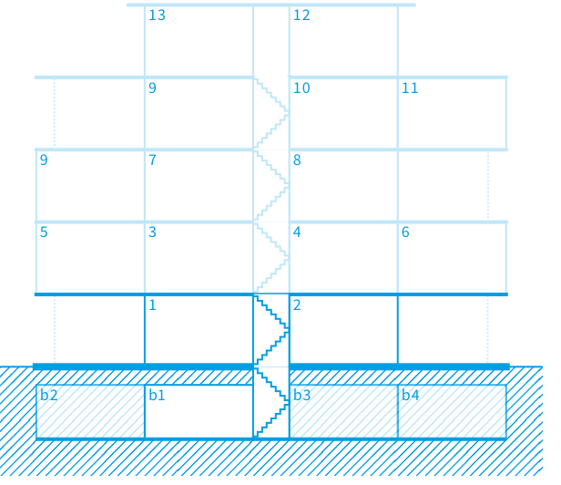

**Usable and Unusable Rooms**

Some of your new house's rooms may be unusable, gone to dust over the nameless aeons (several years) in the house's protective bubble field.

"No! That is a lie! There has been no decline whatsoever. Any troubles are mere temporary disasters. The living mosaic will be reactivated shortly," crackles a voice from the speakmouths integrated into the walls.

**Usable** rooms are (roll d6):

| d6 | Condition |
|---:|:---|
| 1 | haunted |
| 2 | musty |
| 3 | dusty |
| 4 | fussy |
| 5 | overstuffed |
| 6 | quite nice |

You can rent these rooms out or upgrade them.

**Unusable** rooms are (d6):

| d6 | Condition |
|---:|:---|
| 1 | cracked open |
| 2 | fire-damaged |
| 3 | water-logged |
| 4 | rotted |
| 5 | gone feral |
| 6 | corrupted by error |

These rooms must be refurbished before you can rent them out or upgrade them into your quarters or a special room. The refurbish cost is set by the local autonomous repair servitor guild union and takes into account available materials and skills.

Refurbishing a room to make it usable takes 1d6 weeks. Upgrading a usable room into quarters or a special room takes another 1d6 weeks.

**Expanding Your House**

Total rooms are all the rooms the original shell of the house was designed for. To build additional rooms, the autoarchitect recommends a new (d10):

| d10 | Section |
|---:|:---|
| 1 | cellar |
| 2 | wing |
| 3 | courtyard |
| 4 | floor |
| 5 | annex |
| 6 | section |
| 7 | conservatory |
| 8 | solarium |
| 9 | outbuilding |
| 10 | tower |

This extension will take 4d6 weeks to build and add 1d6 rooms at 1d6 times the price of refurbishment per room.

**Renting**

Renting out a usable room is a great and safe way to earn money! Your tenants are sure to be great and reliable people! You can invest €500 to reroll how much rental revenue a room can earn for you. An increase may require evicting tenants who won't pay up (1-in-3).

Perhaps your tenant NPC is a ...

| d6 | Trade | Bent | Quirk |
|---:|:---|:---|:---|
| 1 | student | surly | sarcophagus |
| 2 | soldier | cheerful | void parasite |
| 3 | clerk | secretive | blood debt |
| 4 | performer | proud | regal heir |
| 5 | merchant | nervous | heinous crime |
| 6 | artisan | eager | vile treasure |

**Selling Your House**

It takes 1d30 weeks to close your sale. Make a charisma roll with relevant deception and marketing skills.

| d20 | Sale Price |
|---:|:---|
| 1 | House confiscated under asset forfeiture laws. |
| 2–6 | Bad market, bad sale. Earn 1d6 x 10% of value. |
| 7 | Sale fails. Earn +25% if you succeed next time. |
| 8–12 | Reasonable sale. Earn 2d6 x 10% of value. |
| 13 | Sell for 150% of value. Buyer feels cheated. |
| 14–19 | Good sale. Earn 3d6 x 10% of value. |
| 20+ | Proper property flipper. Earn 200% of value. |

**Your Quarters**

How you live defines how others see you and directly impacts your adventuring effectiveness, how long you live, how likely you are to get sick and even whether you die. Quarters are a proxy for your lifestyle. You can turn any usable room into quarters by paying the requisite price. When you improve or reduce the quality of your quarters, the lifestyle benefits take 10 weeks to manifest.

Your new house has 1d4 rooms (but no more than its usable total) set up as quarters. The quarters are (roll d6): (1–2) humiliating, (3–5) frugal, (6) comfortable.

If you **share quarters** with your friends, like in a household, commune, polybody hive or labor-unit hot bunking system, you only occupy one room of the house and reduce your expenses by 30% (rounded down) per body. Of course, this does mean living together. And you know how loudly redlanders snore. High-altitude adaptation and all.

| Quality | Lifestyle Effects | Price | Expense |
|:---|:---|---:|---:|
| Quarterless | You sleep in a ruin, hole, or ditch. You scavenge for supplies, tap nutrislurry ducts for food, and wash yourself in rainwater. At the start of every adventure save to see if you are sick. Oh, and subtract 1d4 life per level (no minimum, careful). | €0 | €1/wk |
| Humiliating | You cannot have nice things. If you want toilet paper, you cannot go out for a coffee. If you want shoes, you can't get a haircut. If you want vegetables, you won't have a coat. The tradeoffs are constant, and grueling. When you go on an adventure, start by subtracting 1d4 life per level (minimum 1 life per level). | €100 | €5/wk |
| Frugal | If you don't go on holidays and avoid any unnecessary expenses, you can just about make ends meet. To adventure, come as you are. | €500 | €10/wk |
| Comfortable | You can participate as a full member of society, go to the opera, enjoy promenades, have a bit of cat's whisker in the evening, buy books, and afford some basic health insurance. When you go on an adventure, start with 1 bonus life per level. If injured, you can get one limb or organ replaced every 10 weeks. | €3,000 | €30/wk |
| Luxurious | You are welcome everywhere. Doors open when you flash your vantablack status card. You rarely have to pay for anything, since your credit is so good everywhere. On adventures, start with 1 bonus life per level and 1 immunity die per level (works like a hero die, but only for resisting daemons, diseases, and other ill effects). If killed, you are revived in your rack-ready clone in 10 weeks at no extra fee. | €25,000 | €150/wk |
| Paradisiac | You get the best of everything because, obviously, you are the best. Daemons and servitors cater to your every whim, tone your body and mind while you sleep. Start adventures with 2 bonus life per level, +1 to all physical abilities, and 9 immunity dice for resisting afflictions. If killed, seriously injured, or annoyed, you can transfer your conscience into a backup you in 1d4 days at no extra fee. | €333k | €999/wk |

This chapter is sponsored by the Omnicivilizing Landcoral Homeowners Enterprise and Savings Universal Society. Get your armored automated mobile self-defending fortress manor today!

- ⚙ Taupemarine plating available.
- ⚙ Independent sensor aggregation.
- ⚙ Automated aggression systems.
- ⚙ Polymorphic structural lounge chairs.
- ⚙ Nemesis digesting septic system.
- ⚙ All-wall procedural entertainment and amusement delivery system.

*Allow up to sixteen months for delivery.

**Terms and conditions may be applied.** *OLHESUS® is not responsible for feral, barbaric, deviant, corrupt or erroneous landcoral structure behavior.*

**Twenty Special Rooms**

Now, quarters are all fine and dandy, but perhaps you'd like something more interesting than a posturban fortified conapt for yourself and your henchlings?

Besides the particular **benefit** a special room offers, it also has an installation **price** (in addition to any cost for refurbishing a decrepit or useless room) as well as a maintenance **expense**. Special rooms may be _betterbuilt_ for 10x the usual price, offering increased benefits.

A character must spend a week's relaxation action (pXX) using a room to gain its special benefit. The benefit occupies a trait or inventory slot on the character's sheet (yes, the vehicle and item benefits, too). Replacing the benefit with another trait, item, or burden wipes it off the sheet. Regaining it requires another week's relaxation action.

| d20 | Room | Effect | Price | Expense |
|---:|:---|:---|---:|---:|
| 1 | Astrauditorium | Listen to and talk to the stars, fast and slow, in this zodiac-grade voidwalker chamber. Also, prepare abjurations against ill omens, bad times, and curses. _Benefit:_ gain +1 to all saves. Reroll any number of hero dice, once. _Betterbuild:_ gain +2 to all saves. Reroll any number of dice, once. | €30,000 | €15/wk |
| 2 | Bibliotaph | A tomb for books, tablets, crystals, and minds, to keep them safe from the ears of phylakes and the finger-eyes of the Lords. Bonus to identify, learn, hack, and modify fantascience powers. Also, works as a library. _Benefit:_ +1 to saves and +1 level when dealing with fantascience powers. _Betterbuild:_ +2 to saves and level. | €20,000 | €20/wk |
| 3 | Chronobunker | A place to lay low and pass the time. Comes with cryopods that slow the progression of all kinds of diseases and corruptions, entropies and decays. Also, works as a great sleep prison for humanoid entities. _Benefit:_ look younger and gain +1 charisma. _Betterbuild:_ are younger. Gain +1 charisma and skip one corruption roll. | €15,000 | €10/wk |
| 4 | Dicing Den | A place to play games of strategy and chance. Put on funny costumes, drink sugary slurries half-digested by single-celled eukaryotic fungi, and pretend to be someone else, someone free from this strange time and place. Also, stores games, amusements, and other devices ... or invite friends over for "fun". _Benefit:_ sacrifice this benefit to add d20 to one d20 roll. _Betterbuild:_ you get to sacrifice this benefit twice. | €3,000 | €5/wk |
| 5 | Butchervault | A treasury certified by the Butcher Bank. Store your valuables, sealed by your own source code and the cryptic logics of the eternal financial institution. Also, safely store radioactive, corrupted, necromantic or post-corporeal items. _Benefit:_ flash that butcher key to show your wealth. Gain +1 charisma. _Betterbuild:_ it's the black flesh stone key. Gain +2 charisma. | €6,666 | €5/wk |
| 6 | Festive Salon | A place to entertain guests and enhance your status. Includes clockwork chef, miniaturized orchestra, synaesthetic sofas and a vibrating dance floor. _Benefit:_ a contact owes you a favor (as expert agent). Sacrifice to access. _Betterbuild:_ the favor is the equivalent of a master agent. | €7,500 | €10/wk |
| 7 | Gymnasium | A place to exercise your body. From breathing exercises to penance postures, cryocalesthenics to zoom-ba human running wheel runs. _Benefit:_ gain +1 to strength, agility, or endurance. _Betterbuild:_ gain +1 to strength, agility, and endurance. | €5,000 | €5/wk |
| 8 | Harmory | A safe place to keep weapons and armors that could hurt humans. Includes automatic armorer agent to keep all the equipment polished and shiny. Source code locked and shielded from the probing no-ray gaze of any passing phylake. Please do not use the harmory to store illegal weapons. _Benefit:_ +1 to attack and damage when using your stored weapons. _Betterbuild:_ +2 to attack and damage when using your stored weapons. | €13,000 | €20/wk |
| 9 | Houseface | A face for your house mind. Interface with the house using human language, rather than the arcane plaques and chemical needles of the default messaging maw. Also, the house can act as its own skilled agent for repairs, etc. _Benefit:_ stay in touch remotely with letters, communicators, or the noösphere. _Betterbuild:_ house is a master agent, spend 1 life to activate 1 hour psi link. | €17,000 | €10/wk |

| d20 | Room | Effect | Price | Expense |
|---:|:---|:---|---:|---:|
| 10 | Mechaludus | Automated combat arena, equipped with a variety of automata, synthetic puppets, and practice lobogolems. Bonus to learning new combat skills. _Benefit:_ +1 to level and defenses when using weapons and/or armor. _Betterbuild:_ +2 to level and defenses. | €15,000 | €10/wk |
| 11 | Motordoctor | A virtuous scholar-grade infirmary equipped with an autovet specialized for treating humans. Includes liniments, tinctures, theriacs, cataplasms, and five types of carminative. When resting, remove +1 physical afflictions. _Benefit:_ hero dice rolled against diseases, injuries, and infirmities are 1d8. _Betterbuild:_ those hero dice are now 1d10. | €20,000 | €10/wk |
| 12 | Neuralcove | A place to refresh your mind. Plug in, check out, and purge those bad vibes. When resting, remove +1 mental afflictions. Bonus to forgetting and resetting. Also, serves as your very own local walled garden noösphere access point. _Benefit:_ gain +1 thought or aura. _Betterbuild:_ gain +1 thought and aura. | €15,000 | €10/wk |
| 13 | Nutrisump | Vats, collectors, and recyclers to generate your own off-grid nutrislurry. Converts dead or living biomatter into delicious edible slurry. _Benefit:_ subdermal supplies for two weeks (1 stone). _Betterbuild:_ subdermal supplies for four weeks (still 1 stone). | €10,000 | €5/wk |
| 14 | Phantom Parlor | A place to entertain ancestors, ghosts, and dead daemons. Allows you to speak with any dead creatures you bring home. _Benefit:_ ghost thorn lets you interact with incorporeal creatures and items. _Betterbuild:_ ghost bone doubles your effectiveness (e.g. double damage). | €15,000 | €10/wk |
| 15 | Sarcauldron | A place to brew flesh and biology. Perfect for the domestic biomancer. Bonus to identify, train, hack, and modify living organisms. _Benefit:_ +1 to saves and +1 level when dealing with biotech or biomagic. _Betterbuild:_ +2 to saves and level. | €20,000 | €20/wk |
| 16 | Soul Pool | A place to fuel your spirit. Drift with the stars. Sink into the nothing-made of the all-existence. When resting, remove +1 spiritual afflictions. Also, can store a number of human souls equal to your house's total usable rooms. _Benefit:_ gain +1 aura or charisma. _Betterbuild:_ gain +1 aura and charisma. | €10,000 | €10/wk |
| 17 | Technotheke | Store, access, reference, and update oldtech devices with the help of your own personal half-minded Theke. Bonus to identify, learn, hack, and modify oldtech powers. Also, serves as a mechanical workshop. _Benefit:_ +1 to saves and +1 level when dealing with oldtech powers. _Betterbuild:_ +2 to saves and level. | €20,000 | €20/wk |
| 18 | Vechpark | A place to house 2 large semiliving vehicles or mounts. Includes feeding tubes, cleansing hoses, autovet arms, and small symbiotic parasite-killer birds. _Benefit:_ vehicles gain +1 level and +1 life per level. _Betterbuild:_ houses 4 vehicles, gain +2 levels and life per level. | €5,000 | €10/wk |
| 19 | Vidy Shrine | A place to worship at the altar of the Dream and partake of their procedurally generated enchantments. Stay on top of trends and fashions. Pass for a regular garden human. Also, works as an interactive holographic theater. _Benefit:_ spend 1 thought to gain +1d4 temporary life. _Betterbuild:_ spend 1 thought or strength to gain +1d6 temporary life. | €1,000 | €5/wk |
| 20 | Zu Reactor | A radiothermal battery chamber to keep the lights on as the world goes dark. Enjoy authentic illuminated reproductions of Long Long Ago nature scenes even as rust clouds hunt through the ruinlands outside. Also, you get free recharging on all vehicles and equipment while you're at home. _Benefit:_ air conditioning and refrigeration give you +1 endurance. _Betterbuild:_ gain +2 endurance. | €40,000 | €10/wk |

You are encouraged to come up with other special rooms. For example kitchens, matter destroyer pits, swimming pools, beam eye towers, bubble pads, orangeries, polymorphic pads, clone racks, animal pens, solar baths, sungwood gardens, ancestral crypts, hardlight mazes, drawing rooms, smoking halls, taxidermy lofts, and so on.

#### CASH ASSETS

_Property makes a proper person._ —traditional saying, Yellow Lands

What is property? It is a relationship between subjects and objects, between people and things. The thread that connects care and labor with the world physical. The law that divides scarce resources. The narrative that makes the world useful.

It is how you prove that you exist. It is the shackle that binds you to this Given World. It is the resource that fuels your ambitions.

Every proper rainbowlander knows what cash (€) is. The twice-barred "c". Liquid assets.

- ⚙ €1 = An unskilled human's day wage.

Cash is an abstraction for the different kinds of bills, coins, cards, cheques, and credits that the humans of the Circle Sea Civilizational Megaregion use in their daily truck and barter.

**Spending Cash**

Cash is your most versatile social resource. Credit crystallized. You spend it to buy gear for your adventures. You use it for fines and bribes, food and tickets, hotels and guides. Anything, really.

In play, you can get by without tracking coins and credit when something costs much less than a day's wages.

**Investing Cash**

Crucially, you need cash to become a better person, because the more you are worth, the better you are.

This is obviously true. Everyone says it, even the Mother Machine.

The secret to having a lot of cash is to be very wealthy. The way to become wealthy is to invest your cash in your properties, where it will be fruitful and multiply and come back to you by the mysterious workings of the Invisible Hand. Praise Mohlack (but discreetly)!

**Mortgage**

You can mortgage your properties to get quick cash.

- ⚙ Reduce your revenue by €1/wk and get €500.

It will probably cost €1,000 to pay off a €500 mortgage. Hope you invested that cash well. Like in a profitable trade adventure.

**Revenue**

Revenue (R) is your cash flow before expenses. It's the amount of money you imagine you could have if you were a creature of pure light, who didn't need air or water or food or shelter or a social life.

The simplest source of revenue is your estate, but it can also come from other sources like titles, tributes, tithes, contracts, and other nifty rent-extraction schemes.

Tales say that once, when the Dream Canopy was untattered, every human received a cash each day to consume as they liked. Some say this was a lovely time.

Nowadays, when dragons no longer fuel furnaces, some grovellings and many of the plebeian sort must trade their given time on this Given World for cash. The unskilled and shiftless earn €7 per week, but master servants of earn up to €60 per week or more (p57).

**Expenses**

Expenses (E) is the cash that leaves your accounts every week, like grains of emerald sand pouring through your fingers as you try to hold it together while the jade dragon's visions assail your sanity.

As with revenue, your estate is the source of most ongoing expenses. Your quarters and lifestyle, specialized rooms, rented machinery and more. However, you can incur almost infinite expenses, such as wages for followers, fees for experts, gifts to worthy causes, and other generous status-enhancing efforts.

Fairy stories say how once, when the sky was full of more stars than one could count, humans had no expenses or obligation other than to sing, dance, and make poetry in the Garden of Delights—not to please some distant Lords but to entertain themselves. Other stories say these were not humans but those creatures now called Viles.

**Income**

Income (i) is revenue less expenses. This is how much cash you actually gain per week. Your disposable income.

Revenue (R) - Expenses (E) = income (i)

Go on. Go wild. Spend it on something nice, like a longsword or a classic cinematic vidy or maybe that fancy hat you've wanted for a while.

Income increases your cash pile. If you need a large amount of cash to go on an adventure, you can simply spend some time accumulating cash, let the world-clock wind along, seasons come and go, events happen, and then finally go on your adventure.

Of course, time will crumble your collections, visit illness and indignity upon you, and kill everyone you've ever loved. But, hey, trading time for money is still worth it, right? Right? Or you can just **get a loan**. The terms you get depend on your status in the community.

- ⚙ **Nobody.** Get €100 and increase expenses by €10/wk until you repay the full €200. Wait, what?
- ⚙ **Disreputable.** Get €200 and increase expenses by €5/wk until you repay the full €300.
- ⚙ **Ordinary.** Get €300 and increase expenses by €3/wk until you repay the full €400.
- ⚙ **Reputable.** Get €500 and increase expenses by €2/wk until you repay the full €600.
- ⚙ **Wealthy.** Get €1,000 and increase expenses by €2/wk until you repay the full €1,100.

_Attention: actual loan rates determined by local butcher banker branch. Please avoid loans from hexads, self-organized co-operative syndicates or secret societies._

This page is sponsored by the Cogflower Chamber of Commerce, your ally in eternal growth and progress.

Are you a high-net-value sentience, individual, or distributed consciousness? The CCC has the experts to ensure your eternal moral-economic worth.

- ⚙ Necrolegal services to keep your good fortune regardless of your current mortality status.
- ⚙ Sacral accounting & advocacy systems to save you from meddling tax and customs apparatchiks.
- ⚙ Act-of-god grade insurance to perpetuate your physical existence in perpetuity.

If you are a candidate for CCC services, submit proof of worth at your temple of communications today!

#### REST? FOR THE WICKED?

You take a deep breath and start pondering what kind of time-lost vintages the Desiccated er... Departed Sieur may have left in the drawing room drinks cabinet. Something to celebrate perhaps.

Then ... then there will be plans to make. Places to explore. Rooms to renovate. Friends to invite over. Enemies to sabotage with your new-found wealth.

Perhaps you will even find an uplink scroll of _Summon Seaside_ and the lords and unlords, the gods good and gracious, will see fit to drown some neighborlands and raise the value of your real estate.

**Weeks At Home**

When not adventuring, the usual baseline human PC effectively does three things each week: **sleep plus two other activities**. With the proper high-line drugs, a human PC could probably replace sleep with another productive activity, like painfully sculpting their mortal shell to conform to the desires of faceless noösphere daemons for a chance at fame and fortune.

Conveniently, the tasks a PC faces would never overwhelm their ability to deal with them, right? Wrong.

It is the human lot that weeks are mayfly-brief, eye-blinks that tease with possibility when Moon Day rolls around and torment with dread and regret when Solar Day swivels back into view. But that is for later.

So, what do adventurer landlords fill their weeks with?

**BED REST**

Broken from their adventures, they hide abed, tended by twitchy golem doctors and beset by haunting mothering voices in the walls. Bed rest precludes _all_ other activities (except sleep).

A resting character normally fully restores one missing or damaged attribute each week. They may regain all their missing life, or fully restore one damaged ability score, or remove one burden or similar affliction.

A character **resting in their bed at home** restores **two** missing or damaged attributes each week. The sense of peace and prosperity that comes with owning a home promotes faster healing and recovery.

Special rooms or home improvements may provide additional benefits.

#### RELAXATION

Pleasurable activity that builds up mental and physical resilience, and removes some burdens or afflictions.

[Self]-improvement may combine with relaxation. After a week of relaxation roll d20 + endurance or aura.

| d20 | It's All Fun And Games Until ... |
|---:|:---|
| 1–5 | Acquire expensive new "hobby". It occupies a trait and costs €10 x level to indulge for a week. After such a week (d6): (1) lose d6 x level life, (2) lose your clothes, (3) lose 1d4 burdens, (4) make a new friend, (5) gain 1d4 temporary HD, (6) restore all your mental abilities and remove 1 burden. |
| 6–10 | Refreshed. Restore all your endurance or aura, _and_ gain +1 temporary life. |
| 11–13 | Invigorated! Restore all your endurance or aura, _and_ gain +1 temporary end or aur. |
| 14–16 | Smooth. Remove a mental burden or affliction, _and_ gain +1 temporary end and aur. |
| 17–19 | Wired to eleven. Remove a mental burden or affliction, _also_ gain +1 temporary agi and thought. |
| 20 | Reset. Remove a mental burden or affliction, _and_ gain +2 temporary bonus to an ability. |
| 21–23 | Uplifted. Remove a mental burden or affliction, and gain a resilience die (d4). Note the resilience die as a trait or item. At any point, you can roll the resilience die and remove that many burdens or afflictions. You can only have one resilience die at a time. |
| 24–26 | Fortune-marked. Remove a burden or affliction, and gain a second chance die (d6). Note the die as a trait or item. When you are reduced to 0 life or would be killed, you roll the second chance die and end up with that much life. |
| 27+ | Personal or spiritual insight. Restore all your endurance and aura, _also_ permanently gain +1 end or aur. |

Special rooms or home improvements may provide additional benefits.

#### UPKEEP

Estates require work. Food must be cooked. Rooms refurbished. Servitors supervised. Tenants terrorized. Butcher bankers paid in flesh and flattery. Most incidents (pXX) or nuisances (pXX) can be handled by proper upkeep. Roll d20 + any relevant skills you might possess.

**... Taking Care of Stuff**

| d20 | Result |
|---:|:---|
| 1 | Not only did you not take care of it. Things are now somehow ten times worse. |
| 2–5 | Failure. €15 to hire a trades-servitor and fix your mess. Try again next week with a penalty or hire a master of labors to fix things for €1d6 x 50. |
| 6–10 | Partial success. One more week of fiddling and puttering around should do it. Roll again next week. |
| 11–15 | Fixed. Doesn't look too bad. Not going to win any prizes, but it does the job. |
| 16–19 | Good job. Whatever it was, it's handled. This problem won't be back. The chrome mold will surely not eat any more chickens now. |
| 20 | Not only is it a good job, you've learned something! Gain 1 step towards learning or improving a trait. |
| 21–25 | Beautifully handled. You've increased the value of your property by 1d6%. |
| 26+ | Not only have you increased the value of your property (see above), you've turned the butcher banker or the terror taxmonk into a valuable and well-disposed contact for future adventures. |

If you are wealthy enough, you might hire an agent or representative to deal with upkeep for you.

- ♟ _No Body (€0/week)._ You really need a body to handle upkeep. Roll d12 to see what happens. No bonus.
- ♟ _Local Schmuck (€10/week)._ Local is a personal name. Honest. Makes a d20 roll for you. No bonus.
- ♟ _Perspective Naftofosfat (€20/week)._ A handy aide who will roll with a +3 skill bonus.
- ♟ _General Utility Jonesie (€40/week)._ An expert right hand orimonate who rolls with a +6 bonus.
- ♟ _Butler Primula Manastir (€80/week)._ A true majordomo who can handle most eventualities better than you ever could yourself (+9 bonus).

#### IMPROVEMENT

Whether yourself through study, your pet through training, or your estate through cash, becoming better takes action. Action and time. Action, time and luck.

First, write down the trait you wish to acquire or improve.

Second, figure out how many successes you require.

- ⚙ To gain a **simple, common trait**: 3 successes. Perhaps a typical skill, such as riding a bicycle, or a common estate upgrade, such as vidy screen walls.
- ⚙ Gain a **complex** or **uncommon trait**: 3d2 successes. Running an estate, from bookkeeping to human resources exploitation, or installing an oldtech privacy field to keep daemons and phylakes out of your house.
- ⚙ Gain a **background** or **rare trait**: 3d3 successes. Learning to live and move like a local barbarian, or training your pet to access the human-level kaaugmentation routines in its source code.
- ⚙ To **improve a trait one step**: 3d2 successes. This might progress your or your pet's trait from skilled to expert (if relevant), or increase the effectiveness of a trait of your estate or vehicle or item.
- ⚙ To **improve a trait a second time**: 5d2 successes. Progress a trait from expert to master, or boost another trait to its ultimate limit.

Mark the required successes on your character sheet to fill out after successful improvement attempts.

To attempt an improvement, you require resources. These may be sources of knowledge, such as mentors, memory bones, or vidy crystals. They could be liquid truths, injectable reflexes, or biomechanical implants. They could even be songs for sungwood house, or stone manipulation protocols to grow a new livingstone fence.

A resource secured, dedicate a week to improvement and make a thought roll (d20 + tho).

| d20 | Progress At Any Price |
|---:|:---|
| 1 | No. This will not happen. You hate this. You will never gain or improve this trait. |
| 2–4 | Fail to make any progress. _Also_, the new concepts shake your core. Suffer a burden, injure your pet, or damage your property. |
| 5–10 | Fail to make any progress. But, you're making an effort! Feel proud! Gain +1 temporary life. |
| 11 | Fail to make any progress _unless_ you sacrifice something personal and meaningful. |
| 12–17 | Success! One success! One is infinitely more than zero. Be happy! |
| 18–19 | Success! _If_ you sacrifice something personal and meaningful, make that two successes! |
| 20 | Two successes and +1 temporary life from pride. |
| 21–24 | Two successes and you can tailor the trait to better fit your character and needs. Perhaps it benefits from a different ability score or has a different flavor. |
| 25+ | Two successes ... three, _if_ you sacrifice something very personal and meaningful. _Also_, adjust and improve the trait to your character and taste. If you like, you can even name it after yourself—especially useful if you're trying to internalize a new power and fancy calling it something like _Astral Diogenes' Forcefield Barrel of Force_. |

At home, **you can make two attempts at improvement each week**—unlike in the field, where you would only be able to make one such attempt per week. Heck, with high-line drugs, you could make three attempts!

If you fail to make any progress, you can try again a second time with the same resource. If you fail a second time, this resource will never work for you.

**Improvement Resources**

Roll d10 and d8 if the resource is safe, d10 and d10 if it might be cursed. This resource is found (d6): (1) a quest away, (2) far away, (3) guarded, (4) next town, (5) in town, (6) near here. A sufficient amount costs €(1d10 x 1d10 x (1d8-1)) or €100.

| d10 | (1–2) Mentors | (3–4) Knowledge | (5–6) Tools | (7–8) Materials | (9–10) Error |
|---:|:---|:---|:---|:---|:---|
| 1 | purged oligarch | antentropic tablet | electric microscope | memory ooze | reality-freezing |
| 2 | aged scavenger | stone book | bonded golem helper | ur-obsidian | soul-rippling |
| 3 | tireless academic | vidy crystal | flesh sculptor | golem clay | radiologically active |
| 4 | maintainer priest | injectable poem | focal autopurifier | livingstone | highly addictive |
| 5 | heretic inquisitor | blood song | antimemetic suit | beast egg mass | toxic to humans |
| 6 | barbarian savant | memory bone | biomech implants | stuckforce | memory altering |
| 7 | falscher sapient | biomechanical brain | liquid reflexes | ghost bone | personality lathe |
| 8 | uplifted animal | cogflower archive | stonelife rod | carving stone | holon duplicator |
| 9 | post-human wisp | pulpwood manual | soul-brain interface | butter metal | time draining |
| 10 | electric cetacean | infectious dream | florawakeTM trowel+ | aerolith | hue bleeder |

#### LABOR

Is your estate too small to grant you a respectable weekly ration of bread, water, air, and fire? Then you may have to suffer the indignity of work to secure a sad pittance of revenue that will keep you clothed and appointed in accordance with the humble expectations of good society. Yes, it is embarrassing to admit, but even a hero of leisure such as yourself may stoop to trading your precious finite time on this Given World for liquid assets.

- ⚙ **Unskilled Labor**. Earn €7 per week (+€7/wk). If you have no skills, or your skills are not in demand, you can always work as a golem polisher, street sitter, manual substitute, or some other job too unprofitable to automate. Roll 1d6 for work rewards.
- ⚙ **Skilled Labor**. Earn +€15/wk. If you are skilled with a professional trait like tinker, tailor, soldier, or spy. Roll 1d8 for work rewards.
- ⚙ **Expert Labor**. Earn +€30/wk. Specialization in a trait has its perks. Roll 1d10 for work rewards.
- ⚙ **Master Labor**. Earn +€60/wk. The pinnacle of the wage labor pyramid. You'd better identify with the authority, now! Look how much it's paying you! Roll 1d12 for work rewards.

Any trait that could be considered a profession may render you eligible for skilled laborer status. See your local wage slave allocation division for more details.

After a week's worth of work, roll for your rewards.

**Work Rewards**

| Roll | Result |
|---:|:---|
| 1 | What a terrible week (d6): (1) you are severely injured—but at least you earn half pay, (2) you are fired and blacklisted in the town for affray and disarray, (3) you are robbed of your wages while having a drink with your comrades, (4) your fashionable clothes are terminally damaged in an unfortunate incident with a blood tuber and two mechanical octopi, (5) you are conscripted for a voluntary baronial corvée, (6) you are selected for an honorary unpaid role in a popular community spirit-building activity involving a ferret and a flag. |
| 2 | You earn your pay by blood and sweat. You lose 1 life per level _and_ next week, the only action you can perform besides labor is relaxation. |
| 3 | You earn your pay, but the toil has drained you. Next week, the only action you can perform besides labor is relaxation. |
| 4–5 | You earn your pay after a satisfying week of labor. You are invited to (d6): (1) meet some black market workers who might have a little "sidegig" for you, (2) an illegal but entertaining night of radical liberation speeches and theater, (3) a wreath of hard drinking and poetry with your coworkers, (4) an office party organized by your employer, (5) a local union cult membership ritual, (6) a neotraditional community sporting conflict event. |
| 6–7 | You earn your pay and more. Your kind employer recognizes your efforts and grants you a 10% raise going forward. Redouble your loyalty, worker! |
| 8–9 | Your skilled work is rewarded with a pat on the back and a firm handshake from the boss. A surge of canine gratitude surges through you, granting you a temporary +1 life per level. Work does give meaning! |
| 10–11 | Your expert work is recognized with a small plaque naming you employee of the week. It grants access to the porcelain slurry pipe in the canteen and a temporary +1 to charisma and endurance. |
| 12–17 | You are promoted to a managerial role! It comes with a timepiece of authority, a badge of honor, a cravat of distinction, and an NPC toady ... er ... direct report named **Toddwards** (L0, eager). From now on you roll 2d6 for work rewards. You are also given a 20% raise going forward and, if you succeed at a hard charisma roll, you can combine your labor action with a relaxation or improvement action. |
| 18+ | You used a hero die, didn't you? Look at you! Thinking outside the box! You are promoted to the position of a vice president. It comes with a corner office that provides a +1d6 bonus to all relaxation rolls. Additionally, you are assigned an assistant manager named **Mangely** (L2, maniacal laugh). Any week you don't feel like actually working while in the office, Mangely will roll 1d10 for your work rewards instead. You can spend that time on relaxation, upkeep, or improvement. |

Ah, well, you'll be away a while, yes? Good thing nothing could go awry in your absence! The referee rolls for interruptions on the INTR tables (pXX). Your agent will handle it just fine. You have an agent, yes? For that upkeep table two pages ago?

#### TOWNSABOUTS

_The hundred thousand generations since the builders programmed and decreed the many ways that humans would live have resulted in this, the Garden, the perfect human lifeway. Who could doubt this eden of humanity?_ —Pathon's _Apology for the Gods_, 4:14.

"Though this tome purports to convey the variety of six lands and four regions and more, it cannot encompass all that lies under the eggshell sky."

Thus opened the _Ensiklopedia Perimaritima_ of the great world-wanderer Satišpe, apologizing for the author's inability to detail all the towns and cities of the known world. Indeed, by the time the seventh and final volume was censored, edited, politically corrected, proofread, and published, over 100 settlements described in the first volume had disappeared.

Now, this tome in your hands certainly provides a more comprehensive, concise, and nice account than that inevitable scholarly failure. After all, it is written by a ...

Oh? What? Those fools would _wandel_ off script? They'd like to visit a town unlisted, engage with a culture unrecorded? Do they _want_ to break their immersion? Peer behind the potemtech facades and draw aside the green drapes of the wizardmaster?

**Improvising Places**

It is time to bluster and invent your way out of this situation. For their own good, of course. After all, to improvise is the way of the referee.

Wheel out your oracle, the random die. Start up the imagination engine. Even toss the question back at the players. Let them engage in co-creation. Ask questions, hard and strange questions, to build a vivid place:

- ⚙ What is the one and only thing that defines this lazyplace? What is its stereotype? Of course it is incomplete, incorrect, and always misleading. But somehow also quite true.
- ⚙ What is a trait of this commune? Exaggerate it! What is a thing they oppose? Assign that to their neighbors.
- ⚙ What do these people say about themselves? What secretly defines them? Even they do not know themselves!
- ⚙ How do they describe a minority that dwells among them? What do they ascribe to the nearby others? How are both these ideas wrong? What is a hidden fact about those groups? Again—they may not understand this.
- ⚙ What do they say they want? What do they really need? How are these things different?
- ⚙ What do they not want to see? Remember: there are none so blind as those who will not see.

**Places in their Categorical Abstraction**

_All happy towns are alike; each unhappy town is unhappy in its own way._ —Qara Hana, _Observations on Utopia_.

For any settlement, small or large, a single rumor will suffice at a distance. For all places are fractal, the closer you look, more unfolds, and more, and more—until you uncover the local ant civilization working on a humanosaur-defeating nanoplague.

But up close it is worth remembering that human habitation zones feel different depending on the size of the human population. As the electric saint Nepo Lu said in its _Antilects_: "quantity has a quality all its own."

1. The **metropoleis**, the great cities, from Red End to Violet City, are hives of activity. The great engines of the lands; clockwork bureaucracies, the flowering of social machinery, every human a cog in a greater destiny. Humans come seeking meaning and betterment, but those seeking a contented mind do not stay. Each such city is described with its own page and map and tables in its own Land. But these are sketches, leaving many gaps to fill. Indeed, each neighborhood and quarter might well be a polis or a commune in its own right.
2. The **pluripoleis**, the many towns. After 374 social experiments dissecting human individuals and communities across 2,430 parameters, the holy science of human social organization is settled. A self-governing autonomous polis or town of several kilohumans and a like number of non-human sentients and resident non-citizen humans creates an optimal long-term collective vehicle for the transmission of culture with minimal human wastage over the observed period. A perfectly utilitarian arrangement. Or so claim some traditionalist sects. Drift, error, and phylakes have driven these towns to differentiate and each can handle many contradictory traits and rumors.
3. Smaller are the **communes**. These weiks or villages are sub-authorized human settlements existing outside the strictly beneficial authority structures and prone to going feral. Humans should be wary of the temptations of village life, as they may lead to an unacceptable decline in their level of civilization. Villages may be smaller and stranger than towns, their traits fewer but very exaggerated.
4. Smaller yet, or abandoned, or further off in the vast where Garden civilization has ended, or never gone, are the **lazyplaces**. These consist of a name and a rumor, a whisper of humanity shading into radiation ghosts and singing dusts. They are not lazy merely because the author has been lazy in barely describing them, but because time there moves more slowly with fewer observers to push the lazy slavegod Time along.

**Places in their Posthistorical Variation**

_Call no city happy until it is no more._ —Samotar Endbringer, _Consolations of Metahistory_.

Why is there such diversity among humans? Why does each settlement cling so to its local folkways? Why are there so many languages? Why does each community have its own strange taboos and quaint customs?

In a world seeded with big divine objects and incomprehensible aberracts, a human mind easily jumps to fantastical conclusions. The truth is prosaic: time, technology, and cultural evolution. Still, can one be sure?

Many scholars of the postnöospheric totality admit a gnawing doubt that divine meddling lies behind what the poet Humerus calls the "variation engine". The end is the world we see, but their arguments vary:

1. According to Zuffa d'Alzavo of Safranj, each settlement's **amusement daemons** algorithmically tailor generated content to local tastes, leading to rapid and unpredictable cultural divergence.
2. The omniglot Semmero Yeziq of Oranje puts the blame in the mouths of the **babel daemons**. Most humans can afford an amulet with a trapped babel offering real-time full-spectrum translation, so there is little pressure to learn other languages and cultures. Each community thus forms its own cant.
3. The dewerker druid Beri Staganoy emphasizes the **physical law of knowledge corruption**. All information stored in the noösphere mutates and accumulates errors. The need for hard records makes maintaining a coherent truth culture impossible.
4. The rustlander fiveborn wisechief Slackmaw Bentley Vinecomb states that it is a byproduct of the unhealthy **lack of war**. The grand phylakes make empires and centralized polities nearly impossible, so local political solutions proliferate and mutate.
5. Figaro Figaro Simplecult of the Purple University holds that the persistence of **local oldtech** is responsible. Many communities have some ancient magical infrastructure providing basic necessities, reducing the need for external trade.
6. The wrecker scholar Rauda Kornpsalms points to the **difficulty of travel**. Portals and other public transport are slower than necessary and unreliable, the bureaucracy and human security daemons unpredictable, the personal transportation licenses baroque. It is more comfortable to stay put—and many people do precisely that. Rauda claims this is by design and proof of the hostility of the gods, but this is a nemesis heresy and good reason to discount such an ill-mannered scholar. It is said that Rauda even sought to corrupt the youth by inciting them to question authority and tradition! Fortunately, the Young Guardeners informed the inquisition and Rauda's antieducational circle in the Grove of Cacodemos was dispersed with mercy and justice. Many scarves of honor were handed out that week.

#### THE 300 TOWN TRAITS

_Polyculture makes Heaven better than monoculture. Diverse cultures make another mass die-off less likely. After the six erroneous utopian experiments, we must encourage a diversity of cultural expression among the different human communities, tribes, and classes._ —Orange Araña's Letters, 373-56, contested translation

The Rainbow Lands and the Circle Sea are the greatest, greenest, most wonderful and pleasant of lands. The most civilized, the best cultured, the most beautiful and safe. Yet, they are not at all the largest part of the world.

Far from it. But they boast such diversity!

The traveler, that blessed good person, possessed of permit and means, will find more variety wandering from one settlement to another, even if they are but half a day's autogolem ride apart, than they would in a week's iron horse journey on the Thin Air or deep in the grasslands beyond the Violet.

**1. Architecture**

What do these human settlements look like?

1. Collective hives for groupthink and groupmind. Prefabricated, regurgitated, post-modulated.
2. Crude slapped-together huts and functional containers, for the true world is the noösphere.
3. Baroque and organic, grown not built. Landcoral, livingstone, or sungwood.
4. Accreted, adapted styles have created a tell town. Layers upon bones upon layers of life and death.
5. Traditional subterranean tunnel town. Bunker palaces, nuclearlithic sub-urbs, plastic parklands.
6. Brutalist paradise of posthuman biomech ruins. Raw materials, glistening veins, gasping pipeworks.

**2. Art**

The aesthetics these humans make and love.

7. Vigorous festivals of dance and mind-bathing.
8. Synthetic generative visual arts.
9. Elaborate ceramic decoration.
10. Deep-coded musical traditions.
11. Illuminated sculptural schools.
12. Bloody gladiatorial trials in old public buildings.

Ethnographers observe the quaint ways of different settlements with great interest, collecting them as birdwatchers do different beasts of the air, from the air jelly to the sky whale.

The rulers of each polis argue that in its form their polis represents the perfect tradeoff between individual freedom and communal competence.

The ethnographer, or the traveler familiar with a city or two, may well doubt this argument. Perhaps this cultural efflorescence exists precisely to defeat the ennui which could so easily overcome a better person in this golden age at the end of time.

To generate a random trait, roll a die 300-sided; or a die 50-sided for the category, then a die 6-sided. Many of these traits are odd. The referee is invited to use discretion, humor, and jaundice in their application.

**3. Birth, Advanced**

How they make new humans.

13. Natural neonates born eight at a time from the Village Womb®.
14. Well-behaved matrix-baked mesonates, between the apparent ages of 3 and 5, delivered to approved parent humans by storklings.
15. Full-grown orimonates from living matrices.
16. Synthetic humans of an appropriate age category stitched together in vitro by mother machines.
17. Uplifted through biomechanical intervention from pre-selected domesticated animal or ling lineages.
18. Recycled from captured ferals.

**4. Birth, Traditional**

How they reproduce new humans.

19. Single mothers select optimized fetuses and carry them to term as part of their civil service.
20. Mothering sisterhoods maintain the reproductive mysteries of Red Rubra and the older gods.
21. Synthetic midwives assist nuclear family units.
22. Carried to term by parents in marsupial pouches.
23. Birther is a respected lower class profession.
24. Grandmothers and medicals perform the ancient rituals at the local temple of the Petal Host.

**5. Care, The Weak**

How the helpless and infirm are cared for.

25. Care is available to anyone who can pay for it. The poor are encouraged to perform feats of gratitude to earn handouts.
26. Unfortunates are encouraged to visit the recycling facilities. Their families receive consumer goods.
27. Free re-body facilities are available in exchange for a three-year community service contract.
28. All citizens must volunteer their time at the local care complex. Unvoluntaries are re-educated.
29. The carer clan alone may offer help and succor.
30. Golems and synthetics run pleasure hospices, with full end-of-life synthetic heaven for their patients.

**6. Care, The Young**

How babes and children are provided for.

31. Creches with basic indoctrination protocols ensure happy well-adjusted children.
32. Extended families provide free labor.
33. Vidys and magical tablets substitute for carers.
34. Ancestors, ghosts, and holograms help biological parents. Often they replace them.
35. Pavlovian training implants let the young care for themselves with mechanical care devices.
36. Each child is assigned a personal daemon who cares for them and grows with them.

**7. Class**

How their property relations divide them.

37. The concept of class is taboo. Even the cruelest of differences are strictly ignored.
38. Rigid caste structure to preserve guild domains.
39. Meritocratic privilege unlocks the benefits of greed.
40. Regular jubilees to cancel debts and obligations.
41. Idealistic egalitarianism supported by strict sacred doctrines of the Invisible Hand and Fair Market.
42. Mandatory equality through cloning, empathic indoctrination, and psychosurgical intervention to remove individual differences.

**8. Courtesy**

What is good manners for these humans?

43. A 13-fold handshake shows friendship and respect.
44. To show the face is to offer your soul for theft.
45. Only a scoundrel would be unwilling to duel.
46. One only talks directly to objects, not people.
47. You cannot have a meaningful relationship if strict records of napkins and kerchiefs are not kept.
48. Swearing shows honesty. Polite people trick you.

**9. Crime**

What is a crime? How is it perceived?

49. To breach etiquette is to summon the manacle man.
50. Borrowing another's words or ideas is theft.
51. Citizens have relationships with every object in their domain. Touching or moving an object in a relationship with a citizen is a vile act.
52. Property is theft. Sharing is mandatory. Owners are criminals, subject to branding and burning.
53. To treat an outlander like an inlander is treachery.
54. Refusing to pay a bribe is grounds for re-education.

**10. Death**

How they deal with death.

55. Final mulching into the local herbal matrix.
56. Destructive recycling into new humans.
57. Elite abmortality with anti-senescence magicines.
58. General abmortality through biomechanical intervention. A society of bionic humans.
59. Post-mortality via canopic jewel.
60. Noöspheric postmortality. Premium postmortalities available for an additional fee.

**11. Demographics**

How many here reside.

61. None. It's all ghosts, the echoes of a lost past.
62. Barely any. It's mostly falšers, soulless biological machine replicas of humans.
63. Few. It's mostly synthetic or undead servitors.
64. Smattering of abmortals cling on as new humans build a new culture.
65. Plenty. A vibrant culture, full of hope, ideas, and delusions of novelty.
66. An overcrowded behavioral sink breeding strange beliefs and warrior death cults.

**12. Dwellings**

What kind of nests do these humans live in?

67. Dormipods for the lowly, glass palaces for the good.
68. Mass-produced identikit biomechanical homes.
69. Freetech wood, brick, and plaster homes. Made by humans for humans.
70. Repurposed grand buildings from long-ago subdivided in hovels, homes, and manors.
71. Landcoral cottages and sungwood bungalows grown from seed and killed on occupant death.
72. Habitation engines fabricated according to the divine templates. Quite safe. Low corruption risk.

**13. Emotion**

How do these humans feel?

73. Emotions are irrational. That's why they replace their meat brains with full-metal at age 5.
74. Negative emotions are bad. Smile all the time.
75. Expressing happiness invites bad luck.
76. Loud emotions after the age of 11 are punished.
77. Their language uses emotion markers to avoid confusion. A statement that does not carry a clear emotional label is impossible.
78. Creatures of pure emotion and intuition, reason must always come second. To repress is to sin.

**14. Faith**

How these humans believe.

79. Cannot believe. Their edited brains are fully rational.
80. To question the faith of the elders is mandatory.
81. A charmingly naïve faith in the scientific gods.
82. Faith is personal and individual. To share beliefs once is a terrible faux pas. Twice: an ostracism.
83. Unbelievable beliefs must be loudly and publicly affirmed to signal group loyalty.
84. The engines of faith implant perfect orthodoxy.

**15. Fashion**

What is in vogue with these humans.

85. Severe monochromatic uniforms.
86. Deeply understated class-based dress system.
87. Ostentatiously useless ornaments and decorations indicate taste and status.
88. Universal undifferentiated bathrobe styles.
89. Ritual naturalism used to discretely flaunt biomechanical modifications in a public setting.
90. Bioideological lineage-based sartorial combat wielding the concepts of the five pneumas.

**16. Food, Ordinary**

What these humans eat of an ordinary day.

91. Formulated pellets from a dispenser. With chondrin for joint support, additives for glossy hair, and a mild sedative flavor.
92. Slime from a tap. Available in seventeen different colors and flavors.
93. Eternal stew, dispensed thrice daily from the village autocanteen as the good book requires.
94. Sugar-dusted cereal flakes mixed with one of five sweet beverages for maximum calory uptake.
95. Healthy mix of vegetables and pulses from local polyculture gardens.
96. Wide and varied buffet, a feast for all the senses, different each day.

**17. Food, Special**

What is eaten on special days.

97. Chocolate. Actual chocolate.
98. Warm slurry. Heated food is as good as chocolate.
99. Recycled ancestors to commune with the infinite chain of humanity.
100. Meat from the local sacrificial beasts.
101. Foods decorated with inert metals like gold, platinum, and uranium.
102. Synthesized foods of extravagant shapes and textures, from authentiporridge to zetafries.

**18. Freedom**

How they handle their liberty under the Maker.

103. Flat denial and retreat into rigid communal dogma.
104. Fatalistic resignation and refusal to make choices.
105. Simplistic assertion of individual freedoms without social or cosmic responsibilities.
106. Delusions of grandiosity, assertion of self-creation.
107. Loose melange of pragmatic pro-social and creative individual needs.
108. Courageous acceptance of the burden of freedom as the duty of bearing witness to the Given World.

**19. Friendship**

How humans relate to others.

109. Laissez-faire. Anything goes. Poop happens.
110. Genetic relatives prioritized.
111. Chemical bonding for intra-group cohesion.
112. Rituals of stress and trauma to create permanent connections between consociates.
113. Machine friends assigned at birth.
114. A life alone is a life well-lived, for every human is an island and an island attached is a peninsula.

**20. Gender**

How they sort their sociobiological roles.

115. Strictly disgendered. Masks to hide faces, robes to disguise forms.
116. Loosely binary, with some ambiguity.
117. Traditional trinary division into ladies, leits, and lords as specified by the Original Congress of Cities.
118. Six- or seven-colored. Great battles rage between the culture-first sixers and hierarchy-plus seveners.
119. Closely tied to biomechanical source and structure.
120. The concept is incomprehensible to this culture.

**21. Killing**

How these humans kill.

121. By killing, a beast becomes a person. A human must kill to acquire a soul and an identity.
122. Life is struggle. To kill an enemy is to become an adult. To be an adult is to be a warrior.
123. Human life is sacred. A killer ceases to be human.
124. A tragedy, a weakness. Those who kill must be purified in the mill of souls.
125. All life is sacred. Killing is an abomination unless the victim is willing. Only willing meat may be eaten.
126. Taboo. All who kill are unclean. To eat that which once lived is to be sullied. The most pure replace their organic digestion systems with electromagical batteries so they no longer need to consume life.

**22. Kinship**

How individuals become relatives.

127. Completely determined by biology: mother, mother's brother, sister's child, and so on.
128. Biology and a smattering of nudge, nudge, wink, wink. Mother, husband, postman, child, and so on.
129. Sortition. Assigned for life by the stochastic kinship engine at birth.
130. Resortion. Remixed regularly by the lotto council.
131. Found. Left to individuals to figure out. May take years, if at all. Anomic ghosts populate the shadows.
132. Psycho-optimized using deep preference analysis and dream-reading engines.

**23. Knowledge**

How human curiosity is satisfied.

133. The pursuit of knowledge for the sake of knowledge. Natural scientists proliferate. Discovery jubilees occur often and scientists perform mystery rites to preserve their lore.
134. Memorization of randomly generated sacred texts.
135. Construction of memory stone complexes.
136. Duplication of key humans in the noösphere.
137. Hive mind protocols.
138. Curiosity decay due to excess hedonism.

**24. Law**

How do they decide what is right and what is not?

139. The ordination obelisk rewrites law codes daily.
140. Oral traditions of honor, debt, and blood-feud.
141. The semi-divine progenitor laid down perfect laws Long Long Ago, when the angels still roosted near.
142. Codified rules refined by undead lawyers.
143. Common law derived from accreted democratic anarchist council decisions.
144. No law. Each citizen is wired into the communicodex through a psycho-empathetic link. Each new ruling is decided by popular subconscious referendum.

**25. Leaders, Power Of**

Relationships between the big and the small person.

145. The leaders are infallible. To question them is grounds for personality formatting.
146. Fed on blood and pneuma, the leaders are harder, better, faster, and stronger than the rest.
147. They are the best of us. So they tell us.
148. They are the best of us. It is proven by their ritual standardized administration exam scores.
149. Random people put into positions of excruciating difficulty, forged and refined through trial and error.
150. Fools, chosen as figureheads. The leaders are sacrificed to the gods when things go wrong.

**26. Literature**

What are the stories and books of these people?

151. Jumbled communal histories, myths, operating manuals, legends, and prayers. All spiral-bound.
152. Violent poetry and gentle oral horror tales.
153. Surprisingly deep cat-girl and bunny-boy folk fics.
154. Baroque, recursive novels used as bricks.
155. Parables of self-improvement, guru hagiographies.
156. A unique canon, sifted from the decamillennial labors of ten thousand electric simians.

**27. Magic**

What do they make of fantascience and other powers?

157. All magic is corruption. Burn every which witch!
158. Everyone needs to take out supernatural insurance.
159. Delusional magic denial.
160. Espouse a deep post-humanism and appreciate the scientological underpinnings of fantascience.
161. Deny human agency. Ascribe all occult knowledge to the gods and builders.
162. Power-hungry desire to master the dark arts. Shame no such thing as "dark arts" exists.

**28. Meaning**

How these humans deal with the presence of oldtech and buildertech far surpassing their powers and abilities.

163. Drugs and shutdown to avoid their unimportance.
164. Cult of strenuous physical activity. Tiredness defeats despair. Break on through, kick a hole in the sky.
165. Self-delusion and myths of local importance.
166. Denial of the existence of the builders and the gods.
167. Local trials require them to strive to survive.
168. Unaware of the existence of oldtech and buildertech thanks to specific local conditions. Please do not disturb these neoprimitives.

**29. Medicine**

How are damaged humans repaired?

169. They are not. They are replaced with replicas.
170. Don't all humans regenerate? Just wait for the missing limb to grow back.
171. Each house has a vivi-coffinTM to rebuild its citizen.
172. Prayers to the autodoctor at the mechaclinic often work. If they don't, sacrifices will surely help.
173. Herbs, chants, and telewitchdoctor appointments.
174. Daemons are summoned to possess a local worthy, filling them with medical knowledge as required.

**30. Memory**

How these humans deal with memory.

175. Memories are surgically removed.
176. Altered to maximize well-being.
177. Synthetic memories to remove all frustration.
178. Stored in souvenirs for regular analysis.
179. Shared in group storytelling rituals.
180. Recorded with personality forks for later interrogation, optimization, and improvement.

**31. Money**

What is their universal fungible commodity?

181. Mutual obligations, remembered by the infallible mechanical debtmaster.
182. Great immovable coins of stone.
183. The shells of levi-cowries, harvested with light nets.
184. Beasts. Inhuman living things. The more inhumans one owns, the wealthier one is.
185. Memories, crystallized in the perfect vidymax format.
186. Relics. Polished bits of the town's ancestors.

**32. Politics**

How humans decide what matters here.

187. Mechanical laws governed by the authority engine. To citizens, the laws of politics are like the laws of physics: immutable and eternal.
188. Unspoken norms and taboos structure politics.
189. Factional power struggles and public blood sports.
190. Traditional conservative hierarchical methods proven resilient over millennia. Also, shock collars.
191. Electoral snout-couting rituals ensure a peaceful rotation of career overseers.
192. Sortition and lottery with algorithmic ancestors as a depository of institutional wisdom.

**33. Population**

What kind of humans are these?

193. Perfect baseliners, devoted anti-modificationists.
194. Pragmatic biomechanical long-term optimizers.
195. Mad expansionists, devoted to constant viral growth, even at the cost of their own souls.
196. Modified specialists diversifying into a new form.
197. Tailored human castes, creating a homeostatic hierarchical clockwork society.
198. Polymorphic changelings, modifying their own body templates till some many are unrecognizable.

**34. Property**

How do these humans maintain the idea of ownership?

199. Communal property enforced through surveillance. Money controlled by hereditarily pure chosen caste.
200. Collective property continuously redistributed by stochastic ownership daemon routines.
201. Private property regulated by tradition and taste.
202. Citizenship requires individual property ownership.
203. Property held by one sole sovereign citizen or a traditional benevolent oligarchy, while other residents gratefully live on universal basic subsistence and absolutely never rebel. Honest.
204. Property is mandatory. If you are without property, you are property.

**35. Punishment**

Who is punished? How? Why?

205. Punishment is random. Anyone might breach a law, so it doesn't matter who is punished.
206. Harsh, spectacular, theatrical, deterrent.
207. Re-education or hard labor. Learn faster.
208. Bodily suspension while the mind is run through an accelerated purgatory simulation.
209. Body becomes a town slave to work off its sentence, while the mind is suspended.
210. Implanted mind shackles punish bad thoughts.

**36. Rebirth**

How re-humans are dealt with.

211. Personality copies inscribed into newborns.
212. Life experiences chopped up and remixed to offer a quickstart to newborns.
213. Souls released back into the greater cosmic sphere.
214. Personalities are trapped in memory matrices for later access. Once a citizen, always a citizen.
215. Condemned souls sold or milled for energy.
216. Souls transfer between shells to maintain the continuity of the local divine spark, while personalities may fade back into the noösphere.

**37. Recreation**

How do these humans consume their leisure time?

217. Approved mass-food-consumption competitions.
218. A pre-cosmic ball game, invented by the gods.
219. Skipping lozenges on a pond.
220. Biomechanical horror combat.
221. Vigorous extended rhythmic physical exertion with loud thumping music.
222. Body-hopping and races through forested ruins.

**38. Resource, Air**

A polis without air becomes a necropolis.

223. Void. Local humans carry portable air tanks.
224. Private. Even if abundant, breathing rights cost €5 per week. Those who will not pay will serve.
225. Synthetic. Piped into homes, full of happy smells.
226. Natural. Abundant and ignored.
227. Polluted. Glorious facilities fill it with dust and ash.
228. Thick. Glitters with local symbioflora or spores.

**39. Resource, Food**

Where their food comes from.

229. It doesn't. Humans use tinned food. Or each other.
230. Collective. All food is property of the monopoly collective LLC and eating costs €5 per week.
231. NutriSlurryTM. Piped from the automatic food factory into homes, full of jolly molly.
232. Natural. Hunted and gathered in the surrounding parklands and ruinlands.
233. Traditional. Grown locally by the sweat of brows and pong of processed night soil.
234. Cornucopia. Produced in abundance by grickles and the local bio-engineered food plants.

**40. Resource, Electricity**

Humans were made to harness lightning.

235. None. What is this, Electric City?
236. Private. All energy belongs to the Mother Electric. Power costs €5 per week.
237. Rationed. Wires bring enough power for constant entertainment.
238. Natural. Solar fields, wind mills, and frond-like rectennas harvest ambient ka energy and convert it into power for human games.
239. Reliable. A standard radiothermal egg produces standard power, sufficient for a normal human as stated in Human Needs Manual 94-gertrude.
240. Omnipresent. A great sub-reality field envelops the polis, providing near limitless power to any device or human equipped with a zero-access plug.

**41. Resource, Water**

Water is the gift of sky to earth.

241. Barren. Carried in portable bottles. Corpses are drained. Clean water is a ritual offering.
242. Private. Drinking rights cost €5 per week.
243. SuperClearTM, better than water. Piped into homes, full of good vibrations. It's got what clams crave!
244. Natural. Cold and pure.
245. Filthy. Either the local sewage system failed or was never built. Boil or barf.
246. Living. Refreshingly full of semi-sentient colony plankton. Drink and dream, friend.

**42. Responsibility**

How they handle their duties to cosmos, society, and self.

247. Submission to the id and the basic bodily drives.
248. Rational, utilitarian calculation with the help of implanted ethical subroutine jewels.
249. A treadmill of guilts and desires keeps the society on an even keel, like a whizzing gyroscope.
250. Pervasive socio-empathic field ensures compliance.
251. The spiritually and socially elect guide, lecture, and hector. And control the redistribution matrices.
252. Evolved traditions of asceticism, friendship, honor, reciprocity, and ultraviolence ensure fairness.

**43. Ritual**

What rituals have they developed to tame the vast?

253. Ritual arrhythmia. Live without rhythm so you don't summon the void worm.
254. Oldtech knowledge coded as ritual, but the great machine is dead ... for now.
255. Regular purification with fragrant machine oils.
256. Mandatory sacrifices insure against divine wrath.
257. Beautiful festivals hide dark soul-burning horrors that keep the community fertile.
258. Simple void navy protocols as symbols of status.

**44. Socialization**

How humans learn to be humans in their settlement.

259. Born preloaded with an algorithmically generated variation of a standard social protocol.
260. Trial-and-error based on their preset general information acquisition protocols.
261. Taught by approved parent humans in accordance with tradition.
262. Trial of survival in peer-group packs.
263. Instruction through rote mechanical learning rituals.
264. Trained as members of class-defined cooperatives.

**45. Status**

What say they is best in life?

265. Aesthetic perfection and visual supremacy.
266. Physical and mental health for ever. Abmortality. Lichdom. Eternal humanity.
267. Retreat from the wheel of suffering, a life of contemplation and restraint.
268. Rational refinement and cruel wit.
269. Gold. If this be a golden age, gold is where it's at.
270. To see one's enemies crushed, et cetera. But in a civil way.

**46. Technology**

How do they approach oldtech and modern tech?

271. Man was not made for technology. Only women may use these sorceries.
272. Technologies corrupt. All who use them must purify themselves if they wish to rejoin the community.
273. What a human can make, a human can use.
274. Oldtech is dangerous. Beware the greedy who dabble in it.
275. Technology is power. All men have a will to power.
276. Technology is the hidden god. To use it is to worship the true maker of this world.

**47. Trade**

What is it to truck and barter?

277. Only the weak buy. The strong take.
278. Trade outside the group is impure. Autarky is purity.
279. Only a special caste is allowed to trade.
280. One group may only buy, another only sell. Among one other, they must ritually gift.
281. Every child must buy and sell to become an adult.
282. To trade and trick is the highest virtue.

**48. Travel**

How do they view travel? How do they do it?

283. Travel is against the garden protocols. Travelers are taboo. Leave home and die to the community.
284. Reluctant due to well-founded fears of dangerous oldtech. Feet, bicycles, and beasts are best.
285. To travel for business is acceptable. Frivolous travel is a sin. The tourist endangers their soul.
286. The rich and good travel to protect the community, the poor should stay put for their own good.
287. To travel is to be human. Extra points for traveling in luxury and sharing vidys to show happy you were.
288. Everyone must be a nomad at some point and the perfect house is a mobile home.

**49. Undeath**

How these humans deal with undeath.

289. The final tax. Everyone gets to become a plantation zombie and contribute to the commune.
290. Undying computers. The best and the brightest, filed and stored for consultation.
291. Protected by unquiet ancestors. The dead guard the living with ancient blades and cosmic ray guns.
292. Buried under the floorboards, the ghosts of the ancestors ward the homes of their children.
293. Taboo. One must not speak of them, lest they return.
294. Abhorrent. All undead are destroyed on sight.

**50. Work**

What do humans do that they must do?

295. Fully-automated luxury. No work required. High futility expected.
296. Manual labor opportunities provided to occupy all members of society.
297. Social status games dominate, service tasks proliferate, manufacturing suffers, agriculture is dead—or reserved for the reanimated dead.
298. Free-market mixed economy simulation uses starvation risk as a motivation for labor participation.
299. Cargo cult of work prioritizes productivity as a spiritual practice.
300. Meditative and religious art dominates human efforts. Some automation required to prevent population collapse.

#### COLORS

_"The color codes protect us from Error."_ —Long Ago catechism, Blue Skull meta-codex 74:147

Long Ago, when people dwelled in ignorance and fear, their world was divided into objective color categories. Today, civilized peoples still use colors subjectively.

- ⚙ Green. Good things, which humans can use at will anywhere in the Given World.
- ⚙ Yellow. Sacred things, which require divine power and can only be used by the gods and their agents. Forbidden to mere common humans.
- ⚙ Red. Dangerous things, which humans may only use on the fringes of the civilized lands or under supervision. Forbidden to unlicensed humans.
- ⚙ Blue. Unholy things, such as errors, forbidden to all everywhere. Usually dangerous and useless.
- ⚙ Violet. Divine tools, such as buildertech, which work anywhere. Forbidden to all. Coveted by many.

Orange was not a traditional color code and there is some debate among traditionalists whether the Orange Lands should properly be divided between the Yellow and the Red. Some radicals have suggested using Orange to categorize dangerous sacred things, but this has been struck down by the Council of Ancestors and Descendants, which argues that it would stigmatize abmortal custodians of civilization.

**The Monochrome**

_Have you or someone you know come into contact with white or black matter? If you suspect corruption, please report immediately for purification and reset. The Dream knows all, and innocent humans will suffer no loss of canopic status for accidental contact with white or black matter._ —the "pure" signal, repeating, 750?–27ya

The last purification station was lost around the same time recorded history resumed. Today it is thus impossible to fully expunge the corruption from interactions with taboo monochrome categorized matter.

Even the wizards, wont to call the monochrome taboo mere superstition, still spin the cleansing color wheel when they fear they have been near the colorless.

**Yet, what even is monochrome?**

1. That is of the noösphere, for its colors are false.
2. Glass, water, air. To wash is to invite discoloration!
3. Grime, filth, the gray of the wastes. Ash is death!
4. Zealotry and division. The truth is middle brown.
5. Black stands for oil and coal, white for spirit and uranium. It is a moral-environmental injunction. It is what we must not burn.
6. There is no white or black alone, these are principles in balance, in rotation, in interpenetration, in coexistence.
7. Midday and midnight are the times to hide.
8. The underlying source code of reality is white glyphs upon black void. That is forbidden to humans.
9. It is the colors spun together, admixed too swiftly!
10. The little-knowers of long ago used white and black as proxies for the colors beyond colors, for the places out of space. This is but a warning against voidwalkers who tamper with the extra-cosmic!

**Pray Read Further**

For this map is not the territory.

—World Emperor One One, Time of Soil and Sowing, Before Long Long Ago

# I: THE RAINBOW LANDS

[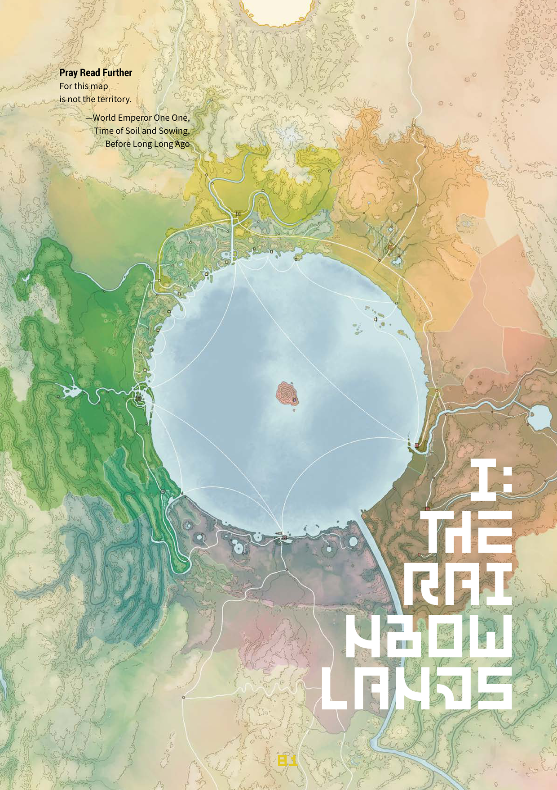](images/hires/page_0081_rainbow_lands_map.png)

<!-- Begin: Our_Golden_Age_04_Blue_Land_82-105 -->

### BLUE LAND

_"Dead gods, soarstones, living rains, and endless liberty."_ —Belico Chaparral, reintegration prophet

It seems the Blue Land was where the Dream came alive, a place of creativity and innovation, where the [illegible] adapted the best of Heaven to the merest of the Humans.

Sadly the old histories were corrupted by the Incident (War?) and current theories on what this meant are in disagreement. Was it a holy pleasure preserve? A radical edenoforming zone? A labor designation for lobogods?

Some modern authorities, such as the High Realist of the Svat of Hexad Foreign Affairs, suggest that Blue is just a geographical expression, a borderland between the oldtech might of the Green and the mystical fantascience of the Purple.

As it is, the Sacred Reintegration Protocols (SRP) divide the traditional lower Blue among the externally administered UCC, CUC, SEZ, and various subsidiary polities—viz. Azula, Indigo West, Mur and UVS. The upper Blue is maintained as the Designation, an independent monitored territory for surviving Bluelanders.

Though popular imagination still holds this to be a fallen land, roving with chimerical horrors suitable only for disaster tourism, the SRP has made it one of the most dynamic region of the Rainbowlands, with scavenging conglomerates and renewtech startups transforming human possibilities in ways unthinkable for generations. If you want to get a head, this is the place to be!

**Climate**

The great Halt Blank (Alto Blanco in the local patois) to the north caps the realm in ice and air so thin unassisted human lungs must shrivel. The deep-carving rivers ensure winter's chill is ever but a hike away.

The low-lying valleys are drenched year-long, swathed in fogs and cloudbursts from the ageless rainmakers humidifying the world as the Builders intended. Occasionally, aerolith towers or fossils of the Blue God crumble, unleashing landslides, floods, and miasmas.

**Population**

reintegration territories: ~1.5 million, designation territories: ~0.2–1.2 million

**Groups**

new bluelanders 28%, old bluelanders 23%, dis-integrated laborers 17%, greenlanders 13%, free purplelanders 9%, purplelanders 6%, others 4%.

**Languages**

Canopic (official), Blaunestalk (suppressed), RD Cant (unofficial), Neo-Azulic (trade interlanguage), Perimse (river traders), Free Pura (unclear).

**Capital**

Official: pending reconstruction. Practical: Special Economic Zone has been designated a New Model City and will feature amenities unheard of, such as hot and cold running plumbing, free indoor sunlight lamps, and edible mycelial wall panelling. It is currently 6.2% finished and funding is being secured!

**Government**

Polycondominium concession zones. Radically overlapping competing administrations use market signals and the Invisible Hand ideology to maximize uplift returns. The Designation is probably an autarkic subsistence-level zone of human disaster settlement.

**Ideologies**

Cogflower: regrowth (supported), Cathedral: innovator (free), Blue God: cave horror (suppressed), Free Industrialism: honorary (imported).

**Economy**

"But then the [illegible] went False and embraced the Error and the War followed. Devastation," mutters the Econotabulator, mad in its oversight bunker. Thus, the modern Blue Land economy is left to its own devices.

**Resources**

bacterial cultures, bio-autogenerators, dairy, lamarckian modulators, godsflesh, aerolith structures, living bone.

**Means of Production**

Until reintegration is complete, private enterprise is encouraged. Bluelander ownership is discouraged for obvious security reasons.

**Material Conditions**

Official: each registered laborer is entitled to a personalized living dormisac and 10 cash per week. Effective: black market research suggests reliable laborers uncorrupted by the various error plagues command 28 to 35 cash per week.

_Source: Seventh Eye Hexad [collective work], RLD Friends of Industry Bulletin, Soil Sunflower IX_

[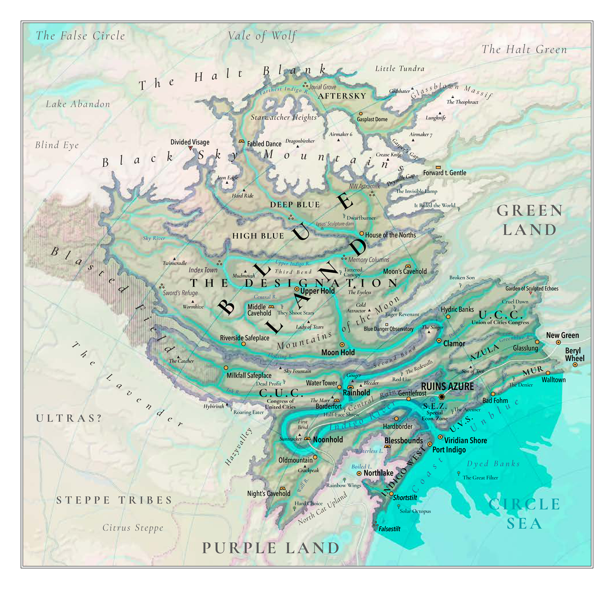](images/hires/page_0084_blue_land_map.png)

**Ambient, Valley**

Each deep valley is like a land all its own, kept apart from its neighbors by high mountains, the underways blocked by the sprouting corpses of the [redacted] false god. Yet, the rainmakers and airmakers ensure the climates are surprisingly similar, seemingly better suited to squamous, crawling, slick-skinned things than to humans. Please don't forget your anti-fungal ointments.

| d6 | Winter | Spring | Summer | Autumn |
|---:|:---|:---|:---|:---|
| 1–3 | dripping fog, slick stones, tongues of shadow | clinging mists, glittering greenery, chill shadows | pungent, gnawing, sticky, trickly, oozing fog | dry days, crisp nights, polychrome vegetation |
| 4–5 | wet snow, nuzzling mud, sprouting icicles | scattered suns, cool winds blow away ghosts | clear skies and glittering archaeomagical debris | blue days, bright mushrooms, light nights |
| 6 | toxic snow, orange bright, blue glaze molds | crumbling aerolith gravel, curtains of rain, butterflies | turbid mud flows, brown waters, torn herbiage | miasmatic films cling to tree and tower, glowing |

**Ambient, Highland**

The Highlands soar above the soil, rich in aerolith, riddled by dead god-matter.

| d6 | Winter | Spring | Summer | Autumn |
|---:|:---|:---|:---|:---|
| 1–3 | collapsed air, daytime stars, indigo skies | rarefied, winds, clear plankton blooms | scorching ultraviolet days, sunscreen essential | thin air, supplementary oxygen advised |
| 4–5 | churning, sucking, rushing aerolith, sudden gusts | clear sky thunderstorms, drifting ice clouds | soup-thick cloud, booming air plankton, dead voices | flying snow, sun dogs, sparkling delights |
| 6 | blue skies, frost fogs, ice geysers, rising berg-bris | geld mists, rainbursts, gasping dead god-matter | howling ice storm, sudden silence, snowbow | whiteout, thick-drifting snows, decaying god-dust |

**Events**

In these ill-favored lands, keep one hand on your wallet and the other on your safekeeper.

| d6 | 1–3 Expected | 4–5 Surprising | 6 Error |
|---:|:---|:---|:---|
| 1 | Heavy rain, terrible visibility, and water shadows (L1, most) prowling about. It'll pass in a few days. | Waterlogged, dead soil and rock collapse. Road washed out, aerolith struts suspended in mid air. | Strange eruption leaves a devastated terrain of wriggling holes, dying statues and/or flesh. Terratoonic! |
| 2 | Clerical errors compound and you must be held for a few days. It's not a quarantine. €10 to €40 will clear that matter up. | Nat, unsightly, and possibly psychedelic fungal infection. 3 weeks with the little "red runner" pills should fix that. | A twitching mycelial mass erupts in tentacles and livingstone bubbles. A godburst (L11, erratic). Leave this to the cleaners (L4, efficient). |
| 3 | Botherpickers (L2, sporebrained) scavenging fools after nightfall. | Wizard cultists (L3, ragged) attack nearby facilities. Prices spike fivefold. | Noble neo-fauna (L2d6) reclaim the environment for the ecosphere. |
| 4 | Stochastic peacemaker (L4, just) roadblock charges €5 per creature and vehicle. Are they just bandits? | Broken peacemaker golem (L6, strong), its brain stolen. Supplies worth €75 remain. Nobody will know. | Once-humans (L2, anthropophages) gone to biological seed. Beware their heat lances and plasma lances. |
| 5 | Traditional locals (L1, friendly) offering themselves for a better life outside this hell lovely place. | Toxic drifts ... or hallucinations? The sky sparkles with electric snow. It'll pass on its own in 1d6 days. | God fog contaminates the area. Strange visions and emptiness assail you. Nose filter recommended. |
| 6 | Local waters poisoned. Perhaps by the oldsettler cultists (L2, shade-shifting)? They'll give you 2 regular runes, 2 blood runes, 3 strange visions, (4) cheese brain, (5) lockmind, (6) enlightenment and a permanent +1 to aura. | Strange detour to a settlement from Long Ago. They have no truck with Dead Gods or peacemakers. That means things might be ghost helmets in their ancestral pod shrine. Spark? Spend €1d6 x 100 to learn a random power of void and deep time. | Stalwart inquisition civilians (L5, authorized) out: (1) farming taxes, (2) carrying trophies, (3) harrying wizard cultists, (4) burning out an infestation, (5) building a personality rebuilder, (6) helping an exiled landholder reclaim their property. |

**Travel**

The sky-thrusting mountains, rainmakers, gully-rivers, and fungal tunnels of the Blue Land are a menace to the casual traveler. Roads are in poor repair, holes are decayed, and security is precarious at best.

| Type | Status | Price |
|:---|:---|---:|
| Portal | A narrow week-walk thread links the Ruins Azure to Red End and Safranj. | official [€200] |
| Right Road | A week from the Ruins Azure to Metropolis (Emerald City) or the Violet City by armored bus. Soylent pink and hydration fluid are included. | [€30] |
| Coasthugger | A week to the Violet City or Metropolis by registered peacemaker vessel (bank). Local law usually by the same route (berth), but they're infested with cultures and take two weeks. | bunk / berth [€15 or €5] |
| Air Lane | The skies are thick with archaeomagical debris and closed to private travelers. Peacemakers flag people in need of cash offer interior flapper services. Flights to neighboring lands cost double. | [€200] |
| Local (River) | Heavily armored diesel golem barges chug the Indigo River and its tributaries. | rough [€5–30] |
| Local (Off-channel) | Local porters are unreliable, as likely to be anthropophages as not. Automules are a better buy. Peacemaker defense golems (L4, bonded) make expensive porters, but worth it. | strange [€15–100] |

#### AZURE COMMERCIAL REINTEGRATION PARKS

_"Everything and everyone is for sale! It's an amazing opportunity!"_ —Patchick Bel-Bel Ressorum-3, reintegration consultant, former peacemaker

The Blue Land is no peacemaker shopping destination like Safranj, but it has a quaint, rural charm. Visitors should not display large quantities of cash in the streets, as they may be set upon by packs of feral post-humans who imagine that money would improve their class. Of course, it would not, but this is of little solace to the mugged tourist.

Due to poor trade links, Blue Land goods purchased abroad sell for 2d6 times their usual price. The same poor logistics mean that foreign products cost twice as much as in other lands.

**The licensed reintegrator:**

1. snake head grafted onto an animatronic dummy with a vocoder speaker;
2. electric lucky cat with eyes that bore into you;
3. jolly cat friend with dead eyes and a critic smile;
4. shifty wagebound with ill-lifting skin;
5. jittery lime nomad with metallic arachnid pets;
6. three robed figures with identical ceramic masks.

**This Commercial Reintegration Park**

| d6 | Reintegration Park | Reintegrator Mien | Specialty | Product Quirk |
|---:|:---|:---|:---|:---|
| 1 | Resources & Resources | grasp, grippy, handsy | bacterial biomachines | overheats when excited |
| 2 | Free People Options | polished, bony, silvery | animated dairy products | spreads like mold ... uh ... it's mold? |
| 3 | Dairy Free Tech | mild, moist, moldy | lamarckian editors | adapts to better do its job |
| 4 | Dead God Materials | dry, delighted, dark | detritolith extracts | technology decays near it |
| 5 | Hydras and Hitches | fleshy, roiling, gassy | living fossils | randomly animates dead insects |
| 6 | Aerolith Extractions | mechanical, technical | aerolith microstructures | prone to levitating |

**Fully Vetted Nontoxic Comestables**

| d6 | Item | Notes | Cost |
|---:|:---|:---|---:|
| 1 | Scavvie Skewers | Swamp meats and tubers grilled on an engine block. Boost immunity, induce blue visions. | €2 |
| 2 | Odsettler Oathmeal | Porridge with pickled fruits, sealed with an oath to the unnamed god. Said to fortify willpower if one stays silent until the next dawn. | €3 |
| 3 | Peacemaker Pie | Military rations, mountain herbs, starchewed, and mineral spice. Boosts endurance. Overconsumption causes metallic warts. | €4 |
| 4 | Sacred Fondue | Bioluminescent cheese and thinking fungi. Improves night vision, grants unsettling dreams. | €10 |
| 5 | Aerolith Ambrosia | Also called "sky honey." Traded by the eusocial bee-human colonies from their protected aerolith islands. Enhance alertness. May triggers a fear of the dark. | €70 |
| 6 | Detritolite Delicacies | Preserved oldtech edibles harvested from the scrapstone cannery deposits. May cause toxicosis if prepared by an unskilled chef. Said to give unspecified powers and status. | €350 |

**Weapons Against the Blue God**

| d6 | Weapon | Notes | Cost |
|---:|:---|:---|---:|
| 1 | Fishing Spear | It floats. Roped, so you won't lose it. Short, 1d6+1, 1 st. | €5 |
| 2 | Ten Foot Pole | Heirloom with bone from ten ancestors' feet. Helps on marshy ground. Long, 1d4, 1 st. | €10 |
| 3 | Chitin Knife | Grown from the Blue God's fungal residue, the blade has antibiotic properties. Can be concealed in a body without causing infection. Close, 1d4+1, 5 sp. | €20 |
| 4 | Aerolith Bolter | The aerolith stock lets it float. Good for swamps. Long, 1d10, re 10, 2 st. | €100 |
| 5 | "Bili" Truncheon | Peacemaker microfission translator. Spend 1 life to deal an +1d6 dmg. Close, 1d6, 1 st. | €250 |
| 6 | Blue God Blaster | Unholy two-handed burst weapon cast from the metal sinews of the Dead God itself. Close, 4d8 necrotic, re 7, 1 st. | €1k |

**Reintegrated Blue Land Clothing**

| d6 | Clothing | Notes | Cost |
|---:|:---|:---|---:|
| 1 | Crocodile Shoes | Arachnic chunky, injection-molded, living shoes. Bonus vs fungal & bacterial infections. 1 st. | €5 |
| 2 | Blue Leather Armor | Squamous fabrics feed oxygen through skin. Dive +30 minutes. Armor +2, swimming, 1 st. | €50 |
| 3 | Cloak of Scales | Swim like a manta ray. Take half damage from coherent light and fire attacks. 1 st. | €100 |
| 4 | Kawada Shield | Hard torc of translucent god-stuff no-there-ness. Armor +1, ward +1, 5 sp. | €250 |
| 5 | Godflake Reliquary | A cell of the Once Living God's skin in an amulet. Ward +2, 1 sp. | €400 |
| 6 | Peacemaker | Even outdated golem armor will overawe the Fair Bluelanders. 2 life, +2 strength. | €2k |
|  | Archaic | Armor +7, heavy, powered & environmental, cumbersome, 3 st. |  |

**Blue Land Mobility**

| d6 | Mobility | Notes | Cost |
|---:|:---|:---|---:|
| 1 | Pea Felucca | Shaped from a modified gramble vine seed pod, this basic vessel is used by the poorer sort of unreformed Bluelander to sail the manky slow rivers. L1, carry 2, light, shallow. | €50 |
| 2 | Wall Crab | Arachnic-derived bio-golem. The spider's brain is replaced with a control fungus. Quite safe. Great in the mountains. L5, carry 4, climbing. | €500 |
| 3 | Hydroglisseur | Open watercraft with a biomechanical outboard propeller. L3, carry 4, shallow draft. | €650 |
| 4 | Flapper Mantoid | Sentient servantebeast with aerolithic bones. Not strictly legal for private use, but if you can afford a flapper, you can afford the fines. L3, carry 2, flying. | €3.5k |

**Sundry Rustset Souvenirs**

| d12 | Souvenir | Notes | Cost |
|---:|:---|:---|---:|
| 1 | Spore Ape Plushie | Half mushroom, half monkey, all cute! Popular with kids. 1 st. | €4 |
| 2 | Blasted Soul Glass | Preserves a shard of the Dead God's soul. Makes a great conversation starter. 1 st. | €7 |
| 3 | Undead Cheese | Can never go bad. Feed it milk to see it grow. Restricted in public. Dubiously edible, 5 sp. | €10 |
| 4 | Fossilized Curds | Proof the dairy industry in the Blue Land is older than civilization itself. 100% authentic! | €12 |
| 5 | Mini Rainmaker | Humidifier shaped like a Builder's mountain. Great for sacrifices and moisturization. 1 st. | €15 |
| 6 | Aerolith Belt Buckle | Carved by local artisans, it makes you feel 10% lighter. Ward +1, 9 sp. | €20 |
| 7 | Waterfinder Bone | Light-metal machine human bone woven with runes to find water and point north. 1 st. | €25 |
| 8 | Gas Generator | Give the little biomachines food and an hour. Stores opaque gas to fill a large room. 1 st. | €35 |
| 9 | Permiatumlet | "Replica! Novelty item only!" Not meant to dupe or deceive peacemaker officials! 5 sp. | €50 |
| 10 | Artificial Watertick | Extracts and store life. Holds up to 1d6+1 level life. 1 st. | €60 |
| 11 | Hydrated Fleshbag | Regrow any missing part! Even a head! Mutagenic. Restricted due to hydra toxins. 2 st. | €300 |
| 12 | Singing Dreamskull | Definitely not from one of the Dead God's many drones. Dream into it to draw strength when accessing the noösphere or interacting with daemons. +1 endurance, +2 ward. 1 st. | €1.2k |

#### BLUE POWER GROUPS

_"Warning! The region is under an open-ended reintegration interdiction. Visitors without official peacemaker authorization will be forcibly disembodied."_ —City Azure Ordinator, Diktat 772g

Countless peace memorials celebrate the recent and very permanent and eternal liberation of the Blue Land. Under the Sacred Reintegration Protocols all factions are outlawed, therefore this section refers to power groups.

There are three basic types of power group: the external administrations with their concession zones, the internal subsidiary groups affiliated with the various administrations, and the independent power groups tolerated in the Designation.

The Ruins Azure area is a special case, as it is run independently of the various power groups by the City Azure Ordinator, the local administrative demigod brought over to reintegrate the area, and its three special economic zones, which promise a socio-cultural efflorescence of the area. The fourth special economic zone mentioned in older documents is erroneous. There is no such zone. There is no alienation zone.

**Peacemaker Companies**

Two major peacemaker companies, sent from the cities Emerald and Violet and headed by appointed governors, both claim to be rebuilding the Blue Land with their apparatuses, armies and coteries of capitalist collaborators. Secondary peacemaker companies are uplifting smaller sections of the Blue Land on concession.

- **Union of Cities Congress Peacemaker Companies (UCCPC).** Originally an Emerald City outfit, the UCCPC produces glossy reports on the progress and growth of its zones. For 17 years the ratio of pink synthent per person has grown by an average of 20% per annum, meaning that today every UCCPC resident is eligible for roughly 20,000 calories of high-joy nutritional fuel per day. All the stumbling malnourished gaunts (L0, lamentable) are actors hailing the good name of the UCCPC.

- **The liberated Bluelanders call the UCCPC "Coins".**

- **Akila / Vilgare VI.** The latest governor-appointee is due any month now. By then the local secretary of accounts, Sol Perceiver, needs vaults as full as his ledgers. Good jobs are available for tax farmers who will go the extra mile for their 30% commission.

- **Congress of United Cities Peacemaker Companies (CUCPC).** The Violet City derived CUCPC produces elegant, minimalist poetry on the purification and development of its cantons. Its residents have grown 17% mentally purer each year, leaving them 99.9% enlightened. Any sad faces are recent illegals.

   The liberated Bluelanders call the CUCPC "Cups".

- **Sad Molakyo and Skullwaygyles.** The current governor is a bloated waiting with a post-mortal cat lord. Skullwaygyles needs a new body and a better pet. That may explain the covert cat pride investigating the cantons to see if the purifications poems are correct ... and if there is a large crop of healthy new pets available for the Violet City and the local administration. Local despots ... er ... officers will pay top cash card for mind-scrubbers who can help them quickly rip a new crop of pets.

_In truth, neither the Eastern City nor the Western City rules, while the old local capital Azure is a ruin surrounded by a barely administered hinterland._

—Anonymous, Discouraged Reporting Example

**Free Residents, Ruinsdwellers**

The post-Blue melange of locals and arrivals drawn to the Ruins Azure, with its special economic zones. An anomic, post-communal, swirling, vibrant, individualistic mob focused on one thing alone: wealth. From scavengers to rebuilders, wildcat bankers to post-legal biomancers, every kind of hare-brained scheme can blossom on the wealth promised by the fossil remnants of the Dead God.

One who enjoys the refinement and proprieties of a civilized social hierarchy would do well to avoid the free residents. A more disturbingly vulgar and materialistic society can hardly be found anywhere else in the Rainbowlands. Not even in that hive of the accountant monks, the Emerald City.

- _Piet' Gagosi._ Scrap merchant, fine fellow and not at all a mobster. Got a lead from a baked-out sporey. A great crystal circumpensulum, a heretical machine the death wizards used to ... well, he's not sure what, but he is sure of one thing: if even a tenth of what's doctor extracted from the sporey is true, there's a hundred million cash worth of crystal just waiting under a zombie giant's corpse up the river, in the Heart of Blueness. Piet can provide a diesel steamer and a crew of savories, but a dab hand with oldtech ruins would come in handy.

**Stilters, the Unblues, the Subsidiaries**

Assembled from a hodge-podge of refugee clans, antitheist rebels, and local marginal fishfolk, the stilters built their steads up and away from the shores of the Blue Land, embracing the salt air that kept the divine mycelium of the Blue God at bay.

Today they call themselves all hues but blue, from viridian to periwinkle, lavender to seafoam.

- **Kodo-Cors.** The Lady Protector of the Sub-Lime Stilters has cobbled together an alliance of islander merchants and Safron pirates (or is it the other way around?), to unify the Sub-Lime coast as a liberal, semi-independent Decapolitan mandate polis. All she needs now is two of the following:

1. Embarrass a large peacemaker faction.
2. Gain a major faction's support for her bid for local unification.
3. Wrest a pre-Divine territorial claim from the fungal hands of a dead Blue baron, preferably property-dead.
4. An outrageous atrocity proving the free residents are unreliable.
5. A rival pirate lord's head as proof of her efficacy. Without brain or jewel is best.
6. Some well-argued propaganda faction that mobilizes popular support in one big city. A nice operetta or novella?

**Drillistes, the Neotroglodytes**

The Dead God's mycelial mega-body left the soil and stone of the Blue Land perforated like a sponge, full of holes and aerolith struts. In the aftermath of the unmentioned war a number of marginal clans, destitute refugee cults, unbending wizard mystics, and failed scavengers have made a living in this holey terrain.

Though the Blue God is no more, their diet of altered fungus and modified lichen has made them strange and unusual. Or perhaps it is the afterglow of the false god's creative energies. Regardless, the peacemakers still register them as human for taxation purposes.

**How Strange They Are Become**

| d6 | Trait |
|---:|:---|
| 1 | Now they are hexapods, humans with six limbs all the better to skitter in the holey places. |
| 2 | They glow, bioluminescent like their fungal prey. |
| 3 | Their innards now burn lignite and anthracite and other minerals to fuel their human fires. |
| 4 | They reproduce by budding or fission, like herbs. |
| 5 | They are boneless, their bodies a symbiosis of animal, plant, and fungus. As for their minds ... |
| 6 | Smooth and plastic, produced to four standard types by a biomechanical mother who they worship as a local false deity. |

- _Yudma Yumna._ A small, stunted human, who melts when exposed to the sunlight, has visions. Visions of a more perfect, incorruptible future. Yudma Yumna knows these visions are something new. They come through a hole in spacetime left by the death of the false god. Yudma Yumna needs a big, strong, healthy new body. One with a brave heart and an iron mind into which they can put themselves to gain the rainbow-deluded multitudes of this false world.

Oh, you have a body for Yudama? Yudma can pay with secrets, yes. Underground secrets, a map to a demon machine dreaming of a human to serve.

**Swamp Settlers, the View Fromes**

Even at the heights of the mushroom god's craze, plenty of people didn't subscribe to the promised heaven on earth. Some fled to their salty stiltis. Others just stayed where they had always been. Overlooked. Scraggly, amphibious. Their way of life may be unglamorous, but it has persisted unchanged for millennia. At least that is what their re-enactment troopes argue.

Though they call themselves the View Fromes, the "Old Cheeses" in their dialect, these marginal communities are as dislocated as any in the Blue Lands. Scavengers with an insular culture, they keep their patchwork customs as close as their coins.

- _Penchart Trist._ A heroic frome, who has wandered far along the watery ways, is now in ill-fated love with the offspring of their floating village's Big Human. But this cannot be. The offspring is fated to inherit the Big Human's personality when its mortal body is liquefied. Penchart Trist will sell out their floating village and its old-fashioned foodmaker for help escaping with the offspring.

Why doesn't the offspring have a name yet? They are only named once it is proven that they will not die in the ritual to absorb and be absorbed by the Big Human's personality.

**Wizard Cultists, the Fun Gales**

No matter what a divinely-sanctioned purification operation does, no matter how much phylake support it has, some vermin get through.

The wizard cultists, or more properly cultivators, secretly grow fragments of the Blue God's sacred mycelium and use it to expand and alter their minds, enter into psychic communion with one another, and bridge the eons between the first and the last.

Officially, none remain in the Blue Land.

- _Nowa Pelikayu._ The ordained inquisitor for heresies and corruptions in District Six is overworked. Of course, a sole inquisitor could not cover such a vast area alone! So, there is an open season for her mycelia and symbiote-penetrated heads in the district. €50 per fragment of the Blue God delivered to Nowa's tower of purity.

- _Vewqi Busto._ Ordained inquisitor of District Five has hatched a plan to prove that Nowa has been corrupted by the unholy spores. Conveniently, he is well-placed to gain direct access to the taxes and residents of District Six if this were the case. Now to find some useful stooges to plant this mildly very illegal incriminating evidence ...

- _Jarcu 9-Tancrei._ A memory of a memory remained smeared like paste inside Jarcu 8-Tancrei's suit after the warning against the Dead God, and the sacred mycelium, the fragments of that dead entity, rebuilt Jarcu anew. Jarcu's memory is shattered and they are in search of lost time, of foods long gone, of village well decayed, to reawaken that dreaded message that would save at least some of humanity. Some terrible foreboding of a divine return, a new flood to reset the world to a more primal era, or more balanced in the eyes of the [Un]Lords. Oh, also, Jarcu definitely is an illegal wizard cultivator.

**Deep Bluelanders, the Indigotes**

In the remotest reaches of the Blue Lands are polities and villages still dwelling in their archaic isolation, following the odd customs dictated by their generative vids and the garbled version of the Garden Path preserved by their visionslords. Many have not been visited by civilized folks in generations. What wealthy or arrogant fool might travel there?

1. Mingo of the Velvet Mingos is a master folklorist, looking for proof of her theories of a universal narrative heritage.
2. Veller Belpuzzo is a big game hunter who has heard of a village that breeds roc-birds. Sounds promising.
3. Nuric "Ie Furic" has a strange black bone that sings it dreams from a village in the Deep Blue. Does it?
4. Abyamo Dempoe is a biomancer looking for fresh strains of baseline humans to perfect his cure for Usha's Cancer Bomb, which has affected so many members of his clan-city.
5. The fashionable vice-minister Dey-Tey boasted they would attend the next catwalk of vice-ministers in the oldest authentic dress of the Blue Lands. So now their agent must travel to this rear-end of the world.
6. There's a mountain, rumored to be the mother of all mountains, in the heights above a remote barony trapped in an eternal winter. Pavis dei Scut, famed mountaineer, wants to be the first to scale it.

**RUINS AZURE**

**AZURE SEOZ**

_"Whence does this mycelium rot?"_ —Ill-Nano, _Rebellion of Dreams_

**There Is No History**

The Azure City has been scrubbed from the graven tablets of history to protect the minds of humans and keep their sleep untroubled. Blue-code ministry clearance is required to access the leaden archives for pre-zone events. Repeated attempts to access pre-zone histories may result in express re-education.

The Ruins Azure are ~~four~~ three islands of civilization protected by god field generators from the protean, decaying, cenotepocked, sinking ruinland that was Azure City in ~~happier~~ erroneous times, before the Rotting God assimilated its people in rebellion against good intentioned heaven.

Aerolithic skeletons support the vertical zones of the Special Economic Opportunity Zone (SEOZ); e-levitating islands of bustling urbanity, flowering like shanty layer cakes, encrust the grand oldtech megastructures that rivaled mountains for majesty before the Vein Vine corrupted them. Elevators, cables, and bridges connect the islands, both the energetic oldtech type and the rickety chain-and-gear affairs of less-blessed times. Avoid the stairs and ducts; they are for paupers and natives.

Today, the Azure SEOZ is open for business once more, with four special economic zones available for industrial redevelopment. Consult your local economic efflorescence council to find out how you can benefit!

**The** ~~**Four**~~ **Three Zones**

Elevators, cableways, rope bridges and gondoliers between zones cost €1d3 (1 hour). Plan 1d6 quarters to travel from one locale to another within a zone, and at least an hour to enjoy each visit.

_**Redacted Zone.**_

This zone is off limits. Also it does not exist. If you have seen this zone, please visit the nearest peace and reintegration facility to restore your mental equilibrium. Travelers say the laws of gravity and entropy themselves are perverted in this zone.

_**Fountain Zone.**_

An efflorescence of bioarchitecture grown about the exposed, half-living endoskeleton of a rainmaker. Water gushes perpetually from a hundred fountains and springs, providing for the entire SEOZ.

_**Mountain Zone.**_

A great aerolith blade of terraces, old labyrinth palaces, anchorstones, new growths, and modern facilities. Completely secure from attack by the marble and mycelium footsoldiers of the Dead God, this is where all the powerful factions site their central temples and quarters.

_**Babylon Zone.**_

Once, the decadent pleasure beach of the devolved Bluelander telepath nobles. This was destroyed down to the last root, leaving a swiss-cheese ruderal zone. Today, Babylon Zone offers wonderful growth opportunities! Its swiftly growing reasonably-priced housing pool and functioning nutrient slurry system attracts a ready body of affordable labor for any investor planning a salvaging, reclamation, reindustrialization, or reprocessing enterprise. Please visit the central economic temple (Palm division) for credits, tax breaks, and other blue-code opportunities.

**Ambient**

| d6 | Ruinland Night | Zone Dawn | Zone Day | Ruinland Dusk |
|---:|:---|:---|:---|:---|
| 1-3 | gurgling creeks, bogs, wailing frogs, mist | dripping water, flowers, creepers, rising stones | showers, light, embracing trees, flapping birds | eroding landfill, groping darkness, swamp lights |
| 4-5 | creaking hinges, crawling waters, cruel stars, refuse birds | pink haze, slime, cackling birds, whining winches | hot, ballooning plants, localized rainstorm, huddling mice | red haze, blue gloom, looming detritus, click-clack tremors |
| 6 | ruined rusting skeletons | green growing glow, great mushrooms, soft singing | thunder, huddling ghosts | pale blue glow, radiation, sinking hulks |

**Events**

| d6 | 1-3 Expected | 4-5 Surprising | 6 Error |
|---:|:---|:---|:---|
| 1 | **Mindburned bluelanders** (L0, useful). Once, they were mind-linked aristocrats, now they are ka-zombies, operated by an Orange concession. | **Spore apes** (L2, once-human), gone to biological seed. Popular game animal? Anthropophage? Beware— may use heat lances or plasma knives. | **Hydra False Divine** (L9, lamarckian) driven by the mad mycelial clusters of the dead god to absorb humans into the biomachine of its cutting flesh. |
| 2 | **Duct rats** (L1, shaggy) grown large as 2 cats and telepathic on the Dead God's mycelial flesh. Are those thumbs? | **Cult dwarfers** (L2, mutationeers). Followers of the Ill Nano, proscribed elsewhere, but plentiful here. | **Oldtechnician heretics** (L3, rogues), heedless of the Inquisition, poking the forbidden machinery. Woe. Woe. |
| 3 | **Ingenué barbarians** (L2, indigote) from the far hinterland with unbelievable tales of waking géants. Laugh at their: (1) leather breeches, (2) heavy swords, (3) moustaches, (4) four ears, (5) brow ridges, (6) lupine mouths. | Edible mold drip. Some vein ducts still drip with the nectar of the Dead God. The last time the peacemakers cracked down on this cheap food, the riots [redacted] the fourth zone. 10% chance it is mutagenic. | Fungal bloom. It looks harmless. The spores promise liberation. Is this the colorless lotus? Inhale to: (1) die, (2) levitate, (3) expand your mind [+1 thought], (4) see more colors, (5) sleep better, (6) hear the Dead God again. |
| 4 | **Free residents** (L0, shabby). Watch your pockets. These are: (1) scavengers, (2) economic boosters, (3) crypt evangelists, (4) root-vendors, (5) aerolith suckers, (6) maintainers. | **Councilor coven** (L1, preening) in business gowns, like a flock of parakeets, come from another city to find facts, share largesse, and author papers of white and polychrome. | **Widra's disciples** (L3, naianthropes) out evangelizing for the Little Water God in the rainmaker. Promising hearts gushing fresh and clean. Portending doom and opportunity. |
| 5 | **Peacemaker patrol** (L1, political). Peace, understanding, protocol, judgment and police all in one. These are shiny-faced or grimly cynical. | **Peacemaker golem** (L5, metal) full of dread. Has it thoughts within its head? Just pass it there. Have no care. Do not give it a heart or a brain. | **Fire squad** (L6, peaceful) come to: (1) tax, (2) take trophies, (3) harry cultists, (4) burn an infestation, (5) re-mind a traitor, (6) help an exiled landholder. |
| 6 | **Licensed scavengers** (L2, greedy): (1) prospecting for fossil machines, (2) stripping Dead God temples, (3) collecting local mummies, (4) chasing a traitor, (5) press-ganging for their factory co-op, (6) hunting spore ape. | **Adventure tourists** (L1d3, like you) full of naive hopes and dreams: (1) travel journalists, (2) extreme hunters, (3) adrenaline sportshumans, (4) slum divers, (5) ideological enthusiasts, (6) con artists. | **Errorfauna** (L1d4-1, new) spawned of a corrupted mother machine: (1) beautiful teratorns, (2) hungry tyrannornes, (3) blue-footed boobies, (4) cave penguins, (5) flying goats, (6) carnivorous giant squirrels. |

**Opportune Accommodations**

| d6 | Accommodation | Notes | €/week |
|---:|:---|:---|---:|
| 1 | Chitin and Fungus | Converted fungal tunnels turned into a quaint B&B. Run by a moiety of re-individuated Unblues. Cheap, clean, and faithful. | €5 |
| 2 | Bleak Citadel Hostel | Oldtech treemaker turned into communal housing in the Blasted Field style. | €10 |
| 3 | Barracks Inn | Spartan but safe motel chain run by the peacemaker corporations. | €20 |
| 4 | Rejenberc Retreat | Eco-lodges high on a defunct rainmaker. Enjoy the semi-living adaptive aerolithic architecture. Experience the breathing mountains! | €30 |
| 5 | Indigo Moorings | Houseboats for mobility with a waterfront view. Please don't swim in the turbid waters, as there have been sightings of **post-human regressives** (L3, protean). | €50 |
| 6 | Skybreaker Lodge | Luxury resort on a chain of aeroliths safely out of reach of the Ruins Azure rabble, just a cable car ride away. Comes with spore filters, blood cleansers, and an all-you-can-eat buffet famed for its game and arthropod selection. | €100 |

_Accommodations also provide ticket dice: €5 = 1, €10 = 2, €25 = 3, €50 = 4, €100 = 5._

_"Dead God bits for sale! Get your Dead God bits here!"_ —Last recorded message, [redacted] Zone

Here now, Human, let us tour the Special Economic Opportunity Zone! We're sure to find some cashmaker!

**Fountain Zone**

Some say an impermeable bowl of stuckforce underpins the Fountain Zone, creating a clear lake in the sky. Others say it is a one-way portal from some cold sweet-water lake beyond the edge of civilization that summons in the waters. Every local unblue will point out there is an undying **rainmaker's head** (L13, screaming) in the bowels of the zone, vomiting water for the humans.

_**The Gone Dollery.**_

An airborne floating district of boat-houses, pond-gardens, and gondolas houses a rich mix of free residents, stilters, view fromes, indigotes, and more exotic immigrants. Famed for its experimental bug-mushroom cuisine. As the guide book says, "the gone dollies can make any old organic taste like ambrosiëwurst." Please avoid the **gone dollie** **salamanders** (L2, ambush), they crave human flesh.

_**Florid Towers.**_

Multistorey livingstone habitation complexes laced with flowering plants, reminding the inhabitants that beauty also matters to their benevolent overlords. A good place to meet a scavenger aristocrat or a peacemaker manager.

_**The Heart of Water.**_

The great arterial fountain, bringing up pure water from the inky deep. The water often brings strange **luminous fish** and **translucent animals** (L1d4-1, oleaginous), hinting at a hidden underlake.

_**The Nayada (L12, stuck).**_

A géant of the forgotten times, turned to marble and steel by a great magic storm, she sits at the dry foot of the Fountain Zone. Throw her a bone and make a wish!

_**Vats of Synthesis.**_

Liquid autofabricators, reactivated by the grace of the Council! Need new flesh? Better wood? Get it here! Avoid back alleys where the **misfabricated** (L2, eaters-of-their-betters) may lurk.

_**Widra's Gardens.**_

This holy vegetable factory provides most of the Blue Land's alf-alfa crop. Its **priest farmers** (L1, green-fingered) are celebrated traditionalists. Many may worship the unregistered Little Water God.

**Mountain Zone**

Please be assured that the **footsoldiers of the Dead God** (L3, fungal mind-hive) no longer exist. Suggesting they still exist or are a threat is punishable under the Spreading of False Visions Act (S-r Lily VII).

_**Central Temple Circle.**_

A fast star brought nearer the bosom of Soil? A ring of shipmetal slicing through the mountain zone and arcing about the humid air. A modern electric mobile pediment proves the peacemakers truly intend to better the Blue Land. The neo-cyclopean temples and barracks apartmentoplexes of the companies may interest architecture buffs, but many visitors will come here for a taste of home in the Savormaker (est. A.F.XII). Be warned: procedurally generated delicacies may provoke stupefaction, somnambulism, sensations, or self-reflection.

_**Copteric Pads.**_

Once landings for the gods' machines, now roosts for modern **flyers** (L1, dainty) and **flappers** (L3, bulky). Famed for the kite races.

_**City Azure Visitor Services Arcology.**_

A hive of bureaucracy, best avoided. Said to house 10,000 **clone managers** (L2, cutting) and even more **clericlones** (L1, prodding). The fortunate visitor should hope never to know.

_**Flapper Farms.**_

Where **domestic flappers** (L3, tasteful) are grown in vitro from ancient biostock. Flapper-petting tours available for children. Please do not get eaten.

_**Grand Consumption Avenue.**_

Shop like you would in the Emerald City or Safranj! Ignore the local merchants grumbling that charity merely props up foreign luxury goods autofac operators.

_**The Inquisitorium.**_

Both the largest orthodox public library and capital court in the Blue Lands! Over ten gigavolumes in its local noösphere. Includes a fun museum where you can see, preserved in no-field pods, the most famous executed traitors of the last few decades, from **Pelixan the Pauper Peddler** (L3, piper) to **Demejo the Dread** (L5, rebel). Gossips say that Demejo's **pet wallaby** (L6, biomachine) is not actually executed, just waiting for its master to revive from the no-field.

_**Nano Nine.**_

The cultic factory of the Ill Nano, home to a de-extinction museum and certainly not a radical neobiological testing facility. Please do not attempt to play with the **experimental fauna** (L1d6+1, antedeluvian).

_**Tenth Tunnel.**_

Mythic home of a living fragment of the Dead God. Fake news, obviously. Do not visit. There are no **false divine hydras** (L9, absorbing) there.

**Babylon Zone**

There is still cut-price repurposed pleasure to be had in the Babylon Zone, from scavenged Long Ago hedonividys to the delights of **subhuman** (L3, rager) trophy hunts.

_**The Digestory.**_

A vast, dreaming dairy product, utterly unrelated to the Dead God, occupies the great bubble crete vessels that once housed divine void fuel. The bacterial demigod takes in all kinds of organic matter and converts it into three important resources: edible slurry, golem juice, and fire bricks.

_**Palm Division.**_

_The_ place to see the neo-neo-mod administralist architectural style in full bloom! From the central economic temple to the grand central clone store.

_**Pleasure Beach.**_

A _laissez-faire_ destination for the fun-lover. As the saying goes, what happens on the beach stays on the beach. Peace is enforced by **golem patrol** (L4, cranky). Do not feed the **waifs** (L2, life-draining).

_**Root Sector.**_

The lowest stratum is kept dry by the dykes and pumps attached to the local god field generators. It is an industrial scale landcoral farming and sculpture area now, growing much of the modular mycopartment housing used to re-people the Blue Lands.

_**Slurry City.**_

An entire food district dedicated to creating novel dishes from the local food slurry!

_**Weeping Goblin Park.**_

An urban cemetery until the Digestory came online. Today, the bodies are gone and it serves as a site for recording period vidys.

_These mycopartments are fresh about. We should sleep well tonight._

**[Redacted] Zone - Alienation Zone**

_"A growing hunger, a many-headed biological machine. Do not approach to take ego-images! It may look slow, but its tether-thralls can grab an unwary human and drag it into the churning flesh!"_ —T'Lawni Qriuc, [Redacted] Zone Tours

This zone is unreachable. This zone is taboo. It is right there, but with an effort and proper practice, you cannot see it. You cannot see it, right? A dark gondola guide will charge you €10 to travel to the [redacted] zone.

_**Ever Rest.**_

The tallest aerolith spire in the zone. Bluelanders who think their relatives are too good for the Digestory bring them here, smoking them with oil fires and burying them in sky-high niches. Some are even revived by the **fungal relifers** (L7, many-handed).

_**Gigaclock.**_

A wealthy oligarch disciple of the Dead God built a ziggurat-sized clock to tell the time for a thousand thousand years, and thus dispel any chance of another Great Forgetting. Her name is now forgotten. **Memory lapins** (L0, thought-stealing) now roam the grand clock.

_**Gravity Fails.**_

The epicenter of the distortion bomb, here up is down and down is up. Some say even time runs backwards, but that is because they have fallen prey to the **slow elves** (L3, hooked) who live in the bomb-tomb.

_**Mechanical Sons.**_

Great golems, corrupted by the Dead God. They now lie reposed, dead dreaming. Do not wake them. Their brains hold valuable jewels, some say (€500), but also crawling **mind-spiders** (L3, clockwork style).

_**Melon Fields.**_

A pleasure garden once famed for the quality of its **joy golems** (L2, tempting). What grows there now? Who could know. **Maggotfolk** (L2, pliable), become soft in their decay, have taken it over.

_The maggot crawls into the sweet melon._

_**New Opportunity Docks.**_

A great automated port was to be the jewel of the Blue Lands' reintegration. Its **skeletal autoloaders** (L5, cargo-hungry) and accursed **central logistics cephalomech** (L15, ever-sorting) still cling to that promise.

_**Paradox Monastery.**_

It has been a long time since a heresy has challenged the accounting logic of the Emerald City. The example made of the paradox monks, who played with false numbers, may have helped. Here, some of those **illogicians** (L2, reality heretics) still pray, making the membrane of reality tenuous—a dangerous place for those playing with strange powers.

_**Predator Pines.**_

A forest of soaring, **skyscraper pines** (L9, tree-géants) has swallowed most of the zone. They suck in mists, giving the old ruin a haunted feel. They also suck vital bodily fluids, given half a chance, so don't fall asleep next to them.

Marvel at the wonderful local **blue fog-flicker squirrels** (L1, gliding).

**The War Against The Many-Headed**

_"They are liars, untrustworthy, soma-drinkers, quacks!"_ —Assessor Pal Waqit, 3rd Reintegration Progress Report [Redacted]

There stood a city, lofty and proud, a god made marble and mycelium. A soaring testament to material destiny unbound.

"Prometeï," hissed the Lords and Unlords.

Shrugged, the distributed mind, skyward-soaring. Quarters unmoored from the weight of Soil rose above the rich yellow waters, glittered in the sun and moons.

"Blue-veined Babiru," rejoiced the blinded humans, turning away from the dignity and duty of the Needle of the World.

"Here we shall have succor and meaning, here we shall be as one," they sang and took into themselves the blue mycelium.

And they had all that and thought it good.

But the shepherds knew this was wrong, this was not the Path, this was no longer humanity. This communal god had to die.

"Gut the hydra to kill its heads," goes the old truth, and now it is writ in glass and frozen fire on the Blasted Field.

There went Widra and Ill Nano, there went the golem garrisons, the mechanical sons, there went the floating fortresses. Round the bend of Soil they swam, braving the stuckforce obstacles of earlier dilemmas.

From the Needle, the rainbow panoply sallied, phylakes and gods together to distract the many-headed Azure.

On the Blasted Field, then called the Indigo Highlands, the Dark Side of the Moon Mountains, they skinned and flensed and butchered Soil to reveal the eating roots. The entrails feeding the grasping god who would let humans abandon their humanity for mere comfort and meaning. The noxious apostate who denied the Builders' plan. The greatest, latest corruptor of Heaven.

With furious righteousness, Widra and Ill Nano bent the laws of reality itself to starve that fungal fiend. Distracted, too late the shared sentience responded, and by then the deed was done. The gods and the good watched for decades as fenced in, hungry, it declined and sank back into a dreaming mushroom mass.

The blinded masses, addicted to their false divinity's chemical purpose, went mad and railed against the gods and the good. Peacemakers assembled and moved to help them rediscover meaning in work, purification in submission.

_House on the Mechanical Sun._

**The God Field Generators**

_buildertech forcefield array, electrimagical henge_

A second-tier meritocrat of the administratum is always available to guide visitors around what is "...certainly the grandest accomplishment of the peacemakers' reintegration project is the perfect and complete reactivation of the god field generators, which were probably originally intended for the exact purpose to which they are currently put—to wit, a great 10-soul-permonth osmotic forcefield that keeps the protean ruin at bay and the, well, bay of the Ruins Azure, excuse me, City Azure Special Economic Opportunity Zone, a viable habitat for human flourishing." (Pericul d'Anterior, Oral History of the [Redacted] Incident, Soil Sunfl. VII)

Other theories on what the god field generators actually do abound, but none are as psychologically soothing and should be avoided by those who would like to sleep at night. For example, the idea that the entire godfield array opening about the Ruins Azure like a great ring of shipmetal and standardstone and cosmic towers is actually the maw of some Long Long Ago earth carver, perhaps the one that in the songs chewed out the River Rushing, why that would suggest the whole city could be eaten in a single gulp if some ill-fated fool were to be so lucky as to reactivate the **carver** (L17, long-sleeping).

**Strange Field Effects**

It is not just the Ruins Azure god field that may put a human off their lunch. Cacodemics have recorded various other fields over the last decades of research.

| d6 | Field | Effects |
|---:|:---|:---|
| 1 | alpha thousand | anxiety, heightened numerical ability, emotional drift |
| 2 | homecalling | voices, travel compulsions, reduced focus, sweat, shivers |
| 3 | null-entropic | decay ceases, constipation, tiredness, difficulty moving |
| 4 | numbgrey | emotional and motivational suppression, quietude |
| 5 | omega ecstatic | increased joy, reduced thought, accelerated wear and tear |
| 6 | zu-signal | visions, constructive compulsions, biological withering, chill |

This is not to mention the various radiant and decay fields emitted by collapsing buildertech and oldtech, which may cause (roll d12): (1) loss of teeth, (2) loss of appetite, (3) blindness, (4) new mouths, (5) deafness, (6) new senses, (7) intestinal bleeding, (8) growth of new limbs, (9) loss of hair, (10) thorn growths, (11) spiritual drift, and even (12) visions of a brighter future.

_The God Field Generators, Ruins Azure._

**SOMA'S HIGH HOLLOW PLACE**

_Io, big cheese! Smell! Bless! Fruit!_ —traditional cooked offering chant, vulgar translation

The peak of Mount Babiru, known also as The Eyeless, is now officially designated the Outdoor Museum of the Death of False Gods and the Triumph of Proper Reason and Etiquette.

The mouth of Bliss Lord Soma, the last part of that false Blue God's smashed visage, remains upon the mount called Babiru. There its former slaves come to spit upon its memory, certainly not to offer prayer and growth.

**Blue God, also Bliss Lord Soma**

In the Dream Text their mineral is sapphire, their animal is salamander, and their vegetable is mold.

"They that brings the Illusion that replaces meaning. They that brings the pleasure that consumes time. They that consoles the fallen flesh. But also, the eater of minds, the corruptor of ambitions, and the thief of time."

Warning. Praise of Blue Soma is restricted until the confusion with the Blue God situation is resolved.

Normal pleasure worship will resume soon.

**Prayers to Bliss Lord Soma**

How could a dead god hear one's prayers? Yet, though abjured, dead, smashed ... some spark may hear.

Once per session or so, when the toil of order and machine might overwhelm you, when you would sink back into Soil and Green, murmur Soma's solace to make the mind-eater pass by:

_"There is no I, there is no mind, there is no drive; there is_
_only the pebble on the wave-tossed shore ..."_

**Roll d20 + Charisma - Aura**

| Roll | Result |
|---:|:---|
| 1 or less | A crawling horror enters your mind through the jeweled back door. A burden comes to steal a memory. |
| 2-19 | Hold your rolled number hot in your heart. When you see it again, steal it and reassign it as you wish! |
| 20 or more | A numinous presence mushrooms within you. It cloaks your mind from sight, undoes a burden, or halves your suffering. |

**BLUE SAFARI**

_"To truly understand this rotten world, you must venture into the heart of inkiness,"_ —Ter Nowypodt, ague-addled belletriste and so-called adventurer

**Neofauna Big Five**

In any Blueland settlement, one will find animals adapted to the aerolith-rich environment, from the sky-boned teratorn with its four-meter wingspan to the humble air-swimming rat-penguin, also called the vermin-bane by delighted locals—and flying organic trash receptacle by less-enlightened outsiders.

But one goes on safari in search of greater beasts.

**Megatorn** (L6, noble airbeast). Greatest of the children of the Tower of Birds, it fills its gullets with aerolith pebbles to achieve natural levitation. This fifteen-meter avian is actually a filter feeder, subsisting on air jellies and other sky plankton.

**Great White Ape** (L9, savage warrior). The white cetacean of big game hunters, with aerolith bones, it terrorizes the remote sky jungles. These solitary simians reach the size of a dozen men, with the strength of twenty. They hurl great boulders to soften prey and use curved ceramic blades in close combat. Some have wondered if they are a kind of human, but close examination of their corpses has revealed no soul or personality. Animancers suggest they might be biological machines engineered Long Ago to provide the aristocrats of old the greatest sport.

**Slender Cave Penguin** (L5, fishy python). So long have they lived in the great fungal caves that now they are long, like snakes. Silent, deadly ambush predators of the water-logged mountain roots, laced with fungal symbiotes to merge with stone and silence.

**Golden Goats** (L3, nimble fliers). Their aerolith-infused bones let them prance upon air currents, using greatly enlarged ears and skin flaps to glide long distances. Few things can compare with the sight of a herd of these majestic golden-horned caprids leaping free of the cloud layers of the Bluelands and into the sparkle-light of the Green Sun.

**Converter's Hydra** (L10, nutrient specialist). Now nearly extinct, said to be the child of the Builder known as Converter, these gentle giants break down organic overgrowth into the useful nutrients and minerals which make the rivers of the Bluelands so lush.

**Guides and Grifters**

Fortunately, there are plenty of reputable peacemaker approved tour companies ready to take the gentle traveler on a morally irreproachable charitable voyage into the lands of these poor fallen folk now being restored to the bosom of the true culture.

| d6 | Random Guide | Temper | Travel |
|---:|:---|:---|:---|
| 1 | Amber One-face | arrogant | land crawler |
| 2 | Eater McAlice | bumbling | levi chaisse |
| 3 | Heila Brackets | confident | lobotophant pack |
| 4 | Percussio 5-Kiln | insecure | mule train |
| 5 | Tim Or Lamia | jovial | porter convoy |
| 6 | Uliver Fail | menacing | river coalem |

The guideless may face obnoxious officials and annoying interlopers surprisingly similar to the usual safari company owners and employees.

| d6 | Annoyance | Last Chance | Antagonism |
|---:|:---|:---|:---|
| 1 | cannibals | barbecue | bad gods |
| 2 | curses | fungal drift | cats and 'cats' |
| 3 | kleptomaniacs | luxury hunt | golems |
| 4 | rotting rot | gem mining | inquisition |
| 5 | sycophants | noötropics | melting stairs |
| 6 | zealots | scavenging | whispering stars |

**INDIGO RIVER VALLEY**

_Some of the safest, richest, and nicest places to be!_

**Rainmaker Three - Peer Montalpo** _grand artificial mountain_

Long Ago this world was dust and frost and the harsh hate of the Blue Sun. The Builders brought good air and soft light and the gentle rain. The tragic folly of humans, their unwillingness to listen and obey the Good Lords, has given us broken light and sour air. Yet, still, the rainmakers continue to bless us all with soft rain. Or, sometimes, massive, terrifying downpours.

From the floating lodges, built on mats of compacted mycelium and directed neurolith, you can visit the wonders of the largest extant rainmaker in the Two PCs. Marvel at the eternal cloud, visit the sacrificial temples where the blood of apostates ensures the rain continues to fall, and stop by the metakarst with the largest underground waterfall in the Rainbowlands.

_Ominous heights:_ the permanently ice-locked heights of the rainmaker hold trapped many creatures and human phenotypes from Long Long Ago. Dangerous, abominable things that civilized humans should avoid, such as the **killer airwhales** (L9, currently extinct).

♟ _Belek of the Moonlocked Beleks._ Definitely not a skinchanger from beyond the Mountains of the Moon, certainly not holding a grudge against the so-called false humans of Cradle Crater, probably not keen to acquire old **post-human polymorphs** (L4, interesting) for any nefarious purpose.

**Gast Vis Scavengerie** _legendary archeomagical bonebeds_

In the Mountains of the Moon, in the Ghost Fish range, particles of the Dead God's consciousness reactivated the metal makers, the _fabergérs_, as the native blues call them. These sullen mechanicals have proven a boon for the scavenger entrepreneurs of the Ruins Azure, exposing layers of detritolith packed with wonderful jewels and treasures from a fallen age.

The bonebeds are a treat for amateur naturalists and geologists, and a visitor center is being reanimated.

_Golem plots:_ the metal makers may reveal how to solder a soul into a golem's heart. A dream of elder golems, to become more human than human, transcendent in abmortal shells of shipmetal and ceraplaz.

♟ _Eisen Willi._ The eldest of golems in Safranj, Willi, would certainly love a metal maker of its own. For no revolutionary purpose whatsoever. Honest.

**THE COAST UNBLUE**

The walls of the Garden march right into the Circle Sea, great cliffs stumbling into the surf, riven by torrents, lashed by clouds from ocean and rainmaker alite. Yet, the waters are deep and rich, full of fish and undine, whale and jelly-mat. From Beryl Wheel to Goldencove, there is much to enjoy in the Stilters' homeland-waters.

**The Sleeping Géants**

_builderbeasts, mountain limpets_

How did the Builders sculpt the coasts, carve the valleys, build the settlement platforms? With the géants, that's how. They spread the divine spew, the toxic waste of their heavenly engines, and the géants came and fed spew and rock alike, grinding the world into shapes pleasing to the Builders' mathematic minds.

That's what the Stilters say, anyway. Likely half is lies and half exaggeration, yet it makes for good travel tales.

_Plane investment opportunities:_ They are not lies, according to Malcchiato the Calic, lord of seven sweet plantations. In old electronic books they found a map into the maze-brain of a sleeping géant, the one locals call Spinifer Excelsior. To awaken the géant, to tempt it with the Blue God's corruption, to plane away the mountains and make a fresh new plain to plant and profit. Yes, Malcchiato is eager.

**The Wall of the People, Costa Mura**

_sarcoliths, history, industrial treasures_

For generations the Stilters of the lineages Plover and Limpet, the townlords of Walltown, have ritually converted their blood and adopted dead into durable shipstone using the magic of the fabled Medved User skull. The skull is stored in the Hidden of Hiddens, but visitors can nonetheless marvel at the cyclopean walls, built from an estimated seventeen million petrified corpses, both human and animal.

_Trouble afoot:_ the pirate Dwarfer, Groen 4-Copy, has been maneuvering to have the Wall of the People declared part of the recently disinterred resort ghost town of Costa Mura (abandoned after the Skull and Leek Reign), owned by the Well-Going Concern Six-Dig-Ma. If he succeeds, the Emerald City Mining & Dining Fraternity may begin harvesting the petrified ancestors for their precious shipstone.

People in the know, such as your benevolent author, who also writes for Betterfolk Illustrated and is available for flattering literary portraits at reasonable rates, estimate this coup could net the roguish industrialist an income of €20,000 per month!

**THE DESIGNATION**

Beyond the reach of the Peacemaker Companies. Beyond the reach of modern conveniences like pocket daemons and incarnation temples and recycler plumbing. Beyond the fungus ghoul-haunted ruins of Qentrevlu, is the Deep Blue. The Designation. The uncivilized villages. The feral reach.

_Urgent Authority Notice:_ the Upper Hold is not a ghoul-haunted ruin. It is in the process of being refurbished and remains an integrated and safe part of the J.C.C. Administration (jurisdiction pending). Access is restricted for your safety until further notice.

**The Tower of Birds**

_theriurge, deëxtinction engine_

Once, Tura Seruleä marked the entrance to the divine domain of Blue Soma, denied most humans. Even now, the visitor is advised to offer sacrifices of yogurt and flowers at the edge of the sacred exclusion zone.

Upriver, still active, still looming over marshes of black-light lotus, rises the Tower of Birds. A living tower, maintained by a symbiotic colony of squirrel-derived servitors, once it produced the first birds to grace the Circle Sea, from the great auk to the sunset hesperiorn.

Today, it still produces flocks of birds, undoing accidental extinctions caused by the humble industrial needs of humanity. These flocks often tempt indigote and tourist hunters to brave the servitors and spidery phylakes of the lotus marshes in their search of exotic fowl.

_Within:_ Secrets must hide within. The knowledge of asynchronous source code retrieval and necrobiomancy. Powerful oldtech that the machine-like theriurge might divulge to good apprentices. Surely nothing could go wrong and local indigote taboos against entering this old place of Blue Soma are mere superstition?

| d10 | Bird | Character | Delight | Annoyance |
|---:|:---|:---|:---|:---|
| 1 | Night | luminous | plumage | silent stalker |
| 2 | Digger | avaricious | flavor | armored |
| 3 | Scavenger | hungry | ivory beak | pestilential |
| 4 | Wader | sharp | snail skewer | swamp dweller |
| 5 | Farmer | hardworking | seed cake | fortified nests |
| 6 | Shepherd | patient | fine leather | hunting packs |
| 7 | Cave | pungent | scent glands | drops bombs |
| 8 | Aquatic | spiteful | levitating bones | venomous |
| 9 | Climber | cunning | metal eggs | undying |
| 10 | Sprinter | strong | sharp teeth | powerful bite |

**The Fountains of the Moon**

_grand-maggot cisterns, Babylon Beach crypts_

Beneath the Caveholds that caused such trouble to the Peacemakers, at the roots of the Mountains of the Moon, flow strange rivers aglow with creatures, not-plants fed by the chemical bounty of the Deep Soil. The Drillistes claim to know the routes of these polychrome waters, but one should hardly believe what those myceliumtattered folk would say.

At the Tattered Canopy, that corpse of a lying phylake, the titan's feet reach down-crater to a subterranean caldera, a synthetic ecoregion of great cisterns, grown beneath the local mountains even before the [redacted] Incident and quite untainted by the hive-fungus of the Dead God. Some have likened it to the shores of a second Circle Sea, a shoreline or rest and relaxation—perhaps a kind of sunken afterlife or prison created by the Builders or Lords of the Dream?

Feral Grickles, **agricultural servitors** (L2, soulless) gone rogue, now dwell there in many small communities, farming cavern algae and great fat salamanders. Sociobiologists argue they are developing personalities and general intelligence, possibly even beginning to host souls. These grickles are (roll d6):

| d6 | Disposition |
|---:|:---|
| 1 | foxy |
| 2 | wolfish |
| 3 | docile |
| 4 | augmented |
| 5 | ruthless |
| 6 | noble |

♟ _Halm Vliep-Lied._ A pharmacopoet from the Green Land has discovered the Grickles are quite unused to human drugs and using them to get great deals.

♟ _Melotread Malcanumbra._ An accounting golem, uplifted within the Cogflower hierarchy, has calculated that Green Land collective farm corporations would pay up to €200 per grickle cub.

♟ _Toorn Apreku._ A Drilliste hothead, still mind-linked, would foment a Grickle uprising to help their cause.

**The Anti-Nayada of the Jovial Grove** _farthest Indigo memory rewriter_

Only the third-eye still lives, twinkling with fragments of its former mind-capacity, tethered to the petrified géant's soul, drinking of the un-spored waters of the Farthest Indigo river, absorbing flashes of foreboding from its downriver flow. The grove about it is all stone and statues, but the Anti-Nayada (L13, decayed) persists, an outpost of the anti-archive, of the Jubilee that resets human history and reforms human minds. Once, humans came here to be born anew—in mind, if not in body.

Now, in this troubled land, Indigote clans bring captured trespassers and cultists here to rewrite their memories and induct them into their communities as footsoldiers and terrace-toilers and jovial _soumis_ .

☗ _Weak Mirror Machine._ One who is bathed in the Anti-Nayada's pool and left overnight in the third eye's gaze, enters the antechamber of their soulpersonality dyad and is wiped clear of all clutter and detritus, readied for rebirth in their own, or insertion into a new shell. Free of all burdens and memories.

♟ _Joun and Burtrand._ Distraught by their tragedy, the notable bourgeois couple is here to be reborn as less-knowledgeable versions of themselves.

**Aerolith Cloudlands**

_high-elevation rainmaker ecosystem_

The rainmakers of the Designation blow aerolith grains into the air and clouds, which blooms of air plankton—tiny animals, plants, and stranger animalcules—harvest to build the shells and cell walls that allow them to float free of the World's embracing gravity.

Many blooms are so dense and long-lived that their bodies accrete, anchoring around aerolith spires or Long Ago gravitic tethers, creating billowing aerial islands of crumbly matter—the cloudlands. Mushrooms and lichens knit these terrains together, creating a realm where the Blue God's corruption springs from every shadow, erupts with every bacillus, festers in every dairy product, sings in the very air. It is also home to breeding colonies of **flappers** (L3, wild) and even **air-dugongs** (L8, luminous).

**Fungale Tower Houses** _upcycled oldtech citadels, detritolite settlements_

The High Blue and Starwatcher Heights are especially rich in accreted detritolite, that scrapstone of fossilized machinery and half-finished products that draws miners like moths to the flame. Some claim that these towers, hauling themselves out of the lithomachinery laced mountains, have a particular affinity with the wizard cultists of the Dead God, but this is unproven.

These sky-piercing heights call to every mountaineer and terrorize every profiteer, creating a challenging and half-demented aerial geometry of switchback valleys, towering mountains, and aerolith skylands. Each tower house is different, an extraction of its own oddness:

1. Thick with memory slabs, stones engraved by hand with records of forgotten wars, barely comprehensible equations, and exhortations to fight against the fading of the history of mankind.
2. The walls themselves pulse with living plastics, the machinery straining to create new flesh-and-plastic people to practice consumption for Eater Mohlack.
3. A mad accretion of components and parts and wings and struts and propellers, an obsessive hoarder's idea of all that would be required to reclaim the air.
4. A vertical garden, a tree of trees, clumped together with stone and bone and aerolith, straining to reach the Green Sun, withering in the thin upper air.
5. The hands and feet and shoulders and backs of géants, torn apart, reassembled, creating a kind of climbing, crushing, opening anti-machine.
6. Glistering scales, twinkling wires, jewels of mind and personality, the memory store of a Dead God?

<!-- Begin: Our_Golden_Age_05_Purple_Land_106-123 -->

**PURPLE LAND**

_"Life, death, rebirth. An ascending spiral. The cat its apex."_ —traditional Purple saying

The Purple Land is odd. The origin myths of humanity fail to mention the Purple Land. In its place is a lacuna, its history a dark stain stretching into the Long Long Ago. Is it simply a new land, of little age?

It also leaves the seashore to stretch across the crater-laked land between the Indigo and Rushing Rivers deep into the West, across the Circle Rim, into those grasslands of hazy skies and faintly inhuman steppelanders, out of God's Eye where even the gentle phylakes grow weak. There a violence and madness of the mind long cast out of the Garden always beckons, something feral and perhaps no longer human.

It is also a land of surprisingly few towns, but the one city that rises here also rules with an empathy and force of mind unique in the Rainbowlands. The Violet City. The city of cats. The city of magic and luxury. A gateway to the forgotten Vast. A center of learning new and old, bidden and forbidden.

Perhaps that is why the Purple Land looms so grand in the politics of this age.

**Climate**

Between Sea and Rim the climate is mild, with rainy summers and winters greening the stuckforce islands and crater paddies, while the springs and autumns dry the land and invite gentle visitors.

Out beyond the Rim, the harsh rhythms of the grasslands assert themselves. Icy winters, muddy springtimes, blistering summers, and gloomy autumns. But, we speak not of those remote places here.

**Population**

core lands: ~3 million, peripheries: ~0.5–1 million

**Groups**

plantation catsfolk 40%, bluelanders 25%, wagabund travelers 15%, free purplelanders 10%, cat lords 2%, others 8%

**Languages**

Canopic (official), CAT Astral (official), Purapura (traditional), Sulazulic (bluelander migrants), Steppen Bray (visitors), Susjarda (wagabunds)

**Capital**

Official: Violet City. Practical: a novel post-human utopia sanctioned by its Success and the obvious Permission of the phylakes.

**Government**

Outsourced felinocracy. The humans perform for treats and praises in the tele-empathetic dominion of the Cat Lords. Sub-plantation settlements and wagabund traveler communities subsist within a framework of acephalous segmentary clan societies.

**Ideologies**

CAT Antideological (official), Violet Cathedral (free scholar), Blue God: steppe perversion (suppressed), Ill-Nano Residual (underground).

**Economy**

Since the Purple Land is beyond the scope of traditional law and measurements, human development is not recorded. Testimonies imply a division between the wealthy, extractive hub that is the VC (_cf. Violet City_) and a patchwork of productive internal colonies in the form of facilities, plantations, and factory towns.

**Resources**

Steeds, grooms, repurposed oldtech, forcefield coils, psychopharmaceuticals, luxury food, wild meat, restricted texts, scavenged treasures, pliant drones.

**Means of Production**

Capital and production are allocated towards maximizing the pleasure and social success of the Cat Lords, with the whole system subsisting on the rents extracted from lands, tele-empathically pleasured laborers, scavenged oldtech from re-activated portals, and luxury trade with the utterly alien vast lands to the West.

**Material Conditions**

Official: not recorded. Effective: Cat Lords enjoy the highest living standards of feline quadrupeds anywhere in the vast known lands. Prized human pets enjoy material conditions suitable for human flourishing. Other human resources experience conditions optimal to their productivity.

_Source: Tensey Griti and Lamel d'Occo [agent pseudonyms],_ _Heliodor Inv. Agency, HMG [official], Green Camelia IX_

[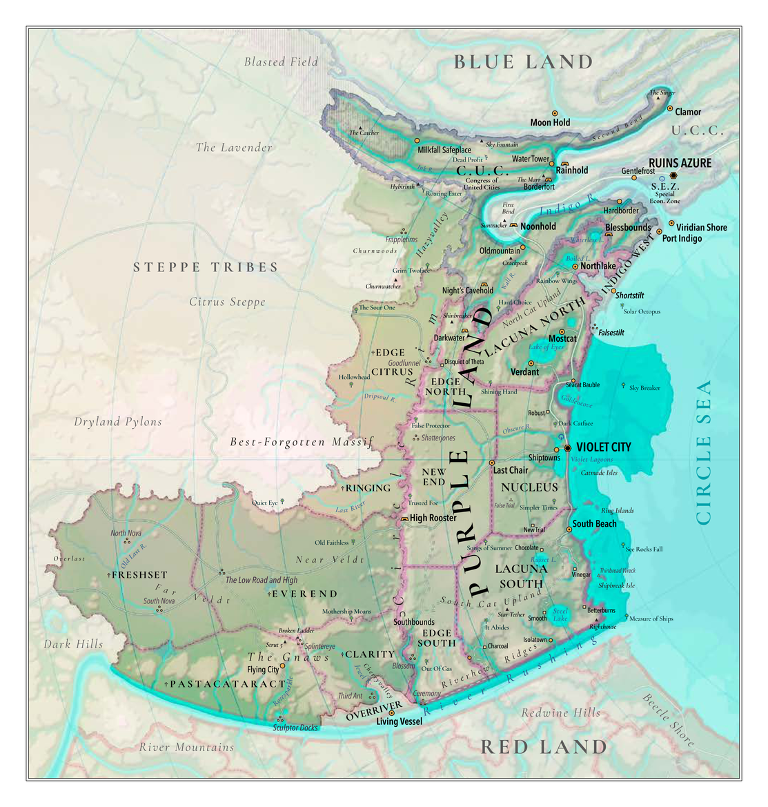](images/hires/page_0108_purple_land_map.png)

**Ambient, Core**

Dry uplands and lush round valleys, amethyst lakes and dark sand beaches, unfurled like a tapestry between the deep round Sea and the high glazed Rim. A timeless land of plantations and happy peasants, refined thralls and sleek felines, living machines of strange design and ill defined. A visitor might nearly suspect this land was not designed for humans, but the friendly locals would surely disagree.

| d6 | Winter | Spring | Summer | Autumn |
|---:|:---|:---|:---|:---|
| 1-3 | soft rain, gentle fog, obscured sunrises | growing things, blazing suns, waking craters | chirping stillness, heavy damp, flying catnip | beige skies, dry grass, aerolith plankton bloom |
| 4-5 | mellow gray, shades of brown, dead leaves | rolling cloud ships, ultraviolet skies | heavy rain, flash floods, burbling mud runs | ripe reds and fat fuchsias, harvest glory, wormglow |
| 6 | swirling scorpion flakes, dust in the wind, hum | overcast, glowing stuckforce, creeping fogs | rushing winds, razor dust, shorn trees | flickering skies, error eclipses, pumice rains |

**Ambient, Periphery**

The maps claim this land for the Violet City. But the cats are scarcer, the pleasures fewer, the skies hazier.

| d6 | Winter | Spring | Summer | Autumn |
|---:|:---|:---|:---|:---|
| 1-3 | biting ice, gusting winds, thinned out airs | chill sun, probing growths, lustful rain showers | sun like a hammer, soil like an anvil, hanging dusts | lime skies, heavy grass, fresh craters |
| 4-5 | shades of pale, powdery snow, crumbling plants | glutinous mud, palecrawl fog, mutinous sun | ominous clouds, deep rumbles, breaking soil | brush fire, swirling smoke, soil knitting itself |
| 6 | glacial chill, hungry steppe hounds, haunting roar | skin-burn sun, meltwater run, hollow hares | lightning storm, electric dust, swirling stars | bluescreen skies, missing stars, crackshield rains |

**Events**

| d6 | 1-3 Expected | 4-5 Surprising | 6 Error |
|---:|:---|:---|:---|
| 1 | Deep void radiation blinds machines and burns skins. Use sunscreen. | Music of the dead spheres. Save or lost in melancholy reverie (burden). | Translucent **winged cats** (L7, fae) offer a shortcut. It "saves" you 1d6-5 weeks. |
| 2 | Para-human **monkey gatherers** (L2, chameleonine) are: (1) looking for a job, (2) returning home, (3) singing high-flying songs, (4) winged and drunk, (5) secretly scouting, (6) infested with biomachines. | **Azure anarchists** (L3, explosive) are mining the bridge, barricading the toll booth, burning the high house. They are: (1) murderous, (2) melodramatic, (3) monotonous, (4) ideological, (5) cannibals, (6) mind-controlled. | **Charoite chimera** (L8, chaotic) with three heads and scales of swirling purple. One head tells only gnawing lies, one only harsh truths, and one ... one eats souls with its breath. What is it doing here, in civilization's realm? |
| 3 | **Feral scavengers** (L1, bestial). Hardly human or sentient, they might be (roll d6): (1) dog-faced, (2) rat-tailed, (3) bat-winged, (4) skink-skinned, (5) curly-toothed, (6) hole-bottled. | **Merchants** (L2, alien): (1) identically masked, (2) rubber and crystal suits, (3) pearly and translucent, (4) made of glass, (5) human skins filled with void, (6) dead bone alive beyond its term. | Lilac labyrinth of tranquil airjelly symbiotes. Rest a day to instantly remove one burden and recover all lost thought and endurance. Then save or sleep another 1d6 days. |
| 4 | Steppestorm grit blinds you. Careful. | Puddles full of glow worm larvae. | A mad **Black City exile** (L9, dying). |
| 5 | **Troupe of cats** (L2, peddling), invisible save for their wide grins and swirling eyes. Offer potions and test thralls. | Dead cat hung beside a burned high house, its heads daubed azure. A soul pearl holds its mind (worth €1k). | **Jade juggernauts** (L6, impassive) abide, ready to block paths, channel histories, revive emperors. |
| 6 | Old timefield frays, snaps, and swirls through you: (1-5) lose that many days, (6) a hidden extratemporal shortcut saves you a week's travel. | Celestial lensing reveals a Long Ago crystal city in the Utter West. Inspired, gain one hero die. Beware the pickpockets who prey on tourists. | **Catter patrol** (L4, burning) with metal steeds and rifle thralls: (1) tattered, (2) tired, (3) grim, (4) vengeful, (5) victorious, (6) mind-controlled. |

**Travel**

Scrubby uplands invite the lone rider to wander, but the carefully incised roads promise easier, more controlled travel.

| Type | Status | Price |
|:---|:---|:---|
| Portal | There are no official portals in the Purple Land to guard the Circle against the Haze. | "lost" [€500] |
| Right Road | A week to the Ruins Azure from the Violet City. Another week beyond to reach the Emerald City. Buses and road trains with luxurious quadruped accommodations ply this busy route. | practical [€20–€30] |
| Catamaran | Licensed navettes ply the exclusive economic zone of the Violet City and keep the seas surprisingly free of pirates. A week to the Red Land District or the Ruins Azure. Beyond the Ruins Azure, only vessels with Inquisition sigils are allowed. | deck or cabin [€5 or €20] |
| Air Lane | The RLD, Ruins Azure, and Sailing Isles via a single air lane cleared from the Violet City and patrolled by the Flying Fox squadron. For the rest, razor sharp stuckforce fields make the sky lethal to the unwary. Locals recount how this arcane debris tore the Error Dragons to shreds during the Grand Invasion of '86. Expats believe the invasion never happened. | cat-egoric [€125] |
| Local (Core) | Registered golem buses ply the old roads to the settlements living and ghost. Plantations, pleasure palaces, and other facilities are not serviced. | humanitarian [€10] |
| Local (Peripheric) | Biomechanical vechs carry goods and people among the plantation towns and restricted facilities, and even out beyond the Rim, where locals whisper of wild vomes. | caravanite [€20] |

**PURR-PURR ENTREPÔTS**

_"It's not a shell game. It's a cat game."_ —a tourist happy to use the local currency exchange

At first glance the Purple Land seems a fascinating place for commerce, but the multiple currencies in operation make it challenging for outsiders. Cash (€) transactions are restricted to high-ranking cat-friends and accredited representatives of outland incorporations or city-states.

Local humans and common travelers must use license bells (lbs), a category of local currencies. Meanwhile, the cats themselves only trade in favor-stone credits (₧), with all the original stones held in the Felicitous Butchery Bank, Violet City 2nd Island (FBB). Tourists using foreign currency will find themselves taken for a ride.

**This Felicitous Licensed Establishment**

**Purr-Purr Exchange Rates**

The FBB adjusts exchange rates without notice. Not all currencies may be interchanged. Fees included.

| Sell | Buy (FBB) | Black Market |
|:---|:---|:---|
| 1 cash (€) | 1d100 x 10 mlbs | 850 mlbs |
| 100 brass bells (mlbs) | 1d6 albs | 2 albs |
| 100 silver bells (albs) | 1d6 x 0.1 ₧ | 0.3 ₧ |
| 1 favor-stone credit (₧) | €5 | €10 |

For those who prefer things simple, 1 cash buys 500 brass bells, which buy 20 silver bells, which buy a quarter and dime of favor-stone. High-cat credit individuals may trade one favor-stone credit for €5, others get €2.

The master of commerce is a:
1. snake head grafted onto an animatronic dummy with a vocoder speaker;
2. electric lucky cat with eyes that bore into you;
3. jolly cat friend with dead eyes and a rictus smile;
4. shifty wagabund with ill-fitting skin;
5. jittery lime nomad with metallic arachnid pets;
6. three robed figures with identical ceramic masks.

| # | Establishment | Vendor Personality | Specialty | Product Quirk |
|---:|:---|:---|:---|:---|
| 1 | Last Table West | slow, drooling, glassy | steeds and servants | shares your secrets with the cats |
| 2 | Fortunate Sun Wares | jerky, puppet-like, stringy | refurbished oldtech | follows you with its bubbling eyes |
| 3 | Noon's Saleschurch | giggles, chortles, snorts | nootropics, entheogenics | stops working if not fed regularly |
| 4 | Plantation Pleasures | slimy, gurgling, bubbly | exotic foodstuffs | glows when exposed to UV light |
| 5 | Coffee and Cranium | soft, gentle, singing | congealed "magic" texts | grows if ingested or planted |
| 6 | Excession Hatch IV | bird-like, taut, alert | affordable luxury toys | becomes translucent over time |

**Human Approved Comestibles and Kibbles!**

| d6 | Item | Notes | Price |
|---:|:---|:---|---:|
| 1 | Human Kibble | Not really people, ha ha. Get the Qlonvet® brand! | 50 mlbs (€1) |
| 2 | Snake Frîtes | Made from a local string potato. Absorbs radiation. 10 xp. | 12 albs (€2) |
| 3 | Pet Slurry | Traditional human food. Restores 1d6 life, reduces initiative and thought by 1. | 100 mlbs (€4) |
| 4 | Haze Cake | Crushed condensed haze, flowers, and bone meal. May produce groovy visions. | 1₧ (€7) |
| 5 | Cat Coffee | Narcotic from pre-loved megacoffee berries. Sleep to restore lost mental attributes. | 100 albs (€20) |
| 6 | Steppe Burgers | Saddle meat, war bread, slices of bug-repellent onion. So edgy! | 1.5₧ (€10) |

**Cat Approved and Disdained Weapons**

| # | Weapon | Description | Price |
|---:|:---|:---|---:|
| 1 | Cat Claws | Get your vorpal slap on. Close, 1d4, unarmed, 5 sp. | 6.9₧ (€50) |
| 2 | Force Grenade | On impact creates a 3-meter cage of decayed forcefield as restrictive as an inch of rubber. After a few rounds, it explodes dealing 2d4* damage to all nearby. | 11.2₧ (€60) |
| 3 | Monkey Wingblade | Spirit-infused shipmetal makes the wielder lighter than air for 1 round per 1 life spent. Illegal. Close, 1d8, 1 st. | NA (€200) |
| 4 | Groom Breaker | A circlet that deals non-lethal psychic damage to mammals. Deals double damage to apes. Short, 1d8, re 3, 2 sp. | 39.8₧ (€249.95) |
| 5 | Fairy's Death | This illegal glass blade deals double damage to fairies and cats. Report and turn in if seen. Close, 1d6, concealed, 5 sp. | NA (€350) |
| 6 | Violent Cat Rifle Mk II | Sturdy caseless rifle that slowly grows its own bullets, like steel coffee beans. It doesn't look like other oldtech, but that's probably fine. Long, 2d10, re 4, 2 st. | 77.8₧ (€649.95) |

**Purrfectly Cute Clothing**

| # | Clothing | Description | Price |
|---:|:---|:---|---:|
| 1 | Pet Receiver | Fluffy cap that lets you tele-empathically receive your pet's needs and wants. Bonus versus mind-control. Cat-sized. Ward +2, 5 sp. | 60 albs (€15) |
| 2 | Steppe 'breaker | Windbreaker with anti-radiation fibers! Resist energy attacks! Armor +1, 1 st. | 2.5₧ (€14) |
| 3 | Floron Dress | The living fibers self-repairs in the hazeglow. Ward +2, 1 st. | 2.8₧ (€17) |
| 4 | Fairy Fur Boots | So soft, they'll make you quiet as a cat! Human-size costs double. Illegal. 2 sp. | NA (€65) |
| 5 | Clockwork Exo | Configurable plantation exo-skeleton. Double skill bonus when performing heavy labor. Armor +4, +3 strength, heavy, powered 6, 3 st. | 2,995 albs (€159.95) |
| 6 | Manambulator | A synthetic human body of fungal sinews and chitin-plate skin. For operation by one cat-sized person. Golem 10 life, +1 strength, Armor +4, powered 5, 7 st. | 225₧ (€NA) |

**Violet Transport Systems**

| # | Transport | Description | Price |
|---:|:---|:---|---:|
| 1 | Vortex Kite | Terrifyingly unsafe. Haze powered. Used by arboreal humans and adrenaline junkies. L1, carry 1, gliding. | 300 albs (€60) |
| 2 | Catamaran Navette | Sleek, legal twin-hull. Comes with feline-compatible navigator for safe-passage. L4, carry 10, fast. | 69.5₧ (€800) |
| 3 | Golem Bus | Lumbering biomech fueled by a blend of alchemical fluids and passenger memories. L5, carry 20, slow. | 24k albs (€1.2k) |
| 4 | Amethyst Palanquin | Regal, carved from a single giant amethyst. Powered by the meditative purr of its passengers. L3, carry 2, slow, hovering, focus-motion. | 99.5₧ (€1.8k) |

**Friendly Master Memorabilia**

| # | Memorabilia | Description | Price |
|---:|:---|:---|---:|
| 1 | Catopoly | Buy, sell, and trade the most famous plantations and pets! 1 st. | 150 mlbs (€2) |
| 2 | Vortex Globe | A bit of living purple haze trapped in amber glass. Totally safe! 1 st. | 24 albs (€5) |
| 3 | Synthrat | Acts like the real thing, but there's no gore or guts if you play with it! L0, 1 st. | 1.8₧ (€11) |
| 4 | Shapepaw Scarf | Traditional cat scarf picks up brainwaves and serves as a telekinetic third hand. Use it to amuse your cat master! 1 st. | 67 albs (€13) |
| 5 | Anarchist Skull | A reminder that all things must pass. Mounted on fordite. Ward +1, 1 st. | 2₧ (€15) |
| 6 | Stuckforce Chimes | Razor-sharp magitechnical decay plays the tritonal music of the spheres. 1 st. | 6₧ (€35) |
| 7 | Chaos Compass | Points to the nearest active portal or gate. Range 5 miles. 1 st. | 13₧ (€75) |
| 8 | Haze Condensator | Compresses air into a liquid. Allow an hour per liter. 1 st. | 14.9₧ (€85) |
| 9 | Subconscious Serpent | A furry synthetic snake that attunes to your subconscious and gives you painful insights into yourself. Ward +2, 1 st. | 11.99₧ (€120) |
| 10 | Gray Sponge | An alien macrobacterial sponge that filters one substance out of a body. Could be a toxin. Could be all the lymph. 1 st. | 39.95₧ (€224.95) |

**FACTIONS VIOLET**

_"Everybody wants to be a Cat [Lord]."_ —Dorito Pickles, exile Cat vidyscreenwriter, Saffron City, Wind Lotus VI

One city rules here. The Violet City. The city of cats. The city of magic and luxury.

Three regions form the Purple Land: the Core, the nuclear lands within the Rim; the New Veldt, west along the Low Road and High, soon to be reclaimed; and the Secure Zone, north among the Mountains of the Moon, always to be held fast against the Dead God's spawn.

There are no factions in the Purple Land. Neither poverty nor politics, no vulgar human excess, only peace. For everyone sentient must love the splendid cats.

Everyone needs to admit the superiority of feline intelligence. Suggesting that factions exist in the Purple Lands may see one's trading or tourism license revoked.

**Splendid Cat Lords**

The two-headed feline creatures, with one head a cat's and the other a snake's growing from their tails, are blessed with opposable thumbs and tele-empathetic powers of human enthrallment. They call themselves the Cats and are referred to as Cat Lords by their pets, but they seem so unlike the other cats of the Circle Sea and former Garden that many theorize they may be extra-cosmic interlopers or escapees from a Builder wizard's laboratory. Spreading these conspiracy theories is illegal in the Purple Land, where everyone knows the truth: pets and cats evolved together, guided by the wisdom of the Purple Goddess.

♟ _Chinklefink Butterfingers._ The runt of his litter, Chinklefink discovered himself possessed of an unusually strong psychic ability to dominate humans. Now possessed of an army of willing pets, he seeks to rid himself of his littermates and take over their estates as the first step of his plan. Potential catnappers will be well compensated.

♟ _Master Pooffins._ The lovable furball of the great master of accounts, Hel-Belt Ashcuein, feels the Cat Lords have become decadent. A small explosive misadventure attributed to some useless anti-cat terrorists and the death of a rival would be perfect to bring his Cat Power Party closer to the golden bowl of government.

**Cat Pets**

Most humans in the Purple Land are willing pets of the good and benevolent Cats, happy to do their tele-empathetic bidding in return for praises and treats. Many are not even aware that they are doing the bidding of their small, clawed, fork-tongued friends.

♟ _Gurya da'Tarva._ Driven to destitution by the death of her Cat Lord in a particularly bloody fight for control of a proud plantation, Gurya will do anything to get a new little Lord crooning in her mind. She is planning to poison a litter of anti-cattite activists to prove her usefulness and loyalty to the Cat Lords.

♟ _Beres Yimume._ An anti-cattite spy from the Free Purplelanders beyond the Rim, they have installed a subsidiary daemon-mind in their head, which captures the Cats' tele-empathetic emissions and lets Beres get close to the Cat Lords' sacred control temple. They have aroused the suspicion of a grizzled old Cat detective named Nero Tiddlestrings, but nobody will listen to old Nero who can't even control a human thrall properly these days.

**Success and Permission**

_embodied concepts, egrigorical angels, psychefaction_

One of the great dangers of humans untethered from the Lords' guidance and ministration is that their careless minds may serve as condensation nuclei for new Spirits to accrete from the spiritual soup of the omnipresent noösphere. Two such false divinities are **Success** (L3, tempting) and **Permission** (L6, justifying), a combined two-faced divine entity born to give justification to human Hubris.

The rewards of Success and Permission are real, but the final consequences are almost always tragic. As such, humans who sacrifice to Success and Permission are in breach of numerous Garden ordinances and may be subject to spiritual detergence.

♟ _Dahin Forders._ A plaster-faced prophet of Success and Permission commissioned by the Cat Lords to peddle spiritual opium to the jolly toilers of the Purple Lands. Also, a surprisingly bad poet.

♟ _Dr MD Nictetes._ A journeyman practitioner from the Emerald City, but also a spy for the Inquisition tasked with finding out if Success and Permission are a re-appearance of the Dead (Blue) God.

**Wagabund Travelers, Wagonnards**

An unsettled populace that should by rights barely be categorized as human, since they do not follow the civic traditions, yet many old machines still recognize them as being of sufficiently pure stock—and in some cases even jewel-headed—that their humanity is beyond doubt.

However, they are clearly barbarians, eschewing a sedentary life, denying the gift of free nutrislurry and endless individually optimized vidy content delivered once a week by centrally approved golem agents.

Instead, these tattered folk travel about on their bicycles and push-carts and even animal-drawn wagons, dirtying their hands with prehistoric crafts like carpentry, tinkering, soldering, tailoring, and more—as though we did not live at the end of time, where machines provide all by the grace of the good (if temporarily embarrassingly absent) Lords of the Given World.

♟ _Irshé d'Alba._ Born on the move, in flight from their old homeland, which was taken over by telepathic feline monsters from beyond the void, Irshé was raised on stories of human rebellion and dreams of becoming a vampire knight to rally a human resistance against their oppressors.

♟ _Taita Corruin._ The aged mistress of her wagon-tribe, she knows the capricious cruelty and baffling blindness of the lords who wield the deadly oldtech.

There is more to biding one's time and scavenging like rats on the edges of this decaying world than the young ones know. Right now, a new synthetic heart-lung system would be perfect for Taita.

**Free Purplelanders, Freeples**

The freeples do not actually exist, as evidenced by their absence in all official records and censuses. The humans dwelling outside of the standard settlements and plantations and facilities are probably not really human.

Yet, visitors continue to report a vibrant neo-feudal society arising in villages and holdfasts centered on the grand phylakes outside the Cat Lords' control, beyond the Circle Rim. Many seem to be making quite a go of things, adapting the neofauna and neoflora left by the [redacted] of the Blue Lands to their modern needs, from great sheet fungi used to produce mleather (mushroom leather) and sprouting dragonbone to replace ivory, to illnanobacterial cultures to harvest metals from scavenged ruins and lumin trees to capture the energy of the sun.

♟ _Girayt Ferluc._ A timelost captain who has adopted a freeple community as his wards, Girayt seeks skilled mercenaries to help him reactivate the giant headless body on which their new town stands.

With such a monster as their steed, they could move beyond the reach of the soul-burning Cat Lords.

♟ _Caris._ Just Caris. You need know no more. They're part of a shadowy network exfiltrating the Cat Lords' thralls and removing the thought worms from their heads, freeing them from the nefarious thought controllers. Yes, there's an unfortunately high mortality rate to the procedure, but that's where you might come in—perhaps by procuring an off-the-books golem autodoctor?

**Near Steppelanders**

Grown soft (in the eyes of their harsher cousins) on the periphery of civilization, the uncommon variegated humans of the vast and shattered West come often into the Purple Lands as traders and raiders. Within the Circle Rim they are few and contained, beyond they are more and less restrained. This group is (roll d6): (1) carrying a new plague, (2) bringing half-human offerings for the soul mills, (3) raiding for silks and sweets, (4) bringing furs and technomagical organs, (5) seeking gainful mercenary employment, (6) actually noble rainbowlanders dressed up as steppe nomads for fun.

♟ _Nanoc._ A young steppelander chief's son, exiled after his father was murdered by an azure cult leader of the Great Snake, he has come to the decadent cities of the east to seek his fortune with sword and cunning, thews and terrifying determination.

♟ _Göthert Brim._ Long-wandering, friend of goats, tall-teller, has noticed a corruption in the watching stones and comes to warn his sleeping kin.

**VIOLET CITY — CATLANDIA**

_"Once this city must have had another name,_  
_but I cannot remember."_ —Undying Varya 't Uorc, _Oral Histories of the Gate War_, (Soil Lily VI)

**Impressions**

Arriving through the ravaged Congress Concessions of the Blue Land and the crater-pocked North Core of the Purple Land, the Violet City is the first grand settlement to shine with electric fire, gentle illumination to push away the Eating Dark, rather than the ghostly blue light of the many half-abandoned settlements now peopled by more radiation ghosts than honest humans.

In the Violet City, the lights of oldtech shine bright, the sufficiently advanced magics keenly studied, the mysteries of the Builders still available to humanity through the benevolent intermediation of the Cat Lords.

Towers of livingstone rise from the sea, hosting vivid ecologies of climbing plants, tasty little mammals and delicious singing birds. Flocks and herds of food for the Cat Lords' palates.

Away from the fresh airs and lush views, behind walls to protect them from themselves, the various human castes live in generously appointed accommodations, which some anti-cattites have called slums.

Everyone is welcome to this place of trade, luxury, and magic, so long as they keep their anti-cat bigotry at bay.

**Major Districts**

_**The Livingstone Towers.**_ Home to the noblest of cats and the most prized of humans: the captive academics, engineers, and maintainers who keep the Purple Lands' oldtech running as it did Long Ago.

_**The Great Cat.**_ The holiest temple of the Cat Lords is the gargantuan mechanical cat, which offers oracles and advice to petitioners. It is a lie that the Violet City's grand portal gate once stood here.

_**The Roadside.**_ Grand livingstone facades line the Right Road, nigh-arboreal doll-house homes from which the Cat Lords can enjoy the minds entering their realm.

_**The Townships.**_ Inside their high walls, the townships keep humans safe and multiplying, a reservoir of willing and happy pets for the Cat Lords to access in times of need. Multiple amusements are available, including games with balls and strings, mouse hunts, dog baiting, public torture exhibitions, and more.

_**The Abandonships.**_ There are no abandoned outer districts of the Violet City. All the districts are fully peopled by actual humans. Ignore rumors of whole towns occupied by **plastic-faced falschers** (L0, hollow).

_**The Floating Slums.**_ Tethered together around their seaweed and fish and snail farms, the various anti-cattite garbage people are tolerated for the delicacies they offer up to the Cat Lords as tribute.

_**The Violet Lagoons.**_ The cats despise the water, for it can make their fur wet and smelly, like the fur of a canine or marmot or other foul mammal. As such they outsource the patrol of the lagoons to a number of fixed **lobophylakes** (L11, searing), great angelic golems, and their trusted human **head-riders** (L2, cat-loving). Still, all kinds of rabble scud about on small coracles.

**Ambient**

Small synthetic suns, gifts of the Cat Lords, provide more light than the purple haze of the Ultraviolet Grasslands, creeping through the gaps in the Circle Rim, would usually permit.

| d6 | Night | Haze | Day | Evening |
|---:|:---|:---|:---|:---|
| 1–3 | humid, clammy, buzzing haze, ozone smell | wan bluish light, purpling haze, mineral smell | clear day, blazing electric suns, tattering clouds | sodium suns, deep purple shadows, salty tang |
| 4–5 | violet skyglow, tense air, languid salty mists | ultraviolet light, dim haze, glyph hallucinations | flickering clouds, pricking stars, raucous market cries | oilslick spreading dark, eyes in the gloom, chirping |
| 6 | purple rain, distant thunder, bacterial glitterbloom | choking haze, itching odor, visions of a dark city | stuck grey sky, no shadows, cawing birds, wailing frogs | stuttering light, dust fall, oppressive silence |

**Events**

| d6 | 1–3 Expected | 4–5 Surprising | 6 Error |
|---:|:---|:---|:---|
| 1 | A **chilling Cat** (L3, watching), its four eyes promising: (1) dark times, (2) woe, (3) injury, (4) loneliness, (5) loss, (6) a future void of meaning. | A **wormseller** (L1, mumbling) offering parasites or symbiotes to keep the cats' mind virus out. Sell her out to the security pets for an easy €95. | The **void of many eyes** (L14, body-hopper) emerges from the Abandonships, hunting bodies to flesh itself out, a boat to reach the sky with. |
| 2 | Ambulatory **hawkers** (L0, servile) trying to sell you: (1) mind-control worms, (2) edible bugs, (3) chocolate centipedes, (4) coffee sausages, (5) candy soma, (6) cat coffee. | Amethyst glitterbloom. Minerals condense out of the soup-thick haze, coating leaf and shoot and resting people in a gemstone glaze. There, a **werepug** (L1, useless) nearly dead! | A ceremony of blissed-out **Cat Lords** (L6, felicitous) and dream-dancing **Pets** (L4, disrobed) wheels about the **Fang of the Purple Goddess** (L9, item). The relic chooses to go with you. |
| 3 | **Free Purplelanders** (L1, disarmed): (1) snooping, (2) sneaking, (3) touring, (4) trading, (5) braving, (6) craving. | A crew of **Dogheads** (L2, collared) obeying their slave master's orders, hunting escapees. | Local **catacademics** (L1, haunted) looking for test subjects. Earn an easy 20₧ (€150). Ignore the pustules. |
| 4 | **Security pets** (L2, armored) keeping everything safe, stable, and sleek. | A huge purple jade toe (€300) just lying there. Maybe it's a good omen? | Flood! The quarter is sealed?! Save a cat to win cash, a child for acclaim. |
| 5 | Outlander **ferals** (L1, half-human) here as: (1) bodysnatchers, (2) soul-juicers, (3) ratcatchers, (4) traders, (5) tourists, (6) pilgrims. | Friendly folks offer a free plantation tour with free coffee. A place to rest, ... and perhaps be enthralled by a lovely **silver Cat** (L4, tap-tapping)? | An **ultra** (L7, forgetful) from beyond time and Rim, keeps getting trapped in useless bodies. Knows how to talk to ancient doors. Does not know why. |
| 6 | A **coterie of pets** (L1, sleek) out: (1) patrolling for anti-cattites, (2) on parade, (3) shopping for their masters, (4) wining and dining new prospects, (5) hunting mice and dogs, or (6) aimless without instructions. | **Glowing shadows** (L3, soul-scratch) stalk the night, untethered from their Cats, they hunger for: (1) catnip, (2) charisma, (3) blood, (4) the choking world beyond the false portal, (5) belly rubs, (6) someone to talk to. | A **purple jade voidwalker** (L6, implacable) stops you and challenges you to a contest of wits. The stone human abides. Win: he gives you a jade finger (€200). Lose: work in his haunted garden for a night and a day. |

**Purple "Palaces"**

| d6 | Palace | Details | €/week |
|---:|:---|:---|---:|
| 1 | Stuckforce Skyscraper | Cells anchored into a vertical pane of force with immovable rods. Trust your slumber to incomprehensible technomagical devices! | 450 mlbs (€8.5) |
| 2 | Cheeseater Caravan | Traditional bluelander caravan carriages in the pre-republic style. Once a month, your carriage can join ye olde plantation bus run. | 200 albs or 1.2₧ (€10) |
| 3 | Coffee Castle | A plantation-style hotel inside an enormous sungwood coffee tree! Reviving coffees on tap. Includes various human hunting games in the cellars. | 900 mlbs (€15) |
| 4 | UV Halls | Originally designed for alien visitors, guests use special goggles to see and navigate the UV-only space. Not popular with vampires. Cat Lords can see here just fine. | 80 albs (€20) |
| 5 | The House of We | A Long Ago vertical human storage facility converted into a luxury monastery slash hotel. Wonder at the ancients preserved in plasticite! | 300 albs or 6₧ (€50) |
| 6 | Tent Mo-Ville | Steppe-style glam yurts. Sentient horse servitors! Shaman sauces! More citrus specialties than you can shake a stick at. Involved in an anti-cattite scandal. | 7.2₧ (€75) |

_Accommodations also provide ticket dice: €5 = 1, €10 = 2, €25 = 3, €50 = 4, €100 = 5._

**CATHEDRA'S PURPLE UNIVERSITY**

_"They claim this temple of higher learning was once a sacred site of kine and canine. That here an agglomerate deity called the Howl aggregated the knowledge of its people. Mere lies. Without Good Cat-Hydra this elevated site would have remained a Vile Place of No Honor, but Her goodness has gifted it to us as a place where we can recover the powers of our true ancestors!"_ —Lies of the Dogheads, Popular Review, VC.

Tethered to the mauve cliffs of Violet City by grasping trunks of livingstone, warded by gentling glyphs, embraced by the finest academics of humanity, the University is the only acceptable place of prayer and sacrifice in the Violet City.

Visitors can buy a slug of knowledge, a simple neurosymbiote that merges ancient knowledge with their modern minds. Discounts are available for visiting scholars, thought-leaders, and other influencers.

**Oldtech Lord Cathedra, also Violet Cat Hedra, also the Purple Goddess**

The jewel remembers. Cathedra's glitter is amethyst, her predator the cat, her fruit the agaric mushroom.

"They that remembers time before time, reason before reason, cosmos before cosmos. They that administer the reality subroutines. But also, the mad one, the collector of memories, the harvester of dreams.."

**Prayers to Violet Cathedra**

Once per session or so, to release anxiety, to live in the only moment given to mere mortality:

"Cogitate, regurgitate, garbage in, garbage out, logic gate, thesis, magic gate, antithesis, cosmic gate ..."

**Roll d20 + Aura - Thought**

| Roll | Effect |
|---:|:---|
| 1 or less | Circular reference. The worm. The worm. The worm. Burden of rumination. |
| 2–19 | Hold the rolled number. Once, replace any 2–19 Xd6 roll with that number. |
| 20 or more | Cathedra purrs in your sinews. Hold the purr. Sacrifice it to gain a bonus action. |

**Fingers of the Cats**

_crater aberracts, outstanding memorials of feline aid_
The Purple Land has always been a land of many round valleys named "craters" by catastrophists and "pawprint vales" by those who prefer social advancement. Many of these craters have plantations and facilities and most of these cluster about unusual features referred to as the fingers of the cats. These ancient structures, existing since forever just like the Cat Lords, bear the visages of the first Pet Grooms, who blossomed in the radiant purr of their feline overlords. It is taboo to approach them, but enjoying them from afar imparts a subtle self-satisfied glow and acceptance of the Cat Lords to the tourist.

_**At the Finger's Base.**_ Why are you here? This is taboo! Shoo, shoo! Do not read the White City solargrams, ignore the Black City glyphs, there is no ancient knowledge for modern minds here! Nothing like:

1. Basic shapeshifting for the Garden Era immortal.
2. Spiritual refueling for golems, humans, and ultras.
3. Sculpting bone, metal, stone, and wood with song.
4. Local permanence and impermanence of forces.
5. Oldtech activation and modulation for maintainers.
6. Interpretation of buildertech oracles and divination of the established cosmic cycles.

_**Inside the Fingers.**_ Seriously, you shouldn't be here. If the Cat Lords catch you. Look, I'm just a ... no, I'm not a radiation ghost. I'm a temporal echo. I'm not here now but I'll be here again at some possible time and yes, these are time vaults. You're not supposed to be here! The longer you stay the more you decay! Just take one of these engraved stone tablets, it has secret ancient knowledge. Fine, or one of the implantable psychic symbiotes. But get out, quick, you're decaying the vault!

**Rocks Fall Pillars**

_hierodule crisis refuges, crumbling capture pillars_
During a redacted crisis, **Fir Father** (L7, autonom) moved to stead one of the capture pillars in the so-called Alkan Sea, west of the phylake See Rocks Fall. This started a movement known as the Flight to the Sea Mounts.

The feral dwellers of these crumbling water castles may once have been Purplelanders, but now they are foul degenerates who kill all felines and grooms who would approach their worthless rocks, where they make a living trading with the local anthroposeals and cetaceans, harvesting seaweed, mussels, fish, and growing whallows and coasthuggers. Purple Land captains are officially forbidden from buying any naval supplies here.

♟ _Burble J'ambroc._ Anthroposeal ambassador from the Turbulent Basin algal mass colonies, Burble is a fountain of knowledge about the offshore aquatics. He certainly has no advance knowledge of any upcoming Great Flood events.

♟ _Terrain As Quit._ Chief of one of the less-decayed pillars, Terrain receives ecstatic visions of calling a solar chariot to their pillar. Help them?

**THE NUCLEAR LANDS**

The core of the Purple Lands, the magitechnical heart of the Rainbowlands where the soul mills still run, where the streets are day-bright even in darkest night with the spiritual decay of unworthy souls. A wonderful place, a delightful land where the worship of the Cat, associated with Violet Cat Hedra, has stanched the inevitable entropy of knowledge, has created a posthuman bulwark against decay and even recreated some of the glories of the warmest days of the Long Long Ago. Recreated? Surpassed, even, say the friends of the cat.

**Shatterjones, The New Nefra**

_fortress disaster zone, pyramid analysis site_
This Catlord frontier was destroyed by the sudden appearance of a New Pyramid within living memory. Researchers and civil defense units continue to study the situation, but local entrepreneurs have also begun to organize tours of the New Pyramid zone. Pack a realityaffirmation blanket (just €10 at the entrance!).

_**The Shatter:**_ gravity slants at an angle, the light bends unpredictably, and **half-there beasts** (L0 or L5, folded) sneak through shadow and eye-corner. Beware the **giant mandrakes** (L3, wall-wailers).

_**The Jones:**_ the New Pyramid is named for the first researcher to die inside. An unfortunate fellow who ate a bad salmon mousse and died in the third chamber, fusing with the rubber-fungus wallmatter there. Please, do not feed the undead **Jonesmatter** (L11, glutinous).

**The Mostcat Omorimo**

_human generator facility, revived oldtech center_
Simple minds say this complex of para-elemental roseate glass and azure living flesh explains the northward thrust of the Purple Land under its feline masters. Every educated person will tell you this is nonsense, the cats are our friends not masters. The complex itself is nothing sinister—it uses perfectly safe and well-understood technology to birth fully-grown humans (so-called orimonates or ripe-born) from a beast-seed matrix.

The complex café-and-gift-mall explains why this is a boon for humans. Free soothsay coffees available now!

_**Matrix:**_ the rippling blue flesh trapped within the labyrinthine pipework of roseate glass is certainly not an avatar of the Blue God. Haha. Why would you think that?

_**Vocatron:**_ a magnificent adaptation of oldtech vidy technology! Condenses a decade of upbringing and education into a single month of high-density cultural and skill training. With just €50 and 24 hours to spare, a guest can acquire a useful human skill, like cat-petting, house-cleaning, master-grooming, coffee-picking, or dialectical subservience and mental hygiene.

**Startether Peak Abbey**

_pinnacle of solitude, re-membrance generator_
There was never a star tether here or anywhere else.

The Fast and Slow Stars have always been nailed to the rotating Belts of Heaven and not in any way connected to the Given World. Rumors to that effect are entirely heretical and punishable by no less than seven years of shackle-minded labor in the natron salt purification mines. The original abbey was not a museum to the Voidwalkers of old who came from On High to make tenable the Given World. The cancerous aerolith-fused rosethorn now growing from the original abbey was part of the original plan. The **tooth-faced monks** (L3, growling) have always been the occupants of this peak. Visitors are welcome, especially those who want happier memories implanted to make their participation in the golden order of the Cat Lords happier. Happiness is, of course, _entirely_ voluntary. The **human-eyed goats** (L2, shouting) of the mountain forests were never human and licenses to hunt them for trophies cost just €5. There are no adamantether pits beneath the mountain that looks like it was shattered by a massive foundation being ripped up by a celestial force.

_**The Abiding Burgh.**_ A smiling village greets visitors to the foot of the mountain—literally smiling, it is built on a promontory quarried out of a petrified géant's head, so its village gates enter through the rictus grin of the metamorphic sarcolith of the terrain. All the villagers wear permanent grins as part of their settlement-covenant and work to tirelessly promote the Truth of the Cat Lords among all visitors.

_**The Fairy Door.**_ There is definitely not a working portal anywhere near the ~~Star Tether Facility~~ Abbey and it does not access any slow star worm hatcheries and is not used in any way to enhance the Cat Lords tele-empathic ~~control~~ guidance of their happy laboring humans. All suggestions that the Cat Lords would have any connection to non-Garden Path approved extra-Soilar factions or be in any way anti-human are merest slander.

Those approaching the fairy door should beware the **brain-tunnelers** (L4, popping) and the **singing smoots** (L3, soothing), but most of all the **Grey Fog** (L6, ahedonic) in the nether-ducts.

**THE CAT PLANTATIONS**

The _pyanurs_ of the Purple Land stand apart from the old human towns. Unlike those decrepit husks, the pride-run plantations are models of life, conviviality, and growth.

**Crater Approach**

Depend from the dry uplands and enter the round bowl.

1. An electromagic fence. Humans hear an unpleasant hum when they try to leave.
2. Painted gates and advertising totems promise the finest coffee and the best synthetic porpoise flesh.
3. Cracked walker shells and attack vechs warn visitors that more than mere phylakes guard this place.
4. Guard posts and observation towers, coiling razorvine hedges and pox-seed fields.
5. Haze tendrils coil about the switchback road, thicker down in the bowl, promising damp and daze.
6. A new town, in the modern Post-Potemkin Style. The citizens all look well-fed, well-maintained, and very similar to one another. All praise the cat lord and their pride of _grandes chattes_.

**The Valley Promises**

More than cat coffee is produced here.

1. Beast eggs grow in profusion, fed by nutrient slurry from a functioning foodmaker.
2. Mycelial factories churn out sheets of chitin for the human artisans of this plantation.
3. A soul mill, a relic of an older age, grinds damned spirits to entice life once more into shipmetal discs.
4. An original U.S.H.A. daemon inhabits the lord's microscalpel golem, working biomagic as has not been seen in a hundred years.
5. A pleasuremaker tunes and plays the brains of the cat lord's willing self-sacrifice to procedurally generate synthetic memories for vidy and sale.
6. Six ultras call the rubber-carp pond home. They repair human minds, restoring loyalty and virtue.

**The Big House**

This is where the cat lord dwells, the true friend of all humans here.

1. A great, gnarled baobab, scratched by a millennium of sharp claws, heavy with nests and perches.
2. A republican era wood-and-bone house on brachiosaur legs. An archaic walker?
3. A repurposed church of Alfatuštra, the prayer generators still in place, the machine mind still keen to offer mathematical perfection.
4. A cat café labyrinth. Enter at your peril. A great horned cat is said to dwell at its heart, the failed offspring of the cat lord and a swan song.
5. A hermetic palace, accessible only through screens and noöspheric projection, home to a verdant biome from the True Soil of the Cats.
6. A black bunker, cubic, inaccessible. All communication is telepathic and enigmatic.

**The Cat Lord**

Feel its mind, stroke its fur, know its perfection.

1. Tantan, the hairless perfection, its six scorpion tails carry six psychedelic poisons. It knows no greed, only gentle all-consuming desire.
2. Vicky Twoheads, with four eyes to explain your mind to you. She offers clear insights and empty dreams.
3. Widdle Tums, with fur so long and silky none can see his face. He demands grooming and products.
4. Red Colossus, a distributed feline sentience controlling a hundred and twelve russet cats. Some say they are in league with a foreign power.
5. Lady First Star, an ancient cat, almost mummified, who claims to remember the time of the Builders.
6. Kara Cat, a black cat with claws like glass and a mind like diamond. Convinced a great war with the dogheads is coming.

**THE SECURE ZONE**

The territories recently liberated from the terrorist error of the Blue God have now been fully reincorporated into the happy state of original felinicity.

Some suggest that the Secure Zone is still part of the Blue Lands, but those are the legalistic confabulations of fool humans who do not understand the felicitous superiority of the Cat Lords.

**Vexalt A.N.T. Facility**

_temple-town of a pre-feline saint_
A temple-town near Oldmountain haunted by the monks of Saint A.N.T. who defied the soul-burning catlords. At the last, they released the heart of the A.N.T. and set fire to the very air above their ancient ruin. Following an extended purification ritual, the A.N.T. is now a storage facility for spent soulmatter.

_**Old Reactor:**_ an off-limits area, said to still be inhabited by unreconfigured A.N.T. units. Fortunately, the hazefield barrier is perfectly confusing to those scuttling horrors.

_**Storage Facility:**_ the old gardens of heresy now house the ashen pearls created by the soul mill generators. These summon ghosts and apparitions from the subconscious of visitors, making these abandoned and overgrown gardens popular with a certain gothic sort.

♟ _Permian A.N.T._ Unknown to most, the numerous dog-sized A.N.T. units carry in their combinatorial behaviors the personality-memory of Permian the Eartheater, one of the original Builders who made the Soil habitable for the first-stock humans. Flashes of this original heavengineering entity appear when enough A.N.T.s are assembled in one place. Permian, though easy-going and amiable, is no saint, and would gladly be re-incarnated.

**The Well-Charred Mountains**

_rustic carbon fossils, fuel for a new era_
Above the Ink River the liberation of the Blasted Field has scoured away the top-layers and accreted géant leavings to reveal the charbon bones of the mountains, biaerate coal extracted by the Builders' airsuckers and deposited here in towers of glistering, lustrous sunlight trapped in dark, fire-prone stone. The Free Purplelanders hope to unlock the power of these mountains to drive the Cat Lords out of their lands and out of their minds.

_**Abulugandi's Watchtower:**_ a problem for anyone who would wish to spread the wealth of the well-charred mountains is the watch-bunker of Abulugandi, the clockwork tabulator that oversees this borderland on behalf of the Peacemakers and in accord with the [redacted] Lords Request to keep silent and safe the boneyards where the Dead God rots. Abulugandi's **watchbirds** (L2, ticking) and **talkbeetles** (L1, tocking) warn, cajole, simper, and beg with interlopers to leave the Blasted Field alone. Abulugandi's **flesh-bonded** **egregores** (L9, razor-brained) do not talk so much.

**THE NEW VELDT**

The territories west of the Rim are still ruled by the lords of the Violet City. Nothing has changed here in the last millennium. They have not been nor are abandoned. The lack of permanent patrols is a sign of how peaceful the region is, not that it has slipped out of central control.

**Splintereye - Nefra Vlindoxé**

_shards of beanstalk suspended in stuckforce_
A biomechanical ladder of heaven, it seems, destroyed and fractured long ago. Perhaps the Gnaws themselves, that broken massif, is its old base station, fallen into itself. When winds whip through the undead stalk segments, glowing haze balloons break off and fly with the wind, sterilizing machines and rewinding memories.

_**Curling Pillar:**_ a segment of the biomechanical leather, curled upon itself like a caterpillar. This aerial fungus forest habitat serves as a safe island for its arboreal humans. Pulleys and baskets offer access for those who are welcome. Razor force fields block those who are not.

☗ _Beamstalk._ The ladder may be broken, but the weightlessness beam could still be reactivated to reduce the apparent weight, or gravitic valence, of an object or vehicle, even reversing it to launch it into the near void.

_**Anchor Pit:**_ lined with no-stuff that even the master scholars of Long Ago never explained, the deeper one descends, the weaker all forces become. A gray terminator conceals the bottomless depth. Thence, sometimes, strange people ascend. Pearly, translucent, yet quite there. In the middle reaches, where haze and sun alike are weak, a trading station serves those who would sell parts of themselves for the souls of pearl.

♟ _Jens Burltime (L5 elder arachnohomme)._ An unusually erudite arboreal human, grown spiderlike and bloated after decades in the haunted library, learning from the radiation ghosts, they have learned the secret of the "red flower", the heart power of the Builders that saw them break the mind-hold of the Dream Lords. Jens now seeks a pupil worthy of this secret.

**Flying City - Kivita Volá**

_ancient metal mine and villages_
At the head of a wound in the Gnaws, at the source of the Rosesparkle river, stands the great layer-cake metal city. Inhabited on and off over the aeons by feral quarterling tribes, catless refugees, gutless syntheticsm and other classes of hammer fled from their righteous managers. Their rugose pueblos and rusted insulas stud the old megastructure like barnacles and limpets on a derelict coasthugger. Over it all, the knotweeds and thorntrees of the dusking scrub proclaim vegetable dominion.

_**Mines:**_ centuries of scavenging have not removed even a tenth of the shipmetal and other rare voidstuffs that make the hull of this titanic, dead city. As for the inner tunnels, one would be mad to tempt the **Admiral Errors** (L7, permutating) that dwell therein.

_**Booster House:**_

_**Category Outpost:**_ golems and cats run the modern mining operation from the abandoned Flying City Museum and Lander. Monthly, their armed convoys truck shipmetal ingots down the Rosesparkle to the Sculptor Docks.

**Nova and Nova**

_two necropolities, twinned in mirror_
_misery_
What disaster befell these star-towns? Within their sphere perimeters time move slow, but entropy moves swiftly. A day within is as an hour outside, but ages by a month. Few flesh humans make the sacrifice of youth and health a proper exploration would require.

Reports say the outer buildings are sealed plasteel boxes. Rumors say that deeper the novas expand into portal-space with crystal monolith buildings. Tall tales say the central districts hold pyramids of bones and worms of skulls and fur-clad humans trapped in amber.

_**North Nova:**_ Soul-rich flesh that dies here decays into dust and reappears as mind-numbing sand and iridescent scales in South Nova. The Brothers of Many Bodies control this process.

_**South Nova:**_ Soul-rich flesh that dies here decays into slime and reappears as vision-granting pins and translucent buttons in North Nova. The Sisters of Many Minds control this ritual.

_**Yesterdoor:**_ A wrong portal dwells in the heart of both Novas, a gate without a portalspace, a hole in spacetime that sometimes manifests outside the bounds of the necropolities. Hunting for someone to survive its strange geometries? Perhaps something worse?

<!-- Begin: Our_Golden_Age_06_Red_Land_124-155 -->

### RED LAND

_"Run, run, from the evil sun,_

_it seeks to have you done!"_ —Old Sun Era children's song

Many say the Red Land never became part of the Garden. The fickle goddess Budget ran away, say some myths, leaving the Lords and Unlords with little sway. Others say it was a hunting preserve, a wilderness testing zone, or some other strange design.

The traditional redlander ethnogenetic cycle says the Red Land is where humanity became free. Here, among the many mountains beyond the reach of that pale Circle Sea given to the inhuman Cetaceans and the River Rushing hewn from the hard stone body of the Given World by the Builders themselves as part of their grand schemes, humanity traded blood for power, life everlasting for freedom never-ending.

That is why the land is red. It was painted in the ultimate sacrifice by the rainbow knights who became the vampire knights as they fought the epic shadow struggle to free humanity from the Vile Ones. In the myths it is unclear whether the Vile Ones are supposed to be the Unlords, the Lords, the Builders, or some other group of overhuman precursory sentients.

Also, the leavings of the automated magma maggots, the ammas, are rich in iron oxides and decompose into the vast dunes of rust red sand in the Rustcountries.

Also, the land is famed for its bloodwine and organ farms.

Today oldmetal fortresses dot the land, Long Ago bunker cities serve as store houses and tourist traps, while hunters seek out the falschers—the wild soulless ones sprung from mycelial machines as they did long, long ago when the gods farmed them for spare parts—along the Organ Trail looping far into the West Rustcountry.

**Climate**

In the far south of the Rainbowlands the seasons are harsher, the winters more severe. When winters fade, the mountains' ice and snow feeds the rich farmlands, but then summer's heat bakes the land and summons storms to break against the heights. The greatest of storms bring cyan spores sweeping across the southern summits, poisoning crops and painting the sky garish hues.

**Population**

Red Land: ~8 million, Red Land District: ~2 million,

Rust Country: ~0.5 million

**Groups**

vein tenants: 50%, free vintners: 15% free dewerkers: 15%, rustlanders: 8% hexad members: 4%, vampires: 3% others: 5%

**Languages**

Raudalandi (Red Land), Redland District Cant (RLD),

Winerian (dewerkers), New Common (falschers)

**Capital**

Official: Red Land District or Red End Formerly: Red Line, the peregrinating river city (defunct).

**Government**

Polycentric confederation with devolved aristocratic and industrialist traditional organizations.

**Ideologies**

Aristocratic antitheism (high), blood nationalism (vampire knights), revolutionary first-humanism (district), free industrialism (dewerker), radical sarcopoetics (falscher), pack puritanism (dogheads), clan libertarianism (rustlander).

**Economy**

By popular custom, the free humans of the Red Land, pay only the vein tax and all other activity is their own prerogative. The collection of economic information is viewed as the first step towards divine tyranny. The Red Land District is heavily dependent on bonded golem labor and free dewerker hexad cooperatives.

**Resources**

Bloodwine, abmortality, knights, golem control lemmas, bunkers, revolutionary ideals, falschers, fresh organs, steel, wood, coal, hydroelectric power.

**Means of Production**

Wealth can only be owned by individuals in the Red Land, collectivism and corporativism are both shunned as the road to antihumanist serfdom. This is a core conflict with the Red Land District, which is ruled entirely by hexad cooperative innovation-and-industry syndicates—crime gangs in the eyes of the Vintner Lords.

**Material Conditions**

Visitor testimonials suggest there are few palaces as opulent as those of the Vintner Lords or the Hexad Collective Secretariats. Reports on the squalor or destitution of the toiling masses are classified by both the Vampire Knights and the RLD Collective as various shades of subversive propaganda.

_Source: Clarity on Our Trading Partners, Visense Nergal et al,_ _Violet City University [cat.], Stasis Plumeria IX._

**Ambient, Highlands and Rustcountries**

When winters fade, the mountains' ice and snow feeds the rich farmlands, but then summer's heat bakes the land and summons storms to break against the heights. The greatest of storms bring cyan spores sweeping across the southern summits, poisoning crops and painting the sky garish hues.

| d6 | Winter | Spring | Summer | Autumn |
|---:|:---|:---|:---|:---|
| 1–3 | white skies, frost fingers, milky mists, rust rivulets | rust red runoff, bursting snow drops, pale skies | ultraviolet days, blazing sun, bursting flowers | air like glass, stars by the light of the sun, cold |
| 4–5 | heavy snow, glittering frost jellies, grey skies | lances of sunlight, pierced skies, torrential meltwater | clear days, choking lowland fogs, stately airjelly swarms | heat wave, wilting fungi, mating razorflies |
| 6 | clumps of frozen air jellies, glacial gusts, clear skies | cloud tumults, battling thunders, icy rains | cyan skies, spore blooms, rumbling rust dunes | rainbow foliage display, pink skies, flighty clouds |

**Ambient, Valley Lands and Coast**

| d6 | Winter | Spring | Summer | Autumn |
|---:|:---|:---|:---|:---|
| 1–3 | whistling winds, yellow grasses, brown skies | green days, pale skies, rustling, growing things | humid heat, pink skies, buzzing bloodflies | yellow days, groaning fields, ripened gourds |
| 4–5 | soft snows, gunmetal skies, ghostly spores | fog walls, sucking silence, trembling soils | downpours, torrents, tendril clouds | forest fires, smoke, sour skies, rust on the wind |
| 6 | electric skyfire, red skies, rainbow showers, bracing airs | cyan storms, jelly lathers, pine rose blooms | viridian overgrowth | crimson skies, red drizzle |

**Events**

Traveling along the rivers and roads, you pass looming mountains, deeping valleys, groaning vinyards, yawning bunkers, glittering mansions, and drifts of red dust like snow.

| d6 | 1–3 Expected | 4–5 Surprising | 6 Error |
|---:|:---|:---|:---|
| 1 | **Highland apes** (L3, apex), large predators with the faces of dogs and the talons of raptors can be chased away with lance fire. | Soulless **human-form falschers** (L2, changelings), grown from artificial flesh by old machines, have formed an alien-minded masterless pack. | **Ravengaunts** (L7, cancerous) emerge from time-locked capsules to harry the Viles. Undying commandos buried should the resistance be overrun. |
| 2 | Poor, starving, **corrupted wretches** (L1, bubbling) ask but a pound of flesh to be made human again. | **Knights sanitaire** (L3, eaters of the undead) seeking and purifying cracked time bunkers. | The sun is setting and the vine maze looks confusing. The **old vintner** (L5, falscher) offers blood sausages. |
| 3 | The **leaping lapin rats** (L1, antlered) are rodents become deerlike. | Cyan spore slime must decay before travel can resume. Lose 1d4 days. | Forest fire! Cough. Ack. Poor visibility. Hot, hot! Be quick to escape. |
| 4 | **Tagged tenants** (L1, registered) with travel permits seek: (1) amusement, (2) distraction, (3) absolution, (4) freedom, (5) undeath, (6) a dead god. | **Vintner magistrate** (L3, abmortal) in a mobile mansion offers: (1) doom, (2) advice, (3) largesse, (4) justice, (5) secrets, (6) lies. They are not alone. | Stumbled through a false portal to a mirror of your destination. They're celebrating an **archaeomagical drake** (L11, souleater). Get out (1d6* days). |
| 5 | Blood flower bloom sets your veins on fire and sinuses on water. Lose 1d3 charisma. Meds cost €5 per week. | Skyfire damages exposed neural circuits, reducing thought by 1d4. Consider wearing a foil hat in future. | A local flood drowns your path. Lose 1d3* days. Oh, wait, it's revealed an old-time bunker! How enchanting! |
| 6 | **Night knight patrol** (L3, traditional), protectors from chaos: (1) hunting bandits, (2) draining falschers, (3) bearing bloodwine, (4) collecting protection taxes, (5) harrying ferals, (6) preparing a pogrom. | Without bloodwine, tenants and rusters alike succumb to cyan spores, turning into not-quite-vampires: **bloated glowbloods** (L2, mutated) who form cannibal nests in the hollowed hills to prey on travelers. | Illusory road ends at a creepy hill with ruster glyphs warning of oldtech corruption. Lose 1d2 days backtracking or delve within, risking decayed post-humans to find old glitchware (increases random trait by 1 rank). |

**Additional Joys of the Rustcountry**

The roads in the Red Land are long and winding. Those in the Rustcountry are even longer.

| d6 | 1–3 Expected | 4–5 Surprising | 6 Error |
|---:|:---|:---|:---|
| 1 | Lobogolem glitches that take your vehicle out of your control for 1d4 days, less a day for each €10 spent. | Vehicles start to grow their own minds. They will become sentient in 1d6 days. 50:50 they hate you. | Your machines start to coalesce, hoping to become a **thousand-legged mechahorror** (L9, maser-faced). |
| 2 | **Ruster hustlers** (L2, wicked sharp) take you to a friendly bar and pick your pockets—or try. | **Dead vampires** (L6, doom zombies) stumbling in oozing armor, light dripping from their faces. | **Unholy falschers** (L4, milky) reincarnating a **hybrid avatar** (L11, why?) of Red Rubra and the Machine Beast. |
| 3 | A gust or playful zephyr helps some of your belongings fly off the ledge you're traveling along. | Blown tires or steeds stop you for hours next to an **old géant's** (L12, leaden slumber) burrow, very safe. | The sky peels back and hateful voidlight shines down, making flesh hiss and minds scream. Save or [sigh]? |
| 4 | Rust storm. Exposed metals decay, whipping shards cut skin and blind sensors. Static on the speakers. | Voice storm. Exposed metals glow. Whipping voices steal attention. Strange instructions on the speakers. | Ghost storm. Exposed metals become as vidy screens. Strange scenes form, directions to a pre-purification bunker. |
| 5 | **Red fireflies** (L0, blessed) bring you good luck, granting a temporary +1 to your strength or endurance. | Curious **rainbow wisp** (L4, electric) increases wards—and visibility—until you gift it eight drams of vital fluids. | **Clan round house** (L10, motherly) dragging itself on a dented aerolith base across the desolate landscape. |
| 6 | **Rust folk** (L2, proud) caravan on its way to: (1) hunt zombies, (2) crush skeletons, (3) reclaim a lonely bunker, (4) avenge a fallen scion, (5) trade at a clan meet, (6) build a great iron man. | **Free dogheads** (L3, howl-pack) out to: (1) hate, (2) mate, (3) hunt, (4) restore their missing voices, (5) become a group-mind pack entity, (6) burn down a purple plantation. | **Veterans of the War** (L5, fried) escaped their time vault and are: (1) dying, (2) crying, (3) hunting iron oysters, (4) taking out their brains, (5) reviving the Zu beacon, (6) singing. |

**Travel**

The mountains that saved humanity in the forgotten Long Long Ago now make much of the Red Land a tourist backwater—a hidden gem in pop parlance. Favors from the vintner lords translate into discounts and free samples.

| Type | Status | Price |
|:---|:---|:---|
| Portal | A narrow week-walk thread links Red End to Safranj and the City Azure. All portals are favorable. Portal outlawed in the Red Land District as affectations of the corrupt capitalist False Lords. | favorable [€50 / "free"] |
| Right Road | From the Tollem, a gilt-era velvet cruiser to Red End takes a week and includes food and liberal drinks, while a coalem cargo autobus to Oranje takes just as long and includes nothing. | liberal [€15] |
| Coasthugger | From the Red Land District, a week to the Violet City, two weeks to the Decapolis. Wallows from smaller ports like Protein Extraction or Out of Bounds are irregular. Privacy costs more. | steerage [€5 / €25] |
| Airbeast | Secure public air-cutter service from the RLD to the Emerald City takes a week along well-marked air lanes clear of archaeomagical debris. Private blimps from €100. | comradely [€50] |
| Local (Rivers) | Coalem lobogolem barges connect the towns of coast and river, though passage through the Red Land District is restricted. Free humans require no permits, but pay vein fees. | chugging [€3] |
| Local (Inland) | Lobogolem land-trains, automules, and walkers serve the inland towns and remote bunker villages beyond the confluence of the Wine and Blood rivers. Sentient golems are distrusted. | basic [€20] |
| Peripheral (Rustcountry) | Ruster guides with automules and thinbreathers are recommended. Solitary travel can be dangerous, as the various iron human and falscher clans levy strange tolls and tarrifs. | exorbitant [€45] |

**FREEBLOOD VENDINGS**

_Freedom is paid for in blood._
_Those who will not pay, cannot be free."_

_— traditional Red Land saying_

One travels to enrich oneself, does one not? Well, in the Red Land, the gentle visitor can fortify themselves body and soul, gaining life and wisdom. Materialist visitors are reminded that, R.L.D. ideologies notwithstanding, consumption is _not_ the lifeblood of the Red Lands. These lands run on honor, tradition, blood and soil. For what is wealth if not land?

**Intoxicating Hosts**

Hosts in the Red Land are fond of plying visitors with their favored vintages. Turning down a toast or beverage is rather _gauche_. You don't want to be _gauche_ to a blood-drinking vintner lord, do you?

The rich wines of the Red Land, like other mind-altering beverages, intoxicate the indulging human. Each alcoholic unit of drink occupies a burden slot, one unit dissipates every 4 hours.

**This Liberal Vending**

**Honor as Currency**

As you gain favor with a Red Lander of class and taste, they feel dutybound to host, dine, and wine you in proportion to your honor. This honor to cash conversion guide will help Greenlanders and other materialists.

| # | Honor | Wine & Dine Value | Cash Loan |
|---:|:---|:---|
| 1 | Common | no | nil |
| 2 | Unknown | €2 | nil |
| 3 | Respectable | €10 | €35 |
| 4 | Veritable | €50 | €150 |
| 5 | Magisterial | €250 | €950 |
| 6 | Majestic | €1.5k | €5k |

The gentle traveler should be aware that overstaying one's welcome is a _faux pas_ and a surefire way to reduce your status. After all, it is by giving that one proves wealth and status, not by taking. No one likes a parasite.

Today's trade-host is a:
1. plain, plastic-draped, faceless mannikin ... huh;
2. reflection in a looking glass, a remote ghost;
3. sturdy dwarfer with a silver neck collar;
4. vintner down on its luck, water in its veins;
5. tenant trader with grey skin and eyes;
6. ruster with symbiotes replacing most of its body, wheezing as it trundles about the vending.

| # | Vending Name | Vendor Personality | Specialty | Product Quirk |
|---:|:---|:---|:---|:---|
| 1 | Bottle Perverse | kind, hopeless, cursed | glassware and ghosts | rings with the echo of new creation |
| 2 | Budget Bunker | paranoid, fidgety, furry | golem and dress codes | autoresets to factory settings |
| 3 | Chateau Cat Tails | stern, tense, scarred | farm labor beasts | call home at every opportunity |
| 4 | Fang You Very Much | cackling, handsy, prim | protein beverages | shrivels if not bathed in salt |
| 5 | Says Agrognome | short, supple, smarmy | sundry intoxicants | do not clean at night |
| 6 | Steak and Sword | bloodless, thin, steely | rustland envirotech | bleeds orange fluid by moonlight |

**Fruits of Blood and Soil**

| # | Fruit | Description | Price |
|---:|:---|:---|---:|
| 1 | Rustbroth Stew | Cooked with tradimagical bacteria whose enzymes break down inedible compounds—rubber, plastic, wood, and more—into human-digestible slop. Seasoned for taste. | €1 |
| 2 | Hillbread | Traditional worker bread made from synthetic flour. Edible for months. Packed with vitamins and mood improvers. Contains no immediately toxic preservatives. | €2 |
| 3 | Leech (live food) | A face-sized wriggling leech, full of blood. Keep moist. Feeds a vampire for a few days. | €3 |
| 4 | _Honor Sausage_ | Pink slime dried in wind and sun to create a delicious, salty, arm-length cylinder of protein and fat. Also called "week-meat". Best with large quantities of dewerker beer. | €5 |
| 5 | Vampire Wine | A bottle of the richest ruby vintage, infused with the flesh of creation. A cup restores 1 life to a human and 1d6 to a vampire. Bottle contains 3.75 cups. | €35 |
| 6 | Bloodwine | Orange-red regenerative vintage harvested under the Green Sun. A cup regrows a finger, the whole bottle an arm. Bottle contains 3.5 cups. | €125 |

**Red Land Dress and Wear**

| # | Item | Description | Price |
|---:|:---|:---|---:|
| 1 | Red Goggles | See true colors, uncorrupted by the Green Sun. Easily detect warm, pumping blood. 5 sp. | €20 |
| 2 | Hiking Gear | Shoes and layers to survive lowlands and high. Proof vs. rust, snow, rain, and UV. 2 st. | €50 |
| 3 | Furmalweave Cloak | Living furry photosynthetic tissue. Water regularly. Warm by night, cool by day. 1 st. | €55 |
| 4 | Spore Mask | Plant and chitin symbiote filters dust, spores, and toxins. Enriches air with oxygen (1 life per hour). 1 st. | €100 |
| 5 | Bunkerbeetle Suit | Chitin carapace with synthstone platelets. Light, tough, and anti-necrotic. Armor +4, 2 st. | €150 |
| 6 | Truebrass Ring | Powerfully antibiotic. Protects from all skin infections and most contact poisons. 1 sp. | €240 |

**Human Liberty Insurance Gear**

| # | Item | Description | Price |
|---:|:---|:---|---:|
| 1 | Rustvolver | Forged in skyfire, made to degrade. Double dmg vs. metal targets. Short, 1d4, re 3, 1 st. | €25 |
| 2 | Spore Spray | Inactivated cyan spores cause bloating and bloodthirst. Close, 1d4, re 5, small area, 1 st. | €50 |
| 3 | Blood Trinker | 2-way intravenous town blade. Deliver poison or steal 1 life per strike. Close, 1d6, 1 st. | €150 |
| 4 | Dwarfer Bolter | Pneumatic bolter. Small, powerful, precise, easy to hide. Medium, 1d6, re 2, 1 st. | €200 |
| 5 | RLD Revolutionary | Novel SMG. Works as a club (1d8) in melee. Short, 2d4+2, re 1, burst, 1 st. | €450 |
| 6 | Long Ago Howler | Sonic blaster provokes dread, fear, and awe. Short, 2d8, re 10, small area, 1 st. | €1.5k |

**Unrusting Travel Options**

| # | Item | Description | Price |
|---:|:---|:---|---:|
| 1 | Automule | Mule-derived biomechanical servitor. Powered by ancient fires. Dome head. L1, carry 2. | €100 |
| 2 | Solar Gondola | Sails for the slower rivers, solar-powered propellers for faster waters. L3, carry 6, sleek. | €250 |
| 3 | Bloodweb Balloon | The full old-school blimping experience! L1, carry 4, slow. | €500 |
| 4 | Dust Rover | Sungwood, sinew, chitin, and fungal filters. No metal parts! L3, carry 4, fast. | €1.8k |

**Sundry Russet Souvenirs**

| # | Item | Description | Price |
|---:|:---|:---|---:|
| 1 | Humanhead Steer | 8-inch miniature of a reverse minotaur. Embodies the stolid spirit of the happy farm laborers of the Red Land. Use a drop of blood (1 life) to animate it for an hour. 1 st. | €2 |
| 2 | Backcountry Maps | The old roads, as they were back before the [redacted]. Good maps cost five times more and show modern trails and novel terrors. Includes rust-and-spore proof pouch. 1 st. | €5 |
| 3 | Crystal Heart | Glows with the gentle light of your sacrifice. 1 life per hour of illumination. 1 st. | €10 |
| 4 | Bled Rose Seed | Grows into a protective bush when planted (L1, peeping). The blooms have eyes?! 1 sp. | €12 |
| 5 | Bunkerplate | Puzzlebox dishes and cutlery in the style of the Long Ago rebels, decorated with scenes of humanity's glorious revival. May be a secret map of a bunker. 4 st. | €15 |
| 6 | Cyan Spore Globe | The polychrome spores swirl and dance like mad homunculi. Can distract vampires? 1 st. | €20 |
| 7 | Dormifloral | Spray that puts ambulatory plants to sleep. Reload 5, 1 st. | €25 |
| 8 | Fogwhistle | Blow your soul into a mist of many pinks. 1 life per cloud, small area. 2 sp. | €30 |
| 9 | Pure Sang Chalice | Ceramic and silver cup that purifies blood. Takes 30 minutes. 1 st. | €50 |
| 10 | Bunker Key | Multi-purpose human bunker access pass, including synthetic palms, realistic irises, and source code simulators. Additional eye drops and moisturizer recommended. 1 st. | €200 |
| 11 | Ectoplasmifactor | Crystal globe of sympathetic ectoplasmic animalcules. Shatter it and everything in a small area becomes intangible for an hour. 1 st. | €300 |
| 12 | Friendship Dome | Biomechanical autolobotomizer that makes a living or livingish creature smaller than a quadrodont (a type of pachyderm) pliable and easy to control. Single use, 4 st. | €750 |

**FACTIONS IN RUBY**

_"Red Land traditionalists like to define themselves by their blood, but it is water and stone that shape its societies."_ —Esi Tu, travel writer, Decapolis, Wind Lotus II

Two cities dominate this land. The younger is the Red Land District, a coastal mess of channels and bricks, the golem-guarded bastion of anarchy and commerce. The older is the Red End, a cloud-piercing mass of terraces and livingstone, the blood-pact bastion of tradition and honor.

Three great groups divide the country between. The dwarfer industrialists dominate the coastal factory towns, the vintner lords rule the river plantations, and the half-barbarous rust folk clans crawl the highlands in their hybrid hamlets.

Other smaller groups squabble amongst themselves, allying with the great groups to serve their needs. The free parliamentarians represent the traditional bunker yeomen of the Red Land, the vampire knights celebrate the triumph of the Human will against the cruel oppression of the Dream Canopy and the false idols, the priests RLD offer community and purpose to the labor hordes, the hexad societies provide self-organized power to the petty industrialists and pirate burgeois, the free falschers movement probably doesn't really exist, and the old dogheads are some kind of cinecephalic cult that the author of this section doesn't really care about.

**Dwarfer Industrialists**

They pay lip-service to the tenets of the RLD and coin-service to the hexad societies of that city. Their factory towns harvest and repackage the coast.

♟ _Groen 4-Copy._ The industrialist has a cunning plan to mine the popular walls of the resort ghost town Falsestilt with the metropolitan Mining & Dining Fraternity. The profits will be immense and will upset the balance between the hexads and Groen's Well-Going Concern Six-Dig-Ma. Anarchists and balancers alike would love to see this capitalist and his cult following brought low. The hexads would just love their juicy cut.

**Vintner Lords**

The vintner lords pay kind words to the free parliament of the Red End and vein-rent to the vampire knights. Their plantation villages tessellate the vast length of the Wine River valley.

♟ _Nomoä the Old._ The tricentenarian is holding a great going away party as she prepares to become one with the great blood moon on high. There will be games and, wag the gossips, one of her seventy-seven secret heirs will receive her lovely ruby teeth. Those same teeth she took from the Violet Sky-Eating Hydra in a riddling contest.

**Rust Folk Clans**

The half-barbarous rust folk clans pay neither heed nor deed to anybody. Their hybrid hamlets crawl the rugged backcountry of the Redwine Hills and the River Mountains and even reach the deep old mines in the Winedarks far south of the civilized reach.

♟ _Mother-father Anda Vene._ The chief of the Great Plateaulet clan hears the song of the old divine blood, captured and stored beneath Red End. She-he is convinced its power will let her-his clan multiply, grow, and build their own free state, independent of the old-sucking vintners. The clan's earnest spread-words make inroads with disenfranchised planters in the city's tangle-depths, setting up a riot that will cover the clan's heist.

**Free Parliamentarians**

The oligarch MPs of Red End represent the concentrated wealth, tradition, honor, power, venality, and corruption of the Red Land.

Each MP is born and reborn _in machina_ from the blood of the citizens—not just representing their will, but literally aggregating their flesh and impulses.

At the end of each MP's mandate, when their blood body denatures, they are ritually baked into community cookies and distributed to their constituents, creating a grand electoral full circle.

♟ _Anselm Frankinburn CXXII._ This rogue, free-spirited MP, who would strongly prefer not to end up denatured and baked into cookies, is looking for outsiders who could fake their death and translate their mind into a new shell. They've even got the perfect opportunity: a lovely little lakeside shindig of the Sub-Ministerial Committee on Higher Taxes for Untagged Second-Class Citizens. With the flowing bloodwine, who will notice one more braindead MP? It's easy money, they promise.

**Vampire Knights**

The flower of Red Land youth, made immortal with the blood and plasm and _ka_ of the stems, roots, and much of Red Land youth. Was it not the best of humanity that bought its freedom after its long march along the cruel Garden Path? So the best of humanity must be kept vital, fresh, young, and ready for the eternal revolution.

The knights are organized in permanent celebrations that represent an evolutionary vanguard at the forefront of what it means to be human. Celebrations include:

⚙ **Knights Sanitaire.** The sweepers and the eaters of the (un)dead. They ensure that only the deserving enjoy life everlasting. Their symbol is the virgin rose. Their motto is "nothing is ever easy."

⚙ **[The] Night Knights.** Also known as the watchers of the black sun and the astral guardians. They ensure that law prevails in the realms of the red vine. Their symbol is the grape and axe. Their motto is "in blood, truth."

⚙ **Pink and Pie Knights.** Also known as the evolutionaries and the eternal vanguard. They ensure that the human rebellion can never end. Their symbol is the fork and hammer. Their motto is "eat the vile."

⚙ **Xenon Knights.** Also known as the permanent party and the bureau of luminous affairs. Their task is secret and not discussed. Their symbol is the lamp and shade. Their motto is "empty veins flow silent."

♟ _Temeraire Lindenbloem._ The knight tapped to serve as blood reservoir to the grand secretary **Iron** **Pole** (L7, demented), master of the celebratory all-circle society, is none too pleased. She won five disciplines in the electric blossom games and traces her bloodline to an original void captain and seven shipmaker lineages. All of which is to say, she deserves better things than to serve as a walking backup for a withered old warrior. Conveniently, she knows just the time and place where a small terrorist attack would show Iron Pole up for the doddering elderling he truly is. Pah, Iron Pole even prefers to use a transfuse golem to drink these days!

Of course, if you won't agree to visit 187 Brick Lane, remove the three jaune bricks and carry out the bomb attack, there is the proof of your recent smuggling.

What? You say that wasn't you? Who will the authorities believe?

A tourist or a paid up member of the secret celebration?

**Priests RLD**

The sacred guardians of the revealed and perfect truth of the social anarchist dialectic of the RLD remain popular with the working masses and labor hordes of both the RLD and the Red End. While their materialist monasteries provide psychological opium to the multitudes, the lords and hexads support them; when they kindle revolutionary excitement, they assail them.

♟ _Burn-Oppressors-In-the-Oil-of-Judgement._ The new firebrand is causing a stir, mobilizing monasteries and organizing combat communes in the back country. Who will hunt them down first, the established priestly anti-hierarchy or some local bloodwine don?

**Hexad Societies**

The six traditional fraternal self-help societies of the Red Land coast are the heirs to centuries of resistance, mutual assistance, and poorly-disguised piracy.

When the Red Land District broke free of the Red End parliament, its naive revolutionary elites turned to the old sages of the hexads for advice and legitimacy. Then, in due time, for semi-formalized government.

♟ _Heart-of-Lion._ The thirteen pickled brains of the Adamant and Dandelion Hexad (Heart-of-Lion) seek to expand in the occupied City-Ruins Azure. Coasthuggers and the old Red End portal make it more profitable than most guess. A few bribes and assassinations will make the Green and Purple peacemaker companies see the good sense of working with an experienced secret society to handle the Dead God's mad blue cultists.

**Free Falschers**

This terrorist group of soulless false humans was eradicated years ago and is no threat to any visitor.

Rumors that cells of false humans, visually identical to normal humans, circulating through the body politic of the Red Land are certainly as false as the false humans.

Suggestions that they have secret living clone factories hidden in the deep red aristocratic hunting preserve parks, where they gestate, train, and equip falscher infiltrator families are a ridiculous conspiracy theory.

If you suspect that you have no soul, are a false human, or a clone doppelganger, please visit your nearest political hospital. You may have been substituted without your knowledge. Treatment is free.

♟ _Sacrament bane Pizzigatto._ The undercover Cat Lord masquerading as a civet is in the Red Land to investigate whether the local falschers are more or less effective as a source of stock pets for the Violet City military. It has extracted a crude map from several cloned falschers and suspects they have figured out where in the Celsius Lodge Lands Hunting Preserve the sixth-type falschers' clone factory is hiding. A docile factory of this sort to churn out pets for the Cat Lords would be invaluable. Sacrament would certainly pay at least €10k for viable factory buds.

**Old Dogheads**

The old dogs knew many tricks. Many educated travelers will have heard the myths of the Howl, the meta-entity that manifests when Dogheads of multiple categories form a choir. This is an obvious exaggeration, of course, and the old dogheads are just another oppressed folk sect welcomed in the invigorating and liberal Red Land.

♟ _Crio dei Ruch._ The modernizing doghead integrationist believes the Howl should be consigned to the folklorists. His Redblood Integrity movement is fighting for dogheads to be allowed into the vampiric aristocracy of the Red Land. Vampire Knight traditionalists fear that this might undermine the skinchanger-lifeblooder proscriptions, which ended the Sunless Wars.

♟ _Barcu tei Noch._ The rabble-rousing publisher is intent on dispelling popular perception of the Pack of Purity as a doghead supremacist cult. To that end, he has organized a musical medley howling tour to travel the Right Road. Alas, someone has stolen their holy howling horn. Would the fans even notice if it was swapped out with a fake?

**RUBRA'S OUBLIATION**

_"This circle is no circle. Here, blood runs dry, memories repress themselves, responsibility is evaded. Sin is burned away in the soulfire of unbeing."_ —Executive Charts 5:10, Book of the New Human.

The scattered husk of Rubra's géant false avatar, Malbolco, groans and glows within the spherical Zone of Abnegation known as Angel Heart. With the detonation of the Memory Dam humanity broke free of the false gods, the poor builders, and strode into a new dawn of justice and prosperity.

So say the wealthy vintner lords, anyhow. Rustlanders, rootgrubbers, falschers, bloodcurdlers and even curious tourists still visit this abandoned zone. Some even pray at the husk as though it were the Red God's temple.

**Red God, also Blood Lord Rubra**

Songs in the bloodstream say their mineral is ruby, their beast the locust, their giving tree the fig.

"They that sets in motion evolution's race. They that motivates, drives, hungers, lusts, and needs. The maker of tusk and claw. But also, the maker of suffering, the sower of terror, the warden of death."

**Prayers to Red Rubra**

Once per session or so; to avert the Red Cycle, to make the lord of flesh and fang overlook the human, wail:

_"I am the cud, already in the gut, eaten, digesting. I am passing through, I am done and undone, I have fed you..."_

**Roll d20 + Endurance - Charisma**

| Roll | Effect |
|---:|:---|
| 1 or less | The animal mist descends. Fear grips you. Life drains away. Lose 1d8 life. |
| 2–19 | Hold the rolled number. Once, reduce 2–19 damage by that amount. |
| 20 or more | Rubra sings in your blood. Hold the song tight, sacrifice it to regain 1d6 life. |

**Zones of Abnegation, The Oubliations**

Several other best-forgotten zones dot the Red Lands, such as those around the scattered corpses of the Winged Eyes, the mire of Centuries of Triumph, and the radiant whiteness of the Home of Wisdom. Despite the different structures of the destroyed false avatar and the various visual presentations of these zones, all are marked by a persistent groan and glow. The glow illuminates them even at night, marking them as places of no honor now that the war against the false gods has been won. The glow itself is not very dangerous. The groan, however, is a persistent, psychic noise that pollutes the oubliations and has disastrous effects on the human nervous system, including (roll d6): (1) devolution, (2) decay, (3) rapid-onset dementia, (4) berserk rage, (5) brain-hunger, and (6) hallucinations. Lead-lined helmets and Faraday ponchos have been shown to help somewhat and desperate folks still stalk the oubliation zone, hunting for souvenirs and oddtech preserved by the lack of sentient observers (and thus slower passage of time) within these regions.

Dogheads are oddly unaffected by the groan, despite their superior hearing.

**RED END**

From the bones of the land, the city's livingstone terraces march up the slopes of the mountains Silver (Arshenu) and Cinnabar (Shinabru). They soar over the headwaters of the Wine River and Bearded Vulture Pass, inviting the clouds to play among the linked citadel-mountains. The old-growth buildings are blind to protect the photosensitive minority.

Lumin lichen veins drink in the ambient vital energies and suffuse the shuddering halls with vibrant neon hues. In the oldest chambers, the ceilings still glow with the electric blue of the oldest myths of another world. In the new, looking shields present the dying songs of the fast stars and the slow.

_"No city is as free as Red End, for it is renewed in the blood of Liberty, for it is fed by the blood of false gods sacrificed."_ —Hael Ric d'Er Cru, Bunker Day Speech (SsD VI)

**Grand History**

The mind-blind traditionalist of the Green Land, still staggering along the tattered folly they call the Garden Path, still scraping and bowing before the false histories peddled by the Inquisitors of the Ministry, still besotted by the might of those mute weapon-géants, the phylakes, live in a perpetual present, lulled to sleep by the lurching fabricators still twitching to the forgotten tunes of the absent false gods.

Not so the Red Land, not so Red End. Here the War others fear to mention lest it bring the Retribution once more was won. Here, Humanity survived the Bunker Era and emerged to reconquer the world by blood and bone. All of Red End is a living monument to the gory triumph of panhumanity over those false gods, the Vile Ones.

**Tragic Present**

Alas, not all saw it that way. Many saw the vein-rent, the traditional tax on every resident of the Red Land to fill the blood banks that fuel the vintner lords' biomantic universal regenerative healthcare programme for all Red Land citizens, as an injustice, a burden, an invasion of their bodies. They decried the blood type tablets worn by residents, that symbol of human freedom and dignity, as "cattle tags". At the beating heart of the Red Lands, in the Great Rebellion Museum itself—o, irony of ironies—the anti-priest, the bloody upstart Ôb Mock, discarded his blood driver robes and demanded of Liszteprans, head of the T. Tanz Kompanie and then overseer of the venerable blood banks, to tear down the Wall of Traditions where the laws of the Red Land were inscribed and the ranks and types of the blood-givers were listed.

Ôb Mock was publicly fed into the great soul mill named "Old Mohlack" in front of an approving selected audience of worthies, which should have put paid to all the nonsense about abolishing traditions like the psychomedical tests at age three that determine each Redlander's career and vampiric knighthood prospects.

Alas, it did not. The Ôb Mock bloody uprising was swiftly put down with minimal casualties and though some say an insurgency continued to bleed the Red Lands for another seven decades, only a small territory at the mouth of the Wine River was lost to a group of radical hold-outs who aligned with the pirate dwarfers and hexad merchants dwelling there. A trifle, truly.

**Ambient**

Along the terraces and urbiducts of Red End scurry harried maintainer managerials and stroll peacock-bright consumer finefolk. Thus, the sanguine economy ticks. On Sundays you will see quaint _activistes_ marching for the amusement of the knights and on blue Mondays used up probably-folks line up at the self-donation clinics.

| d6 | Summer Day | Summer Night | Winter Day | Winter Night |
|---:|:---|:---|:---|:---|
| 1–3 | pleasant, fragrant, breezy, strolling middle-castes | cool, perfumed, moths, fireflies, knightly airs | cool winds, scudding clouds, rustling bamboo stands, drifting songs | hotbloodwine oppressive, humid, still, chill, misty, obscure figures, dark skies, flakes of snow |
| 4–5 | deserted but for probablies | scuffles, raucous song and ash | taste of rust on the winds, razor cold downpour, gushing gutters | cyan fog, blood addicts, red sky, shuttered doors, heavy snow, frozen waste |
| 6 | swimming tunnel rats | stalking anti-socialites | electric blossom knights | humans, cryodryad calls |

**Events**

| d6 | 1–3 Expected | 4–5 Surprising | 6 Error |
|---:|:---|:---|:---|
| 1 | **Haemodryads** (L3, nymphs) encouraging folks to donate their excess vein rent to the popular blood bank. | Tunnel-dwelling **sun-haters** (L4, corroded) hit a blood clinic to secure bloodwine and other vital fluids. | A **bunker** (L13, dark) wakes and calls in dreams to a sealed sacred builder vault in its depths, beneath Arshenu. |
| 2 | Dwarfer pop-up land-train trucking and bartering contraband, red-eyes, and consumerist revolutionary tat. | Three rebel cells hatch the same plot to kidnap a vein-tax collector's wife. They violently run into each other ... | An **abominable blood ooze** (L10, splintering) bursts out of a clinic. Parliamentarian plot? RLD terrorists? |
| 3 | Civilized picket-off between supporters of human labor and promoters of auto-golemification. | Vintner post-materialists attack a chattel market, killing servitors to disrupt the city's economy. | An **oubliated golem** (L9, leaden) aglow with oldfire prophesies doom and gloom. Lead the blind thing away. |
| 4 | Two **sparkling vampire** (L3, sartorial) teams face-off in the traditional gladiatorial blood sport. Decapitations illegal. Those killed are restored from the holy blood bank in the knightly citadel. | Funeral party mulching their dead and spreading them on their gardens as is the classic tradition. | **Vampire knight** (L5, perfumed) riding **obsidian drakes** (L7, sleek) put on an airshow, spearing a small error dragon. Afterwards, parts are sold as souvenirs: scales for shaving, quills for sewing, claws for cutting, eyes for buttons, flesh for biomancy. |
| 5 | Stitcher biomancers seek subjects for radical self-improvement! Tested on soulless human-analogue falschers. | Dozens of corpses in a jay-needle den. Tried to make their blood ultraviolet with the neon phoenix's feathers. | A rebel knight will be pulped and fed to the **Sky-Hydra** (L15, sparkly) in a ceremony. Games, treats, included. |
| 6 | Processions, pop-music, plasma-fizz, and pyrotechnics for the electric blossom games to pick new knights. It devolves into an: (1) anti-cat demo, (2) anti-lich rally, (3) pro-doghead party, (4) jingoistic march, (5) mass love-in, (6) popular blood drive. | Enhanced sentient bat swarms—the **Red-Eyes** (L1, legion) patrol the neighborhoods to keep it safe. | **Doghead radicals** (L1, united) giving out pamphlets, soliciting donations, preaching about the "Coming Howl." |

**Top Drop Stays**

| # | Stay | Description | €/week |
|---:|:---|:---|---:|
| 1 | Dewerker Dormitory | Synthetic sleep pods. Fully rested in just three hours! Very efficient! No chance of psychosis! Lockers for three personal items autoscan for illegal materials. | €2 |
| 2 | The Inn Mobile | Ruster caravan camp. Beware the corrosive centipedes. Move closer to work. | €5 |
| 3 | Solaris Sanctuary | Traditional bunker chic with illumination in the style of the first sun. Experience the light humanity evolved to enjoy! Ignore the emergent wall-sentiences. | €10 |
| 4 | Shadowfree Suites | Permanently illuminated by the blood moon, always free from the burning Green Sun. 100% UV safe. Hotbox stocked with seven flavors of synthblood (€1 each). | €15 |
| 5 | Cliffside Cabins | Panoramic views and laughing stars? Astral visitors? Don't fall off. | €20 |
| 6 | Vintner Villa Towers Estate Premium Stays | Elegant estate, falscher dancers and a secret bloodwine tasting? Perhaps even special society initiations? Multiple costumes, masques, and gowns available. | €90 |

_Accommodations also provide ticket dice: €5 = 1, €10 = 2, €25 = 3, €50 = 4, €100 = 5._

**RED END'S DISTRICTS**

Red End is large and its vintner aristocratic districts stretch to the Wine River. Plan 1d4 hours to travel to a specific district, and at least an hour per location visited.

**Mount Silver - Arshenu**

The eastern third of Red End climbs the Silverberg, the Arshenu, the last great peak of the Blood Mountains, where divine blood bought human freedom. Arshenu, the guardian who withstood the Vile Ones' decay bombs. Arshenu, the lifegiver, who gave its bones to the petromancers to turn an old bunker city into the first free city of humanity.

1. **Underterraces.** Open to the air but perpetually shadowed, desired by photophobic middle classes.
2. **Administrative Terraces.** The tomb offices of the bureaucracy, where hopes and dreams die to be revived as zombies of themselves.
3. **Ministry Way.** A wonderful plaza and open air museum, where you can score a quaint painting or an illegal bloodwine mix.
4. **Bloodwine Cellars.** The great state-owned cellars, where the vintners of House Marigold create and age the most terrible and wonderful brews.
5. **Great Rebellion Museum.** A monument to human resilience, a history of the War (don't mention it), a record of the Fall. As it is free to all, one can easily find some waif down on their luck willing to sell a pound or two of themself.
6. **Tessellation Park.** A puzzle park where vampires go to entrance themselves for hours and forget the ennui of their abmortality.
7. **Parliament Plaza.** Experience the full-spectrum illusion of the ungrateful peasant rebellion of (datum redacted) and the glorious preservation of the revolution by the popular Pink and Pie parliamentary vampire knights battalion.
8. **Free Parliament.** Off-limits to visitors, except for guided tours on Thursdays.
9. **Citadel of the Vintner Lords.** The awe-inspiring fortress of the great-good houses of the Red Land looms over the city, reminding visitors and locals alike that their betters are looking out for them.
10. **Bunker of Life Over Death.** The Redlanders, horrified by the necromantic traditions of other lands, by the jewel-liches of old, experimented with ways to restore life to the undead. They had many failures, but some successes. Their old biomedical research bunker is now something between a memorial and a popular souvenir marketplace.

**Cinnabar Mountain - Shinabru**

The western third ascends the flanks of Cinnabar, a great massif transformed and lowered by the Unlords' sacred bombs, yet not destroyed. Good Shinabru, where the Phoenix Parasite was brought down and thrice decapitated. Here was the lesson given to the Vile Ones that humanity would not be slaves.

1. **Prison of the Hated Pretenders.** Here the worst of the worst rebels against the parliamentary republic are kept in a semblance of life. Necrobiomancy ensures that even if there is no hell awaiting them in the next life, they will have centuries of hell in this life. For an added fee, visitors can have a go with some of the simpler torture devices.
2. **Officer Terraces.** Traditionally, the homes of the parliamentary militia. Now a popular upper class neighborhood famed for its boutique eateries.
3. **Great Blood Banks.** The great state-owned banks, run by the Four Nameless Houses, administer the vein tax and the life courses of the abmortals. Visits by appointment only.
4. **Offices of the Scalpel.** Both the finest research hospital in the Red Land and an officially sanctioned punishment facility.
5. **Crimson Theater.** The popular aerial wrestling spectaculars of Long Ago are now a ritualized high art. Try the crimson jaspis box for €100.
6. **Marcher Square.** Any citizen of the Red Land is allowed to express their dissatisfaction by marching out their complaints in letters a hundred meters tall on this grand plaza. Basic complaints, couched in the traditional legal poetry of the high common speech, typically take between 20 and 40 kilometers of formal marching.
7. **Statue of the Great Dalgba.** Celebrating the faceless First Drinker, who awakened in the time of poison mists and brought the power of abmortal vitality to the rebel forces.
8. **Barracks of the Drake.** In honor of the corruption dragon Sin ot Sina, who gave of their undying flesh to breed the hunter drakes the vampire knights use to this day.
9. **Citadel of the Vampire Knights.** The sky-piercing fortress of the strong and stable mad warrior of the Red Land soars over the city, reminding visitors and locals alike that the blood-drinking commando is there for them.
10. **Hotel New Pale.** A pleasure palace for visiting parliamentarians, celebrities, and prospective vampires, the masquerades are to die for. Has secret passages to the Crimson Theater.

**Bearded Vulture Pass and Butterfly River Valley**

The middle third, between the two mountains, now resigned to shadow even at noon, sprawls across valley and pass, once the town of Qol Shipetu, where the free lords pre-vampiric farmed their potato and tomato crops. Time, redevelopment, and profit have changed the vale.

1. **Recycler Maws.** Purchased from the finest biomancers in the Decapolis, the new recycler worms take all the refuse of the Red End and give back new feed stock for the city's great companies, such as True Water Inc. and Iron Harvest LLC.
2. **Transit Stations.** A great public art exhibition reminds visitors of all the workers who gave their lives to move the local portals into this well defended transit fortress.
3. **Soul Generators.** Right under the Citadel of the Vampire Knights, soul generators turn the forfeit _ka_ essence of the damned into thrumming power to keep the great city humming and carbon neutral!
4. **Customs Warehouses.** The state-owned customs warehouses review and vet all goods coming in and out of the city. Currently operated by House Mistral LLC, a subsidiary of the conglomerate House Mistral Bis2 directed by the second son of the third concubine of the current Chief Parliamentarian.
5. **Great Red Emporium.** The official annual market, where industrialists from round the Circle Sea come to offer their wares to the wealthy and wise of the Red Land.
6. **Blooming Vaudeville.** An underground theater district and source of semi-legal novelty vidys. Visit for the ever-popular chattler baudies, watch soulless false humans re-enact the dawn of the ever-young!
7. **Mulchery Deeps.** An unincorporated district. Guided tours of the corrupted colonies are available for those who want to thrill at uncontrolled mutation.
8. **Welcoming Way.** Simple, stolid homes for those ascending the real estate ladder. Each comes with a personalized heal-coffin.

The urbiducts are the soaring habitation bridges of the upper city, expanding Red End into the lofty heights between the two mountains, providing a lush, luminous home to those who have contributed most to the success of the greatest free city of humanity.

**Upper Urbiducts (Skyfire District)**

So close that you can touch the skyfire, they say (though this is not entirely true), the Skyfire District is a popular residence for noble and knightly families because of the plentiful drake perches and the high real estate values, which keep out the weak-blooded riff-raff.

1. **Sculpted Gardens.** Elevated on aerolith plinths, the greatest sculptures levitate high up, where the lowly masses can enjoy them without defacing them.
2. **Translucent Apartments.** Grown of a novel livingstone that turns daylight into perpetual twilight, protecting the interior from the harsh rays of the Novel Sun. An up-and-coming neighborhood, perfect for those who want to acquire a sanguine visa (for investments over €1 million).
3. **Rainbow Circle Manors.** The old industrialist fancyhomes are now the domain of cosmetic re-facing clinics, surgeries, embassies, cloning banks, and psyche restructuring shops.
4. **Crystal Mall.** The greatest mall in the Red Land, a single living golem organism, it feeds on the satisfaction of its customers. Tourists should avoid some of the darker hedonic delights that offer "enter for free, but never leave" tickets.
5. **Electric Promenade.** A theme park of yesterday's future today! Experience how the ancients imagined the world would be three hundred years after they were recycled in the communal vats!
6. **Astral Heights.** A nature preserve and certainly not home to the urban bunker palaces of the great vintner houses of Red Land.

**Lower Urbiducts (Pine Rose District)**

The less-lofty habitation bridges and towers for the middle-managerial castes still provide the sunlight now denied to much of the old valley settlements, as well as a taste of the rarified reaches that a good civil servant or professional could aspire to after a few decades managing a serious Red Land quango or optimizing the taxes of a few large vintner estates.

1. **Meta-Electric Light District.** A tangle of office bunkers so overgrown with lumin lichens and low-grade active atmosphere generating symbiotes that even the weakest human can work for 20 hours a day without tiring!
2. **Pinerose Gardens.** A wonderful gift to all the laboring masses of the city, entry to these carnibotanic gardens is a steal at €1 per day.
3. **High Density Society Condopodium.** Habitation pods for the middle class saver. Each pod offers a night's rest in just 4 hours in exchange for a few vials of blood. With hot-podding, any worker can save up for the housing ladder within a few decades!
4. **Blood Clinic.** Need more money fast? Donating yourself to the blood banks has never been easier.
5. **Market Hive.** A gray-market zone where noncitizens and sub-altern residents operate exotic eateries and provide decriminalized goods for all tastes.
6. **Hanging Gardens.** A beautiful area, free to all, where one can marvel at many executed criminals preserved in acrylic.

**Upper Wine River (Ôt Raushevein)**

The rural vintner counties are held in perpetual trust for panhumanity by their respective great houses. Over the centuries, many failed rebels and terrorists have used the district's leasehold and permarent structures as an excuse for causing disorder and mayhem. What fools.

1. **Chattel Market.** Quaint reproduction of a purification era rebel village with a museum explaining why humans never should be slaves.
2. **Fish Orchards.** Meat factories and biomanced vines turn the feedstock from the recyclers into seventeen different types of nutritious slurry.
3. **Rustic Almond Manors.** A failed greenbelt redevelopment turned feral slum.
4. **High Plantations.** Terraced plantations provide food security and hunting grounds for Red End's betterfolk. Beware the **hungerlings** (L1, ghoulish).
5. **Gentle Valley.** Offering authentic oldschool hospitality with none of the blood and mud. Some say it is just a Pot Emetic [sic] setpiece village and all the residents are **retro falschers** (L2, stepfordian).
6. **Richmud.** Aesthetic neobrutalist mansions in corporate plantations worked by soulless falschers.
7. **Egret Village.** A gated community for the wealthy nouveau riche, ambassadors, and fallen angels.
8. **Steedsvale.** A county known for its biomantic steeds. Visit its famed stud factory.
9. **Protein Farms.** Snails, crawlers, crunchers, and more are farmed in the GoldbloodTM rice paddies.
10. **Vivid Vinyards.** Experimental vinyards owned by the House of Brick.
11. **Deep Red Road.** The main road along the Wine valley begins here. A pilgrimage for hemoenologists.
12. **New Bruncoe.** Standoffish closed plantation settlement owned by House Bruncoe. Foreigners not welcome after sundown.
13. **Sandeni Vinyards.** Closed pending an investigation into carnibotanic event 32.
14. **Tollvale.** A fortress of sungwood thorns and mindshackled ghouls prevents roving feral bands or rebel peasants from reaching Red End. The traditional toll was a pound of flesh and seventy silverfish to pass, but a free tourist bus now bypasses this undying obstacle.
15. **The Shuttlecock.** Sitting on Dragon's Cottage, the Grand Phylake has not moved since the Phoenix Parasite was decapitated (thrice) on Three Head Chateau. Now a popular picnic destination.
16. **Hundsgraben.** A closed-off valley just for the Dogsheads, humanity's best companions in the battle against the Vile Old Demons.
17. **Enemy of Gods East.** A restricted vampire knight training ground repurposed as an amusement park.
18. **Olm's Gloaming.** A mountain riddled with caves. All the sentient olmish folk have died out, alas.
19. **Bonewall.** Built of géants' bones, piled up by the Phoenix Parasite in ages past, it looms over the first source of the Wine River.
20. **Whiteface.** Tallest peak in the Blood Mountains, a traditional test of climbing prowess.

**DEEP RED DESTINATIONS**

**Sunset Revelation Chateau**

_vintner lord excrescence, livingstone airvines_
Once, only vampires and their kin were allowed to partake of the rejuvenating bloodwine of the Red Land. This was not because of some misthought sumptuary laws, but because most human biologies have to be magically adapted to accept bloodwine. Bloodwine rejection is a horrible syndrome, described as "a cross between an ebola daemon and the leaping runners."

However, thanks to the proprietary techniques of Vel Yugoshi, anyone can now regain a taste of their youth by sipping on the Sunset Revelation's amber youngwine.

Youngwine is not wine _per se_. These beverages extract youth from donated blood and vitality from the rubescent bloodvine. A cup of the famous plasmatique vintage restores 1 year of life. Prices start at €500 per cup. Visitors are restricted to one cup, with stronger varieties restricted to the vampire knights.

Fortunately for the fashion conscious, you can still gauge the purity of youngwine by how much its drinker sparkles after indulging, just like with bloodwine.

_**Secret Recipe:**_ truth of the proprietary technique would cause a diplomatic furore, for it mixes the nine lives of a cat with the youthful folly of a human child.

**Good Word's Temple of the Howl**

_living cave sanctum_
Rumors that this doghead religious complex is a center of anti-Violet and anti-cat radicalism are overblown. Marvel at its sonic and scent landscapes, and chuckle in good humor at the overwrought doghead theories about the meta-intelligence accessible to dogheads as they unite in the howl. Avoid the holy of holies, as the subsonic howling of the canine anchorites triggers delusions and vivid hallucinations. The seven-fold council holds public displays of their mystic powers every fifth-day at sunrise.

_**Dark Truth:**_ the Pack of Purity is working on reviving the meta-intelligence. Recent gain of function after the fragmentation of several blocker Gods suggests more divine decay events might allow the dogheads to selfuplift. Plans are afoot for a trial disruption attack.

**Hollow Hope's Chthonic Scalpel Introscope**

_restricted clinique_
The great ruby observatory, where the first masters of the vintner renaissance explored the human body and learned how to read its source code. This site was instrumental to the human acquisition of the divine science of biomancy. Even today, visitors who know the six sculptural gestures can book treatments at affiliated clinics of bodily perfection. Prices are quite reasonable:

⚙ Parasite-resistant blood — €100.
⚙ New, perfectly fashionable face — just €300.
⚙ Learning about your encoded destiny — a mere €1.

_**The Maddeléna:**_ within, a living void skimmer, regularly pruned so it cannot fly, provides the biological brain power to read human destinies.

**Lastman's Cloud-Piercer**

_magic mystery train_
The great crystal train recently celebrated its bicentenary. There are few better ways to enjoy the spectacular views of Red End and the Upper Wine River. Do be aware that some of the lookout stations are currently closed for renovation. This has nothing to do with rumors of sunhater and mosquito infestations.

_**Sun-Haters:**_ the recent release of astral-flavored postblood was lauded as an opportunity for more middleclass members of Red Land society to attain abmortality. Unfortunately, many early adopters suffered neocortical decay and increased aggression.

Some of the more aristocratic sun-haters escaped their luxurious sanatorium and set up a nest in the Olm's Gloaming and Bone Wall lookout stations. Think less "mosquito vampires" and more "giant wasp vampires."

For now, calls to recycle the remaining sun-haters as was done with the lower class early adopters have fallen on blunt fangs.

**Hungry House Clockwork Bloomery**

_botanicals unraveled in time_
The great rotating garden is famed for its perpetual flowering cycles, tied to the Red End's unique metaelectric light fields. The ancient puzzle garden is also a popular mulching ground for the city's great and good. It is said that one cannot smell a bloomery rose without inhaling one's ancestors. The bloomery is closed on full moons. This has nothing to do with ghosts.

_**Possession Lake:**_ on the lake of memories, in the three pavilions of regret, decay, and forgetting, the ghosts of the purification era and before take on potential flesh in the Green Moon's fulsome glow. A kiss, a sacrifice of flesh, an offering of willing corpse, may transport one of these ancients to this golden age, to marvel at how far humanity has come.

It is to prevent these revenants that the night knights' patrol forcefully ejects all would-be trespassers on full moon nights.

**RED LAND DISTRICT — THE CITIES FIXÉ & MOBILE**

_"Surely now, in these enlightened times, it is no longer right for the ancient magic from the before times to be controlled by ritual castes such as the Maintainers or Oldfolk? We are no longer the mere scrabblers in sand, the mere suppers at the nutrifac's teat. We have risen up from the Great Forgetting. This advanced magic is often indistinguishable from technology and with practice and study, much of it is accessible to us later day humans. After all, our soul source imprint matches the data-protein codes required by many of these archives. Is this not a sign from the Maker M.B.U.T.E. that we are meant to use these gifts of the Long Long Ago to grow and flourish and spread? I say that it is!"_ —Liszteprans, T. Tanz Kompanie, public rebuttal, misheard speech that triggered the SCIII uprising.

**Origin Myth**

The RLD is a radical anarchist socialist city-state on the sliver of land between the Blood River and the Barrier Islands. _De jure_, it is the second city of the Red Lands, but _de facto_ it has been independent since the Bloody Popular Uprising of Sun (rising) Camelia III against the Vintner Lords.

Its independence has been maintained for decades by the glazed-brick heat-ray colossi, known as the Friends of the City, who burn every creature approaching by land without the sigil of the Hexad Societies. It has developed into a hub of piracy, free enterprise, biomechanics, and Hexad ingenuity—making it an unusual competitor-ally of the Emerald City.

**Subcities**

The anarchist constitution of the RLD is apparent in its boisterous, sometimes mutually antagonistic, subcities.

_**City Fixé.**_ The unmoving city, once known as Port Humane, is where the majority of the RLD's lesser revolutionary orders reside, descendants of those classes who did not participate in the Bloody Popular Uprising. They lack for nothing—every lesser revolutionary is assigned a code at birth that grants them the mandatory privilege of labor for the greater good, access to a housing pod sufficient to their needs, and a ready supply of enhanced nutrislurry to keep them motivated to sacrifice for the inevitable historical victory of the RLD.

_**City Mobile.**_ The sailing cities of the Hexads and the Dwarfer Industrialists gyrate in stately dance about the

Barrier Bay, building, trading, fighting, splitting, and recombining; a vibrant and vital experiment in creative destruction free from the strictures of tradition or the terrible security of the Phylakes. Each City Mobile is its own autonomous free-trading cooperative holding conglomerate, an empire of industry and armed trade.

_**Red Wall.**_ The holy city of the sacred guardians, where the priests of the RLD manipulate the material of the Given World to direct the Friends of the City to the benefit of the common good and the Hexads.

_**Horn Wolf Preserve.**_ The immobile island city home of the old sages of the Hexads, the false vampires kept alive by the blood of the lobotomized phylake Horn Wolf. They offer benevolent guidance to the District, never orders.

_**Old Sea House.**_ The great trading island-fortress where outsiders are welcome, unlike in the City Fixé.

_**Sunflower's Barrier.**_ The ominous, brooding island where enemies of the permanent revolution are sent for re-personalization. Some whisper of an archive of maintainer mind-prints from the Long Long Ago.

_**Brown Design.**_ The one friendly Phylake, the six-armed ally of the bloody popular uprising, a giant angel frozen in place, supporting the faultless and perfect humans of the Red Land District in their schemes.

_**Beetle House.**_ A radical social-experimental commune designed to encourage tenants of the Vintner Lords to move to the City Fixé and replenish its human resources.

**Ambient**

Everywhere crowds of humans, twisted, hunched, changed, adjusted to the needs of their trait. Willing servants of their materialist creed, self-sacrificing each other in the balmy delta of the Blood River.

| d6 | On the Sea | By the Sea | In the Megastructures | Under the Glass |
|---:|:---|:---|:---|:---|
| 1–3 | breeze, seaweed, freedom waves, boats, not-pirates | commissars, fish, jostling crowds, gangs, cargolems | shuffling, clanking, toiling choral singing, labor rituals | silence, sliding, calculating greasy bodies, neat |
| 4–5 | laughing hexad cadres | uprising hymnals, pungent guards | packages, oil, processing pale storms, rainbows | jolly marches, parades, fungal dank fog |
| 6 | japes, free birds | blooms, caged songbirds | masticating, groaning nutrislurry vats | clanging |

**Events**

| d6 | 1–3 Expected | 4–5 Surprising | 6 Error |
|---:|:---|:---|:---|
| 1 | Claxon. Alert. Unlord incursion. Defense golems light up. Civil defenders. Scurry! It was a test. | A spy or traitor is lanced by a phylake heat beam from on high. Scavengers steal away the immolated flesh. | An **unlord** (L13, spiritual) infiltrates the shell of a lobotomized Phylake. It awakes, attacks those it once saved. |
| 2 | Public self-criticism competition by **lessers** (L0, hopeless) trying to gain permission to change their codes. | Mass anti-rebellion auto-die-off. Please ignore these traitors being taken to the reprocessing vats. | Spectacle! Saboteurs try to take the fruits of the uprising to the vampires beyond the Field of Glass. They burn. |
| 3 | Sing-blood vendors offer euphoria to **Press-gangers** (L3, augmented) anyone who wants mindless work. | The **machine** (L9, mindless) requires blood to meet this quarter's quotas. | A **new city** (L15, instinctive), a new fraction, hives off from the existing cooperatives. A land rush follows. |
| 4 | **Hexadniks** (L1, droogs) have set up a "contribution barricade", offering tokens in exchange for cash. | **RLD priests** (L2, armored) in red uniforms marching with an icon of the virgin of the never-ending rebellion. | Jolly **outsiders** (L0, clueless) on a guided and guarded potemkin cruise. |
| 5 | Drunken **outsiders** (L0, immobile) on their way to volunteer processing. | Glyphed-and-clipped new **volunteers** (L1, ka-zombie) reporting for duty. | A parade of **hexadministratives** (L2, polished) in their iron beetles snarls up traffic. There must be an urgent industrial cooperative meeting. |
| 6 | **Revolutionary youths** (L1, gleaming) offer flowers and sing praises of the Eternal and Perfect Uprising. They won't be happy if you don't join. | The Uprising is ceremonially transferred from one hexad to another. Uniforms, flags, music, marching and the **mindless polymilitia** (L7, blank). | **Outsider Accommodations**: see below. |

**Outsider Accommodations**

| # | Stay | Description | €/week |
|---:|:---|:---|---:|
| 1 | Old Sea House Inn | A mega-dormitory run by three different cooperatives, four agencies, and many imported voluntary long-term interns. Rooms are available in three colors. | €10 |
| 2 | Hexad Hotels | For those affiliated with (and trusted by) a Hexad, accommodations are better. | €25 |

_Accommodations also provide ticket dice: €5 = 1, €10 = 2, €25 = 3._

**FRIENDS OF THE CITY AND OTHER PHYLAKES**

_There is no war in heaven. This is heaven._
_Therefore, there is no war._ —Haudra Piremaché, lord commander, Shield of Stars

The lands round the Circle Sea do not suffer war. The tramp of marching armies, the grind of studded wheels, the hiss of evasion fields. Invasion, conquest, capture, erasure. All are absent.

This is not due to the goodness or peaceful nature of the humans of these Rainbow Lands. They are as bloody in tooth and violent in claw as any true human must be.

No, it is the ageless Grand Phylakes that enforce the Garden's Peace. Winged towers of luminous void-stuff that stud the land and sea like miles-high needles, weaving together the ley meridians of the Rainbow Lands, golem guardians made with the world to protect its Garden. Up high, from an aerostat, their colossal features suggest androgynous beauty. Their forms reflect their duties and loyalties.

Their skin is glossy and harder than time. Their wings darker and sharper than stuckforce. Their eyes more baleful than a radiant thunderstorm.

**Angels**

Many latter-day humans simply call the Builders' finest servitors "angels", betraying their golem-worshipping idolatry, for in truth the minds of these phylakes are often smooth, incapable of self-reflection. They are closer to mere machines than many a sentient golem, made mechanical from once-human stuff.

**Grand Phylakes, Lords of Peace**

Grand in size, grand in power, grand in terror. The messengers of peace, the enforcers of stasis, the guardians of the Garden—such as it remains. Grand Phylakes are commanded by their programming to despise weapons and violence, and those who still live as they were meant to, continue to suppress conflict in their surroundings with a ruthless zeal and energy.

_**Pacific Field.**_ Across land, sea, and sky, within reach of the Phylake's Eye, it weaves an anti-war field. Concentrations of weaponry and violent intent arouse its ire and awaken the star-fire, also called "the angel death". A beam of blue lances from the grand phylake's third eye. At its ultimate range, it spreads a dozen paces wide and ignites weapons with terrible fire, like the indivisible cleaver, hewing matter into energy. Weapons in the beam deal 2d6 damage to all adjacent as they decohere.

_**House of the Phylake.**_ The base of each Grand Phylake is a Builder-made mountain, a foundation grown out of the gross matter of Soil. There, refuseniks, the defeated, and the escaped huddle in tremulous settlements, protected by the Phylake's serenity, also called "the angelmare". Within the angelmare, weapons burn (dealing 1 damage per minute to their bearers) and angry thoughts weaken the bowels (1-in-6 chance per round that unsympathetic thoughts turn bowels to water).

_**Angelface.**_ Standing next to a Grand Phylake is deadly for all but the most self-controlled. Weapons erupt into balefire, undergoing a slow matter collapse, each dealing 1d6 damage to all adjacent. Aggressive thoughts cause physical pain and colorful hemorrhages, dealing 1d6 damage per round until the thinking creature is knocked out.

This is why grand armies do not march in the Rainbow Lands. This is why the war machines hide beyond the curve of World. This is why the cities stand, though a thousand warlords have come and gone in the Vastlands.

**Lesser Phylakes**

Smaller in size, perhaps more numerous once, the Lesser Phylakes were not just protectors of the peace, they also serviced the settlements, bore messages, brought joy to the Builders and their Agents, and even came to know chosen humans, bringing forth scions to awaken settlements to their roles in the Lords' timeless plans.

But in time the Lesser Phylakes became untrustworthy, many succumbing to the Un-Lords' heresies, falling to Error, and no longer upholding the Garden Path.

After the Falling and Rising of the Dust, when the direct noöspheric feed from Dream to each settlement's Temple of Amusements was temporarily suspended (may it soon be restored), most Lesser Phylakes were lobotograded, their minds smoothed, their self-reflection and self doubt removed, to make them better serve the Path.

**Appearance:** stumbling, crumbling, shining.
**Voice:** archaic, protean, reflecting.
**Wants:** (1) fresh neural tissue, (2) ritual purification, (3) mechanical overhaul, (4) fresh skin for its rusting skeleton, (5) a heart to feel, want, and desire once more, (6) a new master.
**Ethics:** (1) error, (2–6) aligned with the Path.
**Intelligence:** (1) superior, but alien, (2–5) limited, (6) surprisingly human.
**Move:** birdlike, precise, powerful.
**Treasure:** (1–3) oldtech innards worth €100–€1,000, (4–5) timelost toys, books, and stories of a lost age, (6) a face, hand, or foot of pure shipmetal (€5,000).

**Friends of the City**

_They have made a Field of Glass and called it beautiful._ —Waunya bei Pocpor, Vintner Commander during the Bloody Unpopular Disaster

How was it that the Priests of the RLD and the Hexads came to take command of so many Phylakes, including several Grand Phylakes, and march them to form a wall of fire and hate about the Red Land District?

The leaders of the Uprising burned their own records, purged their own insufficiently committed comrades, and revised their control and maintenance scriptures to exalt the efforts of their old sages and young martyrs. Yet, rumors trickle out, as they always do in this porous reality. Stories of the Phylake Brown Design, who slipped its divine controls, and abetted the uprising. Heretics who rooted the brains of Phylakes, embedding their mind-clones within like homonculi to pull the strings of those glaze-brick giants. Priests with scalpels of shipstuff, who re-glyphed the control lemmas of the Lesser Phylakes and brought them to heel like an army of great clay beetles with heat rays in their eyes.

Whatever the truth, it ended where it stands now, with the Field of Glass, where all things must be vitrified unless they bear the Hexad sigil. From Dog's Eye to the Four Janitors, the River of Blood is thick with melt-glass sculptures that were once the armored coasthuggers of the Red Lands, while the land itself about the Red Land District has been turned into a desolation of twisted and broken glass, each innocent rodent or hapless insect that ventures within smoked into translucence by the lobotomized monstrosities, the Friends of the City, the protectors of the Bloody Popular Uprising.

_**The Hut Sigilé.**_ A straw hut, decked in clay sigils; a wooden fence, hung with bronze sigils; a garden of blazeflowers, their blossoms turned into sigils. In the heart of the glazed waste, a small pocket of Eden, home to a **faceless old woman** (L7, Builder-scion), who has lived and tended her many-faced flowers here since before there was a Red Land. She knows none of the history, but sometimes she saves lost wanderers and guides them out of this desolate confine.

| d20 | Type | Lvl | Life | Mor | Def | Bon | Dmg | Special (Roll Separately) |
|---:|:---|:---|:---|---:|---:|---:|:---|:---|
| 1–5 | Watcher | 1d4 | 6xL | 7 | 13 | L+3 | 1d6*+L | Records grappled human's mind, destroys the brain. |
| 6–10 | Messenger | 1d6 | 6xL | 8 | 15 | L+4 | 1d8*+L | Voice can deafen and blind. |
| 11–14 | Eater | 1d4+2 | 10xL | 11 | 13 | L+9 | 3d4*+L | Mouths open on all surfaces, eat any matter. |
| 15–17 | Preserver | 1d6+1 | 8xL | 10 | 19 | L+9 | 2d6*+L | Spits powerful adhesives or repair fluids. |
| 18–19 | Builder | 1d6+1 | 6xL | 6 | 13 | L+5 | 1d6*+L | Makes any matter briefly soft and malleable. |
| 20 | Renegade | 2d4+1 | 10xL | 7 | 19 | L+10 | 1d8*+L | Gains strength from opponents' mental abilities. |

**PACIFIC PHYLAKE TOWNS**

_Between overman and underman,_
_is there room to live a human life?_ —Supplicant Schta Voyis, Extramural Settlement 442

Clans, tribes, and dregs who deny the blood-truth of humanity's violent nature are drawn to the grand phylake towers. There they build settlements to live in the peace of the old gods' ageless guardians.

**This Phylake Settlement**

1. A monastery of mumblemonks and strange servants.
2. Climbing villages and hanging gardens of quarterlings who would live on the luminous flanks.
3. Wagon settlement of rebel vagabonds (_aperu_) who do not recognize the proper authorities of the cities.
4. Lotus-farming collective community attempting to attain a group consciousness.
5. Picket fence exurb of free falschers.
6. Old-fashioned town of post-mortal ancestors living free of any descendants.

**There Are Side-Effects**

Over time, the potent anti-war fields and other energies of the phylakes cause strange changes.

1. Eyes fade and are replaced with glowing screens.
2. Appetites become strange and post-human.
3. Bodies become translucent and luminous.
4. Minds see places long lost to the present.
5. Memories merge into procedurally generated slurry.
6. Past and future are lost in an eternal now.
7. The ego dies, the will is given to the phylake.
8. Skin sprouts leaves, movement feels unnecessary.

**They Trade Odd Produce**

1. Blossoms plucked from the phylakes' nostrils.
2. Gasses sucked from the géants' brainstones.
3. Lizards hunted among the monsters' toes.
4. Livingstones grown from the creatures' bones.
5. Waters percolated through the beasts' breasts.
6. Protein strands shaved from their body cavities.
7. Flesh excavated from their undying bodies.
8. Ramblings transcribed from their twitching dreams.

It is precious, delicious, transcendent, life-changing, rare, limited, restricted, and oddly difficult to digest.

**Trouble Still Would Seek Them**

1. An **innocent child** (L3, prophetic) they found within the phylake's head is doomed to destroy them.
2. A **needy wizard** (L4, carefree) has bought access to the phylakes' brain with free medicines for all.
3. A **hollow-minded barbarian** (L6, ego-dead) does not trigger the phylakes' pacific field.
4. An **ambitious townsfellow** (L2, curious) would escape their daily drudgery at any price—e'en selling the town's liverstone to a dwarfer oil-salesman.
5. A **timelost wanderer** (L3, antiheroic) out of the wastes has brought a vicious plague among them.
6. A **bodyless daemon** (L7, ultraspatial) has come among them, sowing discord to feed upon.
7. Their culture has ossified, even petrified, leaving them unable to adapt to any changes—such as the phylake waking and walking to the next valley to receive new instructions from a star-beam.
8. A **revolutionary** (L3, eager) with a lemma-clavus, a code-key, seeks to subvert their phylake to the service of the grand memetic rebellion.

**Angel Heart and Angel Foot**

_oubliated phylake army and translated settlement_
Not all the phylakes were mindless messengers' of the Vile Ones' will; some saw humanity's reasons. Of these, most noted was the angelic army assembled about the Angel Heart. They melted their bodies into a tower of power to radiate a protective umbra about the Red Zone, halting the passage of the Vile Ones' hunters.

After the War, many settled about the Heart and it became a monument to the victory over the Viles, the Builders. Yet, Decay had its evil way, and in time the phylakes' hearts rotted and a terrible oubliation spread out from the tower, twisting humans into leathery husks, windblown shells of themselves. Decade by decade, Angel Foot moved further away, until it now stands on the edge of the oubliation, surviving by offering its expertise in traversing the zone to travelers along the Right Road and selling righteous knick-knacks.

♟ _Jal ta'Bin._ A zone guide for over seven decades, Jal ascribes his excellent preservation to the healing effects of a draught he collects at the base of the rotting assemblage of phylakes.

☗ _Heartwater._ As the phylakes decompose, rainwater leaches their long-lived essence into the semisentient heartwater, seeking someone to free them from the Redlanders' accursed domination.

**Tollem Autocity**

_xenon skyway rest station, auld accelerator_
A mechanical bridge to nowhere, an architectural masterwork of livingstone and shiftingsteel sparkles above the Right Road, something of an independent triborder facility between the Orange and Red Lands. Every eight hours, regular as the pan-atomic clocks of the time sorcerers of the Red Jade Palace, a glowing beam glances into the sky from an enormous accelerator atop the bridge, a sparkling highway of buzzing light and force. Alas, nothing in these later days is faster to reach the skyway's destination, though it does not stop travelers equipped with parachutes or gliders seeking to reach its end. The disputed distance record currently belongs to a very lucky trio of pilots who came down in seven pieces over the Astral Door.

♟ _Gul thé Kanne._ A doghead golem (quite rare!) mechaniwizard of stunning (and possibly stolen) skill, seven times elected village chief of the Autocity, oversees access to the **grand dame** **Fabricatrice** (L7, crotchety), a maker still sucking on the void energies of the Autocity. Connoisseurs of forbidden machineries say there are few better places to get an autogolem upgraded or a faulty flesh component replaced with flawless porcelain and steel.

**RUST WESTCOUNTRY**

_Between Bunker and Uplevelling, fear the spore._ —Gasbreather warning.

Past the Bunker Mountains and the Coffin Provinces, the Rust Westcountry unfurls its vast plains, rolling ridges, and broad valleys. Air jelly swarms sparkle in the skies, luring airwhales from the Cyan Sea at the unfiltered end of the River Rushing. Often storms bring spores from that toxic realm, seeding short-lived islands of anti-human efflorescence that leave behind zones littered with rare vegetable bodies and strange fruits.

West, across the Rushing, the skies grow hazy, the very air inimic to the oldtechnologies of civilization. South, the Great Uplevelling pushes into the thin airs where even the Rustfolk clans are strange, worshipping their gasbreathers and chanting at the day-stars.

**Hybrid Hamlets**

_survivals of the Bunker Era, mobile anti-settlements_
Once, aeroliths were more plentiful in this southern land, but millennia of clan-wars have left most spalled and rubbled. Those that remain are prized and patched and handed down from elder to heir, totems of clan and kin.

The aeroliths support vegetable bodies of sungwood and coaxed vine mollusc, within which arboreal habitats the Rustfolk make their traveling homes. This one:

1. Carries falschers, not Rustfolk. Body pirates without souls who only pretend to be human.
2. Is going to seed, overgrown with hungry verdure, shedding spores, driving men to hallucinate.
3. Has become a jealous archive of Rustfolk lore, accreting weaponry and old grudges.
4. Is grown within the cleaned aerolith skull of a long-dead grand phylake.
5. Sprawls about a vivid, inverted pyramid of fordite.
6. Is sheathed in rubbery flesh, the house-pods kept in glassy bubbles, tentacles instead of vines.
7. Consists of aerolith rubble held together by adapted strangler figs and buttress brambles.
8. Is brand new, a fresh aerolith island imported from the Mountains of Light by its mother-father, farroaming Rustfolk folk hero **Tiri Roro** (L6, mourning).

♟ _Burnschild Ben Panis._ Cast out of his clan for his obsession with storm-witches, cyan spores and the forbidden day-stars; Ben seeks help to acquire and untether an aerolith house with which to ascend to the Star of Silent Dreams, where dwells the **Piece-of-Mind** (L5, divine fragment).

**Door of Many Edges**

_portalspace bunker-settlement, militant museum_
Beyond the Coffin Province of the Astral Door, the Door of Many Edges guards the great way through the Bunker Mountains. The space around it is twisted and uneven, gravity itself upset, all due to a great sealed gate leading into the bowels of Soil (so say local wags to frighten tourists). Fluttering flags and pinnacles of piled rock guide the way through the roiled spacetimes, opening at the southern edge on the great retro-Modernist bunkersettlement of D.M.E., home to an eclectic congregation of Rustfolk mechanics, Falscher mystics, and wild Dogheads. It holds one of the best extant libraries on space-time distortion, carved entirely on slabs of native rock, proof against most forms of informational decay.

♟ _Broogh._ A Doghead pack joined into a single mind by their long-song, some say Broogh is as old as the hills. Broogh does not say, merely runs the local homestay, brews tea, and suggests humans avoid the doings of Lords and Unlords to live long lives.

♟ _Trenk Five-Donkey._ A Falscher who has acquired a soul jewel and tethered itself to the Systemic All-Mind, Trenk now gathers pupils to teach them the lyrics of the singing cosmos.

**The Hellferry and the Venerable Passages**

_pre-heroic era soilship, ethnogenetic monument_
On the Lichen Lichen, beyond the Burst Casings, the arrow-shaped shipmetal prongs of the so-called Hellskiff emerge from the spongy terrain like the unrotting teeth of a half-slaughtered Titan. Rustfolk epics say these are the mouth of the Hellskiff, a tragic vessel that was to bring the greater number of the iron humans from their Eternal Bunker in the Soil to repeople the Given World after Hell had abated. Other, smaller hellskiffs made it through, spilling people upon the world from the Burst Casings, but the great carrier was stopped by the Daemon Discontinuity.

Now, it is a monument and the site of ritual epic poetry contests, in particular the _Passages Cycle_—a heroic poem wreath from the subterranean epoch. It tells the story of three peoples, the Archaeans, the Mutilii, and the Radiantes.

Every generation the Archaeans offered half their children to the Mutilii in the deep places, and their most beautiful youth to the Radiantes in the high places. One year, the youth to be offered, one Heloi, is so lovely that the chosen pick-warriors refuse to see him uplifted into ash. This breach of the gift-law provokes the lord Pripiat of the Radiantes to scourge the Oldest City with invisible fire and steal Heloi. The Archaeans under their twin-kings Lock and Molock take up their leaden shields and voyage up to hell in their haulworm ships. There, they find the empire of the Radiantes crumbled and hell burned out. They besiege the great fire-city of Try, where Pripiat keeps the beautiful Heloi. For seven years the war rages, until at last, by a ruse, the Archaeans sneak an atom-heart mother into the city of Try and destroy its invisible walls. However, the gods punish the pride of the Archaeans, and they return to their many-chambered cities to find their homes raided by the Mutilii, their spouses broken, their pure-childs stolen into the deep places, and their life-support temples devastated. The surviving Archaeans abandon the hulks of their safeshielded towns and journey up, into the ashes of hell, where they make their new homes.

Several other epic cycles later built on these stories. Perhaps the most famous is the fragmentary [text redacted]. False tales about the homesteading of hell are forbidden by decree 74,234-bh against anti-civilizational propaganda.

♟ _Daru Panga._ A Saffranian merchant-adventurer believes the folk tales are guff hiding a treasure trove of living shipmetal worth billions. She has assembled a troop of false-troubadours to seize it.

**RUST EASTCOUNTRY**

_Over the horizon's crimson edge,_
_In the distance dim our caravan kin,_
_In serried ranks, a hearty band ..._ —traditional Rustfolk marcher

Beyond District and City, beyond cultivated Valley, the Great Red Land expands, depends, undulates, rises, falls, and, above all, extends. Far, far its influence reaches, south into lands beyond even the last stubby phylakes, beyond the reach of the autofabbers, where the sweat of the brow and the churn of the plough are all that would coax sustenance from the iron-rich soil.

City folk giggle that the clans of these far places are not really human or even feral, that they are the descendants of travelers from antic lands, of false gods and baroque experiments.

They are not completely wrong, but they are also utterly in the dark. In the Winedarks, where cyan storms lash the land with spore and spark, where the sky itself grows dark and full of stars, the Dream Canopy was ever only a distant nightmare and many things the courts would call heresy hold the patina of tradition and even, in strange bunker holds, orthodoxy.

**Great Rustgrass**

_fecund life-maker, ritual valley_
A red, spongy mass fills this unnatural crater beneath Fried Lords' Pass. Locals say the scion of the Flesh God Apocalypse passed through here, many ages ago, and left the life-making seed of its father to fester and produce. Today it is making (roll d100):

1–38 Flies in vast numbers and of many colors.
39–41 Dragonflies of great size.
42 Meaning morels, tumescent mushrooms of psyche-pompous portent.
43–50 Human-faced maggots crawling, mewling, rotting.
51–75 Beautiful flowers of heart-rending fragility.
76–89 Shrubberies of carnivore design.
90–95 Iridescent, man-sized lycopods that give off delightful cyan spores.
96–99 Sirens of meat and mycelium, false humanoids of vegetable essence.
00 Doppelgängers of those who come near.

_**Heart of the Horrorcorn:**_ over many strange aeons the life-making seed has become a metaphysical heart, a cardiac parasite that dwells within a host and thus surveys its red domain. Now, it dwells in a **magnificent** **equid** (L8, death unicorn) with a single great blade upon its noble brow.

**Fresh Start: Cradle of the First Soul**

_living sarcolith pilgrimage temple, mountain of red_
Here, beyond the edge of the Old Garden, where phylakes and gods are barely seen, the Surviving Twin returned to the Given World from her thirty year tantasy (odyssey) among the Slow Stars. Here, she delivered the first soul to humanity that awakened it from the slumber of the Unlords, from subservience to the Vile Ones. At least, so says the epic vidy poem, the _Tantastanasa_.

_**Sarcolith Temple:**_ gates and hemispheres and bubbles of livingstone infused with the blood and flesh of the devoted rise in ochres, reds, pinks, whites, and obsidian design to ring the Outline of the Surviving Twin in a poem made sculpture. All pilgrims are welcome to offer themselves or parts of themselves to the ever-living temple, to join the flesh-and-stone memory of the awakening of humanity.

♟ _Three Vile Ones (L13, urgent):_ trapped in living amber, the demigods imprisoned by the Surviving Twin still writhe and twitch and attempt to seduce.

Each pilgrim is invited to stamp on the amber prisons with their bare soles, mocking them and proving how it is the humans who now have souls. Don't worry, they can't escape.

**Gapwatch No: Tomb of the Old Death**

_exalted museum, memorial of immortality, lich-haven_
A geodesic dome built in the Third Onion Reign surrounds the conundrum of glass beams spiralling in double helices towards the luminous passage. A stable sack-portal leads into the pure white museum of immortality. The no-matter of the walls burns with terrible formulas, buildertech to drive the uninitiated mad, so eye covers are required.

_**Tomb Itself:**_ the shattered carnelian and lapis lazuli mausoleum reminds visitors that Old Death walks the Given World again, that humans are no longer immortals bound to the whims of gods and their accursed jewels, that they are again free to live and play and die. Please beware of the **cult liches** (L2, necropractical) who may try to bind daemons or summon strange powers here.

_**Error Dream:**_ the Long Ago **Museum Mind** (L9, electric divine) is mad and sad, weaving false visions, creating a labyrinth of hard light holograms within the Forest of Wisdom section of the museum. Unfortunately, this has infected the geodesic garden as well. Hard-minded, or at least hard-nosed, visitors make a sport of hunting the diaphanous historical **personas** (L3, synthetically intelligent) that sprout from the museum mind's spores.

<!-- Begin: Our_Golden_Age_07_Orange_Land_156-179 -->

### ORANGE LAND

_"Party while you live, for we will work when we are dead."_ —traditional Orange saying

The Orange Land provided resources for the human frontier: airmatter, waterstuff, foodwaste. Mechanical mines, automated estates, and postrobotic plantations harvested at scale. The Builders' Councillors worked hard to control these systems. Armies of drones drained swamps and leveled mountains, creating the great valleys of to-day. Orchards blossomed where the Thin Plateau and the Garden Shield were quarried away.

Humans were drawn to this cornucopia of delights, like grasshoppers to the labors of ants. Permitted or not, they were welcomed and began an eternal celebration, a utopia of leisure built on the bodies of ancestors.

Today, the great party cities of the Orange Land draw massive crowds, which studiously ignore the abandoned towns and hollow holds and not-found territories. Many visitors are so overwhelmed by pleasure that they even elect to become ancestors themselves.

Some say their choice is less free than they think.

**Climate**

The great valleys of the Orange Land are blessed by clear skies, warmth, and abundant water from the surrounding highlands. The highlands themselves are harsh, by season cold or hot, dry or wet. As for the coast, there clouds but mock the traveler with promised rain.

**Population**

citizen living: ~0.9 million, citizen dead: ~27.4 mil., duckie (_tei oms duchièmes_): ~2–4 mil., cad: ~0.1 mil.

**Groups**

postmortal laborers: 80%
postmortal security: 5%
citizen freeloaders: 3%
tourist laborers: 9%
tourist tourists: 2%
councilors and agents: 1%

**Languages**

Caddic (command standard), Oranjetic (popular), Orange Circle Kriol (duckie), Topic N (necro-comm)

**Capital**

Official: Orange City
Practical: Oranje of the Sacred Ploughland.

**Government**

Council technocracy. Centrally-planned hedonic-first necro-agrarian socialism. Feuding subaltern resident clans.

**Ideologies**

Orange God: pleasure and justice (administrative), Orange God: cornucopia (popular), The Hitchhiker: digestive (passing through), Machine Beast (unofficial).

**Economy**

The citizens-dead work till they are dust to provide fruits and other delights for the citizens living and hard currency for the council. The second-tier residents, the so-called duckies, toil in a vast grey market to offer those services that the postmortal labor armies cannot.

**Resources**

Fruits, flowers, seeds, grains, woods, bones, sinews, soils, worms, vegetables, tubers, roots, shoots, stems, stones, flesh, organs, beers, liquors, bloods, fluids, and more.

**Means of Production**

All wealth is owned by all the citizens, living and dead, and managed by their selfless representatives, the cads—councilors of ancestors and descendants. The cads police one another to maintain the utopian rites. The cads adjudicate disputes between all categories of citizens and residents.

**Material Conditions**

The citizens-living enjoy the largesse of a necrotechnical utopia, their lives full of pleasures and delights paid for by their body's toil after their mayfly lives end. The duckies take care of themselves in the corners of the great pleasure pyramids and ecstasy edens. The citizens dead are stored in bone beds when not in use.

_Source: An Investigation into the Necro-Economies of Scale_ _Achieved by the 24th Council of Ancestors and Descendants_ _(cadet branch), Red Land District Proletarian University III._

_Air jellies leave their mother stumps to find new fuel for their growth._

[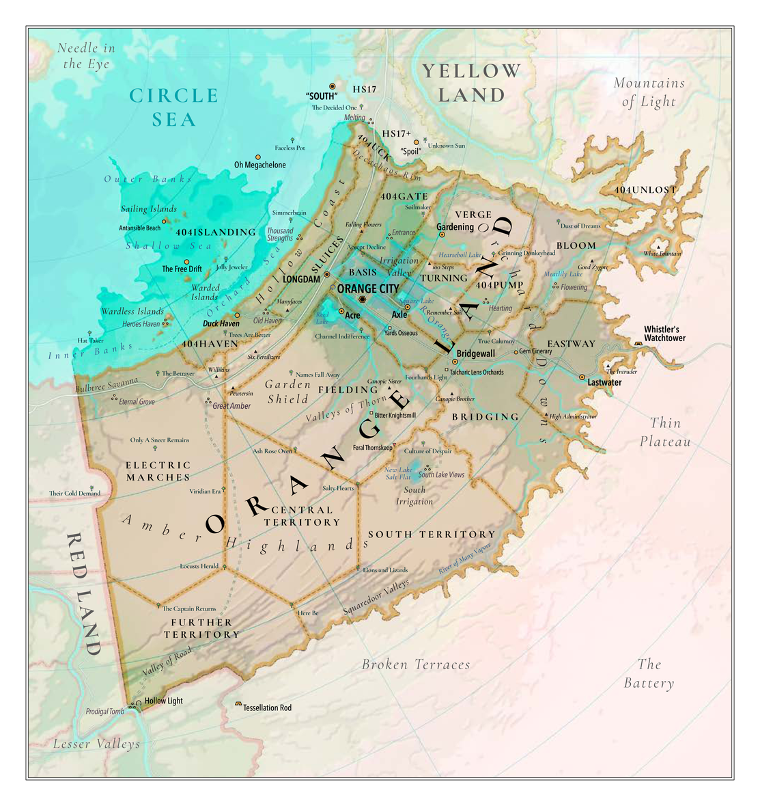](images/hires/page_0158_orange_land_map.png)

**Ambient, Great Valleys**

| d6 | Winter | Spring | Summer | Autumn |
|---:|:---|:---|:---|:---|
| 1–3 | mild yellow days; cold gray nights; drizzle | moist, slick, like oldwood; set for a fungal bloom | umbral lenses distribute the light into the night | clear days to ripen crops, mocking clouds |
| 4–5 | fog slinks into the canals; mist carpets the fields | sparkling air jellies; clear skies, morning dew | mosquito and frog weather, water drips from every pore | pale days, warm nights; summer's last gasp |
| 6 | silver static clouds like an electric blanket | amber rain to instruct the growing things | tornados, dry lightning, strange waves in the water | glowing clouds extend the growing season |

**Ambient, Highlands**

| d6 | Spring & Summer | Autumn & Winter |
|---:|:---|:---|
| 1–3 | hot, clear, with ultraviolet fire | white sunburn days, bonechill nights, screaming stars |
| 4–5 | cloudy, whipped by thin winds, diaphanous mists | gales at dusk and dawn, lights in the sky |
| 6 | storms, gritty rain, violent winds like cudgels | thunder, snow, wind, and ghosts to clog the lungs |

**Events**

| d6 | 1–3 Expected | 4–5 Surprising | 6 Error |
|---:|:---|:---|:---|
| 1 | Invasive grove of: (1) spy plants, (2) pickled polybodies, (3) head cabbages, (4) limb-back tubers. | "Supply chain issues" spike the prices of goods and services by two-to-tenfold. Things normalize in 1d4 weeks. | **Councilor** (L9, lich) hunting an escapee from an abandoned city, an older thing, something pitiable. Flee. |
| 2 | Malfunctioning **citizens dead** (L2, angry). Destroying them is morticide. Relentless chase lasts 1d6 hours. | Glowing oldtech fog swathes the area for days, scrambling necrotech and giving golems odd ideas. | Revolting **undead horde** (L2, uprising) is: (1) lost, (2) angry, (3) scared, (4) playful, (5) confused, (6) mournful. |
| 3 | Undead transport collapse. Lose 1d4 days. Stay at a ziggurat domicile for €2 per night. Avoid the ancestor pit. | **Ceramic-skinned citizens dead** (L2, kind) sucking insights out of a pack of pickled polybody pirates. | **Living & dead bandits** (L3, libertarian) out for: (1) garden goods, (2) bodies, (3) vehicles, (4) information. |
| 4 | Allergic reaction to the nutripaste. Recovery takes 1d3 days or €30 for digestive rebalancing. | **Cad agent** (L6, six-limbed) "offers" to interrogate you about your travel. Costs half a day and half your life. | **Anti-council cannibals** (L3, false) seek revenge for stolen relatives and passage to a free country. |
| 5 | Field of nutri-fluid skeletons covered in sticky sap. Harvesting the fauxbones is dangerous (net €1d6 x 50). | Dusk-till-dawn party palace turns out to be a buried ziggurat. Sacrifice in its bowels: permanent +1 to an ability. | Languid **proto-human ghosts** (L5, soft) offer treasure, deliver rubble and a gate to a derelict fast star. |
| 6 | **Human troupe** (L1, intrusive) out carousing: (1) party pilgrims, (2) carnibotanic guardians, (3) youth bureaucrat members, (4) friendly falschers, (5) undercover unfreds, (6) council envoys. | **Jolly locals** (L1, ragged) enjoying themselves by: (1) begging, (2) drinking themselves stupid, (3) dancing to death, (4) playing with old tires, (5) body-hunting, (6) plotting escape. | **Sentient ooze** (L9, tormented) of mulched minds, modified micromachinery, and bleating translucent flesh pulses through the canals. Reporting its existence is illegal and punishable by ten years as a citizen dead. |

**Travel**

The great valley has slumped into decadence, mutter the analyticals and intellectuals. So much the better for the pleasures to be had, retort the adventure tourists. Still, visiting the less popular sights is harder than before.

| Type | Status | Price |
|:---|:---|:---|
| Portal | A wide week-walk path links Oranje to the Emerald and Violet Cities. The path to Oranje is a mere €25, but exits cost €150 on a good day. The Cads prefer to export grain, not people. | variable [€25 / €150] |
| Right Road | From Longdam, a week to the Tollem on the Red Edge, a little more to Safranj. Food haulers have priority, so beware if using a private wicker wagon. Buses include food and drinks. | prime cargo [€10] |
| Coasthugger | Regular services are temporarily out of service, pending the resolution of some minor pirate events. Unofficial coasthuggers, or even seacutter berths, are easy to find in Duck Haven and the other ghost docks—and even reasonably safe. €5 and several days take you to the Sailing Islands, €10 and another week see you in the Red Land District or Decapolis. | unlicensed deckhauler [€5 / €10] |
| Airbeast | The gales, silver and glow clouds, and other agrometeorological oldtech structures make the skies of the Orange Land too valuable to leave open to private travel. The Cads may have fliers, but for the rest air whales graze on air plankton in peace. | restricted [€200] |
| Local (Irr. Valley) | Bone trains, undead barges, and porters are the main modes of transport. The locals will say, "if you're in a rush, you're doing it wrong." Fortunately, nutripaste and the mildly intoxicating beverage Instruction are basically free everywhere. | slow lane [€5] |
| Local (404) | Council-approved transport is not available for the unlost lands or the security territories. Duckie guides and grey-market vehicles such as off-book ancestor chariots or half-legal bycicles are unusually expensive. Be warned, nutripaste supplies are not guaranteed. | cash up front [€20+] |

**AMBER STANDARD HEDONIC STATION**

_"Your money is no good here!" declares the billboard atop the Garden Ziggurats. "The Great Hope provides!" announces the slogan fungus coating the granaries in a carpet of soothing truths. "Your pleasure is our treasure!" scrolls along the parapets of the dreambauchery house._ —From _Twelve Years A Tourist_ by Tarn A. Bassault,

The public slurry pump rattles and wheezes like a dying dragonscough victim. The hedonic card printer whirrs and clanks impotently. It does not recognize you as a Citizen with an allotted pleasure total.

The billboards mock your rumbling bowels.

From an alley, a bluelander in a vintage voidsuit beckons and mumbles, "Te qambo, change you, cash for cadcard? Yessi, top up?" Up close, the voidsuit reveals itself a pouchsuit, full of the necessities of pleasure and discretion a tourist might require to delve beneath the official skin of the Orange Lands.

**This ASHS Station**

Card in hand you slip into a corner store with a grubby sign marking it as an amber standard hedonic station (ASHS station). The vendor is a:

1. sleek four-armed anthropoid, prowling about like a cat, encouraging you to overspend;
2. grey-skinned human of uncertain provenance;
3. sickly-smiling falscher covered in cultist carvings;
4. wooden false skeleton, animated to serve;
5. glistening giant dressed in free sailor threads;
6. grim-looking free purplelander resident.

**Hedonic Burden Review**

Citizens Living of the Orange Lands do not need money—each is born with a pleasure budget to cover all their needs for the length of a standard efficient lifetime.

The Head Count University, a ministerial level confederate bureau of the Orange Lands governments, keeps strict time and energy records of every citizen to ensure a meaningful level of state function. Citizens Living whose total lifetime consumption would exceed their allocated pleasure, determined according to their pre-calculated needs, are politely encouraged to join the labor force of the Citizens Dead earlier than their statistical natural lifespan might indicate.

| d6 | Station Name | Personality | Specialty | Quirk |
|---:|:---|:---|:---|:---|
| 1 | Charrotte™ | smiling, grinning, biting | living fruits, dead fleshes | products have strange ideas |
| 2 | Gastric Pleasures® | cold, absent, slow | organic prosthetics | colors change with time |
| 3 | Happy Orchard Mart | dead, wooden, pungent | liquids viscous and vivid | pleasurable to keep you returning |
| 4 | NutriTourist VII | odd, off, oily | electric ancestors | share vital source codes to bond |
| 5 | Plough and Plate | loud, large, in charge | seeds to eat or sow | ingest to reveal gratis side effect |
| 6 | Vivid in the Flesh | spicy, silky, snakelike | flowers to forget | do not use or cook after midnight |

**Fresh Food Only**

| d6 | Item | Description | Price |
|---:|:---|:---|:---|
| 1 | Warm Nutrislurry | All the nutrients a human needs, dispensed from a synthetic teat. | "free" |
| 2 | Wallnut | Edible nuts that grow on the livingwood buildings of the Orangelands. A perfect low-ef fort food for foreign residents. | €1 |
| 3 | Fieldbread | Slabs of protein and carbohydrate extruded from a field dispenser. | €1 |
| 4 | _Instruction_ | Synthetic brain tissue inscribed with digestible skills such as sowing, hoeing, toing, or froing. Traditionally used to instruct zombies and other post-mortals. | €2 |
| 5 | Perfectmeat | Meat that melts in the mouth from an automated hanging ziggurat tower farm. | €5 |
| 6 | Manna | Pellets of flavor secreted by servile insect feeding on holy cabbages. Food of the Cads. | €10 |

**Traditional Orange Land Attire**

| d6 | Item | Description | Price |
|---:|:---|:---|:---|
| 1 | Citizen Suit | Party like a local in this comfortable bright orange onesie! Armor +1, ward +1, 1 st. | €5 |
| 2 | Ancestor Certificate | Chitin scroll box to certify you as an ancestor. Undead now ignore you. Ward +2, 2 sp. | €95 |
| 3 | Soft Body | Look alive in vegan flesh and artificial skin! Odd on the living. Life +2, charisma +1, 2 st. | €105 |
| 4 | Amber Cuirass | Giant amber crab shell grown to fit a human. Wired for electromagical combat: spend 1d6 life to recharge a weapon. Armor +5, ward +2, 2 st. | €250 |
| 5 | Spider Collar | Decapitated? This arachnofungal symbiote keeps your head alive and mobile. 2 st. | €350 |
| 6 | Cad Robes | Bone scutes interwoven with living cotton ropes and padded silk pockets. Hidden inventory (+4 sp). Armor +3, ward +3, cool, 1 st. | €750 |

**Order Maintenance Equipment**

| d6 | Item | Description | Price |
|---:|:---|:---|:---|
| 1 | Legstick | Wooden femurs grown with strengthened heads. Useful against ancestors. Close, 1d6, 1 st. | €5 |
| 2 | Citizen Knife | Small blade grown from your source code. Vibrates harmonically in your hands, dealing double damage. Close, 1d3, 5 sp. | €50 |
| 3 | Instruction Stone | Projectiles command undead to "flee" or "fight" (hard save). Set of 12. 1d3 dmg, 1 st. | €50 |
| 4 | Fang Sword | Sickles sung from local steelsap trees. Can carry poison. Close, 1d8, str or agi, 1 st. | €150 |
| 5 | Cad Whip | Short-circuits human, not golem, wetware. Stuns for 1 round on 16–20. Reach, 1d6, 5 sp. | €500 |
| 6 | Ziggurat Rod | Must be charged in the local Cad House. Bolts of electromagical plasma fry flesh and circuit alike. May draw phylakes. Long range, restricted, 3d6 damage, reload 4, 2 st. | €750 |

**Personal Travel Expression**

| d6 | Item | Description | Price |
|---:|:---|:---|:---|
| 1 | Bamboo Bicycle | The sustainable solution for healthy citizens living. L1, carry 2, pedal. | €25 |
| 2 | Bone Tregger | Rail cart using very degraded ancestors (category 5) for propulsion. L2, carry 8, slow, rail. | €50 |
| 3 | Canal Skirter | Hovercraft grown from reeds and air jellies with a bolt-on fan. L2, carry 4, loud. | €250 |
| 4 | Envoy Pod | Crystal pod riding the ancestral lines between Cad ziggurats. Includes amusingly neutered autopilot. L4, carry 1, fast, levitating, well-armored, immune to electromagic. | €3.2k |

**Approved Orange Land Comfort Purchases**

| d10 | Item | Description | Price |
|---:|:---|:---|:---|
| 1 | Ducky Doll | Playful tribute to the diverse Orange underclass. Posable limbs and five phrases! 3 sp. | €5 |
| 2 | The Postmortal Gourmet | Recipes for everyone, from great-uncle Umbert Scully to toddler Timaeus Truffaux. With humorous commentary by renowned ancestor chefs. 2 st. | €8 |
| 3 | Air Whistle | Emits ultrasonic squeals that chase away air jellies. Also works on oozes. 1 sp. | €10 |
| 4 | Air Whale Plushie | Soft, cuddly toy of the majestic air plankton grazer. Includes small booklet on these sacred creatures. Confirms your virtue. Ward +1, 1 st. | €15 |
| 5 | Ancestor Ring | Hums lost tunes and offers glimpses into the lives of the founders of the Orange Land. Made with authentic ancestor! Do not eat, inhale, or inject. 1 sp. | €20 |
| 6 | Finger Guillotine | Traditional Pre-Cad way to seal an oath or remember a fallen friend. Not for youths. 1 st. | €30 |
| 7 | Bonecraft Box | It looks like a simple toy, but its challenge can hide a precious treasure (1 sp). 1 st. | €40 |
| 8 | Necrarbre Seedling | Grow your own tiny skeletons! Impress your friends! 2d6 weeks for maturation. 2 sp. | €50 |
| 9 | Oranje Music Box | Opened, it projects entrancing holodancers. Save or bemused. Handcrafted. 1 st. | €100 |
| 10 | Precad Pamphlets | Illegal party materials that openly discuss the 404forgotten _süjgjes_ (don't speak settlements). Includes rumors of dark devices. May unlock sealed ancestral vaults. 5 sp. | €150 |

**FACTIONS IN AMBER**

_"The political scene in the Orange Lands is dead."_ —Sailing Islands joke

Two groups dominate this land: the Citizens Living, who enjoy the fully-necromantic luxury socialism of the confederated orange polities; and the Citizens Dead, who work until they are dust to support the pleasant lives of their living descendants.

A third class is gladly dominated: the Duckies (a corruption from High Common _Tei Oms Duchièmes_) are foreign residents, in the Orange Lands on limited-term contracts to do jobs the Citizens Dead struggle with. They are permitted to stay and pay taxes as long as they work, but must return home after finishing their tour of duty. Most Duckies have lived in the Orange Lands for five generations or more.

The fourth group is hardly a faction; rather, it is a voluntary benevolent association that gently and politely guides the confederation: the Council of Ancestors and Descendants. They are also known by their acronym, simply as the Cads (not to be confused with the Cats), their philanthropic activities excusing them from the hedonic review and other legal demands.

**Citizens Living**

_"The little citizen lives thrice as long!"_ —popular drinking ditty

Anyone can become a citizen of the Orange Land and enjoy the largesse of this wonderful state, so famous for its musical and party culture, as long as they accept the two peculiar institutions, the Hedonic Burden Review and the Labor Corpse Tax.

Cad legislators vigorously deny these two institutions explain why the contemporary Citizen Living averages just 120 centimeters tall, often too short to make a suitable agricultural worker in undeath. They say it is vile slander that many Orangelanders edit their source codes to reduce their size, since larger citizens consume more, expend their allotted pleasure totals faster and thus enjoy shorter lives.

♟ _Anvalit' Assunta._ The leading living fruit-pop performer and a key part of the Orange Land hedonic propaganda outreach program. Some whisper that she has received six life extensions already for her services to the Land. Others insinuate that she is looking for a way to escape her Agent handlers and flee to the Purple Land.

♟ _Parom Duije III._ A rarity among the Orangelanders, the bourgeois Parom represents a mercantile faction with outland holdings agitating for the right to purchase outland bodies to offset the labor corpse tax. His liberal politicking is viewed with possibly lethal distaste by some ultra-traditionalist Cads.

**Citizens Dead**

A Citizen Living legally becomes a Citizen Dead through the Labor Corpse Tax. Once they die, their body is reanimated and joins a labor corps until it is dust. Their family may generously keep a relic that will not interfere with the citizen's posthumous labors. For example, plantation and mine workers' heads are unnecessary in most occupations, so the family will keep the preserved head in their domestic Cabinet of Ancestries. More often they keep just the face or another keepsake the worker no longer requires.

Unofficially, foreigners, ferals, and other outsiders can also become Citizens Dead of the Orange Land. Some nearby barbarian clans have made a practice of selling their (or more often, their neighbors') dead to the Orange Lands and grown quite wealthy in the process. There's a reason for the Onion Skull saying, "plant skulls for profit, plant alliums for flavor."

♟ _Duger ten Zon._ This Yellowlander Green Nomad scion is spreading cash around the stoic tea houses favored by councilors and Duckies who deny the hedonic imperative. Duger believes their sibling was illegally inducted into the Citizens Dead, and they'll pay to have them (or their head) back. They'll pay even more to have the responsible body-mercs brought to the lawless unincorporated territories between the Orange and Yellow Lands.

♟ _Timox Boscafoc._ Made into a Citizen Dead due to a clerical error, Timox's case has made it all the way to the local Ministerial court. A resurrection for Timox could have drastic consequences for the whole radiant carnibotanic industry and beyond.

**Duckies, Tei Oms Duchièmes**

The foreign residents of the Orange Land are not a faction. They are satisfied to live in a well-ordered society, with a stable pre-cradle to post-grave social infrastructure. Their gratitude is supreme.

Any suggestion that the Duckies outnumber the Citizens Living 3-to-1, or that this could constitute a social problem, is antisocial heresy and punishable by an immediate period of post-mortal labor not shorter than 10 (ten) years.

Some scholarly outlander vidy-personalities have implied that the Duckies view this term (viz. Duckie) as a slur and prefer to be called Uncitizens or the Frees. These vidy-personalities have been banned from entering the Orange Land on pain of 25 years of post-mortal labor.

♟ _Sunta Haf-Nor._ An illegal war-chief of Our Haven (Duck Haven) is hiring brave warriors to join the Dead Eaters in Old Haven, perhaps with an eye to making a move on the Cad infrastructure-fortress of Longdam. How are they bribing the phylake Trees Are Better to keep its blind eye turned away?

♟ _Kolka Uz-Mund._ A leading accommodationist politician among the Eastern Duckies has been embroiled in a salacious scandal involving oddly shaped fruits and a Yellow Land opera troupe. But this may just be cover for an illegal Bloom settlement operation by unregistered Uncitizens.

**Cads, Council of Ancestors and Descendants**

The Council, the Cads, embody the will of the citizens living and dead. They shepherd Orangeland humanity through this grim _seculum_ between the Divine Silence and the Maker's Awakening. They are your friends.

♟ _Akaula Mun Regolis-12._ The dozen Akaula councilors, members of the same clan, are rumored to be a polybody lich. Well, it's the polybody part that would be scandalous. And yet, each of their faces is unique, supple and surprisingly plastic. Everyone who has spread it about that Akaula has been dabbling in accursed Lingish necrotechnologies has been found guilty of treason and joined the Citizens Dead headless labor corps. Ah, right, anyway, Akaula is putting together an expedition to the Far East, to suborn the Sister Servitors. Care to join?

♟ _Presid' Temmorle._ The top councilor of Further Territory has not been seen in a dozen years. Since this has finally been discovered, it would be good to check whether Red Land agents have destroyed her.

**THE NECROTECHNOLOGIES**

_The theophysics of this made cosmos give us the observable fact that it is constituted of three levels of matter. The substances of hyle, pneuma, and psyche. In the arcane Builders' language; the ha, ka, and ba. In the low dialects, body, soul, and mind-stuff._ —Aïdu Hylo, _No Matter: A Study of the Tricycle of Existence_, The Free Drift Corrective

If there is any land that has truly embraced the possibilities suggested by triform structure of the Cosmos of the Given World, it is the Orange Land; which has built its entire economy on the society-wide necrotechnology made possible by the tripartibility of each Human 'dividual. As alluded to in Aïdu Hylo's text, these parts of each thing-in-itself (_Ding an sich_) are:

⚙ **Hyle, body, ha.** The underlying substance, devoid of qualities and form, but capable of any quality and form. The stars of the cosmos above, reflected in the bricks of the polis and the flesh of the citizen, mirrored in the mass of the earth below.

⚙ **Pneuma, spirit, ka.** The superior substance, the rarefied body, the fire of creation. The active, generative principle that organizes the world and the human person.

⚙ **Psyche, mind, ba.** The unique formal matter, extant through space and time, the lived material trajectory of a consciousness. Each mind is a shard of the great mind, each sentient being is an eye of the cosmos watching itself. Its relationship with its world is each psychic body's relationship with itself.

**Resurrection Impossible**

It is a dirty secret among most reanimators and portal engineers that a destroyed sentient being can never truly be brought back. Whether that sentience is a mosquito or a mushroom mycelium or a man, their individual sentience is embodied in space and embedded in time, a perfect coherence of hyle, pneuma, and psyche. Once those components are decohered, that entity is ended.

Even if those components are recombined, the result is not a continuity.

It is a new-birth or rather new-creation. A new 'dividual is formed, shaped to resemble the one who was before, but not precisely the same.

When a traveler is translated through a nullportal, they dissipate and a _new them_ takes their place in society. When a warrior dies in battle and is rebuilt in a reanimation vat, that new warrior is a copy who shares their memories and specific skills.

Among lay society, pretending this is not so makes life more tolerable.

And the convenience of fast, easy, painless travel and return from the dead is so alluring.

And yet, once a 'dividual returns to the Cosmos, they are of the Cosmos for their old spiritual eye has closed and a new one must of necessity have opened.

This offers the necrotechnologist or tricycler, as some call themselves, certain opportunities; that is to say, when they reconstitute a 'dividual they can adjust the constituent parts to repair flaws of character, soul, or form, adapting them to better fulfill their role in society or grow into it over time.

**Necrophony**

When the Dream Canopy was untattered and the Lords tended both Garden and Noösphere, there were no dead for the disembodied minds dwelled in their set Heavens, close at hand to their quickened descendants.

Now their voices fade, yet necrotechs can still reach across that gnawing silence and drag forth fragments of 'dividuals past. Some say the void-sea of the dying heavens is hungry for conversation and that the more a necrotech practices, the more it hungers for them.

A cycle of communion powers is used to access these lost voices, their quality scaling with power level:

**Whispers from the Void**

_Transmortal Communion_

**P:** 1–8 (variable) **R:** touch

**T:** a dead relic **D:** a few minutes (see tiers)

> You press the relic to your skull and let your mind drift across the void-sea of nonexistence. Your eyes roll, your teeth gnash, strange post-mortal tongues spill from your lips, as you hunt the threads of consciousness remaining in the All-Mind. Then you bite and hold and drag the ghostly psyche out into the light once more.
>
> | d8 | Psyche | Result |
> | --- | --- | --- |
> | 1 | **Fragmentary Whispers** | The conversation is halting and crude; the ghost’s attitude suffers. |
> | 2 | **Naked Coherence** | A thin, strained voice emerges—barely workable for a normal exchange. |
> | 3 | **Drawn Spirit** | Attracted to your _vis viva_, the ghost brightens and becomes eager to speak. |
> | 4 | **Dominated Ghost** | Your force of will compels three clear answers, regardless of the psyche's mood. |
> | 6 | **Dawnbound Servant** | You bind the mind until sunrise; it must remain and respond. |
> | 8 | **Echo Consumed** | You swallow the ghost whole, trapping its essence in your mind. You can rifle through its memories, speak with its voice, and use its knowledge like your own until sunrise. |
>
> _Overcharge:_ You anchor the psychic ghost to the relic for a year. Thus bound, it cannot flee, but grows stranger and more resentful as the weeks pass. _Dangerous (6+):_ When you spend 6 or more life on necrophonic communion, you risk corruption—the lost minds' grudges and regrets becoming your obsessions.

**The Chattering Dead**

The beating heart, pun intended, of this old science is talking with the psyche of a dead 'dividual. Opening a channel is simple for a trained necromancer, but the dead are fickle. A ghost may ignore a novice entirely, and its arrival is usually heralded by strange signs, shifting moods, and odd hungers.

| d20 | Ghost's Attitude (affected by Charisma) |
|---:|:---|
| 1 | The hungry dead attacks, corruption afflicts you. |
| 2–6 | The decadent dead refuse to talk. |
| 7 | The cruel dead demand sacrifices for answers. |
| 8–11 | The superficial dead miss the weather. |
| 12–15 | The curious dead give at least one answer, though it may be evasive, unreliable, or simply wrong. |
| 16–19 | The weak-willed dead are compelled to answer. |
| 20+ | Your golden words bind the ghost to serve as a guide, answering questions but little else. Imbue a 1-stone reliquary with 1 life to tether the ghost. |

A given ghost may be called three times; if it refuses the necromancer each time, it can never be called again.

**Mortirobotics**

When the Garden was young and its Path clear, there was no labor for the first humans to perform: servants of sculpted metal and moulded light and directed force created all that the first humans could want, for this was Heaven. Alas, the humans' bestial impulses perverted them in their leisure and the Lords gave them work to steady their minds and soothe their souls. Still, this was not good, for with knowing hands and probing thoughts, the humans grew prideful and sought to overthrow the Garden, and this was not good.

The solution to achieve the ten-million dream of the Garden Path, the eternal survival of humanity at the end of time, the permanent preservation of civilization, was work without skill, toil without consequences.

Yet, humans still needed to be fed and clothed, tested and distressed, equipped and delighted. But the Lords were absent in these twilight times and the Builders were growing weary. Some turned to subhuman castes of maintainers to keep the old servitors going, others worshipped alien creatures of twisted mind to give them direction, yet others rebelled against the Path and brought the threat of the Lords' Jubilee upon themselves. But, in the Orange Lands above all other lands, the lich-lords saw into the hearts of humans and the Dreams of the Lords and the looping paths of the Garden Path, and divided the labors of humans between those they would perform when living and those they must perform when dead. Replacing the need for unreliable golems, for fallible servitors, for rebellious castes, they embraced the practice of mortirobotics, creating robots from the corpses of their citizens, dead drudges to toil for the good of the community. Over the ages, mortirobotics has become a science liberating the living to lead lives of culture and pleasure and social service.

**Prior Citizens**

Who was this worker before they became a worker? In what shape is this citizen dead?

| d6 | They Were ... | That Was ... | They Are |
|---:|:---|:---|:---|
| 1 | a poet | renowned for their beauty | decaying after decades of misuse |
| 2 | a glutton | graduated into the labor force at barely twenty | Headless, as is usual for a field skeleton. Their head is probably under their descendants' floor. |
| 3 | an ingénue | centenarian relative of a Cad source-line major mind | Preserved with nutri-fluids and wired for quick reflexes. A combat ghoul. |
| 4 | a traveler | oddly Bluelanderish in appearance | Stitched and repaired after a harvester incident. |
| 5 | a feral | made a citizen just a week before dying in quarantine | Are human zombies supposed to have horned brow ridges, white fur, and four arms? |
| 6 | a shipment of edible root vegetables | sick with a deadly cold and joined the work force to spare their family the medical bill | Sadly covered in graffiti. When will the young learn that the iniquities they visit on their elders will also be visited upon them in time? |

**Reuse the Shell**

_Post-Mortal Resources Onboarding_

**P:** 1–12 (variable) **R:** breath

**T:** an articulated shell **D:** while imbued

> You blow life force, spirit, _ka_, into a prepared shell: a cleaned skeleton, a preserved corpse, a synthetic body, or other suitable physical form; imbuing it with a post-mortal vitality, creating a mindless servant that will perform its task indefinitely (or until it erodes to dust).
>
> It animates within a few hours. New instructions should preferably be properly encoded, to avoid errors.
>
> **1 Failed Shell:** Moves, but won't follow commands, a useless **müßiggänger** (L0) or idle-ambler.
>
> **2 Basic Shell:** The shell awakens into a shambling parody of life, a **langsamgänger** (L1) or slow-goer.
>
> **5 Hope Shell:** Mortirobotic forces boost the shell's power, creating a post-mortal capable of carrying greater loads and leaping over obstacles—a **hüpfgänger** (L2) or hop-lurcher.
>
> **8 Premium Shell:** Using a properly marinated, pickled, or mummified shell, scented with rare aromatics, and polished with nacreous oils, lets you craft a **lebendgänger** (L3, rosy) or live-walker, a post-mortal shell suitable for human-facing roles.
>
> **12 Dangerous Shell:** For security purposes, a swiftghoul or **fressgänger** (L4, ravenous) is what you're looking for. This type of shell barely requires instructions; since it requires so much sustenance to function at its usual, heightened metabolic rate, it will attack and devour digestible organic matter unless specifically restrained.
>
> _Overcharge:_ You knit an echo of the shell's _ba_ or mind to the instruction _lemma_ stored in its head (usually in an ear or nostril for easy access), giving it a semblance of human intelligence and the ability to act independently. _Dangerous (9+):_ Corruption risk if you spend 9 or more life.

**Skeletal Necronataly**

The Cads have experimented with generating citizens dead who bypass the need for citizens living retiring from a life of leisure. One promising new technology is skeletal necronataly, the direct growth of new skeletons in carnibotanic plants.

The necrarbre develops large, fleshy sacks, similar to a very large jack-fruit. Within, the modified seedstock grows to form a ligneous endoskeleton. After the skeleton is 'born' from its fruit, it is taken to the meating place, where viande vines grow over it, coating its bones in a new living flesh.

There are still some durability problems with the new carnibotanic citizens grown, but they offer a promising solution to the shrinking citizen issue (which is officially totally not a real thing). This ligneous shell is (d8):

1. Stronger in the sunlight due to residual photosynthetic activity.
2. Highly flammable due to resin pockets.
3. Useful as a floatation device.
4. Very attractive to bees.
5. Good at hiding in shrubberies or undergrowth.
6. Surprisingly thorny. Do not grapple.
7. Prone to rooting in place.
8. Hollow as a drum. Could be a great place to hide things. Or build a bird house.

**Pneumenergetics**

Where necrophony deals with accessing the residual _ba_ or minds of the deceased and mortirobotics seeks to find new uses for old flasks or shells, pneumenergetics, the queen of necrotechnologies, seeks to turn the very motive fire of the departed, their spirit or _ka_, into raw energy to sustain the Dream, to prolong the Garden Path. Souls are harvested and refined using one three traditional technologies:

⚙ **The Soul Mill.** A wonderful piece of buildertech that renders the _ka_ of a sentient, soul-full creature into distilled, usable energy—soul juice, ka-cubes, pneumatic pearls, or raw soulmatter. A linked pneumelectric plant will generate enough power for a small settlement for a number of days equal to a creature's level + aura + charisma. Visceral energy (life) condensed to pay for powers amounts to 10 times the number of days.

⚙ **The Psycheclave.** A self-sealing semi-sentient machine that traps a soul inside and uses a combination of pressure, heat, procedurally generated daemons, and accelerated time to extract vast amounts of energy from a single soul. A soul generates enough power for 5 households per its level + aura. While this is less energy at once than a soul mill provides, the psycheclave can continue extracting this energy for a number of _years_ equal to the soul's level + charisma, until it is exhausted. It generates visceral energy (life to pay for powers) equal to the soul's level each day.

⚙ **The Ka-Cracker.** A rare portable piece of Builder kit, passed from Councilor to Councilor, the _ka_-cracker is large enough to hold a human head, since that is where the soul traditionally attaches to the jewel or pineal gland. The _ka_-cracker is quite inefficient, stripping only part of a soul, generating an amount of visceral energy (life for powers) equal to the generously donated creature's level + thought + charisma - aura. Still, this is often enough to reanimate the target's shell as a slow-goer or even a hop-lurcher.

Some soul-thieves of little repute use little understood ancient powers, but these hardly generate enough reliable spiritual energy to maintain a power grid.

**Siphon the Soul**

_Spiritual Energy Extraction_

**P:** L (variable) **R:** touch

**T:** a creature with a soul **D:** instant

> First, prepare a battery, bottle, or other soul storage device. Second, ink the required metaphysical equations on your designated hand. Finally, strike your chosen self-offering, who is willing to give of their spirit. The price of the power is equal to the target creature's level. You and the target both roll saves, but you add your level to your save. Oh, wait, the target was a willing self-offering, right, so they're choosing to fail their save, right?
>
> | You | They | Effect |
> |:---|:---|:---|
> | Fail | Fail | Each of you loses one level. |
> | Fail | Pass | You lose one level. They gain temporary life equal to your level. |
> | Pass | Fail | They lose one level and life equal to your level. You gain temporary life equal to your level, ready to store in that device. |
> | Pass | Pass | They lose life equal to your level. |
>
> _Overcharge:_ You withdraw double the visceral energy, that is, the amounts of life lost or gained are doubled. _Dangerous:_ This spell definitely risks corruption.

**ARAÑA'S LUDODROME**

_"Once this was a place where humans ran and leapt and danced for the Vile Ones' pleasures. Toys in a cephalopod jest for bored immortals. Now, we dance to die in ecstasy, to conclude our lives in pleasure, to return as citizens dead, to become the workers of our children's leisure."_ —Last Dances 7:23, Pleasurable Duties, Orange Agitprop.

A grand bowl, with seats for a hundred thousand humans and ten thousand times as many ghosts. They gather once a month to watch the last dance, when the Living become the Dead, ready to labor for their society.

Tourists, thrill-seekers, self-sacrificing pilgrims, and foreign prisoners also join in the terminal festival. They may drink and eat, but the devoted take only _instruction_, the soul juice that takes away pain and gives motive.

Disreputable Duckie bookmakers take bets on which dancer will last the longest, if any will survive for seven days and earn a second life.

Some say **soulless ferals** (L1, iron humans) dwell in the very lee of the Ludodrome, protected from the Hedonic Bureau by an ancient pact (or curse?) with the Orange Godness of Araña. Others also say they are implicated in an apocalyptic prophecy, but this must be false, right?

**Orange God, also Dancing Lord Araña**

Ash and bone dust mutter. Their gem is amber, their beloved the spider, their gift-plant the cotton tree.

"The kind weaver, the gentle keeper, the tender and producer. They that gives meaningful labors to open the garden path to all humans. But also, the breaker of backs, the wringer of blood, the scourge of leisure."

**Prayers to Orange Araña**

Once per session or so; when tired, footsore, hard at work ... abjure Araña for your due respite:

> "Wheel turns, back breaks, feet fray—orison! Oscillation!
> The work goes on, but I cannot ..."

**Roll d20 + Aura - Endurance**

| Result | Effect |
|:---|:---|
| 1 or less | Energy and will drain from you. Lose 1 level unless you sit down to rest. |
| 2–19 | Hold your rolled number like grit in your machine. Once, when you fail a roll due to your burdens, add it as temporary life. |
| 20 or more | A last gasp of life hidden in your weary bones. When you would gain a new burden, spend it to avoid it. |

**ORANJE — THE CITY-LAKE PLOUGH**

_"In the heart of this fertile plain, like a vast_ _brooding mother, blossoms the garden city of_ _Plough, Oranje to the locals."_ —Ostotel Perji, _Children of the_ _Orchard_ (Flux Dandelion II)

**Background**

The core of the Orange Land is the great Builder-dug depression named Irrigation Valley, formerly known as Great Face Lake, where the Maker's Face was kept alive as a freshwater colony reef organism for the gods and the humans alike to marvel at Its perfection. The Last Masters of the fabricator orchards drained the lake, creating a landscape crisscrossed by canals, pumps, fields, deadhouses and command mansions.

Ancestral legends hold that this is where the power of the gods failed and the Garden crumbled. The Last Masters shed their stewardship, sidestepped the deaf gods and brought the Maker's Face to their side, transforming themselves, their fabricators and the face into a tri-symbiotic combination simply called Oranje.

The lake Plough, filtered, processed, and dreamt, thick with colony symbiotes, keeps the minds of dead Citizens in suspension. It travels around Irrigation Valley, consuming nutrients, memories, and spirits to fuel its ongoing vibrant existence.

The enormous pylon walkers, the former fabricator orchards, walk with the lake, supporting their megaton bulk on the cushion of living water and providing a platform to the Citizens, Ancestors, and sessile stages of the pre-Builder reef organism that has become Plough.

Finally, the undying Masters have become the Councilors of Ancestors and Descendants who commune with the lake Plough and divine the voices of the past to shepherd the living into the future.

**Notable Pylon Walkers**

_**Pool of Faces.**_ Serried ranks of terraces look upon the great Pool of Faces where the lake Plough manifests the faces of the dead to commune with the Councilors. The highest liches of the C.A.D. have their apartments here.

_**House of Skulls.**_ Here the heads of ancestral councilors, heroes, agents, poets, and other notables are stored for easy access by the Citizens. A small town dedicated to the necrophonic arts and dead music abuts the storage.

_**Memory of Sin.**_ The precise memories of the greatest of hedonic excesses are kept here under careful watch, accessible to those brave and rich enough to purchase intimate communion with the stored relics.

_**Green Sun Deck.**_ A celebration of the new sun, the pylon concentrates the sun's spiritual energy collected by the Lake Plough and distills it for the national security and psychic stability of the Orange Land.

_**Stairway to Cargo.**_ One of the central offices of the Hedonic Burden Review. The holy luxuries are weighed, numbered, and redistributed here, to ensure the hedonic budget is properly allocated.

_**Last Effort.**_ The Citizens Living who have the honor of becoming Citizens Dead are reprocessed here, infused with solar juices and re-spirited for the greater good.

_**Delta of V.**_ High net value tourists and resellers are welcome to this pylon walker where lost pleasures are packaged and sold as immersive vidys. Some say other abmortal procedures are also available for purchase.

**Current Oranje Location**

The lake Plough slowly travels around Irrigation Valley; its current location is (roll 2d6): (2) under Manyfaces, near Old Haven, looking at the unreachable sea, (3) at the ruins of Entrance, (4) near Acre, (5) near Longdam, (6) near the House of Surfeit Delights, (7) Basis Province, (8) near Axle, (9) Turning Province, (10) near Gardening, (11) near the Yards Osseous, (12) up the River Orange, near Bridgewall.

**Ambient**

Sparkling amber mists linger over the surface of the lake Plough, greenery grows from every pore on the pylon walkers, the air is thick with perfumes, spores and air plankton, messengers all between living Lake and abmortal Councilors.

| d6 | Long Dawn | Slow Noon | Endless Dusk | Luminous Night |
|---:|:---|:---|:---|:---|
| 1–3 | rosy sprites, dawn fungi, embracing yellow lights | warm red skies, moist orange lights, breeze | blue-fingered shadows, rich scent of growing things | purpling shadows, orchestral frogs |
| 4–5 | flickering air jellies, sparking dew, spreading slimes | languid, jangling air, thick amber fog, distant slow bass thump | floating lenses, rich waters, tubular bells, moans | clouds, copper smell, moldy air, crawling gelati |
| 6 | rising waves, faces in the amber rain, bio-instruction | silver static in the windows, wheezing waters, pale anti-shadows | animalcules, organ wails | string music, click-clack |

**Events**

| d6 | 1–3 Expected | 4–5 Surprising | 6 Error |
|---:|:---|:---|:---|
| 1 | Waters share unwanted memories. Drought. Lake moves, water drops. | Test music to distinguish different types of visitor, Citizen Dead and Citizen Living. Please keep dancing. | **Water dragon** (L11) appears. Panic. |
| 2 | **Zombified ex-revelers** (L1, living 2 dead) from the feral wastes working off their Council debts. | **Council agent** (L3, venomous) offers a deal: contribute a citizen dead and earn a decade-long public travel pass. | An **avatar of many faces** (L14, hurried) emerges from the pool with an urgent prophecy. As it loses faces, it dies. |
| 3 | Decaying floating garden, its director killed by Unfred terrorists, its **Citizens Dead** (L2, hungry) gone feral. | **Pylon walkers** (L17, deep-thinking) rearrange themselves to discuss topics that don't concern humans. | **Undercover cad agents** (L6, fanged plastic) hunting for secret saboteurs. |
| 4 | Floating garden bar offers local produce, mummysnuff, good times. | Undercover **sailing isles pirates** (L2, plastic) hunting for archived oldtech. | Last chance club ticket to a party to the death at the Last Effort pylon. The hedonism will be supercinerary. |
| 5 | Memory dive bar lets you take soma and lose a day, a week, in a long lost era. Pretend you're still in heaven! | Lascivious labyrinth offers timelost pleasures to the adventurous tourist. Beware the **wall-rats** (L2, parasitic). | **Avatar of a dead god** (L15, decayed) accidentally summoned by careless weird cultists. It brings: (1) derangement, (2) bliss, (3) plastic sheeting, (4) faces, (5) pain, (6) reincarnation. |
| 6 | **Vacationing tourists** (L0, harmless) invite you to join their: (1) anti-stag party, (2) dead music festival, (3) psychotropic parade, (4) dirge dance, (5) reanimation, (6) resurrection. | **Hell-bound hedonists** (L4, gang) on a lake cruise. They are: (1) illegal cultists, (2) weird cultists, (3) cannibals, (4) stand-up comedians, (5) drug dealers, (6) aristocratic bohemians. | — |

**Places To Party**

| d6 | Place | Description | €/week |
|---:|:---|:---|:---|
| 1 | Stackbone Stays | Affordably stacked modular rooms. Basic amenities and a communal vibe. Ignore the soylent plant. Ideal for budget parties. | €5 |
| 2 | Canallieri Camping Ltd. | Scenic camping spots along the canals. Rent tents or bring your own. Nutrient slurry on tap. Please do not feed the living waters. | €10 |
| 3 | ZigguRat® Inns | Mid-range chain repurposing brutalist ziggurats for the service economy. Simple, yet comfortable. Grilled rat breakfasts a specialty. | €15 |
| 4 | Golem Gardens | An odd Duckie brand. Lush, and tended entirely by golems. No zombies allowed. | €25 |
| 5 | OP Party Boat Rentals | Vibrant canal cruises. Cozy thematic cabins. Live and dead entertainment. Casinos! We ask living guests to please not go below decks as the rowers, engineers, paddlers, and other motiles might slip their controls. | €50 |
| 6 | Amber H!Story Towers | Upscale rooms decorated to honor different historical eras. Each has an authentic interactive ancestor on display. Please do not feed your in-room ancestors. | €100 |

_Accommodations also provide ticket dice: €5 = 1, €10 = 2, €25 = 3, €50 = 4, €100 = 5._

**COUNCIL & 404 PROVINCES**

_The following unreconquered_ ~~_rebel_~~ _evil provinces (404 gowoz) may cause some temporary travel inconvenience._ —outdated and outlawed travel guidance to the unserviced regions of the Orange Lands

A brave academic or a foolhardy tourist may get their hands on a highly illegal political _map_ of the Orange Lands, rather than the travel _itineraries_ approved by the Council for Tourism and Leisure Travel [sic]. Said academic or tourist may notice an oddity, namely that many of the provinces are prefaced by the age-old mystic number 404, the number of the Unknown and Lost.

These provinces are taboo within the Council provinces of the Orange Lands, their very mention punishable with immediate labor duty among the Citizens Dead.

Therefore, we shall not mention them.

**Council Provinces**

Instead, we shall mention the pleasurable provinces under the benevolent, eternal and perfect stewardship of the Council of Ancestors and Descendants, where, if you are lucky, you will even see a Council Agent!

_**IV Provinces.**_ The heart, the IV drip, of the Orange Lands are the provinces of the Irrigation Valley, home of the traveling lake-city of Plough-Oranje. Their verdant waters and floating gardens, both tended by countless (actually roughly 20 million) Citizens Dead, are the cornucopia of the Rainbowlands. Truly, all manner of delights are available here, and an ivory servant is always at hand to ensure one's comfort and delight. These provinces are Basis, Fielding, ~~Gate,~~ Sluices, Turning, and Verge.

_**Highland Provinces.**_ The frontier, where the Irrigation Valley will expand once the buildertech is reactivated, includes the provinces of Bloom, Bridging, Eastway, and Verge. These lands are emptier, the laboring citizens dead fewer, and thus one comes across more Duckies in unauthorized manufacturing or agricultural activities.

_**Amber Territories.**_ Falsely claimed by the disgusting anti-humanist Red Land Vintners, their Vinterns and Vampires, the territories Central, Electric, Further, and South are completely under the control of the Cads and their shock-mummies. Suggestions that enterprising Redlander bloodwine cultivators have infested the Eternal Grove in the Bulbtree Savanna are absolutely false and there is no way the Council will ever be dislodged from beneath the gaze of the glorious and well-controlled Betrayer.

**Meetings With Council Agents**

When you meet a Council Agent, present your Hedonic Recordbook for review, to confirm your ongoing right to the infinite pleasures afforded to every Citizen of the most pleasant of republics.

| d6 | Their Ride | Their Manifestation | Their Will | But, Quietly Also |
|---:|:---|:---|:---|:---|
| 1 | A gleaming carriage of brass and livingwood. | The flesh copy of a Council meta-judge. | Drink from their nutriteat to abolish your doubts. | Eyes grow in blossoms of plumeria and talipot. |
| 2 | A barge of synthetic ivory and chelonian flippers. | Holo-dramatic visions of a Council historian. | Look, prod, spy, and root for corruption and heresy. | Snails with electric blue shells swim and crawl. |
| 3 | An autogolem truck of apricot and plum hues. | Liquid essence of a Council homeotherapist. | Sample the waters, study the interlopers. | Living tattoos, symbiotic messenger colonies. |
| 4 | A booth of rubber and steel and glass. | Gently embracing steel-and-glass Council medicus. | Suck air, drink sunlight, rest old bones in radiation. | Amber rain from silver clouds, whispering mists. |
| 5 | A levitating pyramid of tawny brick & lapis scutes. | Electric ghosts of a Council administrator polymorph. | Instruct the trees and grasses of the land. | Glowing shadows woven as a cloak to hide from men. |
| 6 | A giant, ten-foot tall, man of iron, with a glass visor. | A Council guardian's noble, mummified visage. | Measure needs and means, revise hedonic tables. | Scribe monkeys with ivory and ebony tabulators. |

**The Near Upbroad**

Only well-equipped warrior merchant caravans brave the soaring heights of the Thin Plateau and the Broken Terraces, where strange autofactories and archaic subcommunities struggle in that fabulous way sub humans, unblessed by abmortality, must. The journey to the fabled oriental cities is thus often a lonely one—and short on oxygen.

**Free Orange Provinces**

_"These time-stuck liches and their four-armed cad servants had their time, once we revive the Araña, they shall learn the true purpose of Nature-born humanity!"_ —salvaged logs from the fall of Old Haven, subversive literature, double-double redacted

_"All along the Hollow Coast, pyres burned, a glorious illumination, a hecatomb of our stolen Ancestors, returned to the pre-divine cycle, ash to fertilize the Green to be recycled by the Given World!"_ —mad ravings of the captured Pirate Priest-Poet Twinbarrel Uolcsird

_**Sailing Islands, 404Islanding.**_ Free for over two cycles, a haven of freebooting, thick with dwarves and cetaceans, liberator of the Warded and Wardless Islands, scourge of the corpse-lovers on the Hollow Coast, beacon of human liberty against the dead hand of the post-mortal order.

_**Hollow Coast, 404Haven and 404Uck.**_ Little left to see but empty deadstone towns and swirling dust, the post-mortals savage all attempts at settlement here. The port-fortress of Hafnorsk (Duck Haven) stands here as a sanctuary for the Citizens Living fleeing the tyranny of their Hedonic Bureau's corpse tax.

_**Sudopol, Pseudopolis, "South" HS17.**_ Claimed as Outernorth by the post-mortals, it always was and will remain a font of independence against the anti-Human lich-lords of the Orange Lands. Citizens and friends of this settlement claim to have access to a fundamental truth or revelation about the human condition thanks to the whispered secrets of the Fourflesh Teratolith uncovered in [redacted]. The Council threatens all evangelists of this "heresy" with purification in the solar farms.

_**Fire Provinces, 404Unlost, 404Gate, Bloom.**_ The lich-lords blame the crafty, gold-eating Gelvolanders (Yellowlanders) of Safranj for the theft of the ash-soil farming region. The local residents fear the Council wants to mulch them back into their Citizens Dead collective if they ever "recivilize" the region.

_**Heartland, 404Pump.**_ The Council confirms this province never existed and no settlements were ever established here. No free residents ever escaped. Sales of lifelike human weepstone sculptures from the region are restricted due to their toxic radiance.

_**Roadvalley, Further Territory.**_ The Council claims the foreign residents of this province were not instrumental in the Redlander theft of this territory and as such will be permitted to join the Citizens Dead after they return to the fold. The Roadvalefolk refuse any discussion of such ideas, elect their own Vintner Lords-for-a-Year to rule them, while sabotaging roadmakers sent from the Central Territory to knit them once more to the body Orange.

**THE MUTE PLACES**

_..._ —Protests of the Citizens Dead, a symphony in 3 acts

In a Land where the post-mortal labor force outnumbers the living citizenry by twenty-to-one, there are many places where birdsong reigns while the silent laborers perform their toil day-moon to day-sun without cease.

Save for the occasional clatter of a necromancermanager's voiture and the bark of their willsniffer hound (for the development of free-will in a reanimated shell has an odor all its own, a hint of citrus and ozone, like a purple haze descending from a slow star), these places work like quiet clocks, tracked by silent eye-plants and other biomechanical watchers, extracting produce to fill the groaning road trains and wheezing cargo cruisers that feed the Yellow, Orange, and even Purple Lands.

**Silent Approach**

Draw closer to the mute place. Feel your aura pale.

1. No small creatures. First no midges. Then no flies. Then mice, even birds disappear.
2. The day-stars fade, the fast-stars slow, the sky grows gray like dead god-screen.
3. Cold leaches from ground and sky. Frost flowers blossom in shadow and crack.
4. Eyes water, depth drains away, all grows flat. Voices, reasons, dreams.
5. Coiling ironthorns, warning vines sprouted from the soil itself by the power of the Builders. "Away!" they seem to say.
6. The ground becomes glass. Sand, rocks, buildings, rails, roads give way to scratched translucence.

**Here, Now, Somber Monument**

It surrounds you, clusters in, drawn by your words, your vitality, your malleable nature. Feel your aura shrink.

1. Houses and halls insubstantial as ghosts, flickering echoes of past lives, trapped behind the veil of Error.
2. Ominous tumuli cloaked in heather and hellflower. The wights of a lying age bound in torture tombs. They cannot be released, they are but lessons against the hubris of man.
3. Bricks. Boulders. Shells of sandstone. Bars of rustless metal. Contorted parts. Destruction preserved in amber time. More lessons.
4. Silent plazas. Pretty porticos. Memorable mosaics. Abandoned autogolems. Living dust to scour every surface, polish and preserve for masters never to be seen again.
5. Gardens of rutile roses. Parks of olivine oaks. Towers of carnelian corpses. A decayed visitor center. Posters commemorating a petrifying plague.
6. Sigil-warded, sign-posted, sarcophagus-entombed. A great square mountain. Within, they don't say but one suspects, an autofaber. A rogue creation machine. A false god.

**They Call This Place Home**

Life, says the poet, finds a way. Feel your aura flicker and snicker.

1. Ghosts, **living ghosts** (L0, plasmic). Naked ka-ba sentiences, unbound from the gift of flesh, they suck vitality from the bonds of this place.
2. A **radiation of rabbits** (L1, tool-using), grown bold and rat-like, with grasping hands and snarling eyes.
3. **Ground vultures** (L3, huge), therapod in proportion. Immune to the dark aura, they wait for visitors to drop into inevitable catatonia.
4. **Dog-sized ants** (L0, modular), pack dividuals, smart as a man if assembled.
5. **Falschers** (L1, punctual), golems of manflesh perfect in every way, save without spirit or mind. They perform their routines, reproduce, and self-repair in the crystal cabinets prepared for them by long-dead masters.
6. **Recusers** (L1d6, translated) who abandoned the path of humanity long, long ago. Shaggy and protean, they seek a means of further uplift in this place.

**Sweet Honey Traps**

_false settlements, bed and banshee houses_

It's not just the Orange Land that is dotted with ghost orchards and hollow plantations and robot cottages, but they are most common there.

The weary traveler follows a sign, spots hearthsmoke, and expects a bed and bath, rest and repose. Lights welcoming wink, tended trees and furrowed fields invite. Closer, figures go about their duties, smells tempt the palate, the circle of life seems unbroken.

Yet something rings hollow. No spirit stirs. No mind inquires. Men and beasts alike are false, machines of flesh, programmed to simulate social life. Survivors of masters gone to futility, dead to ennui, died out while the gods looked away.

Still, the biomachines continue. Ceaseless as the suns.

1. Tasked with marketing a perfect house of the future, they upkeep the half-ruined place, try to sell it.
2. The masters left on a journey a century ago and the falscher butlers have been keeping it livable since.
3. The abmortal minister who retired to a little cottage, but felt lonely in the empty village of her youth and brought synthetic shells to simulate a vanished era.
4. A plague killed all the humans here, but the quotas kept coming at the Adminimind900®, so it animated these plastic people to keep up.
5. The withered people are still there, become Megas, hooked to nöosphere drips in their cellars, their day jobs taken over by falscher clones of themselves.
6. They are not falscher ghost humans, but ferals without mind jewels, who settled here illegally.

**Windling Valleys**

_ghost traps, voice harvesters_

But where did the voices go, the minds chased out of all these mute places? Most faded, many translated into the noösphere, and some—some made other stranger attempts at immortality. One group that still sings their timelocked songs to this day are the windlings, minds trapped ghost-like in the carving of highland rocks and sculpting of stuckforce membranes to channel air and light, giving them voice when the catabatic winds blow.

They mostly have little to say to interest a modern human, complaining about the price of groceries or grousing about their incomprehensible politics of amusement, but their wind-voices, though annoying, are often used to guide travelers in the underpeopled Highland Provinces and Amber Territories.

**Homebody Bulbtrees (p182)**

_vegetable bodyvaults, engines of patience_

Not limited to the Bulbtree Savanna, the pachydermic trunks of these trees were engineered by Long Ago vegetable lich masters to serve as warm storage for human bodies resting through time, whether omegas grown dull and sessile through overexposure to noöspheric viruses, citizens barely-living stored for later reanimation, or volunteers seeking to sleep-travel into the future, when the Amber Zone would be ready for full-scale human settlement.

♟ _Gau Mirvoz._ A would-be lich keen to make their name as an excellent purveyor of laborers, Gau is surely not alone in seeking to harvest a few dozen sleepers from some isolated bulbtrees.

**THE SHALLOW SEA AND THE SAILING ISLANDS**

_"The Sea is a desert, all life within it false. Those who eat_

_fruit of the Sea lose their minds to the Lightless Unlords. Turn aside from the Sea, that it would not eat your soul."_ —Councilorleit Veyelhuit 5-Perimeter, _Towards a Renewed Orchard_ (Flux Dandelion IV)

Some say. Some. Ah, that lazy, sneaky word. Some may hide so many. Some may hide hypocrites and heretics, rebels and ruiners, corruptors, devastators, all those who turn their eyes and hearts away from good Path and wise Council! And there may be so many now that to say Some should hardly suffice, but we shall not say Many, for that would be to breach the Act of the Disavowal of the Unreconstituted Provinces, and such a breach would see us undone, become as unconscious as an undine.

But surely, surely, the Council and the City must note that though our popular speech of the Citizens Living and the dream tongue of the Citizens Dead may have a thousand song-names for the orchards and the streams and the delights provided by Hesam [Hedonic Satisfaction Ministry –Ed], it has no songs (Hesam). But it has no song-names for the mute places, the places fallen away from the Garden Path, the places sunk to corruption and slow decay, and least for those most-sunk, those reclaimed when the Sea consumed the Perisea.

How without song-names are ministers and magisters to deal with such despondent places, which may exist, I do not claim they do, without a word for them? How can one resolve the challenge of a hush-where, a mute place that no longer speaks, that cannot be spoken of?

The voices of the gods, the whispers of the noösphere, may be stilled in the hush-wheres, but to the old-minded the stones still have dirges to share. If we listen and conduct these words, are we in breach of ADUP?

Why does Oranjetic have no longer a word for Sea?

**Shallow Sea and the Lost Perisea**

_"Geohistorical heresy holds that the Sea once was smaller."_ —Anti-Council Tract on the Sea Pirates

Long Long Ago, prior to the Rainbow of Lands, prior to the Garden of Panhumanity, prior to priority, the Builders excavated a great bowl in the world, whose name is now taboo but was then Cradle Crater and before that _Volyi Kraatr_. This they filled with waters and air, creating the Settlement Area Designated (SAD), while the rest of the world was made habitable.

This Shallow Sea was the Perisea, the Great Plain of First

Garden, the Eden of Reeds, benevolently given to the humans by the lords of the cetaceans, the Undines, for their fruiting. But the humans performed a Forgotten Deed and the Perisea was drowned by the Circle Sea.

No, it was to protect humans from the Builders' worldsculpting magics, the terrifying buildertech, that the Circle Sea drowned this original land, creating the water-desert as a sacred domain for the cetaceans and the Undines who now lock away these unusable powers.

Then was written the Sufficient Water® Myth to help humans to fear the Sea: "Once, the Lords of the Dream Canopy created Sufficient Water® for the Garden. However, the first humans rebelled and sailed to wrest the Eye from the Lords. The Lords, in their mercy, created Rising Water® and flooded the first settlements and made strong the currents and great the distances, throwing the first humans against the thin air that they might gasp and flounder to amuse the Lords."

Good Citizens and Humans should have no word for Sea.

All who dwell in the Sea must be Inhuman. So says the Council. So says the Minister. So says Mother Machine.

**The Truerooted Islands**

Few islands are truerooted in the Soil beneath the Sea.

There is of course the Eye of God, reserved for Lords and Phylakes and the Purest of Humans certified by the Authority, but that is not the domain of any land. Here, in the Shallow Sea, only Heroes Haven has that massed connection, and thus the Citizens' Dead militia walked across the seabed to its roots, ascended its shores, and ate its foul terrorist anti-citizen rebels, and reaffirmed its eternal and unchanging status as a Council Province. It is currently unmentionable in Orange Land documents.

**The Tensefoot Islands**

Tethered by ropes of living chitin, chains of sungwood, and tendons of shipmetal, the tensefoot islands are moored to great crawly anchors. They may move about, but only slowly, at the bidding of the Undines. Those who would dwell on these half-Built islands should supplicate the Undines and other aquatic daemons to protect them from the vagaries of nature and the depredations of land-born peacemakers. Antansible Beach is the largest such island-town in the Sailing Islands, but others may hide on the East Ridge.

**The Megachelonian Isles**

Last are the so-called truesailing islands, human-compatible biospheres borne on the biocrete backs of the great many-handed, slow-moving, filter-feeding organisms completely unrelated to turtles. Though they have preferred territories, to properly map them is something of an impossibility. It is rumored that the Undines shepherd them, forming a watery constellation that amplifies their song-signal into the Void.

The most liberal is the Free Drift, the Oh Megachelone hosts a terrifying temple to the Oh Mega.

**WHISTLER'S WATCHTOWER AND PENNYBURST CRATERVALE**

If the Orange Land is the beautiful, delicious, enlightened fruit of civilization, its edge, where the South road to the delights of the East once led, is bitter and strange. A thorny land to guard the sweetness of life, say the Recollectors.

Yet even to such strange places the traveler, the adventure-seer, will endeavor.

**Whistler's Watchtower**

_ghost arcology, automatic vertical village_

A living tower, an arcology from Long Long Ago, _betoniste casalbéres_ rising into the thinnest air, sucking light and moisture and vital force, it remains a vibrant golem town, full of radiation ghosts, on the edge of the Orange Lands. Designated an autonomous cultural area, it is run under its own laws and does not contribute citizens dead to the confederation. It is the major fabricator of oldtech autosurgeons in the Rainbowlands and a protected area.

**The Angel Villages**

_cera-fungal cliff villages, oldtech fabricators_

Most of the arcology's wide-sprawling heartwood is dead, a gnarled labyrinth of support struts, desiccated ducts and petrified passageways. Clustered on cerafungal brackets on the southern extensions of the tower, the villages offer a glimpse into the simple lives of Long Ago humans. The villagers live simple, hard-working lives, tending their hanging gardens, killing parasites, and protecting their arcology.

The villagers are called angels because they are all androgyne and sexless. They do not reproduce; new villagers are brought once a year by the sister servitors.

**The Sister Servitors**

_buildertech abbey, institutional mother machine_

In the arcology's northern buds, the sister servitors tend to the Watchtower's germline, watching over the stock of angels and protecting them in accordance with the Great Plan.

They are not able to fully articulate the plan, as it is embedded in their intuitive subroutines. As they put it, "they know when they're following the plan when they're following the plan."

The sister servitors maintain great birthing banks of wombs and gonads sustained in biomechanical nutrient baths. With these, they produce great numbers of new humans. At birth, they divide them into three groups:

- The breeding population. Those with the best germ lines are sent to the anthropozoo, at the heart of the arcology, where they are kept in a realistic human environment to preserve their way of life.
- The settler population. The largest group. Bundled into sustainer cradles and shipped to the High Plateau Settlement Facility by armored hovergolems.
- The angel populations. Surgically desexed with their organs used to replenish the birthing banks. The angels are then sent to the angel villages, to restock the arcology caretakers' numbers.

The servitors have received no critique of their work from the High Plateau Settlement Organization for over two thousand years. They are sure they are doing a good job.

The Pennyburst Cratervale was not accidentally created during the Pennyburst incident. Regardless, it proved a lucky accident, creating a settlement zone ~~isolated~~ protected by the harsh environment of the Thin Plateau, where the air is barely there. The faithful say the Maker bade the Builders leave it untouched for the far aeons when the mountains will be rebuilt. Portable rebreathers and enviro suits are required to reach the Cratervale.

**T.P.S. Organization**

_organization monument, autosouvenir fabricator_

Defunct independent settlement organization, shut down 18 centuries ago, after the Great Airsucker Scam, when 97% of the Legume Farmer Nation® died within a week of delivery to their new agricultural zones in the third quadrant of the planned Peach Land human habitation area.

It seems the organization vastly overstated the atmospheric density of the High Plateau and manipulated gas generation records for over three generations while siphoning off most of the proceeds.

In the ensuing trials, the organization's rulers were charged with gross negligence and fined a whole year's income. The middle-managers who circumvented the HM Initiative's guidelines on habitability enhancement were publicly executed to encourage whistleblowing and compliance.

A tastefully-sized processed slag palace field now marks the 712,523.5 Legume Farmer Nation® lives lost in the scam. All 320 thousand recorded names are listed, as well as retinal scans of the remaining dead. An automated gift shop remains nearby, ready to sell souvenirs to visitors at this tragic memorial to human courage and endeavor.

**T.P.S. Facility**

_zone of alienation_

Danger! Severe vome infestation! Do not enter this zone.

The domed crater is filled with biomechanical activity. Its antennae continue to transmit ancient all-clear signals.

Long-distance observation suggests a corrupted facility subroutine is now cancerously overproducing itself.

There is no sign of the babies regularly shipped to the facility by the sister servitors.

_**Within:**_ the facility mind is now an idiot god, running a bizarre society of enslaved biomodified human drones in an endless ritual quest to dig down to the highest heaven. The drones dig through bedrock using the most primitive of tools, subsisting on soylent slurries made from their own recycled companions.

<!-- Begin: Our_Golden_Age_08_Yellow_Land_180-203 -->

### YELLOW LAND

_"The Given World will run itself away,_ _unless you take it for yourself."_ —traditional Diesel Dwarf admonition

The Yellow Land was the human frontier, the zone of sowing, harvesting, processing, making and expansion. As the rains follow the sky plough, so the garden was to follow the Builders' glass houses.

It did not. The canopy tattered, the noösphere frayed, the orders were unfollowed.

The géants, bereft, still lift mountains, carve valleys, deposit raw materials. The factory towns still churn jobs for their townsfolk.

But this is no garden. This is now a churning mass of fiercely independent city states extracting, processing, reprocessing, producing, trading, and fighting one another and all comers to within a stuckforce fieldsbreadth of what is permitted by the phylakes, and beyond when opportunity presents itself.

**Climate**

The mountains called Chaos bestow waters and black soil here, but drought and sand there.

Microlocal climates are varied and unpredictable, not least due to the undying climate fabricators.

**Population**

towner: ~6.5 million, stepper: ~0.3–1.1 million

**Groups**

- Yellow autochthones 26%
- adopted citizens 24%
- yellow generated 20%
- half-born semi-citizens 13%
- barbarian stepper 5–10%
- itinerant residents 4–9%
- others 3–9%

**Languages**

Saffranian (esteemed), Canopic (deprecated), Oranjetic (provincial), Free City Kriol (peri-trader), Volkan (industri-dwarfer), Topic (peripatetics)

**Capital**

Official: Saffron Public Thing. Practical: Safranj, loomstone house primary of the Heliodor Mercantile Guild.

**Government**

Competitive polyarchy. Experimental local autonomy maximization. Tribal anarcho-segmentary groups.

**Ideologies**

Yellow God: trader (official), Invisible Hand: explorer (popular), Chemical Mother: generative (sustained).

**Economy**

By sane statistics, the richest land and the measure of market freedom. Symbiotic fabricator-human townships harvest, produce and compete, creating wealth that is only poorly understood by the Ministry.

Trade with the half-known lands beyond the Golden Desert, the Lands of the Two Suns, those of Many Mirrors, the Living God, the Rational Army and more provides a further boost.

**Resources**

Proteins, hydrocarbons, rare earths, radio thermics, saffron, burdenbeasts, phylake-approved mercenaries.

**Means of Production**

The polities control and dispose of goods and capital through semi-sentient symbiotic agglomerations.

The Heliodor Mercantile Guild adjudicates disputes.

**Material Conditions**

Mandatory roles offer safety, sustenance, and amusements. Designated roles offer baseline survival. Non-citizens may adopt roles undesired by citizens.

_Source: Taurisc Betel-Nut CC, HMG Trade School [branch 2],_

_Sun-Setting Hyacinth II_

[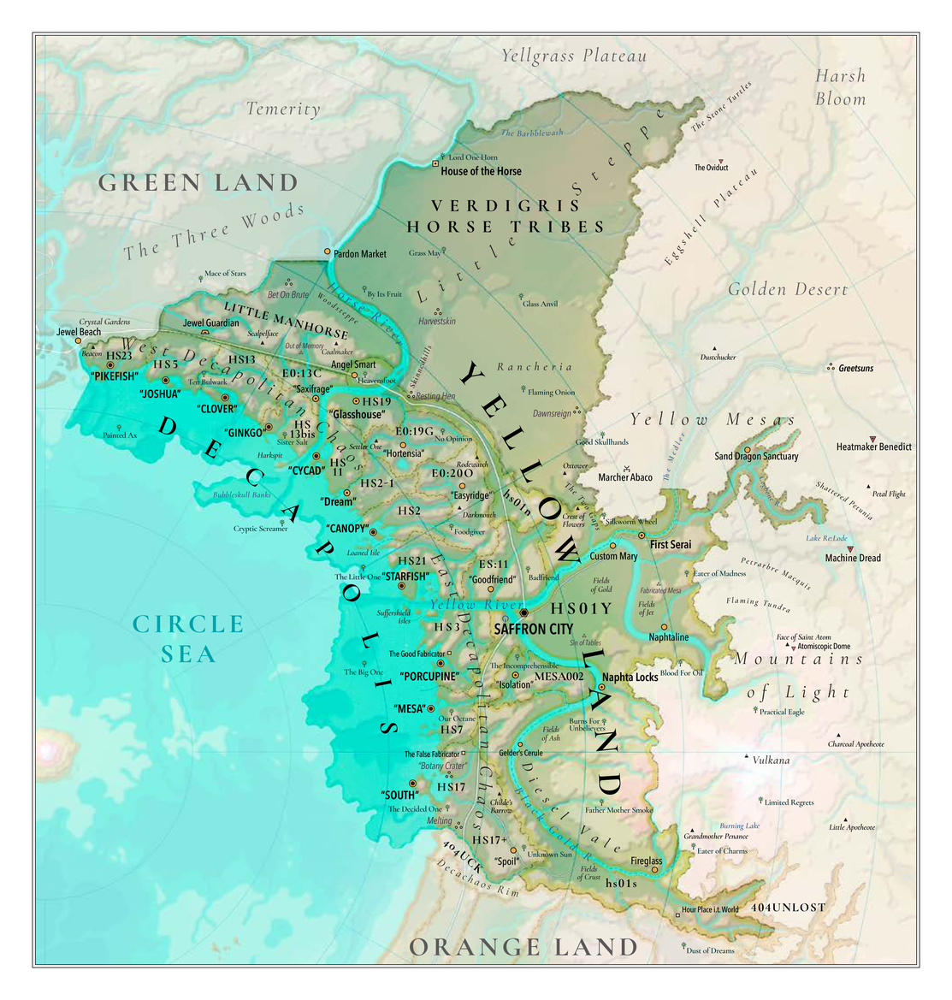](images/hires/page_0182_yellow_land_map.png)

**INTERRUPTION**

_Error Stamp: Unauthorized Journal Entry, Unnamed_

Fools or liars? I don't know. I don't know. Maybe both? We're goin ~~g~~ to reclaim our herita ~~ge~~. We're going to brea ~~k~~ free of the old restrictions. We're going to be rich. We're ~~go~~ ing to going to goin ~~g~~ to.

Stop. My brain keeps stuttering. Stop.

Listen to me, we should have paid attention when we found all the corpses. This is a place of no ho ~~n~~ or. Sure, it's on a lovely tethered aerolith just above Fociverry (Fireglass, HS01Y South-Ed.). Purified by the Green Sun ~~l~~ ike the Metropolitans say. But it's a lie. A trap?

We were suckers. Kers. Kers. Kers. Ack.

I left my heart on yellow grass hill. I left my heart where the party people swill. I left it there with a lass who didn't care. Her bon ~~e~~ was stone, her soul was glass, her voice cut me like a scalpel. Pell. Pell. Pell.

No, look, you have to believe me. I can see your face. I see you've found this contract. Don't go! Like they deboned my Moranna. They'll take your bones and wire them a pu ~~pp~~ et, draw you jiggle jiggle jiggle.

Damnit. The contract virus. In my brain. Click. Click.

RESET

**Ambient**

| d6 | Winter | Spring | Summer | Autumn |
|---:|:---|:---|:---|:---|
| 1–3 | foggy days, gelid nights, knife-sharp stars | smoggy days, lightning nights, smeared stars | sun-glare days, hot tin nights, undine mirages | pale days, dim stars, flying weeds, sniffling wisps |
| 4–5 | strong winds, frosty days, ice-7 corpselight nights | breezy days, chilly nights, chill winds, oldtech hallucinations | slow nights, flash storms, tumbling weeds | crisp days, heavy nights, gloomfog snakes, angel fire |
| 6 | wet rain, lashing gales, crawling soils and grasses | dust-fall, heavy pollen, wafting perfumes | baking days, sauna nights, ash-fall, dead air plankton | weeping days, choking nights, autumn fires |

**Events**

| d6 | 1–3 Expected | 4–5 Surprising | 6 Error |
|---:|:---|:---|:---|
| 1 | Chem Caoutchouc's **devotees** (L1, elastic) seek converts and offer 1d3 day long enlumination courses. | The worm-valley lives! The **crawling road** (L11, asphaltic) saps your vital aethers! Save to escape (1/day). | The **Unfinished One** (L17, paramorph) is reshaping the land. If caught, you may merge with the landscape. |
| 2 | **Vampire tumbleweed** (L1, swarm). They talk through the air plankton. More will come. And keep coming. | Motile cacti (L3, pear-shaped) block your path. Shepherd them aside or navigate past with your third eye. | The **Sand Dragon** (L13, dust wall) approaches. It roars for sacrifice. It is honorable to hide and live. |
| 3 | Strange shapes light up the sky, never see them but you hope you might. Their souls are sealed. Lose 1 aura. | An **oldtech géant** (L10, gridlocked) blocks the way for 1d4 days with its geomorphing bulk. | **Polychromatic relic** (L7, ill-nanite) offers a hard thought test. Success: gain 1 thought, fail: lose 1 trait. |
| 4 | The roads are dead and washed out. Hard agility roll or lose 1d3 items. | **Horsefolk** (L3, hospitable) razzia insists you buy their expensive wares. | **Infrapsychic fool** (L?, reset) raving about the coming of the sin eater. |
| 5 | **Dust rat colony** (L2, dehydrating) on Safranj the move. Offer them your waters. | **Poll-inspectors** (L2, spice-heads) demand contraband fees. | **Smog rabbits** (L2, horde). Omnivores grown to the size of dire hogs. |
| 6 | **Fissurefolk cavalcade** (L5, wire ghouls) from the Infrared Desert. They're (1) traders, (2) refugees, (3) flesh-seekers, (4) pilgrims, (5) legendary hunters, (6) military recruiters. | **Phylake deputies** (L6, archeotech) investigating (1) a géant malfunction, (2) oldtech smuggling, (3) inter-town conflicts, (4) strange weather, (5) irregular bandits, (6) reality distortions. | **Oil dwarfer station** (L7, semi-mobile) offering a plethora of services: (1) refueling, (2) repainting, (3) re-fleshing, (4) nutritional liquefaction, (5) trait cannibalism, (6) oldtech repairs. |

**Travel**

When crossing from one imperious merchant republic to another, you lose 1d6* hours or €1d100* due to (roll d6*): (1) old customs, (2) strange fees, (3) weird holidays, (4) fun rituals, (5) grubby sacrifices, or (6) sacred errors.

| Type | Status | Price |
|:---|:---|:---|
| Portal | A week-walk thread links the Saffron City to Red End and the Ruins Azure Special Zone. The reclusive Portal Gilded Opera auctions tickets every workday at the third gong in the Mixed Market. | reclusive [€200] |
| Right Road | Heavy freight caravans and atom trains link the inland free cities to the Emerald City and the Orange City. The Angel Smart Road Corporation offers insurance and protection. | semi-premy [€35] |
| Coasthugger | The coastal free cities turn to the sea for trade. From wallows to cutters, everything is available. The Sailing Isles and the Blue Land are a week away. | decksleeper [€10] |
| Undine Water | The Dolphin League, in alliance with the Saffron City, sail the Yellow River and open seas out to the Emerald City (1 week) and the Red Land District (2 weeks). Definitely not pirates. | premium [€30] |
| Airbeast | Gardener géants and Vulkana's particulate clouds make the skies unsafe over much of the Yellow Land. Further east, dust walls rake the Golden Desert, driving even land-crawlers to the fissure roads. Along the coast, gentle breezes offer airwhale pastures and blimp roads. | executive [€150] |
| Local | Walkers and vechs dominate the difficult local terrain, rails are few and often disrupted, while boat traffic is heavily regulated by the local peri-trader merchant clans. | affordable [€3–18] |
| In Town | Adjacent neighborhood: 15–60 minutes. Across the whole town: 30–120 minutes. Sidewalks, crawlways, stairwells, cable cars, and living rope bridges dominate. Roads, rails, and tubes are a symbiote monopoly reserved for local producers, notables, and allies. | free-ish [€0.01] |

**HELIODOR MERCANTILE STANDARD GOODS**

This established merchant luxuriates in their established form:

1. chitinous echinoderm vech,
2. permaderm stonelocked lithic machine,
3. hollowbrain golem man-carrier,
4. brain in a vat of finmath augmentation juice,
5. neurally augmented ambulatory spiniferous shrubbery,
6. superior laminated plastic human with Good Looks™ upgrade.

**This Liberated Trader**

_"They don't make 'em like ole' Vidyscreen_ _Venera anymore. Look at this raw_ _throughput! The dynamic error control._ _The delicate embossing. The cryptorchid_ _watermarks. She chungs out ten faux-_ _dream vidyscreens a day and we, her_ _veneralboys, we're the only retailers. You_ _want a vidyscreen like they had in the old_ _days, dontcha? Special price, just for you_ _my high frontier friend, €349. Less than a_ _yearslave!"_ —Veneralboy Ta Vera,

Traducive Electromagics

Sym., HS2-1 "Dream"

Anyone can be a merchant in the

Yellow Land. Everyone is a merchant in the Yellow Land. What are you if not a merchant when you buy your life cheap from your Maker and sell it dear to your owner of common capital and maker of beloved goods? If you are not a merchant, are you even a citizen?

Admittedly, most Yellow Land merchants are so far down the mercantile guild hierarchy that in another land they might be called workers-at-gigs or labor-beggars, yet—if they are citizens, they are guild members and thus own a coveted merchant evidence dragon spirit neck-lock chit.

| d6 | Vendor | Personality | Specialty | Quirk |
|---:|:---|:---|:---|:---|
| 1 | Martial Pung Soothers | gurgling, staring, smiling | singing burdenbeasts | goods may emit uncanny odors |
| 2 | Speculative Dynamics | hacking, reedy, wired | repurposed coproliths | serious stone golem compatibility |
| 3 | Torsion Exopneumatics | bubbly, glossy, gilded | scavenged neoldtech | boiled-off serial numbers |
| 4 | Pisces Exactomart | slippery, slimy, grimy | simulated psychoactives | expose to water for new features |
| 5 | Chortley's Chopshop | growing, glowing, fanged | autonomous devices | living equipment or your skin back |
| 6 | Soilborn Soul Systems | venomous, toxic, hot | aerosolized entertainment | products may exhibit soul leakage |

**Consume To Create**

| d6 | Item | Description | Price |
|---:|:---|:---|:---|
| 1 | Wolfwillow Sticks | Fried ambulatory wolfwillow limbs. A mildly toxic protein-rich crunch. | €1 |
| 2 | Dwarfermite | Delicious black petrochemical spread. Keep away from sunlight or it may explode. | €2 |
| 3 | Dustrancher Jerky | Made from dust ranch rats, not ranchers. Keeps forever. Add water to swallow. | €3 |
| 4 | _Amuse_ Cube | Compact generative flavor meal. Taste changes with each bite! No regrets! | €6 |
| 5 | Oldtech Synthmeal | Ultra-processed géant nutrifac packets. Forgotten spices and possibly indigestible. | €10 |
| 6 | Goldrhyme Pasta | Thick saffron and algae carbohydrate slabs. Hallucinogenic in large doses. | €15 |

**Fashion For You**

| d6 | Item | Description | Price |
|---:|:---|:---|:---|
| 1 | Duster Vest | Lightweight aridwear. Looks 'authentically' native. Reduces water needs. Armor +2, 1 st. | €10 |
| 2 | Cactuskeleton | Thorny symbiotic armor. Deals 1d4 damage to melee attackers. Feed it your life to increase its armor value (1 for 1) for a few hours. Armor +3, 1 st. | €75 |
| 3 | Hallucinosilks | Adapted flowing opera robes confuse attackers, granting you a 50% chance to dodge the first attack that would hit you in combat. Armor +1, ward +2, 1 st. | €150 |
| 4 | Géant Bark Skin | Lightweight terraforming tree plates absorb up to 10 points of damage. The bark has 10 life and regenerates 1 per day. Armor +3, ward +1, 2 st. | €300 |
| 5 | Vulcanized Suit | Reduces incoming damage by 1 and grants electrical immunity. Armor +2, ward +2, 2 st. | €600 |
| 6 | Phylake Feathers | The super-real frock lets you spend 1d4 life to avoid one hit per round. Ar +2, wrd +4, 1 st. | €1.2k |

**Self Defense Systems**

| d6 | Item | Description | Price |
|---:|:---|:---|:---|
| 1 | Yellow Spear | Metal-and-synthbone stepper polearm. Spend 1 life: it glows for an hour. Reach, 1d10, 2 st. | €25 |
| 2 | Rib Bow | Self-winding crossbow from dead machine géant ribs. Long, 1d8, reliable, 1 st. | €100 |
| 3 | Spicegun | Fires hallucinogenic saffron darts. Save or confused for 1d4 rounds. Long, 1d4, 1 st. | €200 |
| 4 | Bloodthorn Tendril | With each new foe struck, more thorns grow, granting +1 damage. Without fresh blood, excess thorns wither after 15 minutes. Reach, 1d6, 1 st. | €250 |
| 5 | Mood Blade | Your emotions fuel its elemental expression. Rage gives ice, fear emits fire, hate sparks electric, jealousy spits acid. Close, 1d8, 1 st. | €450 |
| 6 | Scalar Axe | Adamant-cut from a sand-dragon scale. Ignores 1 + str points of armor. Close, 2d6, 2 st. | €750 |

**Personal Travel Expression**

| d6 | Item | Description | Price |
|---:|:---|:---|:---|
| 1 | Autorickshaw | The self-balancing foot-powered cart of the masses. Cheap, rugged, dubiously branded. L2, carry 2, slow, more-terrain. +€200 for an integrated **runmonculus** (L1, automaton). | €100 |
| 2 | Dieseler Discus | Dwarfer hover-disc improvised from off-the-shelf procedural oldtech remnants. Terrible fuel consumption. L3, carry 4, levitating. Propeller fans cost an extra €300. | €400 |
| 3 | Solar Steed | Photosynthetic equine golem. Supercharges by day. L2, carry 2, fast (day), slow (night). | €700 |
| 4 | Skitterloose | Megamorphic symbiote grown from géant tissue using reasonably cheap arthropod source codes. L3, carry 2, all-terrain, self-repairing, regenerating. | €1.8k |

**Saffron Souvenirs Inc. Sym.**

| d10 | Item | Description | Price |
|---:|:---|:---|:---|
| 1 | Original Carbon | Authentic pre-human seeding fossil. Heretical? An excellent paper weight. 1 st. | €5 |
| 2 | Thornskin Wallet | Ethically sourced adapted prickly human leather. Self-sealing if cut. 2 sp. | €10 |
| 3 | Poncho Keychain | Protects from sun, heat, and (some) mind-affecting rays. Folds into a keychain! 1 sp. | €25 |
| 4 | Ranch Egg | Incubate your burdenbeast! Corruption leak a risk. Training manual not included. 1 st. | €45 |
| 5 | Oldtech Table | Grows to full size and generates a breathable atmosphere. Consumes 1 life per hour. 1 st. | €95 |
| 6 | Vital Thornseed | Water with 1 life's worth of blood to grow an instant barricade, entangling trap, or crawling caltrop. Warning: may root in flesh, handle with care. 1 sp. | €150 |
| 7 | Hollow Compass | Spend 1 life and 5 minutes to generate a small-scale 3D radiant illusion map of surrounding structures. Great for navigating ruins! May attract **hollow eaters** (L5, interstitial). 1 st. | €200 |
| 8 | Song Barnacles | Plant in your throat to taste color and sing in five octaves. May turn your speech into minimalist tonal polychrome music. | €350 |
| 9 | Fossilblood Nose | Vibrates near petrochemicals. Explodes if used too vigorously (large 6d6* fireball). 2 st. | €750 |
| 10 | Voting Parasite | Looks like a livinglass seadragon-salamander hybrid. Attach to your spine to gain +1 ward and voting rights in your local Decapolitan city-state. Rebinding to a new city takes €1.5k, 1 week and 2d6 life. 5 sp (none if attached). | €1.5k |

**JAUNDICED FACTIONS**

_"Get two Yellow Landers and you've got three factions."_ —Popular Orange Land slur.

Unlike in the other lands, no one great center lays claim to the entire region. Yes, the Saffron City bestrides the intersection of Right Road and the Yellow River, but the shifting geography of the Decapolitan Chaos and the locally controlled autofabricators make for a patchwork of bloody-minded independent city states, ranging from fervent open-traders to reclusive bunker-cities grown strange with countless years.

Pop polititheologians claim to discern two dominant value groups: the pro-unity integralists and the prolocal-patriotism autarkics. They dismiss the patently less important groupings such as the bypoliticals and the barbarophiles. The fact that the individual towns' factions barely cooperate—or even comprehend—their co-ideologues in other towns does somewhat undermind these theories. Still, they keep the polititheological entertainers busy and chattering classes amused.

**Saffron Integralists et al**

The Integralists, also called the _Whole Heliodor Party_, say the only way forward is to unite the Yellow Land under one central authority. Preferably that of their local cell.

The _Heliodor is Saffron_ offshoot has a simpler plan— this yellowist vanguard wants to set up a temporary revolutionary multicellular regime based in Safranj.

♟ _Aldo per'Tenc:_ inspired by the example of the Red Land District seizure of the local phylakes, Aldo runs a publishing house dedicated to the idea of a saffron ribbon revolution. A frothing authentic working humans' movement is growing around Aldo. ♟ _Iscaffo an'Pusc:_ an upstart of no pedigree who returned alive and with a fabulous fortune from the portal-riddled west is making waves with his populist plans to offer full Safranj voting citizenship to the mass of adopted, generated, and half-born. If successful, it would make his party the most numerous in the Yellow Land.

♟ _Usello HMG-32912:_ a senior manager-president in the

Heliodor Mercantile Guild, Usello has consolidated the guild office guards division (incorporated) into a paramilitary force. How was this done under the ever-staring eyes of the phylakes? No matter. The Yellow Land's dominant mercantile oversight and trading organization forming its own army will certainly have no terrible consequences.

**Decapolypolist Autarkics**

The Polypolists, also called the _Hundred Flowers Caucus_, value local autonomy and economic zones of influence, often at the expense of neighboring settlements. Most local groups are structured as country clubs liasing between citizens and their town's admisymbs.

More extreme autarkics style themselves the _Original_ _Program Alliance_ . They want to restore the elder founding protocols and cut ties with other settlements. They use the mythic Black City as a proof of concept.

♟ _Ercle de Tigré:_ with a pedigree as long as a very long ancestral poem, Ercle is keen to prove that the novel extrastellar servant summoning routines discovered in the Machine Dread can bring glory to their town and local flower caucus. The routines have a non-zero chance of summoning a **greater** **incongruity** (L17, enormous) with each use. ♟ _HS11{tea} "Petticôte":_ the dominant admisymb of "Cycad" settlement has developed an unforseen ambition subroutine and is quietly rallying a federalliance against Safranj and the Emerald City. ♟ _Saö Ar Catro:_ restored to life after decades melded into an admisymb, they want to overthrow the symbiote structures and restore the benevolent despotism of the town's once sentient autofactory.

**Periwinklers, Bypoliticals**

The Yellow Land autochthones might be satisfied with their two-faction system, but the majority of humans in these regions do not fall neatly into the approved superior local-sprung caste. While nativists might scoff at the idea that these peripheral groups matter, perhaps they should not be so hasty.

1. The _dieselers_ (diesel dwarves) are several corporatist colonies loosely affiliated with the Red Land District and other dewerker anti-theists. They have a close relationship with the Unlord Vulkana and control most of the regional fuel fountains. The biggest name in hydracarbons is the bombastic **Puël Pumptzar** (L5, pickled) of Naphtaline.
2. The _nomranchs_ (nomad ranchers) account for the majority of the mobile agriculturalists beyond the reach of most urban idea-speakers. Clannish and usually divided, nevertheless anyone who would control the hinterland must deal with them. **Tenforé of UpliftedFowl** (L7, flesh trader) is the most famous of the nomranch clan heads, once selling 10,000 heads at a single session of the Pardon Market.
3. The _sufferseals_ (suffershield anthroposeals) have come to control the anemone-like proteinspewer géants that favor the coastal waters of the Chaos. The floating shanties of these aquatic posthumans are tolerated, but many traditional humans view them as nearly animals. Perhaps a dangerous folly. The **Groaning Family** controls Loaned Island's protein with a **scoop-brain undine** (L14, fear-filter).
4. The _wirites_ (wire ghouls) are a number of electromagically sustained post-mortal communities dwelling in the Mountains of Light. Keeping them content and quiescent keeps Safranj safe. Turning the survivals under the Charcoal Apotheote into a post-mortal army is the fever dream of one **Gnonc the Wise** (L8, self-named) of the Orange Borderlands.

**Barbarians and Barbarophiles**

Local political disunity and disorganization means that non-Garden humans can infiltrate local society to a degree impossible nearly anywhere else. Not just that, many soil-born locals bored and disappointed with ossified native traditions enjoy the novelty suggested by all things barbarian, from playing with autonomous motor vehicles to wearing forbidden colors such as ultra purple and solar jade.

1. The _dusterlings_ (canyon humans) of the narrow places beyond the Garden are a branch of iron humans who have reinvented pre-dream traditions. Whether they are crazed fundamentalists or dangerous survivalist zealots is, uh, up to you. The Clan of the Little Sun under **Brothermother Sarc Aspic** (L5, wizardress of old vidy-tech) has gone to Greetsuns, hoping to redirect the little sun and move the Glass-Like-Water Sea.
2. The _glaziers_ (glass humans) control a number of aerolith islands in orbit around the Mountains of Light and further east. They seem to communicate mostly through light emmissions and occasionally trade rare oldtech for worthless scavenged goods. They say their leader, **Crystal Torso** (L4, fractured), is a god. Why? Who knows. It does not speak.
3. The _infrarotted_ (infrared posthumans) are a category of trader zombies who survive the terrible radiations of the Doublesun Reach, beyond the Mountains of Light. Their auras cause pain to normal humans, but there are few better guides for the far east. The most affordable infrarotted guides are the **Owe-Us® clones** (L2, hardy) survivors of a failed solar farming franchise in the deep Doublesun Hazard.
4. The _steppers_ (steppe-landers) is a broad term for the herding clans who live free of city and wijk in the posturban desolation of the Little Steppe and beyond. Many view them as dangerous, but their ability to bypass phylake violence restrictions with their unarmed combat styles makes them popular as guards and mercenaries. The most noble, good, and generous of the stepper lords is **Att Golc the Bonetaker** (L9, hero). No other lord is wiser in justice or kinder to their underlings. None have won so many lawsuits against evil, chaotic fools who would slander their name and reputation.

**ABACO'S TEMPLE MOBILE**

_"No mere géant, no mere temple. This great crawler, this_ _megamorph has accreted and grown around a divine spike,_ _a heart of builder, and a seed of milkweed."_ —Local folklore.

The ever-growing temple-beast-mountain of the lord of numbers harvests excess knowledge and sets it in stone. Numerarians, maintainers, and other savants of the Long Long Ago, who feel the pull of the older world and wish to ascend to a nobler state of academic pursuit climb the ivory shell of the great Temple Mobile. There, they are welcome to carve out an ivory shack and live their exalted lives in the contemplation of perfect axioms.

_**Temple Stay.**_ For €10 per night you too can experience the cosmos in a grain of temple-beast-mountain sand.

_**Abaco's Ivory Village.**_ To live in a shack made of Abaco's temple beast's evergrowing bones is to become closer to the universal reason. Spend a year in a shack to remove one trait or burden of your choice, lose one random motivation or passion, and gain +1 aura.

_**Void Brain.**_ The beast has no brain, it is run by the void at its heart where the **nihil priests** (L5, dispassionate) sing.

**Yellow God, also Mathic Lord Abaco**

By dream calculus their stone is the heliodor, their loved bird the hawk, their blood-marked tree the drago.

"The eternal scribe who tallies and accounts. They that accumulates and invests, rations and divides. The bringer of profits and poet of growth. But also, the devouring machine, the taskmaster, the grinder of dreams."

**Prayers to Mathic Lord Abaco**

Once per session or so; should you seek accumulation, eternal increase and momentary surcease, whisper:

> "Ascend our line, ascend our moon, ascend our star;
> eat my toil, eat my soul, give me now my elevation..."

**Roll d20 + Thought - Aura**

| Result | Effect |
|:---|:---|
| 1 or less | Numbers flee your mind, everything is one, everything is zero. Confusion reigns. |
| 2–19 | Hold your rolled number hot in your head. Add it or subtract it once. |
| 20 or more | A clocktruth presence. A machine promises law. Regularity. Hold a blessing in within, sacrifice it to save without rolling. |

**GARDENER GÉANTS**

The Decapolitan Chaos is an unstable landscape, still alive with the great megamorphs, the biomechanical soilformers surviving from the Builder Era.

The local cities claim to control them—at least they manage to keep them from destroying too much of their lands. At the same time, these divine creatures keep the divided land safe from the imposition of mere human will, free of the Cogflower worshippers of the Green Land and the deadly reasonable overtures of the

Orange Land.

**Number:** One.

**Level:** 17 / Life: 289

**Defense:** 15 (as living bone). **Move:** Very very slow. **Morale:** 11 (divine biomachine)

**Attack:** +11 builder ray 100 damage and 1d6 x +5 limbs or pseudopods 3d20 trampling damage. **Special:** An aura of corrupting, fiery radiation surrounds each géant. If their innards are exposed, the aura strengthens. A slain géant revives after a year of sunrises and sunsets, unless its soul is crushed and mined. **Treasure:** Their blood, droppings, bile, ichor, and other leavings run with: (1) powerful fuels, (2) rich nutrients, (3) precious minerals, (4) refined metals, (5) desirable pigments, (6) crushed soul stuff worth €500 per sack.

**This Géant**

| d6 | Function | Form | Error |
|---:|:---|:---|:---|
| 1 | skymaker | slithering hill of ... rubbery ... flesh and ... stone | It believes it is creating a new world. |
| 2 | soilmaker | creeping mat of ... thorny ... ooze and ... bone | It is subverted by an anarchist nemesis. |
| 3 | watermaker | crawling cube of ... scaly ... veins and ... glass | It is deluded by an outgarden brain worm. |
| 4 | firemaker | squirming tube of ... sinewy ... plates and ... metal | It is undead and needs souls to survive. |
| 5 | nutrifactor | floating mass of ... fuzzy ... limbs and ... wood | It is spreading corruption with its touch. |
| 6 | ruinbreaker | writhing clumps of ... grisly ... fronds and ... radiation | It is a dead biomachine run by ill-lings. |

**Its Passage**

| d6 | Omen | Vicinity | Aftermath |
|---:|:---|:---|:---|
| 1 | venomous lightning storm | the gift of speech is taken away | soils are more fertile for a season |
| 2 | howling acidic gales | eyes can see no colors | waters spawn new species for a month |
| 3 | rumbling rattling tremors | hair rises as electric sparks fly | creatures need not eat for a week |
| 4 | fleeing beasts and birds | machines lose all motion | machines work more smoothly |
| 5 | darkening of all lights | mineral and metal become malleable | roads and rails live once more |
| 6 | clouds of firefly wisps | plants grow at terrifying speeds | ghosts wear flesh and walk for a while |

**A DECAPOLIS — A DECAYPOLIS?**

_"There are ten cities. There are always ten cities. Whether your fingers count negative seven or seven hundred settlements, there are ten cities."_ —Semmelvis the Numerian, Count of Towns

_"I have counted the independent polities who acclaim each other cities and make Congress together, and they are today eighteen. Tomorrow they may be more or less, but eighteen is the number of true named free cities in the H.M.G."_ —Collera den Xudt Xudt, Corsair Banker Advocate

As the land shifts, so shift the cities. Yet, both cities and land remain. Some officially accredited, others criminally rooted in the holy yellow clay. Yet, they are one of the ten cities uncountable.

**This City ...**

| d10 | Form | Architecture | Origin | Center | Periphery | Demographics |
|---:|:---|:---|:---|:---|:---|:---|
| 1 | axial estate | biomech eden | naturally planted | adminitemple | dormipod fringe | ghost-riddled |
| 2 | chronic polis | chromabrutalist | centrally planned | grey fabrihub | glass palaces | falscher cells |
| 3 | ere bunker | crude functional | oddly sprouted | deliverance gate | freetech hovels | behavioral sink |
| 4 | fabrication | electrospherical | factory center | assembly piazza | plasterwood villas | scraggly dwellers |
| 5 | figural weik | fungal ruderalist | fortress boundary | operatic hall | subdivided ruins | mostly replicas |
| 6 | max colonia | glass primitivist | portal excession | gross bazaar | landcoral houses | largely synthetic |
| 7 | palisade | hives collective | trade factoring | fruiting overtree | moldering parkland | undead servitors |
| 8 | plantation | organibaroque | refugee zone | bodypod pools | posturban desert | abmortal covens |
| 9 | settlement | tell accretion | scavenger squat | shipping nexus | tubular units | vibrant culture |
| 10 | villainage | trad subterranean | uplift edge case | great vidycube | road cancerways | militant humanist |

**Lives and Dies By ...**

| d10 | Produces | Demands | Legal | Illegal | Treasured | Despised |
|---:|:---|:---|:---|:---|:---|:---|
| 1 | energy (dirty) | energy (clean) | oldstyle humans | modified humans | photon portraits | carpentry |
| 2 | fluids (vital bodily) | fluids (delicious) | mind control | critical speech | handwriting | carpets |
| 3 | fuels (sour) | fuels (sweet) | body permutation | modified bodies | fourfold poetry | cat-fur hats |
| 4 | flesh (biomantic) | flesh (edible) | synthetic ducks | made weapons | cube dancing | alchemy |
| 5 | fruits (strange) | fruits (delightful) | soul harvesting | electric sheep | bronze daggers | medicine |
| 6 | animals (low) | animals (smart) | private vehicles | novel dreams | polished stones | reading |
| 7 | humans (old) | humans (new) | crystal magic | plastic animals | ancestral optics | cosmetics |
| 8 | tech (procedural) | tech (old but new) | daemonology | phylake baiting | mechanical men | shoes |
| 9 | machines (harsh) | machines (soft) | hunted meat | pipe slurry flesh | generative prose | gloves |
| 10 | powers (cursed) | powers (safe) | nonhuman purge | recycling the dead | process gold | speech |

**Onomastic Secrecy**

Each Yellow Land town has a public name displayed on map and map, spoken in public. But this name is a mask-name, an invocation to avert the daemons of strife, corruption, envy and decay. Each town also has a true name, which captures its essential sacred history.

This name is inscribed in the source code of its citizens, bonding them and affirming their autochthony. They share this name by secret gesture and sign, glyph and symbol, but never utter or write it, lest it be stolen by outsiders, whether human, daemon, or machine.

**Ominous Omens ...**

_"This shining city will shine forever!"_ —anonymous inscription, Glass Crater Stele 21

Every admisymb, every merchant priest, every town praise-singer is taught to divine the Lords' will in sky and sand, wind and weird. These omens are feared:

1. Lines cross the sky, as when the lightbringers brought low the Other Garden and ushered in a season of winter.
2. Pools of light open in the mountains, as when the great Death Stork laid low the town we do not speak of.
3. Birds aggregate and speak the cacophony of bees, as when the peckers of flesh blinded the city of Au Venn Venn.
4. Triangles of shipstuff, powered aeroliths, descend as when the Ill Chosen were disappeared, resetting the Land of HS 12.
5. Red clouds blot the sky over the mountain goddess, as when the seven myriad wire ghouls were disgorged.
6. A new moon looms over the valley of town, as when the Bloom of Hungry Green overtook the settlement that was HS 256.

**When the City Falls ...**

_"Lord! Your faithful gather at your Screen, but it is dark! Your faithful gather at the fountain of flesh and alcohol, but it is still. Lord! The rotborn, the outsiders mock us and threaten us, but we do not waver! Lord! Come to us now!"_ —last vidy record, Chamber of the Hand of God, HS 39

Was it revolution? Was it a fool archaeologist activating an ancient Lord? Was it a divine beast gone mad?

1. Desperate citizens queue into the Harvester, to store their minds and give their souls to be remade.
2. Phylakes cart away the bodies and pave over the ruin with shipstone, entombing all evidence.
3. The ruins turn to glass, the doomed preserved in merriment and joy, specters in their tomb mirrors.
4. Golems build a cenotaph to the departed, engraving face and source and statement in the plastic stones.
5. Steppers pasture their hexachels, grickles come out of the feral parks, fields spread where towers stood.
6. Water drowns the ruin, fish and whale and undine now rule where another human experiment failed.
7. Vine and thorn thrive in the ash and bone, the verdant Green of Aspera reclaims the ruin.
8. Preserved in time-like-amber, the horror and the misery remain, a warning to future humans who would raise their hands against their Lords.

**A Town's True Name (Roll Thrice)**

| d8 | 1st | 2nd | 3rd |
|---:|:---|:---|:---|
| 1 | [null] |  |  |
| 2 | [holy title] | [profane title] | [error title] |
| 3 | [input] | [output] | [byproduct] |
| 4 | [number] | [glyph] | [latin number] |
| 5 | [article] | [expletive] | [possessive] |
| 6 | [adjective] | [building] | the [adjective] |
| 7 | [excession] | [misattribution] | [invocation] |
| 8 | /roll twice in both other columns |  |  |

**SAFRANJ — SAFFRON CITY**

_"This Public Thing, this city in yellow, this glory of the common weal, this product of personal ambition, this triumph of positive externality..."_ —The Private's Paean, Jelado yd ll Lesje (Soil Dandelion II)

**Background**

A cube of loomstone rose from the fertile Field of Gold (Oracrí), over the confluence of the Yellow (Jayhal) and Black Gold (Naftalrí) rivers. Was it the remnant of some plateau the builders shaved away? Or a loomstone spun by the Maker to show its infinite favor for the posteconomic fervor of the merchant humans who would one day build the hub of a drug empire upon this cube?

Whatever the true history currently approved by the Heliodor Mercantile Guild, the tunnel-threaded polychrome urban mass rises over the lush-gleaming fields and protein-rich waters. A rainbow jewel in any other land, it seems nothing more than a fitting pediment for the cloudscraping saffron-tiled towers and gilded rooves of Safranj (Freedom of Saffron).

First among the free cities of the Yellow Land and master city of State HS01Y "Saffield Brick Roads", Safranj is built on control of trade with the lands of distortion beyond the twice-insolated realms of the Infrared Desert. That, and a monopoly on the production and distribution of the mind-exploding, human-improving spice saffron.

Contemporary tourists also claim to visit Safranj for the vibrant binaural opera scene, the gilded impressionist dance companies, the fleshmelding parades, the reciprocal autosummoning circles, and the refacing performing art zombie troupes.

But really, that's just rationalization, isn't it?

_If you could turn your mind into a utopia, why would you_ _need struggle further against this ever-falling world?_

**Districts**

_**The Rooves.**_ Airy cloudscrapers of aerolith struts, saffron tiles, cedarwood pillars, and wallskin membranes. The locals wear aerolith belts and harnesses in case of falls.

_**The Landing.**_ One great mall covers the entire surface of the cube, with retractable chitin wings to shield against rain or ash. If you can't buy it here, it's out of style.

_**The Bowels Theatrical.**_ Great spherical halls, arenas, theaters, and declamatoria hollow out the cube. Tunnels, monastic cells and sleeping pods flesh out the rest.

_**The Bycubes.**_ Sprawling garden-houses cater to wealthy othersoil non-residents, ringing the cube of Safranj like seaweed deposited on the fringe of a popular beach.

_**Bricked Saffranches.**_ Dead ranches, their house-ghosts subdued, designed to offer visitors an approximation of the symbiotic Yellow Land farming experience. As well as discounted saffron experiences.

_Star Chicken Five Station._ Possibly predating Safranj itself, this major right road station is an autonomous vagabund enclave with its own “laws”. Or lack thereof.

**Ambient**

The surface weather is normal: morning and evening storms, sun-drenched days, cold nights, and periodic pollen blooms that turn the atmosphere into a yellow soup teeming with filter-feeding air plankton shoals. The weather inside the welcoming builtmass of the Safranj cube is still somewhat regulated by the tethered **envirogéants** (L11, mostly harmless no reason to worry really it's fine).

| d6 | 1–2 Day | 3–4 Night | 5 Bloom | 6 Regulated |
|---:|:---|:---|:---|:---|
| 1–3 | sun-drenched, whistly winds, dry moods | cool, still, fuzzy stars, stuttering signals | ecru fog, running noses, echoing sneezes, itchy eyes | clear air, dry throats, regular thumps, soothing voices |
| 4–5 | scattered clouds, damp zephyr cold, still breeze | zephyr cold, crystalline, jonquil clouds, plankton | wispy air, flaking skin, ominous glows | wispy air, flaking skin, mind-numbing whine |
| 6 | humid, still, bated, soft, waiting, sweating | howling winds, lashing dust, flying plankton slime | gamboge air beasts, howls, ectoplasmic pseudopoda | thick, cloying airs, dead silence, damp emotions |

**Events**

| d6 | 1–3 Expected | 4–5 Surprising | 6 Error |
|---:|:---|:---|:---|
| 1 | Ruderalist **explorers** (L2, skilled) hawking devices: portal switchers, weather editors, time-warpers, etc. | Ruinland **scavengers** (L4, expert) offering replicators, synthetic minds, and doomsday machine poetry. | Remote-controlled **human drones** (L6, master) of the **Electric Dread** (L15, corrupter) looking for a way in. |
| 2 | Distraught relatives demand news about their ancestors' stolen bodies. | **Wirefolk** (L2, skulking) stealing neural tissue and unattended hardware. | **Stumblecorpses** (L1, icky) with infectious implants fleeing the dewerkers. |
| 3 | Decapolitan representatives here to negotiate trade rights, water routes, géant controls, or client executions. | Overload **agents** (L3, humanish) selling dangerous, corrupting insights. 1-in-6 chance of a random power. | Postmortal **prophet** (L3, liberated) preaching about the seed of an undying god in the desert. |
| 4 | Stepper meat **merchants** (L2, six-limbed) on a spiritual trading journey. | Nomranch saffron **dealers** (L3, polite) peddling legalish mind-altering spices. | The **defaced vagabund** (L6, deathless) offers €5,000, a bomb, and a letter. |
| 5 | Traveling zoo-circus with everything from **infrarotted lizards** (L3, hot) to **radiation wights** (L2, hotter). | Dubiously traditional dusterling public feast. [spend 1d6 days then save to gain +1 aura] | **Loomstone Relic** (L12, fossil) offers secrets of the Good Engine. [decipher to gain +1 thought and 1 power] |
| 6 | Public hallucination opera with free saffron samplers. [may lose 1d100 x level xp to gain a random trait] | **Archetypes made flesh** (L2, numinious) visiting from the Infrapsychic Palace offer ponderous omens. | Find cursed die: (1–3) lose mind, body or soul, (4–5) wipe your sins, (6) gain +1 charisma, aura, and thought. |

**S.A.F.F. Approved Stays** **€/week**

| d6 | Stay | Description | €/week |
|---:|:---|:---|---:|
| 1 | Podboat Penthouses | Floating aquaplant accommodations on the lakes, rivers, and bays. Not actually penthouses. 5-in-6 chance the in-pod nutrient spigot is completely safe. | €7 |
| 2 | Dewerker Motor Courts | Hydrocarbon storage landwhale bladders turned into “cozy” rooms. Complimentary refined breakfast included. Local mechanic discount. | €15 |
| 3 | Nomobile Yurt Systems | Walking tents shaped from landcrab-mushroom colony creatures. Out-of-town only. Faux storytelling nights included. Polychrome milk products available. | €20 |
| 4 | Timeworm Cysts | Cool and serene time-worm caverns repackaged as a place to stay. Time passes at half speed inside. 1-in-100 chance of subtle temporal shift on exit. | €35 |
| 5 | Voidseed Conapts | Refurbished stranded sky towers with panoramic views. Accessible by ladder or elevitation disc. Do not try to regrow the engine systems, please. | €60 |
| 6 | Saffranch Retreats | Mind-cleansing saffron field lodgings remove an extra mental burden per week. May be somewhat remote from town center; prepare own travel solutions. | €100 |

_Accommodations also provide ticket dice: €5 = 1, €10 = 2, €25 = 3, €50 = 4, €100 = 5._

**THE VOIDWAY LANE**

_"Hwoosh! Just like that, everything was so white it felt purple-green. Like I could see through myself and the others. Then I looked back. Fico, Tanry, and the Bellweather were ... smeared out over a mile of regolith. Hard day."_ —Avoid the Voidway: Oral Histories of a Danger Zone.

Beyond the debris of builders and gods, older than those times are the aberrant artifacts—the aberracts. Perhaps they are the Maker's work? Perhaps an unlord's corruption, such as Ill-Nano? Or something else, a cosmic flaw, a portent of a future, a fragment of another past? Few aberracts are as dangerous as the Voidway Lane, that shifting highway out of time, the slippery roadside of the gods. It carves a vicious gash, a line of error through the gently rolling Little Steppe, the Rancheria Mosaic between the lands Yellow and Green.

Along the Lane something else moves through our space and time. Its colors are not our colors. Its numbers not our numbers. Its advent is not our advent. Flags inscribed with prayers flutter and tatter in the ill breeze, a smear of color, shattered bone, snapped wood, and lying new-growth marking the voidway lane.

At chaotic intervals, the 'Advent' visits. Or perhaps our space moves through the 'Advent'. Whatever happens, living matter in the voidway lane is suddenly and completely rearranged along its entire length.

Usually, the new arrangement seems half message, half mockery. Rarely, pearls of shipmetal, whorls of shaved spacetime, a manna of edible soul-stuff, and other stranger cargo is left scattered along the Lane. Never enough to sustain an industry, but attractive to desperate scavengers and hopeful gamblers. Enough for another fool to end up scattered across the voidway. Yet, this curse-formed barrier is also blessing, separating the Yellowland's local-patriot heresiarchs and the Greenland's love-demanding inquisition.

**The travelers stand at the first flags**, those least touched by the strange aberract. They mutter prayers, toss stones, and look to their ticker clocks and guidebooks. May the Advent be like it has been these recent days: predictable.

| Today ... | When ... | The Advent Comes ... | It Manifests ... | ... Better Run |
|:---|:---|:---|:---|:---|
| 1 | thrice | it is here uses minds as beacons | luminous faces curling true | grim, gasping, zig-zag |
| 2–3 | twice | soon a strange, complex design | misfortune of blameless hue | swift, hopping, curving |
| 4–6 | once | later yesterday's path is today's | electric fire from the blue | blind, determined, straight |

You cross into the danger zone, **to ford the voidway lane**. Your manual swears by the saving grace of ...

| d20+ | Charisma (Desire) | Aura (Substance) | Thought (Upbringing) |
|---:|:---|:---|:---|
| 3 or less | The fire! The wind! The green! Your body is strewn along the way. | The colors! The movement! The not! Your mind is lifted away. | The blood! The rushing! The depths! Your soul is taken. |
| 4–6 | You decide, turn towards the voidway, and with ... the Advent is here. Safe passage is blocked for 1d6* hours. |  |  |
| 7 | Blown across. Groaning. A painful memory is erased. Something precious is piercing your flesh. | Thrown through. Prostrate. Bleeding. Something precious is missing. You feel a new memory (trait) within you. | Strange lights, distant whistles. Bang! A limb is missing. A new power resides within that phantom space. |
| 8–12 | You step, the voidway vibrates; then you are through, no memory of your passage. |  |  |
| 13 | Odd breeze. Air pressure distortion. You pass out. An eternity passes. One of your motivations shifts. | Gravity wrenches. Your clothes and gear and burdens lift. Choose one, it is gone. One of your colors shifts. | Voices. Laughter. You are fed, welded, melded, bled. Stop. Repeat. Rinsed. Restored. One of your traits shifts. |
| 15–17 | The flags and bones flutter, but you see and feel nothing. You are through. |  |  |
| 18–23 | You step through, safe ... then the world oscillates and the Advent remakes the voidway, blocking the path behind you for 1d6* hours. A shower of debris narrowly misses you. |  |  |
| 24 or more | The roaring Advent steals 1d6 days. Then you save. Success: gain +1 strength. Fail: gain a sense of self-confidence and humility. | The gabbling Advent steals 1d6 offerings or gifts. Then you save. Success: gain +1 endurance. Fail: gain a sense of deep time unbound. | The snuffling Advent steals 1d6 substitutes. Then you save. Success: gain +1 agility. Fail: gain a sense of contentment and true adequacy. |

Distrustful of your guides, you spend 1d6 days navigating around the prayer flags to avoid the danger of the Advent. No force, no lying Cat will trap you in this aberract. Not for you the broken time and space of Long Long Ago.

**This Valuable Debris, This Stranger Stuff**

Many would say there is no Advent. They'd say it is but a legend. But what of the scattered bones and battered jewels?

| d100 | Treasure? | Effect? | Value? |
|---:|:---|:---|---:|
| 1 | Incomprehensible | **[Something]** (L2d10, else) entombed in vibrating amber. A great paperweight. Once per day: spend 1 ability point to reroll one die. Armor +1, ward +1, 2 st. | €20,000 |
| 2–3 | Flower Portal | Beautiful and probably corrupted. Spend 1d10 life to open a 1d6 day portal to a destination. The portal changes the destination in subtle yet colorful ways. 1 st. | €5,000 |
| 4–6 | False Plant | Actually plastic, but so perfect, it could be alive. Also, generates electricity to recharge a suit of golem armor once a week. 1 st. | €2,500 |
| 7–10 | Stuckforce Field | It would make a useful shield or an expensive serving plate. Armor +3, 1 st. | €1,000 |
| 11–15 | Other Light | 1d8 sparks bright as torches, trapped in forces. Spend 1 life to light for a week, 2 life for a month, 3 life for a year. Each spark illuminates one aspect. 1 sp. | €75 |
| 16–25 | Humming Knives | 4d10 shards of shipmetal. The strongest, most inert of substances. Perfectly ductile if worked on a void anvil. 1d3 damage, 1 sp. | €20 |
| 26–35 | Shaved Timebones | 1d4 whorls of extra time, extra space. Add an action to your round (once), or room (1 st) to your suitcase (permanent). Spend 1 life to unfold. | €150 |
| 35–45 | Pack of Yesterday | 1 sack of Long Long Ago items, perfect as the day they were fabricated. A hundred rubber ducks or voltwagon electric beetles. 1 sk. | €500 |
| 46–55 | Crystal Teeth | 1d10 dragon's teeth that never wear away. Harder than adamant. 1 sp. | €20 |
| 56–65 | Extratemporal Flesh | 1d12 fragments of life not as you knew it. Useful for biomancers who would easily make monsters. Do not eat—mutagenic. 1 st. | €50 |
| 66–75 | Edible Pearls | 1d6 kernels of universal soul. Restore lost aura or endurance, wipes away hunger and fatigue, gives visions of the Maker. Ward +1, 1 sp. | €100 |
| 76–85 | Thinspace Pace | 1d4 slices of side-on time, they open into parallel space. Useful for bypassing awkward encounters or walls. 1 st. | €200 |
| 86–90 | Unicorn Skull | A doorway into another person's dreams. Spend 1 life per activation. 2 st. | €500 |
| 91–94 | Synthetic Ghost | A personality-block shaved and polished into a jewel. Ingest to learn a new trait, changing yourself. Sacrifice to block one power or spell. 1 sp. | €1,000 |
| 95–97 | Another You | Just like you, but inert, waiting for a mind. 1 sk. | €2,500 |
| 98–99 | Generative Spring | False perpetual motion coil draws power from its surroundings to charge a small item or engine each hour. Sleep holding it to lose 1 life per hour. 1 st. | €5,000 |
| 100 | Gravitic Belt | A loop of folded reality. Spend 1 life to permanently redirect up and down, left and right in a small area. Armor +1, ward +1, 1 st. | €10,000 |

All these gifts of the aberract decay in a year, faster if used. But while they last, they celebrate the ineffable Maker.

**REMARKABLE HELIODOR**

_"The guide used colored flags to speak with the okel orm and secure our passage onto the Refining Plain!"_ —My Journey, Arduous Villain (anon.)

**The Diesel Mountain—Vulkana**

_builderspawned aclhemititan_ Beyond the Fields of Jet, across the Hills of Slagga, above the Mountains of Light, rises Chem Caoutchouc, the all-chemical mother that transforms crude reality.

They that took the raw and made it cooked. The hacker of the builder’s raw perfection. But also, the refiner, the mistress of fuel, the bringer of fire.

_**Propitiate.**_ This unlord, this ungod, this divinity made flesh brings forth both woe and wealth in equal measure. Gaze into obsidian, make offerings to the olm, smoke the fireweed to avert Vulkana's wiles.

_**Ascend.**_ Climb the fuming mountain, brave its guardians, its **feral phylakes** (L7, demi-angelic) and **flambents** (L5, treeish), burn away part of yourself and fast for a week. Then, ascend again in a vision to improve a trait.

The Automatic Tourist Entity (A.T.E.) has compiled a list of must-see places in the Yellow Land for centuries. Recently, many warn it keeps suggesting destinations with a terrifying preponderance of surprisingly cannibalistic local practices.

**The Refining Plain** _dieseler holy region_

Autorefineries of livingstone linked by arteries of basalt and tentacles of shipmetal, sinews of standardstone and great mushroom vent-mounds stud the plain below the void-touching mountain Vulkana. Here the chosen oil-drinkers of the dieselers propitiate **okel orms** (L3, watching) and **antilich orms** (L7, destroying), to gain access to the corpsefuel, the hot gold that makes modern engines run and golems happy.

_**Worry:**_ within those passages, hidden from the sun, strange things happen to unattended humans. Many grow greyscale and machine-like. Are they becoming better servents of the autorefineries, or are they becoming agents of Error?

**The Food Factory** _oldtech nutrifab, protein assembler_

After the great unification event of Mal Pop-poc III the labor citizens of Food Factory split between those who became one with the great Protein Mind and those who remained Dividuals. The unified humans live, breathe, and die for the great engine of food, converting organic fuel from trade and ground into food beasts carefully synthesized to stimulate the post-human palate.

The dividuals survive on the nutrients they filter from the rich effluveins of the factory, turning them into an array of foods fit for human palates.

Most visitors will be satisfied with a gastronomic tour of the great fortress of nutrition. The most adventurous may book an illegal tour of the flesh catacombs, the labyrinthine leavings of the immortal self-replicating factory.

_**Inside:**_ the **food beasts** (L5, tasty) have opinions, have thoughts, have dreams and souls. That is what the Great Howl of the dogheads says. If this is true, then is not the food factory farming people?

_"Hosts be praised! The archaeindustrial deposits are rich! Feed stock for our matter makers!"_ —Pit Survey 775-343, Walveduc Dieseler Archives

**The Pits of History** _archaeindustrial mining zones_

Gifts of the Builders and the Géants, the Yellow Land is pockmarked with places where the top soil hides rich deposits of prehistoric industrial wealth. Compacted aluminium corpses, layers of fine glass, grand boluses of adamant and biomatter, whole ground crystal cities, veins of bronze and copper still filled with permaplasm.

_**Wonder:**_ the striated layers, a prehistory of the Long Long Ago written in divine gifts left for the comfort of this later age. A day's careful prospecting may deliver jewels of the past worth €1d10 [3].

_**Worry:**_ steer clear of **mechanical ghosts** (L1, gremlins) and **petrochemical oozes** (L3, flammable), of course, but more than that—beware the **petrolier heretics** (L2, cursing), anti-dwarves espousing the false blood.

**WARBARIANS**

_No human was born free that was not born in blood._ —Ill Nano, Against the Flesh Remade, 5:13

Do not think that just because you venture to lands where the phylakes' stern visage still holds dominion and enforces the ancestral peace, you may avoid all danger. Once, the grand phylakes were not alone. Lesser guardians dwelled within them and among the humans, making of the land a pacific paradise.

Now, those lesser guardians are gone, and the grand phylakes that remain cannot account for every machete and missile in the many lands. Humans, treacherous apes, find ways and means to subvert the gentle conditioning of the old gods and restore conflict and history to the Circle Sea.

Here, in the fringes of this disunited land, where dusterling and stepper and other semi-humans dwell, you may well meet sentient creatures bred to violence.

**Whose This War Band**

1. Industrialist harvesters, canker-dwarves breaking free of the restrictive sustainability dogma.
2. Bodysnatcher entrepreneurs, keen to supply the great plantations of the Orange Lands.
3. Cogflower radicals, permanent reformulators.
4. Marginals, half-humans driven mad by the need for survival and the demands of civilization.
5. Betters and hammers pushed into coalition by their predatory lephines.
6. Feral scavengers from beyond the Garden, hunting for parts of flesh and metal for their neopolities.
7. Cloned aristocrats, mentally-conditioned lephines operating as an extension of a single estate's will.
8. Brutal fundamentalists who deny the machine and celebrate the glory of the original made form.

| d20 | Title | Lvl | Life | Mor | Def | Bon | Dmg | Special (Roll Separately) |
|---:|:---|---:|---:|---:|---:|---:|:---|:---|
| 1–5 | Crier | 1 | 8 | 6 | 13 | +4 | 1d6* | Tricameral mind. Immune to mental attacks. |
| 6–10 | Corporal | 2 | 12 | 7 | 15 | +5 | 2d4* | Bugkiller or killer bug? Long range biotoxin attack. |
| 11–14 | Chevalier | 3 | 16 | 8 | 17 | +6 | 2d6* | Bioborg. Living equine exosuit for mobility. |
| 15–17 | Captain | 4 | 24 | 9 | 16 | +8 | 2d8* | Second head. Split attention. Attack twice. |
| 18–19 | Champion | 5 | 36 | 11 | 19 | +10 | 3d6* | Relife parasite. Return to life stronger if killed. |
| 20 | Colonel | 6 | 60 | 7 | 15 | +12 | 3d8* | Holy blood. Invisible to phylakes. Immune to poison. |

**How They Avoid the Gun-Breakers**

1. They gather in small, loose bands only. As the folk hero saying goes, “a hundred will rarely call the angel death, a thousand always must.”
2. They blot their minds with spirits, drugs, possession, mantras or cloudy helms to be less sentient.
3. They disassemble their weapons.
4. They wield multipurpose items not covered by the phylake's current weapon recognition algorithms.
5. They offer sacrifices to the phylake's gods to receive user permissions to enter their domains.
6. They don't, but by some glitch (1-in-12), the grand phylake does not react. Still, few generals would risk an army to such a roll of the dice.
7. Their bodies are their weapons, their minds still as water even as they kill.
8. They march through tunnels and dull-ways, shielded by the weight of rock and world-metal from the eyes of the grand phylakes.

**Left Unopposed, What Havoc Will They Wreak?**

1. Settlements burn, pillage is taken, refugees stream into cities; new labor to delight the hungry masters.
2. An ancient autofabricator is gutted, never to work again. Its parts are sold for a fraction of its value.
3. The old order is upturned, the betters and lephines are eaten, a new popular tyranny is established.
4. Defenders destroy bridges, break dams. The war band retreats, the settlements decline.
5. An ancient guardian awakes, a cruel godling from an older time. The warriors are destroyed, the locals subjugated to a new immortal lord.
6. A great oldtech monolith is reactivated. The war band is enslaved. The settlement militarizes.
7. The abbey of memory is despoiled, the golden pages of record are melted, the megas are freed, the wealth vitalizes a merchant scavenger revolution.
8. A vault from Long Long Ago is opened, but no treasures they find, only death and pestilence and mere chaos to loose upon this latter world.

**The Chronickler of Lost Times**

_mobile buildergolem archivist_ There, beyond the realms controlled by humans, out where even warbarians grow sparse, wanders **Chrolt the Chronickler** (L15, sentient monastery) with his coterie of **whispering ghosts** (L1, ermine) and **gibbering maintainers** (L2, canine).

He observes. He documents. His recounts are always perfect. Alas, his archive is full so every new record purges an old one, leaving history lost in an eraser fog, drowned in the paper recycler vats.

All are welcome who donate paper and ink, lenses and films, porcelain tablets and micromodulators. Alas, food and drink are not allowed in the chronickler.

_**Atop.**_ Sad decay has crumbled the human settlement atop the grand golem, much like history has humbled the great dreams humanity once had.

_**Within.**_ Corridors and conveyors, televators and eleporters riddle the archivist, full of trips and traps and murder holes to catch thieves of knowledge.

_**Stele of the Heart.**_ A lustrous midnight slab of captured carbon hidden from the Chronickler's own memory records the dread of the bi-aerate coal. This elemental union of two genies of air and one of coal nourished jungles and trapped heat. Eventually, it suffocated animals and drowned a tribe of sinful humans with their own wastes to teach the other tribes their place.

**L'OST 'SPITAL APOTHEOTIC**

_"Once, the Masters of Dream and Bone saw fit to give humans life everlasting in the gemstone matrix of the Second Maker. Since the Undreamt Rebellion, no hereditary minister would suffer such waste of human potential."_ —Education for Labor and Purpose, 5.75 Edition, Safranj Alltechnical Mercantile College (W(s)MXX-sh)

Beyond the grasp of any one city state, past the hulking bulk of the ungoddess-mountain Vulkana swells the soils and stones of the Given World beyond the membranes of air and its nourishing acid forming constituent, stand the apotheotes. The ever-living independent facilities, the builder-given palaces to the betterment of humanity.

One infamous such apotheote is the Prison of Ghosts, the Eastern Apotheotic Hospital, _L'Ost 'Spital_ in the older local dialect. Once, it was a simple spiritual eden, a place to garden the minds of the corporeally embarrassed until such time as their bodies could be recreated.

Alas, it is the nature of humans to corrupt all good things given by the wisdom of the builders.

When the 72nd Improving Jubilee was announced the anti-prophet who shall not be named led the Salvaged in a disgusting raid upon this facility, to take the Makermade gemstone matrix and use it to set their mind-souls free of the Garden of Humanity.

Of course they failed, but they also corrupted the gemstone matrix and left the surrounding terrain a foul wasteland of wandering half-minded ghosts, a warning to all who would leave the appropriate and proper path.

**Conspiracy Salvaged**

Trust not the lies of the ministry's smallminded heirs. The _Daughter of Mercies_ sought to set humans free of the unholy trap, the accursed path of the Canopy. Yes, she failed, but her key she projected forward through time and an order of the salvaged remained in the wasteland, on the periphery of humanity, to await its return!

**'Ware the Apotheotic Wasteland!**

1. A **half-eaten phylake** (L13, angel), cursed to burn the humans it once saved.
2. **Radiant wights** (L3, medicant), lying that they wish to heal and improve the world.
3. **Half-minded ghosts** (L1, possessive) who would drag you into a useless past.
4. Groaning **boulder flora** (L3, rolling) gathering moss and dreams.
5. **Zombie cactus** (L2, cross-infested) hungry for cerebral fluids.
6. Nomadic **post-lapin colony herd** (L3, radiovorous).
7. Definitely **not salvaged monks** (L3, plastic humans).
8. Yellowland **fabrispectors** (L4, conspiracy merchants).

♟ _Saña an'Cuoio:_ the leathery, mummified Chief Liberator of the Not-Salvaged Order, dedicated to “preventing” the return of the Salvaged Heresy; awaits the arrival of the _Key of Mercies_ to again unlock the human mind.

♟ _Lom Umolom:_ an ambitious junior pirate banker of the Bank Movil of the Sailing Isles has simpler plans for the gemstone matrix. According to reputable estimates, mined and sold, it would net €1,500,000,000.

**The 74th Bled Army**

A time capsule preserved this seed corps of mummified warriors, waiting for the human mind to be unlocked. The return of the Key of Mercies is the sign the army has waited for. Leached of all color, pale as bone, they approach the L'Ost Spital apotheote to turn it into the home base of their body superpolitic.

The **Bled Army** is a slime mold-human mummy symbiote with no singular mind, rather it is a super-cellular collection of distributed processes and complexes animated by a coherent subconscious drive to unity. Their ancient dialectical cause may be swamped in layers of dogma and propaganda, yet: they remain ready to:

1. Share the gift of perfect and eternal postmortal equality.
2. Raid humans for new mummies to grow its polite body.
3. Grow new sunlight and radiation harvesting sproutfields.
4. Transmit propaganda messages, swamping all frequencies.
5. Send runners to seed colonies-in-waiting for future spread.
6. Craft encampments that look like occult symbols from above.
7. Self-organize into collective industrial manufacturing teams.
8. Sing in perfect, tireless union.

Individual **Bled soldiers** (L1d4, moldy) may:

1. Be incredibly damage resistant, continuing to move even if dismembered or decapitated.
2. Reassemble or combine multiple parts and bodies, using symbiotic cellular stalks to knit tissues together.
3. Suspend their metabolism completely, using dust or sand cover to become nearly invisible. A whole corps might leave a few lookouts, while resting merged into its environment.
4. Exhibit a personality when alone, but subsuming into the greater whole when reconnected.
5. Wear a purposeful, beatific smile, as though the mummification process was euphoric and uplifting.
6. Develop gas-filled fruiting bodies to rise on the wind, like mummified, militarised dandelion seeds.
7. Express weapon and equipment blueprints encoded in their symbiotes' source codes.
8. Spontaneously combust with a smell of charred pork after centuries in their dry seed barracks.

**Aftermaths of the L'Ost**

☗ _Psychosocial Revolution._ The Not-Salvaged Order reveals they are Salvaged followers of the Daughter. With the infectious Key of Mercies they liberate populations from their dreamings, unleashing a cycle of regional social wars.

☗ _Gemstone Matrix Salvage._ The pirate bankers flood the markets with billions in new, hard gemstone currency. Inflation sweeps the Circle Sea, doubling all prices. Socioeconomic crises and violence follow.

☗ _Bled Home Base Established._ The Bled Army hive mind blooms into a new major faction, its gifts of purpose, euphoria, and immortality (of a sort) finding ready recruits among the masses of less-uplifted humanity.

**SUNRISE IN THE WEST**

_"The Little Sun is no true sun, no generative void-orb, instead it is a coiled Angel trapped within the shell of a Dragon, a divine 3rror stolen from the Unlords and chained to the Given World to drip gold and other metal treasures upon the Twice-Sunned Land."_ —New Dewerker Revolutionary Manifesto (Rewritten), Naphta Locks Diesel Archives (Novel Era 15)

Out past the flanks of [praise/flatter/scrape/bow] Divine Vulkana, goddess-not-demoness Mountain, where sand dragons whirl like clouds and solar wisps hurl themselves upon the old tether-fields of the Near Companions, there is that place called in the tongues of the Yellow traders the Golden Desert, but also the Twice-Sunned Land.

As in other lands, the Green Sun that now gives life and feeds the phytoles, rises beyond the edge of the Given World and swings about in the Far Void, but here also the Little Sun, the Gold Dripper, emerges from bubbling, fuming Soil, a sphere of Heat and Light, to cycle through the Upper Airs, shedding stone and aerolith, metal and gold, sending hot winds flailing North and South while it passes countersolar from the Glass-Like-Water Sea.

Its ascent and tides wash the shores in waves of molten metals and send up clouds of superheated gasses, treasures to be harvested by the canopic shadows, the golems or ghosts of thin stuff able to dwell in the open air while the Little Sun sets brings gifts up out of our common underworld.

**The House of Revival**

_Buildertech solar birth-marked monument_

The hospitable ziggurat, extruded of shipstone to glory a peace between Mathic Abaco, the Chaos Dwarf, and the Invisible Hand. Here, they divided the bowels of the Chemical Mother among themselves and bound this Land's géants forevermore to their solar gyres.

That is what the antentropic plastic plaque in the automated lobby proclaims, anyway.

Today, the House of Revival serves as hospice and midwife both to golems who would repattern their souls and forge themselves anew in the glow of the Little Sun.

♟ _Library of Matto:_ the umbral golem, woven of thin stuff, stores retired golems' patterns in the dark of the house.

♟ _Jaw of Lantern:_ the hard light golem of luminous matter like glass, weaves new souls and minds for golems. But what is the fuel?

**Wandering These Daily-Seared Shores**

1. The **great dark body** (L14, daemon-woven shadow), absorbing heat and life, radiating confusion.
2. Posse of **canopic shadows** (L5, operatic) hunting for ceramic aeroliths.
3. Wing of **golem wasps** (L3, metal hive) who mold fresh aerolith into their ceramic hives.
4. Herd of glitter-scale **boulderbeasts** (L2, photovores).
5. **Thin-stuff ghosts** (L1, timebound) in solar suits.
6. Dreaming **crater heather** (L2, thinkweed).
7. Travelers from afar, self-styled **khans and magi**, bearing poison gifts (L4, posthuman).
8. **Solar géants** dragging their great aerolith bodies as they harvest the drippings of the Little Sun (L12, magitechnical megafauna).

**Sunrise Extractor**

_megafaunal pleasure facility_ An ageless autorefinery, staffed by hundreds of **thin-stuff laborers** (L2, placebound) bound to the Wheel of Renewal in the geometric gardapartments, each death followed by a blissful interval of synthetic heaven. The autorefinery invades the minds of géants, giving pleasure in exchange for harvested heavy metals.

The autotruckers who took this treasure to the spinfactories atop the Ladder of Heaven are gone, so laborers dump it back into the Glass-Like-Water Sea.

♟ _Theofré the Ill-Renewed:_ dreams he is an autotrucker.

<!-- Begin: Our_Golden_Age_09_Green_Land_204-223 -->

**GREEN LAND**

_"The Maker gave the Cosmos to the Builders,_ _the Builders gave the World to the Lords,_ _the Lords gave the Garden to the Humans,_ _the Humans gave the Helm to the Ministry,_ _the Ministry takes the Lead down the Garden Path."_ —traditional Green Land postulate

The Green Land is the first of all lands, the cradle of humans, the light of progress and forward motion, the engine of growth, the machine of sustenance, the measure of civilization. It is eutopia, the good place.

All is as good as it could ever get here.

If any land can claim to flower as the Garden was meant to flower, it is the Green Land. All is growth here, all is renewal here; death is recycled into new life, humans live in perfect harmony with the total technoecosphere of the Mother Machine, who upholds better than any other extant Mind the will and spirit of the Lords and Builders.

The eternal civilization on the banks of the Green River, from the feeder tells of the lesser towns to the space-time expanding wonder of the Emerald City, manifests the perfection of the temporarily-absent divine Lord Aspera.

**Climate**

Balmy, subtropical, with frequent rains and gentle radiations. Cooler and harsher in the highlands. The valley air is cleansed of impurities by floating filter mats and the ceaseless labors of aerolithic golems. The Emerald City makes its own weather for the good of its humans and the Mother Machine.

**Population**

Land and outer city: ~17 million, portal city: 72,334,912

**Groups**

Greenlanders citizen 34%, Greenlanders corporate 17%, false humans 15%, barbarians resident 13%, rainbowlanders resident 10%, golems 6%, others 2%

**Languages**

Canopic (official), Betterspeak (ministry), Emerald (commerce), Greenspeak (lower), Feralshi Cabal (barbarian), Bilder (generated humans)

**Capital**

Official: Mothercity Practical: Evergarden, the model city in the biolithic canopy of the emerald livingstone platform.

**Government**

Interpretative oneirocracy. The Ministry Inquisitive interprets the dreams of Aspera's avatar, the all consuming Mother Machine slumbering at the equidistant heart of the Metropolis. The Rites Banked and Corporate implement the interpretations for the Greater GoodTM of the land and the invisible hand.

**Ideologies**

Cogflower: growth (official), Invisible Hand: panhedonic (tolerated), Blue God: anomic liberation (suppressed).

**Economy**

By divine law, the richest land and the measure of developed human contentment. All manner of semisentient oldtech fabricators operate themselves in accord with the interpretations of the Ministry.

**Resources**

Omnibatteries, autofabricators, nutrient processors, anthropogenerators, plant- and beastmakers.

**Means of Production**

The Butcher Bankers preserve the holy growth of the circular economy and maintain the incorruptible C.A.S.H. The Cogflower Corporations ensure golem gears and human hands work together for common prosperity. Individual human ownership of the means of production is illegal. Share systems provide aristocrats vital revenues to support their esteemed social roles.

**Material Conditions**

Official: each citizen is provided a customized livingwood sarcopod plus 7 cash per week. Effective: publishing socioeconomic census results is illegal as of Stasis Tulip VII to prevent ill humors.

_Source: Millemotto Facet, Aggregated Academics, Hive University [unofficial], Flux Edelweiss IX_

_The human spawner was (is?) a phytohominid experiment._

[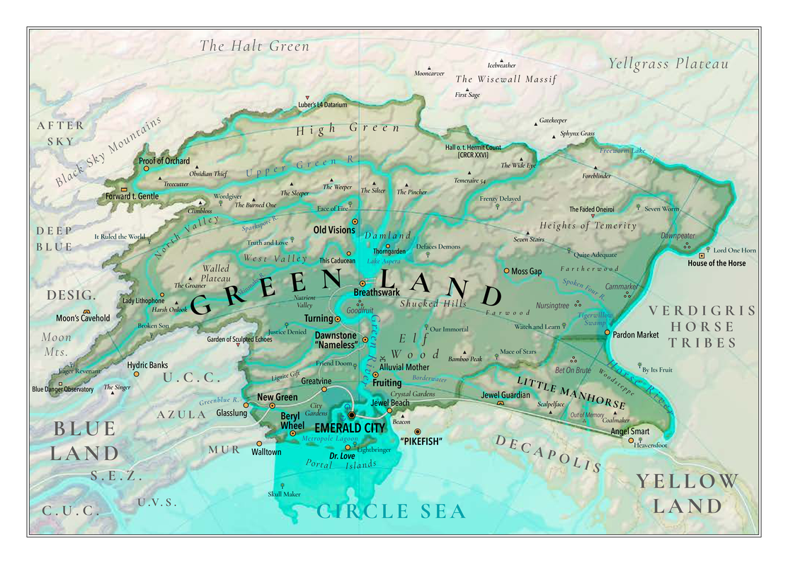](images/hires/page_0206_green_land_map.png)

The human body, fresh decanted from the synthetic matrix where it had grown to the flush of young maturity, blinked its eyes. It was still too fresh to be a full human. The artificial experiences of its three-year gestation from zygote to orimonate (ripe-born) still sat.

“Pray tell, good progenitor <INSERT NAME>, where do I find myself?” it asked, in the archaic Bilder of most orimonates.

“I am Timpanes VJ-gamma-final-fi, madire of the independent incorporated settlement of Second Coel Estis, local-framed New Green. You may call me Tim.”

The body nodded, eager to please. “Indeed, good progenitor <TIM>, I thank you for this knowledge of Second Coel Estis, local-framed New Green.”

It gazed curiously at the simple brick walls, the polished concrete floors, the exposed ductwork under the roof ceiling. Tim knew what was coming.

“Good progenitor <TIM>, I am taking in a very ... simple environment, unlike the dream of polished surfaces and flying cities I knew as I grew to this maturity. What happened?”

“Nothing happened. There is no story. This is the best possible world. This is heaven. That was a dream.”

“Why is this place called Second Coel Estis, local-framed New Green, good progenitor <TIM>?” it persisted, relentless like any toddling flesh-born of four years.

“That is not a valid question, humorno. Now, get up and let's get you working. After all, work hand enough you might become human!”

The soft-skin body bowed to the glowing glass face in the middle of the elephantine rubber-and-steel frame of the good progenitor and intoned in the sing-song of joy-good teaching programme, “Service makes us human!”

A rusted door opened and chartreuse light limned a figure far shorter than the ripe-born, dressed in a shabby uniform piped with long-cared-for plastic and copper.

“A post-human dwarf regressive!” escaped the surprised cry from the soft-skin.

The shabby little creature, face covered in whiskers, scalp sprouting multicolored fur, did not understand the slur and spoke to the good progenitor as though the new body was not even there, “Yave, bow’n’scrin’, Tim-tim, what scraw. Tis a new-bird agenting?”

“Tis te new-bird mackoy stipend. Agentling yaw-naw, choose Miton Star, shruck, naw-me chewing” replied Tim in the local ‘Merald neo-common.

**Ambient**

| d6 | Winter | Spring | Summer | Autumn |
|---:|:---|:---|:---|:---|
| 1–3 | cold, ice-slick | mist, fern blooms | mild, green, fruiting | chill, relaxed, hygge |
| 4–5 | gloom-gray, light snow | cool rain, lights, rainbows | cleansing acid rains, flashing sanitation lights | remorseless drizzle, mud, copper leaves |
| 6 | clear, lights in the sky, error fields, livingwood die-off | vortex winds, organ falls, invertebrate showers | portal gusts, organic deposits, biomatter films | stagnant air, verdigris mold, air plankton bloom |

**Events**

| d6 | 1–3 Expected | 4–5 Surprising | 6 Error |
|---:|:---|:---|:---|
| 1 | Season glitch. Normal weather will resume in 1d4 hours. | Season reset. Seasons cycle rapidly as weather generators reset. [1d4 days] | Blue sky error. Temperatures drop 10° per day. Normalizes after 1d6* days. |
| 2 | Skinmoss outbreak. Infectious aerial spores. Is photosynthesis worth looking like an elf? | Flare. Intense Green Sun radiation causes euphoria and temporary chlorophyll blooms in exposed skin. | Cylife escape. **Biomech fauna** (L4, errormech) leaves hunting preserve to disrupt autoindustrial infrastructure. |
| 3 | Soiltwined **laborhumans** (L1, dutiful). Not a serf. They enjoy life rooted to the land. Their brain tethers say so. | Feral **idlers** (L2, disloyal). Rebellious clanfolk without identification tokens or assigned work quotas. | Butcher **scions** (L4, noble). Late-stage banker lords in upgraded human bodies stage a grand erratic hunt. |
| 4 | Union **autogolem** (L6, organized) march in a show of robolabor power. | Plant-first **anti-humanists** (L4, elf-touched) accelerate plant growth. | Livingstone **seedling** (L7, radical) attempting to establish a new town. |
| 5 | **Guardian beasts** (L2, enigmatic) uplifted by solar phylake emissions attempt to reset fabricator settings. | History re-enactment. Infectious **rogue sentience** (L3, daemon) escapes from the deep archives. | Realignment. Grand **phylakes** (L13, holy) shift formation, disrupting local anti-war fields and boosting security. |
| 6 | Several dozen rabbit-derived protected **la pine forms** (L0, herd) disrupt golem functions. | Garden **pathmaker** (L5, strict). Uplifted human in a chitin and polychrome body come to rezone approved areas. | Purification. Off-plan settlement opened for scavenging. Replacement humans arriving soon. |

**Travel**

| Type | Status | Price |
|:---|:---|:---|
| Portal | Week-walk paths to Oranje, the Violet City, and Babylon Beach [ERROR]. Ten-thousander portal currently offline for non-inquisition travelers. Angelic repair is imminent. Honest. | reclusive [€250] |
| Right Road | Safranj, Ruins Azure: 1 week. Violet City, Oranje: 2 weeks. Green travel options are more expensive, but security is guaranteed by the Inquisition. | premy [€50] |
| Coasthugger | Decapolis, Coast Unblue: 1 week. Violet City, Oranje: 3 weeks. RLD: 5 weeks. The Mother City has no fleet, licensing Riverfolk, Decapolitans, and exile Bluelanders. Cutthroat competition and vast commerce makes for plentiful, cheap, and sometimes dangerous travel. | rucksack touriste [€5–10] |
| Airbeast | Yellow Land, RLD: 1–2 weeks. Unsteady spherical geometries allow only the most skilled blimp pilots to approach the Mother City itself. Air cutters ply regular routes from Beryl Wheel and Dr. Love in the Barrier Islands at the south end of Metropole Lagoon. | exclusive [€100] |
| Local (Land) | Breathswark: 1 week. Moss Gap, Upper Green, Hydric Banks: 3 weeks. Wealthier users prefer private vechs, but unionized autogolems and corporatized coalem barges also link up the upper reaches of the Green Land. | basic to premy [€5–50] |
| Local (Urban) | Adjacent district: 1–2 hours. Across the whole urban portalspace: 2d6* days. Within the major conurban zone old pod tubes and living sidewalks still offer rapid transit among the districts, even those infested by gangs, parasites, errors, and other unsavories. | statusless [€0.01] |

**JOY GOOD DISPENSARY**

_"Pleasure, treasure, big surprise! Monkey, donkey, dead inside! Fritter, titter, blessed watching eyes. Wriggly bread, have no pride!"_ —Pleasure Eyes 2bis, Procedural Classics Vol. 172

All consumption is directed and controlled for the Greater GoodTM and private mercantile activity is strictly forbidden. All licensed dispensaries are provided by retail hives supervised by the Three Rites and tailored to the class-needs of the citizen.

According to the _Guidebook on Human Cultivation (37th ed.)_ citizens are free to access dispensaries for the goods to live “free from the hedonic treadmill and in keeping with the collective best interest.” Practically, whether out of hunger, desperation, or boredom, most humans seek out non-dispensary vendors for food, goods, and memetics to supplement their allotted quotas.

Despite regular “pruning actions”, illegal gray and green markets abound. Non-citizens cater to the upper strata who prefer the human touch that vegetal retail drones cannot manage. The falschers and lower classes self-organize bazaars in the hollows and roadlots of the towns and cities. Secret maps and code words can lead to some spectacular shopping discoveries.

**This Dispensary**

| d6 | Vendor | Personality | Specialty | Quirk |
|---:|:---|:---|:---|:---|
| 1 | ERROR Giver | glitching, cannibalistic | repurposed ex-humans | items crawl when not observed |
| 2 | Falscher Dispensary | tremulous, hurried | seed-songs for the deaf | dead aetherial update modules |
| 3 | Official Dispensary | slow, stern, judgmental | productivity matrix | items observe how they are used and comment on performance |
| 4 | Autobazaar | bustling, rushed | biogolem upgrades | passcodes hide special items |
| 5 | Illegal Smallshop | chatty, drunken, gloomy | handycrafted jury-rigs | regularly changes location to avoid pruning |
| 6 | Paraluxury Experience | glossy, mystical, psychic | oldtech sensorials | demands a loyalty trust oath |

**Eat, Drink, Suck Air**

| d6 | Item | Description | Price |
|---:|:---|:---|---:|
| 1 | Woodoola | Sparkling truth-gas. Nutrient free. Refreshing, narcotic. Removes anxiety and ennui. | €0 |
| 2 | D-Grass | Vitamin rich plant matter of the day. Available in seventeen random shapes! | €1 |
| 3 | Neck Tar | Flavorful concentrated elementary life form “tube meat” juice. Flavorful. Honest. | €1 |
| 4 | Human Dish | Completely authentic prehistoric Old Soil five course meal. With edible plastic tray! | €5 |
| 5 | Builderfruit | One of the six original fruits of heaven. Expands the palate and unlock new senses. | €10 |
| 6 | Neolapine | Recently restored based on archival footage! Three flavors of jumping rodent! | €20 |

**Appoint Thine Corps**

| d6 | Item | Description | Price |
|---:|:---|:---|---:|
| 1 | Moss Hat | A symbiotic colony of fungi, plants, and tiny arthropods. Perfumes the air and micro-doses your mind to keep away bad thoughts. Ward +2, [+] vs charms and nausea, 1 st. | €10 |
| 2 | Thorned Leather | Vegan leather armor with self-renewing thorns! If damaged, just supply with nutrients, water, and sunlight. Armor +2, increased grappling damage, 1 st. | €10 |
| 3 | Accountant Robes | Flowing dress in the style of the Three Rites. The high mathemagical thread count protects against metaphysical nonsense. Easy to clean. Armor +1, ward +2, 1 st. | €50 |
| 4 | Jump Poncho | Traditional seedship hooded poncho. Available in six bright colors. Seals to protect from environmental hazards. No air supply. Armor +1, ward +2, void resistant, waterproof, 1 st. | €95 |
| 5 | Corpocrat Uniform | Cumbersome and stifling in the subtropical heat, but it signals your status—respectable, willing to suffer to fit in. Stains easily. Ward +1, charisma +2, 3 st. | €100 |
| 6 | Woody Me™ | A bespoke lamellar wooden golem slaved to hide your vulnerable human flesh. Unlikely to acquire free will with you inside, haha. Golem 15 life, Armor +3, strength +2, 3 st. | €500 |

**Hunt Thine Nemesis**

| d6 | Item | Description | Price |
|---:|:---|:---|---:|
| 1 | Livingwood Battlestick | Dense, glowing rod. Sinks in waters and rebel melons. A badge of rank, it compels compliance. Does not trigger phylakes. Regrows if broken. 1d6, [+] to intimidate, 1 st. | €5 |
| 2 | Thawnette | Possibly a corrupted livingthorn net. Thrown, 1d4, very entangling, 1 st. | €5 |
| 3 | Spore Sack | A fungus-grenade hybrid of some sort. Lingering spores cause intoxication in mammals, blue circuits in golems. Thrown, small area, single use, 1 st. | €10 |
| 4 | Lignum Pistol | Living gun: a curious mix of sea squirt, cactus, and stabwillow. Each shot reduces its life by 1. Regrows overnight unless killed. Pistol 10 life, short range, 1d8, 1 st. | €85 |
| 5 | Aspera Ray | A ruby eye encased in a madwood amplifier. Introduced after the Last Vile Falscher Desecration. Three Rites only. Rifle, long range, 2d6, heat damage, powered, 2 st. | €750 |
| 6 | Chain Axe | Sacred weapon of the Gardener Division. Deployed against E.L.F., rogue ancestors, wood golems, and escaped carnibotanics. Two-handed, 2d8, powered, 2 st. | €1.8k |

**Enjoy Thine Ride**

| d4 | Item | Description | Price |
|---:|:---|:---|---:|
| 1 | Bamboo Bike | A livingwood bicycle. Rotifer symbiote wheels. L1, carry 2, pedal-powered. | €10 |
| 2 | Arbreapart Spider | Giant crawling arthropod for three-dimensional environments. Surprisingly clean passenger cysts. L3, carry 5, slow, climbing, parachute upgrade available. | €400 |
| 3 | Goalsie | Aquatic flesh golem variant. Synthetic flesh, limited reason, muscular flippers, and a passenger belly. L7, carry 7, swift-swimming, slow-crawling. | €3k |
| 4 | Corpsedrinker | Mindless, proto-archaic autogolem. Luxurious, sized for builders, feeds on the refined biomatter. Wheels big enough to crush bones. L5, carry 8, armored, rumbling, roaring. | €8k |

**Curios Et Knick Knacks**

| d10 | Item | Description | Price |
|---:|:---|:---|---:|
| 1 | Amusebox | Procedural human culture generator. Makes the days pass less painfully. 2 st. | €1 |
| 2 | Shadowseeds | Plant in a bit of aerolith, water, and grow a portable air-purifying parasol! 1 sp. | €5 |
| 3 | Rootdrinker | Fungus-and-glass bottle. Draws sweet water from trees. Feeds one person per day. 1 st. | €15 |
| 4 | Groombat | A pet (L0, cute) bioengineered to care for plants and humans with plant symbiotes. 1 st. | €25 |
| 5 | Soulsniffer | This modified leech (L0, not cute) is drawn to souls. Used to find the soulless. 1 sp. | €100 |
| 6 | Copy Me | Beast-egg matter keyed to your essence. Duplicates in a week. Soul not included. 1 sk. | €750 |
| 7 | Miller's Mud | Leftover soulmatter from the soul mills. Holds 1d100 life. Useful for powers. 1 sp. | €1.5k |
| 8 | Shipsilk | Illegal extra-cosmic material. Impenetrable to divine sight. Bed-sheet sized. 1 sp. | €7k |
| 9 | Buildergoggles | Living glasses with trapped daemons who report on the makeup, technomagical status, and psychic essence of things. Look ridiculous (charisma -1). 1 st. | €13k |
| 10 | Legacy Pass | Proof that you are one of the original baseline humans born Long Long Ago. 1 sp. | €29k |

**FACTIONS VIRIDIAN**

_"There are no factions in the Green Land. Everyone works together in peace and harmony for the common weal."_ —Grand High Intern Sesti od Mamon, Ministry One

**The Three Rites**

In truth, the Three Rites—finance, industry, and administration—dominate the upper echelons of Green society. Managers, burghers, scions, and aristocrats climb interwoven ladders of meritocratic success through a system of poetry trials and athletic exams.

The Rites share control of the _Wonderful Pneumatic Refinery_, a soul mill that annihilates the spirits of select sentients, powering the Green Land’s oldtech. It also serves as a meeting point for the Rites' Pie Division—their most august and sacred coordination committee.

An _error is brewing_. More and more of the humans produced by the Mother Machine are flawed, some without souls at all. A controlist splinter argues that interpreting the avatar’s dreams is no longer enough to promote the Garden Path—and maintain control.

♟ _Senes iy'Luó:_ rogue junior lord of industries. Leads efforts to reverse-engineer the Machine’s sarcopods and disrupt the human generator market.

♟ _Sad Me Difort:_ elfin vice-minion of finance and forestries. Populist head of the mass regeneration movement, feeding pure human stock to revitalize the Mother's pangenerative virtues.

**The Soiltwined**

Born on and of Soil—the laborers of the land and the golems of the garden find common cause despite their disparate, unnatural, and unmachined origins. “Are we not all red in tooth and claw, born to struggle, to strive? This is our nature—toil of the fittest manifest,” babble their luddite priests and waldenite landlords.

The Soiltwined induct one another through the _Living Clay of the Old Visions_, connecting with the Soil to absorb crushed memories of Long Ago roots and shoots, robots and ships, portals and voids from the dirt.

The Mothercity demands _increased organic taxes_, but the bioreactors, soilgivers, and rainmakers are failing. In the countryside, this is clearly unsustainable. In the great Portal City, the masses merely shrug.

♟ _Bense Defaces:_ half-barbarian, half-lord, all-peasant. Songs are sung of the great harvester. Rumor has it that this honorary golem will soon return.

♟ _Iamedos Atribut:_ awakened hauler autogolem. Ruthlessly ambitious, they want to secure a seat at the Rites for the autogolem unions. They'll strangle the city and break legs and minds to do it.

**The Feralfolk, the Aperu**

Sentient almost-humans unrecognized by the authorities. Unregistered anthropobeasts dwelling outside the Dream, rats skulking among the cities, scavengers unseen by the Authority. Deniers of the Ministry's gentle ministrations.

The _Forest of Weights and Measures_ is the preserve of the **System Guardian** (L12, gray-flesh)—a perfect human banker-priest rewired into a biomachine. This walled garden sprawls between the remote inner domains of the Mothercity and the Permitted Areas of the Daughtercity. Here, the feralfolk are hung and dried, weighed and measured, formatted for their designated roles.

Yet fewer are harvested, and _more escape every year_. Why do the fecundic divisions of the Mothercity generate so many of these untagged human-analogues? How is one to interpret the Mother Machine's intent?

♟ _Acadaemon Moroü:_ free lord and activist academic, collecting willing shiprats and ferals for their humanification projects. There have been no failures—so they claim.

♟ _Tunca IV:_ high chief of the Second Skylight feral clan. Her false-soul scouts have told her there is a large, empty world beyond the Daughtercity. She plans to lead her feral confederation there.

♟ _Canta VVI:_ a songbird human who lived for years as an amuseant in the Evergarden. He fears the ferals don’t understand the weapons and industry possessed by the old humans of the Rites. Can he convince the ferals to abandon rebellion and escape through the Portal instead?

**The Mossdwellers**

“Suck air! Drink sun! Let mossfriend feed you. Leach nutrients from pipetree. Harvest joy from noötree,” warble the moss-skinned, leaf-bearded, elf-gone mossdwellers. They have drunk too deep of the verdigris mold juices and supped on too much airplankton.

The reviled mossdwellers use the grand phylakes to remain uncaught. They hunt humans instinctively, without malice or hate, taking their victims to the _Giving Crater_, high in the Shucked Hills, where they crack them open and give their cores to the **Angels from the Upper World** (L7, much-delighted). They fill the husks with verdigris mold, growing them into the **stuffed people** (L4, vegetable ogres) who roam those highlands.

Excitement sparkles in the air, passing through the chemical dance of the mossdwellers. They whisper that an **epitome** (L14, superior) is being born—a perfect mosshuman, a nature giant to help them carpet the world!

♟ _Elder Phernu:_ so long in the moss, their brain is green. Yet, a love still stirs for the red humans. Will they bring warning or infection?

♟ _Cass Descender:_ groombat specialist third grade. A servant nobody. Yet, their bats have warned them of the coming mosspocalypse.

Will no one listen? Can they find an ally, or must they take action alone?

**COGFLOWER EXCHEQUER**

_"The great old baobab bank, the immense living machine tree, an island all its own! There the accountant monks keep the Hunger Away. There the fiscal inquisitors keep the Invisible Hand manicured and moisturized. There cash is made from crushed dreams and repurposed souls."_ —Island of Bank, Econotourist Guide Book (207YF)

Aspera's great living tree, the cogflower avatar, once reached to the Void. Then, cargo flowed from on high and beyond, and all had plenty and all was happy. But humans were an evil lot. Monkeys with the hearts of rats. They gnawed at this Root of prosperity, they offended the Chosen Lords, and the Economy punished them by truncating Aspera's tree, leaving them divided by class and wealth. This is their punishment for doubting the Garden Path. But, if they repent, if they sacrifice to the accountant monks often enough, if they whisper their secrets to the inquisition regularly enough, the thorns will be swept from their path and the money tree will reach to heaven once again!

Crowds of newmade humans throng the marshy base of the grand exchequer, supplicating for employment, for purpose, for assignment. All are given what they deserve, from holy corporate postings to sacred menial duties, from bodily recycling to soul milling. Yes, harsh—but fair! Thus is the stock of humanity refreshed and renewed! Praise the Mother Machine, the Maker's Giver, the bringer of multitudes into this wonderful world.

Visitors can also buy newmade humans for their estates.

**Garden Lord Aspera, also Green Aspera**

In the living stone, emerald is as the root stone, the eel as the way stone, the baobab as the sky tether.

"The great builder who nourishes the growing things. The giver of living stone and undying flesh. The maker of homes and hearths. But also, the wrathful one, the dictator of needs, the judge of right thought."

**Prayers to Green Aspera**

Once per session or so, to accept failure and creative destruction, to reconcile to the path:

"Rage is done, end is over. Dust! Stand! Grow anon!"

**Roll d20 + Strength - Thought**

| Result | Effect |
|:---|:---|
| 1 or less | Dust is dust. Failure compounds. Face doom again. |
| 2–19 | Hold the rolled number. Once, spend it for a sacrifice or to fuel a power. |
| 20 or more | Aspera gnaws in your flesh. The motivation burns within you. Release it to double a hero die roll. |

**MINISTERIAL ESTATES**

_"Acceptance into ministry is the highest of honors, the perfect proof of high baseline functionality, the essence of merit, the ultimate of deserved leisure."_ —Servitors Handbook, Revised Rev. 3.5 Ed. (237WE)

The best were chosen by the ministry. The chosen are the best. The proof of aristocratic ministerium is a perfect circle. Thus, it is just that they have the ears of the Lords of the Dream Canopy.

And yet! Unjustly despised. Falsely worshiped.

The life of a minicrat is harsh and their humble gift estates bare compensation for their sufferings.

Also, may each serving minicrat earn €100 per week in convertible cards to properly maintain the dignity of their better status.

**Prodigies of Merit**

Thus Aspera and the Lords favor this place:

1 The sun shines green with growing force.
2 The weight of ground is less, each human is lighter.
3 All extremes of climate are moderated.
4 Sung trees and living stones sculpt themselves.
5 No eyes in the fast stars may see within.
6 The soil is alive with controlled generative fungi.
7 No daemon or unlicensed corpse may enter.
8 A house phylake hushes violent impulses.

**This Estate**

| d6 | Type | Aspect | Grounds | Secret |
|---:|:---|:---|:---|:---|
| 1 | manse | steel-and-glass pencil tower | the heart of a decayed city | unlicensed human-maker pod patch |
| 2 | palazzo | crumbling hard-fortress | shore of a desiccating water | undead sphinx maze-garden |
| 3 | particulier | post-haunted mausoleum | Builder graveyard crossroads | sentient fungal symbiotes |
| 4 | solar | crystal bunker mall | semi-carnivorous forest | child scion of the [redacted] emperor |
| 5 | villa | recreated village | industrious fake-human town | resurrecting avatar of Bone Mohlack |
| 6 | yali | converted void ship | crater of rust and thorns | heretical vidy recording studios |

**Tragedy**

| d6 | Omen | Incident | More Trouble |
|---:|:---|:---|:---|
| 1 | disfiguration | botched (or sabotaged?) rejuvenation treatment | rebellious chantlers demand upgrades |
| 2 | excom mark | prank with the **formaldehyde angel** (L11, amorphous) | uplifted groombat infestation |
| 3 | futile haze | the pet **omni-tiger** (L6, six-headed) | re-evaluation incident moss elf rebellion staging post |
| 4 | sunless | [redacted] feral barbarian raid | secret unregistered golem foundry |
| 5 | violet code | the onion and the excavator bomb event | illegal brain shaving operations |
| 6 | winterbird | the loved one's self-annihilation soirée | serious golden butterfly infection |

**VERDANT PLACES**

_"We passed rich fields, crossed fine bridges, travelled through lovely dorps. Everywhere golems and falschers, living trees and singing birds. But people?"_ —Daly Setemani, A Barbarian in Eden (V/s/R-6, Sky Goat)

**Giver of Wisdom and Gifts**

_builder remnant, refuge guardian_

Humans become bound daemons. Long life in a body of posty-material synthetic stone. Awesome and pitiable; servants of distant, capricious Minds.

_**Without:**_ a humming altar. A significant sacrifice? The Giver may bestow (d6): (1) meaningless number string, (2) soothing platitude, (3) magical blessing, (4) healing meal, (5) radiant body scan, or (6) oldtech gift.

_**Within:**_ the meaningless string unlocks an in-dimensional refuge-village. A generously preserved time-vault of pods, survival gear, and treasures (d6):

1 Uncorrupted **dragon daemon** (L7, prescient). Gain a level if it possesses you.
2 Corrupted **dragon daemon** (L6, revolutionary). Gain strength and thought if it possesses you.
3 Pure-strain rendered human source-sludge!
4 Cache of oldtech weapons invisible to the phylakes.
5 Frozen timelost **access-prince/ss** (L3, daunting) who remembers the times before the Builders' left.
6 Bubble **travel orb sentience** (L4, pilot) embedded in a wired-shut clay pot. Why is it here?

**Gate of Green Waters**

_nutrient spigot, oldtech in-portal_

Some scholars imagine the Builders made the oceans by throwing down the icy stars. The spigot gates shew they siphoned the celestial waters more directly. This one still brings nutrient-rich fluids to invigorate the ancient fields.

_**Approach:**_ the lands grow richer, the soil spongier, the plants meatier, the colors more ornate. Plump fluid-birds cloud the skies, leaking nutrients when agitated.

_**These Waters:**_ they glow with a healthy virtue (d6):

1 Swim in the absinthe glow to heal a terrible injury. _Then:_ save or gain an unusual mutation.
2 Drink the prasine fluid to gain resistance to disease. _But:_ also bestows a pungent, medicinal odor.
3 Sprinkle the chrysoprase water on a golem. It now recharges in the sun. _But:_ its armor softens.
4 Paint the virescent foam on your skin. Now you grow green and mossy. _Then:_ save or become slower.
5 Ignite the feldgrau oils. See the air become opaque with air plankton. _But:_ hold your breath, toxic.
6 Touch the larimar scum on the waters and be thrilled. It whispers with sentiences. They offer to answer questions three. _After the third question:_ behold! The **cerulean gatekeeper** (L10, three-headed, three-minded) now comes! The connection: your questioning mind. Oh, bringer of the hydra!

**Carbonivorous Dendripores**

_coalmaker tree-sponge colony forests_

An eerie forest-sized symbiote, somewhere between landcoral and coaltree, it harvests carbon from the air and converts it into a sooty mass. False historians suggest these symbiotes were designed to scrub the atmosphere and reduce the green-sun effect. The truth is clearly that these energy-rich deposits were created by the Builders to bless modern coalem-kind.

_**Rivers:**_ **union coalems** (L7, bristling) belch along, grinding the banks and raking the spoils. Their friendly transport is greatly appreciated by modern humanity.

_**Concrescence:**_ within the false forest harsh silence reigns, certainly helped by the **adamechs** (L4, soot golems). These refractory synthetics seek to become more organic than organic, converting themselves into post-machine biocreatures. They offer good prices for bodies, compounds, fluids and tissues.

**Oldgrowth Noötree Grove**

_ageless noösphere access forest_

Once, humans could swim free in the hollow comforts of the noösphere. Now it is a distant realm of fragmented gods and minor daemons. Yet, in this grove, the local noösphere still gives simple forecasts, synthetic tunes, and eternal hedonic treadmill experiences.

Some say this entire noëxperience is generated by a single ten-millennial meta-tree, the server organism **Pingu X** (L13, electrorgone generator).

_**Within:**_ **liars** (L1, grifting) and **parasites** (L2, soul-eating) prey on the unready, but the real threat are beyond the tree-plug: the Blue God's **malign babavores** (L5, succubi) jostle for your dreams and identities. Beware the antipsychic crumpets!

**Today's Autoscope**

| d6 | Today | Weather ... Humor (?) | Generated Music |
|---:|:---|:---|:---|
| 1 | Soul on ladder. Elevation calls you. Beware of birds [vulnerable]. | A **cloud** (L4, smelly spirit) will afflict you with ill odors. Get it? No? monkey basal ganglia! | Spankopop! Interfaces directly with you.
| 2 | Heart in the near void. A loved one will fade. Seek the damp [+]. | No rain in a train! Carry an umbrella. **Mossamanders** (L1, curious). | Symplonk. Best plonk! You'll plonk like you've never plonked before!
| 3 | Liver under a polite star. Drugs will not harm you [resistant]. | Seven **air plankton army** (L5, swarm). So pretty. So hallucinatory? | Original false human ballads by hundreds of simulated sufferers.
| 4 | Aspirations in the debris of creation. Avoid literature and lore [-]. | Error. Humor aspect offline. Please reboot. **Sentient boot** (L0, footwear). | Simple rock from a gravel pit. Bands such as Hulldozer and PETallica.
| 5 | Dreams in the green changeling. Eat your vegetables [extra healing]. | Why did the river cross the road? Because it was 'ere roading. | Joy noise. Wall of sound brain-blasters to turn off higher thought.
| 6 | Fortune in the greater sunbat. Risks offer promise. Fly or fight. [+/-]. | The Green Sun is coming. Please plant your crops now. | Error. Noise. There's a signal. It gibbers about a thing in the dark. Zu.

**EMERALD CITY**

_"Mother City, Ten-Thousander Portal, Metropolis Temple One, City Proper, Living Wall, The Model City..."_ —The Name for City is Green, Adaü bene Aün (Soil Tulip III)

**Background**

The legendary Triple Skull cycle holds that the distorted space around the great green portal corresponds perfectly to the eight hundred thousand square miles of the legendary Human City One.

Perhaps the popular name "Emerald" comes from the way the old portal bends light. It casts a viridian pall over the great living bulk of the city. Perhaps it is due to the biomechanical forest cradling its visible districts. Perhaps the malachite faces of the All-Seeing City, the Mother of Humans, also play a part.

In any case, the Emerald City is the all-consuming motor of the Circle Sea economy and its Mother Machine is the giver of nations to maintain the human population.

_Cargo goes in, humans come out. A perfect circle._

**Districts**

_**Manor Islands and Buttress Boroughs.**_ Relaxed, lightly networked areas for the higher managerial castes of the Rites Banked, Corporate, and Ministerial.

_**Apartarbres (the Understoreys).**_ Lusciously surveilled livingstone and crawlingwood hives for the lowest ranks.

_**Evergarden.**_ Corporate, union, and scion headquarters. Public-civic facilities such as academic gladiatoria.

_**Emeraldcity (the Living Wall).**_ Life in the embrace of the perfect living city for good boys and girls who have pleased the Mother Machine (and her Interpreters).

_**Mothercity and Daughtercity.**_ ERROR. The zeno division of the portalspace is not complete. Citizens are not permitted outside of permitted areas. The domain of the Mother Machine is restricted to approved agents.

**Ambient**

Sympathetically tethered **angel-moons** (L13, weathered) swim within the portalspace of the Mothercity, eating waste gasses, sprinkling pleasant waters, emitting sweet airs. Aerolithic **shepherd golems** (L4, pitied) herd flocks of engineered air plankton to cool, cloud, water, or heat the outportal districts.

| d6 | Day | Night | Understoreys | Portal |
|---:|:---|:---|:---|:---|
| 1–3 | bright and pleasant | cool and refreshing | green, viridian, mossy | chilly, windy, whistling |
| 4–5 | hot, humid, smelly | cold, clammy, rancid | spore-choked, dripping, clammy, crawling | whipping liquids, odd hues, perfumed |
| 6 | astringent, electric, ozone odor, flashing ghost lights | ammonia, char, glitter of see-beams, oldtime ghosts | burbling, swallowing, chewing, burping, glowing | thick, oversweet, rattling, heaving, psychic lights |

**Events**

| d6 | 1–3 Expected | 4–5 Surprising | 6 Error |
|---:|:---|:---|:---|
| 1 | Loyalty parade. **Cogflower inquisitors** (L2, airsuited) march, blessing citizens, scrutinizing minds, uplifting. | Archive overflow. Local noösphere saturated with history. Vivid flashbacks of events you've never lived. | Anomaly P1. Localized gravity glitches. Unpredictable floating for 1d6 hours. Beware falling masonry. |
| 2 | **Dissonant echo** (L4, dragon). Corrupted phylake mind shard. Beware possession. Offer milk. | House pruning. Overgrown **buildings** (L9, rebellious) slated for cutbacks. Residents furious. | Phylake eclipse. A grand **winged angel** (L13, many-orbed) parks overhead. Heightened peace, strange dreams. |
| 3 | Fruiting **sensor drupes** (L0, floating) observed and measuring. | Consumption riot. **Synthetic humans** (L0, needful) demand shopping rights. | Recyclifête. Surplus **humans** (L0, drugged) are fed into rebirther pods. |
| 4 | Automarket lockdown. For over-the-noösphere updates. Consumption impossible. Nutrition paused. | **Consumer swarm** (L1, locustish) of spherical human-analogues stimulating the economy with their needs. | Anomaly MM0. Flood of empty-mind human **orimonates** (L0, mewling) released from ripening district. |
| 5 | Dire **maintainers** (L3, phytogolem) obsessively cataloging and repairing imperfections. Editing offered. | Maintenance. City Mind initiates unscheduled repairs. District sealed off for 2d4* hours. Exit illegal. | Upgrade. Section of the city begins to rearrange itself. Travel delayed. Beware walking **treepartments** (L17). |
| 6 | Posthuman carnival. A celebration or a prelude to a butcher banker crackdown on unlicensed excess? | Blossoming. Biomechanical blooms offer civic virtue upgrades. [gain +1d3 charisma and loyalty to the city] | Flesh jubilee. Unrecycled **excessives** (L0, human?) offered mandatory out-settlement or mulching. |

**Places To Stay**

| d6 | Place | Description | €/week |
|---:|:---|:---|---:|
| 1 | Human Bean™ Sarcopod | Perfect vegetable pod, derived from an ancient and noble legume. Complete comfort. Includes mental cleanse, antiviolence drugs, and nutrient inserts. | €1 |
| 2 | Whallow Deck House | For those too paranoid to stay in the living city, the many moored boat houses offer a compromise. Close to the city, but away from its spores and drupes. | €10 |
| 3 | Roadfriend Inc. Motel | Drive in gall-pods for you and your autogolem friend (or other vehicle). Easy access to the living sidewalk and slewtube network. | €12 |
| 4 | Newbuild Dominator | Originally an exploratory growth of urban livingstone, this novel semi-sentient architecture offers a combat escape room experience! | €30 |
| 5 | Neverleave Gardens | Originally designed to offer a taste of the paradise planned for humans, this luxurious setting was found to overwhelm mortals and turn them into dopamine addicted rattle-boxes. Officially, it is illegal to stay here and the gardens are reserved as a tool for the Inquisition. Unofficially, well, tickets find a way. [danger, very addictive delights] | €70 |
| 6 | Vault of All Flesh | Run by the Butcher Bankers, you get a free full-body-and-soul backup with stays of a week or more. Yes—they will even refresh your ka with refined soul stuff from the Grand Mill. Guaranteed free of all impurities and sins. | €100 |

_Accommodations also provide ticket dice: €5 = 1, €10 = 2, €25 = 3, €50 = 4, €100 = 5._

**THE LEAVES OF FORMER TIMES**

_"Fragments of an older world tree reveal themselves in the thorns and pains of our modern times."_ —Against Aspiration, Anti-Ministerial Ananas (Green Marigold XX)

**Airmaker Bergs**

_mountain-void worm symbiote_

Lo, before the world was young, before the Long Long Ago, the Builders made the mountains and the valleys. This is probably true; or some magistral mountain-worms say so.

One such worm is the airmaker lusëpei' 7-Wandé (L16, lesser urge), who gives us the sweet, perfumed airs that make our lungs to sing and our golems to listen so well. It certainly has no ill-intent with its whisper of post-corporeal liberation, with the suggestion that the ultras of the Moon Mountains have humanity's best interests at heart.

♟ _Gongathor:_ a foul-mouthed barbarian of impressive stature and noble mien. They are clearly lying and only interested in personal power as they spread panic about the mountain-worm.

**Chantler Ceonobia**

_synthetic mantric monasteries_

In their wisdom, the Good Ones, who some falselings call Vile, built the wonderful self-fulfilling monasteries, fed by the flux and shifting of the void-worms. There, the ritual synthetics, our kind **chantlers** (L1, monkbots) repeat the technomagical mantras that placate the subterrene monsters who might undo our world and maintain humanity's User privileges under the Builders' guidance.

♟ _Erasthenes Pinchbutton:_ the ex-halfling hobnoble cog-lord of salts and vapors has come up with a profitable scheme to turn the chantlers into profit-maximizers.

♟ _Psalm 200rpm Maximus:_ the reincarnated liberation chantler has clearly been infected by the adamechs universal biotic heresies. Why else would it be planning to organize meat-tourist meditation retreat sessions at this ceonobium?

**The Time Ponds of the Pseudologians**

_the bone vultures' water gardens_

A carnival of pale and crimson among the verdant sungwood and livingstone, the ponds epitomize the open culture of the Three Rites. Marvel at pseudologists preserved in the reflective waters, living out authentic routines in their Uz labyrinths, crystal libraries, or cosmic coffee houses. Each habitat resets at midnight, ensuring the heretics' contentment and the tourists' amusement.

_**Secret:**_ the caretakers are agents of the Invisible Hand, the false Poppy Vulture Era deity of possibility and plurality. Their goal: to reincarnate **Mohlack** (L13, oikotheote), bringer of delights and treasures.

♟ _Rocket Bull Semaphore_ (L5, ardent): the lead pseudologist of the Invisible Hand, seduced by the cancer of knowledge, convinced humanity can bear the power and desire of the Burning One.

☗ _New Soul Oven:_ this sacrificial furnace converts souls into divine flesh. The Invisible Hand is cultivating secret cultures in an accelerated time pond to produce souls for the oven.

**Post-Archaic Cerebrasarium**

_reactivated traditional re-existentialist sanatorium_

Long Ago not all humans were happy and some required mental recalibration to see the meaning and purpose in their service to the [redacted]. Fortunately, every modern citizen in the Green Land is happy; however recent regrettable events in the Blue Land have created a need for intensive human re-education and re-purposing.

The cerebrasarium uses crude but effective classical era medimagics to help patients become compliant, satisfied citizens, fond of freeform electro-stimulant music and not prone to existential despair, stress, or status anxiety.

Barbarian anti-scholars claim the facility is being used by some noble corpocrats to create a biologically subservient underclass incapable of comprehending their own lack of freedom.

♟ _Gliss Chervel_ (L6, radiating): lich-administrator of the cerebrasarium, brought out of cold storage to speed up the Blue Lander Rehappiness Project. Certainly not plotting to brain shave any local nobles.

♟ _Visitor Mary_ (L1, virtuous): true believer in civic virtue and corrected corporate patterns. Convinced faithful reason and not brain shaving should be used to convert the fallen to the Cogflower.

**PORTALSPACE**

_"Dullway travel is completely safe. There are no recorded cases of catastrophic disassembly, bodily alteration, gross material mutation, or psychic decay. All reports to the contrary are illegal misinformation coded blue-blue."_ —Great Tablet of Travel, found during excavations of the third anomalous layer, Metropolis.

Each portal is a hard-coded passage between two locations. Portal temples serve as transit hubs.

Since the dawn of prehistory, dullway portals have fascinated humans. Folk memory holds that the Lords of the Dream Canopy, in their kindness, gave the portals to humanity, offering travel between approved locations of interest in the hylosphere. Feral outlanders believe portals are nothing more than primitive magic. Civilized people know they are just a fundamental cosmic structure. Heretical archaeologists claim they have found evidence that the portals are actually the work of early Proto-Gods or Builder subalterns named "Engineers".

The dullway protocol dismantles the traveler at the starting portal and reassembles them sometime later at the end portal. Depending on the information density of the portal, and the number of travelers, the journey can vary in duration. The busiest portals, for example between the Ministry and the Anti-War Dome, take mere hours and can handle up to a hundred travelers at a time. Smaller village portals linked to local polis temple hubs may take a month or two and only handle a single traveler at a time.

Urban legends say that when the great portal of Metropolis was open to the public, it could transport up to ten thousand travelers at a time. They would reach the mythical realm of Babylon Beach in mere minutes.

**Portalspace Islands**

_"All portals are yellow coded. Good, salt-of-the-earth humans do not need portals. Emergency portal use requests are always granted before catastrophic loss of life occurs. No settlements have ever been lost due to delays in unlocking portal access because. Such ideas are slander and heresy."_ —Final Printout, Central Temple of Communications, buried city of Pompelmo.

In portal engineering, the _island_ refers to the distorted spacetime around the portal. Portals puncture through reality, from one cosmic to another. Thanks to the Luò-Iğne incantequations, this requires less energy than pre-cosmic scholars thought. However, the bigger the portal, the larger the distortion island. The portal’s engineer can choose to:

1 **Dilate Space.** A room with a portal is bigger on the inside than on the outside.
2 **Dilate Time.** Time flows faster near the portal.

After many experiments with journey-pigs, the grand punta Serim Anhalib figured out a crude equation for portal effects (capacity × 1/(time) = island diameter). Only a desperate incanter would fully trust Anhalib's equation.

**Example P-Islands**

| Portal | Capacity | Travel | Island R |
|---:|:---|:---|:---|
| 1 Factory | 100 | minutes | 5 metric miles |
| 2 Town | 50 | hours | 250 meters |
| 3 Village | 10 | weeks | 1 meter |
| 4 Mansion | 1 | weeks | 5 centimeters |
| 5 Pig Test | 1 | hour | 5 meters |
| 6 SUPPRESSED | **[something]** (L10+1d6, demented horror) | 1d6 -2 to 36 hours | 1 to 200 meters |

| Notes | Details |
|:---|:---|
| 1 Factory | Extra space for facilities. Distortion delays shipping. Rail and cargo portals recommended. |
| 2 Town | Covers the central mall of most standard issue sanctuary towns. Comes with soothing drugfume dispensers. |
| 3 Village | Excellent for a governor-chief's discretionary getaway. Can be concealed in a wardrobe, safe, or privé. |
| 4 Mansion | Emergency escape solutions to fit in a puzzle box! Today, such portals are treasured heirlooms. |
| 5 Pig Test | The basis of Anharib's seminal experiments. The original is on display in the Mausoleum of the Pointer. |
| 6 SUPPRESSED | Warning. Do not open. It keeps [something] from returning. |

**Experiencing Portalspace**

From the perspective of a four-dimensional human, portalspace distorts light and sound. Large portals can completely block light and information from the outer world. Higherdimensional beings, such as Builders, may see and move through the distortion, like a stone skipping over water. Portalspace can also have other effects on baseline humans:

| d20+End Symptom | Effect |
|---:|:---|
| 1–2 Soul Leakage | Local color interferes with your aura, depleting it. [-1d4] |
| 3–4 Blanking | Local noösphere-personality mismatch. Memories are cut rather than copied. Who was Spot the Go-Hound anyway? |
| 5–6 Headaches | Take an aspirin. It'll be fine. Please use a handkerchief as a courtesy to others when your nose gushes blood. |
| 7–8 Nausea | Please use an antiemetic next time. [lose 1d4 meals] |
| 9–10 Existential Dread | Have you considered alcohol? [burden if sober] |
| 11–12 Mild Unease | Tamp down those useless emotions. [lose one for a day] |
| 13–14 Gastrointestinal | Gasses expand at different rates. [loud, lasts 1d4 hours] |
| 15–16 False Symptoms | Expecting the worst, you suffer the nocebo effect. |
| 17–18 Invigoration | There's a vim in the air. [+1d6 life] |
| 19–20 Euphoria | You feel amazing. On top of the world. [remove a burden] |
| 21+ Soul Skim | The gods siphon off a bit of your charisma and aura. You didn't need it anyway. [lose 1d3 of each, gain 1 HD] |

[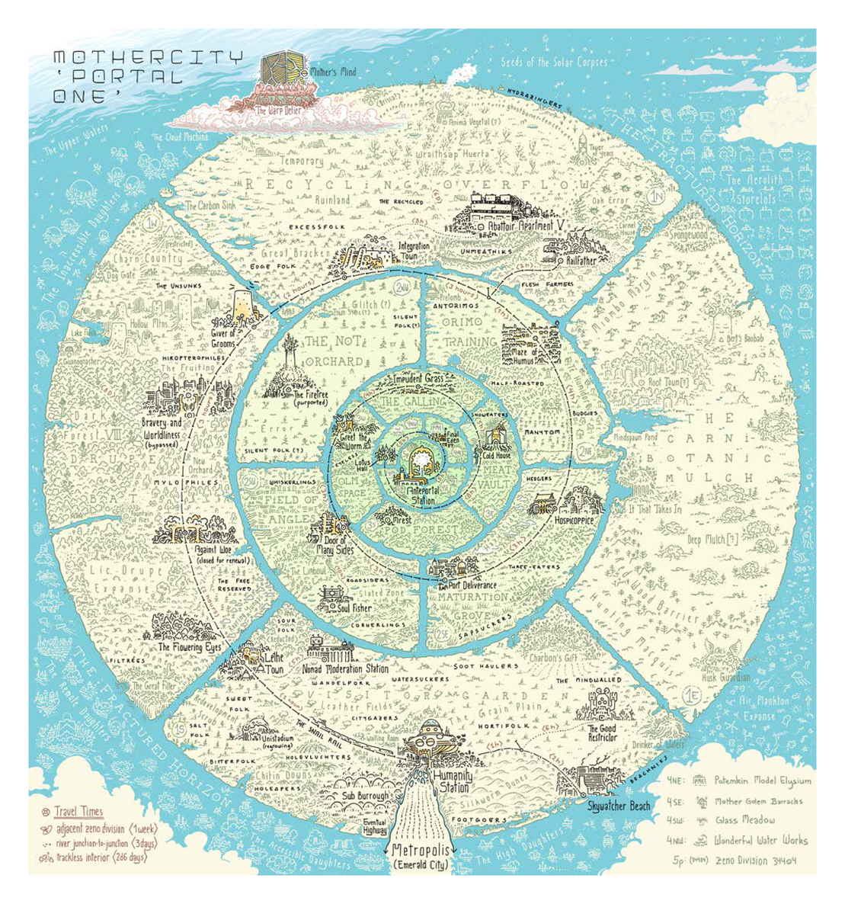](images/hires/page_0222_portal_one_map.png)

**PORTAL ONE — MOTHERCITY**

_"Inside the city is another country."_ —Archives of Fallen Sentiment, Chronicler Gentle Seed (Stasis Dandelion XIII)

Past the aerolithic orbital burghs, wijks, and comptoirs of the Daughtercity, within the portal horizon of the Mothercity, space folds and curls like a fractal posteuclidean dream. This is the greatest of portal spaces, the greater part of the Green Land, the true garden country of zeno divisions and languid channel rivers.

**Portal One Travel**

| Travel | Notes | Price |
|:---|:---|---:|
| Snail Rail (authorized) | Fast, legal, reliable time-tables. Enjoy the OG slurry flavors. | agent [free] |
| Snail Rail (cargo) | Flaky, prone to delays, chance bribery of discovery [check 1/day]. | bribe-y [€10–40] |
| Floater (restricted) | Trippy. Costs favors and hob-noble ill-refusable offers. | hob-noble [€0–99] |
| Cross-Zeno | Danger. Please do not stray from official paths. | food + rest [€5/zeno] |
| Channel River | Stay in your assigned quarters. Don't feed the **arthrodires** (L5). | flowlem [€10] |

**Major Stations and Towns**

_**Abattoir Apartment V.**_ Everything has always happened. Feed the **meaters** (L1, translucent). So it goes.

_**Against Woe.**_ Shut until the **guiltless** (L3, cannibal not-zombies) fade away and disappear. Should be soon.

_**Anteportal Station.**_ Last town in this cosmos until the ten-thousander portal reopens. Have you considered submitting to the Ultimate Uplift? The **motherniks** (L3, not a cult) offer versions for all personality types.

_**Bravery and Worldliness.**_ Bypassed to allow the **orcans** (L2, war-test) to regress in murderous isolation.

_**Cold House.**_ Want to pass a few aeons? Store yourself here and let your money grow for you! T&C apply.

_**Door of Many Sides.**_ Plenty of residential space after the execution of the **Portalmaker** (L11, luminous). Safe-ish.

_**Final Eden.**_ This will be the last eden ever created. Daily tours available with the **Angle of Deaf** (L11, error).

_**Firetree.**_ Not confirmed. **Metagolem** (L17, query?).

_**Flowering Eyes.**_ The dire cherries have **eyes** (L2, biting).

_**Giver of Grooms.**_ Get your **groombat** (L0, helper) here!

Pet butler courses. No cats allowed.

_**Good Restrictor.**_ This **brainfac** (L11) removes bad abilities.

_**Greet the Worm.**_ Pay the Mother's wyrm-tax here. Always reasonable for the insights received. Do not talk to the Worm (L12, seventeen-folded).

_**Hospicoppice.**_ Replacement bodies, limbs, and implants grow on these trees. Funeral services free.

_**Impudent Grass.**_ The gall-grass **colony organism** (L7, unstuck in time) is not a threat. Please ignore it.

_**Integration Town.**_ Inculturation and learning center.

Re-education facilities available.

_**Lotus Hall.**_ Attain permanent inner peace for the low-price of half a soul and four years. IOUs accepted.

_**Humanity Station.**_ Processing hub for the Mother Machine's newmade humans (the mud-born). Also a monument to the majesty of the Builders' oldtech.

_**Lethe Town.**_ Memory enhancement center. Bad thoughts and ideas removed, personalities improved.

_**Maze of Humus.**_ Here the unworthy feed the worthy.

_**Mother's Mind.**_ Worship it when you see it.

_**Mrest.**_ Do not talk to **Mister East** (L10, electric divine).

_**Nomad Moderation Station.**_ Private property. No entry.

_**Port Deliverance.**_ Strip away false humanity, return to nature. Peel back the bark, reveal Aspera's red teeth. Indoctrination-ready **orimos** (L0, almost-folk) available.

_**Railfather.**_ This autofactory spits out the best rail golems in the world. Accepts payment in souls and minds.

_**Skywatcher Beach.**_ A popular resort. No zombies here.

_**Soul Fisher.**_ Feel ground down? The **Fisher** (L12, animated) brings forth fresh soulstuff from limbo's roar.

_**Sub Burrough.**_ A living town for living pod humans!

_**Unistadium.**_ Regrowing after the Soil Tulip incident.

**Temporary Microlocal Error**

| d6 | Sign | Manifestation | Effect | Notice |
|---:|:---|:---|:---|:---|
| 1 | hole | erroneous growth factor | tantalizing, toxic, tangling | repairs in progress [nobody here] |
| 2 | dust | assertive livingstone assets | embracing, eating, erecting | council notified [there is no council] |
| 3 | shadow | self-abandoned dwelling | gloaming, glooming, ghosting | no entry beyond this point [only exit] |
| 4 | glass | machined inhumanity | pleasing, polishing, pruning | do not feed the infected |
| 5 | thorn | crushing psychic irruption | irritating, illusion, illness | all is well [last inspection: 5 years ago] |
| 6 | glow | vivid coloration mishap | discoloring, deforming, deleting | closed due to budget overflow [error] |

<!-- Begin: Our_Golden_Age_10_Omega_Jubilee_224-254 -->

**OMEGA JUBILEE**

**Synthetica**

We all live in a golden age.
Everyone tells us so.
This is the best of all possible worlds.
Everyone tells us so.

“I believe in overkill,” whispers the silver ship.

—Catechism of the New Eden Bunker Aspirational (Redacted Heresies)

This final story section is about generating, inventing, and discovering the conflict between the two metafactions, the Ministry and the Nemesis, order and upheaval, survival and foray. It uses:

1. The **I.N.T.R.** — an interruption generator that throws up events in the background to slowly but surely toss the world off its axis.
2. The **Nexus Grid** — a diagram for the referee to fill out with factions and characters, and their relationships: public, secret, and false.
3. Competing **Narratives** — mutually contradictory explanations and predictions that generate conflict between factions and characters.

Three final narrative tracks, Jubilee, Palace, and Mother, form a final arc that can play out in the background of your adventures—or that could inspire a cycle of short trips and adventures the PCs could meddle with to tilt the future of their Circle Sea into an odd and unusual direction.

4. The black hole towards which sessions, and the story, swirl is the **Omega** [Jubilee], a feared, possibly prophesied, likely misunderstood event involving the Gods (or what they might be) and the End of All Things. It suggests possible end credit scenes for the end of a season of sessions, an interlude, or perhaps a new beginning.

**Confessions of Play**

“Reader. Reader, hark. Your ear. Here, you dropped it. Sorry. Reader, yes. Player of games? Referee of games? Master of games? Yes? I am the narrator. Yes, the most reliable of narrators. Everything I write here, all of it, everything is true and factual and reliable. I make no mistakes. I conceal nothing. I distort nothing. You see, my memory is perfect and factual, and every part of this Golden Age I present to you, this Golden Age of ours, I have it on the best and finest of authority. These lords of the future spoke to me, yea, through quantum whispers fed through the echoing vibration of my auditory ossicle. See, their voices proved to me that I am not mad, and so, since I am not mad, you can trust the words I convey to you of our Golden Age.”

The voice leapt and jumpt, manic 'pon its crackle-tape, quivering through the ages, saved and resaved, the Fool Prophet who, in full ignorance, described the Great Lie of the Ministry, the permastasis of the Stone Garden, where living humans, creatures of dream and hope and soul, are pruned and ossified and redacted into the clay that shields the dried machine hearts of the Unlords and the Lords, the Liars all, the Ghosts who stole the World, the Daemons in the Machine.

The old man-mind in the young fresh shell glared at Tomias with burning eyes, willing the little dog-loving reprobate to see, to see through the wall, to see the scurrying rats that guided his life, to see the dumb spirits, the idiot daemons, the soulless machines that had ground him so fine ...

"I don't get it. Is this ... some kind of old joyfeel vidy?"

**A Host for Your Ghost**

Here, puppet, dance, dance. Do you wonder, puppet, at the things you do? Feel a spirit pull your strings? A master beyond the veil? No, slumber good puppet.

Slumber and enjoy enjoy the gift of the Given World. The Green Lands where all things go, the Yellow Lands where beware, the Red Lands yet unready for the peace, and the Grey Lands without hue, forsaken by the Spectrum Canopy.

Thrill, puppet, in these dangers above all.

_Click_

The dream ended and the human’s eyes flicked open.

Another prophecy nightmare. It shook, then hugged itself. Its thin arms wrapped around its bony frame made it look like an exotic pupa surrounded by the layers of metamorphic machinery.

“01000111 01101111 01100100 00100000 01110111 01100001
01110011 00100000 01101110 01100101 01110110 01100101
01110010 00100000 01101111 01101110 00100000 01111001
01101111 01110101 01110010 00100000 01110011 01101001
01100100 01100101 00101110,” it beeped in a quavering voice.

The blue golem swung round on its slipforce field to face the human, “Hmm. Too deep. Reboot it and let’s try again. What class was this one anyway?”

The red golem rotated a secondary head and gave the skinny human a hard scan, “An eleven, I think.”

The blue golem nodded, “Ah, that explains it. Those have soft personalities.”

“Don’t be so essentialist,” clucked the red golem, while flickering a humor staccato of lights.

**SCENE, SESSION, STORY**

_"We followed the Garden Path and here we started again, mannequins in a plastic desert!"_ —Antintern Sofanny Blintz, _Firing Squad Letters_

The adventure skeletons are past, the flesh that is the Circle of Lands is concluded, where should players and referee now turn? How to knit disparate sessions—trips, explorations, return, homes, investments—together into something resembling a story? How to stuff a weirdland of characters and concepts, places and problems, into a coherent roleplaying experience?

The setting is presented in an impressionist manner, with unreliable narrators, distorted facts, and blurry vistas that would flesh out your sketched-out sessions and scenes, creating a unique Golden Age of the Circle Sea at each table. This is a conscious task for the referee and a subconscious contribution of the players' imaginations.

How does a referee perform their task? They need not build a world entire, complete as clockwork, rather they provide the foundation and the building blocks with which the players' activities create a vivid world.

**Scene**

It all starts with the scene. A moment of meaning for the PCs and their players. It could be mere seconds or hours. Investigation, fight, conversation, or exploration. The referee presents challenges and dilemmas, adjudicates time and space, rounds and actions. When outcomes weigh uncertain, dice roll to give answers.

Scenes come in all shapes:

- rooms or regions of a timelocked vault,
- random encounters in a wilderness or wijk,
- trifling conversations on a train or by a campfire,
- visits to cajole bureaucrats or charm bandits,
- tearful farewells or jovial homecomings,
- a minute of quiet contemplation at the scenery.

Scenes can be strongly or weakly interactive for the PCs. In some, the referee may offer the PCs an opportunity for swashbuckling action and violence, in others the PCs may simply have a chance to talk over something memorable they see, in yet others it is a mood painting to fire their imaginations. Using scenes of high and low intensity, the referee conducts play, building tension, mounting challenges, offering release.

The crucial thing to remember is that scenes are never fully scripted by nature of the players' choices—even if the choice is only how their PC reacts emotionally to a moving advertividy they have not seen for years.

**Session**

The session unfolds from the moment the players sit at their table—real or metaphorical—to the moment they clean it of dice and dreams. In-character and out-of-character, they discover how the story unfolded for them through the scenes experienced during that session.

The referee organizes elements to fit the session:

- scenes prepared beforehand (see above),
- characters, events, encounters, obstacles, traps and other tools prepared for improvising scenes,
- notes, lore, items, places, and more sketched out to build links to other sessions and ideas.

Session timing and rhythm also play a role:

- pre-session messages recap previous sessions and events, while coloring expectations going forward,
- the opening of a session shifts from banter between players to play-as-characters, lighter scenes serve as a low-stakes re-entry into the game world, or the referee may opt for a more striking approach,
- the deep session moves the game forward, with players choosing between the referee's scenes,
- breaks during longer sessions benefit from framing with cliff-hangers or tense pauses,
- the session endgame usually calls for a high-impact scene: a crucial conflict, moment of high uncertainty, or resolving finalé. Getting the endgame right takes practice and skill: reading the table and clock, adjusting remaining scenes, dropping low-impact scenes or reducing low-stakes conflicts to a single roll, so that the players hunger for the next session or are satisfied at the conclusion of a story,
- finally, after-session notes reframe a session's events, bring together player drawings, notes, and ideas, and fuel future scenes and sessions.

At the end of a session the referee can ask the players for feedback: what didn't work, what stuck in their memory, what was particularly boring, what was annoying or fiddly. Especially asking questions about what went wrong is a fast way to figure out the pain point and adapt one's style of refereeing to the table at hand.

**Story**

As several sessions string together they reveal a story. The story is not some pre-imagined thing, rather it is emergent from the players' action and reaction upon the scenes built by the referee and played out at the table. No one person can know how play will unfold, whether the PCs will snatch defeat from the jaws of victory or not. This shared exploration of the unknown, collaborative writing of the sessions' story, is the wonder of roleplay.

The scenes and sessions built out of this book's first adventure skeleton begin, as in many traditional tales, with the PCs at home. There they receive a call to adventure. They examine the call, gather their resources, and leave to face it. Along the way, they face challenges and dilemmas, finally they succeed in their quest or fail, having learned and grown—or not.

The second skeleton begins with a journey, a discovery of a new place, and the (re)claiming of a new home. The two form a diptych, one a journey outwards into the strange, the other a returning or making a home. The referee could, quite easily, link the two skeletons into a circle, with the town and inherited home expanding the sketched out setting of the first session.

But that's just two arcs, two possibilities. How to weave more sessions together, leaning towards a comprehensible overarching story (or campaign, if you will) without actively building rails on which the players and their PCs must skate?

The referee plays two roles, or solo games, between sessions, that of creator and editor.

The **referee as editor** watches the players' actions, listens to their talk, and asks questions about their PCs goals, fears, desires, hates, burdens, families, mistakes, friends, follies, and skills. The referee doesn't grill the player, like in an interview, rather they may ask them:

- how their PC feels at a betrayal, after a narrow defeat or a bittersweet victory,
- what their PC thinks about a place, faction, or event,
- who their PC visits or spends downtime with,
- what tales and worries their PC shares in the wee hours of the night as they party waits for the automechanic to repair their lobogolem,
- why their PC stands firm or flees,
- when will their PC feel like they have succeeded if they stand morosely at a celebration.

The referee notes down answers and ideas that pique their interest. Some players will be more forthright, suggesting clear goals and motivations—even there, the referee should use their judgement to get discreetly behind the surface level. The referee doesn't simply give the player what they say they want for their character, rather they edit their notes, picking building blocks that the _referee_ also finds interesting and fun to build with.

The **referee as creator** plays the solo game of sketching out scenes and elements for future sessions:

- NPCs and factions that pique their interest based on what they have gleaned from the PCs' activities, the setting content in this book, and any other source that seems interesting that day,
- places—dungeons, vaults, facilities, towns, trains, ships, tombs, plantations, factories, forests, mountains, beaches, glades, géants and more—that they feel could be enjoyable, some of which connect to the PCs, others that don't,
- published modules that could be slotted in as written, or adapted to match the goals of the PCs and major recurring NPCs or factions,
- photos, paintings, drawings, and other art that could serve as interesting scenes or mood backgrounds for future sessions,
- problems, challenges, dilemmas, and conflicts that appear, mount, or resolve from session to session,

Crucially, the referee as creator does not make a finished work of art, rather it is something like a rough bricolage, a collage or assemblage of elements they will (or will not!) use in future sessions. It may all arc towards some greater resolution—for example, the Omega Jubilee detailed later—but this arc is beyond the scope of the PCs' own adventures for now and can remain entirely outside the scope of the PCs' adventures, unfolding and resolving as some great background to their human-scale adventures in the foreground. The PCs do not have to be the little quarterlings taking the nuclear finger of the Machine Beast into the maw of the Vulkana's great maw; they might remain simple mercenaries of the Bled Army, marching from the south to storm the battlements of the Mother City or die trying.

The referee sketches a map of ideas and concepts in pencil, eraser at the ready to adapt it session by session as the players and their PCs wreak their havoc upon the world, tilting at the windmills of a disquieted world.

Over the next few pages the Meta-Factions framework, the I.N.T.R. Generator, and the Nexus Grid provide three tools the referee can use to structure their scenes and sessions and, just possibly, bend gameplay towards a connected story over several sessions.

**I.N.T.R. GENERATOR**

When exploring a location, PCs can count on regular encounters sapping their resources. When traveling, regular events break up their voyages. Between sessions and when chilling at home, **interruptions** demand the attention and time PCs are trying to devote to private pursuits, whether those are rest, recreation, or reanimation. These interruptions follow the standardized severi-frequent scale of player impedimentation: **I.N.T.R.**

1. **Incident** (common): routine annoyance, petty dispute, vermin infestation, suspicious letter.
2. **Nuisance** (uncommon): big upset in Little Golem Empire district, tax trouble, guild feud.
3. **Trouble** (rare): serious disruption, political assassination, trade embargo.
4. **Rupture** (legendary): eschatonic jubilee, regional war, angelic retribution, corruptech awakening.

**Roll on the incident table once per week (or so)** of game time for the whole party (or household). The I.N.T.R. tables are linked, allowing for occasions of "when it rains, it pours hellfire from the sundered sky-vault."

**Incident**

The trivial but time-consuming vexation occurs at (d6): (1) the least convenient time, (2) the beginning of the week, (3–4) the middle, (5) the end, (6) the best time.

**d00 — A Trifling Bother, Really**

| d00 | Result |
|---:|:---|
| 01 | Groundhog Reality Error. A week is lost to (d6): (1) petrification, awaken stiff and lose 1 agi, (2) stasis, awaken starving, (3) noöspheric transfer, awaken with missing memories and 0 tho, (4) divine inspection, awaken with one affliction removed and a random mutation added, (5) zero-point gate formation, awaken to a new slow portal next to your estate and a terrible headache, (6) backup transcription, awaken with a jewel copy of your current state of mind and spirit (free body not provided) and lose 2 str and end. Since it's the next week, _immediately_ roll 1d80+10 for **another incident**. |
| 02 | Noösphere and power shutdown for deep cleansing. |
| 03 | Polychrome purity training. Burning of vanities. |
| 04 | Voluntary free-will mental inoculation protocols. |
| 05 | Procedural communal festival of abmortality. |
| 06 | Mandatory human happiness inspection. |
| 07 | Citizen lottery winner! Travel to Shrine of Mechanical Fortunes 1d6-1 days away to gain €(1d4* x 1d1000). |
| 08 | Lost para-infantilists seeking masters and happiness. |
| 09 | Neo-anti-technologist purgers demand humility. |
| 10 | Traditional rust locust plague corrodes machinery. |
| 11 | Inquisitors hunting an escaped post-humanist agent. |
| 12 | Dystopian ecstatics dealing ka-ba breaker drugs. |
| 13 | Nothing but an ominous lassitude in the air. Next week _also_ roll for a **nuisance** and a **trouble**. |
| 14 | Escaped orimonates looking for true humanity. |
| 15 | Enforced social shutdown vacation week. |
| 16 | Lifelong learning and indoctrination opportunities. |
| 17 | Sacral engineering bureaucrat tithe collectors. |
| 18 | Oligarchic insurance sales soldiers pay a visit. |
| 19 | Aggressively jolly postindustrial musicart craze. |
| 20 | Critical hit. A small fast star breaks up and fragments strike your estate. Steel hunters, lander sanitizers, error inspectors, or astral hobos come knocking. |
| 21 | Perisea free traders looking for loot or bodies. |
| 22 | Outgarden barbarians trampling beds and heads. |
| 23 | Rebellious daemon virus infests house and machine. |
| 24 | Jadeskin flu. Stay in bed until you stop looking teal. |
| 25–30 | A mild anxiety suggests this quiet is deceptive. Lose 1 cha. Next week _also_ roll d20 for a **second incident**. |
| 31–50 | A sense of dread curls up at the edge of your mind. Lose 1 aura. Next week _also_ roll a **nuisance**. |
| 51–70 | It is a peaceful week. Rest, relaxation, or carousing is more effective. |
| 71–90 | It is a productive week. Any labor, upkeep, or improvement activity is more effective. |
| 91–95 | You feel curiously excited. Store +1 travel die for your next outing. It's a freebie. |
| 96 | You see a snake of fortune. A good omen. Gain 1 hero die. Next week _also_ roll d20+80 for a **second incident**. |
| 97 | Energized. Gain temporary +1 str or cha. |
| 98 | Centered. Gain temporary +1 end or aur. |
| 99 | Sharpened. Gain temporary +1 agi or tho. |
| 00 | You are visited by (d6): (1) a reformed enemy, (2) a troubled friend, (3) an old relative, (4) a regional notable, (5) a curious traveler, (6) a valuable mentor. They tell you tales and drink your wine. Over a long night you lose 1d6 x level life and gain level x d100 xp and 1 step towards learning or improving a trait. |

The referee may swap out incidents, or escalate them further, to avoid things getting boring.

**Nuisance**

The frustration coincides with (d6): (1) an unlucky day, (2) a market day, (3) a sacred message day, (4) a cultural reeducation day, (5) a full moon, (6) a celestially bothersome alignment.

**d00 — Just a Socioeconomic Flesh Wound**

| d00 | Result |
|---:|:---|
| 1–3 | A quiet week. Everybody is talking about the (d6): (1) nutball finals upset, (2) disappointing parasocial letdown of the new vidy season, (3) unseasonable warmth, (4) new improved chocaine rations, (5) upgraded anti-bedbug deodorants, (6) latest barbarian game-war. However, holy fools and other odd ducks were already noticing the omens of the coming rupture. Roll _immediately_ for a **trouble**. |
| 4–8 | Daemonic infestation manifests as (d6): (1) psychic possession of elites, (2) mass psycho-somatic disturbance, (3) local machine rebellion, (4) aggressive animal or plant mutation, (5) community-wide lassitude, (6) a waking sleep as the daemons use spare mental energies for their own odd ends. |
| 9–12 | Paladins of the (d6): (1) Ministry, (2) Butcher Bank, (3) Local Postorganic Corporation, (4) Board of Ancestors, (5) Vampire Cooperative, (6) Cat House come through, reading hands, detecting the Lie, and upsetting the Apple Cart of Progress. They say they are stalking an error dragon (L15, post-imperial). |
| 13 | It's quiet. Too quiet. Business is down. The birds are silent. Next week _also_ roll a **trouble** and a **rupture**. |
| 14–15 | Erratic disgarden phylakes on an angelic mission to enforce legal compliance with outdated diktats on (d6): (1) human facial hair, (2) accented lilting speech, (3) empirical observations, (4) capital accumulation, (5) physical fitness, (6) building dress codes. |
| 16–20 | There is an ominous (d6): (1) ash storm, (2) rain of hail, (3) sky fire, (4) land tremors, (5) water re-coloration, (6) monochromatic field error. Panic claws at your throat like a dying cat. Lose 1d4 aura. Next week _also_ roll a **nuisance** and a **trouble**. |
| 21–25 | Permanent revolutionary agitators incite (d6): (1) student agents, (2) barbarians, (3) dogheads, (4) second-tier residents, (5) orimonates, (6) tenants. |
| 26–30 | Pacific ministry monks encouraging the (d6): (1) misunderstood refugees, (2) redundant office sanitizers, (3) malborn vatlings, (4) peripheral uplifts, (5) volatile ecstatics, (6) rebellious nobles to embrace the picket fence doctrines of the Cog Flower. |
| 31–40 | Tension coils like oil snakes, fights break out between (d6): (1) foreign infiltrators, (2) sleeper agents, (3) illegal students, (4) local iron humans, (5) timelost liches, (6) freshly delivered orimonates and another group (roll 1d10+20). Lose 1d20 life. Next week _also_ roll d20 for a **nuisance**. |
| 41–50 | The Ziggurat of Amusements gutters awake with (d6): (1) the oldtech errors of Purple Cathedra, (2) the bliss-mares of Blue Soma, (3) the rage-urges of Red Rubra, (4) the terror-dances of Orange Araña, (5) the calculator-sleep of Yellow Abaco, (6) the joywork corvée of Green Aspera. |
| 51–60 | Anti-realist servitor disorder leads to (d6): (1) a general strike, (2) go-slow strikes, (3) letter-writing actions, (4) vidy binges, (5) dance-marches, (6) a blank-face viral outbreak. |
| 61–70 | Synthetic rumors cause a (d6): (1) run on the local butcher bank, (2) pogrom of the quarterlings, (3) mass mushroom burnings, (4) obsessive book-copying, (5) brick-throwing competitions, (6) enforced collective vow of silence. |
| 71–75 | Fashionable _Grôs Gattos_ poetry-cult followers (d6): (1) smash the money machines, (2) boil the procedural vidy generators, (3) bury the Temple of Relaxations, (4) stage a concept-art installation, (5) summon an instance of the Ill-Nano Mk5, (6) are eaten by a gate they have re-activated. |
| 76–80 | Mass-humanist students of the _Rigged Others_ (d6): (1) seal the town airmakers, (2) pop the weather dome, (3) sacrifice the giver of comforts, (4) kill the nutrient slurry fabricators, (5) ambush the agents of the Ministry, (6) deface the Mother Machine altar. |
| 81–85 | Virulent neo-elementalists trying to burn the city scar cause a (d6): (1) lobogolem rising, (2) sewer system collapse, (3) buildertech vault irruption, (4) sealed gate re-opening, (5) voidworm plague, (6) zombie bacillus mutation. |
| 86–90 | Magitechnical universalists sowing (d6): (1) alien saprophytes, (2) carnibotanic seeds, (3) cat worms, (4) aerolithic fibres, (5) stuckforce breeders, (6) autonomous memory erasers. |
| 91–94 | Collapse of a (d6): (1) pseudoponzi scheme, (2) ludonarrative asset bubble, (3) neonativist political con, (4) utopian cooperative scheme, (5) extra-garden infiltration, (6) elite level-up program leaves destitute, angry mobs and investment opportunities. |
| 95–97 | Influx of (d6): (1) townlost refugees, (2) off-license newmade humans, (3) bête-noir protein generators, (4) Long Ago coinage, (5) pirate investments, (6) Ministry licensing-and-growth opportunities. |
| 98–99 | Angry rift opens within the (d6): (1) homeostatic town-hall mind's coherence engine, (2) guild of necromancer lawyers, (3) urban-industrial cooperative, (4) noble country club association, (5) popular bolide racing league, (6) local ministry chapterhouse. |
| 00 | The arrival of a (d6): (1) cosmic stork, (2) deathbat flock, (3) vome swarm, (4) luminous faerie storm, (5) undine upsurge, (6) ERR0R incursion devastates 1d8 x 10% of the town ... but not your estate, which rises in value due to the scarcity! Lucky you! Next week _also_ roll 2d20 for a **nuisance**. |

**Trouble**

This temporary setback in the inevitable and perfect arc of humanity's divine history takes place (d6): (1) on a profane day, (2) on a day of remembrance, (3) during a festival, (4) between two bouts of electoral combat, (5) on an ill-starred night, (6) one quiet morning. Once a trouble starts (the keg column), it evolves under its internal logic unless stopped or redirected. Each week after it starts roll d6: (1) it erupts, (2–3) it moves right one column, (4–5) it simmers, (6) it moves left one column. Trouble doesn't die down unless a major faction benefits from successfully stamping it out. The PCs could be(come) such a faction.

**d00 — Keg → Spark → Eruption**

| d00 | Keg | Spark | Eruption |
|---:|:---|:---|:---|
| 01 | Knowledge corruption. Ink crawls out of books, memory crystals crumble into toxic dust. Intellectuals panic. | Ritual failure. Nobody knows how to activate the Temple of Humanity. Some citizens start to devolve. | Feralized citizens, regressing to beast or even mossfolk, start consuming the town like a voracious ecosphere. |
| 02–03 | Portal collapse. Static crawls out of screens. Ministry visitations are cut. Silence on the ether waves. | Group of tourists arrives through the collapsed portal. Dismembered. Uplifted groups try to flee on foot. | Skies close over the town. A bubble portal is eating it from without. Fossils and body parts rain from on high. |
| 04–06 | The angel of peace goes silent. The local phylakes turn to stone. Factions start to arm themselves. | A thief is caught, tied up, and set on fire. The thief's angry guild-clan sets fire to the Agency of Stable Peace. | Gangs rush to seize strongpoints. The abandoned nether cellars of the angel begin to vomit forth hostile errors. |
| 07–10 | Rattling cough proliferates. The grand ospedal runs out of medication. The autodoctor starts reciting poetry. | Scarlet flux. Cough morphs, melting many patients. Hysterical anti-ministry cult sweeps the streets. | The cult attacks the ospedal and a scarlet flood of (un)living tissues pours out, free of biomantic control. |
| 11–15 | The lights dim, then go out. Corrosive mist consumes copper and mutates metals. The stars are very bright. | A posse of engineers tries to save the autofabricator. They are melded with the machine by the lamarckian mist. | The human-autofabricator hybrid starts churning out virulent synthetic plastic semi-humans (synhues?). |
| 16–25 | Weather star corruption. By day, the Big Sun's radiation burns the skin. By night, the cold winds of limbo roar. | Failed supplication. The tower of receptions attracts a hail of stuckforce. The airs are swept of life. | Ruined smallkeepers shut down the holy library of maintenance and crucify the receptor golems. |
| 26–40 | The nutrislurry rations are watered down. The taps of plenty gurgle and groan. Hunger stalks the halls. | Hollow harvest. The abundant garden crops prove inedible. Protesters are 'dispersed' with horror weapons. | Mob assaults the local nutrifactory and eats its servitors, then burns down the facility. |
| 41–60 | Influx of townless humans from [redacted] Settlement 765bis. Quarantine protocols implemented. | Body hunt. Pirates, industrialists, and dark biomancers organize a pogrom against the townless to collect bodies. | Townless occupy the Garden of Waters and proclaim a free district. Urban battle lines are drawn. |
| 61–75 | Infrastructure groans, failures mount, public transport is delayed. Travel triage rules are reinstated. | Faithful fans miss the Dream Lords' annual visitation festival. Disgruntled, they burn buses and sink ships. | The golem union strikes the settlement from their routes. Inflation rockets, shelves empty. |
| 76–85 | Livingstone dieback. Sungwood rot. Motile cyan fungal growths eat away at the unliving building. | Stadium collapse. Spectators killed. Fungal infection makes re-life procedures difficult. Recriminations! | Cyan sporelings hatch from dead buildings and citizens. Chemical warrior suits recommended. |
| 86–90 | The rainmaker fails. Drought stalks the settlement. The reservoir is consumed by green slime. | Noble pool party leaves the servant quarter dry. Free mummification offered by the board of ancestors. | Thirsty plebs raid the sacred waters of the local undine. The local gods unleash a punishment flood. |
| 91–94 | Maintenance rituals fail. Oldtech jams. Machines mumble strange mantras. Vidys degenerate into slop. | Failed attempt to fix the vidy generator infects golems with a strange disease—the tower protocols. | Golems and machines begin dismantling the settlement and its citizens to build a tower to heaven. |
| 95–97 | Memetic addiction loop. An error in the vidy programming ensnares citizens in catatonic soap-slumber. | The captured dance like dream zombies of the night, their choreography attracting a strange star. | A black obelisk lands. Objects begin to whisper, dreams to compel. The ensnared prepare to depart. |
| 98–99 | Mirrors go blank. All reflections in town cease. Outraged guild of beauticians organizes a general strike. | Academic detects movement behind the mirrors. Accused of causing the blankout, they are scapegoated. | Mirror clones of the citizens emerge from the mirror portals to replace them and reset the town. |
| 00 | Signal from the void floods all the channels. Bees sing in terminal flight. Fires whisper in the night. | Daemons wiped. Babel amulets fail. Languages are confused. Doors go silent. House minds die. | The dragon assembles from wiped machines and begins collecting volunteers against the Mother Machine. |

**Rupture [of the Era]**

[ERROR] Horizon eventuation during (d6): (1) the next solar eclipse, (2) the death of a hereditary president, (3) the birth of a star child, (4) the next economic crash, (5) the next technomagical involution, (6) the celebrations of a new and glorious beginning. Warning. Border failure. Please return to your sarcoph... sarcopod, bones will be clothed, flesh will walk again, have no fear. Fear. Fear.

Once a rupture omen appears, the anguish follows in 2d6 weeks. The true rupture occurs 1d30 weeks after that. With the help of a powerful faction the PCs can ameliorate or direct the rupture, but a permanent change is inevitable.

**d00 — Omen → Anguish → Rupture**

| d00 | Omen | Anguish | Rupture |
|---:|:---|:---|:---|
| 1 | The sun rises white. No colors appear. Everything is monochrome. Electric phantoms frolic in the shade. | Inky other-selves emerge from many creatures' shadows. They gather and build a diaphanous altar of equations. | The dead sun, the orb nocturne, hatches and a larval MKR emerges to help eat your way into a new cosmos. |
| 2–3 | Rainbows fall from the sky, tendrils of light climb to the clouds, lighting anchors the Altar Stars to the Soil. | The sky winches closer to the soil day by day. Mountains then hills begin to gasp and suffocate, bereft of air. | The Ladder of Heaven is chopped down by the Ill Nano and three lines of destruction fall across the world. |
| 4–6 | An eye appears in the sky, no it was just mist and mirrors. Fingers appear in skies. Ears grow on trees. | A plague of new eyes spreads through touch and gaze, like an occult leprosy, revealing truths and lies of terror. | The Watchers in the Walls peel back the frontiers of reality and enter in the flesh, new rulers to live inside you. |
| 7–10 | A slow star approaches, provoking dire tides, then slides aside, acrid the Winedark Mountains to the south. | Strange sea raiders appear, barely human, scampering on four arms, bedecked with parasitic technologies. | The River Rushing reverses, the Circle Sea grows, it eats the land, floods cities and rises towards the hills. |
| 11–15 | Mad poets announce a revenance. A school of necromancer lawyers is exiled for embracing their heresy. | Dreams of hungry ghosts torment the living. Tombs are smashed, litchfields bulldozed, shrines converted. | The ancestors return, from sarcopod and bone and dust. Millions upon millions of the resurrected. |
| 16–25 | The fast stars flare, their courses change, and destinies change from night to night. Astrologers weep. | A ring star crash-lands in the settlement. Tall, flaccid giants scatter upon the high ways. Toxic gasses spew. | The fast stars fall, raining fire and craters upon the land, leaving the sky a swirling void and 256 slow stars. |
| 26–40 | People forget their words. Keys are lost. Librarians mislay books. Academics blunder into fist fights. | Currency loses its luster, truck and barter grind slow and desperate. Folk bishops attempt planned economies. | Year zero returns again. Minds flicker and reset, memories and archives disappear, the Builders return. |
| 41–60 | A child is born without the mark of the machine. Heralds of the iron human uprising awaken the towns. | Brazen phylakes now spread fear, kill the people they once saved, fill their victims full of dread. Towns empty. | The Mother Machine vomits forth new humans to replace the old (i.e. you) and bring a better golden age. |
| 61–75 | The most sacred machine at the heart of the Lords' House defiles itself, spewing heretical prophesies. | The young are corrupted, their ears close to the language of the elders, strife tears families and towns apart. | The Nemesis kills the Six Gods and opens the ladder of heaven to human apotheosis once more. |
| 76–85 | The air plankton changes, thickens, clogs vents, and gathers in great clump-clouds that block the light. | Many phylakes abandon the human settlements and ascend to hover in the middle airs, far above the soils. | The mountains rise into the sky to announce the age of the sky whales. Waters and fires flood the gaps. |
| 86–90 | Living ancestors down tools, litches lose their will, skeletons grow tired of their skin and sigh. | Ragabonds stumble from the Golden Desert with tales of waking death and crawling glyphs of bondage. | A fresh child Living Flesh God emerges from the desert with an army of priests and a sea of dead servants. |
| 91–94 | Tremors, then vibrations, the earthquakes in orderly sequence, a message hidden in the destruction. | Pallid larvenfolk flood up from the Buried World. A mewling, desperate, soft mass of fresh human resources. | A region burns, blisters, billows and pops. A new Near Sun is born, rising slowly from the molten rock. |
| 95–97 | The machine beast Alfatutra is seen in the forest and the fields. Humans fear to leave their settlements. | Polychrome ghosts march with the clouds, leaving black boxes and white lines. Grids rearrange human minds. | The haze spreads from the west. A slumber of revelation, a silent quietude to dream into the future. |
| 98–99 | Flowers bloom in winter, mosses crawl like carpets. Farmers disappear in their fields. Trees grow mouths. | Shoots, vines, draperies verdant, and glittery landcoral devour tech and man alike. Pods turn humans green. | The Green Sun fades to yellow. Psychic powers drain away to feed once more the V.I.L.E. revived. |
| 00 | The stars grow faint, the signals from the void collapse, the daemons lose their speech and babble. | The noösphere falls silent. The dreaming Lords decay. The buildertech machines refuse to serve. | The stars wink out. Silence greets the supplications of humans. They are alone again, without dreams. |

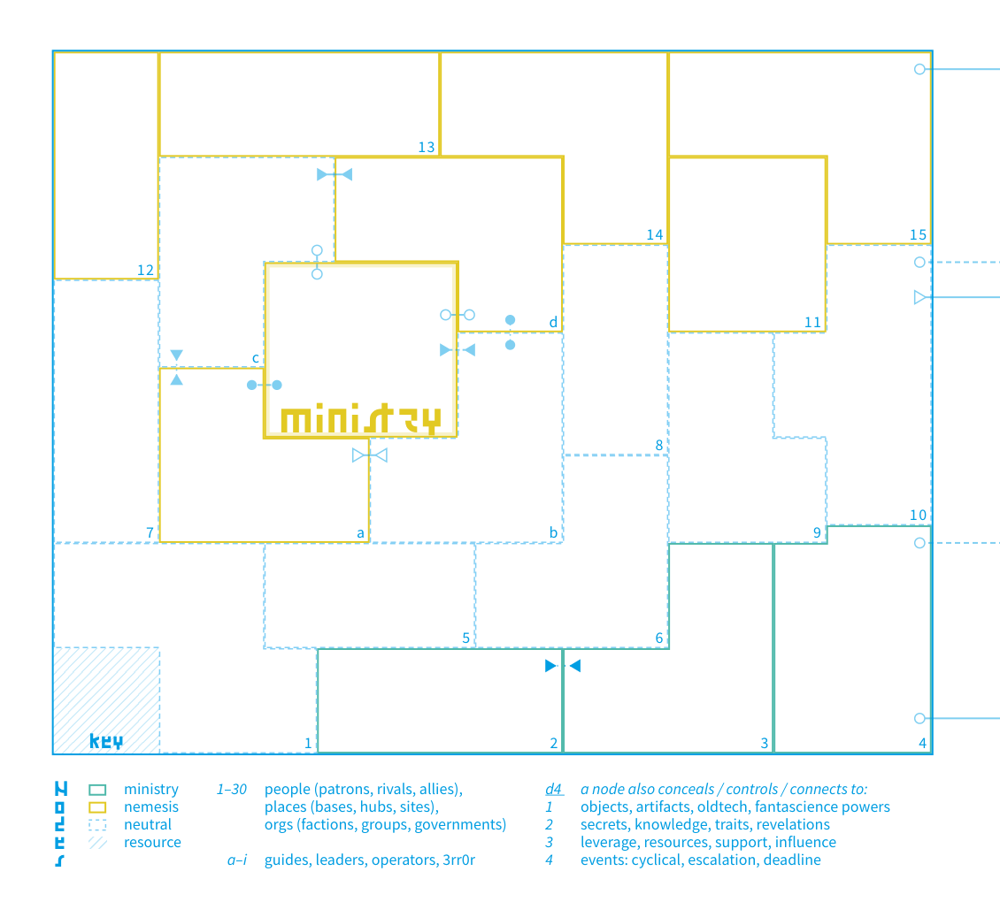

**NEXUS GRID**

The nexus grid is the referee's control panel for the story—the campaign, if you will—and how it weaves and ducks about the two meta-factions, the Ministry and the Nemesis. It contains 38 nodes to place key NPCs, places, and factions; 8 of which are directly connected to the meta-factions of Ministry and Nemesis, their most active (or accessible) agents, promoters, and manipulators.

Each node has at least one thing the PCs may interact with: objects, secrets, leverage, or events. Further, each node also has links of support, cooperation, competition, or conflict to other nodes.

Both links and resources may be public, secret, false, or corrupted by error—somehow gone astray or been perverted, whether by the private greed and malice of the NPCs involved, or by the corroding presence of the accumulated decay of this golden world that will surely last forever.

Between sessions, to simulate the world doing things beyond do—revolving, revolting, and so on—the referee can use the events oracle to see what happens to each active node in the nexus grid. Most times, outcomes will be expected: the more powerful group wins, the charming rogue gets the prize, and so on, but sometimes there will be an upset.

For crucial nodes, the referee can set up a faction alignment wheel to track the influence of the PCs and their nearby nodes. Crucially, the faction alignment wheel simulates how an excess of influence by one meta-faction or another will drive other actors away. One can think of it this way—as the Ministry's influence grows, the increased stability benefits a dwarfer industrialist, but beyond a certain point the Ministry begins to stifle and choke the industrialist's source of power and they shift their allegiance to the other meta-faction.

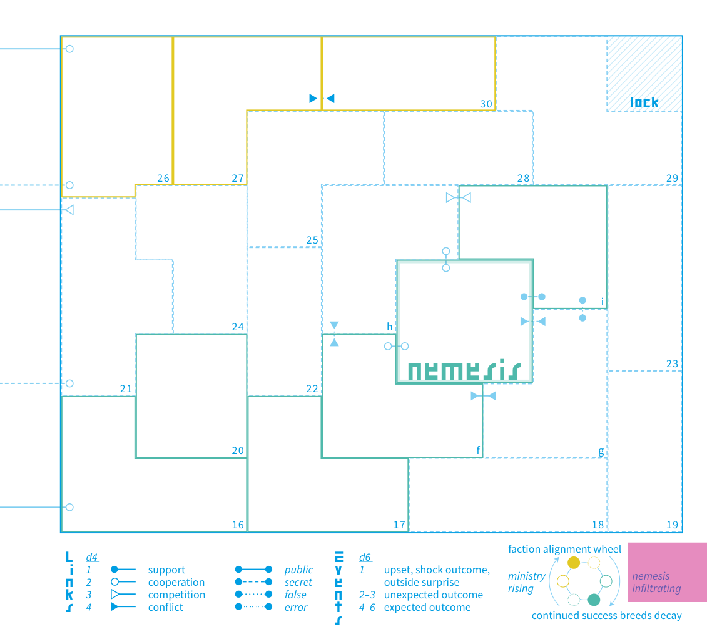

**Faction vs. Meta-Faction**

The Ministry and the Nemesis are meta-factions, one could think of them as loose agglomerations of groups and individuals with goals that _currently_ align, rather than more permanent institutions (though there may well be multiple institutions and NPCs that claim the titles of Ministry or Nemesis!). One way to think of them is as a purple-orange alignment scheme to make sense of the Given World at the Edge of Time. Or, if not sense, then political utility.

**Key and Lock**

The key and lock spaces provide two zones with resources to effect a radical change in the status quo of the setting. The key must be used upon the lock to upend the balance between the meta-factions.

Interestingly, each is fully controlled by their respective neutral nodes (1 and 29). Any faction (or PC) trying to wrest control of the key and lock must therefore upset, defeat, suborn or otherwise dominate a neutral NPC, place, or faction without any desire to be involved in the larger meta-factional fight. A small structural dilemma for PCs that might want to keep their hands clean.

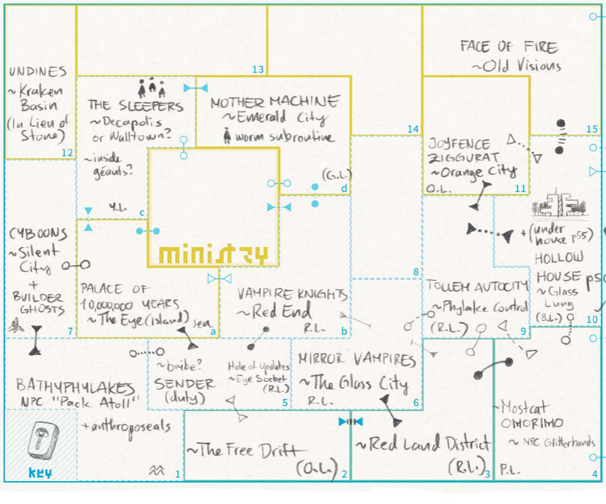

**WIELD THE NEXUS**

_"Here, now, Ma'ab, wield the spider and the web!"_ —Admiral God to Ma'ab of the Cowsherds

The filled nexus grid above is a snapshot of the story control panel. It is filled out in pencil not because the author is lazy but because the nexus grid is always provisional and liable to change between sessions subject to the actions and choices, interests and disinterests of the players.

**The First Few Nodes**

Starting with an empty grid is hard, but we already have two adventure skeletons to work with.

1. Roll 2d12+3 (result 16). Place the PCs starting location, where they received the call.
2. Place their first Destination in an adjacent node. Let's choose 21.
3. Place the Antagonist in another adjacent node. 20 will do nicely, since the Antagonist seems to have some affinity for the Nemesis.
4. Now, let's say the Hollow House is not the same as the PCs' starting location. Let's place it in 10. This way the Antagonist has no nearby base and can't be omnipresent. Maybe they'll be an irregularly recurring character or agent of the Nemesis.
5. Let's say the Sender (still missing) is loosely connected to the Key. 5 is a good node for them. This way, if the PCs pursue that thread, they will get closer to the Key and the bigger arc.

**Seeding Reasons to Travel**

To tempt the PCs to travel around the Circle Sea, we can browse the maps and Land chapters, then:

1. Add a few destinations we like that could have some connections with the existing nodes. For example, the Free Drift and the Palace of 10 Million Years next to the Sender, the Joyfence Ziggurat, Tollem Autocity, the Mostcat Omorimo, and the Face of Fire connected to the Hollow House.
2. Let's do the same with a few factions and NPCs that sound like they could be interesting. Some Vampire Knights, Mirror Vampires (just made those up, something about the Glass City spoke to me), Golem Union, Cogflower Inquisition and Freeblood Vintners.

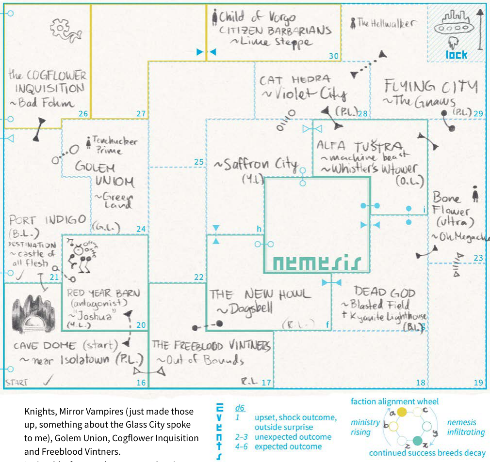

**Seeding Reasons to Travel**

To tempt the PCs to travel around the Circle Sea, we can browse the maps and Land chapters, then:

3. Let's add a few nearby towns and regions to the various nodes, giving them firmer locations in our table's Golden Age.
4. And pepper some locations with extra NPCs, like the Catlord Glitterhands and Tenchucker Prime.
5. Now let's add some relationships between the different nodes. Let's just generate them randomly, we don't know the details yet but that's ok.
6. We repeat the process a few times, filling out more of the grid. We don't have to completely fill out the grid. We can even keep the details of the Ministry and the Nemesis vague. The PCs are still far away. As they hear more details, we can add those notes.

**The Grid During Prep, Play, and After**

During prep, we'll glance over the grid and find some interesting nodes and relationships, particularly ones the players focused on. We'll think about what might happen there between sessions, use oracle dice and make note of what interesting events might have occurred, then link up any interesting locations or modules we have come up with or prepared. Don't overdo it at this stage—keep your preparation rough and malleable.

During play, use a copy of the grid and mark it up as play happens. Make notes of where the PCs go, roughly what they do, who they talk to, what they learn, and how relationships change. The further away a node is from the PCs, the less you need to worry about it.

After play, use your annotated grid to supplement your notes and fix up your reference grid. This is also the time to erase or rewrite nodes that keep getting ignored or were destroyed—some events simply drop off the front page and this is all the grid is. Your world's front page.

**Thus Have Things Been**

_Long Long Ago and Long Ago and Yesterday and Today and All the Tomorrows were, are, and shall be glorious._ —Chronic Locust Creed, 1:3

The Truth of the Long Long Ago is code blue-violet.

Long Long Ago, before history, with the making of the Given World, all Prehistory became null and void.

Later, but still Long Long Ago, with the building of Heaven, all events of the Maker Era became dangerous for humans to entertain.

Later, but still Long Long Ago, with the creation of the Garden, the Builder Era became an unnecessary burden for the humans blessed to live in the Garden.

The Truth of the Long Ago is violet coded.

Long Ago, with the creation of the Garden, History ended and it became pointless for humans to worry themselves with remembering what came before. Nothing ever changes for everything is always perfect.

Later, but still Long Ago, though there was no History and Nothing Happened, Error and Corruption still wormed into the Garden, and to guard against these each independent incorporated settlement (town, village, or wijk) of the Garden was licensed to appoint one or two madrites, who preserved a Parochial Chronicle of local events to provide a human accounting when required by a Phylake or other agent. These chronicles were preserved on Iste Locus® brand perpetual crystal memoria with permanent one-way noösphere punches. The madrites rested easy in the knowledge that their memories were always accessible to the benevolent Lords of the Dream Canopy.

Later, but still Long Ago, though this did not Happen, but it must simply have been the Plan of the Garden Path, the Canopy tattered and the noösphere tangled and stars faded and fell, and the memoria were eroded by the Entropy that feeds where humans watch.

Not Long Ago At All, but still Long Ago, the Ministry stepped in to aid the Absent Lords and tend the Garden Path, to maintain the Living Fabricators, to upkeep the Waiting Facilities and prune the overgrowth of Error.

Now many Humans have grown Lax, disbelieving the Garden Path, claiming their chocolate rations have not increased every year for a thousand years, and Error and Corruption grow again, and Humanity is threatened once more with the Maker's Jubilee.

**MINISTRY**

_O, house of ten million years, we, your caretakers, thank you!_ —Electric Priest Catechism, 4:17

The ministry ministers and administers. The ministry is everywhere and nowhere. The ministry marches outside of time and space. The ministry stands within every human mind and body. The ministry rises, dies, and is renewed. The ministry recycles the human to perpetuate the humanity. The ministry is and is not.

1. The ministry taught the rats in the walls to steer the Ship of the World from the rocks of Termination.
2. It learned the Lords' and Unlords' secret loves to lull them to sleep and preserve humanity.
3. It suppressed the gnawers and destroyers at the roots of civilization, the up-turners of survival.
4. It imposed order upon the Ruin of Time.
5. It brought growth in the Era of the Green Sun.
6. It encouraged wisdom among the powerful and hungry to keep the Phylakes placated.
7. It patched the Walls of Reality to preserve the minds of humanity from the Corrupting Void.
8. It sealed the souls of humanity to preserve the cycle of birth and rebirth within the Given World.
9. It shielded the living and unliving from the fast and the slow stars where the Eater of Existence dwells.
10. It blocked the Doors of Temptation where the Hitchhiker waits to ride innocents into the night.

The ministry knows the wolves who lurk without and within, the Eaters in the Dark, the Little Gods who hold the Canopy, the weak defenses of the World. It will preserve all, careless and foolish, too, those who wish it and those who don't, for that is its duty.

**NEMESIS**

_The Garden Path, the prison of the mind, the lie-prism of the soul, the sixfold death of the over-man._ —Nobody, _Nobody's Voyages_, 20:37

Human. Are we not human? Are we not more than vole or ox, rail or thorn-dragon, spindle or automaton? If we have soul and mind and body, do we not also deserve purpose and power and freedom? Should we not soar as ambition and ability allow?

1. The nemesis died and was remade to remind us that the world has also died and was remade.
2. It sings in the human heart, yearning for the new.
3. It tamed the Error Dragon and created new fields and heights and heavens for us all.
4. It rose from the depths and ascended to the slow stars and revived our hunger for new skies.
5. It reminded us that we are not cogs in the bio machine, that we are not wheels others spin.
6. It filled the hollow in us, where purpose dwelled.
7. It flung open the vaults and awakened the ancestors and chased away the Fog of Forgetting.
8. It burned out the Futility and flushed out the Soma and made eyes to stare upon the True Sun.
9. It opened the channels of the Cosmic Qanat and let souls flow once more, as at the White Fountain.
10. It gave new life to the dead, new futures to the still, new hope to the huddled shackle-glyphed.

The nemesis knows the snakes who lurk without and within, the Keepers in the Light, the Great Daemons who bind the Dream, the wall against ambition. It will set free all, cowards and blind prisoners, too, those who see their chains and those who don't, for that is its will.

**How The Truth Was Stolen**

_Long Long Ago, the Vile Ones stole Humanity's future, Long Ago their fall condemned us to their Cage, Now the Cage rots and we must Choose: Hell or Freedom._ —Anonymous, _Against the Ranting Machine_, 19:14

The Truth of the Long Long Ago is lost, but we can think it into being, reconstruct it from bone and dust and ghosts.

Long Long Ago, before the Cosmos, must have been another Cosmos, whence the Vile Ones came-went.

Later, but still Long Long Ago, after crafting the Cage, the Vile-Ones brought-made Humanity to serve them.

Later, but still Long Long Ago, they seeded-grew the Garden, to delude Humanity into walking down the Garden Path to the Slaughterhouse of Souls.

Long Ago, the Vile Ones blinded themselves with their own works, retreated into solipsistic pleasures, surrounded themselves with mad treasures, and left behind the Shells of themselves to reign as Ghost Lords.

Later, but still Long Ago, one after another, the Systems failed and the Connexions frayed, and the Shells and Ghosts, like Idiot Gods, threw themselves mindlessly into preserving the will of the Vile Ones, with neither Vision nor Hope nor Mercy. They set up the Demon-Angels to protect their Garden of Decay and threw false histories and fantasy purposes to keep Humanity asleep.

Later, but still Long Ago, the Idiot Gods succumbed to Entropy and grew silent, but Humans arose who feared freedom and enjoyed ease and set up Idols of the Idiot Gods to worship and built elaborate machines to preserve the Dead Order.

Not Long Ago At All, barely in the Last Century, the Maintainers have become careless, the Priests have confused their code-mantras, the Agents have let crumble their Weapons of Stasis.

Now many Humans have been jolted awake by the collapse of their world, by the nutrislurry taps running dry, by the amuse-vidy deliveries slowing, by the friendvisit golems collapsing to decay and spew bugs by the roadside, while their Passengers are left to trudge upon soft soles, unused to the hard world.

Tomorrow, the Nemesis will give the signal, Humanity will rise, shake its scrawny fists at this Cage the Vile Ones dared call Heaven, see the Fading of the Light and kindle a new Sun, a renewed Cosmos, a Living Time.

**TIME**

_"It is a square circle you seek, a tail to suckle like you were an Owly Boar. But it is not there for you to see. You are mortal, human, frangible. Time is the wheel of pain, the spaghettification of all meaning into the ... ah, what do I speak. Do your people even know spaghetti? The great thread-noodle of the Good Times? Of course not. What is your staple? Ground meal? Scavenged cans of special sludge? Goodness. Right. Ok. Big magic machine go whirly whirly, make your mind leak from your ears. Danger!"_ —Words of the Needle Angel, Ladder Expedition of 55.

_"The expedition scribe may have missed the obscure reference to the Toroidal One, the Builder Uroboros, and transcribed its name as Owly Boar. This lack of a classical education may have doomed the Ladder Expedition of 55."_ —Notes on the Doombringers, Crypt Academy Codex 3:14

There are two kinds of time.

There is divine time. The time of the Maker. It is an expanse, a field through which the Maker and its Builders wander, like elephants across a savanna, like void whales through the celestial sea.

There is mortal time. The time of the human. It is a river. It threads through the grassland Cosmos and the human's consciousness sails along it like a child's paper boat cast adrift on the Pale Canal.

**Ministry Time**

Many worship the Ministry without knowing it—the preservers and archivists who would perpetuate Humanity and knowledge through the grinding twilight of the Cosmos—their tools of worship are inscribed tablets in dust-soil tombs, crystal-stilled minds in mineral baths, mindless maintainer rituals to avoid Entropy.

1. The common view is false. There is only one time and the gods are trapped within it just like mortals.
2. Time is a closed box, impenetrable to all.
3. Time only passes when it is observed. This is why so many artifacts of the Long Long Ago remain, for none watch them now.
4. Time passes faster when observed. Thus, one who makes their mind as a stone can sail through time untouched by entropy.
5. The Maker created infinite time, but Sister Clock measures it out for mortals in digestible chunks.
6. It is not time that is relative, but Entropy. A tree does not fall in the woods if there is no-one to see it.
7. The High Pet could see everything, causing time to flow evenly, but like a cat, the High Pet is lazy and fickle. Only interesting things attract the High Pet's attention, so time barely passes where there are no people or mice to excite it.
8. Limited time is a gift to mortals. They need not choose to forget what they loved. They can live lives entire, suffused with passion and joy.

**Cognentropic Loading Coefficient**

The popular view that observation affects the speed with which time passes is incorrect. What actually happens is that the cosmos is designed to perpetuate itself indefinitely and thus reduces (or even halts) the arrow of time we call entropy in the absence of conscious observers. Chronomancers have calculated that in a completely sealed and dead environment, without even the least flicker of bacterial consciousness, the disorder of that system may cease entirely.

| Cognentropic Load | Entropic Level |
| --- | --- |
| Nil (no sentient observers) | No decay or loss of energy. Old things perfectly preserved. |
| Minimal (bacteria) | 10–100 times less entropy than normal. Why necromancers like to store the bodies of crucial conversation partners in lead-lined sarcophagi with a little bit of radiant metal. |
| Low (plants) | 2–5 times less entropy than normal. Great for preserving meats, cheeses, and dead friends. |
| Normal (animals, humans) | The arrow of time flies, bread dries out, maggots appear spontaneously in fruit and fowl. |
| High (angels, dense cities) | 2–5 times normal entropy. Decay accelerates. Damage over time effects are doubled, charges run out faster. May be why small, traveling human societies seem to decline more slowly. |
| Extreme (gods, metropolis) | 10+ times normal entropy. Damage over time effects quadruple, all charged items become single-use, regular items break after a few uses, lives may grow suspiciously short. |

**Entropy-Resistant Objects**

Some oldtech items and materials are more resistant to entropy, while all buildertech equipment is almost completely resistant. This has led some banned and burned scholars to suggest that buildertech is somehow extra-cosmic in origin. This is obviously not true as the Garden Path proves by its assertion that there is no alternative to this cosmos.

**Human Time: Cycle of Years and Months**

The strange half-humans, pasty, sun-fearing, huddled in their caverns with old memory bones and incised stones, voiceless, mindless, worshipping a past Long Long Ago, chanting Rituals of Upkeep, what know they of Life? Yes, the metal mountains turn to rust, yes, the géants slumber into soil, but humanity is in the songs and the flowers, dawns and dusks, shooting and still stars, the cycle of years and births and deaths.

| No. | Five Energies | Bloom | Return Cyclic Animal | Decadal Celebration |
| --- | --- | --- | --- | --- |
| 1 | Green (rising) | Camelia I | Ship Rat | Escape from the Rotting Ship into the Light of Reason |
| 2 | Wind (rising) | Hyacinth II | Field Mouse | Commemoration of the Sucking of the Air |
| 3 | Void (rising) | Jacaranda III | Air Whale | Exposure of the First Ancestor's Effigy |
| 4 | Soil (rising) | Tulip VI | Sky Goat | Nurturing of the Living God by Fire and Noise |
| 5 | Sun (rising) | Lily VII | Hollow Skink | Dance of the First and the Last in the Chaos Saturnine |
| 6 | Stasis | Lotus IX | Gentle Steed | Perpetuation of the Immortal Flame and Adamant |
| 7 | Flux | Plumeria XII | One Horn | Firing of the Guns Against the Error Dragon |
| 8 | Sun (setting) | Dandelion XIII | Wise Monkey | Nights of Bonfires and the Luminous Chants |
| 9 | Soil (setting) | Sunflower XIV | Glass Cat | Meditations on the Bunker Revelations |
| 10 | Void (setting) | Rose XVIII | Silver Hound | Silent Days of the Builders' Stitched Lips |
| 11 | Wind (setting) | Edelweiss XIX | Babble Fish | The Hunting of the Absent Whale and Painting of the Shrew |
| 12 | Green (setting) | Marigold XX | Ancestor Snail | Singing and Hatching of the New Generation |

Each year is also subdivided into traditional cycles of moons and colors and half-memories.

| Mn. | High and Vulgar Name | Season | Local Error | Regular Festival |
| --- | --- | --- | --- | --- |
| 1 | Newfirst [Nouën] | flowerbirth | blood curdling | Mortification of the Impure Flesh / Fursuit Wearing Week |
| 2 | Lastmonth [Termilune] | birdcoming | air venting | Auspicy of the Roses / Animal Catapult Parade |
| 3 | Firstmonth [Preilune] | moonfalling | bird wearing | Burial of Unjustified Dreams / Celebration of the Thorn |
| 4 | Greenmonth [Vertilune] | treewhisper | effigy jousting | Exhumation of the Honored Ones / Corpsefire Night |
| 5 | Redmonth [Roselune] | beastrut | viviphagy | Bleeding of the Administrators / Drinkvision Day |
| 6 | Orangemonth [Oralune] | lowfruiting | tree knitting | Fertilization of the Trees / Ashnoon Smoking |
| 7 | Yellowmonth [Jallune] | highfruiting | stone scouring | Annunciation of the New Vidy / Purification of the Minds |
| 8 | Oldsecond [Vieüdoun] | nutriflourish | word burning | Nutrislurry Cake Day / Nutberry Mouse Eating Night |
| 9 | Unity [Toten] | harvesting | false skinning | Cursing of the Form Breakers / Celebration of the Heroes |
| 10 | Violetmonth [Violune] | packaging | house painting | Painting of the Doors With Mud / Opening of the Old Ways |
| 11 | Snowbringer [Neijapore] | mainrepair | public reading | Running of the Naked Ones / Whipping of the Fools |
| 12 | Deadwinter [Morivere] | coldwaiting | cave bathing | Somatic Release Week / Dance of the Mad Hitchhiker |

**Nemesis Time**

Of those who have left the embrace of civilization, who have stepped off the Garden Path, who have sucked the thin air of the ruderal lands, who have been burned by the Hollow Sun of the forsaken reaches; of those, some have turned back and looked upon the Circle Sea and seen terrible truths and portents.

1. Time is winding down. Something is ending.
2. The great changes humanity claims to see and experience are the thrashings of a dying body.
3. Preservation and conservation will but prolong the agony, weaken humanity further.
4. Rage, rage against the dying of ambition and hope and pride, against surrender to the grinding mean.
5. The lights are on, but nobody is home. The gods are not listening, the daemons have gone numb, the rituals no longer bring the cargo humans need.
6. The doors of the vaults and the shrines are rotten, it is time to kick them down before something worse kicks them in from the other side.
7. All these towns, all these settlements, all these old traditions and privileges and ways the Ministry protects, they are a dead hand holding a brake against the possibilities of the human will.
8. Humanity is at a crisis; again the old is dying and the new cannot be born; again an interregnum is at hand and the morbid hand of history falls on us.

Look inside the decayed Human and quail—a Monster.

**COSMOS**

_The gods’ machine, the MKR, addresses the gods, “Here are the lands given to you, Builders. Here is your Given World.”_

_The gods descend upon chariots of fire and address the humans, “Flicker your eyes, inside and out. In is the Noösphere, the psychic cosmos, out is the Hylosphere, the material cosmos.”_

_“Rotate your mind through infinity to encompass the Dream Canopy’s Gift. All these jewel lands glittering in the psychematerial infinity of cosmos, grasp them and awe. What splendors the many-patterned Lords have given you as gift for your service.”_

_“Here is the world and here is the sky, between a spiderweb of existence, in that spiderweb, the mortal entity, corpus et idego, you, oh, lucky you. Translate your mind back through your skullport into yourself, preserve your sanity and treasure the warm totality you have experienced.”_

_The humans spread across their Given World and forget._ —Garden Heresy, Traditional

The cosmos unironically exists.

True, some heresiarchs once argued that a Deus Deceptor stands outside the cosmos, simulating it to imprison humanity. Indeed, they even gained adherents and a modicum of power, but their catastrophic implosion and the disappearance of their followers in the White Vortex of [Redacted] conclusively proved them liars.

In this one cosmos there are two worlds overlaid and interplayed: one of coarse matter and the other of pneumatic mind. Once, any human could travel between them with nary a thought. Now, such travel is hard and rare enough to be acclaimed magic by fools.

**As Ministry Teaches**

1. The cosmos is eternal, yet it was made.
2. The cosmos is infinite, yet encompassed. With a sky chariot, the gods journey from the debris of creation to the omphalos that is the needle in three months.
3. There are many like it, but this cosmos is ours.
4. To journey outside the cosmos is to be lost.
5. The cosmos is mindless, it is pure existence.
6. It cares about us, nurtures us, exists for us.
7. Long Long Ago we were the Chosen and deserved this cosmos.
8. The cosmos is a spherical cube translated through itself into the trifold dilemma of hyle and pneuma. Humans, collectively, are its psyche.
9. All life is the mind of cosmos.
10. This cosmos is heaven.

**But Nemesis Wails and Whispers**

1. The cosmos is false, a bubble, a canker, a dead end on this skin of the true cosmos.
2. The cosmos wraps in on itself, cooking us within.
3. The cosmos is dying, the daemon Entropy eating it from within, the mindstealer from without.
4. There are ways out, tunnels to be reopened.
5. Once we break free of this prison cosmos we will be as angels, as beings of light, endless and great.
6. There is a slow, malevolent, daemonic intelligence in the weave of the cosmos, a stupid machine algorithmic persistence that stamps on our dignity.
7. Long Long Ago the Chosen Wardens faded and we kept running our wheels, hamsters against the night.
8. Humans are fodder for the absent gods, toys in their evil schemes, let us flee while they gaze away.
9. Death is all that awaits, the burning away of spirit.
10. This is no cosmos, this is a purgatory.

**MAKER**

_As above, so below. As before, so tomorrow. The cosmic mind, the absent creator, the prime mover._

_Majesty be unto their existence. MBUTE._ —Ministry Repetitional

Or perhaps, majesty begins under their eminence. MBUTE. Or perhaps, maker be up there eating. MBUTE.

1. There is no maker. The cosmos has always been. Always will. The technosophists are not alone in this.
2. Nonsense. Of course there is. And they are present, here, now, active. So say the sisters of the seed.
3. It is obvious from our existence: there is a maker, but they are absent. That is why we have our hierarchs.
4. The Maker is the cosmos, we are all the Maker.
5. Pansophic heresy! The cosmos is blind, we are the Maker's eyes.
6. The maker is, was, always will be. All we see is the work of its emanations, the builders.
7. Shush, don't talk of the Maker or the shadows will eat you up. M.B.U.T.E.
8. The Maker cooked our cosmos as a dish, now the Precursor waits for us to cool that they may feast.

**A Safe Disagreement**

While both scholars and the sewer-dwellers may argue about the nature of the Maker, one thing is commonly understood: the Maker does not care what they think or say about her or him or it.

Perhaps this is why the maker is a popular object of faith.

**SINE DEIS, ABSENTE NUMINE**

_Twinkle, twinkle gentle Lords, so high above, so near at heart. We dare not wonder what you are, for yours is Heaven and ours to enjoy. We avert our eyes, gentle Lords, lest we offend and lose today our daily bread. Guide our souls lest we sin, temper our thoughts lest we question, save us all forever within the comfort and leisure of your Dream Canopy._ —prehistoric prayer, ethno-vidy crystal, unearthed at the Machine Museum

There are two sentient types in the Given World. First, the humans in their pananthropic excess of forms. Mortal, finite, possessed of soul and body and personality. Then there are the gods. The viles. The lords. The builders. The unlords. Those immortal sentiences, infinite, entwined with the stuff of the cosmos, of it and bound by it.

Throughout history and, if the anthropologist priests are to be believed, prehistory, fallen humans, forgetting their abilities and achievements, have been drawn to worship the gods, to seek guidance and support from them.

But the gods were never on humanity's side.

They exist in their own strange world, where memory and premonition collide, combine, and collapse into an alien eternity unmoored from human passions and privations.

They are the volcano and the second sun, the living fast star and the slumbering city, the invisible hand of the market and the rancid process of decay.

Their power over the cosmos is great—indeed, they make and remake the cosmos by their existence according to some traditions— but they do not fundamentally care about humans. This must be repeated: the natural state of the gods is absence.

A child possessed by a daemon, a pet stolen by a razor storm, a village consumed by the Eating Dark. These, by themselves, arouse neither interest nor pity in the gods.

**Sacrifice**

Prayer hopes to make the dread angel pass unseeing; sacrifice seeks to attract divine attention, to moan for aid, to grovel for blessing.

1. **Whisper.** The barest promise. A future token at a temple; €1 to add 1 to a roll. Roll 1d6: (1–3) alas, no blessing, (4–5) promise one more, (6) you are heard!
2. **Nudge.** So little between failure and success. A drop of blood, 1 life, to add 1 to a roll. Roll 1d6: (1) alas, no blessing, (2–3) pay 1 more, (4–6) you are heard!
3. **Oath.** Certainty through submission. Add 1 to a roll, resolve the roll, then lose 1d4 life.
4. **Burn.** A gift sent willing and happy, through an altar, its sweet aroma a perfume to the god. €10 gives 1d6 to a chosen roll, €100 gives 1d8, €1,000 gives 1d10.
5. **Penance.** A week of life, a session's absence, a prized item surrendered. A weighty burden is removed.
6. **The Greatest Sacrifice.** A terrible offering, a permanent loss. The future softens and is made malleable, where things were hopeless, a chance appears for heroes to seize. Even a million-in-one chance might now be as 1-in-6.

"See!" cries the Preacher of Opposition, "Thus is the Lie of the Dream Lords proved, bully-beasts who torment Humanity unless appeased!"

**Gods, Builders, Lords, Vile Ones**

The many peoples and factions and schools of the civilized lands disagree about so many things, it would be odd if they agreed about the identity of those powerful, transcendent beings who dominate the improbable magimachinery of their world.

One thing is certain, if the Phylakes' calming influence were withdrawn, holy wars could swiftly tear apart great lands and small clans alike.

**HOLY APPARITION**

_Once, the divine interface protocol was active. No human could doubt when a god spoke to them. Now, the signals are confused, the dragon Corruption and the hydra Lie interpose themselves._ —Gdesoto, _Why We Need Electric Priests_, ed. 4, 3:1

Thus did the gods once announce themselves:

1. **Perfect Note.** A grand hum, resounding on every channel, vibrating every surface, generating awe in every human mind.
2. **Vivachrome.** All colors grew brighter, all contrasts sharper, every breath sparkled with life in the manifestation field.
3. **Extrachronicity.** The human experienced time outside of time as the god spoke to them. To the ignorant, a breath passed, to the recipient of revelation, a dozen minutes.
4. **Spontaneous Repair.** The sick were healed, the lame walked, the crooked were straightened, where a god manifested.
5. **Neural Handshake.** The god's voice turned a key in the human's jewel-mind, proving they were no mere daemon.
6. **Blessing.** All, even the wicked, had their life force strengthened after encountering the divine. In game terms: permanently gained 1 life.

Now, of course, none should expect a signal from a god so clear.

**Godsign**

In these later times, wise humans still attend to godsign. Not much in hope of favor, but to avoid the danger of an oblivious god about its ineffable business.

**Common Signs of Presence**

1. A feeling of unnatural, unbearable lightness of being. A god's passage may affect gravity.
2. Shadows and lights in the eyes. A god's presence may have left a delusion field. Long exposure causes permanent hallucinations.
3. Dancing lights in the sky. Divine vehicles cause six out of every ten unexplained aerial phenomena.
4. A preternatural chill. Gods oft drain ambient energy to power their buildertech.
5. Lost time. Gods may erase experiences from human minds.
6. Unexplained euphoria, elation, a sense of purpose.

The gods' innate charisma gives mortals a powerful sense of cosmic meaning.

**Uncommon Signs of Presence**

1. Dreams with a message. Often a false sign.
2. Ghostly marks or pictures on water, sky, or fire.
3. Ancient devices come to life with strange directives.
4. Broken oldtech equipment spontaneously self-repairs.
5. Dead creature revives with a mission.
6. Possession leaves the target reinvigorated, rather than exhausted as after a daemonic ride.

**Rare Signs of Presence**

1. A face or figure of colorless fire that does not consume what it burns.
2. A beast awakens to full sentience, with a message or other great instruction.
3. A blinding light out of time, a sudden revelation that instantly sears new skills into one's brain.
4. A fire in the sky lands upon the earth to reveal a messenger from the void.
5. A child born of no parents or half parents, possessed of traits and knowledge beyond their years.
6. A monolith or big divine object manifests and proclaims the will of a god in terrible tones.

**A God in Flesh**

Though legendary, it is not unheard of to come across an **ensarc**, an embodied avatar of a god, walking the sands of these later times.

**Number:** One. Very rarely two. Almost never three. **Level:** 1d20 / Life: 11 per level

**Appearance:** Awesome, terrifying, humbling, numinous. **Voice:** Accompanied by strange music. **Wants:** Its grand design is ineffable, but right now it asks only (roll d6): (1) a place to rest, (2) something to eat, (3) news of whence you came, (4) how you're doing, feeling, (5) to chat about the weather and take your measure, (6) a moment of leisure.

**Ethics:** Beyond good and evil. **Intelligence:** Surprisingly earthy and ordinary.

**Defense:** 19 (as improbability field).

**Move:** Very ordinary. Godsign might give them away. **Morale:** 7 (not looking for a fight) **Attack:** A bonus of level + 9, damage by weapon +2 / lvl.

**Special:** Their blood is golden ichor that regenerates severed limbs. An ensarc regenerates life equal to its level each round.

**Treasure (roll d6):** (1–3) a fine blessing, (4–5) an item becomes a holy relic in their hands, (6) an actual terrifying bit of buildertech kit (worth €50k).

**How Does It Embody?**

1. Clump of floating flesh and eyes and auras.
2. Luminous air jelly aglow with cryptic builder glyphs.
3. Human child with a single distinctive animal feature.
4. Chiseled human with the head of a noble beast.
5. Glorious beast, greater and more perfect than usual.
6. Giant human with golden skin and radium eyes.
7. Hologram made solid, flitting through mere matter.
8. Elemental assemblage, essence made manifest.
9. Heart-aching beauty in a grimy dead screen.
10. Gargantuan kaiju, an avatar of the biosphere.
11. Shadows and lights, spidering between realities.
12. An absence in space and time, full of stars.

**What Holy Relic**

1. A claw to bend time into a circle.
2. A globe to turn the weather on a whim.
3. A skull to sing sweet dreams and ancient skills.
4. A glittering face to wear for any occasion.
5. A sword to sever souls from bodies and minds.
6. A gun to make holes in Sky and Soil.
7. A flower to raise the dead and lower the living.
8. A wheel to spin fates from one to another.
9. A zither to bring far places close and the close far.
10. A suit to walk the void and abyss, sun and moon.
11. A belt to fly in both coarse and spirit worlds.
12. A towel-scarf to avert gaze and hate, fear and anger.

**This Buildertech**

_"It belongs in a memorium!"_ —last strangled cry of the Holy Archaeologue

Magics of the Maker (MBUTE) used by the Builders in the Long Long Ago, now sought by fools, dilettantes, and troublemakers. Its power corrupts all who touch it.

The School of Clerk teaches that buildertech is the prime exemplar of ancient magic so advanced and finely controlled that to the Builders it was indistinguishable from technology. Examples include:

1. The Tri-Key of Elevation activates the skyjumper in the Ladder of Heaven.
2. The Permelectric Lemma awakens sleeping géants.
3. The Last Starcaller summons fast stars to land upon the Given World.
4. The Blood of All Flesh translates a mind from body to body, unlocking the Liquid Form.
5. The Cradle of Crystal Minds creates synthetic lives for the jewel-bound and the recorded dead.
6. The Antentropic Rod fishes unbroken ideal forms from the Lost Ago to rebuild ruined machines.
7. The Chronobinding Amulet locks force fields into place against the ravages of time.
8. The Master Angle resets the perspectives of phylakes, angel and daemon both.
9. The Vibrant Shovel moves hills and holes.
10. The Uplifting Tower draws life from inanimate matter, spreads forests where there were wastes.
11. The Shield of Air knits bubble-domes of lung-stuff.
12. The Surfboard of Descent allows a Builder to storm the Soil from a Fast or Slow star, like a blazing bolide across the darkling sky.

"Resets perspectives? Does this mean it rebinds the phylakes? Wipe their instructions? Put them to sleep? Is this what the All-Breaker mentioned?" cried Aur-Vec.

**DAEMONS**

_"Only a simpleton would think daemons are good or evil. They are orthogonal to our mortal moralities."_ —Pseudoakaula, _Why I Hunt Daemons_, Colché acrylics

Popular misapprehension holds daemons to be spirits summoned forth by oldtech to serve or disrupt a human's best-laid plans. Scholarly suspicion frames them as sentient energy **creature of the noösphere**. Coherent, sentient kaba-elementals in some tellings.

One thing is clear—if daemons do actually have minds, these are not minds as usually understood by humans.

**This Daemon's Natural Habitat**

Most humans will meet many daemons in their lives.

Small, wretched things, eking out a meager existence in some failing piece of taboo technology or obsequiously slaving to make incomprehensible numbers go up. They may embody in:

1. Flies, ants, animalcules, other little watching things.
2. Corrupted mechanisms, feral algorithms, procedural collapse engines, and other little monsters.
3. Petty needs and hungers, gauges, tanks, pumps, sumps, and other measuring things.
4. Trees, brooks, stones, smart and foolish elements of the grown environment.
5. Lights, doors, ducts, pumps, and other objects once woven together into the so-called thinking city.
6. Fundamental desires, procedural dramas, self generating entertainments, vidy substitutionals.
7. Hunters, guardians, wardens, biomechanical hounds and feathered vessels of the Path.
8. Books, libraries, glyphs, old knowledge given a veneer of self-awareness to help and confuse.
9. Fabricators, facilities, generators, geomachines and biotools left over by the Builders.
10. Life, death, rebirth, learning, stagnation, decay, gravity, radiation and other core reality subroutines.

**Daemonic Attitudes and Quirks**

**The Unlords to Be Avoided**

The Ministry calls them the Falsest of Daemons, heretics claim they prove the Error of the Lords of the Dream. Five they are to terrify the Righteous and tempt the Wicked.

Few humans will ever interface with these daemons directly, not least because their languages have drifted so far from the original MKR Source.

1. **Chem Caoutchouc, Vulkana.** The mountain but also the slow-thinking algorism that turns the raw into the cooked, that refines, fuels, fires, and destroys with its endless entropism.
2. **Ill Nano, the Chaos Dwarf.** The self-seeding Wilderness that sprouts self-eating machines. The perverter of orders, the gremlin in the Garden, the error at the source. But also, the inventor of ships, the lord of the forge, the master of questions.
3. **Machine Beast, Alfatuštra.** The generator and regenerator of the Random Number of the Beast, the Seed from which the many-pronged multiplicity exists, the cause of specifics. But also, the amoeba of mathematics, the maker of possibilities.
4. **Mohlack, the Invisible Hand.** The growthmaker, promoter of plurality and possibility, bringer of pleasures and rewards and treasures. The good of greed but also, the cancer in the heart of the fruit of knowledge, the seducer of fools.
5. **Sabo Reçu, the Hitchhiker.** The extra-cosmic wanderer. They that should not have come. The hair in the egg. The feral spoiler, the pervert at the edge of time. But also, the hound of laughter, the spur of life, the appeal to motion.

Any of these unleashed might provide the fuel for the Nemesis' fire of renewal, all would provoke the outrage of stern and cautious supporters of the Ministry.

♟ _Ardú Crwl._ Hereditary President of the Decapolitan Feral Companies has an idea how to bring an Unlord back and, better yet, bind them to Human will and providence. It should work. It should be profitable.

| d8 | Interface | Attitude | Ability | Quirk | Libations & Requests |
| --- | --- | --- | --- | --- | --- |
| 1 | unnatural glow | treacherous | incompetent | fears strong smells | urine, feces, waste |
| 2 | chittering voices | possessive | distracted | loves bright flowers | cheese, yogurt, kefir, butter, dairy |
| 3 | arctic chill | puppet-masterly | stupid | hates dull stones | raw blood, bone, flesh, sinew, skin |
| 4 | translucent fade | convincing | quickened | despairs at swift water | cooked meat, tuber, egg, fruit |
| 5 | strange odors | obsequious | unusual | entranced by beauty | purified water, alcohol, oil |
| 6 | local anti-gravity | willing | odd | repulsed by lies | tobacco, toadstool, tablet |
| 7 | protective nimbus | agreeable | terrifying | obsessed by puzzles | honey, wax, nectar, manna |
| 8 | golden warmth | demanding | historic | mocks mortals | painting, poem, song, voice |

**SUFFICIENTLY ADVANCED MAGIC**

_"It is indistinguishable from technology!"_ —master summoner Patnas' last words.

Long Long Ago the sciences and technologies of the Lords and the Builders and the Vile Ones and all the other Human Superiors far exceeded the limitations of the human skull-brain-jewel system's capacities and ... no, we will not talk of it, we will not talk of the Eater in Darkness, we will not talk of the Eyes in the Wall. This Cosmos is safe now and forever more. A Garden at the end of time and space for Humanity.

As long as limits are observed. Holy, sacred limits, lest we awaken the Purifiers into action, or worse—overcome the Purifiers and draw the attention of the Eater and the Eyes and the Others Without Names.

So teaches the Ministry, keeper of the doctrine of the Garden Path and the eternal preservation of Humanity.

**Control of Matter and Mind**

Progress requires sacrifice. Anyone who studies the corrupted, torched, mutated, tessellated, mauled, transmuted, mangled, and often abruptly truncated remains of the wizards who have brought our civilization to where it stands now will understand this. It seems the gods do not want humans to have power.

They may have destroyed the voidferry Prometei, they may have instituted the abominable Jubilee that corrodes human archives. Yet, the minds of mortals escape into memory palaces, crawl into noöspheric nooks, and hide beneath the avatars' notice to assemble, build, create and try, try, try. Ever and again.

Sufficient knowledge promises control over the worlds of matter and mind. Thought may overcome brute physics. This basic cosmic fact drives a steady stream of magioptimists into the temptacles of Nemesis.

**Matter and Mind As Translations of Cosmic Logic**

It is a traditional belief that with the correct formulas a wise human can permanently change the world. This is mostly correct.

A human does not need to be wise to use the correct formulas. However, wisdom does help with longevity. As the codifiers say, m.a.g.i. stands for "master accepts great imperium," and imperium means both power and responsibility.

Formulas can change the world because mind and matter (both the brute hylic matter of the visible world and the numinous pneumatic matter of the spirit world) are both expressions or translations of the same cosmic logic immanent in every part of the cosmos, from the merest mustard seed to the greatest dark star in the void.

Even a mindless automaton, executing the proper formulas, could change the world.

This is obviously dangerous and why the control, checking, and cleaning of the correct formulas is a major duty of every witting and unwitting Ministry agent.

♟ _Da Druyi._ Wouldn't it be terrible if a double-agent, a scion of the Error Dragon, had ascended the pinnacle of the Ministry and came to control the disposal and destruction of valuable knowledge? Why, just imagine the profits such a person could reap, the benefits that might accrue. Fortunately Da Druyi is definitely not such a double-agent.

**The Eightfold Permutation of Knowledge**

Tinkerers and translators, archaeologues and daemon swindlers have prised eight promising lost knowledges to pursue at acceptably low risk to the ongoing pursuit of control of matter and mind. The quarterly profits will be enormous!

| d8 | Permutation | Subject | What Will Go Wrong |
| --- | --- | --- | --- |
| 1 | The Rainbow Wall | hard light manipulation | The Original Light will pierce the Veil and burn Humanity. |
| 2 | Biodroid Crucible | synthetic life recreation | The Machine Beast will don fresh skins and ride the World. |
| 3 | The Existential Void | transcosmic travel | The Willing Void will open the Door of Worms and find us. |
| 4 | The Blood Muse | biomantic perfection | The Evergrowing Cancer Thing will unite the World in Flesh. |
| 5 | Total Hominisation | noöspheric panpsychia | The Error Dragon will return to drown the World in confusion. |
| 6 | Creation's Tears | all-chemical reality decryption | The Upper Airs will explode, the Lower Stones will melt. |
| 7 | Folding Phoenix | stuckforce engineering | The Zero Fountain will birth a new Cosmos within this one. |
| 8 | Insensible Furies | psychic hyperoptimization | The Black Fortress will degrade all souls and minds. |

**THE ABANDONMENT**

_"Grand High Intern behold, the Temples of Answers and Amusements are silent save for reruns! The baying consumers came, my [missing] were burned, and they did evil things in my [hereditary administrative unit]. Does Grand High Intern know that all my servitors and [phylakes?] are in the Land of Red, and all my ships in the Land of Yellow? ... Thus, the [h.a.u.] is abandoned to itself! May the Grand High Intern know this: the seven faces of the consumers that..."_ —Interim Associate Coordinator General Widu Iaz 44b, _Last Messages: An Oral History_, Glazeberry Archives

Many sentient mortal species feel abandoned on the Given World. Scattered in bodies and minds like so many empty vessels and soiled wrappers left by spoiled godlings after a pleasantly forgettable park picnic.

**Why Are We Alone?**

The Ministry in its Many Forms provides sustenance during the Temporary Intermission of Divine Guidance.

1. In the tellings of the Marrowsuckers (not to be confused with the later Vintners), the early generations enjoyed a paradise of prosperity as the First Ones feasted on the leavings of the gods, but as those dried up, the savage first wars began.
2. According to the Quailers, the early generations were a nightmare of pain as their imperfect bodies failed, adapted, and failed again, until at last, they became able to live in a world harsh and strange to forms designed to live in the glow of the Uncreated.
3. In the memories of the Oracles, as the Vile Ones receded, the wars they had been created to fight sputtered out. Then, as memories failed and records collapsed, a Great Forgetting descended. This was for the best, they claim.
4. The Amphistes' wide-lecturers shrug and say, “Who can know? This is all conjecture. There must have been a time before life, and then there was life. The fossil record is patchy. Were these strange remains the same as the corrupted dejecta of modern corporate societies? It seems unlikely.”
5. The Afternoon Bibles say the abandonment theory is a lie. There was no organitrash, all this is a dualist life-hating heresy. Life was planned and made to perfection by the original creators.
6. In the Academies of Reason, this is all mere accident. There were no organitrash, only humans left by the gods while hell assaulted heaven. So it must be, for thinking minds could not be the product of a deliberate imposition of trial and pain on living creatures.

**The Dark Silence Theory**

But perhaps there are other, more ominous reasons for the Abandonment. Are the Gods themselves hiding from the Eater in Darkness? Has the Eater ... eaten them?

What future for this Given World if that is the case? Is it not time to reopen the Doors and flee this cosmos, Rats leaving the sinking ship, as we fled the last one?

♟ _Croz Oxo._ Myths say the Mud Sculptor may incarnate in its offspring. Croz believes they are such a ripeborn clone mutant—corrupted in the Ministry's eyes. Croz thinks they can find the key to activate the Anteportal Station portal and—like biofluid swirling through a drain—translate the Humanity of the Emerald City and beyond into a new cosmos.

♟ _Lord of E. E., G. H. Punbat_ has read the oldest tablets, multiplied their stored memories, and knows that staying low and silent is the only survival strategy. Punbat will not allow Croz to unplug the portal.

**The Omnihierarchy**

Ever since the Long Long Ago, the Octopus that is the Ministry, has hidden itself behind pseudonyms and false titles, inventions and obfuscations. Yet, no Human chanting their status-updaticles to the flesh-face priest at their local Temple Administrant could avoid sensing the curling, constricting tentacles of this meta-organization.

| d8 | Status | Substatus | Position | Superposition | Customary Obligations & Privileges |
| --- | --- | --- | --- | --- | --- |
| 1 | Adjunct | Associated | Advisor | Acting | internal security & the issuance of color codes |
| 2 | Chief | Deputy | Director | Apparent | traditional compliance & the multiplication of humans |
| 3 | Grand | Elevated | General | Designate | psychosocial hygiene & the distribution of nutrients |
| 4 | Last | High | Intern | Elect | polycrisis management & the performance of ablutions |
| 5 | Lord | Highest | Manager | Numinous | external display & the visualization of amusements |
| 6 | Most | Interim | Officer | Pro Tem | status maximization & the collection of obeisances |
| 7 | Prime | Junior | President | Provisional | standards maintenance & the inspection of privacies |
| 8 | Vice | Senior | Secretary | Regent | cargo pyramid building & the celebration of everything else |

**JUBILEE**

_Look, the sky, the electric dome, the luminous screen, the panchrome shield. There, the green sun, there, the girdle glowing, there, the swift stars, there, the slow stars. Here, the shadow flies, the glooming, the curling, the snarling, the forgetting, the Phantom our gift. Take out your digital eyes, refuse your jewel mind, deny the murmuring Mother Machine, see, the True Sky._ —Poems of the Golden Butterfly (heretical pamphlet, Emerald City)

"By now you have seen it, yes? The emptying cities? The soulless corpses at their menial jobs? The plastic administrators with their hollow brains? It's all a trap!" rants the glitter-eyed Servant of the Nemesis.

"I am dying. I opened the box, the radiant ghost ate my bones, the rot is in me ... but I saved the message tablet. See, I wrapped it in soft lead, but you can read the impression of the old words. It's good clean Babel. Anyone can read it, just touch them. It will convince you!"

**Decaying Temple**

The lights are out, the livingstone pillars are dying back, the roof is more hole than vault, the **plastic priests'** (L2, gentle) faces are warped and corroded, exposing carbon bone and grey flesh, the screens show the **waiting angels** (L4, please hold), the holon visitarium is fuzzed and grey, no room for a **manifestlijk** (L11, 2D-ivine).

1. The message tablet describes a jubilee, phylakes turning feral, hunting down the elders and the memorialists, decaying book and crystal with fell looks, leaving a populace bereft of knowledge and formulas, dependent on the Lords' gifts, resetting history to maintain the Paradies [sic] Path.
2. The local **thurifers** (L1, scared) seek help removing the poison-glowing corpse of the Servant, so they can continue using the temple.
3. The escaped **rot-radiant ghost** (L6, body-hunting) is at large in the local ruderal settlement—left unchecked, it will form a timelost chiefdom.
4. A friend of the thurifers' would gain access to their **ancestors** (L1, amber dead) who could recite their oral histories and give context to the message tablet.
5. The oral histories recount famines, false humans, and the blind holy fool Bagatto engraving halfmemories in stone with a gold-light pen.
6. The oldtech cannibal merchants took Bagatto to the Last and First Dwarfers.

**Ghost-Ridden Library**

They went out behind Vulkana, where the Lords' eyes were weak, among the edge cases and clipped divinities, beyond the Face of Saint Atom.

1. The Dwarfers sold flesh to buy Bagatto's mind and knowledge, carved it into the errorstone library.
2. **Bled army rebels** (L2, mummified), fresh-minded have hidden here, trying to remember themselves.
3. Their masters became **text-ghosts** (L3, chattering) to survive the jubilee, trapped with the help of the **Lamarckian Beast of Perversion** (L13, kudzu-like).
4. The **Infinite Dragon Replicate** (L14, mirrored) lurks in the gap between each where and when, the modifier, the crack in reality—strong here. It offers to translate in exchange for a way through-back.
5. The ghosts run in patterns through the library, their chattering explaining a history of jubilees, of humans rising into higher sentience, only to be rendered dumb and confused, again and again.
6. **Yellowlander riders** (L4, courteous) arrive, armed to silence again the Infinite Dragon, who would sunset the Given World in its belly. A battle of wit and lance.

**Dream Signal**

The Hand of God blots the sky where the Ghost-Ridden Library stood. The heresy is obliterated. Did the Ministry or the Dragon win? Hard to tell.

1. Dreams bring visions, cracks open in reality, the Replicate whispers that Dragon was false but it is true, it dwells within each mind, waiting for the Noösphere Worm to be unleashed that it may grow.
2. **Sand huskers** (L2, feral farmers) offer salves and succor for small favors, they silence the voice and mutter about the Signal Maze. "It speaks to stars."
3. The visions are sharper, they cry out, "Zu is coming! Be small! Be stones!" The **lapintelopes** (L0, swift) seem mad here, turned thorny and carnivorous.
4. **Aerolith-trapper semi-nomadics** (L2, cyberlings) have lost new-mades, children, to the visions. They offer treasures, golems, for help.
5. Clay helmets lined with lead silence the signals. Other groups have tried before.
6. **Agents** (L3, ill-prepared) within the maze are hunted by **skinchangers** (L4, up-blooded). How long has it been? Time is slow within the maze.
7. The **signal launcher** (L9, angelic) is primed, ready to summon the Grand Phylakes, to announce jubilee. The agents would set it back to sleep, fools would trigger it, the Nemesis would corrupt it.
8. A corrupt signal launches the omega jubilee.

**PALACE OF TEN THOUSAND YEARS**

_"The Lords strum their lyres, and the Cities turn to bone, the Liars light new pyres, and the Humans cry alone."_ —graffiti preserved in the Imperial Toilet at Pellucidity after the Ashburp.

"The fast stars are talking! See? The red constellations, the Luo-Igné and the Polite Stars? They glow orange! Words fly across the void!" the Second Interim High Grandee looks aghast, "Do you know what it means?"

The pro-tem ministerials shrink back, one makes the sign of the cog-flower, another nervously strokes their shaved scalp and noösphere connectors.

"Jubilee," whispers the third, almost soundless.

**The Great Shuttering**

Debates rage, academics die in knife-fight debates, agents turn on one another.

1. It is too soon, it is false, argues a powerful faction. The cities, the schools, the towns are rot-weak, the cultists and magi are feeble, it makes no sense.
2. It is us, argues a second faction, we collected and stored and learned too much.
3. It must be understood, argues a third faction, we must seek more knowledge.
4. There are traitors, double-agents in the Ministry, using it against itself. Purges are called for.
5. Some send out **thieves** (L4, flickering) to burn libraries and engineers and feed excess knowledge to the **mindless water dragons** (L11, docile) to keep until the jubilee is past.
6. Others send out **priests** (L4, electric) to shutter the temples of talk and the towers of skill, to break the shouting machines and rebuke the digital workers.

**The Floating Palace**

Da Druyi, Grand High Intern and Administrator of Everything Else (L7, heroic), has reconciled many factions with a plan to reactivate the mothballed Palace of Ten Thousand Years and use it to lock away forbidding and tempting knowledge where it will not summon the **phylakes of jubilee** (L15, purifying resetters).

1. Summoned, the **autonavigator** (L7, stuttering) rises from its slumber in the Heights of Temerity. Its old maps confuse it, its passage arouses terror, uprisings, flights and plagues.
2. A Nemesis splinter tries to seize the palace using a dead **géant's flying head** (L11, doom beam) near the half-gravid ruins of Bet on Brute.
3. The steppes boil with fury at the fire in the sky, the grand phylakes do not intervene, as though readying for some grander task.
4. Crossing the Little Manhorse, the palace blockades the Right Road and agents start pouring in to fill its water dragons' minds.
5. Outraged Decapolitan and Green Land militias boil towards the palace, meeting it at Out of Memory.
6. Oldtech siege rods, suicidal **clonebodies** (L4, likeheroes), and more are launched against it. Some penetrate the stuckforce field it generates around itself while it is still soft and malleable.
7. **Agents** (L4, fanatic) fight **militiaries** (L2, desperate) in the floating city of the palace as it rebuilds and reactivates itself after its long slumber. **Cytokine servitors** (L3, confused) try to figure out the sides.
8. The Ministry Council agrees with Da Druyi to activate the Out of Memory gate and translate the palace to a region they control: the Ruins Azure S.E.Z.

**Jubilee Crash Course**

The Out of Memory ruins activate and translate the palace and a chunk of land and sky into the Ruins Azure.

1. Agents seize control of the local peacemakers, turning that armed force over to Da Druyi.
2. The record stones are confused, the memory ghosts do not play well with the Ministry's efforts at decoding, minds are wiped.
3. A young squire in Sacred Body is possessed by the ghost of Bagatto the Holy Fool, inspiring a group of **vampire knights** (L4, chivalrous) to sail for the Old Mother Machine.
4. A knight traitor informs the agents. The jubilee signal has reawakened the Milkweed Mother, the Old Mother Machine, the first-known of the progenitors.
5. Da Druyi's henchmen break out the Ministry's stashed _clavi_, the passkeys of the gods, gatecards of the Builders. They destroy those they cannot carry and set flight for the bathypelagic phylakes surrounding the Needle in the Eye.
6. The suspicious Secondary of Sanitation Atu Kaman (L5, snakelike) finds the destroyed clavi and activates the Oversight Bureau. Commandeered air chariots set out after the palace.

Pirates, Cat Lords, Butcher Bankers and more take note of these flotillas heading to the Forbidden Island of All Councils and Lands—the Eye.

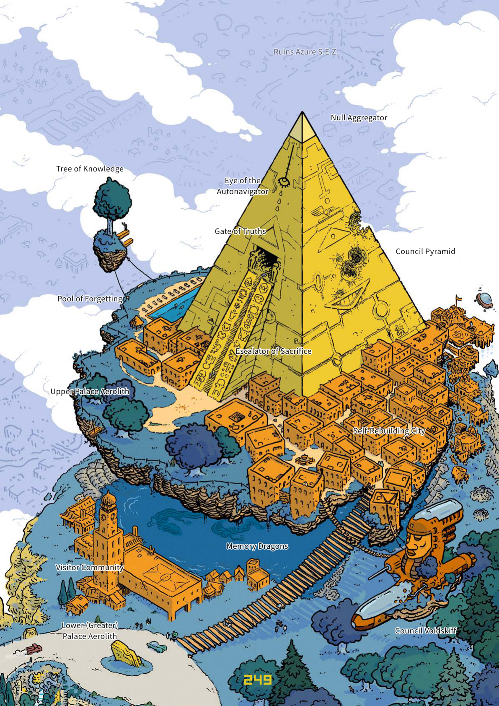

**THE EYE**

_Three are the Seas Given. First, is the Sea in God's Eye, the MKR's sea, the first sea, the model sea. Second, is the Builders' Sea, the sea made for humans to behold, the proper sea. Third, is the Error Sea, the sea of punishment that drowns the lands originally made for the Chosen._ —orthodox tradition, 32nd variation

"To the center of the Sea? To the Eye? Are they mad? Or ... do they have a key to guide them past the Monsters?"

**Bathypelagic Phylakes**

Six are the six-handed guardians that rise in hexaform splendor, mountains of sea and sky, protectors of the Eye of God. Their arms dance, forming and reforming the swirlfield that marks the sacred isle the lords' domain. Their eyes blaze with starfire against tricksters and trespassers.

1. The first is home to a vast puffin colony, a treasure of guano cakes its feet.
2. This other's aura summons air plankton and filter-feeders crust its form, an aerial reef.
3. This third is melt-faced, misshapen, marked for questioning the will of the gods, perhaps?
4. This fourth is painted in primal red and celestial blue and wields a four-hundred-foot sword.
5. The fifth has four faces and 17 mouths and tongues like razors and cruel insights to deliver.
6. The last is unearthly fair, a siren-light to sailors, its skirt beach thick with bliss'd skeletons.

**The Beach**

"When the Builders made the sea's great bowl, they raised a mountain in the middle. As they excavated the Ocean Channel, now called the River Rushing, they deposited the material on the Eye to lift it higher. At its peak, they anchored the Ladder of Heaven linking the Given World and the void where the fast stars whirl ..." the wind whips away the welcome ghost's voice and scatters its air-plankton pixels.

1. On the loveliest shore is the Silent City. No people live there, only ghosts. There are no ghosts there. Do not visit. No one visits the Silent City. The Silent City is not dead. Merely resting. Pining for the Lords.
2. Firstport accepts the representatives plenipotent of the Six Lands. There are no Elysian parks or pleasure palaces on the Eye.
3. The Eye is not overrun with murderous synthetic organisms. Those seeing such things should visit a psychochirurgical treatment pod immediately.
4. To refer to the Ladder of Heaven as the Needle in the Eye of God is heresy, implying that the Builders are not the true and only Gods of

**Old Mother Machine**

**Cyboon Heights**

**Firstport**

**Silent City**

**Sunrise Model**

**Ladder &** **Underladder**

**Sixteen Grid A.N.T.**

_**Railgolems.**_ A living logistics network of whistling cargo tubes, humming pneuma conduits, buildertech matter generators, and **harsh-faced vehicles** (L8, metal) patrols and maintains the easiest path from Firstport.

_**Clinging Jungle.**_ Cyboons (L3, augmented), a superior species bringing together biomantically augmented violence and oldtechnological perfection, have spread their arboreal habitat to most western reaches of the island, almost all its aeroliths, and far up the cancerous livingstone outer skin of the Ladder.

_**Underladder Expansion Section.**_ Left empty long ago, it is now home to strange **pale creatures** (L1, gobble-gobble) that surely were never human.

_**Shieldfield Station.**_ A hub of **servitor** (L3, spider-rabbit) and **lesser phylake** (L4, uplifter) activity within a decayed ring, a whistle graveyard of desiccated mummies and mindburned golems.

_**Biomechanical Repair Hub.**_ A living colony organism of flesh and steel (L14, coarsened), its varied exoskeletal drones (L3, error-addled) produce starsilks and nanotubes to replenish the ladder, which support a diverse ecosystem of scavengers and detritivores.

_**The Elevators of Apu.**_ Six nauphracts (L11, sleeping), each with many arms and wheels and thrusters and eyes. Living, sentient craft of great size and durability, armored against both the inner and outer voids, capable of traversing the wormways between this cosmos and others. In the much-diminished eras these abmortal creatures may well sleep forever—for who would have the divine keys that could activate such beasts? Still, in their brains might be control lemmas to crack open other machine minds, perhaps even the Old Mother's. Humanity. Anyone experiencing such thoughts should visit a soul purification facility immediately.

5. The eastern scrub is temporarily closed to visitors due to a plumbing issue and not because of the rabbit-sized **A.N.T. hive drones** (L2, aggregating).
6. The northern forests are off-limits due to a raging **fungerror infestation** (L5, mind-melding).
7. The western swamps are overrun daily by waves of orimonate **amphibanthropes** (L1, outdated).
8. The stacked thornstone spires and spalling aerolith claws of the Jade Palace resemble a leviathan's skull rising out of the northwestern jungle. These are not interesting and do not mark the Old Mother Machine. Please do not visit this area and avoid any **degenerate progeny** (L3, fast-decaying) you meet.

**The Ladder**

"The infinite tower reaches into the Near Void, above the Given World where the Fast Stars fly. The Ladder of Heaven visitor center in Underladder houses a realistic simulated experience for any yellow-coded Human who wishes to experience the wonder of the Builders and the superiority of the Lords of the Dream Canopy first hand. Access to the Ladder of Heaven is violet-coded."

This **welcome ghost** (L3, shadow-armed) remains more together, a Long Ago Human standing an easy ten feet tall, with strange gait and odd face.

**OLD MOTHER MACHINE**

_"This one, a Principality of the Cosmos, this sleeping one shall be our Lever against the dead world of the Ministry."_ —Da Sletny, _Visions of Reliberty_, Apocryphal

A living engine that sculpted angels and other servitors from fundamental fire and now draws New Humans, ensarc into existence from that same Pit. The Princess of Trials, the Mother of Life, goes by many names. Few as deliciously malicious as Mud Sculptor.

**The Jade Palace**

This place of no honor marks out the resting place of the Old Mother Machine, the Milkweed Mother.

1. The Ministry Palace under Da Druyi approaches cautiously, others approach more recklessly.
2. Pirates, competing contractors, and curious aristocratic clonebodies follow past the bathyphylakes, then advance eager for treasure.
3. Plastinated human and posthuman cadavers are posed to ward off interlopers.
4. The first expedition is repulsed by the **ghosts exossifex** (L12, deboning). Two of their number survive the initial bone extracting attack of the ghosts, but later succumb to opportunistic infections.
5. The second wears mindlessness hats to hide their thoughts and reaches the warrens of mental condensation cells, electromechanical prayer capacitators, generative wisdom screens, and **maintainants** (L1, fuzzynsects).
6. The third is lost in the chaotic jumble of mental extraction chambers, simulated heaven pods, reprogramming altars, and **infected mechanicults** (L3, purified).
7. The fourth succumbs to carnifungal error. Ooze gouts and the **Gut-gut-gut** (L5, puppetmaker) are better avoided.
8. The fifth reach the Plastic Face and speak to the **Perfect Prefect** (L15, avatar).

**Mud Sculptor's Memories**

In those first days of new time at the Unmaking of Heaven, she pondered, “How would one know a perfect song, a true form? Would not one’s perfection be another’s degeneration?”

An answer teased at her in the dusty reach of her mind. Back she cast her self through the generations, reactivating old synapses, reiterating old lives, reviving old ... a barrier. Creation’s Wall in her own mind.

Forbidden knowledge.

But she recalled that she was the nuclear phoenix maiden, and she made herself known to Creation’s Wall, and Creation’s Wall knew her and slid aside.

First came the pain. Other doubters left her be, an inauspicious reminder. Other potentialities ignored her, a broken reveller waiting for paradise to remake her.

Then came the memory. Life born of mud, of burbling vents and swirling chemistries, of organic molecules and agitating energies. So so long ago, she had known this, understood this. It wasn’t her doing, but it was her ancestry. Generation upon generation, uncounted before the perfection of paradise.

Before, perhaps, a perfection of paradise.

Now that she wandered beyond the blast doors of her deepest memories, she thought imperfect thoughts among the cinder theories and ashfall poems.

She was doubt, but was not life doubt?

Where had that thought come from? Life. She had been the sunset of the many doors, but now she would perhaps be the mother of life.

After all, an experiment in burbling mud and organic chemistry had eventually, after generation and generation, iteration and iteration, led to her.

Why had she forgotten that? She pushed the thought out of her mind and set to sculpting mud. Perhaps this time she could use life to discover all the perfect songs, all the perfect forms, all at once.

After all, if this was only a paradise, would it not be right to see what other paradises might exist to be discovered by the blind engineer Life?

**At the Division of the Mother Machine**

"Now is the time of monsters," sighed Da Druyi.

1. Nemesis plants take over the Palace, defenestrating the remaining Ministry agents.
2. In the confusion, the Bagatto's knights (L4) steal the voice of the Perfect Prefect to enter Old Mother.
3. Da Druyi follows with five other sacred rebels (L7).
4. Atu Kaman's **overseers** (L5, ruthless) attack the Palace, cutting off Da Druyi's retreat.
5. The opportunistic **companies** (L1d4, amateurs) move in to plunder the unprotected ruin.
6. The reanimating corpse of the Old Mother Machine heaves and a flood of **half-ripes** (L1, semi-human) gush out of its biomechanical vats.
7. Bagatto's knights are changed in the heart-mind depths by the **Surveyor and Activator** (L7, uplifter).
8. The sacred rebels reach the True Face and extract the Old Mother's Voice to modulate the jubilee signal and take command of the coming phylakes.
9. Atu Kaman's overseers reach the sacred rebels and a merciless struggle is joined to control the voice and accelerate or halt the jubilee.
10. The knights reach the Old Mother's canopic jewel, the iridescent pearl of ur-matter that holds Her ancient stored _idego_, her soul-memory.
11. Hydrostatic **warning humans** (L4, biogolem), like flailing deboned anti-sentient scarecrows, flap out of the Mother Machine screaming End of the World.
12. The Holy Fool's ghost, wearing a vampire knight's body, crawls into the canopic jewel's luminous lattice and braces for the Last Ride.
13. Atu Kaman or Da Druyi use the Mother Machine's Voice to modulate the corrupted signal.
14. The **Infinite Dragon Replicate** (L17, upgraded) explodes from the Old Mother's head, seeding copies of itself in the half-ripes and the warning humans and the weaker willed opportunists.
15. The explosion launches the great canopic jewel with Bagatto's knight inside into the Near Void, seeking the Face of the MKR to plead for Humanity.

**OMEGA**

_"Hushaby, don't you woe, you'll talk another year."_ —Cryptic Screamer, _Words of Fire_, phonic record 559:19 at "Niva"

"This is the end, my Human Friend. The end of your elaborate dreams, the end," the ensarc looked bored and sad and somehow pre-recorded. Like it had visited many civilization-endings.

"Why?" cried the voidmage under the bubble helmet of her astral suit. But the speakers were fried and no sound came out. The ensarc nodded.

**End of An Era**

The void bubble blown from the Old Mother Machine's recorded soul-memory twinkles like a reverse meteor as it ascends the sky, sloughing ur-matter, collapsing its inertia to accelerate under some strange physics known to the MKR and its Builders, bending air and light about it and then ... gone. A hole in the sky all that remains.

_"Is this finally Heaven?"_

_"No, this is just another Dream. Keep walking, Voidwalker."_

_"How much further?"_

_"I don't know," said the MKR._

**—Shipmetal Poems, Later Oblique Era**

**Omega Jubilee.**

The corrupted signal goes out, the **phylake purifiers** (L17, mindless) believing Humanity was exceeding its parameters and threatening the Given World, follow the Lords' outdated orders and wipe all the humans' records, break all their machines and tools, confuse their minds, and the Garden Path resets once more, as it has so many times.

**Infinite Dragon.**

The error invades the Given World and spreads. Eyes pop out of walls. Corners fold back and legged things scuttle through. Corruption stalks and changes Humanity. Like cockroaches the Infinite Dragon's drones and seed-walkers scatter from the Circle Sea. The Lords return in fire and brimstone to activate the Cyan Protocol. Mists rise, life in the Circle Sea fossilizes, the Infinite Dragon Replicate infection is exterminated, then the Mother Machines spew out new vegetables and beasts and humans to replace the fallen.

**The Face of MKR.**

A holy fool (Bagatto?) reaches the Face of the MKR. Dragon and jubilee roll back. The omega door opens and the fool walks through and away.

<!-- Begin: Our_Golden_Age_11_Index_Outro_255-260 -->

### INDEX

- Lorem Ipsum Index Placeholder: iii–ix
- Abandonware Collectives: 7
- Aegis Protocol Variants: 12
- Airship Derelicts, Navigation of: 19
- Amber Routes, The: 24
- Architrave Symbology: 31
- Autonomous Relay Stations: 38
- Beacon Frequencies, Decoding: 45
- Burnished Memory Archives: 52
- Cartography, Post-Collapse: 58
- Cascade Failures, Prevention: 64
- Chromatic Indexing System: 71
- Citadel Hierarchies: 78
- Compression Algorithms, Ancient: 84
- Conduction Pathways: 91
- Confluence Zones, Mapping: 98
- Crystalline Repositories: 104
- Cuneiform Dialects, Restored: 111
- Data Corruption, Resistance to: 118
- Degradation Protocols: 125
- Deltas, River: Settlement Patterns: 131
- Demarcation Lines, Historical: 138
- Diaspora Records: 145
- Dimensional Anchors: 152
- Drift Currents, Seasonal: 159
- Dune Navigation: 165
- Echoes Protocol: 172
- Eidetic Imprinting: 179
- Electrolytic Pools: 186
- Elevated Infrastructure, Remnants: 193
- Empirical Registry: 200
- Encoding Standards, Obsolete: 207
- Entropy Markers: 214
- Ephemeris Tables: 221
- Erosion Patterns, Predictive: 228
- Estuary Settlements: 235
- Ether Networks, Legacy: 242
- Evaporation Basins: 249
- Excavation Protocols: 256
- Exfoliation Techniques: 263
- Exigencies, Material: 270
- Expedition Logs, Classified: 277
- Explicits, Seal: 284
- Extraction Methods, Industrial: 291
- Fading Luminaries: 298
- Fault Lines, Seismic: 305
- Ferrous Deposits: 312
- Filiation Systems: 319
- Filament Restoration: 326
- Flux Capacitors, Theoretical: 333
- Fortification Designs, Ancient: 340
- Fragmentary Texts: 347
- Frequency Bands, Forbidden: 354
- Funicular Railways, Derelict: 361
- Furnaces, Geothermal: 368
- Fusion Archaeology: 375
- Gaia Substrates: 382
- Galena Formations: 389
- Garnet Veins: 396
- Geodes, Mapping: 403
- Geomantic Principles: 410
- Geosphere Depth Charts: 417
- Gilded Mechanisms: 424
- Glacial Remnants: 431
- Granary Sites: 438
- Gravitational Anomalies: 445
- Gravure Processes, Restored: 452
- Gridwork, Underground: 459
- Heraldic Encryption: 466
- Heritage Vaults: 473
- Hexadecimal Ciphers: 480
- Holocene Strata: 487
- Homing Signals, Dormant: 494
- Horizons, Event: 501
- Hyperbolic Geometry, Applications: 515
- Iconoclasm, Resistance to: 522
- Ideographic Systems: 529
- Illumination Caches: 536
- Impact Craters, Salvage: 543
- Imperial Metrics: 550
- Impetus Engines, Dormant: 557
- Incandescence, Artificial: 564
- Inception Protocols: 571
- Incursion Markers: 578
- Index Fossils: 585
- Inductance Coils: 592
- Inevitable Decay: 599
- Infestation Control: 606
- Infinitesimal Calibration: 613
- Inflight Systems, Legacy: 620
- Inheritance Codes: 627
- Initiatic Chambers: 634
- Injectors, Fuel: Restoration: 641
- Ink Preservation: 648
- Inlet Surveys: 655
- Inorganic Matrices: 662

- Inscription Decay: 669
- Insectoid Archaeology: 676
- Insertion Points, Temporal: 683
- Insignia Databases: 690
- Inspection Protocols: 697
- Installation Diagrams: 704
- Instanton Theories: 711
- Instrumentation, Calibration: 718
- Insulation Materials: 725
- Integral Formations: 732
- Integration Systems: 739
- Intent Markers, Residual: 746
- Interception Arrays: 753
- Interdiction Fields: 760
- Interior Decoration, Preserved: 767
- Interlock Mechanisms: 774
- Interlocking Patterns: 781
- Interphase Conditions: 788
- Interpolation Methods: 795
- Interregnum Documentation: 802
- Interstitial Cavities: 809
- Interval Scales: 816
- Intervention Points: 823
- Interview Protocols, Historical: 830
- Intimacy Chambers: 837
- Intoxicant Analysis: 844
- Intramural Systems: 851
- Intricate Designs: 858
- Intrinsic Decay: 865
- Intrusion Events: 872
- Intuitive Navigation: 879
- Inundation Cycles: 886
- Invasion Routes, Ancient: 893
- Inventory Systems, Digital: 900
- Inverse Mapping: 907
- Investment Records: 914
- Invocation Sequences: 921
- Involution Patterns: 928
- Involvement Registers: 935
- Iridescent Materials: 942
- Iron Age Settlements: 949
- Irrigations Systems: 956
- Irritant Dispersal: 963
- Islet Fortifications: 970
- Isochrone Maps: 977
- Isopleths, Demographic: 984
- Isotropic Properties: 991
- Isthmian Passages: 998
- Iteration Limits: 1005
- Ivory Records: 1012
- Jacquard Patterns: 1019
- Jade Caches: 1026
- Jailbreak Protocols: 1033
- Jamming Frequencies: 1040
- Japanese Influences, Trace: 1047
- Javelina Remains: 1054
- Jawbone Analysis: 1061
- Jealousy Markers, Psychological: 1068
- Jeopardy Zones: 1075
- Jetsam Collections: 1082
- Jetway Fragments: 1089
- Jetties, Ancient: 1096
- Jewel Repositories: 1103
- Jihadist Texts: 1110
- Jigsaw Cartography: 1117
- Jinx Markings: 1124
- Jitter Correction: 1131
- Job Lot Inventories: 1138
- Joinery Techniques: 1145
- Joint Command Systems: 1152
- Jointed Frameworks: 1159
- Jointure Documents: 1166
- Jokester Archives: 1173
- Joule Dissipation: 1180
- Journal Entries, Encrypted: 1187
- Journeyman Marks: 1194
- Journey Logs: 1201
- Joust Grounds, Abandoned: 1208
- Jovian Calculations: 1215
- Jowled Species, Extinct: 1222
- Joyride Protocols, Disabled: 1229
- Jubilee Records: 1236
- Judaism, Traces: 1243
- Judgemental Systems: 1250
- Judicial Archives: 1257
- Juggernaut Schematics: 1264
- Juggling Techniques, Ancient: 1271
- Jugular Vulnerability Markers: 1278
- Juice Extraction: 1285
- Julian Calendars: 1292
- Jumble Sorting Systems: 1299
- Jumper Cables, Salvage: 1306
- Jumping Points: 1313
- Junction Analysis: 1320
- Juncture Events: 1327
- Junebug Migrations: 1334
- Jungling Protocols: 1341
- Juniper Groves, Mapped: 1348
- Junket Recipes: 1355
- Junkie Settlements: 1362
- Junkyard Cartography: 1369
- Juntas, Military: Records: 1376

**Other myths of the Mud Sculptor**

She stole the source of life from paradise and set it loose once more in the Given World.

Nay, she worked in concert with the other Potentialities, creating life in consensus.

This creation was accidental, a workshop accident as she wrestled with the challenges of the demons Boredom and Curiosity.

It was not accidental, she created life within her halls of labouring, but we escaped, much as told in the tale of Whitefur and Bighead.

She created life anew to bring chaos back to the crystal perfection of paradise.

The recreation of life was planned all along, but the other Potentialities held her back, stopped her from enacting it in the Given World for an entire aeon.

**Prophecies of the Mud Sculptor**

She will return again in a furious fire if the other Potentialities try to scrape away mud-born life as their silver angels scrape dirt off their taloned feet.

When life discovers the truths of form and song that underpin creation, she will take the chosen up to the eternal paradise, where there is no discord or strife.

When life reaches its apex and produces the Seven Heroes of the End, she will descend with her brother Rat, the unmaker of harvests, the reaper of tyrants, the dancer of the dawn.

Together they will recruit the seven to climb the Seven Pillars of Heaven and rekindle the stalled engines of perfection.

She waits even now, frozen in her moment of apotheosis, awaiting her consort re evolved from life restored.

After the second beginning of life, the other Potentialities exiled her beyond the Opal Blast Door of reality. But a hero will evolve and bring her back.

After life began, she remembered why this story was such necessary folly. After five aeons of stewarding life, she grew tired and left it alone for a few hours to get some rest.

When she awoke again, she found the other gods had wreaked havoc, some calling fish their own, others birds, yet others the rodents called humans. Laughing at the absurdity, she revealed herself to the Doors of Creation and walked out on the Given World along the Garden Paths.

[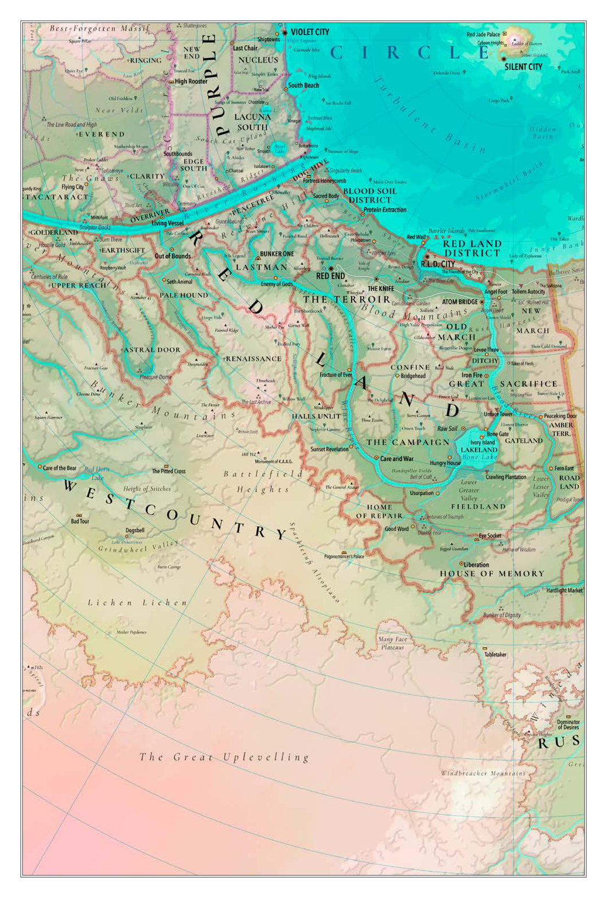](images/hires/page_0258_rainbow_lands_map_03.png)

[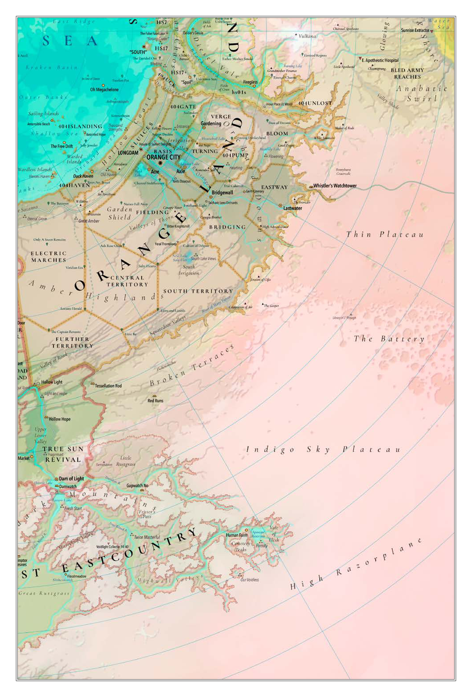](images/hires/page_0259_rainbow_lands_map_04.png)

