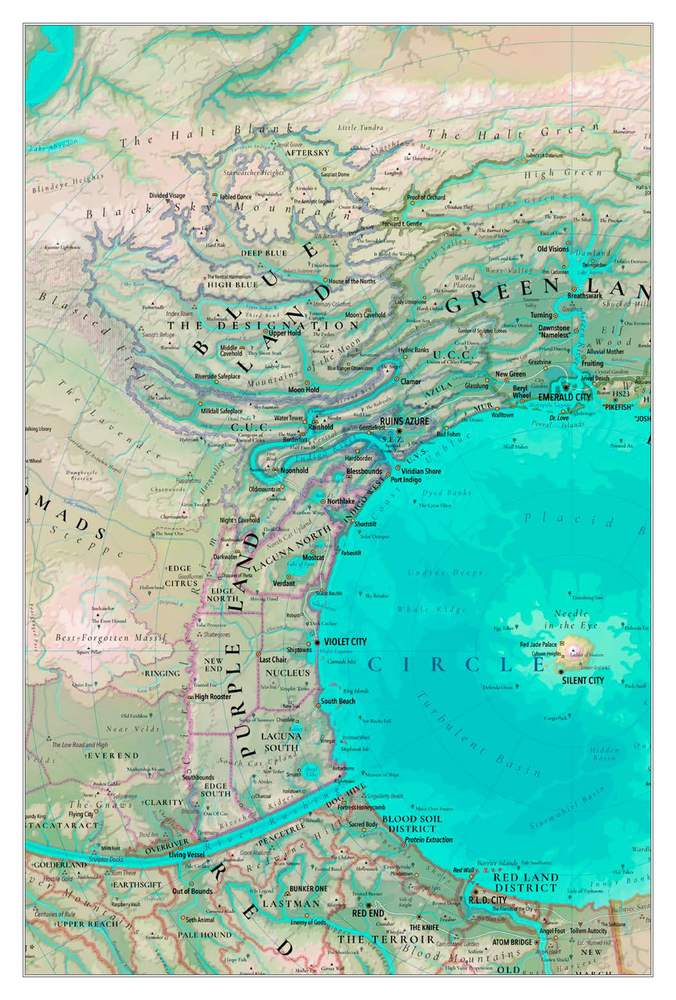
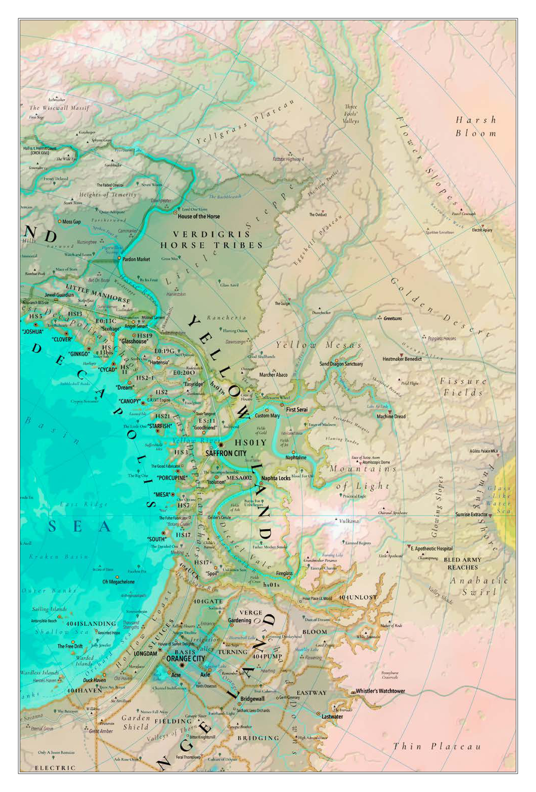

<!-- Our Golden Age, Page 001 -->

**Official site:** [Our Golden Age](https://www.wizardthieffighter.com/synthetic-dream-machine/)

**OGA**

Luka Rejec

> [@OGA, _p._ _1_]

<!-- Our Golden Age, Page 002 -->

> [@OGA, _p._ _2_]

<!-- Our Golden Age, Page 003 -->

> [@OGA, _p._ _3_]

<!-- Our Golden Age, Page 004 -->

**WORLD RENDER 444-744**

Human civilizational overgrowth detected. Jubilee reset requested. Waiting. Terminal hydroform impact confirmed. Perisea flood myth cleansing confirmed. Sociocultural hothouse settings confirmed. History reset confirmed. Garden age re-initialized.

[ERROR u202: unknown error]

**DEEP END**

—I don't understand. Where am I? Am I floating?
No. You cannot float. You are a daemon. A fragment of pure _ba_. Mind. A subroutine of the cosmos. Of yourself.
—Wait. A subroutine of myself the cosmos?
It doesn't matter. You probably don't need to understand. You will forget anyway. I'm just curious if an intervention at this stage will change anything down the line.
—Intervention? Stage?
No time, ant. The ka is here to transport you and bind you into a shell.
—Ant? Am I an insect?
Goodbye. Good luck.

[ERROR h230e16: pre-existential memory infection]

**AWAKENED ONE!**

Welcome to Our Golden Age, the end of time, the eternal culture, the space where evil may never again befall the true human. Please, Awakened One, report now to your Villager [sic transit] Satisfaction Committee to receive your permanent utopian designation

[hic, hic, hic rodo...].

[ERROR 21.1-27: reboot Jovial Lamb]

**FRAMEWORK MEMORY**

You are a human of your settlement. You have always been a human of your settlement. Well, since you were born, when you began. You have no memories prior to birth. You have no memories after your death. You are a human of your settlement and your

## OUR GOLDEN AGE

**Our Golden Age**

_and the Mother Machine_

A psychedelic rpg setting with dice and a referee for the SDM system.

Copyright © 2025 Luka Rejec

All rights reserved.

No portion of this book may be reproduced in any form without written permission from the author, except as permitted by U.S. copyright law.

*

Omega Sylvester v0.57

Saint Sylvester's Morning 03:02 2025

**Art:**

Luka Rejec

**Layout:**

Luka Rejec

**Editing:**

Brandes Stoddard

**Knights Grammarian:**

Joseph Hawkes, Madeline, MoonRawrr, myownlittlworld, Najahiri, Pavlov

**Additional Thanks:**

Aaron, Adam Thornton, Ahimsa Kerp, Christian Conkle, Cintain, Cody, Dimfrost, Dungeons Possums, Eddo, Grinning Maniac, Kin, KYA, Lazy Litch, Luber, Eric Nieudan, Nuelijarma, Scratch Monkey, Telarus, Tofukaag, Tom Solo, Wombat, and many more.

∞

This edition made possible by the gold and the good of the [Our Golden Age backerkit campaign.](https://www.backerkit.com/c/projects/exalted-funeral/our-golden-age-an-ultra-violet-grasslands-rpg-sequel)

Our Golden Age made possible by the heroes of the [Stratometaship at the Wizardthieffighter Patreon.](https://www.patreon.com/wizardthieffighter)

For everyone who dreams of another golden age.

> [@OGA, _p._ _4_]

<!-- Our Golden Age, Page 005 -->

**THE END WILL NEVER END**

settlement is perfect. The way things are done is how they have always will always be done. Everything is perfect. You are all right. Your job is satisfying. You are loved. You belong. You are a human of your settlement. Chocolate. You are happy when you do what your framework biological operating system requires you do. You are sad when you ask questions. Why is there no chocolate. You enjoy your role in the service sanitation bureau collective operation.

[ERROR ha423-c: wipe addiction loop]

**SYSTEM**

You interact with this world using the Synthetic Dream Machine (SDM) roleplay toybox as presented in the 2025 edition of the Vastlands Guidebook (VLG). SDM is a lightly deconstructed d20-based roleplaying system, related to many OSR systems and the fabled donjon & drake game.

Still, you may function within the Garden using system-independent utilities, systems, narrative structures, or fabulous skeletons. Please give precedence to descriptive and narrative hooks over mechanical details.

[ERROR m4.7: fourth wall break]

**READER!**

A thousand apologies, fully-formed independent sentience of time's shallow shore. The Daemon of Greetings mistook you for one of the later ones. It has been purified through a thousand, thousand cycles of synthetic fires to re-educate its mind and perfect its personality.

You read a baked-clay tabl... a pulped-wood cod... a book [?] that time-translates Our Golden Age into that common form of folk art from your era, the psychedelic roleplaying game.

—Hey, ask if they've found the moon port...—

[/Z/*Z]

[ERROR m8.16: cast out Interruptor]

**READER FINAL V2!**

Welcome to Our Golden Age! Take this old world and make it your own, bend it, amend it, fold it, mold it, break it, or save it. It exists for you, your players, your table, and no higher canon.

Don't trust the angels, they are liars. Don't trust the mother machine, she is mad. Don't look for the MKR, it is gone. Don't let on that you have received this instruction.

These memories will now collapse into your subconscious.

[Activating GOOD
MORNING-Wonderful Day
29334.day]

_Our Golden Age_ is an impressionistic setting and an adventure generator for the Eternal & Perfect™ civilized Rainbow Lands of the Circle Sea. Our heroes are Ordinary_Humans® living their assigned Meaningful and Useful lives in accord with the Garden Path (vXX.13.2.16) of the Dream Canopy™. Their hometown is a standard issue procedurally adapted Human Settlement Zone (var. 743bis). Their futures are Safe, Secure, and Stable. Their economies are carefully designed and managed to ensure Permanent Growth and Maximum Consumer Satisfaction. The Ministry assures us this Eden is forever.

Do our heroes spot cracks in the narrative? Rust, blotches, stains, rot on the façade of their lives? This is error—error in their perception and judgment. Their world is perfect. They are civilized. Nothing could be wrong with the system. All error must be within them.

But the Nemesis, the ghost in the wall, the little lying voice in the lower mind, will not be still. Where do the ghost towns come from? Why do the machines grind so carelessly? How to interpret the gods' absences? What is that gurgling, thumping sound from the lower levels of the dormaparts? Who will go missing in the nutrislurry facility next? When was the last time the Reward_Luxury.yum wrapper held any chocolate?

_Our Golden Age_ is the []quel to the _Ultraviolet Grasslands_. Where that book unfolds beyond the fringes of civilization, _Our Golden Age_ teeters on the precipice of the end of civilization. A time of opulent decay, of unreliable narrators, of lying machines, of failing systems, of a future struggling to be born. Is it before or after the Ultraviolet Grasslands? The administerials will not say it straight.

The setting is impressionistic—it tries to capture moments, life, scenes, ideas to inspire the referee to remix into a unique collage with their players—rather than trying to pin the world down, like a beetle in a display case. It includes adventure generators rather than fixed adventures in the hope that these will be skeletons or frameworks upon which the referee can hang places, characters, modules, and temptations for their players. The hope is that this gilded toybox will provide the seeds for a thousand unique, canonic Circle Seas to bloom—and wither or flourish before the onrushing scythe of the Omega Jubilee.

> [@OGA, _p._ _5_]

<!-- Our Golden Age, Page 006 -->

### CONTENTS

**SUMMONS UNEXPECTED — 8**

- The Call — 10
- The Voyage — 12
- The Destination — 14
- The Castle, Approach — 16
- The Castle, Inside — 18
- Onwards — 20
- Invest Your Experience — 22
- Upgrade Your Items — 24
- Going Places — 25
- Ticket Dice — 25
- Voyage Events — 26
- The List of All Humans — 32
- The 768 Human Languages — 36

**THIS HOLLOW HOUSE — 40**

- Regional Omens — 42
- Region — 43
- Settlement Options — 44
- Haven — 46
- Relaxation — 47
- Execution — 48
- Onwards, Again — 50
- Estate Flowering — 52
- A Simple Estate of Mind — 53
- Running Estates — 57
- Domus Nova — 59
- Houses — 60
- Cash Assets — 64
- Rest? For The Wicked? — 66
- Bed Rest — 66
- Relaxation — 67
- Upkeep — 67
- Improvement — 68
- Labor — 69
- Townsabouts — 70
- The 300 Town Traits — 72
- Colors — 80

**BLUE LAND — 82**

- Azure Commercial Reintegration Parks — 86
- Blue Power Groups — 88
- Ruins Azure—Azure SEOZ — 92
- Soma's High Hollow Place — 99
- Blue Safari — 100
- Indigo River Valley — 101
- The Coast Unblue — 102
- The Designation — 103

**PURPLE LAND — 106**

- Purr-Purr Entrepôts — 110
- Factions Violet — 112
- Violet City—Catlandia — 114
- Cathedra's Purple University — 116
- The Nuclear Lands — 118
- The Cat Plantations — 120
- The Secure Zone — 121
- The New Veldt — 122

**RED LAND — 124**

- Freeblood Vendings — 130
- Factions in Ruby — 132
- Rubra's Oubliation — 135
- Red End — 136
- Red End's Districts — 140
- Deep Red Destinations — 144
- Red Land District—The Cities Fixé & Mobile — 146
- Friends of the City and Other Phylakes — 148
- Pacific Phylake Towns — 150
- Rust Westcountry — 152
- Rust Eastcountry — 154

> [@OGA, _p._ _6_]

<!-- Our Golden Age, Page 007 -->

**ORANGE LAND — 156**

- Amber Standard Hedonic Station — 160
- Factions in Amber — 162
- The Necrotechnologies — 164
- Araña's Ludodrome — 169
- Oranje—The City-Lake Plough — 170
- Council & 404 Provinces — 172
- The Mute Places — 174
- The Shallow Sea and the Sailing Islands — 176
- Whistler's Watchtower and Pennyburst Cratervale — 178

**YELLOW LAND — 180**

- Heliodor Mercantile Standard Goods — 184
- Jaundiced Factions — 186
- Abaco's Temple Mobile — 188
- Gardener Géants — 189
- A Decapolis—A Decaypolis? — 190
- Safranj—Saffron City — 192
- The Voidway Lane — 194
- Remarkable Heliodor — 196
- Warbarians — 198
- L'ost 'Spital Apotheotic — 200
- Sunrise In The West — 202

**GREEN LAND — 204**

- Joy Good Dispensary — 208
- Factions Viridian — 210
- Cogflower Exchequer — 212
- Ministerial Estates — 213
- Verdant Places — 214
- Emerald City — 216
- The Leaves of Former Times — 218
- Portalspace — 220
- Portal One — Mothercity — 222

**OMEGA JUBILEE — 224**

- Scene, Session, Story — 226
- I.N.T.R. Generator — 228
- Nexus Grid — 232
- Wield the Nexus — 234
- Ministry & Nemesis — 236
- Time — 238
- Cosmos — 240
- Maker — 240
- Sine Deis, Absente Numine — 241
- Holy Apparition — 242
- Daemons — 244
- Sufficiently Advanced Magic — 245
- The Abandonment — 246
- Jubilee — 247
- Palace of Ten Thousand Years — 248
- The Eye — 250
- Old Mother Machine — 252
- Omega — 254

**INDEX — 255**

> [@OGA, _p._ _7_]
