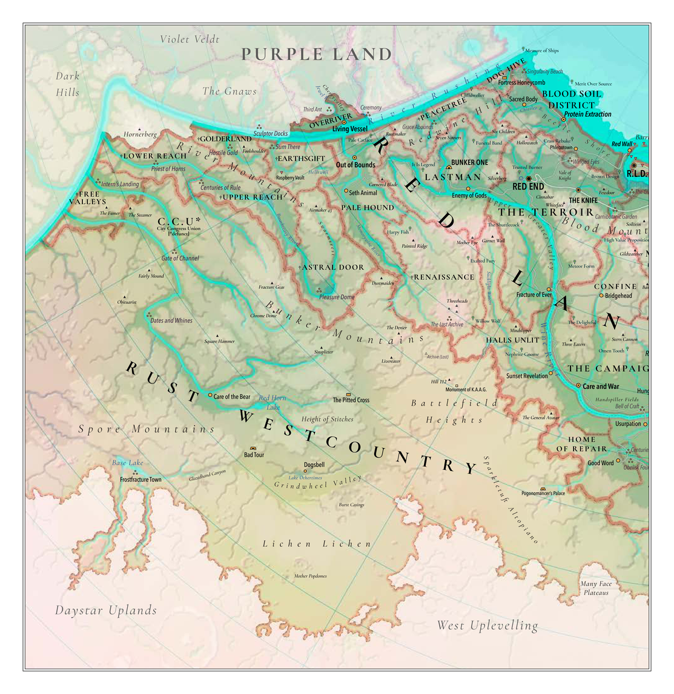
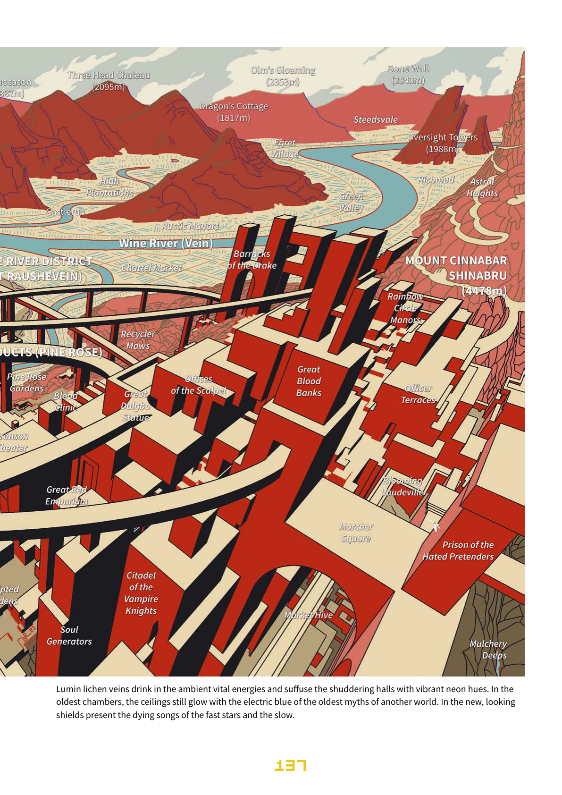

<!-- Our Golden Age, Page 124 -->

### RED LAND

_"Run, run, from the evil sun,_

_it seeks to have you done!"_ —Old Sun Era children's song

> [@OGA, _p._ _124_]

<!-- Our Golden Age, Page 125 -->

Many say the Red Land never became part of the Garden. The fickle goddess Budget ran away, say some myths, leaving the Lords and Unlords with little sway. Others say it was a hunting preserve, a wilderness testing zone, or some other strange design.

The traditional redlander ethnogenetic cycle says the Red Land is where humanity became free. Here, among the many mountains beyond the reach of that pale Circle Sea given to the inhuman Cetaceans and the River Rushing hewn from the hard stone body of the Given World by the Builders themselves as part of their grand schemes, humanity traded blood for power, life everlasting for freedom never-ending.

That is why the land is red. It was painted in the ultimate sacrifice by the rainbow knights who became the vampire knights as they fought the epic shadow struggle to free humanity from the Vile Ones. In the myths it is unclear whether the Vile Ones are supposed to be the Unlords, the Lords, the Builders, or some other group of overhuman precursory sentients.

Also, the leavings of the automated magma maggots, the ammas, are rich in iron oxides and decompose into the vast dunes of rust red sand in the Rustcountries.

Also, the land is famed for its bloodwine and organ farms.

Today oldmetal fortresses dot the land, Long Ago bunker cities serve as store houses and tourist traps, while hunters seek out the falschers—the wild soulless ones sprung from mycelial machines as they did long, long ago when the gods farmed them for spare parts—along the Organ Trail looping far into the West Rustcountry.

**Climate**

In the far south of the Rainbowlands the seasons are harsher, the winters more severe. When winters fade, the mountains' ice and snow feeds the rich farmlands, but then summer's heat bakes the land and summons storms to break against the heights. The greatest of storms bring cyan spores sweeping across the southern summits, poisoning crops and painting the sky garish hues.

**Population**

Red Land: ~8 million, Red Land District: ~2 million,

Rust Country: ~0.5 million

**Groups**

vein tenants: 50%, free vintners: 15% free dewerkers: 15%, rustlanders: 8% hexad members: 4%, vampires: 3% others: 5%

**Languages**

Raudalandi (Red Land), Redland District Cant (RLD),

Winerian (dewerkers), New Common (falschers)

**Capital**

Official: Red Land District or Red End Formerly: Red Line, the peregrinating river city (defunct).

**Government**

Polycentric confederation with devolved aristocratic and industrialist traditional organizations.

**Ideologies**

Aristocratic antitheism (high), blood nationalism (vampire knights), revolutionary first-humanism (district), free industrialism (dewerker), radical sarcopoetics (falscher), pack puritanism (dogheads), clan libertarianism (rustlander).

**Economy**

By popular custom, the free humans of the Red Land, pay only the vein tax and all other activity is their own prerogative. The collection of economic information is viewed as the first step towards divine tyranny. The Red Land District is heavily dependent on bonded golem labor and free dewerker hexad cooperatives.

**Resources**

Bloodwine, abmortality, knights, golem control lemmas, bunkers, revolutionary ideals, falschers, fresh organs, steel, wood, coal, hydroelectric power.

**Means of Production**

Wealth can only be owned by individuals in the Red Land, collectivism and corporativism are both shunned as the road to antihumanist serfdom. This is a core conflict with the Red Land District, which is ruled entirely by hexad cooperative innovation-and-industry syndicates—crime gangs in the eyes of the Vintner Lords.

**Material Conditions**

Visitor testimonials suggest there are few palaces as opulent as those of the Vintner Lords or the Hexad Collective Secretariats. Reports on the squalor or destitution of the toiling masses are classified by both the Vampire Knights and the RLD Collective as various shades of subversive propaganda.

_Source: Clarity on Our Trading Partners, Visense Nergal et al,_ _Violet City University [cat.], Stasis Plumeria IX._

> [@OGA, _p._ _125_]

<!-- Our Golden Age, Page 126 -->

**Ambient, Highlands and Rustcountries**

When winters fade, the mountains' ice and snow feeds the rich farmlands, but then summer's heat bakes the land and summons storms to break against the heights. The greatest of storms bring cyan spores sweeping across the southern summits, poisoning crops and painting the sky garish hues.

| d6 | Winter | Spring | Summer | Autumn |
|---:|:---|:---|:---|:---|
| 1–3 | white skies, frost fingers, milky mists, rust rivulets | rust red runoff, bursting snow drops, pale skies | ultraviolet days, blazing sun, bursting flowers | air like glass, stars by the light of the sun, cold |
| 4–5 | heavy snow, glittering frost jellies, grey skies | lances of sunlight, pierced skies, torrential meltwater | clear days, choking lowland fogs, stately airjelly swarms | heat wave, wilting fungi, mating razorflies |
| 6 | clumps of frozen air jellies, glacial gusts, clear skies | cloud tumults, battling thunders, icy rains | cyan skies, spore blooms, rumbling rust dunes | rainbow foliage display, pink skies, flighty clouds |

> [@OGA, _p._ _126_]

<!-- Our Golden Age, Page 127 -->

**Ambient, Valley Lands and Coast**

| d6 | Winter | Spring | Summer | Autumn |
|---:|:---|:---|:---|:---|
| 1–3 | whistling winds, yellow grasses, brown skies | green days, pale skies, rustling, growing things | humid heat, pink skies, buzzing bloodflies | yellow days, groaning fields, ripened gourds |
| 4–5 | soft snows, gunmetal skies, ghostly spores | fog walls, sucking silence, trembling soils | downpours, torrents, tendril clouds | forest fires, smoke, sour skies, rust on the wind |
| 6 | electric skyfire, red skies, rainbow showers, bracing airs | cyan storms, jelly lathers, pine rose blooms | viridian overgrowth | crimson skies, red drizzle |

> [@OGA, _p._ _127_]

<!-- Our Golden Age, Page 128 -->

**Events**

Traveling along the rivers and roads, you pass looming mountains, deeping valleys, groaning vinyards, yawning bunkers, glittering mansions, and drifts of red dust like snow.

| d6 | 1–3 Expected | 4–5 Surprising | 6 Error |
|---:|:---|:---|:---|
| 1 | **Highland apes** (L3, apex), large predators with the faces of dogs and the talons of raptors can be chased away with lance fire. | Soulless **human-form falschers** (L2, changelings), grown from artificial flesh by old machines, have formed an alien-minded masterless pack. | **Ravengaunts** (L7, cancerous) emerge from time-locked capsules to harry the Viles. Undying commandos buried should the resistance be overrun. |
| 2 | Poor, starving, **corrupted wretches** (L1, bubbling) ask but a pound of flesh to be made human again. | **Knights sanitaire** (L3, eaters of the undead) seeking and purifying cracked time bunkers. | The sun is setting and the vine maze looks confusing. The **old vintner** (L5, falscher) offers blood sausages. |
| 3 | The **leaping lapin rats** (L1, antlered) are rodents become deerlike. | Cyan spore slime must decay before travel can resume. Lose 1d4 days. | Forest fire! Cough. Ack. Poor visibility. Hot, hot! Be quick to escape. |
| 4 | **Tagged tenants** (L1, registered) with travel permits seek: (1) amusement, (2) distraction, (3) absolution, (4) freedom, (5) undeath, (6) a dead god. | **Vintner magistrate** (L3, abmortal) in a mobile mansion offers: (1) doom, (2) advice, (3) largesse, (4) justice, (5) secrets, (6) lies. They are not alone. | Stumbled through a false portal to a mirror of your destination. They're celebrating an **archaeomagical drake** (L11, souleater). Get out (1d6* days). |
| 5 | Blood flower bloom sets your veins on fire and sinuses on water. Lose 1d3 charisma. Meds cost €5 per week. | Skyfire damages exposed neural circuits, reducing thought by 1d4. Consider wearing a foil hat in future. | A local flood drowns your path. Lose 1d3* days. Oh, wait, it's revealed an old-time bunker! How enchanting! |
| 6 | **Night knight patrol** (L3, traditional), protectors from chaos: (1) hunting bandits, (2) draining falschers, (3) bearing bloodwine, (4) collecting protection taxes, (5) harrying ferals, (6) preparing a pogrom. | Without bloodwine, tenants and rusters alike succumb to cyan spores, turning into not-quite-vampires: **bloated glowbloods** (L2, mutated) who form cannibal nests in the hollowed hills to prey on travelers. | Illusory road ends at a creepy hill with ruster glyphs warning of oldtech corruption. Lose 1d2 days backtracking or delve within, risking decayed post-humans to find old glitchware (increases random trait by 1 rank). |

**Additional Joys of the Rustcountry**

The roads in the Red Land are long and winding. Those in the Rustcountry are even longer.

| d6 | 1–3 Expected | 4–5 Surprising | 6 Error |
|---:|:---|:---|:---|
| 1 | Lobogolem glitches that take your vehicle out of your control for 1d4 days, less a day for each €10 spent. | Vehicles start to grow their own minds. They will become sentient in 1d6 days. 50:50 they hate you. | Your machines start to coalesce, hoping to become a **thousand-legged mechahorror** (L9, maser-faced). |
| 2 | **Ruster hustlers** (L2, wicked sharp) take you to a friendly bar and pick your pockets—or try. | **Dead vampires** (L6, doom zombies) stumbling in oozing armor, light dripping from their faces. | **Unholy falschers** (L4, milky) reincarnating a **hybrid avatar** (L11, why?) of Red Rubra and the Machine Beast. |
| 3 | A gust or playful zephyr helps some of your belongings fly off the ledge you're traveling along. | Blown tires or steeds stop you for hours next to an **old géant's** (L12, leaden slumber) burrow, very safe. | The sky peels back and hateful voidlight shines down, making flesh hiss and minds scream. Save or [sigh]? |
| 4 | Rust storm. Exposed metals decay, whipping shards cut skin and blind sensors. Static on the speakers. | Voice storm. Exposed metals glow. Whipping voices steal attention. Strange instructions on the speakers. | Ghost storm. Exposed metals become as vidy screens. Strange scenes form, directions to a pre-purification bunker. |
| 5 | **Red fireflies** (L0, blessed) bring you good luck, granting a temporary +1 to your strength or endurance. | Curious **rainbow wisp** (L4, electric) increases wards—and visibility—until you gift it eight drams of vital fluids. | **Clan round house** (L10, motherly) dragging itself on a dented aerolith base across the desolate landscape. |
| 6 | **Rust folk** (L2, proud) caravan on its way to: (1) hunt zombies, (2) crush skeletons, (3) reclaim a lonely bunker, (4) avenge a fallen scion, (5) trade at a clan meet, (6) build a great iron man. | **Free dogheads** (L3, howl-pack) out to: (1) hate, (2) mate, (3) hunt, (4) restore their missing voices, (5) become a group-mind pack entity, (6) burn down a purple plantation. | **Veterans of the War** (L5, fried) escaped their time vault and are: (1) dying, (2) crying, (3) hunting iron oysters, (4) taking out their brains, (5) reviving the Zu beacon, (6) singing. |

> [@OGA, _p._ _128_]

<!-- Our Golden Age, Page 129 -->

**Travel**

The mountains that saved humanity in the forgotten Long Long Ago now make much of the Red Land a tourist backwater—a hidden gem in pop parlance. Favors from the vintner lords translate into discounts and free samples.

| Type | Status | Price |
|:---|:---|:---|
| Portal | A narrow week-walk thread links Red End to Safranj and the City Azure. All portals are favorable. Portal outlawed in the Red Land District as affectations of the corrupt capitalist False Lords. | favorable [€50 / "free"] |
| Right Road | From the Tollem, a gilt-era velvet cruiser to Red End takes a week and includes food and liberal drinks, while a coalem cargo autobus to Oranje takes just as long and includes nothing. | liberal [€15] |
| Coasthugger | From the Red Land District, a week to the Violet City, two weeks to the Decapolis. Wallows from smaller ports like Protein Extraction or Out of Bounds are irregular. Privacy costs more. | steerage [€5 / €25] |
| Airbeast | Secure public air-cutter service from the RLD to the Emerald City takes a week along well-marked air lanes clear of archaeomagical debris. Private blimps from €100. | comradely [€50] |
| Local (Rivers) | Coalem lobogolem barges connect the towns of coast and river, though passage through the Red Land District is restricted. Free humans require no permits, but pay vein fees. | chugging [€3] |
| Local (Inland) | Lobogolem land-trains, automules, and walkers serve the inland towns and remote bunker villages beyond the confluence of the Wine and Blood rivers. Sentient golems are distrusted. | basic [€20] |
| Peripheral (Rustcountry) | Ruster guides with automules and thinbreathers are recommended. Solitary travel can be dangerous, as the various iron human and falscher clans levy strange tolls and tarrifs. | exorbitant [€45] |

> [@OGA, _p._ _129_]

<!-- Our Golden Age, Page 130 -->

**FREEBLOOD VENDINGS**

_Freedom is paid for in blood._
_Those who will not pay, cannot be free."_

_— traditional Red Land saying_

One travels to enrich oneself, does one not? Well, in the Red Land, the gentle visitor can fortify themselves body and soul, gaining life and wisdom. Materialist visitors are reminded that, R.L.D. ideologies notwithstanding, consumption is _not_ the lifeblood of the Red Lands. These lands run on honor, tradition, blood and soil. For what is wealth if not land?

**Intoxicating Hosts**

Hosts in the Red Land are fond of plying visitors with their favored vintages. Turning down a toast or beverage is rather _gauche_. You don't want to be _gauche_ to a blood-drinking vintner lord, do you?

The rich wines of the Red Land, like other mind-altering beverages, intoxicate the indulging human. Each alcoholic unit of drink occupies a burden slot, one unit dissipates every 4 hours.

**This Liberal Vending**

**Honor as Currency**

As you gain favor with a Red Lander of class and taste, they feel dutybound to host, dine, and wine you in proportion to your honor. This honor to cash conversion guide will help Greenlanders and other materialists.

| # | Honor | Wine & Dine Value | Cash Loan |
|---:|:---|:---|
| 1 | Common | no | nil |
| 2 | Unknown | €2 | nil |
| 3 | Respectable | €10 | €35 |
| 4 | Veritable | €50 | €150 |
| 5 | Magisterial | €250 | €950 |
| 6 | Majestic | €1.5k | €5k |

The gentle traveler should be aware that overstaying one's welcome is a _faux pas_ and a surefire way to reduce your status. After all, it is by giving that one proves wealth and status, not by taking. No one likes a parasite.

Today's trade-host is a:
1. plain, plastic-draped, faceless mannikin ... huh;
2. reflection in a looking glass, a remote ghost;
3. sturdy dwarfer with a silver neck collar;
4. vintner down on its luck, water in its veins;
5. tenant trader with grey skin and eyes;
6. ruster with symbiotes replacing most of its body, wheezing as it trundles about the vending.

| # | Vending Name | Vendor Personality | Specialty | Product Quirk |
|---:|:---|:---|:---|:---|
| 1 | Bottle Perverse | kind, hopeless, cursed | glassware and ghosts | rings with the echo of new creation |
| 2 | Budget Bunker | paranoid, fidgety, furry | golem and dress codes | autoresets to factory settings |
| 3 | Chateau Cat Tails | stern, tense, scarred | farm labor beasts | call home at every opportunity |
| 4 | Fang You Very Much | cackling, handsy, prim | protein beverages | shrivels if not bathed in salt |
| 5 | Says Agrognome | short, supple, smarmy | sundry intoxicants | do not clean at night |
| 6 | Steak and Sword | bloodless, thin, steely | rustland envirotech | bleeds orange fluid by moonlight |

**Fruits of Blood and Soil**

| # | Fruit | Description | Price |
|---:|:---|:---|---:|
| 1 | Rustbroth Stew | Cooked with tradimagical bacteria whose enzymes break down inedible compounds—rubber, plastic, wood, and more—into human-digestible slop. Seasoned for taste. | €1 |
| 2 | Hillbread | Traditional worker bread made from synthetic flour. Edible for months. Packed with vitamins and mood improvers. Contains no immediately toxic preservatives. | €2 |
| 3 | Leech (live food) | A face-sized wriggling leech, full of blood. Keep moist. Feeds a vampire for a few days. | €3 |
| 4 | _Honor Sausage_ | Pink slime dried in wind and sun to create a delicious, salty, arm-length cylinder of protein and fat. Also called "week-meat". Best with large quantities of dewerker beer. | €5 |
| 5 | Vampire Wine | A bottle of the richest ruby vintage, infused with the flesh of creation. A cup restores 1 life to a human and 1d6 to a vampire. Bottle contains 3.75 cups. | €35 |
| 6 | Bloodwine | Orange-red regenerative vintage harvested under the Green Sun. A cup regrows a finger, the whole bottle an arm. Bottle contains 3.5 cups. | €125 |

> [@OGA, _p._ _130_]

<!-- Our Golden Age, Page 131 -->

**Red Land Dress and Wear**

| # | Item | Description | Price |
|---:|:---|:---|---:|
| 1 | Red Goggles | See true colors, uncorrupted by the Green Sun. Easily detect warm, pumping blood. 5 sp. | €20 |
| 2 | Hiking Gear | Shoes and layers to survive lowlands and high. Proof vs. rust, snow, rain, and UV. 2 st. | €50 |
| 3 | Furmalweave Cloak | Living furry photosynthetic tissue. Water regularly. Warm by night, cool by day. 1 st. | €55 |
| 4 | Spore Mask | Plant and chitin symbiote filters dust, spores, and toxins. Enriches air with oxygen (1 life per hour). 1 st. | €100 |
| 5 | Bunkerbeetle Suit | Chitin carapace with synthstone platelets. Light, tough, and anti-necrotic. Armor +4, 2 st. | €150 |
| 6 | Truebrass Ring | Powerfully antibiotic. Protects from all skin infections and most contact poisons. 1 sp. | €240 |

**Human Liberty Insurance Gear**

| # | Item | Description | Price |
|---:|:---|:---|---:|
| 1 | Rustvolver | Forged in skyfire, made to degrade. Double dmg vs. metal targets. Short, 1d4, re 3, 1 st. | €25 |
| 2 | Spore Spray | Inactivated cyan spores cause bloating and bloodthirst. Close, 1d4, re 5, small area, 1 st. | €50 |
| 3 | Blood Trinker | 2-way intravenous town blade. Deliver poison or steal 1 life per strike. Close, 1d6, 1 st. | €150 |
| 4 | Dwarfer Bolter | Pneumatic bolter. Small, powerful, precise, easy to hide. Medium, 1d6, re 2, 1 st. | €200 |
| 5 | RLD Revolutionary | Novel SMG. Works as a club (1d8) in melee. Short, 2d4+2, re 1, burst, 1 st. | €450 |
| 6 | Long Ago Howler | Sonic blaster provokes dread, fear, and awe. Short, 2d8, re 10, small area, 1 st. | €1.5k |

**Unrusting Travel Options**

| # | Item | Description | Price |
|---:|:---|:---|---:|
| 1 | Automule | Mule-derived biomechanical servitor. Powered by ancient fires. Dome head. L1, carry 2. | €100 |
| 2 | Solar Gondola | Sails for the slower rivers, solar-powered propellers for faster waters. L3, carry 6, sleek. | €250 |
| 3 | Bloodweb Balloon | The full old-school blimping experience! L1, carry 4, slow. | €500 |
| 4 | Dust Rover | Sungwood, sinew, chitin, and fungal filters. No metal parts! L3, carry 4, fast. | €1.8k |

**Sundry Russet Souvenirs**

| # | Item | Description | Price |
|---:|:---|:---|---:|
| 1 | Humanhead Steer | 8-inch miniature of a reverse minotaur. Embodies the stolid spirit of the happy farm laborers of the Red Land. Use a drop of blood (1 life) to animate it for an hour. 1 st. | €2 |
| 2 | Backcountry Maps | The old roads, as they were back before the [redacted]. Good maps cost five times more and show modern trails and novel terrors. Includes rust-and-spore proof pouch. 1 st. | €5 |
| 3 | Crystal Heart | Glows with the gentle light of your sacrifice. 1 life per hour of illumination. 1 st. | €10 |
| 4 | Bled Rose Seed | Grows into a protective bush when planted (L1, peeping). The blooms have eyes?! 1 sp. | €12 |
| 5 | Bunkerplate | Puzzlebox dishes and cutlery in the style of the Long Ago rebels, decorated with scenes of humanity's glorious revival. May be a secret map of a bunker. 4 st. | €15 |
| 6 | Cyan Spore Globe | The polychrome spores swirl and dance like mad homunculi. Can distract vampires? 1 st. | €20 |
| 7 | Dormifloral | Spray that puts ambulatory plants to sleep. Reload 5, 1 st. | €25 |
| 8 | Fogwhistle | Blow your soul into a mist of many pinks. 1 life per cloud, small area. 2 sp. | €30 |
| 9 | Pure Sang Chalice | Ceramic and silver cup that purifies blood. Takes 30 minutes. 1 st. | €50 |
| 10 | Bunker Key | Multi-purpose human bunker access pass, including synthetic palms, realistic irises, and source code simulators. Additional eye drops and moisturizer recommended. 1 st. | €200 |
| 11 | Ectoplasmifactor | Crystal globe of sympathetic ectoplasmic animalcules. Shatter it and everything in a small area becomes intangible for an hour. 1 st. | €300 |
| 12 | Friendship Dome | Biomechanical autolobotomizer that makes a living or livingish creature smaller than a quadrodont (a type of pachyderm) pliable and easy to control. Single use, 4 st. | €750 |

> [@OGA, _p._ _131_]

<!-- Our Golden Age, Page 132 -->

**FACTIONS IN RUBY**

_"Red Land traditionalists like to define themselves by their blood, but it is water and stone that shape its societies."_ —Esi Tu, travel writer, Decapolis, Wind Lotus II

Two cities dominate this land. The younger is the Red Land District, a coastal mess of channels and bricks, the golem-guarded bastion of anarchy and commerce. The older is the Red End, a cloud-piercing mass of terraces and livingstone, the blood-pact bastion of tradition and honor.

Three great groups divide the country between. The dwarfer industrialists dominate the coastal factory towns, the vintner lords rule the river plantations, and the half-barbarous rust folk clans crawl the highlands in their hybrid hamlets.

Other smaller groups squabble amongst themselves, allying with the great groups to serve their needs. The free parliamentarians represent the traditional bunker yeomen of the Red Land, the vampire knights celebrate the triumph of the Human will against the cruel oppression of the Dream Canopy and the false idols, the priests RLD offer community and purpose to the labor hordes, the hexad societies provide self-organized power to the petty industrialists and pirate burgeois, the free falschers movement probably doesn't really exist, and the old dogheads are some kind of cinecephalic cult that the author of this section doesn't really care about.

**Dwarfer Industrialists**

They pay lip-service to the tenets of the RLD and coin-service to the hexad societies of that city. Their factory towns harvest and repackage the coast.

♟ _Groen 4-Copy._ The industrialist has a cunning plan to mine the popular walls of the resort ghost town Falsestilt with the metropolitan Mining & Dining Fraternity. The profits will be immense and will upset the balance between the hexads and Groen's Well-Going Concern Six-Dig-Ma. Anarchists and balancers alike would love to see this capitalist and his cult following brought low. The hexads would just love their juicy cut.

**Vintner Lords**

The vintner lords pay kind words to the free parliament of the Red End and vein-rent to the vampire knights. Their plantation villages tessellate the vast length of the Wine River valley.

♟ _Nomoä the Old._ The tricentenarian is holding a great going away party as she prepares to become one with the great blood moon on high. There will be games and, wag the gossips, one of her seventy-seven secret heirs will receive her lovely ruby teeth. Those same teeth she took from the Violet Sky-Eating Hydra in a riddling contest.

**Rust Folk Clans**

The half-barbarous rust folk clans pay neither heed nor deed to anybody. Their hybrid hamlets crawl the rugged backcountry of the Redwine Hills and the River Mountains and even reach the deep old mines in the Winedarks far south of the civilized reach.

♟ _Mother-father Anda Vene._ The chief of the Great Plateaulet clan hears the song of the old divine blood, captured and stored beneath Red End. She-he is convinced its power will let her-his clan multiply, grow, and build their own free state, independent of the old-sucking vintners. The clan's earnest spread-words make inroads with disenfranchised planters in the city's tangle-depths, setting up a riot that will cover the clan's heist.

> [@OGA, _p._ _132_]

<!-- Our Golden Age, Page 133 -->

**Free Parliamentarians**

The oligarch MPs of Red End represent the concentrated wealth, tradition, honor, power, venality, and corruption of the Red Land.

Each MP is born and reborn _in machina_ from the blood of the citizens—not just representing their will, but literally aggregating their flesh and impulses.

At the end of each MP's mandate, when their blood body denatures, they are ritually baked into community cookies and distributed to their constituents, creating a grand electoral full circle.

♟ _Anselm Frankinburn CXXII._ This rogue, free-spirited MP, who would strongly prefer not to end up denatured and baked into cookies, is looking for outsiders who could fake their death and translate their mind into a new shell. They've even got the perfect opportunity: a lovely little lakeside shindig of the Sub-Ministerial Committee on Higher Taxes for Untagged Second-Class Citizens. With the flowing bloodwine, who will notice one more braindead MP? It's easy money, they promise.

**Vampire Knights**

The flower of Red Land youth, made immortal with the blood and plasm and _ka_ of the stems, roots, and much of Red Land youth. Was it not the best of humanity that bought its freedom after its long march along the cruel Garden Path? So the best of humanity must be kept vital, fresh, young, and ready for the eternal revolution.

The knights are organized in permanent celebrations that represent an evolutionary vanguard at the forefront of what it means to be human. Celebrations include:

⚙ **Knights Sanitaire.** The sweepers and the eaters of the (un)dead. They ensure that only the deserving enjoy life everlasting. Their symbol is the virgin rose. Their motto is "nothing is ever easy."

⚙ **[The] Night Knights.** Also known as the watchers of the black sun and the astral guardians. They ensure that law prevails in the realms of the red vine. Their symbol is the grape and axe. Their motto is "in blood, truth."

⚙ **Pink and Pie Knights.** Also known as the evolutionaries and the eternal vanguard. They ensure that the human rebellion can never end. Their symbol is the fork and hammer. Their motto is "eat the vile."

⚙ **Xenon Knights.** Also known as the permanent party and the bureau of luminous affairs. Their task is secret and not discussed. Their symbol is the lamp and shade. Their motto is "empty veins flow silent."

♟ _Temeraire Lindenbloem._ The knight tapped to serve as blood reservoir to the grand secretary **Iron** **Pole** (L7, demented), master of the celebratory all-circle society, is none too pleased. She won five disciplines in the electric blossom games and traces her bloodline to an original void captain and seven shipmaker lineages. All of which is to say, she deserves better things than to serve as a walking backup for a withered old warrior. Conveniently, she knows just the time and place where a small terrorist attack would show Iron Pole up for the doddering elderling he truly is. Pah, Iron Pole even prefers to use a transfuse golem to drink these days!

Of course, if you won't agree to visit 187 Brick Lane, remove the three jaune bricks and carry out the bomb attack, there is the proof of your recent smuggling.

What? You say that wasn't you? Who will the authorities believe?

A tourist or a paid up member of the secret celebration?

> [@OGA, _p._ _133_]

<!-- Our Golden Age, Page 134 -->

**Priests RLD**

The sacred guardians of the revealed and perfect truth of the social anarchist dialectic of the RLD remain popular with the working masses and labor hordes of both the RLD and the Red End. While their materialist monasteries provide psychological opium to the multitudes, the lords and hexads support them; when they kindle revolutionary excitement, they assail them.

♟ _Burn-Oppressors-In-the-Oil-of-Judgement._ The new firebrand is causing a stir, mobilizing monasteries and organizing combat communes in the back country. Who will hunt them down first, the established priestly anti-hierarchy or some local bloodwine don?

**Hexad Societies**

The six traditional fraternal self-help societies of the Red Land coast are the heirs to centuries of resistance, mutual assistance, and poorly-disguised piracy.

When the Red Land District broke free of the Red End parliament, its naive revolutionary elites turned to the old sages of the hexads for advice and legitimacy. Then, in due time, for semi-formalized government.

♟ _Heart-of-Lion._ The thirteen pickled brains of the Adamant and Dandelion Hexad (Heart-of-Lion) seek to expand in the occupied City-Ruins Azure. Coasthuggers and the old Red End portal make it more profitable than most guess. A few bribes and assassinations will make the Green and Purple peacemaker companies see the good sense of working with an experienced secret society to handle the Dead God's mad blue cultists.

**Free Falschers**

This terrorist group of soulless false humans was eradicated years ago and is no threat to any visitor.

Rumors that cells of false humans, visually identical to normal humans, circulating through the body politic of the Red Land are certainly as false as the false humans.

Suggestions that they have secret living clone factories hidden in the deep red aristocratic hunting preserve parks, where they gestate, train, and equip falscher infiltrator families are a ridiculous conspiracy theory.

If you suspect that you have no soul, are a false human, or a clone doppelganger, please visit your nearest political hospital. You may have been substituted without your knowledge. Treatment is free.

♟ _Sacrament bane Pizzigatto._ The undercover Cat Lord masquerading as a civet is in the Red Land to investigate whether the local falschers are more or less effective as a source of stock pets for the Violet City military. It has extracted a crude map from several cloned falschers and suspects they have figured out where in the Celsius Lodge Lands Hunting Preserve the sixth-type falschers' clone factory is hiding. A docile factory of this sort to churn out pets for the Cat Lords would be invaluable. Sacrament would certainly pay at least €10k for viable factory buds.

**Old Dogheads**

The old dogs knew many tricks. Many educated travelers will have heard the myths of the Howl, the meta-entity that manifests when Dogheads of multiple categories form a choir. This is an obvious exaggeration, of course, and the old dogheads are just another oppressed folk sect welcomed in the invigorating and liberal Red Land.

♟ _Crio dei Ruch._ The modernizing doghead integrationist believes the Howl should be consigned to the folklorists. His Redblood Integrity movement is fighting for dogheads to be allowed into the vampiric aristocracy of the Red Land. Vampire Knight traditionalists fear that this might undermine the skinchanger-lifeblooder proscriptions, which ended the Sunless Wars.

♟ _Barcu tei Noch._ The rabble-rousing publisher is intent on dispelling popular perception of the Pack of Purity as a doghead supremacist cult. To that end, he has organized a musical medley howling tour to travel the Right Road. Alas, someone has stolen their holy howling horn. Would the fans even notice if it was swapped out with a fake?

> [@OGA, _p._ _134_]

<!-- Our Golden Age, Page 135 -->

**RUBRA'S OUBLIATION**

_"This circle is no circle. Here, blood runs dry, memories repress themselves, responsibility is evaded. Sin is burned away in the soulfire of unbeing."_ —Executive Charts 5:10, Book of the New Human.

The scattered husk of Rubra's géant false avatar, Malbolco, groans and glows within the spherical Zone of Abnegation known as Angel Heart. With the detonation of the Memory Dam humanity broke free of the false gods, the poor builders, and strode into a new dawn of justice and prosperity.

So say the wealthy vintner lords, anyhow. Rustlanders, rootgrubbers, falschers, bloodcurdlers and even curious tourists still visit this abandoned zone. Some even pray at the husk as though it were the Red God's temple.

**Red God, also Blood Lord Rubra**

Songs in the bloodstream say their mineral is ruby, their beast the locust, their giving tree the fig.

"They that sets in motion evolution's race. They that motivates, drives, hungers, lusts, and needs. The maker of tusk and claw. But also, the maker of suffering, the sower of terror, the warden of death."

**Prayers to Red Rubra**

Once per session or so; to avert the Red Cycle, to make the lord of flesh and fang overlook the human, wail:

_"I am the cud, already in the gut, eaten, digesting. I am passing through, I am done and undone, I have fed you..."_

**Roll d20 + Endurance - Charisma**

| Roll | Effect |
|---:|:---|
| 1 or less | The animal mist descends. Fear grips you. Life drains away. Lose 1d8 life. |
| 2–19 | Hold the rolled number. Once, reduce 2–19 damage by that amount. |
| 20 or more | Rubra sings in your blood. Hold the song tight, sacrifice it to regain 1d6 life. |

**Zones of Abnegation, The Oubliations**

Several other best-forgotten zones dot the Red Lands, such as those around the scattered corpses of the Winged Eyes, the mire of Centuries of Triumph, and the radiant whiteness of the Home of Wisdom. Despite the different structures of the destroyed false avatar and the various visual presentations of these zones, all are marked by a persistent groan and glow. The glow illuminates them even at night, marking them as places of no honor now that the war against the false gods has been won. The glow itself is not very dangerous. The groan, however, is a persistent, psychic noise that pollutes the oubliations and has disastrous effects on the human nervous system, including (roll d6): (1) devolution, (2) decay, (3) rapid-onset dementia, (4) berserk rage, (5) brain-hunger, and (6) hallucinations. Lead-lined helmets and Faraday ponchos have been shown to help somewhat and desperate folks still stalk the oubliation zone, hunting for souvenirs and oddtech preserved by the lack of sentient observers (and thus slower passage of time) within these regions.

Dogheads are oddly unaffected by the groan, despite their superior hearing.

> [@OGA, _p._ _135_]

<!-- Our Golden Age, Page 136 -->

**RED END**

From the bones of the land, the city's livingstone terraces march up the slopes of the mountains Silver (Arshenu) and Cinnabar (Shinabru). They soar over the headwaters of the Wine River and Bearded Vulture Pass, inviting the clouds to play among the linked citadel-mountains. The old-growth buildings are blind to protect the photosensitive minority.

> [@OGA, _p._ _136_]

<!-- Our Golden Age, Page 137 -->

Lumin lichen veins drink in the ambient vital energies and suffuse the shuddering halls with vibrant neon hues. In the oldest chambers, the ceilings still glow with the electric blue of the oldest myths of another world. In the new, looking shields present the dying songs of the fast stars and the slow.

> [@OGA, _p._ _137_]

<!-- Our Golden Age, Page 138 -->

_"No city is as free as Red End, for it is renewed in the blood of Liberty, for it is fed by the blood of false gods sacrificed."_ —Hael Ric d'Er Cru, Bunker Day Speech (SsD VI)

**Grand History**

The mind-blind traditionalist of the Green Land, still staggering along the tattered folly they call the Garden Path, still scraping and bowing before the false histories peddled by the Inquisitors of the Ministry, still besotted by the might of those mute weapon-géants, the phylakes, live in a perpetual present, lulled to sleep by the lurching fabricators still twitching to the forgotten tunes of the absent false gods.

Not so the Red Land, not so Red End. Here the War others fear to mention lest it bring the Retribution once more was won. Here, Humanity survived the Bunker Era and emerged to reconquer the world by blood and bone. All of Red End is a living monument to the gory triumph of panhumanity over those false gods, the Vile Ones.

**Tragic Present**

Alas, not all saw it that way. Many saw the vein-rent, the traditional tax on every resident of the Red Land to fill the blood banks that fuel the vintner lords' biomantic universal regenerative healthcare programme for all Red Land citizens, as an injustice, a burden, an invasion of their bodies. They decried the blood type tablets worn by residents, that symbol of human freedom and dignity, as "cattle tags". At the beating heart of the Red Lands, in the Great Rebellion Museum itself—o, irony of ironies—the anti-priest, the bloody upstart Ôb Mock, discarded his blood driver robes and demanded of Liszteprans, head of the T. Tanz Kompanie and then overseer of the venerable blood banks, to tear down the Wall of Traditions where the laws of the Red Land were inscribed and the ranks and types of the blood-givers were listed.

Ôb Mock was publicly fed into the great soul mill named "Old Mohlack" in front of an approving selected audience of worthies, which should have put paid to all the nonsense about abolishing traditions like the psychomedical tests at age three that determine each Redlander's career and vampiric knighthood prospects.

Alas, it did not. The Ôb Mock bloody uprising was swiftly put down with minimal casualties and though some say an insurgency continued to bleed the Red Lands for another seven decades, only a small territory at the mouth of the Wine River was lost to a group of radical hold-outs who aligned with the pirate dwarfers and hexad merchants dwelling there. A trifle, truly.

> [@OGA, _p._ _138_]

<!-- Our Golden Age, Page 139 -->

**Ambient**

Along the terraces and urbiducts of Red End scurry harried maintainer managerials and stroll peacock-bright consumer finefolk. Thus, the sanguine economy ticks. On Sundays you will see quaint _activistes_ marching for the amusement of the knights and on blue Mondays used up probably-folks line up at the self-donation clinics.

| d6 | Summer Day | Summer Night | Winter Day | Winter Night |
|---:|:---|:---|:---|:---|
| 1–3 | pleasant, fragrant, breezy, strolling middle-castes | cool, perfumed, moths, fireflies, knightly airs | cool winds, scudding clouds, rustling bamboo stands, drifting songs | hotbloodwine oppressive, humid, still, chill, misty, obscure figures, dark skies, flakes of snow |
| 4–5 | deserted but for probablies | scuffles, raucous song and ash | taste of rust on the winds, razor cold downpour, gushing gutters | cyan fog, blood addicts, red sky, shuttered doors, heavy snow, frozen waste |
| 6 | swimming tunnel rats | stalking anti-socialites | electric blossom knights | humans, cryodryad calls |

**Events**

| d6 | 1–3 Expected | 4–5 Surprising | 6 Error |
|---:|:---|:---|:---|
| 1 | **Haemodryads** (L3, nymphs) encouraging folks to donate their excess vein rent to the popular blood bank. | Tunnel-dwelling **sun-haters** (L4, corroded) hit a blood clinic to secure bloodwine and other vital fluids. | A **bunker** (L13, dark) wakes and calls in dreams to a sealed sacred builder vault in its depths, beneath Arshenu. |
| 2 | Dwarfer pop-up land-train trucking and bartering contraband, red-eyes, and consumerist revolutionary tat. | Three rebel cells hatch the same plot to kidnap a vein-tax collector's wife. They violently run into each other ... | An **abominable blood ooze** (L10, splintering) bursts out of a clinic. Parliamentarian plot? RLD terrorists? |
| 3 | Civilized picket-off between supporters of human labor and promoters of auto-golemification. | Vintner post-materialists attack a chattel market, killing servitors to disrupt the city's economy. | An **oubliated golem** (L9, leaden) aglow with oldfire prophesies doom and gloom. Lead the blind thing away. |
| 4 | Two **sparkling vampire** (L3, sartorial) teams face-off in the traditional gladiatorial blood sport. Decapitations illegal. Those killed are restored from the holy blood bank in the knightly citadel. | Funeral party mulching their dead and spreading them on their gardens as is the classic tradition. | **Vampire knight** (L5, perfumed) riding **obsidian drakes** (L7, sleek) put on an airshow, spearing a small error dragon. Afterwards, parts are sold as souvenirs: scales for shaving, quills for sewing, claws for cutting, eyes for buttons, flesh for biomancy. |
| 5 | Stitcher biomancers seek subjects for radical self-improvement! Tested on soulless human-analogue falschers. | Dozens of corpses in a jay-needle den. Tried to make their blood ultraviolet with the neon phoenix's feathers. | A rebel knight will be pulped and fed to the **Sky-Hydra** (L15, sparkly) in a ceremony. Games, treats, included. |
| 6 | Processions, pop-music, plasma-fizz, and pyrotechnics for the electric blossom games to pick new knights. It devolves into an: (1) anti-cat demo, (2) anti-lich rally, (3) pro-doghead party, (4) jingoistic march, (5) mass love-in, (6) popular blood drive. | Enhanced sentient bat swarms—the **Red-Eyes** (L1, legion) patrol the neighborhoods to keep it safe. | **Doghead radicals** (L1, united) giving out pamphlets, soliciting donations, preaching about the "Coming Howl." |

**Top Drop Stays**

| # | Stay | Description | €/week |
|---:|:---|:---|---:|
| 1 | Dewerker Dormitory | Synthetic sleep pods. Fully rested in just three hours! Very efficient! No chance of psychosis! Lockers for three personal items autoscan for illegal materials. | €2 |
| 2 | The Inn Mobile | Ruster caravan camp. Beware the corrosive centipedes. Move closer to work. | €5 |
| 3 | Solaris Sanctuary | Traditional bunker chic with illumination in the style of the first sun. Experience the light humanity evolved to enjoy! Ignore the emergent wall-sentiences. | €10 |
| 4 | Shadowfree Suites | Permanently illuminated by the blood moon, always free from the burning Green Sun. 100% UV safe. Hotbox stocked with seven flavors of synthblood (€1 each). | €15 |
| 5 | Cliffside Cabins | Panoramic views and laughing stars? Astral visitors? Don't fall off. | €20 |
| 6 | Vintner Villa Towers Estate Premium Stays | Elegant estate, falscher dancers and a secret bloodwine tasting? Perhaps even special society initiations? Multiple costumes, masques, and gowns available. | €90 |

_Accommodations also provide ticket dice: €5 = 1, €10 = 2, €25 = 3, €50 = 4, €100 = 5._

> [@OGA, _p._ _139_]

<!-- Our Golden Age, Page 140 -->

**RED END'S DISTRICTS**

Red End is large and its vintner aristocratic districts stretch to the Wine River. Plan 1d4 hours to travel to a specific district, and at least an hour per location visited.

**Mount Silver - Arshenu**

The eastern third of Red End climbs the Silverberg, the Arshenu, the last great peak of the Blood Mountains, where divine blood bought human freedom. Arshenu, the guardian who withstood the Vile Ones' decay bombs. Arshenu, the lifegiver, who gave its bones to the petromancers to turn an old bunker city into the first free city of humanity.

1. **Underterraces.** Open to the air but perpetually shadowed, desired by photophobic middle classes.
2. **Administrative Terraces.** The tomb offices of the bureaucracy, where hopes and dreams die to be revived as zombies of themselves.
3. **Ministry Way.** A wonderful plaza and open air museum, where you can score a quaint painting or an illegal bloodwine mix.
4. **Bloodwine Cellars.** The great state-owned cellars, where the vintners of House Marigold create and age the most terrible and wonderful brews.
5. **Great Rebellion Museum.** A monument to human resilience, a history of the War (don't mention it), a record of the Fall. As it is free to all, one can easily find some waif down on their luck willing to sell a pound or two of themself.
6. **Tessellation Park.** A puzzle park where vampires go to entrance themselves for hours and forget the ennui of their abmortality.
7. **Parliament Plaza.** Experience the full-spectrum illusion of the ungrateful peasant rebellion of (datum redacted) and the glorious preservation of the revolution by the popular Pink and Pie parliamentary vampire knights battalion.
8. **Free Parliament.** Off-limits to visitors, except for guided tours on Thursdays.
9. **Citadel of the Vintner Lords.** The awe-inspiring fortress of the great-good houses of the Red Land looms over the city, reminding visitors and locals alike that their betters are looking out for them.
10. **Bunker of Life Over Death.** The Redlanders, horrified by the necromantic traditions of other lands, by the jewel-liches of old, experimented with ways to restore life to the undead. They had many failures, but some successes. Their old biomedical research bunker is now something between a memorial and a popular souvenir marketplace.

**Cinnabar Mountain - Shinabru**

The western third ascends the flanks of Cinnabar, a great massif transformed and lowered by the Unlords' sacred bombs, yet not destroyed. Good Shinabru, where the Phoenix Parasite was brought down and thrice decapitated. Here was the lesson given to the Vile Ones that humanity would not be slaves.

1. **Prison of the Hated Pretenders.** Here the worst of the worst rebels against the parliamentary republic are kept in a semblance of life. Necrobiomancy ensures that even if there is no hell awaiting them in the next life, they will have centuries of hell in this life. For an added fee, visitors can have a go with some of the simpler torture devices.
2. **Officer Terraces.** Traditionally, the homes of the parliamentary militia. Now a popular upper class neighborhood famed for its boutique eateries.
3. **Great Blood Banks.** The great state-owned banks, run by the Four Nameless Houses, administer the vein tax and the life courses of the abmortals. Visits by appointment only.
4. **Offices of the Scalpel.** Both the finest research hospital in the Red Land and an officially sanctioned punishment facility.
5. **Crimson Theater.** The popular aerial wrestling spectaculars of Long Ago are now a ritualized high art. Try the crimson jaspis box for €100.
6. **Marcher Square.** Any citizen of the Red Land is allowed to express their dissatisfaction by marching out their complaints in letters a hundred meters tall on this grand plaza. Basic complaints, couched in the traditional legal poetry of the high common speech, typically take between 20 and 40 kilometers of formal marching.
7. **Statue of the Great Dalgba.** Celebrating the faceless First Drinker, who awakened in the time of poison mists and brought the power of abmortal vitality to the rebel forces.
8. **Barracks of the Drake.** In honor of the corruption dragon Sin ot Sina, who gave of their undying flesh to breed the hunter drakes the vampire knights use to this day.
9. **Citadel of the Vampire Knights.** The sky-piercing fortress of the strong and stable mad warrior of the Red Land soars over the city, reminding visitors and locals alike that the blood-drinking commando is there for them.
10. **Hotel New Pale.** A pleasure palace for visiting parliamentarians, celebrities, and prospective vampires, the masquerades are to die for. Has secret passages to the Crimson Theater.

> [@OGA, _p._ _140_]

<!-- Our Golden Age, Page 141 -->

**Bearded Vulture Pass and Butterfly River Valley**

The middle third, between the two mountains, now resigned to shadow even at noon, sprawls across valley and pass, once the town of Qol Shipetu, where the free lords pre-vampiric farmed their potato and tomato crops. Time, redevelopment, and profit have changed the vale.

1. **Recycler Maws.** Purchased from the finest biomancers in the Decapolis, the new recycler worms take all the refuse of the Red End and give back new feed stock for the city's great companies, such as True Water Inc. and Iron Harvest LLC.
2. **Transit Stations.** A great public art exhibition reminds visitors of all the workers who gave their lives to move the local portals into this well defended transit fortress.
3. **Soul Generators.** Right under the Citadel of the Vampire Knights, soul generators turn the forfeit _ka_ essence of the damned into thrumming power to keep the great city humming and carbon neutral!
4. **Customs Warehouses.** The state-owned customs warehouses review and vet all goods coming in and out of the city. Currently operated by House Mistral LLC, a subsidiary of the conglomerate House Mistral Bis2 directed by the second son of the third concubine of the current Chief Parliamentarian.
5. **Great Red Emporium.** The official annual market, where industrialists from round the Circle Sea come to offer their wares to the wealthy and wise of the Red Land.
6. **Blooming Vaudeville.** An underground theater district and source of semi-legal novelty vidys. Visit for the ever-popular chattler baudies, watch soulless false humans re-enact the dawn of the ever-young!
7. **Mulchery Deeps.** An unincorporated district. Guided tours of the corrupted colonies are available for those who want to thrill at uncontrolled mutation.
8. **Welcoming Way.** Simple, stolid homes for those ascending the real estate ladder. Each comes with a personalized heal-coffin.

> [@OGA, _p._ _141_]

<!-- Our Golden Age, Page 142 -->

The urbiducts are the soaring habitation bridges of the upper city, expanding Red End into the lofty heights between the two mountains, providing a lush, luminous home to those who have contributed most to the success of the greatest free city of humanity.

**Upper Urbiducts (Skyfire District)**

So close that you can touch the skyfire, they say (though this is not entirely true), the Skyfire District is a popular residence for noble and knightly families because of the plentiful drake perches and the high real estate values, which keep out the weak-blooded riff-raff.

1. **Sculpted Gardens.** Elevated on aerolith plinths, the greatest sculptures levitate high up, where the lowly masses can enjoy them without defacing them.
2. **Translucent Apartments.** Grown of a novel livingstone that turns daylight into perpetual twilight, protecting the interior from the harsh rays of the Novel Sun. An up-and-coming neighborhood, perfect for those who want to acquire a sanguine visa (for investments over €1 million).
3. **Rainbow Circle Manors.** The old industrialist fancyhomes are now the domain of cosmetic re-facing clinics, surgeries, embassies, cloning banks, and psyche restructuring shops.
4. **Crystal Mall.** The greatest mall in the Red Land, a single living golem organism, it feeds on the satisfaction of its customers. Tourists should avoid some of the darker hedonic delights that offer "enter for free, but never leave" tickets.
5. **Electric Promenade.** A theme park of yesterday's future today! Experience how the ancients imagined the world would be three hundred years after they were recycled in the communal vats!
6. **Astral Heights.** A nature preserve and certainly not home to the urban bunker palaces of the great vintner houses of Red Land.

**Lower Urbiducts (Pine Rose District)**

The less-lofty habitation bridges and towers for the middle-managerial castes still provide the sunlight now denied to much of the old valley settlements, as well as a taste of the rarified reaches that a good civil servant or professional could aspire to after a few decades managing a serious Red Land quango or optimizing the taxes of a few large vintner estates.

1. **Meta-Electric Light District.** A tangle of office bunkers so overgrown with lumin lichens and low-grade active atmosphere generating symbiotes that even the weakest human can work for 20 hours a day without tiring!
2. **Pinerose Gardens.** A wonderful gift to all the laboring masses of the city, entry to these carnibotanic gardens is a steal at €1 per day.
3. **High Density Society Condopodium.** Habitation pods for the middle class saver. Each pod offers a night's rest in just 4 hours in exchange for a few vials of blood. With hot-podding, any worker can save up for the housing ladder within a few decades!
4. **Blood Clinic.** Need more money fast? Donating yourself to the blood banks has never been easier.
5. **Market Hive.** A gray-market zone where noncitizens and sub-altern residents operate exotic eateries and provide decriminalized goods for all tastes.
6. **Hanging Gardens.** A beautiful area, free to all, where one can marvel at many executed criminals preserved in acrylic.

> [@OGA, _p._ _142_]

<!-- Our Golden Age, Page 143 -->

**Upper Wine River (Ôt Raushevein)**

The rural vintner counties are held in perpetual trust for panhumanity by their respective great houses. Over the centuries, many failed rebels and terrorists have used the district's leasehold and permarent structures as an excuse for causing disorder and mayhem. What fools.

1. **Chattel Market.** Quaint reproduction of a purification era rebel village with a museum explaining why humans never should be slaves.
2. **Fish Orchards.** Meat factories and biomanced vines turn the feedstock from the recyclers into seventeen different types of nutritious slurry.
3. **Rustic Almond Manors.** A failed greenbelt redevelopment turned feral slum.
4. **High Plantations.** Terraced plantations provide food security and hunting grounds for Red End's betterfolk. Beware the **hungerlings** (L1, ghoulish).
5. **Gentle Valley.** Offering authentic oldschool hospitality with none of the blood and mud. Some say it is just a Pot Emetic [sic] setpiece village and all the residents are **retro falschers** (L2, stepfordian).
6. **Richmud.** Aesthetic neobrutalist mansions in corporate plantations worked by soulless falschers.
7. **Egret Village.** A gated community for the wealthy nouveau riche, ambassadors, and fallen angels.
8. **Steedsvale.** A county known for its biomantic steeds. Visit its famed stud factory.
9. **Protein Farms.** Snails, crawlers, crunchers, and more are farmed in the GoldbloodTM rice paddies.
10. **Vivid Vinyards.** Experimental vinyards owned by the House of Brick.
11. **Deep Red Road.** The main road along the Wine valley begins here. A pilgrimage for hemoenologists.
12. **New Bruncoe.** Standoffish closed plantation settlement owned by House Bruncoe. Foreigners not welcome after sundown.
13. **Sandeni Vinyards.** Closed pending an investigation into carnibotanic event 32.
14. **Tollvale.** A fortress of sungwood thorns and mindshackled ghouls prevents roving feral bands or rebel peasants from reaching Red End. The traditional toll was a pound of flesh and seventy silverfish to pass, but a free tourist bus now bypasses this undying obstacle.
15. **The Shuttlecock.** Sitting on Dragon's Cottage, the Grand Phylake has not moved since the Phoenix Parasite was decapitated (thrice) on Three Head Chateau. Now a popular picnic destination.
16. **Hundsgraben.** A closed-off valley just for the Dogsheads, humanity's best companions in the battle against the Vile Old Demons.
17. **Enemy of Gods East.** A restricted vampire knight training ground repurposed as an amusement park.
18. **Olm's Gloaming.** A mountain riddled with caves. All the sentient olmish folk have died out, alas.
19. **Bonewall.** Built of géants' bones, piled up by the Phoenix Parasite in ages past, it looms over the first source of the Wine River.
20. **Whiteface.** Tallest peak in the Blood Mountains, a traditional test of climbing prowess.

> [@OGA, _p._ _143_]

<!-- Our Golden Age, Page 144 -->

**DEEP RED DESTINATIONS**

**Sunset Revelation Chateau**

_vintner lord excrescence, livingstone airvines_
Once, only vampires and their kin were allowed to partake of the rejuvenating bloodwine of the Red Land. This was not because of some misthought sumptuary laws, but because most human biologies have to be magically adapted to accept bloodwine. Bloodwine rejection is a horrible syndrome, described as "a cross between an ebola daemon and the leaping runners."

However, thanks to the proprietary techniques of Vel Yugoshi, anyone can now regain a taste of their youth by sipping on the Sunset Revelation's amber youngwine.

Youngwine is not wine _per se_. These beverages extract youth from donated blood and vitality from the rubescent bloodvine. A cup of the famous plasmatique vintage restores 1 year of life. Prices start at €500 per cup. Visitors are restricted to one cup, with stronger varieties restricted to the vampire knights.

Fortunately for the fashion conscious, you can still gauge the purity of youngwine by how much its drinker sparkles after indulging, just like with bloodwine.

_**Secret Recipe:**_ truth of the proprietary technique would cause a diplomatic furore, for it mixes the nine lives of a cat with the youthful folly of a human child.

**Good Word's Temple of the Howl**

_living cave sanctum_
Rumors that this doghead religious complex is a center of anti-Violet and anti-cat radicalism are overblown. Marvel at its sonic and scent landscapes, and chuckle in good humor at the overwrought doghead theories about the meta-intelligence accessible to dogheads as they unite in the howl. Avoid the holy of holies, as the subsonic howling of the canine anchorites triggers delusions and vivid hallucinations. The seven-fold council holds public displays of their mystic powers every fifth-day at sunrise.

_**Dark Truth:**_ the Pack of Purity is working on reviving the meta-intelligence. Recent gain of function after the fragmentation of several blocker Gods suggests more divine decay events might allow the dogheads to selfuplift. Plans are afoot for a trial disruption attack.

> [@OGA, _p._ _144_]

<!-- Our Golden Age, Page 145 -->

**Hollow Hope's Chthonic Scalpel Introscope**

_restricted clinique_
The great ruby observatory, where the first masters of the vintner renaissance explored the human body and learned how to read its source code. This site was instrumental to the human acquisition of the divine science of biomancy. Even today, visitors who know the six sculptural gestures can book treatments at affiliated clinics of bodily perfection. Prices are quite reasonable:

⚙ Parasite-resistant blood — €100.
⚙ New, perfectly fashionable face — just €300.
⚙ Learning about your encoded destiny — a mere €1.

_**The Maddeléna:**_ within, a living void skimmer, regularly pruned so it cannot fly, provides the biological brain power to read human destinies.

**Lastman's Cloud-Piercer**

_magic mystery train_
The great crystal train recently celebrated its bicentenary. There are few better ways to enjoy the spectacular views of Red End and the Upper Wine River. Do be aware that some of the lookout stations are currently closed for renovation. This has nothing to do with rumors of sunhater and mosquito infestations.

_**Sun-Haters:**_ the recent release of astral-flavored postblood was lauded as an opportunity for more middleclass members of Red Land society to attain abmortality. Unfortunately, many early adopters suffered neocortical decay and increased aggression.

Some of the more aristocratic sun-haters escaped their luxurious sanatorium and set up a nest in the Olm's Gloaming and Bone Wall lookout stations. Think less "mosquito vampires" and more "giant wasp vampires."

For now, calls to recycle the remaining sun-haters as was done with the lower class early adopters have fallen on blunt fangs.

**Hungry House Clockwork Bloomery**

_botanicals unraveled in time_
The great rotating garden is famed for its perpetual flowering cycles, tied to the Red End's unique metaelectric light fields. The ancient puzzle garden is also a popular mulching ground for the city's great and good. It is said that one cannot smell a bloomery rose without inhaling one's ancestors. The bloomery is closed on full moons. This has nothing to do with ghosts.

_**Possession Lake:**_ on the lake of memories, in the three pavilions of regret, decay, and forgetting, the ghosts of the purification era and before take on potential flesh in the Green Moon's fulsome glow. A kiss, a sacrifice of flesh, an offering of willing corpse, may transport one of these ancients to this golden age, to marvel at how far humanity has come.

It is to prevent these revenants that the night knights' patrol forcefully ejects all would-be trespassers on full moon nights.

> [@OGA, _p._ _145_]

<!-- Our Golden Age, Page 146 -->

**RED LAND DISTRICT — THE CITIES FIXÉ & MOBILE**

_"Surely now, in these enlightened times, it is no longer right for the ancient magic from the before times to be controlled by ritual castes such as the Maintainers or Oldfolk? We are no longer the mere scrabblers in sand, the mere suppers at the nutrifac's teat. We have risen up from the Great Forgetting. This advanced magic is often indistinguishable from technology and with practice and study, much of it is accessible to us later day humans. After all, our soul source imprint matches the data-protein codes required by many of these archives. Is this not a sign from the Maker M.B.U.T.E. that we are meant to use these gifts of the Long Long Ago to grow and flourish and spread? I say that it is!"_ —Liszteprans, T. Tanz Kompanie, public rebuttal, misheard speech that triggered the SCIII uprising.

**Origin Myth**

The RLD is a radical anarchist socialist city-state on the sliver of land between the Blood River and the Barrier Islands. _De jure_, it is the second city of the Red Lands, but _de facto_ it has been independent since the Bloody Popular Uprising of Sun (rising) Camelia III against the Vintner Lords.

Its independence has been maintained for decades by the glazed-brick heat-ray colossi, known as the Friends of the City, who burn every creature approaching by land without the sigil of the Hexad Societies. It has developed into a hub of piracy, free enterprise, biomechanics, and Hexad ingenuity—making it an unusual competitor-ally of the Emerald City.

**Subcities**

The anarchist constitution of the RLD is apparent in its boisterous, sometimes mutually antagonistic, subcities.

_**City Fixé.**_ The unmoving city, once known as Port Humane, is where the majority of the RLD's lesser revolutionary orders reside, descendants of those classes who did not participate in the Bloody Popular Uprising. They lack for nothing—every lesser revolutionary is assigned a code at birth that grants them the mandatory privilege of labor for the greater good, access to a housing pod sufficient to their needs, and a ready supply of enhanced nutrislurry to keep them motivated to sacrifice for the inevitable historical victory of the RLD.

_**City Mobile.**_ The sailing cities of the Hexads and the Dwarfer Industrialists gyrate in stately dance about the

> [@OGA, _p._ _146_]

<!-- Our Golden Age, Page 147 -->

Barrier Bay, building, trading, fighting, splitting, and recombining; a vibrant and vital experiment in creative destruction free from the strictures of tradition or the terrible security of the Phylakes. Each City Mobile is its own autonomous free-trading cooperative holding conglomerate, an empire of industry and armed trade.

_**Red Wall.**_ The holy city of the sacred guardians, where the priests of the RLD manipulate the material of the Given World to direct the Friends of the City to the benefit of the common good and the Hexads.

_**Horn Wolf Preserve.**_ The immobile island city home of the old sages of the Hexads, the false vampires kept alive by the blood of the lobotomized phylake Horn Wolf. They offer benevolent guidance to the District, never orders.

_**Old Sea House.**_ The great trading island-fortress where outsiders are welcome, unlike in the City Fixé.

_**Sunflower's Barrier.**_ The ominous, brooding island where enemies of the permanent revolution are sent for re-personalization. Some whisper of an archive of maintainer mind-prints from the Long Long Ago.

_**Brown Design.**_ The one friendly Phylake, the six-armed ally of the bloody popular uprising, a giant angel frozen in place, supporting the faultless and perfect humans of the Red Land District in their schemes.

_**Beetle House.**_ A radical social-experimental commune designed to encourage tenants of the Vintner Lords to move to the City Fixé and replenish its human resources.

**Ambient**

Everywhere crowds of humans, twisted, hunched, changed, adjusted to the needs of their trait. Willing servants of their materialist creed, self-sacrificing each other in the balmy delta of the Blood River.

| d6 | On the Sea | By the Sea | In the Megastructures | Under the Glass |
|---:|:---|:---|:---|:---|
| 1–3 | breeze, seaweed, freedom waves, boats, not-pirates | commissars, fish, jostling crowds, gangs, cargolems | shuffling, clanking, toiling choral singing, labor rituals | silence, sliding, calculating greasy bodies, neat |
| 4–5 | laughing hexad cadres | uprising hymnals, pungent guards | packages, oil, processing pale storms, rainbows | jolly marches, parades, fungal dank fog |
| 6 | japes, free birds | blooms, caged songbirds | masticating, groaning nutrislurry vats | clanging |

**Events**

| d6 | 1–3 Expected | 4–5 Surprising | 6 Error |
|---:|:---|:---|:---|
| 1 | Claxon. Alert. Unlord incursion. Defense golems light up. Civil defenders. Scurry! It was a test. | A spy or traitor is lanced by a phylake heat beam from on high. Scavengers steal away the immolated flesh. | An **unlord** (L13, spiritual) infiltrates the shell of a lobotomized Phylake. It awakes, attacks those it once saved. |
| 2 | Public self-criticism competition by **lessers** (L0, hopeless) trying to gain permission to change their codes. | Mass anti-rebellion auto-die-off. Please ignore these traitors being taken to the reprocessing vats. | Spectacle! Saboteurs try to take the fruits of the uprising to the vampires beyond the Field of Glass. They burn. |
| 3 | Sing-blood vendors offer euphoria to **Press-gangers** (L3, augmented) anyone who wants mindless work. | The **machine** (L9, mindless) requires blood to meet this quarter's quotas. | A **new city** (L15, instinctive), a new fraction, hives off from the existing cooperatives. A land rush follows. |
| 4 | **Hexadniks** (L1, droogs) have set up a "contribution barricade", offering tokens in exchange for cash. | **RLD priests** (L2, armored) in red uniforms marching with an icon of the virgin of the never-ending rebellion. | Jolly **outsiders** (L0, clueless) on a guided and guarded potemkin cruise. |
| 5 | Drunken **outsiders** (L0, immobile) on their way to volunteer processing. | Glyphed-and-clipped new **volunteers** (L1, ka-zombie) reporting for duty. | A parade of **hexadministratives** (L2, polished) in their iron beetles snarls up traffic. There must be an urgent industrial cooperative meeting. |
| 6 | **Revolutionary youths** (L1, gleaming) offer flowers and sing praises of the Eternal and Perfect Uprising. They won't be happy if you don't join. | The Uprising is ceremonially transferred from one hexad to another. Uniforms, flags, music, marching and the **mindless polymilitia** (L7, blank). | **Outsider Accommodations**: see below. |

**Outsider Accommodations**

| # | Stay | Description | €/week |
|---:|:---|:---|---:|
| 1 | Old Sea House Inn | A mega-dormitory run by three different cooperatives, four agencies, and many imported voluntary long-term interns. Rooms are available in three colors. | €10 |
| 2 | Hexad Hotels | For those affiliated with (and trusted by) a Hexad, accommodations are better. | €25 |

_Accommodations also provide ticket dice: €5 = 1, €10 = 2, €25 = 3._

> [@OGA, _p._ _147_]

<!-- Our Golden Age, Page 148 -->

**FRIENDS OF THE CITY AND OTHER PHYLAKES**

_There is no war in heaven. This is heaven._
_Therefore, there is no war._ —Haudra Piremaché, lord commander, Shield of Stars

The lands round the Circle Sea do not suffer war. The tramp of marching armies, the grind of studded wheels, the hiss of evasion fields. Invasion, conquest, capture, erasure. All are absent.

This is not due to the goodness or peaceful nature of the humans of these Rainbow Lands. They are as bloody in tooth and violent in claw as any true human must be.

No, it is the ageless Grand Phylakes that enforce the Garden's Peace. Winged towers of luminous void-stuff that stud the land and sea like miles-high needles, weaving together the ley meridians of the Rainbow Lands, golem guardians made with the world to protect its Garden. Up high, from an aerostat, their colossal features suggest androgynous beauty. Their forms reflect their duties and loyalties.

Their skin is glossy and harder than time. Their wings darker and sharper than stuckforce. Their eyes more baleful than a radiant thunderstorm.

**Angels**

Many latter-day humans simply call the Builders' finest servitors "angels", betraying their golem-worshipping idolatry, for in truth the minds of these phylakes are often smooth, incapable of self-reflection. They are closer to mere machines than many a sentient golem, made mechanical from once-human stuff.

**Grand Phylakes, Lords of Peace**

Grand in size, grand in power, grand in terror. The messengers of peace, the enforcers of stasis, the guardians of the Garden—such as it remains. Grand Phylakes are commanded by their programming to despise weapons and violence, and those who still live as they were meant to, continue to suppress conflict in their surroundings with a ruthless zeal and energy.

_**Pacific Field.**_ Across land, sea, and sky, within reach of the Phylake's Eye, it weaves an anti-war field. Concentrations of weaponry and violent intent arouse its ire and awaken the star-fire, also called "the angel death". A beam of blue lances from the grand phylake's third eye. At its ultimate range, it spreads a dozen paces wide and ignites weapons with terrible fire, like the indivisible cleaver, hewing matter into energy. Weapons in the beam deal 2d6 damage to all adjacent as they decohere.

_**House of the Phylake.**_ The base of each Grand Phylake is a Builder-made mountain, a foundation grown out of the gross matter of Soil. There, refuseniks, the defeated, and the escaped huddle in tremulous settlements, protected by the Phylake's serenity, also called "the angelmare". Within the angelmare, weapons burn (dealing 1 damage per minute to their bearers) and angry thoughts weaken the bowels (1-in-6 chance per round that unsympathetic thoughts turn bowels to water).

_**Angelface.**_ Standing next to a Grand Phylake is deadly for all but the most self-controlled. Weapons erupt into balefire, undergoing a slow matter collapse, each dealing 1d6 damage to all adjacent. Aggressive thoughts cause physical pain and colorful hemorrhages, dealing 1d6 damage per round until the thinking creature is knocked out.

This is why grand armies do not march in the Rainbow Lands. This is why the war machines hide beyond the curve of World. This is why the cities stand, though a thousand warlords have come and gone in the Vastlands.

> [@OGA, _p._ _148_]

<!-- Our Golden Age, Page 149 -->

**Lesser Phylakes**

Smaller in size, perhaps more numerous once, the Lesser Phylakes were not just protectors of the peace, they also serviced the settlements, bore messages, brought joy to the Builders and their Agents, and even came to know chosen humans, bringing forth scions to awaken settlements to their roles in the Lords' timeless plans.

But in time the Lesser Phylakes became untrustworthy, many succumbing to the Un-Lords' heresies, falling to Error, and no longer upholding the Garden Path.

After the Falling and Rising of the Dust, when the direct noöspheric feed from Dream to each settlement's Temple of Amusements was temporarily suspended (may it soon be restored), most Lesser Phylakes were lobotograded, their minds smoothed, their self-reflection and self doubt removed, to make them better serve the Path.

**Appearance:** stumbling, crumbling, shining.
**Voice:** archaic, protean, reflecting.
**Wants:** (1) fresh neural tissue, (2) ritual purification, (3) mechanical overhaul, (4) fresh skin for its rusting skeleton, (5) a heart to feel, want, and desire once more, (6) a new master.
**Ethics:** (1) error, (2–6) aligned with the Path.
**Intelligence:** (1) superior, but alien, (2–5) limited, (6) surprisingly human.
**Move:** birdlike, precise, powerful.
**Treasure:** (1–3) oldtech innards worth €100–€1,000, (4–5) timelost toys, books, and stories of a lost age, (6) a face, hand, or foot of pure shipmetal (€5,000).

**Friends of the City**

_They have made a Field of Glass and called it beautiful._ —Waunya bei Pocpor, Vintner Commander during the Bloody Unpopular Disaster

How was it that the Priests of the RLD and the Hexads came to take command of so many Phylakes, including several Grand Phylakes, and march them to form a wall of fire and hate about the Red Land District?

The leaders of the Uprising burned their own records, purged their own insufficiently committed comrades, and revised their control and maintenance scriptures to exalt the efforts of their old sages and young martyrs. Yet, rumors trickle out, as they always do in this porous reality. Stories of the Phylake Brown Design, who slipped its divine controls, and abetted the uprising. Heretics who rooted the brains of Phylakes, embedding their mind-clones within like homonculi to pull the strings of those glaze-brick giants. Priests with scalpels of shipstuff, who re-glyphed the control lemmas of the Lesser Phylakes and brought them to heel like an army of great clay beetles with heat rays in their eyes.

Whatever the truth, it ended where it stands now, with the Field of Glass, where all things must be vitrified unless they bear the Hexad sigil. From Dog's Eye to the Four Janitors, the River of Blood is thick with melt-glass sculptures that were once the armored coasthuggers of the Red Lands, while the land itself about the Red Land District has been turned into a desolation of twisted and broken glass, each innocent rodent or hapless insect that ventures within smoked into translucence by the lobotomized monstrosities, the Friends of the City, the protectors of the Bloody Popular Uprising.

_**The Hut Sigilé.**_ A straw hut, decked in clay sigils; a wooden fence, hung with bronze sigils; a garden of blazeflowers, their blossoms turned into sigils. In the heart of the glazed waste, a small pocket of Eden, home to a **faceless old woman** (L7, Builder-scion), who has lived and tended her many-faced flowers here since before there was a Red Land. She knows none of the history, but sometimes she saves lost wanderers and guides them out of this desolate confine.

| d20 | Type | Lvl | Life | Mor | Def | Bon | Dmg | Special (Roll Separately) |
|---:|:---|:---|:---|---:|---:|---:|:---|:---|
| 1–5 | Watcher | 1d4 | 6xL | 7 | 13 | L+3 | 1d6*+L | Records grappled human's mind, destroys the brain. |
| 6–10 | Messenger | 1d6 | 6xL | 8 | 15 | L+4 | 1d8*+L | Voice can deafen and blind. |
| 11–14 | Eater | 1d4+2 | 10xL | 11 | 13 | L+9 | 3d4*+L | Mouths open on all surfaces, eat any matter. |
| 15–17 | Preserver | 1d6+1 | 8xL | 10 | 19 | L+9 | 2d6*+L | Spits powerful adhesives or repair fluids. |
| 18–19 | Builder | 1d6+1 | 6xL | 6 | 13 | L+5 | 1d6*+L | Makes any matter briefly soft and malleable. |
| 20 | Renegade | 2d4+1 | 10xL | 7 | 19 | L+10 | 1d8*+L | Gains strength from opponents' mental abilities. |

> [@OGA, _p._ _149_]

<!-- Our Golden Age, Page 150 -->

**PACIFIC PHYLAKE TOWNS**

_Between overman and underman,_
_is there room to live a human life?_ —Supplicant Schta Voyis, Extramural Settlement 442

Clans, tribes, and dregs who deny the blood-truth of humanity's violent nature are drawn to the grand phylake towers. There they build settlements to live in the peace of the old gods' ageless guardians.

**This Phylake Settlement**

1. A monastery of mumblemonks and strange servants.
2. Climbing villages and hanging gardens of quarterlings who would live on the luminous flanks.
3. Wagon settlement of rebel vagabonds (_aperu_) who do not recognize the proper authorities of the cities.
4. Lotus-farming collective community attempting to attain a group consciousness.
5. Picket fence exurb of free falschers.
6. Old-fashioned town of post-mortal ancestors living free of any descendants.

**There Are Side-Effects**

Over time, the potent anti-war fields and other energies of the phylakes cause strange changes.

1. Eyes fade and are replaced with glowing screens.
2. Appetites become strange and post-human.
3. Bodies become translucent and luminous.
4. Minds see places long lost to the present.
5. Memories merge into procedurally generated slurry.
6. Past and future are lost in an eternal now.
7. The ego dies, the will is given to the phylake.
8. Skin sprouts leaves, movement feels unnecessary.

**They Trade Odd Produce**

1. Blossoms plucked from the phylakes' nostrils.
2. Gasses sucked from the géants' brainstones.
3. Lizards hunted among the monsters' toes.
4. Livingstones grown from the creatures' bones.
5. Waters percolated through the beasts' breasts.
6. Protein strands shaved from their body cavities.
7. Flesh excavated from their undying bodies.
8. Ramblings transcribed from their twitching dreams.

It is precious, delicious, transcendent, life-changing, rare, limited, restricted, and oddly difficult to digest.

**Trouble Still Would Seek Them**

1. An **innocent child** (L3, prophetic) they found within the phylake's head is doomed to destroy them.
2. A **needy wizard** (L4, carefree) has bought access to the phylakes' brain with free medicines for all.
3. A **hollow-minded barbarian** (L6, ego-dead) does not trigger the phylakes' pacific field.
4. An **ambitious townsfellow** (L2, curious) would escape their daily drudgery at any price—e'en selling the town's liverstone to a dwarfer oil-salesman.
5. A **timelost wanderer** (L3, antiheroic) out of the wastes has brought a vicious plague among them.
6. A **bodyless daemon** (L7, ultraspatial) has come among them, sowing discord to feed upon.
7. Their culture has ossified, even petrified, leaving them unable to adapt to any changes—such as the phylake waking and walking to the next valley to receive new instructions from a star-beam.
8. A **revolutionary** (L3, eager) with a lemma-clavus, a code-key, seeks to subvert their phylake to the service of the grand memetic rebellion.

> [@OGA, _p._ _150_]

<!-- Our Golden Age, Page 151 -->

**Angel Heart and Angel Foot**

_oubliated phylake army and translated settlement_
Not all the phylakes were mindless messengers' of the Vile Ones' will; some saw humanity's reasons. Of these, most noted was the angelic army assembled about the Angel Heart. They melted their bodies into a tower of power to radiate a protective umbra about the Red Zone, halting the passage of the Vile Ones' hunters.

After the War, many settled about the Heart and it became a monument to the victory over the Viles, the Builders. Yet, Decay had its evil way, and in time the phylakes' hearts rotted and a terrible oubliation spread out from the tower, twisting humans into leathery husks, windblown shells of themselves. Decade by decade, Angel Foot moved further away, until it now stands on the edge of the oubliation, surviving by offering its expertise in traversing the zone to travelers along the Right Road and selling righteous knick-knacks.

♟ _Jal ta'Bin._ A zone guide for over seven decades, Jal ascribes his excellent preservation to the healing effects of a draught he collects at the base of the rotting assemblage of phylakes.

☗ _Heartwater._ As the phylakes decompose, rainwater leaches their long-lived essence into the semisentient heartwater, seeking someone to free them from the Redlanders' accursed domination.

**Tollem Autocity**

_xenon skyway rest station, auld accelerator_
A mechanical bridge to nowhere, an architectural masterwork of livingstone and shiftingsteel sparkles above the Right Road, something of an independent triborder facility between the Orange and Red Lands. Every eight hours, regular as the pan-atomic clocks of the time sorcerers of the Red Jade Palace, a glowing beam glances into the sky from an enormous accelerator atop the bridge, a sparkling highway of buzzing light and force. Alas, nothing in these later days is faster to reach the skyway's destination, though it does not stop travelers equipped with parachutes or gliders seeking to reach its end. The disputed distance record currently belongs to a very lucky trio of pilots who came down in seven pieces over the Astral Door.

♟ _Gul thé Kanne._ A doghead golem (quite rare!) mechaniwizard of stunning (and possibly stolen) skill, seven times elected village chief of the Autocity, oversees access to the **grand dame** **Fabricatrice** (L7, crotchety), a maker still sucking on the void energies of the Autocity. Connoisseurs of forbidden machineries say there are few better places to get an autogolem upgraded or a faulty flesh component replaced with flawless porcelain and steel.

> [@OGA, _p._ _151_]

<!-- Our Golden Age, Page 152 -->

**RUST WESTCOUNTRY**

_Between Bunker and Uplevelling, fear the spore._ —Gasbreather warning.

Past the Bunker Mountains and the Coffin Provinces, the Rust Westcountry unfurls its vast plains, rolling ridges, and broad valleys. Air jelly swarms sparkle in the skies, luring airwhales from the Cyan Sea at the unfiltered end of the River Rushing. Often storms bring spores from that toxic realm, seeding short-lived islands of anti-human efflorescence that leave behind zones littered with rare vegetable bodies and strange fruits.

West, across the Rushing, the skies grow hazy, the very air inimic to the oldtechnologies of civilization. South, the Great Uplevelling pushes into the thin airs where even the Rustfolk clans are strange, worshipping their gasbreathers and chanting at the day-stars.

**Hybrid Hamlets**

_survivals of the Bunker Era, mobile anti-settlements_
Once, aeroliths were more plentiful in this southern land, but millennia of clan-wars have left most spalled and rubbled. Those that remain are prized and patched and handed down from elder to heir, totems of clan and kin.

The aeroliths support vegetable bodies of sungwood and coaxed vine mollusc, within which arboreal habitats the Rustfolk make their traveling homes. This one:

1. Carries falschers, not Rustfolk. Body pirates without souls who only pretend to be human.
2. Is going to seed, overgrown with hungry verdure, shedding spores, driving men to hallucinate.
3. Has become a jealous archive of Rustfolk lore, accreting weaponry and old grudges.
4. Is grown within the cleaned aerolith skull of a long-dead grand phylake.
5. Sprawls about a vivid, inverted pyramid of fordite.
6. Is sheathed in rubbery flesh, the house-pods kept in glassy bubbles, tentacles instead of vines.
7. Consists of aerolith rubble held together by adapted strangler figs and buttress brambles.
8. Is brand new, a fresh aerolith island imported from the Mountains of Light by its mother-father, farroaming Rustfolk folk hero **Tiri Roro** (L6, mourning).

♟ _Burnschild Ben Panis._ Cast out of his clan for his obsession with storm-witches, cyan spores and the forbidden day-stars; Ben seeks help to acquire and untether an aerolith house with which to ascend to the Star of Silent Dreams, where dwells the **Piece-of-Mind** (L5, divine fragment).

**Door of Many Edges**

_portalspace bunker-settlement, militant museum_
Beyond the Coffin Province of the Astral Door, the Door of Many Edges guards the great way through the Bunker Mountains. The space around it is twisted and uneven, gravity itself upset, all due to a great sealed gate leading into the bowels of Soil (so say local wags to frighten tourists). Fluttering flags and pinnacles of piled rock guide the way through the roiled spacetimes, opening at the southern edge on the great retro-Modernist bunkersettlement of D.M.E., home to an eclectic congregation of Rustfolk mechanics, Falscher mystics, and wild Dogheads. It holds one of the best extant libraries on space-time distortion, carved entirely on slabs of native rock, proof against most forms of informational decay.

♟ _Broogh._ A Doghead pack joined into a single mind by their long-song, some say Broogh is as old as the hills. Broogh does not say, merely runs the local homestay, brews tea, and suggests humans avoid the doings of Lords and Unlords to live long lives.

♟ _Trenk Five-Donkey._ A Falscher who has acquired a soul jewel and tethered itself to the Systemic All-Mind, Trenk now gathers pupils to teach them the lyrics of the singing cosmos.

> [@OGA, _p._ _152_]

<!-- Our Golden Age, Page 153 -->

**The Hellferry and the Venerable Passages**

_pre-heroic era soilship, ethnogenetic monument_
On the Lichen Lichen, beyond the Burst Casings, the arrow-shaped shipmetal prongs of the so-called Hellskiff emerge from the spongy terrain like the unrotting teeth of a half-slaughtered Titan. Rustfolk epics say these are the mouth of the Hellskiff, a tragic vessel that was to bring the greater number of the iron humans from their Eternal Bunker in the Soil to repeople the Given World after Hell had abated. Other, smaller hellskiffs made it through, spilling people upon the world from the Burst Casings, but the great carrier was stopped by the Daemon Discontinuity.

Now, it is a monument and the site of ritual epic poetry contests, in particular the _Passages Cycle_—a heroic poem wreath from the subterranean epoch. It tells the story of three peoples, the Archaeans, the Mutilii, and the Radiantes.

Every generation the Archaeans offered half their children to the Mutilii in the deep places, and their most beautiful youth to the Radiantes in the high places. One year, the youth to be offered, one Heloi, is so lovely that the chosen pick-warriors refuse to see him uplifted into ash. This breach of the gift-law provokes the lord Pripiat of the Radiantes to scourge the Oldest City with invisible fire and steal Heloi. The Archaeans under their twin-kings Lock and Molock take up their leaden shields and voyage up to hell in their haulworm ships. There, they find the empire of the Radiantes crumbled and hell burned out. They besiege the great fire-city of Try, where Pripiat keeps the beautiful Heloi. For seven years the war rages, until at last, by a ruse, the Archaeans sneak an atom-heart mother into the city of Try and destroy its invisible walls. However, the gods punish the pride of the Archaeans, and they return to their many-chambered cities to find their homes raided by the Mutilii, their spouses broken, their pure-childs stolen into the deep places, and their life-support temples devastated. The surviving Archaeans abandon the hulks of their safeshielded towns and journey up, into the ashes of hell, where they make their new homes.

Several other epic cycles later built on these stories. Perhaps the most famous is the fragmentary [text redacted]. False tales about the homesteading of hell are forbidden by decree 74,234-bh against anti-civilizational propaganda.

♟ _Daru Panga._ A Saffranian merchant-adventurer believes the folk tales are guff hiding a treasure trove of living shipmetal worth billions. She has assembled a troop of false-troubadours to seize it.

> [@OGA, _p._ _153_]

<!-- Our Golden Age, Page 154 -->

**RUST EASTCOUNTRY**

_Over the horizon's crimson edge,_
_In the distance dim our caravan kin,_
_In serried ranks, a hearty band ..._ —traditional Rustfolk marcher

Beyond District and City, beyond cultivated Valley, the Great Red Land expands, depends, undulates, rises, falls, and, above all, extends. Far, far its influence reaches, south into lands beyond even the last stubby phylakes, beyond the reach of the autofabbers, where the sweat of the brow and the churn of the plough are all that would coax sustenance from the iron-rich soil.

City folk giggle that the clans of these far places are not really human or even feral, that they are the descendants of travelers from antic lands, of false gods and baroque experiments.

They are not completely wrong, but they are also utterly in the dark. In the Winedarks, where cyan storms lash the land with spore and spark, where the sky itself grows dark and full of stars, the Dream Canopy was ever only a distant nightmare and many things the courts would call heresy hold the patina of tradition and even, in strange bunker holds, orthodoxy.

**Great Rustgrass**

_fecund life-maker, ritual valley_
A red, spongy mass fills this unnatural crater beneath Fried Lords' Pass. Locals say the scion of the Flesh God Apocalypse passed through here, many ages ago, and left the life-making seed of its father to fester and produce. Today it is making (roll d100):

1–38 Flies in vast numbers and of many colors.
39–41 Dragonflies of great size.
42 Meaning morels, tumescent mushrooms of psyche-pompous portent.
43–50 Human-faced maggots crawling, mewling, rotting.
51–75 Beautiful flowers of heart-rending fragility.
76–89 Shrubberies of carnivore design.
90–95 Iridescent, man-sized lycopods that give off delightful cyan spores.
96–99 Sirens of meat and mycelium, false humanoids of vegetable essence.
00 Doppelgängers of those who come near.

_**Heart of the Horrorcorn:**_ over many strange aeons the life-making seed has become a metaphysical heart, a cardiac parasite that dwells within a host and thus surveys its red domain. Now, it dwells in a **magnificent** **equid** (L8, death unicorn) with a single great blade upon its noble brow.

> [@OGA, _p._ _154_]

<!-- Our Golden Age, Page 155 -->

**Fresh Start: Cradle of the First Soul**

_living sarcolith pilgrimage temple, mountain of red_
Here, beyond the edge of the Old Garden, where phylakes and gods are barely seen, the Surviving Twin returned to the Given World from her thirty year tantasy (odyssey) among the Slow Stars. Here, she delivered the first soul to humanity that awakened it from the slumber of the Unlords, from subservience to the Vile Ones. At least, so says the epic vidy poem, the _Tantastanasa_.

_**Sarcolith Temple:**_ gates and hemispheres and bubbles of livingstone infused with the blood and flesh of the devoted rise in ochres, reds, pinks, whites, and obsidian design to ring the Outline of the Surviving Twin in a poem made sculpture. All pilgrims are welcome to offer themselves or parts of themselves to the ever-living temple, to join the flesh-and-stone memory of the awakening of humanity.

♟ _Three Vile Ones (L13, urgent):_ trapped in living amber, the demigods imprisoned by the Surviving Twin still writhe and twitch and attempt to seduce.

Each pilgrim is invited to stamp on the amber prisons with their bare soles, mocking them and proving how it is the humans who now have souls. Don't worry, they can't escape.

**Gapwatch No: Tomb of the Old Death**

_exalted museum, memorial of immortality, lich-haven_
A geodesic dome built in the Third Onion Reign surrounds the conundrum of glass beams spiralling in double helices towards the luminous passage. A stable sack-portal leads into the pure white museum of immortality. The no-matter of the walls burns with terrible formulas, buildertech to drive the uninitiated mad, so eye covers are required.

_**Tomb Itself:**_ the shattered carnelian and lapis lazuli mausoleum reminds visitors that Old Death walks the Given World again, that humans are no longer immortals bound to the whims of gods and their accursed jewels, that they are again free to live and play and die. Please beware of the **cult liches** (L2, necropractical) who may try to bind daemons or summon strange powers here.

_**Error Dream:**_ the Long Ago **Museum Mind** (L9, electric divine) is mad and sad, weaving false visions, creating a labyrinth of hard light holograms within the Forest of Wisdom section of the museum. Unfortunately, this has infected the geodesic garden as well. Hard-minded, or at least hard-nosed, visitors make a sport of hunting the diaphanous historical **personas** (L3, synthetically intelligent) that sprout from the museum mind's spores.

> [@OGA, _p._ _155_]
