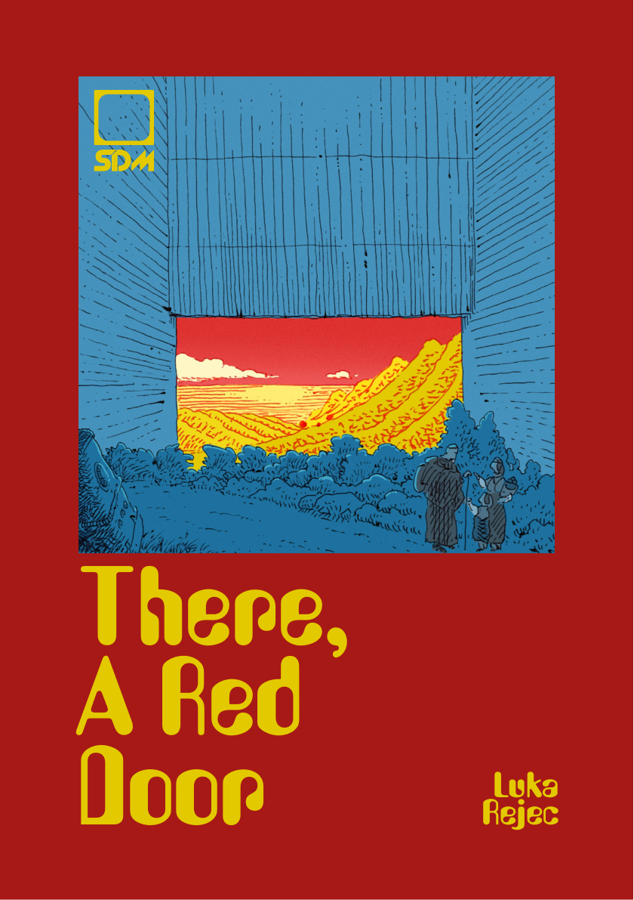
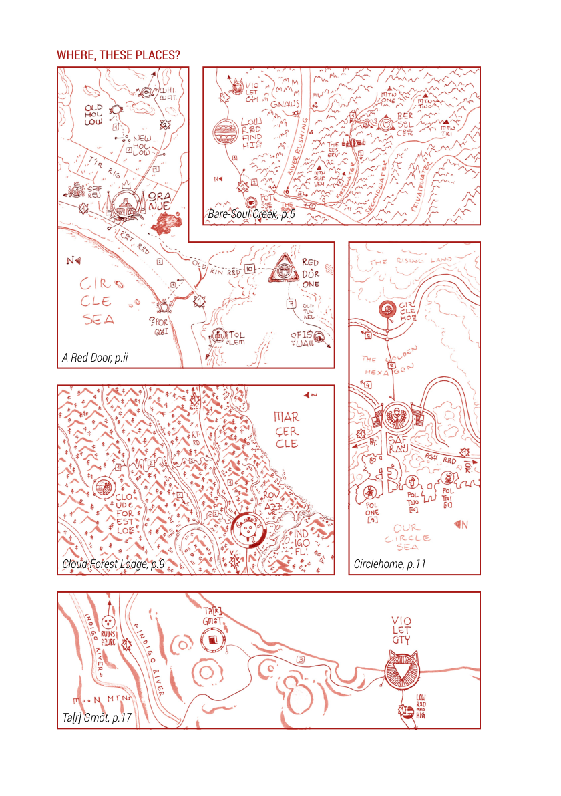
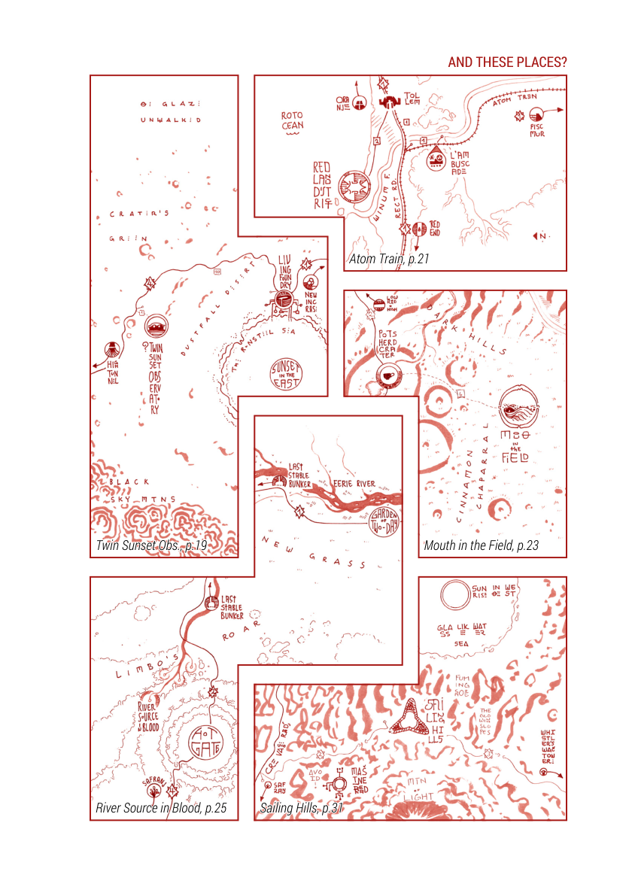

---
# Layout & Page Setup
layout: gruv_book_page_adapter
title: "There A Red Door"
subtitle: "v1.00 Brindisi"
description: "A Synthetic Dream Machine booklet."
published: true

# Book Metadata
author: "Luka Rejec"
date: 2023-07-28
image: /images/page_0001.png
series: "Synthetic Dream Machine"
volume: 0.2
genres: [rpg, ttrpg, fantasy, adventure, science-fantasy, setting]
version: "1.0"

# Custom Content
publisher: "Synthetic Dream Machine"
product_id: "There_A_Red_Door"
---

<!-- Begin: SDM-There_A_Red_Door_01_There_A_Red_Door_1-36 -->

# There, A Red Door

## Luka Rejec

## WHERE, THESE PLACES?

- _A Red Door, p.ii_
- **_Bare-Soul Creek, p.5_**
- **_Cloud Forest Lodge, p.9_**
- _Circlehome, p.11_
- _**Ta[r] Gmôt, p.17**_

Synthetic Dream Machine:
There, A Red Door

_16 things for your psychedelic
roleplaying adventure roadtrip_

Chromaprint ed v1.0 "Brindisi"
www.syntheticdreammachine.com

To all who are to come.

*

Heroes of the Stratometaship.
You know who you are.
You made this possible. Thank you.

July 2023

*

Copyright ©2023 Luka Rejec
All rights reserved.

No portion of this book may be reproduced in any form without written permission from the author, except as permitted by U.S. copyright law.

*

ISBN: 979-8-88756-069-4
Published by Exalted Funeral Press
www.exaltedfuneral.com
Printed in the USA

## CONTENTS

- Contents
  - [For the Sky is a Sea — 3](#page_0003)
  - [Bare-Soul Creek — 5](#page_0005)
  - [Impermissible Cleaver — 7](#page_0007)
  - [Cloud Forest Lodge — 9](#page_0009)
  - [Circlehome — 11](#page_0011)
  - [Chariot of the Divine Palace — 13](#page_0013)
  - [Ladder out of this World — 15](#page_0015)
  - [Ta[r] Gmôt — 17](#page_0017)
  - [Twin Sunset Observatory — 19](#page_0019)
  - [Ambush the Atom Train — 21](#page_0021)
  - [The Mouth in the Field — 23](#page_0023)
  - [The River Source in Blood — 25](#page_0025)
  - [Vegetable of Birth — 27](#page_0027)
  - [Air Whale Egg — 29](#page_0029)
  - [Sailing Hills — 31](#page_0031)
  - [There, a Red Door — xxxiv](#page_xxxiv)

THIS PAGE INTENTIONALLY LEFT BLANK

## FOR THE SKY IS A SEA

_Ritual Ascent into the Water Heavens_

**P:** 4 **R:** self  
**T:** ka-ba **D:** 1 dream

Take a spoonful of _yerba-levante_ with your _lesh-de-nuit_ and chant the six staircases of Sabo Reçu, the Hitchiker. Then, in your sleep, dream of the crystal ascender and make the sign of the Wind and the Green, and your dream idego\*, your spirit-second, will ascend to the Sea in the Sky. There, the painted ones will remove a burden from your soul and share one happy and one painful truth with you.

_Overcharge:_ Propel yourself, waking, body and soul and mind together, into the Water Heavens for as long as a dream takes to unwalk itself.

\*Idego: Combination of a sentient creature's mind and personality. A time-stamped, specific sentient instance. Its *ba* in some cultures.

THIS PAGE INTENTIONALLY LEFT BLANK

## BARE-SOUL CREEK

_West of the human, east of the angel._

"Alzate, levas en syêl te kôr-de-neum, rest-a'qi en kôr-du-sarq."

The words of the flesh shaman come heavy, like the strikes of a bili-stick on a plantation zombie's wired back. This is no place for mind-beasts, spirits, daemons, or angels. Here, even the human spirit sleeps, disconnected from the noösphere. This narrow valley below the three dead mountains was desecrated by Ill-Nano, the Chaos Dwarf, and now no digital soul can pass its threshold, no electric eye can peer within.

And within? Beasts shed their muzzles, humans lose their inhibitions, and they live as physical ghosts, relics of a long-lost time, before the soul was known and measured and sculpted and perfected. Simple creatures of simple lives and simple deaths.

THIS PAGE INTENTIONALLY LEFT BLANK

## IMPERMISSIBLE CLEAVER

_Dividing Reality Into Its Constituent Bodies_

**P:** 1 **R:** touch  
**T:** small object **D:** an hour

Use the protocols of the ten translations! Reach into the indivisible heart of a material object and break it. Release its creative force! Reveal the lie that is matter! Watch! Caress the object in your hand. See, it breaks down over an hour. First, it is weakened, then it fractures, finally it crumbles into aetheric dust!

_Overcharge:_ It collapses in but a minute and releases heat to burn and damage! (1 damage per round)

_Overcharge Again:_ It breaks down in a second! Explosion! Boom! Fragments! (1d6 damage to all nearby! Haha! Double to anyone next to the object!)

_Overcharge Yet Again:_ Faster than the eye can see! (3d6 damage to all nearby! Yes!)

_And Again:_ Boom! An eruption! Fire! Hole! The magitechnical fission makes a crater! (1d6 damage to far off targets, 8d6 to nearby, double to adjacent!)

_More Overcharge! More:_ The object breaks down in one 216,000th part of a second, and within a millisecond the fireball is tens of metres across. By 100 milliseconds, it measures hundreds of meters. Using dice to simulate damage is pointless. The crater glows with spell radiance for days, and the source codes of living creatures in the vicinity are corrupted for weeks or months after the spell's detonation.

THIS PAGE INTENTIONALLY LEFT BLANK

## CLOUD FOREST LODGE

_Across the decline from the auld airmaker._

"Here is the home of the pneuma," sighs the lodgemaster.

Contentment is a heady perfume in this air. A rich, soupy thickness to every breath. No wonder, for the great berg rising through the cloud-rich air is no mere wrinkle in the skin of the Given World. It is a builder berg, a made mountain. A geological machine that consumes the raw chondrite of the planet's crust and excretes it as rich, sweet nitrogen and oxygen and vapor and, yes, the rarefied pneuma of which souls are wrought.

"How can we stand here, so close to the builders' domain?" asks the visitor, uneasy as they gaze upon the immaculate carpet of green, that divine domain forbidden to mortal men.

"Would that I knew. A dispensation to our founder? A flaw in the phylakes' field?" the lodgemaster shrugs then looks pensive, "Yet there is a prophecy inscribed on a foundation stone of this lodge. A standardstone, untouchable by metal."

"A prophecy?" asks the visitor.

"Yes, that one day a tantamount will come and profane this lodge and then ... well, that part is missing."

THIS PAGE INTENTIONALLY LEFT BLANK

## CIRCLEHOME

_There, upon that yellow field, spheres are born._

The four-armed plantaspherist Imant Pendervaal greeted us warmly. We had booked the tour weeks in advance and the agency's daemon had vouched for our class and status. Not just any person can get a sphere-home grown on the field where the builders' own bubble-palaces were made.

These are not just any landcorals, as any petromancer worth their rocks (ha-ha) will tell you. Nurtured in coherence with the local archaic environmental noösphere, these circular colony landcorals are capable of generating new aerolithic jewels, creating homes that are light enough—once equipped with a few bladders—to remain suspended in the air. A perfect getaway home for a busy city. Once you are done with the plebs' wails, you simply float away to another burning fête, another lovely town.

A starter sphere-home can be yours for as little as €50,000, though we're talking much more _discreet_ sums if you want a proper bubble-palace.

THIS PAGE INTENTIONALLY LEFT BLANK

## CHARIOT OF THE DIVINE PALACE

_Volar's Rarefied Journey, Fireflight_

**P:** 6 **R:** a short walk  
**T:** two people **D:** an hour and an hour

Attune yourself to the fast star protocol! Shake your antennae at the sky like furious fists. Chant the chthonic coordinates! Summon the chariot of the divine palace! Behold! It comes, a flaming bolide, a star become a vessel! Less than an hour later it lands, like a fireball upon the land. That's 10d6 damage to anyone caught in its 30 meter blast radius. Speak its pass spell and enter. You and one other. Speak the red word. Chant the cosmic coordinates! Behold, it rises! Once again it becomes bolide. Again, a fireball to all those who crowd about its shipmetal hull. Prepare yourself. An hour passes. You approach a fast star.

_Overcharge:_ Chant the crisis protocol! It comes down now, now, now, atop your head. Run swift, lest it blasts you as it lands!

THIS PAGE INTENTIONALLY LEFT BLANK

## LADDER OUT OF THIS WORLD

_A Heaven's Gate_

An artifact for the agents divine, a shortcut ladder. At one end is an anchored portal, at the other a point of stillness.

Make the gesture of immobility and press the button first, and the ladder stands motionless ... its still end fixed.

Climb the ladder to the other end, make the gesture of the gate and press the button second. The ladder shall ask you in the ancient tongue whether you would accept its spiritual biscuit and you must say that yes, you accept its spiritual biscuit, but only its functional spiritual biscuit, not its propaganda spiritual biscuit. Next, it shall ask you for a small token of your life force. Agree that you are willing and say yes, you accept the risks to your body and soul of your own free will. Thereupon the ladder's anchored portal will activate and you may climb through into its pre-determined wormway!

Please remember to pull the ladder in along behind yourself.

(5m ladder, 5 stones)
.stillness {activate: button; duration: 1 hour; extend-duration: 1 life per hour;}
.portal {activate: 1d6 life; capacity: 1; speed: 1 hour; island: 5m radius;}

THIS PAGE INTENTIONALLY LEFT BLANK

## TA[R] GMÔT

_The early entity, the mass of there._

"What is it made of?" breathed Chiod.

"You can touch it ... this isn't a deadly aberract," urged Dengu with a faint curl to his lip.

"Like glass. No ... smoother. But it's rough and pitted, worn. Here," she trailed her hand along the dumb object's discolored side, "This looks like lazar scorch, and there, that pitting, that's a ... a blue god blast."

"And yet, you can't feel a thing. Smoother than smooth, as though it's not there," approved Dengu.

"But it's here! I can see it, I can feel its electromagnetic pull, I can feel the weak and strong forces battling within. Though something is wrong ..."

"The arrow of Chronos is absent. It does not sail."

"You mean ..."

"It is timeless."

Chiod stepped back and gazed at the silent intruder. The worn, blasted stump. An anchor outside of time.

"I feel ... small," she admitted.

"I think that might be its purpose. That is what the local priests say." Dengu walked up to the outsider and patted its nonreactive substance, "A little reminder from the Maker that this world was not made for us. Not really."

"Or the gods," whispered Chiod.

"Hush now! Don't blaspheme," chuckled Dengu. But nervously made the sign of the good wheel.

THIS PAGE INTENTIONALLY LEFT BLANK

## TWIN SUNSET OBSERVATORY

_Where Crater's Green fades into the Dustfall._

Once, there were many tourists. Many visitors. They took joy in the sunsets, when Big Sun dipped into the Desert Morning and Little Sun sank bubbling into the Runsteel Sea. They waited for the flashes of strange color and the alien rainbows as the light of two great celestial lamps refracted and reflected through the metallic vapors as the Little Sun's heat broke the skin of the runsteel and set the metal boiling once more.

Ah, that was a time of feast. So much joy, so many good vibrations to skim and store and suck and enjoy. Lifetimes of happiness every day.

Now she could replay those pleasures to herself, but it was not the same. She knew it was but a puppet show, shadows in Platter's Cave.

Sometimes she wondered where all those lovely happy tourists had gone. The chubby, porcine children so keen to slurp the cold soma jellies that kept them cool in the overheated air. The harried nanny synthetics, tagged with graffiti and frayed as they tried to save status for a real body. The content and glistening parents, chosen for procreation by their birth and life lotteries. She had loved the parents most, as they snuck away to the private observatories, to pretend they were young and unobserved once more. Their little joys and quick deaths, ah those had been food for her joy engines.

Now those fires banked low and she had to run her mind sloth-slow, barely better than one of those tourists had been. She, who had piloted seed ships through deep dreaming voids, now had to content herself with the slow life of a desert farmer, tied to the routines of the suns and the trickle of her solar energy fields.

The Observatory sighed to herself. No sense dwelling on the past. Perhaps the tourists would come again. Perhaps some other visitors.

As she did every sunset, she gave the nod to Recorder and Promoter. The two daemon subroutines set to work, packaging the new double sunset and sending another tempting advertising lure into the tatters of this slow noösphere to find dreams and kindle visions.

THIS PAGE INTENTIONALLY LEFT BLANK

## AMBUSH THE ATOM TRAIN

_Out where the firemary grows under the Cinderblock Cones._

We used a deadspace engine to block the electric eyes. They wouldn't know it wasn't just a flicker, just some glitch. The Ill Nano's been mighty active of late, painting broken data fountains on the sky. One more fracture, not big enough to bother.

But enough for us rats. We snuck through.

Up, scamper-quick, neutral suits and heat sinks through the firemary. Then to wait for the atom train. Ready grapplers, ready buffer harnesses. Boom! Rattle. It goes whooshwhoosh at 160 klicks per hour, but the harness takes the blow.

_1-in-6; poor Hermes, tossed him between two wagons, there, smart rodent, dropped his bili-stick._ _Better lose a limb than lose a life, as the machine folk say._

Here we are now. Sniff, sniff. The atom train's just as usual. Feeling safe and easy in the metal angels' realm.

1. The driver's got a battlechair, I know.
2. There's the patrol-manx. Watch that cat, it's got nine lives. But Dagi got some kibble for that xeno. Keep it fed, keep it quiet.
3. In the travel car there's folks that can afford the atom train. Means they can afford the better bodies. Skip skip, hop around.
4. Pleasure car. Just the golem. She'll fold to a sudo-override.
5. Treasure car. Now we're talking. Quick, sleep soma on the guardinal. That cog-monk will be packing, but some blue prayer will see them dreaming.
6. End, the second engine. There's a glower there. There always is.

Quick and easy, now, come on Charnel, come on Aphrodite. Down the roof we glide, shadows to the looking sky. Pop the windows, hop the vent. Hermes at the door.

Thunk, thunk, thunk ... skush.

Skush? Something wrong, window didn't pop. There's the cog-monk, turning fast. Noticed Aphrodite, Charnel was too slow. Rattlechain fingers looping out, engineered to turn meat to mince.

_Quick, quick, make a choice: all for one and risk we fail (1-in-3), or kick the gal and the cog-monk,_ _too? A dirty win, a sad memorial ... but maybe the treasure comes with some new body for the_ _pretty one?_

THIS PAGE INTENTIONALLY LEFT BLANK

## THE MOUTH IN THE FIELD

_Where Dark Hills become Cinnabar Chaparral._

We thought it was a fissure. We all did, I swear. I called out to Matthieu, "Hark, colleague, halt your beast, for there ... a crack, a Pluto's trap!" Did I not call so, Matthieu?

Augh. Matthieu, Matthieu. My colleague's tongue is lost. Yes, and jaw too. See? This is all I have now of his skull, stored in a pickle field. Wonderful magic, the pickle field. I trust there'll be enough of _him_ left when I get back to the anthropofact. Lovely colleague. Trustworthy. Barely any conflicts over students and dining arrangements and the division of the cabinet. Lovely place, the Good University, but small cabinets. Anyway, Matthieu doesn't want to talk right now. See? I tap the vocalizer device, but Matthieu is silent. Sulking I suppose.

Anyhow, we came to its edge, the fissure we thought, and then it opened and belched forth a furious salvo of noxious breath! Oh, I saw a passenger pigeon keel over in mid flight, and dear Delilah, my good horse, such a fright, she broke her leg.

It spoke in a giant's voice, uttering nonsense. Something like, "Ha, Dulcet! Net's that sow, oats. Ha, dull. Pal, pal, go that." On and on like that. Just permutating the same twelve syllables over and over. Perhaps it was some kind of code, yes. But we had no time to find out, no desire to enter. After all, a ruddy great maw opens, and what will you do?

I escaped on Matthieu's horse. It had thrown him, you see, and well, mine had a broken leg. Poor Delilah. Matthieu, _he_ crawled to the edge of the mouth! I don't know what came over him. I saw the mouth slurp up towards him and him screaming nonsense back at it. I just knew he must have taken a madness. So, yes, I unslung my razor gun. I thought I'd frighten the mouth, make it stop. Save Matthieu. Alas.

I am no gunsman, you see. Oh, I tried to save his body, I did! Oh, I know how it looks, but the razor, well cut him right through the neck and jaw. So I grabbed Matthieu's poor head. Staring at me, so desperate. Not accusing at all, no. Just such fear! I couldn't bear to look so I wrapped him in a terry blanket and put him in the saddle bag. I rode as fast as I could and got back to the little outpost in but three days. That's where I got the pickle field.

It's not too late, is it? There won't be personality damage? Oh, it would be so hard for my colleague to keep up with his university duties if there was damage. He needs his mind all intact! See, his eye, it flaps all furious. He agrees!

THIS PAGE INTENTIONALLY LEFT BLANK

## THE RIVER SOURCE IN BLOOD

_Here Limbo's Roar is silenced in a valley of uneasy form._

All manner of strange life crawled out of the Hot Gate while that machine ran alone. Ominous wheels, air-sucking bellowers, light-melting mirrocles, slithering earthbreakers. All manner. Most of it died quickly enough. Left the mile-thick compacted corpse layer. Turning fossil as the archaeocrats and prospector-tourists watch.

Not so the sanguine layer-lichen. Oh, it's nothing to do with liches, no no. Not leeches either, though it sounds tricky alike. It's some kind of triploid symbiote. Draws energy from the spatial distortion around the Hot Gate. Quite trapped, but so well adapted to its location. Building up mesas, it is. And, fortunately, it's not too toxic. But it does emit a red protein slurry. Effluvium. A nasty thing to us ordinary humans. But to biomancers? Oh, it's raw life. Sure, it makes for odd mutations, but a barrel of this stuff properly refined ... that, it'll fetch a ten-cattle price.

—Hiyero adu Tehero, limbon nomad clan elder, _Senougho's Thousand-Day Walk_

THIS PAGE INTENTIONALLY LEFT BLANK

## VEGETABLE OF BIRTH

_Phytohysterical Genesis, Leek of Life_

**P:** 5 **R:** touch  
**T:** a leek and a creature seed **D:** 50 + 1d100 days

You take a well-treated leek and _imbue\*_ it with the formulated spell. Next, take a prepared creature seed and implant it in the leek. Behold, the leek will grow to immense size and girth. Then, at its allotted time, it shall split, and a full-grown adult creature will emerge!

_Overcharge:_ It grows to maturity in 2d8 days.

**\*Note:** You may regain any life _imbued_ in the leek after the spell ends.

THIS PAGE INTENTIONALLY LEFT BLANK

## AIR WHALE EGG

_Child of a sentient species._

"It is enormous!" exclaimed Velon.

"Yes, nearly ready to pop and take off," said Mocho. "Don't they normally plant them on aeroliths?" "True, but not many aeroliths this season." "Ah. The sky hook." "Yes. The Iron Wizard's plan to build a navy to challenge the charioteers seems like it will bear fruit."

A pink mushroom cloud rises on the horizon. Then comes the shockwave.

"Excellent. The chimist has triggered the plankton bloom. Now we just wait for the air whales to detect it." Distant thunder. Flashes of sentient lightning.

"That's the whales?"

"Yes. The distraction is working. Start unloading the drill. We'll tap this small one. We probably have enough time to draw five, seven barrels." Velon paused while unloading the diamond-tipped drill. A thought had wormed its way through. "Uh, Mocho, aren't air whales protected?" he asked. "Yes, of course." "And their eggs are protected, too?" "Yes, but you don't see anyone protecting them right now, do you? Don't worry. We won't get into any trouble." Velon thought a bit more. Slow and deliberate. "But will the babies get into trouble?" "The babies?" Mocho spluttered. "Yeah, the air whale babies. Won't they get into trouble if we drill their eggs?" "Oh, no no. They'll be fine. They'll get new eggs. They're like hermit crabs at this stage. Swapping eggs," Mocho improvised desperately. "Oh, all right then. I'd feel terrible if we were hurting air whale babies. They're so cute with their iridescent bubble shells and diaphanous energy wings."

_A barrel of air whale amniotic fluid sells for €150._

THIS PAGE INTENTIONALLY LEFT BLANK

## SAILING HILLS

_Not to be confused with sailing islands._
These aerolithic formations are quite common in the east. The Little Sun's specific energies break down the minerals transformed by ancient portal fields to generate aerolithic vapors. As the Little Sun sets, the rising vapors cool and precipitate as sky sand. On its next revolution, the Little Sun melts the sand, creating the coarse aerial glass known as solarite.

These floating, glassy hills, twinkling in the sky, give the Mountains of Light part of their name. The other part, of course, comes from the local volcanic activity.

Sailing hills are rare in the Ultraviolet Grasslands due to the stuckforce disaster that closed that region to aerial travel.

THIS PAGE INTENTIONALLY LEFT BLANK

## AND THESE PLACES?

- Twin Sunset Obs., p.19
- Mouth in the Field, p.23
- Sailing Hills, p.31
- Atom Train, p.21
- River Source in Blood, p.25

## THERE, A RED DOOR

_It opens once a decade that we may see if Heaven has returned._

Mudri dons the traditional ragged robes of the wastelands. His pack, crude and heavy, lacks the fine old technology that they, the Maintainers, keep alive in their hollow town. His translucent skin is painted with the melanin dyes that will protect him from the fierce astral furnaces that burn the surface of Once-Heaven.

His family, his genetic offspring, come to wish him well. If he is successful, he will return with first-hand knowledge of the state of Once-Heaven. If he is fortunate, the purification will go well and he may return to the Red Door, spending his life in a hermetic field-suit, surrounded by children and grandchildren.
