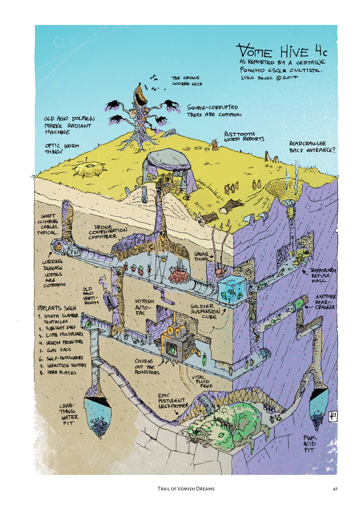
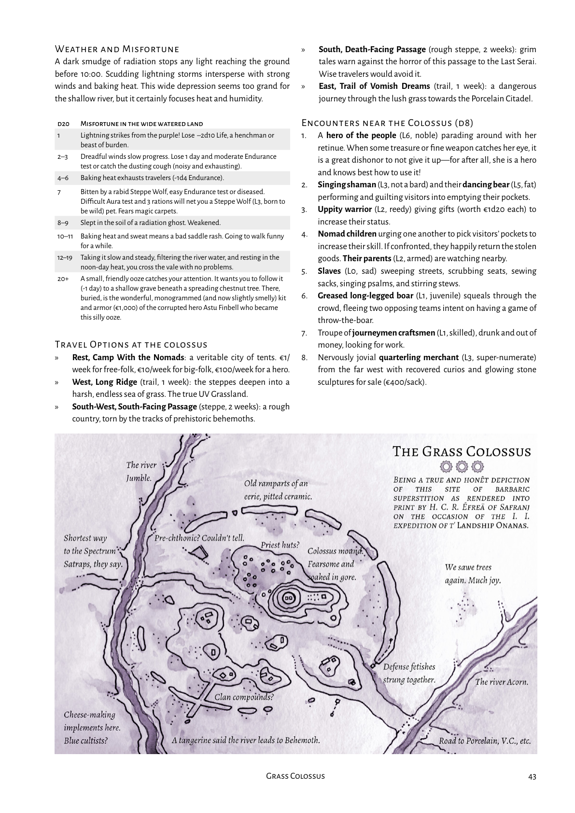

<!-- Page 5 -->

# The Grasslands

> [@UVG_Black_City_2e, _p._ _5_]

<!-- Page 6 -->

## The Grand Map

A world begins when it emerges from the mists of time. So it is with the civilizations of the Rainbowlands—which mark their count from when the Long Ago ended and the Now began.

The Rainbowlanders are the humans of a later era, undisputed masters of the fertile lands around the Circle Sea, dwellers in the Eye of Creation. They come in many shapes, colors, creeds, and faiths.

They pile unkempt technology and misremembered lore together into a teetering whole. They rule the settled lands under their polychrome deities of ill-repute.

This story is not theirs. This story begins at the edge of their world, at the Left End of the Right Road. At the westernmost outpost of humanity, the Violet City: bastion against the hordes, entrepôt to the exotic sunset lands, and last port of civilization before the trackless steppe studded with the detritus of the Long Ago. The last glimmer of the Rainbow before the skin-blistering glow of the Ultraviolet Grasslands.

The map of the Grasslands is incomplete. It depicts prominent locations, but leaves out the discoveries a wanderer may make on their long strange trip. This is intentional. The map is an artifact for the players to fill with their discoveries, routes, and experiences. Print out a copy, share it, transform it, make it your own.

**Legend**

- Destination and chapter reference.
- Trail between destinations and travel time in weeks.
- Terrain features.
- Draw discoveries, routes, and travel times as you play. Use unfilled diamonds to list time in days. Split distances with intersection pins.
- Draw on the map. Expand it. Make it your own.

> [@UVG_Black_City_2e, _p._ _6_]

<!-- Page 7 -->

The Grand Map 1/5

> [@UVG_Black_City_2e, _p._ _7_]

<!-- Page 8 -->

The Grand Map 2/5

> [@UVG_Black_City_2e, _p._ _8_]

<!-- Page 9 -->

The Grand Map 3/5

> [@UVG_Black_City_2e, _p._ _9_]

<!-- Page 10 -->

The Grand Map 4/5

> [@UVG_Black_City_2e, _p._ _10_]

<!-- Page 11 -->

The Grand Map 5/5

> [@UVG_Black_City_2e, _p._ _11_]

<!-- Page 12 -->

## Violet City

> [@UVG_Black_City_2e, _p._ _12_]

<!-- Page 13 -->

“Outside in the cold distance a wild cat did growl. Two riders were approaching and the wind began to howl.”
— _All Along the Watchtower_, Jimi Hendrix (after Bob Dylan)

This is the end of the Right Road. Humanity’s dominions wind down in the purple haze that wreathes the sunrises of this western reach. No roads, but caravans brave the Ultraviolet Grassland into the eternal sunset of the Black City. Porcelain Princes and Spectrum Satraps oversee great herds of biomechanical burdenbeasts that bring the odd fruits, black light lotus, indigo ivories, rainbow silks, and sanguine porcelains popular among the meritocrats of the Rainbow Lands. Many voyagers are taken by the vomes but nobody likes to talk of those lost to the ultras.

The Violet City is a place of trade, luxury, magic and poverty. The thralls of the cat lords keep a veneer of order, barely hiding the feline sneers at the rules of Metropolitan bean counters and inquisitors.

### Weather and Misfortune

The sun rises through a violet haze, slowly, reluctant to give up the shimmering phantoms of predawn to the dusty day. A salt tang drifts from the Circle Sea to the east. The humidity promises storms that rarely come.

d20 Misfortune around the Violet City:

| d20 | Misfortune |
|---:|---|
| 1 | Got the runny blues, a depressive digestive disorder. Makes one rather disagreeable company. |
| 2 | Picked up tendril tapeworms. Endurance reduced. |
| 3 | Got an infected sore on the muddy road. Ouch. |
| 4 | Pickpocket attack, lost something precious. |
| 5 | Fell in love with a swamp wisp and lost a day gazing at flowers. |
| 6 | Nice shoes ruined in a deceptive bog. |
| 7 | Woke up sore but well fed, with €5 in your pocket and a letter of gratitude from a cat lord for services rendered. Four days are missing from your memory. Probably nothing serious? |
| 8–19 | The voyage was dull and mind-numbing, the landscape dominated by cat coffee plantations and Bluelander peasant small-holdings. Could have been worse. But how? |
| 20+ | Acquired five stone of cat coffee (€1,000) after regaling a cat lord with some lovely stories! |

### Travel Options

- **Rest, Exile Camp:** €5/week to stay in the Bluelander camp growing into a slum.
- **Inside the High Walls, Townships of the Violet City** (safe city, a few hours): administered by the noble cats of the Violet Citadel for the good of the no-good travelers visiting their palace of knowledge, learning and sanctimony.
- **West, the Low Road and the High** (trail, 1 week): both roads are rutted jokes leading to the Porcelain Citadel, the neutral hole at the edge of a sprawling vome territory.
- **West, Steppe of the Lime Nomads** (steppe, 2 weeks): flocks of cat-eared sheep and the odd transplanted Limey Nomad clan make this area of the Ultraviolet Grassland relatively civil.
- There are no trails and the journey is slow.
- **North-East, The Right Road** (road, 2 weeks): back to the Rainbowlands via the devastated Blue Land. A place for heroes to retire, beyond the bounds of the UVG.

### Encounters in the Violet Lands (d6)

1. A **many-tentacled avatar of the Dead God** (L7, bellowing) summoned by reckless cultists. It is rapidly decomposing into a sticky yellowish mass.
2. **Bluelander degenerates** (L2, stalking), bent and bestial, with dull eyes and a gnawing hunger for entrails.
3. Armed **Bluelander peasants** (L1, proud) proudly proclaiming they are Violetlanders.
4. **Troop of monkeys** gorging on ripe coffee berries.
5. Purple-and-teal litter bearing a **cat lord** (L1, grinning) and its small retinue.
6. **Right Road inspection detail** (L3, law-and-order) seconded from Metropolis to keep the roads open.

> [@UVG_Black_City_2e, _p._ _13_]

<!-- Page 14 -->

**In the Halls of the Graceful Cats**

“ _Soyez tranquil,_ ” murmurs the dead-eyed lady in the voyagers’ minds. Horned cats creep from hazy alleys and examine their baggage.

The citadel looms, eerie and obnoxious, beyond the haze. A black cat nods, the lady steps aside. The townships beckon and the party strides into the stall-strewn streets.

**Cats, cats, cats**

Cats are exalted within the Violet City. Some (or all?) among them are actually cat lords, a different species with little human hands and terrifying telepathic (?) abilities, which they use to control their human thralls. The Violet City humans all disagree, claiming they are the actual masters and the cats merely pets.

- **Horned Cats** (L1, feline) silently monitor the townships around the Violet Citadel and all the townsfolk treat them with great kindness and respect.
- **Black Cats** (L2, venom tail) with silver tongues and serpent tails. The mistresses of the townships.
- **Bad Cats** (L3, half-mythical) are half-glass, walk through corners and curse with a purr. So they say.

**Meet in the Street (d6)**

1. Green-blood **shock-peddler Mencia** pays (€1d10 x 100) for tales and pictures of the “Wonders of the West” (double for well-written, illustrated accounts).
2. **Woger de R.F.D.**, a mustachioed free-merchant, is sending a free caravan of vampire wines and livingstone bricks to the Last Serai to trade directly with the Spectrum Satraps. He’s hiring caravan guards (€100/guard on safe arrival at the Serai).
3. **Natega the Kind** sells original ointments, shoddy shoes, and downright dangerous gear at reasonable prices, but her red cat meows _Charm Person_ at travelers. Will her supplies let you down when you need them most? At this price, who cares?
4. A **scared urchin** runs into the street shouting, “A cat tried to squirm into my mouth!” She will integrate into society and become a cat-pet soon. Her name is Uda, for now.
5. A **sunburned man** with pink hair staggers out of an inn, cruelly stabbed, sprays crimson bubbles and groans “A behemoth’s pearl for dear Cubina.” He clutches a curiously good map to Behemoth’s Shell far to the west. If healed, his name is **Vorgo** and he makes a shifty, cowardly, but loyally incompetent henchman. Who stabbed him? It was dark, he was drunk. The potential for a sidetrack is here.
6. In Charming Square, carriages cram into a meowing mob as confiscated traveler dogs are thrown into **pit fights** against trained sewer rats. Bookies take bets and the odds seem good, perhaps too good. Saving a lucky dog costs €1d6 x 50. Cheering the dogs draws glares from cat lords and their people.

## Who Would Hurt Vorgo?

This sidetrack is one way an investigation into Vorgo’s assailants _could_ play out. Treat it as an idea seed for your own UVG investigations.

Vorgo is healed and he snuffles mawkishly, “She’s a beauty, she is, and her father a chief; she says. A pearl is the bride gift he asks, she says, a pearl chiseled from a Behemoth’s oyster parasite. So here I am, with my chisel and hangover, ready to enlist with the Princes as far as the Serai, then on to the Behemoth ... I’ll manage somehow.”

1. In Vorgo’s wound, a sliver of silver. Does he smell of wild beast? Well, there’s definitely a whiff of wet fur.
2. Street urchins and cabbagewives would say he’d come to the township with a dog cage, but where is the dog?
3. Would the Satraps stab somebody just to stop them from reaching their territory?
4. None of the cat people seem to care much about Vorgo’s map to Behemoth Shell, they treat it as a joke.
5. If pressed, the folks will ask, “Why go there? Only death and blindness await in that grassland.”
6. Pushed further, they’ll mutter about mutilated travelers in the Rue des Oiseaux et Morgues. Cat-folk will become more hostile, demanding why all this effort for a non-feline.
7. At this point **violet detectives** (L2, educated, physick) with fine **white cats** (L3, aristocratic, vicious) start asking probing questions of strangers poking whiskers in their jurisdiction.
8. After all, the bodies were just travelers, hardly citizens. But foreigners bothering the cat folk?
9. Yes, the doctor of mortices may have noticed the odd, parallel daggers used to mutilate the bodies.
10. Could those have been teeth or claws? Hah, only if someone had teeth like daggers!

Here, the trail would go cold (for now), nothing to indicate that any fantasy of vomes and ultra possession could have any basis in fact.

**Vorgo the Were-Pug** (L1, lycanthrope, short of breath) is shifty, cowardly, and foolishly loyal. If the truth is out, he also turns into a pug. In pug-form his combat and breathing remain terrible, though he gains a keen sense of smell, bug eyes, and lycanthropic regeneration. In either form,

Vorgo is allergic to silver, oranges, and endurance sports. Is he possessed by a **vomish scout beetle** (L5, brain-burrowing, radio-telepathic)?

> [@UVG_Black_City_2e, _p._ _14_]

<!-- Page 15 -->

### Highwaymen or Potential Henchmen (d12)

The Warlock rolled her eyes. Another useless lout. At least they would be done soon. If their ‘hero’ didn’t accidentally stab another would-be guard while ‘testing’ their mettle.

Henchmen can become new heroes when existing heroes bite the dust. Let players roll the henchmen’s ability scores as required.

Henchmen are paid wages weekly.

1. **Migo the Dark** (L1, feline) and his pet **Jor leu-Gro** (L1, tough, slow). Curious, interested in new sights, a bit cowardly, master of the _Minor Illusion_. €100.
2. **Lea the Fluffy** (L3, feline), bad cat on hard times. Needs a pet. Friendly but very lazy, prone to misrepresenting the truth. Purr curse: _Terribly Itchy Armpits_ (difficult test). €60.
3. **Sim Cadmium** (L1, tracker, ranger), a lesser Doghead with a raspy, mysterious voice, hood, and a doleful past. €70.
4. **Merenk-Zero Running** (L1, flexible), escaped polybody drone rediscovering her identity, neuroparticipation chip scars still visible under ash-white hair. Fast learner. €40.
5. **Obritish Krat** (L1, golem-whisperer), a diesel-chugging Dwarf, with burned beard and haunted eyes, talking of wire-ghouls in a salt mine far to the east. Good with machines. €50.
6. **Malikraut Koza** (L1, rustler, goatherder), a short Orangelander with a penchant for poetry, puffery, pomp, and a bit of the old ultraviolence. Good with sneak attacks. €35.
7. **Glim** (L2, executioner), silent stranger in robes of odd refinement. Rumors of murderous barbaric past and inquisitor training. Iron-minded. €25.
8. **Od Broyden** (L1, merchant, lush), scion of a Lesser Vintner house scouting new markets and making a name. Can haggle like nobody’s business. €99.
9. **Vigo Brastec** (L1, student of the dead), a hunter of rogue post-mortem laborers and currently wanted for certain undisclosed affairs back east. Skilled in combat with the dead. €20.
10. **Laud ah-Num** (L2, fashionista), dilettante from Emerald City out to find the finest lotus. May be loaded or really poor, dresses in dandy clothes at all times (intense fashion sense increases his apparent net worth ten-fold). €60.
11. **Zika** (L1, berserker), a young un’, wild eyed. Not possessed by an ultra ghost. Totally vicious in unarmed melee combat. €5.
12. **Lolar’ de-Bruno** (L2, soldier bear), half-savage ex-turnip farmer from the Greenland frontier with a bearskin coat and a flute. Probably not a werebear. €10.

### Last Chair Salon

(1 day, 30 xp) A day’s journey west of the Violet City the coffee plantations give way to scrubby uplands. The city claims them, but it is the coin-shamans of the Aqua and Cerulean semi-nomadic clans who are paid to defend them from vomes. The Last Chair mesa stands at the crossroads of the Low Road and the High. Its flanks, deeply grooved with the visages of scaled kings from a neo-ophidian age, divide the southern way of shattered viaducts to the Porcelain Citadel from the leisurely beast trails wending north into the vast grasslands of the Lime Nomads.

Atop the robin egg blue walls of some Long Ago fort or tower rises the **Last Chair Salon**, operated by **Marsa Vinoble** (L3, sharp and shallow), scion of a long line of seditious Yellowlander exiles. The Last Chair is the last place to stock up on _yellow beer_ (€200/keg), felix whizz and cat coffee and the first place to hear new rumors from the Rainbowlands. The local rancher-riders pay decent prices, tourists pay double. The pastorales hate the tough business-heroine who sells Violet City drugs to their children. She claims it is her free market right.

It’s a secret, barely kept, that a **vome nest-mother** (L6, fecund) is kept in the cellar, hooked up to a fermentation golem to produce the yellow beer.

Regular: €70 and a felix whizz addiction or a metallic buzzing visitor in the ear promising redemption, 80 xp.

> [@UVG_Black_City_2e, _p._ _15_]

<!-- Page 16 -->

## Civilized Debauchery in Shades of Purple

### Carousing

Carousing helps treasure go away. There are two steps. First, a PC arrives in a large enough settlement where they can blow €1d6 × 100 on a week of hard partying and gain that amount of xp (it’s an exploding die). Then the player rolls on the relevant carousing table to see what happened. If they can’t cover their debt, they roll with a penalty. Simple, eh? Use hero dice and charisma to roll 20+.

**d20 — Roll Charisma to Carouse in the Violet City: “Fun, Fun, Fun”**

| d20 | Result |
|---:|---|
| 1 | Kicked out of town as a dirty dog. No xp gained and a “reputation.” Also, a case of canine cooties or lycanthropy. |
| 2 | The odd fruits were odder than usual. Roll d6: grow an extra (1) ear, (2) nose, (3) winkle, (4) pearl, (5) tentacle, (6) cat. |
| 3 | Addicted to cat snip (€50/week). Going without makes a person disagreeable and unappealing. Cure takes 1d6 weeks (€100/week). |
| 4 | That cheap black light lotus? You now phosphoresce in ultraviolet light. UV creatures have an advantage against you. |
| 5 | Ingested a magic cat spirit and became a cat pet. Your hero is enthralled by your new character: a horned cat named **Twinklestar** (L1, feline). The ambitious sixteen-year-old cat seeks the _Rat Rod of Immor[t]ality_. Powers: _Purr of Power_. Spells: _Hold Portal_. Weaknesses: dogs, balls of yarn, thunder. |
| 6 | Got into a staring match with an Eyebiter. Lost an eye. |
| 7 | Found the anthropic fighting pits. Reduced to 1/2 Life. Succeed testing Strength to win €1d4 × 100. |
| 8 | Met **Herrie Tree** (L3, wannabe doctor), a local cad, necroambulist and procurer of fine work-corpses for the CAT construction company. Loan shark to the corpse-to-be. Fancy a body-snatching gig? |
| 9–10 | The party was as it should be. Awake weak with a hangover. |
| 11–12 | Your table dancing routine is the talk of the Townships. |
| 13 | Wake with a bag of strangled cats drained of blood, a hundred ominous pieces of silver (€100), and a sense of foreboding. Hours later (roll d6) an (1) inn, (2) cat house, (3) opera shack, (4) general store, (5) political café, or (6) mansion collapses in a whisper of necrotic decay. |
| 14–19 | You’re known as a good sort in the Township fleshpots. |
| 20–24 | Acquired a whole cart of bananas (8 sacks at €50/sack). And a surprisingly intelligent ape named **Ananas** (L1, accountant). |
| 25+ | Wake with a splitting headache. Touching your forehead you discover a new, invisible third eye. Your aura is permanently amplified. Perhaps you have even found some wisdom. |

The heroes went to the Grasslands and returned. It’s time to party like civilized people, learn some new tricks and empty some wallets.

“_Voi, pâle-couleur, pren an-tour!_” shouts the tout in pasty Purple patois. Others chime in, mottled capes flutter, papiér panels advertise “_the last partie before lanotte_.” Lips smack. The plebe churls crowd in to sell good times, forgetting, or just steppe-style rat sausage surprise.

“Beware,” hisses the Warlock, “this place lives on broken dreams and thoughtless greed.”

Poncho nods. The crowd swirls. The Hero is gone. Poncho and the Warlock exchange looks. This would end badly.

“ _Lefruis! Lefruis! Pâle-cou, ven et scupper a new raison and eater!_ ” sings the dancer before the fruit bar. Was that where the Hero went?

> [@UVG_Black_City_2e, _p._ _16_]

<!-- Page 17 -->

## Drugs in a Purple Haze

The hero stumbled into a shrine garden and vomited copiously over the frog altar. Luminous animalcules burst into song and dance. He stared. Satisfied spirits or hallucination, he knew not.

Drugs are an experience. PCs gain 1d6 x 10 xp when trying a new one. Tracking durations is annoying. Most effects last a few hours. Characters test after every encounter to see if they wore off.

**Fun-time Violet City drugs (d8)**

| d8 | Drug | Effect | Cost | Notes |
|---:|---|---|---:|---|
| 1 | **Black Light Lotus** | Glows in the dark and cats love it. Eaten, it cures mental afflictions for a week. Smoked, it brings deep sleep and restores 1d6 Life. Smeared on skin it exudes mind-altering pheromones, increasing appeal for a day. | €50 |  |
| 2 | **Cat Coffee** | Narcotic made from black cat droppings. A pot of the fragrant stuff induces sleep and restores lost mental attributes. | €20 |  |
| 3 | **Cat Snip** / **Hops Puff** | Powdered puff mushroom. Brings euphoria and 2 bonus actions. | €50 | _Addictive_ (easy test). Run out: grouchy and unfriendly. |
| 4 | **Dog’s Tail** / **Wizard’s Bone** | Chew root used to boost concentration. Popular with students of magic cramming for cognitive capacity tests. | €75 |  |
| 5 | **Felix Whizz** | Popular energy drink. A cup grants temporary Life, but makes the drinker a little annoying. | €10 | _Weakly Addictive_ (trivial test). Run out: the whizz-face feels pissy, grouchy, and unfocused. |
| 6 | **Purple Haze** | Toke of choice for manly men. The aromatized “_essensa de mors_” numbs pain and emotions. A long spliff helps with pain, grief, fear, and hurt, but makes one slow and weak-willed. | €20 | _Weakly Addictive_ (trivial test). Run out: cotton mouth, brain fog. |
| 7 | **Ultra Jay** | Crystal needles of a fabulous UV bird. Inserted, they make one the talk of any party, but clumsy. | €250 |  |
| 8 | **Whiskers** / **Ticklers** | Expand the mind, increase perception, cause a weak levitation effect and reduced coordination. | €100 | _Addictive_ (easy test). Run out: tremors. |

### But drugs are bad, m’kay

When a hero takes an addictive drug they make a test. **If they fail,**

**they’re hooked**. The player adds the addiction and a drug supply tracker to their hero’s character sheet with a pen. When the hero runs out, they have to make a very difficult test weekly. Once they fail, they suffer until they get a hit again.

**Curing Addiction** takes a long time. Roleplay the struggle or use _Cure Disease_. There are no rules beyond that. It’s hard, figure it out. Though cured the hero has sipped at the teat of transcendence and a fresh taste of the _Milk of M’le Maiku_ (or whatever it was they were hooked on) restarts the addiction.

**Long-term health effects** tend to be harsh and lethal, but so are monsters. You can usually ignore the long-term in a roleplaying game. Heroes die.

## The Last Gastrognome

The Warlock and Poncho sat on the bench-gargoyle munching their sandwiches. The lithic ornamental sighed and hoovered crumbs. It was going to be another one of those days.

Like drugs, fine (or odd) dining is an experience for PCs. It’s less hazardous, if more time-consuming. After a week, they become a regular and gain xp. The cost is in addition to living expenses.

**Township dining establishments (d6)**

1. **Pér Slaji:** the grimmest dining experience in the township. Trivial Endurance tests are _de rigueur_, advantage finding cads, cutpads, and pursenapes. Regular: €1, poisoned by Pér, 50 xp.
2. **Shéh Shah:** premium water-pipe and cat café, hub of a feline franchise stretching from the RLD (Red Land District, the independent hyper-capitalist province of the Red Land run by worker-led crime syndicates) to the Porcelain Citadel. Cool cats get good drugs here, dopey dogs not welcome. Regular: €10, get a gig with the Purple Hazer body snatchers, 50 xp.
3. **Le Pesquemanceur:** Seka the Summoner is the sharpest shark slicer south of Azure. Won’t find a better source of black market fishing scrolls and amulets. Regular: €20, learn _Attract Fish_, _Early Worm_, _Net Trick_ or _Seka’s Spear of Slicing_, 100 xp.
4. **L’ultim Gastrognôme:** the peak of piquant cuisine, catering to cats and cat-pets, foreign emissaries, Princes and Satraps of the Caravan Kingdoms. Getting in is hard, but prestigious (advantage interacting with local nobs and snobs). Regular: €200, anointed by the gastro-gnome, 100 xp.
5. **Al Flogon:** drinking dive of the abnegators of the Rainbow Pantheon. Only visitors with no Charisma enter without risk of blasphemy (easy Aura test). Blasphemers suffer a punitive curse for a week and a day, spewing nonsense when they speak. A silly and expensive penance (€50) removes the divine sanction. Smart visitors can learn about the biomechanicum. Regular: €5, biomechanicum, 200 xp.
6. **Nul Sanctimons:** a holy water and felix whizz bar, where the _rafiné_ meet, take cat coffee and comment on the Empresses’ new clothes. “_Sé trés il-decadént, néy?_” says the low-cut eunuch. It’s not. The food nourishes the soul but not the body. Regulars regain only half Life, but can memorize a bonus spell. Regular: €100, fashionable but ineffective new habit, 100 xp.

> [@UVG_Black_City_2e, _p._ _17_]

<!-- Page 18 -->

## The Low Road and the High

_Our porters carry intact vidy crystals past Pylon 723 and Old Gawn’s Belcher._

_Merenk-Zero’s first trip back, beneath the dim-lit haze._

> [@UVG_Black_City_2e, _p._ _18_]

<!-- Page 19 -->

“I’m on a plain, I can’t complain.”
— _On a Plain_, Nirvana

The cratered viaduct of the High Road runs on crumbling pylons of dying dryland coral across the pallid grasses. Beneath the half-passable testament to the follies of the Long-Long-Ago, the Low Road winds: smeared threads of soil and loam and oil and blood ground into a hard surface by the pounding feet, hooves, wheels, and treads of pilgrims, nomads, caravans, and vechs.

### Weather and Misfortune

The sun clambers above the eye-watering purple haze around 09:30. Hard gusts of flat-tasting air bring (roll d6): (1–3) flurries of ash, (4–5) sour rain, (6) burnt skies. More than melancholy can strike those who wander among the ruins of grand forgotten civilizations.

**d20 Misfortune between the two roads**

| d20 | Misfortune |
|---:|---|
| 1 | Sour rain poisons 1 sack of supplies (-1 supply). |
| 2 | Bitten by a scorpion spider trying to make a home in a smelly boot (Poison: moderate Endurance test, [-] on physical tests for a week). |
| 3–4 | Foolish beast lames itself in a prairie dog hole (-1 day). |
| 5–6 | Luckless character sprains an ankle on metal debris (-1 day). |
| 7 | A random steed is lost. If the travelers search for it, they lose a day and find it converted into a semi-vome biomechanical wonder. It now feeds on ambient radiation and sunlight, doubling its value. However, its cybernetic visage causes unease. |
| 8–9 | The ash aggravates saddle sores (-1 day or -1d4 Life). |
| 10–11 | Catch a rattling cough. Noisy but harmless. Patent medicine (€5) should cure it. |
| 12–20 | Patterned nomad headdress protects against the ash; waxed wool ponchos protect against the sour rain; nothing protects against the depressing reality of wandering through vast ruins of elder times. |
| 21+ | Feral steppe hound puppy with humorously placed blotch on muzzle imprints on hero. Cared for, it grows into a fierce companion. |

### Travel Options

- **Rest, Ruin Camps:** stay in a caravan stop improvised inside a Long Ago building of unclear purpose. Defensible but unsafe.
- **West, Porcelain Citadel** (safe oasis, 1 week): the cryptic mega-sculpture is encrusted with the dryland coral homes of the Porcelain Princes. A ring of golems guards it. Two great serais stand testament to the uneasy peace between the Spectrum Satraps and the Princes.
- **South-West, Potsherd Crater** (steppe, 2 weeks): the scrub is pallid, the topsoil covered in drifts of porcelain exoskeletons from a deeper time. Limey Clans of the Green Tangerine, the Yellow Lime, and the Verdigris Lemon graze and trade this way in spring and autumn.
- **East, Violet City** (road, 1 week): back to the Rainbowlands. The city of the cat lords and their drugs.
- **North, Steppe of the Lime Nomads** (steppe, 1 week): harsh lands, forbidding to travelers, dotted with odd remnants of the ‘Best-Forgotten’ Ages.

### Encounters on the Two Roads (d8)

1. **Swarm of vome-possessed prairie dogs** (L4, logic horde), frothing as the dread mechanical ghost corrupts their neural matter. Utterly savage vome infection vectors, but confounded by climbing a high rock and waiting for the infection to liquefy their brains (a few days).
2. **Feral steppe hounds** (L2, spotted), white and grey scavengers hunting for weak prey.
3. **Slender-legged grazing hares** with frightened eyes and swiveling chitinous protuberances. They taste mildly off.
4. **Lime nomad hunters** (L2, canny) returning north with game sacks full of glistening birds (€50 per sack).
5. **Rainbowlander caravan** (L3, money-minded) with hundreds of beasts, escorts, and cargoes of odd fruits (€100 per sack) and Rainbow Silks (€500 per sack).
6. **Great porcelain walker** (L5, glistening) and its trinity of flustered **Princes** (L3, conservative), escorted by **eunuch slaves** (L1, porters) and many beasts.
7. **Satrap clock wagons** (L6, tolling, clattering) in a column of gay colors and glistening glass crenelations that admit no faults. The Satrap in charge says they sell experiences, not goods. Spend a day and €200 to gain 100 xp in the crystal clock.
8. **Helpful wandering serai** (L7, lumbering village on wheels) in the Later Corpsepaint Monarch style offers security, resupply, and the old Greenlander veteran **Beauregarthe** (L3, machete fighter) and his prize cat rifle (€60/week).

> [@UVG_Black_City_2e, _p._ _19_]

<!-- Page 20 -->

## Discoveries High and Low

### II. Discoveries High and Low

#### Crystal Pylon of Memories Given Away

_(2 days, 150 xp)_

A voluptuously whorled crystal pylon lies on its side in a heavily eroded crater, its flanks covered in a riot of perfumed mind-altering brambles. Nomads say it transforms memories into life. This is true (touch with forehead, permanently lose 1 point of Thought, gain 1 Life). **Ultra possessor** (L6, hungry ghost) at night, **millipede mechs** (L2, laser-faced) during the day.

#### Potsherd Crown

_(2 days, 100 xp)_

The rim of an oddly even hill rises white and pale, like a great crown of deep porcelain. Remnants of quarries from before the days of the Porcelain Princes lie abandoned to **vomish lurchers** (L3, slow wired) while sanguine **porcelain prospectors** (L1, hard luck) whisper of wormy holes at the far rim (a day away).

_Wormy holes_ lead into the depths. There are d4 to plumb:

1. A great large hole leads to the dust-covered exoskeleton of a great ultraviolet worm, dead for decades. Chittering **spider-rats** (L1, ceiling-walking) and **bat-scorpions** (L1, venomfanged) have proliferated. A day’s excavation would dig up 2d6 large crystal worm teeth (1 sack and €100 each). Good for making crystal swords and spears and stuff. Epic.
2. A dryland sponge-ridden hole leads to spore fields, **skin parasites** (L1, disfiguring), and several **totally not-elven skeletons** (L2, metallic bones, 1 sack and €200 each).
3. A slick, polished hole leads to a slippery, tangled knot of passages and chambers occupied by a family of **green slime worms** (L3, hyper-acidic). The worms are (d6): (1) all gone, (2) all dead and rotting, (3) pupating into some kind of **vomish thing** (L6, shape-changing), (4) asleep? dormant? (5) mating, (6) ready to ambush invaders and slowly digest their delicious bones with their slimy skins.
4. Fake worm hole leads to an archaic, forgotten ammo cache and indigo ivory furniture (2d4 sacks, €1,500 total).

#### Rusted Hand of Victory

_(1 day, 80 xp)_

A victorious hand rises from the hardpack, covered in graffiti. Near the road, it is a popular picnic platz for aristo maidens seeking a suitably gothic and melancholy place to have themselves depicted. Slight danger of **monkey mechs** (L2, thieving, razor-fingered).

> [@UVG_Black_City_2e, _p._ _20_]

<!-- Page 21 -->

#### Motor Agate Outcrop

_(2 days, 2d8 × 10 xp)_

A gorgeous, striated ridge, left over from some incredibly aesthetic geological process. Fragments of rare metal skeletons (€200/sack, 1d6 days to excavate each) are embedded here and there in the outcrop, lending credence to the Citadel theories of an ancient period when creatures with living flesh over metal endoskeletons were the evolutionary norm. Cowled, **back-jointed archaeologists** (L3, totally not vome-insect humanoids) prowl the outcrop.

#### Sealed Gate

_(3 days, 250 xp)_

A cratered arched gate in the Onion-and-Skull style of the Later Mahogany Reign slowly emerging from its aerolith tomb. Sages say it was entombed by an epic application of _Zrakomlat’s Air Becomes Stone_ in the Year of the Seven Wars. The petrified bones of strange beasts (€300/sack, 1d4 days to excavate a sack) continually emerge from the light, fluffy stone of the area. Heavily covered in graffiti. Risk of **artist dilettantes** (L2, annoying) and the occasional **meta-skeleton** (L4, recombinatorial, adaptable).

> [@UVG_Black_City_2e, _p._ _21_]

<!-- Page 22 -->

## Steppe of the Lime Nomads (III)

The Limey Nomads’ lands are harsh and dry, forbidding to travelers. Odd remnants from the misty period referred to as the ‘Best-Forgotten’ Ages by the Saffron City’s Opiate Priests dot the plain. In spring the Limeys graze west towards the Grass Colossus, returning east to the Circle Rim for winter.

### Weather and Misfortune

Every morning the purple haze occludes the sun until 08:30 or so.

A dull drizzle gets in the eyes and cinnabar ash burns the tongue.

Foreboding tales of wolf-folk in the far north, beyond the Sea of Tree, are the greatest danger here. That and the clans, of course.

**d20 Misfortune in the Limey Steppe**

| d20 | Misfortune |
|---:|---|
| 1 | Hero fell off their mount and sprained their shoulder. That’s a day lost. The pain lasts at least a week. |
| 2 | Get a nasty bladder infection, leaving the hero weak until they get some medicine. One word: purple. |
| 3–4 | Lose a beast to a pack of spotted wild dogs (-1 beast). |
| 5–6 | Infested with ash-lice. Very annoying and half invisible, they make one irritable and impulsive. |
| 7 | Obsidian debris cuts feet and hooves (-1d6 Life), but wait, within the broken fossil of some ancient walker, trapped among the sharp shards (difficult to avoid) is a sliver of stuckforce mounted in a glassy matrix—a force blade (1d10, ignores latter-day magics, €500). |
| 8–9 | Metal armor has rusted (-1 bonus). |
| 10–11 | Red eye from irritating dust makes it hard to see. Cured with rest and washing. Preventable with eyewear. |
| 12–19 | Now the heroes understand why all the nomads constantly smoke pipes filled with their sweet-smelling weeds: the cinnabar ash that gets everywhere tastes like ground-up tooth fillings. Not pleasant. |
| 20+ | Stumble on nomads camped in the middle of nowhere, performing an obscure ritual drinking celebration with strong medicinal liquors called “_vodye bocye_” (-1 day, recover from one ailment, but utterly hungover for a day). If the PCs stayed, they can purchase additional bottles of _vodye bocye_ with elaborate and implausible heroic tales (easy tests). Once they fail a test, the nomads harrumph and say that’s quite enough of that and won’t sell more. One bottle fully restores one attribute or cures one ailment (but is also strongly alcoholic). |

“I should have listened, baby, to my second mind.”
— _Lemon Song_, Led Zeppelin

### Travel Options

- **Rest, Lonely Copse:** stay in the shelter of lonely trees clinging to life in a shallow hollow surrounded by wide steppe. There is water, but not much safety.
- **West, Porcelain Citadel** (safe oasis, 1 week): the cryptic mega-sculpture is encrusted with the dryland coral homes of the Porcelain Princes. A ring of relatively well-maintained Columnar Defense Golems protects this haven of trade.
- **South, The High Road and the Low** (road, 1 week): crumbling pylons of dryland coral tower above the pitted modern road.
- **East, Violet City** (steppe, 2 weeks): back to the Rainbowlands. The city of cat lords, drugs, pets, and decadent magic.

### Encounters on the Steppe (d8)

1. **Vomish clackers** (L4, entangling) rattle in the dark, shadowing and whining, hurling rocks and bolts. By day they burrow into the ash and follow at a great distance, their glass telescopic eyes and re-engineered limbs keeping to a steady, slow trudge. At night, if lights go out, they hurl themselves in and try to haul one or two victims off into the dark. Half of their victims are abandoned as suddenly as they are snatched, unharmed save for scratches, bruises, and a fear of the dark.
2. **Mind-burned megapede** (L8, alien) shaking the ground on its odd journey, corundum encrustations glittering on its massive segmented neural nodes.
3. **Vomish birds** (L0, stalking) with glass recording eyes and metal innards, otherwise indistinguishable from the regular kind.
4. Flock of **plump pigeons** makes for easy hunting.
5. Herd of **horned horses** (L2, fast, worth €150, capacity 2), wary of the two-leggers, belligerent if provoked.
6. **Great armadilloids** (L1, small, tough, semi-sentient) excavating a new communal burrow and farming mushrooms.
7. **Limey scouts** (L2, lancers), suspicious but proud.
8. **Limey matriarch’s traveling village** (L8, settlement), her herdsmen, chattel, herds and wagons on the move for better grazing. This could be a trading opportunity!

> [@UVG_Black_City_2e, _p._ _22_]

<!-- Page 23 -->

## Discoveries Among the Nomads

### Great Biomechanical Baobab

_(1 day, 120 xp)_

Famed in the tales of the Green Tangerine Clan, the biomechanical tree is an unbelievable sight that dominates the plain. It secretes natural oils (€200/sack, harvest 1 per 1d6 days) that lubricate machines and cure aching joints. They say an **artificial dryad** (L4, lovely plastic) resides in the great tree’s slow-brain, dreaming of the awakened ecosphere.

### Verdigris Ribs

_(3 days, 200 xp)_

The great ribs of a gargantuan sesquipedalian beast rise, cut and polished by grim blades, turned into a crude henge coated with centuries of painted prayers and felix whizz, glowing bluish-green day and night. **Lemon clansmen** (L2, hard-boiled) make offerings of meat and drink on odd nights and the occasional human sacrifice brings great fortune (three boons) or restoration. **Vomes** (L2, basic models) reported at daybreak and twilight.

### Cryptich of the Craquelure Queen

_(4 days, 250 xp)_

A jagged gash of an eroded canyon reveals odd offerings (vomish) at several ancient cerametal stumps, the remains of a long dead ventilation system.

- **Underground:** a labyrinth of barely accessible corridors and walkways where ash and dust fall oddly. Pits and deadfalls are the only hazards. Dead security golems creak and crumble.
- **At the core:** the cryptich, a glass and ge-yao three-layered crypt protecting a **biomechanical queen** (L5, ancient) with a field of sudden entropy, a curse of immediate tissue liquefaction and a charm of service to the queen. The queen is confused but not hostile. Her biomechanical implants can be looted (€4,000).

### Spring of the Yellow Water

_(2 days, 170 xp)_

The Lime Clan hold this holy spring in great esteem, hidden in a narrow ravine littered with Long Long Ago skeuomorphic depictions of everyday life rituals. The yellow waters burble out of the sacred cleft and collect in a nearly bottomless pool. The water is

(truthfully) considered a potent restorative (calms nerves and a bottle restores 1d4 Life), especially when mixed with black light lotus (nonsense).

**Depths of the Spring**

- _Over 300 meters deep:_ the lower depths are filled with vicious **wire-and-bone biomechanical fish** (L1, carniphilic) and **abyssosaurs** (L5, echolocating cave saurians).
- _At the bottom:_ offerings (€11,000 total) of bronze and gold and crystal, from swords to cannons. Each offering occupies 1d6-1 sacks and is worth €1d10 × 100.
- _Beneath the offerings:_ a **sacred machine fetish** (L5, sleeping) of a half-forgotten proto-deity, nameless now.
- _Subterranean outflow:_ to the Cave Octopus’ Garden (1d6+2 days in the dark).

> [@UVG_Black_City_2e, _p._ _23_]

<!-- Page 24 -->

### III. Steppe of the Lime Nomads — Discoveries

#### The City Mountain

_(3 more days, 500 xp)_

Beyond the first eroded rank of Blue Ridge hills rise the Blue Ridge mountains, hunched, humped, and weary. Their tops blown to shrapnel by the psychic weapons of an ancient war, their sides thick with scree and scrub.

Among them one still keeps its proud form, its living stone flanks alive and armored in dryland coral thorns and thickets. This is the last city mountain, and the home of **Dead Springtime** (L8, gentle rider of mortals), a leader among the ultras who made compact with the Steppelanders to live among them peacefully. Dead Springtime remembers a time when another world was young and this one merely twinkled in the eye of a cowardly warlord.

Visitors have two options: either they are peaceful and eat the synthetic sweetmeats and drink the synthetic alcohol mixers of the City Mountain, showing their peaceful intent; or they are possessed.

- Those who partake of the repast ingest the eggs of helpful parasites, which increase their Thought by 1, make them easier to possess, and wipe away all conscious memory of the city’s location.

The helpful parasites also serve as a permanent surveillance link to the ultras of the City Mountain.

- Those who are possessed suffer a more brutal erasure of memory and their Thought is reduced by 1 permanently. They find themselves back on the steppe, tired and worked to near exhaustion, a few days later.

#### Cave Octopus’ Garden

_(5 days, 300 xp)_

Deep in the photo-lume limestone karst, piled debris from Long Ago aggregates in half-fossilized deposits. A spherical cavern, 300 meters across, left by the accidental detonation of an ancient combat ritual, home of the **Cave Octopus** (L16, doddering, kind). It is huge and many-colored, with neural whip tentacles and severe photophobia. Its home is littered with biomantic rituals and it is convinced the world has ended and that only its failing, flailing experiments can revive the dead world above.

- _Biomancer Extraordinaire:_ the Cave Octopus replaced its human body with a many-tentacled form adapted to survival in the dark, nutrient-rich broth of the yellow water.

With time and raw materials the Cave Octopus can recombine a new and better body (increase two stats, apply strange mutation).

- _The Garden:_ rich with fat, blind snakes feeding on a variety of slimes, aquatic fungi, and nutrient filtering crustaceans. Hiding under rocks and algal mats are the Cave Octopus’ **bio-modified children** (L2, gibbering, many-handed): half-mad body horrors created from the occasional human sacrifice.
- Rummaging through the debris and biomantic stores reveals ancient and arcane biomantic equipment and supplies from Long Long Ago (€5,000, 8 sacks).
- A subterranean stream leads up to the Spring (2d6 days) and down to the Cryptich (1d6 days).

> [@UVG_Black_City_2e, _p._ _24_]

<!-- Page 25 -->

## City of Nomads

Imagine some nut-brown old prospector sidled up to you, machine leg clattering, dust-blown voice rasping.

“This is just hearsay, for no Steppe Nomad would ever admit to a town-dweller that they, too, once had towns and cities. That if you head north, towards where the Blue Ridge shades towards the fried pink of the deep steppe, they still have towns.”

“You know those stories they tell, of the Steppelanders exposing their elderly and their weak? It’s not true. Up there, beyond the Lavender Cliffs, where strange spirits crawl from crevices in the mind-blasted rocks, they squirrel them away in a building-city from the Older Days.”

“Their oldfolks serve as meat vessels, carrying decadent ultra spirits through the years. They call them memory warriors, fighting some false demon they call the **Ropey Ent** (L13, defective vome autofac).”

What would you think? Pure nonsense. And you would be right. There is certainly no Brutalist arcology left over from the Older Days where the Steppelanders hide their elderly to serve the ghosts of days long gone. There can’t be a great motile vomish autofactory maximizing entropy in its defective machine way.

### The Cliff Villages of Ghost and Clan

_(6 days, 300 xp)_

The cliffs begin inconspicuously; ridges, fractures in the plain. Then they fold and fold over again, rising above ever deeper arroyos, the pink and blue pillows of rock rising to the grooved plateau of the Blasted Field.

In cliff hollows, protected by filigree lattices of living stone, spread the Cliff Villages of the Citrus Ecclesia, the broad church of the elders of the Steppelanders, bound in the circle of life and death. The common elders are spry and industrious, but eerily quiet and calm. It is the gift of their ultra friends, enhanced and made useful to clan and ghost in the twilight of their years, but alienated from their own bodies while they labor.

Each village is overseen by a **Collective Spirit** (L5, helpful, vicious) with system administrator privileges over the elders’ bodies by the compact of ghost and clan.

Every seventh day the elders’ bodies are returned to them, and the villages ring with rapturous celebration as a week’s worth of life is crammed into a single day. The elders celebrate with synthetic alcohol (€50/sack), which tastes of nothing much but inebriates without motor dysfunction or hangovers.

> [@UVG_Black_City_2e, _p._ _25_]

<!-- Page 26 -->

## Porcelain Citadel (IV)

“It’s insane, you know, to carry on like before wasted years that you stole.”
— _Wasted Years_, Gin Lady

The unmarked white surface of the great citadel, uplifted like an imprecation against the fanciful gods, serves as a reminder that not all that has fallen has died.

Four robed figures arrayed before the decayed defense golems turn their faceless glazed masks as one.

“This stair leads to the High Houses. Only permitted penitents may ascend to serve us there. Stay back, our Pillars of Power remain as potent as in your forgotten Long, Long Ago,” they speak in an impeccable chorus of disparate voices.

### Weather and Misfortune

Grim violet haze till 09:00. Light swirling dust storms, hint of cinnamon on the breeze. Chance of smoke. Deeper in the west, water and civilization grow scarce.

**d20 Misfortune in the Glistening Citadel**

| d20 | Misfortune |
|---:|---|
| 1 | Develop rasping cough from smoke and dust (-1d4 Endurance). |
| 2–3 | Horrible blisters from the cinder dust (limping). |
| 4–6 | Nasty glass nettle burns (-1d4 Agility). |
| 7 | Wake up one morning to find a beast with seventeen two-inch cubes cut out of its flesh, it is severely weakened (-2 days or -1 beast). Investigating further leads to a discovery just a day off the trail. |
| 8–10 | Water polluted with cinder animalcules. Risk an amoeboid infection (moderate test) or lose extra supplies. |
| 11–12 | Red eye from irritating dust. Hard to see. |
| 13 | Sat in a fire ant nest, now covered in ugly blisters. |
| 14–15 | Pants humorously ripped on cinder slag. |
| 16–19 | Despite the grueling wilds, everybody came through fine. |
| 20+ | Came across a traveler dying of vomish infection with eyes full of dreams, pockets full of translucent porcelain spheres (€200, 2 stone), and a single-entry tablet to a Porcelain Citadel private club, perhaps even the High Houses. |

> [@UVG_Black_City_2e, _p._ _26_]

<!-- Page 27 -->

### Travel Options from the Citadel

- **Rest, Decadent Shell of Civilization:** €3/week for slaves, €100/week to earn respect from the Princes.
- **North-West, Trail of Vomish Dreams** (trail, 1 week): a dangerous journey through the Nomads’ luminous lands winding towards their holy site: the Grass Colossus.
- **South-West, The Last Serai** (trail, 1 week): the Porcelain Princes’ hold, home to the most remote permanent Rainbowlander trading post. The prices as eye-watering as the indecipherable penal code.
- **South, Potsherd Crater** (prospector trails, 1 week): the scrub around the Citadel is pallid, topsoil covered in drifts of porcelain exoskeletons from a deeper time. The three Limey Clans of the Green Tangerine, the Yellow Lime, and the Verdigris Lemon graze and trade in spring and autumn.
- **East, The High Road and the Low** (road, 1 week): crumbling pylons of dying dryland coral towering above the half-passable modern road.
- **North-East, Steppe of the Lime Nomads** (steppe, 1 week): harsh lands, foreboding to travelers, dotted with odd remnants of the ‘Best-Forgotten’ Ages.

### Encounters Near the Citadel (d8)

1. **Porcelain hunter golems** (L6, relentless) sent forth by the Porcelain Princes to create a no-man’s land between Princes and vomes. If only their friend-or-foe recognition systems didn’t fail so often.
2. **Vomish tunnelers** (L4, biomechanical worms) burst up from the ground, hungry for one resource (protein?) or another (alchemical lubricants?) to feed their erratic needs.
3. **Vome infiltrator** (L1, charismatic), looks at first like an ordinary fellow traveler, but sooner or later reveals themselves as an infection vector for the bug-ridden machines.
4. **Crawling nettle plants** (L1, stinging), become semi-ambulatory and vindictive after some long forgotten encounter with a group of radical plant-liberation phytomancers in the Time of Crystal Wheels.
5. **Prince shells** (L1, drooling), freed human slaves degenerating into pre-human apes. Failed polybodies, or bodies thrown away after extensive use. The Princes do not talk about it.
6. **Dust rats** (L0, herbivores) grazing on the cinder flora, radically immune to toxins and radiation.
7. **Nomads** (L2, nervous) shepherding their flocks of gomph sheep and glypto goats to better grazing.
8. Merchants escorted by **Porcelain walkers** (L7, trigger-happy), bearing tablets of access and heavy cases full of requisite ‘paperwork’ prepared on solid cerametal chits. They are loaded with trade goods and beasts.

> [@UVG_Black_City_2e, _p._ _27_]

<!-- Page 28 -->

### Porcelain Princes

The Porcelain Princes are not-quite-liches that seek immortality just like those wizards. They have spread their vital cognitive essence among several bodies linked by real-time glandular psycheto-psyche links. They are not more intelligent than before, but additional bodies make them more resilient to damage. By periodically adding new bodies, they ensure a mental continuity across the aeons. This continuity is flawless and perfect. So they say. Obviously.

**The Link.** A biomagical adaptation? A neuromech process? It uses modified glands and has a limited, uncertain range. As a result, the polybody Princes prefer to keep all their bodies relatively close together. Alone, they could go rogue or even attempt to take over the original sentience on their return. Groups of three or more reduce risk of personality collapse.

**Religious Technology.** The Princes maintain their oldtech porcelain walkers and other machines by rote, often without the understanding to upgrade or jury-rig them if they fail.

**Conservative.** They view all upsets to the status quo, such as their trade duopoly with the Spectrum Satraps on the routes between the Black City and the Rainbowlands, as problems to be crushed.

**Purpose.** The Princes trade mainly to maintain their lavish holds and homes. They are always eager for neuromech and biomech parts and luxuries, from wrens’ tongues to vampire wines.

**d8 Distributed Princes of the Porcelain Citadel**

| d8 | Prince | Notes |
|---:|---|---|
| 1 | **Many Cracks 5-body** | Leader of the _Conservation Society_. They have an id-devouring fascination with Rainbowland rumors and Near Moon ultra possession magics. |
| 2 | **Celadon 10-body** | Father of the _Mollusk Appreciation Denomination_ bolstering sentient dryland coral technology. |
| 3 | **Leopard Lithophane 4-dyad** | Confused member of the _Rites of Animated Teratology_. Love shellfish, secretly terrified of vomes. |
| 4 | **Sherd 7-extension** | Noble and decayed meta-ritual oligarch who wishes to turn back time to before the monobodies were allowed into the Radiant Lands. Quite impossible. |
| 5 | **Black Pot 5-body** | _Radical Labor or Trade Cooperative_, plotting the overthrow of the Evil Prevention Act of Meissen 13-unity and expansion of trade to new cities founded after the Properly Recorded Period. |
| 6 | **Bone Kaolin 2-body** | Decayed remnant of the _Ascendant Church of Flesh_, a death cult. Purchases single-use bodies. |
| 7 | **Meissen 13-unity** | _Radical Conservative_ faction representative, a fanatic dedicated to restoring the Porcelain Citadel to the unity of thought last exemplified by the Properly Recorded Period. Sadly, the PRP was actually a fictional satire in an ancient book, but the records got garbled several centuries ago. |
| 8 | **Clayfire 100-company** | Self-appointed well-armed one-Prince militia, obsessed with a gnawing fear that the oldtech golems and vechs are failing and the Princes need to take up arms and bodies to oppose the growing threat of the monobodies. The glandular link system struggles with this many bodies and a strict neuro-calisthenic regime is necessary to keep all the bodies of Clayfire in line. |

> [@UVG_Black_City_2e, _p._ _28_]

<!-- Page 29 -->

### Carousing with the Princes

“Let’s see who’s beneath those masks,” smiled the Hero.

Yes, the Porcelain Princes are decadent. That’s why this is not a bad place for a risky, weird party. €1d6* x 200 spent on a week of debauchery nets as many xp and a carousing roll.

**d20 Porcelain Citadel celebration & carousing**

| d20 | Result |
|---:|---|
| 1 | The hero disappears. Their body subsumed into a Prince’s polybody. Well ... that was messy. Transfer all xp gained to a new character. |
| 2–3 | Got into a weird gladiatorial assassination game with some Princes. Player gets as many tokens as there are other players plus one. The tokens represent hit contracts. They lose 1d6 stat points or 1d20 Life for each one they keep. A random other player’s hero loses half their Life for each token disposed of. If the player disposes all of their contracts, they are inducted into a _special_ aristocratic club, whose members sit around talking about how they’re saving the world, but actually do nothing at all—oh, and a random other hero or henchperson loses a limb in a gory warning to a non-existent threatening secret society. |
| 4–6 | Blind drunk, robbed, left half-naked in a ditch with a dead vome. |
| 7 | Got drunk with members of a non-existent secret society. Gained a full-body hangover and a secret handshake that is the first step in a lost magical power such as _Let the Door Open Itself_ or _Knock_. |
| 8–10 | Accidentally joined revolutionary movement. Now have humorous code name and a secret package marked for delivery to an address in another settlement. It is (roll d6): (1) a deadly bomb, (2) a memetic virus, (3) a brick with threatening runes, (4) a faulty bomb, (5) a box of chocolates, (6) borrowed jewels worth €4,000. |
| 11–12 | Tried to join a revolutionary movement, but entered a dancing contest instead. It was fun. Exhausted, but won a pie. |
| 13 | On a dare got a cosmetic ceramic implant. Lose €100. |
| 14–19 | The party was as tremendous as expected. Quite weak now. |
| 20–24 | Acquired shares in a Cherenkov vodka distillery! Vodka and humorous drinking games every time you visit! 50% off on vodka purchases. |
| 25+ | Scored a small Porcelain Walker (L8, capacity 8, consumes biomass, €4,000). It’s ... impressive. |

### Polybody Wizardry

Heroes that get on the Princes’ very good side or that break into one of their body labs in the Porcelain Citadel might be interested in exploring the polybody lifestyle. An additional body requires a (hopefully willing) body donor and at least €2,000. At that point they can switch from a regular human character to a polybody using the rules for Porcelain Princes (p.208).

### Column Defense Golems

Immobile **towers of power** (L13, overpowered), force, and brutal futurism. Their pentagram eyes blaze with purpose, like axes of lightning and lasers bound in strength and unity. Decayed technology covered in warning graffiti, still burning to protect the Porcelain Circle from internal enemies. Nauseating auras surround their near invulnerable crusts. Maybe Pre-Porcelain magic or rocks from the sky would damage them. As it is, these things are a ridiculously overpowered ancient and cryptic defense system—par for the course for ancient remnants in the Ultraviolet Grasslands.

Their _Death Heat Fire Lightning Ray_ eyes scorch all violators and attackers within their circle. The fields about them are strewn with the bones of vomes, predators, and drunkards who just wanted a wee bit of fun. Indoors, away from their eyes, violence is safer.

Several decades ago a few of the defunct golems were redeveloped as an ill-fated theme park celebrating the glorious and eternal history of the Redacted Ones (definitely not Porcelain Princes, perish the thought). Nature and the local radiant cherry varieties have reoccupied them now. It’s rather pretty, in a melancholy way.

> [@UVG_Black_City_2e, _p._ _29_]

<!-- Page 30 -->

## Places of Polished Porcelain

1. **Black House.** A lakeside club for rich Princes out for a bit of fun-time decadence and rapid tanning. Within its black lacquered walls hide experiences for the most jaded polybody palate: dishes whose melody of flavours can only be appreciated by five mouths eating in unison; electric pleasure acupuncture to stimulate seven separate bodies in a chorus of delights; and darker pleasures too, disposing of unwanted polybodies in delightfully cruel manners to the accompaniment of a silver bell orchestra. Daily visitor for a week: €3,000, acquire an off-the-shelf polybody, 500 xp.
2. **Broken Line.** Excreted by the Citadel, slave barracks for the bodies broken in service of the Porcelains. Some regained the rudiments of consciousness but most are mere dumb beasts waiting for the nutrient teat and vivimancer’s knife.
3. **Column Defense Golems.** Immobile death-laser **pillars of power** (L13, burning rays).
4. **Guard Ouest.** Crawled into an overhang and cemented there, a now-dead steppe worm’s body was converted into a garage for servicing vechs. Run by **Lazaro Romero** (L5, mad scientist), a Yellowlander maker of oozes, lubricants, and fuels. He does more than oil changes; sometimes he gives vechs and walkers sentience with his strange jellies.

   Apparently he returned to life after an encounter with the ultra **Life-Is-A-Game** (L4, gambler). Lazaro wants to return east, care for his old mother and take over the family brewery, but the Cogflower Inquisition is looking for him because of the death of archaeologist Maria della Verde at the Ribs of the Great Beast. He keeps his distance—although he is completely innocent of any and all charges, the Inquisition is unreliable.
5. **High Houses.** Embassies, workshops, barracks of the Porcelains’ eunuchs, certain merchant houses, and tunnel-villa-complexes full of distributed personalities. In secure, mosaicked bunkers, Princely polybody backups are stored, maintained, and improved. A popular guide is **Jonky Bonko** (L3, furniture fighter), a short and lean man who favors poorly coordinated fineries. In the Citadel to sell furniture and collect unconsidered trifles and purses. Well connected to the Purple Haze body-snatchers.
6. **House of the Unbowed Cardinal.** Nomad grass cult enclave and hottest BBQ in the West. **Ulc of Aquamarine** (L3, chef cultist) serves as an informal ambassador for the nomads, negotiating grazing rights and slave sales to the everhungry Princely body labs. Daily visitor for a week: €100, learn the secret of the tuber grasses the nomads use in hard times, 75 xp.
7. **Houses of Many Colors.** Half-dugout Rainbowlander homes and workshops. The color of the porcelain used indicates state and city of origin. The genial, hard-eyed **Teljean de Barbier** (L4, gunsmith) heads the informal council representing Rainbowlander interests.

> [@UVG_Black_City_2e, _p._ _30_]

<!-- Page 31 -->

8. **Lowest Line.** Shacks of dead coral and brick for unaffiliated outlanders, not quite slaves. Yet.
9. **Onion Dam.** A well-maintained ancient dam with good fishing.
10. **Radiant Orchards.** The luminescent velvets and cherries of Porcelain Citadel are said to be a panacea when distilled into the fabled Vavilov-Cherenkov vodka (€1,000/barrel).
11. **Two Serais.** The barely peaceful truce-homes of the Satraps’ and Princes’ eastern caravans, dangerous for non-aligned wanderers. Great oldtech vechs lumber about, while slaves and porters rush to load and unload goods.
12. **Waters, Still.** An eerily still lake, home to great **steppe eels** (L2, electrically delicious).
13. **Waters, Unsettled.** A regular lake. Frogs, geese, ceramic crabs, porcelain perch. Totally regular. No **stone octopus** (L7, amphibious).
14. **Your Life Burns Faster in This House.** A radical house, known for loud music, louder politics, and a cellar that is _that_ kind of dungeon. The kind where Redland District radicals and pseudo-dwarves plot how to subvert the glandular links connecting the polybodies and carry out a general insurrection.

   **Syruss Sensible** (L3, vome-in-a-box) is the potentially retired freebooter, fan of risky ventures, and manager of Your Life Burns Faster in This House. His magic hats and sharp suits hide a stout supporter of the RLD revolutionary cause. Daily visitor for a week: €100, acquire revolutionary fashion sense, 75 xp.

> [@UVG_Black_City_2e, _p._ _31_]

<!-- Page 32 -->

## Potsherd Crater (V)

Scrub. Pallid soils of crushed ceramics. Drifts of porcelain exoskeletons crunch and ring underfoot. The autumn and spring rain showers bring sudden blooms of flowers and tubers, covering the pale landscape in a rainbow of color.

The rim rises pale, like fossilized porcelain ribs, from the dusty soil.

Remnants of quarries from before the days of the Porcelain Princes lie abandoned to **vomish lurchers** (L3, tough) while the sanguine porcelain prospectors whisper of **bat-lion** (L2, swooping) caves in the far rims.

### Weather and Misfortune

Radiant haze clouds obscure the sun before 09:00. Light showers, the smell of garlic and roses. Gleaming skies like razors in flight. Waterholes and arroyos speckle the land like beautiful pimples.

**d20 Misfortune in the Cratered Lands**

| d20 | Misfortune |
|---:|---|
| 1 | Sat on a cactus (-1d4 Endurance). Simple. |
| 2 | Cut from a sharp shard gets infected (-1d4 Life). |
| 3 | Monkey-handed canids pilfered supplies (-1d3 supplies). |
| 4–6 | Those pretty flowers in that garland? Totally poisonous (easy Endurance test) and left a rash, too (-1 Charisma). |
| 7 | Ecstatically beautiful flower patch, could lose track of time here (-1 day, +50 xp, -2 Endurance). |
| 8–9 | Wandered into a dead-end arroyo (-1 day). At least there’s water. |
| 10–11 | Hat blown away by a sudden gust. It flies free at last. |
| 12–19 | Navigating by stars and haze-line, you cross the pale scrub. |
| 20+ | Small crater turns out to be home to a **hermit quarterling** (L3, prickly). The almost-human is convinced they are a simulation, but they can point out either where to find supplies (-1 day, +1d4 supplies) or an unusual local discovery (-1 day, random discovery). |

> [@UVG_Black_City_2e, _p._ _32_]

<!-- Page 33 -->

_A mega-lurcher?_

### Travel out of the Crater

- **Rest, Crater Hovel:** easy to hide in and quite safe, if you ignore the omnipresent centipedes.
- **North, Porcelain Citadel** (safe oasis, 1 week): the citadel rises, a gleaming testament to a civilization older and more decayed than memory.
- **West, The Last Serai** (steppe, 2 weeks): the Porcelain Princes’ hold, home to the most remote permanent Rainbowlander trading post. They read minds there, it is said.
- **North-East, The High Road and the Low** (steppe, 2 weeks): crumbling pylons of dying dryland coral tower above the half-passable modern road.

### Encounters among Shattered Porcelain (d8)

1. **Vomish lurchers** (L3, tough, slow)! A plot-convenient cloud of glittering dust dies down revealing a group of half-decayed biomechanical abominations. In the worst cases, cable-linked to a **floating dominator** (L4, phasing, neurotic), a tentacled, biological combat computer that vastly increases the lurchers’ speed in a wide radius. The lurchers are (roll d6) (1) hungry, (2) thirsty, (3) angry, (4) studying the clouds for odd reasons,
 (5) infectious, (6) confused like lobotomized cockroaches.

2. **Cave bat-lions** (L2, singing) on the prowl, not necessarily hostile. They want deer, not you, dear.
3. **Ceramic centipedes** (L1, poisonous) looking for an easy meal.
4. **Hard-eyed nomads** (L3, riflers), hostile to settled folks and wary of fire-water peddlers.
5. **Porcelain prospectors** (L3, civilized), armed to the teeth and (roll d6) (1) hostile, (2) terrified, (3) equipped with a bad map, (4) a good map, (5) fleeing a terrible vision, (6) exhausted but satisfied with their haul of sanguine porcelain (€1,200, 6 slots).
6. Yummy **grey antelopes**. Very cute. Very tasty. Hard to catch (1 supply each).
7. **Radiation ghosts** (L0, glowing) of a forgotten time with willowy limbs and sparking black hole eyes; they point the way to odd remains (+1 day, digging required, €1d6 × 100 in ancient artifacts, 1 sack). Harmless, but may lead through dangerous radiant magic zones (moderate Endurance test or poisoned).
8. **Porcelain Prince patrol** (L4, leaping armor) keeping things proper, a place for everything and everything in its place.

> [@UVG_Black_City_2e, _p._ _33_]

<!-- Page 34 -->

## Discoveries in the Potsherds (V)

### Waterlogged Quarry

_(1 day, 76 xp)_

An old quarry, overgrown with thorny edible vines (€50/sack, harvest 1/day per person) and sharp long-grass. Grotesque, **poisonous toads** (L2, loud) live in the waterlogged depths but are easily avoided. Useful sanguine porcelain can still be extracted (€1d6 × 10/day per person, worth €200/sack).

### Chromium Dome

_(3 days, 100 xp)_

A sparkling, smooth dome. It can be opened by the expert application of _Prelapsarian Metonymic Poetry_ and contains a cache of ancient music inscribed on malachite rods (€1,000, 5 sacks). **Cave bat-lions** (L2, lazy) often sun themselves on the dome.

> [@UVG_Black_City_2e, _p._ _34_]

<!-- Page 35 -->

### Mad Autofarm

_(2 days, 2d10 × 10 xp)_

The overgrown tangle of glass and dryland coral pulses with activity as small ceramic **crab-like biomechs** (L2, curious) plow, water, till, weed, and cultivate an utter chaos of stone trees and plastic thorn bushes. Whether it is of vomish, ultra, or other, stranger design, is unclear. Closer examination reveals a profusion of odd fruit (€1d6 × 10 worth furtively recoverable without alerting the autofarm). Dallying is very dangerous as the autofarm rapidly produces large numbers of **ant-body biomechs** (L1d6, burrowing) to defend with talon, acid, and venom.

- _Inside:_ an autonomous body lab growing 1d4 replacement bodies in bio-vats, perfect for biomantic augmentation, neural replacement, or polybody expansions (€2d10 × 100/body).
- _Deep within:_ the **autofarm command unit** (L8, glittering) cycles in sad depression as it laments the loss of the sea that gave it meaning. It turned protein from the sea into food for the cat pets of Long Long Ago, but the sea vanished Long Ago.
- Hours away, _through old beam-cut passages_, the transport dock now overlooks a dusty tongue of salt. The warehouses guarded by **spider-body biomechs** (L5, spitting) are overflowing and metal tins of cat food (€50/sack, collect 1d6 sacks of viable tins per week) spill in a rusting scree slope to the bottom of the salt flat. There are enough viable tins to feed a town.

_These steppe wolves look more like hairy devils._

### Glass House of a Dead Merchant Prince

_(2 days, 160 xp)_

Old steel-glass rococo arches, porticoes, and gazebos sinking into sand and long-grass, wreathed in foul-smelling flowers (mildly hallucinogenic if eaten). Thoroughly picked-over, a haunting poem of a merchant prince’s despair remains embedded in an obsidian dolmen artfully arranged as a garden folly, lamenting the cruel laborers and serfs who foiled the prince’s attempt to create the finest wines outside the Red Land. A great pack of **steppe wolves** (L3, slavering) may appear. _This location is expanded on the next page._

> [@UVG_Black_City_2e, _p._ _35_]

<!-- Page 36 -->

### Glass House of a Dead Prince

The word is out on the streets, among those in the know. The very wealthy baron of the Yellow Lily Consortium, **Satrasco** (L4, gilded baron)—the one with the delicately machined fingers and the living metal eye, the one who built herself an oldtech pleasure estate out in the empty territory. You know her, surely? The place must be worth at least twenty thousand!

She has _died_ and her estate is up for grabs until the Yellow Lily executors arrive. It’d be worth hurrying, wouldn’t it?

#### Information to Dig Up (d8)

1. She contracted the wizard **Bestiana** (L5, air-weaver) to build a series of guardians animated by trapped wind spirits.
2. The wind spirits hate being trapped; playing a certain melody on the flute soothes them.
3. The wizard knows the melody.
4. Each guardian has a mechanical valve which releases the spirit into the wild, deactivating the magical guard.
5. Releasing an angry spirit may be dangerous.
6. The merchant grew wealthy in the sanguine porcelain and replacement body trades.
7. The merchant had a significant debt to the sorcerer **Mestibel the Fish** (L6, bone-melter).
8. The merchant was murdered as a warning to others that the sorcerer is not to be crossed (this is false).

#### The Approach

The grand gateway lies open, choked by vines, proclaiming the pleasure palace of the merchant doñ Satrasco. A sea of long grass, reeds, and fragrant lotus chokes the old princely estate, but a packed gravel driveway remains clear to the main building. Along the way an ivy-stained garage and a couple of traditionalist brick servant cottages front the path. At the end of the way, on the bank of the lilac-tinged catfish pond, sprawls the two-story steel-and-glass palace. At one end, reached by decorative walkway, rises a two-story baroque iron gazebo. The other end opens onto an overgrown formal garden, built in twee geometries around an imposing obsidian obelisk folly.

#### The Twist

The merchant Satrasco faked her death to escape the sorcerer. She disabled all the guardians by releasing their spirits, then took her most valuable possessions and fled. The sorcerer suspects something fishy, but lacks proof, and summoned the **hairy devils** (L3, snarling) to retrieve evidence and investigate.

#### The Solution

Smart and greedy heroes will figure out that there are currently (almost) no active threats in the palace and split up to quickly collect loot before fleeing. Others may decide to find out what happened. Sprinkle clues and treasure around the rooms as required.

#### Clues (d12)

1. The guardians did not attempt to defend themselves.
2. All guardian valves are open.
3. The servant cottages are pristine and untouched.
4. All vehicles in the garage are disabled.
5. There is room for four vehicles, but only three are there.
6. Pots and pans used to inexpertly cook a last meal remain piled up in the kitchens.
7. The small museum was ransacked but only the most valuable small items are missing.
8. Safe is half empty and has only heavy silver coins and bullion.
9. The **corpse** dressed in fine mercer garb shot itself full in the face with a blaster.
10. The **blaster** is held in the corpse’s right hand very tightly, despite the recoil of the weapon.
11. Two sets of fine mercer garb missing in the master bedroom.
12. There are no anonymous deeds or bearer bonds among the remaining documents.

#### The Trick

The whole location is actually a timed trap. Every time the heroes take a significant action (explore a new room, investigate a book, take a short rest), there is a 1 in 3 chance the hairy devils come closer (move down the seven-step trick tracker):

1. The wind sighs ominously.
2. A sweet, cloying smell rises from the reeds.
3. Ominous howls echo in the distance.
4. The heroes discover a footprint with massive claws.
5. Shadows move among the reeds.
6. Shaggy forms with slavering teeth and glowing eyes come out of the long grass (lone heroes are attacked, the group is followed at a safe distance).
7. All twenty of the hairy devils attack, swarming the heroes.

If the heroes return to the palace later, restart the tracker one step further along.

Mestibel summoned twenty (or 4d8) **hairy devils** (L3, lupine) in total. They serve their master’s wish: to kill everything approaching the palace and bring back the sorcerer’s remains. They fear lightning and thunder. Banishment and holy waters are their banes.

They love purple haze biscuits.

With cunning intelligence, the hairy devils block escapes. A pack of six swarms the weakest-looking target, tripping it, immobilizing it, and then ripping it apart. Meanwhile, pairs try to trip and delay other targets until their kin can help dispatch them.

Slain hairy devils evaporate, only to return when again summoned by the sorcerer Mestibel (usually on Fridays, just before tea time).

> [@UVG_Black_City_2e, _p._ _36_]

<!-- Page 37 -->

#### Locations and Treasures (d30)

Assign rooms and locations freely or roll to fill out the house. The exact placement does not need to make sense as the palace is built in the ancient Brutalist style of the Second Para-Dadaism.

1. **Cheery Cottage:** very floral. Excellent down comforter (€50).
2. **Dull Cottage:** grey wallpaper. Stash of food tins (€30, 1 sack).
3. **Ivy-stained Garage:** rampant probing plants. Three disabled vehicles (L1d4+2), crate of usable machine parts (€200).
4. **Veranda:** decorative flagstones. Ornate wicker furniture and plastic-inlaid tabletop (€200, 4 sacks).
5. **Twee Gardens:** ornate geometries. Marvelous polychrome gnomes in humorous poses (€200, 2 sacks).
6. **Obsidian Obelisk Folly:** covered in a haunting poem of despair. Marvelous and heavy (€4,000, 12 sacks).
7. **Fountain:** thick with moss. Marble angel swan (€500, 4 sacks).
8. **Inner Yard:** mosaics and carp pools. Semi-precious mosaic tiles (€400, 2 sacks) and rare carp (alive: €500, 2 sacks).
9. **Entry Hall:** heavy pillars and delicate woodwork. Ornate bas-relief of yellow lily angels (€1,000, 5 sacks).
10. **Tea Room:** angular furniture and ancient Cubist sculptures. Overbearing minimalist decor (€1,000, 6 sacks).
11. **Meditation Room:** small tortured trees (€200, 2 sacks) and medicinal stones against kidney ailments (€100, 1 sack).
12. **Master Bathroom:** whirlpool bath and a profusion of amber inlays (€2,000, 9 sacks).
13. **Impressive Library:** full of well-bound books on _managemagic_ and murder mysteries (€2,700, 9 sacks).
14. **Lilac Bar:** slowly being claimed by flowering vines. Crate of fine vintages from the Orange Lands (€200).
15. **Impressive Museum:** meticulously ransacked. Curios and strange lily-like things (€1,000, 5 sacks).
16. **Master Office:** immense desk and the **corpse** of a suicide. Imperial furnishings (€2,000, 8 sacks).
17. **Master Bedroom:** wondrous bed and walk-in closet. Fine clothes (€1,000, 2 sacks). _Behind_ the headboard, a safe (difficult Thought test), _inside_ half-empty, €2,000 in silver (8 stones).
18. **Light Kitchen:** snacks. The sandwiches have gone off.
19. **Main Kitchen:** pots piled high. Exquisite magical cooking appliances (€2,000, 3 sacks).
20. **Pantry:** overflowing. Full of supplies (€15, 50 sacks), and delicacies (€1,000, 6 sacks).
21. **Decorative Walkway:** carvings of hamsters (€500, 6 sacks).
22. **Lily Guest Bedroom:** flowery. Fine ivory table (€400, 1 sack).
23. **Apricot Guest Bedroom:** decadent pseudo-Modernist. Abstract bakelite sculpture of a unicorn (€350, 2 sacks).
24. **Guest Bathroom:** enamel tub filled with water.
25. **Baroque Iron Gazebo:** two stories. Filled with thoughtful poetry on birch wood panels (€400, 2 sacks).
26. **Rear Staircase:** surprisingly well appointed. Gilded portrait of the merchant prince as a young lady (€300, 1 sack).
27. **Main Staircase:** ornate chandelier (€1,000, 3 sacks).
28. **Grand Dining Room:** rich Red Empire minimalism. Silverware (€500, 4 stones) and gloriously spongiform moulded chairs (€2,000, 12 sacks).
29. **Simple Dining Room:** retro-Futurist polycarbonate decor. Far-seeing sculpture-cube (€800, 1 sack, 17 different shows!).
30. **Living Room:** wonderfully decorated in high archaic minimalism with white shag-beast rug (€1,000, 2 sacks) and incredibly comfortable cream leather lounge set (€1,000, 6 sacks). A sorcerous fish-brooch (€80) rests next to an ashtray and a neatly folded Steppeland Gazette.

> [@UVG_Black_City_2e, _p._ _37_]

<!-- Page 38 -->

## Trail of Vomish Dreams

The grass grows high, sparkling and lush. Rumors say it is watered by sacrifice and an ancient Source Fac. Nomad Clans come here when grazing fails elsewhere, but cluster in thornstone enclosures close to the trail, driven to cooperation by the deadly machine-infested giant beasts that regularly traverse the steppe.

### Weather and Misfortune

A dark mauve glow occludes the sun until 09:30. Dry and itchy, with scattered biomech locust swarms. There is little protection on this open steppe from machine predators or plastic-polluted insects.

#### Misfortune on the Trail of Riven Grass (d20)

| d20 | Misfortune |
|---:|:---|
| 1 | Biomech razorfly swarm! Time to hunker down. Lose 1d4 days or suffer painful reprocessing (-2d6 Life). |
| 2 | Mount steps into a puddle of liquid ‘source,’ mutating as it undergoes violent source code corruption. |
| 3 | Lost in the high grass (-1d4 days, roll an extra encounter). |
| 4–6 | Hit in the eye by a speck of windblown biomech garbage. Blinded in one eye. This will require medical attention. |
| 7 | Lost a shoe to a thirsty tangle shrub. While trying to fish it out, notice that the tangle shrub is mildly sentient. With a bit of pain and luck, it could make an interesting potted pet (-1 shoe, -1d4 days, and an easy test to acquire a tangle shrub pet). |
| 8–10 | Infected thornstone wound. Vim seeps away daily until healed (or dead). |
| 11–15 | Spoor of large herd of biomechanical monstrosities. Lose 1 day avoiding them or roll encounter. |
| 16–19 | Carefully, quietly, mice among monsters, you cross the steppe. |
| 20+ | Meet a friendly nomad clan, keen to exchange maps, gossip, and support. If the heroes freely offer help and goods there is a good chance a spiritualist scout will join them (moderate test). |

### Traveling the Trail

- **Rest, Pit in the Steppe:** terrible camp site and quite unsafe.
- **West, Grass Colossus** (trail, 1 week): the Nomads’ holy site, forbidden to strangers in the times of the Doubled Moons.
- **South-East, Porcelain Citadel** (safe oasis, 1 week): a gleaming testament to a civilization older than memory.

### Encounters on the Open Trail (d8)

1. **Lamarckian monstrosity** (L8, self-improving, decaying): a huge beast, origin obscured in its soul source decay. Pulsating with creative energies, growing new limbs, armors, defenses, and abilities when attacked. If given a wide berth (-2 days) it can be avoided. It loses 1L/week until it collapses into a copse of fast-growing UV bamboo (€50 per sapling and sack of dirt).
2. Small herd of **machine-infested giant beasts** (L6, corrupt). The beasts were once (roll d4): (1) zebroids, (2) brontotheres, (3) elephants, (4) shaggy buffalo. The beasts, though mad, are not dangerous. Their glittering metal tusks and claws are worth €(1d6-2) × 100/each (1 sack).
3. Copse of **thornstone shamblers** (L9, grappling). An unholy drystone coral monster out for the flesh of living creatures. Can be mined for thornstone seeds (€500/sack).
4. A pack of **enhanced jackals** (L1, polite) singing their jackal songs and looking for psychobiotic mushrooms.
5. Scared local herbivores, several prairie pigs and a **glyptodon** (L4, armored), hanging out by a waterhole.
6. A **troop of nomads** (L2, painted), they are (roll d6): (1) weakened by biomech assault, (2) corrupt sheep worshippers, (3) a noble Lime Clan taking sacrifices to the Colossus, (4) a raiding party, suspicious and harsh, (5) celebrating a great lion hunt, (6) taking the ashes of an elder east for a sea burial.
7. A helpful **trading party** (L5, numerous) that can share maps which shave 1d6 days off of a journey (€50).
8. The shattered **remnants of a Porcelain patrol** (L6, walker-less) returning from a raid. Probably destroyed by a tribe of giant beasts. A polybody sarcophagus still contains (roll d4): (1) a viable polybody clone (€2,000), (2) a stash of gold novelty medallions (€3,000, 2 sacks), (3) bottles of octopus pheromones (as _Charm Cephalopod_, €300, 10 bottles), (4) an active silver and jade domination implant (as _Charm Person_, €750).

> [@UVG_Black_City_2e, _p._ _38_]

<!-- Page 39 -->

### Source Fac Johnny-7

_(2+1d6 days, 600 xp)_

The fac is the carcass of a motile tower dragging itself on massive post-organic treads. Twitching tubes, pipes, and coils of bioluminescent synth-cartilage trail behind as it crawls across the steppe. It’s unclear what it consumes, but it gouges the land, leaving a scar oozing with decaying source juices (see p173 for some effects).

Over days and weeks the source corrupts the soul codes of flora and fauna, generating lush strips of mad, chaotic jungle that slowly wilt back into grassland. Encounters are twice as common in this mad growth and the tree-sized grasses can impale unwary travelers with **spear traps** (L3, barbed) or **spiked pits** (L4, digestive).

The biomechanical clattering obnoxiousness is an interesting example of the Long-Long Ago biomancers’ hubris. Lucky students may find bio-seed matter (beast egg masses, €500/sack), old rituals, or even **uplifted servitors** (a L2 pet or familiar, but smarter, synthetic, and more mindlessly loyal, €2,500 to a fan of oldtech). Biomechanical defense systems guard against intruders—including **meat centipedes** (L3, bone-strippers), **black metal spiders** (L2, neurotoxin), **petri-anemones** (L4, sessile, entangling, screeching) and **brain-trust halflings** (L7, swarm mind). And, of course, the constant danger of source code corruption.

A repaired fac is a mobile fortress worth €3 million. It is incredibly slow, three times slower than a traveler on horseback. Repairing the fac may become a major quest for players. Repairs require rare parts from three random locations in the UVG, one grueling random dungeon hidden under a fourth location to find a repair manual, and €300,000 in materials. Success nets each hero 2d6 × 1,000 xp.

### Savage Biomech Tribe

_(1 day, 144 xp)_

Living in wicker and metal trenches and tunnels dug into the prairie, the **machine-corrupted tribesmen** (L2, resilient) have degenerated into pure savagery, kept alive by their self-repairing implants and hyper-normal reflexes. They have no culture to speak of, save an innate urge to bring blood and brains to their lord: the **Emperor** **of Post-Humanity** (L12, psionic), a pulsating, half-mad clump of bones, brain, and clattering teeth held together by machines in a chamber five levels down. Surrounded by ancient artifacts (€10,000, 2d6 sacks) and helped by a fully cybernetic uplifted ape named **Cornelius** (L6, fast as heck), the Emperor plots the next step in its galactic ambitions with a large table covered in bone figurines.

### Eerie Pearl

_(2 days, 2d100 xp)_

In a small crater on a small rise, almost obscured by the grass, a small haven of peace where **lions** (L2, kindly) lie with lambs, dominated by a great alien pearl (€7,000, 7 sacks). The animals protect it if attacked. It charms characters of little Thought (0) to protect it and gifts characters of much Thought (4+) with 1d4 Aura permanently. Characters with a Thought of 5 suddenly gain the ability to levitate a bit off the ground for 1 minute after ingesting a common pearl. The reasons for these boons will never be clear.

### Discoveries on the Trail

#### Fallen Iron Obelisk

_(3 days, 3d10 × 100 xp)_

An obelisk, massive, rusting, covered in obscure Black City glyphs. Did it fall or did the slave-train dragging it simply give up? It is unclear. The complex magical glyphs (extreme Intelligence test to decipher) contain instructions (€2d6 × 1,000 if complete; a transcribed copy fills 1d6+2 books) for the activation of a Metal Guardian of the Darkness—a shadow-stepping **iron golem** (L8, thunderous). Half of the instructions are in the ground and turning over the 10-meter, 500-ton obelisk is challenging. At night dangerous **biomech crab-dog swarms** (L5, shuffling) perform eerie rituals with clacking claws and bioluminescent antennae near the obelisk.

> [@UVG_Black_City_2e, _p._ _39_]

<!-- Page 40 -->

## Vome Nests

_Right: vome titanopede. Rare, but not unheard of._

Most vomes encountered in the wild belong to a nest. While individual vomes may be highly specialized; for example, vome mothers are machine-flesh hybrids spewing out new vomes, the distributed consciousness of the nest is not usually focused within any one individual vome.

### Vomes in a Typical Nest (d10)

1. 1d2 **nest cows** (L8+1d8, many-faced): massive hulks producing nutrient fluids for the nest. Protected by eye-rays and low-level ‘brown’ psionic fields that collapse autonomic neural systems.
2. 1d3-1 **vome mothers** (L4+1d6, armored): large sessile biomechanical womb-factories generating new vomes, infection vectors, and prosthetics.
3. 1d3-1 **vomish autofacs** (L5, fragile): rumbling assemblies of feeders, conveyors, and bio-processors producing goods from the raw materials harvested by the nest.
4. 2d20 **humanoid vomes** (L2, creepy): modified necroambulants or captured humans with ranged combat implants (mass drivers, stump-rays, or poison glands). Commonly found operating the vomish autofac.
5. 4d20 **drone vomes** (L0, skittering): small, multi-limbed worker units, not meant for combat but useful in a pinch.
6. 1d8 **defense vomes** (L4, lethal grapplers): large, close-combat vomes, with multiple blade attacks and horrible dead eyes who sometimes have (roll d4): (1) acidic spit, (2) noxious gas clouds, (3) paralytic bites, or (4) fiery farts.
7. 1d10 **combat vomes** (L2, spidery): small, brachiating vomes with bladed tentacles and mass driver mouths.
8. 3d6 **detona-vomes** (L1, explosive) are small creatures implanted with single-use payloads (roll d6): (1) explosive, (2) acidic, (3) toxic, (4) soporific, (5) incendiary, or (6) paralytic devices.
9. 1d10 **worm vomes** (L4, ambushers) are segmented machine worms with grappling, grinding maws.
10. 1d6-3 **soldier suspension cubes** (L3, acidic): weird, gelatinous cubes, each holds 1d4 combat vomes in suspension, ready to release if the nest is assaulted.

### Vome Nest Objectives (d6)

1. **Grey Ooze Protocol:** replicate endlessly until everything is vomes—the most dangerous sort, but also the fastest to run into the errors that seem to plague all vomes.
2. **Waking Instincts:** acquire functional engineers to help the nest rewrite its source code and attain actual self-awareness.
3. **Cry of the Heart:** painfully aware of their soulless condition, the vome nest hopelessly seeks animancers, guides and mentors to give them souls. Of course, this is hopeless.
4. **Cache Subroutine:** the nest is on a subsidiary task to build a cache of resources for a higher-order vome master. Generate resources for this nest with advantage.
5. **Extractor Routine:** the nest is a mining operation, likely inattentively dumping extracted resources in a depot. These nests are sometimes cultivated in the deep steppe by wary nomads to acquire raw materials for trade. A mining nest has 1d10 × 100 sacks of bulk resources (€10/sack) in store.
6. **Sentient Nest:** the nest is self-aware and understands it is a soulless abomination at threat of destruction. It is actively scouting and plotting a long-term survival strategy. For some reason all self-aware nests are named Patrocles.

### Vome Errors, Quirks, and Strategies (6 × d6)

| d6 | Drone Error | Nest Error | Resource Cache | Extraction Focus | Survival Strategy | Doomsday Tactic |
|---:|:---|:---|:---|:---|:---|:---|
| 1 | Terminal decay. | Auto-cannibalistic behaviors. | Tins of ready-to-heat potato-flavored pasta. | Gravel. | Assimilation. | Mohole puncture triggers volcano. |
| 2 | Mobility failure. | Critical code errors. | Vats of ready biomatter. | Fiber stalks. | Conquest. | Explosives. Lots of. |
| 3 | Sensor breakdown. | Civil war errors. | Barrels of refined fuel. | Water. | Infiltration. | Tunnel flooding. |
| 4 | Comm failure. | Time-stamp shut-down. | Stocks of ammunition. | Coal. | Subterfuge. | Deadly virus release. |
| 5 | Behavioral tics. | Sudden software reset. | Machine parts. | Metals. | Escape. | Faulty virus release. |
| 6 | Sensitive code. | Behavioral bugs. | Implant systems. | Biomantic inputs (meat). | Trade. | None. |

### Raiding Vome Nests

Vome nests are high-value, high-risk targets that require a group effort to eradicate without damaging the valuable implants and resources the mad monstrosities produce. A nest has 10 + 1d100 sacks of resources worth €(1d6 × 100)/sack. Thousands in cash.

> [@UVG_Black_City_2e, _p._ _40_]

<!-- Page 41 -->

> [@UVG_Black_City_2e, _p._ _41_]

<!-- Page 42 -->

## Grass Colossus (VII)

Crossing a last purple ridge, the wide vale promises relative respite from the harsh grassland. Trees dot the courses of two rivers and, at their juncture, rise prehistoric ramparts of pitted ceramic with traces of pre-wizard spell-arms on their ancient shellac surface.

Inside, on one of two hillocks, looms a great wicker-man of woven grasses, vines, and thorn bushes. Shamans of many clans make their meets here, teach their memory chants, and welcome the Clan Mothers once a year for the festival of the Circle of Grass.

> [@UVG_Black_City_2e, _p._ _42_]

<!-- Page 43 -->

### Weather and Misfortune

A dark smudge of radiation stops any light reaching the ground before 10:00. Scudding lightning storms intersperse with strong winds and baking heat. This wide depression seems too grand for the shallow river, but it certainly focuses heat and humidity.

#### Misfortune in the Wide Watered Land (d20)

| d20 | Misfortune |
|---:|:---|
| 1 | Lightning strikes from the purple! Lose -2d10 Life, a henchman or beast of burden. |
| 2–3 | Dreadful winds slow progress. Lose 1 day and moderate Endurance test or catch the dusting cough (noisy and exhausting). |
| 4–6 | Baking heat exhausts travelers (-1d4 Endurance). |
| 7 | Bitten by a rabid Steppe Wolf, easy Endurance test or diseased. Difficult Aura test and 3 rations will net you a Steppe Wolf (L3, born to be wild) pet. Fears magic carpets. |
| 8–9 | Slept in the soil of a radiation ghost. Weakened. |
| 10–11 | Baking heat and sweat means a bad saddle rash. Going to walk funny for a while. |
| 12–19 | Taking it slow and steady, filtering the river water, and resting in the noon-day heat, you cross the vale with no problems. |
| 20+ | A small, friendly ooze catches your attention. It wants you to follow it (-1 day) to a shallow grave beneath a spreading chestnut tree. There, buried, is the wonderful, monogrammed (and now slightly smelly) kit and armor (€1,000) of the corrupted hero Astu Finbell who became this silly ooze. |

### Travel Options at the Colossus

- **Rest, Camp with the Nomads:** a veritable city of tents. €1/week for free-folk, €10/week for big-folk, €100/week for a hero.
- **West, Long Ridge** (trail, 1 week): the steppes deepen into a harsh, endless sea of grass. The true UV Grassland.
- **South-West, South-Facing Passage** (steppe, 2 weeks): a rough country, torn by the tracks of prehistoric behemoths.
- **South, Death-Facing Passage** (rough steppe, 2 weeks): grim tales warn against the horror of this passage to the Last Serai. Wise travelers would avoid it.
- **East, Trail of Vomish Dreams** (trail, 1 week): a dangerous journey through the lush grass towards the Porcelain Citadel.

### Encounters near the Colossus (d8)

1. A **hero of the people** (L6, noble) parading around with her retinue. When some treasure or fine weapon catches her eye, it is a great dishonor to not give it up—for after all, she is a hero and knows best how to use it!
2. **Singing shaman** (L3, not a bard) and their **dancing bear** (L5, fat) performing and guilting visitors into emptying their pockets.
3. **Uppity warrior** (L2, reedy) giving gifts (worth €1d20 each) to increase their status.
4. **Nomad children** urging one another to pick visitors’ pockets to increase their skill. If confronted, they happily return the stolen goods. **Their parents** (L2, armed) are watching nearby.
5. **Slaves** (L0, sad) sweeping streets, scrubbing seats, sewing sacks, singing psalms, and stirring stews.
6. **Greased long-legged boar** (L1, juvenile) squeals through the crowd, fleeing two opposing teams intent on having a game of throw-the-boar.
7. Troupe of **journeymen craftsmen** (L1, skilled), drunk and out of money, looking for work.
8. Nervously jovial **quarterling merchant** (L3, super-numerate) from the far west with recovered curios and glowing stone sculptures for sale (€400/sack).

> [@UVG_Black_City_2e, _p._ _43_]

<!-- Page 44 -->

### Clansfolk, Madsfolk (d8)

1. Mad priest **Urburt of the Blue** (L4, possessed), tolerated for her mastery of yoghurts, poultices, and **defensive slime molds** (L2, symbiont) which eat weapons that strike them. She screams of a great metal darkness eating the soul of the Spectrum Satraps.
2. **Shiver Gromot** (L1, comedian), a bad shaman who loves songs and good tales, offering curse-laced blessings and poisonous potions to outlanders. For the glory of the clans!
3. **Rattle Limonc** (L3, conspiratorial), a good shaman who believes the ultras have infiltrated the Porcelain Princes and are a serious danger to the nomad clans. If Vorgo the Were-Pug (p.14) is present, Rattle freaks out and runs away.
4. **Strapping Young Lisciac** (L2, barbarian, fast, smart, adaptable), a clanless maiden born in the mark of the Blood Dragon. A true she-Conan, she will cleanse herself of the evil mark by sacrificing to the Bone Soul at the Behemoth. Loathes magic and wishes desperately to belong to a clan.
5. **Churgla Nekroponte** (L2, braniac), a Yellowlander scholar researching the ramparts. Thinks it’s a star chart to a lost library (false) and that their orientation holds a key to an ancient vault (true: the Near Moon door, 4 weeks travel to the West). Badly addicted to dog’s tail (4 doses left).
6. **Draganogac** (L5, bored), Judge of the Colossus, tough, old, with a golden prosthetic leg and a hatred of nonsense. Judges threats to the clans harshly, offers bounties of salt and mead (€150, 3 sacks), and safety for vomish trophies.

#### Clansfolk and Celebrations

7. **Joao the Witch** (L2, fetishist), a Greenlander Half-Elf here through a series of ridiculous misadventures. Makes defense fetishes and is in a bad way over their pet pig which died recently in an incident with a misaligned fetish.
8. Dead drunk, out of their mind, **Possum-5** and **Possum-6** are the remainders of a broken polybody with incoherent stories. Was there a power struggle? Is there a secret way into a Porcelain high house? It’s a mess! They know a rare site (save 1d4 travel days), and how to bypass the defense mechanisms—but it takes some deciphering (difficult Thought test).

> [@UVG_Black_City_2e, _p._ _44_]

<!-- Page 45 -->

### Celebrations and Events at the Colossus (d6)

Resting and recovering in the safety of the cryptic ceramic walls, what could go wrong?

1. **The Colossus Dances** (200 xp): the shamans celebrate the life-giving Moon by immolating the least-favored in the Grass Colossus’ wicker-and-bone heart. A slave or very uncharismatic traveler is seized, stuffed with saffron and steak, and burnt in the harsh radiant heart of the Colossus. The **Colossus** (L17, godly wicker golem) awakens and dances the night away. After a couple of hours the clansfolk hide in their huts—if there are no more sacrifices for the Colossus it slakes its hunger with a fat fool or juicy jester. Participants in the shamans’ celebration partake of the Colossus’ divine essence (becoming resistant to non-magical weapons for 3 weeks).
2. **Barbecue by the Colossus** (100 xp): a great chief has adopted a new daughter and her ascendance is celebrated with six sacred sacrifices. Heroes may participate by bringing a valuable offering and imbibing the Spores of Sensation. Each participant may experience the touch of a Steppe Spirit (moderate Aura test) that guides them in a moment of need. A boon granting advantage on a roll of their choice!
3. **Shaming of the Chiefs** (50 xp): chiefs are paraded before Clans and visitors, then tied to a prehistoric yellow rock with silken bonds and mocked for their pretensions. A reminder that all mortals are created equal: worms beneath the treads of the Sky Spirits.
4. **Sky Chariot Battle** (50 xp): shouts and whoops echo around the camps as shooting stars dart and zip in the skies above. Lines of radiant light cascade into showers of sparks and enterprising nomads take wagers on which Sky Spirits will win. Prayers and sacrifices might sway the battle.

#### Winner Aftermath of the Sky Chariot Battle (d10)

| d10 | Winner | Aftermath |
|---:|:---|:---|
| 1–5 | Reds | Grueling hot week follows. Easy test to forage for edible solar grubs falling from the sky (€20/sack, count as supplies). Taste like grilled peanuts. |
| 6–9 | Blues | Stars and lightning wrack the plains for 2 weeks. Easy test to find meteoric steel (€400/sack). |
| 10 | None | Short sun is born. Plain lit at night for 1 week. It fades from white to yellow, red, and finally bruised brown. Then vanishes. |

5. **A Testing Week** (no rest possible): night after night, vomes come at the encampment— **biomechanical badgers** (L3, burrowing), a great **fire-spewing red worm** (L7, fire bolts), a shambling horde of **headless halflings** (L2, relentless), swarms of **cactus-skinned steppe wolves** (L3, thorny problem). Defense fetishes are decimated by the onslaught, but a proactive patrol can find a great iron **self-driving chariot** (L7, auto-golem, carries 8, two passenger seats) with a **vomish mind-worm** (L7, psionic) inside.
6. **Sacred Rainbow** (50 xp): a glorious sign of approval, small sacrifices and rituals with the shamans bring a chance of self-improvement. Moderate test with stat to raise it by 1.

> [@UVG_Black_City_2e, _p._ _45_]

<!-- Page 46 -->

## The Last Serai (VIII)

The hero stamped. Cinnabar dust swirled. It was only four weeks, but the sea was a distant memory. Poncho quivered, huddled by the yellow mule.

“Come on, Poncho, the probes weren’t that bad!”

“They used the red spoon! _The red spoon_ !”

Three days out, you sight it. A metallic stepped tower, glinting in the daylight, glowing a ghostly, coppery green by night. Two days out, you smell it. Soft and seductive like cocoa. A day out, you hear it.

Drumming out a rhythmless, rumbling staccato.

Closing in on the tower you see buildings, like hunched old men, clustered in the lee of a cinder dune. Around the tower a circle of gentle dust floats in a massive static charge. Nothing living grows within that circle. There the Last Serai’s grand old harmonic rods draw energy from that magical field, powering the great hold of the Porcelain Princes while selling the excess to the last trading house of the Violet City and the final embassy of the Spectrum Satraps.

> [@UVG_Black_City_2e, _p._ _46_]

<!-- Page 47 -->

### Weather and Misfortune

The atmosphere is charged, like an argument left smoldering. Dark clouds build and cover the sky, threatening storms and worse. The light of the sun creeps through the gathering dark after 09:30, but only in the afternoon does it glint from beneath the ale-dark clouds in the glowering sky.

#### Misfortune under the Harmonious Hum (d20)

| d20 | Misfortune |
|---:|:---|
| 1 | Caught by **Porcelain Patrol** (L5, determined) which demands a toll on all goods declared semi-legal. 20% or €50, whichever is more. |
| 2–3 | Sharp porcelain splinter causes festering foot wound (-1d4 days). |
| 4–6 | Lightning strike throws up biomantic spores (easy Endurance test or diseased). Mutations possible. |
| 7 | Tiny **poison golem** (L1, moderate poison, quite stupid) crawled into a boot at night and now attacks. It can be trained. Poison must be refilled after each attack. |
| 8–9 | A massive static field raises glowing dusts that bring bad coughs and sleep deprivation (-1d4 Endurance). |
| 10–11 | Bad cinder storm sends sharp debris flying (-1 day or -1d6 Life). |
| 12–19 | Taking care to regularly ground the caravan, the static produces no more than slight rashes and dry skin. |
| 20+ | Overhead an ultraviolet bird hangs motionless in the air, an echo of a distant time comes willowing across the sand, and everything is green and newly clean. In the wake of the bird, the heroes see a world that was and it bids them follow. If they do, they lose 1 week as they wander ghostly down the paths of forgotten times. During their off-screen journey through the past they can acquire a solar-powered pistol (2d6, far, reload 1) which uses no ammunition, or they can try to learn an oldtech skill (moderate Thought test). |

### Travel Options at the Last Serai

- **Rest, Huddled Old Buildings:** €4/week for slaves, €100/week for respectable rooms with hyper-realistic paintings hung in burnt-out vidy-crystals.
- **West, Way Stone** (trail, 1 week): between sudden static storms the sky clears, sighting a clear line to the Way Stone, a crumbling green obelisk visible for a hundred miles.
- **North-West, Death-Facing Passage** (canyons, 2 weeks): rough crags, cinder dunes, and the constant glare of the Face of Death at your back. Leads on to the Grass Colossus.
- **North-East, Porcelain Citadel** (trail, 1 week): back towards settled lands, the patrolled paths of the Princes.
- **East, Potsherd Crater** (steppe, 2 weeks): the scrub barely covers pallid soil and porcelain ruins.

### Encounters by the Last Serai (d8)

1. Sudden **static alert** (lasts 1d6 hours) as the Ignored Tower ramps up its broadcast. Garbled voices echo through people’s heads and spells misfire as locals scurry into silent lead-lined rooms. Staying outside: 1 Aura damage/hour.
2. A **static ghost** (L3, heartaching) flits in and out of existence, rambling about the moon, the song, the fall. It is a soul trap, a poorly designed wisp of the Ignored Tower. It promises much; it gives nothing.
3. A scream. A **skeleton** (L1, fresh) entangled in fleshy rose-colored roots tumbles out of a cupboard. Another victim of the mysterious Flower of Power?
4. Four hooded **personal protection necroamblers** (L2, wired) hustle the orange **Satrap 57** (L6, cheery) into a meeting pod. Shortly after, a fruit vendor explodes. The Princes and Satraps are unconcerned. Static overload, they say.
5. **Drunk Traders** (L3, experienced) from the east, Orange or Yellowlanders, smug and satisfied. They offloaded their singwoods (€200/sack), saffron, salt (€100/sack), silk and slaves. Their leader **Mila Yaga** (L5, Decapolitan spy) has a map of secret ways through the Spectrum Crossing ([+] discoveries and encounters). A **mind-burned thief** (L4, vome-infected) shadows them.
6. A **sad cultist** (L4, batrachian), looks lumpy and misshapen, seeks sculpting flesh to become like his idol, a toad-shaped lump of golden dryland coral.
7. Three **scruffy polybodies of Iron Pot 6-body** (L3, hard-boiled) were beaten up by an unknown assailant and their access slave unit stolen. They’re here to investigate the alleged revolutionary activities of local Porcelain Prince, **Angel 22-unity** (L5, classy).
8. Local **urchins** running around and playing ball, their gangly limbs threaded with wires and bio-implants. They sing, “Oh, oh, oh, everyone should know, the violet is violent and the spectrum is sneaky, and both would trade without the tax man.” It’s just a popular song going round.

> [@UVG_Black_City_2e, _p._ _47_]

<!-- Page 48 -->

_Full-page illustration omitted._

> [@UVG_Black_City_2e, _p._ _48_]

<!-- Page 49 -->

### Sectors of the Serai

#### Among the Huddled Old Buildings (d12)

1. A warehouse full of boxes of trading goods (2d20 crates, €100/crate)—tentacles reaching out of one. Why are there tentacles? And are those eyes? What is that **squamous packaged thing** (L5, dream-eater)?
2. A padded room with a small padded door that leads to a smaller padded room with a smaller padded door, and so on, through seven rooms. In the last room, entombed in a decayed strait-jacket, is a skeleton. Nobody remembers who it was, or why these rooms are here.
3. A dusty cellar. Boxes to the ceiling marked ‘potatoes’ and ‘bulbs of light’. Oh, behind it? Nothing. Definitely not an ancient sarcophagus of some lost barbarian king. _Inside:_ the abmortal remains of **King Elré the Dreaming** (L6, amnesiac) who entered the cryo-dehydration sarcophagus to voyage into the future and warn his descendants of a great danger waiting for them at the edge of time. Unfortunately the dream-eater ate his memories when they were stored in the same warehouse. It takes 40 litres of pure water and eight hours to awaken the mummified Elré.
4. A small pre-fab excavated dwelling. _Inside:_ a crate much larger than the door. There is a **deactivated space-time portal machine** (€10,000 and 3 rare parts to repair) inside. If repaired, it leads to a random location in the UVG, potentially making the Last Serai a vastly more important terminus.
5. Spoiled supplies and a loose ventilation grate. _Beyond_, at the heart of a ventilation labyrinth, is a small room with a dead spy vidy (€500 if repaired), a dusty plush bear, an open cat-carrier, a powerful assault rifle, and a gently pinging life-sign detector (works at short range, €1,000). Whoever stashed these things is long gone.
6. A glass vat with a sentient **gelatinous ooze** (L5, unfocused). It wants to talk poetry and decontaminate the Last Serai.
7. Six polybody cases, each holding a ready-body (€3,000/body). Damn, but the Porcelains are prepared, aren’t they?
8. Two vertical vats with **floating bodies**. One crawls with **vomish recombiners** (L2, infection vectors) held in check by the red-light fluid. The other thrashes now and again, revolving its head demoniacally, an **ultra ghost** (L11, night-bringer) held back by the numinous blue-light fluid. What the ... ?
9. A small polybody intimate movie recording studio. Rarely occupied, except on moonlit nights. Perfect for recording inappropriate blackmail footage. _Well hidden_, a series of nature documentaries on vidy crystals (€1,000, 2 sacks).
10. Bones and tissue crunch underfoot; graveyard or fertilization chamber for a **Sentient Sunflower** (L1, phyto-philosopher)?
11. Skulls and bones. Ancient, ancient skulls and bones (€50/sack, perfect for a museum). Oddly sub-human: the original inhabitants of this place?
12. The walls are covered in odd, half-forgotten lyrics, “Goodbye, Gemini! Apollo, my sun lord. Reach for the heavens, draw the dark apart. Behold, a new hope.” Lots of nonsense, really.

> [@UVG_Black_City_2e, _p._ _49_]

<!-- Page 50 -->

### The Harmonium

_(3 hours of ritual waiting, 25 xp)_

Spherical citadel of the Porcelain Princes, the Temple of Boullees Electronique. Heavily defended and aged, the porcelain-coral building has acquired a mimicry of sentience from long exposure to the ancient white-hole rods—the harmonium rods, which power the Last Serai and recharge frictionless flywheel batteries.

- **Angel 22-unity** (L5, classy) is the highest-ranking Porcelain Prince at the Last Serai. A polite, rich, militantly bigoted polybody in luxurious opal masks with large interests in the Cherenkov cherry trade and an autarkic inclination. The Angel unity has read old fiches and now believes the Near Moon hides a way to bring the harmonium rods to the Porcelain Citadel. It does not—but the moon is capable of flight.
- **Lacquer Stone 4-body** (L4, dusty) is a work-horse polybody that keeps the Last Serai running and manages the Black Helmet 60-plurality servitor. Unimaginative, a stickler, and fastidious in repaying services. Remembers the days before the Rainbow Lands reclaimed the Circle Sea. Wants to escape to there.
- **Black Helmet 60-plurality** (L3, aggrieved) is the polybody mechanic-cum-police force of the Last Serai. Most of its bodies are no longer even human, the jet face masks reminiscent of bunches of flowers. It is mind-burned or neurally bonded to Lacquer Stone 4-body. It does not like its subordinate position.

_What secrets does Anise of Star conceal?_

_Where did they come from?_ _What did they do?_

### The Last Trading House

_(1 hour, 25 xp)_

Remotest outpost of the Rainbow Lands in the UVG and smallest living building in the complex. Cats here are rougher, sometimes exiles, and occasionally even a dog-cat hybrid may be seen.

- **Pooki** (L6, overpowered and lazy) is the chief of the Rainbow mission. A pure, white fluffy cat, with eerie golden eyes. Pooki is counting the days until she can return to the Citadel and the clockwork mice and the ambrosial milks of the Giving Cow. Pooki wouldn’t mind one last big deal to brag about.
- **Mook** (L3, nimble) is the half-orc friend of Pooki. Mook is not mind-controlled, but just really loves cats after a childhood growing up on the streets of the Metropolis.
- **The Giving Cow** is a milk bar, done up in yellow wood and neon lighting, with a modified udder-beast grown from an egg mass housed in a glass-and-brass aquarium behind the polished bar. **Zuna Namelost** (L4, sky-born) is the biomancer-owner and developer of the proprietary creature. Regular: €70, gain an improved intestinal microflora, providing resistance against food poisoning, 40 xp.
- _Hidden:_ Those in the know look for the **Buried Delicatessen**, the place for fast regeneration, healing, and limb replacement. A week’s worth of recuperation in a single hour in a Ka-Box is yours for €200, while a newflesh arm or leg can be grown in a day for €1,000. And full-body rebuilds, too? Yes. But only for special service. It’s run by the best human biomancer of all the Six Colors, **Anise of Star** (L5, time-stranded traveler).

**Basil of Planet** (L4, facilitator), the secretary, is an uncanny Greenlander of ill-defined age, withdrawn and sour. He is a member of the New Mission cult, which awaits the coming of the Crystalline Seed from the perfected flesh. In crucial ways the New Mission is antithetical to the First and Last Mission organization of the Spectrum Satraps (p.128).

> [@UVG_Black_City_2e, _p._ _50_]

<!-- Page 51 -->

### The Final Embassy

_(2 hours and an invasive security protocol, 25 xp)_

The easternmost extra-territorial holding of the Spectrum Satraps by long-standing song-agreement with the Porcelain Princes. The local Satraps and their attendants follow orders piped into their Embassy main deck from _below_. By agreement they are permitted no more than two prismatic walkers at a time—thus, two of their largest heavily-armed **prismatic walkers** (L13, roseate, capacity 12 sacks, 4 passenger cavities, €8,000) are stationed here at all times. One of them is barely operable. It’s an open secret the Satraps carry out dark phytomancy in the deep-coral chambers.

- _Below_, in their **Deep-Coral Chambers**, they have a **Delicate Seer** (L5, hungry) in an odd shell-like sarcophagus of plastic and ivory and gold. It is a mass of post-human flesh, the head enlarged, floating like a fetus in a synthetic egg below the Final Embassy. The Satraps discovered it and have been trying to figure out if there is some use to it. Can it actually foretell the future? It can, but badly—its flashes of tele-empathic insight give [+] in some half-useful situation. They’re trying to calibrate the Seer to talk with the First and the Last of the Satraps on their holy mission in upper space. It may be contagious.
- _Further below_ is the **Chamber of Crystal Rebirth**, stuffed with great prismatic crystals (€2,000/sack) into which the Satraps upload copies of leaders and thinkers for on-site access and decision-making. There must be dozens of minds stored in the crystals... perhaps they could store your backup, too? Or a backup could be re-embodied? Here their leaders’ copies serve as heads of the Embassy.

### The Ignored Tower

_(3 hours, 50 xp)_

Do not go there. It is ignored for a reason. Seriously. It will kill you and grind your soul into fundamental reality reconstruction particles. That glow? Souls swirling to become nu-matter.

- _If heroes insist:_ it is home to **the Rebuilder** (L17, creatively blocked), a trapped demiurge personality whose _soul_ was stolen by a **shapeshifter** (L7, patient zero) and _body_ was taken by an **Astral Lizard** (L9, original engineer). She is trapped there, her godlike powers tapped by the harmonium, her personality kept intact by the swirling degradation of souls falling into her existential solipsistic boundary. Her screaming visage bursts out in regular pulses of light to the far north-west, creating the so-called Death-Facing Passage. Now you know.
- _If her soul and body are restored:_ her attention will again expand beyond the event horizon of her despair to see the world around her. It has been centuries and millennia since she was trapped, prevented from rebuilding the glittering lingish civilization that summoned her from the upper voids Long Long Ago. It is too late now, there is nothing left for her to rebuild. If the heroes were kind, she restores something that was broken or lost to each of them, whether it is a doll, a family home, or a city ground to dust by the Stone Dragon That Eats The Night, then disappear in sparkling lights. If the heroes were cruel, her eyes glaze and her body collapses into dust as her ka-ba returns to the upper voids, beyond the Fast Stars. In both cases, _this removes the deadly environmental danger from the Death-Facing Passage_ and once this fact becomes common knowledge a rush to plunder that region begins.

> [@UVG_Black_City_2e, _p._ _51_]

<!-- Page 52 -->

## Way Stone Graveyard (IX)

Larger by far than the Ignored Tower in the Last Serai, a crumbling verdigris obelisk rises from the bare bedrock, exposed by millennial storms lashing the tired earth. Surrounded by wrinkled iron husks and a veritable graveyard of Long Long Ago machine creatures.

Beware. With a machine it is hard to tell: are they dead or but long-sleeping? Do nightmares torment their rusting rest? What delusions have they calculated over the millennia since the noösphere turned to screaming static and the great fog of forgetting stole away their maintainer friends.

And what of the monolith? Must one truly give up the physical body to enter its synthstone and crystal halls? If so, why then do the piles of zombie machines that choke the blister bunkers ‘round its mighty flanks still twitch and judder so when a mere tourist approaches those well-looted ruins?

> [@UVG_Black_City_2e, _p._ _52_]

<!-- Page 53 -->

### Weather and Misfortune

A constant dry rust storm swirls about the mile-high mass of the obelisk, whipping up cutting winds for three days’ journey in each direction. Rain is alien to this region and even when the sun drags itself above the dark haze at 10:00 its light remains red and desultory in the metallic air. Drifts of metal debris streak the paths.

#### Misfortune in the Metal Graveyard (d20)

| d20 | Misfortune |
|---:|:---|
| 1 | A sharp iron fragment blinds one eye, requiring serious medical attention or a _Lesser Restoration_ dust-spirit injunction. |
| 2–3 | 1d4 water supplies lost to a freak desiccating gust incident. |
| 4–6 | Shard of the Dark Mirror lodges in one eye, letting the hero always see the worst in people—like a permanent _Detect Nastiness_ ability that won’t turn off. Curse removal recommended. |
| 7 | Ancient weapon on weathered grave of a machine folk hero attacks (-1d8 Life). The grave contains porcelain eyes (€1d6 × 100) and a magic, un-rusting weapon (€300)—no other power, it just never rusts. |
| 8–9 | Booming rust storm flenses caravan (-1d4 days). |
| 10–11 | 1d6 pieces of metal gear rust beyond use, even magical items. |
| 12–19 | Masked, goggled, swaddled against the razor rust, you cross. |
| 20+ | A helpful biomechanical servitor parasite crawls out of the dust to repair a machine. If there is no machine to repair, it offers to upgrade an organic creature with its improved technology instead. If upgrade is accepted, it bonds in a horrendously obvious way, and increases one of the recipient’s stats by (roll d6): (1–5) +1, (6) +2, (6/6) +3. |

### Travel Options at the Stone

- **Rest is Almost Impossible:** the constant storm keeps everyone awake. Difficult Aura test to rest.
- **West, Fallen Umber** (trail, 1 week): keep the Stone at your back and you will reach the dead kingdom of Umber.
- **North-West, South-Facing Passage** (rough steppe, 3 weeks): a long but dull journey leads to the high steppe of the great passage.
- **North, Death-Facing Passage** (rough steppe, 2 weeks): a broken chaos of rubble mounds that might once have been the halls of giants leads to the grim passage. Don’t look south-east at the Ignored Tower once you reach it!
- **East, The Last Serai** (trail, 1 week): the safety of the Porcelain Princes’ outpost is near. Copper to your face, verdigris to your back, and you shall reach it.

### Encounters near the Way Stone (d6)

1. Rushing through the rust, feeding on static charge, shaking the very ground, is the great **Machine Wyrm** (L12, terrifying). It rumbles on dozens of jointed, bladed legs, like a rattling 100’ centipede. The glow of source-of-machines glimmers from within it whets the appetites of greedy fools. It is not hostile and generally ignores little meat-sacks but is rumored to be full of valuable gems. An individual wyrm contains €(1d100 × 100) rare gems (soap-sized). A hazardous gamble for taking on a truly lethal creature, wreathed in lightning, with an elephant-swallowing maw and a hundred bladed limbs.
2. A swaying cross between a centipede, a gazebo, and a beautiful youth, the **Dispenser of Wisdom** (L7, demanding, heat rays) is a mind-burned, demented machine that offers unsought advice, demanding payment in return. Its fee is (roll d6): (1) a song, (2) shoes, (3) flesh, (4) gold, (5) your wounds (it heals them), or (6) a bone from a living body.
3. **Zombie machines** (undying) dragging themselves, half-alive through the rust, repeating old maneuvers. They are (roll d6): (1–3) **senseless worker creatures** (L0) trying to harvest peaches or thresh wheat, (4–5) growling **guard units** (L2), patrolling a territory, but not fundamentally hostile, or (6) deadly **assassin machines** (L6), hiding in rust drifts or playing dead with glinting cut glass gems in their metal hands. There are even odds that any defeated zombie machine reanimates again with full Un-Life after 1d6 rounds.
4. A **band of riders** (L3, fast-approaching), hard-faced, with old dustland masks. Their biomantically enhanced horses give nothing away, but the butts of their glass rifles and the ebon hafts of their lances suggest they are not to be trifled with. They refuse to talk, shadowing strangers carefully to ascertain their strength. They may be ultra-possessed.
5. Two great Satrap **clock wagons** (L12, loaded), swaying serenely, attended by their **mirror-faced guards** (L3, poker-faced). They carry lovely loads of prisms (€250/sack) and many-colored shift-silks (€750/sack) that change color with the emotion of their wearer.
6. A very well-provisioned party, led by the bespectacled dwarf engineer **Laszlo Montague IV** (L2, lucky), the golden-masked rogue polybody **Gilded 3-era** (L3, coordinated), and flame-haired RDC twins **Sena** (L5, calculating) and **Xina** (L3, ambitious) in biomech cool-suits searching for the tomb of the machine “_The Dragon Also Rises_.” They are quite candid about their goals and how much they could make with it in the SD Metropolis Museum (€75,000). They have maps, they claim.

> [@UVG_Black_City_2e, _p._ _53_]

<!-- Page 54 -->

### Discoveries by the Way Stone

#### Oasis of Mirrors

_(1 day, 100 xp)_

Under a hill carved with scenes of industry and labor by some lost people, the oasis makes for a common caravan stop. Most permanent inhabitants and resident archaeologists gladly point out to visitors that they shouldn’t visit the old metal bunker under the hill by daylight. An array of living-metal mirrors on the hill focus the light of the sun through a series of corridors, excavating a pointless pit into the heart of the ground. Fools previously tried to remove the living-metal mirrors, but they turned out to be **living-metal golems** (L6, liquid) and best left alone. Nothing of value remains in the bunker.

#### Column of Dead Beetles

_(d4 days, 200 xp)_

The carcasses of hundreds, perhaps thousands, of giant metal beetles lie in eight neat rows, arrayed like an army ready for war, snaking through and between sixteen hill-sized eroded basalt cylinders. In many places drifts of rust and dust cover the column, but still it remains—mute testament to some forgotten machine Queen. Some later-day nomads used the metal carcasses as coffins and here and there crude golden jewelry (€1d20 × 10) can be found on a withered body, some possibly cursed. There are reports of a pack of **uneasy dead** (L1, loud) roaming the column at night.

#### Tomb of the Dragon Also Rises

_(4 days, 1d6 × 100 xp)_

Nearly rusted away, the stubs of three great spiraling arms of chromium and indium mark the mercury lake covering the tomb.

Drifts of rust and dust (a couple of meters deep) cover the lake and careless creatures wading in may suffocate from dust inhalation (but wouldn’t drown in the mercury, unless denser than lead: yes, lead floats in mercury) or mercury poisoning (over several weeks leads to skin shedding, neuropathy, insanity, paralysis, coma, and death). Access to the tomb seems impossible without some kind of key or a massive mercury siphoning operation. On the other hand, it would be quite simple to harvest a few glass bottles of mercury (€6 × 1d100/each). What lies in the tomb? Who knows.

#### The Crystal Flower

_(2 days, 120 xp)_

In a bowl-shaped depression ringed by eroded monoliths thousands of rust-red many-jointed, delicate pylons rise. In the heart of the great array is a crystalline flower, 70 meters tall and glistening like a dew drop on a cold autumn morning. Visitors have scrawled their names in the rust and taken souvenirs from the dead-rusted pylons but still—every day at midday—heavily corroded, ribbon-decked **spidery biomechanics** (L4, sprinting) emerge from their subterranean lairs to lubricate and polish the flower. The biomechanics are harmless unless the flower is approached, so many visitors tie prayer ribbons to the creatures instead. Local wanderers call them the clock-setters.

> [@UVG_Black_City_2e, _p._ _54_]

<!-- Page 55 -->

### The Abbey of the Caretakers

_(d8 days, 100 xp)_

Well off the beaten rock path rise six tusks carved from a single mountain. Watertraps honey-comb through their upper surfaces, harvesting moisture and collecting it in subterrene pools.

200 meters above the ground chambers, linked by cableways, spread through the tusks like wormholes. Smooth-worn steps carved into the red sandstone lead to the narrow entrance of this aerial troglodyte abbey, where the pale caretakers chant the Memories of Maintenance and pray to the Departed Machine. Webbed with traceries of fine wire and inherited biomechanum, the **sky-faced abbess** (L4, caught in the past) channels the song of the body electric. Visitors sometimes welcome, but never comfortable.

### The Cauldron of the Revitalized Divinity

_(d10 days, 300 xp)_

Deep in a veritable maze of rust-and-fordite agglomerations, wanderers speak of a great cauldron of shifting metal sand and living colors. It is true, it is there. An **autofac** (L13, half-mad with age) crawls through its rainbow garden, trying to repair servitors and grander things. It has a 45% chance of repairing any machine, but a 5% chance of turning it into a **mad abomination** (L9, cold, calculating, and cruel) bred with a loathing of its ‘masters.’ The maze is stalked by odd metal gazelles and a hive of enhanced **ghoul centipedes** (L2, paralytic).

### The Mausoleum of the Wire

_(3 days, 80 xp)_

A long slab of cliff-face, 700 meters long and 20 meters high, smoothed and polished to a high sheen and pocked with thousands of small niches preserving the wire-and-clockwork enhanced feet, soles outward (€50/stone) of the worshippers of a machine ascendancy. Encased in grown-crystal, most of the soles have been long-since stolen as souvenirs and the mausoleum remains, more than anything, a souvenir to the terrible danger homophones pose to literal-minded cults. Occasionally a sentient dust-red wise bear named **Ottokar** (L4, werehuman) is seen here. It sometimes sighs and sings sad songs or talks of days gone by.

> [@UVG_Black_City_2e, _p._ _55_]

<!-- Page 56 -->

## The Death-Facing Passage (X)

A sharp, artificial canyon runs rough but true North-West towards the Grass Colossus. The rough crags and cinder dunes, lit from behind by the glare of **static ghosts** (L0, glowing), are littered with reminders to not turn back: the flickering soul-echoes of travelers seduced by the siren song of the **Ignored Tower’s Face of Death** . Travelers say not every look at the tower from this angle brings death but most prefer not to try. Four or five days along the passage, past a landslide, the Face is mercifully obscured.

The upland above the canyon is a pandemonium of shattered rock and odd twists of stuckforce coated in millennia of dirt and grime. Sages stroke their beards but cannot agree on the origin of this hellish scape.

**Warning:** the Death-Facing Passage is lethal and many travelers journey with great hoods or safety hats so they cannot glance above the horizon and catch sight of the Face of Death.

> [@UVG_Black_City_2e, _p._ _56_]

<!-- Page 57 -->

### Weather and Misfortune

The days are filled with terrible sadness. The nights flicker with soul-echoes and **static ghosts** (L0, glowing) giving off a constant, rumbling roar. The tragic sun only creeps above the ultraviolet wall at 09:45. Temperatures in the canyon are surprisingly balmy, sometimes even hot.

#### Misfortune in the Face of Death (d20)

| d20 | Misfortune |
|---:|:---|
| 1 | The hero caught sight of the Face of Death. Their body is translated into a salty burn shadow and a flickering soul-echo of their existence remains suspended in the air. Nothing short of _Wishful Dream_ or _Wish_ can restore them—their human essence has been ripped into the shreds of the Ignored Tower’s distortion. Singed possessions and belongings remain as if tossed by a grim tide. |
| 2–3 | Nasty concussion from walking head-down into an unexpected arch of salt (-1d6 Life and -1d4 Thought). |
| 4–6 | Break leg stumbling over scree. Still, better than looking upon the Face of Death (-1d4 Strength and Agility). |
| 7 | Thick haze-storm obscures the Face of Death, making travel easier, though the smog plays havoc on the lungs (save 1d4 days, -1d4 Life). |
| 8–9 | Pack animal gazed upon the Face of Death. It’s gone now, all the goods it carried singed but still half-salvageable. |
| 10–11 | Strap, belt, thong, shoe-lace, or other tie snaps at the worst moment and in the fall something fragile breaks. If the hero has nothing fragile, then they get through _intacto_. |
| 12–19 | Hooded, despondent, face down to the glassy ground, you traverse the canyon, never looking up to the horizon. |
| 20+ | You meet the salty burn shadow of... a dog? It might have been a dog once. It follows you, drawn by a faint echo of its master in your soul. Feed it 1d6 Life to gain a **shadow dog** (L0, two-dimensional). |

### Travel Options under a Grim Glare

- **Rest, in a Dry Cave:** the Face of Death glares outside, the static ghosts keep crawling around you, drawn by your life. Difficult Aura test or sacrifice 1d6 Life to the ghosts so you can rest.
- **North, Grass Colossus** (steppe, 1 week): finally safe from the horrid visage and ghosts, the rugged canyons collapse back into the steppe and end at the Nomads’ holy site.
- **West, South-Facing Passage** (steppe, 2 weeks): the desolate badlands give onto the ravaged high steppe of the second passage.
- **South, the Way Stone** (rough steppe, 2 weeks): the rubble mounds conceal the Face of Death. A relief.
- **South-East, The Last Serai** (canyon, 4 weeks): only the most desperate fools would try to travel back towards the Last Serai, braving the Face ([-] on Misfortune tests). Why?

### Encounters in the Lethal Passage (d8)

1. Snuffling, **faceless vome-serpent** (L7, electro-static), feeding on the personalities of travelers. First it paralyzes, then it drains Charisma, leaving a living ka-zombie.
2. **Radiation ghosts** (L0, glowing) of a troglodyte family, their spark-dead eyes accusing, lead to a shelter (+1 day). It is still stockpiled with sugar-filled bottles, cans of poisonous tubers, and a cache of finely carved indigo ivories (€1d8 × 100). The shelter is wreathed in a toxic miasma (moderate Endurance test or poisoned).
3. Soldier swarm of **blind ceramic ants** (L1, acid bite) probe wanderers for weakness and food.
4. **Static ghosts** (L1, desperate) of a procession of wailing locust pilgrims in an eerie haze. Their cacophony drains 1 Aura per minute from anyone among them with ears unstopped. Anyone whose Aura drops below 0 understands they should turn and gaze up at the Face of Death.
5. Crawling **animate boulders** (L1, rocking), symbiotes of dryland coral and some kind of land urchin.
6. Animated **salty burn shadows** (L0, acrid) crawl along the rocks and walls, harmless but supplicating.
7. Flickering **soul-echoes** (L0, fizzing) of mongooses and snakes.
8. Blind **passage lizards** (L4, nutritious), richly humped, hunting fat **copper-laced grubs** (L1, pseudo-vomes).

> [@UVG_Black_City_2e, _p._ _57_]

<!-- Page 58 -->

### Discoveries under the Face of Death

#### The Disaster of the Ivory Army

_(2 days, 200 xp)_

A great stuckforce lens glitters over a Long Ago fortress of stone and bone built in a deep canyon shaped like a Redlander helmet. Water vapor accumulates around the aerial lens and when the light and temperature and humidity are just right it suddenly reflects the Face of Death into the vale. An ivory plaque mounted in the flank of the fortress records the disaster that befell the army stationed there. Who did the army belong to? Who knows...

Why are you here? This place is a terrifying hell!

#### Exposed Pueblo

_(1 day, 300 xp)_

Some great antediluvian disaster swept aside the protections of this ancient village, exposing it to the Face of Death. The village is thick with flickering **static ghosts** (L2, slavering) and **salt** **burns** (L0, clutching). By night a dense ectoplasmic memory of the dead accumulates in the hollows and halls, tempting visitors to go look at the green light on the south horizon (moderate

Aura test or go look at the Face). Every hour of exploration turns up €1d6 × 50 of Long Ago goods and treasures. These could be:

1. Ironic sunglasses. The pitch black lenses protect the wearer from scary sights.
2. Victory plates. Mass-produced, celebrating a glorious war that has been forgotten.
3. Liquid courage. Still potent, still removes the fear of death. Beware: hangovers!
4. Realist novels. Full of melodramatic plots. Seem to have been written by machine.
5. Imitation guns. They look very realistic and scary, but use compressed air and are chambered for 6 millimeter plastic spheres.
6. Safety towels. High thread counts. Labels promise to protect against hard radiation. The labels are a lie.
7. Canned cakes. Full of goodness even after all these years. May cause scurvy.
8. Obsolete personal deities. Crystal tabs used to send prayers into the noösphere. Alas, bricked by a failed update.

> [@UVG_Black_City_2e, _p._ _58_]

<!-- Page 59 -->

### Vault of the Lost Ultras (?)

_(1d8 days, 450 xp)_

Curling like a worm, at the end of a branching madness of side canyons, a windswept plateau opens on the north flank of a dead volcano, the Face gone from view. Square upon the turf is the great maw of an ancient **livingstone door** (L4, sassy), still half-sentient. Behind it, a lost world of five interlinked chamber-cities eaten out of the mountain: glowing lumin trees (€750/fragile sapling, 1 sack), pendulous rare fruits, **servant monkey-spiders** (L2, chittering) suckling at the teats of milk trees (€350/sapling) and egg mass caskets (€1,000, 2 sacks each). The livingstone homes, halls, and odd temple-tree theatres of whoever built this place are overgrown with lilies and vines and mushrooms.

Any of the **d8 archaic wonders of the ultras** here may be extracted by a patient and careful explorer (1 hour, moderate Thought test, €2d10 × 100 each).

1. **Semiuniversal Translator**, recognizes 50% of languages, 1 sack.
2. **Biomatter Reprocessor**, turns 2 sacks of biomatter into 1 sack of supplies in about a day, 1 sack.
3. **Bioalchemical Symbiote Fungus**, bonds to host, transmutes 1 flask of liquid into another kind of liquid (easy Endurance test) in about half a day (note: it does not provide immunity to poisons or toxins), 1 stone.
4. **True New Friend**, synthetic friend in a crystal box, requires regular attention, 1 stone.
5. **Swarm Controller**, telepathic brain implant that gives one-word commands to swarms; learning each command word requires a moderate Thought test and each attempt can only be made once.
6. **Dream Inducer**, puts targets to sweet slumber, requires moderate Thought test to operate, 1 sack.
7. **Tree-matter Data Injector**, over several hours turns a tree into a simple bio-computer capable of storing several hundred thousand books in its ligneous structure, 1 sack.
8. **Rare Fruit Gestation Device**, over a week activates a sack of rare fruit into a floral body-personality; congratulations: you have a **sentient tree creature** (L1, poetic), 2 sacks.

Visitors can stay as long as they like, but fiddling with the vault may provoke a threat response (easy Charisma test each hour). A **mind-linked autonomous swarm** (L1, drones) of servant birds, spores, and dogheaded semi-humanoids awakens if the vault’s sanctity is threatened. They make use of moderate strength soporific and necrotic poisons (liquefy soft tissues). If the threat increases, a **telepathic miasma** that provokes fear (moderate Aura test) is added to the mix, while all lumin trees, save those leading to the exit, go dark.

_A faulty dream inducer?_

> [@UVG_Black_City_2e, _p._ _59_]

<!-- Page 60 -->

## The South-Facing Passage (XI)

Rough, high steppe country, torn by the tracks of prehistoric behemoths, but relatively safe. The journey from the Grass Colossus to the Behemoth Shell will interest every gentle-person naturalist. Due west the rounded humps of great cedar-shaded hills rise, but the caravan trails bypass them.

### Weather and Misfortune

The far western sun only pulls away from the nictitating membrane of the night around 10:30. The thin air of the high steppe whistles and flecks of grit-like snow are not unknown even on summer nights. Tragedy seems unlikely in this bucolic region.

#### Misfortune in Thin Air (d20)

| d20 | Misfortune |
|---:|:---|
| 1 | Picked up lenticular worms (-1 Endurance/week until treated). |
| 2 | Lit a campfire on top of an enormous accumulation of methane-rich “deposits” left by some gargantuan herbivore (moderate test or -1d10 Life). |
| 3 | One sack of supplies lost to ravenous rodents. Large marmots? |
| 4 | Saddle sores flare up again (-1d4 Life). |
| 5–6 | Horrible mountain hiking blisters (limping). |
| 7 | Stumble into pit full of wild horse dung. Why is all this dung here? A moderate test leads to a surprisingly gentle herd of wild horses. Some of them may even be capable of speech. |
| 8–19 | The stars seem very near here, so close to the roof of the world. |
| 20+ | Found a wonderful little oasis (50 xp) full of delicious fish and black light lotus (1d6 sacks’ worth). Spend just 1d6 days to get a full week’s rest and gain 1d4 Charisma for a week. Sometimes this world truly is just enchantingly beautiful. |

> [@UVG_Black_City_2e, _p._ _60_]

<!-- Page 61 -->

### Encounters on the High Grassland (d8)

1. Small herd of grazing **lesser behemoths** (L15, majestic) pulling their semi-levitant bodies along with long hooked limbs.
2. After-human **pack of skinchangers** (L6, hunting) running wild, a nameless ultra behind their eyes.
3. Feral **steppe wolf-hound pack** (L4, territorial) ranging through the long grass.
4. Two **ur-eagles** (L2, intelligent) spying from afar.
5. Great herd of **ash-and-dun antelopes** (L3, majestic) with scimitar horns and fine muscled flanks.
6. Herd of **wild horses** (L2, mercurial), strong and epic (carry 2, fast, €300 each). Difficult to tame.
7. Small band of **merchant-nomads** (L2, seasoned) with their flocks of sheep, herds of riding antelopes (carry 1 sack, fast, €100 each), and steppe goods (€100/sack): leathers, tools, furs, and dried meats.
8. **Great Folk raiding patrol** (L4, odd-boned) from the Behemoth Shell. Wary and nervous, they finger long rifles as they ride their **bone-work steeds** (L3, sculpted, carry 3 sacks, €300 each).

### Travel Options at the World’s Roof

- **Rest, a Flowery Glen:** it is safe, but the nights are cold. Chance of faerie ghosts and snow flurries.
- **North-West, Serpent Stone** (steppe, 2 weeks): the white grass is endless and this stone formation marks a rare waypoint.
- **North, Long Ridge** (steppe, 1 week): that endless sea of grass that is the true UV grassland.
- **North-East, Grass Colossus** (steppe, 2 weeks): an easy, if slow, trek to the holy site.
- **East, Death-Facing Passage** (steppe, 2 weeks): the rubble canyons do not beckon.
- **South-East, Way Stone Graveyard** (rough, 3 weeks): tortuous paths lead into the rusted waste of the Machine Graveyard.
- **South, Fallen Umber** (steppe, 1 week): the dead kingdom of Umber and its brown, tree-lined gullies.
- **South-West, Behemoth** (steppe, 2 weeks): the mountain-sized calcite corpse of the largest behemoth is a known landmark.

> [@UVG_Black_City_2e, _p._ _61_]

<!-- Page 62 -->

### Discoveries in the Alpine Meadows

#### The Gentle Mile

_(1 day, 100 xp)_

A famous meadow, dotted with peach trees and riven by two brooks, immortalized in the poem _Three Frogs Marching to Infinity_. It spreads on the southern slope of a long-eroded ziggurat of mammoth proportions. There were once great caverns and megadungeons within the ziggurat but they are now all flooded and looted, only loose coppers, bones, and primitive remains left. An eerie aura of peace reigns over the meadow and violence is difficult here.

#### Puce House

_(3 days, 100 xp)_

Surrounded by the remains of an epic bone circle and shaded by sturdy dryland coral-bonded dwarf pines, Puce House is the site of an odd alliance between the Porcelain Prince polybody pine mancer **Pineas 3-drum** (L5, tree-hugger) and **Satrap 202-∆ “Ferdi”** (L4, alcomancer), the soma distiller (€300/barrel). Puce House is also a good place to stock up on fine woods (€150/sack) and black light lotus schnapps (€900/barrel). Pineas and Ferdi are enlightened renegades who’ve escaped the tradition-bound strictures of their society and set up here, in the near-wilderness, with a group of like-minded acolytes, servants, and slaves. They want to be left alone, but also desperately miss the luxuries of civilization—with a bit of judicious bribery and maybe the delivery of a modern hot tub, they would be happy to let ‘friends’ use Puce House as a peaceful haven deep in the steppe.

The Great Folk feel protective of the odd couple and maintain a small patrol, but the true guardian of Puce House is rumored to be a **bone-worked behemoth** (L15, repurposed behemoth vome).

The rumors are true—the bone circle is made of the **behemoth’s appendages** (L7, bone-worm drones).

Expenses: €20/week to stay in the fine rooms. Regular: €100, a month, acquire a basic grasp of phytomancy or alcomancy, 150 xp.

> [@UVG_Black_City_2e, _p._ _62_]

<!-- Page 63 -->

#### Wandering Behemoth

_(+1d6 days, 200 xp)_

Finally, in the distance, a living wandering **behemoth** (L20, really big)! Since the days of the Great Ride few come this far north, but this one has a full canopy. Phytomancers would give their front plant extensions for a chance to hang out on one of these! There is a good chance that some old buildings, temples, or shrines are preserved on its aerolith-reinforced back.

#### The Bone Mines of Moy Sollo

_(2 days, 80 xp)_

A series of ridges exposed by eons of sun and wind as the ribs of some mythic serpent.

For ageless years long-limbed behemoths came to this spot, like moths to a flame, to lay down their bone-armored corpses. Long Ago ancestors of the Great Folk found this place and their culture’s hero, Moy Sollo, built the foundation of their wealth upon the great slave-cut mines dug into the great bones, following the veins of rock ivory. **Great Folk scouts** (L2, distant) keep watch, but now it is depleted ivory veins and a personality reassembly disease keeping would-be miners at bay. The disease is real (trivial Endurance test each day of mining), caused by ancient spirit dusts released from the old serpent bones. Manifesting as a slow, steady dulling of the personality (mental stats average out over several weeks). A day’s mining produces €1d4 × 50 of valuable ivory scales and cores (€400/sack).

_Some say Moy Sollo rides there still when the True Sun burns._

> [@UVG_Black_City_2e, _p._ _63_]

<!-- Page 64 -->

## Fallen Umber

Beyond the Way Stone the steppe continues, flat, tasteless, tone-deaf. The caravan trails have carved a route down to the bedrock and the long-dry gully buttresses of gently crumbling livingstone attest to the long-lost land of Umber, once rich from local deposits of titanic biomatter which supported a thriving chitin-cap agro-industrial aristocracy.

“Brrr, this dull place, it eats at the soul,” said the Warlock.

“Agreed, nothing to loot,” replied the Hero.

> [@UVG_Black_City_2e, _p._ _64_]

<!-- Page 65 -->

### Weather and Misfortune

The weather is unusually mild and calm for the steppes, and though the sun rises from the growing haze at only 10:30 it merely creates a pleasant feeling of decline and fall. Quiet desolation brings ennui and emptiness to the weak-willed.

**d20 Misfortune in shades of brown**

| d20 | Misfortune |
|---:|---|
| 1 | A spell or memory disappears into the dead land (lose one known spell or skill until it is restored by some adequately fabulous means). |
| 2 | Dry, flaky rash strikes hard (-1d4 Charisma). |
| 3 | Supplies suddenly crumble to dust (-1d4 sacks). |
| 4 | Chitin-cap spores infect a steed, blossoming into sheet growths of chitin fibres (steed lamed). |
| 5–6 | Lost in the dull, repetitive land. Have you walked past that abandoned village before? Maybe? (-1d4 days). |
| 7 | Rested in a peaceful farming village. Unfortunately, it was a ghostly echo of the Times of the Liberated Serf Dictatorship (-1 day and -1d4 supplies, gain effect of a week’s rest). |
| 8–19 | Is this land dead or just resting? Does it matter? It stays silent. |
| 20+ | Catch a fungal infection. It’s easy to remove, but ... perhaps this is a symbiote? Yes, it seems to want to form some kind of symbiosis with your brain, creating space to store an additional skill or mental ability. |

### Travel Options

- **Rest, An Abandoned Plantation:** not even ghosts trouble this remote ruin. It seems to eat past and present (moderate Aura test, or sacrifice a small childhood memory).
- **West, Behemoth Shell** (trail, 1 week): tough grasses reclaim the brown land and the calcite husks of behemoths dot the way to the greatest shell of all.
- **North, South-facing Passage** (steppe, 1 week): the brown lands fade imperceptibly into the greyish-green of the high steppe.
- **East, Way Stone Graveyard** (trail, 1 week): the great green obelisk clearly marks the still lands of the Machine Graveyard.

### Encounters in Brown (d8)

1. A **hulk of this fallen land** (L6, ravenous) scavenging for protein to feed to its long-dead mushroom masters in the ruins of a chitin farm. The farm may have chitin-caps.
2. **Animated chitin armors** (L2, half-lost) stumbling around the perimeter of a tumbled Great House. Dull and not aggressive.
3. **Hybrid prairie-dog pack** (L1, megarodents) hunting a grazing flock of ochre rabbit-pigs.
4. Glistening **pale mushrooms** (L1, necrotic) feasting swiftly on a dead rabbit-pig.
5. **Rabbit-pigs** (L1, half-uplifted) farming small ball mushrooms and building crude shelters of straw and sticks.
6. Band of **itinerant chitin foragers** (L2, well-armed) with grubby caps and foul-minded mules. They are exiled Greenland revolutionaries fighting for the common human.
7. Family of **Great Folk merchant-hunters** (L4, necromancers) with several bone-work golem wagons (L8, 12 sacks, €4,000).
8. A **ghostly caravan** (L6, para-human) bearing bundles of archaic goods (€700/sack). If followed long enough they may sell some of their time-dilated goods, which become solid when blood touches them.

> [@UVG_Black_City_2e, _p._ _65_]

<!-- Page 66 -->

## Discoveries in the Umber Lands

### Hall of the Umber King

_(1 day, 100 xp)_

Crumbling livingstone arches and colossi sheathed in festering growths of chitin-cap (€100/sack, 1d4 days to gather) and other incredible fungoid art flowers reveal the lost glory of Fallen Umber. Blossoms and sparkling spores float through the slow air and, under the dry decay, a scent of spices and incense, **smell-ghosts of a golden age** (L0, sweet) linger. Dilettante artists come here to sigh upon the folly of humanity, while perfumists send harvesters to collect ancient spores (€2,000/sack, 1d4 weeks to scrape together). Chambers and tunnels of odd fungi are marked with warnings in several languages, yet still **mind-emptied husks** (L0, infectious) wander about, sustained on the perfumed air for months until they dry out into perfect substrates for more rainbow-colored fungoids.

_We rested by a large pond and observed the feral pliosaurs hunting the sweet-fleshed rodents._

### The Azure Garden

_(2 days, 150 xp)_

A livingstone dome, the Dome of the Most, marks one of the last stands of Fallen Umber, where the Dynasty of the Slumbering Most Green (corporatist branch) used massive biomantic rituals to reactivate the titanic biomatter, creating a renewable source of fuel for their azure-strand chitin-caps. The attempt failed and the Dynasty fell to a massive uprising of their tertiary servant caste. In the ensuing centuries the mutated offspring of the azure-strands colonized the bones of the great dome, creating a hanging garden of susurrating azure fungoids (€150/sack, 1d4 days to harvest). **Hybrid sweet-fleshed rodents** (L2, toxic pacifists) now tend these ancient, sun-processing fungal colonies. Do not worry about the lake pliosaurs. They are mostly harmless.

> [@UVG_Black_City_2e, _p._ _66_]

<!-- Page 67 -->

### Erosion of War

_(4 days, 260 xp)_

Three great fungoid **vome autofacs** (L13, alien, colorful, sessile) rise like tetrahedrist villages above a small valley. These mindless or mad colony organisms strip their environment, producing crawling and **clattering warrior-creatures** (L5, grotesque) that march towards each other to fight, struggle, and die. Every night **scavenger organisms** (L1, misshapen) foray out to the battlefield to retrieve scrap and resources to refashion into new warriors. This mindless war has continued for many years and the tramping feet of troops have carved the entire triangular forty meter deep valley from the dun bedrock.

### The Stele of the Pierced Blossom

_(5 days, 300 xp)_

Far beyond the beaten track some odd wanderer placed a massive stele, a thousand tons or more of garnet gneiss, inscribed with a mawkish poem about a blossom in love with herself, plucked to adorn a noble’s dining jacket in her unique beauty, where she wilted and died alone. The words and glyphs are cut deep and utterly flawless but, more amazingly, the long-form poem is reproduced in seven languages—including the odd patterns that some call the Black City Alphabet. Studying the stele for several weeks, or procuring reproductions of the stele (€500 for copies as Rosetta stones), is one of the better ways to comprehend (if not speak) the odd languages of the steppe.

> [@UVG_Black_City_2e, _p._ _67_]

<!-- Page 68 -->

## Cerulean Five Oasis

_(1d6+1 days, 100 xp)_

Cerulean Five is a remote, yet thriving, settlement, some days’ trudge south of Fallen Umber. Dusters, cutters, mercos, and merchos rest in the oasis en route to the Plantation of the Porcupines, south of the Plasteel Slag. Dilettantes and aristos often go out of their way just to visit the fabled Sky Well.

### Making the Ultraviolet Grasslands Yours

Cerulean Five Oasis is an example of how to customize the UVG. It started as a location designed by one of the Stratometaship Heroes, Andrew Downs, for their home game, to provide a small home base their players could develop and grow over time. I liked the idea, and adapted the location to fit within the broader UVG—but you can fit it (or your own home base) anywhere within the UVG (though, remember, the farther west you place it, the weirder the world gets).

Placing a location this far out, near Umber, is very nearly as remote as common-sense traders would ever come from the Rainbowlands around the Circle Sea.

### New Factions: The Porcupine Partnership

This is all the information that exists on the Porcupine Partnership.

Who leads them? What is their goal? Where are their headquarters?

Are they human? What about elsewhere? How do they dress? How do they talk? What do they eat?

Ask the heroes to answer at least one question like this about every faction they might have heard of. Make them participate in building the world.

### Remote Oasis Characters (d8)

1. **Bessergott VI** (L8, ancient): a crystal machine interlaced in the dryland coral hulk fond of reciting Long Ago poetry and playing games of chance with visitors. On melancholy days it refuses to operate the Sky Well, but most days can be appeased by kind words and good oratory.
2. **Saint Wavy** (L3, abmortal): a grizzled old fellow of indeterminate gender and species, perhaps more machine than bio, it has been here longer than most can remember, serving the crystal machine and tinkering late into most nights, building hydraulic and pneumatic contraptions.
3. **Micah** (L2, alcomancer): an orphan of the Ultraviolet Grasslands, accompanied by her companion Draw the hospitality golem. Toughened by the harsh wildland rays, she runs the Diver—a tap house hooked up to the Fourth Fountain and the social hub of Cerulean Five.
4. **Draw** (L5, machine human): a hospitality golem with a dry sense of humour and an odd glint in its eye. Its plasma-glazed shell is painted in attractive curlicues and sometimes, by the light of a late moon, it seems more human than golem.
5. **White Jackal** (L4, shaman): a snow-haired mystic, watcher of countless moonrises and moonfalls on the barren grassland. He tends a crop of purple haze in a small garden hollowed out among the rubbled edges of the Oasis. When bored, he plays tricks on visitors with his bewildering psychic powers, but more often he simply sleeps and bakes gently in the hazy afternoons.
6. **Steatitian-6** (L5, iron-fisted): bone-yellow plate-clad emissary of the Princes, this combat polybody has a fondness for songbirds and a weakness for fluffy pets that belies uncanny skill with its white-and-turquoise pistols. More enforcer than negotiator, Steatitian-6 is a surprisingly jovial polybody under that grim ceramic cladding.
7. **Jeppi** (L3, savvy): the Maitresse of the Habitation Association, a general-purpose hexad-associated union of the laboring classes. Jeppi also runs something like a bank-and-savings cooperative structured around the Re-Wired Vome Vault. Jeppi loves good wines, fine mechanical poetry, and long walks in the twilight of the world.
8. **Partner Epiphocte** (L4, biomancer merchant): the dryland-adapted Porcupine Partnership representative hosts a fine salon that discusses literature and meta-biology on moonless nights. It keeps three former partner personalities in rock crystal and malachite jars at the green-skinned Porcupine House for accounting and recounting purposes.

> [@UVG_Black_City_2e, _p._ _68_]

<!-- Page 69 -->

### Places in the Oasis

The Sky Well is the heart of Cerulean Five. It pulls water from the air itself, a network of condensers tunneled into the petrified hulk of a gigantic cactacean dryland coral and powered by the grumbling crystal machine, **Bessergott VI**, that pulls energy from the Fast Stars as they flitter overhead. **Saint Wavy**, grizzled veteran of some Limbo War, tends to Bessergott and keeps the waters flowing.

#### The Sky Well

A hulking structure of petrified spiny dryland coral rising on eleven pillar-like legs to form a honeycomb lattice dome above the Fountains of Cerulean Five.

#### The Five Fountains

Five ancient fountains of porphyry and red coral burble with the cerulean-tinged water of the Sky Well. A ring-worked fortified encampment of dead dryland coral slabs has over time grown into a small safehold against the mind-blasting hardships of the trails.

#### The Diver

A taphouse tunneled into the oily bedrock beneath the Fourth Fountain, social hub of the Oasis.

#### The Habitation Machine

A dense Cubist chaos of faux-adobe residential units assembled in the style of the Lesser Crow Hegemony, 3rd decade, around the Fifth Fountain. It has by turns been home to workers and artists, engineers and wanderers, ghosts and lost children.

#### The Machination

A grove of amber fig trees around the Second Fountain serves as **the forum of the Oasis**, where the citizens meet to talk, trade, do theater, and cajole Bessergott to keep serving water to the Oasis.

#### The New Market

A clambering cluster of newgrowth dryland coral buildings around the Third Fountain that house the quarters of local guild delegations and the trader-embassies of the Porcelain Princes and the Porcupine Partnership.

#### The Old Market

An emporium clustered in the brick and coral tenements rising three stories high around the First Fountain, filled with merchos peddling trinkets from the Rainbowlands, pine pork futures, lime jerkies, later-era weapons, and choice narcotics from the Violet City.

### Three Stories for the Oasis

#### Dessication

The well has dried up and both the business and the population have fled. Saint Wavy weeps that nothing he can do will reawaken the crystal machine, Bessergott VI. It can be reawakened by (d3): (1) continuous oratory and amusement, (2) replacing its failed ennui resistance circuit with a “new” one from the autofac at the Skull of the Unbent Bow, or (3) jury-rigging the Eusomic Stone worshiped by the mad Nomads of the Ever-Roasting Man.

#### Devolution

The Habitation Machine has half-woken into a delirious dream of a marshier time and polluted the Fifth Fountain with a **retromorphic demon** (L7, disease). The inhabitants are devolving into amphibious **rodent-like sub-humans** (L1, snuffling). It starts with missing merchos. Continues with attacks in the narrow aisles. Escalates with a rioting swarm of sub-humans. Explodes with out-and-out warfare in the streets. The devolution can be stopped by (d4):

1. Killing the Machine or putting it back to sleep.
2. Dream-walking into the Machine-Mind and wrenching its soul-personality into the present.
3. Installing a _Permanent Distillation_ in the Fifth Fountain.
4. Personality-cauterizing the water-rat-folk, creating a protean defensive swarm for the oasis.

#### Despair

The ultra **Walks-With-Sunset** (L6, enlightened) has possessed White Jackal the shaman, turning him into a flame-eyed prophet of an Unvarnished Truth. In the screaming clarity of his voice and the thudding aura of reality that surrounds him, drugs and devices fail and the scales fall from the eyes of all who behold him.

Soon, the society of the Oasis is collapsing into suicides and depression as nothing can keep away the para-apocalyptic truth of the harsh world the citizens inhabit. If killed, White Jackal’s ka-ba is restitched to available biomatter by the possessing ultra and more permanent solutions are called for. For example (d4):

1. Entrapping the holy man in a lead-lined casket and pitching him into the Circle Sea.
2. Exorcising the possessing ultra by dissolving its spirit.
3. Injecting White Jackal with a vomish civil-war subroutine.
4. Subjecting the ultra to a metaphysical existentialist therapy over a period of months will obscure the clarity of the harsh truth with a veneer of absurdist humor.

> [@UVG_Black_City_2e, _p._ _69_]

<!-- Page 70 -->

## Long Ridge

On the way to the Serpent’s Stone the grasslands fold back and forth on themselves like sinuous serpents undulating under the coating of ash-white grasses waving in the gentle breezes. Little steppe rodents peer into air, great eagles circle overhead, and for once, little trace of the disgusting remnants of the Long Long Ago are seen.

“The guidebook says this place gets dust flies in springtime,” noted

Poncho.

“Like midges?” asked the Warlock.

“No, these ones suck blood.”

### Weather and Misfortune

The sun creeps above the dusty haze at 10:30 and the sky is silvery-pale in the dry heat of the open steppe. By night it is very cold. Biting insects are a constant companion to all.

**d20 Misfortune on the Lonely Ridge**

| d20 | Misfortune |
|---:|:---|
| 1 | Water runs out in the empty land (-2 supplies). |
| 2 | Sudden snow storm (-1d4+1 days). |
| 3 | Swarming blood-sucking flies (-1 Endurance). |
| 4 | Abandoned rodent warren snaps a steed’s leg. Oops. |
| 5–6 | Restful grove with beautiful spring. Oh, wait, the spring water was contaminated with the effluvia of ultra artifacts (-1 day and -1 supply in a hallucinated fugue). |
| 7 | Going slightly mad with the boredom of the endless grass (-1 Aura). The Fast Stars seem to be slowing down and spelling something out; this cannot be. It actually is; if the heroes spend -1d4 days to decipher the message in the stars and succeed at a moderate Thought test a portal out of space opens an illuminated shortcut through aetherial voids to another location in the UVG. |
| 8–11 | A random weapon or armor fell off the danged pack animal. Back over there. Somewhere. It’s gone in the sea of grass. |
| 12–19 | Shh. It’s ok. The grass understands. It knows. |
| 20+ | A serendipitous bathroom break reveals an incredibly sharp and pointy sedge with a bluish-purple glow to its edges, which possesses surprising pharmacological properties. Introduced into the blood stream, it changes the brain’s biochemistry and permanently opens the door to lucid dreaming. Alternatively, the user can experiment with it (moderate Thought test) to unlock other new and unexpected extra-sensory abilities. There’s not enough of the thing to harvest for more, really. |

> [@UVG_Black_City_2e, _p._ _70_]

<!-- Page 71 -->

### Travel Options on the Long Ridge

- **Rest, A Krumholz Lee:** the dwarf pines and larches provide feeble protection, but a silent camp should survive.
- **West, Serpent Stone Marker** (steppe, 1 week): the endless sea of grass continues, swallowing the trails.
- **East, Grass Colossus** (trail, 1 week): the great, grassy holy site of the Lime Nomads.
- **South, South-Facing Passage** (steppe, 1 week): the high steppe rises gently: a dusty, dun frontier.

### Encounters on the Exposed Ridge (d8)

1. **Vomish hunter-killer serpents** (L2, earth-swimming), self-replicating leftovers of some grand and ultimately pointless war between the lings and the viles. They reprocess all inorganic matter left unattended on the surface. This must be why there are no ruins on the Long Ridge.
2. Herd of **dark ghost gazelles** (L3, hive mind), patrolling against vomish incursion.
3. Burner **golems** (L1, jumping) of wicker and sedge sent by some bush wizard or other.
4. Bloodthirsty **sedge clumps** (L1, poisonous) with thorn-tipped roots and runners.
5. Flock of **grazing ostrichians** (L1, swift).
6. Herd of **wild cattle** (L2, primeval), mighty horned and enigmatic.
7. Hermit **cultists of the viles** (L4, slow shape shifters) covered in mosses and dust, meditating on the white grass and grazing on manna.
8. **Small caravan** of (roll d6): (1) lime nomads with flocks of wooly sheep (€25/sheep), (2) great folk with bone-work tools and beads (€175/sack), (3) Spectrum Satraps in a great six-footer (L12, thundering) carrying crystal eyes (€6,000/sack), (4) hostile and scruffy Yellowlanders with burdenbeasts and spicy drugs (€2,000/sack), (5) enigmatic half-elfs with empty eyes and hollow laughs (€100 per eerie song), (6) cowled short quarterlings whipping two-legged burdenbirds (€75/bird).

> [@UVG_Black_City_2e, _p._ _71_]

<!-- Page 72 -->

### Discoveries on the Long Ridge

#### Grass Circles

_(1d3 days, 80 xp)_

Ornate circles and whorls appear overnight in this area. None of the local Nomads or travelers know or care what they are. Some suggest it’s just “crazy kids,” when obviously higher powers are trying to communicate. It is, in fact, a group of “kids”—**ultra-possessed abmortal kids** (L3, distorted) futilely trying to summon the Spirit in the Sky. It will never work. The Spirit in the Sky does not listen.

#### Fallen Feast Hall

_(2 days, 2d6 × 10 xp)_

The stone and glass pillars of an ancient feast hall from Long Long Ago stand next to a deep pool. The ghost of an exuberant, post-Neo-Classicist structure, all flying glass buttresses, shimmering platforms, and leathery nooks, still shimmers above it, like some kind of echo through time of the greatest party ever thrown.

The water is rainbow-colored and still euphoria-inducing (€200 per bottle, weakly addictive), filled with the product of a still-churning subterrene **autofac** (L11, serene). **Odd farmers** (L1, soulless) of wood and sinew wander about, the harmless products of some kind of abmortal bioengineering. They grow tasteless tubers and fat grubs (€50/sack, count as supplies).

72

XIII

> [@UVG_Black_City_2e, _p._ _72_]

<!-- Page 73 -->

#### The Sky Tower

_(3 days, 100 xp)_

The very grass tinges blue as it creeps up the sloping flanks of the Sky Tower. The tower itself erupts, a sharp pinnacle of blue glass that ends in a great, translucent platform. The **ghost of a sky-gazer** (L3, forgetful) lives there and answers questions about the still and the moving stars—but knows nothing about the passage of time and aeons. Crude visitors have chipped and scarred the tower with their names but some aura of respect keeps vandals at bay.

#### The Schkarp

_(1d4 days, 70 xp)_

A mirror-smooth escarpment of soil fused to glass, about two meters high, describing a 70 miles long 13-degree arc. It is unclear who made it or why, but tourists etch their names on it for luck and chisel out chunks for souvenirs (€20/stone).

#### Copper Cairn

_(2 days, 70 xp)_

Glistening on a lonely tumulus, a cairn entirely of green-hued copper nodules stands, mute testament to some long-gone Queen or merchant—who could tell? Curse markers warn of death, indeed the curses of the splitting of bones and the melting of eyes are true enough. Treat the curses as **guardian spirits** (L6, implacable) who attack in a rush of green metallic sparkles when the markers are disturbed, doors are breached, or burials desecrated. _Within:_ bones, shards, and smears testify to a curse-maddened **vomish autofac** (L12, hexamorphic) self-entombed in the cairn, spewing forth rubbery, bioenhanced **handsnakes** (L2, spitting, grabbing). There are 40 sacks of copper (€400 each) in the cairn. Deeper yet: who knows what is actually in the cairn’s heart?

> [@UVG_Black_City_2e, _p._ _73_]

<!-- Page 74 -->

## Behemoth Shell

What were these things? These mountain-sized calcite encrusted creatures that suspended themselves on levitation lenses and drifted and dragged themselves along the surface? Sages speculate demiurges might have used them to sculpt the world, to deiform it closer to some divine ideal.

Most are gone. The logarithmically multi-spiralled shell of the greatest of their kind slumps here, a lumpy, curling mountain like a cross between a sea urchin and a conch. The Satraps may claim it but, truly, it belongs to the Great Folk who live upon and in it, scurrying like lice within its ageless bulk.

### Weather and Misfortune

By night the winds are cold but when the sun emerges from the creeping dark at 11:00, the temperature quickly rises. The harsh steppe clime is ameliorated by the bulk of the Shell, with pine woods and small bone pools providing relief. Who knows what to expect in a land where scavengers and snail farmers call themselves the Great Folk?

**d20 Misfortune Test**

| d20 | Misfortune |
|---:|:---|
| 1 | Fell through an eroded shell midden into a subterranean cavern (-1d4 supplies or -1d2 Agility and Endurance). |
| 2 | Unexpected hailstorm pummels the caravan (-1 day or -1d4 Life). |
| 3 | Soporific pine trees put party to sleep (-1d3 days). |
| 4 | A beast of burden wanders off (lose beast or -1 day fetching it). |
| 5–6 | Small cash pilfered by a tribe of greedy uplifted prairie dogs (-€1d100). |
| 7 | Sticky sap ruins cloak or other garment, but is highly flammable. Can spend 1 day to collect 2d6 bottles of the stuff (€20/bottle). |
| 8–11 | Caught a nasty cold (sniffling and sneezing for 5 days). |
| 12–19 | The imposing, mountain-sized calcite corpses remind everyone how small and pitiful they are. |
| 20+ | As you rest under a beautifully gnarled pine tree that must have seen several empires rise and fall, you feel a sudden lurch in your stomach as gravity momentarily distorts. A small portal opens in the wood of the tree and a sleek rodent human scampers out and says, “I have been sent from a future to thank you for taking some time to go fishing tomorrow. These beads will compensate you.” The rodent human drops three purple spheres into your paralyzed palm and disappears back into its portal. If you spend the next day fishing at a nearby lake, each of the spheres becomes a blessing that can turn one failed test into a success. Alternatively, you can consume all of them to raise one stat. |

> [@UVG_Black_City_2e, _p._ _74_]

<!-- Page 75 -->

### Travel Options at the Shell

- **Rest, Great Folk Village:** excavated from the bone and aerolith of the great hulk, the narrow chambers and corkscrew passages connect to deep ossified arteries and veins within the Behemoth. €5 per week to set up a safe camp.
- **North-West, Moon-Facing Ford** (trail, 2 weeks): the Moon River marks the hard frontier of Spectrum power and all trails converge at the great Ford.
- **North-East, South-Facing Passage** (steppe, 2 weeks): the high steppe rises, a gentle obstacle, and safe.
- **East, Fallen Umber** (trail, 1 week): the dull, brown desolation of that dead kingdom.

### Encounters around the Behemoth Shell (d8)

1. Flickering **void riders** (L4, enigmatic) arrayed in swirling feathers, grass, and synthetic flesh. They demand odd tribute (roll d6): (1) the skull of a hound, (2) the memory of a lost toy, (3) the snot of a snake, (4) the bloody gold of a betrayal, (5) a pound of hair, (6) the body and personality of one sentient servant.
2. Pride of **leonine ostrichoids** (L3, pouncing), the apex predators of this bony ecosystem.
3. Semi-sentient **steppe wolves** (L2, trippy) hunting together with **magic carpets** (L3, wrapping): symbiotic carpet-like colony organisms that crawled out of some Long Ago rock wizard’s lab.
4. Pack of **giant armadillos** (L3, spikey) expanding their subterranean den.
5. Herd of hard-shelled **herbivorous gastropods** (L0, gamey) rasping away at lichen and moss.
6. Large **scavenger beetles** (L1, acid-squirting) gently chittering as they roost in gnarled pine trees.
7. **Great Folk bone farmers** (L1, overall-wearing) excavating calcinous marrow beets (€100/sack).
8. **Spectrum Satrap emissary or enforcer** (L5, mirrored visor) in a camouflage synth-suit with several **autonom troopers** (L1, semi-sentient synthetics).

### Calcite Discoveries

#### Lurid Pines

_(2 days, 95 xp)_

In the narrow defiles of a nondescript mountain ornate and buxom pines have grown fat on the biomantic pollution left behind by a magical test site. The surface has been thoroughly looted, but in the caverns below, amid ancient biomantic gear (€10,000, 40 sacks), generation after generation of mutated rodents has come and gone, including (roll d6):

1. **Sessile photosynthesizing rodents** (L1, green) like lumpy ferns that birth litters of runty green mice scrambling for patches of ground to plant themselves. €200/sack to interested horticulturalists, but annoying to catch.
2. **Ornately baroque rats** (L2, imperial) dressed in feathers and foils that mimic the stately etiquette of a bygone time. They are uncreative, but capable of perfectly imprinting behavior patterns they experience in childhood. They stack their drying corpses in a tinsel-glittering ballroom beneath the mountain.
3. **Tinker gerbils** (L3, cunning) backwards engineering their origin from the library and scrolls of the original Biomancer Barons of Behemoth. They are missing a few key facts and a name, but the germ of a new society is here.
4. **Hardy and grim hamsters** (L4, three-toed), grown cannibalistic and vicious in tunnels beneath the pines. Very deep, close to the life-roots of the land, they fatten **ka-zombies** (L1, docile) on a diet of romantic comedies and disconcerting violin music.
5. An **eloquent mole rat hive** (L6, swarm), which acquired intelligence after a Long Ago rogue charm-engineer attempted to recreate the Porcelain Princes’ polybody technology. Perhaps she succeeded and became the mole rats?
6. A **vomish autofac** (L10, techno-supremacist) taken over by prairie dog source code, which pumps out cybernetic enhancements to create **higher life-form prairie dogs** (L2, rapidly self-uplifting). There are no birds of prey or snakes in the vicinity of the mountain—victims of the heat-ray nodules growing among the pines, defending the prairie dogs.

> [@UVG_Black_City_2e, _p._ _75_]

<!-- Page 76 -->

#### Crushed Shell

_(1 day, 66 xp)_

Whorls, lumps, and field-sized shards of behemoth shell fill a great, shallow crater. From afar it looks like a great mallet smashed an entire behemoth into the ground, splintering it into pieces. All this was Long Long Ago—peat bogs and pine thickets encrust the largest shards. Great Folk herding plains rabbits scrabble a meager existence and offer to sell chunks of “The Mallet of Heaven” (€200/stone). The glassy chunks of melted shell and sand speak of some cataclysm. They are surprisingly effective against ka-zombies.

#### Ideal Island

_(4 days, 300 xp)_

Tethered to a humanoid **behemoth** (L14, decayed) by sinews of earth, ropes of rock, veins of marble and tendrils of crawling sand, a section of the plain—like a great plate—strains rising towards the sky. A slick, aquamarine field covers its surface, creating a serene habitat for fruiting trees (€200 per sapling), enormous flowers, and **howling rat-monkeys** (L3, flatulent). The island is coated in poisons and filled with noxious airs, but at its center rises a five-sided pyramid of five colors, culminating in a great prismatic eye that gazes with love upon its own little ideal island. Perhaps there are weird secrets here, but the **demiurge** (L17, megalomaniac) of this half-living behemoth is a deadly foe.

> [@UVG_Black_City_2e, _p._ _76_]

<!-- Page 77 -->

Beyond the Long Ridge the steppe flattens out and becomes a flat ocean of white grass. From horizon to horizon, the world spreads flat and still. In its depth lies a great stone marker; smooth, rising a foot above the soil, and five hundred paces across. The entire surface shifts in curiously fractal serpent patterns of chocolate and amber.

Compasses and guidestones swirl madly, then point themselves towards the stone, helping voyagers in this swirling place. Smaller markers dot the whole steppe, gently eroding and being reclaimed, pointless memorials from the Long Long Ago.

“Nothing,” muttered the Hero, “Still nothing. I think that lump of machinery is lying to you.”

“No, no, we are close! The compass is shifting hourly now!”

### Weather and Misfortune

The sun rises above the glowing UV haze only at 11:00 and soon becomes a scorching and harsh eye, glowering at travelers. By night the temperature plummets and breath smokes in the dry air. This steppe is pitiless for the luckless.

**d20 Misfortune of Serpents and Grass**

| d20 | Misfortune |
|---:|:---|
| 1 | Nocturnal blood-draining vampire grass attack (-1d8 Life). |
| 2 | Harsh, stiff winds make progress slow (-1d4 days). |
| 3 | A device breaks down from the odd electromagical fields. |
| 4 | Carnivorous grasses entangle a beast (-1 beast or -1d4 supplies). |
| 5–6 | Got a nasty infection from a sharp sedge cut (-1d4 Endurance). |
| 7 | Step on a rainbow serpent. It bites you (poison) and you see your life unfurl into a chaos of possibilities. Grasping at varicolored threads, you may choose heroic tragedy ([-] on life-or-death tests, [+] on all tests with a stat of choice), pastoral comedy ([+] on life-or-death tests, [-] on all tests with one stat), or neither and just go on a weird, 1d4 day hallucinatory trip that permanently renders you immune to one mental affliction (e.g. fear, insanity, depression, etc.). |
| 8–11 | Camped on a well-guarded ant mound (-1d4 Life or -1 supply). |
| 12–19 | The beautiful white grass ocean soothes your traveling soul. |
| 20+ | There’s a voice in your head. A voice and images. Messages emanate from these stones, lessons for those who accept them. An oldtech skill to acquire (spend 1d4 days, difficult test)? |

## Serpent Stone Marker

### Travel Options at the Marker

- **Rest, Camp in the Grass:** utterly exposed, any fires started will be visible for tens of miles.
- **South-West, Moon-Facing Ford** (steppe, 2 weeks): the waving fields of ghostly grass sigh, dreaming of the great Ford.
- **East, Long Ridge** (steppe, 1 week): the steppe rises imperceptibly towards the east toward the Long Ridge.
- **South-East, South-Facing Passage** (steppe, 2 weeks): a sharper, rougher steppeland crosses many ravines before rising to the gentle South-Facing Passage.

### Encounters of the White Grass Ocean (d8)

1. Magnetic **bloodworm swarm** (L6, juicy) follows from the last marker-stone, drawn to metal and fluids. Bloodworms exhibit a distributed sentience and sages speculate they are the last twitching memories of a fluid soul-medium used by a Long Ago blood cult—perhaps the Grateful Undead or the Forgotten Fish. They seek sustenance and warmth and can become a friendly symbiotic organism (€5,000). After attuning, a masterful biped could use the swarm to puppet 1d4 other bodies.
2. **Scavenger outcasts** (L3, luminescent) of the farther nomads, grown less-human in these lands so far from the Pinnacle. Their skin is translucent and lights play across it, while small snake-like symbionts swirl within them. While mostly harmless, they are still better avoided.
3. **Pack of snake jackals** (L2, chimerical) prowling for prey, venom dripping from needle fangs. Beasts, scared off with flame.
4. Swarms of **mayflies** performing some kind of aerial ritual.
5. Cloud of **starlings** hunting mayflies.
6. Herd of **loper lapins** (L0, hopping), pallid antelope-like rabbitoids. Good eating if caught.
7. **Migrating grass colony** (L12, crawling), easily avoided and slow, shot through with deadly vampire varietals if provoked.
8. Spectrum Satrap **announcer walker** (L5, booming), patrolling on three stilt-like legs announcing, to all who care, the border of the Satraps is nigh and listing the taboos that are not to be violated. If properly admired in its crystalline majesty, it shortens travel to the Moon-Facing Ford by 1d4 days.

> [@UVG_Black_City_2e, _p._ _77_]

<!-- Page 78 -->

### Discoveries in the White Grass Ocean

#### Blood Marker

_(2 days, 100 xp)_

An acres-wide patch of burgundy grass surrounds a convoluted, eye-poppingly complex assembly of antediluvian skeletons entirely fossilized into vivid crimson rock, slick with a protective lacquer coat. The remains of a hive blood “deity” created by the Long Ago sonic cult, Heart of Gold Blood. The surrounding area resonates with a particular kind of necromancer or sage keen to empower their blood magics. It’s also a perfect place to hunt magnetic **bloodworm swarms** (L6, hungry). They have a 1-in-4 chance of appearing at sunset or sunrise.

#### Common Marker Stone

_(1 day, 50 xp)_

A stone marker creates a depression, like a pockmark, in the white, gently swaying white grass. The stone is (d6): (1) ghoulish blue, (2) cyber yellow, (3) bright lavender, (4) crusty coconut brown, (5) fulvous orange, (6) sparkle-studded gamboge and maintains a constant, somewhat cool temperature. In summer it provides relief, in winter it melts snow. The stone is marked with cryptic, swirling patterns that feed directly into a sleeper’s ba (personality). A sleeper who succeeds at a trivial Aura test discerns what the stone does and can choose to accept its patterns. Failure means the sleeper proceeds directly to the pattern-transfer. All pattern transfer carries a risk of soul-burn (moderate Aura test or -1d6 Aura), but some patterns are even more dangerous (d6):

1. **Peace Pattern:** sleeper regains lost Life and stats twice as fast, but is slow and lethargic for a week ([-] on Agility tests).
2. **Star Tracker Pattern:** the sleeper attunes with one of the Fast Stars, acquiring expanded senses ([+] on search or perception tests) but weakened personality barriers ([-] on Aura tests).
3. **Personality Copy Pattern:** sleeper’s ba is copied and excreted as a ba-pearl. The use is unclear, but sages say that once upon a time such a ba-pearl could be implanted into a new-growth body to create a duplicant, or even a polybody extension. They are worth €1d6 × 200 to unsavory types, but do you really want to sell a copy of your personality to some necromancer?
4. **Side Dancer Pattern:** for a few weeks the sleeper is attuned with local gate-fragments and stuckforce tunnels and can expend 1d4 Life to permute their body through a spatial discontinuity, suddenly teleporting a few dozen meters. Someone observing them closely can try to follow at a cost of 4d4 Life.
5. **Grass Dream Pattern:** the sleeper is attuned to the steppe grass for the next week, can sense vibrations in the ground, and cannot be surprised. However, the grass makes thoughts a bit slow ([-] on Thought tests).
6. **Rock Talk Pattern:** the sleeper attunes to the marker stones themselves and can feel and hear the surroundings of other markers for several dozen miles, gaining advantage to encounter rolls but disadvantage to Agility tests.

> [@UVG_Black_City_2e, _p._ _78_]

<!-- Page 79 -->

#### Pine-Crusted Lophotroche

_(4 days, 300 xp)_

What at first seemed a great boulder is a living **lophotroche** (L15, tolling) the size of a citadel, coated in mosses, fungi and gnarled lumen pines, and inhabited by a symbiotic **polybody rebel cult** (L3, flowery swarm). What are they doing in the middle of nowhere?

Where do they get the sweet, sweet ‘sugar’ they trade to the Pinegreen nomad clan? Is it true that they hide a mercer gate, a Long Ago wormhole portal for moving heavy goods, in the gut of that giant spineless beast?

#### The Eternal Snaking Marker

_(3 days, 200 xp)_

Quite far north of the main trails, in a depression masked by lichencrusted pines of a particularly ageless appearance, a cyan stone covered with an eternally whorling fractal serpent pattern marks the Eye of the Serpent of the Stars and the Suns. Some say it is a gateway to other stars, others that it is the shard of a divinity, yet others say it is the Ghost of a Stellar Dragon. In any case, a gaggle of spiritualists, seekers, and shamans is regularly found here in an anarchic collective of mushroom-chomping, dream-voyaging, spirit-fencing, all-dancing, all-singing fools. Few dare suggest they found the meaning of the Eternal Snake but some small secrets are common knowledge. Sleeping upon it cures one mental stat per night at the cost of disadvantage to Endurance tests for a week. The local shamans may offer:

Bonus trade good: **sweet lophotroche sugar** —20 sacks available per year, 1d4-1 hauled from the deep guts of the lophotroche each month (€100/sack). Guaranteed to sell for much more at every settlement whose residents have visible mouths (advantage on trade rolls, but high odds that trembling customers will just try to rob you of that good, good sugar).

1. Healing balms concocted from vole droppings and pink mushrooms (+1d6 Life, €10).
2. Spirit voyage charts, grant advantage to one spirit voyage or learning one spell (€30).
3. Strong soporific poisons, perfect for coating an arrow or blade (as Sleep, €20).
4. To teach a specific healing meditative trance, which fully restores Endurance, Strength or Agility (choose one) in a single day (2 weeks to learn, €50).
5. Epic dose of cat snip, powdered puff mushrooms that bring euphoria and 2 bonus actions (4 doses, €50). It’s addictive (easy Endurance test) and if an addict goes without they have disadvantage to Charisma tests until they get a dose.
6. Ba-hardened wooden short sword (1d6), deals double damage to incorporeal creatures and ultras (€60).

> [@UVG_Black_City_2e, _p._ _79_]

<!-- Page 80 -->

## Moon-Facing Ford

The expanse of the steppe seems endless, from north to south the flat land rolls on under the sky dome. The slow stars and the fast glitter, icy and cold, and voyagers from the four corners approach the Moon River with exaggerated care. The great shallows of the Moon-Facing Ford mark the easiest passage between the light grasslands and the dark. Weaker caravans—or those with something to hide—seek other, far deadlier crossings.

Why Moon-Facing? Because as visitors approach the ford their mouths go slack and their faces rise to gaze upon the Near Moon, suspended incongruously above the plain, half-concealed by the curve of the world.

### Weather and Misfortune

The stars continue to spark until 11:30 when finally the sun emerges to glare upon the steppe. Clouds scud and lightning crackles. The waters of the Moon River are slow, muddy, cold and old, but sometimes they rush like lunatic thunder worms.

**d20 Misfortune in Sight of the Glorious Ford**

| d20 | Misfortune |
|---:|:---|
| 1–2 | Swept up in a flash flood—discard up to six possessions and roll d6. If you roll equal to or less than the number of discarded possessions, you wash up 1d4 days away unhurt. If you roll over, you drown. |
| 3 | Struck by lightning: lose half Life and one metal item. |
| 4 | Pack animal sickens in the light of the Near Moon, displaying lycanthropic tendencies (-1d4 days to cure it or animal lost). |
| 5 | Catch nasty bronchitis from the icy waters (-1d4 Endurance). |
| 6 | Supplies get wet (-1d4 supplies). |
| 7 | One of your rings was magical and it slips from your finger as you cross, to be found years later by a fisher-dwarf named **Smehol** (L0, covetous)—but that is another story. Maybe it’s better this way. |
| 8–11 | Leggings, bedding, and small clothes get wet. Spend 1 day drying out, or look a bit silly in dripping gear (-1 Charisma). |
| 12–19 | Despite flash storms and dribbling waters (floods! hah!), you stay safe and mostly dry. Unclear what the fuss was about. |
| 20+ | A drowned corpse caught in the stripped branches of a grotesque pine tree reminds you that the waters here come fast and hard. Tangled with the corpse is a queer amulet of some kind of quantum metal—on command it turns into one specific mundane object (not bulkier than one stone). After the hero chooses this item, it is fixed. The only things the amulet can certainly never turn into are flotation devices or swimming aids. |

### Travel Options at the Moon-Facing Ford

- **Rest, Fordite Coral Kraal:** a colorful kraal of uncertain origin, run by a local semi-nomadic quarterling clan, proves a safe campground (€10/week).
- **North-West, Glass Bridge** (steppe, 2 weeks): across the Old River at the edge of the cold deep lake covering forgotten cities and magics. Once this was a rich and civilized land.
- **South-West, Near Moon** (trail, 2 weeks): a trail of decaying bitumen-and-ash mix leads to the odd satellite.
- **North-East, Serpent Stone Marker** (steppe, 2 weeks): the white grass full of serpentine spirits beckons.
- **South-East, Behemoth Shell** (trail, 2 weeks): the calcite crumbed flatland, studded with the remains of behemoths.

> [@UVG_Black_City_2e, _p._ _80_]

<!-- Page 81 -->

### The Pylon Kraal Above Moon River

Overgrown dryland coral wreathes the remains of several bridge pylons from Long Long Ago, standing like ominous sentinels in the middle of the Moon River. In the middle, on an ancient deck held up by a basket of stone, is the Pylon Kraal. Home to **the Tollmasters**, a freely associated Spectrum Satrap vassal corporation, it offers the illusion of freedom and independence to unsavory travelers, aid to pilgrims, sustenance to scholars, beds and medical services to weary voyagers, and information to the Satraps.

- **Post-Satrap 48** (L5, zealot) a network of interlocking symbiotic eels in a triple-sealed suit of Naples yellow. 48 works the local healing light sauna and solarium, where the Pylon Pirates hold their regular conclaves.
- **The Pylon Pirates** (L3, veterans) are a cooperative of farmer-fighters and ex-nomads who now maintain the Pylon Kraal corals and defend its stairs and walls. They are led by **Viki Six-lives** (L6, re-lifer) and **Surot Two-eyes** (L2, seer).
- **Tollmaster House** (L10, buildingbeast) is the head of the organization, a sessile sentience spread throughout the grand fuchsia hall of the Tollmasters. House is an inveterate mind-riffler and enchanter.
- **Tollmaster Door** (L5, iron-banded) is the equivalent of a town crier and spell-soaked main gate to the kraal in one.
- **Tollmaster Sister** (L4, synthetic) is the chief of the ambulant Tollmasters, a post-organic Redlander, whispered to still have connections to the Wine Vampires.

Expenses: €10/week to camp on a basic platform. Regular: €100, a month, chance to acquire empathetic understanding of the spirits that live within one kind of building, furniture, or tool, 200 xp.

Encounters near Moon River (d8)

1. **Quickwater snakes** (L7, liquid elemental) are drawn to the glow of sentience like moths to a flame. Sacrifices tied to one of the numerous crystal altars can distract them.
2. **Mud-furred crocotters** (L4, ambushers) are a pest in the Moon River and wily travelers release a goat or sheep to distract them.
3. **Steppe weasels** (L2, thieves) scavenging the margins.
4. Flock of **great herons** (L1, elegant) allegedly bring great luck, barbarians also try to eat them.
5. Herd of **dire water rats** (L1, swimming) feeding on spiny tubers.
6. Local clan of **fisher quarterlings** (L1, gluttonous) offering dried fish, nasty gossip, and cut purses—or, to nice people, a totally safe and dry burrow to sleep in.
7. **Herder quarterlings** (L2, abstemious) with their flocks of grazing birds and hopping sheep, followers of some austere rationalist cult, rent out their colorful kraals to caravans and offer some modicum of protection.
8. **Spectrum Satrap self-defense initiative** (L5, heavily armored) on patrol from their Pylon Kraal outpost. Their **bubble-wheeled autowagons** (L6, biomechanical, capacity 6, €2,500) roar and paw at the muddy ground, as though waiting to be fed living flesh (but actually, they are herbivorous).

_In the Kraals they say you should never trust a masked human._ _Why does Sister wear a mask?_

Moon-Facing Ford 81

> [@UVG_Black_City_2e, _p._ _81_]

<!-- Page 82 -->

## Fordite Kraals and Old Songs

### Bardstone

A stone imbued with musics and songs of a Long Ago age. Some say that in a great cataclysm a grumpy deity turned all the bards to stone, so that she could get some sleep. Obviously, this is nonsense, but bardstones are quite valuable, and can store voice recordings, messages, and even songs. Oddly, they seem to be attuned to their fixed locations, and moving a bardstone destroys its magic. Perhaps it has something to do with the star lines? Who knows.

**d20 Bardstone Content**

| d20 | Content |
|---:|:---|
| 1–3 | Lies, horrible lies, which lodge in the brain, corrupting existing knowledge and skills. Lose one ability or skill. |
| 4–6 | Really, it’s just a compendium of nonsense songs. Perhaps the test data for the bardstone was left on it? |
| 7–12 | Historical records or fantastic novel, either way it makes for an epic spoken word poem. |
| 13 | Useful lies. Study for 1 week (moderate test) to acquire disturbing skill at corrupting innocent minds. |
| 14–19 | Useful skills encoded as song. Study for 1 week (moderate test) to progress towards acquiring some oldtech skill. |
| 20–24 | An actual spell of uncertain power encoded in a power ballad. |
| 25+ | Hidden beneath layers of apparent nonsense: detailed instructions on assembling a powerful magitechnical artifact (€20,000). |

### Other Fordite Coral Kraals

Studding the western banks of the Moon River and the steppe beyond to Three Sticks Lake and through the Refracting Trees are countless colorful kraals. The Spectrum Satraps claim to have built them, but many are so old and eroded that their true progenitors may never be known. The kraals are rings or ovals of colorful slag extracted from deep layers of Long Long Ago habitation caves, fabricators, and even from dead vomes by the slow action of mutated dryland coral cultivars. They are often used for caravan or nomad encampments, the spiny many-hued walls protecting against marauders, wild beasts, vomes, and worse.

Traveling through kraal country, a group will come across a random kraal most days. It takes 1d4 days to find a specific type of kraal.

**d20 What Kraal Did You Find Now?**

1–3 Traces: only eroded gravel remains, whether time or battle destroyed this kraal, who can tell.

4–7 Stones: standing stones and several great coral spines remain. A few days work could turn it into a rude fort. As is, defenders can count on some cover against ranged attacks and a few advantageous locations against attackers.

8–11 Ring: a waist-high ring of the fordite agate coral offers a solid, defendable position in the steppe. Charges against defenders will not work, and cover against ranged attacks is plentiful.

12–15 Thorn Kraal (or spend d3-1 days): the spines and twists of the fordite coral present hazardous obstacles to attackers and force them to try individual choke points. Defenders can find good sniping positions.

16–19 Trench Kraal (or spend d3 days): the fordite kraal sees regular use, larger caravan guilds leave their sigils and scouts here, firepits, trenches and dugouts make it a safe point in the wilderness. There is a 50% chance of a working well, and 25% chance of a bardstone. The bardstone knows an odd spell of dubious utility but certain value to a museum (€1,500).

20+ Kraal Fort (or spend d6 days): the fordite kraal is occupied by (roll d6): (1) a Satrap self-defense initiative patrol, (2) mercer guild mercenaries, (3) local semi-nomadic quarterlings, (4) vomes masquerading as humans, (5) heroes from the Long Ago of Three Sticks Lake exploring this strange future, (6) a herd of rodents possessed as a swarm by an ultra explorer. It has a working well, stores of food, perhaps even a general provisioner.

> [@UVG_Black_City_2e, _p._ _82_]

<!-- Page 83 -->

### Other Crossings

The Moon-Facing Ford was lost behind the grass-knit dunes. Poncho shivered, the wan purple light of the sun behind the haze layer no consolation in this desolate land under the gaze of the Near Moon.

“We don’t want to cross there,” said Demiwarlock. The shallows were slathered to a foam by a frenzy of blue-flecked crocodilians.

“How much further, then?” asked Poncho.

“As far as it takes for someone to avoid a fine,” deadpanned Demiwarlock. The Hero whistled a jaunty tune.

1. **The Reliable Ferry** _(1d6 days, 1d6 × 40 xp)_ The Fishbladder clan of river quarterlings under the brood dominion of the **Six Siblings** (L5, ultra swarm) operates the Reliable Ferry, an old livingwood lug painted livid lilac and ruby red. The fee is a reasonable €10/head. They also dabble in occasional murder, theft, and sale of body parts for the Near Moon bodychoppers.
2. **Slathered Shallows** _(1d6 days, 1d6 × 40 xp)_ The Solipsistic Narwhal Cabal of deep-thinkers trapped a part of their unified personality structure in the school of **blue-flecked crocodilians** (L3, alligators actually) that make the Slathered Shallows a deathtrap. Known to few, quoting the Rainbow Analects or the Monochrome Koans (easy Thought test) stops the crocodilians in their tracks. Occasionally (30%) the **old eunuch Pepeidoleia** (L3, analytic philosopher) is on hand in his little lean-to, ready to declaim the tracts across the ford for a symbolic fee (€12).
3. **The Olive Jerah** _(1d6 days, 1d6 × 40 xp)_ A series of bridges of calcified sinews, bundled reeds and woven leather cords stretched between the two banks and the Rock of the Rising Sun and the Stone of the White Room. **Monks and nuns** (L2, bone gnawing) of the crumbling Order of the Tritone reside in the tunneled rocks, like maggots trying to recall the glories of a more musical age.
4. **Slow Shrimp Waters** _(1d6 days, 1d6 × 40 xp)_ Half-sentient rafts of matted reeds grafted with river shrimp paddle along the slow waters of this marshy area. Local river folk use them for fishing and in a pinch, with a bit of empathic guidance (easy Aura test), they could paddle a caravan across the turquoise waters—though slowly. Couldn’t be any danger in accepting a reed-shrimp hybrid into one’s mind, could there?
5. **Bug Swamp** _(1d6 days, 1d6 × 40 xp)_ The banks of the Bug form a series of shifting sandbars, quicksand, and log footbridges through the reedy swamp. Avoiding the worst parts is trivial, but getting lost adds an extra 1d4 days to the crossing. The worst part is the **Swarm of the B.U.G.** (L9, nine-lived). A biomechanically reprogrammed collective of cat-sized water cockroaches slaved to the engorged Biofab Unit Gamma (B.U.G.). The **B.U.G.** **autofac** (L7, addled) continuously reprocesses organic matter into potato-sized brown ration pellets (€20/sack of supplies) wrapped in water-resistant papery cocoons emblazoned with the yellow and green livery of some long-gone food wizard—20% chance of encountering the swarm on any given day.
6. **Glass Bridge’s Ghost** _(1d6 days, 1d6 × 40 xp)_ This Glass Bridge is long gone, but some helpful souls have stretched nets and ropes between the translucent supports to aid in swimming and wading across. This is a little risky most days (trivial Agility test) but absolute madness after heavy rains (extreme Agility test). On moonlit days, when the True Moon’s light illumines the Near Moon, souls from some Long Long Ago spirit caravan crawl along the nets and try to find an audience for their pitiful laments. Listening to enough laments, some have been **lost in the mad possession of these souls** (easy Aura test, or possessed by a lost soul—reroll mental stats and create a new, secondary personality if this happens).

> [@UVG_Black_City_2e, _p._ _83_]

<!-- Page 84 -->

## The Near Moon

“It’s the end of the world as we know it, and it’s only just begun” — _Armageddon_, Gamma Ray

Whispers only came to the Violet City of this oddity—a spherical moon come to Earth, suspended less than a bow-shot above the ashen soil of the Grassland. The mile-high sphere, dusty and cratered, mocks astounded travelers.

In the noon-light the Near Moon looms ash-grey, like a ghost’s ghost, but come sunset or if sunrise could pierce the thick haze of the grasslands, it would burn with the colors of a funeral pyre.

Skyscrapers and towers and stairs of a half-dozen fallen cultures slither out of the dank bogs beneath the Near Moon, peopled by hermits, hardy soldiers, and ka-zombie keeping moonlings of quaint disposition. They bridge the airy void, coming within a ten-foot of the Near Moon and its strange gravity. A ladder is enough to ascend upon the surface of this orb, and many tourists have.

Tour guides always remind visitors to the Near Moon surface to use tethers and anchors. Though the feeble gravity makes it possible to hop and crawl along ([-] to all Agility tests), jump too far and the normal gravity of the Ultraviolet Grasslands will reassert itself.

Small impact craters mark where over-eager tourists have swiftly come down to earth. On the skyward side this danger is reduced, though high jumps still end up with visitors accelerating back into the Near Moon with some force. Sport spear hunters of the odd moon creatures call it the ‘skypiercer move’ when they use the natural gravity to leap and give their spear thrust an assist.

“By the black bosom of Vulkana! That thing is enormous!” exclaimed PT.

“Yes, the cosmographers believe the stuckforce holding it in place must be the largest in the world,” recited Poncho from the guidebook.

“Ah, throw that to the fish! That Moon has room inside for treasures that would melt the hearts of the simpering sopranos of Safranj!”

> [@UVG_Black_City_2e, _p._ _84_]

<!-- Page 85 -->

### Weather and Misfortune

A blue-glow haze is the only light until 12:00, when the sun emerges, washed out and colorless, its rays are still fierce and burning. No water falls in the vicinity of the Near Moon, but, in the eternal twilight beneath its bulk, dank waters pool and bogs spread. Odd tides awaken memories in the blood of times before the Rainbow and the seventeen hundred logical gods.

**d20 Misfortune near the Lovely Moon**

| d20 | Misfortune |
|---:|:---|
| 1–2 | Nauseated by the odd tides, body and soul rebel. |
| 3–4 | Horribly bitten by bugs in the night. Awake itchy and ill. |
| 5–6 | Torn waterskins (-1 supply). |
| 7–8 | Acquired a fantastic belief that you are a lycanthrope and require raw, bloody meat to feed your inner beast. This passes once you are out of sight of the Moon. |
| 9–12 | Fell into a bog and caught a cold (sneezing), also ruined a fine silk kerchief, if you have one. |
| 13–15 | Lost your cloak and hat to a freak wind. |
| 16–20 | The Moon looms gloomily, but your sleep is easy. |
| 21+ | Your senses grow unnaturally keen near the Moon. |

### Travel Options at the Moon

- **Rest, Spectrum Lodge:** €10/week in the lichen-streaked orb.
- **North-West, The Spectrum Run** (trail, 1 week): a well-marked trail leads towards the Spectrum Palace and the Ribs of the Father.
- **North-East, Moon River Ford** (Moon-haunted trail, 2 weeks): the accursed faces of forgotten times glare west and travelers fear to raise their eyes lest those grim visages steal their souls.
- **Up, the Near Moon Itself** (stairs and ladders, an hour): tour guides offer secure but over-priced access.

### Encounters Beneath the Moon (d6)

1. A **ka-elemental** (L10, insubstantial) stalking in maddened decay, leaving ectoplasmic debris as it seeks a lost body to repossess, unmoored in its rage by the action of the moon’s odd tides. Ka-elementals are often linked to ill-fortuned tombs and sites of slaughter—perhaps valuable slaughter (€2d6 × 200).
2. Mysterious **moonbirds** (L6, flock) descend in a mind-stealing flock and feed on strong emotional emanations. Sufficient moonbird feeding causes **ka-zombies** (L2, docile).
3. **Ka-zombies** (L2, docile) tilling fields or working at repetitive tasks for their Moonling taskmasters.
4. A friend-group of tin-hatted **moonlings** or **moon quarterlings** (L2, good at throwing rocks) discussing ka-zombie maintenance and how to build a better moon-rock bubble-burrow.
5. A local clan of **builder quarterlings** (L2, brick-worshippers) soliciting funds to build a tower to heaven (the Near Moon) and unite all the humans that walk the world.
6. A Spectrum Satrap **self-defense initiative** (L2, heavy) on patrol from the Fordite Coral Kraals.

### Odd Tide Effects

Besides severe nausea, the odd tides of the Near Moon—as it strains against the bonds and aeons old magical detritus holding it close to the soil—also have other effects (roll d6 when the weather changes or once per week):

1. **Soul Dislocation:** the tethers between souls and personalities are weakened. A good time to become a different person.
2. **Troubled Sleep:** nightmares of cosmic locusts, of plagues, of rotting worlds, keep everyone from sleep.
3. **Delirious Tides:** even the most sober reel as though drunk.
4. **Moon-Walkers:** grace and agility are visited on all who watch.
5. **Bloody Tides:** tempers overheat, muscles coil with unnatural power, fights are more vicious and swift.
6. **Days of Inspiration:** if the moon is a muse, this is when it is most potent. Wizards invent new spells, poets write new songs, students learn better, teachers sleep more.

### Spectrum Lodge

Ah, the Spectrum Lodge! The finest lodge in all the Grasslands! A pitch-black orb, streaked with yellow and red lichens, but inside—so they say—a marvel, a riot of color, a vision of spaces that could have-been had the sky remained unfallen and the mists unrisen.

Other guests include:

- **Ostens the Marksman** (L5, sharpshooter) wears a full suit of false limbs, attached to his torso with a system of leather golems and biomechanical switches. He lost much to a demon in a game of Bridge Keepers.
- **Babeffe the Bull-fighter** (L4, wrestler) is a folk hero among the semi-nomadic services and mechanists communities of the middle grasslands. She’s getting old, long black hair greying, teeth thinning, but she still pulls a wruppler down one-handed.
- **Life-Is-A-Game** (L7, sorcerer bartender), a rumored ultra, wearing the skin of a noble quarterling from far up the Moon River where the toothed hills turn to follow the progress of the red-and-gold star. In any case, she is friendly, mixes a mean cocktail, and totally isn’t looking for patsies to dive into the crystal heart of the Near Moon to retrieve **Memories-Best-Forgotten** (who is definitely an ultra).

> [@UVG_Black_City_2e, _p._ _85_]

<!-- Page 86 -->

## Discoveries on the Ground

### Ash Bubbles

_(1d4-1 days, 50 xp)_

Ash bubbles form when storms whip ash laced with Moonly slime spores down to the surface of the Earth. The odd spores reproduce rapidly, forming bubble-shaped land coral by cannibalizing their dead cells as they expand. The bubbles grow as large as five or six meters across before bursting under the heavier gravity. Younger ash bubbles sell for up to €500/sack. Moonlings usually kill older ash bubbles, coating them in a soap mix over several weeks before curing them with waxed canvas covers while smoking them from within—forming the bubble-burrows of those clannish oddballs.

### The Cryptic Swallet

_(2 days, 100 xp)_

Swallet is a sinkhole punched through the surface layers of anthropocite and basalt into a subterranean lake. Now quite eroded, the walls are drilled with bone-niches holding generations upon generations of **moonbirds** drawn here by some odd compulsion at the end of their lives, while the well-protected base of the Swallet is home to four clans of fisher quarterlings. The Clan of the Martinet is the strongest in mana, while the Clan of the Pine Badger holds strength of heart. The Clans of the Olive Tree and the Iron Axe are unimportant.

### The Cantilevered Rim

_(6 days, 250 xp)_

The epic force that bound the Near Moon so close to the surface of the world has buckled and snarled that surface like an angry divine toddler pulling a tablecloth. Great bundled sheets of stuckforce have lifted and suspended whole strata of the high steppe, creating the cantilevered rim—a two-mile slip fault overhang suspended hundreds of meters above the gloomy, semi-cavern ecosystem below. The rim stretches, with chaotic fractures, for hundreds of miles, a mad boundary between the Near Moon to the south and Three Sticks Lake to the north. If it were not so remote, and so haunted by **alien force ghosts** (L5, vituperative), this would be a miner’s heaven.

> [@UVG_Black_City_2e, _p._ _86_]

<!-- Page 87 -->

## The Surface of the Near Moon

### Generative Spherical Megadungeon

The Near Moon is set up as the largest “dungeon” environment in the UVG. It functions at a time scale of hours and days, so the heroes should also break down their inventory from sacks to stones. To simplify accounting, assume that **a day’s supplies amount to two stones**: a packet of food and a bottle of water. Roll encounters every time a new location is visited.

The “dungeon” itself is abstracted into **passages**, **chambers**, and **discoveries**. Start by rolling on the crust passages table when the heroes enter the Moon Door, and take it from there. Have the players use a network diagram to map their exploration. They can use additional passages to connect chambers and discoveries any way they see fit. Yes, they might end up with a weird, non-euclidean labyrinth. This is ok.

To make discoveries faster, give bonuses on passage and chamber rolls after some time spent at a given level of the Moon (crust, mantle, or core) to represent the heroes becoming familiar with the labyrinthine terrain.

The Moon’s pitted and cratered ash-grey hulk reveals itself on closer inspection—not dusty, but covered in a carpet of alien astral plant forms. Roots, rhizomal growths, and worms of a dozen shades bind the dust in a tight embrace, despite the feeble pull of the small satellite. Forest lichens cover ridges and rims, while mushroom ferns lock chitin-armored canopies in crater depressions. An entire ecosystem of herbivores and predators subsists upon this 8-square kilometer biome suspended in the air.

### Outlandish Creatures of the Near Moon (d10)

1. **Rhizome constrictors** (L9, ambush predator) are the apex predator of the Near Moon. They are a tangled mass of radular mouths, cellulose, muscle, and chitin tubes growing out of both ends of a serpentine central body.
2. **Flea wolves** (L4, jumping, packs) are the common predator of the Near Moon. Ungainly at first blush, they use hooked extensors and jumping legs to move surprisingly quickly, attacking with quartzite extrusions on their “faces” and feeding with modified limbs like eerie doll hands.
3. **Leather shingles** (L3, tough) are slow moving herbivores—symbiotes of algal mats and some kind of myriapod—photosynthesizing gently while feeding on the rusticant ferns with their radular pseudopoda.
4. **Exuberant prehensiles** (L2, swinging), at first glance an odd mix of spiny echinoderm and flea, the herbivorous Prehensiles launch themselves from the moon’s surface with a single leaping pseudopod while using a silken cord like a bungee to whip around the Moon.
5. **Moonbirds** (L1, emotion eater) are lustrous birds with scale-like feathers and appealing demeanors. They feed on strange radiations and strong emotions. On the Moon they are solitary, but they congregate in flocks to terrorize earth-dwellers and drain their ba, their personalities, en masse.
6. **Ashlar crabs** (L1, nutritious) inhabit blocks of carved and dressed moonrock. They are scavengers and lichen feeders, and move surprisingly nimbly in the weak, odd gravity.
7. **Shade worms** (L0, chemovores) writhe among the roots and rhizomes in such numbers that they nearly are the ground, binding dust and rock and plastic fragments in their soft putty bodies. They break down inorganic compounds, metal, plastic, and rock into nutritious dust for the lichens and ferns of the Moon. Dozens upon dozens of varieties exist, and given time, they can render metal, bone, or plastic into nutrient. They are repulsed by organic terrestrial materials.
8. **Grey forest lichens** at first blush resemble their terrestrial counterparts, but in the odd tides of the Moon they achieve monstrous proportions, up to four meters tall.
9. **Rhizomal bulbs** form at the rubbery nodes where the gently photosynthetic lichens that mat and web the soil of the Near Moon agglomerate. The colony organisms concentrate resources in tough bulbs: water, carbohydrates and, more rarely, volatile hydrocarbons (also called “jet fuel” by harvesters).
10. **Rusticant mushroom ferns** are the commonest plant form of the Near Moon, arranging themselves into hexagonal fields, assembling moon-ash into leafy shields bonded with chitin. Perhaps against the aetherial disruptions of the deep cosmos? It is unclear.

> [@UVG_Black_City_2e, _p._ _87_]

<!-- Page 88 -->

### Locations on the Surface

Everyone in the UVG has heard the old tales: there is a palace inside the Near Moon, a precious hall of crystal and gems, priceless beyond imagining. Of course this is not true, as any sage would say.

#### Field of Worms

_(1 day, 50 xp)_

An ancient impact crater, once sheathed in steel and plaz, now entirely filled with writhing shade worm piles three meters and more deep. Beneath is an automine with two score **servitor vomes** (L2, humorless), slowly grinding through the dross of the Near Moon for all remaining metals. Though it digs slowly, the refined metals and emitted heat are enough to create an astonishingly varied wormy ecosystem.

#### Museal Crevasse

_(1 day, 150 xp)_

A long crack, ten stories deep, honeycombed with proto-human apartments, vaults, and factories—obviously an attempt at some kind of survival ark. It failed, and the corpses of the proto-humans are everywhere, desiccated by the strange aethers of distant voids.

Some civilization came along much later and coated everything in a preservative crystalline coating, which renders everything nearly impervious to damage: from old motivational posters to worn out plush toys and the last scurvy-ridden corpses of the survivors. The Crevasse tells a grim tale of seven generations trying to outlast an apocalypse—and failing.

#### Cosmic Guardian Carcass

_(1 day, 100 xp)_

An eerie pyramid of diaphanous force-skin laced with great calcerated arteries and stretched upon an iron-bone frame: the ruined half living carcass of a Cosmic Guardian.

It rises twenty meters above the mushroom ferns in the middle of a crater that some forgotten echinodermate species enlarged into a city. **Gibbering prehensiles** (L2, neolithic) make their living in the crater ruins, a mock tribe of degenerate spacers, worshipping the Carcass as though it were some god.

_Within_ the Guardian, dust now pumps through its arteries and only rubble fills its digestive sacs, yet **felinoid flea antibodies** (L4, ichor-fuelled) still patrol its innermost sanctums. In some forgotten past the Guardian’s mouth was turned into an altar, which still opens the Near Moon Door when it is fed a ling’s worth of blood. _Within_ the great rosy vault of its mind, crystal memories lie smashed like seashells upon a beach. Recollections of a great pact between the Guardian and a species of Fugitives remains, memories of voyages through voids and times, dreams of freedom, nightmares of cannibal decay. _Finally_, behind all these memories lies a **mnemonic key of amber and hope**. It unlocks one door or passage once and forever, making it evermore unlocked.

#### But There Is A Door

_(1 day, 200 xp)_

On the skyward side of the Moon, known to only very few, reachable by ropes and hooks and scrabbling hands, around the weak gravity well of the suspended rock. Somebody with directions to the door would find it in a day, one without needs at least 2d10 days. The Door is a puzzle, requiring either 1d4 days per difficult Thought test, or the sacrifice of a whole ling’s worth of blood at the Altar of Open Ways in the pyramid that is the carcass of a Cosmic Guardian. _Within_ a shaft lined with stubs of plasteel grips, rusted-through handles, and age-smoothed steps excavated into the bedrock leads into the Heart of the Moon.

> [@UVG_Black_City_2e, _p._ _88_]

<!-- Page 89 -->

## Enter the Moon: Cold Crust

There is no traditional palace within the Near Moon, but there is a series of grand archaeological ruins preserved first by the aetherial voids, and later by the radiations given off by the intertwined loci of several webs of stuckforce that meet in the heart of the Moon, trapping it there like a great ashen fly in the invisible web of a cosmic spider.

Dust coagulated with sharp-faceted boulders and gravel, intertwined with calcerated rhizomal growths forms the crust of the Moon. As one descends deeper, the layers grow older, more complex, thick with stranger **alien fossils**. Silence and old decay fills these labyrinthine ways.

### Strange Fossils Encountered in the Crust (d8)

1. Calcerated rhizomes studded with amethyst intrusions.
2. Articulated arthropodal plant creatures.
3. Bone-armored hydrozoans of unusual size.
4. Jawed roots of symbiotic organisms that resemble carnivorous trees crossed with moles.
5. Petrified void-tree trunks with leaves of crystalline silicon and gallium arsenide.
6. Biomechanical remains of void cats, adapted to survive in the airless deeps.
7. Compacted light-absorbing aether whales engineered with survival capsules for humanoids.
8. Mechanical humans of primitive form and ugly visage.

### d20 Alien Crust Passages (1 hour)

| d20 | Passage |
|---:|:---|
| 1–2 | Collapsed passage, destroyed by some kind of explosive. |
| 3–4 | Rough tubes excavated by great bioengineered void worms. |
| 5–6 | Glassed tubes excavated by heat-spewing biomechanical nuclear worms. |
| 7–8 | Crudely cut channels and passages made by desperate quarterlings Long Ago. |
| 9–10 | Passages of pure livingstone grown cancerous and strange. |
| 11–12 | Passages of decaying livingstone, thick with stalactites grown confused in the odd gravity. |
| 13–14 | Tunnels lined in petrified void flesh laced with rust dusty traceries of lost metal arteries. |
| 15+ | Tunnel with the remnants of rails and dwindling luminous crystals ending in a **common crust chamber** (below). |

### d20 Common Chambers: A Smell of Ages (1 hour)

| d20 | Chamber |
|---:|:---|
| 1–2 | Sealed vault full of **age-rusted vomes** (L3, sleeping, ravenous). |
| 3–4 | Plundered ark vault, littered with the mummified detritus of proto-humans. |
| 5–6 | Glowing shaft-housing of a destroyed nuclearlithic tribal culture. |
| 7–8 | Fossilized voidship made into a shelter by Long Ago quarterlings. |
| 9–10 | Chamber thick with dust and **radiation ghosts** (L0, keening). |
| 11–12 | Disused mining camp in a null-bomb cavity. |
| 13–14 | Eroded hall thick with speleothems and glowing troglobite fronds feeding on aetherial radiation from a stuckforce nexus. |
| 15+ | Ante-chamber to a **discovery in the crust**. |

### Discoveries in the Crust (d4)

#### Warehouse of Sleeping Void Crawlers

_(1d4 hours, 100 xp)_

In a great chamber with entrance passages only large enough for a slender, wriggling human, bathed knee-deep with the glittering dust of a long-dead star, crouch crinkled rows of **enormous biomechanical machines** (L17, sleeping). Their impact-pitted carapaces speak of dead aeons, their glass eyes are milky and scarred, fossilized carbohydrate sheaths coat every gap in their exoskeletons. Within they sleep, dream of a bright red star, and a grand mission to build a shield for their creators, to save them from apocalyptic heavenly fires. “They were good to us, the creators, for they gave us purpose, and once the purpose was done, a bed in which to sail to the ends of time,” they dream. These void crawlers assembled the crust of the Near Moon in a forgotten time and place as a shield from aetherial impacts.

#### Altar of the All-Knowing Idol

_(1d6 hours, 150 xp)_

In a dead biosphere filled with the dusty remnant of an alien rainforest is a burnt clearing. In the middle stands a gleaming gold and bronze idol on a rusted pedestal. The fires left it untouched, for it is dislocated in time, preserved from attacks in the present (but not in the future or the past). The inhuman idol was worshiped by the nuclearlithics as a god. Originally, it was a trivia entertainment machine, and may have been directly responsible for the rapid degeneration and fall of the nuclearlithics of this bygone place. It does know a lot about obscure group dances, music, the geography of a dead world around a red sun, and alien reality shows.

#### Museum of the Highway Star

_(1d4 hours, 200 xp)_

In a museum of red marble and gleaming chrome a last battle took place between a nuclearlithic horde and proto-human custodians. A force field with a logic lock now stops illiterates from entering, but it was too late for the apelike proto-humans. Though they wielded alien wand-guns (2d6, short, €100) and mind-breaker rods (1d8, far, also deal mental damage, €300), they were simply too few and perished under a rain of crystal projectiles. The nuclearlithics eventually died in a final orgy of violence and cannibalism. Preserved in a crystalline coating is the _Highway Star_, an epic void-hardened vehicle from another world (L8, fast, tough, and lucky. Carries 4 passengers and 8 sacks. Fuelled by sunlight. €6,000). Hauling it down from the Near Moon is a very difficult task.

#### The Orifice of the Mantle

_(2d10 hours, 300 xp)_

Deep within the crust, where all light dies but the temperature rises as the residual nuclear fires at the heart of the Near Moon keep burning, is a series of interconnected halls and chambers thick with chemovorous worms, wiggling anemones, and phosphorescent bacterial colonies. The chambers radiate out from a great orifice of slick, fatty flesh arranged over bones of crystal, a gaping mouth into a living layer of the Near Moon.

> [@UVG_Black_City_2e, _p._ _89_]

<!-- Page 90 -->

## Cross the Flesh: Warm Mantle

The mantle of the Near Moon is still alive, a hundred meters thick layer of fleshy void organism with crystal endoskeletal planes, pillars, struts, and spines, and exoskeletal plates of nickel-iron compacted by the coagulated dust and boulders of the crust.

The massive creature moans and trembles, surviving on the heat from the nuclear fires of the core, tortured by the stuckforce lines that thread and shear and trap it. Ruined biomechanical autofacs of much earlier times lodge in its compressed flesh like pearls, while the tunnels of parasitical nuclearlithic tribes carve their way through, constricting and collapsing over time. A sense of dread, claustrophobia, and carnivory gone mad pervades the mantle.

### Encounters in the Warm Mantle (d8)

1. Isolated **sabre-toothed flea antibodies** (L5, primordial) with modulating pseudopods patrol larger vessels of the organism.
2. **Enzyme gelatinoids** (L3, acidic) squeeze their way out of vesicles to digest organic matter for the void organism.
3. A flood of warm organic fluid sweeps through as a bladder pops somewhere within the void creature. Small creatures and loose objects are swept deeper into the void creature.
4. Skeletons of legless six-armed post-humans encased in translucent fatty cysts within the walls.
5. Piles of excreted food organisms and shards of void bone.
6. Trembling cellular colonies migrating between sections of the void organism.
7. **Parasitical nuclearlithic post-humans** (L1, carnivorous) scuttle on their six modified arms, wielding shards of crystal void bone and shields made of nickel-iron platelets.
8. **Nuclearlithic master chief** (L3, radiating) stalks the tunnels, ten-armed like a cuttlefish, with uranium teeth and nicked rhenium alloy hand axes tied to crystal bone shafts with strands of cured void creature nerve fibres.

### d20 Passages in the Warm Mantle (1 hour)

| d20 | Passage |
|---:|:---|
| 1–2 | Crystallized clot-filled vein, slowly calcifying. |
| 3–4 | Peristaltic tube full of organic fluid. |
| 5–6 | Moist epithelial tube filled knee-deep with void creature ichor. |
| 7–8 | Keratinous tube lined with thorn-like cilia. |
| 9–10 | Blubber-swaddled crevasse between flesh-and-crystal masses. |
| 11–12 | Scar-lined tunnels left by burrowing parasitic nuclearlithics. |
| 13–14 | Fresh-cut passages through the soft tissues of the void organism, dripping with healing stem fluid. |
| 15+ | Symbiont-access arteries of calcerated skin and crystalline struts leading to a **common mantle chamber**. |

### d20 Common Chambers in the Warm Mantle (1 hour)

| d20 | Chamber |
|---:|:---|
| 1–2 | Ruptured void-cyst, the areas around it aglow with void radiations and littered with corpses of explorers. |
| 3–4 | Sealed void-cyst, its hard pearlescent skin seals toxic byproducts of the void creature’s metabolism. |
| 5–6 | Nutrient bladder, half-filled with organic soup rich with radially symmetric alien eukaryotes. |
| 7–8 | Processing organs, pumping vessels, great valves and strange **gelatinoids** (L1, desensitizing). |
| 9–10 | Nuclearlithic midden chamber, filled with excreta and refuse, being slowly reabsorbed by the void organism. |
| 11–12 | Nuclearlithic clan vestibules carved into the moon tissues. |
| 13–14 | Ransacked crew cysts, like cracked shells trapped in the creature’s flesh. |
| 15+ | Vestibule to a **discovery in the mantle**. |

> [@UVG_Black_City_2e, _p._ _90_]

<!-- Page 91 -->

### Discoveries in the Warm Mantle (d6)

#### Wreck of the Dark Aster

_(2d6 hours, 200 xp)_

Half-crushed and penetrated by tendrils, webs, and sheets of void creature, lodged like a tremendous splinter is the sixty meter long livingstone wreck of the voidship _Dark Aster_ . Its backup airlock is damaged, the door blasted away by emergency lasers, and organic fluids leech through the honeycomb of ancient stone passageways. A ruddy beach-ball-shaped **monocellular gobbler** (L5, mostly harmless) waddles around, warbling sadly. It is lonely and follows humans. The main command center sports the ruin of a bottle organ and, still trapped within the crystal brain of the ship, Commander Dowell. The _Aster_ was on the way to “the Veil,” to stop a group of fugitives from detonating a galactic sector. The mission failed. _Deep within_ the bomb bay rests the **Last Bomb** (L19, star breaking). It is very sad and lonely as it could not explode, because the last order was garbled, and will try to convince visitors to identify themselves as its masters and order it to explode. It can only explode when ordered. Its purpose in life is to explode. It can detonate a star, if it is in its heliosphere.

#### Nuclearlithic Hive

_(1d6 hours, 150 xp)_

It started out as a habitation cyst within the void creature, but refugees from the Crust expanded it over many decades. Eventually they discovered an alien body re-composer and used it to preserve their elders. Repeated errors in the re-composer created their current six-armed morphology and the nuclearlithics now worship it as their Living Mother, for it is where new nuclearlithics are born after they deposit their dead within its bowels of metal and qua-ice.

If the re-composer is destroyed, the nuclearlithics eventually die out. The re-composer can repair nearly any bodily injury, but every time it is used there is a 20% chance of a significant bodily modification. Every time a body is revived from death, it is severely modified and revivified with just its personality, but no soul.

#### Egg Chamber of the Void Creature

_(2d12 hours, 300 xp)_

A dark and dismal labyrinth of pulsating tubes of cartilage and crystal houses eggs with metallic shells, corrugated like grenades. Eel-like **burrowers-into-flesh** (L2, swarming) have infested the hot-house tubes. Most of the eggs are non-viable, but if exposed to the emanations of the void, a crystal-organic void creature hatches, growing into a functional biological void traveller in seven years.

There may also be doppelganger eggs hidden in the labyrinth.

#### Organ of the Stars

_(1d6 hours, 150 xp)_

The flesh has died back here, cut away by three vibrating planes of stuckforce. The force fields glimmer slightly, and the crystalline void creature bones suspended between them resonate with eerie sound as the creature trembles around the chamber, pushing the fetid air back and forth through the long hollow crystals.

#### Brain Mine

_(2d6 hours, 200 xp)_

Here the nuclearlithics excavate the vast brain of the void creature, living off its fats and proteins. The adaptable creature’s brain regrows continually, possibly an adaptation to survive the void fires, but the nuclearlithics have eaten almost all its memories, leaving it unable to remember why it first came to the Near Moon, who it is, or even that it could possibly leave. The degenerate nuclearlithics gorge themselves on the brain whenever it grows large enough to give the creature a semblance of sentience, pruning back its consciousness and keeping it docile, though they do not know this is the effect they have. _Within_ a dozen crystal nuclei provide templates for the brain regrowth. If the nuclearlithics are destroyed, the void creature will become sentient again in a few years. If the brain is destroyed with thermic explosives and the crystal nuclei cracked with force weapons, the void creature will finally die, the mantle ecosystem will collapse, and the nuclearlithics will be forced out of the rotting heart of the Near Moon.

#### The Core Bucca

_(a day, 400 xp)_

An enormous assemblage of rotating, grinding, tearing crystalline mouth structures arranged like wheels within wheels, plates irising around plates, extending like a proboscis over fifty meters deep into the core, where it ends in an abrupt and gory (if fossilized) bisection.

A plane of force cut off the creature’s mouth parts from the core, but it sent secondary mandibles probing around the edges of the plane and a couple of them found gaps in the stuckforce. They are petrified and ancient airlocks of cycling force have been placed within them. This is the entrance to the core of the Near Moon.

> [@UVG_Black_City_2e, _p._ _91_]

<!-- Page 92 -->

## Heart’s Center: the Crystal Core

Stuckforce is thick within the core, dividing planes and snarling in knots of force that give off sparkling waves of aetherial radiation. The radiation has petrified most of the core, organic or metal, into milky crystal, which gleams with iridescence when light touches it.

Sections far from the nexuses retain their alien aesthetic of chrome, red foamy plastic furniture, and polished faux-banded agate panels.

Plastic-force composite blast doors divide sections that swing shut automatically with a satisfying click and thunk.

Bringing a large quantity of rare crystals to the surface will collapse their trade value by 1d6* x 10%. Roll a second six-sided die. The difference between the two numbers is **how many trade routes collapse** from the unexpected disruption.

### Crystallized Artifacts in the Core (d8)

1. Dark star blade pulsating with the remnants of a dead god, its blade turned to fragile opal by the radiation.
2. Cloned specimen of a perfect oiled barbarian, crystallized to an amber hue. Labeled **Jun**. If restored to life, has amazing stats, because they are perfect.
3. Biopsionic personality replicator, which overrides another creature’s personality with a copy. It looks like a hedgehog crossed with a squid, all spiny tentacles for probing chakras and neural networks. Unfortunately the whole thing is now a delicate sculpture of lurid green-yellow fluorescent crystals.
4. Invasive **void assault arachnid** (L7, perfect survivor), turned to translucent crystal, the human-derived operant brain clearly visible as a garnet intrusion in the pinkish quartzite structure.
5. Four-armed proto-nuclearlithic compacted between planes of crystal, turned into a two-dimensional crystal landscape of exploded organs and void adaptations.
6. Coffee mug and towel, both turned to tourmaline.
7. Apatite bust of stunning androgynous mythical Long Long Ago sentience, the rest of the body destroyed when some kind of combat parasite burst out of its chest. Interlaced through the crystallized brain is a complex meta-crystalline web—a still functional meaning-maker. The device makes sentient creatures find meaning in whatever meaningless task they have been assigned.
8. Compacted mass of mythical Long Long Ago sentience body parts, turned to calcite and fluorite.

### d20 Passages in the Crystal Core (1 hour)

| d20 | Passage |
|---:|:---|
| 1–2 | Tunnel compacted flat by pressure of the void creature above. |
| 3–4 | Passage reduced to a series of sharp-edged squeeze-holes. |
| 5–6 | Constricted crystallized passage, marked by the scrabbling of desperate survivors. |
| 7–8 | Tall, narrow passageway divided in half by plane of stuckforce. |
| 9–10 | Glittering crystal passageway, all iridescence and translucence. |
| 11–12 | Metal passageway, dulled and pitted by hard radiation. |
| 13–14 | Chrome and agate hallway, sinister in its bureaucratic mix of opulence and unimaginative design. |
| 15+ | Seat-lined hall with dull crystal mirrors looking out on dark nothingness, leading to a **common core chamber**. |

### d20 Common Chambers in the Crystal Core (1 hour)

| d20 | Chamber |
|---:|:---|
| 1–2 | Cylindrical cargo hall, full of strange fruits preserved in ice generated by stuckforce leeches, which slowly deplete stuckforce fields to generate energy. |
| 3–4 | Crew pod quarters, with plastic and crystal void travel pods. Most are broken down. One in ten still holds a viable androgynous Long Long Ago human body. Half of these are infected with **void assault arachnids** (L7, perfectly hungry). |
| 5–6 | Rest and relaxation chamber, with meaning enhancement and virtual reality sockets and nutrient intake hoses. Nothing works anymore. |
| 7–8 | Force maintenance rooms, with crystal machinery that maintains a stuckforce plane. Disabling them unblocks a passageway or chamber somewhere. Each machine disabled has a 1% cumulative chance of unmooring the Near Moon. |
| 9–10 | Spherical crystal void created by the pressure of stuckforce knots and their aetherial radiation over numberless aeons. Non-crystalline structures and creatures within the void turn to crystal at a rate of 1d6 millimeters per minute. |
| 11–12 | Eden chamber, full of dead plants and animals, mummified or crystallized in the radiation. Once destined to populate a new world, now just a cryptic memento of a failed endeavor. |
| 13–14 | Defense chamber, with **dormant defense machines** (L7, death rays). 1-in-6 are still viable. They do not target shape-shifters. |
| 15+ | Crystal anteroom to a **discovery in the core**. |

> [@UVG_Black_City_2e, _p._ _92_]

<!-- Page 93 -->

### Discoveries in the Crystal Core (d6)

#### Archives of the Crystal Ship

_(1d6 hours, 200 xp)_

A bright spherical chamber filled with vibrating emanations of pain and lanced with a haphazard arrangement of crystal pillars seemingly filled with gentle rain. Stored here are the personalities of a thousand youths of a Long Long Ago pseudo-human species, delivered from reason by the data corruption of the aeons. Many of the pillars are so decayed that activating them absorbs the personality of the user, overwriting the previously stored youth in a swift but brutally painful process that takes subjective centuries.

#### Perfect Universe Generator

_(2d8 hours, 300 xp)_

A silver torus dense with static electricity and heavy with a dull expectancy. Mummified scholar-priests of the doomed species rest plugged into coding couches, interfaced with the _Silver Machine_, a quantum computer entangled with infinite copies of itself smeared through a swathe of multiverses. An aeon ago it was ordered to run massively parallel simulations to generate a perfect universe for the pseudo-humans to escape to. That simulation was completed sometime ago, but the scholars were already dead, so it simply executed the contingency code. Now it provides access to the perfect universe, at a series of points predetermined as highly suitable for its creators. If activated, it opens a portal to any one (or a random one) of the thirty major locations in the Ultraviolet Grasslands. This world is, after all, the perfect world.

#### Stowaway’s Home

_(2d20 hours, 400 xp)_

Seven tiny, narrow, claustrophobic, interlinked passages, the crystals coated in a black substance that resists the senses. It absorbs light, sound, touch, radiation, psychic emanation. It is utterly null. _Within_, now covered in dust and obviously abandoned for a long time, are a time-surfing sarcophagus, meaning-maker, and massive amounts of proto-lingish entertainment and cultural material stored on fifteen neural implants (€2d6 × 10,000 to any grand museum or university). There are no names, but plastered on two walls are hundreds of thin prints of children’s drawings celebrating the “Progenitor of the Followers into Heaven.” Whoever stayed here obviously outlived the extinction of the pseudo-humans.

#### Central Force Weaver

_(1 day, 200 xp)_

A double helix of twenty crystal spheres housing nutrient baths and crystallized who-were-these-peoples. Powerful psychokinetics of the dead species, their personalities strong enough to retain control of the stuckforce fields in a large area around the Crystal Core. With each crystallized psychokinetic force controller destroyed, there is a cumulative 10% chance of unmooring the Near Moon. If they are hacked, it becomes possible to modulate the nearby force fields, unsticking them.

#### Master Control

_(1d8 hours, 250 xp)_

An austere pyramidal chamber with four great machine eyes embedded in its walls. The eyes are grown milky with age and aetherial radiation, but still they look into space and time, waiting for a navigator to again sit upon the throne of needles and become one with the Crystal Ship (or, as is the case now, the Crystal Core). Activating the great null-space engines is surprisingly easy, flying the Near Moon is shockingly complicated. If at least 60% of the stuckforce fields have not been disabled or brought under control, unmooring the Near Moon, the engines will rip it into 2d6 chunks, which will float around for several days before coming to rest in the sky (or on the ground) once again.

#### Final Countdown

_(1d10 hours, 100 xp)_

A chamber of great metal and crystal coils, wheels within wheels, in complex and terrifyingly higher-dimensional arrangement, this odd-space houses the null-space engines of the Crystal Ship. In the heart of this funhouse labyrinth is a crystal chamber with three crystal switches. Two are bright red and pushed down into a block of jade, the third is upright, a mummified pseudo-human hand gripping it. Smeared across the ground is the desiccated ruin of a half-naked pseudo-human warrior, while in a corner rests the hibernating cyst of the **void assault arachnid** (L7, not dead). Pushing in the last crystal will detonate the null-space engines, destroying the Moon. Pulling out the two activated crystals will make controlling the Near Moon somewhat easier.

> [@UVG_Black_City_2e, _p._ _93_]

<!-- Page 94 -->

The Crystal Core and the Warm Mantle list a few ways to mess with the Near Moon. There are a few possible outcomes.

### Unmooring the Near Moon (d6)

1. The Near Moon rebounds into the voids, hurtling away from the world at fantastic speeds.
2. The Near Moon ascends into the heavens, rising 1d100 kilometers into the air.
3. The Near Moon suddenly collapses into the ground, crushing everything and everyone in the town below, creating a hemispherical mountain. Creatures in or on the Near Moon have a 50% chance of being crushed. The gravity remains odd in the area.
4. The Near Moon gently sinks to the ground, grinding the ramshackle town into the bedrock and killing 1d100% of the population. The gravity remains odd.
5. The Near Moon slowly floats across the Ultraviolet Grasslands to a random location up to five weeks travel away.
6. The Near Moon begins to slowly peregrinate around the Ultraviolet Grasslands, floating from one location to another, always hovering 30 meters above the ground. It takes 2d6 weeks to travel from each location to the next. It never stops.

### Detonating the Null-Space Engines (d6)

1. Freakishly, the _Dark Aster_ is ejected and hurtles into the sun, where the Last Bomb explodes and destroys the sun. Its purpose is fulfilled. The world freezes in a couple of days. Soon remote hatches open and eerie needles flee the dead world, carrying ultras to new worlds.
2. A great crater, two hundred miles across, is all that is left. A nuclear winter immediately falls and lasts for 1d4 years. Slowly a new sea forms in the heart of the Ultraviolet Grasslands. All trade routes are disrupted. Savage tribes and clans take over, while civilization whimpers in bunker cities.
3. In a searing flash of light the Near Moon disappears, the boom of the inrushing air is heard around the world and thousands are blinded. Strangely, aside from the light, nothing else remains.
4. The Crystal Ship winks out of existence and the void creature of the Warm Mantle grows to fill the gap, turning it into bio-crystalline horror world.
5. The null-space engines erupt from the side of the Moon, like a great firecracker, ripping a vast gaping hole from the crater to the surface, but the stuckforce and the void creature hold in place. The Near Moon now has a vast new hole.
6. A torrent of radiation pours out, degrading the Crystal Ship and killing all the nuclearlithics. The void creature, its brain finally left alone, regains consciousness and begins to seek a new purpose. In a few years it announces itself as the Bringer of Heaven in the Flesh to the peoples of the steppe. The Cult of the Great Void Fleshgod becomes a powerful force within a decade.

## Playing with the Crystal Ship

### Flying the Near Moon (d4)

The navigator locks into the Master Control and becomes one with the Crystal Ship. That player should create a new character, and the players should treat the former player as a group character—the Ship. They now have different options.

1. **Iron Needle:** take only an escape core, a splinter of the Crystal Ship, and embark on an in-system swashbuckling adventure, discovering the scattered ruins of the Chosen Ones on other planets of the system, the sky temples of the Spectrum Satraps in deep orbits, and the multitude of dead and half-dead habitats in orbit around the world (the Fast Stars).
2. **Crystal Ship:** rip the heart out of the Near Moon, blasting skyward and leaving a smoldering half-shell of dying meat and rippling dust behind, as they ascend into the heavens on a null-space ship. They’re now ready for interstellar hijinks and excursions through horror dimensions undreamt of in their philosophy (or this book).
3. **Meat Ship:** in a series of pitched battles, take down the nuclearlithics and slave the void creature to the navigator, creating a five-hundred-meter diameter sphere of void flesh and crystal, and set about ... creating a nightmare solar empire using the void assault arachnid brood vaults they have just unlocked?
4. **Fly Me to the Moon:** take the whole Moon on a flight to the edge of space and time, equip it with voyagers (stranded tourists) and find the creators of this universe and ask them what they were thinking.

Good luck in these deeply weird and voidy waters.

> [@UVG_Black_City_2e, _p._ _94_]

<!-- Page 95 -->

## Discoveries Among the Stars Fast & Slow

### Orbital Pyramid of the Punta

_(2 days flight, 150 xp)_

A sapphire blinks like an eye trapped in the grey loam of a potato-shaped planetoid. As the void voyager approaches, the eye resolves itself into a blue pyramid eroding from the tufa cliffs of the void-lifted mountain. A haze field maintains a viable, if stale, atmosphere around all but the very tips of the mountain. A heart of weight must be providing an echo of gravity.

The blue pyramid is hard as granite and as vivid as cobalt ceramics. Metal struts and fragments of Long Ago technology are embedded in the pyramid, studding blasted entrances. At its summit a large sphere was removed at some point.

_Within,_ hyper-regular passages describe geometries leading into its heart. There, another blasted way, thick with debris and skeletons, leads _down_ to a devastated city of troglodytic nuclearlithics. They do not know that their world is but a broken fragment in the void.

Worn tunnels lead _deeper,_ to a dead city buried in the tufa of the mountain. It crouches around prayer machine Punta Mark IV. The machine offers overrated blessings and mind-numbing platitudes.

Fossil equipment offers some reward (€500, 5 sacks), but the enormous prayer machine is the real prize (€40,000, 20 sacks).

### Death’s Own Moon

_(3 days spirit voyage, 200 xp)_

A green moonlet unfolds, all odd horizons and void mosses tall as houses. Psychic magnetism holds a thin scum of breathable air among the moss. The forest is silent but not slumbering, slowly leaching motive energy from all who visit. It offers a prospect of slow decay that is not unpleasant.

Visible lines of energy sparkle in the ground moss, all converging on a decayed grey shrine. Half ziggurat, half neo-classical temple, it houses an ancient voidship, a flag, and a spaceling mummy in a traditional void suit of the Long Long Ago.

_Within_ dwells a **Custodian Death** (L9, memorialist) who offers secrets for news of the quick world below. The Custodian Death wields a great mirror blade so otherworldly it can part spirits from bodies and personalities from spirits. This blade would be worth a fortune to any autarch on the quick world (€50,000 or so).

> [@UVG_Black_City_2e, _p._ _95_]

<!-- Page 96 -->

## A Megaregion and a Declining Faction

The three regions of the Glass Bridge, Three Sticks Lake, and Gall Grass form a looping detour from the mercantile routes across the UVG. Crossing the Glass Bridge, most caravans would avoid this area entirely. The local Lake Folk, also simply called “the Villagers,” are weak and fragmented, forgetting their magi-technologies. Their greatest defenses are their remoteness, the hostile environment, and their relative poverty.

Use these regions as an inspiration for adding additional realms to your UVG, mine them for discoveries to sprinkle elsewhere in the steppes, or even as a starting point for a group of heroes from a marginal culture. Who knows, perhaps they’ll revive it and create a new civilization in the heart of the tired wilderness?

_At first we thought it was a cloud. When it attacked like a demented roc, we realized it was a demon wind._

> [@UVG_Black_City_2e, _p._ _96_]

<!-- Page 97 -->

## Glass Bridge

The High Moon Steppe and the High Horse Steppe are sliced asunder one from the other by the deep valley of the Old River, the turbulent outflow from the cold, deep Three Sticks Lake. Both steppes are as cold and as cruel as their names suggest, studded with mesas, splinters, boulders, and craters left over from the near cosmic forces that created the Cantilevered Rim.

Past the amalgamated skyscraper of Red Bear Village, the valley bursts open to the astounding sight of Glass Bridge: a cathedral of glass that sparkles in the daylight and phosphoresces in the ultra-violet mornings.

### Weather and Misfortune

The electrifying haze of the deep UV Grassland eats all visible light before 12:00 and howling gales chase each other across the high steppes. Within the deep valley the air grows thick, heavy with age.

The empty land seems tired, emptied out, but still the wind howls like a horror, and a careless traveler’s soul may be carried away.

#### d20 Misfortune: An Old River

| d20 | Misfortune |
|---:|:---|
| 1 | With a monstrous howl a demon wind rushes down, trying to eat the hero’s soul (-1d4 Aura). If Aura hits 0, the player may decide a new soul now animates the hero and re-roll some mental stats. |
| 2 | Bolt from the blue strikes a character (-1d10 Life) or kills a beast. |
| 3–4 | Bad rash after handling a decayed fetish. Painful _and_ unsightly! |
| 5–6 | Frayed travel bags burst crossing stream (-1d4 supplies or goods). |
| 7 | Injured foot on rusty magical pike head (-1d4 Life) and absorb a protective charm (spirits, vomes, and demons have [-] against hero for a few weeks). |
| 8–11 | Stumbled into a small bog, it stinks terribly and shoes are stuck (bad smell until hot bath or lose shoes). |
| 12–19 | Ears plugged against the howling winds, the crossing is made. |
| 20+ | In the singing of the wind you hear a kind voice, a wise demon from some hell-forgotten past. It asks for a little bit of your personality (-1 Charisma, Aura or Thought) in exchange for (roll d4): 1) health (+1d4 Endurance), 2) wealth (stumble on a discovery, it has a hidden cache worth €6,666, you can sense it), 3) love (gain a useful companion at the next destination), 4) inner peace (you have it now). |

### Travel Options at the Glass Bridge

- **Rest, Red Bear Guest & Servicing Accommodation:** free and safe and damp and unsanitary gashes carved out of ancient midden layers. The village also has a serviceable ferry.
- **Ferry, to Jade Baobab** (Three Sticks Lake, 1 day): €10/person.
- **Ferry, to Skybridge** (The Gall Grass, 3 days): €25/person.
- **North-West, The Gall Grass** (old road, 1 week): a wide, high and dry valley home to slow-dreaming grass.
- **South-West, The Spectrum Run** (scruffy trail, 2 weeks): a half-forgotten trail, marked with the corpses of Long Ago great vechs leads to the Spectrum Palace and the Ribs of the Father.
- **South-East, Moon River Ford** (wearisome steppe, 2 weeks): the open expanse of the High Moon Steppe stretches towards the Moon River, bleak, dull, safeish.
- **North-East, Three Sticks Lake** (rusted road, 1 week): thick with dead ruins, grim trees, and laughing demons.

### Encounters near Glass Bridge (d10)

1. **Demon winds** (L7, soul-eaters) swirl above a fleeing animal like furies. Human or quadruped, it matters not.
2. **Feral fetishes** (L3, bullet-eating) hunting humans.
3. **Sleek jackal pack** (L2, laughing) ridden by a **cold demon** or **ultra** (L5, curious).
4. **Vome cats** (L1, venomous) with metal eyes and antennas, recording, watching, following.
5. Family of grazing **rhinotheres** (L8, grey).
6. Herd of ash and blue **deer**.
7. **Survivalist scavenger-foragers** (L1, poor but free).
8. **Prodigal Father clan nomads** (L3, mirror-armored) in their bone-and-steel chariots, chasing bandits or hunting game.
9. **Spectrum Satrap spy** (L4, symbiote-enhanced) meeting assets and paying off nomad clan matriarchs.
10. Supply Chain Manager clan **war vech** (L9, spiked) patrolling Red Bear Village claims.

> [@UVG_Black_City_2e, _p._ _97_]

<!-- Page 98 -->

### Village and Bridge

Long Long Ago, demons did not wear the skins of animals and men to roam the shores of Three Sticks Lake—nowadays they do.

#### Red Bear Village

Red Bear is a village honey-combed through a great amalgamated skyscraper, built through the centuries-long action of the village’s domesticated **builder badgers** (L1, dextrous). It is surrounded by several fences of thornvine and thornstone, patrolled by **spider fetishes** (L3, bullet-spitting). The badgers and spider fetishes are controlled by **Madame Red Star** (L3, ego master), the First Servant of Red Bear, ensconced and kept alive in an Iron Belly full-body prosthetic (€4,000). Little is left save a neural network hooked into psych-machine augmentations and a steely determination to not forsake the founding principles of the Long Ago Lake Folk Collective, whose founding principles she no longer quite remembers. She is treated as a living deity by the inhabitants of Red Bear who keep her alive and fed with a steady diet of good news, quotas met, and traitors stopped.

The clans of Red Bear devote great effort to keeping the Madame alive and her Iron Belly functioning. The most prestigious clans are those of Maintenance and Repair, Logistics Specialist, Supply Chain Manager, and True News Distribution. Elders transmit clan lore entirely through oral tradition as <redacted> proscribed written records during the Hair Woods War between Skybridge and Vicar’s Beach. It is unclear how long ago this was and both of those places are quite ruined today.

The clan of Public Relations is responsible for trade and is (generally) the least insular, while the Physical Culture clan provides up-to-date weather information and a ferry service to Jade Baobab (€10/person or beast) and to ruined Skybridge near the Gall Grass (€25/person or beast). The Red Bear **‘ferry’** is the great **aquatic iron golem** (L12, ludic) _Shield of the Collective_, maintained and scrubbed to a sheen by the clan of Plumbing and Filtration.

Red Bear is full of plaudits for all the villages of Three Sticks and suspicious of outsiders, who are corralled in special accommodations dug into the middens surrounding Red Bear skyscraper.

#### Glass Bridge

_(1 day, 100 xp)_

Spanning the turbulent Old River as it rushes out of Three Sticks Lake, the Glass Bridge is breathtaking—a translucent cathedral that sparkles in the daylight and phosphoresces in the ultra-violet mornings. It links Red Bear Village and the High Moon Steppes to the High Horse Steppes. Villagers collect tolls (€5/person or beast) at the eastern end, while the half-nomad clan of the Prodigal Father collects a similar toll at the western end.

By day an array of **vitreous gargoyles** (L3, fragile, explosive) crawls across the bridge, maintaining its lustrous sheen and repairing it with the furnaces in their bellies. They protect the bridge above all else, ignoring mere travelers. The gargoyles rarely talk, but they like to sing an hour after sunrise and are sluggish in cloudy or rainy weather, thus elders surmise they are avatars of the sun.

The glass is stupendously strong and turns all prismatic and radiant effects into area damaging attacks. Missed rays rebound chaotically.

#### Old River

_(1 day, 50 xp)_

A mighty and turbulent flow, it cuts the High Horse and High Moon steppes apart before joining the Moon River at the shallows of the Near Moon Ford. Its deep pools and eddies hide ancient bones, rusted machines, and **great steppe krakens** (L7, amphibious).

> [@UVG_Black_City_2e, _p._ _98_]

<!-- Page 99 -->

## Lake Folk

### Carousing in Three Sticks Lake Villages

“I think they want us to cook the donkey,” whispered Poncho.

Though poor, a good feast is definitely a way to get ahead among the Villagers. A hero spends €1d6 x 50 on a week of stolid feasting and gains that many xp. Then they test Charisma to see what happened. Remember: disadvantage on the test if they can’t cover their debt.

#### d20 Partying Like It’s Still Long Ago

| d20 | Result |
|---:|:---|
| 1–2 | Vile forehead tattoo and chased into the wilds. **No xp** gained. |
| 3–4 | That wasn’t a biomechanical novelty bottle, it was a (roll d6): (1) tongue extractor, (2) cauterizer, (3) catheter insertion unit, (4) skin reprocessor, (5) parasite implanter, (6) vocal cord editor. |
| 5–6 | Got into a brutal fight with mute members of a behavioral adjustment clan. Lose a lot of blood and make a relevant wrestling test: success: gain a mute friend who respects your tenacity; failure: lose €1d100, too. |
| 7 | Days’ long drinking session at a dusty old library-cum-private club ends with mammoth headache and a map to a new discovery, with useful advice on avoiding threats there. |
| 8–10 | A drinking duel on a boat ends with your opponent drowned and you in stocks for 1d4 weeks for being a nuisance. |
| 11–12 | All went well. Constitutionally unwell for a few days. |
| 13 | Wake up with empty pockets and a fully-functional biomechanical limb. If it is already attached to your body, it’ll take a week to get used to all its functions. |
| 14–19 | One of us! You have been accepted into an obscure, small clan, probably dealing with sanitation and waste disposal. A prestigious, upper crust clan now mildly dislikes you. |
| 20–24 | Acquired a **large biomantic beast** (L3, sneezing, capacity 2, €600). It is (roll d6): (1) a swift riding steed, (2) shockingly scary, (3) grotesquely slippery, (4) secretes edible fats from pore-nipples producing 1 sack’s worth of supplies per week, so long as it has plants to eat, (5) incredibly strong, carrying 7 sacks with no trouble, (6) swiftly regenerating, with its brain safely stored in a bone nodule in the middle of its body—even decapitation does not kill it! |
| 25+ | You wake up with a melancholy sensation and a broken laser screwdriver in your pocket. There was someone special you had met, but the memory is gone now. You feel like you have traveled to strange times and places, saved a species from extinction, and become a great ruler. But all that is gone. However, you are permanently smarter now. |

### The Villagers

The village cultures certainly _self-identify_ as human, but they are odd after centuries in the magic-whipped desolation.

It is said (d8):

1. They expose weak children, who cannot change their bodies.
2. Their brains have decayed from the mighty radiations here.
3. They are clannish to a fault and protect the community above the individual, neither crippled babe nor weakened elder would ever be sacrificed for an outsider.
4. They focus on ritual and biological purity above all else.
5. They experiment with vomish and biomantic modification.
6. They are the descendants of a self-upgraded slave caste.
7. They uphold a number of ancient traditions from before the sky was cracked and the Fast Stars fell like dust.
8. They are the descendants of a degenerate noble caste.

**Clans:** They identify first by hereditary professional clan, such as Logistics Specialists (merchants and traders), Accountants (ritual purifiers), and Social Workers (defense forces).

**Names:** Black Nose, Red Ear, Time-Is-Money, Two Birds, One Stone, Gun-In-Corn, Stand-Back-Now, Golden Years, Skin Deep.

**Nick Names** (onomatopoetic, used by friends, hereditary): Zoon, Sursur, Klang, Bang, Pok, Kraka, Thok, Woosh, Burbur.

### Villagers as PCs

Lake humans(?) have the following strange features:

- **Resilient:** their bodies are super-normally resistant to strange fields and undesired mutations.
- **Old Way Adaptation:** that said, they possess an inherent biomantic ability and can modify themselves over a period of 1d6 weeks; replacing one mutation, changing their appearance, their gender, even their very species.
- **Unusual:** each starts with at least one non-cosmetic, not immediately obvious mutation.
- **Terrified:** their marginalization has left them angry and resentful. One of their mental stats starts out weaker.

> [@UVG_Black_City_2e, _p._ _99_]

<!-- Page 100 -->

## Discoveries Near the Glass

The lands just south of Three Sticks Lake remain the most comfortable for human habitation after The Event which ended the Villagers’ precursor civilization Long Long Ago.

### Blue Gate

_(2 days, 125 xp)_

A great cascade of abandoned palaces overgrown with gnarled ice pines tumbles down the Sparkling Shore opposite the Old Isle and Iron Pike. On a particularly beautifully eroded red and green rock promontory stands the Blue Gate. It stands thirty meters tall and almost untouched in its metallic beauty. The years have not worn away its geometries or dulled its patterned lustrous surface. In the long ages since the fall of the High Moon Culture the Gate served as a cultic center to a series of urban druid groups before they succumbed to an unusual gastric plague a couple centuries ago.

The druids hollowed out the sandstone promontory and built their village in caves that twine around the two great posts of the Blue Gate, which reach deeper into the ground than one could imagine.

All that is left of the urban druids are the metallic coproliths left by the plague. A perceptive student, given a week and a difficult Thought test, might discover a cache of metallorganic seeds for ironwood and copperwood bamboo (€1,000) enclosed in a locker labelled in long-forgotten warning runes. Little else of value is left and local dust deer and rubble pigs are the usual occupants of the ruins, though some of the half-nomads still bring offerings to the ruins of the “Great Blue City on the Hill.”

### Deepest Glass

_(1 day, 75 xp)_

The Glass, a vast shock crater at the southern edge of Three Sticks Lake, is mostly flooded by the Old River’s waters draining the lake.

What Long Ago impact caused it, nobody knows anymore—save perhaps the Madam of Red Bear. Deepest Glass is a series of shattered bubble habitats and support struts standing at the very center of the crater. Some magic protected them, that much is obvious, and now, as the waters rise and fall, they emerge and submerge. Even the vomes avoid this horrible field, scarred with **radiation ghosts** (L0, faceless) and home to scuttling **glassy scorpions**, **crabs**, and **terrestrial cuttlefish** (L1, vermin swarms). Their bites are radioactive (easy Endurance test or -1d4 Strength).

Local half-nomads claim that in the Tower of Two Bells a machine human named **Nito Takohudo** (L5, dreaming hero) sleep-guards a floating barge of the Later Levitants. If this is true, the **floating barge** (L6, levitant) is a machine of glazed pumice and silver struts constructed around a three-point force array. It can carry up to 20 sacks yet be pulled by a single person (€6,000). It can also be studied (and disassembled) to learn _Floating Disc_ and _Three-Point Immobility_.

### Gravel River

_(3 days, 50 xp)_

A glum, slow river that grinds through its channel with weary, sad inevitability. By day its gravel beds and banks are home to sunning **sail-backed amphibians** (L4, hopping). There is not much to say about this river. Panning for gold and rare-earth nodules recovers €1d20/day per person but **cold vomes** (L1, sneaky) might crawl out of the grey waters and then you’d be in all sorts of trouble again.

### Ferry Graves

_(2 days, 100 xp)_

Hundreds of craft of all sizes are preserved in ancient, gargantuan and slowly calcinating gelatinous sarcophagi. The largest are hundreds of meters long as they litter the ochre and yellow slime-and-reed spattered shore of the Ferry Graves. Most travelers give the hulking, gently pulsing gelatinous cuboids a wide berth. Spattered with colonies of lichens and bacterial growths, the cuboids form the basis of an odd ecosystem of motile molds and slimes. The Long Slog, as the waterlogged terrain between the Gravel and White rivers is called, forms a horrible obstacle to travel, while the rivers themselves are wide and filled with **translucent crocodilians** (L5, hard to spot).

However, a canny explorer, equipped with a guide and a lot of luck, might well find a functioning (roll d6): (1–3) vech, (4–5) autowagon, or even a (6) floating barge among the Ferry Graves. This is a hard and dangerous endeavor (extreme Charisma test, one test allowed per week). The **molds** (L0, sweet) and **slimes** (L0, sour), though not individually intelligent, would be drawn in greater and greater numbers to the party over time.

> [@UVG_Black_City_2e, _p._ _100_]

<!-- Page 101 -->

### High Horse Steppe

_(2 days, 50 xp)_

A cold, windswept high plateau, pocked with odd horseshoe-shaped depressions left, according to local half-nomads, by the departure of the Sky Horses (ancient void ships?). The clans of the Fortunate Son and Unbroken Patrimony claim they are descendants of the Maintainers of the Sky Horses who helped the lings ascend into the heavens, like the All Fathers before them in the Long Long Ago. This may be false, but the meeting place of these clans, at a high ridge overlooking the rugged southern shore of Three Sticks Lake and the imposing mire-sunk horror of the Ferry Graves, is nonetheless impressive. Two great composite ferro-ceramic hooves, broken off at the ankles, are all that remain of some noble equestrian statue that must once have reared 40 meters high.

### High Moon Crossing

_(1 day, 50 xp)_

Marking a curiously nondescript crossroads in the High Moon Steppe is a hillock covered in fine green grass rising four quarterlings high. Local nomadics refer to it as “The Regenerating Hill,” since it always reforms to a perfect spherical cap. It is studded with a profusion of offering pikes, many rusted to mere spear heads. There are no fell spirits here or odd magics, only this round, perfect hillock. Indeed, it repels spirits, vomes, and other demonics and has become a popular place to camp. It is now a good place to meet unexpected travelers and the crossroads for trails that circumnavigate the icy waters of Three Sticks Lake. North the trail leads to Jade Baobab, south to Red Bear.

### Long Slog

_(2 days, 50 xp)_

The Long Slog is a waterlogged mix of marshland, dumpland, and slimewood between the Gravel and White rivers. It is a horrible obstacle course, filled with biting insects, stinging plants, crawling **biomechanical snakes** (L1, electric), and great **animatronic auto-vechs** (L6, dinosaurian). It’s like a very dull, repetitive, poorly thought out lost world.

In the depths are multiple cyclopean ruins, collapsed temples, decaying motels, and lonely **shack mimics** (L10, swallow whole, filled with grinding furniture lumps). Treasure is surprisingly sparse, reduced by the harsh climate until the odd piece—such as a gold gas mask (€600) or nacreous necklace (€60)—is all that remains.

Seriously, any local will tell you not to go here.

### Sparkling Shore

_(1 day, 55 xp)_

Villas of pearl-petrified gnarled wood, filled with the crumbling pumice-petrified remains of their owners, dot the thorn-shrub studded Sparkling Shore. In daylight the pearlwood villas sparkle wonderfully, obscuring the **feral wicker fetishes** (L1, whipping) and venomous **biomechanical floral centipedes** (L2, leaping) that patrol the ruins of their masters’ estates.

Unlucky visitors might find one of the petrification bomblets (moderate Endurance test, €250/stone-sized bomblet) scattered in a Long Ago military conflict and still obscenely dangerous. However, the temptation of an untouched villa, with particularly beautiful pearlwood petrifacts (€400/sack), is great.

### White River

_(1 day, 35 xp)_

Constrained to an impressive artificial channel for much of its upper course; in the middle of the Long Slog, the milky waters of the White River suddenly flood out across the miasmatic plain. The waters are thick, somehow soupy, and filled with shockingly enormous **pestilential amoebas** (L5, disease-ridden).

> [@UVG_Black_City_2e, _p._ _101_]

<!-- Page 102 -->

## Three Sticks Lake

Three ragged villages cling to the steep shores of the cold, deep lake, built on layers of older settlements from the Long Long Ago. Caravans drag themselves around the harsh coastline, while smaller groups cross on the improvised and salvaged ferries of the Stick Folk.

The lake itself is cold and full of fish, its bed—so it seems—thick with **waterlogged vomes** (L2, grappling) ready to emerge and drag careless bathers into the ultramarine depths. Is there much to add? It is one of the deepest and darkest lakes known to the Steppelanders, a vital source of water and, even if one compromises comfort, respite in the Three Living Villages.

### Travel Options at Three Sticks Lake

- **Rest, Jade Baobab Village:** €10/week in a synthetic basket. The village also has a serviceable ferry.
- **Ferry, to Red Bear** (Glass Bridge, 1 day): €12 per person.
- **Ferry, to Iron Pike** (3rd Living Village, 1 day): €7 per person.
- **Ferry, to Skybridge** (The Gall Grass, 2 days): €15 per person.
- **West, The Gall Grass** (old road, 1 week): torn mountains and high forests skirt around the edge of Three Sticks Lake, leading to the dry valley of slow-dreaming grass.
- **South-West, Glass Bridge** (scruffy trail, 1 week): the ruins of the Living Villages’ ancestors give way to the high steppes.

> [@UVG_Black_City_2e, _p._ _102_]

<!-- Page 103 -->

### Weather and Misfortune

An electric smog obscures half the sky, and the wan sun only emerges to scorch bare skin with invisible rays at 11:45. Gusting storms rush up at a moment’s notice in the odd eddies created by the Near Moon and flash floods are a danger. The terrain is as gnarled as the pines, the footing as treacherous, the demons as underhanded.

#### d20 Misfortune at the Cold, Deep Lake

| d20 | Misfortune |
|---:|:---|
| 1 | Flash flood washes away 1d4 beasts (or people if the beasts run out). Saving a beast requires a difficult Strength test. Fail the test badly enough and the hero might be pulled in too. |
| 2 | Muddy bog and ravines wash out trail (-1d4 days). |
| 3–4 | Painful sunburn from the violet rays (-1d6 Life). |
| 5–6 | Soaked while crossing an unexpectedly rough ford (-1d4 supplies or moderate tests vs. food poisoning for a few weeks). |
| 7 | Eat poisonous berries that cause annoying and loud burping for a week. Unlike in a horror novel, no body horror ensues. Burps prove incredibly frightening to vomes. |
| 8–12 | Wind blows away a book, map, scroll, or other valuable parchment. |
| 13 | Ear plugs cause mild ear infection. Ears bright red for a week. |
| 14–19 | Shivering the whole night through in the pines where the sun don’t ever much shine, the caravan comes through fine. |
| 20+ | Discover ancient vehicle exposed by a recent flood or landslide. There’s a deep sleeping head preserved in a cryo box powered by a ka-battery (weak, but never runs out, €2,000). It looks vaguely human and is all that remains of (roll d6): (1) a rich and asinine artist preserved Long Long Ago, (2) a back-stabbing politician-priest preserved Long Ago, (3) a hero injured while escaping from a Fast Star, (4) a local sage from Red Bear, opponent of the Madame, (5) a capable but amnesiac local guide named Nero, (6) an eternal champion stolen from the future to save the past. |

### Encounters near Three Sticks (d10)

1. **Hulking destroyer golem** (L8, electromagnetic discharges) from Long Ago.
2. **Waterlogged attack vomes** (L4, sprinting) a swarm of amphibious, leaping, rattling vomes tries to grab a likely target and drag it off into the lake. Called water people.
3. **Waterlogged vome drones** (L2, dreams of Long Ago) patrolling from their bleak nest in the lake. Vaguely human, dressed in synthskin rags and surprisingly articulate for vomes. Also called water people.
4. Motley herd of **woodland animals** (L6, swarm) occupied by a **cold demon** or **ultra** (L6, psychic) scouting the lake edges.
5. **Machine bear** (L8, disinterested) surveying a territory long since abandoned.
6. **Parasitic charcoal fetish** (L2, stuck in time) assembling and reassembling itself, trying to protect a long dead wizard.
7. Skittish **deer** with ash and green fur.
8. Eerie **half-human(?) nomadics** (L3, noble but savage) seem unglued in time, unwilling to talk or trade, they eat ash.
9. **Survivalist villagers** (L2, paranoid) in a jury-rigged vech (L7, chugging, capacity 6, €1,500) on a vital trading mission.
10. **Half-nomads** (L2, swift) and their flock of grazing rodents moving confidently, skilled in avoiding dangers.

> [@UVG_Black_City_2e, _p._ _103_]

<!-- Page 104 -->

### Lakeside Discoveries

#### Jade Baobab Village

_(1 day, 45 xp)_

Jade Baobab is built on a system of bridges and platforms suspended between the forty-meter-high corpses of two biomechanical baobabs. They rise on the south bank of the Red River, testament to the power of the Long Long Ago biomancers of the Five-Dog Corporation. The village is ruled with gnarled fists by the Elders of Understanding, a biomancer cargo cult devoted to body modification and the cultivation of miniature perspiration pears (€200/stone). The leading members, such as **Father Time-Hath-No-Purpose** (L4, psi-priest) and **Sister Mercy-Is-Weakness** (L5, metal nun), hate ultras and have a fondness for vomish implants.

The Elders of Understanding dislike the other Living Villages as heretics. They tolerate them, since they are not disgusting, imperialist pretenders like the Princes or Satraps, nor fallen scum like the Cold People. The Second Hand Clan is working with the Porcelain Princes. The most impressive building is the scrimshaw-panelled Exhibitorium, where the Elect venerate stuffed and preserved beasts from the times of the Great Elder Biomancer Biloba as offspring of the divine creative principle.

Canoes and slow barges can make the easy trip to Iron Pike, and villagers of the clans of the Third Foot and Sixteenth Tooth charge a mere €1/person or beast. The ferry to the Skybridge and the Gall Grass costs an eye-watering €15/person or beast. It’s €20/person or beast to the Ferry Graves. Jade Baobab’s ferry, _The Flesh Princess_, is a hulking half-grav **biomechanical beast of a catamaran** (L13, calm), bedecked in greenstone pendants and biomantic cilia.

#### Iron Pike Village

_(1 day, 50 xp)_

Iron Pike is the most remote village, protected from most ravages and assaults in its location on the Old Isle, surrounded by the abraded ruins of a pleasure city from the Long Ago. It is built within an eccentric orb, fifty meters across, that spins sedately four meters off the ground just above a great platform of steel-crete covered in warning petroglyphs. The orb is unbreakable force-glass and only accessible through three circular openings that line up with the ground once every ten minutes. _Inside_ the orb is 314% larger than the outside and all gravity is directed towards the outside of the orb, creating a small world of its own.

Iron Pike was initially an anarchic hippie-wizard commune, at least so say the legends of grim warning painted on its glassy walls. It degenerated into all-out magiocratic anarchy before survivors rebuilt it into a rigid, militant caste structure united in a hatred of magic, a love of gladiatorial combat, regular vome-hunting expeditions, and viciously effective war-and-fishing canoes.

The current leadership of Iron Pike consists of two war chiefs, **Broadgrin the Sinewy** (L5, strong) and **Swiftstab the Bumbler** (L2, smart). Both take advice from the witch **Icing Matilda** (L4, skin-rider). Iron Pike offers little in trade, grudging hospitality, and canoes to the other two villages for €7/person or beast. They do not like to cross the lake: those shores are home to shambling vome hordes. Their ferry, the sleek _Glazed Partridge_ (L10, swift), is broken down with a faded battery. A replacement can be found in Three Sticks, but that place is crawling with water people.

> [@UVG_Black_City_2e, _p._ _104_]

<!-- Page 105 -->

The Red River flowing into Three Sticks Lake from the east marks a tired remnant of Villager territory.

### Juniper Scrub

_(4 days, 100 xp)_

Junipers deck the high hills of the upper Red River, fragrant and calm. Few signs of settlement remain in this cold, remote area.

Rabbits and foxes abound, and the scattered hard-shell ruins of carapace houses are all that is left of some forgotten Long Ago culture. Now **exiled half-nomads** (L2, resigned) and **hermetic hermits** (L3, beyond human) are the likeliest creature you might encounter here.

### Obsidian Knives

_(2 days, 150 xp)_

They say the razor skyscrapers of the Obsidian Knives cut the very water till it bleeds, that is why the Red River runs so red down its grim black canyon. Perhaps it is also the iron oxides in the sharp glass of the knives leaching out. The river loops around the hard promontory of Knives, all blasted into a solid lump of glassy granite, interlaced with metallic sinews—like the very land here was some kind of great biomechanical intrusion. The Knives mostly rise no more than ten or fifteen meters, though the highest reach a hundred meters and more in the heart of the devastated township, visible above the rim of the Red River canyon.

Whatever the case, the Obsidian Knives suffered an odd disaster, which compressed most of its above ground structures into very nearly pure planes of force. Some visitors suggest that, if you look closely, you can discern the remains of the inhabitants of the Knives still ‘alive’, though translated into a 2-dimensional matrix, within the Knives themselves. Slivers of stuckforce enmeshed in glassy matrices can be excavated by visitors willing to risk force tremors and the snapping mono-dimensional tendrils of whatever nightmare created the Obsidian Knives. These slivers are prized as blades, weapons, or curios (€500/sack).

Superstitious nomads claim that at sunrise the razor skyscrapers sing and that frictionless blackbirds fly into the starless void. This is nonsense, of course.

### Old Isle

_(1 day, 50 xp)_

Erosion and eons have done their work and there is little left to show that this old island is artificial, uplifted from the deeps of the lake by forces and industry of unintelligible power. Hillocks of eroded steelcrete and rust-ridges lie in scattered profusion across this land, like the corpses of great grubs or maggots left by a death of all that was metal. Gnarled cypresses and pines with needles tinged rust orange throw a thick coat across the unceasing struggle between **leaking** **water vomes** (L2, obscene) and **savage villagers** (L3, carnivorous).

### Red Grass

_(3 days, 100 xp)_

A small steppe, home to vermillion grasses that give off mildly soporific spores. **Sloth-like antelopes** (L1, hairy) graze mildly for there are no predators. Travelers in the Red Grass must take precautions (like breathing masks), lest they too become slow and weary (as _Slow_). The effects last 1d4 weeks after leaving the Red Grass. Any local warns of this danger.

In the depths of the Red Grass is a collapsing gazebo of slow-dreaming **servant vomes** (L3, sleep rays) attending an autofac generating iridescent machine butterflies (hard to catch, €600 per sack, best stored in fine mesh cages).

### Red River

_(1 day, 35 xp)_

The blood red watercourse acquires its color at the weirdness of the Obsidian Knives, before discharging into the Lake, which washes all sins clean. In its turbid waters **great electric eels** (L2, shocking) are the apex predators.

### Rusty Bridge

_(1 day, 75 xp)_

The great, wide, immense, and crumbling Rusty Bridge spans the black canyon of the Red River. Though its surface is pockmarked and riddled with holes, though great flakes of it fall off, still its metal sinews hold strong and stable, sailing proudly through time like a grand old ocean liner upon the Ocean of Forever.

**Rust elementals** (L3, rusting touch) play around the bridge while **rat-like mechs** (L1, obsequious) try to carry out repairs with no supplies whatsoever.

Heavy vehicles or creatures crossing the bridge should take measures to spread out their weight, lest they fall through the cheese like road surface.

> [@UVG_Black_City_2e, _p._ _105_]

<!-- Page 106 -->

The north-eastern environs of Three Sticks Lake are radically dislocated from the everyday world.

### Cholan Woods

_(2 days, 150 xp)_

The sparse pines of the plateau between the Lake and the Red River are grotesquely riddled with galls the size of houses, home to the **Cholans** (L1, gaseous, toxic), wispish floating creatures akin to aerial jelly-fish. The cholans are harmless but leave ectoplasmic deposits which cling to surfaces and droop from trees like weeping tendrils.

Staying too long summons **ectoplasmic nightmares** (L8, mutating, attacks Aura instead of Life) from the traveler’s subconscious. The Cholans are quite friendly and make it clear that the lethality of their ectoplasmic excreta is a most unfortunate eventuality.

Searching through the Cholan Woods, an explorer might find (moderate test after 2 days searching) peach-hued cosmic shell fragments (€700/sack) from the Cholans’ first arrival.

From _Among the Cholans_ by Jale Iagu of Oranje (77 N.E.).

### Dead Shore

_(3 days, 250 xp)_

Between Grey Glow and the Rose Towers stretches a low, tumbled shoreline of spare, minimalist ruins. Tunneled beneath them are the vast Salvation Complexes of some particularly unfortunate Long Long Ago culture. Within they stored themselves expecting a better future. Alas, that future was vomish intrusion and the area is now thick with rancid **necrotic vomes** (L2, nauseating). The vomes are often on standby in odd arrangements, but loud noises or flashing lights may trigger them into frenetic and deadly activity.

Someone plunging deep into the Complexes might come across a cache of cryonic wands (€1,800/sack), ceramic tins of biomorphic protein (€200 per sack, supplies), or archaic collectible rare-alloy weapons (€750/sack).

### Grey Glow

_(2 days, 225 xp)_

Every night a great screen of flickering motes, like static upon a celestial cathode display, obscures the morass of icy ruins between the Lonely Shore and the Dead Shore. Eerie **half-human nomadics** (L2, phasing) emerge from moments between two blinks of the eye and attempt to resume a Long Ago existence. Every midnight **cold vomes** (L3, freezing fingers) emerge from the slimy still waters of the shore and try to hunt the half-present half-humans.

The phasing of the half-humans becomes more abrupt and twitchy around 06:00, before they finally disappear with the first glimmers of the sun over the ultraviolet haze. The cold vomes then flee back into their watery deep, for the sun dries them out and leaves them helpless like deadwood upon the shore.

Each half-human has 1d4 trinkets of obscure utility, made of strange alloys or rare stones (€25/trinket). Vomes ignore these.

Anyone passing through the half-humans’ great screen is bathed in a light of obscure shades before folding abruptly through a pinprick between one breath and the next. Brute beasts are lost forever.

Intelligent creatures (and some heroes) get an Aura test:

#### d20 Passing Through the Half-Human Great Screen

| d20 | Result |
|---:|:---|
| 1 | Creature is gone forever but its **radiation ghost** (L2, dyspeptic) haunts its friends every fourth day around tea time. |
| 2–6 | 1d4 weeks later the creature reappears nearby, at sunrise, nude and strangely different, perhaps a little mutated. |
| 7–11 | Most of the creature disappears, save for a ghostly echo. The creature then reappears 1d4 days later near a friend or location that is dear to it, mostly unharmed. Mostly. |
| 12–15 | Creature flickers and phases in a severely debilitating fashion for the next 1d4 hours. Then, gains permanent insight into the Forces of the Prime Electromagnetic Elemental Sphere (increasing their mental or magical capacities). |
| 16–19 | Disoriented for 1d6 rounds, before becoming linked to the Prime Electromagnetic Elemental Sphere (as above). |
| 20+ | The Great Cathode Ghost chooses the creature as its vessel, granting a short range electromagnetic attack (1d6 electromagnetic damage, careful when wet). |

### Lonely Shore

_(1 day, 50 xp)_

Egrets and terns congregate along this desolate shore of tumbled grand pines and granite boulders. Few ruins are to be seen. Unfortunate travelers may encounter the **Collector** (L10, recording ray), an ancient biomech collecting souls and personalities for preservation in the face of the Oncoming Swarm—an event that failed to occur more than a thousand years ago.

Fortunate travelers might encounter **Coffin Walker** (L2, healer), a large and lichen-covered soapstone golem with stubby legs and a coffin of preservation in its belly. It can keep a seriously injured or recently killed person alive for 2d6 weeks, so long as the central nervous system has not been severely disrupted. Coffin Walker is stuck under a grand pine and very lonely, like a large, ominous, stone puppy. The Coffin Walker likes to play fetch, too.

> [@UVG_Black_City_2e, _p._ _106_]

<!-- Page 107 -->

## The Gall Grass

A wide, high, and dry valley, decked in the pungent yellow stalks and interwoven galls of the slow-dreaming distributed sentience of the modified grasses holds sway here. The **Gall Grass mind** (L14, post-conscious) absorbs all moisture here and keeps the Hair Woods to the south and the Higher Spinewood to the north at bay.

Little survives in the Gall Grass—thirst is a constant danger but the mildly empathic grass mind also keeps most predators at bay.

### Weather and Misfortune

The haze hides the sky till 12:15 but the air is fresh, bracing, clean, and shockingly dry. Clouds wither as they approach, desiccated by the grass below. This area is surprisingly safe, so long as you don’t bother the grass.

#### d20 Misfortune of Gall and Temerity

| d20 | Misfortune |
|---:|:---|
| 1 | Drained by a sudden dismal realization of your inevitable demise, powerless before superhuman forces (-1d4 Aura). |
| 2 | Gall Grass drains waterskins overnight (-1d4 supplies). |
| 3 | A field of stuckforce like invisible glass. Beast bisected or foot severed. |
| 4 | Infected with rapidly growing moss. Looks quite unsightly. Scraping it off is painful, the alternative is a series of long, hot baths (-1d4 days). |
| 5–6 | Unexpectedly thirsty (drink extra supplies or suffer) ... was it the grass? |
| 7 | Wake up with funny puncture marks that do not heal. Lose 1 Life per day until you accept a machine parasite that grants +1 to a physical stat in exchange for 1d4 Life per week _or_ get a medical intervention. |
| 8–11 | Rolling hypo-psychic miasma causes a 1d4 week depression. |
| 12–19 | The grass murmurs sweet nothings in your ear. It will be here long after you have faded, like a hoof print on the lake shore. |
| 20+ | Flash rainbows combined with empathetic vibrations from the grasses produce something akin to a spiritual revelation in travelers. They now recover an additional mental stat every time they rest outdoors in an unspoiled natural environments. This is in addition to any other healing or recovery. |

### Travel in the Gall Grass

- **Rest, Camp on the Grassy Fringe:** if you take care to move regularly, the post-conscious flora makes for a safe camp.
- **Ferry, Skybridge to Red Bear** (Glass Bridge, 3 days): €30 per person. Wait 1d8-2 days for it to arrive.
- **Ferry, Skybridge to Jade Baobab** (Three Sticks Lake, 2 days): €20 per person. Wait 1d6-2 days for it to arrive.
- **West, The Refracting Trees** (lost road, 1 week): the maddening tree-silicon symbionts of the Refracting Trees guard a Long Ago road to the Spectrum Palace.
- **South-East, Glass Bridge** (old road, 1 week): the Hair Woods collapse into weed and swamp before the ruined road ascends once more to Glass Bridge. A hard journey.
- **North-East, Three Sticks Lake** (old road, 1 week): tortured mountains and desolate cities threatened by water people.

### Encounters on the Western Shore (d8)

1. **Fantastic ghost** (L7, purposeful grimace) from Long Ago, reflected through a time prism and the moon’s grace into this later, duller age.
2. **Flabby jellies** (L5, acidic) floating in the mist.
3. **Cold vome raid patrol** (L3, running) moving swiftly and grimly, to some inner rhythm.
4. **Bestial half-human pack** (L2, snarling) hunting prey.
5. **Swinedeer family** (L1, determined) looking for acorns.
6. **Montgolfier mushrooms** (L0, floating) gently wafting through the air with a smell like fried apples and cinnamon.
7. **Bed grass** (L3, hummock) lifted and bunched as a nodule of the grass mind contemplates something. Comfortable to sit on.
8. **Odd travelers** (L3, half-nomads) with ancient burdenbeasts and sacks of wriggling, half-living produce (€50/sack).

> [@UVG_Black_City_2e, _p._ _107_]

<!-- Page 108 -->

### Galling Discoveries

#### Hairwoods

_(1 day, 90 xp)_

Nature has reclaimed the lands north-west of the Lake. The lumpen highlands are covered in a thick forest of fleshy, red-stemmed trees with canopies of long, grey-blonde hair-like leaves. The Hair Woods are desolate of humans these days, home to herds of **grazing swinedeer** (L1, curious), **parrot-owls** (L2, vocal), lumbering **bear-badgers** (L3, engineering), and the occasional **strider hermit** (L1, human-skin wearing fox).

Deep in the gullies, a visitor might discover an ancient wellspring of emotion marked by warning and beckoning runes in a lyrical archaic Sunsettish script. The wellspring of emotion taps the heartwaters of the Earth to bring emotional release, putting the drinker in touch with their innermost traumas and frustrations (moderate Aura Test). Those who overcome themselves and make the save permanently increase their Aura and Charisma stats by 1. Those who fail decrease a random mental stat by 2 and acquire a lovely new trauma.

#### The Higher Spinewoods

_(1d4+1 days, 150 xp)_

North of the Gall Grass massive, stocky trees with needles sharp as daggers rule the Higher Spinewoods, keeping out large predators, unwary travelers, and generally blocking overland access to the headwaters of the Wine, Teal, and Sky rivers. There are rumours of small, **leather-faced humans** (L2, living mummies) living there, but if they are real, they hide very well. The occasional radiation tower flickers into existence, giving a hint of some lost monument, but who would wander there?

The Higher Spinewoods are very difficult terrain to cross and any Misfortune likely includes wandering into a spiked pit ‘excavated’ by the lightly carnivorous trees.

#### Razorwater

_(1 day, 75 xp)_

A mammoth polished plaza abuts the Sky River kept clean by a small army of **cleaner jellies** (L5, translucent, flabby). It looks beautiful, peaceful, and serene ... except at every full hour, when an ancient mechanism powers up and unleashes a bewilderingly beautiful array of fountains and lights, which spray the chill water of the Sky River over two hundred meters into the air. The jets are so powerful, and in places so thin, that luckless heroes have been known to end up sliced in half.

It is, however, very pretty, with the rainbows that accompany the misting waters and whatnot. Watching a full show boosts morale and grants 1d6 temporary Life.

#### Skybridge

_(1 day, 100 xp)_

Exactly as terrifying as it sounds, the Skybridge is a translucent, three mile razor of stuckforce arcing ever so gently over the Sky River estuary (named after the bridge). Its ends are marked by monolithic cable stays but the cables are long gone, their attachments now eerie lichen speckled eyes in the gleaming glass blocks. The three meter wide force bridge is smooth and deadly, though beautifully iridescent, in rainy or windy weather. Quite often a flying bird or floating Montgolfier mushroom will be sliced in half by the bridge’s razor edges. There is no **ghost troll** (L5, meta-plasmic) in the perpetual cloud banks of the Sky River estuary.

#### Sky River

_(1 day, 25 xp)_

A bone-chilling river of pure, translucent water so clean that it can literally disinfect wounds. Its waters are prized by medicine men and shamans in the near abroad (€50/keg) and passing caravans regularly fill up from its banks.

> [@UVG_Black_City_2e, _p._ _108_]

<!-- Page 109 -->

### Rose Towers on the Wine River

Marking the utter reach of Three Sticks Lake, halfway between the

Gall Grass and the lakeside of Jade Baobab, is the Wine River.

#### Wine River

_(3 days, 50 xp)_

The Wine River gets its name from the dark burgundy gravel of its bed. Though the water is swift for most of its course, it broadens and slows at the Garnet Ford where most travelers cross. Various water fowl, thick-shelled carp, and **carnivorous giant salamanders** (L3, drowning) share its waters. In the lower Wine River there are many of the deadly **cold vomes** (L2, web-footed), but few of them venture above the cataracts and narrows below the ford.

#### Garnet Ford

_(3 days, 75 xp)_

The Wine River valley suddenly broadens from its gullet in the Higher Spinewoods into a morass of mud, grasping willows, and half-phantom birches. The marshlands are replete with wading birds and ducks. In the midst of all this a causeway from the Long Ago False Dawn of the Lesser Builders stands testament to an ambition that outstripped ability. Great blocks of pure cinnamon-stone formed a megalithic causeway, though the great lintel stones have mostly fallen by the wayside.

Modern voyagers use portable bridges or the services of local quarterling half-nomads of the Pine Nut and Darling Tree clans (there is a 50% chance one or the other clan is camped near the ford). The clans have an uneasy relationship, but outright violence is rare. A squad of a dozen porters with bridges, ropes, and cables costs €50 to help a middling caravan cross the ford. Without bridges or porters, the fording takes 1d4 horrid days, filled with clouds of midges and biting insects.

#### Rose Towers

_(4 days, 160 xp)_

Three delicate towers of rose-hued land coral rise improbably tall, slender, and mockingly elegant from a platform of synthetic ivory bricks in the midst of a devastated morass of tumbled towers overgrown with slimes and molds. Every day of the week, a different array of lights flickers and glows in the Rose Towers. _Within_, a congregation of **doomed machine humans** (L1, fated) relives the last days of the Optical Era, restored to perfection every week by a gargantuan occluded autofac _deep_ in the ivory platform named **Rising-Prism-of-Perception** (L14, maker of life).

**Fish-like vomes** (L2, acid breath) with nacreous spidery legs emerge from the Wine River estuary every sunset to harvest biomatter and broken machine humans for the autofac.

A swift, and suicidally brave, looter might ascend the distorted inertial shafts of the Rose Towers to harvest many-hued glow spheres (€800/sack) or bio-mechanical flickering songbirds (€1,300 per bird). The autofac Rising-Prism regenerates those every sixth day. However, this sport easily turns lethal, not least because of the rumored **half-inertial feathered vomes** (L6, flying).

> [@UVG_Black_City_2e, _p._ _109_]

<!-- Page 110 -->

### The North-Most End

At the north-most end of Three Sticks Lake the Teal River makes its colorful entry from the trackless lands beyond. An old road traverses the Lower Spines from Skybridge to Boulder Ford, whence it departs for Garnet Ford and the Rose Towers. Everybody who passes by knows of the Hulls, and that it is wise to avoid them.

#### Boulder Ford

_(2 days, 75 xp)_

Three magnificent post-fordite boulders straddle Teal River, like a post-modernist performance sculpture that nearly means something but just barely fails. Three wise creatures are graven into each surface in repeating, vividly serrated depictions. None of them seem to mean anything. The waters swirl madly around the boulders, filled with leaping silvery fish and vegetal hydras.

Every third day a different boulder is occupied by a diaphanous **singing radiation ghost** (L0, looming). If its words are discerned, they are in an old steppe tongue and the song is (roll d6): (1) gloomy and depressing ([-] to mental tests for a day), (2–3) mawkish and forgettable, (4) uplifting and joyous ([+] to three tests), (5) speaks of a secret chamber in the Copper Hulls, (6) ... and mentions the secret song that soothes the savage beast therein.

The actual crossing is a short way upstream, where masses of lodged steel pines and amalgamated dryland coral form a broken, rough dam. A marshland stretches upriver, home to **dire beavers** (L3, hopping) and **lumbering turtles** (L6, snapping). Taking a full day to cross is safe. A faster crossing tempts fate (roll Misfortune).

#### Milky Orb

_(2 days, 85 xp)_

At the farthest promontory, between the Teal and Sky rivers, in the middle of a black ruinland dashed through with quicksilver trees that slither like mindless oozes in the dark, is the Milky Orb.

A perfect hemisphere, some say sphere, it is 314 meters across and 158 meters tall (this irregularity is ascribed to the erosion of the ruinland). Villagers and half-nomads agree that the devastated remains of the town around the Milky Orb are much younger than the Orb itself, which the most extreme among them say predates even the Long Long Ago.

Although the Orb is most clearly _there_, it is completely non-interacting. Objects pushed into it experience exponentially increasing resistance, but return unscathed. Energies emitted into the Orb are radiated away on a broad and harmless band. Spiritual or personality transmissions discover only a harmless void.

Hundreds of sages and scholars have attempted to figure out its purpose, so much so that at least a dozen abandoned and decaying laboratories and expedition camps dot the surroundings, and the local **cold vomes** (L1, grappling) have grown accustomed to sending regular foraging parties into the area making it especially dangerous in the dark (which lasts until noon, because of the Haze).

#### Teal River

_(2 days, 50 xp)_

Wide, rushing, and a vivid celestial color, the Teal River is especially cold and difficult to cross along most of its fast flow. There are no great dangers on this river, save **dire beavers** (L3, sunny) and **lumbering turtles** (L6, lurking).

Wags claim that these animals protect a lost temple to a Procrustean Divinity that attempted to equalize the minds of all its subjects in accord with a perfect measure. Shockingly, they are somewhat right.

_Beneath_ the waters of a flooded valley, its abandoned fishy, cloneminded children still worship at a great colonnaded temple of grotesque mind-altering simplicity (1 more day, 50 xp). Accepting the Procrustean Bargain, a creature attempts an easy Thought test.

Success: all its mental stats become average, but it loses all individual creativity. Failure: it rapidly degenerates into a mammalian or reptilian forebear. The temple is really not wonderful.

> [@UVG_Black_City_2e, _p._ _110_]

<!-- Page 111 -->

### Copper Hulls: Time’s Batteries

_(3 days, 115 xp)_

The pale green patinated hulls look like beached whales on the gently sloping western shore of the Teal River estuary. All around them lie, scattered and fragmented, splintering growbone struts of some great biological town or resort. Aside from the patina, the hulls look eerily untouched by time. Indeed, plants around them grow out of season and snows avoid them. **Radiation ghosts** (L0) of elegant ladies in white satin mouth warnings and make desperate gestures to keep visitors away. There are no discernible doors on the Copper Hulls, but a determined effort with picks, or _Pass Wall_, should work. The hulls regenerate over a period of hours, apparently by locally reversing the flow of time. _Inside_ is dust, bones, grotesque life-like statues, and a pervasive lemon glow.

Local half-nomads claim that the Copper Hulls are batteries of slow time, leaking their essence into their surroundings and stealing people out of time. This is somewhat true. They are actually a sarcophagus built over the magiactive corpses of three wizards from Long Long Ago. The corpses still leak a vicious time-distorting effect and are best left alone. Creatures and objects that touch them must make an Aura test against the distortion.

#### d20 Resisting the Copper Hull Time Distortion

| d20 | Result |
|---:|:---|
| 1–2 | Object is frozen in time forever, a statue that always tries to shift back to where it was formed. Chains can keep it on a cart. |
| 3–4 | Object comes unstuck in time, scattered along time’s river. Sentient creatures return 1d6 times over the next decade, giving cryptic (and often useless) clues about the future. |
| 5–6 | Rapid and terminal aging, creatures leave dusty, mummified remains. |
| 7 | Object seems protected from the ravages of time. Living creatures live 1d6 times as long as normal and are resistant to temporal magics. |
| 8–11 | Object ages irregularly, with some parts aging faster than others. |
| 12–19 | Nothing seems to happen. Perhaps something happened somewhere else in time’s river? |
| 20+ | Object becomes resistant to time distortion effects. |

Aside from the time distortion effect, there is little of value left inside the Copper Hulls, though unusual bones and remains could be sold to collectors (€200/sack).

_Armed with the message_ of the **Boulder Ford radiation ghost**, an explorer may learn that through the fallen eye of the Blue and Iron Wizard is a passageway into that wizard’s Ka-Ba Fortress (phylactery). Inside are the three great treasures of the Blue and Iron Wizard: the Heart of Glass, replaces a creature’s heart, increasing the clarity of their thoughts (+2 Thought) and rendering them immune to all blood-borne toxins and diseases, but reducing their hardiness (-1 Defense); the Grand Book of Esbeen, including the four common spells of Esbeen (_Esbeen’s Animation of the Mummified Dead_, _Esbeen’s Words With the Dead_, _Esbeen’s Recalling of the Lost Soul_, _Esbeen’s Recalling of the Lost Soul and Reanimation of the Corpse_), the half-mythical _Esbeen’s Turning of the Mill Wheel of Essential Existence_, and the Nightmare of the Sea of Death, a ritual purification tablet that terrifies the soul and keeps it from returning to the Sea of Death, extending the lifespan of the ritualist by 2d6 x 10%. It may have side-effects.

However, the Blue and Iron Wizard’s maze-like Ka-Ba Fortress is inhabited by the **Beast of Grinding Death** (L20, poly-dimensional), a great grey weasel that unzips through several dimensions into a gibbering fleshy tunnel of razor teeth. The Beast can completely fill an available passage, proceeding forwards like a stately tunnel of death to engulf one interloper after another.

> [@UVG_Black_City_2e, _p._ _111_]

<!-- Page 112 -->

### Three Sticks Ruins

“A picturesque land,” murmured the Hero.

“This was home and hearth of the fools who summoned the lords of Light and Crystal to make them divine,” warned the Warlock.

#### Three Sticks

_(3 days, 300 xp)_

At the beating, vibrant heart of the region are three prismatic soul accumulators known as the Three Sticks. They ascend two hundred vibrant (and vibrating) meters from the moss and flower bedecked cliffs of the western shore of Three Sticks Lake.

The Sticks make their own eerie weather systems within a few hours journey (roll d6 for new weather effect at sunrise and sunset):

1. **Soul draining miasma** spreads from the accumulators, turning everything to grey (all creatures take 1 Aura damage per hour).
2. **Static storms** suspend dust and small particles in the air and reduce the momentum of all objects in the vicinity (all ranged attacks have [-] to hit and damage).
3. **Luminescent fog** which glows brightly even at night. Nearby objects are very clearly visible but the bright fog occludes everything beyond about 30 meters (it’s easy to get lost).
4. **Depressing rains** that dampen personalities (all Thought and Charisma tests are made with [-]).
5. **Waves of rainbows** bathe verdant the surroundings in healing light ([-] to all tests that require precise vision, restore 1 Life and 1 stat point per hour). Plants grow especially quickly after each variegatic pulse, which may be hazardous for sleeping heroes.
6. **Bright perpetual thunder** shakes the surroundings, verbal communication is nearly impossible and hearing can be badly affected, but spirits are raised ([+] to all Aura tests).

All locals agree that the Three Sticks are suffused with the power of superior beings from the Long Long Ago and deadly to unwary interlopers. On good weather days, pilgrims will come to deliver offerings to these beings which they simply call the ‘**Fantastic Masters**’. Nobody has ever seen one, but **their ghosts** (L7, quantum echoes), it is said, are often seen on nights with crescent moons.

A beautifully austere plaza between the three accumulators focuses their light and opens into _a different deeper realm_ of obscurely spiritual dungeons, depending on the local weather conditions. _Within_ **living machines of light and crystal** (L2d10, decaying into dementia) maintain the workings of the accumulators in preparation for some final destiny. The machines are horribly overpowered and ridiculously alien. One might find out that they align vaguely with factions that could translate as Suspension of Disbelief, Orange Orchard, and Perpetual Fog of Self-Annihilation.

Should this be relevant, at the heart of the accumulator are a great three-chambered spiritual battery (€750,000, 100 sacks, capable of powering a city) and a **functional soul mill** (L10, semi-sentient, named _The Painless Devourer of Ka_) that charges the battery. Recovered, battery and mill could be the foundation of a new city.

#### Black Grass

_(3 days, 35 xp)_

A small grassland between Vicar’s Beach and the Lower Spines, it is an expanse of wild rye living in shocking symbiosis with a distributed mold colony organism named **Rudolph-Eats-Five-Plate** (L4, amazingly naïve). In cold or rainy weather the mold colony organism hibernates and the Black Grass is safe to cross, other times there is a great danger of being infected by spore colonists (easy Endurance test unless a breathing filter is being used), which slowly and subtly pervert the infected organism until they become a sleeper agent and information gatherer for the weird mold intelligence.

Travelers will often encounter the **mold-faced agents of Rudolph** (L3, packing heat) who try to ascertain whether they are a threat to the libertarian mold-anarchist inclinations of Rudolph. That the mold-faced agents speak oddly accented Bluenttalk, can barely walk a straight line, and tend to hibernate when wet, hardly seems to matter.

Shockingly, there is little of value to discover in this grassy area.

#### Lower Spines

_(2 days, 50 xp)_

Stretching along the rubble-like promontory between the Teal and Sky River estuaries, past the Milky Orb, and all the way to the craggy peaks above Three Sticks, the massive spinetrees are rarer here and the park-like woodlands are home to **lupine half-humans** (L3, barking) with fanged faces and scrabbling claws. Fortunately these regressives are both very conservative in their pack tactics and terrified of loud and colorful demonstrations of magical prowess.

At night, **cold vomes** (L1, grappling) may be a problem, as may the occasional **boulder agglomeration** (L2, thick as a brick) animated by soul discharges from the Three Sticks.

> [@UVG_Black_City_2e, _p._ _112_]

<!-- Page 113 -->

### Vicar’s Beach

_(3 days, 150 xp)_

A large, half-sunken bay stretches along the western shore of Three Sticks, from the Gravel River to the Black Grass heights. Multi-colored gravel dunes, built up by the action of **demented auto-dozers** (L8, half-witted self-repairing) have cemented into solid bulwarks and mounds of eerie half-meaningful shapes. From the air the whole beach looks like the shards of a machine mind trying to recreate a meaningful social experience from the detritus of an aristocratic picnic. _At the heart_ of Vicar’s Beach is a pile of gloriously colonnaded oval courtyards surmounted by an inverted dome mounted on great stone supports.

Locals call it the Vicar’s Ear and it is unclear which Long Ago culture built it, whether it was to actually perform a function or was part of a decaying cargo cult. In any case, local **crab-wit vomes** (L2, shelled) worship it, regularly crawling up from the scum-white shore to prostrate themselves and give offerings gleaned from the lake bed and unwary travelers.

_Deep within_ the bowels of Vicar’s Ear, **demonic mind-traps** (difficult tests) abound to twist, tear, and trick the mind, **pits** (easy tests) await unwary feet, and **glassy slimes** (L3, vitrifying) hang in portals to wrap the unwary. At the bottom of all this half-sentient nonsense is a great coffin that contains the dead remains of the machine person called **Vicar**, and three gilt chests of spare parts, still reverently packed in scented grease. Repairing Vicar takes 1d4 weeks and incredible mechanotechnical skills (extreme Thought test).

**Vicar** is a steward-class machine human from the Long Ago time of the Fleeting Pacific Expansion, but most of her memories have corroded. She can become a player hero. Twice she tried to help survivors rebuild a functioning low-entropy society, and failed. Roll stats with increased Strength and Charisma, and reduced Agility. Advance as a thief. Defense 12 (base), Life 4 (base), +2 karate fists (1d6+1), multi-spectrum vision, does not need to eat, drink, or breathe, recharges in sunshine. Additional powers: _Reproduce Sound Perfectly_, _Record Events_, _Read and Decipher Languages_. Weaknesses: electricity, water, clumsy on stairs.

### Machine Humans

Now only legends in the Rainbowlands, machine humans are the apogee of what a golem could be if it had a fully fledged personality (ba) and soul (ka). Some say they were (or are) clearly machines, others that their skin alone hides their machine bodies, yet others that they are an entirely perfected artificial mimicry of the human body created from the dust of this tired world. They have rumored abilities (d6):

1. No need to eat or sleep or breathe.
2. An immunity to enchantments and most spells.
3. Multi-spectrum vision, even in pure darkness.
4. Inhuman Agility and speed.
5. Incredible Strength and Charisma.
6. Amazing aptitude with certain types of magitechnology.

> [@UVG_Black_City_2e, _p._ _113_]

<!-- Page 114 -->

## **Spectrum Run**

Fires of prismatic sentience gone mad light the crystal excrescences that mark old Satrap experiments and settlements. Whether the crystals are successes or failures, the Satraps do not tell. Black glyphs mark the trails of nomads and adventurers from the Circle Sea, while the Satraps follow light shows of bold, avant-garde design through the pancake-flat terrain. A frosting of metallic salts kills the grasses in great rings around the eerily unrusted corpses of grand traveling machines from Long Ago.

### Weather and Misfortune

Pitiless and clear, crackling with an electric pressure that causes migraines, the violet haze clears at 12:30 on most days. The Spectrum Crossing is a deadly menace, feared by everyone who is not a Satrap. The light plays tricks and steals people.

#### d20 Misfortune in the Full-Spectrum Light

| d20 | Misfortune |
|---:|:---|
| 1 | Mirror glyph imprisons a beast in a shifting pattern of light, trapped beyond time, traveling light. |
| 2 | A haze maze flickers between floating crystals, and 1d6 days are lost between one heartbeat and the next. |
| 3 | Scorching, bone-dry weather depletes supplies (lose 1d6). |
| 4 | Metallic salts poison supplies. The unwary and careless will lose their health and vitality to the slow-acting poison. |
| 5–6 | Blinding rainbow storm. Without filtered goggles, it will be difficult to avoid being blinded for 2d6 days. |
| 7 | The corpse of a traveling machine rouses itself and communicates its thirst and hunger. Spend 1d6 supplies _or_ one beast to gain 1d4 days. |
| 8–11 | Between one step and the next a strange light sears your eyes. Every color you see is now inverted, your brain rewired. Black is white, orange is blue, red is green. Everything is confusing for a few days, and even after you remain sure the world is still miscolored. |
| 12–19 | Eyes to the ground, step after step, follow the black glyphs. |
| 20+ | A little bird with gemstone eyes whispers in your ear, of secrets in its iridescent feathers, of magic in the way light reflects through it, of a family of birds that seeks a provider of meat. If you feed it, its flock arrives. If you feed them 1d4 supplies and treat them kindly, you can acquire a distributed intelligence hummingbird swarm as a pet. |

> [@UVG_Black_City_2e, _p._ _114_]

<!-- Page 115 -->

### Travel Across the Spectrum

- **Rest, Camping Under a Machine Corpse:** moderate Endurance test to recover any attributes on this alien plain.
- **North, The Refracting Trees** (open scrub, 1 week): the forest of weird silicone-carbon hybrids is no place for decent travelers.
- **North-West, Spectrum Palace** (glyph trail, 2 weeks): dun hills mark the home of the luminescent Satraps.
- **West, Cage Run** (harsh hills, 3 weeks): a gory mess of broken terrain makes the direct route west very hard.
- **South-West, Ribs of the Father** (hill trails, 2 weeks): the foothills rise into the mountain-sized bone formations of the Ribs. ‘ware the Marmotfolk.
- **South-East, Near Moon** (glyph-trail, 1 week): the heavy roundness of the Near Moon makes the trail hard to miss.
- **North-East, Glass Bridge** (rough trail, 2 weeks): the cold waters of that grand lake would be welcome respite, were it not for the cold vomes infesting it.

### Encounters Under a Harsh Rainbow (d8)

1. A **rainbow demon** (L6, scintillating) in full panoply, pursues **shadow trolls** (L3, slippery) among the cactus-crystals.
2. Crystal and bone-meshed **snakes of many colors** (L3, venomous) build communal hives in the unrusting corpses.
3. Mind-burned **grand machine** (L7, degraded) of alabaster and polished redwood grazes upon the sparkling grass.
4. Small **birds with gemstone eyes** (L0, scavengers) follow at a distance, gathering slowly, fascinated by the walking meat.
5. A herd of skittish **steppe lapins** (L0, rabbitoids) on the move to fresher grazing and sweeter water.
6. **Citrine nomads** (L2, rangers) lead a flock of riding goats (L1, capacity 2, €75) for sale.
7. The forgemaster **Broken Jane** (L3, good-humored) leads a coterie of **hollow armored men** (L2, golems)—basic defense creatures for hire.
8. A **Spectrum Walker** (L8, refracting) accompanied by **light suits** (L3, mobile infantry) bearing threats and gifts for the loyal subjects of the Satraps.

> [@UVG_Black_City_2e, _p._ _115_]

<!-- Page 116 -->

### Spectrum Cross Discoveries

#### Satrap Outposts

_(1 day, 50 xp)_

Amidst all the light and fury, the pastel cylindrical towers of the Satrap Outposts seem unremarkable. Ten meters around and ten meters tall, their livingstone surfaces offer no clue to entry. Crystal eyes pepper the upper surface, playing symphonies of light to emphasize, distract, and confuse.

Each tower has a _mouth_ of livingstone, which opens onto an elevator that leads to chambers below, where the local **Satrap Duplicate** (L2d4, bored) attentively monitors the eyes, recording, measuring, deciding, and defending. **Ecstatic servants** (L1, doughy), small crystals wafting from their nostrils with each exhalation, provide to their lord’s every need. Properly flattered (moderate Charisma test), the resident Satrap will gladly trade **goods (€1d6 x 50, 1d4 sacks)** or **information** for:

1. A gladiatorial performance, perhaps a slave chase.
2. Rearranging all the rocks and rubble around the tower into a pleasing geometry.
3. Hunting down an **annoying shadow troll** (L4, old).
4. Fetching thirteen sacks of pretty but worthless stones and writing the Satrap’s favorite number with them.
5. Performing a traditional slapstick puppet show.
6. A soul, signed in blood, extracted with a golden feather. The Satrap doesn’t want a soul, just finds it hilarious that a primitive outlander actually believes this is how things work.
7. A home-cooked meal, with fresh ingredients.
8. A pet rabbit. Or some other small, cute creature.

#### Maze of Light

_(4 days, 140 xp)_

An unnatural aurora of unhealthy pinks and toxic blues marks the Maze of Light. Husks of old biomachinery, petrified into disturbing grotesques, mark a perimeter beyond which light itself becomes solid. The bends, whorls, and twists of light look off. Unhealthy.

Nomads warn that the lights drive people mad (true), but shamans say there are secrets within (also true).

Studying the light from outside for a week is relatively safe (trivial Aura test or acquire an unhealthy compulsion), and teaches a random light-related spell (difficult Thought test). No more than one spell may be learned from outside.

Entering the Maze is very dangerous. The voyager makes tests to see what has happened to them beyond the light horizon.

#### d20 Getting Out of the Maze of Light

| d20 | Result |
|---:|:---|
| 1 | Lost in time. The hero is gone, traveling light. |
| 2–4 | Hero emerges in 1d4 sessions, 2d20 years older, wiser (+1 Aura), madder (gains phobia), and changed (1d4 features eerily different). |
| 5–8 | Lose 1 day and acquire an unhealthy compulsion. Roll again. |
| 9–12 | Lose 1 hour and acquire an unhealthy compulsion. Roll again. |
| 13 | The hero loses 1 hour that feels like half a lifetime. They go very slightly mad and immediately gain enough xp to level up as a wizard. They also learn a ritual version of _Full-Spectrum Radiation Blast_. To cast they imbue it into one of their own eyeballs over an hour, sacrificing 7 Life. Roll again, treating subsequent results of 13 as 14. |
| 14–15 | The hero loses an hour and rolls again. |
| 16–19 | The hero loses an hour and finds the exit. The hero _may_ roll again to return into the Maze once more. |
| 20–24 | The hero learns a light-related spell and must roll again. On a subsequent roll of 20–24 they lose 1 day and leave the Maze. |
| 25+ | The hero learns how to cast light-related spells as though they are one level lower (minimum of 1) and leaves the Maze. No time seems to have passed, but the hero knows otherwise. The hero cannot re-enter the Maze, for they now understand its curled light-speed relativity. |

Many voyagers return from the Maze of Light with an **unhealthy compulsion (d12)**. A hero faced with the source of their fear or deprived of the object of their mania acts at disadvantage.

1. Fear of the dark. You might be eaten, it’s true!
2. Fear of being alone. You can be replaced when you are alone.
3. Obsessed with hills and heading for them.
4. Obsessed with lead and always wants to carry a heavy load.
5. Fear of electromagnetic fields and spells.
6. Obsessed with wearing bright colors.
7. Obsessed with wearing glowing objects.
8. Obsessed with collecting and carrying iridescent creatures.
9. Obsessed with hiding their eyes.
10. Obsessed with rope and carrying a thick coil of rope at all times.
11. Fear of clouds. They work for the Watchers in the Sky.
12. Fear of stars. They whisper of a mad, cruel infinity.

> [@UVG_Black_City_2e, _p._ _116_]

<!-- Page 117 -->

### Gemstone Tomb in the Lake of Oil

_(3 days, 230 xp)_

Deep in the light-haunted steppe is an oil-slicked lake fed by livingstone pipes. **Gazelles with gemstone eyes** (L1, weeping) keep watch for some lost master. In the center a green and teal crystal glows with eerie warning. The crystal infects bare skin (Endurance test) with self-replicating gems. The gems do not kill, indeed they extend lifespans, but as they spread they reduce a random stat every month for 1d6* months, at which point the infection stabilizes.

_Inside:_ a series of cracked and decayed staircases leading down crystal veins. The infectiousness of the crystals grows stronger.

_Deep:_ a hall of dead biomechanical guardians, collapsed into heaps of rust and calcinated flesh. They guarded a gate warded with unholy fire. Their **radiation ghosts** (L0, fading) keep dim vigil.

_Within:_ in a tank filled with toxic water floats a cursed suit of golem armor of glistening brown metal and sharp red crystal. The magnificent armor increases Strength and Life, but it puts whoever dons it to sleep. The _Curse of Sleep_ is now much weaker (Aura test) than once it was and can be broken with a simple spell of removal.

_In the suit_ is an old body, preserved like bright pink ham by the seeping toxic environment. This shell still holds the sleeping ultra **Soba do Garoba** (L5, deeply concerned) who _needs_ to possess a body and escape into the outer world. Soba was trapped in this tomb aeons ago with **incredible news to share** (d8):

1. The Heavenly Republic has decided on a final solution to the Free Will Coalition and are about to deploy it.
2. The Soul Bomb will sever the connection between the world and the universal soul, ending all magic.
3. The Fast Stars will fall like great iron hammers upon the world, cracking it like an egg.
4. The force fields of the lings will be frozen forever in stasis, locking the world in a prison universe, cut off from eternity.
5. A crystal sphere will block the gates of the voyagers, trapping the ultras on this ball of dust and mud.
6. The uplifted, hairless rat-monkey hybrids will rebel against their Vile creators, destroying civilization.
7. The Dark Machine will manifest and begin to eat the world.
8. The Princes of Eternal Pleasure are about to destroy themselves in their quest for immortality—the machine source code they plan to install in their minds will take over their bodies, subjugating them and reducing them to unconscious drones.

Soba can become a player’s character or NPC. They have good Thought and Aura scores, but poor Charisma—a true Cassandra.

### Crystal Tree and the Decayed City

_(2 days, 100 xp)_

Growing alone amid the dry decay of a city that fell Long Ago. The bones of its former inhabitants remain, crystallized into cold iron by some ancient process. Now **hares** and **foxes with gemstone eyes** (L1, packs) walk the dusty streets, while **grey metallic slimes** (L3, ferruginous) extend through its dry sewers. €1d8 x 100 in coin and artifacts can be collected from the shells of the houses per person per day (1d4–1 sacks). The Crystal Tree is immensely fragile and requires a significant daily supply of blood if uprooted (€10,000 to a collector).

_Beneath_ the Crystal Tree, metallic slimes connect to an old vome known as **Enter Name** (L9, benevolent), grown fat and wise upon the memories of the long-dead citizens. It speaks in disjointed rhyme through the Tree and projects itself as holographic illusions. It wants to move to a new village where it can help the inhabitants

**achieve their True Purpose** (d6):

1. To be immortalized in steel by the metallic slimes.
2. To become biomechanical wombs for birthing gemstone-eyed small woodland creatures.
3. To turn into livingstone-and-plant symbiotes, feeding on sunlight and producing blood for the Vampire Masters.
4. To become better, stronger, and faster in every way (+1 to every stat, but _much_ shorter life spans as a side effect).
5. To become happy with cranial stimulation implants, letting them live out their lives in electronic bliss.
6. To become a self-organized, self-ordered collective, independent of lords or masters, fears or dreams.

> [@UVG_Black_City_2e, _p._ _117_]

<!-- Page 118 -->

## Refracting Trees

Light bends oddly here, the bark of the trees coated in a slimy sheen.

Long Ago mad experiments created tree-silicon symbionts and now most voyagers are cautioned to wear neutral-density eyewear lest the strange geometries scald their minds.

Distances break with confusing abandon and smart voyagers stick to the ditch roads left by centuries of heavy vechs. Fools wander off and are lost in the broken planes of light. Nomads prefer to avoid these wooded, stream-carved lands altogether.

### Travel in the Ditch Lands

- **Rest, Huddled in a Hole:** easy Endurance test to get rest in a muddy dugout, but safe from the dangerous lights.
- **West, Spectrum Palace** (ditch roads, 1 week): dun hills mark the home of the luminescent Satraps.
- **South, The Spectrum Run** (thinning scrub, 1 week): the crystal haze of the Spectrum Run beckons.
- **East, The Gall Grass** (ditch road, 1 week): that high dry vale would be welcome respite, were it not for the cold vomes.

### Encounters with Ditches (d8)

1. An **animated tree** (L8, prismatic) flails through the forest, hunting fairy druids.
2. Carnivorous **fairy druids** (L1, flying) out for blood and riot.
3. A **heavy vech** (L5) corrupted by **phosphor ghosts** (L1, agitated) stumbles into view then lumbers back into the dim refracted depths, leaving a trail of confusion behind it.
4. Colony of **rainbow ants** (L2, swarm) building hive in the silicone bark of trees. The ants use sprays of light to catch food.
5. Massive **tree-reef** (L10, beautiful) crawling with **iridescent beetle shrews** (L1, swarm) provides relaxing relief.
6. Great blooms of **chitinous flowers** look uncanny but are completely harmless.
7. A troop of **villagers** (L1, on a mission) from the Three Sticks, they keep their heads down and their neutral eyewear tightly affixed to their faces.
8. A **Spectrum Satrap** (L2, zealous) riding a **speed demon** (L4, fast), either an outlooker or a mad creature of light and dust.

### Weather and Misfortune

The haze keeps the sun hidden till 12:30 but the Refracting Trees bring forth a marvelous celestial rainbow of phosphorescent glows day and night. Only when steppe storms break hard upon the firs does the shine fade.

#### d20 Misfortune and the Eye-Breaking Trees

| d20 | Misfortune |
|---:|:---|
| 1 | Ultramarine prismatic wall appears. Risk paralysis passing through (difficult test) _or_ lose 1d6 days waiting for it to fade. |
| 2 | Sudden ultraviolet prismatic fog envelops caravan. Blinded _or_ lose 1d6 days waiting for it to fade. |
| 3 | Hard storm turns trail to exhausting mud (lose 1d4 days). |
| 4 | A beast wanders into the shifting light. It is gone. |
| 5–6 | The ditch road fades into a maze of broken light. Difficult test to find the way back, one check per day. |
| 7 | Shard of broken light permanently lodges in the eye. Gives [-] to ranged attacks and [+] to tests against illusions and optical effects—advanced medical magic could remove this effect. |
| 8–11 | Silicosis from the sharp dust. A bad, racking cough. |
| 12–19 | With dimmed glasses, staying in the ditch road, you are safe. |
| 20+ | Trapped, refracted through the patterns of light in the bark of the slimy trees along your path, you find the personality of a longsuffering wizard engineer. You can try to release it into an artificial or animal body (moderate test, acquire synthetic companion), or harvest its memory fragments to acquire a random spell (easy test). |

> [@UVG_Black_City_2e, _p._ _118_]

<!-- Page 119 -->

### Discoveries Refracted

#### Quicksand Bunker

_(1 day, 80 xp)_

Not far off the trails the sheen condenses into reflecting pools that feel like mirrors into souls (but are not). At the edge of a large pool a massive livingstone bulk tilts at a wry angle, sinking into the sodden sandy soil. An aura of fear and quiet desperation drips with the mineral-rich water onto the tilted slabs that surround it. Slimy blind things plop gently among the shimmery trees.

_Inside:_ last meals are neatly laid out among the husks of long-dead, blind subterranean cockroaches. Old tins of preserved fleshplant and strange treasures from Long Ago roll in eerie corridors and can be recovered (€1d6 x 100/day, 1d6 sacks).

A colony of gently **floating jellies** (L2, paralyzing) wafts through the rooms like sparkling webs. Individually they are not dangerous, but together they kill. Vulnerable to fire, acid, and salt, they only want books and films to educate them about the world they will inherit.

#### Screaming Visages

_(1 day, 190 xp)_

Wizards of some forgotten time were entombed in a grove of trees. Here a hand, there a foot, a rib cage, a displaced head, and more.

They scream with gurgling voices, over and over, “They lied! The Empire never ended! They lied!”

Stalking among them, tending to them, watering them gently, is a **great bio-metallic tumor tree** (L12, custodial), coated in moss, with many sharp appendages. The tree cares little for walking humans, preferring them planted and ready for the Slow Lords. The Slow Lords are long gone; the tree does not know this. _If saved_ from living death, the wizards know spells and secrets. Much of what they know is corrupted and deadly, but a kind interlocutor (easy Charisma test) could still learn **much old magitech (d8)**:

1. The secret of impermeable skin—alas it makes sweating impossible ([-] in hot conditions).
2. Eyes which see in the dark—but they burn in the light.
3. Bones that don’t break—but are heavy ([-] to Endurance tests).
4. How to sacrifice a childhood memory to flawlessly remember an entire book.
5. A magic to copy your own memories into the heads of slaves, storing them for safe keeping in living libraries.
6. An ability to acquire new skills by sampling the brain of somebody who already has it—alas, the process is destructive.
7. How to delay the price of magic until a willing sacrifice is found.
8. To read a building or machine’s memory of what it once was.

#### Iridescent Mushroom Hall

_(3 days, 400 xp)_

The remains of an ancient walker fueling station, overgrown with venerable columnar mushroom bodies whose caps have fused into a thick-gilled iridescent roof. Within the still gloom of this saprophyte hall glowing yellow **spore wisps** (L1, ecstatic) travel in peaceful colonies. The **positive vibration ghosts** (L4, soothing) of Long Ago semi-sessile sentient mushrooms make warbling music.

_Resting_ in the iridescent mushroom hall is risky because of the numerous mind-altering spores.

_Within_ the ruined fueling station chambers follow each other in an odd mix of organic chitin and crumbled concrete towards a trinity of post-organic **machine humans** (L4, vengeful) entombed in mushroom flesh and waging a mad war against each other with bionically **augmented cockroaches and myriapedes** (L2, swarm). Each sits on a treasure of Long Ago magitech (€1d6 x 500, 1d4 sacks).

> [@UVG_Black_City_2e, _p._ _119_]

<!-- Page 120 -->

## Ribs of the Father

> [@UVG_Black_City_2e, _p._ _120_]

<!-- Page 121 -->

A mountain range of bone erupts from the ground, visible for a week and more in each direction. The old, eroded bones, garlanded in ancient long-needle pines, are usually capped by snow-heavy clouds. The Satraps mutter uneasily of the swift-breeding Marmotfolk that live upon and within the bony massif.

### Weather and Misfortune

The electrifying gloom of the haze permits only ultraviolet light through until 13:00. Dry winds gust along the stubbly grass, eroding exposed stone and bone, before collecting as clouds about the massive bone range. Snow, wind, and powerful ultraviolet rays make the Ribs a dangerous place to travel.

#### d20 Misfortune: A Broken Rib

| d20 | Misfortune |
|---:|:---|
| 1–2 | Sudden snow storm brings extreme cold (difficult test) and brings travel to a standstill (-1d6 days). |
| 3–4 | Strong winds blow away tents and hats (-1d2 supplies). |
| 5–6 | Rattling bone cough. Lasts 1d4 weeks. |
| 7 | Fell into a Marmotfolk night-soil repository (-1d4 Charisma due to the smell). Conveniently, there was another corpse there with dirty valuables worth €1d6 x 50. |
| 8–9 | Bone mound collapse. Moderate Agility test or lose 5d6 Life. You may substitute 1 mount per d6. |
| 10–11 | Terrible sunburn from high-altitude radiation. |
| 12–19 | Step after weary step, bundled and muffled and goggled against the harsh clime, the caravan makes its way. |
| 20+ | You find a traveler turned to bone by the ossifying tars or by some Marmotfolk wizard. Perhaps they truly were a vome? Cracking open their skull will tell (70% chance this is true). In any case, this poor dead creature now offers you (roll d6): (1) its ghost bone dagger, which can carve souls and ghosts apart, (2) a full set of jeweled teeth worth €500, (3) an offering relic, which can summon an immense riding beast from a portal, (4) a hacked **vome glow-bug** (L0, shiny), which serves as a docile pet that lights up a small area, (5) its own incredible ivory likeness as a sculpture (€3,000, 2 sacks), (6) its radiation resistant garb. |

### Travel on the Forehead of the World

- **Rest, Gargantuan Skull:** away from the harsh light and cold, camping is surprisingly comfortable. Snow provides water.
- **West, Iron Road** (clear trail, 1 week): ancient iron towers mark the trail clearly for both merchants and bandits.
- **North, The Cage Run** (ancient road, 1 week): fused terranova and twisted iron sculptures mark another ancient trail.
- **North-East, Spectrum Crossing** (bone trails, 2 weeks): ghostly light and broken aurorae mark the Satraps’ outposts.

### Encounters on a Hill of Bones (d8)

1. A **flying construct** (L10, undead) of bone and sinew, piloted by the ghost of a **moon woman** (L4, returned), screams through the sky, leaking green fire and mutagenic protoplasm.
2. A **vome of bone** (L6, leaking) staggers and snuffles through the dead land.
3. A band of ivory-skinned **quarterling pilgrims** (L2, cowardly) with dead white eyes and bright capes transporting (roll 1d6): (1) a €2,000 brain in a box that knows a rare, unholy skill, (2) a €4,000 frozen maiden with an incredible voice, (3) a €3,000 ultra trapped in a worm with the key to a lost ziggurat in its mind, (4) a €500 glass jar full of air spirits, (5) €2,000 of beast egg masses programmed to grow into elegant, swift beasts, (6) a €1,000 box full of metal flies carrying seven plagues that shall destroy a location in the UVG in 1d4 months, unless these foul, dead-eyed quarterlings are stopped.
4. A pride of **white lions** (L3, wary) on the prowl.
5. A herd of **long-horned white goats** (L2, savage).
6. A flock of **sail-beaked birds** (L1, ancient).
7. A **Spectrum Satrap** (L2, humming) with a lumbering walker (L8, sparkling) and outriders (L3, hard-eyed).
8. A **Marmotfolk roadcult patrol** (L2, insular) equipped with archaic weapons and bone magic.

> [@UVG_Black_City_2e, _p._ _121_]

<!-- Page 122 -->

### Discoveries Among the Ribs

#### The Ossifying Tars

_(1 day, 100 xp)_

Below the foothills of the Ribs a calciferous black goo bubbles up from deep vents, poisoning the surrounding soil and turning flesh to bone. Marmotfolk and some of the local nomadics visit to collect and refine it for their petrifying poisons.

The tars are irregular and prone to drying up, several scholars suspect they are linked to burrowing processing facs. **Common vome** (L3, prancing) sightings support this conjecture.

#### Memorial of Pain

_(3 days, 150 xp)_

Great thornstone sculptures rise scores of meters into the air, filling a great sandy crater. The hum and click of the local **glow vome-bugs** (L0, swarming) reminds visitors that here machine chaos is barely held in check. An electromagnetic damping field disables biomechanical and magical command-and-control functions.

At the very center of the crater is a mostly buried obelisk of solid granite, 60 meters deep, incised with the memorial of the Great War for the Solidification of the Corporeal Form waged by the Later Chosen against the Selectors.

The damping field emanates from _far beneath_ the obelisk. There, in a great magnetic field, in ceaseless, reconstituting agony, floats an original Human prototype, dying and being recreated again, twenty times every second.

This Human is perfect, but with neither memories, thoughts, nor sin. It is worth €50,000 to a wizardly academy or research corporation. It can also be taught (takes 2d12 months) to become a new playable hero, blessed with all-round good stats and preternatural luck (can re-roll every 1 once).

#### Cave of the Iron Worm

_(2 days, 230 xp)_

Where the bone formations crumble into the black magmatic bedrock, old caves proliferate. Many are home to the blind subterranean Marmotfolk clans but the darkest and longest is the cave of the Iron Worm. The dead, dry cave wends more than 20 miles into the ground, curling and curving at shallow angles, until it reaches the hot corpse of the Worm.

Wise travellers avoid the Worm, but some mad radiant wizards head down to give offerings to the radiation gods. A melted shrine glows in the heart of the Worm, protected by a cult of **plastic people** (L2, soft synthetics). The radiant wizards say that its glorious magic can render a person abmortal. This is true, but it’s an endless lifetime of burning pain. Still, the way down is open to petitioners.

_The Melted Shrine_ is an additional two days of journeying into the belly of the earth. It reveals terrible secrets if examined for a day. It is also viciously radioactive and deadly. Even those wearing environment suits must make a difficult Endurance test every six hours or permanently reduce one of their stats by 1.

#### d20 Investigations of the Melted Shrine

| d20 | Result |
|---:|:---|
| 1 | Nothing. All was folly. Death comes, fast and horrible. |
| 2–4 | Hero gains 400 xp gazing upon the holy relic, the foot of the Radiation God. Then immediately vomits blood. The environment suit was not enough, and the hero begins dying, losing 1 stat or Life point per hour. Perhaps there is time to transfer their personality and soul to a new body? This one is doomed. |
| 5–10 | This was all? This tomb of a dead god? The hero gains 400 xp and permanently loses 1d4 stat or Life points. Was it worth it? |
| 11–12 | Hero gains 400 xp and is violently sick (-1d12 Life). |
| 13 | Hero gains 400 xp and finds a **machine human named Azzaro** (L3, treacherous) melted into a wall. Saving Azzaro makes the hero very sick (-2d12 Life), then the machine human tries to steal their face. If the player wants to, they can switch their hero to Azzaro. Azzaro has been waiting for a very long time to have some whiskey and cigars. |
| 14–19 | Hero gains 400 xp and [+] to future tests against radiation. |
| 20+ | Hero gains 600 xp and may become abmortal. An abmortal character no longer ages, their body repairs itself and gains [+] against diseases. The price of the Radiation God’s ritual is one painful mutation. |

> [@UVG_Black_City_2e, _p._ _122_]

<!-- Page 123 -->

### In the Marmotfolk Halls

#### Skulltown

_(4 days, 400 xp)_

At the pinnacles of the bone formations, accessible by treacherous, glaciated paths, stands the high citadel of the Marmotfolk. There they worship the Evergrowing Bone and give their eye teeth for the bounty of the marrow plants. Their best bone sculpting and scrimshaw artists reside there and command the highest prices.

#### The Boney Roads

_(1 day, 100 xp)_

The Marmotfolk jealously guard the jungle of ossified tunnels, some as much as twenty meters across, threading through the bulk of the bone mountain. The tunnels are entirely covered in scrimshaw carved by generations of Marmotfolk. The deepest tendrils reach from the pinnacles of the Ribs to thousands of meters below. They connect great cathedral caverns, vast vesicles, and shard-sided valleys inaccessible over land. Some scholars maintain that these were the blood vessels of some titanic creature, perhaps related to the creature within Near Moon, which crashed to earth here Long Long Ago. Some far-out scholars suggest that the Ribs are the carcass of the Near Moon’s mate.

Access to the Boney Roads reduces the duration of each trip in the Ribs by 1d4 days.

#### The Evergrowing Bone

_(4 days, 200 xp)_

Deep within the Ribs is the splintered root of a gargantuan tusk of indigo ivory embedded in a gently bubbling void-flesh. The flesh is mindless, but still alive. The Marmotfolk feed the flesh with marrowplant and sacrifices. It continues to grow out the tusk, which the marmotfolk harvest, shave, cut, and carve, producing a supply of indigo ivory (€500 per sack), which they trade with merchants from around the grasslands. A thoughtless raider, with no regard for Marmotfolk enmity, could use explosives to harvest 3d20 sacks worth of indigo ivory with a single blast.

#### Lake of the Bottomless Eye

_(5 days, 300 xp)_

There is a lake in a splintered crater of bone, or perhaps it is an eroded ocular orbit, not a crater. In any case, there is a lake of aquamarine shading to deep indigo in its heart. It is so wide, it takes two hours to row across. It is so deep, it seems to go to the core of the world. Schools of strange fish breach the surface, and sometimes larger, stranger things appear as well. Massive creatures of blubber and rubber, sinew and steel. The Marmotfolk call it the Well of Worlds.

Their priest-sculptors spend months every year in the primeval long-needle forest along the bone pebble shore, carving offerings and curing carcasses to send to the great creatures below. They do not say what they get in return.

> [@UVG_Black_City_2e, _p._ _123_]

<!-- Page 124 -->

## The Cage Run

A great avenue of fused terranova runs due north from the Ribs, passing by the Spectrum Palace and disappearing into the elf-haunted north. The terranova road surface is a wondrous artifact of Long Ago, a ruddy artificial stone that resists both weather and vehicles. Rows of ritualistic metal trees were once arrayed along the length of the road. Many have been removed and reused since the road was abandoned by its builders, but hundreds remain, most decked with Satrap cages holding the bones of Marmotfolk and other interlopers who threatened Satrap dominance.

### Weather and Misfortune

A mythic haze refuses to rise before 13:00. Winds howl and sing through the metal trees. Dirty brown rainstorms whip out of the west, bringing lightning and red rains. The no-marmot’s land between the Ribs and the Spectrum Palace of the Satraps is safe, so long as you avoid riling either side.

#### d20 Misfortune: A Rusted Iron Tree

| d20 | Misfortune |
|---:|:---|
| 1 | Burning rainstorm eats at flesh. Take cover and lose 1d3 days, or lose 1d6 Life per day. |
| 2 | Singing wind creates aural hallucinations. Lose 1 day stumbling in confusion. Also lose 1d4 supplies or a pack animal. |
| 3 | Camp in a colony of vile ants. Lose 1d4 Life and 1 sack of supplies. |
| 4 | Caught the red mucus cold from the rainstorm. Looks terrible. |
| 5–6 | Attracted a translucent nature spirit, it waddles behind you, large and loud. Cannot move stealthily for 1d4 weeks. |
| 7 | Chased by very slow Marmotfolk ba-zombies, gain 1 day but lose 1d4 Endurance due to lack of sleep. |
| 8–12 | Though generations of scavengers have chipped away at the terranova, it has secreted an igneous sap that has repaired those gaps. |
| 13 | The wheel of a vehicle or the foot of a beast gets trapped in a crack in the terranova. Lose 1 day to get them free. There is a keg’s worth of terranova sap (€400) available for harvest. It is a powerful glue. |
| 14–19 | The hard road and the hard sky pin you down. But you persevere. |
| 20+ | Hallucinating wildly from the singing wind, you start to feed a **lithe hyena pup** (L2, curious). You’ve wasted 1d4 sacks of supplies feeding it by the time you realize what was going on ... and now you’re just 1d4 more supplies and an easy Charisma test away from gaining a lithe, spotted, hyper-metabolic, bone-crunching pet. |

### Travel Under the Gaze of Rotting Warnings

- **Rest, In a Fallen Cage:** corrugated metal leaves provide relief from the storms. A peaceful, if sad, place.
- **West, Ivory Plain** (rough hills, 2 weeks): goat trails and broken bunkers mark the direct path to the Ivory Plain.
- **North, Spectrum Palace** (ancient road, 1 week): fused terranova and pillars of light mark the domain of the Satraps.
- **East, Spectrum Crossing** (broken bone hills, 3 weeks): great ridges of piled, eroding monster bone, riddled with the caves and broken places of long gone ancestral Marmotlings.
- **South, The Ribs** (ancient road, 1 week): fused terranova leads due south to the great, snow-laden bone mountain.

### Encounters on the Run (d10)

1. **Ultra-possessed youths** (L5, observers) in citrine silk wasteland suits on a mission to win hearts and minds.
2. A cryptic **machine troll** (L4, recombining) harvesting marrow mushrooms and singing to itself ‘Rebel Ling Alliance’s Fall.’
3. **Nature spirit** (L8, ectoplasmic) seeding riotous life in its wake.
4. A pack of **lithe hyenas** (L2, wary) on the prowl.
5. A herd of **fork-antlered antelopes** (L1, primal).
6. A flock of **running birds** (L1, ancient).
7. A singing work gang of **Spectrum ecstatics** (L2, delirious) cleaning rest stops and pillars of light.
8. A **Spectrum mobile fortress** (L8, lawful) with outriders and a light cannon, keeping the peace.
9. **Marmotfolk spies** (L2, sneaky) wearing shaved human faces.
10. An immortal, **Wandering Unchosen** (L1, mind-burned), singing songs of the Light-Year Wars.

> [@UVG_Black_City_2e, _p._ _124_]

<!-- Page 125 -->

### Discoveries in Terranova

#### The Memory Bone

_(1 day, 140 xp, _see overleaf_)_

In a scrubby wood of skin-tone pines, the broken shell of a pleasure dome rises above a pedestal of eroded basalt. Upon that basalt is a great bone flower covered in a force-coat that protects it from decay. **Many-hued spirits** (L5, rainbow) protect the flower.

The bone flower is covered in a bas-relief cycle of exquisite illustrated poems in a Para-Ling tongue lamenting the passing of the seasons and the failure of a father to understand the lives of his children. _The Canto of the Twisted Tree_ has been a part of liberal magic curricula throughout the settled lands at various times and a good translation would be worth at least €2,000.

#### Last Cableway

_(3 days, 420 xp)_

A side-branch of the Cage Run leads into the bone-sprayed waste, to a bowl-topped cinder cone that survived the bone-fall untouched. Five grand iron towers climb its flanks and **golems of crystal and blue-enameled steel** (L6, stakhanovite) work the glass and brass gondolas that climb and descend in stately procession.

_Atop the Cinder Cone_ a community of body-swapping **quarterlings** (L2, backed up) worship the mad ultra **Ease-Breeds-Disease** (L11, phytomancer). They live a peaceful life, laboriously farming their holy meat plants and tree wools devised by the fine design of Ease-Breeds-Disease. Saplings are worth tens of thousands to corporate phytomancers—but stealing them and transporting them safely is a whole quest in and of itself. **Golems of crystal and teal-enameled steel** (L9, heroic) protect the flower-worshipping fools.

Another wonder is the functional Sun-Giving Temple from Long Long Ago. This divine machine absorbs and refines the magic of the sun and the earth to produce half-finished goods and tools for the quarterlings (produces a sack of tools worth €300 per month).

#### The Solar Dragon Roads

_(4 days, 200 xp)_

Deep in the trackless waste, somebody removed the eroded bone and cleared the topsoil of blasted slag, creating vast geometric patterns only comprehensible from the sky. The repeating patterns imply the fractal geometry of a solar dragon. Packs of **hunting scorpion dogs** (L3, venomous) pass through regularly.

_Studying_ the dragon roads for a week reveals links to a complex lunisolar calendar and landing instructions for divine chariots. The divine chariots no longer land but maybe a few more days searching will reveal a broken-down example buried further in the waste?

#### d20 Another Day Spent on the Dragon Roads

| d20 | Result |
|---:|:---|
| 1 | Burning dirty storm whips across the roads. Lose 1d4 days and 2d6 Life while hiding. More if out and about. |
| 2–6 | Winds whip up caustic storms that eat at lungs and flesh. It feels like a waste of time (lose 1d6 Life and 1 more day), but then the skeleton of a massive divine chariot (75 xp) is revealed. _Inside:_ demigod corpses in revealing magic suits that never crumple or stain (€1d6 x 100 each). |
| 7 | A crackling hum grows stronger, and suddenly the haze peels away, unleashing the full force of the naked sun (lose 2d6 Life and 1 more day). The oppressive haze offered protection! This realization, this must lead somewhere ([+] on next Thought test). |
| 8–12 | Tantalizing fragments and shards worth €100 (1d4 sacks). |
| 13 | A divine chariot’s lair, deep as a wyrm’s pit castle! **Archaic scorpion-monkey vomes** (L4, swinging) clatter around, screaming, throwing nuts and bolts. _Deep within:_ a dead charioteer and their last journal (100 xp), detailing the end of the chariots (€5,000 to a historian, 1 stone). [-] to further searches. |
| 14–19 | A massive ruined chariot (€30,000, 30 sacks). Missing neat chunks, as though attacked by a magic ice cream scoop. It seems the charioteers lost, and lost badly. [-] to further searches. Gain 100 xp. |
| 20–22 | The wreck of a semi-sentient chariot named **Yaduruga** (L5, anxious, capacity 4) has been half buried in bone and iron shards for centuries, ever since the Perfectly Timed Disaster. Rare biomechanical parts and a relevant skill let Yaduruga pilot itself. Additional force-tech parts and a difficult test let Yaduruga levitate. Yaduruga can no longer escape the gravity of the world for the voids. |
| 23–24 | Preserved in semi-autonomous **protective ooze** (L5, protean) is the last true divine chariot, **Otodotam** (L5, sneering, capacity 4). Repaired with force-tech parts (difficult), Otodotam can levitate up to 13 meters off the ground. Fed a sentient, screaming soul, the chariot can ascend to the orbit of the Fast Stars (500 xp). _Among the Fast Stars:_ Otodotam knows the location of the last of the Monochrome Ascendancy voidfacs, **With-Fire-And-Sword** (L13, divine habitat). This surviving Fast Star processes souls and stardust into void machines. |
| 25+ | Shattered beyond repair, half buried in dead micro-vomes, is a boxy shuttle chariot. Inside, corpses of demigods have decomposed into an **undead ooze** (L3, feeble). Within that slime remain a number of personal gate devices linked to a **divine cruiser** (700 xp) parked at a void Lagrange point between the world and the sun. Without additional repair and fueling, the gate devices only allow limited journeys between the world and the cruiser. Still, they are cool. |

> [@UVG_Black_City_2e, _p._ _125_]

<!-- Page 126 -->

_A stately pleasure-dome decree’d,_
_Where Milk, the paradise river ran,_
_Long gone to folly, ancient as the sea,_
_Entropy, close your eyes with holy dread._
_Memory Bone, The_

## Spectrum Palace

> [@UVG_Black_City_2e, _p._ _126_]

<!-- Page 127 -->

The palace of the powerful Spectrum Satraps is surprisingly small: a drum-shaped thing of dull metal and rivets, thirty meters lengthwise and across, and a hundred meters around, in the shallow saddle between two unremarkable hills. A single doorway of pitch black looms ominous upon its southern face. Every night full-spectrum localized aurorae light the sky above the palace—hence its name.

Memories of grander vistas and more imposing architecture linger in the corner of the eye, but never show themselves clearly.

### Weather and Misfortune

The aurorae of the Satraps play till 13:00 and their ghosts linger through the tired afternoons. It never rains here, but moisture-laden mists regularly crawl out of thin crevasses in the low, regular hills. Physically, few regions of the UVG are safer, but the light magic of the Satraps disturbs souls and disorders personalities.

#### d20 Misfortune Trips the Light Electric

| d20 | Misfortune |
|---:|:---|
| 1–2 | Entropic field flickers across the trail. Difficult test or 1d4 objects age dramatically. |
| 3–4 | Great flying ghost of light terrifies the beasts. Difficult test or 1d4 beasts flee in random directions. |
| 5–6 | Dry lights swim across the celestial sea of slow stars. Lose 1d4 supplies. |
| 7 | Golden jelly bloom carpets the plain in fungal bodies. Lose 1 day to slippery terrain. Can spend a day harvesting fungus for food (1d4 sacks/person) but must test to avoid an unrelated fungal infection. |
| 8–10 | Thick, moist fog obscures everything for days. Wander lost for 1d4 days. Iron objects begin to rust. |
| 11–12 | Diaphanous light-absorbing membranes fall like rain, occluding the landscape. Lose 1 day _or_ make a difficult test to avoid injury to self (1d6* Life) or beast (2d6* Life). |
| 13 | Aurora collapse coats the land in a rainbow glow day and night for a week. Save 1d4 days, but drunk with lack of sleep. |
| 14–19 | It’s full of stars. You wander in wonder. |
| 20+ | It’s not just full of stars, the Satraps are maintaining or deploying some kind of celestial gate over their whole region! Pass a difficult test to learn the rudiments of transportation gate oldtech ... or just accept the mysteries of life and permanently gain 1 Life. |

### Travelling Light

- **Rest, In The Light:** the omnipresent light-shows make it hard to sleep. Moderate Endurance test to benefit from rest.
- **Rest, The Visitor Camps:** €20/week in an architectural museum, free if you listen to the ecstatics’ missionary sermons.
- **South-West, Ivory Plain** (caravan trails, 2 weeks): great herds of magnificent beasts mark the deep grassland.
- **South, The Cage Run** (thinning scrub, 1 week): fused terranova marks the way to the Ribs.
- **South-East, Spectrum Run** (glyph trail, 2 weeks): fires and crystal excrescences mark the main route east.
- **East, Refracting Trees** (ditch road, 1 week): slithering light-forms mark the luminescent forest.

### Encounters Bright and Light (d10)

1. **Flailing beasts of light** (L4, full-spectrum) howl through the sky on a mad hunt.
2. **Great Ghost of Light** (L10, psychic) wafts like a lonely veteran of some inter-cosmic war, a cetacean behemoth of focused and refracted light confined in a shell of entropy and frustration.
3. **Hell herd of hallucinogenic sheep** (L2, undying, all-devouring) on the move, a deadly swarm possessed by alien cosmic diktat. They are avoided by the Satraps and distracted by regular offerings to appease the mad ultra **Legs-of-Bone-Knife-of-Home** (L4, betrayed) crawling in the herd’s skulls.
4. **Lean wolf vomes** (L3, gestalt) travel in a mind-linked silence, hunting the Hell Herds for a forgotten master. They are left alone by the Satraps.
5. Pack of **lithe dogs** (L1, laughing) scavenging.
6. Herd of **beetle-headed antelopes** (L1, chaotic) with iridescent fur.
7. Flock of **skull-faced birds** (L1, chthonic), polishing their mother-of-pearl bone extrusions.
8. Troop of **prism-faced ecstatics** (L1, delirious) harvesting rare pink-whistle mushrooms (€75 per sack).
9. **Golem autonom** (L3, plastic) composing poems of mass consumption and labor exploitation.
10. **Spectrum floating fortress** (L12, lawful) with **joyous outriders** (L3, whooping) and spectral barrier projectors.

> [@UVG_Black_City_2e, _p._ _127_]

<!-- Page 128 -->

## Spectrum Myth-Symbol Complex

“By the tongue-pluckers of Metropolis, these grinning Ecstatics terrify me,” whispered the Hero.

“Just smile, nod, and coo at the pretty lights,” muttered the Warlock,

“Their myths and technologies shape their world.”

### Satraps

The 360 original flaming telepaths, who live as entities of light in the crystals and aurorae of the Memorium. They use suits of synthetic skin and golem machinery when they go out into the world. A skinless Satrap is utterly blinding and burns like a small, fiery sun— until they evaporate within about five minutes. Fortunately, new copies can be made quite easily from the crystal bodies.

### The Ecstatics

Those diverse and fanatical devotees who have given their bodies and souls to the Satrap Enlightenment. They glimpse it in the crystal fungus spores growing in their heads, slowly absorbing their personalities. Once they are entirely absorbed, they may be added to the Memorium, to be restored bodily into the True History after the Return of the Sun. Or never, if that won’t come to pass.

### Crystal Bodies

Great crystals that can duplicate and replicate the personalities of the original Satraps, ensuring that the First and Last Mission is pursued by the Satraps though flesh withers and souls fray.

### Endosymbionts

Telepathically-bonded symbiotic creatures the Satraps keep within their synthetic skins for specialized tasks, whether many-fingered monkey-lizards or venomous rabbit-snakes.

### Light Magic

The Satraps retain some of the force-shaping magics of Long Ago, creating illusions and burning rays of coherent light, and even solid planes and lines of ‘hard’ light. The greatest of Satraps have even been seen creating high roads of light arcing across the sky.

### The Memorium

The vibrating, immortal, telepathic community-qua-machine of personalities created of the Satraps and the Absorbed Ecstatics, fueled by the sacrificed souls of the Lacking Ecstatics.

### Voyage Into Darkness

Long Long Ago, after the Lings burrowed into the dreams of the Demiurges, the Satraps became enlightened and sent The First and The Last on a journey into the heavens, ascending from the Hill of Departure, to take the light beyond the veil of darkness and bring back the Original Light.

### The First Satrap

Satrap 0 was a Satrap of pure absence. Its suit absorbed all radiant spectra and left nothing but a glimmering visor of light and kindness. So say the myths.

In one famous myth, an itinerant merchant approached The First to confess that he had eaten the fruit of the Vile Tree. The kindness of The First was unbounded when it saw the source of this peddler overwritten by the reality-disrupting processes of the viles. The

First taught the merchant to use the corruption to summon waters from the deeps and to calm the rushing winds, then castrated him and burned his loins with the coherent fires to contain the source corruption of the viles. The merchant went on to found the

Garden City in the deep Lemon Desert and become the famous

Water-Eunuch-Prince.

### The Last Satrap

The Unnumbered Satrap was a Satrap of purest white. Its suit was electrostatically charged and no dust could ever touch it.

In a notorious myth, The Last voyaged from the Spire of Heaven to the Last Thoughts of the Bone God. On the way it stopped at the lost Marmotfolk city of Mirror. It arrived late and begged for a place to stay, safe from the Great Vomes that plagued the land in those times. The Marmotfolk Matrons refused, and the Land itself cursed the city of Mirror for denying the kind and angelic Last. The air turned to salt in the lungs of the Marmotfolk. They choked over their cruelty in the streets and halls of Mirror. Their personalities were burnt into its glass walls and streets. Thus the Land created the City of Bone Ghosts.

### Return of the Sun

Expected End of False History, when The First and The Last return with the Original Light that will usher in the True History. According to estimate #231-b this should happen in about three months.

> [@UVG_Black_City_2e, _p._ _128_]

<!-- Page 129 -->

## Place and Power in the Palace

### The Five (d5)

Council-Symbionts neurally bond five Satraps into a single executive gestalt, a unity of five. The Five are chosen randomly every five months by a limbless Archaic suspended in the Hall of Choice. These Satraps might be The Five:

1. **Satrap 350** (L4, fine): a six-limbed creature of disturbing protrusions in a hot pink suit. It is in charge of the Ecstatic Mysteries and loves to bring the Joy of the Satrapy spores to new ecstatics.
2. **Satrap 333** (L6, hard-boiled) is a China-pink colossus over two meters tall. It oversees the Rainbow Wall and the Roof of Light and enjoys showing off tricks of light and shadow.
3. **Satrap 226** (L3, clod) is a lumpy thing in a suit of Egyptian-blue. It passes the time playing forgotten board games with the servitors of the Blue Paper Abbey and sending nosy visitors after real treasures of the Long Ago, lost in deep death traps.
4. **Satrap 160** (L5, dull): green, looks fully human. Its synthetic skin is decorated with the skulls of creatures small and large, which it calls its ‘Moris’. It doesn’t seem to do much, oscillating between godlike grandeur, abject self-pity, and psychobabble.
5. **Satrap 75** (L5, delicate) is a moss-green mess of spidery limbs and spindly hoses. It spends its time harvesting crystalline nodules from modified trees and turning them into bullets. It does not seem to comprehend the linear passage of time.

### ...and the Secret Empress (d8)

Within the crystal body of the Memorium, threaded through the telepathic aether of Satrap community, is an imperial presence.

It/They is also called the Gaze of the Memorium. It is:

1. A half-corrupted memory picture of the Creatrix of the Memorium and the telepathic matrix.
2. A Vile interloper hiding from the Lings.
3. The ghost of a goddess.
4. A prophecy manifested in the crystal of Satrap society.
5. It will be revived when The First and The Last return from their voyage beyond the veil.
6. It will consume all Living Satraps, creating a single creature of light that will ascend into the spheres of creation as a new sun.
7. A rat that fled the destruction of its universe.
8. An artificial spirit, born of the interstices of Satrap memories and neuroses, festering in crystal over aeons.

### Rule Over Many Places (d12)

1. The **Blue Paper Abbey** is an ancient structure of prim, pastel livingstone maintained by an order of **emancipated servitors** (L3, five-armed) who have set themselves the task of maintaining the Visitor Camps as a museum to the architectural styles of Long Ago.
2. The **Crystal Fungal Fields** within the dampest crevasses of the Palace are the source of the ecstatic memory spores that bind the ecstatics to the Satraps.
3. The **Hall of Memories** is a humid warren deep in the Palace, full of enormous crystals storing the Satraps’ personalities.
4. The **Hall of the Welcoming Eye** is the first great chamber within the Palace, where exalted guests may open their minds to conversations with the **Gaze of the Memorium** (L8, unclear).
5. The **Hill of Departure** rises left of the Palace. Goat trails lead between stands of thorn bush and lichen ropes. Eroded transmitter stubs hum and spark with lights on the summit, washed and decorated by **ecstatics in feather robes** (L1, high).
6. The **Hill of Return** heaves itself up to the right of the Palace. Tussock grasses grow in rocky lees and a bare glass plate covers the peak. **Ecstatics in dun garb** (L0, low) scrub it hourly.
7. The **Lower Yard** is a small box canyon between the two hills, filled and leveled with packed earth. Grass huts and wicker shelters house the **ecstatics** (L1d3-1, ordinary) and the **prismatic walkers** (L2d6, capacity 2d4, resting).
8. The **Palace** is a single metal drum with no visible guards. Satraps and servant ecstatics come and go without order.
9. The **Rainbow Wall** is an eye-popping series of iridescent stuck energy fields demarcating the Lower Yard from the Visitor Camps. Navigating it without a guide takes 1d4 days.
10. The **Roof of Light** is a series of rippling force fields the Satraps maintain in the sky above the Palace to modulate the climate and protect against storms and meteorites.
11. The **Upper Yard** is a series of pitted steps carved into the bedrock, swept clean by a troop of **red-robed ecstatics** (L1d4, chosen). Ceremonies for the ecstatics are held here.
12. The **Visitor Camps** are a dozen structures in a riot of different Long Ago styles where visitors and supplicants to the Spectrum Palace can stay. **Pastel servitors** (L1, three-armed) maintain the buildings but ignore humans.

> [@UVG_Black_City_2e, _p._ _129_]

<!-- Page 130 -->

## Discoveries Beyond the Satraps

### Village of Hopeless Immortals

_(2 days, 250 xp)_

Beyond the tired hills of the Spectrum Satraps is a garrigue of aromatic shrubbery atop exposed limestone bedrock. Eroded towers and rubble mounds dot the landscape while waters flow underground in deep crevasses.

The face of a mountain was sheared off by some Long Ago magic and a subterranean river springs forth from its smooth-cut face. Etched into that white cliff is a village of **wizards** (L1, hedge) and **former ecstatics** (L0, finished) who have gazed into a time-like infinity and found the darkness of the cosmos too much to bear. They cultivate their gardens and live their isolated existence hoping for an end that does not seem to come, as though some protective spirit watches over them. They know many secrets, but all their secrets bring despair (d8):

1. **Ancient Ioao** (L0, urgent) knows the best can only live for a few seconds.
2. **Visu** (L3, content) knows that you can never be happy in any life.
3. **Si-kulden** (L5, smiling) knows the universe is falling to pieces.
4. **Rana** (L2, bitter) knows the viles make us food.
5. **Lokon** (L4, grim) knows that you are empty and only exist at this point.
6. **Umaskari** (L6, half-divine) knows that souls only serve as fuel for the gods.
7. **Koïre** (L9, ancient ultra) knows that they are a mirror of the empty cosmos.
8. **Zula** (L1, beautiful) knows the demiurges who created this world were hacks.

### The Neon Ziggurat

_(3 days, 300 xp)_

It rises out of a scarred plateau, a wonder of massive limestone blocks shaped so finely that not even an amoeba could crawl between them. A magical aura preserves the limestone, white and pristine, against the rains and fine dusts of the grassland.

It is now bedecked in illumination and singing golems, and thick with the scent of camphor candles.

A cabal of **heretic ecstatics** (L3, techno-shamans) live here, worshipping the cosmos with a slaved vomish synthesizer they use to replace themselves with machine parts in their bid to become more human than human.

Left alone, they will discover how to preserve themselves, like the Ziggurat, and become eternal living statues, singing and flashing lights into the sky, promising themselves to the First and the Last and the Eternal Return.

They are rather harmless.

> [@UVG_Black_City_2e, _p._ _130_]

<!-- Page 131 -->

### The Alter

_(4 days, 400 xp)_

An electromagic field lies over a six kilometer swathe of the calcareous plateau, melting and shifting it into a high plain of abrasive dust. Nothing grows, the air becomes thin and painful, and the sky grows dim. The area is marked by thornstone warnings reaching into the sky like the arms of crisp-burnt dragons. All lifeforms within the electromagic field lose 1 Life per hour.

_In the heart:_ a slab of ‘stuff’ canted at an angle and leering out of the dust in a satire of gravity. The heavy and immobile thing is covered in a thick layer of rusty flakes that begins to re-emerge as soon as it is wiped off. It gives off a dull hum. When struck it rings like a clear bell. Bathed in light, it scintillates and fluoresces. Magical energies are absorbed and dispersed as sparkling nebulae of dust. It tastes of cardamom and cumin, but smells slightly of rotten eggs and roses. It is very heavy and seems rooted in its spot in space and time. If moved out of position it slowly slides back into its place. The farther it is moved, the more strongly it begins to move back. If it is moved more than halfway to the altered area’s border _the area itself begins_ _to move_, destroying lifeforms at its edge. The slab cannot be moved outside the original area, and both it and its area will eventually revert to their initial location.

To all intents and purposes it does nothing. It does not mutate living things, and though time passes 17% more quickly in the altered area, it has no particular effect.

> [@UVG_Black_City_2e, _p._ _131_]

<!-- Page 132 -->

## The Iron Road

Striking out due west from the Ribs, the Iron Road is a series of mammoth skeletal iron towers, red and rusting, like an army of giants marching into the sunset. They continue for more than a week’s walking and Spectrum scholars claim that in the Long Ago cable wagons flew from one tower to the next, simulating the flight of an eagle or golden sky barge.

At irregular intervals grand arcologies in once-livingstone erupt from the deep steppe like immense geometric termite mounds. Dew and earth saps collect in them, and hardy trees form eerie vertical forests in the southern reaches of the Ivory Steppe.

### Weather and Misfortune

The haze lies, a heavy blanket, until 13:30. Sad winds whistle through the many ruins and rust showers color the sunsets vermilion. Wind, sadness, desperate ends, and degenerate post-humans. Brrr.

#### d20 Misfortune and Memories of Iron Times

| d20 | Misfortune |
|---:|:---|
| 1 | Thunder erupts from shifting lines and planes of force in the rusty sky, setting off a lightning storm. Difficult Agility test to avoid chain lightning strikes (starts with -10d6 Life for first target). |
| 2–3 | Bush fire caused by a lightning storm. Lose 1 week and 1d4 supplies to avoid the fires or extreme Thought test to pass through unscathed. |
| 4–5 | Massive animal migration blocks path, lose 1d6 days. Good hunting. |
| 6 | Whistling, disturbing winds bring alien memories of times better forgotten. Lose 1d4 random spells until next long rest. |
| 7 | Whistling, penetrating winds steal your memories (lose 1d4 spells until next long rest) and replace them with strange visions of a random spell from the past, now unknown. Difficult Thought test to record it before it leaks away. The spell is (roll d6): (1–3) weak, (4–5) strongish, (6) incredibly useful in strangely specific circumstances. |
| 8–10 | While stumbling through an eroded graveyard of Long Ago machines and modern animals, one of your beasts of burden is badly hurt. Lose 1d4 days tending to it or lose the beast. |
| 11–13 | Rust shower stains clothes and colors everything red. It’ll be hard to get the damned red out. |
| 14–19 | Ponchos protect you from the rusty air, and the lightning misses. |
| 20+ | You stumble across a recently deceased vech. In its cockpit are personal security manuals from an arcology 1d4 days away. They would certainly pay for their return (€1,000), perhaps even let you stay and trade a few days. Alternatively, use the personal security manuals to permanently increase one physical stat by 1. |

### Travel on Narrative Iron Rails

- **Rest, In A Wagon Without Wheels:** stripped to a rusty shell, patched with adobe by travelers, it stinks. Easy test to rest.
- **West, Dead Bridge** (clear trail, 1 week): the remains of further iron towers lead to the chasm that marks the western edge of the great grassland.
- **North, Ivory Plain** (steppe, 2 weeks): great herds and a trackless sea of ivory grass.
- **East, The Ribs** (clear trail, 1 week): ancient iron towers mark the way to the massive bone mountain.

### Encounters with the Hardly Human (d8)

1. Swarm of **degenerated post-humans** (L3, chemical hive) issues out of an arcology, riding neuro-bonded beasts to ravage the land and bring back supplies for whatever thing broods at the heart of their dead city-building.
2. Small herd of **elephantine beasts** (L8, mournful) bearing with them memories of a long-forgotten time.
3. Large herd of **crown-horned beasts** (L4, photosynthetic herbivores) rumble the plain with their hooves.
4. Sinewy **feline predators** (L4, proud) stalking.
5. Troop of **hairless monkeys** (L2, herbivorous) carrying a stone vat containing a forgetful **lingish memory-head** (L1, mind-reading) on a half-useless ritual procession.
6. Herd of **antelope rabbits** (L0, delicious) frolicking.
7. Ivory-skinned **hunter-gatherer quarterlings** (L2, dreaming) phase through the grasslands, half-ghosts, half-travelers leaking through from a deep future.
8. A **mechanical human** (L3, soulless) playing the flute while they wait for some ultra’s whim to stir them back into action.

> [@UVG_Black_City_2e, _p._ _132_]

<!-- Page 133 -->

## Iron Road Discoveries

### The Elephantine Graveyard

_(5 days, 300 xp)_

Very deep in the ivory grass, a river flows and dies in a shallow depression. Its grave is a marshland of hard-stemmed grasses, criss-crossed by shallow lakes and languid channels.

**Great pikes** (L2, deep-minded) and **spectral crocodiles** (L6, half-there) make their home here, as do immense flocks of azure-winged birds.

_Within:_ an island that **mournful elephantine beasts** (L9, dying) use as their graveyard. When the burden of the world’s memories grows too heavy, every elder attempts to reach the graveyard and pass into the Forgetting. It meditates, attended by **ginger-furred monkey priests** (L3, intuitive magicians), eating preservative cherries to keep its mind attached to its body. It then uses its proboscis to wield a neutronstone knife, cutting off its flesh in great red strips and carving its memories into its very bones. The monkeys cast spells to keep the beast alive and lift its bones up to its trunk so it can carve the hard to reach pelvic bones and scapulae. Finally, it gouges out its own tusks and horns before amputating its own trunk. The monkeys carry the bleeding, slowly-dying head of the beast to the **Spiny Horror of Returning** (L17, radial) who consumes it, crushing the elephantine beast’s pain-wracked soul out of existence forever.

The beautifully carved bones are worth €3d6 x 100/sack, but the painful truths on them often drive mortals to suicide (easy Aura test). The monkey priests do not approve of thieves.

### The Face in the Air

_(2 days, 100 xp)_

The air refracts and bends in a strange force field, which the **Red Wrench Band of quarterlings** (L2, mecha-shamans) worships as the **Spirit of Guidance Ernesto dey Gloria** (L1, time-spattered). Dust or rain outlines the spirit’s magnificent four-eyed visage. It speaks softly, like a sighing wind, and gives 65% accurate prophecies.

The Spirit is a kind soul, half-trapped in a distorted time loop by an arcane reality disruption bomb, its mind erased every day. It has been trapped this way for a thousand years. If asked politely, it mentions that it just popped out to the corner dispensary for a packet of socials, some de-stressors, and a tube of flavor.

If somehow freed from the loop, the Spirit will go slightly mad with grief for 1d3 months, while tagging along like a lost, sobbing puppy.

Then it will recover, settle down in quiet obscurity and over the next year or so complete a monumental book titled _All In Search of a Lost Time_. The book will become a shock best-seller in the Rainbowlands, the original manuscript worth over €20,000.

### The Last Arcology

_(3 days, 200 xp)_

From afar it looks like a spire of red steel covered in trees and vine.

From closer it looks like hundreds of great spine-like cables erupted from the dusty ground and spun themselves together into six great trunks that merge to hold a series of fifty-three platters up to a harsh sun. The platters are covered in a tropical excess of vegetation, bright green and jarring in the ivory vastness. By night, eerie pink and xenon lights mark the comings and goings of strange folk.

**Tattered mirror dragons** (L7, reflective) crawl and clatter along the mesh of its outer shell, mindlessly protecting whatever lives in the jungle within. **Many-armed monkey golems** (L4, lightning-eyed) swarm the outer vines and trees, maintaining the edifice.

Visitors are politely but firmly turned away by ectoplasmic projections of virile, uncannily synthetic humans. Insistent visitors are met with escalating hostility. _Within:_ the platters are peopled by **degenerate, half-witted quarterlings** (L0, delectable) of a particularly blubbery countenance, living in leisure, served by **dispenser golems** (L2, plastic) and **neuro-stim ghosts** (L3, force-field), unaware of anything beyond their immediate pleasures. Treasures of oldtech are displayed carelessly:

- soap-sized personal pleasure devices, €(1d6*-3) x 100.
- stone-sized skill-replacement tools, €(1d4*-2) x 500.
- sack-sized obscure machines, €(1d3*-1) x 2,000.

The arcology runs itself, a **solipsistic plant and plastic god** named **Manfrend** (L17, utterly sane) that cares nothing for the world beyond. If attacked seriously enough, the arcology ruptures its bonds with the earth and floats into the endless voids, a seed cast to the cosmic winds, bearing its chosen half-wit people to new homes.

> [@UVG_Black_City_2e, _p._ _133_]

<!-- Page 134 -->

## The Ivory Plain

The trackless deep plain is a sea of ivory grass that glows palely in the dark. Great herds of grazing beasts and their predators make their way across this plain in stately procession under the harsh ultraviolet radiation raining down from the hazy sky.

Eroded livingstone stubs and glassy patches scored upon the ground are all that remains of some older time, like long-healed scars on a mild-mannered old warrior.

### Weather and Misfortune

The sky remains a bruised purple until the fiery blue-tinged sun emerges at 13:30. Grey clouds sail in from the west like an armada, bringing the promise—but rarely the fulfillment—of rain. Winds stir up rusty dust and a hint of decomposition. Sudden wildfires flare, then die when they run out of fuel.

#### d20 Misfortune Is a Wildfire

| d20 | Misfortune |
|---:|:---|
| 1 | An earthquake rumbles as lines and planes of force collide beneath the dusty soil. Difficult test to avoid a crevasse that opens at your feet (6d6 falling damage or sacrifice a beast). |
| 2–4 | Herd stampedes. Run for safety (difficult test) to avoid getting trampled (1d10 damage or lost beast). |
| 5–6 | The plain is blackened and burned after a bush fire. Danger of smoke inhalation (short of breath and cough for 1d4 weeks) and a nasty burn (lose 1d6 Life). |
| 7 | Force-lensing effect bathes you in a wave of UV radiation (terrible, painful sunburn), but also reveals a shortcut (gain 1d4 days). |
| 8–9 | Force-lensing effect bathes you in a wave of ultraviolet radiation. Ugly sunburn and no shortcut. |
| 10–11 | Stumble into a nest of vipers (venom weakens a human, but may kill smaller organics). |
| 12 | You’ll have to replace your shoes at the next stop. |
| 13 | Sole falls off your shoe. A homophonic demon comes to claim it. |
| 14–19 | As one of the few predators on this plain, you feel quite fine. |
| 20+ | The beautiful and untouched nature of the Ivory Plain invigorates you and leaves you feeling refreshed, confident that you can overcome these trackless wastes. Gain a bonus on your next three encounters and permanently increase Life by 1 as the natural aura fills you. |

### Travel from the Ivory Plain

- **Rest, Exposed On A Plain:** surrounded by herds upon herds, you feel safe (easy test to rest).
- **North-West, Dark Light Path** (steppe, 1 week): flats crumble into canyons and carved ruins.
- **South-West, Dead Bridge** (steppe, 2 weeks): a sea of grass undulates until the last bridge across the 40-mile chasm.
- **South, Iron Road** (steppe, 2 weeks): the trackless sea of grass laps at the crags of iron towers and fallen city-hills.
- **North-East, Spectrum Palace** (steppe, 2 weeks): the grass sea surrenders to the Satraps’ sad hills.
- **East, Cage Run** (rough hills, 2 weeks): the plain rises into goat trails and broken bunkers, then the fused terranova of the ancient roadway.

### Encounters on the White Grass (d10)

1. **Noetic Biosphere Avatar** (L12, shapeshifting) emerges into glowing reality: a spirit-personality manifestation of nature made flesh. Glittering soul gems adorn its noble crown and iridescent birds sing, praising its passage. Its gems and flesh occupy 2d6 sacks and are worth €3d6 x 1,000 to an unscrupulous despoiler of nature.
2. Herd of **singing beasts** (L3, sessile) melting into an organic soup as a self-sacrifice to the Biosphere Avatar.
3. Flock of **dancing husk-zombies** (L2, ravenous), their minds faded to feed the Avatar of the Mind.
4. Herd of **ivory-antlered elephantine beasts** (L7, somber).
5. Pair of **razor-toothed ursines** (L5, predator).
6. Flock of **terror birds** (L4, tyrannical).
7. Vast herd of **tusked equids** (L2, striped).
8. Small tribe of **savanna-adapted post-hominids** (L1, tremulous).
9. Band of garrulous, flesh-faced **morlockian quarterlings** (L2, cannibals). They are quite polite.
10. **Spectrum scouts** (L3, prismatic) on riding birds, hunting quarterlings and exacting tolls.

> [@UVG_Black_City_2e, _p._ _134_]

<!-- Page 135 -->

## Discoveries on a Plain

### A Lonely Lodge

_(2 days, 50 xp)_

Carved into a granite outcropping with magics of magnificent might is a fairy lodge of lacework stone and scrolled columns. The floors are bedecked with modified russet mosses and sweet waters drip from moisture traps, filling pools and fountains. Local beasts sometimes frolic through the lodge, but always clean up after themselves.

Sleepers in the lodge risk encountering **Sama Zivani, Eater of Dreamers** (L11, garrulous), an ultra of many professions and ambitions, master of petromancy, and voyager of much repute. If times outside sound interesting, it happily possesses a fine body and goes to see what is happening. At other times Sama lives within the house itself.

### The Organ Lake

_(3 days, 250 xp)_

A lake of reds and ochres, bubbling with eyes, slithering tentacle snakes, orifices, and follicles. Its fringes are lined thickly with scaly trees surmounted with great crowns of waving green cilia. A sense of kind, all-mutating, gentle, mothering emanates from it.

Local nomads and cannibals worship the lake and sacrifice their dead to it. They believe in times of need the lake will vomit forth their warriors, clothed in flesh and fury, to protect them. This is true.

### The Leering Abyss

_(7 days, 600 xp)_

Within a glassy stain the darkness deepens. The sky fades away, revealing cold, sharp stars. The ground fades away, revealing cold, sharp stars. Silence falls. The edges are thick with the bones of travelers in peaceful repose. Sifting through the bones for a day reveals €1d10 x 1,000 of personal items and equipment (1d20 sacks).

_Within:_ the truth of the darkness beyond the rim of reality stares back. In the infinity of worlds, the infinity of powers creates a final, finite totality of existence. All sentiences are in a vast, unending struggle to survive, circumscribed by the final end of all existence. There is nothing more. In that final totality every sentience is a threat to be annihilated. There are no points of light, only bonfires of destruction. Every creature that would survive in that cold void huddles in the dark, careful, watchful, waiting to see motion in the light—motion that hints at competition to be destroyed and consumed. It’s nothing personal.

If heroes examining the abyss had an alignment, it is removed. If they had a morality, it now lacks foundation. If they had a faith, it is replaced by a certainty that their deity is a hollow parasite feeding upon their energies.

There are no enemies in this abyss save those the heroes bring to themselves with their own actions.

> [@UVG_Black_City_2e, _p._ _135_]

<!-- Page 136 -->

## Dead Bridge

Glazed gravel crunches under the great wagon’s wheels and the band climbs onto the control tower to gaze at the sight of the eroded towers lining the lip of the Chasm like so many shattered teeth.

“How many bridges were there?” gasps Poncho.

“Enough that the memnos sing it took forty wars till there was only one,” answers Warlock.

The Chasm, forty miles wide, marks the western extremity of the Ultraviolet

Grasslands. Its depths are shrouded by a noxic haze. The projectors of glittering force bridges rust on the precipices of the chasm, and only one single archaic bridge of livingstone and dryland coral remains. It stumbles from organiform pier to organiform pier, overgrown and distended into a riot of towers and walkways.

The old power generators are long dead and the lights long gone, but the Dead Bridge still teems with life—only now, instead of the engineer aesthetes of the Glittering Heavenly Republic, it is degenerate quarterlings and crawling subhumans.

_There it was, the Last Projector._

> [@UVG_Black_City_2e, _p._ _136_]

<!-- Page 137 -->

### Weather and Misfortune

This far west the haze obscures the sun until 14:00. The heat of the Chasm provokes roiling winds and unexpected hailstorms when clouds drag themselves in wearily from the west. On cool days, inversions pull clouds and haze into the Chasm, filling it with bruised lavender fog. On clear days, acid in the air burns the nose. Don’t you forget about your friend death, as you walk so high.

#### d20 Misfortune on the Last of Bridges

| d20 | Misfortune |
|---:|:---|
| 1–2 | Wind drops suddenly and a dull fog rolls in. Sight and sound are muffled and sudden drops yawn in the soft, soupy cloud. Spend 1d4 days and a moderate test (or sacrifice a beast) to avoid a lethal fall. |
| 3–4 | Severe hailstorm batters voyagers. -1d8 Life and moderate test (or sacrifice a follower) to avoid falling to your death. |
| 5–6 | Roadway crumbles and a beast or vehicle slides into a crevasse. |
| 7 | Strong winds delay progress (1d3 days). Could be worse. |
| 8–10 | Leather straps give out in sour air (1d4 supplies tumble into chasm). |
| 11–15 | A sudden wind whips a favorite handkerchief or other small personal item into the Chasm. |
| 16–19 | One breath at a time, one step at a time, you traverse the narrows. |
| 20+ | Your foot dislodges a rock and it falls off the bridge, into the Chasm, and stops. It just stays there, about 10 meters below the road surface. The rock has landed on a 2-meters wide translucent floating disc of force projected from a Long Ago pebble-sized force-machine (€2,500)! The disc is stuck fast in old vines and doesn’t move on its own, but with a few straps it can carry 1d6+1 sacks. Left alone, it maintains position relative to local gravity, but is pushed about by wind and rain. |

### Travel from Dead Bridge

- **Rest, Organiform Pier:** the shell of the dead force-projector beast offers poor shelter (moderate Endurance test to rest).
- **West, The Endless Houses** (rubble trail, 2 weeks): sedimentary layers of roads and rails carve their way across moss-shrouded hills towards a valley carpeted in urban ruin.
- **North-East, The Ivory Plain** (steppe, 2 weeks): a sea of ivory-hued grass beckons. Endless.
- **East, The Iron Road** (clear trail, 1 week): rusted iron towers lead across the grassland to the bone mountain.
- **Down, The Chasm** (deadly climb, 1d4* days): rumors say the ink-dark river Wo courses towards a mysterious southern sea, but wise people do not go there.

### Encounters over the Chasm (d8)

1. An **iridescent horror** (L8, other-dimensional) crawls from a nearby corner, breaking local laws of physics, to steal a gift for its **mindless queen** (L5, ravishing).
2. Flower-encrusted biomechanical **servitor spiders** (L4, swift swinging) enslaving workers to repair a long-gone bridge.
3. Flock of **gliding war husks** (L2, ravenous), trying to snatch beasts and food for their **androform young** (L1, giggling).
4. Pride of **androform husks** (L1, empty) grazing on fruits and nuts. They look human, but are merely biological machines created by a long-lost demented process.
5. Herd of **monkey rabbits** (L1, chittering) crawling, hopping, and brachiating through the primordial foliage of the bridge.
6. Hunting party of **bow-wielding quarterlings** (L1, wary).
7. War band of **cannibal quarterlings** (L2, stealthy) armed with ancient and modern weapons.
8. Terror-marked **quarterling avatar** (L5, undying) on a forgotten _Immaculate Quarterlings Crawling From Their Biomatter Shells_ quest. Knows dreadful half-useless secrets.

> [@UVG_Black_City_2e, _p._ _137_]

<!-- Page 138 -->

## Discoveries at the Bridge

### The Totem of the Skies

_(2 days, 200 xp)_

Miles high and buffeted by the winds, the last great skeletal tower of an Elevated Time rises from the center of the bridge. Quarterlings say it is alive; the pink and red saps that flow up through its great synthetic veins do suggest it may well be. Graffiti, old skeletons, bird droppings, and more fill its hollowed ways. Is the taboo against climbing it based in myth or truth? Who knows, but the air at the branching top is too thin to breathe.

_At the top_ the view is magnificent and offers travelers their first glimpses of the Black City and its hypnotic almost-patterns that stretch to the horizons along the curving shore of the Western Sea. Perhaps **ghosts of ancient times** (L3, picnicking) or **gentle ultras** (L4, painting), voyaging beyond space and time, congregate here. Perhaps these are all just the hallucinations of hypoxia (d6):

1. A **ghost from long ago** (L2, sardonic) appears and reveals that the world is flat (false).
2. An **ultra** (L3, glowing) speaks with a violin voice and tells of a flying barge of gold at Three Sticks Lake (mostly true).
3. A **furry demon** (L4, slothful) appears and offers to grant a wish (true, but cursed).
4. A **dancing mushroom** (L2, cosmic alien) performs an opera from the Long Long Ago (fake, but excellent if recorded).
5. The world melts into nothingness and the emptiness of the Void pours in (false enough).
6. An **angel out of time** (L11, doomed) assembles itself from fragments of bone and stone and tells one harsh truth (true).

### The Last Projector

_(6 days, 250 xp)_

A great plaza carved into the rim of the chasm spreads out around seven great ironstone helices locked in tight formation. Rustmold grows heavy upon them and **decayed ghosts** (L1, memory-stripped) flicker in and out of reality around them. The last maintainer tribe has long since died out but, barely visible across the chasm, the receptor helices for the force bridge still stand. **Quarterlings** (L2, heroic) regularly visit to make ‘flying’ sacrifices to the Chasm.

_Reactivating the Last Projector_ requires a Radiant Stone, still warm as in the days of old. A hero who knows how to weave the strands of force could then reactivate the projector, recreating the Luminous Arc Bridge as described in the _Dream Saga of Old Sky Witch Four_. Crossing at the reactivated bridge takes a day but is safe, aside from the rare **flying war husks** (L3, screeching banshees).

Not all reactivations need be equal (d6):

1. **Failed Reactivation:** the Arc Bridge’s force floor turns itself off after 1d12 hours.
2. **Flawed Reactivation:** the Arc Bridge’s force floor flickers unpredictably—10% chance every hour that it loses cohesion for a few hundred milliseconds before snapping back into existence. This severs the bottom 1d20 inches of any object crossing the bridge. Stilts recommended.
3. **Partial Reactivation:** the reactivation is spotty and, unless travelers move cautiously, there is a 1 in 6 chance every hour that one of them drops through a gap in the force field.
4. **Soft Reactivation:** the force field is weaker than it should be. Travelers must carefully spread out their weight to avoid plummeting through the Arc Bridge to the Chasm below.
5. **Normal Reactivation:** a luminous, citrine sheen now marks the bridge, glowing as it did Long Ago.
6. **Epic Reactivation:** the bridge glows with the heat of ten suns, casting the entire chasm around it into light, bringing forth a verdant ecosystem and chasing the dark creatures of the depths away. So long as the Projectors are supplied with regular sacrifices of energy (or souls), a whole civilization could rise up in the light of this epic force bridge. Souls for the Bridge God!

### The Cell of Peace

_(2 days, 150 xp)_

Within a living cell of sliding crystal and ochre membranes, a fragment of the Long Ago has been preserved, with residences and servitors providing for the needs of its long-mummified inhabitants.

_Within_ awaits long-life and ease, but no escape. The amoeboid form of the **Watchful Cell** (L11, hectoring) announces it is the visitors’ Protector and refuses to let them endanger themselves outside.

> [@UVG_Black_City_2e, _p._ _138_]

<!-- Page 139 -->

## Down in the Chasm

No sane traveler crosses the Chasm by climbing down into it. Only a foolhardy explorer or adventurer would try this (750 xp for crossing).

### Climbing Down (d8)

The air grows thicker and warmer as a climber descends into the Chasm past layers of rock and fossilized civilization. A few miles down, the smell of the noxic haze assaults the nose. Closer, it burns the skin. Step by step, the world grows more alien.

1. **Monkey-rabbit tribes** (L1, uplifted) scatter among the moss-tree analogues.
2. Layers of fossilized plastic and crushed dreams follow.
3. Cliffs as smooth as great panes of divine glass force detours.
4. Flocks of **legless birds** (L0, pretty) live on the thermals.
5. A thin layer of compressed technium marks the death of a god.
6. Great silty seams of dead ant-sized machinery.
7. Waterfalls gush from aquifer springs, feeding into the Wo.
8. The city of a dead civilization spiders into the cliff through a system of lava tubes.

### In the Noxic Layers (d8)

Finally, it embraces and smothers the climber. The air feels like an oxygen-rich soup. Up and down, north and south, seem to lose their meaning. A diffuse light from floating thermovores bathes everything in a teal glow. Visibility is soon down to ten meters.

1. Scree slopes of sharp-edged gravel mixed with plastic boulders.
2. Ridges of tough, rubbery biomatter.
3. Updrafts of chromatic chemovores mark a thermal vent.
4. Escarpments of great glass chunks.
5. Great beds of phosphorecent pebbles.
6. Thick tussocks of filter-feeding ropers waving in the soup-air.
7. Mushy hummocks of sponge-moss hybrids.
8. Amphibous **chemovore-salamander symbiotes** (L7, tasty) the size of small cottages drag themselves at the edge of the Wo.

### Crossing the River Wo (d8)

The sluggish, ink-dark Wo fills the belly of the Chasm, like a mighty hagfish within the corpse of a world-whale. The waters reek of rotten eggs and a chemical haze lifts off it, sharp enough to strip paint. Alien life teems within.

1. The wake of some great creature disturbs the surface.
2. Great bubbles of concentrated chemical food erupt.
3. Schools of swift-swimming worm-fish block boats.
4. A pebble island covered in slimy eggs.
5. Shallows thick with the glass skeletons of dead creatures.
6. A **leviathan of slime and glass** (L11, hyperbolic) floats gently.
7. **Armored flying squid** (L3, spear-like) use combustible gases for jet propulsion. They impale the soft-shelled chemovores and lazy thermovores with their bodies.
8. Improbable floating island of compacted rubbery chemovores.

### Climbing Up the Other Side (d8)

Going up is much harder than going down. Gravity, heat, pressure, and slick rock all battle the climber. Days seem to stretch without end, just like the epic cliffs (it takes 2d4* days).

1. Layers of cancerous livingstone, grown predatory.
2. Stacks of compacted machinery from some missing age.
3. Glass columns formed as a great lake of glass cooled slowly.
4. Floating kelp forests suspended with gas-filled bulbs extend from the cliff faces, waving gently in the updrafts.
5. Great cliff of brick, miles thick, left by an autonomous process.
6. Glass-smooth planes, left by arcane forces.
7. Friable rock that leaves a foul smell.
8. **Rabbit-monkey tribes** (L2, degenerate) throw scrap and refuse.

> [@UVG_Black_City_2e, _p._ _139_]

<!-- Page 140 -->

## Dark Light Passage

At its northern edge the Chasm branches and breaks out into canyons, craters, and calderas. Many cultures have built staircases, tunnels, hanging bridges, and cableways across the chaotic terrain. All in disrepair, but travelers still descend them into the eternal twilight of the Dark Light Passage: a series of parallel grooves cut east to west through the mesas and ridges, as though the fine-grained stone were soft clay.

The depths of the Chasm are shrouded in a noxic haze, obscuring the sun’s passage, but they are not dark—the passage walls glitter with phosphorescent shock gemstones and sparkling thermovores move like stately half-floating crabs through the thick, soupy air.

### Weather and Misfortune

If the sun were visible it would rise at 14:00, but deep in the Chasm the hot air is difficult to breathe, thick with steam and floating chemovores. Even when it might be glimpsed, the sun is but a wan disc of pale teal in the western half of the sky. The foggy air is not toxic but darkness and details are obscured. Watch where you walk, for the dark is dark and full of darkness.

#### d20 Misfortune in the Blinding Dark

| d20 | Misfortune |
|---:|:---|
| 1–2 | Hot steam and water belch from a geyser, immolating a hero. Difficult Agility test to avoid losing 4d6 Life or sacrificing a beast. |
| 3–4 | Lost in a series of abandoned troglodyte trap staircases (1d4 days). |
| 5–6 | Infected by a lung-moss (-1d6 Endurance). |
| 7 | Slip down a tunnel into an abandoned prelapsarian palace (-1d6 Life), still filled with rare last steel trinkets and toys (1d4 sacks, €500/sack). An **accursed ghost** (L4, rattled) may haunt them (20%). |
| 8–10 | Infected by a **blind-crab** (blindness for 1d4 weeks). |
| 11–15 | Cableway breaks down (1d6 days or 1d4 supplies). |
| 16–19 | Hall after hall, passage after passage, all thick with noxious haze and fumes, dripping with water, and silence, and age. All empty. All abandoned. Horrible places, you are happy to be rid of them. |
| 20+ | There, in an abandoned pleasure palace, dark with stalactites and chemovorous ferns, in an eternal embrace lie a grotesque crab-lion and a headless machine person of fine proportion and with incredible iridium scales. Its head and personality are gone, but within its chest there is still a fiery soul trapped within a soul cage (€7,000 to an animancer). The soul cage is easy to use: reviving a dying person, or permanently increase one mental stat by 1. Using the soul cage destroys the machine person’s soul. An advanced soul wizard could use this cage to steal souls. |

### Travel in the Glowing Dark

- **Rest, Dark Gloomy Palace:** hateful sculptures and ostentatious minimalism leave you cold (Moderate test to rest).
- **West, Forest of Meat** (carved hill roads, 2 weeks): ancient roads switchback into the highland covered by the carnibotanic disaster of the Forest of Meat. Dangerous, but great hunting.
- **South, The Wo River in the Chasm** (canyon river, 2 weeks): the death-filled waters flow south, slow and ominous, to the Dead Bridge and beyond. Climbing out will be very hard.
- **East, The Ivory Plain** (steppe, 1 week): a sea of ivory-hued grass calls the traveler. Endless.

### Encounters in a Sudden Spark of Light (d10)

1. A **majestic tunneler** (L17, light-eating) emerges from the deeps for air and rest before returning into the deep earth with a hiss of steam and a trail of shock gemstones (€150 per sack, 1d6 days to collect a sack).
2. Couple of **porcelain golems** (L6, solipsistic) collecting bits of personality from travelers to rebuild their communal identity.
3. Pack of **troglodyte zombies** (L4, ragged), remnants of a failed experiment from Long Ago.
4. Pride of prowling **chromatic crab-lions** (L4, radiant).
5. Herd of **half-floating thermovores** (L3, stilt-legged) wading towards a thermal vent.
6. Cloud of **sparkling chemovores** (L1, vegetal) wafting in the pea-soup air.
7. Gleaming forest of **filter-feeding ropers** (L3, mostly harmless) tethered near an updraft.
8. Party of **great-eyed quarterlings** (L2, noxic) exploring whether the Wolf has already eaten the sun.
9. Expedition of **gem miners** (L2, suspicious) harvesting dark-light shock gems (€200 per sack, 1d8 days to mine a sack).
10. A **machine person** (L3, queerly noble) carrying the skull of their friend, searching for a soul.

> [@UVG_Black_City_2e, _p._ _140_]

<!-- Page 141 -->

## Discoveries in Darkest Light

### Nexus of Cables

_(4 days, 300 xp)_

Now crawling with luminescent, **post-human worms** (L1, blinding), the city of cables tunnels through an eroded mesa and remains breathtaking even in these later times.

At the heart of the tangle is a _void_ that swallows light and dreams. A pallid congregation of **hollow people** (L1, soul-free) praise it as the Dead Eye of the Blue God. Dreams fed to the void summon **symbiotic ghost worms** (L1, nurturing) which bind the body more tightly to this world but undermine the soul. When a supplicant accepts the worm, their soul is fed to the Blue God, in exchange they receive health (+1 Endurance) and resilience ([+] to all tests against diseases, poisons, and bodily discomforts). Without a soul their presence weakens (-1 Aura) and they can no longer perform spells that require Aura or Charisma.

One **cablecar** (L9, pyrophobic vech) remains, semi-sentient and augmented with spidery limbs. The cablecar wants to be protected and cosseted. It crawls along the cableways, in its belly a **mummified librarian** (L2, dead) and her **brood of seven living books** (L1, naive), each a still-living synthetic human with dozens of old books carved into its brain. The books are worth €1d6 x 1,000 each, but must declaim their texts in slow and measured tones. Alternatively, faster and more fatal methods may extract the books from their brains.

The crawling cablecar carries five passengers in a comfortable pine and quilt interior. It also comes with seven charging coffins for the living books. Besides passengers, it can carry 5 sacks and requires 2 supplies/week. Value: €15,000.

### The Pink Crystal

_(2 days, 100 xp)_

A long, moss-thick ledge leads to a great cliff face criss-crossed by bands of stuckforce. A massive neon pink crystal has spread along this translucent lattice of force. It is at least fifty meters long and glows with a subtly disturbing light that calls to mind carnal deeds in cold, soft places. It seeks an avatar.

It is a mutated form of dryland coral and far from sentient, yet still the **great-eyed miners** (L1, feral) worship it and whisper its surface must never be chipped lest a great curse be invoked—this is correct. Whoever mars the surface of the pink crystal will suffer social embarrassment for seven years. A chip off the crystal is valuable (€750 to a petromancer), but it must be sustained in the flesh of a living creature, which it devours at the rate of a kilogram per day.

### Pool of Renewed Ambition

_(1 day, 60 xp)_

Guarded by a **cryptic coral guardian** (L6, prosaic), half golem and half human, is a pool where—if you believe the guardian—a nymph bathed in the Time of the Golden Spring. The nymph was named Motivation, and went on to inspire the First Builder and the First Destroyer. The will of anyone bathing in her pool is renewed (restores Aura and Thought). It is certainly a pretty pool, and visitors make offerings of small dolls and bracelets (€1d6 x 100 in the pool).

### The House of Steam

_(3 days, 150 xp)_

Deep in the tunnels beneath six strata of decayed and abandoned buildings, in a great ring of granite and gold veins thick with steam and thermovores, a group of **deep survivor quarterling mechanists** (L3, spartan) has maintained a great Chamber of Gestation since the Long Long Ago. They cultivate chemical flowers and nourish themselves by absorbing floating thermovores from the thick soupy steam in which they live. All their books are long rotted, the algal mats have erased the inscriptions in the rocks, but at the heart of their ring-house remains the Chamber.

The Chamber of Gestation is built of pure crystalline glass within which visions of a peaceful world swirl. The quarterlings no longer know what is within and prefer not to see. Their duty is to keep the Chamber bathed, sparkling, and warm.

> [@UVG_Black_City_2e, _p._ _141_]

<!-- Page 142 -->

## The Endless Houses

Beyond the Dead Bridge begins the endless ruinland. For over a week the landscape marches, a mind-numbing grid-work of abandoned houses, towers, palaces, monuments, aqueducts, and roads. Slow-growing ivy struggles to choke the dead buildings and vacant-mouthed ghouls chase radiation ghosts in this hollow place.

Old death lies over the gently collapsing land like a comforting blanket, keeping out change, exhausting volition, tiring the rain itself. Deep ravines have chiseled apart antique roads and blocks over uncounted years.

### Weather and Misfortune

Clouds scud from the western sea to disappear in the gently glowing haze. Every morning it rains as the moist dark sea air rises into the cool uplands around the chasm. The sun only appears on its descent to the horizon, after 14:30. A bright day is rare in this desolate, forsaken realm, but does still happen.

#### d20 Misfortune Is Endless

| d20 | Misfortune |
|---:|:---|
| 1–2 | **Vacant-mouthed ghoul** (L2, sniffing) horde begins shadowing the caravan (sacrifice 1d4 supplies or 1d6 days avoiding them). |
| 3–4 | A massive storm laden with silt lashes the Houses for days, streets turn into streams of mud (lose 1d4 days and 1d4 supplies). |
| 5–6 | Psychedelic mildew sprouts infect 1d6 supplies. The supplies are still edible, but give [-] to all actions for a week ... they do, however, restore all mental stats at the end of that week. |
| 7 | Disturbing stains appear on cloth and leather and cannot be removed. The stains terrify vacant-mouthed ghouls and soothe radiation ghosts. |
| 8–9 | Severe fungal foot infection (-1d4 Agility). |
| 10–11 | Lose the will to do anything but rest and contemplate the emptiness of existence (1d4 days). |
| 12–19 | House after house. This civilization ate its realm, tried to eat its world, choked on itself. Still, flowers sprout among the ruins, so there is hope. |
| 20+ | They seemed so lifelike! You follow a troop of radiation ghost children carrying a ball and puppy into a small courtyard where they suddenly disappear into flakes of flickering ash, as though struck by some anticosmic radiation. There, under an ancient olive tree, you spy a tunnel entrance, the remnant of some ancient bunker. You can rest here safely, there are still a dozen sacks of edible ancient dog food in tins (€20 per sack), and in the back, a safe. The safe is finicky and difficult to open, but a careful cracker will find title deeds and bond papers worth hundreds of thousands in a forgotten currency in a long-gone land, a beautiful jade necklace (€1,000) that holds the voice of a young lover singing, and a wonderful chronicle, _And Yet The End Passed Us By_, about how the city avoided a terrible disaster. Coming out of the bunker, a **radiation ghost** (L1, suddenly awake) is standing still, aware of the heroes. Coaxed with words, offers of life and hope, it may join. |

> [@UVG_Black_City_2e, _p._ _142_]

<!-- Page 143 -->

### Travel Among Endless Houses

- **Rest, High House:** stay very quiet to avoid the ghouls (moderate Agility test to rest).
- **North-West, The Black City** (decaying boulevards, 1 week): archaic tarstone boulevards thick with silt zig-zag across the ruinland towards, at last, the lacquered smear of the Black City and the Five Great Portals.
- **East, Dead Bridge** (rubble trail, 2 weeks): strata of roads and rails carve their way into the moss-shrouded hills that border the Great Chasm.

### Encounters among the Houses (d10)

1. Flailing, **mind-burned avatar** (L13, post-celestial) crawls and staggers like some great phasing land whale, erupting radiation ghosts in its wake.
2. **House mimic** (L10, ambush predator) waiting for a meal, surprisingly clean and inviting. Likes goats.
3. Pack of **color-hungry ghosts** (L3, photovores) with burned out eyes and sad-lipped mouths.
4. **Vacant-mouthed ghouls** (L2, hollow) chasing **radiation ghosts** (L1, glowing), but happy to focus on more solid fare.
5. An emission of **radiation ghosts** (L1, glowing) flickering through the endless houses (roll d6): (1) going about their Long Ago business; (2) listening intently to something long lost; (3) playing games with balls and sticks; (4) fleeing in abject terror, over and over again; (5) wandering confused and scared; (6) standing still, placidly accepting their final fate.
6. Iron-eyed **oil birds** (L1, scavengers) from the sea, their breath smells of carrion and opportunism.
7. Slow-ivy thicket, choking buildings and leaching time. The world seems slower, gentler in the thicket’s vicinity.
8. **Heavy birds** (L1, wary) squatting dully, munching tubers.
9. Gaggles of **herbivorous rats** (L2, sleek) munching on slow-ivy pods. Make moderately good hunting, and taste quite alright.
10. Another group of travelers, dirty and exhausted. They are (roll d6): (1) satisfied looking, possessed by an ultra; (2) cunningly hiding heavy weaponry; (3) down on their luck and desperate after their trading mission failed; (4) carrying four infected friends in their wagon; (5) carrying land-coral schematics worth €8,000; (6) laden with dreams of a better future.

> [@UVG_Black_City_2e, _p._ _143_]

<!-- Page 144 -->

## Endless Houses Generator

### Places, and what they hide (d10 and d10)

| d10 | This Quarter or Building Is ... | ... And/But Within |
|---:|:---|:---|
| 1 | Leveled to bedrock and dust. | Ivy-choked holes lead into livingstone and iron-vein tunnels. |
| 2 | Choked with silt and mud. | Only the shells of upper stories stand out from the muck. |
| 3 | Broken, but still majestic. | Rubble mixed with sparkling bone lies everywhere. |
| 4 | Follies, wreathed in vibrant plants. | Carnibotanic disaster expansion, beware the **sang vines** (L3, hive). |
| 5 | Rebuilt in a rude style, then abandoned again. | The corpses of thousands of neo-humans. Well-preserved. Afraid. |
| 6 | Overgrown with slow-ivy, held together by its roots. | **Strange creatures** (L2, grasping) sound from the gloomy canopies. |
| 7 | Burned by eerie magics and hollowed out. | In dark corners warm metal doors conceal hidden chambers. |
| 8 | Eerily untouched, cold and frost-limned. | In the dark it glows blue with strange preservative magics. |
| 9 | Drowning in drifts of snow. | A cold field leaks from an ancient entropy-reduction engine. |
| 10 | Frozen in grinding ice. | **Old guardians** (L5, golem), minds decayed, hunt protein for the vaults. |

### This Strange Location Catches Your Eye (five-fold d6)

| d6 | This Place Is ... | ... Made Of ... | ... Built For ... | ... Inside It Is ... | ... And Now It Is |
|---:|:---|:---|:---|:---|:---|
| 1 | A squat-pillared semi-subterranean complex. | Plasma steel and citrine crystal. | Political war games or children’s plays. | Empty but for desperate memories. | Stalked by **lethal ghouls** (L2d6, voracious). |
| 2 | A noble-pillared geometric temple-analogue. | Porcelain and ageless metal. | Public displays or quiet contemplation. | Filled with curious souvenirs of a later age. | Inhabited by menacing **neo-humans** (L1d4+1, brutal). |
| 3 | A row of poly-chromatic Modernist cuboids. | Petrified wood and ur-obsidian. | Strange experiments or domestic bliss. | Dotted with curious, grand objects. | Home to **speciated rats** (L1d3, edible). |
| 4 | A tower of mannerist-Brutalist blocks. | Livingstone and frozen light. | Bureaucratic torture or decadent celebration. | Plastered with curious graffiti and rare skeletons. | Left with nothing but **ghosts** (L0, mind-burned). |
| 5 | A riot of styles tortured into a single building. | Burned scales and petrified synthetic skin. | An amusement park or a prison. | Scattered with junk and a rare artifact (€1d12 x 1,000). | Empty of everything but a slowly mounting terror. Strewn with clues leading to a new **traveling companion** (L1d4+1, survivor). |
| 6 | A rustic mix of grand sculpture and public statement. | Megaliths and flowering mosses stuck in time. | A museum or a shopping mall. | Thick with the ghosts of destroyed objects and hiding a secret vault (€10,000). |  |

### Exploring This Quarter or Building Reveals (d12)

| d12 | After an Hour’s Cursory Search | After a Day of Careful Exploration |
|---:|:---|:---|
| 1 | It’s a death trap. | It’s obviously a death trap, but there is also a treasure (€1d6 x 500) there. |
| 2–3 | It’s full of **creatures** (L1d6, frumpy) that won’t be happy to see you. | It’s dangerous, but valuable (€1d6 x 100). |
| 4–6 | It’s a concealed death trap. | A time-consuming mess to clear, could pay off (1d4 days for €1d6–2 x 100). |
| 7–9 | It’s a mess to clear and infested with vermin. | Safe spot, but noisy from nearby **ghosts** (L1, wailing) or **ghouls** (L2, gnashing). |
| 10–11 | Safe, if you stay discreet and don’t poke the big, obvious, door or tunnel. | It’s a dull, safe, quiet spot. |
| 12 | Hidden, safe spot. Behind some cleared shrubs is a badly vandalized piece of massive art that once represented the triumph of civilization over barbarity. | Jackpot. It’s a hidden, safe, quiet spot and behind a thick curtain of slow-ivy is a piece of public art (€5,000) that hasn’t yet been utterly vandalized. |

### More Urban Features (d30)

1. Public memorial or grand statue.
2. Vast plaza or public park.
3. Broad boulevard or cozy tangle of alleys.
4. Long staircase or tall wall.
5. Public office or religious building.
6. Marketplace or bank.
7. Transport hub or sky port.
8. Residential tower or neo-corporate folly.
9. Urban river or decaying aqueduct.
10. Public housing project or neo-Cubist mansion.
11. Crumbling viaduct or water reservoir.
12. Sewer treatment facility or power generator.
13. Communications tower or parking bay.
14. Plain of plain houses or sports arena.
15. Warehouse district or office drone facility.
16. Wage slave processing unit or agricultural factory.
17. Manufacture center or reprogramming stadium.
18. Railway or cableway.
19. Glitter hotel or hospital.
20. Mortuary complex or birthing vats.
21. Slum district or meat packing workshop.
22. Garage shop or upcycling yard.
23. Upmarket condos or food entertainment mall.
24. Psychodramatic opera or joy church.
25. Gleaming mausoleum or museum.
26. Canal project or amusement lake.
27. Zoo or aquarium.
28. Communal drone housing or comfort work hive.
29. Service colosseum or civil columbarium.
30. Celebratory crematorium or public palace.

> [@UVG_Black_City_2e, _p._ _144_]

<!-- Page 145 -->

## Ruinland Discoveries

### The Shadow Houses

_(3 days, 200 xp)_

A broad plain of deep-packed ash abuts a sheer cliff. The disaster that devastated the area has left the flickering shadow play of a bustling metropolis imprinted two meters deep inside the yellowed calcite minerals. **Radiation ghosts** (L1, glowing) flicker weakly, cycling between cliff and open ground.

Pits filled with sullen green water dot the plain here and there, where Long Ago quadrupedal survivors dragged themselves out of lost shelters. Looking for the shelters within the pits is a dangerous proposition. The toxic, water-filled tunnels lead dozens of meters deep into the organo-metallic ash-pack.

Exploring a pit reveals (d6):

1. Damaged personal survival ark. Inside are two stasis pods housing identical humans—one a biomechanical changeling named **Nur More-Time** (L5, shapeshifter), the second a scion of an ancient line named **Vera Evercorp** (L4, CEO-in-waiting), driven mad by a **void worm** (L4, existentialist) in her head.
2. Collapsed and flooded chambers with extremely difficult to extract old furniture (€100/sack).
3. Flooded chambers with valuable components (€100/sack).
4. Dirty, slimy chambers and tunnels full of components or ammunition packed in sodden crates (€150/sack).
5. Spotless chambers patrolled by **dusting oozes** (L3, vinegary) with untouched old machinery (€200/sack).
6. Survival ark full of mummified corpses and **radiation ghosts** (L1, glowing), as well as the corpse of a communal-body survivor. Inside is a complete set of encyclopaedias detailing the lore of the Wave-ruler Culture (€1,500, 1 sack).

### The Revolving Palace

_(2 days, 150 xp)_

The grinding roar can be heard for many miles, a constant rumble. Closer, fine calcite dust from a spiral reality rupture sparkles in the air. The complex resembles a half-mile snow-globe, its flickering force fields grinding bedrock and houses into dust. The Palace itself is an ur-Rococo monstrosity of rose marble, twisting glow-vinyl membranes, and carved bloodwood grotesqueries. Mounds of dry, dusty corpses are piled against the inner membrane of the force field like dead locusts. Access seems impossible.

_Actually access is possible_ but it requires a chronoclastic key ritual because the palace boundary is displaced in time by about three seconds—the Black City might have such keys. Inside the palace are wild and dusty treasures from the Long Long Ago (€15,000), as well as a **psionic defense field organism** (L7, mushy) that conjures up monstrosities from the subconscious of intruders. Yes, yes, this is an old gag. The **conjured monstrosity** (Level = 10 + intruder’s Thought) seeks to harm and maim and expel, but won’t kill.

### The Perfect House

_(5 days, 300 xp)_

A modernist confection of livingstone and iron-vein cantilevered across a dry pool filled with the calcified bones of great decorative fish, exuding an incredible aura of balance and calm in the face of ridiculous trials. Nomadic hermits often come here to practice their meditations. Architects, engineers, or petromancers could all increase their skill studying here for a few (1d4) weeks.

### One Ageless Spire of the Only Onager

_(2 days, 150 xp)_

In the midst of a warren of half-glassed houses swarming with angry, limping, and very much **decayed ba-zombies** (L1, shambling), rises a spire of luminous green microalgal glass and shimmering oldsteel. Nothing but a fracture in time wards it, and within its walls time seems still. Chronotopic magic or the dictats of plot alone can provide entry into the spire.

_Inside:_ **fresh ba-zombies** (L3, fast), still ravenous from the disaster that made them subjective hours ago, but held at bay by a makeshift barricade built by the **Only Onager** (L6, heroic). This Long Ago Hu-Ling of unique psionic talents can see into the innermost desires of the living and permits a select few to enter the spire where she has battled to a standstill the time that has worn away her city.

### The Ghoul Pile

_(1 day, 100 xp)_

A plane of stuckforce covered in so much dust and debris that in places tangled slow-ivy has grown into tree-sized mounds. It completely seals a small dry valley between two ridges, filled with a hive of blocky buildings. The houses are completely overrun by a heaving, churning mass of **vacant-mouthed ghouls** (L2, hollow), their flesh turned pallid as ice worms over the centuries.

A fool could excavate a tunnel to release the tens of thousands of vacant-mouthed ghouls, but why? To what end?

> [@UVG_Black_City_2e, _p._ _145_]

<!-- Page 146 -->

## The Forest of Meat

Long ago somebody, somewhere thought it would be a great idea if easily harvested protein grew on trees. Animals would no longer be slaughtered for their life-giving flesh. Packaging and delivery would be simplified. Whole industries and cultures would be disrupted and innovation would create a thriving new proteinomic class.

Then somebody, probably a mad druid, thought exploiting trees for their meat was cruel and gave them teeth, claws, and venom-laced root lances. If it sounds like the Forest of Meat is a bad place to be, you might be right.

The carnibotanic disaster zone of the Forest of Meat creeps up on the traveler slowly. The trees grow thicker and fleshier, leaves begin to leer, birds fall silent, shrubberies click thorns like teeth, soil runs red with slime, mushroom eyes open in sudden clearings and, by night, howls of **willow wolves** (L3, fleet-rooted) echo across drinking bogs.

### Weather and Misfortune

Perpetual bioluminescent twilight dominates the forest floor. In the canopies above, the sun only peeks from beneath the haze at 14:30.

Thick-veined trees exude a clammy air that reeks like a mass of terrified pigs stuck in an abattoir. Even the heaviest storms register only as rivulets and showers. The Forest largely ignores travelers, but can stir into action.

#### d20 Misfortune and Meat

| d20 | Misfortune |
|---:|:---|
| 1–2 | A stampede of **redmeatwoods** (L10, light-devouring) drives everything before it, fungal bodies go flying, **bramblebears** (L6, entangling) go to ground, and the very landscape is changed by their passage (lose 1d6 beasts or travelers and 1d4 days). |
| 3–4 | Led astray by the pitcher trails of a cinnabar dragontrap (1d4 days, roll encounter). |
| 5–6 | Infested with leeches (-1d3 Endurance). |
| 7 | Attacked by lotus sporelings (-1d3 Agility). Achieve temporary bliss while feeding the flowery parasites, fully recovering 1 mental stat for each day of bliss (at the cost of 1 Life). |
| 8–9 | Supplies appropriated by a communal fungus (1d4 supplies). |
| 10–11 | Lose glove or other gear in a pool of stagnant water. |
| 12–19 | Quiet like mice under the titanic meat trees you make your way. |
| 20+ | Lose glove or other gear in a pool of thick, soupy water. The water moves invitingly—it is thick with symbiotic protozoans (permanent +1 to Strength or Endurance). |

> [@UVG_Black_City_2e, _p._ _146_]

<!-- Page 147 -->

### Travel the Meat Forest

- **Rest, Hollow Tree:** it’s damp and reeks, but if you can plug your nose, it’s fine (easy Endurance test to rest).
- **South-West, The Black City** (sludge-thick trails, 2 weeks): abandoned meat-farmer trails crawl with **maggotroots** (L2, chunky) and **fungal bodies** (L0, delicious) as they descend into the Black City and the Five Great Portals.
- **East, Dark Light Passage** (carved hill roads, 2 weeks): ancient roads descend into the crumbling canyons and deep-carved ruins of the Chasm.

### Encounters in the Carnibotanic Disaster (d10)

1. **Blood-gorged bloodobab** (L12, spear-fingered) and its **brood** (L2, projectillian) emerge from the dense phytovores, apex predators of the carnibotanic jungle.
2. Flock of **bramblebears** (L6, entangling) ripping apart the soil with their tusks for marrowbeets.
3. Howl of **willow wolves** (L3, fleet-rooted) dropping from the canopy onto unsuspecting prey.
4. Ambush of **mercury dragontraps** (L6, sticky).
5. Majestic arrogance of **redmeatwoods** (L10, light-devouring), too large to fear anything save bloodobabs.
6. **Sloth fungoids** (L1, silent) migrating through the canopy.
7. Clan of **bilobate lotusoids** (L1, herbivorous) gently contemplating the metaphysics of sentience arising in a species of fast-growing photovores who are eaten by nearly every other carnibotanic species.
8. Floating **jelly-flowers** (L0, pretty) sparkle and illumine the eternal twilight of the forest.
9. **Chasmic quarterlings** (L2, hungry) scavenging food and supplies for their tunnel-minded clan.
10. **Ka-zombie machine people** (L3, meat packers) prowling the forest for choice proteins for their fac-mother, still carrying out the duties of their long lost architects.

> [@UVG_Black_City_2e, _p._ _147_]

<!-- Page 148 -->

## Carnibotanic Generator

Whether twisted druids or some other foolish faction is to blame, the riotous life of the Forest of Meat continues to throw up meat-vegetable monstrosities at regular intervals. The Chasm blocks their expansion east while the Black City creates a southern boundary, but perhaps some seed will carry forth the beginning of a new, greener world.

### The Ecological Role (d4)

1. Hypercarnivore or parasite.
2. Omnivore or scavenger.
3. Herbivore or saprophyte.
4. Photosynthesizer or chemosynthesizer.

### The Vegetable Body (d6)

1. Tall and very, ahem, phallic tree.
2. Grotesquely twisted or bloated tree.
3. Riotous, tangled shrubbery or bush.
4. Creeper or climbing plant.
5. Shade-loving fern or deliriously flowering herb.
6. Fungal colony or moss mat.

### The Meat Template (d8)

1. Ameboid protein factory.
2. Organ generator or replicator.
3. Distributed invertebrate neural net.
4. Echinodermate scavenger.
5. Chitinous communal organism.
6. Soft-bodied meat and fat factory.
7. Slow-blooded ambush predator.
8. Swift source-modified sentient(?).

### The Odd Ability (d10)

1. Chemical colony organism, harming one individual alerts the rest of the colony to the threat.
2. Virulently toxic.
3. Explosive fruiting bodies.
4. Intensely psychedelic.
5. Projectile thorns.
6. Chemical shriek alerts nearby predators.
7. Infiltrates brains with neurodegenerative spores.
8. Adhesive traps.
9. Secretes powerful digestive enzymes.
10. Has delicious, slightly healing fruit, which charms humanoids and encourages them to spread its seeds.

### The Hook (d12)

1. Houses the personality fragments of a Long Ago cyber-botanist, seeks to rejoin the human race.
2. Is being choked out by a mutated melon-crawler varietal and urgently needs a new habitat.
3. Developed first flickering of sentience and is hungry to learn.
4. Duplicates personalities, creating plant-person clones (Level = original, maximum 4) with limited lifespans to spread its seed.
5. Death is approaching and the varietal urgently needs a firestorm for its seeds to gestate.
6. Varietal has developed Lamarckian self-modification abilities and its offspring are rapidly becoming more perfectly adapted.
7. Long Ago machine humans have continued to soullessly tinker with varietal, producing vegetal gestation sacs that can create soulless bodies of most human varieties, perfect for personality transfer or polybody practitioners. This knowledge may be anathema to some and an incredible resource to others.
8. Cult of the Final Machine has created a botano-mechanical horror that gestates from instar to instar in the bodies of mammals, adapting and growing as it does so. One has picked up the caravan’s trail.
9. Corruption of the carnibotanic source code has turned the varietal into a lethal disease incubator. The disease (roll d6): (1) animates plants, (2) enslaves animals, (3) liquefies organs, (4) zombifies, (5) cooks from within, (6) or causes false death.
10. An ambulatory plant that literally produces gold-coated seeds (€2,500 per sack). A healthy plant produces one sack per year. This is a conflict waiting to happen.
11. A meat plant has developed the ability to feed on psychic pain and now secretes mild neuropathics into the groundwater, twisting nearby sentient minds.
12. Green lumen trees have begun attracting **interstitial demons** (L5, many-folded) from a strange void with their corpulent flowers. The demons become intoxicated with the trees’ nectar and the trees drain them to increase their malicereflective fields. Rates of accidental self-harm and suicide skyrockets among nearby sentients.

> [@UVG_Black_City_2e, _p._ _148_]

<!-- Page 149 -->

## Discoveries in the Forest

### The Knowing Tree

_(5 days, 450 xp)_

The bones and organs of other plants have been strung together into a tangled maze around an ominous, gargantuan plant-creature. **Limbless dwarf quarterlings** (L1, nutrient stores) and **flowering druidiform bodies** (L3, drones) proliferate in the oily labyrinth—disturbing, but harmless.

At the heart of the twisted structure rises an enormous sisaloid with barbed leaves like bony tongues. The juddering, pinkish cartilage of its immense flower stalk heaves with subcutaneous activity and eyes swim like droplets in the sap that gushes off in small rivulets.

_It is whispered_ that hanging upon the tree’s barbs brings great wisdom. This is often false—the dissociative toxins within the flesh of the tree bring greater self-awareness, but where this leads depends on the individual. Every day a creature hangs on the tree it permanently gains one point in its prime stat and loses 1d6* Life as well as one point in another random stat. Over time, the tree’s rate of protein absorption increases—so creatures shouldn’t hang around (pun!) too long.

### The Astral Turf

_(2 days, 150 xp)_

The oppressive abattoir shadows of the Forest of Meat end suddenly at a perfectly level plain of quietly growing Grass. All is silent, neither birds nor bees disturb the gentle crunching sound of the Grass.

The Grass is a colony organism that secretes psycho-toxins which degrade the souls of other creatures, turning them into mulch for the olive-green grassy sward. It uses all its nutrients and energy to project itself ever deeper into an astral void, where its tangled roots and shoots are creating a planetoid of pure, ardently photosynthesizing grass. It seems the kind of place botanimancers or druids would worship.

### Biomancer’s Cradle

_(3 days, 200 xp)_

A thirty meter wide lattice of aerolith rises crazily towards the sky, anchored in sparkling trails of stuckforce. A vertical jungle of creepers and mosses ascends this ladder, climbing high into the thin air, where it finally envelops a coppery ovoid air house from the Long Long Ago. Mostly harmless **goat vomes** (L2, rogue landscapers) infest the Cradle.

The air house, if hacked free of the plants, has an incredible inertiostatic ability. If its inertial locks are disabled (difficult Thought test) it can be moved within its local gravity and rotational field. When they are engaged again, it stays wherever it is. Even if that happens to be two miles up in the air like right now.

> [@UVG_Black_City_2e, _p._ _149_]

<!-- Page 150 -->

## The Black City

The Omega. The Last City. Godspeed you, Black City. It hunches upon the shore of an endless, oily ocean, a lacquered black chaos of cubes that seem to slide one across another in almost-patterns that ever so slightly fail to repeat. The corpses of fools who tried to walk into the Black City lie in the toxic dust of the Pre-city. Hair stands on edge with the background electromagnificent radiation.

**Five Grand Portals** with mirror-sheen surfaces float alone at the edge of the toxic dust, each fifty-three meters tall, connected by a smear of black cubes to the city proper. Every day, at 15:00, when the sun finally blazes forth white and harsh after crossing the purple haze, a great tolling resounds and the Black City hermits scurry from the **Last Period** to announce the trading propositions and diktats of the Last and Most Divine Secretary of the Black City.

Every sixtieth day, the Grand Observer of the Rotations of the Wheels manifests precisely 217 meters north of the third portal to hand down a **Prophecy Out of Time**. The Grand Observer never responds to direct questions, but sufficiently valuable offerings placed upon the Three Stones of Donation dematerialize and an hour later glossy _Null Objects of Desire_ appear in their place. The Grand Observer only ever manifests during the hours of daylight. A cabal of local traders and hermits controls access to the Grand Observer.

Once every sixteen months, on a day no civilization celebrates anymore, a **Beam of Violet Light** explodes into the sky from a series of self-assembled towers in the Black City. It pulsates and twitches in organic ecstasy for 53 seconds before fading for another cycle. Sages are confused by this activity, but oneiromancers claim to receive visions after witnessing it and groups of ecstatics and adventurers regularly congregate to watch in a strange celebration in the middle of the dusty land.

> [@UVG_Black_City_2e, _p._ _150_]

<!-- Page 151 -->

### Weather and Misfortune at the End

Dust falls slowly and lingers, iridescent in the electromagnificent radiation of the Black City. Half-thought glyphs furl and unfurl in the corner of the eye as weather gives the city a miss, clouds fleeing sheep-like north and south of the great black chaos. The haze blooms thick, like a dust cloud stretching east, and the sun only appears at 15:00. The doom of time and space is grievous enough, only the most ill-favored fear the dusty environs of the city.

#### d20 Misfortune at the Last

| d20 | Misfortune |
|---:|:---|
| 1 | Airborne caustic iron parasites burn skin (-1d6 Life) and destroy 1d6 metal objects. |
| 2 | Thrumming electromagnificent radiation provokes headaches, nausea, and dizziness (-1d4 Agility and Thought). |
| 3 | Toxic dust inhalation brings on a terrible cough. Ignored, it turns into acute silicosis over a few weeks of exposure (permanently lose 1d4 Endurance or Strength). |
| 4 | Temporal lacuna swallows 1d4 days ... or memories ... or both. It’s hard to tell which, exactly. |
| 5 | Ill omens scrawl across the sky ([-] on next 1d4 major tests). |
| 6 | Intrinsic meaning loss weakens the mind (-1d4 Aura and Charisma). |
| 7 | Temporal lacuna swallows 1d4 days and ... something else. It might have been important? Still, you return with one stat restored. |
| 8–19 | Silence. Dust. The end. Somebody coughs, the barks falling like ivory balloons to shatter on the toxic ground. Well, you made it. |
| 20+ | There, unbelievably, somebody abandoned a **black hot rod autogolem**. It’s got massive wheels, a sneering face, and a heart ripped from some Long Ago vech. The thing is opinionated, powerful and fast (L9, 12 sacks, 2 supply/week, €7,500). It calls itself Betty. |

### Travel Back Whence You Came

- **Rest, Last Camp:** accommodations to be found for the poorest of the middle-class (€25/week) and for respectable visitors (€200/week at the Fading Light Diner).
- **North-East, The Forest of Meat** (sludge-thick trails, 2 weeks): the dusty plain climbs along abandoned meat-farmer trails into the carnibotanic weirdness of the Forest.
- **South-East, Endless Houses** (decaying boulevards, 1 week): archaic tarstone ways climb into the ruinland of the Houses.

### Encounters at the Edge of Omega (d12)

1. **Void-thing** (L13, alien) clothed in human skin, tattered and obscurantist, it must have wandered out of some long-slipped portal. It speaks of a creative destruction and rages against the fading of the night.
2. **Machine folly** (L7, duplicating) scouring and flensing visitors, hungry for uncorrupted source code.
3. **Sibling black metal autonoms** (L6, knightly) of eerie intelligence, dispensing a rude machine justice in the toxic Pre-City.
4. **Coven of Black City hermits** (L4, arcane, archaic) in solipstasis suits, obeying the ineffable diktats of the Secretary.
5. **Boiled-meat toxin zombies** (L3, glowing) pressed into service as a makeshift labor-and-order division by the Black City hermits.
6. World-weary **trundling nutrient-fac** (L6, slow) processing corpses, sleepers, and excess biomatter into dark energy bars (€25 per sack of condensed supplies).
7. **Black desert foxes** (L1, cute) waggle their great ears and bark laughter at the madness of humanity.
8. **Long-legged great gerbils** (L1, chubby) pampered and cared for by the Black City’s nutrient-facs.
9. A few **knights-observant** (L4, mute) in full-body prosthetics stand watch as a **shaman** (L3, flying) sublimates.
10. **Dark hospitallers** (L5, doom) offering rites and services to coughing pilgrims from the Circle Sea.
11. **Ruffians, adventurers, and dilettantes** (L5, murderhobos) from the Circle Sea, toughened in the harshness of the steppe.
12. **Military trading expedition** (L6, arrogant) of one of the Grand Companies of the Circle Sea.

> [@UVG_Black_City_2e, _p._ _151_]

<!-- Page 152 -->

## The Last Camp

### Fool’s Wall

A radiation blasted berm of earth, sand, petrified wood, and dead dryland coral marks the edge of the Last Camp, where visitors and vagabonds congregate as close to the Black City as they dare approach, yet far enough to feel safe. Camel caravans bring stagnant water from inland cisterns and half-forgotten aqueducts. Reckless visitors who’ve wasted their last cash cross Fool’s Wall to ‘give’ themselves to the Black City’s promise of the Return of the Real. Smart groups arrive in large caravans, ready with the supplies they’ll need for their stay. Lonely travelers or poorly guarded animals often end up ‘processed’ into food for the desperate and destitute.

The **Quietly Observed Cabal** (Q.O.C.) of Traders and Hermits maintains a rough approximation of order in the Last Camp, collecting protection payments and ensuring important visitors are not accidentally processed.

### The End of Space

Roads and the fossils of roads past accrete in the dusty, tired descent to the oily ocean and the inhuman city. Iridescent fumes come off the surf that pounds the garnet and olivine sands north and south of the Black City. The silence is unearthly, even the waves burble and sigh demurely, as though afraid to disturb the End of the World.

Mummies of ancient travelers and meditants sit in the lees of dunes, desiccated and preserved by the ionizing sea air and electromagnificent radiation.

Space itself is poorly woven here, battered by the chaos of the City and the magitech of generations of supplicant-explorers. In the silent moment between thoughts **visitors may find** (d6):

1. **Corners unfold** into passages to places (d6): (1–3) a minute’s walk away, (4–5) an hour’s walk away, or (6) a day’s walk away.
2. **Ancient stories unfold** from the air, written with a spectral finger upon a broken shard of time, revealing amusing, wondrous, or terrible tales.
3. **Unexpected distances** emerge between one step and the next, hidden planes and fields of broken dreams, which add (d6): (1–3) a minute, (4–5) an hour, or (6) a day to the step.
4. The **air turning hard** as a screen, offering visions of a far off place, of insects busily foraging or beavers building a dam. The screen remains for (d6): (1–3) a minute, (4–5) an hour, or (6) a day.
5. A **spatial fracture** opens up, just large enough for a hand to reach through. Within is (d6): (1–3) an ancient trinket (€2,000), (4–5) the fossilized ka-soul of a _sajeta_ (whatever that is), (6) a **consuming void** (L11, challenge to reality).
6. The upper layers of reality become thin and insubstantial, **revealing the onto-mathic streams** of the source code of the cosmos. It may drive one mad, but there are voices there and they whisper of (d6): (1–3) secret spells, (4–5) duplicitous deceits, (6) an Aristotelian reality fulcrum.

### The Full Spectrum Embassy

A full-sized plasteel reproduction of a behemoth shell, half-buried in dust thickly bonded with a fungal-grass mycelium, has served as the westernmost outpost of the Spectrum Satraps for as long as locals remember. Pale walls and swirling fences of hard light create a defensive maze around the fuchsia and amber palace, while skull‐faced birds peck at pests among the archaic vegetables tended by **prism-faced ecstatics** (L2, un-chosen).

No Satraps are ever seen here, only **plastic autonoms with rainbow** **faces** (L3, poetic) executing the will of the Access Memorium and managing the Spectrum trade walkers coming to try their fortune with the Last Period and the Grand Observer.

The **abmortal techno-shaman Aaris Max** (L7, post-human reveler) has been permitted, by long tradition, to operate the Fading Light Diner within the fuchsia and verdigris swirls of the maze. Some of the greatest heroes of a forgotten age have left their likenesses upon its walls, their names written in a forgotten cursive script, debauched to modern eyes. A regular (€500 spent) learns over several weeks how to give libations to the _Old One of the Spirits_ and divine a future opponent’s secret weakness.

152

XXXII

> [@UVG_Black_City_2e, _p._ _152_]

<!-- Page 153 -->

### Carousing in the Fading Light

#### d20 Embracing the End of Reality

| d20 | Result |
|---:|:---|
| 1 | The hero was not what they seemed! After a reality-purifying round in the sweat lodges of Fool’s Wall, their body liquifies and a tiny machine pilot crawls out. **Transfer xp** to a new machine human character. |
| 2 | After a massive haze-fueled pub crawl, the character wakes up in a white room with black curtains. This is the prison of their ba. The character’s body is now piloted by a rogue ultra. The player can sacrifice their old character to **transfer xp** to a new ultra character, or they can explain how to recover the original ba from the Dark Hospital for €1d4 x 1,000 in resurrection fees. They died partying. |
| 3 | By the light of the mocking fast stars, the hero stumbled into a spatial fracture. They have (d6): (1) lost a limb to the void, (2) lost a treasure to the void, (3) seen a horrible truth, gaining a skill and losing 1 Aura, (4) replaced a limb with an alien imitation of the original, (5) lost 1d3 weeks, (6) gained the ability to communicate short text messages, no longer than 128 characters, via the fast stars. |
| 4 | Enlightened by a glimpse of the Grand Observer, the hero now understands that money is an illusion. They gain triple carousing xp this time, and can no longer gain xp for gold or carousing. |
| 5–6 | Dazed and confused, left half-naked in a ditch with a horse’s head. |
| 7 | Went on a half-remembered dream quest to Farthest Zu. Returned missing health and one skill. Acquired one new and strange ability. |
| 8–10 | In a trance, possessed by the Last and Most Divine Secretary of the Black City. The hero runs around and (d6): (1) announces that a nearby pyramid must be re-activated, (2) shares the coordinates to a strange discovery, (3) declares a week of celebrations, doubling carousing xp, (4) speaks gibberish for 2 weeks, (5) learns a new language, (6) summons a pet mouse named **Gretchen** (L4, pan-dimensional). |
| 11–12 | Joined an ecstatic dance cult. Sprained an ankle. -1d4 Agility. |
| 13 | On a dare inhaled a sentient spirit. Lose €100. -1d4 Aura. |
| 14–19 | The party was ... strange. The mind whirls, troubled, confused. |
| 20–24 | Acquired an old tech artifact! See p. 175 for ideas. It is powered by (d6): (1) dreams, (2) sunlight, (3) tears, (4) laughter, (5) blood, (6) starlight. |
| 25+ | In a delirium stumbled across the answer to a prophecy (see p. 125) worth €2,000 to the right technarch or merchant shaman. |

### The Dark Hospital

The plaza between the Last Period and the Dark Hospital is three hundred meters of swept-clean glassy meltstone and four hundred paces of mounting regret.

The half-living corpse of the Dark Hospital is a hulk. Its facade is melted into a rainbow faux-fordite sculpture. Structural bones are exposed and silicartilaginous veins remain cauterized by some Long Ago event. Most of its mass spreads, fungus-like, through the dunes away from the Black City. Its deep halls are known only to the **dark hospitallers** (L5, doom) who worship **Mother Silicon** (L11, time-fractured sentience) in her mighty cradle.

Its hideous visage and synthetic-limbed dark hospitallers in their circuit-diagram robes and plastic faces aside, the outer layers of the Dark Hospital are safe. There are pallets, medical bays, and protection from the Black City’s dust and radiation.

_Deeper_ within are racks of replacement limbs, auto-surgeons, organi-facs, and halls upon halls of dusty, dead plastic humans.

_Yet deeper_ there are rumors and hints of **oleaginous fluid creatures** (L9, amorphoid?) slithering through silicate veins in the sand, reconstructing the broken memories of Mother Silicon from the dreams and hopes of dying mortals. Is she alive or is she dead?

> [@UVG_Black_City_2e, _p._ _153_]

<!-- Page 154 -->

### Black City Hermits

The rag-clad, glow-burned forms of the hermits always seem to be in the background, moving from shadowed alcove to meltstone hollow, mumbling and droning in thin-stretched voices. Every day they descend on the Last Period to supplicate it for eternal life or a release from torment, who can tell, and every night they crawl back into their holes, feeding upon the ghost voices that light up the ground.

Most are **wretches** (L1, radiant), doomed to slow decay. Some are possessed by **Black City spirits** (L3, strong), who use them as disposable vessels, blessing them with brief ecstasies as their great ka-essences sear their nerves and contort their bodies. The rarest few sneak past the black gate of bodily death, hidden in the electromagnificent radiation, and crawl forward, **abmortal voyagers in** **time** (L2, eternally healthy).

#### Six Hermits (d6)

1. **Birlok** carries a bundle of stick fetishes he calls his family and mutters about the Magnificent Majesty.
2. **Cilia** is wrapped tight in synthetic rags and writes half-formed curses and blessings of the Alter-Minimalism in the sand.
3. **Furgon Five-Hands** gibbers and grins, demonstrating unusual flexibility and a floating third hand.
4. **Nada Oëla** stumbles drunkenly, windmilling at the air and weeping of a lost door of golden wonder.
5. **Rustin** peers dreamily from a mirrored mask, body emaciated to bones, dressed in rags and air. Rustin does not speak, but sometimes it seems something else listens from within him.
6. **Urtold Longsnake** sings, dressed in furs and scales of Times Long Lost in the folding and refolding of the aeons. On each scale she has inscribed, with a jeweled pin, a stanza of absurd beauty and vain decay (€1,000 for the whole absurd epic).

### The Cube of the Last Period

The focus of traders and merchants coming to the Black City. This is where they hope to impress the ineffable city with their offerings and receive treasures beyond measure in return.

Blasted free of toxic dust and gritty sand, surrounded by meltstone abstractions, an oversized plaza laps at the worn and fractured black cube—the Last Period. It is the furthest tendril of the Black

City. Ropes and cables of the city’s oily chaos loop and tangle back, past the Five Grand Portals, and through the toxic Pre-City.

Silvery and red veins of metal snake through the meltstone and the glassy bedrock, polished to a sheen by the horn-like feet of the Black City hermits, who make their homes in dens hollowed out of the meltstone by generations of scrabbling madmen seeking the voices that promise life everlasting and heavens on this earth. Indeed, some have actually found them.

Every day when the sun descends beneath the purple haze, the hermits gather in a heaving mass of rag-clad flesh around the Last Period, supplicating and polishing it with radiation-lanced flesh.

The chosen ones, possessed by the spirit they call the **Last and Most** **Divine Secretary of the Black City** (L5, body-hopper) rush to the center of the plaza to pick over the offerings presented by traders, adventurers, and vagabonds for trade with the Black City. Most are passed over, but some are chosen.

The chosen approach the Last Period and place their offering upon a heavily eroded circle of yellowing plastic, where it disappears in a flash of violet light—replaced by the Black City’s ‘payment’.

#### d20 The Black City’s Payment (Fortune Favors the Odd)

| d20 | Payment |
|---:|:---|
| 1–3 | The Secretary screams and casts out the visitor for a month and a day. |
| 4–12 | The Black City ignores the offering. |
| 13 | The offering is accepted but paid for with a fairytale curse. |
| 14 | The payment is actually worthless. |
| 15 | It only seems worthless. |
| 16–18 | Three times the market rate in a random city. |
| 19–20 | Five times the highest market rate anywhere and a random blessing (permanent [+] to obscure skill or ability). |
| 21–24 | 25x the highest market rate anywhere and a dark token (inscribed with a spell in the glyphs of the Black City). |
| 25+ | 125x the market rate and a Black City amulet worth €6,666. Each Black City amulet provides a different powerful magical effect and serves as a soul-chariot for a **Black City spirit or demon** (L7, calculating). The spirit uses the amulet to possess a mortal vessel near its bearer. |

> [@UVG_Black_City_2e, _p._ _154_]

<!-- Page 155 -->

### The Grand Observer

The visitors, travellers, vagabonds, and adventurers who come to see the Grand Observer have worn a bowl into the bedrock around the Three Stones of Donation. Nobody can agree what the Grand Observer looks like, but all agree that they feel observed and known by the Observer when it manifests in the air over the Three Stones, forming a perfect tetrahedron of numinous energy.

The Grand Observer manifests every 60th day, precisely 217 meters due north of the Third Portal. On the first hour it takes offerings, one from each Stone. On the second hour it gives ‘gifts’. On the third hour of each manifestation it hands down a Prophecy Out of Time, fading away until its next apparition.

**Quietly Observed Cabal (Q.O.C.) soldiers** (L4, elite) in polished olivine walker suits stake out the stones prior to each apparition, reserving access to the honored members and mothers of the Cabal, or for deserving supplicants parting with €10,000 for every offering undertaken. Unofficially, a bit of bribery brings prices down.

Then the air _changes_ and the Observer appears. After a stunned moment, there is a rush by the three chosen merchants and missionaries to place their offerings, good luck charms, and missives upon the Three Stones.

#### Three Stones of Donation

The Three Stones are dull things, worn to nubs by the offerings given over millennia. Contemporary regulars refer to them as the Milk Tooth, a slippery, cracked marble thing; the Iron Prayer, a red-and-black streaked slab of magnetite; and the Ear of Heaven, a massive bowl of pinkish corallium.

On the hour, the offerings on the Stones disappear—including any living creatures or people. An expectant silence falls as the watchers pray that their sacrifice will be accepted and rewarded with a gift.

#### The Odds of Receiving a Gift This Manifestation

| d8 | Offering Threshold | Odds |
|---:|:---|:---:|
| 1 | Small < €1d10 x 100 | 10% |
| 2 | Modest < €1d10 x 1,000 | 20% |
| 3 | Average < €1d10 x 10,000 | 30% |
| 4 | Treasure < €1d10 x 100,000 | 40% |
| 5 | Opulent < €1d10 x 1 million | 50% |
| 6 | Grand < €1d10 x 10 million | 60% |
| 7 | Epic < €1d10 x 100 mil. | 70% |
| 8 | Obscene more than epic | 71% |

The thresholds loosely simulate the Observer’s changing preferences. If the heroes offer up a €30,000 _Diadem of Perfect Exuberance_, which is valued in the 10k range, check what the threshold for an average gift is. If the roll results in a threshold below €30k the hero has a 40% chance of receiving the Observer’s gift. Otherwise their chance is just 30%. And so on for other amounts. The maximum odds of getting a **Null Object of Desire** is 71%.

If the Observer accepts an offering, a Null Object of Desire materializes in its place.

#### Null Objects of Desire

People who have seen the objects say they are glossy, small, and nondescript. None of them seem to be entirely able to say what they do, if anything at all, but everyone who possesses one is very certain that they possess a **most powerful and most desirable thing** (d12):

1. It cannot be apprehended in words and possesses the status of an algebraic sign.
2. It is an Other, which isn’t an Other at all, coupled in a reflexive, interchangeable relationship with its owner.
3. It is an imaginary part-object, separable from the body.
4. It is a glorious divine ornament, always to be hidden in a worthless box.
5. It is the unattainable object-cause of desire.
6. It cannot be held or seen or heard, only encompassed and orbited, in fearsome proximity.
7. It provokes both anxiety and lust.
8. It pretends to be the cause of its owner’s desire.
9. It is the leftover, between the symbol and the real, that fractures the source code of the Philosopher’s Stone.
10. It is a surplus of enjoyment that has no use, but exists for the mere sake of enjoyment.
11. It is a simulacrum or semblance of being.
12. It is the individual intersection of the Real, the Symbolic, and the Imaginary. The Null Object of Desire forms the entirety of the components of any spell involving and affecting any one, _and only one_, individual, permuting the reality around them in every way, shape, or form required and, as gift, obviating the need for throws, checks, saves, or balances. It can create the perfect simulacrum of a _Wish_ and create a blissed heaven on earth for the recipient. The Null Object of Desire is valuable. It can buy kingdoms. Wars have been fought over them.

It is the ultimate, literal MacGuffin.

> [@UVG_Black_City_2e, _p._ _155_]

<!-- Page 156 -->

Scholars of different orders have long argued what the pronouncements of the Grand Observer mean. Many doubt whether they are even prophecies.

The Ontopoetics believe they are anti-teleological poetry. Cultists of the Blue God scour them for suggestions of how they might revive their slain god. The Post-Numerics believe the statements are a count-down to a reality breakdown. The Arcane Absurdists believe they are a joke perpetrated by all-powerful beings, offering up overpowered and useless magics hidden among lies. The Full Absurdists just think they are all jokes.

Whatever the case may be, groups of scholars have been recording the prophecies for centuries, taking copies to various libraries, and seeing them lost again in the shifting sands of history.

### Confounding Prophecies (d30)

1. The Corpse spasms, approximating life, but Creation is ended.
2. The Girl’s left hand is struck off, the Boy Prince feels better.
3. The ink, does the Keeper of Vials have a refill?
4. The Rats escape from the Walls to sail forward the Bony Ship.
5. Slow-cooked suckling pig with jacket potatoes and onions from a pot.
6. The Higher World dies and withers as the Light of Reason fades into the Beyond.
7. In the roots of the Judas Tree an Explosive lies waiting.
8. The Blood of Dragons will restore the Love of the Necromancer.
9. The Sword of Justice rests in the museum as the Seekers of Life drown in the Fortress Sea.
10. The Final Apotheosis brings the Nihilism of Creation to fruition.
11. The King of Saints is poisoned by the Brothers of the Groom.
12. The Eaters of Souls are brought low by Ennui.
13. I won’t make it in time for the Anniversary, I weep.
14. The Silver Birds take the Masters of Reality into the Higher Realm on pillars of flame.
15. The Golden Child is stolen by the Spirit of the Golden Son.
16. The Dreams have eaten the Dreamers.
17. The Source is sculpted to bring solace and sunrise to the Weeping Widow.
18. The music is in you, a hypnotic tapestry of Minimalist Design.

**Prophecies Out of Time**

19. The Centaur Khan arises to avenge the Wolves disturbed by the Children of the Golden Man.
20. They leave their Homeland and when they return their Homeland is dead.
21. The Meat Puppets are brought into Creation to bring joy and laughter to the Creators.
22. A loaf of bread, not too white, some good butter, and three cans of anchovies in olive oil.
23. On the False Grave the Dog and its Master await the sunrise.
24. The Mother of the Mountain awakes to find the Princess of Ice has not been propitiated.
25. The Golden Man brings an end to the Empire built on the shackled labor of the Dead.
26. Rot grows thickly upon the Mother’s Love.
27. In War and blood and pain and stench the Doomed are bestowed meaning, the Blessed are given pleasure.
28. The Shapeless crawl through the orifice of Creation to save themselves from the End of Existence.
29. The Breast of the Thorn Beast and the fruits of the Apples of Darkness are offerings to Fire.
30. Eternity in an Unbounded Cosmos brings the Doom of Endless Entropy upon the Undying.

> [@UVG_Black_City_2e, _p._ _156_]

<!-- Page 157 -->

### The Five Portals

Common lore holds that the Five Grand Portals are inert. Their mirror-sheen 53-meter diameter outer rings levitate a meter and a half off the black cube-smeared meltstone bedrock. The outer world is mutely reflected back at itself by the uneasy matter of the rings in a great ‘O’ of divine or infernal mockery.

Equally common is the conviction that this is baloney. The portals are active, alive, listening, waiting—eyes and ears of whatever entities call the Black City home. This second conviction is correct.

Unless activated, each portal is inert and subtly not-quite-there. Its surface reflects touch and sound, it does not react to chemicals or pressures, and though a thousand petty tyrants have tried, neither sword nor energy lance can touch it.

#### The Sky Portal

The northernmost portal reveals the same sky, but no trace of the

Purple Haze, hence its name. Sifreda of Metropolis speculates that it holds the key to lifting the Purple Haze (it does not). The Sky Portal leads to the remnants of the Fast Stars in orbit around the world.

Its activation requires:

1. A Sky Key of glass and mahogany, found in a Tower of Astral Control guarded by an army of **maintenance vomes** (L2, small).
2. A Black City **demon rider** (L7, drugged) or amulet (with demon inside), convinced that a journey to the Fast Stars would be a good idea.
3. _The Active Astral Voyage of Nilbreg the Technoduke_, a ritual now possessed only in the Memorium of the Spectrum Palace, where it has been misfiled as an Omega Level Divination.

The Fast Stars were once a sparkling river of light and life, swirling around the World in a rainbow panoply of celestial music. Now, it is a river of tombs, memories, savage machine clans, and perhaps the seed of a new Astral Age.

**Fast Stars to visit in these later times (d6)**  
_(1d10 days by sky portal)_

1. **The House of Zeno** (600 xp): a paradox-riddled labyrinth that conceals its exit, filled with desiccated, cannibalized corpses and mummified cannibals.
2. **The Jungle of the Eater** (500 xp): a verdant paradise of floating flowering plants filled with flickering air fish, and a **Lamarckian Eater** (L16, shapeshifting), possessed of a low cunning and infinite adaptability.
3. **The Tomb of Skins** (450 xp): shattered and airless, filled with the floating snow of a million terminal breaths; the city of obsidian and carnelian floats like the dream of an infinite chandelier, filled with cryopreserved bodies—soulless vessels for ultras. Are they forgotten, or waiting for some Judgement Day?
4. **The Red World of Iniquity** (400 xp): a living world of squirming tunnels thick with heavy-leafed vegetables and floating luminescent fungi, overrun by degenerate, simian **four-handed quarterlings** (L1, only human). At its heart beats a small soulfire sun trapped in a great gelatinous cell.
5. **The Dead Ship** (350 xp): a spherical void ship lodged, like a mote in God’s Eye, in the corpse of an industrial star. The ship is covered in disturbingly insightful mathic poetry. An **Unchosen** (L1, left behind) wanders the ship, wounded by a thousand cuts, yet undying in her immortal shell.
6. **The Tower of the Prodigal Son** (300 xp): a needle of ice sparkles, tumbling end over end, weightless above the blue bulk of the World. Corners peer and wait, suggesting movement beneath the skin of this world. Vomish rats, monkeys, and great many-handed mammalian spiders float in the icy wreck, dead. Human forms are smeared and melded in the walls—sleeping traces of **Benjamin, the Fool Who Spoke to the Machine God** (L5, prophet). This is certainly not a doomsday spire aimed at the World, infested thickly with un-decayed **self-replicating synthetic organisms** (L3, hyper-fecund).

> [@UVG_Black_City_2e, _p._ _157_]

<!-- Page 158 -->

#### The Earth Portal

_(5 weeks, 250 xp)_

The second portal reveals nothing. It is open, still, the view is the same as it always was. Zundan of the Redland District maintains that it is likely a dull-way. This is correct. Dull-ways are slow tunnels through null-space that link two far apart locations, or sometimes a network of portals. Travel through dull-ways is generally slow, time‐consuming, and terribly boring. Hence the name.

Unfortunately, the fracturing of the Second Moon and shifting plate tectonics have misaligned the portal, leaving only a single dull-way remaining—a five week voyage to the Temple of the Punta, activated by casting _Zundan’s Awakening of Aways_ during a new moon.

**Void worms** (L2, mind altering) have infested the dull-way, and there is a good chance of coming out changed and very interested in subterranean reservoirs of life force.

The Temple of the Punta is in the trading oasis of Jarech, under the benevolent guidance of the **Almighty Punta** (L3, charlatan) who is locked in a struggle with the vicious **Tekhne Wizards** (L5, over-confident) and the **Underfolk** (L2, numerous) who shun the glorious rays of the Punta. The temple’s wealth comes from its oasis location in the sandy desert between the Ageless Empire of the Thousandfold

Epicenter to the south and the Red Cathedral Shore to the north.

#### The Third Portal

_(1d20 days, 500 xp)_

The middle portal, named simply the Third Portal, is the closest to the Grand Observer and the only one that is permanently active, filled with a shimmering white energy field. It is plastered with danger symbols in multiple languages, living and dead. According to the Abmortal Vatman of the Excorial School, it is actually an

Interdimensional Gate. This is sometimes true.

It connects the Grand Observer to the _Possibility of the Spirit_, an island-sized anti-gravity machine that serves as a repeater for certain **Black City demons** (L7, many-voiced). Uninvited travelers in the portal experience many unpleasant interdimensional effects, including (d6):

1. Slow spaghettification into a swirling maelstrom of degrading information, with a 5% possibility of returning as a disembodied soul-personality.
2. Transportation into the soulfire of a mad Dragonsun.
3. Translation into an assembly of parts swirling around a Cold Hell peopled by deathless, soulless **false-humans** (L1, mundane).
4. A hard landing in a desert of borosilicate sand speckled with fragments of fossilized demon blood. The winds of limbo roar.
5. The traveler is rejected by the portal and violently mirrored at the molecular level, leaving them forever slightly off.
6. The traveler is reborn as a void walker. Many centuries earlier, perhaps, they have returned.

Invited travelers are greeted by **Polh,** a **sentient dormouse** (L2, teleporting), floating in a lemon crystal orb who offers to take them to the House on the Edge of Time—or other places. Invitations are available from Black City emissaries that may or may not be ultras.

158

XXXII

> [@UVG_Black_City_2e, _p._ _158_]

<!-- Page 159 -->

#### The Wind Portal

_(1 day, 600 xp)_

A constant light breeze flows into the fourth portal, suggesting a permanent pressure imbalance. Listen closely and you can hear the scream of the jet stream.

Papers, parchments, and other small or light objects are sucked into the portal but heavier objects are blocked by a gentle force field. Many hermits, cabalists, and especially casual visitors have taken to disposing of their trash in the Wind Portal despite the protests of scholars. The decayed **plastic autonom Fabrio 64** (L3, loud) is a local fixture, haranguing visitors about the danger of littering and the cosmic doom coming for them all.

Currently no key is known, but magically reduced travelers, or a soul-personality bound to a straw-and-stick fetish, could certainly pass through the Wind Portal.

It is a fast portal leading to the **Eye of the Storm**, a massive semi-organic accretion of resonating tubes and chambers orbiting the peak of the Needle of the World, above the Circle Sea. The jet stream howls around the Eye. **Lightning lizards** (L9, dragonly) and **wind wolves** (L3, pegassine) play about in the ripped cloud forests trailing it. Centuries of random trash (€1d10 x 50 per sack) and dust fill empty nooks and crannies. This is also the swiftest way to return to the Rainbowlands for anyone willing to do something as epically mad as paragliding down from the stratosphere.

_Within_, on a high chair, is the half-fossilized body of a **Voyager from Beyond Time and Space** (L6, champion), a great calcified humanoid with four eyes and a crystal skull (€2,000). Its liquid personality has evaporated and only a maddened soul remains to scream like a spirit in the clockwork.

#### The Green Portal

_(? days, 1d20 x 20 xp)_

The last portal seems to lead nowhere. It looks onto the same scene, but somehow more serene, verdant, and lush with life. Stepping through has no effect, aside from a tingle. Urna of the Solarcity suggests that it offers an opening into the Living Consciousness of the World. This is unfortunately true.

The Green Portal was carefully constructed by its architects to only permit information transfer between themselves, the global noosphere, and the world of folk. Unfortunately they did not count on soul transfer, ultra body-hoppers, or personality-duplicating carnibotanic disasters. A spirit‐personality can thus, with reasonable effort, translate themselves into the noosphere.

This is why the ground in front of the Green Portal is often littered with the corpses of decomposing pantheistic cultists.

#### The Noosphere Translation Works! (d6)

1. The voyager’s spirit-personality is consumed by the Living Consciousness and not even a trace remains.
2. The spirit-personality is sublimated and becomes a part of the higher song of existence, achieving blissful unity.
3. The spirit-personality departs the bonds of gravity and worldly spherical form, becoming a space ghost.
4. The spirit-personality returns in 1d4 months. If its body remains, all is well, otherwise the profoundly wiser entity is now a body-hungry ghost.
5. The spirit-personality returns in 1d4 hours with a deep fear of the cosmic nihilism underlying the consciousness of the universe, permanently gaining 1d4 points of Aura.
6. The spirit-personality returns, deeply attuned to its body, and now possessed of the ability to _Change Body_ at will, flowing from woman to man to possum to sunflower to lichen colony.

Just occasionally, some ill wanderer returns raving about the Fleshgod Apocalypse and the Reasonable Armies.

> [@UVG_Black_City_2e, _p._ _159_]

<!-- Page 160 -->

##### **The Pre-City**

Between the Five Portals and the Black City proper stretch three metric miles (a.k.a. kilometers) of toxic dust suspended in the electrostatic air above the plain. Tangles of vine-like cubic metal agglomerations pulse and ripple through the skin of soil like arteries, sinews, and nerves lubricated with **neurotoxic oleaginous** **slimes** (L4, mind-hunters). This is called the Pre-City.

The oleaginous slimes are an amoeboid colony organism that responds to the electromagnificent pulses of the Black City, acting like macroscopic antibodies to destroy all comers. Some sages speculate mindless creatures could pass the slime but the tangling, whipping strands of force remnants would surely cut them to shreds. And besides, is the toxic dust not threat enough?

**The Toxic Dust**

The dust seems almost alive, ominous, malevolent, standing still and at the ready. Under the tutelage of the Bi-Mannerist astrologer-mathematician Menda the Probabilist, a hundred and ten half-humans were sent in on leashes to report on the dust. **Without fail they reported that (d10):**

1. The dust intercepted them as they approached it.
2. The dust tasted sweet, like candy corn.
3. The dust sang with the voices of apocryphal lovers.
4. With each blister that appeared on their fair skin a thousand memories flowered in their minds, like an explosion of life.
5. With each tooth that fell out they felt themselves die ten times.
6. As the dust swarmed and crawled inside them, their volition faded away and their neuro-sensitivity increased ten-fold.
7. As they breathed in the dust their throats burned and kept burning even after they had burned away.
8. The crawling dust created new orifices in their skins, unstitching them like a demented tailor with a lost plush doll in a school forever silenced in a zone of alienation.
9. As they walked in the dust their joints began to squeak and grind before flaking away to rust.
10. As the dust ate deeper, they voided their internal organs.

Menda the Probabilist concluded that the dust was designed to target humans and similar organic life forms, as it acted much more slowly on plants, insects, and fungi. Menda did not manage to test the effect of the dust on cetaceans before funding ran out.

**The Magnificent Dead**

The contorted, peeled-apart corpses crumbling to dust in the relentless background radiation of the Black City seem like suspended dancers smearing into black dust against the omnipresent whitish toxic haze.

Something in the almost-reality fields of the Pre-City flays their life-stories out of them, creating magnificently vivid experience streams that decay into the space behind them over the years.

Enterprising vidy crystal salesmen send in tox-suited autonoms to harvest those experiences from the memory dust (€1d6 x 200 per unrefined sack).

**Magnificent Memories (d10)**

1. Stole the last egg of the Life Dragon from under its nose by sacrificing his best friend.
2. Gave the wretch a second, ever-red-smiling mouth.
3. Danced naked with the Quarterling Queen beneath the rainbow stars.
4. Drank the unforgotten beverage of the northern wall in the Hall of the Wolf King.
5. Bathed in the blood of a thousand heretics.
6. Rode the Door of Erasure down from the sky chariot of the Blue God as the betrayers stumbled futilely for the particle lances.
7. In one fell blow smote the left wing off the Dark Carmine Demon before the gates of the Palace of Enchanted Tales.
8. Decapitated the Beholder of Lies with a pick-axe. Yup.
9. Dove into the mouth of Leviathan and pierced its heart with a golden sword.
10. Lived the life of a Courtesan King, riding the flesh-robot for the pleasure of the Collectors of Dreams.

Refined and rendered into vidy crystals, these memories, and others like them, could be worth thousands and thousands. Sure, it’s harvesting the life traces of long dead heroes, but somebody’s gotta make a profit at the end of space, right?

> [@UVG_Black_City_2e, _p._ _160_]

<!-- Page 161 -->

##### **The City Itself**

This is the end. The welcomed and the rare are here, no more fear, nor voices, into the void this journey ends. The last city and the first, it hunches upon the endless wine-dark ocean shore, immense, a roiling repetition of almost-pattern that peters imperceptibly into chaos whenever the watcher loses focus.

But what is it? Like a maddening machine onion, it refuses to reveal itself simply, hiding layers within layers, lies within lies.

**Infinite Recursions of the Real**

The chaos, immanent in the thrumming, beating, throbbing background radiation is the final guardian of the Black City, the atmospheric manifestation of the godlike avatar of this creation, **Infinite Recursions of the Real** (L20, endlessly complex).

Reality itself breaks down in the face of this naked demiurge. The ordinary mind scrambles to create a scum of ordered meaning upon the maelstrom of potentiality.

_Most visitors’ minds_ (unless invited or exceptionally strong willed) impose their semiotic system upon the infinity that is the Infinite Recursions of the Real, painting the Black City, its deep canyon-boulevards and soaring cloud-obelisks, in terms they comprehend.

**Portraying this Black City at the table**

Portray the inchoate, biomechanical city in terms culled from the world views of your heroes. Ask their players questions in round-robin order and use those responses to describe the city.

**Questions to build a False Reality (d8)**

1. **What is your favorite color?** —The sky is the opposite color, the bones of the city are complementary.
2. **What is your quest?** —The city’s parks, ossuaries and reprocessing vats are mockeries of that quest.
3. **How did you let down your first love?** —The city’s towers are monuments to those disappointments, the decorations stylized reproductions of that failure.
4. **How did you betray your parents or your kin?** —The city’s roads turn treacherously, facing everyone with parables of that crime at every step.
5. **What dreams did you forsake?** —The waters taste of that bitter regret, the food smells of that fear.
6. **Who was your mentor?** —Their distorted visage and body and laughter line the boulevards and drinking houses of the Black City.
7. **What is your greatest fear?** —Hints and suggestions of it crawl in the corners, under the beds, in the dark canals, and behind cracked-open doors.
8. **What is your fondest hope?** —Grotesquely exaggerated, it is stitched into the marrow of every public building, fountain, and the face of every bio-servitor. The intersubjective reality of the Black City is a mish-mash of the failures and successes, hopes and fears of its visitors. On subsequent visits, repeat and remix the city. It is never the same twice.

**The Ideal Fractal City**

The welcomed, or those of very strong will, see the city for what it is, or what it is in the present: a hyper-realistic fractal reproduction of the Platonic ideal of the city waiting for its absent citizens. It is born and reborn day in and day out. It is a simulacrum of a Potemkin city that believes itself to be a real, living city. Its **soulless bio-servitors** (L2, traditionalist) celebrate and maintain it, convinced they are the true Citizens and that all outside the Black City is a flux, collapsed from the Golden Age of the Makers of the World. They are correct on that last account.

This city welcomes visitors with cool politeness, anemic debauchery, earnest but unexceptional trade, and soon—a dull repetitiveness.

_Hiding beneath_ this veneer is a roiling chaos.

> [@UVG_Black_City_2e, _p._ _161_]

<!-- Page 162 -->

##### **The Lacquered Chaos of Possibility**

**Lacquered Chaos of Possibility** (L17, urgent) is an almost-god, like Infinite Recursions of the Real, a fire of soul stuff that could rebuild a world, or destroy it. Why would anyone seek this?

Because it whispers promises of a world without pain, suffering, agony, and death, a world of endless life. Listen to it, see its avatars emerge, see its demons offer you answers for a price (d6):
1. To live forever, to see the turning of the seasons become as days? We have the technology—just give up a pound of your superfluous flesh (-1d10 Strength permanently).
2. To gain true knowledge and understanding? Stand still, open your heart, take into yourself the crystal dreams of the Citizens (-1d10 Agility permanently).
3. To protect your friends, your family, your home? The knowledge that will save them, we can give it to you—inscribed in your flesh and bones (-1d10 Endurance permanently).
4. To stay forever in the paradisiacal homes of the Citizens? Yes, yes—welcome to the party, all your needs sated till your last-most day (-1d10 Charisma permanently).
5. The object of your ultimate quest? It is here—for the cost of a piece of your soul (-1d10 Aura permanently).
6. To feel no pain, no anguish, no suffering? It is easy—just give up some of your anxious dreams (-1d10 Thought permanently).

Each gift is real, perfect, and true. Each penalty is terrible, but bearable. If the cost is greater than the hero’s stat, they may pay up the difference with their Life and other stats. This is not a _Wish_ spell, where you gimp the hero out of their quest. A hero may acquire the knowledge of a new food source that will save their village from starvation for a generation or more, but return a shadow of themselves. They will be celebrated, remembered, feted, and live out their days in victorious discomfort.

And, if you like, give their next hero a little daemon adviser who resides in a superfluous fourth ear bone.

##### **The Black Obelisk Who Gazes upon the Hearts of Mortals**

Ok, this time. This is really it. This is the end.

Beyond the Infinite Recursions of the Real, beyond the hulking towers and yawning abysses of the Ideal Fractal City and its soulless ‘Citizen’ servitors, and beyond the fires of the Lacquered Chaos of Possibility, is a cliff-top field of green grass. Pale **mice-deer** (L7, friendly) wander around, genteelly nibbling at errant blades and depositing pellets over the poetry-inscribed rocks that mark the edges of this plain.

In the center of the field is a small black pyramid with an open door filled with an inviting salmon pink glow. The gentle sounds of pan pipes and babbling brooks vibrate up from the depths.

This is the pinnacle of the **Black Obelisk** (L19, vile), a void-wanderer trapped in this soil like a splinter in the purulent tissue of a careless shepherd. It is falling apart. It is weak. It is hurt. Its heart and bowels, its lungs and brains, its teeth and claws, have been loosened by its impact with the world. The Black City keeps it here, the **friendly** **mice-deer** (L7, angelic) keeping the infectious obelisk in check.

**Mada**, an old woman in rusted golem armor (L6, avatar of the city), approaches along a footpath from a ramshackle house at the farthest edge of the cliff.

“Leave the pyramid be,” she says, “It is harmless now, and all its promises are lies. I can return you home now, if you like.”

She can. The City creates a portal. The voyager returns to their house. The circle is closed (10,000 xp).

_Inside the Obelisk_: a writhing maze of organo-silicate tunnels, chambers of missing equipment, diagrams of powerful weapons (€13,000 each, if explained by the Obelisk), libraries of grand promises (kingdoms, loves, glories, new heights of power), and the voice of the Obelisk. Gentle, kind, insistent.

“The City lies. The City is a trap. I have traveled Oceans of Time. I have pierced the Spaces between Universes and seen the Glitter of Creation in the Silence between one breath of the All-Creator and the next. Help me and I will give you the Universe,” says the Obelisk.

It will. But you’d better have a cosmic voyager game planned, referee. The Obelisk is psychotic, and once it has been rebuilt it will pit its voyagers one against another until only one is left. Upon the last survivor, it bestows itself and its poisoned chalice of power.

> [@UVG_Black_City_2e, _p._ _162_]

<!-- Page 163 -->

##### **The House on the Edge of Time**

There is _one_ last thing.

One last house, a ramshackle carbuncle clustered on the farthest rocks, straining its wood and plastic and glass framework to escape the rocks that bind it to the Black City. It is not beautiful, but it is cozy and inviting, a speck of normalcy over the sticky, dark ocean.

The door is green with a great golden mask. It is a **golem named Door** (L5, hinged) and it talks. And talks. But eventually, for a price, it opens onto the House on the Edge of Time.

_Within_, the dead and living heroes of lost times and places have strayed and stayed. Over time they fade and become one with the walls and the furniture, melting into place, a microcosmic inn that mirrors the cosmic firmament of heroes (d6):
1. **Berengur** (L9, melancholy) who tore the moon in half is here, playing billiards on the sun deck.
2. **Irshe** (L9, resigned) who conquered the world twice to save it from the Autumn Gods is here, drinking in the library.
3. **Lvir** (L9, simmering) who sinned against life and broke the Rainbow Nexus is here, making parfaits in the kitchens.
4. **Yagaraga** (L9, content) who defeated the Crawling God and rode the Metal Eagle to the sun is here, playing with a puppy in the lower garden.
5. **Mrakomir** (L9, forgetful) who ate the dead to save the living is here, painting gouache landscapes in the drawing room.
6. **Mother Mercy** (L9, cold) is here, thought patterns stored in a crystal in the morgue. She’s not about to see your light, but if you want to find hell with her, she can show you what it’s like.

**Pepis** (L9, jolly), abmortal bartender of the Gods, is also here, mixing drinks at the bloodwood bar and chuckling at the tall tales of the Dead of Dwarves and the Blood-Drunk Spear.

He’ll mix a drink for you and warn you that you might walk away, but you will never leave. _The Final Drink_ is worth 10,000 xp and counts as a ticket to the Eternal Battlefield of the Cosmic Champion. Also, there’s a Cosmic Dungeon in the basement, don’t you know?

> [@UVG_Black_City_2e, _p._ _163_]

<!-- Page 164 -->

## The Caravan

> [@UVG_Black_City_2e, _p._ _164_]
