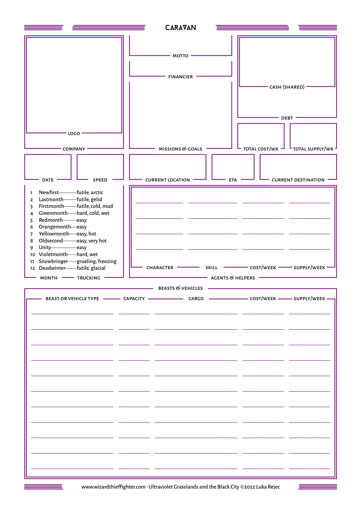
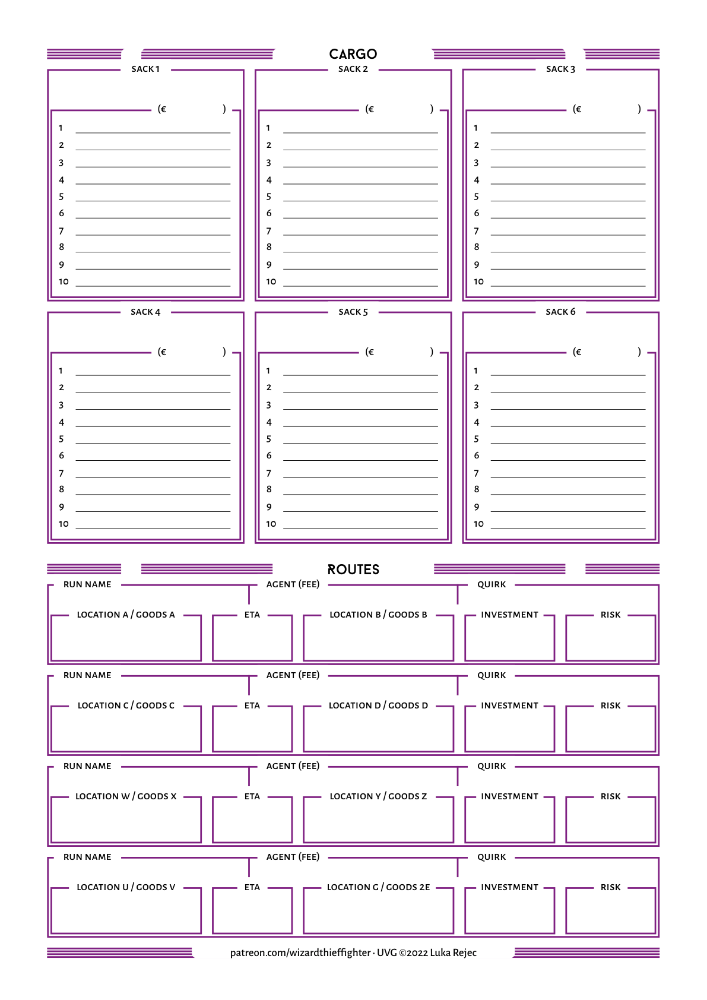
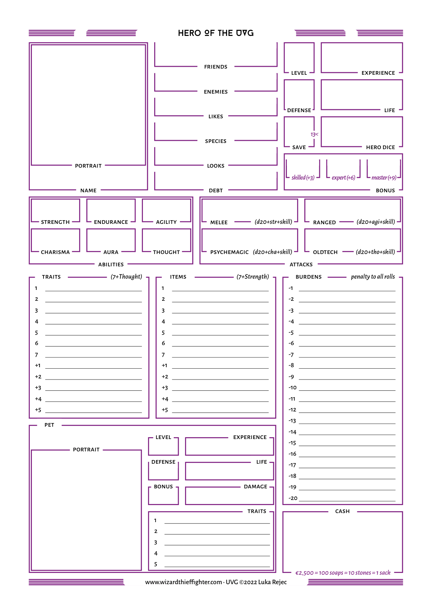

<!-- Page 219 -->

# **The Setting**

> [@UVG_Black_City_2e, _p._ _219_]

<!-- Page 220 -->

##### **Other Voyagers**

| d100 | Role | Name One | Name Two | Story | Color |
| --- | --- | --- | --- | --- | --- |
| 1 | Agronomist | Almir | Al Piz | Kind and knowledgeable. Has a secure traveling chest of horrors (L5, swarming). | Rage |
| 2 | Ambassador | Amaro | Artifiziale | Wary, even terrified. Believes they are being pursued by demons (L4, chittering). | Vigilance |
| 3 | Anthropologist | Amberto | Azul | Proud and pompous. Claims grand deeds, secretly inept. | Loathing |
| 4 | Archaeologist | Arcia | Bodizie | Magnificent drunkard. Drinks to avoid facing a cosmic secret. | Grief |
| 5 | Artificer | Arnasto | Carnemante | Lunatic. Literally, goes mad when they see the moon. | Amazement |
| 6 | Assassin | Astia | Celestini | World-weary and hopeless, goes on out of a dogged lack of imagination. | Terror |
| 7 | Banker | Belina | Circolangolo | Incredibly skilled but scatterbrained. Do not mention the war. | Admiration |
| 8 | Barbarian Noble | Benito | Cosmonauta | Brittle, with a quiet desperation. Seeks a lost friend, but will fail. | Joy |
| 9 | Bodysnatcher | Berengar | d’Aranje | Bright and excited. Has found a secret machine in the wastes. | Decline |
| 10 | Botanist | Boko | da Pastafari | Ashamed and glum. Dreams buried in dust centuries ago. | Fall |
| 11 | Broken Wanderer | Cuoia | Dabasso | High. Wants to dance with the flower people and to feel love all the time. | Aggression |
| 12 | Cartographer | Dalani | de Bianco | Strong and stern. Emancipated from worldly cares, follows a higher doom. | Contempt |
| 13 | Chief | Dana | de Carmico | Melancholic. Heard a sound most cruel and knows a dark time comes. | Remorse |
| 14 | Con Artist | Davor | de Chouet | Two-faced. Will work hard to ingratiate themselves before stabbing in the back. | Disapproval |
| 15 | Courtesan | Delno | de Giallo | Obsessed with the black slug (L7, mythical). Convinced its blood will be a panacea. | Awe |
| 16 | Cultist | Depico | de Karavan | Filthy but beatific. If dirt were holiness they would be a saint. | Submission |
| 17 | Cursed Hero | Desena | de Nero | Burns with anger. Righteous but misguided. | Love |
| 18 | Cursed Wanderer | Dolce | de Safranj | Secret sinner under an angelic demeanor. A creature of the night. | Optimism |
| 19 | Dentist | Enrike | de Selezione | Cheery and bright. Terrifying when gripped by apocalyptic visions. | Hope |
| 20 | Dilettante | Erena | de Serpens | A grimly nice person. Whiny and needful, though genuinely skilled. | Despair |
| 21 | Doctor | Ernedar | Decapolitan | Gruff and bearish. On a very difficult and important quest. | Grandparent |
| 22 | Druggist | Estato | del Mar | Boorish and offensive. Hides a heart of gold. | Parent |
| 23 | Elder Parasite | Estrela | di Alto | Sad and distraught. Carries the burden of a great personal loss. | Uncle |
| 24 | Emissary | Farfalon | di Dormenta | Hopeless and bereft. Their past is buried in lies of a glorious future. | Aunt |
| 25 | Engineer | Fina | di Mesa | Calm and cute. Eyes twinkle as they mock the daily grind. | Cousin |
| 26 | Entertainer | Galavar | di Verde | Jittery. Refuses to look up and fears the stars. Eyes, they call them. | Sibling |
| 27 | Escaped Slave | Girolamo | Donaplenum | Creepy and quiet. Draws disturbing sigils when nobody is looking. | Child |
| 28 | Eunuch | Girondo | Formatore | Gentle and soft. Refuses to be drawn into any commitment or decision. | Nephew |
| 29 | Exile | Goria | Fustin | Foolish. Uses charm and a ready grin to mask a deep well of uncertainty. | Niece |
| 30 | Explorer | Hotena | Hexadni | Brutal and heartless. They lost their mother to a strange wandering poet. | Grandchild |
| 31 | Fallen Hero | Ipa | i’Buyeni | Waffling and harmless. Turns into a beast when exposed to the moon. | Adoption |
| 32 | Folk Hero | Isizia | i’Creati | Full of jokes. Terrified of all metals and murmurs of the machines that eat. | Oath |
| 33 | Fugitive | Izabera | i’Fortun | Slimy and obsequious. A toad among humans, but not a cultist. | Blood Union |
| 34 | Genteel Adventurer | Jalosti | i’Grati | Careless and thoughtless. Obsessed with flawed formulae. | Spirit |
| 35 | Golem Operator | Jernina | i’Liberat | Nerdy and hurtful. Claims they are a victim of obscure misfortunes. | Growth |
| 36 | Guild Representative | Jeuna | i’Mertu | Venom tongued but secretly kind. Hurt by circumstance. | Modification |
| 37 | Guildmaster | Jion | i’Mutabili | Ridiculously devout. Spouts verse to avoid facing harsh truths. | Rewriting |
| 38 | Herder | Karlo | i’Novi | Calculated and ecumenical. Deploys divinities to get their way. | Change |
| 39 | Heretic | Karnelia | i’Orca | Weak but proud. Clutches to small victories with miserable need. | Rivalry |
| 40 | Historian | Kasciuto | i’Profunt | Sanguine. Faces a false prophecy with grand equanimity. | Bravado |
| 41 | Holy Warrior | Katyu | i’Sacer | Compulsively competitive. Always needs to win. | Professional |
| 42 | Hunter | Klesana | i’Syan | Hurt and withdrawn. Refuses to engage but needs to face an urgent task. | Amorous |
| 43 | Ill Omen | Krasna | i’Verdenti | Stressed. Torn by responsibilities, will snap soon. | Status |
| 44 | Inquisitor | Kujo | il’Arivat | Languid. Naturally relaxed and unstressed. | Wealth |
| 45 | Inspector | Lateria | Malapensa | Secretly deep. Surprising insights hide behind simple words. | Parental |

> [@UVG_Black_City_2e, _p._ _220_]

<!-- Page 221 -->

| d100 | Role | Name One | Name Two | Story | Color |
| --- | --- | --- | --- | --- | --- |
| 46 | Investigator | Leonti | Marmoresti | Terribly repressed. Hides all personal desires behind a wall of politeness. | Sibling |
| 47 | Machine Human | Leuterio | Mecanizio | Suspicious and accusing. Projects own fears and crimes onto others. | Friendly |
| 48 | Master Artisan | Leva | Mentat | Tired and ready to snap. Hates everyone almost as much as themselves. | Unholy |
| 49 | Mechanic | Lisak | Mercandili | Violent. Uses aggression to mask inner loneliness. | Consumption |
| 50 | Mercenary | Liuti | Metropolitan | Lonely and shy. Terrified of opening up. | Destruction |
| 51 | Merchant | Loma | Moderni | Scarred and angry. Confused about how to break the cycle of pain. | Adultery |
| 52 | Merchant Prince | Maurizia | Nagori | Delusional. Refuses to accept that anything might be going wrong. | Theft |
| 53 | Messenger | Mehaci | Nascosti | Paranoid. Convinced lings are out to get them. | Deceit |
| 54 | Miner | Mirena | Nauta | Persecuted. Chased by vile creatures out of space and time (L2, flabby). | Murder |
| 55 | Monster Hunter | Mirodar | Nebodari | Funny alcoholic in denial about their problems. | Betrayal |
| 56 | Musician | Nebesa | o’Sovobo | Blubbering and ineffectual. Secretly vicious and disgustingly cruel. | Seduction |
| 57 | Necromancer | Noturna | od Cusciare | Cruel and callous. Only out for themselves. | Captivity |
| 58 | Noble | Ombra | od Jiab | Manipulative and dangerous. Convinced they are a chosen leader. | Torture |
| 59 | Nomad | Opoya | od Kaniona | Passionate and loud. They are bringing a better world. | Assistance |
| 60 | Orphan | Paprizio | od Kujina | Vengeful. Consumed by hate after witnessing horrible crimes. | Protection |
| 61 | Painter | Piskero | od Mise | Curious. Driven to discover what soil their roots spring from. | Fear |
| 62 | Patrol | Plania | od Notte | Prone to intellectualizing. Refuses to engage with problems; instead they enumerate all the techniques that could be used as a solution. | Boredom |
| 63 | Peddler | Prima | od Petiz | Humorous and devoted. They laugh against the coming of the Great Tentacled Unity. | Trust |
| 64 | Pilgrim | Rasclana | od Planye | Snide and hypochondriac. Convinced they will die soon (but won’t). | Distraction |
| 65 | Plaguebearer | Rion | od Playe | Megalomaniacal. Full of grand schemes for the Tower of Ultimate Power. | Anger |
| 66 | Possessed | Robais | od Poti | Bumbling visionary. Clumsy but capable of greatness. | Interest |
| 67 | Priest | Rocio | od Setroya | Merciful and capable. Seeks to help a worthy youth. | Serenity |
| 68 | Prophet (mad) | Rodina | od Sobe | Nervous. Saw a mysterious creature. Twice. | Annoyance |
| 69 | Prophet (real) | Rosa | od Vina | Boring as a brick. Honest, good, and dull. Truly doing something good. | Regret |
| 70 | Raider | Rostolf | od Visocco | Sarcastic, fun, and a traitor. | Acceptance |
| 71 | Reaver | Rumen | od Vode | Friendly murderhobo. Has a map to a treasure buried under an orphanage. | Childhood |
| 72 | Refugee | Samorok | od Vulkan | Aggressive and upbeat. Willing to downplay any risk. | Friendship |
| 73 | Researcher | Sangua | od Yedeni | Cheery but sinister. Everything they say seems to have a dark side. | Schooling |
| 74 | Scavenger | Sarca | Odlingi | Incredibly knowledgeable but inhumane. Fortunately very passive. | Military |
| 75 | Scientist | Sciaca | Ossomangio | Roguish and lovable. Also incredibly callous and greedy. | Apprenticeship |
| 76 | Scoundrel | Scikapfo | per Ambulati | Silly voice and walk but skilled in battle. Carries a worthless secret. | Traveling |
| 77 | Scout | Scura | per Nascieni | Jarring and gruff. Loyal and deeply wrong about a nearby faction. | Hobby |
| 78 | Sculptor | Selesta | per Velizi | Committed to a local faction, unswerving in their devotion. | Work |
| 79 | Shaman | Sentena | po Viladrini | Cold and logical, skilled in unarmed combat, driven by odd impulses. | Tribulation |
| 80 | Shepherd | Severa | Purpureo | Methodical and grim, scarred by a thousand battles, now loyal to a distant lord. | Fate |
| 81 | Slaver | Sima | Raziunar | Angry. So angry. Beaten down, seemingly accursed. Has a nemesis (L2d6, fate). | Betrothal |
| 82 | Soldier | Sinon | ri Svelti | Grinning and charming, can’t seem to do wrong. Even though they do. | Marriage |
| 83 | Sorcerer | Siya | Rinasciti | Sly and obsequious, but genuinely believes they are helping the world. | Bereavement |
| 84 | Spicer | Sodoba | Rudeni | Deranged. Certain they are an alien trapped in a mortal shell. Perhaps they are? | Death |
| 85 | Spy | Sulmar | Rumeni | Hasty to judge. Bearer of a contagious curse. | Remembrance |
| 86 | Summoner | Tamke | s’Emerald | Stunningly charismatic but oblivious to their charm. Followed by a cortège. Pliable? | Curiosity |
| 87 | Thief | Teredo | Semolingi | Drug addict and secret heir to a blood-soaked fortune (€1d10* x 20,000). | Laziness |
| 88 | Thrill Seeker | Tesana | Seruleo | Young and inexperienced but the focus of a grand prophecy. | Determination |
| 89 | Time Traveller | Tori | Setvareni | Thunderous and domineering. They were wronged once, never again. | Domination |
| 90 | Tinker | Trista | Tergestini | Incomprehensible and strange. A hero from a far off land? | Enthrallment |
| 91 | Ultra Voyager | Urna | Terracotan | Rebellious, callous, and harsh. Also, devoted to a good cause. | Disenchantment |
| 92 | Undead Vessel | Vedya | the Blue | Taunting and jokey. Secretly a dark magician. | Investigation |
| 93 | Vile Spawn | Velena | the Orange | Uncouth and loud. Very loud. Also, very caring and devoted, looking for a master, in fact. See, they had a master. A great master. Very hush hush. | Science |
| 94 | Vome Infiltrator | Vera | the Purple | Ornery as a mule and about as wise. They are the key to a cult. | Meaninglessness |
| 95 | Warlock | Vero | the Red | Afraid of the dark and convinced the hills have eyes. They actually do. | Void |
| 96 | Wine Vampire | Volek | the Yellow | Zany beyond belief. Also, completely wrong about monsters. | Madness |
| 97 | Witch | Yako | Travini | Kleptomaniac. Also, cursed to degenerate into a vicious beast (L1d8, hopping). | Meditation |
| 98 | Wizard | Yasna | Violo | Querulous and nostalgic. Miss the old days and might help bring them back. | Peace |
| 99 | Woodsman | Yesen | Vites | Randy and devious in a friendly way. Offended the wrong people. | Enlightenment |
| 100 | Zoologist | Yeza | za Zidovi | Jokey but sad inside. Cursed to never die by a distant machine deity. | Transcendence |

> [@UVG_Black_City_2e, _p._ _221_]

<!-- Page 222 -->

##### **Other Gates**

Eerie gates and portals to strange places emerge from the hazy Times Before Times throughout the Ultraviolet Grasslands and intelligent travelers are wise to avoid them. On the other hand, fools often believe that plunder and treasure lie just beyond the gate.

A famous example is the cratered arched gate in the Onion-andSkull style of the Later Mahogany Reign slowly emerging from its aerolith tomb by the Low Road and the High. What if you need another random gate, leading somewhere else?

**Djuram the Well-garnished** (L3, mendicant) or **Sakraboldt de Placis** (L2, thundering) or another similar scholar would certainly be able to furnish them with unreliable hearsay on the location of such a gate for as little as €1d10 x 100.

What is the gate called? (d10)

1. Doorway Into Sun
2. Hypnotic Circle of Love
3. Iron Rectification of Space
4. Stone Melts Into Air
5. Paradox of the Bridgekeeper
6. Third Eye of the Gods
7. Crystal Catapult
8. World Worm
9. Mouth of Reflection
10. Dark Side Revolver

Rumors of this random gate (d6)

| d6 | Where Is It? | What Is It Made Of? | Who Made It? | What Happened To It? | Where Does It Lead? |
| --- | --- | --- | --- | --- | --- |
| 1 | In the heart of a destroyed metroplex swarmed by necroambulant vomes. | Ripples in reality fused into a 5-dimensional circle of infinite sharpness. | Nobody. It made itself. It came from the Elsewhere to eat the souls of mortals. | It unleashed hell and was shut after an epic 14-book story quest. | A now deadly place. Perhaps a melting palace in the planet’s mantle. |
| 2 | Atop a harsh, sculpted mountain of malachite. | Flowing, living metal, swirling through itself. | The Vile Ones as part of their travel network. | It was destroyed from the other side. | A hostile place of noxious gases and vile spores. |
| 3 | On a plain of dust and hate. | Bone turned to steel by ceaseless aeons of pain. | Para-lings when they infiltrated the old world. | Untreated software infections killed it. | A queer place, of strange physics and odd geometries. |
| 4 | Among orchards and rolling hills. | Lichens coat eroded stone and tarnished metals. | A Psychic Unity before it ascended to another sphere. | It became uneconomic and was mothballed. | Ruins and rubble of a great, dead city (p.142). |
| 5 | In the middle of a quarterling village. | Flesh and wood coated in moss and flowers. | An unexpected genius in a barbarous kingdom. | Its makers died and a cargo cult sprang up around it. | A bucolic, agrarian land, outside of history. |
| 6 | Basement of a ruin, perhaps repurposed as an abattoir. | Iridescent scales coating a body of stone and crystal. | An abmortal wanderer and his servile under-lings. | Nothing. It was just ... forgotten. | A major modern hub, promising new trade routes and opportunities. |

> [@UVG_Black_City_2e, _p._ _222_]

<!-- Page 223 -->

What condition is it in? (d6)

1. It is only the skeleton of a gate; whatever magic animated it is gone for good.

2. The gate is sealed by some odd and epic ritual, and an extravagant ceremony would be required to open it. A creepy cult and €100,000 could make it work again.
3. It is dormant, sleeping and immobile, but it can be awakened by the right spell. Some library work could reveal it, perhaps even _Zundan’s Awakening of Aways_ could work?
4. It is fully functional, but physically sealed by rock, livingstone, mud, dirt or other detritus. A 2d6 week excavation should make it functional again. But why was it sealed?
5. It is sealed from the other side, turning it into a one way portal. What might come through?
6. It’s working. Just the key is required or ... oh ... wait, it’s activating. How convenient.

What does it actually do? (d10)

1. **Storage Gate**: a warehouse sized extra-dimensional hole or, as sages might call it, _A Non-Portable Hole_. It might be a 1) treasury, 2) cargo warehouse, 3) prison, 4) tomb, 5) archive or 6) garage.
2. **Multi-Access Extra-Dimensional House**: in essence a postal box, accessible through multiple gates. Creatures’ spirits may be keyed to a single gate, disabling “teleportation.”
3. **Dull-Way Portal**: providing a safe extra-dimensional worm tunnel to another location. It may take days or weeks or even months of travel through the portal to reach another location. **Void monsters** (L1d20, tangled horrors) are, of course, just fairy tales. They don’t pluck apart bodies and souls and personalities.
4. **Fast Portal or Tele-Portal**: shortens travel distances to another location.
5. **Sideways Portal**: realigns the traveler in regard to the physical world, making them “ethereal” or “ghostly”. Sages warn of **rats and roaches** (L0, astral vermin) infesting the sideways land.
6. **Machine Portal**: it leads into the underlying mechanical body of the world where cold, calculating **elder creatures** (L13, zoop bloop) engage in their odd plots. Very dangerous.
7. **Rainbow Portal**: originally designed as a pleasure or amusement portal, it takes the traveler on an amazing journey in space and time. The journey lasts 1d4* weeks and the traveler returns profoundly changed (gain 1d6 x 1,000 xp, replace one ability, change one thing about hero’s looks).
8. **Hell Gate**: leading to some monstrously contorted biomancy-infused nightmare sub-realm. Don’t go there. In fact, don’t even activate it, you schlub.
9. **Time Portal**: lets travelers skip a week or a month or a year into the future when they pass through it. One way trip only.
10. **Soul Mill**: not a portal but a refinery, stripping the souls from creatures to fuel ancient machinery. Usually the stripped body and personality are returned in a day or a week—quite dead but perfect for creating flesh golems or ba-zombies (L1d4, obedient). Sometimes the soul fuel can also be harvested—a single sentient being’s worth of soul rendered into a crystal fuel cube is worth around €700 on the Dwarven black market in the Redland District (10 cubes/sack).

Gater Sickness!

Even gate travel through normally functioning gates can cause sickness as it exposes the human body to strange void radiations. Faulty gates can cause many stranger, even less comfortable symptoms. Ultras are immune to gater sickness, which feeds the human distrust they face.

| d20 | Gater sickness test |
| --- | --- |
| 1 | Soul leakage permanently weakens traveler. Their aura becomes wan, their thoughts tangled. |
| 2-3 | Blank burn. The memories of the last ten (roll d6): (1) years, (2) months, (3-4) days, (5-6) hours are gone. |
| 4-7 | Horrible headaches make concentration impossible for (roll d6): (1) a month, (2-3) a week, (4-6) a day. |
| 8-11 | Nausea and vomiting. Not a good look. |
| 12-15 | Mild unease and discomfort. |
| 16-19 | No symptoms. Phew! |
| 20+ | Reinvigorated by the rendered spirit dust present in the void, they regain a little vim (gain 1d6 Life). |

> [@UVG_Black_City_2e, _p._ _223_]

<!-- Page 224 -->

##### **Weather & Geography**

The climate of the Ultraviolet Grasslands is predominantly continental, similar to that of a vast swath of Eurasia in our world. Winters are cold and harsh, while summers are hot and dry. In between there are periods of heavy rain when the steppes turn to mud. Higher elevations are colder and wetter on their western sides. Areas further south or in the rain shadows of mountains can be very dry, while areas to the north are colder and damper. This means that most travel is restricted to the months when the weather is relatively clement.

Weather and Climate Matrix (d12)

| d12 | Calendar | Rainbow | Common Nights | Common Days | Extreme Weather | Environmental Hazards | Weird Stuff | Trucking |
| --- | --- | --- | --- | --- | --- | --- | --- | --- |
| 1 | Newfirst | Arctic | Glacial and dry | Frigid galestorm | Ice | Glacier surges | None | Nearly impossible |
| 2 | Lastmonth | Siberian | Freezing and dry | Thaw and mud | Blizzard | None | Star falls | Nearly impossible |
| 3 | Firstmonth | Freezing and wet | Cold and wet snow | Heavy rains | Mudslide | Crevasse opens | None | Nearly impossible |
| 4 | Greenmonth | Cold and sodden | Cool with showers | Heat wave | Swollen rivers | Geyser erupts | None | Challenging and damp |
| 5 | Redmonth | Cool and damp | Warm with storms | Heat wave | Flash floods | Floral overgrowth | None | Easy |
| 6 | Orangemonth | Cool and dry | Hot and dry | Heat wave and drought | Dust storm | Aquifer breaches | None | Easy |
| 7 | Yellowmonth | Warm and dry | Searing and dry | Heat wave and drought | Wildfires | Cliff forms | None | Easy, but hot |
| 8 | Oldsecond | Warm and damp | Scorching with showers | Lightning storms | Tornadoes | Lake dries out | None | Easy, but the heat! |
| 9 | Unity | Cool and humid | Hot with storms | Heavy rains | Floods | Rock decays | None | Easy |
| 10 | Violetmonth | Cold and wet | Cool with rain | Snowstorm | Fog | Dust spreads | None | Challenging and wet |
| 11 | Snowbringer | Freezing | Cold with snow | Icestorm | Gales | Mountain collapses | None | Grueling and cold |
| 12 | Deadwinter | Glacial | Freezing and snow | Whiteout | Avalanche | Stuckforce detonation | None | Nearly impossible |

Sometimes you just need some words to describe the natural scenery. That’s where this table helps.

Geography and natural scenery (d12)

| d12 | Hills | Plains | Valleys | Water | Ground | Air | Flora | Fauna |
| --- | --- | --- | --- | --- | --- | --- | --- | --- |
| 1 | Spire | Lava | Crater | Sea bed | Rock | Thin | Scoured | Absent or disappeared |
| 2 | Volcano | Pan | Glacial | Salt lake | Salt | Old | Dead | Fossils or corpses |
| 3 | Berg | Flat | Rift | Lake | Gravel | Stale | Dryland coral | Subterrene survivals |
| 4 | Dome | Lacustrine | River | Wetland | Sand | Flat | Lichens | Pioneer species |
| 5 | Peak | Till | Dry | Bog | Dust | Metallic | Mosses | Radiating invertebrates |
| 6 | Pinnacle | Rough | Shallow | River | Loess | Sour | Cacti | Invasive arthropods |
| 7 | Cliff | Gentle | Hanging | Waterfall | Silt | Dusty | Thorny | Basal vomes |
| 8 | Ridge | Alluvial | Box | Rapids | Clay | Dry | Grass | Chimeric herbivores |
| 9 | Mesa | Flood | Cove | Stream | Loam | Humid | Savanna | Opportunist scavengers |
| 10 | Stair | Scroll | Eroded | Cascade | Chernozem | Refreshing | Maquis | Exploratory omnivores |
| 11 | Scree | Outwash | Karst | Intermittent | Rust | Fragrant | Forest | Climax carnivores |
| 12 | Dune | Peneplain | Canyon | River bed | Rubble | Rich | Overgrowth | Biomantically enhanced fauna |

> [@UVG_Black_City_2e, _p._ _224_]

<!-- Page 225 -->

##### **New Discoveries**

New Discoveries (d20)

| d20 | Distance | Xp | Shape | Appearance | Original Function? | Creator? | Discoverer? | Current Use? |
| --- | --- | --- | --- | --- | --- | --- | --- | --- |
| 1 | Dimensional | -307 | Non-Euclidean | Hyper-morphic | Personality Reprogramming | Barbarian Sorcerer | Charismatic Revolutionary | Terrain Modification |
| 2 | 2d6 weeks | -53 | Cube | Brittle | Time Ark | Blue Prophet | Spiritual Shaman | Communication |
| 3 | 1d6 weeks | 0 | Pyramid | Chaotic | Spiritual Improvement | Celestial Cat | Solitary Prospector | Defense |
| 4 | 1d4 weeks | 10 | Prism | Divine | Soul Decomposition | Emperor of Post-humans | Simple Farmer | Education |
| 5 | 2 weeks | 20 | Tower | Energy | Transport Revolution | Faceless Abmortal | Religious Innovator | Energy Production |
| 6 | 1 week | 30 | Needle | Fractal | Neo-Genesis | Heroic Wanderer | Proud Aristocrat | Energy Storage |
| 7 | 1d12 days | 50 | Ring | Gaseous | Musical Creation | Hive Community | Poor Trader | Entertainment |
| 8 | 1d10 days | 70 | Plain | Terrifying | Military Vault | Ling Architect | Military Liaison | Espionage |
| 9 | 1d8 days | 110 | Depression | Illusory | Matter Processing | Mahogany Entity | Merchant Adventurer | Farming |
| 10 | 1d6 days | 130 | Pit | Liquid | Knowledge Preservation | Neo-scientist | Mad Savant | Luxury Goods |
| 11 | 1d4 days | 170 | Cave | Malleable | Government Control | Plastic Machine | Lucky Dilettante | Manufacturing |
| 12 | 2 days | 190 | Crater | Mobile | Energy Generation | Polybody Precursor | Loyal Imperialist | Mining |
| 13 | 1 day | 230 | Canyon | Motionless | Economic Supremacy | Rat Monarch | Exiled Ruler | Reality Repurposing |
| 14 | 1d20 hours | 290 | Mountain | Omega | Deep Prison | Scavenger Lord | Driven Researcher | Refining |
| 15 | 1d12 hours | 310 | Chaos | Perfect | Cybernetic Enhancement | Semi-sentient Rhizome | Downtrodden Refugee | Biomodification |
| 16 | 1d6 hours | 370 | Maze | Reassembling | Cosmic Escape | Sleeping Horror | Desperate Archaeologist | Transportation |
| 17 | 1d4 hours | 410 | Shapeless | Self-ordering | Body Augmentation | Spectrum Generator | Curious Reporter | Water Extraction |
| 18 | 2 hours | 430 | Shifting | Solid | Biological Uplift | Timelost Warrior | Cunning Industrialist | Weapon |
| 19 | 1 hour | 470 | Protean | Time-rifted | Athletic Games | Ultra Progenitor | Cultist of the End | Weather Editing |
| 20 | It’s here. | 970 | Sphere | Void | Aesthetic Perfection | Vile Refugee | Spurned Lover | Worship |

Historic Periods and Styles (d20)

| d20 | Material | Special Material | Adjective | Movement | Culture | Period |
| --- | --- | --- | --- | --- | --- | --- |
| 1 | Stone | Megaliths | Lesser | Onion and Skull | Vile Reign | The Star Bloom |
| 2 | Concrete | Dryland coral | Shorter | Ur-Rococo | Mahogany Reign | Accretion Days |
| 3 | Rusted metal | Ageless metal | Lower | Bio-Mechanicism | Faceless Rule | Geological Eras |
| 4 | Glass | Ur-obsidian | Decadent | Geo-Sculpturalism | Perambulator | Long Long Ago |
| 5 | Adobe | Livingstone | Endless | Poly-Chromatism | Machine Human | Long Ago |
| 6 | Brick | Aerolith | Upper | Inter-Tactilism | Abhuman | When the Fast Stars Shone |
| 7 | Crystal | Psionic crystals | Longer | Bi-Mannerism | Post-ling Culture | Mythogogic Era |
| 8 | Ceramic | Porcelain | Greater | Peri-Spectralism | Citrus Pre-nomadic | When the Mists Lifted |
| 9 | Wood | Luminescent wood | Dark | Idio-Brutalism | Distributarian | Rider Years |
| 10 | Bone | Carved ivory | Golden | Dis-Modernism | Dictatorship of Liberty | Scavenger Polities |
| 11 | Flesh | Synthetic skin | Primitive | Ab-Plasticism | Pre-chromatic Kingdom | Springtime of Monarchies |
| 12 | Chitin | Iridescent scales | Advanced | Alter-Minimalism | Zombie Democracy | The First Expansion |
| 13 | Force | Stuckforce | Barbarous | Meta-Classicism | Psychic Unity | The Blue Heresy |
| 14 | Plastic | Plaz steel | Uplifted | Pseudo-Rusticism | Barbarian Polity | The Decadent Century |
| 15 | Wicker | Lightmetal struts | Younger | Para-Infantilism | Ling Permutation | The Revolutionary Era |
| 16 | Shadow | Frozen smoke | Forgotten | Neo-Elementalism | Post-humanist Continuum | The Human Revival |
| 17 | Light | Reality ripples | Reborn | Post-Imperialism | Rat Race | The Second Expansion |
| 18 | Cloth | Corundum silk | Uplifted | Pre-Fundamentalism | Utopian Ecstatic | The Oligarchy |
| 19 | Sand | Grey ooze | Fallen | Deconstructivism | Lower Heroism | The Purges |
| 20 | Earth | Flowering mosses | Final | Anti-Realism | Pseudo-Naturalist Dystopia | The Consolidation |

> [@UVG_Black_City_2e, _p._ _225_]

<!-- Page 226 -->

##### **Histories**

The past is a mist-shrouded country. Precise dates, locations, and periods are unknown. Each group of players shall invent, discover, and be surprised by the past they uncover for themselves.

Forgotten Times (d12)

Eras and times lost beyond the records in the Great Mist. Fragments, shells, and hazy memories remain but even they tend to fade and melt from mind and time like sands in the storms whipping off the Golden Desert.

1. The world was created by the Demiurge to celebrate the Onion and the Skull.
2. The world was discovered by the First Mother who entered the cosmos from the void.
3. The first deity awoke into sentience in a great mahogany tree.
4. The Vile Ones escaped into the cosmos and settled it with their slaves and ur-Rococo megaliths.
5. The first humans were sculpted from solar dust by the Faceless Ones in seventeen years of creation.
6. The mortals were uplifted by the Sky Gods of the Bio‐Mechanum for a higher purpose _or_ as a joke.
7. The Fast Stars blazed into life above the girdle of the earth and humans were geo-sculptor gods.
8. Reality flowed like blood through the veins of the Uncreated during the Vile Reign.
9. Pride begat misunderstanding begat strife begat war in the heavens and the tears and blood and flesh and bones of abmortals rained upon the land, blanketing it in the fertile soil from which humans crawled like rats.
10. The poly-chromatic spirits could shape matter and energy like the sculptor shapes stone and clay.
11. There was no heaven and no hell, only life everlasting in the Abhuman Paradise.
12. The primordial era ended with the war of lings and viles and the rising of the Great Mist.

**Fragments of Forgotten Times:** the Vile Ones, shape-changers, ultras(?), gods, soul magic, Chosen Ones, Old Ones, the Undying

Wanderer, the Fast Stars, the Hole in Heaven, and the soul mills.

Discovering any of these fragments has world-changing consequences for the game. Individual heroes who gain the powers of these fragments would become gods to their contemporary later mortals. Be prepared to refashion the campaign with new ‘gods’— and very likely new heroes.

Dimly Remembered Strife (d12)

Some say there was a war. The War. There is epic disagreement among historians whether there was an actual event that marked the fall of some Chosen group. Obviously, there was more than one war; but there can’t have been that many, considering the obvious power of many of the Old Ones. Right?

1. The lings defeated the viles and ushered in a golden age.
2. The viles tore themselves in civil war and the lings destroyed them afterwards, ushering in an iron tyranny.
3. The gods entered the cosmos from the void and destroyed the hubris of mortals in fire and flood.
4. The viles ascended into a higher form, leaving the world to collapse behind them.
5. The world and cosmos were created as an ark for the survival of the gods, when they reached a new shore, they left, taking their engines of creation with them. The subsequent decline was later reinterpreted as the result of a war in heaven.
6. There were no lings or viles, the demiurges imported humans as biological robots to serve them. After the demiurges’ departure, the humans’ programming went haywire and they destroyed the world.
7. The First Lings destroyed themselves in iron and machinery and the Second Lings told themselves tales of Vile Ones wreaking the destruction to salve their fragile memories.
8. The Machine Gods were born in the Fast Stars and the Quick Trees, then sent down their offspring to devastate the world.
9. The Chosen Ones broke their pact with their gods and were drowned in blood and time.
10. The humans crawled out of their slavery over a hundred centuries of relentless, bloody warfare. When they won the world they swarmed out of the void, destroying the lings and the viles and taking the world for themselves.
11. The elves walked in from a void and reality fractured in their wake, leading to war between heaven and earth.
12. There was no void, there was no war. An entropy reduction experiment failed, causing a temporary reality collapse.

**Fragments of the Strife:** divine weapons, radiation ghosts, ghouls, stuckforce, biomechs, biomantic horrors, orcs, ancient vehicles, artifacts, and machine humans.

Recovering knowledge of the great conflicts will alter the balance of powers in the lands, lay the foundation for new empires, and change perceptions of history; but won’t radically alter the game— aside from a new arcane waste or two.

> [@UVG_Black_City_2e, _p._ _226_]

<!-- Page 227 -->

Fabled Stories (d12)

Half-remembered times before the Rainbow Order was founded around the Circle Sea. Studies of the old records are half-heartedly forbidden by the Cogflower Inquisition and avidly pursued by the Red Land District and other fringe groups.

1. The Post-Ling cultures spread across the world like rats through a bountiful orchard, flourishing, creating incredible arts, and then dying out as the source machine gods that kept them going broke down and died.
2. Peri-spectral phenomena broke the barriers between the Ancestors and the Scions, leading the first shamans into the well wasted lands.
3. Rigidly distributarian Caste and Hive Societies clung to power, producing and reproducing the ancient magitechnologies as ritual and religion.
4. Idiosyncratic Brutalist cultures swarmed across the world, driven by mad ghosts and fueled by synthesized weapon generators rediscovered in the dust of the Long Long Ago.
5. Dis-Modernist scavenger poleis established dictatorships of liberty, supporting themselves with vast slave networks.
6. Ab-plastic magics and half-remembered mentalists stood behind the Springtime of the Monarchies, inaugurating gleaming autocracies to replace the corrupt popular dictatorships of earlier times.
7. Post-Lings seeking safer and quieter lives regularly fled the civilizations into the wilderness, establishing Alter-Minimalist Enclaves around twitching, mutated divinities.
8. The first expansion of empires underpinned the last twitches of the Zombie Democracies. Their realms eventually collapsed under their own inherent contradictions.
9. Meta-Classicism manifested itself in the attempt to create psychically unified cultures.
10. The metastasis of Neo-Minimalism was the Blue Heresy which was rejected in a series of violent, divinely ordained conflicts that established the essential polymorphism of nature, divinity, and society.
11. The victorious Holy Realms celebrated a decadent century only to collapse before the virulence of the Barbarian Polities.
12. Para-Infantilists sought to return to earlier, forgotten eras, aping and celebrating the collapsed lingish mores.

**Fragments of the Fabled Stories:** old monarchies, epic heroes, barbarian warlords, heirloom weapons, foundation myths, sagas, poetries, and ill-recorded histories.

Recovering fragments of the fabled stories will bring glory or infamy to the explorers, and quite likely a fair amount of wealth. It should not greatly alter the balance of powers.

Oral Histories of the Revolution (d12)

The fires of forgetfulness, the scouring of the sources, and the flooding of memories has left gaping holes in the local histories— but the vaults of the Orders of Accounting and Inquisition in the Metropolis impose a semblance of order over the last centuries.

1. The Revolutionary Era saw the Para-Infantilist Regimes collapse in a great uprising of the human masses.
2. Rustic Neo-Elementalist movements saw a great return to the land and die-back of the cities.
3. Post-humanist elements reasserted Slave-Hive Empires over great swathes of territory.
4. The Human Revival under a series of revolutionary prophets saw the ab- and post-humans destroyed utterly in the realms of the Circle Sea.
5. The Polychrome Orders were established to protect the Rainbow of Humanity from the darkness and the light of the inhuman forces that scour the world.
6. The Post-Imperial expansion saw civility, order, liberty, and humanity return to newly purified lands.
7. Pre-Fundamentalist Utopian ecstatics fractured the Post-Imperial Collective.
8. Several oligarchies emerged to steer the reins of the Rainbowlands.
9. In the deconstruction of the Post-Imperial Union, local culture heroes were rediscovered.
10. Purges of Anti-Realists saw the economies of the Circle Sea boom and a neo-technological surge.
11. A Pseudo-Naturalist Dystopia was replaced with an enlightened Spiritual Particularism.
12. The consolidation of the Rainbowlands into four great powers fit the Four Skies paradigm: the magitechnical Universalists of the Violet City, the sacral engineering Bureaucracies of the Emerald City, the trading and banking Oligarchies of the Saffron City, and the permanent revolutionary self-help Association of the Red Land District.

**Building blocks of the Revolution:** rebellious golems, exploration societies, revolutionary organizations, trading houses, cultural corporations, industrial re-inventions, research foundations, militant cooperatives, violent cults, and odd machines.

The building blocks of the revolution are elements of common knowledge and political reality which the heroes may influence, change, and use for their own purposes as the game unfolds.

> [@UVG_Black_City_2e, _p._ _227_]

<!-- Page 228 -->

##### **Languages**

Many languages are and were spoken by the many humans of the Rainbow Lands. Here are just some of them. Those found closest to the Circle Sea and the Violet City are listed first, with the language family or circle in parentheses. Languages in the same family or circle are related and somewhat mutually intelligible; whether through contact or descent is not always clear.

The Common Languages

1. **High Common (rainbow):** The upper-class, literary common rainbow tongue taught by teachers to noble and rich students. Old fashioned, unnecessarily complex grammar and pronunciation. Words change depending on context, speaker, and intent. Numbers change depending on what is being counted. Elaborate written tradition.
2. **Vulgar Common (rainbow):** The trade _lingua_ of the non-noble middle-classes and professionals of the Rainbow Lands, with distinct regional dialects. Only written for trade. Influenced by outer languages. Similar to ‘City Speak’ or ‘Gutter Talk.’
3. **Purple Speech (rainbow):** The dialects of the peasants and laborers of the Purple Land, with many borrowings from the steppe folk. Mostly oral, no written tradition. Very similar to Bluenttalk, but it’s an insult to say so.
4. **Bluenttalk (rainbow):** The harsh and uncouth dialects of the exiles from the Blue Land and the wild folk still living there. Any writing has been suppressed long ago. Possesses a surprisingly detailed vocabulary of dairy products and aquatic vegetables. Borrowings from Blue Tongue.
5. **Greenspeak (rainbow):** The peasant and forester dialects of the Greenland. No written tradition. Large vocabulary corpus. Speakers from different dialects can mostly understand each others’ words, even if just by context.
6. **Emerald Common (rainbow):** The vulgar lingua franca of Metropolis, the Emerald City, with many Elfish and Greenspeak borrowings. Developing a broad, popular written corpus. Beautiful traditional handwriting.
7. **Decapolitical (rainbow):** The vulgar dialects of the Sea Fingers and the Decapolis, also popular with sailors. Written for trade purposes. Very onomatopoeic. Short, simple words. Understatement is prized. Silence is golden.
8. **Saffranian (rainbow):** the vulgar speech of Safranj and the Yellow Land, now also adopted by the local oligarchs. Extensive written traditions. A more refined and rhyming variant of Decapolitical, popular in the opera.
9. **Caravanian (rainbow):** The trade tongue of the caravans in the Yellow Waste and of some nomad tribes there. Mercantile written tradition. Borrows from many languages. Speakers can bend the language to adapt it for speakers of a certain language, or make it indecipherable to anyone but other Caravanian speakers.
10. **Oranjetic (rainbow):** The vulgar dialects of the Orange Land, very similar to Saffranian. Paltry written tradition. A musical dialect, exquisite in song.
11. **Free Circle Kriol (rainbow creole):** The wonderfully rhymed disyllabic speech of the Circle Sea free families (pirates) and river-travelers. No written tradition and vast variation among dialects prompting some scholars to say it is not so much a language as a mass outbreak of glossolalia.
12. **Redland District Cant (rainbow creole):** The badly rhyming vulgar speech of the autonomous enclave that is the Red Land District. Vast written tradition, but mostly political tracts. Large influence of Decapolitical through trade. Lots of swearing.
13. **Red Tongue (rainbow):** The vulgar dialects of the Red Land with many dwarven elements admixed. Poor written tradition. Heavily influenced by the slurred speech of the long-reigning Grand Red Duke Moshle IV, the Red Tongue replaces ‘s’ sounds with ‘sh’ and runs words together, as after too much wine.
14. **Winerian (dwarven):** The hill dialects of the Vintner Dwarves of the Red Land and Orange Land. Little writing, and what there is, quite literalist. Heavily influenced by the Red Tongue, Winerian is the most linear of the dwarven dialect.
15. **Volkan (dwarven):** The mountain dialects of the Mountains of Light and the Black Gold. Vast written corpus. When written, the space between the characters has as much meaning as the characters themselves. Much is lost by speaking it. Lots of silences and isolated consonants. It is best spoken indoors or in echoing caves. The echo is part of the language. It sounds very strange outdoors as parts of the words are missing.
16. **Woodlander (elven):** The language found inscribed on trees and rocks in the Elvenwood, spoken by some of the tribes there. Isolated inscriptions. The language is structured to change meaning with the seasons and the phases of the moon as though it does not quite belong on the solid earth.
17. **Steppe Speeches (steppe, rainbow):** The various dialects of the Ultraviolet Grasslands grew from a patois of rainbow dialects and Steppeland trade tongues. Its written tradition is uncertain. Possesses an immense vocabulary for grazing creatures and mechanical engineering.
18. **Sunsettish (steppe):** The common trade language of western Steppelanders. Written by merchants. Surprisingly focused on spirits and spirit possession.
19. **White Line (steppe):** The cryptic language of the Porcelain Princes was once more widespread, now it has been reduced to their outposts and trading missions. Vast dusty libraries exist. Because it has extensively evolved to suit the polybody structure, some of the more refined forms of the language require multiple synchronized voices used in unison to convey meaning properly.
20. **Satrap Canto (steppe?):** The color and light-adapted language of the Spectrum Satraps seems to be an outlying dialect of some larger language group or system. Its writing traditions are polychromatic and use both color and sound to convey meaning. Without light-generating organs or a rainbow translation array, this language is practically unusable by baseline humans.

> [@UVG_Black_City_2e, _p._ _228_]

<!-- Page 229 -->

The Dead and Weird Languages

1. **Black City Alphabet (?):** Found inscribed on some metal sheets brought from the mythical Black City in the west. Some academics say it’s not a language, just intricate patterns. Faraway people joke that the writings are really the schemas for a very complicated dance.
2. **Cat Thought (cat):** Thought-speech of the Violet City cats, which can best be described as a formalized logical structure used to enable empathetic coordination between cats and telepathic communication with their thralls.
3. **Deep Dwarven (dwarven):** The hidden priestly language of the Deep Dwarves that is not spoken, only carved in stones and bones. It can be written in any direction, even constructing beautiful figures with the characters. Very succinct. Some carvings are considered visual poetry. A subset of Deep Dwarven is Deep Dwarven Hexadecimal, used for programming Dwarven prayer machines.
4. **Blue Tongue (isolate):** The forgotten speech of the Blue God, now used by some secretive cults and mad wizards. A forbidden, written corpus exists. It is harsh, logical, iconographic, and ambiguous by nature.
5. **Elven (elven):** A hypothetical Elven language, reconstructed by sages from common elements of Woodlander and Moonlander. Some scholars associate it with the Vile Ones of Long Long Ago. They surmise that a written version existed, though aside from possible decorative stelae, no examples have been found.
6. **Moonlander (elven?):** An extinct (?) language found inscribed in tombs in the Mountains of the Moon. Samples of the writing have been found to be memetic worms, taking over the reader’s mind and driving them to perform odd, incomprehensible tasks. Though usually not deadly, permanent personality changes and madness have been noted often enough that in the popular imagination reading Moonlander is associated with lunacy.
7. **Marmotsk (isolate):** The language of the Marmotfolk requires large incisors and musky pheromones to use correctly. The delicately whorled bone-script is more accessible to outsiders.
8. **Umber (steppe):** Dead language of Fallen Umber, characterized by delicate poetry and three-dimensional writing on woven, living chitin. Heavily influenced by another missing isolate.
9. **Lingish (lingish):** Obscure dead language, hypothesized from references in old libraries, toponyms in modern languages, and some fossilized Oranjetic expressions. It seems to have been a fluid, contextual and permutative language designed to overwrite human brains and prevent personality reprogramming and remote sensing.
10. **Great Language (lingish?):** The hyper-contextual and agglutinative dialects (languages?) of the Great Folk communities in the vicinity of the Behemoth shell. Individual communities’ dialects are so divergent that mutual incomprehension is common.
11. **Trilignic (lingish? steppe?):** The ancient languages of the Three Sticks civilization, before its decline. Found on countless inscriptions, buildings, and screens. Not fully reconstructed, but seems focused on overcoming hedonic limitations. Modern inhabitants of the region use Sunsettish day to day.
12. **Vomish (?):** A hypothetical machine hive language used by vomes. Perhaps a whole series of languages. Many scholars dispute that vomes are not even sentient. Likely utilizes electromagnetic radiation to convey meaning.
13. **White City Pictographic (?):** Hypothetical original language of civilized trading nexus beyond the Yellow Waste. Known from decorations and vidy crystal recordings brought to Safranj by adventurers and merchants.
14. **High Ultra (?):** Psychemorphic language of the body-hopping ultras, it produces profound psychedelic dislocation in embodied sentiences. It seems to lack temporal structure and appears to be physically unwritable, or rather, it can only be written by rewriting psychic structures or memories. Profoundly alien, it has been recovered from some crystals. Some scholars speculate that this is not actually a language but the substrate of the ultra’s existence—in effect, their bodies.

> [@UVG_Black_City_2e, _p._ _229_]

<!-- Page 230 -->

##### **Death**

Throughout the text the voyager will have noticed that the totality of the sentient individual in the Rainbowlands is divided into a trinity of body (ha), soul (ka), and personality (ba). This is largely lifted from a simplistic reading of the Ancient Egyptian conceptions of the person, as in the _Coffin Texts_ and the _Book of the Dead_ .

In metaphysical terms, the soul provides the motive fire of consciousness, the personality provides the unique direction of consciousness, and the body provides the vehicle of consciousness.

In a game, this trinity affects how the dead, the undead, and the resurrected behave. A creature killed by physical means becomes a classic corpse. A creature whose soul is destroyed leaves a perfect shell, easily turned into a flesh-golem servitor (sometimes called a zombie but actually a soulless automaton). A creature whose personality is annihilated presents the most unusual situation: their soul-body dyad remains physically alive, but completely malleable. They are closest to the classical Haitian Vodou concept of a zombie: entities of human intelligence without volition, loyal to their master or creator.

| Ha (Body) | Ka (Soul) | Ba (Pers.) | Creature or "Thing" |
| --- | --- | --- | --- |
| yes | yes | yes | Humans, full persons, animals |
| yes | no | no | Corpse, shell (can be reanimated) |
| no | yes | no | Ka-elemental--a primal, balllightning poltergeist thing |
| no | no | yes | Ghost or echo of a creature, maintained artificially |
| yes | yes | no | Ka-zombie--a voodoo-style zombie |
| yes | no | yes | Ba-zombie--a shell of a person animated by artificial means, a lich, also some machine humans |
| no | yes | yes | Demons, ultras, sentiences |

_All academic-priestly societies have their own traditions on the essential_

_structure of the individual (or the dividual). Some claim their ‘truths’ hail_

_from pre-cosmic times. This is usually dismissed as a bit much._

**Bringing Back Your Dead**

So far so simple--but what happens when a player wants their character returned from the dead? Without specific (and, in the eyes of most Rainbowlanders, deeply immoral) rituals such as _Stoyevod’s Irreducible Crystalisation of the Ego Complex_, the character as an individual disappears. The personality dissipates into the cosmic consciousness, becoming part of the infinite tapestry of creation, returning like a messenger swallow to the All-Mind. The soul merges back into the All-Fire of Creation-Preservation-Destruction. Finally, the body decays back into the All-Green cycle of Life-Death-Rebirth.

Spells such as _Animate Dead_, _Raise Dead_, or the poetic _Supplication to_ _the Rotting God to Turn Back the Wheel of Love and Death (Resurrection)_ permanently alter the returned.

**This Returned Is Changed**

1. They are marked by the Rotting God (see below).
2. Their face is dark with the death they have lived.
3. Their mind is hazy with the fog of the shadow realm.
4. Their instincts are tinged with their fated reincarnation.
5. Their body is dessicated by the cosmic winds.
6. Their hands tremble with the terror of not-being.
7. They cough from the dust of limbo.
8. Memories of unity-with-existence have crushed their ambition.

**The Seven Marks of the Rotting God**

1. First, milk turns sour at the marked one’s touch.
2. Then, dogs and cats are repulsed.
3. After, plants wither in their presence.
4. Then, maggots grow in their footsteps and skin.
5. Soon, pestilence follows their breath.
6. Eventually, their eyes turn white, but still see, and their touch bears an uncomfortable curse.
7. Finally, inanimate objects age and decay in their presence.

Some say the marks are gifts, extending the lives of the Blue God’s chosen. Wise folks who understand human nature know that these long, decayed lives are but another curse.

> [@UVG_Black_City_2e, _p._ _230_]

<!-- Page 231 -->

**Oracle of the Death Dice**

When a player character would usually die, their player can _either_ choose what happens (rows a to h) _or_ roll and let the oracle of the death dice decide. Each result is only available once (mark used up results). If a result is unavailable, use the next lowest unused option.

Once the oracle is spent, reset the table or add new results.

| Roll | Oracle of the Death Dice says... | ...possible in-game effects |
| --- | --- | --- |
| 1 | **Cinematic Supertraumatic**: character is dispatched in gory cinematic slo-mo. The battlefield falls silent in horror. | Nearby allies lose 1d6 Life from the trauma, followers check morale. |
| 2 | **Vorpal Decapitation**: snicker-snack, their neck goes crack. | Nearby creatures save or are blinded by the blood fountain. |
| 3 | **Blood Tears Water the Earth**: character is down, pumping arterial blood on the ground, and dying in 3 rounds. | Adjacent creatures save or slip. |
| 4 | **Fork in the Guts**: ripped open, the character can crawl away or play dead. They will die in a few hours. | When they take any action more vigorous than crawling and groaning, they save or slip into the deep sleep. |
| 5 | **Five More Steps**: character is mortally wounded and dies after 5 more actions. Lying in wait to impart dramatic last words is not an action. | Character gains d20 temporary Life per round (maximum 20), until they die. |
| 6 | **Stumpy Six**: that wasn’t good. That limb is supposed to be attached. Still, the character has a few minutes before they bleed out. | Character gains d20 temporary Life. Also, limb missing (roll d6): (1) two limbs, (2-3) leg, (4-5) arm, (6) choice of limb. |
| 7a | **Final Sacrifice**: character knows they will die soon, time to go out in a blaze of cinematic last stand glory. | Character gets 7 final boons [+] to spend as they like and gains 77 temporary Life for a cinematic last stand. |
| 8b | **I’m Too Old For This Shit**: character is down and realizes they’re so too old for this shit. If they get out of this adventure alive, they’re retiring. | Character regains up to 20 Life and hair turns white. After this battle they avoid conflict. They end adventure as soon as possible, then retire. |
| 9c | **Just A Flesh Wound**: character dramatically loses a member. Gritting their teeth, the loss reinvigorates them. They are now a little dismembered. | Character loses (roll d6): (1-2) foot, but regains 40 Life and gains 1d6 boons [+]; (3-4) hand, but regains 20 Life and gains 1d4 boons [+]; (5-6) finger, but regains 10 Life and gains 1 boon [+]. |
| 10d | **Enter Sandman**: character is knocked unconscious and sleeps off the rest of the fight. Some memories are missing. | Character incurs a half level experience debt--they must gain additional xp before they can level up again. |
| 11e | **Sense Compensate**: with a long, drawn out scream, the character loses a sense organ. Looks visibly mutilated. | They regain 1d12 Life. Lost eye = gains exceptional hearing. Ear = gains sharper smell. Tongue = can’t speak, but gains keener eyes. |
| 12f | **Nope. Nope. I Quit**: knocked back, armor torn and blood gushing. Their life flashes before their eyes and they quit. They pass their weapon to a follower and exit the stage as soon as possible. | Character regains 1d12 Life and retires. A follower immediately gets half of the PC’s total experience, three choice items, and a keen desire to prove themself. The follower gains 1d6 boons [+]. |
| 13g | **Betrayer of Friends**: character ducks behind a nearby ally. Ally takes the killing blow instead. | Character has one friend less. |
| 14h | **Broken Spirit Whole Heart**: character staggers back, their spirit broken. They regain up to 20 Life and ponder the quiet life. From now on, they will never fight well again. | They have a bonus in non-combat situations and a penalty in combat. |
| 15 | **Bruised Bruiser**: character falls for a round, something’s broken in there, but not too badly. Still, it hurts. | Character suffers a penalty to all rolls until they take a long rest, but regains 1d20 Life. Also, they now have a humorously large bruise. |
| 16 | **Blinded By Blood**: character staggers back, blinded by blood. They will soon have a dramatic scar. | Character regains 1d20 Life. They must take an action every round to wipe away the blood or they suffer a penalty to all actions. |
| 17 | **Spitting Teeth**: character falls for a round, then gets up again, spitting out a tooth. Hero is now gap-toothed. | Character regains 1d20 Life and gains two boons [+]. |
| 18 | **Nanowar of Steel**: character falls to the ground for a round, their blood activates compatible dormant war nanites in the dust. | Character regains 1d20 Life and one physical stat is permanently increased thanks to a visible vomish cybernetic implant. |
| 19 | **Red Mist Rises**: character falls for a round and a **spirit of destruction** (L6, laughing) enters them. They keep fighting for the next 2d6 rounds, attacking allies if all enemies are dead. | The character regains full Life _and_ d100 temporary Life. Until they stop fighting, they gain a bonus to their attack and damage rolls. |
| 20 | **Battle Hymn**: numinous presence blocks the killing blow and delivers a glowing, shiny blessing. | Character regains full Life and gains a bonus on all rolls for the remainder of the battle. They permanently gain one special power. |
| 21-23 | **Chosen By the Void**: _something_ opens up. A different reality manifests. The world seems flat and empty as a higher-dimensional actuality makes itself felt through the character’s soul-body-personality locus. | Character regains full Life and becomes nigh invulnerable for the rest of the battle (every blow only deals 1 damage) as _something_ channels through them. They permanently gain a special cosmic power. |
| 24+ | **Superheroic Reversal**: character suddenly turns the tables on their enemy. Rest of opposing side is badly shaken. | Character and enemy swap current Life totals. Character gains a bonus to all rolls for the remainder of the battle and permanently gains one special combat ability or 1d6+1 Life. Enemies check their morale. |

> [@UVG_Black_City_2e, _p._ _231_]

<!-- Page 232 -->

## **Glossary**

**Abmortal:** A sentience (sometimes human) that does not die of natural causes. The Porcelain Princes and ultras are among the more common abmortals. Most mortals hate them. A lot.

**Aerolith:** Stuckforce-infused rock generated from the air itself, usually the after-effect of catastrophic transmutation or portal failures. The rock is actively aerostatic—it is functionally weightless and levitates at a set distance from the ground once moved there.

It does remain massive, however, so a long lever is often required.

**Animancy:** Soul or spirit magic. Magic using and modifying the animating spark of life, from golems to ba-zombies. Most humans regard it as a horror and abomination, for the simple reason that it re-processes and modifies the heart of what it is to be human. Elves infamously have no such compunctions in fairy tales. Modern golems are powered by far weaker sources than pure soul juice.

**Art Florist:** A wizardry discipline, akin to biomancy but focused on plants. Some primitive peoples might call them druids or bush doctors, but wizards know better.

**Autofac, Fac:** An artificial organism or organic machine, sometimes of great size, that generates other organisms without outside control. Created in a forgotten age—perhaps by combining wizards and autonomous vehicles in an unholy union. Sages speculate they were designed to produce useful commodities. Now they are almost all menaces, leaking toxic fumes and liquids, ravaging the land, and producing odd, dangerous, and mostly useless artifacts or oozes. Today associated with vomes. Perhaps the downfall of the Original Folk.

**Autonom:** An autonomous, synthetic organism, usually semi-sentient and capable of following simple commands. Like a zombie or skeleton but built from the ground up with biomantic precision. Simpler variants use exoskeletons and the autonom is just a collection of muscular tubes connected to a general-purpose crystal brain.

**Autowagon:** A golem wagon that can move under its own power. Tough, hardy, often covered in custom spikes, armor, defensive embrasures, firing platforms and other accoutrements, autowagons are among the most impressive (and relentlessly slow) forms of transport in the UVG. It can follow simple instructions and navigate across terrain on its own if required. Much like a mule. May also be as mulish.

**Ba, Personality:** The creative threads of possibility woven into the tapestry of a human. The changeling essence that weaves together a unique individual over time, fired by the spark of soul, and unified in the world through the medium of body. Some cultures believe personalities have afterlives, while others believe their threads wind, unwind, and wind again over time. A few rare sages argue that personalities are unique occurrences that fade away after motivating a single body, but necromancers and vivimancers put the lie to this notion.

**Bardstone:** Stone imbued with the songs of Long Ago. Some say that in a great cataclysm a grumpy deity turned all bards to stone so that she could get some sleep. Obviously, this is nonsense, but bardstones are valuable and can store more than just songs— stones with messages and moving pictures have been found. They are attuned to their fixed locations and moving them destroys their magic. Perhaps it has something to do with the star lines? Who knows.

**Ba-Zombie:** Reanimated creature, actually closest to a flesh golem, created from an intact soul-stripped body-personality. Using an artificial soul, or souls, it can be maintained indefinitely. This is how many of those ageless wizards, called liches by simpler minds, are crafted. A soul mill is the usual way of creating the suitable body-personality.

**Biomancy:** Wizardy art of sculpting flesh and bone and sinew to create living works. The burdenbeast is the most common example of the art.

> [@UVG_Black_City_2e, _p._ _232_]

<!-- Page 233 -->

**Biomechanicum:** Hybrid wizarding art that melds mechanics and flesh. Vomes are an example of advanced biomechanics. Implanted prosthetics are readily available, from the chop-chop fixer (€100 for a cold grey hand) to the porcelain sculptors (€2,000 for color shifting chameleon glass dermal implants) popular with artistes and burgleurs.

**Blue Land of the Dead God:** Flooded, festering swamp inhabited by degenerates and haunted by the bleeding rotten ghosts of the Blasted Field. Cults regularly try to reawaken the Dead God, but continually fail. In the Blue Lands fermented dairy products and north walls should be avoided.

**Bone-Work:** Hybrid discipline of necromancy and petromancy. Uses the personality memories of bones combined with livingstone spirits to grow, reshape, and animate bones into new and useful forms. Some intellectuals view it as a lazy dead-end in petromancy.

**Cat, Violet:** Sentient cats, beloved of the Violet Goddess and rulers of the Violet City and the Purple Land of the Cat. They use pheromones and mental parasites to control their blissful, happy subjects. Too lazy to bother with most day-to-day activities, they let the wizards and administrators of the Violet City pretend to be in charge.

**Chitin Caps:** Engineered fungus that, when farmed and grown on frames, produces usable quantities of chitin. Sturdy and light, it was popular as a roofing material and in many industrial and manufacturing applications. In the Third and Fourth Corporate Dynasties articles of clothing, such as hats, bustiers, and shoes were grown with chitin frames. Not to mention armor.

**Circle Sea:** The great round sea at the heart of the Rainbowlands, swirling in the endless current around the Needle of the World.

**Communal Body:** Monstrous, amoeboid creature created to carry the soul-personalities of multiple individuals beyond the boundaries of a single body. Some sages call them biological virtual-life machines, most call them horrors. It is debatable whether the soul‐personalities kept within are actually still viable or not.

**Cyan Sea:** Half-legendary inland sea far south, beyond the Wine Dark Mountains. Said to be entirely clothed in a lethal cyan mist which ebbs and falls with the tides and makes the entire Plain of Haze an impoverished and deadly land, inimical to great civilizations like those of the Circle Sea.

**Decapolis, The:** Nine to thirteen viciously independent, smallish city states controlling most of the Circle Sea coast from the Metropolis to the Orange Lands. Famed for their trading prowess, industriousness, venality, fetishistic fascination with magic of all sorts, and utter ineptitude setting up anything comparable to the Purple University.

**Demon:** Confused term for various bodiless sentiences. Applied indiscriminately to multiple superficially similar phenomena. Avoided by scholars.

**Dryland Coral:** The ‘living rock,’ one of the ancient biomantic and petromantic arts. Master growers can sculpt and shape it into evocative post-modernist forms emphasizing the interdependence of human and nature. Ill-grown dryland coral may leach nutrients and life from nearby areas, creating localized deserts. Cancerous dryland coral may even spread runners that grow into burgeoning house-clusters. There are rumours of a great living-ghost city in the heart of the Twilight Desert which has grown to occupy an area larger than the freehold of a corporate duke. A civil biomancer and crew can sculpt a dryland coral home in 2 years for €10,000/year.

**Dwarf:** Backronym from ‘De Werker Aristocratiscee Revolutie Fraternitie,’ Dwarfs are a distinct culture-class of selectively biomanced people. They have effectively fought the traditional aristoi of the Red and Orange lands to a standstill and now form a major industrialist society of the Rainbowlands. A famously bureaucratic and collectivist faction, they are the only one staunchly opposing the bureaucratic and individualist Emerald City Cogflower Corporation (actually a coin church).

**Elf, also Vila (or Vile?):** Scary, mythical, time-dilating, shapeshifting monsters rumored to live beyond the Mountains of the Moon, where the tangled sky trees snag clouds from the sky and a shadow lurks over every soul.

**Emerald City, also Metropolis:** Chief city of the Green Land and largest city of the Rainbowlands. Governed by the Banker Priests of the Green God, devoted to greed and the untrammeled growth of the vital forces of the individual and society. Major forces include the Paladins of the Cogflower, the Revenue-Service Accountant-Monks, and, of course, the Green Inquisition—crucial to maintaining public support for the fear-and-pain backed cash currency of this industrial ecological meta-topia.

**Fast Star:** Remnants of cities and factories and paradises in orbit above, glittering reminders of the decline of these later days.

> [@UVG_Black_City_2e, _p._ _233_]

<!-- Page 234 -->

**Full-Body Prosthetic:** Often immobile, this bio-necromantic device keeps a soul-personality dyad locked in the material world even as the body is reabsorbed into the cycle of life.

**Full-Body Rebuild:** What degenerate savages call a spell that raises the dead. In fact, it is not far removed. This involved scientific procedure requires necromantic, biomantic, and psychomantic expertise. Ideally, it requires the brain of the creature being rebuilt, for that is the seat of the personality. A soul-stone is used to rebind the soul from the animasphere into the flesh. A body-knitter then rebuilds the body around the brain and the soul-stone. Finally, a necromancer teases soul, personality and body together into the rebuilt form. The rebuilt body is basically a flesh golem animated by the original soul and motivated by the original personality. Costs around €5,000 and takes at least a week.

**Golden Desert:** A desert of rock and sand and Stone Dragons stretching towards the sunrise beyond the Yellow Lands.

**Grand Companies:** Hereditary trading aristocracies of the Green and Yellow lands, ideologically and practically opposed to the Hexads. Through selective eugenic practices over many centuries they have achieved longer life spans, more acute numerical abilities, and far more sophisticated debaucheries than most baseline humans could manage. Particularly in the case of the Emerald Engineering Kompany and the Avocado Promotion Executive where the rumors of Half-Elven admixture may well be true.

**Great Forgetting, The:** Common term for the lack of records and the decline that is supposed to have happened in the Long Long Ago. Some heterodox scholars and mystics suggest that no Great Forgetting happened, but rather an ascendancy into divinity, or something similar, and that all humans currently living in the Rainbowlands only acquired sentience _after_ those prior beings—perhaps lings—departed.

**Gun, Gunpowder Magic:** Any combat wand that doesn’t require wizardly skill to operate. Some even use actual gunpowder magic. That school combines alchemy, fire and earth elementalism, and force manipulation.

**Ha, Body:** The material aspect of the human triad of body-personality-soul.

**Half-Elf:** Elf-touched humans, a medical condition resistant to most interventions. Inquisitor Scirocco II classified it as a progressive neuro-moral degenerative disorder, with the unfortunate side‐effect of prolonging lifespans. Many half-elfs eventually succumb to the elven infection and disappear into the great Wall of Wood, lycanthropic half-beasts rather than proper civilized humans.

**Haze, Purple:** Occlusion of the sky that rises from the eastern horizon as one enters the Ultraviolet Grasslands. The occlusion blocks visible-length and infrared radiation, leaving the land in darkness. It appears that the haze is an atmospheric phenomenon that thickens or otherwise changes the further West one travels, delaying further and further the appearance of the sun. By the central Grasslands the sun only appears from behind this occlusive layer at noon and the Black City only experiences a few short hours of late afternoon light.

**Hexads and Self-help Associations:** Combination of clan association, socialized healthcare-and‐pension fund, thieves’ guild, private education system, insurance and protection provider, and parastate actor. Hexads bind together the six _de jure_ Rainbow Lands. I suppose if there were only three colors, somebody might call them Triads, instead.

**Human:** Most of the Circle Sea power groups consider all close-to‐baseline sentient and soulful post-humans as effectively human and possessing the full spectrum of rights attendant to a soul‐body‐personality triad. This includes retro-humans, dwarfs, half-elfs, halflings, quarterlings, and half-orcs.

**Inquisitions:** Federation of truth-and-reconciliation enforcement societies that maintain the peace of the Unity Promulgates in the Rainbowlands. Half parastatal corporations, half secret police.

**Ka, Soul:** The engine of life, a contradictory essence of the world that activates the body and makes place for the personality to guide the activity of that thing that is called a living human. In game terms, ka or soul is associated with Aura (and sometimes Endurance).

**Ka-Ba Maintenance Body:** Physical body substitute, knitting spirit and soul to the world, even beyond death. Most KBM Bodies are immobile crystal or ceramic structures housing incredibly complex organic metal magitech structures. Expensive versions are mounted in golems, giving a life beyond the flesh. Attitudes to KBM technology are generally ambivalent: why live in a hollow shell that can not experience the pleasures of life, after all? A basic body costs around €10,000.

**Ka-Elemental or Soul Elemental:** Spurting, flaming, ball-lightning paradox of life-force unmoored from both body and personality, yet trapped in the essential world. Sages are uncertain what kind of tragedy or nightmare machination rips the souls apart from the beings they animate, yet also blocks them from the Recycling Infinity of Nothingness. Some speculate that the legendary soul mills of the Vile Ones are involved.

> [@UVG_Black_City_2e, _p._ _234_]

<!-- Page 235 -->

All aspects of earthly intelligence and individuality are lost within days, if not hours. **Ka-elementals** (L2d4, gutting) dangerously affect biological and personality baselines, causing (roll d6): (1) organic regression to a more primitive form, (2) personality devolves to simpler, more primal structure,

(3) organic shift to parallel evolutionary path, (4) random personality change, (5) rapid organic evolution into more advanced form, (6) uplift as biological baseline interfaces with the essence of the Recycling Infinity of Nothingness (+1d4 Aura).

**Ka-Zombie:** Classic living zombie. It is not undead, merely a bodysoul stripped of personality and ready for use by the animancer.

Creating a ka‐zombie has nothing to do with necromancy, and the subsequent creature, though no longer animated by the wit of personality, nevertheless looks and functions as a human, albeit with zero drive, personality, or ability to resist its master.

**Ling:** Mysterious, missing sentient subtype, attested to in Long Long Ago records, epic poems such as _The Epic Journey of the Great_ _Wand E. Ling_, and the bloodlines of the halflings and quarterlings. According to the myths of the Half-Broken Age, the lings mastered dream travel and ended the Vile Age.

**Livingstone:** Inorganic material, usually rock, animated with the spirit of life to reform into new structures. Core discipline of petromancy, only superficially similar to dryland coral biomancy. It uses a silicon‐based process to create its ‘living’ constructs.

**Long Ago:** Half-remembered times before the Rainbow Order was founded around the Circle Sea. Studies of the Long Ago are half-heartedly forbidden by the Green Inquisition and avidly pursued by the Red Land District and other fringe groups.

**Long Long Ago:** Eras and times lost beyond the records in the Great Mist. Fragments, shells, and hazy memories remain, but even they have a tendency to fade and melt from mind and time, like sands in the storms whipping off the Golden Desert.

**Lumin Tree:** One of the wonders of biomancy: bioluminescent trees. Originally used in grand avenues, now restricted to the private parks of grand despots and the re-education centers of the Cogflower Inquisitors.

**Machine Humans:** Legendary sapients who managed to combine personality and soul with bodies built from the dust of the earth. There is discussion among sages as to whether they were even possible, with the bloodsages particularly opposed to the idea of bloodless humans.

**Mind-Burn:** Common side effect of vomish biomancy. Sages speculate that the vomish neural redesigns are flawed and buggy because the vomish common algorithms have trouble comprehending real-world behaviors and goals. Mind-burned creatures usually have their original neural behavioral patterns replaced with alien patterns that mesh poorly with their original encoding.

Recorded examples include rabbits who behaved like pressure cookers, one tuberous vegetable that tried to function as an alert siren, and several wire‐crusted nomads performing an odd pelican mating dance. No overarching order has yet been found.

**Mist, The (also The Great Mist):** Phenomenon of the very early Long Ago, of dubious veracity. Some scholars suggest that the Mist is a metaphorical device for the Great Forgetting, others maintain that it was a very physical event, similar to the mists of the Cyan Sea beyond the Wine Dark Mountains.

**Moon, Mountains of the:** Impassable, vicious range, rising almost to the heavens, it cuts the Rainbow Lands off from the north. Home to eerie structures and odd half-humans who preach of elfin queens and weird dreams.

**Necroambulism:** The technical discipline of turning dead tissue into an animate workforce for simple, repetitive tasks. A skilled necroambulist can create a Z or S-class laborer for €1d6 x 50.

**Needle of the World:** A very thin and very, very high mountain rising sheer from the heart of the Circle Sea, surrounded by storms and ignorance. These days most Rainbowlanders avoid talking about it.

**Oldtech:** Common term for advanced technology, often indistinguishable from magic, used by humans Long Long Ago. With practice and study, much of it is accessible to later day humans, halflings, and quarterlings, since their soul source imprint matches the data‐protein codes embedded in the oldtech.

**Oneiromancer:** Reader and traveler of dreams—ultras are known to be terrifying oneiromancers.

**Orcs:** Obviously, the orcs were a Long Ago attempt to create a combat‐adapted para-human. They were successfully eradicated following the Decree of the Seven Lands, slightly before the Swamping of the Blues. In fact, many were ‘eradicated’ by the efforts of the Bureaucratic Legion which reclassified large numbers of orcs as half-orcs—a permitted soul-body-personality triad under the regulations of the then omnipotent Power Group 13.

> [@UVG_Black_City_2e, _p._ _235_]

<!-- Page 236 -->

**Petromancy:** The art of using animating spirits to reshape and reform inorganic materials, creating wondrous and useful artifacts.

**Polybody:** Personality-soul distributed across several bodies linked by real‐time glandular psychic links. The additional bodies make them more resilient to damage and death. By periodically adding new bodies they ensure a mental continuity across long epochs.

**Quarterling:** Several remote and moderately rare human phenotypes retaining lingish characteristics (like exceptional hand-eye coordination and fur coverage of certain body parts), but are otherwise mostly baseline. Many subscribe to neo-lingish origin myths and cling to various cultural traits as though these were the Long Long Ago lingish originals.

**Radiation Ghost:** Accreted remnants of personalities fried into the fabric of space and smeared across the vastness of time. The sentiences of modern days can barely comprehend the magics and powers that were responsible. Radiation ghosts glow with blue light and though rarely hostile, their very presence brings sickness, decay, and rot—as is the lot of all that is associated with the Blue God.

**Rainbowlander:** Human inhabitant of the five united lands around the Circle Sea, the Violet, Green, Yellow, Orange and Red. The Bluelanders are considered degenerate and somewhat inferior due to the Blue God Incident several centuries ago. Physically, the Rainbowlander humans range from about 105 cm (3’6”) to 200 cm (6’6”) tall, from pointy ears to beards, from tusks to fangs. Some specieist or racist fools would suggest that they are actually all variants of half-elfs, half-orcs, half-halflings and half-dwarves.

That would be foolish—and potentially life-threatening under the Unity Promulgates of the Rainbow Inquisition.

**Recycling Infinity of Nothingness (RIN):** The eternal soul-chaos beyond the universe that is the eater and reviver of the forces of the many worlds, hidden beyond and between the material elements.

**Red Land District, RLD:** Powerful radical anarchist socialist city-state nestled between the Circle Sea and the Red Land. Nominally independent after a bloody popular uprising against the Vintner Lords. Though at peace for decades, its glazed-brick heat-ray colossi continue to burn every creature that approaches by land. Has developed into a hub of piracy, free enterprise, biomechanics, and Hexad ingenuity—making it an unusual competitor-ally of the Emerald City.

**Soulfire (also Soulburn):** The energy of a soul, distilled and burned to activate an otherwise inanimate object or golem. It can be obtained by slow and precarious rituals from sunlight, plants, small vermin, and other simple organisms. Or, much more swiftly, through vicious sacrifice. Alternatively it is harvested in pearlescent form from a soul mill. But soul mills are very, very evil things that should be avoided.

**Soul Mill:** Nightmare machine from the Long Long Ago, thought to be an elven or Vile creation, that takes the actual souls of living humans (and sometimes other soul-bearing forms) and renders them into visceral energy. Most shamans consider it an abomination that brings closer the Final Entropy or the Descent into Grey.

Still, the power harvested is immense. Scholars speculate that the Mist obscuring the Long Long Ago resulted from the overuse of industrial soul milling. In game terms, any hero or creature processed through a soul mill is gone forever, their very deeds and memories doomed to leach away into oblivion.

**Source:** Generic term for the creative essence of the world—the world soul—that some creatures use to exceed the parameters of their physical existence. Also called the ‘blood of magic.’

**Stuckforce:** Detritus of Long Long Ago magics or technologies or curses, these shears in space-time create odd planes, lines, points, and volumes of solidified force. Over time they become visible with accumulated dirt and dust, some very large ones even appearing as floating islands. Even today, a critically failed _Floating Disc_ spell might result in a small stuckforce plane, forever more disrupting the reality of the location where it was cast.

**Thornstone:** Fast-growing dryland coral variant, popular for building fences or enclosures for traveling parties. A skilled grower can coax 20 meters of thorny fence in a single day. The fence is relatively brittle, but the thorns are vicious as daggers (1d4). With additional time growers can extend the thorns into longer blades, hooks, and snares.

**Unchosen:** Mythical group of the viles (elves or Chosen Ones) who forsook the world-altering powers of the Choice to live as wandering immortals. Some ascribe wisdom to them, many ascribe madness.

**Vech:** Vehicular mechanism for carrying multiple persons and cargo, usually biomechanical, though sometimes pure golem.

Examples include the prismatic walkers of the Spectrum Satraps, the dwarven diesel walkers of the East Coast, and the graceful porcelain prancers of the Porcelain Princes.

Most vechs are capable of simple autonomous movement, particularly following a lead unit, but in all honesty are little more intelligent than a cockroach or brick golem. They require piloting for more complex maneouvres.

> [@UVG_Black_City_2e, _p._ _236_]

<!-- Page 237 -->

**Vile (also Chosen Ones):** Mythical Long Long Ago sentiences. The powers attributed to them are vast, and often ridiculous, including complete personality permanence (immortality), reshaping the physical world at whim, shapeshifting, soul-transfer, and the ability to rebuild their bodies and souls from the stuff of other living creatures. Some Long Ago civilizations attributed godlike or divine powers to the viles, the Pleurote Gilded Decadence even worshipping them as the Urgent Demiurges. Fortunately they all collapsed in internecine struggles.

**Vome:** Short for violent mechanism, a self-replicating synthetic organism or auto-golem created (according to myth) by a Serpentine Capitalist faction in the Long Long Ago to fight in a series of wars that ended inconclusively. It is not clear if vomes are mindless, differently minded, intelligent and hateful, or just completely insane. They are inimical to most organic life and often assimilate or modify creatures on a whim, however, baseline bugs and coding cockroaches mean vomes are much less lethal than they could be.

**Wine Dark Mountains:** Grand mountain range in the south, beyond the Red Land, crowned with snows of flame and oxblood peaks.

**Wires, Wire-Ghouls:** Bodies without personality or soul, animated by machines. Some exhibit hive-mind behavior. The metal-first school of biomechané categorizes them as undead vomes.

**Wizard:** Shorthand for every kind of strange person dabbling in forgotten sciences and odd magics—clerics, priests, shamans, witches, warlocks, and druids, among others. All are wizards to the Steppelanders who make little distinction when dealing with mind‐controlling, fire-throwing monsters.

**Yellow Land:** Dry land, north-east of the Circle Sea, and the terminus for trade caravans from the Mysterious Land. It is roughly divided between the confederation of the Decapolis and the powerful merchant republic of Safranj. The Yellow Land is famous for its spices, merchants, ranchers, and operas. Also, as the site of a recent massive, uncontrolled necroambulist outbreak.

**Zu Complex:** “Alert. This is Zu. Repeat. This is Zu. We have returned and we have bad news. The retemporization protocol will not work at scale. Repeat, the retemporization protocol will not work! Warn the Hyperlight not to initiate the protocol! Alert! This is Zu! Hello?

Allspace Observatory? We are not picking up your handshake.

Hello? Is there anybody in there?”

“Allspace Observatory, this is Zu Complex, please pick up. Please, send your handshake. Are you still there?”

“Allspace Observatory, we have been alone ... we have been traveling

... it has been so long. We are low on spiritual mass. Please, Allspace Observatory, the ... wait. We cannot wait. If there is nobody there, we must initiate the goodnight civilization protocols.”

“... static ... hiss ... switch ... all-band ... click ... click ... Alert. This is Zu.

Repeat. This is Zu. We have returned. The retemporization protocol will not work at scale and we will be unable to reboot heaven. Is there anybody in there? Alert. This is Zu. If there is nobody in there, we will initiate the goodnight civilization protocols.”

> [@UVG_Black_City_2e, _p._ _237_]

<!-- Page 238 -->

> [@UVG_Black_City_2e, _p._ _238_]

<!-- Page 239 -->

> [@UVG_Black_City_2e, _p._ _239_]

<!-- Page 240 -->

> [@UVG_Black_City_2e, _p._ _240_]
