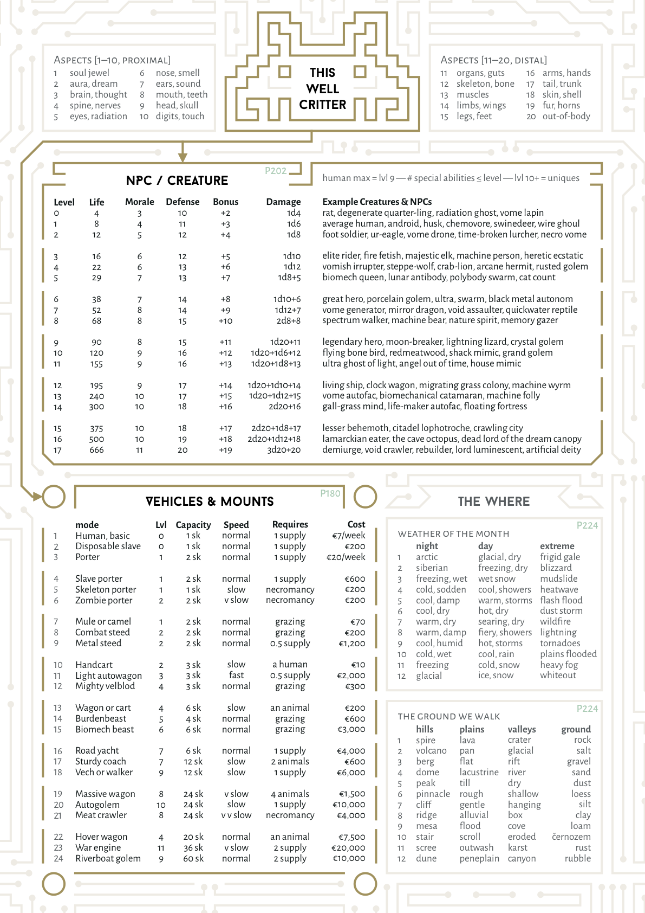
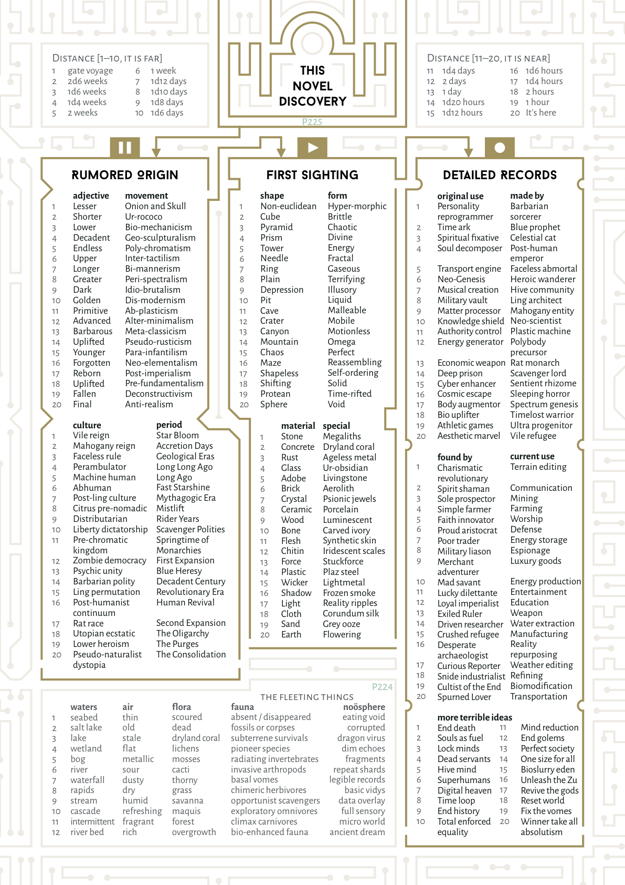

<!-- Page 241 -->

## **Index** **Terminus**

- Abbey of the Caretakers (discovery, Way Stone): 55
- Abilities, Stats: 4
- Adaptation, or Beneficial Mutations: 200
- Altar of the All-Knowing Idol (discovery, Cold Crust): 89
- Alter (discovery, Spectrum Palace): 131
- Archives of the Crystal Ship (discovery, Crystal Core): 93
- Armors, armor features: 191
- Ash Bubbles (discovery, Near Moon): 86
- Astral Turf (discovery, Forest of Meat): 149
- Autogolems: 187
- Azure Garden (discovery, Fallen Umber): 66
- Beasts of Burden: 183
- Biomancer’s Cradle (discovery, Forest of Meat): 149
- Black City (final destination): 150
- Black City Hermits (Black City): 154
- Black Grass (discovery, Gall Grass): 112
- Black Obelisk (Black City): 162
- Blood Marker (discovery, Serpent Stone): 78
- Blue Gate (discovery, Glass Bridge): 100
- Bone Mines of Moy Sollo (disc., South-Facing Pass): 63
- Boney Roads (discovery, Ribs): 123
- Boulder Ford (discovery, Gall Grass): 110
- Brain Mine (discovery, Warm Mantle): 91
- Bug Swamp (discovery, Moon-Facing Ford): 83
- Cantilevered Rim (discovery, Near Moon): 86
- Calendar: 224, 239
- Caravans: 165
  - caravan sheet: 239–240
  - sample caravans: 175
  - starter caravan: 174
- Carnibotanic Generator: 148
- Carousing: 4, 195
  - carousing spots: 195
  - in the Black City: 153
  - in the villages: 99
  - in the Violet City: 16
  - with porcelain princes: 29
- Cats, The: 14, 204
- Cauldron of the Revitalized Divinity (disc., Way Stone): 55
- Cave Octopus’ Garden (discovery, Lime Nomads): 24
- Cave of the Iron Worm (discovery, Ribs): 122
- Cell of Peace (discovery, Dead Bridge): 110
- Central Force Weaver (discovery, Crystal Core): 31
- Cerulean Five Oasis (discovery, Fallen Umber): 68
- Chaos Reigns (see Initiative): 4
- Chasm, Down in the (Dead Bridge, Dark Light): 139
- Cholan Woods (discovery, Three Sticks Lake): 106
- Chromium Dome (discovery, Potsherd Crater): 34
- City Mountain (discovery, Lime Nomads): 24
- Cliff Villages of Ghost and Clan (disc., Lime Nomads): 25
- Column Defense Golems (Porcelain Citadel): 29
- Column of Dead Beetles (discovery, Way Stone): 54
- Common Languages: 228
- Common Marker Stone (discovery, Serpent Stone): 78
- Conflict: 4
  - armor options: 191
  - attack and defense: 4
  - combat actions: 4
  - ranges and areas: 192
  - weapon options: 192, 193
- Copper Cairn (discovery, Long Ridge): 73
- Copper Hulls (discovery, Gall Grass): 111
- Core Bucca (discovery, Warm Mantle): 91
- Corruption, Biomagical: 200
- Cosmic Guardian Carcass (discovery, Moon’s Surface): 88
- Creatures, Overview: 202
- Creatures autofac: 39, 40, 55, 67, 72, 203
  - cat lords: 13, 14, 204
  - fetish: 44, 97, 204
  - golem: 29, 45, 98, 125, 205
  - great folk (humans): 61, 65, 71, 74, 206
  - humans (rainbowlanders): 206, 236
  - lake folk (villagers, humans): 96, 99, 216
  - lings: 101, 238, 226, 235
  - machine humans: 113, 235
  - marmotfolk: 123, 124, 207
  - nuclearlithics: 91–95
  - penglings: 167
  - pets: 207
  - porcelain princes: 28, 208
  - porcupine partnership: 68
  - post-mortals: 209, 230
  - radiation ghosts: 33, 57, 110, 142, 209, 236
  - quarterlings: 137, 210
  - spectrum satraps: 51, 128, 211
  - steppelanders (humans): 22–25, 212
  - ultras (after-humans): 25, 59, 213
  - vechs: 100, 141, 186, 214
  - viles (the chosen, the unchosen): 236, 237
  - vomes (violent mechanisms): 40, 215
  - water people (cold vomes): 103, 216
- Crushed Shell (discovery, Behemoth Shell): 76
- Cryptic Swallet (discovery, Near Moon): 86
- Cryptich o.t. Craquelure Queen (disc., Lime Nomads): 23
- Crystal Flower (discovery, Way Stone): 54
- Crystal Pylon of Memories Given Away (discovery, Low Road and High): 20
- Crystal Tree & Decayed City (disc., Spectrum Run): 117
- Cube of the Last Period (Black City): 154
- Damage, Injury: 4, 168
- Dark Hospital (Black City): 153
- Dead and Weird Languages: 229
- Dead Shore (discovery, Three Sticks Lake): 106
- Death: 230
  - alternatives to death, oracle: 231
  - resurrection side effects: 230
- Death’s Own Moon (discovery, Among the Stars): 95
- Deepest Glass (discovery, Glass Bridge): 100
- Defense: 4
- Destinations, Locations: 170
  - destination actions: 168
- Dice, Roll Types: 4
- Dimly Remembered Strife, History: 226
- Disaster of the Ivory Army (disc., Death-Facing Pass.): 58
- Discoveries: 170
  - discovery generator: 225
  - distance and direction: 170
  - strange urban locations: 144

> [@UVG_Black_City_2e, _p._ _241_]

<!-- Page 242 -->

- Distance (see Time): 168
- Earth Portal (Black City): 158
- Eerie Pearl (discovery, Trail of Vomish Dreams): 39
- Egg Chamber o.t. Void Creature (disc., Warm Mantle): 91
- Elephantine Graveyard (discovery, Iron Road): 133
- Encounters, Overview: 202
- Encounter Tables among shattered porcelain (Potsherd Crater): 33
  - among the houses (Endless Houses): 143
  - around the shell (Behemoth Shell): 75
  - beneath the moon (Near Moon): 85
  - bright and light (Spectrum Palace): 127
  - by the Last Serai (Last Serai): 47
  - edge of omega (Black City): 151
  - in a sudden spark of light (Dark Light): 140
  - in brown (Fallen Umber): 65
  - in the carnibotanic disaster (Forest of Meat): 147
  - in the lethal passage (Death-Facing Passage): 57
  - in the streets (Violet City): 14
  - in the Violet Lands (Violet City): 13
  - in the warm mantle (Near Moon): 90
  - near Moon River (Moon-Facing Ford): 81
  - near the citadel (Porcelain Citadel): 27
  - near the colossus (Grass Colossus): 43
  - near the Way Stone (Way Stone): 53
  - near Three Sticks (Three Sticks Lake): 103
  - of the white grass ocean (Serpent Stone): 77
  - on a hill of bones (Ribs of the Father): 121
  - on the exposed ridge (Long Ridge): 71
  - on the high grasslands (South-Facing Passage): 61
  - on the open trail (Trail of Vomish Dreams): 38
  - on the run (Cage Run): 124
  - on the solar dragon roads (Cage Run, Terranova): 125
  - on the steppe (Lime Nomads): 22
  - on the two roads (Low Road and the High): 19
  - on the western shore (Gall Grass): 107
  - on the white-grass plain (Ivory Plain): 134
  - over the chasm (Dead Bridge): 137
  - under a harsh rainbow (Spectrum Run): 115
  - with ditches (Refracting Trees): 118
  - with the hardly human (Iron Road): 132
- Encumbrance: 167
- End of Space (Black City): 152
- Endless Houses Generator: 144
- Equipment: 189–197
  - armors: 191
  - epic vehicles and mounts: 180
  - essentials: 189
  - implants, prosthetics: 194
  - money (cash): 166
  - random items, small treasures: 196
  - strange items: 196–197
  - toolkits: 190
  - transport features: 188
  - weapons: 192–193
- Erosion of War (discovery, Fallen Umber): 67
- Essential Items: 189
- Eternal Snaking Marker (discovery, Serpent Stone): 79
- Experience: 4
  - dining experiences: 17
- Exploding Dice: 16
- Exposed Pueblo (discovery, Death-Facing Pass.): 58
- Exposure chaos of possibility: 162
  - eerie weather systems: 112
  - hallucinogens: 17
  - hard radiation: 122
  - how bad was it?: 200
  - gater sickness: 223
  - interdimensional portal: 158
  - mutagenic: 200
  - odd tides: 85
  - phasing effects: 106
  - source code corruption: 171
  - time distortion: 111
  - unnatural aurorae: 116
  - unraveling space: 152
- Evergrowing Bone (discovery, Ribs): 123
- Fabled Stories, History: 227
- Face in the Air (discovery, Iron Road): 133
- Fallen Feast Hall (discovery, Long Ridge): 72
- Fallen Iron Obelisk (discovery, Trail o. V. Dr.): 39
- False Reality (building it, Black City): 161
- Fame, traveling far: 168
- Fast Stars (to visit): 157
- Ferry Graves (discovery, Glass Bridge): 100
- Field of Worms (discovery, Moon’s Surface): 88
- Final Countdown (discovery, Crystal Core): 93
- Final Embassy (Last Serai): 51
- Financiers: 176
- Fool’s Wall (Black City): 152
- Foraging: 171
- Forgotten Times, History: 226
- Full Spectrum Embassy (Black City): 152
- Garnet Ford (discovery, Gall Grass): 109
- Gates: 222
- Blue Gate (Glass Bridge): 100
- Earth Portal (Black City): 158
- Green Portal (Black City): 159
- Mercer Gate (Serpent Stone Marker): 79
- Sealed Gate (Low and High Road): 21
- Sky Portal (Black City): 157
- Third Portal (Black City): 158
- Wind Portal (Black City): 159
  - five Black City gates: 126–128
- Gemstone Tomb, Lake of Oil (disc., Spectrum Run): 117
- Gentle Mile (discovery, South-Facing Pass.): 62
- Ghoul Pile (discovery, Endless Houses): 145
- Glass Bridge (discovery, Glass Bridge): 98
- Glass Bridge’s Ghost (discovery, Moon-Facing Ford): 83
- Glass House of a Dead Prince (Potsherd Crater): 35–37
- Glossary: 232–237
- Grand Long Map of the UVG: 7–11
- Grand Observer (Black City): 155
- Grass Circles (discovery, Long Ridge): 72
- Gravel River (discovery, Glass Bridge): 100
- Great Biomechanical Baobab (disc., Lime Nomads): 23
- Green Portal (Black City): 159
- Grey Glow (discovery, Three Sticks Lake): 106
- Ha, Ka, Ba: 230
  - ba, personality: 232
  - ha, body: 234
  - hakaba matrix: 230
  - ka, soul: 234
- Hairwoods (discovery, Gall Grass): 108
- Hall of the Umber King (discovery, Fallen Umber): 66
- Harmonium (Last Serai): 50
- High Horse Steppe (discovery, Glass Bridge): 101
- High Moon Crossing (discovery, Glass Br.): 101
- Higher Spinewoods (discovery, Gall Grass): 108
- Hiring Help: 180
- History and Myth: 226–227
  - anti-canon: 226
  - historic periods: 225
  - myths of the quarterlings: 210
  - spectrum myth-symbol complex: 128
  - stories of magic gates: 222
- Hooks (see Quests): 178
- House of Steam (discovery, Dark Light): 141
- House on the Edge of Time (Black City): 163
- Ideal Fractal City (Black City): 161
- Ideal Island (discovery, Behemoth Shell): 76
- Ignored Tower (Last Serai): 51
- Infinite Recursions of the Real (Black City): 161
- Initiative: 4
- Inventory: 167
- Investigations, Explorations: 45
  - celebrations at the Grass Colossus: 45
  - creatures of the Near Moon: 87
  - dining establishments: 17
  - dragon roads: 125
  - drugs in a purple haze: 17
  - fordite coral kraals: 82
  - lost in a maze of light: 116
  - merchant prince’s palace: 36
  - moon’s crystal core: 92
  - new discoveries: 225
  - noxic canyon: 139
  - playing with the Near Moon, crystal ship: 94
  - radioactive shrine: 122
  - river crossings: 81, 83
  - ruined city: 144
  - toxic pits: 145
  - strange lunar fossils: 89
- Vorgo’s strange situation: 14
- Iridescent Mushroom Hall (disc., Refracting Trees): 119
- Iron Pike Village (Three Sticks Lake): 104
- Jade Baobab Village (Three Sticks Lake): 104
- Juniper Scrub (discovery, Three Sticks Lake): 105
- Knowing Tree (discovery, Forest of Meat): 149
- Lacquered Chaos of Possibility (Black City): 162
- Lake of the Bottomless Eye (discovery, Ribs): 123
- Languages: 228–229
- Last Arcology (discovery, Iron Road): 133
- Last Cableway (discovery, Cage Run): 125
- Last Chair Salon (discovery, Violet City): 15
- Last Projector (discovery, Dead Bridge): 138
- Last Trading House (Last Serai): 50
- Lavender Cliffs (Lime Nomads): 25
- Leering Abyss (discovery, Ivory Plain): 135
- Levels, creature levels: 202
  - helpers: 15, 180
  - heroes and experience: 4
- Location Generators: 224
  - locations in a merchant’s palace: 37
  - places in Cerulean 5 Oasis: 69
  - places in Spectrum Palace: 129
  - places of polished porcelain: 30
  - urban features table: 144
  - passages and chambers, Near Moon: 88, 89, 90, 92
  - weird places in the Last Serai: 49
- Lonely Lodge (discovery, Ivory Plain): 135
- Lonely Shore (discovery, Three Sticks Lake): 106
- Long Slog (discovery, Glass Bridge): 101
- Lower Spines (discovery, Gall Grass): 112
- Lurid Pines (discovery, Behemoth Shell): 75
- Mad Autofarm (discovery, Potsherd Crater): 35
- Magnificent Dead (Black City): 160
- Magitech, Fantascience: 4
  - spells: 198–199
- Map, Diagram Among Stars Fast and Slow: 95
- Grand Long Map of the UVG: 7–11
- Grass Colossus: 43
- Last Serai: 48
- Places of Polished Porcelain: 31
- Potsherd Crater: 34
- Quicksand Bunker: 119
- Three Sticks Lake Region Map: 96
- Vome Hive 4c: 35
- Master Control (discovery, Crystal Core): 93
- Mausoleum of the Wire (discovery, Way Stone): 55
- Maze of Light (discovery, Spectrum Run): 116
- Megadungeon, Near Moon: 87
- Memorial of Pain (discovery, Ribs): 122

> [@UVG_Black_City_2e, _p._ _242_]

<!-- Page 243 -->

- Memory Bone (discovery, Cage Run): 125
- Metal Steeds: 184
- Milk Run, Established Trade Routes: 177
- Milky Orb (discovery, Gall Grass): 110
- Misfortune: 169
  - misfortune modifiers: 169
- Money, Cash: 166
- Morale, running away: 202
- Motor Agate Outcrop (disc., Low Road & High): 21
- Museal Crevasse (discovery, Moon’s Surface): 88
- Museum of the Highway Star (disc., Cold Crust): 89
- Mutation (see Corruption): 200
- Names: 3, 204–216, 220–221
- Near Moon, a generative megadungeon: 87–93
- Cold Crust: 89
- Crystal Core: 92
- Ground Below: 85
- Moon’s Surface: 87
- Playing with the Crystal Ship: 94
- Warm Mantle: 90
- Near Moon Door (discovery, Moon’s Surface): 88
- Needle of the World: 159, 235
- Neon Ziggurat (discovery, Spectrum Palace): 130
- Nexus of Cables (discovery, Dark Light): 141
- Noosphere Translation: 159
- NPCs, Other Voyagers: 220–221
  - a hundred other voyagers: 220–221
  - clansfolk and madsfolk: 44
  - council-symbionts of the Satraps: 129
  - cosmic firmament of heroes: 163
  - distributed princes of the citadel: 28
  - financiers, patrons: 176
  - heroic backgrounds: 2
  - highwaymen or henchmen: 15
  - hopeless immortals: 130
  - remote oasis residents: 68
  - six hermits: 154
- Spectrum Lodge guests: 85
  - vomes in a typical nest: 40
- Nuclearlithic Hive (discovery, Warm Mantle): 91
- Null Object of Desire (Grand Observer): 155
- Oasis of Mirrors (discovery, Way Stone): 54
- Obsidian Knives (discovery, Three Sticks Lake): 105
- Old Isle (discovery, Three Sticks Lake): 105
- Old River (discovery, Glass Bridge): 98
- Olive Jerah (discovery, Moon-Facing Ford): 83
- One Ageless Spire of the Only Onager (discovery, Endless Houses): 145
- Oracle of the Death Dice: 231
- Oral History of the Revolution, History: 227
- Orbital Pyramid of the Punta (disc., Among the Stars): 95
- Organizations, Corporations: 176
- Organ Lake (discovery, Ivory Plain): 135
- Organ of the Stars (discovery, Warm Mantle): 91
- Orifice of the Mantle (discovery, Cold Crust): 122
- Ossifying Tars (discovery, Ribs): 122
- Overloaded Transport: 181
- Perfect House (discovery, Endless Houses): 145
- Perfect Universe Generator (discovery, Crystal Core): 93
- Pine-Crusted Lophotroche (discovery, Serpent Stone): 79
- Pink Crystal (discovery, Dark Light): 141
- Player Characters, PCs, Heroes character sheet: 238
  - choosing skills: 4
  - generating abilities: 4
  - henchmen for hire: 15
  - names: 3
  - quirks: 3
  - who is this hero?: 2
- Pool of Renewed Ambition (discovery, Dark Light): 141
- Porters: 181
- Potsherd Crown (discovery, Low Rd. & High): 20
- Pre-City (Black City): 160
- Prophecies Out of Time (Black City): 156
- Puce House (discovery, South-Facing Pass.): 62
- Pylon Kraal Above Moon River (Moon-Facing Ford): 81
- Quests, Hooks merchant prince’s palace: 36
  - celebrated by the quarterlings: 210
  - forest of meat hooks: 148
  - mutated rodents: 75
  - stories for Cerulean 5 Oasis: 69
  - satrap quests, price of information: 116
  - ancient gate hooks: 223–223
  - travel quests: 178
  - true purpose of the long-dead: 117
  - vome nest objectives: 40
- Quicksand Bunkers (discovery, Refracting Trees): 119
- Razorwater (discovery, Gall Grass): 108
- Reactions, Hostility: 202
- Red Bear Village (Glass Bridge): 98
- Red Grass (discovery, Three Sticks Lake): 105
- Red River (discovery, Three Sticks Lake): 105
- Reliable Ferry (discovery, Moon-Facing Ford): 83
- Rest and Recovery: 168, 195
- Revolving Palace (discovery, Endless Houses): 145
- Road Yachts: 185
- Rolls, Tests: 4
- Rose Towers (discovery, Gall Grass): 109
- Rusted Hand of Victory (disc., Low Road and High): 20
- Rusty Bridge (discovery, Three Sticks Lake): 105
- Satrap Outposts (discovery, Spectrum Run): 116
- Savage Biomech Tribe (disc., Trail of Vomish Dreams): 39
- Schkarp (discovery, Long Ridge): 73
- Screaming Visages (discovery, Refracting Trees): 119
- S.E.A.C.A.T. Rules: 4
  - core mechanics: 4
  - creature mechanics: 202
  - hero mechanics: 4
- Sealed Gate (discovery, Low Road and High): 21
- Secret Empress, Gaze of the Memorium (Sp. Palace): 129
- Secrets, Lost Truths: 117
  - incredible news to share: 117
  - memories of the magnificent dead: 160
  - much old magitech: 119
  - of the techno shamans: 130, 152
- Services, medical, mechanical, R&R: 195
- Shadow Houses (discovery, Endless Houses): 145
- Skills: 4
- Skulltown (discovery, Ribs): 123
- Skybridge (discovery, Gall Grass): 108
- Sky Portal (Black City): 157
- Sky River (discovery, Gall Grass): 108
- Sky Tower (discovery, Long Ridge): 73
- Slathered Shallows (discovery, Moon-Facing Ford): 83
- Slow Shrimp Waters (discovery, Moon-Facing Ford): 83
- Solar Dragon Roads (discovery, Cage Run): 125
- Source Code Corruption: 171
- Source Fac Johnny-7 (disc., Trail of Vomish Dreams): 39
- Sparkling Shore (discovery, Glass Bridge): 101
- Spectrum Lodge (Near Moon): 85
- Spells: 198–199
  - spell price: 4
- Spring of the Yellow Waters (disc., Lime Nomads): 23
- Starvation: 171
  - cannibalism: 171
- Stele of the Pierced Blossom (disc., Fallen Umber): 67
- Stones of Donation & Gifts (Black City): 155
- Stowaway’s Home (discovery, Crystal Core): 93
- Suffocation: 171
- Supplies: 167, 179, 189
- Teal River (discovery, Gall Grass): 110
- Third Portal (Black City): 158
- Thirst: 171
- Three Sticks (discovery, Gall Grass): 112
- Time: 168
  - in combat: 4
  - seasons: 224
- Tomb of the Dragon Also Rises (disc., Way Stone): 54
- Toolkits: 190
- Totem of the Skies (discovery, Dead Bridge): 138
- Toxic Dust (Black City): 160
- Trade: 172–173, 177
  - deals and haggling: 172
  - market research: 172
  - trade obstacles: 172
  - trade quests: 172
  - trade routes, returns: 177
  - trading with the Black City: 154
- UVG trade goods: 173
- Transport: 180–188
  - heavy vehicles: 186–187
  - light vehicles: 184–185
  - mounts and beasts: 182
  - overloading accidents: 181
  - porters, humanoids: 181
  - transport types: 180
  - trouble with transport: 188
  - undead transport: 182
  - upgrading: 181
  - vehicle features: 188
  - wagons, carts, chariots: 184
- Travel Rules: 168–171
  - caravans: 174–175
  - map: 7–11
  - transport options: 180
  - travel quests: 178
  - weekly travel actions: 168
- Treasure: 167
  - archaic wonders of the ultras: 59
  - hundred soap-sized treasures: 196–197
  - merchant prince’s palace: 37
  - implants and prosthetics: 194
- Undead Porters: 182
- Units of Weight, Sacks, Stones, Soaps: 167
- Vandalism, hacking up treasure: 167
- Vault of the Lost Ultras (disc., Death-Facing Pass.): 59
- Vechs, Walkers: 186, 214
- Verdigris Ribs (discovery, Lime Nomads): 23
- Vicar’s Beach (discovery, Gall Grass): 113
- Village of Hopeless Immortals (disc., Spectr. Palace): 130
- Wagons, carts, and chariots: 184
- Wandering Behemoth (disc., South-Facing Pass.): 63
- Warehouse of Sleeping Void Crawlers (discovery, Cold Crust): 89
- War Engines: 187
- Waterlogged Quarry (discovery, Potsherd Crater): 34
- Weapons: 192–193
  - weapon features: 192
- Weather and Climate: 224
- Wicker Autowagons: 185
- Wilderness Actions: 168
- Wind Portal (Black City): 159
- Wine River (discovery, Gall Grass): 109
- Wizardry: 198, 237
  - fetishes, imbuing base matter: 204
  - polybody wizardry: 29, 208
- Wreck, Dark Aster (discovery, Warm Mantle): 91
- Zu Complex: 237

> [@UVG_Black_City_2e, _p._ _243_]

<!-- Page 244 -->

## **Wish You Were Here**

> [@UVG_Black_City_2e, _p._ _244_]

<!-- Page 245 -->

## **At The Edge of Time and Space**

> [@UVG_Black_City_2e, _p._ _245_]

<!-- Page 246 -->

#### **Enter the synthetic dream machine**

_entrance at own risk_

_terms and conditions apply_

Life getting you down? Feeling worn out? Bored? Blue?

Enjoy fantascience roleplaying in another golden age! Fun for all levels. A metaquel to the UVG. Featuring:

Leave your Dying Earth (other worlds also eligible) behind and experience adventure everlasting in the endless lands of the Given World®.

Roll dice to win.

Stratified class system! Fully illustrated with traditional human craft. Noösphere and hylosphere—two worlds for the price of one.

[REDACTED] Magic indistinguishable from technology. Anticanon world generation. Inherited property structures. Downtime rest, relaxation, and biomodification.

**Available via Exalted Funeral. Learn more at www.syntheticdreammachine.com**

Come to H.E.A.V.E.N.TM (some restrictions apply) and enjoy ANOTHER GOLDEN AGE® under the benevolent protection of the Dream Canopy*.

_SDM brought to you courtesy of WizardThiefFighter Studio,_ _the Stratometaship, and Exalted Funeral._

*All hail our Viral Intelligent Life Engineers. Use of synthetic dream machine is governed by Reality Translation Protocol 773-B of the Manyworlds Pan-Settlement Initiative. Please verify that you are human before using the synthetic dream machine. Beverages available in the synthetic dream machine may not be compatible with all human physiologies. May contain nuts. Entrance at own risk. Terms and conditions reapply. Terms and conditions may change without prior notice. Self-representation may change in the synthetic dream machine. Please be aware that the synthetic dream machine is not a simulation. Any suggestion that it is a simulation is covered by the edict Against the Simulated Cosmos Heresy (e.3.c. “simucos”). Please act accordingly. Satisfaction is recommended.

> [@UVG_Black_City_2e, _p._ _246_]

<!-- Page U -->

> [@UVG_Black_City_2e, _p._ _U_]

<!-- Page V -->

## **This Week the Caravan Is**

- **Traveling:** -> Travel Procedures. Caravan as character. One daemon rolls, take turns.
- **In the wilderness:** -> First, Destination or Camp Actions. Each hero acts. -> Then, Regular Travel Procedures.
- **At a destination:** -> First, Destination or Camp Actions. Each hero acts. -> Then, Regular Travel Procedures.

**Travel Months (P224)**

| Month | Name |
| --- | --- |
| 4 | Greenmonth |
| 5 | Redmonth |
| 6 | Orangemonth |
| 7 | Yellowmonth |
| 8 | Oldsecond |
| 9 | Unity |

**Trackless Months (P224)**

| Month | Name |
| --- | --- |
| 10 | Violetmonth |
| 11 | Snowbringer |
| 12 | Deadwinter |
| 1 | Newfirst |
| 2 | Lastmonth |
| 3 | Firstmonth |

## **Travel Procedures**

1. Spend Supplies
2. Roll Misfortune
3. Encounters
4. Rest
5. Tally Extra Days

### 7+ Days Tallied?

- **Yes:** -> Repeat 1: Spend Supplies.
- **No:** Arrived at New Destination?
  - **Yes:** Free Destination Action: Look for Discoveries.
  - **No:** End of this leg of the journey.

**1: Supplies (P167)**

1 sack of supplies/creature/week.

| Unit | Equals |
| --- | --- |
| 1 sack | 10 stones = 100 soaps = €2,500 |
| 1 cash | laborer's day pay |
| 1 soap | potion, pen, parasite |
| 1 stone | sword, shovel, shield |
| 1 sack | packed human inventory |

| At a Destination | Cost |
| --- | --- |
| Bad supplies | €1d4*/sack |
| Good supplies | €3d6*/sack |
| Living expenses instead of spending supplies | €2d4*/week |

| Out of Supplies (Rule of 3 and 7) | Effect |
| --- | --- |
| Food: 3 weeks without | weak and sick |
| Food: 7 weeks without | dead or dying |
| Drink: 3 days without | weak and hallucinating |
| Drink: 7 days without | dead or dying |
| Air: 3 minutes without | gasping |
| Air: 7 minutes without | dead or dying |

**2: Misfortune (P169)**

A different PC rolls each week for the whole caravan. Circumstances can provide a bonus (guides, maps) or penalty (rushing, poor gear). Characters save individually.

| Roll | Cruelties of the Road |
| --- | --- |
| 1 | Confusion! chaos! (-1 week) |
| 2-3 | Affliction (-3 ability pts) |
| 4-6 | Delay (-1d6 days) |
| 7 | Lucky detour (-1d4 days, but gain 1d4 resources) |
| 8-9 | Injury (-1d6 life) |
| 10-12 | Food poisoning (-1d3 life) |
| 13 | Rough shortcut (+1 days, but 1 item worn out) |
| 14-19 | Scenery, mood, weather, stories shared by the stars |
| 20+ | Good fortune at a cost (lose resources to gain an item, skill, or ally) |

**4: Rest (P168)**

Any PC who does nothing all week does one of the following:

| Result |
| --- |
| Recovers all missing Life (hp) |
| Completely recovers one stat (ability score or other attribute) |
| Removes one burden (fatigue, harmful effect, curse, etc.) |

**5: Tally Extra Days (P168)**

Each week for the whole caravan. Days flow endless in the sun.

| Rule | Notes |
| --- | --- |
| From misfortunes, events, and actions | Days flow endless in the sun. |
| Fast tags negate one tally each | all mounted, a good guide, fine steeds, fast golems, etc. |
| Slow tags add one tally each | encumbered, sick, heavy, slow, damaged, crippled, etc. |

**This Week's Camp (P000)**

This wilderness, this abandoned place, this flicker of light in the Vast, this moment of respite.

| d8 | Nature's gift |
| --- | --- |
| 1 | Biomech copse |
| 2 | Livingstone corral |
| 3 | Shaded overhang |
| 4 | Gentle glade |
| 5 | Babbling brook |
| 6 | Discrete vale |
| 7 | Outlook rise |
| 8 | Watering hole |

| d8 | History's remnant |
| --- | --- |
| 1 | Ur-metal lattice |
| 2 | Stuck aeroliths |
| 3 | Cerametal shell |
| 4 | Crystal roadwork |
| 5 | Luminous mounds |
| 6 | Rusted defenses |
| 7 | Tumbled houses |
| 8 | Monument of shadow and light |

| d8 | Road's worries |
| --- | --- |
| 1 | Ague |
| 2 | Moldy food |
| 3 | Flies |
| 4 | Dust |
| 5 | Rust |
| 6 | Fog |
| 7 | Sour water |
| 8 | Trails gone to mud or flood |

| d8 | Campfire banter |
| --- | --- |
| 1 | Common enemy |
| 2 | Forgotten family |
| 3 | Shared contact |
| 4 | Duty, obligation |
| 5 | Dream, desire |
| 6 | Fun, humor |
| 7 | Sorrows, loss |
| 8 | Higher purpose, meaning, goals |

> [@UVG_Black_City_2e, _p._ _V_]

<!-- Page W -->

**Roll**

d20 + Ability + Skill over target.

| Target | Difficulty |
| --- | --- |
| 3 | trivial |
| 7 | easy |
| 11 | mediocre |
| 15 | hard |
| 19 | very hard |

**Actions**

| Destination Actions | Camp Actions |
| --- | --- |
| Look for Discoveries | Care |
| Market Research | Forage |
| Buy and Sell [haggle] | Study |
| Carouse | Hide |
| or Any Camp Action | Ambush |

**Look for Discoveries (P170)**

Once per week, a PC asks around for discoveries to visit. First roll at a destination is free, extra investigations cost €1d6 x 10 each.

| roll result | outcome |
| --- | --- |
| 1-3 | Misfortune |
| 4-11 | Mere rumors |
| 12-19 | 1 discovery |
| 20-24 | 2 discoveries |
| 25+ | 3 discoveries |

Choose or create new discoveries.

**Market Research (P172)**

Any PC. What kinds of prices does a trade good fetch at an/a...

| Scope | Time |
| --- | --- |
| adjacent destination | 1 day |
| chain of 3 destinations | 1 week |

Each PC can research on their own. Roll once for each destination.

| roll | price | ...and outcome |
| --- | --- | --- |
| 1-2 | 0 | Taboo? Useless? |
| 3-6 | x0.5 | Low demand |
| 7-12 | x1 | Normal demand |
| 13 | x1 | [-] to haggling |
| 14-15 | x2 | Popular but illegal |
| 16-17 | x2 | High demand |
| 18 | x3 | Market bubble! |
| 19 | x4 | Crisis demand |
| 20 | x1 | Source. Made here |

**Buy and Sell (Haggling) (P172)**

Any PC. Bulk sales take a week.

| Option | Note |
| --- | --- |
| accept local price | automatic |
| haggle | roll |
| schmooze | €1d6 x 100 to gain [+] |

| roll price ...and | outcome |
| --- | --- |
| 1 | 0 Goods confiscated! |
| 2-5 | x0.5 Ripped off! |
| 6-13 | x1 Fair and reasonable |
| 14-17 | x1.2 Solid profit |
| 18-19 | x1.5 Good profit |
| 20+ | x3 Better skip town... |

**Carousing (P16)**

Any PC. Spend a week & €1d6*x100, then gain that many XP & roll. Can't pay = [-] on roll. *exploding*

| roll ...and consequences | outcome |
| --- | --- |
| 1 | No XP and bad outcomes |
| 2-7 | Bad luck, silver linings |
| 8-11 | Annoying consequences |
| 12-15 | Silly results |
| 16-19 | Color, but all's well |
| 20-24 | Jolly, humorous boon |
| 25+ | A magical or rare gift |

**Forage (P171)**

Any character. Rich lands = bonus [+], poor lands = penalty [-].

| roll ...and foraging | outcome |
| --- | --- |
| 1 | Nothing and an injury |
| 2-3 | Nothing |
| 4-6 | 1 sack of supplies (€10) |
| 7 | 1 sack (€10) and a discovery |
| 8-12 | 2 sacks of supplies (€20) |
| 13 | 2 sacks and an injury |
| 14-15 | 2 sk of rich supplies (€40) |
| 16-19 | 3 sacks of supplies (€30) |
| 20-24 | 4 sacks of supplies (€40) |
| 25+ | 2 sacks (€20) and a discovery |

**Care (P168)**

Any character. Once per patient. Patient recovers an additional attribute this week.

**Study (P4)**

Any character. Learning most new skills requires 4 successes from different sources.

| roll study outcome | result |
| --- | --- |
| 1-3 | Dead end. Need +1 success |
| 4-11 | Learned nothing |
| 12-19 | A success! |
| 20-24 | 2 successes! |
| 25+ | A success and a new trait |

**Hide (P202)**

Once per week, a PC works to hide traces of the camped caravan. Bonus [+] to avoid or choose encounters that week.

**3: Encounter (P202)**

Something happens every week. A different PC rolls each week for the distance, size, and attitude of the encountered group.

- Most encounters should not lead to combat.
- PCs can sacrifice sacks to skip an encounter (bribes?).

| d6 | how far away are they? |
| --- | --- |
| 1 | Right here! An ambush! |
| 2 | Close enough to talk |
| 3 | Gesture distance |
| 4 | Broad outlines visible |
| 5 | Specks and distant dust |
| 6 | Tracks and traces remain |

| d6 | how many are they? |
| --- | --- |
| 1 | Many! PCs far outnumbered |
| 2 | Plenty. More than the PCs |
| 3 | About equal in number |
| 4 | Fewer than the party |
| 5 | Just one. A sole survivor? |
| 6 | None. Or all deceased. |

| d6 | what is their attitude? |
| --- | --- |
| 1 | Aggressive. Ready weapons! |
| 2 | Hostile. Scared |
| 3 | Suspicious. With good reason? |
| 4 | Wary. Noncommittal |
| 5 | Neutral. Ready to talk |
| 6 | Friendly. What fools |

**Morale (P202)**

Goes to 11. When the omens turn grim, NPCs roll 2d6. If the result is higher than morale, it flees. Morale math = 3 + half level.

**Chase (P000)**

Run, rabbit run. Both parties roll. Faster = [+], slower = [-]. Victories increase/decrease distance.

| Range | Result |
| --- | --- |
| Here | Melee range. Caught |
| There | Short range |
| Over there | Long range |
| Off-stage | Escaped |

**Treasure (P167)**

d00 roughly ...value.

| d00 | Value |
| --- | --- |
| 01-50 | uncommon €50 |
| 51-80 | valuable €250 |
| 81-98 | rare €1,000 |
| 99-00 | exceptional €5,000 |
| 00/0 | unique €25,000 |

**Ambush (P4)**

Once per week, a PC works to lay an ambush for another group. If a conflict breaks out:

- [+] to surprise opponents.
- Each ally gains a tactical bonus [+] to one roll.

**Initiative?! (P4)**

d6 + Agility. Random character rolls for each side. High roll wins. Tie = everything happens at once.

> [@UVG_Black_City_2e, _p._ _W_]

<!-- Page X -->

## **This Well Critter**

**Aspects [1-10, Proximal; 11-20, Distal]**

| d20 | Aspect |
| --- | --- |
| 1 | soul jewel |
| 2 | aura, dream |
| 3 | brain, thought |
| 4 | spine, nerves |
| 5 | eyes, radiation |
| 6 | nose, smell |
| 7 | ears, sound |
| 8 | mouth, teeth |
| 9 | head, skull |
| 10 | digits, touch |
| 11 | organs, guts |
| 12 | skeleton, bone |
| 13 | muscles |
| 14 | limbs, wings |
| 15 | legs, feet |
| 16 | arms, hands |
| 17 | tail, trunk |
| 18 | skin, shell |
| 19 | fur, horns |
| 20 | out-of-body |

**NPC / Creature**

- Human max = lvl 9 
- \# special abilities <= level
- lvl 10+ = uniques.

| Level | Life | Morale | Defense | Bonus | Damage | Example Creatures & NPCs |
| --- | --- | --- | --- | --- | --- | --- |
| 0 | 4 | 3 | 10 | +2 | 1d4 | rat, degenerate quarter-ling, radiation ghost |
| 1 | 8 | 4 | 11 | +3 | 1d6 | average human, android, husk, chemovore |
| 2 | 12 | 5 | 12 | +4 | 1d8 | swinedeer, wire ghoul, foot soldier, ur-eagle, wild horse, snake jackal |
| 3 | 16 | 6 | 12 | +5 | 1d10 | elite rider, fire fetish, majestic elk |
| 4 | 22 | 6 | 13 | +6 | 1d12 | machine person, heretic ecstatic vomish irrupter, steppe-wolf |
| 5 | 29 | 7 | 13 | +7 | 1d8+5 | crab-lion, arcane hermit, rusted golem |
| 6 | 38 | 7 | 14 | +8 | 1d10+6 | biomech queen, lunar antibody, polybody swarm |
| 7 | 52 | 8 | 14 | +9 | 1d12+7 | cat count, great hero, porcelain golem, ultra, swarm |
| 8 | 68 | 8 | 15 | +10 | 2d8+8 | black metal autonom, vome generator, mirror dragon, void assaulter |
| 9 | 90 | 8 | 15 | +11 | 1d20+11 | quickwater reptile, spectrum walker, machine bear |
| 10 | 120 | 9 | 16 | +12 | 1d20+1d6+12 | nature spirit, memory gazer, legendary hero |
| 11 | 155 | 9 | 16 | +13 | 1d20+1d8+13 | moon-breaker, lightning lizard, crystal golem |
| 12 | 195 | 9 | 17 | +14 | 1d20+1d10+14 | flying bone bird, redmeatwood, shack mimic |
| 13 | 240 | 10 | 17 | +15 | 1d20+1d12+15 | grand golem, ultra ghost of light, angel out of time |
| 14 | 300 | 10 | 18 | +16 | 2d20+16 | house mimic, living ship, clock wagon, migrating grass colony |
| 15 | 375 | 10 | 18 | +17 | 2d20+1d8+17 | machine wyrm, vome autofac, biomechanical catamaran |
| 16 | 500 | 10 | 19 | +18 | 2d20+1d12+18 | machine folly, gall-grass mind, life-maker autofac, floating fortress, lesser behemoth, citadel lophotroche |
| 17 | 666 | 11 | 20 | +19 | 3d20+20 | crawling city, lamarckian eater, the cave octopus, dead lord of the dream canopy, demiurge, void crawler, rebuilder, lord luminescent, artificial deity |

P202

## **Vehicles & Mounts (P180)**

| Mode | Lvl | Capacity | Speed | Requires | Cost/week |
| --- | --- | --- | --- | --- | --- |
| Human, basic | 0 | 1 sk | normal | 1 supply | €7/week |
| Disposable slave | 0 | 1 sk | normal | 1 supply | €200 |
| Porter | 1 | 2 sk | normal | 1 supply | €20/week |
| Slave porter | 1 | 1 sk | normal | 1 supply | €600 |
| Skeleton porter | 1 | 2 sk | slow | necromancy | €200 |
| Zombie porter | 2 | 2 sk | v slow | necromancy | €200 |
| Mule or camel | 1 | 2 sk | normal | grazing | €70 |
| Combat steed | 2 | 2 sk | normal | grazing | €200 |
| Metal steed | 2 | 2 sk | normal | 0.5 supply | €1,200 |
| Handcart | 2 | 3 sk | slow | a human | €10 |
| Light autowagon | 3 | 3 sk | fast | 0.5 supply | €2,000 |
| Mighty velblod | 4 | 3 sk | normal | grazing | €300 |
| Wagon or cart | 4 | 4 sk | slow | an animal | €200 |
| Burdenbeast | 5 | 6 sk | normal | grazing | €600 |
| Biomech beast | 6 | 6 sk | normal | grazing | €3,000 |
| Road yacht | 7 | 7 sk | normal | 1 supply | €4,000 |
| Sturdy coach | 7 | 7 sk | slow | 2 animals | €600 |
| Vech or walker | 9 | 12 sk | slow | 1 supply | €6,000 |
| Massive wagon | 8 | 24 sk | v slow | 4 animals | €1,500 |
| Autogolem | 10 | 24 sk | slow | 1 supply | €10,000 |
| Meat crawler | 8 | 24 sk | v v slow | necromancy | €4,000 |
| Hover wagon | 4 | 20 sk | normal | an animal | €7,500 |
| War engine | 11 | 36 sk | v slow | 2 supply | €20,000 |
| Riverboat golem | 9 | 60 sk | normal | 2 supply | €10,000 |

## **The Where (P224)**

Weather of the Month (d12)

| d12 | Night | Day | Extreme |
| --- | --- | --- | --- |
| 1 | arctic | glacial, dry | frigid gale |
| 2 | siberian | freezing, dry | blizzard |
| 3 | freezing, wet | wet snow | mudslide |
| 4 | cold, sodden | cool, showers | heatwave |
| 5 | cool, damp | warm, storms | flash flood |
| 6 | cool, dry | hot, dry | dust storm |
| 7 | warm, dry | searing, dry | wildfire |
| 8 | warm, damp | fiery, showers | lightning |
| 9 | cool, humid | hot, storms | tornadoes |
| 10 | cold, wet | cool, rain | plains flooded |
| 11 | freezing | cold, snow | heavy fog |
| 12 | glacial | ice, snow | whiteout |

The Ground We Walk (d12)

| d12 | Hills | Plains | Valleys | Ground |
| --- | --- | --- | --- | --- |
| 1 | Spire | Lava | Crater | Rock |
| 2 | Volcano | Pan | Glacial | Salt |
| 3 | Berg | Flat | Rift | Gravel |
| 4 | Dome | Lacustrine | River | Sand |
| 5 | Peak | Till | Dry | Dust |
| 6 | Pinnacle | Rough | Shallow | Loess |
| 7 | Cliff | Gentle | Hanging | Silt |
| 8 | Ridge | Alluvial | Box | Clay |
| 9 | Mesa | Flood | Cove | Loam |
| 10 | Stair | Scroll | Eroded | Chernozem |
| 11 | Scree | Outwash | Karst | Rust |
| 12 | Dune | Peneplain | Canyon | Rubble |

> [@UVG_Black_City_2e, _p._ _X_]

<!-- Page Y -->

## **This Novel Discovery**

P225

**Distance [1-10, it is far; 11-20, it is near]**

| d20 | Distance |
| --- | --- |
| 1 | gate voyage |
| 2 | 2d6 weeks |
| 3 | 1d6 weeks |
| 4 | 1d4 weeks |
| 5 | 2 weeks |
| 6 | 1 week |
| 7 | 1d12 days |
| 8 | 1d10 days |
| 9 | 1d8 days |
| 10 | 1d6 days |
| 11 | 1d4 days |
| 12 | 2 days |
| 13 | 1 day |
| 14 | 1d20 hours |
| 15 | 1d12 hours |
| 16 | 1d6 hours |
| 17 | 1d4 hours |
| 18 | 2 hours |
| 19 | 1 hour |
| 20 | It's here |

## **Rumored Origin**

(Roll once on each column.)

| d20 | adjective | movement | culture | period |
| --- | --- | --- | --- | --- |
| 1 | lesser | Onion and Skull | Vile reign | Star Bloom |
| 2 | shorter | Ur-rococo | Mahogany reign | Accretion Days |
| 3 | lower | Bio-mechanicism | Faceless rule | Geological Eras |
| 4 | decadent | Geo-sculpturalism | Perambulator | Long Long Ago |
| 5 | endless | Poly-chromatism | Machine human | Long Ago |
| 6 | upper | Inter-tactilism | Abhuman | Fast Starshine |
| 7 | longer | Bi-mannerism | Post-ling culture | Mythagogic Era |
| 8 | greater | Peri-spectralism | Citrus pre-nomadic | Mistlift |
| 9 | dark | Idio-brutalism | Distributarian | Rider Years |
| 10 | golden | Dis-modernism | Liberty dictatorship | Scavenger Polities |
| 11 | primitive | Ab-plasticism | Pre-chromatic kingdom | Springtime of Monarchies |
| 12 | advanced | Alter-minimalism | Zombie democracy | First Expansion |
| 13 | barbarous | Meta-classicism | Psychic unity | Blue Heresy |
| 14 | uplifted | Pseudo-rusticism | Barbarian polity | Decadent Century |
| 15 | younger | Para-infantilism | Ling permutation | Revolutionary Era |
| 16 | forgotten | Neo-elementalism | Post-humanist continuum | Human Revival |
| 17 | reborn | Post-imperialism | Rat race | Second Expansion |
| 18 | uplifted | Pre-fundamentalism | Utopian ecstatic | The Oligarchy |
| 19 | fallen | Deconstructivism | Lower heroism | The Purges |
| 20 | final | Anti-realism | Pseudo-naturalist dystopia | The Consolidation |

## **First Sighting**

(Roll once on each column.)

| d20 | shape | form | material | special |
| --- | --- | --- | --- | --- |
| 1 | Non-euclidean | Hyper-morphic | Stone | Megaliths |
| 2 | Cube | Brittle | Concrete | Dryland coral |
| 3 | Pyramid | Chaotic | Rust | Ageless metal |
| 4 | Prism | Divine | Glass | Ur-obsidian |
| 5 | Tower | Energy | Adobe | Livingstone |
| 6 | Needle | Fractal | Brick | Aerolith |
| 7 | Ring | Gaseous | Crystal | Psionic jewels |
| 8 | Plain | Terrifying | Ceramic | Porcelain |
| 9 | Depression | Illusory | Wood | Luminescent |
| 10 | Pit | Liquid | Bone | Carved ivory |
| 11 | Cave | Malleable | Flesh | Synthetic skin |
| 12 | Crater | Mobile | Chitin | Iridescent scales |
| 13 | Canyon | Motionless | Force | Stuckforce |
| 14 | Mountain | Omega | Plastic | Plaz steel |
| 15 | Chaos | Perfect | Wicker | Lightmetal |
| 16 | Maze | Reassembling | Shadow | Frozen smoke |
| 17 | Shapeless | Self-ordering | Light | Reality ripples |
| 18 | Shifting | Solid | Cloth | Corundum silk |
| 19 | Protean | Time-rifted | Sand | Grey ooze |
| 20 | Sphere | Void | Earth | Flowering |

## **Detailed Records**

(Roll once on each column.)

| d20 | original use | made by | aesthetic marvel | current use | more terrible ideas |
| --- | --- | --- | --- | --- | --- |
| 1 | personality reprogrammer | Barbarian sorcerer | Charismatic revolutionary | Terrain editing | End death |
| 2 | time ark | Blue prophet | Spirit shaman | Communication | Souls as fuel |
| 3 | spiritual fixative | Celestial cat | Sole prospector | Mining | Lock minds |
| 4 | soul decomposer | Post-human emperor | Simple farmer | Farming | Dead servants |
| 5 | transport engine | Faceless abmortal | Faith innovator | Worship | Hive mind |
| 6 | Neo-Genesis | Heroic wanderer | Proud aristocrat | Defense | Superhumans |
| 7 | musical creation | Hive community | Poor trader | Energy storage | Digital heaven |
| 8 | military vault | Ling architect | Military liaison | Espionage | Time loop |
| 9 | matter processor | Mahogany entity | Merchant adventurer | Luxury goods | End history |
| 10 | knowledge shield | Neo-scientist | Mad savant | Energy production | Total enforced equality |
| 11 | authority control | Plastic machine | Lucky dilettante | Entertainment | Mind reduction |
| 12 | energy generator | Polybody precursor | Loyal imperialist | Education | End golems |
| 13 | economic weapon | Rat monarch | Exiled ruler | Weapon | Perfect society |
| 14 | deep prison | Scavenger lord | Driven researcher | Water extraction | One size for all |
| 15 | cyber enhancer | Sentient rhizome | Crushed refugee | Manufacturing | Bio-slurry eden |
| 16 | cosmic escape | Sleeping horror | Desperate archaeologist | Reality repurposing | Unleash the Zu |
| 17 | body augmentor | Spectrum genesis | Curious reporter | Weather editing | Revive the gods |
| 18 | bio uplifter | Timelost warrior | Snide industrialist | Refining | Reset world |
| 19 | athletic games | Ultra progenitor | Cultist of the End | Biomodification | Fix the vomes |
| 20 | aesthetic marvel | Vile refugee | Spurned lover | Transportation | Winner take all absolutism |

**The Fleeting Things (P224)**

| d12 | waters | air | flora | fauna | noosphere | one terrible idea |
| --- | --- | --- | --- | --- | --- | --- |
| 1 | seabed | thin | scoured | absent / disappeared | eating void | End death |
| 2 | salt lake | old | dead | fossils or corpses | corrupted dragon | Souls as fuel |
| 3 | lake | stale | dryland coral | subterrene survivals | virus | Lock minds |
| 4 | wetland | flat | lichens | pioneer species | dim echoes | Dead servants |
| 5 | bog | metallic | mosses | radiating invertebrates | fragments | Hive mind |
| 6 | river | sour | cacti | invasive arthropods | repeat shards | Superhumans |
| 7 | waterfall | dusty | thorny | basal vomes | legible records | Digital heaven |
| 8 | rapids | dry | grass | chimeric herbivores | basic vidys | Time loop |
| 9 | stream | humid | savanna | opportunist scavengers | data overlay | End history |
| 10 | cascade | refreshing | maquis | exploratory omnivores | full sensory | Total enforced equality |
| 11 | intermittent | fragrant | forest | climax carnivores | micro world | Mind reduction |
| 12 | river bed | rich | overgrowth | bio-enhanced fauna | ancient dream | End golems |

> [@UVG_Black_City_2e, _p._ _Y_]

<!-- Page Z -->

> "Fair Hero, the end, the end alone awaits all travelers, and at the end ... was the journey all in vain? All journeys end in vain," mused the Observer at the End of Time.
>
> "Welcome to the roleplaying game of heroes tripping through mythic steppes in search of Lost Time, Broken Space, and Deep Rifts. A second edition: more pages for bigger art."

> [@UVG_Black_City_2e, _p._ _Z_]
