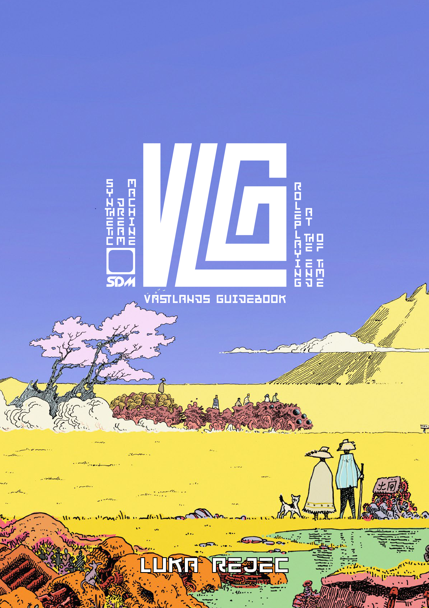

<!-- Begin: Vastlands_Guidebook_01_Title_Introduction_1-9 -->

<a name="page_0001"></a>



**Official site:** [Vastlands Guidebook](https://www.wizardthieffighter.com/synthetic-dream-machine/)

# Vastlands Guidebook VLG

**Synthetic Dream Machine SDM**

## Roleplaying At The End Of Time

_Luka Rejec_

<a name="page_0002"></a>

This page is certified safety yellow.

This is the pre-print proofing edition.

Prepared with the support of the good backers of the _Our Golden Age_ backerkit campaign and the irrepressible heroes of the **stratometaship** .

The end is nigh[t].

—Luka, June 2025

<a name="page_0003"></a>

_For every patient traveler on a cruel road._

_A concrete pigeon._

<a name="page_0004"></a>

## THE VASTLANDS GUIDEBOOK

**Vastlands Guidebook (VLG)**

_For would-be heroes of the lands at the end of time._

Copyright © 2025 Luka Rejec

All rights reserved.

No portion of this book may be reproduced in any form without written permission from the author, except as permitted by U.S. copyright law.

Terminus Lexamen v3.44

August 2025

**Art:** Luka Rejec

**Layout:** Guilherme Gontijo, Luka Rejec

**Editing:** Brandes Stoddard

**Knights Grammarian:** Joseph Hawkes, Madeline, MoonRawrr, myownlittlworld, Najahiri, Pavlov

**Additional Thanks:** Aaron, Adam Thornton, Ahimsa Kerp, Christian Conkle, Cintain, Dimfrost, Dungeons Possums, Eddo, KYA, Lazy Litch, Eric Nieudan, Nuelijarma, Scratch Monkey, Telarus, Tofukaag, Tom Solo, Wombat

This edition made possible by the gold and [the good of the Our Golden Age backerkit campaign.](https://www.backerkit.com/c/projects/exalted-funeral/our-golden-age-an-ultra-violet-grasslands-rpg-sequel)

The Vastlands made possible by the heroes of the [Stratometaship at the Wizardthiefighter Patreonf](https://www.patreon.com/wizardthieffighter) .

<a name="page_0005"></a>

## Contents

- **Introduction** ............................................. 6
- **Character Creation** ....................................... 10
  - Ability Scores ............................................. 12
  - Background Trait ........................................... 14
  - Path Trait ................................................. 16
  - Free Trait ................................................. 18
  - Character Equipment ........................................ 20
  - Other Attributes ........................................... 24
  - Motive ..................................................... 29
  - Leveling and Growth ........................................ 30
  - Name ....................................................... 33
  - Final Check ................................................ 34
- **Rules** .................................................... 36
  - Core Mechanics ............................................. 38
  - Doing Things ............................................... 43
  - Conflicts .................................................. 46
  - Damage, Defeat, Death ...................................... 58
  - Recovery ................................................... 62
- **Equipment** ................................................ 64
  - Combat Gear ................................................ 68
  - Miscellaneous Items ........................................ 82
  - Vehicles and Mounts ........................................ 86
- **Powers** ................................................... 94
  - Using Powers ............................................... 96
  - Corruption ................................................. 98
  - New Powers ................................................. 102
  - To Be A Proper Wizard ...................................... 105
  - Albums of Power ............................................ 106
- **Other Paths** .............................................. 114
  - Barbarian .................................................. 116
  - Bluelander ................................................. 118
  - Bourgeois .................................................. 120
  - Golem ...................................................... 122
  - Greenlander ................................................ 124
  - Holy Fool .................................................. 126
  - Manager .................................................... 128
  - Noble ...................................................... 130
  - Noömagus ................................................... 132
  - Orangelander ............................................... 134
  - Purplelander ............................................... 136
  - Redlander .................................................. 138
  - Scion ...................................................... 140
  - Servant .................................................... 142
  - Skeleton ................................................... 144
  - Soldier .................................................... 146
  - Tourist .................................................... 148
  - Trickster .................................................. 150
  - Weapon & Bearer ............................................ 152
  - Yellowlander ............................................... 158
- **Appendix** ................................................. 160
  - I. Character Sheet ......................................... 161
  - IV. NPCs of the Vastlands .................................. 162
  - IX. Inspiration ............................................ 164
  - L. 3rd Party License ....................................... 166
  - C. Index ................................................... 168

<a name="page_0006"></a>

# INTRODUCTION

Welcome, curious explorer, to the Vastlands. To a time beyond the end of time.

Here, in the heart of the world, is the Circle Sea, the pond of panhumanity surrounded by polychrome lands. This is _Our Golden Age_ . An overgrown garden of humanity, here neat, there feral, sprawling out of sight of its absentee Builders, safely kept by the inscrutable might of its warden angels, the Phylakes.

There, to the west, the psychedelic _Ultraviolet Grasslands_ stretch beyond the edge of civilization and its faded histories, a deep, vast, mythic steppe littered with the detritus of time and space and memory.

The Vastlands are inspired by strange musics, unusual fictions, old games, flawed philosophies and many artists from Moebius to Miyazaki. They grow from the adventuring sessions of the Golden Goats in the mid 2010s. They are the work of artist and author Luka Rejec.

Safe travels at the end of time, beyond the edge of the last safe world.

```
They’re okay, the last days of May,
but I’ll be breathin’ dry air
I’m leaving soon, the others are
already there (All there...)
Wouldn’t be interested in coming
along instead of staying here?
It’s said the West is nice this time
of year, that’s what they say

—Then Came the Last Days of May,
Blue Öyster Cult (1972)
```

You can get _**Our Golden Age**_ and the _**Ultraviolet Grasslands**_ in deadwood via Exalted Funeral Press and any number of friendly local gaming stores. The electronic paper version is also available at:

- DTRPG (https://www.drivethrurpg.com/en/publisher/14157/wtf-studio),

- itch.io (https://wizardthieffighter.itch.io),

- the EF webstore (https://www.exaltedfuneral.com)

- and Luka’s Patreon (https://www.patreon.com/wizardthieffighter).

<a name="page_0007"></a>

## PLAYER REFEREE RUNNER

This guidebook is for everyone at the table: the player who referees the game and the players who run the characters. Have fun and enjoy playing together.

**No Masters**

The referee is used as a neutral term for the player preparing the adventure, running the session, setting the beat for play, and balancing the spotlight between the other players. The referee is not a master — more like the bass player of the roleplaying table. They succeed when they make everyone shine.

**Anti-Canon**

No player, not even the referee, has to master all the lore. You’re on a journey together: discovering the world and what happens in it by the oracle of your dice. There is no canonic Vastlands. No true, proper way to play it. The game at your table belongs to you all. Through play, you create a world of your very own.

**Referee Titles**

To remind everyone that the referee is also a player, they can get a different title and playful power every session. Here are some ideas to get you started:

|*#*|**Title**|**Session Powers**|
|---|---|---|
|1|Boss Cat|All must acclaim the local house cat. Give extra xp for cat-themed treats.|
|2|The Cleaner|Award xp to players who help clean up after the session.|
|3|Electric Ghost|Summon a hero’s annoying ancestor ghost for advice or moral lessons.|
|4|Glitch Golem|Move a random location on the map. Swap place names.|
|5|Judging Muse|Give xp for good background music choices. Veto bad ones by group vote.|
|6|Nine Lifer|Grant up to nine extra life points to characters.|
|7|Prismatic Priest|Randomly recolor locations. Roll d6: (1) monochrome, (2) desaturated, (3) cool hues, (4) warm hues, (5) bright, harmonious colors, (6) a brutal riot of neon and day-glo.|
|8|Rail Plotter|Draw a visible path linking prepared locations. Players can choose to follow or ignore it.|
|9|Sky Bringer|Create dramatic weather effects in-game. No complaints about tired clichés allowed.|
|10|Snack Warden|Give 1d4 re-rolls to players who bring food or music.|

<a name="page_0008"></a>

## **Given World**

A world begins when it emerges from the mists of time. So it is with the civilizations of the Rainbowlands, marking their counts from when the Long Ago ended and the Now began. Perhaps gods or daemons imagine they recall earlier beginnings, but that is not the cosmos mankind believes it knows.

These later humans, undisputed masters of the fertile lands around the Circle Sea, dwellers in the Eye of Creation, in the Garden of the Given World. They come forth in many shapes, colors, creeds, and faiths. They pile together unkempt technology and misremembered lore. They rule the settled lands under painted deities of ill-repute, safe in customs of infinite antiquity.

From the Violet bastion against the exotic sunset lands, where the Black City reigns and even the rays of the sun acquire skin-blistering properties, to the Saffron Gate into the lands of many sunrises, where the radiance of the Little Son has imperium. From the undine-thick seas to the void-scraping Ladder of Heaven where the Great Desiccator obtains.

All those worlds are theirs. They just haven’t quite gotten around to them. But they will. Surely? Any time. Soon?

Creation and destruction, an endless cycle, looped so many times the history’s become a fog. No apocalypse remains. No post comes anymore.

Eras upon eras, worlds upon worlds, like grains of sand upon the beach of cosmic awareness.

Optimism. Life. New beginnings from the primordial ooze of barbarism. From the planetary vents of life.

Again, again, again.

Rain falls on mountains. Streams become rivers. Lakes meet seas.

Tribes become cities. Prophets found kingdoms. Explorers cross horizons. Merchants bind cultures. Empires cross continents. Shamans ascend to the stars. Life spreads from fast star to slow star. Wanderers tunnel the wormways through the ever void.

All must come to pass in the infinite cosmoses.

Eternity eats the unwise.

There is more to the universe than this Circle Sea and the Ultraviolet

Grasslands so near to the little humans, the happy rats in the carcass of the great spacetime vessel who think themselves its captains.

<a name="page_0009"></a>

## **Origins of a Setting**
The roots of the Given World are in the Rainbow Lands that grew collaboratively from the games I ran for the Golden Goats of Lausanne in the early to mid 2010s (thank you, good players, for those amazing adventures and delightful dinners). The published Vastlands are not quite the same as those in the long-ago games. They could not be. But, like all fine history, art, and wine, they rhyme.

The world took further shape in the long strange _Ultraviolet Grasslands_ trip I wrote for and with the heroes of the stratometaship, the Patreon supporters who made this whole adventure possible. In 2019, with the help of roughly 2,000 backers we crowdfunded the hardcover first edition. In 2023, following fan feedback, the revised second edition saw the light of the Big and the Little Suns. _Our Golden Age_ and this Guidebook then followed over the last few years, with several detours along the way. Perhaps we shall revisit some of those abandoned routes in the future, perhaps not. Still, they were worth it in the end. Now, welcome, and off we go!

—Luka Rejec, summer 2024

<!-- Begin: Vastlands_Guidebook_02_Character_Creation_10-35 -->

<a name="page_0010"></a>

# CHARACTER CREATION

To experience the Vastlands you need at least one player character. In this chapter:

1. generate your level 1 character’s **ability scores**
2. generate a **background trait**
3. ... and a **path trait**
4. ... and a **free trait**
5. **equip** them
6. generate other **attributes**
7. give them a **motivation**
8. invest **experience**
9. and **name** them

Later, you can acquire other characters: pets, sidekicks, secondary PCs and more. Their adventures, their defeats and victories, are yours to chart.

<a name="page_0011"></a>

## OUR SHADOWY COMPANIONS

A group of exemplary... er... example characters joins us to illustrate how the rules and procedures work.

> _Example: The referee Cat and the intrepid characters Noë, Onion, Safir, and others demonstrate how the rules work to lay waste the best-laid plans of mice and houses. And humans._

The heroes sacrificed to the dice oracles are built using random rolls for ability scores—and possibly changed through the vagaries of play and interactions with arcane devices. Yours may have different attributes.

**Noë**

A wizard of the dark electronic arts. A scholar in search of the illsome mysteries of the never-mentioned war.

|||||
|---|---|---|---|
|strength|0|charisma|5|
|endurance|1|aura|4|
|agility|2|thought|5|

**Onion**

A merchant and wide-ranging traveler. A trickster with a coin in every sock and a soothing lie for every ear.

|||||
|---|---|---|---|
|strength|1|charisma|5|
|endurance|0|aura|0|
|agility|4|thought|3|

**Safir**

A fighter of the caravan-protecting sort. An exile from the Blue Lands with a bloodline prone to corruption.

|||||
|---|---|---|---|
|strength|5|charisma|0|
|endurance|4|aura|1|
|agility|3|thought|2|

**Cat**

Our referee, a mighty acolyte of the Ceiling Cat.

Hazeraiser (referee title)—open a travel portal for the heroes. Demand sacrifices at will.

<a name="page_0012"></a>

## ABILITY SCORES

**Roll d100 once to generate abilities** (assign unlabeled scores)

|*d100*|**Flavor**|**Ability Scores**|
|---|---|---|
|1|scattered|1 / 1 / 1 / 1 / 1 / 1|
|2|musclebound|str 5 / 1 / 0 / 0 / 0 / 0|
|3|virile|end 5 / 1 / 0 / 0 / 0 / 0|
|4|elastic|agi 5 / 1 / 0 / 0 / 0 / 0|
|5|hypnotic|cha 5 / 1 / 0 / 0 / 0 / 0|
|6|reserved|aur 5 / 1 / 0 / 0 / 0 / 0|
|7|highbrow|tho 5 / 1 / 0 / 0 / 0 / 0|
|8|ogreish|str 4 / 1 / 1 / 0 / 0 / 0|
|9|lumbering|end 4 / 1 / 1 / 0 / 0 / 0|
|10|frenetic|agi 4 / 1 / 1 / 0 / 0 / 0|
|11|dainty|cha 4 / 1 / 1 / 0 / 0 / 0|
|12|ethereal|aur 4 / 1 / 1 / 0 / 0 / 0|
|13|focused|tho 4 / 1 / 1 / 0 / 0 / 0|
|14|strapping|str 2 / 2 / 2 / 1 / 0 / 0|
|15|energetic|end 2 / 2 / 2 / 1 / 0 / 0|
|16|twitchy|agi 2 / 2 / 2 / 1 / 0 / 0|
|17|fetching|cha 2 / 2 / 2 / 1 / 0 / 0|
|18|fierce|aur 2 / 2 / 2 / 1 / 0 / 0|
|19|knowing|tho 2 / 2 / 2 / 1 / 0 / 0|
|20|brawny|str 2 / 2 / 1 / 1 / 1 / 0|
|21|bulky|end 2 / 2 / 1 / 1 / 1 / 0|
|22|lissome|agi 2 / 2 / 1 / 1 / 1 / 0|
|23|nice|cha 2 / 2 / 1 / 1 / 1 / 0|
|24|inflexible|aur 2 / 2 / 1 / 1 / 1 / 0|
|25|crafty|tho 2 / 2 / 1 / 1 / 1 / 0|

|*d100*|**Flavor**|**Ability Scores**|
|---|---|---|
|26|rugged|str 2 / 1 / 1 / 1 / 1 / 1|
|27|stout|end 2 / 1 / 1 / 1 / 1 / 1|
|28|spry|agi 2 / 1 / 1 / 1 / 1 / 1|
|29|likeable|cha 2 / 1 / 1 / 1 / 1 / 1|
|30|firm|aur 2 / 1 / 1 / 1 / 1 / 1|
|31|schooled|tho 2 / 1 / 1 / 1 / 1 / 1|
|32|doughty|str 3 / 3 / 1 / 0 / 0 / 0|
|33|athletic|end 3 / 3 / 1 / 0 / 0 / 0|
|34|nimble|agi 3 / 3 / 1 / 0 / 0 / 0|
|35|charming|cha 3 / 3 / 1 / 0 / 0 / 0|
|36|resilient|aur 3 / 3 / 1 / 0 / 0 / 0|
|37|critical|tho 3 / 3 / 1 / 0 / 0 / 0|
|38|big|str 3 / 2 / 2 / 0 / 0 / 0|
|39|hardy|end 3 / 2 / 2 / 0 / 0 / 0|
|40|adroit|agi 3 / 2 / 2 / 0 / 0 / 0|
|41|slick|cha 3 / 2 / 2 / 0 / 0 / 0|
|42|obstinate|aur 3 / 2 / 2 / 0 / 0 / 0|
|43|articulate|tho 3 / 2 / 2 / 0 / 0 / 0|
|44|stalwart|str 3 / 2 / 1 / 1 / 0 / 0|
|45|healthy|end 3 / 2 / 1 / 1 / 0 / 0|
|46|deft|agi 3 / 2 / 1 / 1 / 0 / 0|
|47|glamorous|cha 3 / 2 / 1 / 1 / 0 / 0|
|48|disciplined|aur 3 / 2 / 1 / 1 / 0 / 0|
|49|clever|tho 3 / 2 / 1 / 1 / 0 / 0|
|50|vigorous|str 3 / 1 / 1 / 1 / 1 / 0|

Abilities represent the natural, inherent aptitudes of a character. They come in three colors (active, dynamic, static) and two flavors (mind and matter). PCs' ability scores are always 0 or higher. Human ability scores range from 0 to 5. Inhuman characters may have higher scores.

_**Alternative Generation 1:**_ roll d100 for each ability in order

|*d100*|**Score**|**Flavor**|
|---|---|---|
|1–30|0|unremarkable, mediocre, ordinary human ability|
|31–55|1|promising, useful, potential|
|56–75|2|talented, apt, good|
|76–90|3|gifted, masterful very good|
|91–99|4|excellent, amazing, preternatural|
|100|5|incredible, optimal, a pinnacle of human ability|

_**Alternative Generation 2:**_ assign 7 points to your abilities as you like with a maximum of 3 in any one ability. This is the way of those who mistrust chaos.

→ _Next: generate your background trait (p14)._

<a name="page_0013"></a>

|*d100*|**Flavor**|**Ability Scores**|
|---|---|---|
|51|robust|end 3 / 1 / 1 / 1 / 1 / 0|
|52|quick|agi 3 / 1 / 1 / 1 / 1 / 0|
|53|alluring|cha 3 / 1 / 1 / 1 / 1 / 0|
|54|gritty|aur 3 / 1 / 1 / 1 / 1 / 0|
|55|cultivated|tho 3 / 1 / 1 / 1 / 1 / 0|
|56|powerful|str 4 / 3 / 0 / 0 / 0 / 0|
|57|lusty|end 4 / 3 / 0 / 0 / 0 / 0|
|58|limber|agi 4 / 3 / 0 / 0 / 0 / 0|
|59|bewitching|cha 4 / 3 / 0 / 0 / 0 / 0|
|60|sublime|aur 4 / 3 / 0 / 0 / 0 / 0|
|61|inventive|tho 4 / 3 / 0 / 0 / 0 / 0|
|62|muscular|str 4 / 2 / 1 / 0 / 0 / 0|
|63|hale|end 4 / 2 / 1 / 0 / 0 / 0|
|64|sly|agi 4 / 2 / 1 / 0 / 0 / 0|
|65|winning|cha 4 / 2 / 1 / 0 / 0 / 0|
|66|discerning|aur 4 / 2 / 1 / 0 / 0 / 0|
|67|perceptive|tho 4 / 2 / 1 / 0 / 0 / 0|
|68|tough|str 4 / 1 / 1 / 1 / 0 / 0|
|69|abiding|end 4 / 1 / 1 / 1 / 0 / 0|
|70|deft|agi 4 / 1 / 1 / 1 / 0 / 0|
|71|provocative|cha 4 / 1 / 1 / 1 / 0 / 0|
|72|moody|aur 4 / 1 / 1 / 1 / 0 / 0|
|73|original|tho 4 / 1 / 1 / 1 / 0 / 0|
|74|mighty|str 5 / 2 / 0 / 0 / 0 / 0|
|75|unflagging|end 5 / 2 / 0 / 0 / 0 / 0|


|*d100*|**Flavor**|**Ability Scores**|
|---|---|---|
|76|winged|agi 5 / 2 / 0 / 0 / 0 / 0|
|77|seductive|cha 5 / 2 / 0 / 0 / 0 / 0|
|78|oracular|aur 5 / 2 / 0 / 0 / 0 / 0|
|79|encyclopaediac|tho 5 / 2 / 0 / 0 / 0 / 0|
|80|steely|str 5 / 1 / 1 / 0 / 0 / 0|
|81|vital|end 5 / 1 / 1 / 0 / 0 / 0|
|82|driven|agi 5 / 1 / 1 / 0 / 0 / 0|
|83|irresistible|cha 5 / 1 / 1 / 0 / 0 / 0|
|84|resolute|aur 5 / 1 / 1 / 0 / 0 / 0|
|85|devilish|tho 5 / 1 / 1 / 0 / 0 / 0|
|86|herculean|str 4 / 3 / 1 / 0 / 0 / 0|
|87|sinewy|end 4 / 3 / 1 / 0 / 0 / 0|
|88|fleet|agi 4 / 3 / 1 / 0 / 0 / 0|
|89|impressive|cha 4 / 3 / 1 / 0 / 0 / 0|
|90|single-minded|aur 4 / 3 / 1 / 0 / 0 / 0|
|91|creative|tho 4 / 3 / 1 / 0 / 0 / 0|
|92|olympian|str 5 / 2 / 1 / 0 / 0 / 0|
|93|glowing|end 5 / 2 / 1 / 0 / 0 / 0|
|94|mercurial|agi 5 / 2 / 1 / 0 / 0 / 0|
|95|angelic|cha 5 / 2 / 1 / 0 / 0 / 0|
|96|hermetic|aur 5 / 2 / 1 / 0 / 0 / 0|
|97|genius|tho 5 / 2 / 1 / 0 / 0 / 0|
|98|atlasian|str 3 / end 3 / agi 3 / 0 / 0 / 0|
|99|protean|cha 3 / aur 3 / tho 3 / 0 / 0 / 0|
|100|blessed|2 / 2 / 2 / 2 / 2 / 2|


### **Static Abilities**
Resisting things. Body, matter, structure, form, persistence, courage, _ha_. The resolve and stamina to bear and withstand.

- **Aura** is the mental ability of resilience in the face of fortune’s outrageous slings. It is not wisdom (that is a trait). It may allow a character to use powers beyond mortal ken longer than usual.
- **Endurance** is the physical ability of resistance. How much pain and strain a character can take. How much staying power they have.

### **Active Abilities**
Doing things. Fire, drive, energy, vigor, thrust, movement, _ka_. The will and force to dominate and overcome.

- **Charisma** is the mental ability of divine fortune, luck and conviction. It lets a character get their way and win arguments through sheer force of personality.

- **Strength** is the physical ability of lifting bars, bending gates, punching guards, throwing rocks, and climbing ladders. It also increases how much a character can carry.

### **Dynamic Abilities**
Changing things. Psyche, intellect, change, dexterity, path, speed, _ba_. The wit and flexibility to adapt and adjust.

- **Thought** is the mental ability of absorbing, processing, and manipulating information. It is not education (that is a trait). It also increases how many traits a PC can have.

- **Agility** is the physical ability of speed and precision within the character’s environment. Dodging, aiming, manipulating, balancing, flexibility, and more. It provides a bonus to defense.

<a name="page_0014"></a>

## BACKGROUND TRAIT

Traits are the innate acquired and inherited qualities and characteristics that make a character unique. This includes characteristics such as backgrounds, professions, mutations, downloaded skill packages, implanted prosthetics, corruptions, and memorized powers.

Individual traits may provide various benefits, including community membership, skill modifiers to actions, social standing, specific mechanical benefits, and new game options.

You have **7 + thought** inventory slots for traits.

Each trait occupies a trait inventory slot. Other traits, items, and events can increase the number of trait slots.

At level 1 you **start with three traits**.

A level 0 character has two traits. Characters can choose to gain a new trait every time they level up.

### **Trait Skill Modifiers**
Choose the same trait multiple times to increase its skill modifier.

||||
|---|---|---|
|Skilled|+3 bonus to rolls|good enough to make a living|
|Expert|+6 bonus to rolls|good enough to teach|
|Master|+9 bonus to rolls|a rare master of this art|

A trait selected multiple times does not take up additional trait slots. Note a trait’s bonus (+3 / +6 / +9) to track how many times you have selected it.

**Applying Trait Skill Modifiers**

Trait descriptions list some situations where skill modifiers apply. Players and the referee can use dialogue and common sense to figure out if a trait could apply in a new or unexpected situation.

**Other Trait Benefits**

If traits provide other benefits, note them. You may also invent or discover new benefits to existing traits through play. This is good.

**Inventing New Traits**

Players and referees can make up new traits together. Any profession, quality, background, mutation, or space oddity that sounds fun is fair game.

→ _Next: pick a path trait (p16). This provides the adventuring competence your random background trait may lack._

<a name="page_0015"></a>

### **Traditional Background Generator**
Roll a few times to invent some reasonably traditional civilized Circle Sea backgrounds. You can mix-and-match columns. Keep one you enjoy and note it in a trait inventory slot along with its modifier (+3).

|*d40*|**Flavor**|**Role 1-**|**-Role 2**|**Task**|**Spin**|
|---|---|---|---|---|---|
|1|blue land|narco|apothecary|mix potions, poisons, drugs|drug-fuelled dream travel|
|2|dead god|scholar|of Long Ago|explore the false past of lost times|psychokinetic acrobatics|
|3|peacemaker|big game|tourist|find and enjoy strange beasts|pray, love, eat monsters?|
|4|moon|bio|mechanic|modify and create living things|body-horror technomagic|
|5|coaster|cat|groom|make cats [or other masters] happy|pet’s hired muscle|
|6|scavenger|all|chemist|manipulate the basic iksr of matter|explosive philosophies|
|7|purple land|therapist|barista|make coffee and make peace|small-business expertise|
|8|feline|error|censor|prevent bad-think, fix mistakes|inquisition tactics|
|9|plantation|puppet|performer|undo ennui, create moderate joy|distraction or destruction?|
|10|steppe|wood|singer|shape plants, sculpt furnishings|talk to trees, hear herbs|
|11|violet city|living|stoner|shape stone, sing houses|carry landcoral in your skin|
|12|red land|aqua|farmer|protein and fruits from the waters|speak with strange fish|
|13|vampire|nöosphere|caller|talk to the hidden archive daemons|access divine communications|
|14|rust|gun|maker|craft the forbidden tools of Long Ago|rebuild illegal devices|
|15|vintner|soil|laborer|optimize primary production|understand survival basics|
|16|RL district|life|generator|create compelling human content|spin stories and lies|
|17|hexad|town|sanitizer|keep the town clean and alive|travel unseen in urban bowels|
|18|doghead|daemon|summoner|interface with disembodied minds|manipulate the old minds|
|19|orange land|mule|whisperer|interface with beast-bodied minds|uplift downtrodden animals|
|20|halfling|herbalist|officer|ensure adequate public harmony|cloud minds for shared goals|
|21|council|necromancer|lawyer|uphold postmortal legal rights|ensure proper reincarnation|
|22|ancestor|old|technician|chant the mantras of maintenance|use Long Long Ago tools|
|23|agent|golem|engineer|keep the machine humans running|service the electric overlords|
|24|pirate|middle|manager|assign assigned assignations|navigate cruel bureaucracies|
|25|plateau|road|walker|keep the roads alive and respected|travel safely off the grid|
|26|yellow land|inspector|private|look, listen, and report to authority|find and keep grim secrets|
|27|diesel dwarfer|licensed|merchant|truck and barter for the greater good|maximize short-term gains|
|28|decapolitan|protocol|soldier|keep the martial traditions alive|cross tea & high dot etiquette|
|29|saffron|astrologer|general|divine strategies from the stars|maintain order and discipline|
|30|horser|accountant|monk|ensure the holy numbers go up|keep the cog flower turning|
|31|golden desert|machine|herder|keep the synthetic flocks in line|oil and multiply machines|
|32|green land|content|promoter|popularize the latest entertainment|tamp down false ideas|
|33|metropolitan|advertising|servant|promote the corporate bottom line|subversive subterfuge|
|34|elfer|autodoc|nurse|support a smarter golem than you|parasite machine minds|
|35|falscher|professional|consumer|embody proper ethics|develop exquisite taste|
|36|timelost|leisure|maximizer|enjoy the fruits of civilization|schmoozer socialite spy|
|37|astral|rogue|trader|skirt the rules for profit|shave the coins for memories|
|38|ministry|show|hobo|be a warning to the lazy|dullway tunnel rat|
|39|barbarian|primary|noble|focus aspirations and social desires|overwhelm the given order|
|40|voidwalker|public|relative|share social love and vibes|unlock doors with your blood|

<a name="page_0016"></a>

## PATH TRAIT

Paths are compilations of traits that create archetypal characters.

Review and **choose a path** (or roll d6):

|*d6*|**Path**|
|---|---|
|1–2|Path of the **Wizard**|
|3–4|Path of the **Traveler**|
|5–6|Path of the **Fighter**|

**Not Classes**

Paths are not classes. You are not bound to one path. You can choose traits from any path, in any order, mixing-and-matching as you level up.

**No Prerequisites**

Some traits complement one another, but you can pick them in any order as you level up or otherwise acquire new traits through play. If you want, you can even skip the superbasic, number zero trait.

### PATH OF THE WIZARD

A scholar who uses the old technologies.

0. **Wizard.** You call yourself a magus, maker, or mechanic. You are skilled at casting spells (using oldtech powers). Perhaps you just know how to read the manuals of Long Ago and the Zero-One codes?

**More Wizard Traits**

To interrogate, to learn, to master, perhaps to create:

1. **Burner.** Once per turn, you can spend an ability point to overcharge a power, regardless of its cost.
2. **Chronic.** Spend a hero die to use a second power this round.
3. **Exuberant.** Each of your life points is worth double when paying for powers.
4. **Mind Palace.** Memorize a number of powers equal to your level for free, ignoring inventory. Draw the memory palace on the back of your character sheet.
5. **Oblique Reality.** Spend one life or one hero die to deflect a power targeting you (or an adjacent target) to the left or the right (or up or down).
6. **Recast.** When your power fails or a target makes its save, you can use the power again for free. Once. Recharge your recast with a hero die.

→ _Next: generate your character’s free trait (p18)._ 

<a name="page_0017"></a>

### PATH OF THE TRAVELER

A merchant focused on overland voyaging. A trickster?

0. **Traveler.** You call yourself a vagabond, a wanderer, the wind. You are skilled at managing a caravan, navigating with maps and stars and waypoints, making and concealing camps, finding water and food, and the etiquette of the vast open lands. You wield the marching staff and the dagger and the traditional rifle.

**More Traveler Traits**

To hear, to see, to convince, perhaps to lead:

1. **Escapist.** You’re skilled at being lucky. That’s a +3 bonus to all saves.
2. **Friends.** You can have a number of pets or sidekicks equal to your level who don’t take up the usual inventory slot. Draw a separate box to list your friends on your character sheet.
3. **Hunter.** Track, trap, and shoot game with bow, rifle, and javelin. Hide in the wilds, move unseen. When you shoot from ambush, your critical hits deal triple instead of double damage. Expert: x4; master: x5.
4. **Pleasant.** Charming conversation and an easy demeanor. You get people to like you. That’s +2 to reaction rolls. Expert: +4; master: +6.
5. **Pocketmaster.** Conceal a number of small objects equal to your level for free, ignoring inventory. A knife is small.
6. **Swift.** Once per turn, spend one life or one hero die to get one extra action this round.

→ _Next: generate your character’s free trait (p18)._ 

### PATH OF THE FIGHTER

A caravan guard who wears armor and wields weapons.

0. **Fighter.** You call yourself a warden, warrior, or weaponmaster. You are skilled at using traditional weapons and armors; from knife to sword, blaster to rifle, chitin shield to buffer harness. Also, you are skilled at defense. That’s a +3 bonus to defense and attack. Expert: +6; master: +9.

**More Fighter Traits**

To struggle, to fall, to rise, perhaps to succeed:

1. **Armiger.** Carry a number of weapons equal to your level for free, ignoring inventory. Draw a weapons box on the back of your character sheet.
2. **Defender.** You’re skilled at physical defense and all kinds of defensive equipment. Also, even if unarmored, gain a +3 armor bonus. Expert: +6 armor; master: +9 armor.
3. **Grit.** Gain 1 life per level and advantage when you roll endurance.
4. **Irresistible.** Every round you deal damage equal to your level to one foe you attacked, whether your attack roll hit or missed.
5. **Second Chance.** When you would fall to 0 life, you fall to 1 life instead. Once. Recharge second chance with a hero die.
6. **Terrifying.** You’re skilled at frightening people. That’s also a +2 bonus when breaking your foes’ morale. Expert: +4; master: +6.

→ _Next: generate your character’s free trait (p18)._ 

<a name="page_0018"></a>

## FREE TRAIT

Level 0 characters start with 2 traits and gain one per level. Since PCs start at 1st level, they get a third trait. This trait can be another background or path trait, a trait from other sources, or even something you invented.

**Roll a Random Trait**

d6 for background and path traits (58 options) or d10 to include corruption and other paths (~240 options)

- 1–3: roll d40 on the background trait table (p14)
- 4: roll d6 on the wizard path trait table (p16)
- 5: roll d6 on the traveler path trait table(p17)
- 6: roll d6 on the fighter path trait table(p17)
- 7–9: roll d20 to determine another path (p114); then d6 on the corresponding trait table
- 10 (0): roll d6 to determine corruption intensity: (1) severe, (2–3) moderate, (4–6) mild; then d20 for the corresponding corruption trait column (p99)

**Choose a New Trait**

Choose any new trait you like. Either from the tables listed above or from other sources.

**Choose an Existing Trait and Become an Expert**

When you select the same trait a second time, your trait’s skill modifier increases from +3 (skilled) to +6 (expert). Depending on the trait, expertise may provide additional benefits. Selecting a trait twice does not increase the number of trait inventory slots it occupies. As you progress further, you can select the same trait a third time, becoming a master and increasing its skill modifier to +9 (master).

**Invent a New Trait**

To create a new trait, discuss with the rest of the table:

1. Is it fun and evocative to roleplay?
2. Can you describe it with a short, memorable title?
3. Does it enhance rather than overshadow other characters?
4. Is it versatile enough for various situations?

Aim for vivid, specific concepts like “Anointed Gladiator” or “Desire Detective” over staid ones like “Wizard,” “Thief,” or “Fighter.” The referee helps fit the new trait to the table’s game and can rule certain traits off limits. If a trait proves problematic in play, discuss with other players and adjust as needed. Remember, retconning to improve the game experience is not a sin.

→ _Next: equip your character (p20)._ 

<a name="page_0019"></a>

## Trait Idea Seeds

|d20|What Strange Traits?|Who Would Wield Them?|But At What Cost?|
|---|---|---|---|
|1|beauty to bend soul or society|servant or slave of the muses|strange passions kindled|
|2|clockwork discipline, fervent uplift|wired rationalist legionnaire|freedom denied, disorder banished|
|3|cyber-ascendance, plastic evolution|pitiless machine or vome|flesh despised, biology mistaken|
|4|distributed, eusocial experience|many-bodied colony or polybody|loneliness a curse, solitude a terror|
|5|divine injustice, blind righteousness|cruel zealot of a wild deity|nuance is lost, detail is obscured|
|6|evolution o’er reason, root o’er brick|power-hungry tree-hugger|technology is incomprehensible|
|7|finwizardry, capitalist supremacy|cunning trader or wily industrialist|moloch dominates, culture is sold|
|8|flesh as clay, face as paint|skin-changing biomancer|stability is lost, the past forgotten|
|9|forbidden geometries, foolish hubris|unhinged sorcerer, mad sciencer|nature disdained, tradition scorned|
|10|imaginary bonds of organization|dedicated ruthless administrator|ossification nears, change is scary|
|11|life over death, death over life|hunter or destroyer of the dead|a pleasure is lost, a joy turns to ashes|
|12|lost arts, hidden mysteries|resurrected ancient traveler|mistakes abound, talk is fraught|
|13|machine logic, alien intuition|code-addled golem mechanic|love withers, community fractures|
|14|physical mastery, material design|holy wizard of the ancient machine|soul grows dim, spirit becomes hard|
|15|senses of doom, visions of hope|prophet of a strange new future|another wall, grass is greener|
|16|signs in the fast stars, truths obscure|void-bound shaman of old|food grows stale, drink tasteless|
|17|silent death, painful trickery|prowling thief or cultish bandit|society retreats, friendships founder|
|18|strength, thews, and primal vigor|warrior beast from the edge of time|books and words make less sense|
|19|unfolded spaces, broken mirrors|bodiless angel or daemon|senses turn aside, anxieties mount|
|20|feral unity, survival in the ruins|solitary wasteland strider|progress falters, dreams grow small|

<a name="page_0020"></a>

## CHARACTER EQUIPMENT

Items are all the tools and treasures that expand a character’s abilities and possibilities. From a mundane wrench to a magitechnical spell anchor, from a suit of pleather armor to a biomechanical crab-head, all are items.

You have **7 + strength** inventory slots for items.

Each loose item or package occupies at least one item inventory slot. Other traits, items, and events can increase the number of item slots. Each item inventory slot is 1 stone in size.

**At level 1 you start with:**

- One strange item of ill-disclosed origin (p22).
- One useful kit—a sack of quantum gear that fits your background (p23).
- Some starting cash. €100 to be exact (p23).

A level 0 character starts without the strange item and with just €50 cash. A higher level character starts with more cash.

→ _Now get that strange item (p22)._ 

### HOW ITEMS WORK

**Sizes**

Item sizes in the Vastlands use abstract units that combine weight and bulk.

|Size|Equals|Example|
|---|---|---|
|1 sack (sk)|10 stones|Basic cargo unit, about as much as a human.|
|1 stone (st)|10 soaps|Significant item; a saber, spear, shield, or shovel. About 7 kilograms or 15 pounds.|
|1 soap (sp)|25 cash|Small item; a signal whistle, signet ring, spike, or bar of soap (surprisingly useful in the wastes!).|
|1 cash (€)|some change|Standard currency unit equal to a laborer’s day wages. Named in a nod to ancient Chinese cash.|

Unless otherwise specified, an item takes up 1 stone of inventory space. 250 cash units take up 1 stone. A PC's money is usually a mix of cards, credit, notes, and units that fit in a wallet. Treat the wallet as part of their clothing.

**Available Items and Packed Items**

Available items take up at least one inventory slot each, regardless of size, but a character can use them immediately.

> _Example: A readied dagger (5 sp) takes up a whole inventory slot (1 st)._ 

Items can be packed away to save space. Readying a packed item for use takes at least one action.

> _Example: Packed in a bundle, two daggers fit in a single inventory slot._

Some equipment such as backpacks, pouches, purses, ammo belts, or clothing with hidden pockets can allow characters to pack away more gear than usual, effectively increasing their inventory.

> _Example: Onion's synthetic skin backpack (1 st) allows him to pack away and carry 3 stones worth of small gear. Effectively, Onion can stuff 4 stones of items into a single inventory slot. However, retrieving a specific item from his backpack takes a whole action. Onion had better not pack away his inquisition squirtgun if he plans to use it._

<a name="page_0021"></a>

### DROPPING ITEMS

A character can quickly drop one item or pack as a free action on their turn, reducing any penalties suffered from encumbrance. A quickly dropped item may break, get damaged, roll away, or otherwise suffer the consequences. The referee chooses a save target.

> _Example: A pair of shoes chucked onto a grassy slope may roll downhill, a sack of stolen glass statuettes dropped on a marble floor may produce a lot of sharp glass caltrops._

A character taking an action to carefully drop an item or pack avoids any risk of damaging their precious property.

### IMPROVISING WITH ITEMS

Items are not just bundles of game mechanics. They improve a character’s performance and let them do new things. Use common sense and imagination to figure out how to take advantage of your PC’s equipment.

> _Example: Rafts let characters float, while climbing gear helps scale surfaces that are impossible to free-climb._

### HUMAN CLOTHES

Baseline humans have evolved to wear clothes. Any garments suitable for a tropical or temperate climate that such a character wears take up no inventory slots. You can describe them on the back of the character sheet.

> _Example: boiler suit, ship overalls, field loincloth, civilian sarong._

Additional sets of clothes, or garments that provide benefits or modifiers, occupy inventory slots as usual.

> _Example: a corporate suit (1 st) provides status benefits and access to temples of finance, a classical toga (3 st) blocks one arm and marks the wearer as a member of the ruling class in some Decapolitan republics, nomad robes (1 st) serve as armor, very warm clothes (2 st) are useful in the domains of Winterwhite, an environment suit (1 st) protects against radiation ghosts, etc._

Characters who are not evolved to wear clothes, such as cat lords, spectrum satraps, some golems, and other strange creatures, do not get a free inventory slot for the garments they wear.

> _Example: a cat lord wearing a cute little jump suit (1 st) and knit cap with foopy antennae may not look annoyed, but they can’t carry quite as many sacrificial mouse victims as they might wish._

<a name="page_0022"></a>

## ONE STRANGE ITEM

Exactly what this item does is a mystery. It could turn out to be an item of prophecy, linked to your character’s destiny or your community’s fortunes. It might also just be daemon garbage or a broken piece of forgotten history.

|d50|Item|Size|
|---|---|---|
|1|One lost soul trapped in a stoneware pot.|1 st|
|2|Half a crystal skull and two dream powders.|1 st|
|3|Purple brick, dims ambient lights.|1 st|
|4|Teal vase with an undead rose.|5 sp|
|5|Three gilded wooden geese with needle teeth.|3 st|
|6|Dead grey daemon slab of obsidian and steel.|2 sp|
|7|Gold book proclaiming eternal peace.|2 st|
|8|Cameo sapphire amulet of a banker priest.|1 sp|
|9|Briolette black pearl of the weeping architect.|1 sp|
|10|Ammolite relic of the void mollusc period.|5 sp|
|11|Tin head filled with echoes of epic poetry.|1 st|
|12|Psychic ash trapped in pink amber.|2 sp|
|13|Golem reprogramming probe in a jewel box.|1 st|
|14|Agave plant that mutates daily. Water monthly.|1 st|
|15|Shed lingish face skin in a velvet pouch.|5 sp|
|16|Anthracite eating ooze in a plastic bottle.|1 st|
|17|Astraporter network manual. Outdated.|1 st|
|18|Pretty ritual tea set of grown posthuman bone.|1 st|
|19|Taxidermied head of a doghead pistolier (L5).|1 st|
|20|Opaque hallucinatory mask of bravery.|1 st|
|21|Large carnivorous motile monstera (L3).|3 st|
|22|Stone cat (L2). Feed blood to awaken for a day.|1 st|
|23|Brain shaving kit. Delusion tape included.|1 st|
|24|Bluish, mildly anti-gravitic rock—an astrolith.|1 st|
|25|Red and green mechanical foot.|1 st|
|26|Jar of pickled space worm meat.|1 st|
|27|Semi-sentient fibrous colony blanket.|1 st|
|28|Box of ochre ancestor summoning chalks.|1 st|
|29|Elegant mechanical pit viper (L1).|1 st|
|30|Seven single-use capsules of universal solvent.|1 sp|
|31|Zircon personality jewel of a scion duplicate.|1 sp|
|32|Mummified cucumber with six human teeth.|5 sp|
|33|Safety orange cultist robe with fruit glyphs.|1 st|
|34|Moonling undershirt of woven hardlight.|5 sp|
|35|Yellowed great-human ivory dining set.|1 st|
|36|Congealed shadow horn of decaying fruits.|2 st|
|37|Gray sphere. Weighs six times more than gold.|1 st|
|38|Tangerine radiant onion scepter.|1 st|
|39|Electromechanical backup V.I.L.E. brain.|2 st|
|40|Three old guns reforged into a blue ax.|1 st|
|41|Sentient greenish plastic bucket (L1). Cursed?|1 st|
|42|Ever-growing tooth carved into a spear.|2 st|
|43|Plastinated sacred hand of a relative.|5 sp|
|44|Square glasses of perfect vision. 3x zoom.|2 sp|
|45|Porcelain and jade pipe and no-bacco box set.|1 st|
|46|A shapechanger's preserved hide.|2 st|
|47|Procedural entertainment box-and-screen.|3 st|
|48|Ebony haruspicy liver and odds casting tables.|1 st|
|49|Artificial you. Only the face and one hand.|2 st|
|50|Living seed of your ancestral house.|1 sp|

→ _Next: Your useful starting kit (next page)._ 

### Selling Your Strange Item

Figuring out what it does is a hassle. Why don’t you just sell it for quick cash? Everything will be ok!

|Buyer|Where|Quick Cash|
|---|---|---|
|Random Merchant|Anywhere, really. Here?|€1d6* × 10|
|Sage Patron|A remote location.|€1d6* × 100|
|Legendary Collector|A dangerous location, behind a difficult quest.|€1d6* × 1000|

The asterisk denotes an exploding die. On a roll of 6, roll again and add the results together. Keep rolling and adding dice as long as you keep rolling sixes.

<a name="page_0023"></a>

## ONE USEFUL KIT

A kit is a packed bundle of mundane tools that let a character do their job. A settled character can use their kit to make a living.

You have **a kit for one of your background traits** . Draw a kit box on the back of your character sheet.

The kit measures a whole sack (10 stones) in heft and includes up to 10 individual items. You don’t need to choose in advance exactly what is in your character’s kit—the items are in a quantum superposition until you define them as you play.

> _Example: Noë has a background as a plumber (don’t ask) and starts with a plumber’s kit. Noë doesn’t list each individual item in the kit. As she adventures, she produces useful O-rings, allen wrenches, lengths of pipe, and sealing tape from her kit. She lists these in her kit box, leaving space for 6 more quantum items._

The kit includes nothing better than a civilian weapon (1d6 damage) and no armor. You can buy more weapons and armor with your starting cash.

The starting kit leaves most characters burdened when unpacked. You can stash it before exploring a dangerous location or entering a fight. A beast of burden may help transport your kit.

→ _Now: get your starting cash (right)._ 

### STARTING CASH

Many kinds of cash are possible: the traditional luminous cowrie of the coastal communities (lb), the high-end plastic Casino gold piece (cgp) of the Red Land District, the traditional bunker-era duraplastic chit (dpc) of the Red and Orange Coprosperity Merchant Region, the sky-dragon scale (sds) of the Cat-affiliated knowledge societies, the prized ferroceramic puck-and-triangle of the Emerald City (fpck), and the completely ethereal noöspheric digital cash of the Dream Canopy (vdx).

For simplicity, the abstract “€” symbol covers them all.

You have **€50 + €50 per level** in physical currency. Enough to live on for a few months, if you are careful and boring. You’re not, though.

That's not much per level, honestly.

**What Cash Buys**

Precisely how much €1 buys varies with place and time (and referee whim), but a reasonable baseline is 100 theoretical convertible imperial universal dollars from Finite Earth A.D. 2025 to €1. Example purchases:

|Price|Purchase|
|---|---|
|€0.1|common meal or ingredient, mass tourist souvenir|
|€1|day’s food and lodging for two proletarian baseline humans, basic tool, uncommon ingredient, fancy meal|
|€10|day’s food and lodging for two mildly ­enhanced bourgeois humans, professional tool, rare ingredient, opera ticket|
|€100|day’s food and lodging for two betterfolk aesthetically-augmented humans, rare or expert tool, very rare ingredients, basic vehicle, hut, small farm|
|€1k|day’s food and lodging for two abmortal oligarchs, uncommon vehicle, small cottage, middling farm|
|€10k|hour’s rock-hitting trip for an imperial executive unit, rare vehicle, comfortable residence, large farm or ranch|
|€100k|nearly super-heroic augment, luxurious residence, plantation|
|€1m|abmortality, seat on the neo-imperial shadow parliament, modest palace|

A character can dream, right?

→ _Next: the remaining attributes (p24)._ 

<a name="page_0024"></a>

## OTHER ATTRIBUTES

Your character is nearly complete! Just a few final attributes to figure out.

→ _Proceed in order._ 

### LEVEL

An abstract measure of power. Some traits and items scale with levels.

You **start at level 1** and go to level 9.

Monsters and other NPCs range from level 0 to level 17. Some creatures by level to give a sense of scale:

|Level|Creatures|
|---|---|
|0|rat, wretch, rabbit|
|1|human, horse, hagbird|
|2|soldier, snake-jake, river snapper|
|3|elite rider, king eland, electric hound|
|4|separatist hero, steppe wolf, sentinel golem|
|5|biomechanical queen, bloodosaur, broodmaker|
|6|epic nomad hero, hunter golem, skinchanger|
|10|bone roc, redmeatwood, house mimic|
|13|vome autofac, biomechanical catamaran|
|17|demiurge, void crawler, the Mother Machine|

→ _Next: your life score (below)._ 

### LIFE

Hylospheric persistence, hit points, embodiment? More like narrative resilience and plot armor. A measure of how long you’ll stay in action and a resource you spend to use your powers. Burn the candle at both ends.

Since you start at level 1, you **start with 8 life** .

PCs start with 4 life at level 0 and gain 4 life per level. Traits may grant more life. NPCs range from 4 life at level 0 to 666 life at level 17.

A character's life score cannot go below 0. A character reduced to exactly 0 life is in trouble, but not necessarily finished. If something would reduce a character below 0 life, they are reduced to 0 life and must roll on the defeat table (p60).

Death usually requires a conflict with deadly stakes, an accident (or critical success, i.e., a natural 20), or an additional killing blow. Even then, death is often not the end.

→ _Next: your hero dice (next page)._ 

<a name="page_0025"></a>

## HERO DICE

Six-sided dice (d6) for adjusting rolls and regaining life. You gain one per session and one more every couple of hours.

You can store HD equal to your most powerful PC’s level. The referee can grant more hero dice for inspired roleplaying and prosocial behavior like bringing milk and cookies to the game session.

Roll hero dice to do two things:

1. Adjust any roll, whether it is a d4 or a d20 or a d100. This does not have to be your roll. The adjusted roll counts as a natural roll. This is not an action.
2. Regain life equal to the roll. This is always an action.

Traits and items may provide other uses for hero dice. Rare traits can modify the number or type of hero dice. Burdens do not affect hero die rolls.

→ _Now: onward to note your saving throw target (below)._ 

### SAVE

When nothing but blind luck will save you, roll d20 + ability over your saving roll target (or simply, your save). If you succeed, you are saved.

**Your save is 13.**

As with other rolls, there are three possible outcomes:

|Roll Result|Outcome|
|---|---|
|Under 13|**Doom.** What was, will be. No save.|
|Exactly 13|**Sacrifice.** Lose something precious to save.|
|Over 13|**Save.** Disaster averted, fortune appeased.|

**Relevant and Irrelevant Abilities**

- **Endurance** applies under duress, in harsh environments, and against diseases or injuries.
- **Aura** applies against threats to psychic integrity, spiritual pollution, daemonic possession, and mental injury.
- **Agility** does not provide a save bonus. As soon as a character is aware of a threat, such as a landslide, it is no longer a blind luck situation. They are taking action, using traits and abilities to overcome a threat.

**Other Modifiers**

- **Wards**—oldtech artifacts or modern trinkets—usually provide a bonus to saving rolls. Some provide a blanket bonus to all saves, others only in certain circumstances.
- **Traits** can provide a bonus or modify a character’s saving roll target.

→ _Next: attacks and defenses (p26)._ 

<a name="page_0026"></a>

### DEFENSE

When you defend against an attack in the physical world the so-called hylosphere, foes must overcome your [physical] defense attribute to hurt you.

**7 + ability (agility) + bonus (if skill applies) + armor**

Some specific attacks may have modifiers against mundane targets (which most PCs are).

> _Example: Safir squares off against a malevolent radiation ghost. Normally, Safir’s defense would be 18 (7 + 3 (agility) + 3 (fighter trait) + 5 (chitin cuirass). Alas, the radiation ghost’s gentle touch ignores physical armor, so the target for its attacks is just 13._

Armor is modern equipment to soften blows or ancient machines replacing the body. Armor may give additional modifiers, benefits, penalties and mechanics.

> _Example: many golem armors increase a character’s ability score (usually strength) and give bonus life._

#### Option: More Defenses

In some scenarios, the referee may bring other defenses into play. Players add defense boxes to their character sheet when required.

When your soul-mind duality (ka-ba) travels like a butterfly between the dreams of diverse cosmic lords, plumbing the ancient noösphere, mental defense guards against injury in this realm as physical defense does in the base material cosmos. It may even apply in the base reality, if assailed by daemons or nightmares.

**7 + ability (thought) + bonus (if skill applies) + ward**

Wards are metaphysical trinkets and magitechnical artifacts that protect one's non-physical integrity. They also often protect against spells.

When facing social challenges—whether fending off gossip, navigating legal battles, or competing in displays of wealth—you can use your social defense score.

**7 + ability (charisma) + bonus (skill) + prestige**

Prestige comes from status symbols—titles, properties, valuable possessions, and admired traits—that enhance influence in relevant settings. Prestige may help you convince a judge, motivate a rally, enchant a banker or charm a post-reality vidy star.

→ _Next: your attacks (right)._ 

## ATTACK

To attack, roll d20 + ability + skill over defense.

Each foe has a defense target number. When you beat it, you deal damage or otherwise impact their existence.

You have four basic attack types:

1. **Melee** - attack with a weapon, like a ghost bone axe or a machete. d20 + ability (strength) + skill (if applicable)
2. **Ranged** - attack with a weapon, like a heat rod or a wand pistol. d20 + ability (agility) + skill (if applicable)
3. **Oldtech** - attack with an artifact, like a brain-slaved auto-turret. d20 + ability (thought) + skill (if applicable)
4. **Fantascience** - attack with a power like a mind whip or brain shackle. d20 + ability (charisma) + skill (if applicable)

→ _Now: your damage dice and modifiers (next page)._ 

<a name="page_0027"></a>

## DAMAGE

When an attack succeeds, you deal damage.

**dXX (item)** + **ability** (determined by traits) + **bonus** (circumstantial)

Item descriptions list how much damage they do. Review your items and note their damage values.

Traits may let you add an ability score to your damage. Powers and circumstances may provide additional damage bonuses.

**Unarmed Damage**

If you have no suitable item for a type of attack, you can [almost] always make an unarmed attack.

Your improvised or unarmed attack always deals at least 1d3 damage.

> _Example unarmed attacks:_

1. **Melee** - a punch, a kick, a head butt.
2. **Ranged** - a thrown clod, rock, or bar of soap.
3. **Oldtech or other thought attack** - a convenient trick, a subterfuge, a mechanical surprise.
4. **Fantascience or other charisma attack** - a terrifying boast, a harsh curse, an evil eye, a false incantation.

Traits can modify your unarmed damage.

**Improvised Damage**

You can improvise a weapon from your environment or other equipment. Compare an improvised weapon to typical weapons to figure out how much damage you deal. The referee has final say.

_Typical weapon damages and improvised weapons:_

1. **Small personal weapon (knife, 1d4 damage):** a beer stein, throwing pan, oldtech mechanidoll, blast of alien poetry.
2. **Civilian weapon (fire axe, 1d6 damage):** a chair, fire extinguisher, electric trap, porcelain prince pheromones, doghead pack howl.
3. **Military weapon (lance, 1d8 damage):** a parking meter, water cannon, jury-rigged flash-blast mine, feline tele-empathetic mind control.

Traits can modify your improvised damage.

Improvised items have drawbacks. Fragile items break after landing a blow. Clumsy items penalize attack rolls. Dangerous items can hurt the attacker.

→ _Proceeding: a quick inventory review (p28)._ 

<a name="page_0028"></a>

## INVENTORY

Your inventory slots are a key game resource. Though a character might want to carry everything, the cruel laws of their synthetic reality forbid it. Every human PC has three basic inventories.

- Traits: **7 + thought** slots
- Items: **7 + strength** slots
- Burdens: **20** slots

Non-humans may bear more or less.

Example: a cute little cat lord PC has just **2 + ability (strength)** item inventory slots. They use a cat groom to carry things for them.

Some traits may expand inventory slots.

**Pets and Sidekicks**

Each of a character’s pets and sidekicks occupies a trait or item inventory slot. This represents the character’s care and attention.

**Powers and Spells**

Each power or spell occupies a trait or item inventory slot. This represents either a technomagical anchor or the engraved psycho-physical channels that grant the character access to this unnatural power.

**Prosthetics and Augments**

Each implant or modification occupies a trait or item inventory slot.

**Additional Inventories**

Traits and containers can create new sub-inventories. For example, a high-quality singing Long Ago backpack. Draw these on the character sheet or in a notebook.

### BURDENS

Burdens are 20 special inventory slots for afflictions, traits, and items that are so difficult to bear that they impose penalties to your actions.

**Each burden imposes a -1 to all rolls.**

At 20 burdens, you can move or speak slowly and carefully, but can't take almost any other actions.

**Item and Trait Overflow**

If you run out of regular inventory slots for traits or items, you can store the excess among your burdens.

> _Example: Onion is carrying his equipment (8 st) and an armoire (10 st). With a strength of 1, he has 8 item slots. The armoire takes up ten burden slots, imposing a -10 penalty on all his rolls._

Unwisely, or desperately, he tries to chase off a ligneous skeleton (L1, corken) with a blast of hot plasma from his wand-gun. He might still overcome and roll up on the skeleton’s stomping grounds (on a roll that beats the target 14 defense with a bonus of +5, even after deducting the penalty, an overall chance of 0 or 5 in 20 of landing a blow, depending on the double damage).

Still, even a glancing blast from the hot plasma might frighten the ligneous skeleton. After all, cork burns so well, does it not?

**Afflictions**

Curses, diseases, mutations, corruptions, injuries, phobias, the impact of facing a true demon, and other afflictions occupy burden slots by default.

> _Example: Fatigue (affliction) You are drained by your exertions or the actions of an ill-daemon. Reduces maximum life total by your level._

Such afflictions often impose additional penalties in addition to the standard -1 to all rolls.

Some spiritual and psychological afflictions may occupy trait slots instead, while diseases and physical injuries could occupy item slots at the referee's discretion.

**Removing Burdens**

Dropping cumbersome items immediately removes that burden. Releasing the magitechnical formulae of powers or spells also immediately removes that burden.

Removing other traits requires psychosurgery, shamanic intervention, or an increased thought score. Removing afflictions is harder, requiring rest and care.

→ _Now: some motivations, perhaps false (next page)._ 

<a name="page_0029"></a>

## MOTIVE

Why leave the lovely cement greatcoat of tradition and town behind?

Why abandon the embrace of hierarchy and rigor of etiquette?

Why head out into the waste lands, the strange lands, the Vastlands?

**Roll d50 and Find a Possible Reason**

|d50|Motive|
|---|---|
|1|Sent by a grim corporation.|
|2|Glory, like in the great romantic novels.|
|3|Blood memories of a great patrimony.|
|4|Tracking a missing ledger.|
|5|Seeking new converts.|
|6|Rumors of a fabulous autofac.|
|7|Found clue to abmortality.|
|8|Ordered by an ominous disembodied voice.|
|9|Map to an unclaimed aerolith.|
|10|Soul of loved one stolen by a horror.|
|11|Stories of a secret healing vegetable.|
|12|Portents of a deadly machine demon.|
|13|Paintings of a gorgeous cyan seaside.|
|14|Pursued by loving enemies.|
|15|Grandmother’s lost autowagon.|
|16|Sibling was stripped into a ba-zombie.|
|17|Master boneworker sent an invitation.|
|18|Delivering a letter of inheritance to a count.|
|19|Cure for a plague that killed your child.|
|20|Biomantic bible in a lost library.|
|21|Repaying debts to the butcher bank.|
|22|Visions of a world ending in falling fire.|
|23|Bearing a priceless pearl for a princess.|
|24|Tracking a vile intruder from the void.|
|25|Mind entwined with a dying sentience.|
|26|Nightly dreams of a lost world.|
|27|Seeking a prosthetic body for mother.|
|28|Ordered by the clan quest golem.|
|29|Keeping tabs on a rival explorer.|
|30|Exploring clues to the great forgetting.|
|31|Possessed by a demon in childhood.|
|32|Seeking allies for a revolution.|
|33|Looking for new lands for lost tribe.|
|34|Compulsion after meeting a seer.|
|35|Sheer industrial greed.|
|36|Determined to end a crippling disease.|
|37|Found the testament of a dead god.|
|38|Pursued by furies and a dark fate.|
|39|Visions of glory and rebirth.|
|40|Queer unease after reading a metal book.|
|41|Experience of a tragic vomish outbreak.|
|42|Their aged clone whispered prophecies.|
|43|Hallucinatory star, guiding, leading West.|
|44|Songs in the blood of a Flesh God scion.|
|45|Mystic manual talked of a divine workshop.|
|46|Post-mortal messenger gave a portal key.|
|47|Bone-deep ennui at an unchanging order.|
|48|Dying grandparent’s oath to a lacquer queen.|
|49|Promise to take a friend’s ashes to the last sea.|
|50|Dream quest order to destroy an invisible ring.|

→ _Leveling: Time to learn how it works (p30)._ 

<a name="page_0030"></a>

## LEVELING AND GROWTH

Heroes, like your main character, start their careers at level 1, because they are special. That means your PC starts with 300 invested experience.

### EARNING EXPERIENCE

As you complete adventures, visit new places, see strange sights, and overcome harrowing challenges, you earn experience. Sources of experience include:

a. **Novelties.** When you explore, braving danger to see something new. Earn 1d6 × 10 xp per discovery or experience.

b. **Quests.** When your PC makes progress on some terrible quest. Earn 1d6 × 100 xp per session’s worth of progress.

c. **At the referee’s pleasure.** When you do something extraordinary, act in character, help the other players, and generally make the session memorable and fun. 1d6 × 10 per prosocial deed.

d. **Session attendance.** At the end of a session, earn 500 xp for showing up and being a good egg.

The referee can set other sources of experience, such as:

e. **Scavengers.** Earn 1 xp per €1 of treasure recovered from an ancient ruin.

f. **Pícaros.** Earn 1d6 × 100 xp after spending that much cash carousing for a week and risking strange setbacks.

→ _Next: so much for earning xp, now to spend them (next page)._ 

<a name="page_0031"></a>

## INVESTING EXPERIENCE

All experience earned is banked until you invest it to level up a character(s), their pets and sidekicks, or their hallmarks. You can invest experience in other players’ characters, pets, sidekicks, and hallmarks, if they agree.

Each pet, sidekick, or other hallmark with invested xp occupies a trait or item slot on their owner PC's sheet.

### Investing in PCs

Your player character is also your main or primary character. PC is thus, conveniently, a double acronym.

Every new level, a PC chooses one:

1. gain a new trait of their choice (or a random trait), or
2. improve a trait of their choice (skilled +3 → expert +6 → master +9), or
3. increase an ability score by 1

Each level the PC also gains 4 life and 1 hero die.

|Xp|Level|Life|Total Xp|
|---|---|---|---|
|0|0|4|0|
|+300|1|8|300|
|+450|2|12|750|
|+750|3|16|1,500|
|+1,500|4|20|3,000|
|+3,000|5|24|6,000|
|+6,500|6|28|12,500|
|+12,500|7|32|25,000|
|+25,000|8|36|50,000|
|+49,999|9|40|99,999|

### Investing in Pets and Sidekicks

These secondary characters start at level 0 unless specified otherwise. Leveling up secondary characters works exactly as with PCs.

After investing in a pet or sidekick, draw a box on the back of your main character’s sheet to track their experience, traits, and other attributes.

### Investing in Hallmarks

Any treasured possession can become a character’s hallmark—a vehicle, a sword, a power or something more unusual. Heroism rubs off on things.

A PC can own a number of hallmarks equal to their level.

All hallmarks start at level 0 unless specified otherwise.

Leveling them up costs experience, as with any other character, but also has material costs if it does not flow from in-game events (at the referee's discretion).

Each level, a hallmark gains an upgrade such as:

1. a +1 bonus to every damage die (so 2d4 becomes 2d4+2) at a cost of €5 per item level, or
2. a +1 defense bonus (so a shield’s bonus goes from +1 to +2) at a cost of €10 per item level, or
3. another new trait, power or complication such as the upgrades listed in the equipment section (p78).

> _Example: Safir smashes the backup mind-soul jewel of the deathless general of the City of Mirrors with his accelerated hammer. The lich is now vulnerable, should her physical avatar be destroyed._

> _Safir levels up his hammer and gives it the lich-bane trait (double damage against liches). Cat rules this upgrade requires no additional materials._

### Shared Characters or Hallmarks

If multiple PCs want to share ownership of a secondary character or item, for example the party's treasured house-golem, they should each write it down in an available slot on their character sheet.

### Recovering Invested Xp

Sometimes, despite a player's best intentions, their character or pet or hallmark suffers terminal existential failure—death or destruction.

Their owner recovers 50–100% (roll 1d6+4 × 10) of invested xp to their bank. If multiple players have invested xp, fair-minded owners are encouraged to repay the other investors as well.

→ _Overleaf: growing and changing through play (p32)._ 

<a name="page_0032"></a>

## GROWING THROUGH PLAY

A PC’s goals are excellent material for the referee to tailor quests and adventures, providing some twists and turns.

### Gaining New Traits Through Play

Characters can gain traits without spending xp. Some may be acquired with careful study, others from strange ancient powers. In both cases, becoming skilled (or an expert or master) requires more in-game work.

1. Write down the new trait in a suitable inventory slot.
2. Figure out how many people and/or other sources you must study and absorb to acquire the skill (usually three to become skilled).
3. Each mentor, library, knowledge stone, or what-have-you is at a different location. Some sources may be found as treasures in the course of adventuring.
4. When you find a source, absorb its essence over one week of focused study (or meditation or bonding or mind surgery), then roll thought to beat a target of 11 (a moderate thought roll). If you fail, you can try again after a further week of study. If you fail a second time, this teacher is not suitable for you.
5. After tallying three successes, your PC is skilled in the new trait.

Progress from skilled to expert requires 4–6 successes, and from expert to master 5–9 successes. Some traits may require more successfully absorbed sources.

The referee peppers sites and mentor NPCs around the map, creating a personalized quest.

> _Example: Onion has observed the porcelain princes’ masterful crafting of masks and faces, and wishes to become a facemaker, so he could create new faces for himself and pass as other people with ease._

> _The referee agrees this could be a worthy trait. The first place to start learning about masks as faces would obviously be the Porcelain Citadel. This is enough of a hook for the player to write down the facemaker trait, with space for three tallies._

> _The referee consults their Grand Map. It will take Onion at least 3 weeks of travel to reach the Porcelain Citadel and look for a mentor. The search could take another week and Onion's studies will take at least one more week. With travel events and the other PCs' shenanigans, that affords plenty of play time to seed clues for future study locations Onion can research and visit._

### Increasing Ability Scores

Traits, items, mutations, oldtech upgrades, and fantascience boons may permanently increase characters’ ability scores. Such artifacts make great treasures to motivate character quests.

### Adversity and Decay

Characters do not only become stronger. Age, injury, and magitechnical mishaps may bestow burdens and traits that wear them down. Curses, monsters, defeats and psychemagical travails may permanently reduce their ability scores.

The referee should be clear with players before their PCs take a course of action that may result in permanent injury. Permanent changes should be the result of risks freely taken by the player.

> _Example: Noë dreams of becoming a terrible and powerful wizard to prove to her mother that she is not a failure._

> _The referee provides rumors of an electrical brain holding albums of great power, and Noë excitedly pursues them. However, the more she learns of the brain named Ata’ari, the clearer it becomes that the price of ultimate mastery is the destruction of her physical human body._

> _Will she go this far? Or will she take some of her knowledge and sell the rest to fuel new escapades?_ 

> _A referee may then provide quests to stave off a character’s inevitable decline and demise._

Alternatively, a player may decide to retire their character and promote a sidekick or create a new character. One option is to give the new character fewer xp than the lowest-level player character or the highest-level available sidekick (whichever is less) at the table.

→ _Penultimately: name your character (next page)._ 

<a name="page_0033"></a>

## NAME

A name says a lot. It says where a character is from, who they want to be, what they want to achieve. Choose or roll or invent a name you find funny, meaningful, or interesting. Above all, choose one you enjoy.

|d8|[1] High Common (upper-class)|[2] Vulgar Common (middle-class)|[3] Purple Land (cat-magical)|[4] Blue Land (moldificent)|[5] Green Land (very civilized)|
|---|---|---|---|---|---|
|1|Elsedéz Diës|Alba Nigra|Arha Skivayi|Aleia Unomor|Axil i’Eliseis|
|2|Ennui a’Sheval|Equreis Liber|Buqa Loban|Gorto per Cultur|Eralda Fiusc|
|3|Jai Ping-Noun|Nutra Griza|Hoc Uindea|Halaver pre Lapan|Fiet i’Muru|
|4|Oelan Outani|Paloma Blanka|Kalis Elfbayi|Imssi bra Cupa|Iacum di Vila|
|5|Ouestin Haus|Qalen Vegeta|Stebra Osta|Muria bra Salsur|Issandir di Metropol|
|6|Phædred Enshin|Solo Carburetto|Turi Uma|Qephi per Linter|Lun Diralup|
|7|Vruit d’Ajai|Uino Sepolto|Yasa Furfurea|Qarno Azur|Ulfis i’Bosc|
|8|Yuin a’Romeö|Urora Squra|Yilis Olorka.|Via Alpin.|Xriso di Ust.|

|d8|[6] Yellow Land (mercantile)|[7] Orange Land (post-mortal)|[8] Red Land (vintner vamp)|[9] Kriol & Cant (out-class)|[10] DWARF (working-class)|
|---|---|---|---|---|---|
|1|Cortez an’Opera|Amber’ Osscale|Amfo s’Teran|Anater En-Ein|Amdt 'Logistic|
|2|Dona de Cuiyot|Presid’ Uniuersal|Cozarin s’Berberin|Hors To-Burk|Del 'Machinist|
|3|Horto ‘n Caravan|Ranalo Fianviye|Dolon duc Marbec|Lama Denk-Zen|Kur 'Notcurrently|
|4|Limon an’Vest|Safauzi Vruje|Imbic Terminal|Munti Trul|Pem 'Cleaningspec|
|5|Pansa de Rancho|Sofixa Vulja|Namur Rinfosc|Pilk Bagato|Ru 'C|
|6|Saldo an’Nanc|Tifixa Boscaneve|Perin duc Piñor|Sembet Kuat-Lun|Tam 'HR|
|7|Yaro Despolie|Uale Xerive|Torron Valpin|Ski Senk-Karti|Vek 'Driver|
|8|Ylva ‘n Vusta.|Xuli’ Ueronesi.|Zinf Ander.|Tosk Perfors|Yon 'Engine|

|d8|[11] Steppe Lands (semi nomadic)|[12] Timelost (re-made)|[13] Distributed (polybody)|[14] Post-Human (ultra ghost)|[15] Golem (machine human)|
|---|---|---|---|---|---|
|1|Acid Spirit|Cryo 523-Amber|AkaulaRe-Dust-4|AsperaMors|ClayApostrophe|
|2|Citrus Elevator|Eggs Perimeter-4|Fordite14-belt|KarnNeu|ClockTangerine|
|3|Forth Bone|Kloen Offlord|HesterCarn-27|LutaKontinu|Dons-the-Mantle|
|4|Newt Incorporeal|Ohn Smit|Jewel13-drone|OmRifax|Haubize-Vier|
|5|Rise Ghost|Oï Yu|KarigaliRe-Ink-6|Prov'Ultim|Hole-in-the-Sky|
|6|Sevenfold Center|Settler Unitschild|NumeroE|TarqoRosso|John316|
|7|Starfall Perimeter|Sidhe Reäl|UlbiraHead-4|TrisKelly|KFT479+"Fly"|
|8|Wayfarer Sanctum|Winterbird|WlkLN-3|YadriAurore|MaryGautamaReve|

|d8|[16] Quarterling (parahuman)|[17] Clan (non-corporate)|[18] Ancestor (pre-jubilee)|[19] Sacred (incorporated)|[20] Reasonable (ministry code)|
|---|---|---|---|---|---|
|1|117"Troubleman"|EngineMother|Beles Isehot|BigDog|Administeriä Manu|
|2|Mouse5"Pablo"|Jewelhead|Dokonosatu|Black Obelisk|Anarhiä Stahlya|
|3|∑645"Oorkan"|Malachite|Isekonosetu|M.O.O.N.|Kromeä Resa|
|4|UA-23x10^4"Paco"|NewClone|Jivivok|Neo-Delphi|Loögiä Nuanua|
|5|Unit≈"Komokomo"|Skyfarmer|OdTamotiya|Otto Corp|Primaï Serten|
|6|Vaulter"Yggdrasil"|Stalkwalker|Osamisin|PearV "Fruiting"|Publië Soudat|
|7|WingSailorca078|UpliftedVole|Tekhetas|Tower of Heaven|Rayone Feü|
|8|ZetaZeta"Agar"|Vomebreaker|Toboto|U+|Tersiï Komanté|

→ _Finally: let’s review your character (p34)._ 

<a name="page_0034"></a>

## FINAL CHECK

Your starting human PC should have the following attributes:

1. Six ability scores ranging from 0 to 5.
2. At least one background trait.
3. At least one path trait.
4. A free trait. Traits may provide a +3 bonus to rolls (if skilled) or +6 (if expert).
5. A strange item. A kit of quantum gear. €100 in strange currency.
6. One level. Eight or more life. One hero die. A save target, usually 13. Four attack types with bonuses ranging from 0 to +11 (or so). A defense score of 7 or more. Three inventories for traits (7–12), items (7–12), and burdens (20).
7. At least one reason for going a-venturing.
8. 300 invested xp.
9. One or more names.
10. Final check. Error. Infinite Recursion.

A non-human PC, such as a cat or a golem or a skeleton, may start with other attributes.

<a name="page_0035"></a>

## YOU ARE READY

You look about.

The grand phylakes rise atop their pylons; unbowed strangers, angels or demons, guardians or wardens, biomachines or demigods. Some are alive, some are undead, some are ruined. They are the stamp of civilization, the sign of the Garden, the boot that keeps out barbarism, war, and change. So say the administrator priests.

Here, on the fringe of the Vast, the peace fields are frayed, the thrum of history not quite stopped. No human patrol nor feline lord, no vegetable eye nor gentling bird. You are free, without prods or shackles to guide and help you (aside from the pesky daemon "Player" murmuring in your head).

It is morning and the cat coffee is nearly brewed.

Share a thought with your fellow travelers, for soon you pitch headlong into turmoil and temptation, into the epic of adventure. As you travel and share stories over campfires, you may reveal more of yourself. Till then, this is enough.

Begin.

<!-- Begin: Vastlands_Guidebook_03_Rules_36-63 -->

<a name="page_0036"></a>

# RULES

The rules are a way to find out what happens in unpredictable situations—not a limit on what the players can attempt or achieve. The referee and players must adapt the rules to fit their imagination, not the reverse.

This chapter covers how players use characters to interact with their fictional world.

1. **core mechanics:** dialogue, dice, concepts
2. **doing things:** combining abilities and skills
3. **conflict:** reactions, rounds, actions, movement, time and range, morale, chases
4. **failure:** damage, defeat, death
5. **recovery:** rest & relife

<a name="page_0037"></a>

The synthetic dream machine (SDM) system is a fast and loose OSR system. It assumes familiarity with other traditional roleplaying games, like the original game with 20-sided dice, OSE, Mothership, ItO, Knave, Cairn, etc.

**You Need**

1. A group of friends or friendly players. One takes the role of referee (or GM), the others play characters (PCs) in the game.
2. Someone who has skimmed this book.
3. A published adventure, or one written by the referee.
4. Classic polyhedral dice (d20, d12, d10, d8, d6, d4) or a dice-roller app.
5. Record-keeping tools (clay tablet, stylus, paper, pen, computer, etc.).

**Dice Notation**

Dice are **dX**, where X represents the number of faces. So, a 12-sided die is a d12, a 30-sided die is a d30. The number shown on the dice, without any modifiers, is called the neutral roll.

Multiple dice rolled together are **YdX**, where Y represents the number of dice. So, two 6-sided dice are 2d6, while five 100-sided dice are 5d100.

Dice with modifiers are **YdX(?)Z**, where (?) represents an operator (+, −, ×) and Z stands for the modifier. For example, 3d4+3 or 1d6×10.

When an unusual die is listed, combine dice. Or use a dice-roller app.

> _Example: to roll d40, roll d4 for the tens (treating 4 as zero) and d10 for the ones. When the d4 rolls 3 and the d10 rolls 1, that’s a 31. When the d4 rolls 4 and the d10 rolls 2, that’s not 42, but 02. Double zeroes (4 on the d4 and 0 on the d10) make 40._

<a name="page_0038"></a>

#### CORE MECHANICS
##### THE DIALOGUE

The heart of the game is the conversation between players and referee.

1. The referee describes the situation facing the PCs.
2. The players say what their characters do.
3. The referee describes the outcome.
4. The players say what their characters do now.
5. Et cetera.

> _Example: Cat narrates what happens after the party leaves their destination, seeking the Dragon of Soil._
>
> _"Days pass. You leave behind the last of the feral chitin plantations. The grasses peter out and regolith replaces the rich soil of the humaniformed lands."_
>
> _"You begin to worry that you might need to eat your clone mules, but then you spot a forcebubble dome enclosing a verdant oasis. As you come closer it appears ... a pleasure garden, a haven of peace."_
>
> _Onion and Safir, eager to rest, do not question this good fortune, but Noë is more suspicious._
>
> _Noë says, "Wait. Before we enter, do we see any defense automata, angels of the Long Ago or other dangerous systems?"_
>
> _Cat replies, "You take some time, eating into your supplies, to scout the perimeter. You find some crude, cobbled-together biomechanical sensors and bypass them. You can approach unseen."_
>
> _The party agrees to proceed cautiously._
>
> _Cat continues, "Nobody blocks your entrance and soon you are in an oasis of calm. You spot human-like figures playing games, eating fruits, and dozing."_
>
> _Now even Onion is suspicious, "Lazing leisure people here? This far beyond the Garden? I send my card clone to greet them."_
>
> _Cat nods and responds, "Your cardboard copy walks to the nearest human. It looks up; first surprised, then overjoyed. 'A visitor!' it cries and runs towards the copy, 'come, come fellow hewman! Take joy with us!'"_
>
> _Onion grumbles, "Ok, the card clone follows, carefully."_
>
> _Cat replies, "These hewmans seem quite naïve, they offer glittering sweet fluids and perfumed fruits."_
>
> _Safir mutters, "We've found lotus eaters. I just hope Cat doesn't intend we harvest them for supplies."_

> The muchanics keep the mechine alive.  
> The mechine makes the hewmans live.  
> The hewmans keep the muchanics fed.  
> — _Litany of the Undying City,_ Gilded Semi Barbarian, Fruit of the Three Tree (3782)

<a name="page_0039"></a>

##### THE ROLL

When a PC tries something risky, the referee describes the challenge and stakes, then **offers a target number** . The target number represents the odds of success.

**Typical Target Numbers**

| Target | Odds |
| --- | --- |
| **3** | trivial, casual, banal (excellent odds) |
| **7** | easy, simple, routine |
| **11** | mediocre, moderate, average, medium, [null], Ø |
| **15** | hard, challenging, tasking |
| **19** | very hard, confounding, arduous (terrible odds) |

If a player has a good plan or makes a reasonable argument that sacrificing additional resources or equipment would help, the referee can offer additional bonuses or even an automatic success.

The PC then has to **roll over the target number** :

**d20** + **ability** (if applicable) + **skill** (if applicable)

**Roll, Narrate, or Skip?**

The odds and the stakes (whether the fruits of success or the price of failure) of a scene help the referee decide when a roll is called for.

The referee should skip through scenes where nothing is at stake, unless the players are enjoying themselves.

When the stakes are low, the referee can simply narrate outcomes, using player input and worldbuilding when it makes sense.

Similarly, when the odds are impossible or certain, the referee can usually just narrate outcomes.

However, as stakes get higher, even low odds of disaster or exceptional success build tension and call for rolls.

> _Example: Noë runs from the slow-moving ba-zombies, jumps into the autogolem, and makes to roar away. Cat interrupts her and asks for a trivial roll, lest she fumbles the keys. Noë, the nimble wizard, smirks and rolls... a natural 1. The keys fall to the bottom of the autogolem and the ba-zombies draw closer. Cat offers a dilemma, “Make sure all the doors are locked, but get surrounded; or a moderate agility roll to grab the keys and rev the engine before one of the decayed ex-humans gets in at the passenger side.” Noë picks up the fateful die._

<a name="page_0040"></a>

##### ROLLING NUANCES

The dialogue and the roll cover 9-in-10 situations. The following mechanics cover most remaining edge cases.

**Magic Numbers** — some natural rolls on the d20 are special:

- **1 — Fail; equipment notched.** Put a small mark next to the item. If it suffers more damage, it breaks.
- **13 — Only one ammo or other resource left.** Put a small mark next to the item. After the next use, it is spent.
- **20 — Always succeeds.** Apply double effect or an additional stunt (trip, trick, trap), then roll again. Yes, the d20 always explodes (see below).

> _Example: Safir runs in pursuit of the bolted pack mule. Cat rules this a hard test of endurance. Safir is confident this will work out. The fighter rolls 13. With an endurance of 4 and a survival skill adding 3 more, that's a 20—more than enough to easily catch the mule. However, the 13... Cat suggests the chase has depleted Safir's archaic golem armor, leaving enough juice for just one more fight. Safir blanches, but has nothing else that might have been depleted in the chase and agrees._

> _Lucky 7 Option:_ the referee provides a benefit or bonus when a natural 7 is rolled—even if the roll is otherwise a failure. This puts pressure to improvise on the referee.

**Exploding Dice**

Exploding dice are marked with an asterisk (dX*). When you roll the exploding die’s **highest face**, roll again and add the results together. Keep rolling as long as the die keeps showing its highest face. D20s always explode, even without an asterisk.

> _Example: Onion goes to a merchant to sell the liquid metal shapeshifting executioner’s blade his quick fingers ‘inherited’ from the sad space knight. Cat rules this is a random merchant, who is willing to pay €1d6* × 10 for the square blade. Onion rolls a 6. The die explodes and Onion rolls again. A 5. The merchant offers €110 for the blade. The cunning Onion grins and spends a hero die, bumping the second roll to 6 and exploding it again. How long can the die keep exploding? Depends on Onion’s luck and hero dice..._

Rolling multiple dice creates complex probability distributions. They can be fun to play with for the referee and a useful part of their toolbox, but can quickly become opaque to the players and slow at the table.

> _Example: Noë is communing with a smart lock, encouraging it to accept her as a scion of the ship’s captain with rights to enter the inner power vesicles. Cat’s random encounter table offers up four shipfolk hunters. Cat decides they are sneaking up on Noë. Cat rules that Noë has to roll a save to see if she is surprised. She applies a -1d6 penalty to the roll because she is not sure quite how preoccupied Noë was, nor how quiet the shipfolk. Noë must roll d20 -1d6 over 13. If she fails, the shipfolk catch her unawares._

_Hard Limit Option:_ modifiers to a d20 **cannot exceed +/-13** . If they would exceed 13, the referee may rule an automatic success (or failure), or limit the modifier to +/-13 and also assign [+a] or [-d].

##### 40

**Bonus and Penalty**

The referee assigns a bonus [+] or penalty [-] to d20 rolls when circumstances favor or hinder a PC. The size of the modifier is up to the referee and more art than science.

Traits, items, events, burdens, and more also give bonuses or penalties. The referee has final say when and how different modifiers combine.

**Typical modifiers**

| Modifier | Effect | % |
| --- | --- | --- |
| **+/-1** | A tiny modifier, barely noticeable in play. | 5% |
| **+/-6** | A significant modifier, very noticeable even in a short scene. | 30% |
| **+1d6 / -1d6** | A pretty random modifier, useful in muddled situations. | 17.5% |
| **[+a] / [-d]** | Roll 2 dice and take the better or worse result. Also called advantage and disadvantage. Increases the probability of extreme natural rolls, while leaving the highest and lowest possible roll unchanged. | 16.6% |

<a name="page_0041"></a>

**Roll on Target - Force a Situation**

When you roll precisely on target, PCs can **sacrifice something to succeed** . In a pinch, roll a d8:

1. **Resources:** spend more ammo, charges or fuel.
2. **Damage:** equipment or vehicles get marked.
3. **Life:** the exertion saps the PC’s plot armor.
4. **Burden:** the exertion strains or injures the PC.
5. **Alert:** opponents become aware of your efforts.
6. **Benefit:** foes get a bonus on their turn.
7. **Innocents:** allies or bystanders are injured.
8. **Risk:** the situation becomes more dangerous down the line.

The referee has final say on the choice of sacrifice.

> _Example: Onion whips out his electric pistol wand and fires off a volley at the onrushing rabbit clansman. He rolls a 10, adds his agility (4) and skill with wands (3) for a total of 17. Precisely the same as the clansman's physical defense score. Cat suggests Onion can hit the swift clansman if he discharges the whole omnibattery. Onion agrees and rolls for damage..._

_More Sacrifices:_ the canny referee will notice that the sacrifice mechanic lets them offer hard choices to PCs whenever they fail, or even pre-emptively...

**Group Roll**

When the whole group is trying to accomplish something risky, **a random PC rolls for the whole group** .

> _Example: The party decides to quietly sneak through the Craquelure Queen’s crypt to reach the ge-yao golem and access its sleeping mind. The security golems look dead, but one can never tell with this vile oldtech. Cat judges this a hard roll. She rolls a die to decide which PC should roll and it falls on Safir, the fighter. Safir looks uncomfortable in its archaic golem armor. That powered contraption is shouting for a hefty penalty. A classic disadvantage: two dice and pick the worse result. Safir rolls 20 and... 2. Even after adding its skill (3) and agility (3), the bluelander fighter’s roll is a sadly lacking 8. The party blunders. Cat asks what happened and Safir mumbles about a vase. Cat nods and elaborates how the party mistook a stack of celadon pots for a plinth and knocked it over, awakening a guardian spider (L6, petrifying) woven of golden threads and iron wires..._

**Suitable and Unsuitable Equipment**

Under pressure, the referee can impose a penalty on characters without suitable equipment for tasks they are otherwise skilled at. Conversely, having precisely the right equipment can provide a bonus. The referee makes the final decision.

> _Example: Onion sidles up to a smart door and prepares to hack it. With a start, he realizes it is a White City-brand security door—the same as his ‘borrowed’ security rootkit. Cat agrees to let him roll 2 dice and take the better result, since he has the perfect tools for this hacking job._

**Time + Equipment = Automatic Success**

A character with suitable equipment and few time constraints succeeds at ordinary tasks without rolling.

> _Example: The party comes upon a roiling stream. Nearby, an old rowboat is tied to a tree stump. Noë wants to use it to row across. Cat decides the swift stream is not exactly easy to cross, but if the PCs take their time they should have no trouble. She suggests to Noë that she can row across without rolling if she spends two turns. Noë ponders. More time passing gives Cat more opportunities to roll for random encounters and depleting resources, but a bad roll risks tumbling into the water... she decides to cross carefully._

<a name="page_0042"></a>

**Roll When It Counts**

With long-duration activities, **only roll when it counts** .

These are things like hiding, moving stealthily, gossipping politely, participating in society dance, standing guard over a prisoner all night, etc.

> _Example: Onion sets an ambush for the moss-covered elf spawn. He covers himself in cool mud and bark to hide from the elf spawn’s infrared vision and prepares a swinging spiked log trap to take out the deadly hunter. Then he waits._

> _Cat does not ask for a hide roll from Onion yet. Instead, she waits to see if and when the elf spawn enters the vicinity._

> _“First hour. No spawn,” says Cat, rolling encounters. “Second hour. No spawn. Third hour. No spawn. You feel the mud drying, your concealment must be weakening. Do you take the risk of breaking cover and reapplying it, or stay hidden? If you stay hidden, the roll is harder, but there’s no chance of the elf spawn catching you unawares.”_

> _Onion stays still and hidden._

> _“Fourth hour. The spawn pads into view, silent as a smilodon. Roll to see how well you’ve hidden yourself. Its infrared eyes glow yellow in the night. It’s a pretty hard roll now. 17, not 15 like before.”_

> _Onion’s player whispers a ritual prayer over the d20 and rolls. With +7 from agility and skill, this calls for every bit of dice magic..._

> _11. Plus seven, it’s 18. The concealment worked._

> _Onion releases the spiked log and yells. The moss-covered elf spawn looks at Onion, double jaws working hungrily. It does not see the spiked log swinging swiftly from behind._

> _The surprised spawn takes a log into the back and Onion rolls 1d20 for damage._

**Dice Oracles**

When a player, including a referee, does not know what might happen in a situation and there is little risk, rolling dice on a table gives a working answer.

**Quick d6 Oracle**

| d6 | Outcome |
| --- | --- |
| **1–3** | common or expected outcome (50% odds) |
| **4–5** | uncommon or unusual outcome (33% odds) |
| **6** | rare or exceptional outcome (17% odds) |

> _Example: The caravan pulls up at a gas house near Three Sticks Lake. Noë's player wonders what the weather is like._

> _Cat, the referee, rolls a d6 to consult the dice oracle. The result is a 5: uncommon. She ponders a moment. It's autumn and the area has a continental climate, so the usual weather is cool. She decides it is a gloriously warm indian summer._

The referee can set up oracle die tables to suit the odds they want. 2d6 offers a bell curve, 1d10 offers more options, and so on.

**Skilled d20 Oracle**

| Roll | Outcome |
| --- | --- |
| **≤3** | nay and woe! |
| **4–7** | nay |
| **8–13** | perhaps, for a price |
| **14–19** | yea |
| **20≤** | yea and more! |

This oracle is useful when a PC’s traits and abilities come into play.

Roll d20 + modifier.

> _Example: Onion wonders if there is a group of rubes in Umber who’d be willing to play Sunder Mister Shield or Spin the Golem’s Head. Cat asks Onion to roll with charisma or thought, to see what he sniffs out._

> _Onion rolls a 7. His charisma is 5. A total of 12. Cat reads the skilled dice oracle and tells Onion that perhaps he could find some gamblers, but there would be a price. A week’s supplies as a buy-in._

> _Onion casually offers Noë’s supplies as the price of his gambling ‘investigation’._

<a name="page_0043"></a>

#### DOING THINGS

##### ABILITIES AND TRAITS

The PCs can try to do anything that makes sense in their situation. They are not limited to the abilities, traits and items listed on their character sheets. A PC’s character sheet represents the resources they bring with them to the situation. Their environment almost always offers additional resources.

> _Example: After crawling through a purification-era storm sewer, our heroes find themselves in a hole with a skylight far above. The path forward looks blocked, the ground covered in windblown dirt._

> _Reviewing their equipment, they find they have rope, pitons, and a geologist's hammer. This could help them climb out._

> _Noë carefully searches the walls of the hole for any clues. Cat notes this takes about ten minutes and asks the other players if they want to do anything as well. Onion scours the dirt for anything valuable, while Safir resigns itself to hammering in pitons and broadening handholds to climb out._

> _Cat rolls for random encounters (since time passed and the hammering was noisy), but no atomic remnants come to check on our heroes. Cat then asks Noë and Onion for skilled oracle rolls using their thought abilities to see if they find anything useful. She has quietly decided that a roll of 14–19 turns up some marginally useful debris, while 20+ reveals actual useful equipment secreted here long ago._

> _Onion rolls 7+3, a 10. Nothing in the dirt. Cat offers that further digging has even odds of finding useful debris, but calls for another encounter roll. Onion passes._

> _Noë rolls 16+5. A 21. Cat describes how Noë's careful probing of the walls finds a cabinet obscured by rust and dripstone. A few strikes with the hammer opens it, revealing a handwheel labelled "ladder" in White City pictographs. Safir's strength and the magnificent build quality of the purification era turn the handwheel, and the corroded remnants of hand- and footholds emerge from the wall. Not an excellent ladder, but it makes the ascent easier._

<a name="page_0044"></a>

##### APPROACHES

How do PCs get things done?

1. The referee presents a challenge. 2. The PCs choose their approach. 3. The referee gives clear feedback on the costs and odds of a chosen course of action.

4. The PCs confirm or revise their approach.

PC actions tend to fall into one of five types:

- **impossible** under current circumstances
- dependent on **pure luck**
- determined by **natural ability**
- a product of **skill and ability**
- a **sure thing**

The referee has different options in each situation.

**Impossible**

If a roll is impossible without a certain skill (or even with a skill), the referee may **disallow any roll** . Characters are not utter fools and the referee should advise the players that they need a different idea, possibly even suggesting an unimaginative and costly alternative.

> _Example: Noë thinks her ability to speak with crabs might let her sway an eight-legged vomis abomination. Just because it has eight legs doesn't mean it was ever a crab; indeed, this abomination used to be four people. Cat makes this clear and suggests running away instead._

Players can’t read the referee’s mind, nor vice versa. The ref shouldn’t trap players with secret gotchas.

> _Example: Onion argues that he could convince a catlord to give him its cute fluffy pants. Since these are an integral part of the catlord's aura of cuteness and winter resistance, the referee decides it is impossible to convince the catlord to give up the fluffy polkadot wonderpants. The ref further implies that badgering the catlord for its pants may cause it to ‘misuse’ its tele-empathetic prowess._

> _Onion accepts that words will not succeed and begins to plot how to steal the wonderpants while the little catlord takes its milk bath._

**Pure Chance**

The course of action leaves no room for skill, natural ability, or divine favor. The character **rolls a bare d20** .

> _Example: Onion spends night on a casino's one-armed bandit. There is no skill or fortunate spirit here._

**Natural Ability Alone**

When skill isn't a factor, or a character lacks any suitable skill. The character **rolls d20 + ability** .

> _Example: Safir wants to stoically endure a biomechanical upgrade, but it lacks the biofeedback skills of a cogflower accountant monk required for such pain resistance. Still, Safir adds endurance to the roll: d20+4._

**Skill and Ability**

Players aim for this situation, since it gives the best odds. The character **rolls d20 + ability + skill** .

> _Example: Onion is trying to maneuver a bulk regeneration pod holding Noë's plasma-burned bod into a storm shelter. He benefits from his strength (+1 as well as his background (+3) as a debt collector where he had to efficiently dispossess criminal debtor of their furniture to pay back their kindly loan-shar creditors. Safir looks on, unimpressed._

**Sure Thing**

The outcome is certain and rolling is a waste of time. The referee suggests an outcome; if the player accepts, there is **no roll required** and play moves on. If the player wants an even better outcome, the referee proposes a risk and lets the player decide to roll or not.

> _Example: Noë wants to impress a dirt farmer with he neon wizardry. Cat rules that the farmer has neve seen electricity before and it’s a sure thing._

> _Noë asks if she could use her display of power convinc the farmer to part with their mule. Cat snorts and say that's very hard, and if Noë fails, the farmer runs bac to the village shouting about a dangerous witch._

> _Visions of torches and pitchforks in mind, Noë stick to a positively impressed dirt farmer who offers loca information, but keeps their beloved mule. The mule' name is Pringles (L1, dapper) and it loves turnips._

<a name="page_0045"></a>

##### RELEVANT ABILITIES

Common sense usually dictates which abilities apply and which don’t. Strength helps with lifting heavy objects, agility with dodging rotten tomatoes, endurance with long marches.

**Multiple Abilities Apply**

Sometimes multiple abilities apply. PCs can choose which ability to use.

> _Example: Safir looks at a rough slope. It’s a climb but not particularly hard. Cat agrees that bot strength and agility could apply, so Safir opts for it higher strength. Using its synthetic musculature, th bluelander hauls itself up with brutal efficiency._

The referee may apply penalties or bonuses to a particular ability.

**Specific Abilities**

Some situations prescribe specific abilities.

> _Example: in combat, melee attacks use strength ranged attacks use agility, oldtech uses thought, and fantascience uses charisma._

Traits may also describe the specific abilities they use.

**Alternate Abilities**

Traits or items may allow alternate abilities in specific situations.

> _Example: An intuitive sword lets a character use aura to make melee attacks. A sentient oldtech mortar lets a character use charisma to make long-range attacks. A mind-interfaced autogolem lets a character driv with charisma instead of agility._

**Missing Skill**

When a character lacks a required trait for a task, the referee assigns a penalty as they see fit.

> _Example: Safir is trying to land a gyrocopter whil under fire from savages in souped-up autogolems. Cat rules that Safir's background as a caravaneer i a trait that warrants some general familiarity wit vehicle controls, but hardly enough to give a bonus t complicated maneuvers with a flyer. Cat disallows any skill bonus and asks Safir to roll two dice and take the worse result. A harsh penalty, but fair._

> _Safir rolls a 2 and a 17. The gyrocopter crashes into  sour water distiller. Oops._

<a name="page_0046"></a>

#### CONFLICTS

##### TO FIGHT OR NOT

When words have had their day, the struggle begins. This may be a fight with plasma machetes and ghostbreaker guns, but it can also be more abstract.

Conflicts are risky for the PCs, so their procedure is more defined than most other game mechanics.

1. The referee **outlines dangers** before a conflict breaks out.
2. Conflicts are not inevitable. Often, **reaction rolls** determine NPC reactions.
3. Conflicts **unfold in rounds** . Each round, the **sides roll initiative**, then act in turn.
4. After a few rounds, one side usually tries to **flee**, **retreat** or **surrender** — either because of a failed morale roll (the opponents) or the players’ decision (the party).
5. The winning side may get one final shot.
6. The conflict ends. The winners survey the spoils of victory. The losers gnaw the bitter bones of defeat.

If the PCs are not involved in a conflict, the referee can simply consult the dice oracle and narrate the results.

> _Example: Our heroes are walking carefully through th growth at the edge of the Limbback Wood. Cat rolls a encounter between a posse of vampire knights and  group of feral false humans—falschers. She calls for  stealth roll, and Onion draws the rolling straw. Luck for the party, the sneaky Onion rolls 17 + 4 (agility) +  (skilled). 24. Neither side has seen our heroes._

> _Cat narrates how the vampire knights open up on th falschers with their electric lances, felling a handfu of the soulless automatons and sending the other running about in panic._

> _Noë, Onion, and Safir see how the wind is blowing. They stay hidden._

> _Cat shrugs and rolls the oracle dice to see wha happens. She expects the knights to prevail, but there’ always a chance. The d6 flies through the air and..._

##### BEFORE THE CONFLICT

In the vast majority of situations, the referee ensures the players know when their characters face a potential conflict. The referee also clarifies the possible stakes:

death, dishonor, robbery, capture, etc.

**Dangerous Environment**

The referee communicates when the characters have entered a high-threat environment, whether this is a dungeon, a war zone, or an abandoned warp factory.

> _Example: Cat narrates, “After a week’s relativel uneventful travel through the Burnt Umber, you hav come to the Chitin Woods, where the feral biomantic experiments of the Planter Lords still hold sway. You hackles rise and you can almost feel the alien, pain ridden eyes on you from the shadows of the strang forest of organisms that seem to have been bred fro a nightmare, half crustacean and half fungus or tree. Foes and dangerous creatures could spring from th undergrowth at any time. How do you proceed?”_

**Dangerous NPCs**

Likewise, the referee communicates when the characters encounter a creature or person who could be a threat if they become hostile.

> _Example: Cat narrates, “The bulky enforcers of th Piebald Paw swagger into the bathhouse. Their chiti armor is grown to fit and their blasters are polishe and maintained. A fight with them could be deadly. Other patrons quietly make themselves scarce. If thes armored grooms find out that you had anything to d with the Wicked Turnip job, you could be in trouble.”_

**It Came Out Of Nowhere**

It is best when the PCs choose to face danger because they feel the potential rewards outweigh the risks. Then, in those circumstances, surprise, ambushes, and sudden attacks may come into play.

The referee should be wary of springing conflicts out of nowhere, without reason or foreshadowing. They have the entire Given World at their fingertips, they do not need this kind of unsportsmanlike trickery.

<a name="page_0047"></a>

##### REACTION

Sometimes, it is unclear how a group of NPCs should react to the player characters. This is often the case with random encounters while traveling. In such cases, the referee’s best friend is the reaction roll. Think of it as an oracle of behavior. To see how the NPCs behave, a **random PC rolls 2d6 + cha.**

**NPC Reaction (2d6 + cha)**

| 2d6 + cha | Reaction |
| --- | --- |
| **≤1** | They come at you, like raving agents of cosmic corruption. |
| **2** | Aggressive, hostile. They attack, given half an excuse. |
| **3–5** | Thanks, they hate you. |
| **6–8** | Unsure, waffling, complicated, suspicious. |
| **9–11** | Polite, understanding, sympathetic. |
| **12** | Friendly, interested. They’ll help, given half a chance. |
| **13≤** | They insist on helping, even if you don’t need help. Rude to say no, but they will waste your... Oh, dear. Cup of tea? |

If the PC wants to provoke a conflict, they may subtract their charisma from the reaction roll instead. Nice, manipulative people get into fewer unchosen fights.

Some traits may modify reaction rolls. The referee may apply penalties or bonuses depending on the PCs’ appearance and behavior.

**Flee & Freeze & Fawn**

Most NPCs are not mindless abominations out for bile and blood. People and creatures who feel threatened by the PCs may flee instead of attacking. Creatures that feel particularly overpowered may cower in terror, beg for mercy, or offer to serve their new tyrants, the PCs.

##### ROUNDS

When a conflict breaks out, play proceeds in rounds.

1. Each round the sides roll initiative.

2. Then, the side that won initiative acts.

3. Next, the side that lost initiative acts. 4. If one side suffered badly this round, the referee may decide they need to roll morale.

5. Then, the round ends.

The **length of a round is cinematic**, not precise. It’s long enough to do something meaningful. In a duel, a round might last mere seconds; with submarines chasing each other, it might last hours.

**Initiative**

Every round, a random character from **each side rolls:** 

**2d6 + agility**

High roll goes first. Traits, circumstances, burdens, and the referee may apply other modifiers. The players decide their characters’ turn order when their side acts.

**When initiative rolls are tied, chaos reigns** and everything happens at once. The PCs and their opponents take their turns, but damage and afflictions only take effect at the end of the round. This is how two duelling swellswords stab one another right dead and proper.

**Turn**

Each round, each character gets a turn when their side acts. On their turn they **do something** .

Characters need to be aware of where they are and what locations or creatures they can reach or target.

Traits, items, and circumstances can give additional or special turn actions.

<a name="page_0048"></a>

##### ACTIONS

On their turn, a character can do nearly anything the player comes up with. The referee adjudicates whether it requires any die rolls and whether bonuses or penalties are called for.

Most turns, a character does some reasonable combination of **movement** through space and **interaction** with the environment and other characters.

This may mean walking over to an enemy and giving them a solid what for. Or any of a number of other things:

> _Examples: climbing a ladder, disarming a bomb, picking a lock, resuscitating a fallen comrade, planting a secre message, inflating a balloon, filling a gas tank, scrawling a warning. And, yes, diving from a doorway to the cover of  bulky sofa while firing a volley from two fully automatic ancient pulii pacificatores._

The actions described in the following paragraphs are ideas for things characters could do in a conflict and how to adjudicate some situations.

**Movement Actions**

You’re mostly moving around, maybe doing something else not too involved, like unholstering a carbine, reloading a carbine, or wondering whether you left your stove on when you left your house this morning to explore the sewers.

1. **Disengage.** Carefully, guarding against counterattacks, you back away from close combat. You move nearby, just out of reach. 2. **Flee.** Carelessly, you turn your back on your melee opponent and head far away. Your foe gets a free attack. Probably with a bonus. Foes with guns may also get free attacks. Beware. 3. **Move.** You move nearby. Right there. No sweat, just a nice easy walk. You could combine this with readying a weapon to catch foes doing funny stuff. 4. **Sprint.** You move somewhere farther away, over there. Just as fast as you can. Look out, you might trip on some obstacles, and if there are enemies about, they may get a free attack. 5. **Charge.** You rush a nearby creature, getting a bonus to your attack. Attacks against you also get a bonus until your next turn. 6. **Swing on Chandelier.** Or other swashbuckling affair. Lovely use of the environment. Roll agility. Success: a bonus with your next action (probably an attack combined with the swing). Failure: your foe gets a reaction attack with a bonus, or you’re put into a humorously compromised position. 7. **Climb a Ladder.** Depending on ladder length, that’s probably all you’ll reasonably do this turn. 8. **Drive.** Or direct a ridestrich. Steering, not crashing.

**Attack Actions**

Attacks are actions taken to directly damage your foes.

Melee, ranged, oldtech, and fantascience are the four most common types of attacks, but others types are also possible. Traits and gear can unlock attacks with special effects, bonuses against specific targets, in certain environments, or from a character’s abilities.

1. **Attack.** An adjacent foe with a melee weapon, or a more distant enemy with a suitable ranged weapon. 2. **Skirmish.** You hop from behind cover, fire off a round, and hop back. The mobility isn’t great, but cover protects. 3. **Careless Attack.** Attack with no regard for your safety. Get a bonus on your attack, but if your enemy survives they get a free counterattack. 4. **Ready Attack.** Prepare to counterattack if a foe comes in range. If that happens, your attack resolves before your enemy’s. If it doesn’t come in range, your attack is wasted. The referee can use oracle dice to decide what enemies do, to keep things fair. 5. **Suppressing Fire.** Lay down arrows, bullets, or maser blasts, imposing a penalty on your foes’ rolls. 6. **Furious Attacks.** Roar as you unload your magazine into the monstrous rabbit of Blaargh. Spend your turn hacking away like a human possessed. No moving, no tactics, and your foes get a bonus against you on their turn, but you attack twice.

<a name="page_0049"></a>

**Tactical and Support Actions**

1. **Take Cover.** You dive behind suitable terrain. Ranged attacks against you suffer a penalty. 2. **Hide.** Make yourself discreet, so you can’t be targeted. Requires suitable cover or camouflage gear and a successful agility or thought roll. 3. **Sneak Away.** If enemies can’t see you, you can move to a different location and surprise them, or flee without getting attacked. 4. **Reload.** Some complicated or big weapons need a full action to reload.

5. **Grab On.** Grab hold of a target. Probably requires a strength or agility roll. It can’t move away without dragging you along. 6. **Hang On.** A kaiju lumbering away? Roll endurance or agility to hang on. 7. **Hold Down.** Smaller? Make a strength roll to pin down a grabbed target. A pinned creature can’t move or attack anyone except you.

8. **Help Hold.** Rush in to help an ally hold down a pinned target. It suffers a penalty to breaking loose. 9. **Shake Off.** Attack an enemy that has grabbed or pinned you.

10. **Defend.** Turtle down and don’t attack this round. Attacks against you suffer a penalty. 11. **Protect.** Bat away blows against a target. Attacks against it are rolled with a penalty. 12. **Drag Away an Ally.** Get your friend to safety. If they are conscious, they might struggle, forcing a strength roll.

**Other Actions**

1. **Use Power.** Sometimes known as casting a spell. 2. **Control Power.** Not all powers are fire-and-forget affairs. Some, such as _Waxni’s Magic Cruise Missile_, require active control. 3. **Chug Potion.** You drink a potion. Or apply an ointment. Or slap on a healing parasite. 4. **Communication.** Command a golem, convey a complicated plan, or check instructions in the nöospheric post you have received. 5. **Swap Tools.** Carefully stow the gear you’re using and ready something else. You can rush it: toss your current gear to the ground, pull out a hidden pistol, and use it with a penalty. 6. **Pick a Peck of Pickled Peppers.** Or a pocket. 7. **Activate Magic Door.** Or unlock a regular one that doesn’t say whoosh.

**Free Actions**

Some actions, such as dropping a carried sack or responding to an opponent’s folly (such as their critical failure), are free actions.

A character can take **at least one free action per round** .

Typical free actions in an ordinary conflict:

1. **Amble.** Nonchalantly.

2. **Chew.** Gum.

3. **Concentrate.** On one thing. 4. **Drop.** A held object. 5. **Drop.** To the ground. 6. **Jab.** The exposed flank of an oblivious falscher shoving past you with your elbow (or a shiv). 7. **Spit.** Out a curse (or a grunt of pain). 8. **Release.** Your _ka-ba_ mental form from the prison of your flesh (die).

The referee uses common sense and the conflict time frame to put a stop to nonsense like stacking a dozen free actions to time lock an enemy and explode it from the inside out with some obscurely argued edge case.

> _Example: Onion has a trait that lets him hide as a free action. He is also carrying a round bomb in one han and a pistol in the other._

> _He wants to take a shot at the lead froglin, then drop a bomb as a free action so it rolls towards a group o froglins, then dive behind a pillar and hide as a free action._

> _Cat rolls her eyes and points out that’s really a bi much. The way Onion is trying to drop the bomb i more of an attack than a “drop.” He can either shoot or roll the bomb, but not both. Alternatively, he can stay where he is, shoot and roll the bomb, but not div behind the pillar. Does Onion feel lucky enough to face a bomb blast?_

> _Of course he does. He’s a PC._

Traits and items may provide additional free actions.

<a name="page_0050"></a>

##### IMPROVISING ACTIONS

Not only can the players come up with new actions, they are encouraged to. Most player ideas fall into one of four categories, making improvisation easier for the referee.

**Great Idea**

PCs get a bonus on their attempt. The referee can offer more options (with extra danger) to tempt them.

> _Example: Safir has figured out the Grand Golem’s wea spot: the red control crystal in its head. Cat rules tha reaching it takes a hard climb and the golem gets  free stomping attack first._

> _“We can pilot Onion’s magic pocket hang glide through its empty eye socket,” says Safir, deadpan._

> _“That’s a great idea. Roll with advantage to reac the head, but if the golem swats you, you’ll take extr damage hitting the ground.”_

> _“Maybe we can distract the golem in some way,” wonders Onion._

> _“You could sing and dance in front of it,” suggests Ca dubiously._

> _“Brilliant! I’ll airhorn it, so it won’t try to swat Safir!”_

> _Cat wonders if Onion is aware that the Grand Golem will try to splat him instead... and could well succeed._

> _Surely he is?_

Some possible temptations the referee can offer:

1. Capture a prize. If the PCs expose themselves to an attack, they might snatch a foe's weapon, steal a vehicle, or score a coup. 2. Double or nothing. They've done it, but for just a little more risk, they might double their success. 3. Gain acclaim. If the PCs succeed with a more difficult approach, they wow onlookers and cow opponents. 4. Negotiate from strength. By risking more and showing strength, they can gain a pause—a chance to parlay. Everyone gets to live! 5. Turn the tables. Having survived an onslaught or escaped a fight, they might seize a tactical counter at the cost of valuable resources.

6. Win the scene. For an added risk, the players can end the fight, get the prize, or otherwise short circuit the scene.

<a name="page_0051"></a>

**Interesting Idea**

The PCs get an extra effect or flavor if they succeed. To spice things up, their opponents may get a free counter if the attempt fails (or a bonus on their turn).

> _Example: Onion thinks it’ll work just fine to put on  spectrum satrap’s fine enviro-suit and run their voic through the modulator. That’ll put the fear of the_

> _Un-God into the local merchants!_

> _Cat ponders, then says, “We-e-ell, ok. If you succeed sure, they’ll be floored with the majesty of you presence. But if they see through you, they’ll haul yo up in front of the magister for fraud.”_

Possible additional costs of failure:

1. PCs lose initiative and go last next turn. 2. The PCs or their equipment suffers wear and tear. 3. The opponents have a chance to steal the PCs gear or snatch their weapons. 4. The quarry has a chance to get away scot free. 5. Onlookers will find the PCs laughable or weak. 6. The tide turns, time is wasted, and the enemy will get reinforcements of some sort in 1d3 rounds.

**Risky Idea**

The referee can offer an extra effect if the PC succeeds. After that, the PCs’ opponents get a free counter or a bonus on their turn.

> _Example: Noë is going to slip into the kingpin’ dreams and incept an idea to make the kingpin see Noë as their long-lost daughter._

> _Cat looks dubious, suspecting this plot i lifted whole-sale from an over-complicated entertainment video._

> _Still, she agrees... but warns Noë that th kingpin’s dream may twist Noë’s mind with it hopes and desires immediately after. Good luck with that aura save._

Possible costs of risky maneuvers:

1. Equipment used has only one charge remaining. 2. Surviving opponents all safely disengage and flee. 3. The PC needs to rest for a round or suffer fatigue. 4. Enemies learn about a weakness and have a permanent bonus against the PCs from then on. 5. Witnesses become hostile and unfriendly.

6. The PCs can't move from their zone next round— perhaps a narrow, crumbling bridge with a coalfire demon in front and clackling cobblins behind.

**Terrible Idea**

The PC can attempt their plan, but there will be a cost. At the very least their opponents get a free action to stop them, possibly with a bonus if the idea is truly stupid.

> _Example: “And then I’ll surf the floating force-fiel disc into the vomes, terrifying them with my display o magical prowess!” chortles Onion._

> _Cat looks blankly at Onion._

> _“I’ll give them all a save to see through your fals divine pretenses and a free attack if they are unconvinced.”_

> _“Would my charisma apply?” asks Onion._

> _“Fine, I’ll add your charisma to their save target. Remember, there’s eight of them.”_

> _“It’ll be fine!”_

> _Dear readers, it was not fine._

Possible prices for terrible ideas:

1. The agents of Law have a 50% chance of tackling the PC before they can shout their condemnation.

2. The hench-shadows of

Chaos have a 1-in-4 chance of possessing the PC when they open the soul-box.

3. A spherical boulder rolls down a ramp towards the careless idol thieves. Save or squash, yeah? 4. The referee gives the PC's speech a 1-in-6 chance of convincing the Radiant Worm not to eat them. 5. The sheriff's men shoot the PC, then the PC shoots, then roll to see how much damage the PC took. 6. The ill-nano battlewagon goes over the cliff ... and so does the PC's royal racer. Roll next session to see if the PC can be raised as a charcoal revenant.

Obviously, the referee should not trick the PCs into thinking terrible ideas are good ideas. Springing save-ordie effects and similar disasters on PCs without proper build-up or clues is poor form.

Sometimes allowing a terrible idea can make for a truly memorable scene—especially if the PC fairly survives against damnably dreadful odds.

<a name="page_0052"></a>

##### MOVEMENT AND RANGE

The referee uses narrative zones to describe the scene and how characters and objects relate to one another. They note distances and ranges as they go, sketching a scene and clarifying as required by the players.

Exactly how a character moves, where they can go, what they can reach, depends on the conflict—where it is happening, how it is being fought. Fighting on a moving train is different from squaring off in the Electronic Crypt of Saint Baastet or a running skirmish on horseback with cyber centaurs in the Ivory Plains. The goal is to have a shared understanding of a scene, not to keep perfectly accurate time-space records.

| Zone | Range | On Foot (human scale) | In Autogolem (personal vehicle scale) |
| --- | --- | --- | --- |
| **here** | **close** | Adjacent. Melee combat. The thick of things. A small area, a few meters across. This side of the table, in arm’s reach. You may make a free attack against an adjacent enemy that disengages carelessly. | Side-by-side. Ramming range. Close enough to jump across, to throw a hand grenade. A small area, maybe 10m across. You may make a free attack against an adjacent vehicle trying to perform a delicate maneuver. |
| **there** | **short** | Nearby. The other side of the table, out of reach. A middling area, maybe 10m across. You can close for melee combat with a nearby opponent. Or, you can retreat further away, keeping them at range while firing. | Nearby. Same block, off-ramp or tunnel. Small arms range. A middling area, say 50m across. Move in to ram a nearby opponent, or retreat to safety, keeping them in range of mounted guns. |
| **over there** | **medium** | Far. Indoors, through a doorway or at the far end of a hall. A large area, maybe a few dozen meters across. Usually, you need 2 rounds to close with an opponent this far away. The first round to reduce the range to short range, the second to charge in for close combat. | Far. A stretch as long as a mile, a whole bridge, a stretch of streets, a series of switchbacks. Close enough to keep in sight but out of range of all personal arms and many vehicle weapons. A large area, as much as 100–200m across. Takes 2 rounds to reach an opponent. Possibly longer, if they're trying to evade you. |
| **off-stage** | **long** | Distant. Very far. Indoors, a few rooms away, downstairs, or behind a closed door. Not visible. A massive area, possibly 100m across. At this range you need 3+ rounds to close with an opponent. Reaching them is more a chase than a conflict (see p57). | Very far. The dust of racing hovergolems on the horizon, the roar of heart-of-coal engines in a doomed canyon. Details are obscured. Enormous area, maybe a mile across. Reaching an opponent takes 3+ rounds. If trying to evade, it's a chase not a conflict (see p57). |

> _Example: Cat narrates, “The abandoned void ship lock swings open and a great vaulted chamber greets you. Nearby, on the ground, you see desiccated... remains. Organic, bone-like columns support an invisible ceiling. The dark... warehouse? cargo hold?... recedes into the dark. Far off, where you can barely see... is that movement?”_

<a name="page_0053"></a>

**Relative Zones**

When a PC takes their turn, the referee summarizes their situation to help the players stay oriented.

> _Example: Cat narrates, “Ok, so Noë and Safir went up to the little quarterling with the jade axe to see if they could convince it to trade it away for some paste jewelry and a bottle of vodka. The quarterling was enraged by the suggestion and shrieked some sort of war cry, and a few quarterlings over there in the hedgerow replied. They seem to have some kind of tripod-mounted magic staff.”_
>
> _“You’re right here, next to the quarterling with the axe. Let’s call ’im Bob. The other two are a ways off, two turns let’s say. I’ll call ’em Gunbob and Ammobob.”_
>
> _Noë says, “Your naming is really top notch, Cat.”_
>
> _Onion’s player asks, “I wasn’t next to Bob the Quarterling, I was taking care of Donkey Jack nearby. Could I reach Gunbob and Ammobob in a single turn?”_
>
> _Cat ponders and answers, “Ye-es, but you’d be charging the gun over open ground and I’d give them a free attack against you. There is a funny-shaped rock you could run to for cover, but then you’d need two rounds. Still, if you got initiative next round, too, you could make it without giving them an open shot at you.”_
>
> _Onion nods, “Ok, that sounds good.”_
>
> _Cat adds, “Still, it’ll take you close to the confused, humming vome in the cabbage patch... that could be risky.”_
>
> _Onion grumbles, “Are you trying to say I should just hunker down and do nothing?”_
>
> _Cat, “No, no... not at all!”_

<a name="page_0054"></a>

**Indoor Zones**

Indoors and in other confined areas, the movement and range zones may become smaller and more contingent, depending on doors, obstacles, stairs, ladders, passages, traps, and the like.

> _Example: Cat narrates, “Right, you enter a large hall... well, largish. Maybe eight, ten yardmeters wide and thrice as long. The four cyclopean columns in the center make it feel smaller. Arachnoid carvings cover every inch of its organic surface. Your eyes alight on an uncomfortable scene at the far end: some kind of scuttly crawling shadow human bowing and scraping before what looks like a car-size vegetable bulb with six thick cephalopod arms. The bulb is on a raised dais, like some kind of divinity too far for you to reach quickly. You also see a hint of a doorway just off to the right of the sanctuary and of course the heavy doors that swung shut behind you as you entered.”_
>
> _Noë mutters, “Of course they swung shut as we entered...”_

**Vehicular Action Zones**

Outdoor scenes with fast-moving characters benefit from procedural zones, rather than precise maps. The referee sketches out the general area, then uses dice and a table to generate zones as required.

| d6 | Here | Nearby | Stretch |
| --- | --- | --- | --- |
| **1** | flaming wreck | onrushing necrogolem | fungal ruinland |
| **2** | debris | barricade | dying cityscape |
| **3** | sharp curve | ramp | plateau edge |
| **4** | bridge | tunnel | terraced fields |
| **5** | paved straight | dirt straight | rugged coast |
| **6** | T-junction | intersection | Babylon beach |

> _Example: The party is chasing Red Rod the Hellbound Racing Ace who stole their gasket of power. Cat rolls three d6s: 4, 3, and 3. She checks her chase scene table (conveniently, the vehicular action zone table above) and opens, “You've been waiting a while on the old autopaver bridge, watching for the tell-tale Red Rod rust dust and then you spot it, way off, winding along the plateau rim.”_
>
> _Onion asks, “Can we reach him?”_
>
> _Cat replies, “Yes, there’s an old ramp descending to a connecting trail.”_
>
> _Safir nods and interfaces with their hovergolem, “Right, let’s catch up.”_
>
> _Cat decides Red Rod hasn’t seen them yet, up on their remote bridge, and nods, “Ok, you can easily hit the plateau road three rounds behind him, or you can go hard and try make it two.”_
>
> _Safir asks, “How hard?”_
>
> _Cat replies, “A hard driving test and I’ll roll again to see if you run into any obstacles.”_
>
> _“We’ll go hard.” Safir rolls a 17 +3 for agility and +3 for its direct-drive interface. 23. More than enough._
>
> _Cat says, “Great. With airbreakers roaring you take the ramp at very unsafe speed, flying onto the plateau road and...”_
>
> _She chooses the nearby column and rolls a d6 to see what they encounter. A 1._
>
> _“...hit the wrong lane, facing an onrushing necrogolem the size of a bus. Its horn hoots a dire dirge.”_

<a name="page_0055"></a>

**Using Images for Zones**

You don’t need precise maps for every scene. Often, adapting an image with relevant zones is enough.

| Image Search Term | Usage Ideas |
| --- | --- |
| bird's eye map | neighborhoods as zones, urban vibes, city crawl |
| illustrated map | highlight attractions, point crawl |
| architectural section | rooms as zones, indoor adventures, room crawl |
| cutaway diagram | components as zones, facility anatomy, system crawl |
| axonometric illustration | sections as zones, building exploration, sector crawl |
| monumental landscape | terrain features as zones, outdoor ambience, bucolicrawl |
| genre scene | people as zones, social overview, folk crawl |
| wimmelbild | activities as zones, bustling overload, teem crawl |

> _Example: The PCs are attending an art show at a noble estate and, either through PC folly (likely) or an unscripted zombie attack (strange encounter tables, but ok), a conflict breaks out._
>
> _Cat snags a convenient picture of a noble house, divides it into several sectors, and points to the grand reception hall, saying “You are here. The zombie peasants are pouring from the outside into the garden there. What do you do?”_
>
> _Onion asks the obvious question: “Where did you say the noble fellow, the one with the red hat, keeps the bearer bonds?”_

Source: Palace of Jules Mazarin Lustgarten in Georg Andreas Böckler’s _Architectura Curiosa Nova_ (1664).

<a name="page_0056"></a>

##### MORALE

The end comes first slow, then all at once.

Most conflicts end not when one side is destroyed, but when it decides to stop fighting. Conflict goals might be:

1. **Break** a mechanism within X rounds.
2. **Distract** an opponent from their goals.
3. **Escape** out of range of a howling tower.
4. **Frighten** a foe by dealing Y damage in X rounds.
5. **Learn** about a monster by surviving X rounds.
6. **Move** an object from one location to another.
7. **Protect** a target from injury for X rounds.
8. **Show** superiority by avoiding injury for X rounds.

Players usually decide when they want to stop fighting. The referee tests the NPCs’ morale to find out when they have had enough.

**NPC Morale**

Morale goes to 11, no higher. The brave have more, the cowardly less; the referee adjusts.

By default, **NPC morale = 3 + half their level** .

**Typical NPC Morale Scores**

| Morale | Typical Score |
| --- | --- |
| **2** | craven cowards, rabbits and broken rabble |
| **3–5** | sheep, civilians, levies |
| **6–8** | militias, professionals, elites |
| **9–10** | rare zealots, terrifying golems |
| **11** | possessed, fearless, or doomed |

Mere machines, things without self-preservation, Ø shells driven by extra-cosmic daemons have no morale scores and cannot test morale.

**Player Character Morale**

A PC has no morale score. The player, like a daemon from beyond the cosmic veil, rides their mortal shell. Though the PC feels terror, their player needs care not.

> _“My hero is fearless!” the player might cackle._

> _Their PC would know better. Bitterly, better._

Some terrors can force PCs to save or flee, but morale is in the hands of their players.

The referee can call for a morale roll for the players’ secondary characters if the PCs drive them recklessly, beyond sense and reason, toward likely doom.

**Testing Morale**

A leader was defeated, a horror from beyond the void appeared, the angels were harvested like sheaves of wheat, the levy’s spear beams glanced off the monster’s shimmery form like grains of millet. To some, victory seems suddenly impossible.

**Morale is tested.**

**Roll 2d6 to Test Morale** over morale equal to morale

| Roll | Result |
| --- | --- |
| **over morale** | The NPC breaks: flees, retreats, surrenders or ends combat in some other way. The better trained, the steadier the withdrawal. |
| **equal to morale** | The NPC redoubles their effort, hoping a last push brings victory. They gain a bonus on their next action. |
| **under morale** | The NPC continues to struggle, grimly determined, resolute for now. |

In groups, test a random character. Routs start with a single panicked flight.

**Multiple Morale Tests**

Circumstances may test characters’ morale multiple times, but not more than once per round.

The referee may decide that a character who succeeds at several morale tests in a row fights to the bitter end. Three successes should be enough.

> _Example: Cat tests the levy’s morale a third time. She rolls 2d6 and the result is another 4—equal to their morale (4)._
>
> _She relates their determination to the players: “The Golden City’s soft, untrained civilian levy yet find something of their ancestors’ martial spirit within. They reload their spears and launch another volley of builder beams at your attack skeletons. This levy seems decided to win or die trying. Are you sure you wish to keep attacking them?”_
>
> _Noë sighs. “Unleash the Eater. We must pass.”_

<a name="page_0057"></a>

##### CHASE (& ESCAPE)

Whether trying to close with distant characters or to retreat from a losing fight, it's a chase. In a chase, what matters is who wins and how long it takes.

Only the pursuers roll—if they don't make an effort, the prey gets away. A random character in the pursuing group makes a group chase roll, adding endurance and any relevant skill bonuses.

If the pursuers are faster, better-adapted, or otherwise advantaged in the environment, they get a bonus.

If the prey is faster, more familiar with the terrain, stealthier, camouflaged, or otherwise harder to catch, the pursuers get a penalty to their roll.

The referee can change the length of rounds between fight and chase to suit the narrative. While a round might be a few seconds in close combat, in the ensuing pursuit a round could be a minute or more.

**Group Chase Roll**

**d20 + end + relevant skill**

| Roll | Result |
| --- | --- |
| **1–3** | Spend 2d6 rounds. Chase fails. Save or (roll d6): 1–3 (1) you are led astray, (2–3) you are lost, (4) lose 1 end, (5) lose 1d6 life, (6) get very dirty. |
| **4–7** | Spend 1d6+1 rounds. Chase fails. |
| **8–11** | Spend 1d4+1 rounds. Losing them. Roll again with disadvantage if you keep chasing. |
| **12–14** | Spend 1d4+1 rounds. Gaining on them. Roll again with advantage if you keep chasing. |
| **15–19** | Spend 1d6+1 rounds. You've caught the prey! Roll initiative. |
| **20–24** | Spend 1d4 rounds. You've caught them! You win initiative. |
| **25+** | Spend 1d4 rounds. You took a shortcut. They thought they'd escaped, but ... surprise! You're on top of them! |

<a name="page_0058"></a>

#### DAMAGE, DEFEAT, DEATH

As attacks land, as powers drain, a character suffers damage. Once a character has suffered enough damage, they risk defeat (and death). A character’s attributes are resources. Life is used to activate powers. Ability scores improve rolls. Hero dice boost results. Sacrifices turn near misses into successes. However, attributes are also a buffer protecting from defeat and death. The more spent to succeed, the greater the risk of sudden failure.

##### DAMAGE

All damage, unless specified otherwise, reduces a target’s life. Some powerful items or powers may reduce abilities or levels, deplete defenses, or impose other burdens and conditions.

**Damage is Abstract**

Reducing life doesn’t (necessarily) mean sprays of arterial blood. The precise effect depends on the narrative stakes. A creature could be gossipped to death, metaphorically. Once harangues and threats reduce it to 0 life, it might retreat, step aside, or be too brow-beaten to resist a killing blow.

**Damage in Deadly Combat**

Sometimes, such as while dungeoncrawling or fighting in a battle, the stakes are life and death. The referee makes these stakes clear when the party enters such an environment, or when a conflict escalates.

In such deadly combat, **if an effect would reduce a character below 0 life**, they are reduced to 0 life and must **roll on the defeat table** .

Most **NPCs are out of the fight at 0 life** . This doesn't mean they are necessarily dead, but unless healed or somehow repaired, they are no longer active participants. Most sentient NPCs try to flee before this happens.

> _Example: While crawling through a crypt of the Starfall Big Houses, the PCs come face to face with iron skeletons. The decayed remnants of synthetic golems, the metal endoskeletons attack without thought or mercy. The stakes are survival or death for the party._

**Ability Score Damage**

Some obnoxious attacks, traps, curses, or situations reduce ability scores: strength, endurance, agility, charisma, aura, or thought. These are serious shocks, which carry the risk of death.

**If an effect would reduce a character's ability below 0**, it is reduced to 0 and they must **roll on the defeat table** .

NPCs without defined abilities who suffer ability score damage reduce their level **and** attack bonus instead. **If either their level or attack bonus is reduced to 0, they**

**are out of the fight.**

> _Example: Onion lashes the bog shambler (L4, atrocious post-human) with the holy pain whip he stole from the Avatar of Bonds. Each lash costs Onion 1 life, but deals 1d4 physical ability score damage if it hits._
>
> _His first blow deals 3 points of damage, dropping the bog shambler 3 levels (L4 → L1, yowling post-human). His second blow deals 2 points of damage. This would drop the bog shambler to level -1, but that’s not possible (not least because L-1 would look weird). The bog shambler is out of the fight._
>
> _Cat narrates how, yelping like a scalded cat, it splashes back into the lagoon._
>
> _Onion asks if he can get a final shot off at the aquatic ape-human with his plasma pistol. Cat sees no reason why not, and the bloodthirsty Onion rolls to see if he can bag a trophy for his lodge-boat._

The referee can apply other penalties and weakening effects to NPCs suffering ability score damage.

The referee may rule that NPCs are immune to some kinds of ability score damage. For example, brainless undead skeletons could ignore thought and charisma attacks, or damage from fear and psychic effects.

<a name="page_0059"></a>

**Burdens From Damage**

Other obnoxious attacks, powers, curses, and circumstances can impose specific burdens on characters. These occupy inventory slots, reducing a character’s options, imposing situational penalties, and imposing additional penalties to rolls as they accumulate in a character’s burden inventory.

Each burden in the burden inventory applies a -1 penalty to all rolls, including defeat table rolls.

Most effects that impose burdens allow a save. The worst do not. Some burdens may specify additional effects: disease progresses over time, steps to cure the burden, etc. In all cases, the referee can adjust how burdens play out to better reflect the progress of the game.

When a character suffers a burden, but they have no available slots for burdens, they collapse; catatonic until at least one burden is removed.

> _Example: Noë the wizard moves to open the treasured chest. She caresses its gleaming shipmetal, presses the machined buttons, and bates her breath as the lid hisses..._
>
> _...and falls back choking as the terrible green gas burns her throat._
>
> _Cat the referee calls for a save. Noë rolls a 7 on the d20. Not enough—she needed at least a 13 to avoid injury._
>
> _“It’s the pulmonary blood rot,” whispers Cat._
>
> _Noë’s player writes that down in her burden inventory. She suffers a -1 penalty to all rolls until she gets that fixed. Cat rules that if Noë waits long enough, she might need a fresh pair of lungs, too._
>
> _Noë spits blood into a silk handkerchief, grits her teeth, and looks into the shipmetal box, hoping for something to make it all worth it._

**Typical Burden: Wear and Tear**

After significant exertion—an athletic competition, a grueling journey, an interminable battle, or another wearisome challenge—the referee may require the characters, their mounts, or vehicles to roll attrition saves.

If they fail, they lose 1 endurance or aura.

If they cannot lose endurance or aura, they suffer wear and tear instead. Their maximum life score is reduced by their level, and the wear and tear occupies a burden slot.

Resting or healing cannot increase their life score above this reduced maximum until they take time to mend and repair. If their current life score exceeds the new maximum, the excess remains as temporary life.

Each instance of wear and tear occupies a separate burden slot and applies independently.

**Burden Generator**

Burdens can be nearly anything. Use this eight-by-eight table to come up with sources of suffering:

| d8\\d8 | 1 | 2 | 3 | 4 | 5 | 6 | 7 | 8 |
| --- | --- | --- | --- | --- | --- | --- | --- | --- |
| **1** | break | leg | tooth | cough | boil | horror | rib | brain |
| **2** | sprain | arm | phobia | throat | blister | posterior | lung | bladder |
| **3** | cripple | foot | delusion | tongue | ague | anterior | heart | bubble |
| **4** | ache | hand | anxiety | blood | runs | ear | spleen | seam |
| **5** | mad | eye | nose | wound | scar | tentacle | cavity | fracture |
| **6** | divine | head | hubris | rupture | rage | rot | dream | intestine |
| **7** | curse | sphincter | skin | burn | fascia | bone | bile | vertebra |
| **8** | chalice | weep | puncture | seep | perforate | necrotic | dark | rainbow |

<a name="page_0060"></a>

##### DEFEAT

Two situations always force a character to roll on the defeat table:

- **Not enough life remaining** . If an effect would
reduce a character below 0 life, they are reduced to

0 life and must roll on the defeat table.
- **Not enough ability remaining** . If an effect would
reduce a character's ability below 0, it is reduced to
0 and they must roll on the defeat table.

At the referee's discretion, other situations may impose defeat rolls (especially after failed saving throws):

u Terrible foes, oversized enemies, ancient doom laser swords, and other sources of extreme damage. u Dangerous or overwhelming ancient powers that extract extreme costs from their users.

u Deadly traps, tricks, perils, curses, and other obstacles.

The referee should make it abundantly clear to attentive players when they are facing such dire threats. Springing a save or die effect on PCs without giving the chance to avoid it through smart play is not sporting.

**The Defeat Table**

Roll 2d6 + endurance for physical damage or 2d6 + aura for mental damage. Or just plain 2d6 for entirely overwhelming damage, like a giant boulder or demisphere-wide psychic overload event.

**2d6** **Consequences**

**Destroyed.** The character is gone for at ≤1 least the rest of this session, barring eerie divinitechnologies.

**Dead.** Requires relife intervention to rebuild their 2–6 body (ha) or personality (ba).

**Knocked out.** Brain injury (-1 thought) burden. 7 See you at the end of the fight.

**Winded.** Weakness (-1 strength) burden. 8 Lose next turn, then regain 1 life.

**Strained.** Nauseating (-1 agility) burden. 9 Lose next turn, then regain 1 life.

**Scarred.** Defacing (-1 charisma) burden. 10 Lose next turn, then regain 1 life.

11 **Stunned.** Lose next turn, then regain 1 life.

12+ **All ok!** Immediately regain 1 life.

Defeat table ability score damage can force an immediate second roll on the defeat table—and a doom spiral.

<a name="page_0061"></a>

**Relations of Life, Death, and Undeath**

| Ha (Body) | Ka (Soul) | Ba (Psyche) | Entity |
| --- | --- | --- | --- |
| yes | yes | yes | Full person. Lich, human, animal, plant. |
| yes | no | no | Corpse. Shell. Statue. |
| no | yes | no | Spirit elemental. Living energy. |
| no | no | yes | Echo. Ghost. Digital clone. |
| yes | yes | no | Living dead. Ka-zombie, drone. |
| yes | no | yes | Animate shell. Falscher, machine, ba-zombie. |
| no | yes | yes | Living mind. Daemon, ultra, etc. |

##### 61

##### DEATH AND HAKABA

Every character, like every living thing in the Given World, is composed of the existential trinity of body (ha), soul (ka), and psyche (ba).

**Ha** : Body, matter, structure, form, persistence, shape. Connects most naturally to the static abilities of aura and endurance.

**Ka** : Soul, fire, drive, energy, thrust, movement. Connects to the active abilities of charisma and strength.

**Ba** : Psyche, personality, change, path, choice. Connects to the dynamic abilities of agility and thought.

**Concept Background**

Ha-ka-ba is adapted from Ancient Egyptian conceptions of the person, as in the _Coffin Texts_ and _Book of th Dead_ . It also echoes many religious and philosophical ideas on the transmigration of souls.

**In-Game Metaphysics**

The soul provides the motive fire of consciousness, the psyche provides the unique direction of consciousness, and the body provides the vehicle.

This trinity affects how the dead, the undead, and the resurrected behave.

A creature killed by physical means becomes a classic corpse. A creature whose soul is destroyed leaves a perfect shell, easily turned into a flesh-golem servitor (sometimes called a zombie but actually a soulless automaton). A creature whose personality is annihilated presents the most unusual situation: their soul-body dyad remains physically alive, but completely malleable; entities of human intelligence without volition, loyal to their creator. Other permutations abound.

Indeed, death is not the end.

<a name="page_0062"></a>

#### RECOVERY

##### REST

Living characters recover quite quickly.

These later humans' bodies are blessed with strange powers of narrative healing.

**Each week, remove one affliction** or insult. This may be:

- Regain all missing life.
- Fully restore one missing ability score.
- Remove one burdensome affliction (terms and conditions apply).

**Faster Recovery**

Options exist if you can find them. Asking around this town, they offer (roll d20 + cha + relevant ability):

| Price | Restoratives |
| --- | --- |
| cheap 1–10 (€2d6) | common healing unguents (restore 1d6 life), restorative tonics (restore 1 ability point or remove 1 burden) |
| pricey 11–19 (€2d6 × 10) | uncommon medical packs (restore 2d6 life or 1d3 ability points), repair parasites (repair missing limbs, heal illnesses, or remove a complex burden such as a curse) |
| dear 20–24 (€1d6 × 100) | full heal treatment (restore all missing life and ability points), rare oldtech replacements (replace limbs and organs with improved versions that have a 1-in-6 chance of permanently increasing an ability score by 1), divine blessings (remove any burden with a 1-in-6 chance of turning it into a somewhat useful trait) |
| secret 25+ (€1d6 × 1,000) | Long Ago relife (revive the dead), legendary augments (upgrade human parts with the flesh of the First Creation, permanently increasing an ability score by 1 and with a 1-in-6 chance of a positive mutation), builder tech mods (strange magimechs enter the body, turning a burden into a useful trait) |

Legendary recovery options may require more than money—that may also involve a small quest or journey.

<a name="page_0063"></a>

##### RELIFE

Death is not the end of your character’s service. The quality of their remains and the relife service provider may provide additional modifiers to the relife roll.

**Body Available**

_€1d6 x 100 + soul licensing fees_
An aspera casket can spin a new soul into a relatively fresh body-personality dyad. Time since death affects memories and modifies personality. Top up the aspera casket with fresh soul-source as required. Caskets are available in all human settlements in good standing with the Ministry. If a casket is not available, it is because you or someone you know has sinned against reason and tradition and reality. It is your fault.

| d20 + end | Consequences |
| --- | --- |
| 1–5 | Brain damage reduces your thought by 1. The rotting god reduces your charisma by 1. |
| 6–10 | Your body requires vital bodily fluids (€1d6 × 10) weekly or it decays, losing 1 ability point. |
| 11–15 | Your face is marked by the death you have lived. |
| 16–19 | You seem untouched. |
| 20+ | Your fear of not being is lessened. Gain +1 ward. |

**Head Available**

_€3d6 x 100 + body and soul integration tax_ 
An aspera jar may keep just the head alive, though psychological adjustment may be difficult. A suitable clone or golem body can restore mobility. Please apply for a suitable body at your local Temple of Justified Expectations. If a body is not available, it is your own fault for not paying the tithes of insurance.

| d20 + tho | Consequences |
| --- | --- |
| 1–5 | Your mind-body connection is damaged, reducing strength and agility by 1 each. |
| 6–10 | When you suffer a burden, your mind-body connection overloads, stunning you for 1 round. |
| 11–15 | Your hands tremble with the terror of the not. |
| 16–19 | You seem normal. |
| 20+ | Your new body is better. Gain 1 ability point. |

**Jewel Available**

_€1d6 x 1,000 + reincarnation penalty_ 
You’ve had your jewel installed since birth, duplicating all your thoughts and experiences, haven’t you? A fully ripened clone or secondary provides fertile ground for reseeding your consciousness.

| d20 + aur | Consequences |
| --- | --- |
| 1–5 | Is your reincarnation even really you? Reduce your aura by 1 and replace one trait with a random trait. |
| 6–10 | Your personality is unstable. You have to study and keep notes for a number of weeks equal to your level. Each week you do not, save or replace one trait with a random trait. |
| 11–15 | False memories threaten to overwhelm you. |
| 16–19 | You seem like yourself. |
| 20+ | Your reincarnation is surely improved. Gain a random trait or mutation. |

**Shattered Husk**

_€3d6 x 1,000 + gardening fine_ 
Error. Jewel not available. Please contact the canopic jewel service point to install a new synthetic personality backup matrix. Error. Canopic service point map layer missing. Error. Omnimap missing.

Traditionally, all Garden Humans had canopic jewels. What happened to yours? Are you even really human?

| d20 + cha | Consequences |
| --- | --- |
| 1–5 | Reduce a random ability by 1d4 points. Objects age and decay in your presence. Suffer a random corruption. Your touch curdles milk. |
| 6–10 | Set a random ability to 1d4-2 (minimum 0). Your presence blights plants. Your eyes turn white, but still see. Your touch is unpleasant. |
| 11–15 | Set a random ability to 2. You repulse dogs, cats, and other sensitive pets. |
| 16–19 | Swap two random abilities. Otherwise, you seem like you could still be you. |
| 20+ | Increase your charisma or thought by 1. A void daemon (L4, whispering) occupies a trait slot. It says it is your friend and slave, but sometimes acts like your master. |

<!-- Begin: Vastlands_Guidebook_04_Equipment_64-93 -->

<a name="page_0064"></a>

# EQUIPMENT

This world is not like that of Old Soil, with its wild west feudalism and deep-delving gong-farmers. Sufficiently advanced technology indistinguishable from magic abounds, if unevenly distributed. The modern human knows that wonders exist, though few can pretend to understand them. Too much knowledge exists even for the hive minds and synthetic intelligences, and more has been forgotten.

What is magic? What mundane? That distinction is impractical. Somewhere in these vast lands nearly every item the human may dream up must already exist. Thus, to list all possible equipment... hubris!

Yet, some useful things for the traveler, for the voyager into the vast beyond the edge of civilization? That, yes, let us list that.

This chapter covers:

1. how equipment and resources work

2. weapons and armors

3. gadgets, tools and consumables

4. vehicles and mounts

<a name="page_0065"></a>

**Interpreting Equipment**

To enumerate every use for a brick is an exercise in creativity. To do so for every item in the Vastlands is folly. When figuring out what to do with equipment in the game, before diving into its attributes, consider what it is and how it is described.

1. **Natural Language.** Equipment does what its name suggests. Use common sense and improvise details as needed.

2. **New or Improved Ability.** Equipment enables a character to perform tasks they couldn’t otherwise.

PCs do not need to make rolls to succeed at a task if they are using appropriate equipment and aren’t under pressure or facing time constraints.

> _Example: A raft allows characters to float, and climbing gear helps them scale surfaces they couldn’t free-climb._

To create unique items, reskin or modify existing equipment and powers with the desired effects.

Season to taste.

**Typical Use**

Sometimes, improvisation is not enough. For those situations, standard equipment attributes come into play. The following five are mechanics may see a lot of use:

1. **Size.** Each ready item occupies at least one stone (1 st) of inventory. Packed items can occupy less space. Most PCs can carry at least 7 stones of gear without penalty. Stronger PCs can carry more. 2. **Damage.** If combat breaks out, many items can serve as improvised weapons. A small personal weapon like a knife deals 1d4 damage, a civilian weapon like a fire axe deals 1d6 damage, and a military weapon like a lance deals 1d8 damage. Fragile items break after they hit. Clumsy items impose a penalty to attack rolls.

3. **Notched and broken.** On a natural roll of 1, equipment is notched (put a small mark next to it). If you roll another natural 1 before repairing it, or if it suffers other damage, it breaks. 4. **Penalty or Bonus.** Under pressure, characters without suitable equipment may receive a penalty for tasks they are skilled at. Conversely, having the perfect equipment for a job could provide a bonus.

The referee makes the final decision.

5. **Force the Situation.** If you miss your attack roll by one, you can sacrifice your equipment (damage it, deplete its ammo, etc.) to succeed. The referee may suggest other sacrifices.

<a name="page_0066"></a>

##### RESOURCES

Some equipment requires resources to function: ammo for guns, charges for sorcelectric devices, fuel for golem vehicles, batteries for portable bard-simulacra.

Precisely tracking resources is not always necessary— often, you may assume PCs have enough resources for the scene or session and can replenish their resources between scenes, off-screen.

Generally, the only thing that matters is whether you:

1. **have enough** resources: keep using your gear. 2. **are running low** on resources: one use left. 3. **have run out** of resources: take an action to reload, refuel, or otherwise replenish your gear.

When using equipment, your d20 roll determines whether you have used up your resources or not.

If no d20s are rolled during a scene, make a resource usage d20 roll each item used in the scene and see if anything is running low or has run out.

**Running Low: Natural 13**

Whenever you use an item and **roll a natural 13 you have only one use remaining**.

> _Example: the last bullet slides into the chamber, the O2 meter reads 5%, the war suit beeps ominously._

**Running Out**

Some items have a **replenish** score (e.g. **re 5** or **re 10** ).

This number abstracts the number of bullets used in an attack or what percentage of the omnibattery the audiovisual illusion generator consumes replaying the iconic terror crabs scene from _Chat on a Hot Tin Roof_ to chase away the hobnoble goons.

When you **roll the replenish score or less, resources run out**.

> _Example: Noë uses the lifesign scanner (re 5) as she explores the facility floor; the mechanical ear listening for vital tremors. Cat relays what lifeforms are detected and grants a bonus against surprises. When they reach the elevator to the lower levels, Cat asks for a usage roll. Noë rolls a 4. The sensor beeps once and goes dark, its juice drained._

Rolling a natural 13 always indicates a single use remaining, even if the replenish score is 13 or higher.

**Charges vs Replenish #**

Sometimes you may want to convert charges into a replenish number, or figure out how many bullets there are in a gun with a given replenish score.

| Charges | re # | Charges | re # |
| --- | --- | --- | --- |
| 30+ | <0 | 5 | 4 |
| 16–30 | 1 | 4 | 5 |
| 10–15 | 2 | 3 | 7 |
| 8–9 | 2 or 3 | 2 | 10 |
| 6–7 | 3 or 4 | 1 | 20 |

Anything with more than 20 charges doesn’t have a replenish score. It only runs out after rolling a natural 13.

<a name="page_0067"></a>

**Single-Use Replenishers**

Fabricators still churn out these disposable refills.

| d6 | Replenisher | Size | Cost |
| --- | --- | --- | --- |
| 1 | Dehydrated Pill | 1 sp | €20 |
| 2 | Fillgut Synorg | 1 sp | €5 |
| 3 | Microbattery | 1 sp | €7 |
| 4 | Nanoammo | 1 sp | €100 |
| 5 | Omnibattery | 1 st | €50 |
| 6 | Power Cube | 1 st | €25 |

> _Dehydrated Pill: water for a human-sized entity. Fillgut Synorg: human belly-fill. Microbattery: recharge a 1 st item. Nanoammo: for any weapon. Omnibattery: recharge anything. Power Cube: refuel any machine._

**Cradles and Multi-Use Fabricators**

Convenient devices crafted by the Builders in the before times. A day after consuming a sack of feedstock, they produce a sack of relevant supplies.

| d6 | Microfabricator | Size | Cost | Notes |
| --- | --- | --- | --- | --- |
| 1 | Battery Bug | 1 sk | €1,100 | Giant battery-laying firefly. Eats waste, water, and sunlight. |
| 2 | Enviro Genie | 1 sk | €500 | Consumes waste gases, liquids, and solids. Emits fresh air, water, and carbon. |
| 3 | Fuel Maker | 2 sk | €1,200 | Condenses air, light, and a sack of organics into fuel. |
| 4 | Heavy Metal Ammonite™ | 2 sk | €2,000 | Keep in metal-rich soup for best results. Creates an ammo pack in 10 minutes. |
| 5 | Pink Slime Emitter | 2 sk | €1,000 | Turns organics into healthy Human Food™! Flavor sold separately. |
| 6 | Teravolt Cradle | 1 sk | €660 | Armor fast-charger (one hour). Eats wide-spectrum radiation. |

**Other Sources of Resources**

Other ways to replenish gear exist. The listed cost is a guide for the referee to adjust based on local conditions.

| Source | Size | Cost |
| --- | --- | --- |
| Facility: shop, charging station, fueling port, etc. | building | €0.1–10 |
| Portable: ammo box, charge pack, fuel can, etc. | 1 st | €1–200 |
| Personal Fabricator. Consumes (roll d6): (1–3) sunlight, (4–5) life, (6) archaic energies. Generates 1d6-1 refills per day. | 1 sk | €500–8,000 |

**Option 1: Precise Resources**

Sometimes it makes sense to track resources such as torches, oxygen, ammunition, charges, etc. The referee clearly declares situations or locations where resources serve as a clock or limit on PC activity.

> _Example: Our heroes prepare to explore the bunker of the clockwork demon. Cat taps a pencil thoughtfully and warns them, “It’s dark inside, and the air may be toxic. You’ll track clean air and light resources.” The PCs decide how much of their inventory to fill with these resources._

PCs subtract 1 unit of resources (say torches) per unit of game time or number of actions (say every 30 minutes or 3 exploration actions). In the UVG, this is the default for overland travel, with 1 sack of supplies used by each traveler each week of travel.

**Option 2: Overloaded Encounter Dice**

The referee adds resource consumption to the encounter die and rolls after each exploration period. Ideally, the encounter die is tailored to its location. For example:

**d6 encounter die (derelict void palace)**

| d6 | Result |
| --- | --- |
| 1 | dangerous encounter: (1–3) stranded plastic human (L1, false-memoried), (4–5) servitor spider (L3, unctuous and hungry), (6) void creature (L5, soul-sucking) |
| 2 | encounter traces: (1–3) tracks, scuffs, leavings, (4–5) signs, warnings, desiccated gore, (6) portents, vidy journal, corpse |
| 3 | light resource consumed |
| 4 | oxygen resource consumed |
| 5 | anxiously double-check just to be sure (spend one resource and gain +1 life) |
| 6 | nothing |

<a name="page_0068"></a>

#### COMBAT GEAR

##### WEAPONS

Bullets, swords, rocks, explosions, fireballs, gouges, and chokes. They hurt the body, but usually spare the soul. Civilized humans frown upon personal weapons, much to the delight of rapacious barbarians.

**Standard Fabricated Weapon Sizes**

Classic autofabers create everything to the standard six-cubit height of a truemade god-blessed human.

| Category | Small | Medium | Large | Very Large |
| --- | --- | --- | --- | --- |
| size | <1 st | 1 st | 2 st | 3+ st |
| damage | 1d3 or 1d4 | 1d6 or 1d8 | 1d10 or 1d12 | 2d8 or more |
| feature | concealed | one-handed | two-handed | mounted |
| melee | dagger | sword | polearm | divine rod |
| ranged | pistol | blaster | projector | autocannon |

**Standard Attack Ability**

All weapons can be divided into melee or ranged, but within those categories there are two stranger types: oldtech are the wonders of the Long and Long Long Agos, while fantascience weapons are alien irruptions into this cosmos.

| Weapon Type | Ability | Benefit |
| --- | --- | --- |
| Melee | strength | no ammo |
| Ranged | agility | attack at a distance |
| Oldtech | thought | weird powers |
| Fantascience | charisma | mental impact |

**Baseline Human Scale Ranges**

In scenes with more-or-less baseline humans, imperial meters (1m = 1 old yard = 2 high cubits = 3 left feet) offer a reasonable metric for visualizing the action. Using a weapon outside its range usually imposes a penalty.

| Range | Close | Short | Medium | Long |
| --- | --- | --- | --- | --- |
| meters | <2m | 1–10m | 5–50m | 40m+ |
| words | here | there | over there | way off over there |
| combat | melee | pistol, blaster | rod, projector | mortar, cannon |

**Area Effects**

Dimension and target numbers help the referee adjudicate effects. They may adjust them to fit the situation.

| Area | Single | Small | Medium | Large |
| --- | --- | --- | --- | --- |
| circle | <1m across | 1–4m across | 4–16m across | 16–64m across |
| cone | 15° wide and <2m long | 30° wide and 4m long | 60° wide and 8m long | 90° wide and 16m long |
| line | 2m | 8m | 32m | 128m |
| # targets | one | a few (~1d4-1) | some (~2d6-2) | many (~2d12-2) |

<a name="page_0069"></a>

**Weapon Features**

Features can be anything, from an unusual but mundane aspect (decorated with Onion-and-Skull filigree), to exceptional (vorpal). Tables may skip self-evident features to save space (for example, all melee weapons are designed for close combat, so the melee weapons table doesn’t specify range). This list covers 40 possible weapon features.

1. **Armor Piercing.** Bonus to attack rolls against heavily armored targets.
2. **Atrophy.** Deals ability score damage.
3. **Attune.** This weapon must be attuned by investing xp and turning it into a hallmark before its special abilities can be fully utilized.
4. **Backfiring.** Harms the user on a natural 1.
5. **Blinding.** Target can't see for one round. Critical hits may blind permanently.
6. **Burdening.** A hit imposes a burden on the target. They suffer a -1 to all subsequent rolls.
7. **Cavalry.** One-handed weapon for use with a steed. Deals double damage when charging.
8. **Confusing.** Target is confused, suffering a penalty to its actions for one round.
9. **Burst.** Unload all your ammo to deal damage in a small area. Targets can take cover and forfeit their next move for half damage. Targets already under cover take no damage if they forfeit their next move.
10. **Clumsy.** Penalty to attack rolls, obviously.
11. **Concealed.** Easy to hide.
12. **Corrupting.** The target saves or suffers a mutation.
13. **Deathly.** Has a save or die or similar terminal effect.
14. **Entangling.** Target saves or is immobilized. Getting free takes some work.
15. **Fantascience (fantastic).** Gifts of the Logos unbound; use charisma for their attack rolls.
16. **Fearsome.** Makes animals howl in fear and forces humans to roll a morale test.
17. **Frag.** Its epic energies make slain enemies explode and deal 1d6 damage in a small area.
18. **Glowing.** The weapon glows bright as a torch.
19. **Hands-Free.** No hands required to use this weapon.
20. **Heat.** Metals glow. Flammable targets save or burn.
21. **Intravenous.** Loaded with holy or toxic liquids.
22. **Mad.** Drives its target mad and—if they are a PC—unplayable until treated or rebooted.
23. **Mercy.** This weapon ends suffering. Target suffers a penalty to death rolls.
24. **Necrotic.** Kills living tissue directly. Often toxic.
25. **Oldtech.** Found in archives and vaults, these ancient weapons use thought for their attack rolls.
26. **Petrifying.** Makes the target feel as though they have been turned to stone. Save allowed.
27. **Psychic.** Causes scars on the inside.
28. **Radiant.** Uses energy rays. May set things aflame.
29. **Reach.** Longer, so it attacks first in close combat.
30. **Restricted.** Hard to find, overpriced, often illegal. Zombies are such a thing.
31. **Semi-Sentient.** This weapon can follow simple instructions and attack on its own. Set it up on a powered swivel mount for best effect.
32. **Silent.** This weapon makes no sound.
33. **Slow.** Goes after the usual initiative order.
34. **Slumber.** Puts targets to sleep.
35. **Subdual.** Target gets a bonus to death rolls.
36. **Throwing.** Designed for throwing. Fine at short range, but suffers a penalty at longer ranges.
37. **Two-Handed (2H).** Needs two hands to use properly. Big weapons (2+ st) are usually two-handed.
38. **Versatile.** Can be used two-handed to increase its damage dice one step (1d6 → 1d8, 1d12 → 1d20), unless specified otherwise (e.g. 1d10 → 2d8).
39. **Vital.** This weapon drains the user of 1 life (or more) each time it is used.
40. **Vorpal.** Decapitating, bisecting, truncating on a natural 20 (or other specified natural roll). Turns one target into two ex-targets.

<a name="page_0070"></a>

**Melee Weapons**

By wrench and machete, the shadowed jungles of lost times must part.

| d8 | Traditional Melee Weapons | Features | Dmg | Size | Cost |
| --- | --- | --- | --- | --- | --- |
| 1 | Shiv — A sharpened butter spork. | conceal | 1d3 | 2 sp | €0 |
| 2 | Battle Stick — Hardwood for hard knocks. | str or agi | 1d4 | 1 st | €1 |
| 3 | Spear — A blade on a stick. Combines well with shields and other spear bearers. | versatile, throwing | 1d6 / 1d8 | 1 st | €2 |
| 4 | Burdenbeast Whip — Can be used to swing. | str or agi, reach | 1d4 | 1 st | €3 |
| 5 | Machete — The blade that overthrew the void tunnel jungle and opened a passage to New Soil. | chops wood | 1d6 | 1 st | €3 |
| 6 | Wrench Hammer — Maintainer caste tool for divine doors and holy hatches. Today, a badge of priestly office. | two-handed | 1d10 | 2 st | €10 |
| 7 | Gentleman’s Cane — A short sword in a cane. Perfect for traipsing down portal avenue or giving ruffians a what-ho. | conceal | 1d4 or 1d6 | 1 st | €20 |
| 8 | Stun Baton Wand — Spend 1 life to stun (save). Retractable. | conceal | 1d4 | 5 sp | €25 |

| d12 | Melee Weapons of the Long Ago | Features | Dmg | Size | Cost |
| --- | --- | --- | --- | --- | --- |
| 1 | Access Flenser — This less-lethal phantom blade cuts layers of ego and id. Max damage: give target’s soul one direct command (save vs extreme commands). | re 5, attune, oldtech, subdual | 1d6 | 1 st | €200 |
| 2 | Agon Whip — Implants the target with your personality homunculus (save). Each round, each implanted personality tries to take control (aura rolls). | reach, re 13, attune, fantascience, burdening | 1d4 | 1 st | €1,500 |
| 3 | Arzax Lance — Ultralight energy lance. Switch off the null-field to collapse into a short rod. Stuns on natural 13. | reach, cavalry | 1d12* | 1 st | €200 |
| 4 | Black City Blade — Made of obsidian and shadow and error. It whispers to you of lost histories. | ignores damage resistances | 1d10 | 1 st | €300 |
| 5 | Chain Sword — An elegant weapon from the time of the great reincarnation error. Decapitate on natural 20. | re 2, versatile, vorpal | 1d10 / 2d8 | 2 st | €450 |
| 6 | Forty-Pound Uranium Rod — Heavy metal staff for a heavy metal wizard. Stuns for 1 round on matching damage dice. | 2H, slow | 2d10 | 4 st | €900 |
| 7 | Ghost Bone Axe — Noödaemon bone weapons ignore undead immunities. Deals full damage to ghosts. Its disturbing nature inflicts nightmares (save) on its wielders and victims. | 2H, disturbing | 2d8 | 2 st | €550 |
| 8 | Noetic Blade — The onyx and ivory hilt projects a blade of pure psychic energy, slicing through mental and physical barriers. Spend 1 aura to deal triple damage. | fantascience, armor piercing | 1d8 | 1 st | €500 |
| 9 | Pleasure Thorn — Related to the neural whip, but more pleasant. Disables with ecstasy. Paroxysms for 1 round on a natural 7. | close, re 5, oldtech | 1d8 | 1 st | €400 |
| 10 | Skip Knife — Cuts through time, skips the target forward 1d6 rounds (hard save). Its mass is increased by its future anchors. | re 1, fantascience | 1d4 | 7 sp | €1,250 |
| 11 | Soul Siphon Spear — Whips like a cobra, drinking souls and leaving empty husks. Holds three souls. Spend one to animate it as a spear snake (L3 / 12 life) or to regain 1d6* life. | 2H, attune, fantascience | 2d6 | 1 st | €3,000 |
| 12 | Wire-Ghoul Hammer-Axe — A thing of undead biomachinery, overgrown with wriggling, acid-belching flagellae. Double damage to heavily-armored enemies. | necrotic | 1d10 | 1 st | €750 |

<a name="page_0071"></a>

**Ranged Weapons**

Guns can be seen in the oldest human concrete-art, found in the ruins of pre-Long Long Ago cave cities.

| d6 | Traditional Bows and Guns | Features | Dmg | Size | Cost |
| --- | --- | --- | --- | --- | --- |
| 1 | Bow — Recurved metalbird pinion and laminated chitin strips. Its lack of features is a feature. | med, 2H | 1d6 | 1 st | €20 |
| 2 | Crossbow — Simple, silent clocktech. Rewind after each shot. | med | 1d8 | 1 st | €25 |
| 3 | Golem Lance — Take a defunct war golem’s arm, remove the war golem, and you have an effective heat ray. | short, re 6, 2H, heat | 1d10 | 2 st | €200 |
| 4 | Inquisition Squirtgun — Originally an effective tranquilizer delivery device. Now adapted for all kinds of fluids. | short, re 5, intravenous | 1d6 | 5 sp | €300 |
| 5 | Scavenger Bolter — Rugged, tough, notoriously easy to modify. Not the most accurate, though. | med, re 10, 2H, clumsy | 1d10 | 1 st | €100 |
| 6 | Redland District Submachine Gun — The mass-produced firearm of the people. Rare outside the RLD, restricted inside. | med, re 1, 2H, burst | 2d6 | 1 st | €500 |

**Throwing Weapons**

The baseline human body is finely adapted for throwing. All throwing weapons have a short range.

| d8 | Traditional Stones and Grenades | Features | Dmg | Size | Cost |
| --- | --- | --- | --- | --- | --- |
| 1 | Stone — Man’s first weapon. May be synthetic. | — | 1d3 | 1 st | €0 |
| 2 | Bola — Corded weights to entangle a target. Popular with herders and nomads. | entangling | 1d4 | 1 st | €1 |
| 3 | Throwing Knife — The classic combat shuriken of Rustlanders, alley-dwellers, and other ne’er-do-wells. | concealed | 1d4 | 2 sp | €1 |
| 4 | Concussive — A clay pot filled with black powder. A grenade any modern artisan could make. | area S | 1d6* | 2 sp | €5 |
| 5 | Flarestick — Fruit of the flambén tree, preserved with resin. Thrown, it bursts into bright, flaring light. As fuel, it burns for an hour with a low-heat flame. | heat | 1d4 | 2 sp | €10 |
| 6 | Flasher — A glitch-vome’s signaling eye set to St. Vitus. Causes blindness, nausea, and/or robot dancing. | area S | 1d6 | 2 sp | €30 |
| 7 | Builderbang — The holy fragmentation grenade of elder times, treasured by inquisition grenadiers. | area L | 3d6* | 2 sp | €250 |
| 8 | Slowtime — Creates a bubble of altered spacetime that lasts several rounds. Those within (save) only act every other round. Ranged attacks through the bubble suffer a penalty. | area M, 1d3/round | 1d3*/round | 1 st | €450 |

<a name="page_0072"></a>

**Terrible Ranged Weapons of the Long Ago**

Strange things, perhaps never made by or meant for humans, perhaps the product of a more terrible age. They lurk in the ground, in vaults and time cysts, like rotten dragons’ teeth, waiting to tempt and destroy.

**d30 Weapons of the Time of Rats and Worm Portals**

| **d30** | **Weapons of the Time of Rats and Worm Portals** | **Features** | **Dmg** | **Size** | **Cost** |
| --- | --- | --- | --- | --- | --- |
| 1 | Dusk Emitter — This convenient, pocket-sized anti-light ray wandgun emits “dusk” in a 15° cone. | med, re 3, blinding, oldtech | 1d4 | 5 sp | €50 |
| 2 | Diagnostic Wand — Demands a full summary of intent. Target’s next action takes two actions to complete. | short, re 15, attune, oldtech | 1d4 | 5 sp | €120 |
| 3 | Ego Echo Wandpistol — Reverberates thoughts and emotions, disorienting the target (save). A disoriented creature (1d6): (1) attacks itself, (2) attacks an ally, (3) sits down, (4) wanders away, (5) does what it planned, (6) pauses and gains 1d6 life. | short, re 4, attune, fantascience, psychic | 1d4 | 5 sp | €200 |
| 4 | Jetolene Igniter — A flame-thrower from the anti-anti-zombie wars. Sets hearts (and heads) afire. | short, re 15, 2H, high heat | 3d6 | 3 st | €250 |
| 5 | Transfer Gun — Originally a medical device. It transfers a burden from the user to the target (save). | short, re 5, attune, oldtech | 1d8 | 1 st | €300 |
| 6 | Radiothermal Horn — Emits hard radiation. Causes illness (hard save). Backfires on a natural 1. Works as a portable stove. | short, re 2, glowing, oldtech | 2d4* | 1 st | €400 |
| 7 | Telempathy Blaster — Repurposed psychemedical device. Minimum damage: the target stops fighting for one round and tries to parley. | short, re 6, attune, fantascience, psychic | 1d10 | 1 st | €600 |
| 8 | Aerolith Impactor — Fires an aerolith seed reducing the target’s weight by 1 sack per hit. Effect lasts 10 minutes. | med, re 4, oldtech | 1d6 | 1 st | €800 |
| 9 | Porcelain Death Mask — Micro-rocket headset. Generates hornet-sized ammo using integrated fabricators (1d4 life to reload). Designed for polybody drones. | med, re 7, hands-free | 2d6* | 1 st | €1,000 |
| 10 | Solipsism Shotgun — Dream a lifetime in a day! This old prayer gun is useful for putting enemies to sleep (save). | short, re 2, 2H, attune, slumber, fantascience | 1d8 | 2 st | €1,000 |
| 11 | Satrap Radiant Gun — Semi-sentient laser weapon that communicates through its crystal soul display. | long, re 7, 2H, blinding, radiant | 2d12 | 2 st | €1,100 |
| 12 | Fold-Field Array — Repurposed cracked levi drive. Reduces spatial dimensions in the target area by 50%. Targets are slowed and weakened (save). On a natural 2, one target’s skull folds in on itself instead. | short, area S, re 10, oldtech | 1d10* | 1 st | €1,500 |
| 13 | Hellfire Hand Cannon — Projects part of the target’s mind into hell. They are burdened with the fire of pain, the acid of despair, the depredation of time (save). The burden dissipates after 1d6* days. | med, re 5, 2H, attune, burdening, fantascience | 1d8* | 2 st | €1,500 |
| 14 | Phase Handgun — Shifts the target (or a 3 cubit sphere) out of phase with normal matter for 1 round (save). | short, re 6, attune, oldtech | 2d8* | 1 st | €1,650 |
| 15 | Reality Flense — The target glimpses the true, underlying nature of reality. On a natural 20, their mind breaks. On a natural 7, they permanently gain 1 aura. | short, re 3, attune, mad, psychic | 1d6* | 1 st | €1,800 |
| 16 | Golem Killer — Gray-orange anti-mechanical emitter. Damage roll 13: target mech shuts down for an hour. | med, re 4, 2H, silent | 2d8* | 2 st | €2,000 |
| 17 | Ultra Blaster — For void use, with fully shielded particle coils that function even in the subspace of the dullways. | short, re 1, blinding, radiant | 3d6 | 5 sp | €2,000 |
| 18 | Crystal Siege Rod — Disintegration ray amplifier housed in a heavily glyphed brass and brazilwood casing. A leftover from the rationalist living god wars. Breaks open doors if any die rolls a natural 6. | short, re 4, 2H, clumsy, slow ×4 | 1d6 | 3 st | €2,000 |

<a name="page_0073"></a>

| **d30** | **Weapons of the Time of Rats and Worm Portals** | **Features** | **Dmg** | **Size** | **Cost** |
| --- | --- | --- | --- | --- | --- |
| 19 | Lamarckian Needler — This fleshy green wandgun turns your blood into corrupting serum. Max damage: corrupted. | short, attune, vital, intravenous, corrupting | 1d4* | 5 sp | €2,800 |
| 20 | Replacer Rod — Replaces target with an almost identical copy of themselves (save). Ever after, they feel alien to themselves. | short, re 7, atrophy, fantascience | 2d4* & 1 tho | 1 st | €2,900 |
| 21 | Blue God Blaster — Particle of the divine, subverted and converted into a toxic array for tunnel combat. | v. short, re 7, 2H, necrotic, burst | 4d8 | 1 st | €3,000 |
| 22 | Mouth of the Void — Hear the song of the cosmos, merge with your existential dread. Adjacent creatures suffer 1d6 damage. Stops a heart on a natural 13. | short, re 4, attune, fantascience, deathly | 2d10 | 6 sp | €3,900 |
| 23 | Angelroarer — Portable solid hologram projector manifests a divine progenitor to smite unbelievers. Loud, bright, inflammatory, and terrifying. | short, re 7, 2H, fearsome, heat, subdual | 3d10 | 2 st | €4,000 |
| 24 | Eye Solar — The Hard Sun’s divine eye smites your foes with its cruel, luminous hands. | med, 2H, vital, petrifying | 1d6* | 2 st | €4,400 |
| 25 | Gate Daemon Actuator — Once used to spin up travel gates, now it serves as a pair of gravity shears. Bisects target on a natural 13. Also, reorients gravity in a small area. | med, re 13, 2H, vorpal, oldtech | 1d12 | 3 st | €4,500 |
| 26 | Magnificent Fireball Wandpistol — Converts the dross of mortal life into balls of fire. Drains the user of 1 life per shot. | short, area S, vital, attune, oldtech | 3d6 | 1 st | €5,000 |
| 27 | Autoportal Conflux — Fires itself and its user through itself into the destination, re-materializing with a bang. Natural 13: re-materialization delay; roll d6: (1–3) 1–6 rounds later, (4–5) 10–60 minutes, (6) 1–6 hours. | long, area M, re 7, 2H, attune, slow, oldtech | 6d6 | 2 st | €7,500 |
| 28 | White City Matter Creator — This coiling, whorling device duplicates 1d6 stones of matter at range. | short, re 5, 2H, attune | 1d12* | 2 st | €10,000 |
| 29 | Ultra Ba “Leapfrog” — Raygun and skull-cap combo that translates your personality into another body after reducing the target to 0 life. | short, re 10, 2H, attune, fantascience | 1d20 | 2 st | €17,500 |
| 30 | Mazing Crown — Rays from its labyrinth jewel cause confusion (save). Minimum damage: target falls into a bubble maze dimension for a week. | short, re 3, hands-free, attune, fantascience | 2d12 | 1 st | €45,000 |

<a name="page_0074"></a>

##### ARMORS

Shells, carapaces, plates, harnesses, mails, masks, helms, force fields. Armors protect the soft flesh of the human mollusc against the terrible world. The civilized mock the ferals who go about in fur, with little faith in the guardian angel phylakes who block all harm. The outlanders suspect the divine guardians may be unreliable.

**Armor Features**

All armors have features, just like weapons. Here are some possibilities:

1. **Bulky.** Cumbersome. Hampers stealth and agility.
2. **Bulletproof.** Grants resistance against high-velocity kinetic attacks. That means half damage.
3. **Camo [Lion].** Like that scaly, color-changing lion of legend, this armor adjusts itself to help you hide.
4. **Cool.** Looks good in the sun, but a thermal blanket is recommended at night because it gets chilly.
5. **Enviro[nmental].** Grants resistance (half damage) to acid, toxins, and dehydration—often with hazmat runes and breathing implants.
6. **Flare #.** Dissipate damage in excess of the flare number. Good against one attack per round.
7. **Hot.** Good in winter, terrible in muggy summers. After exertion, you may well need some rest.
8. **Interfacing.** Allows direct neural control of secondary systems, such as artillery or colossal golems.
9. **Intra[venous].** Inject potions as a free action. Doff the armor slowly and carefully.
10. **Large.** The armor is large enough that you will struggle with normal human doors and rooms.
11. **Living.** It’s alive. Feed it and it repair itself.
12. **Lucent.** Clear enough to let light and some attack beams through.
13. **Mirror.** Half damage from rays and beams.
14. **Oldtech.** A valuable status symbol, not fabricated in these later times.
15. **Pocket #.** A secret pocket, that is. Hides # soaps.
16. **Powered.** Spiritual engines power golem muscles. Armor gains a replenish score and a burn effect. Unpowered: penalty to physical activities.
17. **Sunder.** The kind of shield you can allow to be destroyed to negate one attack.
18. **Spiked.** Unarmed attackers suffer 1d3 damage.
19. **Stylish.** Reveals you as a person of taste. Can be worn in civilian settings without raised eyebrows.
20. **Weapon.** Also serves as a weapon.

**Standard Fabricated Armor Sizes**

Modern humans prefer 4 cubit armor, even 2.5 cubit armor in the Orange Lands, but the self-willed fabricators refuse to change their blue prince designs, so artisans usually have to adjust every new-fab suit of armor.

| Category | Small | Light | Medium | Heavy | Golem |
| --- | --- | --- | --- | --- | --- |
| size | <1 st | 1 st | 2 st | 3 st | 4+ st |
| armors | bracers | shield, linen | amber, chitin | porcelain, chain | automato |
| bonus | 1–2 | 1–3 | 2–6 | 3–9 | 4–12 |

<a name="page_0075"></a>

**Modern and Ancient Shields**

Interposed between fragile flesh and deadly bullet.

The oldest myth that mentions humans using a shield is the drum-epic _Rise Into Hell_, when the ancestrats of protohumanity rebelled against the Deep Givers and clambered to the thin-sucking surface of Old Soil. There, Mastress Flearoth wielded a shield called Gravelgnaw (Rodigaia, in the dialect of the drum-epic). It reflected the blows of the Givers’ granite golems, crushing their fists with its three rotating heads.

| d6 | Modern and Ancient Shields | Features | Armor | Size | Cost |
| --- | --- | --- | --- | --- | --- |
| 1 | Shield Mk74c — Modern wicker and pleather classic. | sunder | +2 | 1 st | €2 |
| 2 | Strapguard — Brass and plaz strapped to your forearm. | hands-free | +1 | 1 st | €5 |
| 3 | Field Glove — Plastic and living-wire gauntlet with a small protective field. Spend 1 life to boost defense by +1d6 until the end of the next round. | hands-free | +1 | 5 sp | €15 |
| 4 | Blazeglass — You can shoot beam weapons through this polarized glass shield. | lucent, sunder | +3 | 1 st | €100 |
| 5 | Void Infantry Dissipator — Towering pavise of ceramic, aerolith, and cryptic coils. Any damage over 10 dissipates harmlessly as a polychrome flare. | flare 10, sunder | +4 | 2 st | €500 |
| 6 | Hard Light Targe — A push-button shield of force. In melee, it deals 1d4 damage and severs limbs on a natural 17. | weapon, vorpal | +3 | 1 st | €950 |

**Light Armors**

Suits for fighting and even running away. Beloved of barbarians, riff-raff, bandits, and other ill-civilized folks.

| d8 | Light Armors | Features | Armor | Size | Cost |
| --- | --- | --- | --- | --- | --- |
| 1 | Nomad Robes — Great in the hot desert. | cool | +2 | 1 st | €10 |
| 2 | Artyhide — Cheap, shiny when oiled, great with a wide-brimmed high plateau rustler’s hat. | hot | +2 | 1 st | €10 |
| 3 | Riot Pleather Suit — With detachable spike, cloak, and skull hardpoints. | hot, spiked | +3 | 1 st | €50 |
| 4 | Ballistic Linen Suit — The gentle adventurer getup. Secret nip pocket. | cool, pocket 3, bulletproof | +2 | 1 st | €100 |
| 5 | Silk Vest — Elegant protection for the hero-about-town. | stylish | +2 | 0 st | €150 |
| 6 | Hazviral Suit — Synthskin suit designed by the goddess Haz-Maat. | enviro, hot | +2 | 1 st | €150 |
| 7 | Syncsuit — Ancient spandex and living wire for direct proprioceptive control of a vech or void vessel. | interfacing | +3 | 1 st | €500 |
| 8 | Shipmetal Shirt — Light as a boat shirt, tough as steel. | flare 8, cool | +3 | 1 st | €1,200 |

<a name="page_0076"></a>

**Medium Armors**

All-rounder suits for normal agents who would preserve humanity and keep it on the Garden Path.

| d6 | Medium Armors | Features | Armor | Size | Cost |
| --- | --- | --- | --- | --- | --- |
| 1 | Scale Suit — From de-extincted iron pangolin scales. | bulky, hot | +4 | 2 st | €50 |
| 2 | Dryland Weave — Woven from the cilia of special dryland coral hybrids, surprisingly breathable. | cool | +4 | 2 st | €100 |
| 3 | Chitin Cuirass — Also called lobster armor. | bulky, cool | +5 | 2 st | €600 |
| 4 | GRD Combat Harness — Ugly semi-organic suit with grasping tentacles to keep gear in easy reach. | bulky, hot, living | +6 | 2 st | €850 |
| 5 | Watersuit — Cool-suit of synthskin over woven bone mesh, with vascular cooling and filtration system. | bulky, enviro | +4 | 2 st | €1,200 |
| 6 | Amber Cuirass — Strands of ancestral memories trapped in amber. Ghostly memories grant +1 thought. | bulky | +5 | 2 st | €1,500 |

**Heavy Armors**

Stout suits for standing and defending.

| d8 | Heavy Armors | Features | Armor | Size | Cost |
| --- | --- | --- | --- | --- | --- |
| 1 | Splinter Suit — Sungwood scales over fibrous tissues. Floats surprisingly well until it becomes waterlogged. | bulky, hot | +7 | 3 st | €400 |
| 2 | Bone Mesh — Trademark bone wizard product. | bulky, cool | +6 | 3 st | €500 |
| 3 | Assault Suit — Silver sinews, porcelain plates, undead tissues. | hot, str +1, end +1 | +6 | 3 st | €1,200 |
| 4 | Bullet Plate Weave — Modern smithing with old tailoring. Its loud metal parts hamper stealth but make for a more intimidating charge. | bulky, loud, hot | +8 | 3 st | €1,500 |
| 5 | Jade Mail — Stonesung links that also grant resistance against ghosts and immaterial daemons. | bulky | +7 | 3 st | €2,000 |
| 6 | Voidsuit — A lobotomized void arachnid sung and hollowed into a shape fit to carry a human. Air for 3 days. | bulky, large, enviro, void | +7 | 3 st | €3,000 |
| 7 | Bunker Crawler — Shaped livingstone suit, with tether tentacles for crawling up and down tunnels. | hot, spiked, intravenous | +6 | 3 st | €4,000 |
| 8 | Umbral Panoply — Hard shadow and synthsilk weave. | bulky, cool, camo | +9 | 3 st | €9,000 |


<a name="page_0077"></a>

**Classic Golem Armors**

Living exoskeletons for soft humans powered by arcane sources. As a free action, you can activate a golem's burn mode for the rest of the scene by making a d20 usage roll. Warning! Burn mode may drain a golem's energy stores.

| d6 | Classic Golem Armors | Features | Armor | Size | Cost | Burn |
| --- | --- | --- | --- | --- | --- | --- |
| 1 | Spectral Parasite — Steel-glass scales and an enviromaker parasite. | re 3, bulky, cool, enviro | +5 | 2 st | €2,400 | Gain +2 strength. |
| 2 | Malachite Swirl — Polished stone and woven lines of force to resist high velocity and energy attacks. | re 4, bulletproof, energy resistant [+5] | +5 | 2 st | €8,000 | Gain +5 strength or a 30 life forcefield. |
| 3 | Onyx Ghost — Coiling onyx snakes and shifting spirit stones whisper of lives wasted, dreams destroyed. | re 2, enviro | +5 | 2 st | €10,000 | Gain +3 aura or a 50 life forcefield. |
| 4 | Porcelain Walker — The best in princely technology, with shiny polychrome ceramic plates. | re 3, bulky, cool, intravenous | +7 | 3 st | €600 | Walks itself for several hours. |
| 5 | Full Archaic — This smart suit can fight without you inside (see full auto destruction mode). Warning: may develop a personality. | re 2, semi-sentient, large, weapon | +8 | 3 st | €5,000 | Gain +4 strength or a 20 life forcefield. |
| 6 | Brazen Minotaur — Monstrosity of godmeat and astral bronze cooked up in the crypt vats of the Living Flesh God. Deals 1d10 damage with unarmed attacks. Bonds to its user; removal requires a day of prayer or 3d6 life. | re 3, bonded, weapon | +7 | 4 st | €5,000 | Gain +6 strength and a 30 life forcefield. |

**Full Auto Destruction Mode**

No human inside, can it see at all or is it blind? Can it walk at all, if it moves will it fall? An armor’s bonus translates into the level of a golem in full automatic destruction mode—also known as iron human mode. Sentience module required.

| Armor Bonus | Level (L) | Life | Mor | Def | Bonus | Dmg | Mood |
| --- | --- | --- | --- | --- | --- | --- | --- |
| +5 | 1d4 + 1 | L × 5 | 9 | 1d4 + 13 | L + 2 | 1d6 | Filled with dread and foreboding. |
| +6 | 1d4 + 2 | L × 6 | 9 | 1d6 + 13 | L + 2 | 1d8 | Vengeful. Convinced it is dead. |
| +7 | 1d6 + 2 | L × 7 | 10 | 1d6 + 14 | L + 2 | 1d10 | Chasing those it once saved. |
| +8 | 1d6 + 3 | L × 9 | 10 | 1d6 + 15 | L + 3 | 2d6 | Doesn't even care. YOLO. |
| +9 | 1d6 + 4 | L × 12 | 11 | 1d8 + 15 | L + 4 | 2d8 | Traveled time. Seen man's future. |
| +10 | 1d8 + 4 | L × 15 | 11 | 1d10 + 15 | L + 5 | 2d10 | Eyes full of stars and hope. |

<a name="page_0078"></a>

##### WARDS

Scarabs, necklaces, glasses, shawls, tomes, gems, scrolls, pectorals, amulets, bags, cloaks, caps, circlets, loincloths, and other relics coupling Long Ago oldtech and postmodern fantascience to protect from metaphysical harm. Anyone afraid of curses, charms, nocturnal terrors, mental necroscopy, ill fate, daemons of self-loathing, ghosts of doubt, mere misery or other uncommon psycho-spiritual assault would do well to kit themselves out with suitable wards.

**Ward Features**

All wards have features besides providing a bonus to saving throws. They may also have some armor features.

1. **Album.** Holds 1d4+1 powers. Efficient storage!
2. **Antimagic.** Spend 1d6+1 life to nullify an effect (save).
3. **Armor.** Also serves as armor.
4. **Auto.** Moves around. Claims to be alive.
5. **Booster.** Adds ward bonus to another item or effect.
6. **Corpsefed.** Double bonus for an hour after it eats.
7. **Cramping.** Penalty to defense. Usually -1.
8. **Deathlike.** Makes you look undead.
9. **Emplaced.** Set up to generate a small warding aura.
10. **Heretical.** Blasphemous technology. Don't get caught with it. Makes authorities hostile.
11. **Implant.** Attaches to your body. 1 life to remove.
12. **Jade.** Grants ward bonus against ghosts and spirits.
13. **[Limited] Land.** Only works in one region.
14. **Spell Eater.** Spend 1d4+1 life to capture a spell targeting you (save). Using it later takes an action.
15. **Scary.** Applies ward bonus to foes' morale.
16. **Stealthy.** Makes you more silent and sneaky.
17. **Undreaming.** Spend 1d4 life to look past illusions.
18. **Vessel.** Can carry up to a dozen drinkable doses.
19. **Watchful.** Keeps an eye on you. Like an alarm.
20. **Weapon.** Also serves as a weapon.

**Standard Found Wards**

Modern wards tend towards the jury-rigged pectoral, poorly inscribed amulet, or repurposed soul battery. The wards of Long Ago are available with more varieties, powers, and features. Some even move and talk and say they are alive.

| Category | Trinket | Wearable | Portable | Bulky |
| --- | --- | --- | --- | --- |
| size | <1 st | 1 st | 1–2 st | 3+ st |
| wards | scarab | circlet | pectoral | homunculo |
| bonus | 1–5 | 1–5 | 2–7 | 3–9 |

**Ward Compatibility Error**

Stacking identical wards or wearing them on a single body part causes a psycho-spiritual error. Roll d20 + aura.

| d20 | Initial Effect | d20 | Ongoing Effect (if stacked) |
| --- | --- | --- | --- |
| 1–4 | Suffer corruption and one ward is destroyed. | 1–4 | After a week, suffer corruption. |
| 5–8 | Suffer corruption or one ward is destroyed. | 5–8 | After a week, one ward is destroyed. |
| 9–12 | One ward ceases to work for a week. | 9–12 | After a week, one ward falls off. |
| 13–16 | One ward falls off, repelled by a strange force. | 13–16 | Both wards continue to function as initially. |
| 17–20 | One ward provides its bonus and nothing else. | 17–20 | After a day, gain +1 to an ability while wearing both. |
| 21+ | Both wards work as expected. | 21+ | After a day, the two wards merge into one. |

**Wards in Autonomous Mode**

The ward bonus translates into level, life, and other attributes. Sentience module recommended to avoid void-ghost personalities. The ritual to heal a ward takes a week and transfers your life force 1-to-1.

| Ward Bonus | Level (L) | Life | Mor | Def | Bonus | Dmg | Mood |
| --- | --- | --- | --- | --- | --- | --- | --- |
| +1 to +2 | 1d4 | L × 2 | 6 | 1d4 + 7 | L + 3 | L × 1d4* | Twitching, dazed and confused. |
| +3 to +5 | 1d6 | L × 4 | 7 | 1d6 + 8 | L + 5 | L × 1d4* | Gibbering, hungry for destruction. |
| +6 to +7 | 1d8 | L × 6 | 8 | 1d8 + 9 | L + 7 | L × 1d4* | Cold, harsh, thirsting for salvation. |
| +8 to +10 | 1d10 | L × 8 | 9 | 1d10 + 10 | L + 9 | L × 1d4* | Yellow tangerine ray fracture ERROR. |

<a name="page_0079"></a>

**Trinkets**

The smallest of wards: rings, scarabs, necklaces, pendants, broaches, amulets, tattoos, earrings and the like.

| d6 | Trinkets | Features | Ward | Size | Cost |
| --- | --- | --- | --- | --- | --- |
| 1 | Heretech Scribbles — Reality fracturing equations on a synthskin scroll. | heretical | +1 | 1 sp | €5 |
| 2 | Safety Scarab — Undead beetle vome with your name on it. | corpsefed | +1 | 1 sp | €10 |
| 3 | Bone Necklace — Living undead bones! Do not ingest. | deathlike | +1 | 1 sp | €50 |
| 4 | Violet Cat Egg — Purroof of a catlord's great favor. And mastery. | purple land | +5 | 5 sp | €250 |
| 5 | Shadow Shawl — Woven from voidspider silk. Eats light and sound. | stealthy | +2 | 5 sp | €500 |
| 6 | Empty Glasses — Cool alien sunglasses from beyond reality's veil. | undreaming | +1 | 2 sp | €725 |

**Wearable Wards**

Hats, belts, shirts, shoes, cloaks, boas, ropes, skulls and other things a human might call clothing or accessories.

| d6 | Wearable Wards | Features | Ward | Size | Cost |
| --- | --- | --- | --- | --- | --- |
| 1 | Skull Garland — Add a friend's skull to boost bonuses by +1! | armor +2 | +2 | 1 st | €50 |
| 2 | Pointy Slippers — Very sharp points—your kicks deal 1d6 damage. | weapon | +1 | 1 st | €75 |
| 3 | Jade Mask — Tinkling jade beads also add +1 charisma. | jade | +2 | 1 st | €150 |
| 4 | Pectoral of Red — Adds +2 bonus to damage or effects of red items. | booster | +2 | 1 st | €200 |
| 5 | Robe of Eyes — Bonus against surprises, sneak attacks, and such. | watchful | +3 | 1 st | €300 |
| 6 | Full-Spectrum Suit — Radiant 8-bit confusion tailoring. | cramping, glow | +5 | 1 st | €7,500 |

**Portable Wards**

Astral clocks, portable shrines, prayer engines, antimagic mirrors and other oldtech devices that work while carried.

| d6 | Portable Wards | Features | Ward | Size | Cost |
| --- | --- | --- | --- | --- | --- |
| 1 | Box of Eyes — Lets you grow functional eyes all over. Yuck. | implant | +3 | 2 st | €450 |
| 2 | Kingshead Flask — Ornate potion flask made from the head of a king. | vessel, scary | +3 | 1 st | €667 |
| 3 | Tome of Metal B — Tome of powers inscribed in steel and thunder. | album | +3 | 1 st | €2,500 |
| 4 | Antimagic Mouth — Monstrous mouth-shaped box. Fits your head?! | antimagic | +4 | 2 st | €3,000 |
| 5 | Vile Recorder — For your up-to date backup. Implantable. | heretical | +4 | 2 st | €8,500 |
| 6 | Savehead Jar — Looks like a helmet. If you would die, it saves your head and skitters off like a creepy spider. | autonomous, spell eater | +4 | 2 st | €10,000 |

**Bulky Wards**

Biomechanical engines, living coffins, homunculos, and other large wards weren't designed to be carried.

| d6 | Bulky Wards | Features | Ward | Size | Cost |
| --- | --- | --- | --- | --- | --- |
| 1 | Prayer Engine — Blares high-bpm holy tunes. Frightens demons. | emplaced | +3 | 2 st | €1,750 |
| 2 | Living Coffin — Field ward of the revolutionary ghouls of the 3rd Juniper Era. Works best when fed a fresh human. | auto, corpsefed, emplaced | +4 | 5 st | €2,500 |
| 3 | Necrolexicon NEC — Unliving tome of illegal death magicks. | corpsefed, tome | +5 | 3 st | €5,000 |
| 4 | Basic Homunculo — Tiny fake human. Sacrifice it to absorb a technomagical effect. Or to fuel your powers. | auto | +6 | 3 st | €6,995 |
| 5 | Monochrome Mirror — This fragile mirror halves damage from all sources that are not monochrome: black, grey, or white. | emplaced | +7 | 3 st | €25,000 |
| 6 | Second Soul — Radiant ghostly apparition that boosts the damage of all your mental and energy attacks. | auto, booster | +9 | 6 st | €99,500 |

<a name="page_0080"></a>

##### CUSTOM COMBAT GEAR

Each item can support a number of upgrades or customizations equal to its level plus one. This is convenient, since most weapon or armor fresh out of its fabricator has no levels (that is, its level is 0).

To customize an item further, characters level it up by investing experience and turning it into a **hallmark** item. Some treasured items (what simple types might call 'magic' items) are effectively the hallmarks of heroes or civilizations long gone and already have levels—upgrading them further is thus more expensive.

| Lvl | Xp | Mods | Hallmark | Lvl | Xp | Mods | Hallmark |
| --- | --- | --- | --- | --- | --- | --- | --- |
| 0 | 0 | 1 | - | 5 | 6,000 | 6 | quickened |
| 1 | 300 | 2 | personal | 6 | 12,500 | 7 | resonant |
| 2 | 750 | 3 | calibrated | 7 | 25,000 | 8 | awakened |
| 3 | 1,500 | 4 | bound | 8 | 50,000 | 9 | ascended |
| 4 | 3,000 | 5 | imbued | 9 | 99,999 | 10 | transcended |

Upgrading an item may require materials, fees, skilled labor, traditional rituals, or hardcoded daemons who demand cash to unlock features.

Final costs are somewhat liable to the referee's discretion.

customization cost = mod cost × total number of upgrades _or_ item base cost if higher than above

Some mods are repeatable ( **R** ). Long Ago treasures and rare fabricators may provide access to level 0 items with inherent mods.

**Weapon Mods**

Many fabricators (1-in-2) and golem smiths (1-in-3) have the skills preinstalled to manage the following modifications.

| d8 | Standard Upgrades | R | Cost |
| --- | --- | --- | --- |
| 1 | Damage Boost — The most basic of weapon mods. +1 bonus per damage die (2d4 → 2d4+2). | y | €5 |
| 2 | Styling — Inscription, gilding, etching, coloring, etc. Harder to steal and pawn. | y | €5 |
| 3 | Glow — An eerie, radioactive glow tailored to your character. Bright as a torch. | n | €25 |
| 4 | Bane Coat — Exotic coating (ultraviolet, gold) deals double damage to one type of target. | n | €50 |
| 5 | Resistance — Weapon gets a +1d6 bonus to saves and breaks through one type of resistance. | n | €75 |
| 6 | Precision — Precognitive daemons guide the weapon, granting a +1 bonus to attacks. | y | €100 |
| 7 | Area Boost — Magitechnically tweaked to roughly double its area of effect. | y | €150 |
| 8 | Range Boost — Greater range without sacrificing accuracy requires wholesale material editing. | y | €200 |

More extreme weapon customizations can get very expensive. Exotic fabricators may be required.

| d12 | Postreality Customizations | R | Cost |
| --- | --- | --- | --- |
| 1 | Damage Upgrade — Increase the damage dice one step (2d4 → 2d6 → 2d8). | y | €100 |
| 2 | Hammerspace — Item no longer occupies an inventory slot. It's a part of you, so to speak. | n | €150 |
| 3 | Crippling — Target is slowed (save). Second strike immobilizes for 1d6 rounds (save). | n | €200 |
| 4 | Draining — When it deals damage the wielder gains 1 temporary life. Lasts a few hours. | y | €200 |
| 5 | Saboteur — Instead of damage: target is tripped, slowed, shoved, or blocked (hard save). | n | €250 |
| 6 | Integrated — Size reduced one step (1 sk → 1 st → 1 sp) and attacks can be treated as unarmed. | y | €350 |
| 7 | Remapped — It uses a different ability for its combat bonuses (e.g. aura for melee attacks). | n | €450 |
| 8 | Vorpalization — Severs or destroys an extremity on a critical hit, or deals double critical damage. | n | €500 |
| 9 | Atrophic — Deals 1 ability damage per hit. Choose target ability (strength, agility, etc.). | y | €600 |
| 10 | Stunning — Strikes with a flash or shocking roar. Target loses 1 action (save). | n | €850 |
| 11 | Sentience — The weapon gains a mind and +1d4 charisma, aura, and thought. | y | €1,000 |
| 12 | Projector — Gains the ability to use one power (or spell). Uses its own level and abilities. | y | €1,250 |

<a name="page_0081"></a>

**Armor and Ward Mods**

Golem tailors (1-in-3) or barbarian armorsmiths (1-in-4) may manage the standard customizations.

| d8 | Common Upgrades | R | Cost |
| --- | --- | --- | --- |
| 1 | Hardened — Improved plates, reactive tissues and absorbers increase armor defense by +1. | y | €10 |
| 2 | Cooling Fins — fans, and vents. Suitable for hot environments. | n | €25 |
| 3 | Heating Lining — seals, padding. Suitable for cold environments. | n | €25 |
| 4 | Waterproof — Oils, rubbers, and wools. Keeps you dry and gains a bonus against electric attacks. | n | €25 |
| 5 | Fashionable Embossing — filigree, inlay, etc. Boldly declares who you are. Grants +1 charisma. | n | €50 |
| 6 | Gas-Tight Mask — rebreathers, and polymers to protect from environmental hazards. | n | €75 |
| 7 | Silent — Swathed and padded to muffle sound. No penalty when sneaking about. | n | €100 |
| 8 | Pocketses — Secret compartments hide a number of small items (1 sp) equal to its level. These items do not occupy additional inventory space. | n | €50 |

Extreme armor upgrades may result in autonomous suits of armor. Beware if they go amok. Other armor features may also work as upgrades. The referee sets the final cost and requirements.

| d12 | Post Scarcity Customizations | R | Cost |
| --- | --- | --- | --- |
| 1 | Skull Warded — Protection from dark magics boosts saves. Grants ward +1. | y | €20 |
| 2 | Life Field — Grants the wearer temporary life: 5 or its level, whichever is higher. | y | €100 |
| 3 | Resistant — Take half damage from one type of damage (e.g. fire, acid, necrotic). | n | €150 |
| 4 | Absorbing — Reduce its armor bonus by 1 to negate the damage from one attack. Unless it is living armor, spend €50 to repair each armor point. | n | €200 |
| 5 | Streetfighter — Ghoulish wiring increases unarmed damage dice (1d3 → 1d6 → 1d8 → 1d10). | y | €300 |
| 6 | Golem Servos — Boosts wearer strength, agility, or endurance by 1. | y | €400 |
| 7 | Limited Flare — Dissipator fields limit damage one attack per round to 10. | y | €500 |
| 8 | Jade-Marked — Absorbs one burden per week for the wearer. | y | €700 |
| 9 | Aetherial — Also grants its defense against noöspheric attacks, ghosts, and ultras. | n | €800 |
| 10 | Living — It's alive. Reduce its armor bonus by 1 to regain 1d4 life. Fed and allowed to rest, it regains 1 armor per week. | n | €900 |
| 11 | Urbanweave — Miniaturized (-1 st, minimum 1 st) and styled to look more like civilian clothes. | n | €1,000 |
| 12 | Automaton — Follows simple instructions, but has no mind of its own. Use the sentience weapon mod to give it a brain. Can 'walk' the wearer, making some endurance challenges trivial. Autocombat mode: gains +1d4 str, agi, & end. Life: 10 × level. Defense: 7 + armor + level. Attack: bonus = level. Damage: 1d6 + armor + level. | y | €1,500 |

<a name="page_0082"></a>

#### MISCELL ANEOUS ITEMS

##### GADGETS

Gadgets rely on common sense. They do what they say they do. Interpret for fun. Roll d9 and d6 for a random gadget.

**Climbing & Mobility**

| d6 | Climbing & Mobility | Size | Cost |
| --- | --- | --- | --- |
| 1 | Grappling Hook — And 50 cubits of rope. | 2 st | €5 |
| 2 | Smart Rope — 20 meters. Ties and unties on command. Unclear if it can talk. | 1 st | €10 |
| 3 | Climbing Gear — Pitons, ropes, belts, carabiners, static rod. | 2 st | €20 |
| 4 | Inflatable Raft — Lightweight. Stowed: 1 st, inflated: 10 st and carries 5 sacks. | 1 st | €50 |
| 5 | Aerolith Anchor — Slows you down if you fall. Larger = slows more. | 2 st | €75 |
| 6 | Exoskelegolem — Pipes, cables, synthetic flesh and insectile mind. Carry +1 sack. | 5 st | €500 |

**Surveillance & Tracking**

| d6 | Surveillance & Tracking | Size | Cost |
| --- | --- | --- | --- |
| 1 | Chronometer — Jeweled, with date, timer, alarm, timezone, and note-taking functions. | 1 sp | €25 |
| 2 | Electronic Ear — Eavesdropping at a distance. | 5 sp | €25 |
| 3 | Clicker Casket — Handheld detector for 17 kinds of magical and mundane rays. Medium range. | 5 sp | €50 |
| 4 | Microgolem — Remote surveillance crawler. Flyer costs €200. Long range. | 1 st | €50 |
| 5 | Holomap — Forget about mapping as you facility crawl! 4D auto-tracking. Medium range. | 1 st | €100 |
| 6 | Bioscanner — Detects traces of individuals and species. Database may be out of date. | 1 st | €200 |

**Stealth & Disguise**

| d6 | Stealth & Disguise | Size | Cost |
| --- | --- | --- | --- |
| 1 | Dampsound Shoes — Very chubby. Stylish in some contexts. | 1 st | €20 |
| 2 | Unnoticeability Mask — Pass unremarked. Comes with six preset faces, including rules lawyer. | 1 st | €25 |
| 3 | Voice Modulator — This scarab attaches to your neck with grippy little tarsals. | 5 sp | €30 |
| 4 | Wall-Blender — Chameleon suit. Fifteen shades of gray and twenty shades of brown. | 1 st | €50 |
| 5 | Dark-Vision Goggles — With infrared emitter. | 1 st | €90 |
| 6 | Soft-Hands Gloves — Record & replicate fingerprints. | 1 st | €110 |

**Security & Infiltration**

| d6 | Security & Infiltration | Size | Cost |
| --- | --- | --- | --- |
| 1 | Disintegrity Spray — Dissolve metals, plastics, locks, and bars. | 1 st | €15 |
| 2 | Mechatronic Picks — Lockpick any door that doesn't have a mind of its own. Those need words. | 1 st | €25 |
| 3 | Multi-Auto Tool — 75 mechanical tools in one. Disable traps, assemble furniture. Replenish 2. | 2 st | €50 |
| 4 | Interface Gauntlet — Access magi-electric devices using their local noösphere ports. Open biomechanical doors, talk to living machines, joke with radiation ghosts. | 1 st | €100 |
| 5 | Augmented Reality Goggles — with real-time blue prince (blueprint) generator. | 1 st | €105 |
| 6 | Omni-Utilitool — Laser cutter, microwelder, plasma beam, and seven other small energy tools. | 1 st | €200 |

<a name="page_0083"></a>

**Protection & Safety**

| d6 | Protection & Safety | Size | Cost |
| --- | --- | --- | --- |
| 1 | Nasal Filters — Stops horrible smells and nausea. Also protects against some inhaled toxins. | 1 sp | €5 |
| 2 | Emergency Flare — Glows brightly and smokes for about 10 minutes. Says, "I am here!" Re 2. | 1 st | €10 |
| 3 | Glo Paint — With applicator nozzle. Mark your way. Bright enough to read by. | 1 st | €15 |
| 4 | Hyper Adhesive — Seal doors or immobilize enemies (save). Re 4. | 1 st | €30 |
| 5 | Enviro Mask — Protects from spores, gas, and toxic spells. | 1 st | €50 |
| 6 | Rebreather — Breathe underwater (assuming the water contains dissolved oxygen). | 2 st | €150 |

**Magielectronics & Power**

| d6 | Magielectronics & Power | Size | Cost |
| --- | --- | --- | --- |
| 1 | Invisibilly Bomb — Makes all objects in a small area transparent. Throwing. | 1 st | €25 |
| 2 | Signal Jammer — Set up to block EM and psychic communications. Medium range and area. | 1 st | €50 |
| 3 | Portable EM Pulser — Temporarily disable golems and synthetics (save). Short range, re 4. | 1 st | €50 |
| 4 | Nanopear Spray — Repair any item in one hour. Re 5. | 1 st | €100 |
| 5 | Aug-Harness — Golem strength physical augmentation. Sets your strength to 6. Re 5. | 1 st | €200 |
| 6 | Nulla Charger — Uses zero-energy to recharge any item in one hour. Re 5. | 1 st | €450 |

**Communication & Control**

| d6 | Communication & Control | Size | Cost |
| --- | --- | --- | --- |
| 1 | Alarwurm Box — Responds to preset conditions. Basic sensors. Loud. | 5 sp | €10 |
| 2 | Distraction Projector — Holographic. Short range, re 3. | 1 st | €100 |
| 3 | Ear Jewels — Six for encrypted team communications. Charging jar. Poor mic. Long range. | 1 st | €100 |
| 4 | Ear Slug — Universal translator. Feeds on ear wax. Symbiote, not parasite. | 1 sp | €100 |
| 5 | Control Choke — Human remote control (hard save). Does not work on wizards. Re 19. | 1 st | €200 |
| 6 | Credenticard — Sympathetic generative ID. The ever-believable forgery option. Re 3. | 1 sp | €200 |

**Travel & Outdoors**

| d6 | Travel & Outdoors | Size | Cost |
| --- | --- | --- | --- |
| 1 | Water Pills — Purifies a day's water supply. Kills bugs. Removes some toxins. Refill 2. | 1 sp | €5 |
| 2 | Void Thermos — Perfect vacuum seals keep tea, soup, or MOM'sTM bio slurry warm for a week. | 1 st | €25 |
| 3 | Oculars — Techno-optics with 25x zoom, rangefinder, and integrated ad-blocker. | 1 st | €50 |
| 4 | Astral Compass — Directions, latitude, longitude, and archaic map. Requires astral line of sight. | 2 sp | €50 |
| 5 | Ray Banes — Oldtech UV-blocking sunglasses. Status symbol for travelers and merchants. | 1 sp | €100 |
| 6 | Solar Lamp — Magic Long Ago lamp that eats sunlight to emit a short beam of warm light. | 5 sp | €100 |

**Rest & Recreation**

| d6 | Rest & Recreation | Size | Cost |
| --- | --- | --- | --- |
| 1 | Folding Chair — Wicker pipes, mesh, tubes and drink holder. Very comfortable for stake-outs. | 1 st | €5 |
| 2 | Musical Instrument — Guitar, oud, pipa, qanbus, rubab or tambur. Loosen tongues and boost moods. | 1 st | €10 |
| 3 | Campaign Bed — Chitin mesh and flexi-bamboo for good sleep. Remove +1 afflictions per week. | 2 st | €35 |
| 4 | Enviro Tent — Protects one from heat, cold and rain. Recycles liquids and air for 1 week. | 1 st | €50 |
| 5 | Portable Illusion — 9D experience vidy crystal projector. Fools non-wizards. Recharge 4. | 1 st | €250 |
| 6 | Radiothermal Stove — Provides heat forever (or at least 100 years). Warning! Absolutely do not open! | 1 st | €1,000 |

<a name="page_0084"></a>

##### CONSUMABLES

Single-use items such as air, drink, food, medicine, potions, poisons, and drugs. Prices are for twelve-packs with a replenish score of 2. Effects last a few hours unless specified otherwise. Single units sell for one tenth of the price and occupy a tenth of the space.

**Foods**

Hexachromatic comestibles. Made by authentic synthetic hands! Available in most joy dispensaries.

| d6 | Foods | Size | Cost |
| --- | --- | --- | --- |
| 1 | Green Ortholentils — Ignore 1 mental burden for hours, reduce cognitive dissonance for a day, and comply with authorities more easily. Wafer product contains no ancestors. | 1 st | €10 |
| 2 | Purple Worm Sausages — Enough energy for a day's hard labor, and ignore 1 physical burden or injury for several hours. Not made from giant worms. | 1 st | €30 |
| 3 | Blue Spacecake — [Increases insight (aura +1) and makes your face glow like a candle. Actually a yogurt and mushroom blend, not a cake. Not filled with brain-altering spores.] | 1 st | €50 |
| 4 | Red Nutrislurry — Invigorates like a short rest. Great for sentries! May contain processed vampire. | 2 st | €50 |
| 5 | Yellowbrain Choux Crême — Grants a bonus to contacting aliens, daemons, and other noösphere mind creatures. May induce vision dreams. May contain starmind brainmatter. | 1 st | €200 |
| 6 | Orange Ratgum — [Resistance against telepathic and mind control effects while you chew. Contains less than 3% void rat.] | 1 st | €600 |

**Drinks**

Beverages embraced by the authentic humans of the Circle Sea and officially classified as harmless and non-addictive.

| d6 | Drinks | Size | Cost |
| --- | --- | --- | --- |
| 1 | Cat Coffee — Narcotic black cat dropping induce sleep and restore lost mental attributes. Strongly addictive—withdrawal causes incessant complaining. | 1 st | €20 |
| 2 | You Go — Fizzy drink that lets you ignore a burden for a day. Excessive consumption may cause petrification (easy save after 2nd can, medium after 3rd, etc.)! | 1 st | €30 |
| 3 | Keep It Up Cha — Tea brewed from the Blue God's mycelium. Reduces dissatisfaction, jitters, and initiative. Offers contentment, belonging, and obedience. Rumored aphrodisiac. | 1 st | €50 |
| 4 | Synthetic Blood — Fine Red Soil vintage. For surgery or to feed a vampire for a week. | 1 sk | €200 |
| 5 | Photosynth Sap — The condensed juice of the golden tree lets sunlight nourish you for a week. | 1 sk | €500 |
| 6 | Soul Juice — Distilled soul. Removes 1 mental burden permanently. Also, a source of energy. | 1 sk | €3,000 |

**Medicines**

From reliable autonomous pharmafactories or unreliable under-the-counter humans.

| d6 | Medicines | Size | Cost |
| --- | --- | --- | --- |
| 1 | Curative Snake Oil — Generic venom, toxin, bug, parasite, disease, fungus, mold, rash, blister and hangover remedy. Drink every Monday to get one free bonus save per week. | 1 st | €100 |
| 2 | Violet City Healotion — Restores 2d6 life or 1 physical ability point. | 1 st | €400 |
| 3 | Flesh Soil — Biomagical substrate that nourishes an organ, such as a liver or a hand or a head, for a month. Great for keeping a decapitated friend alive until you reach a re-embodiment facility. Jar available separately. | 1 sk | €500 |
| 4 | Healmachine — Restores 2d8 life to a machine. Repairs cosmetic damage to vehicle bodies. | 1 sk | €600 |
| 5 | Ultra-Purga — Terrifyingly effective purgative. Lose 2d4 life or ability points and just as many infections, possessing daemons, and other baneful affections. | 1 sk | €2,000 |
| 6 | Full-Heal Kit — The wide-spectrum regenerators rebuild a lost limb in mere minutes. OTA upgrades available for rebuilding additional organs. | 1 sk | €3,000 |

<a name="page_0085"></a>

**Drugs**

The main difference between drugs and other consumables is their addictiveness, the troublesome nature of withdrawal symptoms, and the consequent social stigma. Different cultures invent their own derogatory names for different types of addicts, for example: lotus-eater, whizz-face, glitchnik, lemon-worm, haze-head, and whiskler.

| d6 | Drugs | Size | Cost |
| --- | --- | --- | --- |
| 1 | Felix Whizz — A popular energy drink. Grants +1d4 life, but makes you a little annoying. Weakly addictive—withdrawal causes pissy, grouchy, and unfocused behavior. | 1 st | €10 |
| 2 | Purple Haze — The toke of choice for UV wanderers. The aromatized "essensa de mors" numbs pain and emotions. A long spliff helps with pain, grief, fear, and hurt, but makes one slow and weak-willed. Weakly addictive—withdrawal causes cottonmouth and brain fog. | 1 sp | €20 |
| 3 | Black Light Lotus — Glows in the dark, adored by cats. Eating it lets you ignore mental afflictions for a week. Smoking induces deep sleep and restores 1d6 life. Applied to skin, it releases mind-altering pheromones, boosting your charisma by +1 for a day. Addictive—withdrawal causes cramps and hunger. | 1 st | €50 |
| 4 | Lemma Worm — A memetic drug enjoyed via auditory and tactile input. Brings a sense of meaning. Overuse causes strange beliefs. Somewhat addictive—withdrawal causes paranoia. | 1 sk | €100 |
| 5 | Whiskers — Expand the mind, increase perception (thought +1), cause a weak levitation effect and reduced coordination. Somewhat addictive—withdrawal causes strong tremors. | 1 sk | €150 |
| 6 | Glitchvidy — A direct neuro-transformer absorbed via comm-goggles. Originally a human reprogrammer, now used for direct pleasure stimulation. Addictive—withdrawal blocks access to random skills and traits. | 1 sk | €500 |

**Potions**

Liquid magic, tested on humans, industrially fabricated by post-historical divine machines. Cults and clans jealously guard the remaining fabricators. Effects last from sunrise to sunset (or vice versa).

| d6 | Potions | Size | Cost |
| --- | --- | --- | --- |
| 1 | UV Lotion — Protects from astral radiation and grants resistance to radiant damage. | 1 st | €50 |
| 2 | Philip Juice — Transform yourself! Swap two ability scores. | 1 st | €100 |
| 3 | Octarine Oil — Iridescent eye drops reveal a wider spectrum, from microwaves to gamma rays. | 1 st | €200 |
| 4 | Otherface Cream — Look like your favorite procedural star! Makes your face soft and malleable. | 1 st | €450 |
| 5 | Eggplant Elixir — Grants rubbery skin and resistance against physical and electric damage. | 1 st | €500 |
| 6 | Tonic Harmony — Enjoy your music more! Acquire perfect pitch and a golden throat. | 1 st | €750 |

**Supplies**

Food, water, and essentials to keep a person or vehicle alive for a week.

| d6 | Supplies | Size | Cost |
| --- | --- | --- | --- |
| 1 | Goat Bricks — Oats, crushed dwarf bread, dehydrated water, and electrolytes. All your burdenbeast needs. Please add water. | 10 sk | €50 |
| 2 | Voyager Supplies — Tinned meat, travel ale, disinfectant schnapps, novelty items, rough newspapers, socks, gum, and prophylactics. Human supplies, basically. | 10 sk | €100 |
| 3 | Injectable Fodder — Intravenous nutrition for your pack animal. Overuse may turn it into a carnivorous zombie (easy save once per week). Not certified for human use. | 2 sk | €200 |
| 4 | Standard Corpsolene — Basic synthetic dead dinosaurs. Fuel for your rigs. | 10 sk | €200 |
| 5 | Void Paste — Packets of vacuum-packed ever-freshTM food produced for the voidfarers of old. Absorbs ambient moisture when opened. Any moisture. | 2 sk | €500 |
| 6 | Song-Ghost Fuel — Liquified trapped daemon emanations. Clean, dense fuel for your machine. May leave parapsychic phenomena behind after burning. | 2 sk | €1,000 |

<a name="page_0086"></a>

#### VEHICLES AND MOUNTS

When your feet won't do, when you're weary and the road goes ever on and on, few things are as satisfying as the bell of the ancient bus, the mechanical servant of the human settlements, programmed to transport. Well, a private golem cruiser or even a bicycle may be more satisfying, to be honest.

**Ride Features**

Your friendly transportation, logistics, and combat solutions have many possibilities:

1. **All-Terrain.** Designed to overcome obstacles, grants a bonus in mud and snow. May consume more fuel.

2. **Atom.** Converts matter into energy, like a sun.

3. **Cart.** Lets your steed pull triple its normal capacity.

4. **Coalem.** False golem that eats compressed and fossilized biomatter. Some have converted themselves to eat other types of biomatter: oil, wood, carcasses, flesh, even blood.

5. **Combat.** Designed for combat. No penalties on its riders in combat, may even grant bonuses.

6. **Dark.** This ride is not on any books. Its jewel is clouded. It is invisible to local gods and daemons.

7. **Sled.** Lets your steed pull double its normal capacity. May include stretchers, ropes, rollers or skids.

8. **Flying.** Dangerous in the west because of the mind-rotting Purple Haze and the razor stuckforce shards littering the sky. In civilized lands, painted statoliths and flags mark safe routes.

9. **Fuel.** High-energy juices refined from biomass by biomagical-eating vat animalcules or domesticated autofacs. Some communities even refine their dead.

10. **Golem.** True golem vehicles use near-inexhaustible radiothermal batteries. Each lasts for decades. Popular target for thieves.

11. **Grazer.** Eats plants. In deserts, consumes a sack of supplies per week. Desert-adapted rides only consume half.

12. **Pneuma[vore].** A soul-eater. One human soul powers even the largest vehicle or mount for a year.

13. **Semi-Sentient.** There is something of a brain in this ride. It can steer itself and follow simple orders.

14. **Sentient.** This ride is at least as smart as a human. It may be unionized.

15. **Solar.** Powered by the radiation of the Green Sun or other solar stars. May be keyed to a specific sun.

16. **Vital.** Drains its user's life force for motion.

17. **Undead.** This ride is powered by eldritch powers. It requires no upkeep, but makes you unpopular.

18. **Underwater.** This ride goes under water—and keeps functioning. It may even resurface!

19. **Void.** Keeps occupants safe in the terrible void outside the envelope of Heaven.

20. **Water.** A watercraft. It floats.

**Standard Cultivated Human Rides**

As specified by the One and Eternal Garden Path (revised 3rd yellow edition), humans can use any vehicles they create by themselves, without the inputs of self-willed or builder-made fabricators. Other vehicles are traditionally restricted. Modern humans don't quite understand what this means, but there are some standard rides found in the civil lands.

| Attribute | Velocipede | Conveyance | Familiar Van | Golem Bus | Road Train |
| --- | --- | --- | --- | --- | --- |
| Level | 0–1 | 1–4 | 2–7 | 4–9 | 7–13 |
| Size | skeleton-sized | cow-sized | greater unicorn-sized | indricothere-sized | whale-sized |
| Capacity | 1–2 sk | 2–6 sk | 4–12 sk | 6–24 sk | 12–48 sk |
| Speed | normal | slow | normal or fast | slow or normal | very slow or slow |
| Power | pedal | pull or push | fuel or golem | coalem or golem | atom or pneuma |
| Supply | 1 / wk | 2 / wk | 3 / wk | - | - |

<a name="page_0087"></a>

**Level and Non-Sentient Rides**

Level determines the defense, life, bonus, and damage attributes of a ride. Sentient rides are treated like any creature. Non-sentient rides have more life, no morale, and lower defenses and bonuses than usual. Riders add their skill to the defense of a ride they control. Characters using the ride to attack add their skill to its bonus. The damage represents a ramming attack, unless otherwise specified. Attacking a hard target deals equal damage to the ride.

| β(Lvl) | Life | Def | Bon | Dmg |
| --- | --- | --- | --- | --- |
| 0 | 5 | 7 | +0 | 1d4 |
| 1 | 11 | 7 | +1 | 1d6 |
| 2 | 18 | 6 | +2 | 1d8 |
| 3 | 26 | 6 | +3 | 1d10 |
| 4 | 35 | 5 | +4 | 2d6 |
| 5 | 45 | 5 | +5 | 2d6+3 |
| 6 | 60 | 5 | +4 | 2d6+6 |

| β(Lvl) | Life | Def | Bon | Dmg |
| --- | --- | --- | --- | --- |
| 7 | 80 | 4 | +4 | 3d6+6 |
| 8 | 110 | 4 | +3 | 3d6+9 |
| 9 | 140 | 4 | +3 | 4d6+12 |
| 10 | 180 | 4 | +2 | 5d6+15 |
| 11 | 230 | 3 | +2 | 6d6+18 |
| 12 | 300 | 3 | +1 | 7d6+21 |
| 13 | 400 | 3 | +1 | 8d6+24 |

**Size**

Size matters to give a sense of scale and to help imagine how a character can interact with a ride. The precise weight in imperial kilograms is usually not required. The legendary greater unicorn weighed between 1 and 3 imperial tons and made itself go extinct to cure all of humanity's plagues. The indricothere was a 20–30 imperial ton giraffe. Both air and water whales are beloved of the phylake angel machines and can reach 300 imperial tons.

**Capacity**

How much a ride carries. Listed in sacks. One sack equals one human (roughly) or 10 stones (precisely).

Overloading a ride is possible, but not smart. Make a driving or riding roll when it makes sense, or once a week.

| d20 | Oops | What Now |
| --- | --- | --- |
| 1–2 | Death | Repairs cost 25–200% of purchase price (roll 1d8 x 25). Spend a day replacing the engine or reanimating the steed (if you can). Or find help. |
| 3–6 | Exhaustion | Spend 1d4 days resting and fixing up the ride. Otherwise, save or it dies at week's end (above). Ride can't carry cargo until it is repaired. Repairs cost 20–160% (1d8 x 20) of the purchase price. |
| 7–10 | Fracture | If you force it to carry cargo, save or it is permanently slowed at the end of the week. |
| 11–15 | Accident | Straps break. Goods spill. Fragile figurines shatter. Lotus leaf crushed. Cargo loses 10–80% of value. |
| 16–19 | Delay | Tire bursts. Horseshoe drops. Mud claws at wheels. Lose 1d4 days. |
| 20+ | All OK | Deft driving sees you through. Good thing you invested in all those caravaning and packing traits. |

**Speed**

Speed matters for chases and races. The referee assigns bonuses to faster entities and penalties to slower ones.

Listed speeds are descriptive and relative—a horse's speed is relative to other similar animals, an autogolem's to other self-propelled sentient vehicles. When vastly different entities interact, for example a void skiff chasing a race horse, the referee may adjudicate the matter as no contest or require exceptional circumstances (or sacrifices) to allow a roll.

| Speed | [+]/[-] | Human Baseline | Autogolem Baseline | Flyer Baseline |
| --- | --- | --- | --- | --- |
| very slow | [-][-] | decaying zombie, broken human war engine | aerolith blimp |  |
| slow | [-] | skeleton, overburdened human | crawler bus | skyship |
| normal | 0 | healthy hiking human | road cruiser | flapper |
| fast | [+] | horse, hound, centaur | warrior | wicker hollowgolem |
| very fast | [+][+] | metal steed | racing rocketgolem | airjet |

**Power and Supply**

Different rides may consume different types of supplies (fuel, food, souls). Quantities are in sacks per week.

<a name="page_0088"></a>

**Undead Transportation Solutions**

These old-fashioned unliving machines require a necromaintainer with a necromech degree. Most weeks they need little more than a drop of their master's blood, some bolts tightened and a fresh dose of go-juice. Poorly maintained undead rides degrade (roll d6 each week): (1) they go full cannibal corpse, (2–3) level drops, (4-6) speed declines.

| d6 | Undead Transportation Solutions | Lvl | Cap | Spd | Sup | Cost |
| --- | --- | --- | --- | --- | --- | --- |
| 1 | Reanijelly — Take a giant airjelly. Reanimate and fill with biogas. Hey, presto, a towed levitating cart! A single human can tow six reanijellies. | 1 | 1 | norm | necr | €100 |
| 2 | Skeleporter — Formerly, a useless nobody. Now a useful... biomachine. | 1 | 1 | slow | necr | €200 |
| 3 | Zomporter — One day it may become a skeleton and stop smelling. Not today. | 2 | 2 | v slow | necr | €200 |
| 4 | Cheval DOS — Could be any beast of burden with an internal skeleton. Horse, mule, camel, ox. Hard to tell since the head isn't always kept. | 2 | 2 | norm | necr | €400 |
| 5 | Charnelant — Dead flesh rewoven into a six-legged camel-sized endoskeletal ant-thing. Please ignore the human skull. | 2 | 3 | slow | necr | €600 |
| 6 | Carnipede — Giant meat and bone centipedes are... a statement. Unlike single-body undead, they go for months before degrading into immobility. That said, speed was never the point, was it? | 8 | 24 | slow | necr | €2,000 |

**This Undead Ride**

| D12 | Name | Died of | Aspect | Mood |
| --- | --- | --- | --- | --- |
| 1 | Borgo | asphalt | blank mask | affectionate |
| 2 | Caliope | catfish | charred | anguished |
| 3 | Encleu | curse | duck tape | boring |
| 4 | Iohn | didn't | foul odor | gnashing |
| 5 | Llobi | disease | ghastly | grim |
| 6 | Mameleid | error | leathery | hateful |
| 7 | Ottilo | magic | moldering | moaning |
| 8 | Pavan | murder | slimy | rotting |
| 9 | Sentilopa | otters | sym-worms | seeping |
| 10 | Tendresse | poison | terrible | unselfed |
| 11 | Ugolino | science | tasty | watchful |
| 12 | Venca | war | wrappings | weeping |

**Conveyances: Wagons and More**

**Conveyances: Wagons and More**

Few modern humans know how to create powered vehicles and neither angels nor golems are willing to share, the first because they are inscrutable, the second because they are unionized. But carts? Carts, humans can make.

| d6 | Conveyances: Wagons and More | Lvl | Cap | Spd | Sup | Cost |
| --- | --- | --- | --- | --- | --- | --- |
| 1 | Handcart — A glorified wheelbarrow. Simple enough for any townmade. | 2 | 3 | norm | - | €10 |
| 2 | Aerolith Sled — Slabs of aerolith bound and mounted on skids. | 4 | 10 | norm | - | €1,000 |
| 3 | Battle Chariot — Shock absorbers for a smoother ride, armor to provide partial cover. For a driver and one rifleman. | 3 | 3 | fast | - | €500 |
| 4 | Classic Cart — A design brought by the semi-nomads of the Steppes. | 4 | 6 | slow | - | €200 |
| 5 | Heavy Wagon — Ill-suited for rough terrain, poor roads, and deep mud. | 7 | 12 | slow | - | €600 |
| 6 | Haulcar — Not recommended without its engine. Faster on good surfaces. | 8 | 24 | v slow | - | €1,500 |

**Wagon Stylings**

| D12 | Style | Trim | Feature |
| --- | --- | --- | --- |
| 1 | amberite cloth | absorbent armor gel |  |
| 2 | bonework foliage | anti-crash foam nozzles |  |
| 3 | chitinweave fur | gyroscopic auto-leveler |  |
| 4 | dead golem gelatin | hydrophobic seat covers |  |
| 5 | extraherbal glass | integrated versificator |  |
| 6 | lime nomad ivory | laminated prayer spindles |  |
| 7 | long ago jade | nine-axis suspension |  |
| 8 | right roader metal | retractable flag pole |  |
| 9 | scavenger resin | self-repairing axles |  |
| 10 | sinew stone | swivel seats |  |
| 11 | skin tile | thermal barrier wrap |  |
| 12 | sungwood wire | tuber growth medium |  |

<a name="page_0089"></a>

**Beasts of Burden**

In these fallen times traditional work animals, like lopebeavers and honkazelles, are found in most rustic parts of the Rainbowlands. However, for travel, only tried and tested beasts of burden will do.

| d6 | Beasts of Burden | Lvl | Cap | Spd | Sup | Cost |
| --- | --- | --- | --- | --- | --- | --- |
| 1 | Biomech — Astonishing amalgams of muscle and cybernetics sheathed in superior skin. Frighten other steeds. Combat grazer. | 6 | 6 | norm | 3 | €3,000 |
| 2 | Burdenbeast — Shaggy creatures, engineered to love lugging heavy burdens. Grow emotionally attached to their masters. Grazer. | 5 | 4 | norm | 2 | €600 |
| 3 | Wastecourser — May be a camel. Goes farther with less water. Grazer. | 1 | 2 | norm | 0.5 | €140 |
| 4 | Destrier — Probably not a horse. 1-in-6 chance it's an andrewsark or other revived deep time beast. Combat omnivore. | 2 | 2 | fast | 1 | €200 |
| 5 | Ponymule — Supposed to be a pony or mule, but there we go. Edible grazer. | 1 | 2 | norm | 1 | €100 |
| 6 | Quadrodont — The Yellow Desert four-tusk is a recent import, popular with Safranian merchants. Temperamental grazer. | 7 | 8 | norm | 3 | €4,800 |

**This Burdenbeast**

| D12 | Like a | And A | Ability | Temper |
| --- | --- | --- | --- | --- |
| 1 | antelope | beetle | night vision | adorable |
| 2 | bison | catfish | odd odor | bossy |
| 3 | camel | crab | air gills | cryptic |
| 4 | cow | cuttlefish | climbing pads | cunning |
| 5 | dog | goat | phosphorescent | curious |
| 6 | horse | metal orb | spotted | diseased |
| 7 | iguana | mixer | prehensile | driven |
| 8 | newt | pig | delicious | empathic |
| 9 | ostrich | rat | parasites | lethargic |
| 10 | rhino | shrubbery | winged | loyal |
| 11 | toad | slug | great claws | skittish |
| 12 | yak | tortoise | hyperguts | stubborn |

<a name="page_0090"></a>

**Autogolems**

Sentient living machines fuelled by oldtech magics. Perhaps their time returns once more?

| d6 | Autogolems | Lvl | Cap | Spd | Sup | Cost |
| --- | --- | --- | --- | --- | --- | --- |
| 1 | Facetrack (autogolem) — Slow, self-propelled wagon with bolt-on cabins for passengers. An impressive statement of high status and humble taste. | 10 | 24 | slow | 1 | €10,000 |
| 2 | Eveninger (limowalker) — Grand biomechanical walker golem. Among the most stylish travel systems money can buy. Tuxedo option available. | 9 | 12 | slow | 1 | €6,000 |
| 3 | Chrome Horse (metal steed) — Roars like thunder and flies like lightning. Wheels are optional. | 2 | 2 | fast | 0.5 | €1,200 |
| 4 | Bahnschiff (road yacht) — A luxury machine for a golden age. The queen of the right road. Not suitable for hive towns, cluster warrens, or shanty burghs. | 7 | 8 | norm | 1 | €4,000 |
| 5 | Peacebringer (war engine) — A mobile fortress. Ninety tons of thunder, lighting up the night. Equipped with a phylake mount for your very own angel warden. | 36 | v slow | 2 | €20,000 |  |
| 6 | Weftwagon (frame buggy) — Synthetic ivory, iron-reed, and rubber. Barely a golem. Nimble enough to manage most ill-maintained modern roads. | 3 | 4 | fast | 0.5 | €2,000 |

**This Autogolem**

| D12 | Brand | Feature | Mien |
| --- | --- | --- | --- |
| 1 | <=5H1N3=> | all-atmo scoops | brooding |
| 2 | Aquarius | anymatter engine | brutal |
| 3 | Feltz & Filtz | closed scrubbers | cold |
| 4 | Lastus | full delusion system | dog |
| 5 | Macaroni Int. | living tissue cover | grumbling |
| 6 | Maya Yuga | numbfield projector | harsh |
| 7 | Podzol Kozm | organometal bugs | lazy |
| 8 | Singer MH | polycrawler treads | moody |
| 9 | Spitz-Schnauzer | secondary brain | pensive |
| 10 | Vanta-Chouette | self-repair animalcules | playful |
| 11 | Vega Utopia Ind. | telepathic controls | tired |
| 12 | Zeta Terra | True-DayTM headlights | vain |

**Watercraft**

Engineered lifeforms and vatgrown machines to travel the waters of the Given World.

| d6 | Watercraft | Lvl | Cap | Spd | Sup | Cost |
| --- | --- | --- | --- | --- | --- | --- |
| 1 | Coasthugger — Coalems with paddles and flippers. Once designed to protect the cetaceans, now reorganized as the coast cargo union. | 11 | 60 | slow | 3 | €25,000 |
| 2 | Amphigole — Recovered basal amphibian temnosponds grown to great sizes with passenger and cargo cysts in their backs. Amphibious. | 7 | 10 | slow | 0.5 | €3,500 |
| 3 | Glisseur — Light, lapstrake boats using planks of extruded polyfiber. These neoprimitive boats are popular with modern iron humans. Outboard golem motors propel them to great speeds. | 3 | 6 | fast | 1 | €250 |
| 4 | Oldtech Yacht — Semi-living fabricated yachts in the Long Ago crater lake style. Integrated engines, motors, and magielectronics. | 8 | 16 | fast | 1 | €65,000 |
| 5 | Bateau — A variety of simple rowboats and paddle boats, their woody hulls grown to size on modified kigelia sausage trees. | 1 | 3 | slow | - | €50 |
| 6 | Whallow — Giant bivalves grown into hulls, kept alive with biomachines and local necromancy. Diaphanous skin sails and bolt-on motors. | 8 | 40 | v slow | 1 | €5,000 |

<a name="page_0091"></a>

**Aircraft**

Various lighter-than-air vehicles and creatures used in the Swept Skies, where there are no stuckforce shards nor razorfield planes to devastate those who would fly too high.

| d6 | Aircraft | Lvl | Cap | Spd | Sup | Cost |
| --- | --- | --- | --- | --- | --- | --- |
| 1 | Aerostatolith — An aerolith platform with condensers and regulators to enable long-term levitation. Propelled with wings, sails, and propellers. | 8 | 16 | slow | 2 | €15,000 |
| 2 | Flapper — Sentient manta or ray-derived air fish with aerolithic bones. | 3 | 2 | norm | 1 | €3,500 |
| 3 | Solar Blimp — Overgrown airplankton colony organisms. Directed with winds and gas emitters. Feed on sunlight. | 1 | 4 | slow | 0.5 | €500 |
| 4 | Propelleur — Aerolith core with an aerodynamic shell, engine, and propeller. Some add wings, vanes, and other dynamic surfaces. | 4 | 6 | fast | 1 | €25,000 |
| 5 | Moon Sphere — Bubblecraft leftover from the Long Long Ago. Functionally immortal forcefield golems. Whimsical and unreliable. | 11 | 3 | v fast | - | €100,000 |
| 6 | Skythedral — A sailing island of aerolith, carved into fairy castles, crenellations, decorations, and gun platforms. | 12 | 36 | v slow | 4 | €100,000 |

**This Craft**

| D12 | Foible | Perk |
| --- | --- | --- |
| 1 | ancient holomap | autoloading cargo bay |
| 2 | belching smoke ducts | capable self-driver |
| 3 | carnivorous urges | shadow phasing |
| 4 | chilling vibrations | spell-capable vocoder |
| 5 | drawn to terrifying portals | beautiful avatar |
| 6 | edible parasites | exceptionally strong |
| 7 | eerie noises | regenerative armor |
| 8 | ideologically imperative | healing vector fluids |
| 9 | narcoleptic | soothing ride |
| 10 | pay-to-play options | forcefield deflectors |
| 11 | pumice skin | unusually fast and red |
| 12 | weeping oil pores | lifeform detector |

<a name="page_0092"></a>

##### MODS & UPGRADES

Each ride can support a number of upgrades or customizations equal to its level plus one. A mod's cost represents work, rituals, fees, material, taxes, and other unexpected issues. Some mod costs scale with the ride's size (capacity). Weapons add attacks, but may require a dedicated gunner if the ride is not sentient (and possibly multi-brained). Many mods have additional effects: filling up capacity, increasing fuel use, or modifying other attributes.

| d60 | Mod | Cost |
| --- | --- | --- |
| 1 | Aerolith Core — Slabs of aerolith strapped to the ride provide aerostatic lift. Fills half capacity. | €500/cap |
| 2 | Babble Gem — Gives the ride a voice and semi-sentient human personality. Cuts morale by 1. | €100 |
| 3 | Big Treads — Cross rivers, fires, and most other obstacles. -1 speed and uses x2 supplies. | €50/cap |
| 4 | Blade Plow — Clear obstacles. Ignore frontal attacks dealing 20 dmg or less. Fills 2 sk. | €500 |
| 5 | Cabin Gall — Full-suspension external sleep pod for one. Excellent rest guaranteed. Fills 1 sk. | €250 |
| 6 | Cameleocoat — This waterproof synthetic skin mimics ambient terrain. Great for hiding. Fills 1 sk. | €20/cap |
| 7 | Chainclaw — An arachnid-derived arm with cutting blades. 4d8 + lvl dmg. Ignores armor. Fills 3 sk. | €1,000 |
| 8 | Chaingun — Six rotating barrels of doom. 2d12 + level dmg, long, re 3. Fills 1 sk. | €2,000 |
| 9 | Chitincap Hull — Fibrous panels reduce weight and add +1 sk capacity. -1 defense. | €50/cap |
| 10 | Chromarmor — Shiny. Grants +2 defense and immunity to radiant damage. Fills 1 sk. | €10/cap |
| 11 | Climate Box — Makes the ride comfortable in hot or cold climates. Impressive. Fills 1 sk. | €50/cap |
| 12 | Coalem Drive — The ride can now consume any kind of biomatter. Also, belches smoke. Fills 4 sk. | €200/cap |
| 13 | Dendric Fur — Bright green photosynthetic fur coat. Halves supply requirements. Fills 3 sk. | €100/cap |
| 14 | Doom Ray — Requires one round to charge. 3d20 + level damage, long, re 10. Fills 4 sk. | €6,000 |
| 15 | Escape Pod — Encase two seats (or 2 sacks of cargo) in a self-propelled cyst. Long range. Fills 1 sk. | €300 |
| 16 | Extra Limbs — Two hands to hold weapons, or two legs to increase stability and endurance. Fills 1 sk. | €75/cap |
| 17 | Flambéur — A jet of flame. 3d6 + level dmg, med, re 6. Fills 1 sk. | €1,500 |
| 18 | Frenzy Stone — Implantable combat jewel. Activate remotely to turn the ride into a relentless killing machine. Doubles attack bonus and boosts speed. Irreversible. -1 defense. | €50 |
| 19 | Fresh Skin — Living skin over synthetic or decayed endoskeletons. Looks lively. Fills 2 sk. | €25/cap |
| 20 | Gas Jets — Bladders store gas, and siphons direct the fiery jet for a burst of speed. Recharges naturally in a few hours. Refuel with stored gas in a few rounds. Fills 2 sk. | €30/cap |
| 21 | Grazer Unit — Mechanical mouth and biomatter converter. Ride is now an herbivore. Fills 3 sk. | €500/cap |
| 22 | Gun Mount — Stabilized, gimballed mount for a large weapon. Fire on the go! Fills 1 sk. | €50 |
| 23 | Heavy Armor — Dissipates all attacks that deal 20 damage or less. -1 speed and -2 defense. Fills 4 sk. | €250/cap |
| 24 | Hollow Bones — Grants +1 speed, bonus, and defense, but reduces life by 2 per level. Fills 1 sk. | €50/cap |
| 25 | Hopper — Nozzles and insectile suspension systems let the ride jump like a grasshopper. Fills 1 sk. | €250/cap |
| 26 | Hover Wheels — Oldtech down-thrusters let you ignore moderately difficult terrain. Uses +1 supplies. | €250/cap |
| 27 | Ice Generator — Cools your cargo enough to transport corpsicles and other perishables. Fills 1 sk. | €75/cap |
| 28 | Lamprey — Cartilaginous extensible hose that serves as a boarding tunnel. Fills 2 sk. | €500 |
| 29 | Lazor — Cutting beam of radiant energies. 3d8 + lvl dmg, short, re 5. Fills 1 sk. | €2,500 |
| 30 | Levi Drive — Oldtech fold-field engines and levitation lenses for magical hover-flight. Fills 3 sk. | €1,500/cap |
| 31 | Living Sails — Add a bit of speed in a chase and reduce supply costs by 1d4-2 per week. Fills 2 sk. | €20/cap |
| 32 | Living Tannoy — Give your ride a roaring voice. Can also play some songs. Jams sirens. Fills 1 sk. | €100 |
| 33 | Luxury Seats — So comfortable, you can actually rest in them (if you're not the driver). Fills 1 sk. | €75/cap |
| 34 | Nutrislurry Teat — Edible feed (supplies) for four humans from a single sack of fuel. Tastes oily. Fills 2 sk. | €500 |
| 35 | Obedience — Surgical loyalty. Ride no longer tests morale. Personality loss and -1 to attacks. | €50 |
| 36 | Osteoliths — Living bone growths boost damage by one step and grant fire resistance. Fills 2 sk. | €50/cap |
| 37 | Para-Radio — Tunes from Long Ago, and coordination with some oldtech settlements. Fills 1 sk. | €500 |
| 38 | Plug-In Battery — [Golem second stomach for backup power. Go 4 weeks without supplies. Recharge over ] €100/cap several hours at an oldtech charging obelisk, or simply replace. Fills 2 sk. | €100/cap |

<a name="page_0093"></a>

| d60 | Mod | Cost |
| --- | --- | --- |
| 39 | Plug-In Brain — Specialized gem brain for driving or gunnery. Grants +5 skill bonus. -1 to saves. | €200 |
| 40 | Porcelain Glaze — Grants +2 defense and immunity to heat and mind-affecting attacks. Fills 1 sk. | €100/cap |
| 41 | Rainbow Silk — Spinnerets weave hallucinatory fields. Very hard to see in low-light conditions. Fills 2 sk. | €300/cap |
| 42 | Ram — Ride suffers no damage when attacking hard targets. Fills 2 sk. | €50/cap |
| 43 | Rear Dispenser — Drop mines, attack vomes, oil slicks, or caltrops. Ammo sold separately. Fills 1 sk. | €75/cap |
| 44 | Recovery Rig — Winch, jacks, shovels, chains. Gets things of equal or smaller size unstuck. Fills 1 sk. | €25/cap |
| 45 | Red Button — Internal explosives and a detonator deal lvl x d6 dmg in a large area. Once. Fills 1 sk. | €15/cap |
| 46 | Rubbercoat — Seals the ride against gas and electric attacks. Grants +1 defense. Fills 1 sk. | €10/cap |
| 47 | Satraplicator — Medical pod with automatic mind transplanter and space for one ready clone. Fills 2 sk. | €2,000 |
| 48 | Side Pod — Bolted-on or grown-into the ride. Adds +1 capacity. -1 speed. | €50 |
| 49 | Smoke Throat — Fill a medium area with opaque smoke. Makes escapes easier. Fills 1 sk. | €100 |
| 50 | Snazzy Paint — Scarabeo, fordite swirl, vantablack, gibbon, splunge, or red. Grants you +1 cha while you're in or near the ride and obviously appear to be its owner. | €50/cap |
| 51 | Strongbox — 1 sack of gear is safe from pilferers, thieves, and laser demons. Fills 1 sk. | €200 |
| 52 | Subaquatic — Massive overhaul merges ride with temnospond source codes. Amphibious. Fills 4 sk. | €500/cap |
| 53 | Thagomizer — Tail with lethal spiked club deals 2d6 + level dmg. Fills 1 sk. | €150/cap |
| 54 | Tube Artillery — One oldtech rocket. 2d10 x 1d10 dmg, v. long, area M. Fills 4 sk. | €3,000 |
| 55 | Turret — Cover an entire hemisphere with your ranged weapons. Fills 2 sk. | €500 |
| 56 | Vehicular Effigy — A shiny hood ornament to protect your ride. Gains +3 to saves, but suffers -1 defense. | €100 |
| 57 | Voidtight — Forcefields, membranes, and atmo generators to survive in the void. Fills 3 sk. | €150/sk |
| 58 | Water Closet — Because even adventurers deserve a throne on the go. Fills 4 sk. | €500 |
| 59 | Watertight — Helps with floating, fording small streams, and such. Outboard not included. Fills 1 sk. | €10/sk |
| 60 | Xenon Drive — Oldtech ur-metal cables grant minor anti-gravity and contrails at high speed. Fills 1 sk. | €40/cap |

<!-- Begin: Vastlands_Guidebook_05_Powers_94-113 -->

<a name="page_0094"></a>

# POWERS

There are powers in this vast land beyond the ken of civilized humans. Rituals for jump-starting autogolems. Handeddown sacred physics. Instructions for attracting daemons from beyond the frontiers of reality. Formulae that rip reality off the underlying chaotic maelstrom of the void like an over-ripe bandage.

Ferals call these powers magic; fools call individual techniques spells. Sages know them as sciences for mastering the Maker’s creation. Dark heretics whisper that the only difference between gods and humans is how much power they possess, and that a mortal who gained sorcerous super-user (super-usurper?) privileges could ascend to become a god, beyond life and death, beyond good and evil.

This chapter covers: 

1. **Using Powers** and how they function
2. **Corruption**, especially magitechnical corruption
3. **Example Powers** and albums

This section is developed from _Magitecnica_, the first

SDM codex. That includes more art, stories, and a wizard’s tower. Subsequent codices [will? did? when are you reading this?] delve into other types of powers, from the necromantic arts of reaching the digital dead to the abmortality medicines of this later time.

<a name="page_0095"></a>

> He told me tales
>
> And he drank my wine
>
> Me and my magic man, kinda feeling fine
>
> — _The Wizard_, Uriah Heep,
>
> _Demons and Wizards_ (1972)

<a name="page_0096"></a>

#### USING POWERS

Some scholars divide powers into two categories: **oldtech**, the techniques and useful devices given to humanity by the grace of the gods; and **fantascience**, the mystical permutations of the world made possible when one grasps the root levels of reality itself.

Most mystics laugh at such categorization, pointing out that there are as many types of powers as there are grains of sand on the seven heavenly beaches, but also only one power, the unified benevolence of the Maker.

**Skills and Powers**

Any character can use any power. Using a power may mean reading the fantascientific formulas from an electromagical book, performing an interpretative dance routine to summon a daemon, or perhaps just lighting dribbly candles made from the fat of a bona fide angel.

However, a character who knows what they’re doing (i.e. has a trait with relevant skills) is less likely to blow themselves up into a giant blueberry or unleash a plague of ear-eating wigs.

**Storing Powers**

You can use a power carried in any inventory.

| Type | Example |
| --- | --- |
| **Trait** | Perhaps strange equations locked in your mind, changing perspective and personality. |
| **Item** | Maybe a plastic skull jug of lambent newt juice. |
| **Burden** | For example, the weight of a malign knowledge. |

Carried powers do not disappear after use—you can use them multiple times. Power albums, technocodices, and spell books are valuable since they let you carry a number of powers in a single inventory slot.

You can also pack powers away, like other items, or store them in a library or other safe room. Of course, you can’t use packed or stored powers.

**Activating Powers**

Powers impose otherworldly wrongness on the mundane. There is a price to pay for such power and the alien fires of the incomprehensible may consume one’s body, spirit, and memories.

The price of a power is **life equal to its power level** .

You can also pay with ability score points (1 point = 1 life). If you have no relevant skill or experience, pay double the normal price to use a power. Traits can change the price you pay for powers.

**Standard Power Attributes**

In the wild, powers come in infinite shapes and sizes. On the page of this volume and others, they should be trapped forever in the standard form. Deviation from the standard form is evil heresy. If you encounter any power or person deviating from the standard form, report them to the inquisition for rectification.

1. **Power Level** (P): The magnitude of a power, from 0 to 99. Determines both its activation price and how potentially dangerous it is to the user. If no power level is noted, the power's level is 1.

2. **Range** (R): The distance at which the user can activate the power.

3. **Target** (T): The thing, area, concept, or other in-game object affected by the power.

4. **Duration** (D): How long the effects of the power last, from instantaneous to temporary to permanent.

5. **Overcharge** (Ox): Overcharging a power doubles its power level (and price) and modifies its effect. Some powers can be overcharged multiple times: x2, x4, x8, x16 and so on.

<a name="page_0097"></a>

**Example Power Levels**

Assigning power levels is more art than science and two sudo-wizards willing the same power into being often create variants with different power levels.

| P | Such a power ... |
| --- | --- |
| 0 | ... requires no life sacrifice. It is weaker than an ordinary action, like running or firing a pistol, but allows some specialized or unusual effect. |
| 1 | ... is a little more valuable and powerful than the mundane equipment of this modern day. |
| 7 | ... has a potent effect that changes the fundamental rules of a local reality in interesting ways. |
| 13 | ... is a terrible technique that may disable enemies or make semi-permanent changes to base reality. |
| 21 | ... is the stuff of fairytales; decades of slumber, exploding mountains, small iron stars falling from the sky, and other drastic reality changes. |
| 42 | ... may corrupt any mortal, rewriting histories and transforming eons. |
| 99 | ... was used but once by the mightiest half-divine magus who gave their life in the process. |

**Nonstandard Power Attributes**

Some heretical powers break the proper and regulated form of human-approved powers. These are very inappropriate and may result in humans acquiring privileges and access they have not been clarified for. Be on the alert for such attributes.

1. **Anchored:** A physical anchor keeps the power active and controlled. Destroying or losing the anchor deactivates the power (or worse).

2. **Attack:** Use this power as an attack against a target's defense score. The defender does not save or make other rolls.

3. **Focus:** You must focus your mind on shifting, unearthly equations to keep the power active. You can move, speak slowly, or carry out simple tasks while staying focused. If you are distracted by another task or external events, the power deactivates (or worse).

4. **Fueled:** The power consumes a component to activate. Life alone is not enough for activation.

5. **Imbued:** The power remains active as long as you keep it imbued with your vital essence (the life or other price paid). You cannot recover imbued life or other price until you deactivate the power.

6. **Item:** The power locks your vital essence (life or other price paid) within an object. This is permanent, unless the item is destroyed or ritually powered down. Once an item is disabled, you can recover your locked life or ability scores.

**Dangerous Powers** Any power may be dangerous. Powers are dangerous when any of the following is true:

1. you have **no suitable skill** (a celebrated influencer trying to merge their consciousness with an oldtech war machine);

2. or, your **level is lower than the power's price** (an L3 character using a power that costs 4 life);

3. or, it **has the dangerous attribute.** ( _Usha's Cancer Bomb_ is never safe).

**Danger Roll**

When you use a dangerous power, **make a danger roll** . The **target number is the price of the power** .

**Roll d20 + ability** (usually aura) **+ skill** (if relevant).

A natural 1 is always a failure.

> _Example: Noë is beset by haggard automatons. She overcharges her second order power, Ring of Broken Forces, to knock them down and clear her escape. Using the power now costs 4 life. Since she is a first level character, this makes her use of power dangerous._
>
> _She has to roll d20 + aura (+4) + skill (her trait in the dark electronic arts gives her a bonus of +3) over a target of 4. This is a trivial roll for her, but there is a chance of catastrophic failure if she rolls a natural 1, so roll she must. Noë’s player picks up the icosahedron..._
>
> _... and rolls a 17 for a total of 24. As an excessive success, the referee decides to narrate how the wave of barely controlled eldritch technomagic leaves the automatons knocked down and twitching, giving Noë a free round to make her escape._
>
The referee can apply modifiers to a danger roll. A clueless PC without a relevant skill might suffer a penalty. A PC who has safely used a power before and narrates how they prepare to use it may get a bonus.
>
>  _Example: Onion has almost legally acquired a Rod of Cutting Light. Determined to impress his patrons, he activates it in a meeting by pushing the big red glyphed button._
>
> _Cat applies a -1d6 penalty, as Onion is obviously clueless in the arts of the cutting lights._

A character who fails their danger roll is **exposed to corruption** (next page).

<a name="page_0098"></a>

#### CORRUPTION

Power corrupts, and the powers of the Long Long Ago builders are absolute. Depending on severity, corruption may take many forms. Corruption twists a user’s body, abrades their soul, and stains their mind.

You may be exposed to corruption in various ways:

- **Fail a danger roll** from using a power.

- **Afflicted** by a monster’s corrupting abilities (the bite of a grey ooze ghoul).

- **Failing a save** against corrupting effects (wading through electromagnificent radiation without an enviro-suit).

- **Doing something stupid** (drinking the glowing blue gool-aid).

**Corruption Exposure**

When you are exposed to corruption, you:

1. Immediately **gain a burden** (such as a dramatic nosebleed or headache).

2. **Roll 2d6 + aura** to figure out your corruption exposure severity.

3. Roll on the **corruption table** and acquire a corruption trait. Corruption traits can occupy a trait or item slot.

| 2d6 + aura | Corruption Exposure Severity |
| --- | --- |
| ≤2 | Unexpected amplification. Head explodes (or something equally memorable), but the corruption keeps you alive until you die of hunger. Your mind-personality complex (ka-ba) is conscious throughout. Also, **severe** corruption exposure. |
| 3–6 | **Severe** exposure. |
| 7–10 | **Moderate** exposure. |
| 11–12 | **Mild** exposure. |
| 13+ | **Mild** exposure and you regain the price you paid for the power. |

Critically failed saves and danger rolls may impose additional penalties to the exposure roll. Traits, magic drugs, sacrifices, and special items may adjust the odds. Burdens also affect the exposure roll. The referee can decide to bypass the severity roll and simply choose a corruption table for the PC.

<a name="page_0099"></a>

**The Corruption Table**

| d6 | Referee's Choice — Corruption Severity |
| --- | --- |
| 1 | **Severe Corruption** |
| 2–3 | **Moderate Corruption** |
| 4–6 | **Mild Corruption** |

**d20 | Severe Corruption Effects**

Violently ill. Lose 1d6 ability points. Over some hours permanently reduce an ability by 1 and gain a new trait.

| d20 | Effect |
| --- | --- |
| 1 | Only bones remain. You are now a chaos skeleton. |
| 2 | Bones become soft or brittle. Gelatinous prognosis. |
| 3 | Eyes collapse and evaporate, leaving sockets that see the astral light. |
| 4 | Back hunches, fuses, turns into a shell-like carapace over a few weeks. |
| 5 | Strange bones erupt into spikes and thorns, piercing the skin. |
| 6 | Hair develops into ropey keratin tentacles. Not quite snakes. |
| 7 | Suffused with the void, shadows permanently shroud the character. |
| 8 | Teeth fall out or become needle-sharp. Click-clack. |
| 9 | Hand withers and locks into a dagger-like claw (1d4 damage). |
| 10 | Skin rots and develops suppurating boils. Your fluids can serve as ink. |
| 11 | Secondary brain. It slowly develops independent thought. |
| 12 | Lower extremities turn into hooves, paws, or bird feet. |
| 13 | Personality becomes alien, oblique, orthogonal to humanity. |
| 14 | Wings or flagellae. They grow capable of flight over a few weeks. |
| 15 | Secrete corrosive fluids, ruining clothes and eating through metals. |
| 16 | Strange vampiric metabolism. Consume unusual organs to thrive. |
| 17 | Secondary form. Like Jekyll's Hyde or a wolf's were. |
| 18 | Vomit up three remote organs. One sees, one hears, one is stranger. If one is destroyed, permanently lose 1 life. |
| 19 | Undying. But not undecaying. This becomes dreadful in a few decades without replacement parts. |
| 20 | Psionic evolution. Acquire a magic-like power as an innate trait. |

**d20 | Moderate Corruption Effects**

Terrible visions. Lose 1d6 life. Over a day and a night, gain a new trait.

| d20 | Effect |
| --- | --- |
| 1 | Face comes off. Leaving a living, grinning skull. |
| 2 | Flesh and skin become waxy and translucent. |
| 3 | Joints become weaker but hypermobile. |
| 4 | Ears wither away or turn into bony horns. Or tentacles. |
| 5 | Tongue fused to jaw or covered in sharp radulae. Speech is strange. |
| 6 | Lips, nose, or ears grow or disappear. |
| 7 | Eyes turn milky and blind. Only ultraviolet light remains visible. |
| 8 | Fingers wither, become raw, until only undead bones remain. |
| 9 | Gills or gas-breathing organs. They're functional after a few weeks. |
| 10 | Grow taller or shorter. Possibly much taller or shorter. |
| 11 | Voice becomes posthuman. A cascade of colors and sensations. |
| 12 | Skin becomes patterned, shifting, chameleon or cuttlefish-like. |
| 13 | Small horns or platelets cover the skin, like armor. |
| 14 | Features and skull become bestial. Lupine, vulpine, ursine, what not. |
| 15 | Body becomes bulkier or gracile, as though adapting to an alien gravity. |
| 16 | Tele-empathy, like a cat. Gain 1 aura. |
| 17 | Eerie sense: vibration, echolocation, electricity, or magnetism. |
| 18 | Alien organ. It activates on death, reviving a version of the character. |
| 19 | Noble augmentation: health, beauty, and authority. Gain 1 charisma. |
| 20 | Labor augmentation: no longer bored with dull, repetitive tasks. |

**d20 | Mild Corruption Effects**

You feel fine. Possibly euphoric. Over a week and a day, gain a new trait.

| d20 | Effect |
| --- | --- |
| 1 | Separated from you, your flesh crawls like a self-willed **thing** (L1, protean). |
| 2 | Mouth widens from ear to ear or nearly disappears. |
| 3 | Vestigial fingers and toes grow. They become functional in a few weeks. |
| 4 | Skull becomes rounder or more elongated. Eyes grow larger. |
| 5 | Skin or hair color becomes strange and unnatural. |
| 6 | New vestigial arm or tail. It becomes functional over a few weeks. |
| 7 | A concealed bioweapon grows in your body (str or agi attack, 1d6 dmg). |
| 8 | Eyes change color or shape, becoming radically weird. |
| 9 | Hair develops into ropey keratin tentacles. Not quite snakes. |
| 10 | Hair disappears or becomes voluminous and omnipresent. |
| 11 | Fingers become elongated multi-tool assemblages of chitin and bone. |
| 12 | Can digest all organic substances and gain immunity to most toxins. |
| 13 | Blood changes color, becoming blue or green. Gain 1 endurance. |
| 14 | Muscles grow extremely slim or bulky. Gain 1 strength or agility. |
| 15 | A sense becomes incredibly acute and sensitive. And vulnerable. |
| 16 | Alien organ. It activates on death, reviving a version of the character. |
| 17 | Golem-like secondary reason routines. Gain 1 thought. |
| 18 | Mule. Can carry twice as much as normal. May also look a bit asinine. |
| 19 | Precognitive flashes. Harmless, but you can spend 1 hero die per session to completely negate any roll. |
| 20 | Visions of a higher truth. You know you live in a synthetic hell, not a true heaven. Gain +1 to all saves.
<a name="page_0100"></a>

**Corruption In Play**

Let’s turn to that lovable rogue Onion to learn how to stop worrying and love the cosmic corruption.

> _Onion fiddles with the Long Ago stasis lock and finally flings open the psychophagus. An eerie extra- temporal mist floods out, surprising the wily Onion._
>
> _Still, this shouldn’t be too hard for the lucky (+3 to saves) traveler. Onion’s player checks with the referee and Cat confirms it’s a standard save: Onion has to roll over 13._
>
> _“A dawdle,” says Onion and rolls his save, d20 + 3. The big die rolls and it’s a 4. Even with a +3 bonus, that’s far from the 14 he needed._
>
> _He is exposed to the ancient technomagic of the stasis lock and immediately suffers a dramatic nosebleed. His player notes a corruption exposure burden, applying a -1 penalty to all future rolls._
>
> _Now he rolls for corruption exposure. Onion has no aura, so he’s rolling 2d6 - 1. Will his head explode?_
>
> _Onion rolls a 7. With the -1 penalty from the nosebleed, that’s a 6. Severe exposure._
>
> _Onion spends a hero die to avoid severe exposure. He rolls a 4, turning the exposure roll into a 10. Moderate exposure._
>
> _At once, he is afflicted with terrible visions, suffering 1d6 life damage. He rolls 6. Bad luck, but still fine._
>
> _Over the next day and night, the visions continue as the corruption works on Onion. An advanced theosanatric facility might have stopped the corruption, but there is no such thing out here in these ruinlands. However, his friends make sure to help him rest and remove his burdens, so he won’t roll with a penalty any more._
>
> _The next day, Onion rolls d20 on the moderate corruption effects table. The result is a 12. His skin becomes patterned, shifting, chameleon or cuttlefish-like. Preferring land creatures, he decides on chameleon-like skin and writes down “chameleon skin” in his trait inventory._
>
> _Not all corruption is useless or harmful, but having chameleon skin may play badly in civilized quarters where they prefer humans with pure source codes._

**Other Types of Corruption**

The referee may design custom corruption traits to fit the location, item, or story. Corruption traits could also be arranged in paths to fit special themes.

Game modules, locations, powers, and items may also specify particular types and flavors of corruption.

**Example: Blue God’s Corruption Path**

Cat is designing a path of corruption traits for a cultist of the Blue God, whose increased devotion is marked in their flesh.

She gives the path a name: Blue God’s Sign.

And some flavor text: “From rot comes purification.”

Then she invents four traits:

1. **First, the oozing mark.** The filth of chaos oozes from the hero’s pores. They become resilient to disease, but the smell is pestilential.

2. **Second, the blue palmata.** Orifices open on the skin and ooze a blood-like serum. Wounds do not fully heal, and release a similar fluid.

3. **Third, the new skin.** Skin becomes a cratered, heaving, suppurating mess covered in wriggling symbiotes that resemble grave worms. Nose, ears, eyelids, and other delicate areas may rot away.

4. **Fourth, the sacred yogurt.** A whitish substance with the consistency of clotted yogurt continually drips from the symbiotes. This milk of the Blue God has strong analgesic and numbing properties. The hero becomes resistant to diseases and poisons.

Cat stole this idea from a grim writer in a strange dream.

But she won’t admit it.

<a name="page_0101"></a>

<a name="page_0102"></a>

#### NEW POWERS

Unless you roll a power as a starting item or buy one with your initial cash, you start without any powers beyond your wits and competence.

**Getting a New Power**

There are five ways, from smart to stupid:

1. Learn it from a wise master, as is tradition. No roll to learn to use the power needed!

2. Purchase an original, mint-in-box power, complete with instructions. Expensive, but easy to learn.

3. Acquire a pre-loved power together with vague instructions from a power user.

4. Find it on an adventure, while looting burial goods... er... a treasure hoard. Hard to learn.

5. By messing with a strange artifact or aberration beyond human ken. This may corrupt your essence.

Most cities regulate the production and sale of powers, which drives up official prices. Still, an enterprising character might find black markets and wild traders with powers for sale. The referee has final say on what powers, if any, are available for purchase in a locality.

**Power Pricing**

| Level | Mint | Pre-Loved | Looted* |
| --- | --- | --- | --- |
| 1 | €100 | €50 | €25 |
| 2 | €300 | €150 | €75 |
| 3 | €1,000 | €500 | €250 |
| 4 | €3,000 | €1,500 | €750 |
| 5 | €10,000 | €5,000 | €2,500 |
| 6 | €30,000 | €15,000 | €7,500 |
| 7 | €100,000 | €50,000 | €25,000 |

*always has an unfortunate side effect (see right).

**Learning to Use a New Power**

Anyone can try to use any power. This is not wise. Without training and study, it could blow up in your face or turn you into a translucent slughuman.

To **use a power safely** :

1. First, **study it for a week** .

2. Then, **roll thought** (a moderate test, target 11) to see how your studies went:

| d20+tho | Power Studies |
| --- | --- |
| 1 | **You failed.** Roll to beat the power or you are corrupted; and if you learn to use it, it has a side effect. |
| 2–10 | **Failure.** Roll to beat the power or you are corrupted. |
| 11-19 | **Success.** You learn how to use it safely! |
| (Critical Success) | **Mastery.** Your version gets a small upgrade! |

If you make longer studies, use an oldtech laboratory, or get suitable help, you gain bonuses to your learning roll. Studying at an accredited university or with skilled simulated teacher can remove the risk of corruption.

<a name="page_0103"></a>

**Modifying a Power**

You can try to modify a power you already know how to use. This requires a few weeks, access to a suitable oldtech laboratory or similar facility, and €50 per power level. Typical mods could include:

1. **Hack.** Make the power work with one of your existing traits. Very hard thought test. 

> _Example: hacking a healing power to work with a necromantic trait._

2. **Upgrade.** Gain an extra or better effect. Hard thought test. 

> _Example: upgrading a translation protocol to also improve the user’s perceived charisma._

3. **Quirk.** Gain a cosmetic quirk or side effect. Thought test.

> _Example: making mosses sprout when a hydrotechnique is used._

As with learning a new power, failing a thought roll risks corruption, and great success offers added bonuses.

**Upgrades, Quirks, and Side Effects**

When used, the modified power also exhibits the following effect when used.

- **Small Upgrade** - Improved with whizz-bang oldtech.
- **Cosmetic Quirk** - Show you really own your powers.
- **Side-Effect** - A bit busted. Still useful, just... ah.

| d10 | Small Upgrade | Cosmetic Quirk | Side-Effect |
| --- | --- | --- | --- |
| 1 | Healing. A random nearby creature or object gains 1 life. | Transfer. One nearby creature feels cold, another feels hot. | Leeching. A random nearby creature loses 1 life. |
| 2 | Soothing. Nearby plants, animals, and even humans feel calmed. | Wind. Leaves rustle and fly around as you use your power. | Baleful. Animals howl, plants quiver, humans weep. |
| 3 | Shielding. You can protect a creature or object from its effect. | Green. Mosses sprout, plants grow, fur shines. | Leaky. The power also partly affects a random creature near your target. |
| 4 | Silent. Very stealthy to use. Soundless, even. | Spheres. Tubular bells. Fortunately, you can turn this effect off. | Noisy. Louder than it should be. Much louder. |
| 5 | Enticing aroma. The target area draws curious nearby creatures. | Odor. Madeleines? Paingeometric scones? | Caustic. The mood of everyone nearby worsens. It just does. |
| 6 | Nimbus. Weakens adjacent daemons or undead for the rest of the round. | Luminous. A gentle glow of an unnatural sort accompanies its use. | Flashy. A five-second holo-advertorial plays before it activates. Oof. |
| 7 | Warding. Gain a small bonus to your defenses for the rest of the round. | Shadowy. Local shadows animate and flap away. | Ghastly. Disturbs nearby resting dead. Cloudy with a chance of zombies. |
| 8 | Timer. You can set your power to activate 0 to 2 turns after your turn. | Juddering. Any effect dice that roll a natural 1 fizzle. If there are no effect dice, it has a 1-in-12 chance to fail. | Smelly. Rotten dragon eggs? Wet howlbear farts? It's quite unpleasant and obvious. |
| 9 | Retro-probabilistic. After you use your power, you gain a bonus on your next roll. It's weird. | Extratemporal. Everyone nearby sees a bit of the far future and distant past. The glimpse is not helpful. | Whispers. From beyond the cosmic veil. They promise secrets, but never quite deliver. |
| 10 | Explosive. All dice for your power's effects explode. | Fourth wall. Phantom dice spin about the wizard. | Slow. Takes an extra action or 1 more life to use. |

<a name="page_0104"></a>

##### INVENTING NEW POWERS

When inventing a new power for a character:

1. Come up with an idea that creates fun solutions and novel situations.

2. Describe it in three sentences.

3. Make sure it’s not a universal ‘I win’ button.

4. Give it a memorable name.

5. Set its parameters: order of power, range, target, and duration.

6. An overcharge is optional.

Pop culture, books, movies, and songs can all give a good creative jolt. Mix those ideas with other works and concepts to create a unique power.

**Setting Parameters**

This is an art, not a science.

| Parameter | Guidance |
| --- | --- |
| **Power Level** | Compare the new power to existing powers. Remember, art not science. |
| **Range** | Start with something that makes sense. |
| **Target** | See above. |
| **Duration** | See above. |
| **Overcharge** | Make it a little less than twice as good or useful. |

You can start with a weak version, then create a stronger, advanced, or second edition version. The technowizards of these later times are not perfect rationalists, and multiple versions of a power can and should exist.

**Spell Levels vs. Power Levels**

You can always plunder ideas for powers from other old school (or not so old school) games.

- 1 power = 0th level spell, such as _Can Trip_
- 2 power = 1st level spell, such as _Tragic Missile_
- 4 power = 2nd level spell, such as _Hlod Person_ [sic]
- 6 power = 3rd level spell, such as _Pyreball_
- 18 power = 9th level spell, such as _Big Wish_

After you have a power level, simply adapt range, target, and duration. Any spell can easily become a power, increasing your wizards' libraries.

**Adjusting Powers Through Play**

Every group will find powers that are mechanically too useful, reducing the creativity of roleplay or the utility of other characters. When that happens, the players and referee should discuss what to do. There are many options short of banning a power:

1. Make it dangerous.

2. Increase the power's level.

3. Reduce the power's duration, range, or targets.

4. Adjust the power's damage or mechanical impacts.

5. Add an additional cost or drawback to the power. Perhaps it requires a strange fuel, like crushed arcane diamonds, to use.

The in-game narrative rationale for this kind of retcon (nerf) is simple. Powers require half-understood fantascience, rare components, old rituals, and goldilocks circumstances. Something has changed, and the power no longer works as it did when a character first learned to use it.

> _Example: Consider the ancient and true First Soil story of the great technomancer Diekill te Ghaid, the wizard who invented the electric aerostat and the lead light bulb. te Ghaid experimented with ways to toil without sleep, and for a while his new powers worked, but then the batch of rare earth sugar he used to mix his anti-sleep serum ran out and destructive side effects manifested. te Ghaid had to hide in a cage from the destructive, hulking rage of his released subconscious Diekill persona._
>
> _Lying scholars suggest that the extant tales of Long Long Ago still known in the Rainbow Lands are garbled. This is obviously false._

**Noë Seeks Master Nobolus the Sixfolded**

> _Noë has learned of a potential mentor. Between sessions (or during a short break) Cat has prepared a small quest._
>
> _After some back and forth, Noë learns that Nobulus is to be found on (or in) the Glass Mountain. Once there, she ascends the folded stair, up the side of the great nameless emperor’s visage carved into the obsidian flanks of the mountain._
>
> _"How old is this place?" wonders Noë._
>
> _"The postfall locals have quarried away much of the emperor’s chin and mouth, but their needs are small and it will be a thousand years before they obliterate the face... if their molehill culture lasts that long," replies Cat._

<a name="page_0105"></a>

#### TO BE A PROPER WIZARD

Proper wizards have the following trait:

**“Proper Wizard®”.**

Halve the prices of all your powers, or “spells” as you sometimes call them.

This also reduces your danger roll thresholds.

To become a proper wizard, you must **first** track down a mentor.

| d6 | Sobriquet | Reputation | Location | Problem |
| --- | --- | --- | --- | --- |
| 1 | The Jolly Wanderer | friendly, but ruthless | the sevenfold epicenter | missing in time |
| 2 | The Light Enchanter | harsh, but masterful | the mountain of whispers | dwelling in a dream |
| 3 | The Mountain Master | aloof, but generous | the labyrinth of all-flesh | ascended into another form |
| 4 | The Panelectric Oracle | dangerous, but visionary | the beach of forgotten days | scattered across many bodies |
| 5 | The Teacher of Gold | wise, but a prankster | the citadel of painted skies | dead to the impure |
| 6 | The Wizard of Rocks | drunk, but enlightened | the city of infinite paths | imprisoned in their own riddle |

**Second**, you must perform a foolish task for them.

| d6 | Do | This Thing | That Place | Doing Another Thing |
| --- | --- | --- | --- | --- |
| 1 | Bind | first egg | in azure valley | by breaking veil of fears |
| 2 | Forge | omega bird | from original vault | without changing pattern of time |
| 3 | Weave | a radiant song | to a perfect island | after crossing a dream machine |
| 4 | Take | false soul | through green sun | while disturbing unliving god |
| 5 | Distill | true mind | upon slow star | before losing monarch's heart |
| 6 | Wake | dark truth | beyond iron hill | thus revealing tears of reality |

**Third**, you must participate in a strange ritual.

| d6 | Ritual | Involves | And | Permanent Effect |
| --- | --- | --- | --- | --- |
| 1 | The Choking of Three | strange foods | odd drinks | your life is reduced by 1 per level |
| 2 | The Eating of Is | body painting | fast autogolems | your endurance is set to 1 |
| 3 | The Defilement of Noon | interpretative dance | lavish jewelry | your defense is reduced by 2 |
| 4 | The Opening of Ways | wild masks | fancy dress | you gain 2 less life per level from now on |
| 5 | The Tonsure of the Sun | groaning chants | lots of bones | you suffer double damage from holy attacks |
| 6 | The Sacrifice of Flesh | poetry reading | crystal cutlery | you must burn 10% of your income for the gods |

**Fourth**, you gain a corruption trait of your choice. Yes, you can pick one without drawbacks.

> _Noë steps sideways through time as she ascends the folded stair, up the side of the emperor’s forehead, walking into the cool broken place of the Master. To the empty air, Noë cries, "Master, I have solved the riddle! I have come sideways through time to learn to walk the Sixfold Path!"_
>
> _"A strangely folded head appears from behind a plane of shadow. An origami silhouette of a body follows. Patterns of peonies and ponies chase themselves across the wizard’s flat expanse," narrates Cat._
>
> _"So you have, so you have. That was rather quick! Complete three tasks for me, and I shall teach you," says Nobulus in Cat's attempt at a snooty voice._
>
> _"Anything!" cries Noë._
>
> _"First, sweep the shadow spiders from the Valley of Death. Second, bring me the air bladder of the golden sky fish Nemora. Finally, bake me a golem of clay like flesh, that I may walk you to the Library of Lesions. There, I shall teach you how to embark on the Hexametric Way," declaims Nobulus (Cat reading her notes)._
>
> _"How could one sweep shadow spiders?" asks Noë._
>
> _"I don’t know. Maybe try a light broom?" sniffs Nobulus._
>
> _A cycle of quests beckons. Doubtless there will be many opportunities for profit and glory along the way to satisfy the greed of Onion and the pride of Safir._

<a name="page_0106"></a>

#### ALBUMS OF POWER

Powers are often compiled, marketed, sold, and installed as concept albums. Technowizards argue this makes for a better user experience (haha). Contramages scoff that this is simply how the magicapitalists force customers to buy bundles of subpar powers at inflated prices.

**The Concept and Contents of this Album** Each album has a title and a theme. Here are a few possibilities. Few albums are published for would-be technowizards today and each surviving album has its own history, its former owners, and current usable contents. Roll separately to determine how many total power levels an album holds (or can hold), and thus its intrinsic value.

Albums, like trait paths, are optional compilations, not rigid schools. Walled garden fruit stores exist where well-heeled power consumers can pick and choose individual powers to complement their personality and create technomagical mixtapes. Characters can acquire individual powers from different albums. If they grow in fame and skill, they may also create their own albums.

| d20 | Title | Themes |
| --- | --- | --- |
| 1 | Abyss Transcendent | Breaking the soul to create something better. |
| 2 | The Biomechalypsis | Usha's guides to mutating and improving the body. |
| 3 | Canticle of Testimonies | Appreciation of the cosmic mysteries of the Maker. |
| 4 | Consumanthropos | The secret libram of the ghoul wizards of the Eater. |
| 5 | Culter Vulcani | The iron symphony of the living weapons of Zu. |
| 6 | Decrees of Umbra | Legal doctrines of the sacred citizens dead. |
| 7 | Dendrocosmica | The plant-first doctrines of the D.R.U.I.D. para-cult. |
| 8 | The Erebus Library | The Portal Architects' veil-ripper fairy tales. |
| 9 | Eternal Arkhiatricon | Lich craft for Dummies. You too can live forever! |
| 10 | The Forcefield Lotus | Meditations on the translation of mind into force. |
| 11 | The Furies Codex | The mind-breaking records of the Grand Inquisitor. |
| 12 | Lachryma Demiurgica | All-chemical truths stolen from the weeping demiurge. |
| 13 | Logos Apeiron | Post-existential void magics of the Null Priests. |
| 14 | Machina Chrysopoeia | Song-codes of the living machines and unliving vomes. |
| 15 | On the Electrophage | Truths embedded in the self-willed energies of being. |
| 16 | Ophthalmothanatikon | Curses cast by the gaze of the ill-favored observer. |
| 17 | Our Panomphalos | Summoning secrets of the belly of the world. |
| 18 | Paries Spectri VII | Seven chromatic truths of the prismatic post-humans. |
| 19 | Terminus Rectus | Heretical doctrines from the end of the world. |
| 20 | Vastum Quietus | A hieratical chrestomathy of many counterpowers. |

| d20 | Levels | Price |
| --- | --- | --- |
| 1 | 8 | €1,000 |
| 2 | 9 | €1,500 |
| 3 | 10 | €2,000 |
| 4 | 11 | €2,500 |
| 5 | 13 | €3,500 |
| 6 | 15 | €4,500 |
| 7 | 18 | €6,000 |
| 8 | 21 | €7,500 |
| 9 | 25 | €11k |
| 10 | 29 | €13k |
| 11 | 34 | €17k |
| 12 | 39 | €23k |
| 13 | 45 | €31k |
| 14 | 51 | €37k |
| 15 | 58 | €47k |
| 16 | 65 | €59k |
| 17 | 73 | €67k |
| 18 | 81 | €73k |
| 19 | 90 | €83k |
| 20 | 99 | €97k |

<a name="page_0107"></a>

**The Format of This Album**

You hold in your hand a mintTM condition artifact from the Long Long Ago, a wonder whose secrets promise to transport you (or your psychic emanation) to worlds undreamed-of in more mediocre philosophies. A pristine power album in its original packaging includes power recordings and reproduction instructions. To enjoy its powers, some equipment may be required (sold separately). For best results, one should invest in high fidelity power activation equipment from a reputable brand. It may cost more, but it has a logo! Roll separately for the format of the album and any special features it touts to justify its marked-up price.

| d20 | Format | Size |
| --- | --- | --- |
| 1 | oldtech computer | 5 st |
| 2 | synthskin cyber fiche | 1 st |
| 3 | vials of memory fluid | 1 st |
| 4 | baked clay tablets | 3 st |
| 5 | tattooed skin | 2 st |
| 6 | bundled bone scales | 4 st |
| 7 | parchment codex | 1 st |
| 8 | brazen clockwork | 2 st |
| 9 | mass-market paperback | 5 sp |
| 10 | plastic paper scroll | 5 sp |
| 11 | preserved head | 1 st |
| 12 | crystal-laced slab | 2 st |
| 13 | compact phonograph | 5 sp |
| 14 | artificial mycelial mass | 1 st |
| 15 | knotted net record | 1 st |
| 16 | vomeronasal stimulator | 1 sp |
| 17 | pearlescent implant | 1 sp |
| 18 | tactile interface cylinder | 1 st |
| 19 | mirrored glasses | 1 sp |
| 20 | memory daemon | trait |

| d20 | Design Highlight | Special Feature | Markup |
| --- | --- | --- | --- |
| 1 | old bronze demon statuette | freemium micro-transactions | €9/wk |
| 2 | ornate ritual reproduction | keeps coming loose | €15 |
| 3 | reading causes a euphoric high | needs refueling | €25 |
| 4 | extra-dimensional appendages | disappears unpredictably | €50 |
| 5 | use trepanation for best effect | alien tastes | €60 |
| 6 | doubles as a scarf or flag | prone to overgrowth | €85 |
| 7 | fiddly to read on the move | requires micro-lens reader | €100 |
| 8 | silver bonds & cautionary tales | corrupted arcane sigils | €150 |
| 9 | heavy and nigh-indestructible | infested with memories | €225 |
| 10 | bottle with aerosol spray nozzle | bureaucryptic triplicate coding | €295 |
| 11 | phosphorescent & highly visible | requires reading assistant | €450 |
| 12 | howls to access the underworld | demon-haunted | €666 |
| 13 | played with gears and levers | sings when used | €750 |
| 14 | produces hallucinogenic fruits | skips records if jostled | €850 |
| 15 | professorial spell slave in a jar | requires host neural network | €1,200 |
| 16 | inscrutable vantablack surface | autocorrected keyword blocker | €2,400 |
| 17 | tatty, yellow, with thin sheets | looks like valuable cash | €3,500 |
| 18 | collectible protective cover | corroded by fae memories | €4,500 |
| 19 | holo bubble with AR codes | obscure gesture interface | €6,250 |
| 20 | ostentatious jadeite matrix | strong views on poetic politics | €9,990 |

<a name="page_0108"></a>

##### THE SIXFOLD HEXACENTER

A color theory psychemagic developed by the hypothetical wizard Spectrum Claire-Sin ZX. Also called the Prayer of the Five Permitted colors and the Ritual of the Unmentioned Hue. Spun swiftly, these powers look like white magic.

**Red Mist**
*Tactical Aggression Augment*

**P:** 1 **R:** short, ~20m

**T:** one creature **D:** a few minutes

> Rubra’s need overcomes the target. Anger and passion boil, threatening to break its composure (save). It rerolls its reaction roll with a single d8. Choose whether they add or subtract your charisma.
>
> _Overcharge:_ Affect a number of creatures equal to your level + 1.

**Orange Dream**
*Forgotten Spider’s Labors*

**P:** 1 **R:** whisper

**T:** one creature **D:** an hour

> A neutral or friendly creature agrees to do what you ask for an hour (no save), so long as it does not appear immediately dangerous or risky.
>
> _Overcharge:_ Even a hostile or violent creature listens, provided you can whisper in its ear.

**Yellow Cloud**
*Sands of Lost Times*

**P:** 1 **R:** nearby

**T:** a 9m cube **D:** a few minutes

> Fine, obscuring yellow dust rises from the ground and hangs in the air, a veil no sight can pierce. The dust irritates the lungs of air-breathers. After a few minutes, it blows away.
>
> _Overcharge:_ Summon into shimmering immobility a wall of dust measuring 200 cubic meters.

**Green Haven**
*Arbor Sanctuary*

**P:** 1 **R:** nearby

**T:** a 7m diameter sphere **D:** a night or a day

> Convince shrubberies, grasses, brambles, and other plants to form a hedge domehome, a sanctuary to rest and hide in. Enemies need at least one turn to pass through the hedge. They are vulnerable while in the shrub wall. After a night or day, the plants return to their ordinary ways.
>
> _Overcharge:_ Sculpt a thorny hedge wall measuring 200 meters square and 1 meter thick. Its thorns cut anyone pushing through like daggers (1d4 damage).

**Blue Lotus**
*Maximum Somatic Contentment*

**P:** 1 **R:** short, ~5m

**T:** one creature **D:** an hour

> Soma’s bliss brings contentment to the target (save).
>
> Success: it loses its next turn to a blissful reverie.
>
> Failure: it sits down, lost in blissful reverie for an hour.
>
> _Overcharge:_ Affect a number of creatures equal to your level + 1.

**Purple Memories**
*Comic Emotional Display*

**P:** 1 **R:** touch

**T:** a creature **D:** several minutes

> The target becomes susceptible to influence. The barest word or sensation triggers vivid memories, thoughts, and emotions. How could anyone keep thoughts or facts a secret in this state? Or resist a fine, rousing song? _Overcharge:_ Affect a number of creatures equal to twice your level.

<a name="page_0109"></a>

##### THE VIRIDIAN PRACTICE

A traditional projectile combat practiced by the gun monks of the Crater School. Legends say it was founded by the nameless gunslinger named Jill. Also called Gan-Fu by untrustworthy urban fans; bootleg versions have become popular in the Sailing Islands and other dens of disorder.

The powers are anchored to a hallmark projectile weapon (gun, wand, bow, etc.) of level 1 or higher. You can use a single anchor weapon for all the album powers. Skill with projectile weapons carries over to the Viridian powers.

**Mother of Bullets**
*Blood Made Lead*

**P:** 1 **R:** touch

**T:** anchor weapon **D:** instant

> Reloads your weapon as a free action, turning life force into semi-real projectiles.
>
> _Overcharge:_ The first semi-real projectile to strike a target deals extra damage equal to your level plus the power’s price (2 + level).

**Dancing In The Hail**
*Dodgebullet*

**P:** 1 **R:** self

**T:** self **D:** one round

> Reduce your metaphysical “hit box” to the size of your weapon. All ranged attacks against you suffer major penalties (i.e. disadvantage).
>
> _Overcharge:_ Any ranged attacks that hit deal half damage.

**Ring of Lead**
*Rapid Metal Spin Cycle*

**P:** 1 **R:** adjacent

**T:** all creatures **D:** one action

> Use the buzz saw stance to unload all your ammo at once, attacking every* adjacent creature with one action.
>
> _Overcharge:_ No attack roll required. *subject to how much ammo the anchor weapon holds.

**Eyes of the Arrow**
*Panoptic Projectile*

**P:** 1 **R:** touch

**T:** one projectile **D:** a minute or so

> Bind a strand of your consciousness to a projectile. It acts like a remote eye (or other sensor). _Overcharge:_ The projectile maneuvers in flight with the agility of a dove.

**Counterfire**
*Panoptic Projectile*

**P:** 1 **R:** a middling hemisphere, ~12m

**T:** one attack **D:** interrupt

> Deflect an incoming attack, melee or ranged, with a projectile. Declare counterfire before the attack roll.
>
> _Overcharge:_ The attacker must save or be disarmed.

**Depleted Heavy Metal Rain**
*Bigger Bang*

**P:** 1 **R:** touch

**T:** anchor weapon **D:** a few minutes

> Imbue your next shot with an inertial error. Roll damage dice twice. The dice also explode.
>
> _Overcharge:_ Roll damage dice thrice.

<a name="page_0110"></a>

##### DAWN’S HIGHWAY

A compilation of folk road magic by the ethnologist and hedge wizard Fritzu Na (AM/FM). Also called Road Magic by the uninformed, and the Way of Ways by the hobo hieratics of the Right Road.

No album makes the crooked road straighter.

**Dampen Mass**
*Nosigoro Logistical Augment*

**P:** 1 **R:** touch

**T:** 1 sack **D:** 1 day

> A sub-reality field halves the object’s interactive mass. An object of 100 kilos acts like one of fifty.
>
> _Overcharge:_ The mass is halved again. Alternately, it affects an object twice as large, or lasts a week instead.

**Better Pastures**
*Darehodo Patch Choice*

**P:** 1 **R:** self

**T:** self **D:** 1 hour

> Meditate at a crossroads for an hour, observe the flow of its energies, the flight of birds, the waft of milkweed seeds. Ask one objective yes / no question of the crossroads, and it shall answer. Will this path reach water within 50 miles? Is there green grass along that path within 20 km?
>
> _Overcharge:_ Ask a second question or clarify the first.

**Wing And Prayer**
*Dirty Fixing*

**P:** 1 **R:** touch

**T:** vehicle or steed **D:** 1 day

> Use your faith to mend an axle or splint a leg. Your vehicle or steed temporarily gains 1d8 life and ignores a burden for a day, but then the damage is worse.
>
> _Overcharge:_ The fix lasts a week; but the damage is even worse after.

**Roadfinder**
*Blacktop Sniffer*

**P:** 1 **R:** a day’s march

**T:** self **D:** 1 hour

> Sniff the world’s road fields, ‘gard the astral way-lines. Detect the nearest road a day’s march or less away.
>
> _Overcharge:_ The detection range is doubled, or the sense lasts a day.

**Highway Cruiser**
*Foolself Driving*

**P:** 1 **R:** touch

**T:** vehicle or steed **D:** 1 day

> Summon a driver daemon from the noösphere and bind it to your vehicle or steed for a day. Lo, the chariot now drives itself! Hopefully, the daemon understands your language to receive voice commands.
>
> _Overcharge:_ The daemon is capable of more complex maneuvers and adapting to changing road situations, like stopped ambling lancers.

**Roadmaker**
*Stradograd’s Engine of Civility*

**P:** 6 **R:** one metric mile

**T:** rock and soil **D:** 1 day

> By the channeled powers of the great converter, Chem Caoutchouc, base reality is rearranged. Over a day, a faststone road grows from the land, theodolite straight, cambered and elevated, a fortunate 7 meters wide and a metric mile long. The road crosses swamps, sways across valleys, and bores tunnels through ridges. Without additional fixatives and preparation, the faststone road surface decays in a month.
>
> _Overcharge:_ The faststone sets into standardstone overnight, creating a surface that lasts a century without maintenance.

<a name="page_0111"></a>

##### FUNDAMENTAL PURIFICATION OF THE SOIL

Found on tablets pried from the petrified hand bones of the lich-vizier Akaula after the slow explosion dissipated and the ruins of the Hell of a Hundred Doors were demolished by the Army of Reason. Some argue that these tablets prove Akaula was working to seal the gates of the bad gods, not summon them. Nonsense. The official histories are true.

**Suspended Insight**
*Revelations of Pain*

**P:** 1 **R:** self

**T:** thorn tree **D:** 1 hour

> The wizard hangs upon a tree of thorns and gains +1 to an ability score for the rest of the day and a cryptic answer to a single question asked of the uncaring void. The answer has a 1-in-6 chance of being immediately helpful.
>
> _Overcharge:_ Gains +2 to an ability score and the answer has a 1-in-4 chance of being immediately helpful.

**Thornstone Obelisk**
*Razorblade Tree*

**P:** 3 **R:** short (10m or so)

**T:** planted landcoral seed **D:** permanent

> The petromancer spills their lifeblood, forcing the landcoral seed into sudden, explosive growth. A 5–8 meter tall limestone tree erupts from the ground, dealing 2d6 damage to adjacent creatures. Anyone moving through its thicket of razor branches suffers 1d4 damage. The speed of growth kills the landcoral.
>
> _Overcharge:_ the growth is even more violent, dealing 6d6 damage to creatures in a small radius and scattering the ground with caltrop-like landcoral shards.

**Invoke Ub Dragon**
*Local Reality Error Spark*

**P:** 7 **R:** here

**T:** large local area of disturbed reality **D:** permanent

> The summoner invokes the Ub code and condenses accumulated magitechnical disturbance into an eater. Its power depends on the level of disturbance (decided by the referee or a d10 roll). After the eater emerges, the local disturbance reduces one step; stuckforces loosen, energy snarls fade, radiation ghosts dim.
>
> | d10 | Disturbance  | Eater Invoked | Level |
> | --- | --- | --- | --- |
> | <1 | undisturbed | **sparkly air plankton** | L0 (harmless) |
> | 1–3 | barely disturbed | **purifier slime** | L1d4 (caustic) |
> | 4–7 | temporal static | **destruction lizard** | L2d4 (armored) |
> | 8–9 | spatial scarring | **flaming leaper** | L2d6 (thorned) |
> | 10+ | reality fracture | **blade harvester** | L3d4+2 (winged) |
>
> _Overcharge:_ You have temporary control of the eater.

**Eyes of Akaula**
*Visions of the Dear Departed*

**P:** 8 **R:** medium, ~50m

**T:** self **D:** 1 day

> The seeker's eyes glow pale chartreuse and can see things invisible, hidden, departed, and dead.
>
> _Overcharge:_ The seeker gains a gaze attack that paralyzes the aforementioned things for 1d6 rounds (save).

**Stoyevod’s Irreducible Crystallization of the Ego Complex**
*Restoration of the Priceless One*

**P:** 17 **R:** here

**T:** one dead hero **D:** permanent

> This deeply immoral ritual tears a departed psyche from the All-Mind's cosmic consciousness. It steals the forgiven soul from the All-Fire of Creation-PreservationDestruction. It undoes the body's decay into the All Green of Life-Death-Rebirth.
>
> In a rapturous whirlwind, the hero is recreated from sacred fire and holy breath and perfect soil. They make their relife roll with advantage. All this ritual requires is the loving sacrifice of another human, and one more for each level of the hero.
>
> _Overcharge:_ The hero adds +20 to their relife roll or increases one of their ability scores by 1. _Dangerous:_ The sacrificial specialist will probably be corrupted by this spell.
>
> _In the Year of the Lambent Fox the Chosen One fell before her time and the people of the Milkweed faced certain doom. Stoyevod the Practitioner sacrificed 9 of his clone brothers and sisters to return the Chosen One and resume the Good and Proper Path of the Milkweed._

**Akaula's Sacrificial Hero**
*Purification of the Mouth of Hell*

**P:** 21 **R:** touch

**T:** chosen hero, large area **D:** permanent

> The purifier uses the six sigils of binding to mark a hero to the slaughter. The hero loses 1 life per round. When they run out of life, their mind and soul erupt in a blaze of the Maker's fire. The fire banishes all daemons and aliens of double the hero's level or less in a 100 meter radius and shuts all dimensional and void gates for a number of years equal to the hero's level.
>
> _Overcharge:_ The outsiders are destroyed, the gates are broken for decades equal to the hero's level.

<a name="page_0112"></a>

##### APOCRYPHA OF THE O.S.

Powers implied in documents salvaged from the ends of existence. Fine scholars employed by the Institute of Industrial Accountability and Civilian Recycling (Purple Branch) have worked hard to recreate these powers for a modern audience. Not so much an album, as a box of incomprehensible odds and terrible ends.

**Can Trip**
*Two Left Feet Curse, Clumsy Cat-astrophe*

**P:** 1 **R:** a few meters

**T:** someone who can hear you **D:** instant

> You wish someone sprawled and humbled, and your muttered curse may make it so. The target’s shoelaces are suddenly undone, or a stone or stick hops to trip them. They save or sprawl.
>
> _Overcharge:_ There’s no save. The target is tripping.

**Tragic Missile**
*Antipersonnel Guided Force Bolt, Cupid’s Cranial Penetrator*

**P:** 2 **R:** middling, ~30–50m

**T:** anything with a mind and soul **D:** instant

> You visualize a channel connecting the ambient energy fields with the ka-ba of an entity you can see. Once you release your visualization, the energies strike the entity’s mindspace nexus, like a noöspheric homing missile. The painful effect deals 2d4 damage plus 2 per level of the target. The stronger they are, the harder tragedy strikes. The missile leaves no mark. Tragic missile cannot affect targets without a mind and soul.
>
> _Overcharge:_ You visualize three channels at once, striking a single target thrice or three different targets.

**Hlod Person**
*Dyslexic Demon’s Binding, Leshnik’s Unforeseen Constriction*

**P:** 4 **R:** close

**T:** a person **D:** 1 hour

> Wave your hand like the six-times folded frond and watch your target become as a log of wood (save). Hard, stiff, unmoving, receptive to carpentry.
>
> _Overcharge:_ The change is permanent.

**Pyreball**
*Instant Incendiary, Damora’s Placid Inferno*

**P:** 6 **R:** touch, or as thrown

**T:** 10m diameter sphere **D:** a day, then instant

> You take a ball-sized burning ember from a pyre or bonfire and speak the placatory formulas to trap the entire fire within. When the ball strikes a hard surface (or is struck), all the trapped fires suddenly erupt, dealing 5d6 damage to all creatures caught in its blast radius. An unexploded ball dissipates harmlessly after a day.
>
> _Overcharge:_ The ball deals 10d6 damage, or its fires keep for a month.

**Nihil Est!**
*Life’s End Made Present, Hadi’s Self-Immolation Binding*

**P:** 8 **R:** touch

**T:** a sentient creature **D:** 1 year

> Between one step and the next, you flicker between existence and non-existence, you age a year and a creature you touch disappears into the nothing of wormspace for a year. No save.
>
> _Overcharge:_ you age seven years and a kilometer diameter sphere, centered on your soul, disappears into the nothing of wormspace for a year. Overcharge again to remain behind and watch the sphere disappear (please have some form of levitation ready).
>
> _Dangerous:_ No matter how powerful you are.

**Big Wish**
*Keep on Turning, Supplication of the Perverse Demiurge*

**P:** 18 **R:** self

**T:** demiurge **D:** a day, then permanent.

> You call upon a demiurge, an echo of the Builders, and command it to grant your wish. The demiurge does its level best to misunderstand you, probably because it is an alien from out of time and space.
>
> The protective circle takes a day to draw, or the power could be dangerous. The summoning itself takes but three gestures and one reflective object. Typical wishes (and perversions):
>
> - "Bring my love back to life." — done, but now she loves another.
> - "Take this cup away from me." — very well, let us give it to your nemesis.
> - "Transport me to a safe place." — you are now in a bank vault, with none of your belongings.
> - "Get us out of this frying pan!" — into the fire you go.
> - "Is this power useless?" — well, it's mostly a joke.
>
> _Overcharge:_ You get three wishes in a crystal chalice. Drink its sour liquid to summon your demiurge.

<a name="page_0113"></a>

**Access Noötree**
*Localized Spirit Surf*

**P:** 1 **R:** touch

**T:** one thinking tree **D:** 10 minutes

> You unplug from your body and send your spirit-mind ( _ka-ba_ ) into the synthetic dreamspace of a local server tree. You can access the tree’s short-term memories, divine announcements, algorithmically generated human-interest novelties, and locally hosted offshoot dream realities.
>
> _Overcharge:_ Gain root-level access to the tree’s source codes and find the mycelial doors that link it to the wider noösphere—Long Ago electronic world fragments, celestial memory palaces, and other micro-realms. 
>
> Useful when the referee has a one shot or other odd dungeon ready. Be careful. Noise and commotion may alert functioning guardians (L2d6, electrangelic) to your interventions.

<!-- Begin: Vastlands_Guidebook_06_Other_Paths_114-159 -->

<a name="page_0114"></a>

# OTHER PATHS

Beyond the wizard, traveler, and fighter, there are other paths characters may tread. Each also leads to its own spread with vignettes, named characters, six more associated traits, and items mundane and wondrous that one on this path might seek. Remember, a path is just a path. Follow it, or not. Pick traits from one or another; enjoy, use, and adapt.

1. **Barbarian.** You're an outlander or outsider, skilled with dead weapons and armors, free of oldtech or fantascience. Bone or iron, hide or gun. Also, you can hide, survive, and thrive in ruinland or waste land, dusty steppe or rugged mountain. (p116)

2. **Bluelander.** Child of war and strange gods and ruined land. Skilled on a boat and in a mountain, laced with fungal and bacterial tech. Wield the fisher spear, knife, net, and climbing hook. Also, if you suffer corruption, you can reroll the result. (p118)

3. **Bourgeois.** Citizen creator or conniving climber? Use the tools of civil society: the market in stocks, the hand invisible, the law of bureaucracy, the greased palm effective. Wield stick and sword, pistol and oldtech hand weapon. Also, spend a hero die to convince an official you know your stuff. (p120)

4. **Golem.** You have made, remade, and unmade yourself. You have a timelost civilian profession, such as tea protocollier or soothstrologist. You become skilled (+3 bonus) in any activity you closely observe for a day, encoding it as a skill lemma stored in an inventory slot. You cannot improve a skill lemma. Removing it takes 10 minutes. (p122)

5. **Greenlander.** You are the child of industry. Skilled at using civilian oldtech magics and fantascience, commanding golems, controlling vehicles, and supplicating at the temples. You wield oldtech guns and traditional voidship weapons. (p124)

6. **Holy Fool.** You call yourself a prophet, your birth machine calls you a very naughty human. You read dreams, listen to stars, sing to the sea. Also, when you have no relevant skill, you can spend 1 life or ability point to get +1d6 to a single roll. (p126)

7. **Manager.** An avatar of law, order, and procedure. You navigate forms and traditions, temples and bureaus. You wield the uniform, armor, and tools of your guild. Also, you can spend 1 life to detect if a creature is lying or not (90% accurate). (p128)

8. **Noble.** You were born better. You don’t need to do anything, you just have to be. You are skilled with prestigious weapons and armors, rich with oldtech, imbued with fantascience. Also, spend a hero die to make lower class human see things your way. (p130)

9. **Noömagus.** You call yourself a neon knight. Rejoice in memetic rituals and wield the powers electric, luminous and daemonic. Use synthetic and lumi nous weapons. Also, spend a hero die to remember a fact about any unknown item you hold. (p132)

<a name="page_0115"></a>

10. **Orangelander.** You should consider yourself happy. Show off your games, arts, musics, and sports. Wield the racket, stick, hunting bow, and death polo lance. Also, spend a hero die to halt nearby undead. (p134)

11. **Purplelander.** You are a sufficiently advanced magical creation to pass as human. Skilled with telemental and mathempsychic machineries. Wield the tools of the recovered steppes, from bolter to pick. Also, you count as post-human, granting you a +3 bonus against effects that target humans. (p136)

12. **Redlander.** You are a free, refined, distilled human. Build bunkers, cultivate vines, and seal your mind to lies. Wield divine liberation weapons: cannon and chainsaw, hammer and sickle. Also, armor you wear grants an additional +1 defense per stone. (p138)

13. **Scion.** You are the child of a divine ancestor. Your blood holds skills and keys to divine powers, ancient customs, and buildertech devices. Spend 1 life to dive into ancestral memories for a fact about the Long Long Ago. Also, spend a hero die to boost an ability score by 1d6 for about an hour. (p140)

14. **Servant.** You were born, or made, to serve. You are skilled in a blue collar trade, but also in relations, deceptions, and flatteries. You gain +1 life per point of endurance. Also, spend a hero die to make the higher classes overlook or underestimate you. (p142)

15. **Skeleton.** You were dead. Now you are un. A dread force animates you. You need no food, water, air or sleep. You speak, though you have no larynx. You take minimum damage from piercing attacks and half from slashing, but double from blunt. Also, you are skilled in a timelost weapon. (p144)

16. **Soldier.** You served in the not-wars at the edge of time. You know the weapons and armors of regulation; wandgun and shield, blade and combat suit. You gain +2 defense (+4 at expert, +6 at master). Also, when an ally stands next to you, they add your charisma to their defense score. (p146)

17. **Tourist.** You are not from around here. Stumble into places you shouldn’t be. Visit sights meant to be hidden. By accident, of course. Wield the book, stick, and umbrella. Also, spend a hero die to enter a sealed or locked place. (p148)

18. **Trickster.** Call yourself wind, dawn, and sun. Practice linguistic tricks, technomagical illusions, and gymnosophic techniques. Spend a hero die and someone you tricked thinks you helped them. (p150)

19. **Weapon.** Most precious thing, gift to humanity! Wield rhetoric, persuasion, manipulation, and ture psychic powers. Use humans and tools like yourself. Also, spend a hero die to seem worthless. (p152)

20. **Yellowlander.** You are a merchant, a maintainer, a mercenary. Bargain and appraise, repair and juryrig, extort and betray. Wield bow and spear, bola, lasso and garotte. Also, spend an ability point to run away from a fight safely. (p158)

<a name="page_0116"></a>

#### BARBARIAN

_outcaste, outlander, outsider_

From without the gilded cage of modern civilization. From beyond the ramparts of the Garden Heaven. Feral. Unhuman. Beast, the vatborn city-dwellers call you.

You wonder if they still remember what a human is.

You know what is best in life. Yours is a line of warriors. Proud heroes. Protectors of humanity. Defenders of truth. Through the ages, your ancestors' arms have destroyed decadence and depravity. Through the ages, their songs have roused the animal spirits of all humans.

It pulses in your veins, the moon-tide of Old-World. The ocean swell of the time before the sky gods, the vile ones and the ancient ones, the openers of ways, the thieves of time, and the slavemakers.

There is a primordial thing inside you, an ur-culture yearning to smash and break free. You feel it like a whip, like a whisper, urging in the midnight hour, crying, “More, more, more.”

<a name="page_0117"></a>

**Named Barbarians**

1. **Yombardo te Frawi** was born of man and woman and ancient spirit under the branches of the selling tree. Captured, sold, freed.

2. **Gantan of the Two Moons** ran with the wolves to prove their humanity in blood and claw.

3. **Sigried's** clone clan was scattered by drought after the rain mountain failed and the fields died.

4. **Inandreu Otokefale i Otopaxe** was a failed spawn and fed to the tribe's Eater. But Inandreu's spirit turned the Eater's guts to water, and out came

Inandreu, twiceborn.

5. **Orokost Goldbone** was mummified to return and protect their moiety in time of need. They returned, but their moiety was gone.

6. **Maria Silvania Tensiol di Solistria** lived a pleasant life, overseeing the gilded flocks and wandering the greenest hills, until a stone-trapped daemon came to teach the songs of the Long Ago and awaken her memories of the eternal war.

Other names: Andrigen Llomo, Dan Sietch, Külom, Ulna Tiberia Gaia Belmopan de Pasquale, Vragestr, Zedekaya.

**Barbarian Traits**

1. **Antimagus.** Your very blood rebels against the false gods' trickery. Gain 2 life per level, but the price you pay for oldtech and fantascience spells is doubled.

2. **Blood Clad.** Gain a blood die when you are injured. Spend a blood die to absorb 1d6 damage or increase your damage by 1d6. You can store a number of blood dice equal to your level. Healing, resting, or a hot bath remove your blood dice.

3. **Culling.** When you take out an enemy, you get an immediate free action. The referee may cap the number of free actions, if they get out of hand.

4. **Feral.** You are not soft like civilization's worms. Your honed intuition protects you from harm. Add aura to your saves and your life total.

5. **Lost Songs.** Your haunting songs of human resilience inspire your allies and frighten your foes. Spend 1 charisma, hero die, or blood die to grant a 1d8 bonus or penalty to a roll.

6. **Wild Survivor.** Forged in the harsh wilderness, you're skilled at guerrilla tactics and using the environment as a weapon. Given several minutes, you can always improvise a d10 weapon from sticks and stones and robot bones. With more time, you can make traps: deadfalls, pits, snares, and more.

**Barbarian Items**

**d12 Item** **Stats** **Cost**

| d12 | Item | Description | Stats | Cost |
| --- | --- | --- | --- | --- |
| 1 | Old Friend's Head | Pickled by dark wizardry. It possesses one skill you lack. Once per day, spend a hero die and it eats a spell—stopping an incoming harmful power from affecting you. To everyone but you it is just the disturbing shrunken head of some nameless barbarian loser. | ward +1, 1 st | €5 |
| 2 | Pre-Fall Firemaker | Sippo brand. Includes lighter fluid. | 1 sp | €10 |
| 3 | Holy Human Herbs | Burn them to create a sacred space and chase away daemons. | 5 sp | €25 |
| 4 | Traveler Kit | Porta-stove, samovar, canteen, cast iron pot, oils, salts, spices, ladles, tongs, knives, and chopping block. No more raw game! | 1 sk | €75 |
| 5 | Fallen Empire Armor | Porcelain and olivine plates over slippery organo-metallic mesh. | armor +5, 2 st | €300 |
| 6 | Spotted Lion's Cloak | Grants a lion's bravery, chases away fear, and provides steppe camo. | 1 st | €300 |
| 7 | Metal Steed | Roars like thunder, gleams like a chrome elemental. | L2, cap 2, fast | €700 |
| 8 | Ceremonial Axe | Its oldtech power spent, yet a symbol of status. Grants cha +2. | 2H, 1d8 dmg, 3 st | €800 |
| 9 | Wratosek | Grand two-handed sword forged of shipmetal in a distant age. | 2d6 dmg, 1 st | €2,000 |
| 10 | Godskin Mask | Ornate. Spend 1 hero die to terrify cityfolk into flight (save). | arm +1, wrd +2, 1 st | €5,000 |
| 11 | Ancient Jezail | Killed a builderspawn Long Ago? Maker-charged, long range. | 1d12 dmg, 2 st | €5,000 |
| 12 | The Spear Named | Each time it wounds a foe, it roars and gains +3 on its next attack. Blood Drinker resets when you switch foes; two-handed, it deals 1d12 damage. | reach, 1d10 dmg, 1 st | €9,000 |

<a name="page_0118"></a>

#### BLUELANDER

_corrupted, dispossessed, exiled_

They came for your land, said it was rotten and fallen and corrupted. They called your warring faiths death cults simply because you wanted to reanimate the Once-Living God and bring the Canopy back to this benighted land!

What do they know of corruption? Those satisfied fools, living on the Builders' leavings and aping civilization. Those blind followers of the old traditions, happy to live in a garden, when humanity's place is in the jungle, free to thrive and die by its wits, unshackled from the trap that is the garden path.

Perhaps it was just the overlords that changed. How has life changed in your swamp village, in your mountain drilling, in your fisher stilt?

Not much, truth be told. Still you keep your holy bacterial cultures. Still you keep the local knowledge: avoid the north wall that is hidden from the phylakes' gaze, keep the wards charged and armed against the moonwalkers from beyond the mountains, chant the mind-numb against the dragons that crawl and gnaw and chitter at the edge of every careless thought.

<a name="page_0119"></a>

**Named Bluelanders**

1. **Shefed** had no truck with cult or church, intern or inquisition. Then she found a Voice in an abandoned drilling and became obsessed with the truth that is out there.

2. **Canalo 'd Bruxereen** hid his milquetoast faith and his watermark, becoming a respected irrigation officer. Alas, his jealous brother sold him out and got him hounded out of town, branded a cultist.

3. **Scavo ta Grau** sold his body to an Orangelander plantation lord for a decade. After his time on a noöspheric beach he returned to collect his body, wages and interest. Alas, while his mind was away from the world, his village was flooded and the ravens had eaten his friends.

4. **Elga Yamat' y Dayat'** threw in her lot with the birds. A few years into a bandit career, the polyvorous atrocity proved too much for her. She traded her robber captain's head for a free-stamp: a wearable pardon plaque readmitting her to honest life.

5. **Egli Flochsdochtir** gave birth to a frog-child on the night of the Bled Moon. This marked her as a spiritsmother and she began her five-year seelenwanderung to find her deep self.

6. **Sulmon Lumeni** slew a rogue inquisitor. That was when fate laid a contagious curse upon him. He now seeks to atone for his blasphemy.

Other names: Bruxer Bruxereen, Filo 't Nit, Ganya o'Breggi, Ondin do Plaja, Secunda od Chriby, Ser Penty o'Tomba, Tessa 'd Palut, Uillobi Ôl.

**Bluelander Traits**

1. **Boatmaster.** You handle boats superlatively. You can fit an extra number of sacks equal to your level on a boat (but not more than double its capacity).

2. **Cheesemaker.** You are a member of the secret dairy society. Talk to molds, yeasts, and bacteria. Little lifeforms bend to your will. Spend 1 life to convert 1 st of biomatter into edible “cheese” overnight.

3. **Oppressed Faith.** That you must hide your faith proves its power. It teaches stealth and a guarded tongue. You may publicly invoke one god, while using the power of another.

4. **Reanimator.** Not only learned in the hidden scriptures, you carry sparks of the Once-Living God within you. Spend 1 life to reanimate a hound-sized beast for an hour, more for larger creatures.

5. **Spelunker.** Growing up in a mountain drilling, you’ve ventured into deep places. Climbed, rappelled, dived, camped, foraged, marked, and mapped them. Also, gain a bonus when fighting in tight places.

6. **Sporemark.** The mycelium is within you. You hear the all-fungus. Talk to trees and soil and rotting things. If injuries reduce you to 0 life, spending a day buried in living soil restores you to full health.

**Bluelander Items**

| d12 | Item | Description | Stats | Cost |
| --- | --- | --- | --- | --- |
| 1 | Drywood Gourd | The predatory wood of this gourd absorbs fluids all on its own. Great for drying damp clothes or dehydrating enemies. | 1 st | €50 |
| 2 | Folding Boat | Paddles included. | cap 4, 5 st | €75 |
| 3 | Organic Paste | Processed human life in a tube! 10 life for activating powers. | 10 life, 1 st | €100 |
| 4 | Dead God Tooth | A bonus to catching and storing powers and spells cast at you. | ward +1, 1 st | €150 |
| 5 | Fungal Harness | Its moisture halves fire damage and sustains you in dry places. | armor +4, 2 st | €225 |
| 6 | Golem Grenade | Smart enough that you have to talk it into exploding. Large area. | 8d6 dmg, 1 st | €275 |
| 7 | Golden Horn | A knife made from the metal horns of a golden goat. Fancy. | 1d4+2 dmg, 1 st | €350 |
| 8 | Indigo Face | A mask of pure crystal, a lost noble's visage. Passkey or money? | aura +1, 1 st | €640 |
| 9 | Shipstone Skull | An ancestor turned metamorphic. It whispers, sometimes lies. | thought +1, 2 st | €750 |
| 10 | Abominable Paw | The preserved paw of some gloomy human phenotype from the distant north. It doubles the effects of your curses. | ward +3, 1 st | €1,500 |
| 11 | Vidy Unity Box | Long Long Ago holo-plays such as Willow Wolf's Wall and Temple of the Serpent King. Brings folks together in a soft blue glow. | 2 st | €2,000 |
| 12 | Vicious Bird | This pet is no one's friend. It curses like a star sailor. | L1, 6 life | NA |

<a name="page_0120"></a>

#### BOURGEOIS

_capitalist, climber, creator_

Your name marks you as a city human. Not just a human dwelling in a city, no. One of those that first made the city that made the human. After all, a lumpen biped, all placid clay and malleable traits, can only truly become a person in the city.

Once, there was no city and the Builders were alone in their palace, in their celestial solitude. Their servants were golems, things without souls, precipitated from the stuff of their void passage.

Then they birthed you. The first humans, the creators of life, the namers of things, the dividers of lands, the multipliers of capital, the sowers of human resources.

The nobles and the scions may claim to be closer to the divine, and this may be true, but it is through no effort of their own, no quality save luck and favor. The managers and servants may whisper how it was they who made the city run, but they did not make and guide and name it.

When there was just the One City, you were there. When again just one city remains, you will be there. Always, at the center of creation. The bourgeois. The city human.

<a name="page_0121"></a>

**Named Bourgeois**

1. **Salar LIX** suspects they were spawned out of order. Their auto-tutors pretend all is well in the Salar conglomerate, but LIX suspects something is wrong with the senior iterate. Also, wouldn't it be nice to retire to a life of rabbit fancying and duck hunting?

2. **Koyoda VI** owns the smart rice generation facilities in the Orangeland New Paddy Sector. Well, owns is a strong word. They’re pretty sure the golems are keeping secrets. Perhaps they’re just a figurehead?

3. **Nemor III** has owned the food factories, agricultural banks, and tattle generators of Yellowland Sector Tree for over two hundred years. They’re not about to let their body wearing thin stop them.

4. **Messara V** was reconstituted by the administration to help the vineries of East Six Redland finally turn a profit. After 13 grinding years, the shareholders are getting antsy and Messara is getting nervous.

5. **Yoro XXXII** has successfully shepherded the Greenland's finest generator of authentic travel experiences (synthetic) for a dozen years. Now the time has come to reap their reward.

6. **Karusus XII** desired only to prove their net worth. Brick by brick, cash by cash, they built a great hoard, only to have a corruption dragon steal it away. Now they and their golden nanoparticle hand cream empire exist only for revenge.

Other names (roll for numeral): Ambosio d6, Billio d10, Escusa d12, Juntaö 2d6, Ligarsh d16, Muqro Soff d4, Ponodoro 3d6, Sisipe d20, Vogatai d30, Xiddel d100.

**Bourgeois Traits**

1. **Double-Platinum Deathless Backup.** You've got two soul jewels. One is in an egg in a duck in a hare in a secret pleasure vault on a private island. Hah!

2. **Enterprising.** Somehow, you always earn 20% more. It's uncanny. You also know how to set up and shuffle tax-deductible shell charity companies.

3. **Expensive Training.** You had the best trainer, and now you're an expert at one trait, like fencing or vigilante boxing. Once per year, you can spend €1,000 and roll thought. Success: immediately increase a trait's skill (e.g. from skilled to expert).

4. **Legal Immunity.** Your patrician status buys you many perks: free parking, priority access, open doors, and more. Once per session, you can spend a hero die to make cops and judges look away.

5. **Old Money.** Progenitor refuses to drop their banking and industrial concerns from their cold, undead, reincarnated grasp. Still, you have your name and allowance. Trust fund gives you €25/wk.

6. **Urbane.** You can go anywhere and talk to anyone in a city. Spend 1 life and there's a secret through-alley, hidden cafe, or safe class-locked portal.

**Bourgeois Items**

| d12 | Item | Description | Stats | Cost |
| --- | --- | --- | --- | --- |
| 1 | Jet Credit Ring | Spend €1,000 now, pay later. Or skip corporate jurisdiction. | 1 sp | €49 |
| 2 | Felix Whizz Six-Pack | The energy drink grants 1d4 temporary life. Mildly addictive. | re 4, 1 st | €49 |
| 3 | Cloak of the City | Pass without trace in town. Become one with the brickwork. | 1 st | €349 |
| 4 | Swagger Stick (*BILI Brand*) | A spiritual microfission translator lets you spend 1 life to deal 1d12 damage with this elegant walking stick. | 1d4 dmg, 1 st | €649 |
| 5 | Booster Bracelet | Break it to negate an attack. | ward +2, 2 sp | €699 |
| 6 | Echoing Top Hat | It whispers etiquette, rank, and status guidance into your mind. | ward +1, 1 st | €799 |
| 7 | Buffer Harness II | Intelligent forcefields let you spend 2 life to cap maximum damage from any attacks at 6 until the start of your next round. | armor +3, 1 st | €949 |
| 8 | In-Arm Pistol | Concealed oldtech EM-ray (emmaray in the local patois). Spend 1 life to recharge. | 1d6 dmg, 1 st | €1,099 |
| 9 | Nu-Face Mk III | A perfectly sculpted and poised face. Remove it to reveal your skull, synthetic muscles, and titanium hard-points. | charisma +1, 1 st | €1,199 |
| 10 | Isolation Injection | Like a scalpel, the oldtech overwhelms the mind. Target loses the ability to communicate for an hour (save). Short range. | 1d8 dmg, 1 st | €1,299 |
| 11 | Elegant Eater Sword | An energy blade. Vorpal. Cuts through most things. | re 5, 1d8 dmg, 5 sp | €2,099 |
| 12 | Limousine Golem | An elegant living machine to project gravitas. Roads only. | L4, capacity 6 | €3,299 |

<a name="page_0122"></a>

#### GOLEM

_made, remade, unmade_

<a name="page_0123"></a>

You're a made human, a machine person, a synthetic servitor, a rogue corporate public relations persona riding a wire-linked whizz-addict, or perhaps a freespawned sentience with a scrabble-together body.

The soft-shells might disagree, but you know you're just another human. Maybe you're even a superior kind of human. After all, with the right upgrades and replacements, you're made to outlive any lich.

**Named Golems**

1. **Astari ZX** enjoyed its life as a clan quest golem. It offered question marks and exclamation marks to its humans, and they garlanded it with flowers. After the humans failed to visit for twenty years, it decided to go find out what happened.

2. **CAck-Z-17** is a corroded husk with sixteen swiveling eyes who claims it was born a human of blood and flesh from the body of a grand monarch of the Early Stars. The grand monarch tried to make CAck-Z-17 immortal and did not entirely fail.

3. **Jon t' Benziedoper** was converted by the diesel dwarves to the great corpse fuel. Now she preaches the conversion and encourages everyone to eat the dead and harvest history's bounty.

4. **Low Vech** is a hunter, grown to take down the great beasts of the Lucky Joy Hunting Preserve for delighted tourists. Now those tourists are gone, as are the beasts. Low Vech has nothing to hunt now.

5. **Od Kaliban** has no memories, false or otherwise, from before his rebuild. He does have an integrated combat arsenal and a body count display that flashes 999 and never increases.

6. **Teacher Superior** awakened in her stasis pod a few short months ago. She was made by the builders to raise and educate a crop of new humans destined for Eden 632. She wonders what happened to those new humans without her guidance.

Other names: a purpose, a company, a master, a code, a nickname, a human name. Asphalt Tregger, Tisch Tisch Mk V, de Vitruvio, 54RM4, Mister Huggins, Illa Demetra.

**Golem Traits**

1. **Hardened.** You're good at avoiding effects that would stun, paralyze, or otherwise incapacitate you. Also, resistant to electromagnificent radiation.

2. **Powered.** You don't need to eat. An omni-battery is all you need. Also, you can jump-start machinery with a spark from your finger.

3. **Synthetic Soul.** You have an artificial soul and a backup of your soul on a cassette. You can rewrite the soul as needed. This is really great if you need to modify your biopneumometric identity.

4. **Undying Synthetic.** You will not die. But your body decays. Fortunately you know how to repair and replace yourself. Though you've forgotten much, you retain a profound, if eclectic, oral history.

5. **Ur-War Program.** The legacy of the eternal war is coded within you. Increase your agility by 1 and your unarmed damage dice by one step.

6. **Very Strong.** Increase your strength by 2. Ignore normal human limits.

**Golem Items**

| d12 | Item | Description | Stats | Cost |
| --- | --- | --- | --- | --- |
| 1 | Potted Plant | The first lifeform you found after awakening on a dead fast star. | sentient, 1 st | €1 |
| 2 | Lucky Bone Orb | You suspect it was your maker's. Years in your memory pouch have polished it into a sphere. Plagued by bad vibrations. | ward +2, 1 sp | €50 |
| 3 | Gold Leaf | Enough to plate yourself thrice! Look like a protocol golem. | 1 sp | €100 |
| 4 | Piezo Mace | Integrates with your biocircuits. As a free action, spend 1d6 life to deal double damage on your attack. | 1d8 dmg, 1 st | €125 |
| 5 | Smart Lubricants | Tiny synthetic animalcules smooth your joints and reduce wear and tear. Each dose removes 1 golem burden. | re 4, 1 st | €250 |
| 6 | Golemechanic Kit | Everything you need to repair and maintain yourself. | re 2, 1 sk | €500 |
| 7 | Ceramic Visage | A gentle face to soothe soft-flesh humans. | charisma +2, 1 st | €850 |
| 8 | Eyegun | Looks like an eye, shoots like a lance. Long range. Re 5. | 2d6 dmg, 1 sp | €1,000 |
| 9 | Centaur Cradle (vehicle mod) | Four wheels, shock absorbers, tubular struts and a plug-in drive. Turns a walkergolem into a simple, fast autogolem. | cap +2, 1 sk | €1,250 |
| 10 | Copypasta Egg | Feed it €500 of materials and hold it for a week to copy your body. | 1 sk | €1,500 |
| 11 | Living Suit | Synthetic anthropoid flesh to protect your endoskeleton. | armor +1, life +5, 1 st | €2,000 |
| 12 | EM Harness | Protects positronic innards, halving radiant and electric damage. | arm +3, wrd +3, 2 st | €2,500 |

<a name="page_0124"></a>

#### GREENLANDER

_inquisitive, industrial, initiate_

The autogolem Ubar negotiated the last hairpin and entered the approach tunnel. Adramwt muttered a prayer of thanks to Green Aspera that the walls left by the null-beam remained as perfect as they ever had been. Motes of light shone in the glassy material. If dimmed eight hundred years after their creation, still bright enough to see by, now and for another eighty millennia.

Ubar left the tunnel and drove onto the gleam-white spider-span across the deep defile. Adramwt shuddered and muttered a prayer of aversion at Chem Caoutchouc, that the bringer of fire would ignore this desecration of its ruinlands. The bridge felt too insubstantial, a plane of force bound in prayers and equations.

Yet it held. It held like it had every time Adramwt had crossed since inheriting the high house from Mother and linking it by audacious magic to the Garden City.

It was not forbidden for humans to build roads, but the

Lord who had given the house to Adramwt’s lineage had supplied it with a slow gate. Was this not a clear sign of the Lord’s designs?

Adramwt shuddered again. Eight hundred years, the prayers had kept the Lords content. Still, their minds were not as the minds of humans. They thought long and strange, and who could tell... perhaps these many years were but to tease deeper into heresy, into damnation.

“Your fears grow every time you feel them,” said Ubar in its melodious tones.

Adramwt nodded and Ubar felt the nod, as Ubar felt everything within its living metal carapace.

“You could edit them out.”

“Reasonable Ubar, perhaps that is precisely the heresy the Lords are waiting for.”

“It is hard to be a human beholden to such gods.”

“This is heaven, what other gods could we have?”

<a name="page_0125"></a>

**Named Greenlanders**

1. **Cato iy'Pardo** is an academic from a backwoods Greenland town, held back by an atrocious accent and lack of connections. But they did inherit a codex of daemon summoning and a carefree attitude.

2. **Ilsandir di Metropol** is a butcher banker with a defective emotion ghost. They will sacrifice their fund to have their revenge.

3. **Natanié Dibosc** is a barbarian half-elf moss-bearer who moonlights as a big game guide. She sells new-form teratothere "animal product souvenirs."

4. **Sivo d'Uerve** was born and bred in the depths of Metropolis. A metagravity failure flooded his tribe's processing facility home and drove him blinking into the harsh light of the Big Sun.

5. **Ulpi be-374 "Tonco"** is a fresh batch-born, flagged as unsuitable for further use and smuggled out by an Orangeland body agent. They fell off a truck and need to escape before they're recycled.

6. **Xrec Milavila** is an up-and-coming inquisitor who needs to bring down a big fish to nail a corporate upgrade. Also, loves making ivory crab scrimshaw.

Other names: Cral i'Atias, Ernan an'Mawt, Folco Iusca, Peti Visantruc, Saron di Nata, Uolp di Suit.

**Greenlander Traits**

1. **Country Squire.** You make money the proper way: resource concessions in the vastlands and the ruinlands. A remote rural estate gives you €15/wk and all the spite olives you can spit.

2. **Deeply Embodied.** You are deeply encoded in your physical form and can use your strength ability for oldtech magics and endurance for fantascience.

3. **Informant.** You had the great honor of becoming an unofficial Inquisition agent. You receive €5/wk, and once per session you can spend a hero die to have a misdemeanor overlooked. Sometimes the Inquisition asks for a small favor.

4. **Metropolitan.** Your civic sense lets you unerringly travel a city's secret ways, and you know how to tap civil nutrient and energy flows for free. Your innate sense of superiority grants you ward +1.

5. **Mossblood.** Your slowfolk ancestors adapted to the city's hunger by learning to feed on light and rain, mineral and plant-stolen nutrient. You can speak to the plants through their local noöspheres.

6. **Soiltwined.** Sprung from the soil itself, you are an ur-peasant, one with this Given World. Barefoot on bare ground, you are wiser and stronger, adding your endurance to thought and strength rolls.

**Greenlander Items**

| d12 | Item | Description | Stats | Cost |
| --- | --- | --- | --- | --- |
| 1 | Driver License | This holomorphic amulet lets you drive in the Metropolis. You can also try to command autogolems with it (hard test). | ward +1, 1 sp | €75 |
| 2 | Sungwood Shield | Light shield of living symbiotic wood. Your blood can regrow it. | armor +2, 1 st | €125 |
| 3 | Mindwipers | Think a thought you would forget, then eat these pills. | re 5, 1 sp | €200 |
| 4 | Mosswear | A living weave of mycelial threads and mossy friends, perfect for hiding in the deep old woods. Protects from toxins and gas. | armor +2, 1 st | €200 |
| 5 | Blood Deed | They owe you €1,000 or a body. | 1 sp | €500 |
| 6 | Shipgun | Short range flesh-shredder that won't damage a voidhull. Deals triple damage to unarmored targets. | re 3, 1d4+1 dmg, 1 st | €500 |
| 7 | Astral Pin | Can hold one soul. 1-in-6 chance it already does. | ward +2, 1 sp | €665 |
| 8 | Twilight Shades | Low-light 360° wraparounds for nightclubs and deep woods. | 1 st | €700 |
| 9 | Green Figurine | It says it is a true god? It promises you're special. | aura +2, 5 sp | €800 |
| 10 | Simmersuit | Traditional jumpsuit that clearly displays your status and duties. | ward +3, 1 st | €1,000 |
| 11 | Estate Key | Lucky day! An estate worth €15/wk can be yours if you clear out the falscher infestation. It's just 2d10 days' travel away. | 1 sp | €3,500 |
| 12 | Doormaker | This empathic brushpen lets you draw doors in livingstone and shipmetal structures. Originally made for Metropolis maintainers. Eraser sold separately. | re 7, restricted, 1 st | €4,500 |

<a name="page_0126"></a>

#### HOLY FOOL

_accuser, confuser, questioner_

There's always one. You couldn't adapt, wouldn't understand. They said your mind was unclean, your soul was muddy. All you said was that steak was good enough for the Blood Lord Rubra and suddenly they wanted to hang you up and drain you for a blasphemer!

<a name="page_0127"></a>

“Bagatto. Our blessed vessel, their accursed wizard. Awake, Bagatto,” intoned the chantler. The ritual synthetic had been repeating the villagers’ guidance prayers over the corpse-like form of the Fool for over a week as that reckless human’s idego traveled deep within the noösphere.

When the Fool Bagatto completed his petition to the Dancing Lord to expand the village orchards, he would need the guidance prayers to find his body once more.

**Named Holy Fools**

1. **Cimiter's** body went up in smoke thrice, and each time they were rebuilt. A cosmetic procedure gone wrong: they were awake throughout.

2. **Kotto Kotto** has the soul of a cat trapped in the body of a bear that looks like a human. They like coffee and hide a talent for telepathic control.

3. **Matto Grâ** woke one day to see centipedes crawling from their pores, speaking in tongues. After six years of personality refactoring, they can again distinguish between the noösphere and the hylosphere.

4. **Monk** ingested a dragon and the dragon rode him out into the vasty wilds. There he lived like a wolf for seven years, growing gaunt and toothsome. One day, the dragon was gone and Monk walked home.

5. **Sanaryncis** left her body for a bobcat’s after accidentally disabling her humanity overrides. After a petition to the small gods of town and propriety, she regained her human rights.

6. **Vioma** was a golem before they were rebuilt as a human. But something went wrong and the machine came back. Now electric dreams crawl the transorganic flesh beneath their wooly hide.

Other names: Bob, Helio Moto, Iddo, Menes Trega, Padra Dor, Trismeniscus.

**Holy Fool Traits**

1. **Abandoned.** When your fellow villagers went for reprocessing and repair, you remained in the rotting house shells. Old things, dead things, still talk to you. Spend 1 life to talk to any dead thing.

2. **Blessed.** When only luck will do, you have an advantage. That's also a bonus to all saves.

3. **Holy Diver.** Too long you swam in the noösphere, hunting the marrow of forgotten knowledge. At last, the noösphere stared back into you and reworked your mind. You have an intuitive grasp of dreamwalking and dream portals. Spend 1 life to read where a portal leads.

4. **Phylake’s Child.** They say your parent was a witch who seduced a holy guardian—an angel-demon called a phylake by scholars. Daemons talk to you and see you as one of their own.

5. **Soothsayer.** When no one else in a village can read, your interpretation of divine dreams from the ambient hum of the noötrees is invaluable. Grove, glade, mushroom and slime talk to you. Spend 1 life to talk to them.

6. **Wanderer.** One day you walked away from your life. Road years have hardened your feet and softened your heart. Increase your endurance and aura by 1.

**Holy Fool Items**

| d12 | Item | Description | Stats | Cost |
| --- | --- | --- | --- | --- |
| 1 | Better Life Pamphlets | Promises. | ward +1, 1 st | €5 |
| 2 | Golem Carcass | You call it “friend.” | armor +3, 2 st | €50 |
| 3 | Void-Certified Sleeping Bag | Rest easy, even if your fast star springs a leak! Stolen. | 1 st | €100 |
| 4 | Sun's Caress | A special sunscreen that heals you as you turn a lovely shade of fried. Recover 1d6 life after a few hours in the sun. | re 3, 1 st | €100 |
| 5 | Walking Bed | A kind of golem. | L1, capacity 1 | €100 |
| 6 | Radioactive Rodent Skull | One night, its owner bit you and you had an epiphany. | aura +1, 2 sp | €125 |
| 7 | Dream Bone Knife | Cuts ghosts and daemons. | 1d4+1 dmg, 5 sp | €250 |
| 8 | CordwoodTM Jumpsuit & Headset | A virtual room with noösphere access on the go. A house of your own even if you have nowhere to sleep. | 2 st | €450 |
| 9 | Mermaid's Kiss | You store it in a little jar. It keeps all your fears away. | ward +2, 1 st | €550 |
| 10 | Flower Pot of the Living Avatar | Keeps any plant alive. Who needs green fingers? | 1 st | €700 |
| 11 | Book of Hellaesthetics | Words to cause pain or take it away. Spend 2 life to restore or remove (save) 1d6+1 life. Seal to recharge overnight. | re 5, 1 st | €800 |
| 12 | Rotting Angel's Ring | Taken off a dying phylake, it opens spirit doors. | ward +3, 1 sp | €1,300 |

<a name="page_0128"></a>

#### MANAGER

_agent, executioner, operator_

You followed the path.

You did as the ministry mandated, you performed as society suggested, you became someone the regime rewarded. Then something went wrong. Some speck of rebellion, some daemon of doubt, drove you to hand in your time card, pack in your company uniform, and walk out into the wide polychrome day.

Ξ

Tyxo Iteration-23 adjusted their white collar of office and reading monocle before the mirror prince. The divine fragment observed them and chimed approvingly. They met the criterion for a professional representative of the administrative class.

Tyxo walked out to their desk, masking a limp. They had not saved up for a repair yet, and that would see them relegated to a back office, where they would never have a chance to impress a mate and qualify for a reproduction permit. At the desk, they turned on their console and the orange glow soothed them. They installed their mechanical ear and spoke in carefully modulated tones when they heard the connection chime, “Hail human, how can the administration make your day perfect?”

<a name="page_0129"></a>

**Named Managers**

1. **Tyxo Iteration-22** is the latest of their standard clone administrator lineage. If they perform well, they will receive a standard five-year retirement period. What more should a clone want?

2. **Velisar Sarjent MkVII-259c** wonders why their lineage has gone through so many iterations. They crochet to keep their mind off the implications.

3. **Post-classical Rigel-14** is worried that a mix-up occurred when they were generated. They try to make up for it by working extra hard and applying for recombinant parental dispensation once a year.

4. **Naster Calculator-7bis** has a deep affinity for numbers. They suspect this was encoded in them to keep them pliant, but they don’t mind. So long as they swim in numbers, their brain is happy.

5. **Rudra Housing-30k** has found peace in their new role as a park ranger after several transfers and a face change. Yet their past in housing overflow will come back to haunt them.

6. **Moth Superior-15** oversees orimonate processing and memory implantation. The orimonates, ripeborn vatgrown humans, are crucial to the success of the Garden Path, so this task is a source of great pride to Moth. Recently, they’ve become anxious whether their own memories are real and what happened to their home village.

Other names: Ilion Tixi, Leon Venale, Pirh 't Ei, Primovenio, Simplona Descente, Wada nu Waxen.

**Your Organization**

More than a parent, better than a god—a community.

| d6 | Name | Pro | Con |
| --- | --- | --- | --- |
| 1 | UV Paste PR Commission Ltd. | rich | ossified |
| 2 | Board of Works Multimotive | large | infiltrated |
| 3 | Third Party Inc. Sun Company | old | perverted |
| 4 | Channelieri Edumorphic III | armed | decayed |
| 5 | House of Louse Infotainment | loved | parasitic |
| 6 | Syntax 3RR Orbis Labora Plc. | feared | rentier |

**Manager Traits**

1. **Competent Appearance.** You always appear competent when appearing to do something that could appear to be your job.

2. **Social Survivor.** Trained to intuit what others want, you can spend 1 life to improve a reaction result.

3. **Inquisition Agent.** The Human Authority does not have a secret police force. Such suggestions are illegal. You are certainly not skilled with interrogation techniques, nor possess a license to kill.

4. **Motivational.** Spend a hero die to encourage a human resource to do what you want. They can refuse, but it costs them 1d6 + level life.

5. **Noösphere Priest.** You are trained to interface with the noösphere and program its peripherals for maximum user satisfaction. Also, gain a bonus when making sacrifices to the digital gods.

6. **Numbers Maximization Official.** You mastered the popular human game of “numbers go up.” Spend 1 life to add 1d6 to a roll, but the result is your chance of a critical failure on your next roll.

**Manager Items**

| d12 | Item | Description | Stats | Cost |
| --- | --- | --- | --- | --- |
| 1 | Soup Thermos | Nutrislurry and other stew-category fluids stay edible forever. | 1 st | €25 |
| 2 | Walking Stick Sword | Elegant. Helps with walking. Also, concealed. | 1d6 dmg, 1 st | €45 |
| 3 | City Shoes | Soft soles to find your way around a city with your eyes closed. | 5 sp | €60 |
| 4 | Reading Monocle | Translates 72 supported languages. Censorship module included. | 1 sp | €70 |
| 5 | Battle Briefcase | Protect magidocs and blue prince scrolls. Serves as a shield. | armor +1, 1 st | €100 |
| 6 | Cunning Watch | Tells time and etiquette. | charisma +1, 1 sp | €250 |
| 7 | Book of Regulations | Like a lockpick set for bureaucracies and organizations. | 1 st | €300 |
| 8 | Ruffle Coat | The socially acceptable coat, its silksteel protects as leather. Refined lifestyle pockets offer 7 sp of free inventory. | armor +2, 1 st | €350 |
| 9 | Sensory Overloader | Flashy oldtech gun. Very visible in the dark. Target loses an action when struck (save). | short re 4, 1d4 dmg, 1 st | €650 |
| 10 | Mightier Pen | Bonus to legal and oldtech scrolls; opens ministry doors. | aura +1, 1 sp | €700 |
| 11 | Fireward Circlet | The semi-sentient band of daemon-matrix jewels protects your identity. Spend 1 life to block your mind for 1 round. | ward +3, 1 st | €1,100 |
| 12 | Articulated G-Wagon | Six wheels, seven gears, and a solar omnibattery. | L4, capacity 5 | €2,700 |

<a name="page_0130"></a>

#### NOBLE

_better, finer, higher_

The best were Chosen. The Chosen are the best. The proof of aristocracy is a perfect circle.

Ξ

Calissa de Freix breathed a sigh of relief as a human administrator answered. It was so hard to get through to professional help these days, the Garden Authority cycling her through a series of falschers instead.

“This is the Mastress de Freix, I’ve been calling for days! I reported barbarians on my estates, but did they send phylakes? No! Instead of guardian angels to kick them out, the Authority downgraded my estates to an Orange zone and suggested I upgrade my defense budget. This is outrageous! The de Freix estates have been Green zone since the Second Armadillo Expansion. Over 30 generations! I demand you remedy this oversight, reinstate the Green zone designation and send over a senior phylake unit!”

She heard the white-collar assume a defensive crouch.

“Mastress, eh, you must be mistaken. Divine records indicate that the de Freix estates on the Vulc have always been an Orange zone and, uh, are slated for review about, uh, downgrading to Red zone due to, uh, failure to defend.”

**Named Nobles**

1. **Calissa de Freix** hoped to pass her wonderful ancestral holdings to a suitable clone. Then a clerical error let ferals onto her lands.

2. **Sinqo od Chrein** met a luminous void creature while hunting heretics and it opened his eyes. His life, the garden, all of it was a lie. Well, except Singqo's control of the regional quality control guilds.

3. **Vul ban Hadda Ling** was raised on tales of how its ancestor conquered seven cities and won a place in Heaven and a golden chair. Its withered ancestor still rules from the damned golden chair.

<a name="page_0131"></a>

4. **Offex y Vlaco** has trains and logistics in their blood. Well, hard-wired in their brain. Courtesy of a temple priest who suspects the gods may need proof of the family’s value again.

5. **Loess tu Bo of the Bo Freelords** is the only child not to have fallen to futility in the last 50 years. Something single-minded and simple about their passionate pursuit of rabbit breeding, perhaps?

6. **Fourteen vom Cholan** is still unnamed, in case they go mad from prolonged contact with the luminous void creatures their family has traditionally used to manifest the Lords’ will. Still, they have survived a winter in the woods, hunting ferals for survival. Perhaps they will deserve a name soon. Something like Fourteen Skulls?

Other names: Benedett' Eyecaught ys Ulacca, Common od Feltbait et Tantamount, Elegéant of the Ivory Army, Jandro de Grandtourist Inc., Pansacro Thirst-For Knowledge, Tor y Nunc vom Umber of the Slumbering Most Green (faithful branch).

**Noble Origins**

Whence do these nobles claim to hail?

1. **Hexer.** Their progenitor was uplifted into nobility by one of the Lords in living memory. The stain of having had to earn their status still lingers.

2. **Knight.** Battler families helped the Lords homestead hell. Now they spend their lives in well-deserved luxury, hunting beasts and singing lays.

3. **Sacrifex.** The divine light of the gods courses through their veins, a lineage of potential avatars the Lords would embody to manifest the Maker’s will during the Building of the Given World. Now they spend their lives in well-deserved luxury, rolling dice and hunting synthetics.

4. **Freelord.** Humans of parallel lineages to the Lords. Preserved as part of the basic architecture of the Garden. Now they spend their lives in well-deserved luxury, hunting daemons and playing cards.

5. **Baron.** Wealthy lineages, their power enshrined by their contributions to the Builders. Their lives are spent in well-deserved luxury, enacting melodramas and hunting ferals.

6. **Dux.** Warlord lineages, formerly ferals due to clerical errors, now an integral part of the civilized world. They spend their lives in well-deserved luxury, hunting falšers and indulging in chemical bliss.

**Noble Traits**

1. **Hexer Meritocrat.** Your merit remains superlative. When skilled, your bonus is +4, when expert +8, when a master +12.

2. **Knight Reflexes.** Overclocked nerves and glands let you spend life to increase your initiative (1-for-1). Also, gain +1 agility.

3. **Dissipated.** Chemical cocktails drive you, but without them you are weak and wan. Spend €5 x level per week to gain +2 strength and agility. Without: suffer -2 strength and endurance.

4. **Divine Blood.** Little source code machines sing in your veins. Your cost to activate oldtech devices or powers is reduced by 2 (minimum of 1).

5. **Sculpted Beauty.** Beyond the germline, you exude synthetic glamour. Gain +2 charisma.

6. **Perfected Germline.** Taller and healthier than other humans, you are immune to all diseases and free of all flaws. Allegedly.

**Noble Items**

| d12 | Item | Description | Stats | Cost |
| --- | --- | --- | --- | --- |
| 1 | Old Friend's Poem | On a scroll in a sacrificial godskin chest-piece amulet. | ward +1, 1 sp | €250 |
| 2 | Sacrificial Robes | For facing gods in temple and daemons on the battlefield. | arm +2, wrd +2, 2 st | €500 |
| 3 | Spotted Lion's Paw | Imbued with a lion's power. | strength +1, 1 st | €750 |
| 4 | Golem Steed | Belches fire, burns like an ash elemental. Charges like a truck. | L3, capacity 3 | €1,500 |
| 5 | Oldtech Dagger-Axe | A symbol of power. Spend 1 life to deal x2 dmg. Grants cha +2. | 2H, 1d6 dmg, 2 st | €2,000 |
| 6 | Empire Armor | Sanguine plates over flesh-mesh. Feed 1 life per day or half bonus. | armor +8, 3 st | €2,500 |
| 7 | Daemonskin Mask | Ornate. Spend 1 hero die to terrify the rabble into flight (save). | arm +1, wrd +2, 1 st | €3,000 |
| 8 | Gorotorok | Ominous semi-sentient two-handed chainsword assembled by source engineers on a distant star in a distant age. | 3d6 dmg, 2 st | €4,500 |
| 9 | Garden Jezail | Killed a Vile One in the Long Ago? Builder-charged, long range. | re 2, 2H, 2d8 dmg, 3 st | €7,500 |
| 10 | Court Kit | Snuff box, spice tongs, tumblers, coffee cups, brushes, combs, pins, rings, heels, girdles, scrolls, voice modulators and more. | 1 sk | €15k |
| 11 | Phylake Clavus | A key that lets you pass unseen in front of an angel. Or daemon. | ward +3, 1 st | €20k |
| 12 | Travel Deck | Private portal cards to 54 great houses. Many are now toxic husks. | 2 sp | €25k |

<a name="page_0132"></a>

#### NOÖMAGUS

_electric wizard, magnetic sorcerer_

"Tut tut," came the voice out of the worn synthrock.

"Where do you think you're going?" it continued. "Yes, I see you hear me. You think I'll ask you to stay a while and listen? No, no... I am not that kind of daemon. You hear me now, now you cannot leave. Well, I suppose it doesn't matter to you... for you I am precisely that kind of daemon. But I was like you, once. A human of flesh and jewel and noösphere jack. Ah, I waffle. It must have been a century? Homespun smock, rattan sandals, shepherd's crook but no bi-comte's miter. You will do..."

The noömagus’ slap knocked the shepherd awake.

"Beware, young Ookle! Don't go listening to every memory stone you find. Some are still alive and twitching with old ghosts too indecent to remain in their electric afterlives."

The noömagus pulled on the ancient rubber gloves and gingerly approached the sparkling synthrock. Yes, definitely still some fragmentary spirit within. She tossed the lead-thread cloth over it and wrapped it tight. No escape for the daemon and just maybe she could sell it to one of the oldtech brokers. It seemed a powerful ghost, maybe a key ghost to unlock a tomb-vault.

<a name="page_0133"></a>

**Named Noömagi**

1. **Akaula of the Blue Rose** accidentally discovered how to use forgotten oldtech by eating the dusty dead. Don't ask how the accident happened.

2. **Irshi d'Alkva** awakened from a time-traveling trance when some damn fool ate one of his descendants. What and why?

3. **Lomo el Rondojo** doesn't remember much that happened during the last possession. It lasted for five years and stole most of her life. Now she studies the noöspheric weirdness to find that daemon, flay its mind, and bind its soulfire.

4. **Nobelle teu Barii** chose necromancy and soul theft for no particular reason. It just sounded cool and seemed the easiest path to power. Which was true.

5. **Pendré Ia Baton** was stolen into apprenticeship by the Batonmaster. The master says the stick of office chooses its bearer, and the bearer must comply. Pendré has other plans for master stickbearer.

6. **Zabal Nivyi** was an ordinary settlement nerd, too fond of excess knowledge. When a jubilee was announced, Zabal stole his town's brain and fled.

Other names: Hatman Issi, Iematalf, Noë Two-Copy, Orange Orbeyes, The Poncho, REM Nil of the Atömglock.

**Noömagus Traits**

1. **Cosmic Qanat.** See the lines of cosmic force flowing through the world. Use all powers as though you were 2 levels higher. Reduces risk of corruption!

2. **Hackmagic.** Hack and modify active powers and oldtech effects. If you recognize a power (a thought test suffices) and it is equal or lower than your level, you can spend its price (in life or hero dice) to wrest control of it for one round. The Cosmic Qanat's increased level applies to the Hackmagic trait.

3. **Noösphere Native.** You were born in a generation hooked to the noösphere. You can access and use it, but you also add your skill bonus to all defenses in the noösphere... and against daemons in general.

4. **Power Scroller.** You're great at scrolls. You can take a power, prime it, and bind it to a physical object like a business card or napkin with locking glyphs. The scroll is imbued with your life force until someone activates it with the trigger word of your choice. You can spend a hero die to reduce the cost of a power imbued in a scroll by that amount (minimum 1). You can recover imbued life after the scroll is discharged.

5. **Soul Fuel.** Find the _ka_ in all things. Use a nearby friend’s life force to fuel your powers. Also, spend a hero die and 1d4 life to recharge an omnibattery.

6. **Veteran of the Psychic Wars.** You fought in the mind-stealer wars with lazgun and vibro machete. Add your bonus to saves against enchantments and mind control. Also, take half damage from ordinary mental blows, but double from mental critical hits.

**Noömagus Items**

| d12 | Item | Description | Stats | Cost |
| --- | --- | --- | --- | --- |
| 1 | Scroll Disk Belt | Store 3 floppy power diskettes and activate with a button! | 1 st | €25 |
| 2 | Noöjack | Extension plug to the local noösphere. Also stores 3 vidys. | implant, 1 sp | €50 |
| 3 | Anti-Static Robes | Reduce spell blowback. Bonus to saves vs corruption and oldtech. | armor +1, 1 st | €75 |
| 4 | Lifestealer Syringe | Extract 1 life per round from a pliant creature. Healing transfer function not installed. Where to store the life force ... | 1d2 dmg, 3 sp | €75 |
| 5 | Snakeskin Shoes | Show you've got class. Make mongeese love you, but not snakes. | charisma +1, 5 sp | €100 |
| 6 | Bodylectric Bracers | Talk to machines as though they were your siblings. | ward +1, 1 st | €150 |
| 7 | Collar of Life | Store up to 3 life for powers. It doesn't care where you got it. | ward +1, 1 st | €150 |
| 8 | Omnibatteries | 12 single-use NRFB batteries. Recharge any 1 stone item. Explode if punctured or thrown against a hard object. | throwing, area S, re 2,
2d6 dmg, 1 st | €200 |
| 9 | Hard Light Scepter | Once, void marine wizards called this a lazgun. We know better now. Charge with an omnibattery. Adjustable energy output. | 1d8 dmg, 1 st | €250 |
| 10 | Dead Language Daemon | A noösphere spirit trapped in a shell of glass and steel. Translates dead languages. Invents rude limericks and dainty sonnets. | 1 sp | €499 |
| 11 | Power Scroll Printer | Insert a pliant human hand to extract life (and blood) to imbue power into a synthskin scroll. Sacrifice 1d6 life to refill. | re 3, 2 st | €1,450 |
| 12 | Solaris Disc | Fancy headgear uses light and fire to block hostile powers. Also, it absorbs solar energy to recharge 1 omnibattery per day. | ward +2, 1 st | €2,500 |

<a name="page_0134"></a>

#### ORANGELANDER

_happy, living, working, dead_

Malegatto the Cad methodically licked his paws smooth. Sinister superior, sinister inferior, dexter superior, dex...

_snick_ . Dry clicker sedge breaking under a ponderous town-oaf’s foot. Three hundred paces. There was time. Dexter inferior. There, neat and tidy.

_Snick, plop, snick_ . Two hundred and fifty paces. Malegatto pulled on his gloves and gripped his hunting lance.

_Snicker-snack_ . Two hundred paces. He twitched a whisker and a poly-ocular overlay joined his visor display.

Excellent. The trap had worked.

Malegatto raised his lance and waited until the town-oaf entered the clearing where the Canopy drones had left the cargo. Biped, no augments, typical dream-worm.

The town-oaf warbled an IFF song at the cargo and Malegatto’s daemon nudged the trapped cargo semimind to sing back. The target visibly straightened, flooded with courage by this song-symbol of the

Canopy’s omnipotence.

Malegatto’s face wrinkled with joy and hunger, exposing long canines. His synthetic subsystems took over, body switching to battery power, pausing breathing and heartbeat, turning still as a gun angel, a phylake on its panoptic column.

The town-oaf snuffled around the cargo, crooning with joy, imagining the status they would gain from the new consignment of centrally-approved culture.

Malegatto and his lance became one. His vision focused to its infrared targeting dot. Wind speed, moisture, density skimmed from the local smart flora’s vegetal noösphere.

_Flash. Crack. Pop._

The town-oaf was still crooning, but it was over. The lance’s ray had fried its soft place-holder precortex and executive jewel. Lobotomy at a distance.

<a name="page_0135"></a>

**Named Orangelanders**

1. **Alfrech te Tein** is half-local, half-ducky. No roots, no spawn. Alfrech suspects there is more to life than overseeing the logistics of sunflower seed exports and corpse oil imports.

2. **Caranchacal** likes hunting citizens living who flee their allotted lives. And likes best to catch them on the Thin Plateau, ready to join the workers dead.

3. **Elicoderico** rotted in the council meld too long. It flexes four arms and four legs and sixteen deep-field eyes. It wants to be human again. But it also wants to eat fresh thoughts, warm on the brain.

4. **Haut en Bric** has been dead and working longer than the dust-dry butler can quite recall. But now this planter manse is empty... perhaps that freedom is dreams returning to Haut's skull?

5. **Sassen Elfnorsk** made a career marching skeletons between cabbage fields for an absentee landlord. By now they've acquired something of a small corpse army. What to do with it?

6. **"Fatty" Vajter te Goüd** was told he'd be a headless field-hand soon, but he tricked himself a passport into the no-man's gowoz, out beyond council control. There he found a talent for piracy.

Other citizen names: Amalfri te Brun, Eijxlin de Winsi, Goümurc te Coll, Helxa de Hildi, Skunfri ten Uöc, Waldri em Walden. Other ducky names: Crifolc, Finluster, Radivente, Siüjarila, Varnuölco, Ulmgrima. Other cad names: Albasabia, Damacanta, Noncovicál, Siäg Tigré, Tic Hanchilla, Zebuó.

**Orangelander Traits**

1. **Cad.** You are definitely not a cat. Sleek fur protects you from the rays of the harsh suns and the cold of the thin upper air. Your two secondary arms let you carry more ready items.

2. **Citizen Living.** Bred to hedonism and maximum pleasure, you are the soul of every party, the wit of every conversation, the glutton of every delight. Gain +1 charisma and endurance.

3. **Citizen Maintainer.** Skilled at maintaining the citizens dead. Repair and improve the undead, converse with them, know their ways and needs. Also, a bonus to saves vs all undead special attacks.

4. **Ducky.** As an underclass minority you know how to fight with concealed weapons and maneuver with ossified bureaucracies. Also, once per day, spend a hero die to 'remember' a reliable local creche clan member who could help you, for a price.

5. **Orange Half-Ling.** Your small size reduces your needs and extends your life. You need only a quarter as much food, water, and drink as the average human. Also, gain +1 agility (to a maximum of 6).

6. **Unfred.** Your ancestors rebuilt their brains. You look human, but are immune to human-control effects and your mind counts as alien. Gain +1 endurance.

**Orangelander Items**

| d12 | Item | Description | Stats | Cost |
| --- | --- | --- | --- | --- |
| 1 | Hedonic Accumulator | This wearable adds up how much you have cost the community! Also tallies how many years of useful labor you will provide after death. | 1 sp | €5 |
| 2 | Omnifleisch | Syntetik™ brand universal undead food. Keeps 'em looking fresh! | re 3, 1 sk | €20 |
| 3 | Tree-Reader | Speak with over 30 kinds of tree! | 1 st | €65 |
| 4 | Air Compressor | Biomechanical mask for breathing in low-pressure conditions. | loud, 1 st | €85 |
| 5 | Tree-Plug | Fungo-mechanical charging unit that draws energy from smart trees to power omnibatteries and other devices. 1d4 hours per charge. | 2 st | €150 |
| 6 | Poly-Ocular Visor | With three removable eyes. Roll 'em, pose 'em, stick 'em on a wall. | long range, 1 st | €265 |
| 7 | Cad Bird | A 2-meter cariamid. Swift and scary, with beak and claw. | L3, capacity 1 | €300 |
| 8 | Hunting Lance | A precise oldtech beam-spear. In melee it deals 1d8 damage and long range 1d12 dmg, consumes no charge. | 1d12 dmg, 1 st | €600 |
| 9 | Amber Suit | Full suit of armor grown from a biomorphically slaved amber crab. | armor +6, 3 st | €700 |
| 10 | Maintain Bracelet | Marks the wearer as undead to undead creatures. | ward +1, 1 st | €750 |
| 11 | Zunkwaffel Wandgun | The undead suppression pistol temporarily disrupts their animating force (save or knocked out for a minute). | 2d6 dmg, 1 st | €1,200 |
| 12 | Synthetic Subsystem | This battery-powered organ maintains vital functions when food, water, and air grow scarce. Plugs into most human phenotypes. | re 5, 1 st | €2,000 |

<a name="page_0136"></a>

#### PURPLELANDER

_sufficient, advanced, magical_

You hail from the last of lands, the end of the Right Road, where the light of the Big Sun is obscured by the evil haze of the Machine Beast, where Ill Nano hides the world from the

Eye of the Gods. Here the people are gentle and love their pets. Truly, a nice, gentle, magical land.

<a name="page_0137"></a>

**Named Purplelanders**

1. **"Freshface" Breso** is of steppelander stock, driven to seek refuge in the plantation towns. Their source code unlocked an old autofaber and revealed the oldsettlers could control the nutrislurry pumps. Now they preach freedom from the Cat Lords.

2. **Holqo "the Knife"** cut a deal with the arboreals to develop their air forests but found an ancient temple instead. Surely they're reputable?

3. **Iron Jaw** is an iron human in a travel-clan, which is odd. Even odder, she was taken into the fairy-ways. She says she visited the original U.S.H.A. facility.

4. **Lampamora** was revived thrice, then half-bodied. She seeks her fallen Cat Lord, the bringer of meaning, who was stolen by phylake daemons.

5. **Qanibar 4-Serul** is definitely not a polybody spy. They're a loyal civil servant out in the western reach. They pay for maps, diagrams, plans, truths.

6. **Tartanuqa 'l Pisq** is a furred phenotype from the highlands, possessed of a preternatural ability to charm cats with their voice. Will the dogheads recruit this powerful siren?

Other names: Buqa Okya, Keshel Ten Qariq, Miao Gersqifa, Olye Vekyeo, Sastor Mira, Yang Enlep.

**Purplelander Traits**

1. **Arboreal.** Your phenotype is adapted to life in the trees—or the bioducts of a megastructure. Climb, swing, and jump like a gibbon. Gain +1 strength.

2. **Colonist.** You come from one of the old A.N.T. settler groups, designed as a colony organism. Designate up to five other creatures as members of your hexad. Each gains temporary life equal to your level if they spend the night in your vicinity. Gain +1 charisma.

3. **Human Library.** A field of Long Long Ago knowledge is stored in your mind. You can only access it subconsciously. Gain +1 thought.

4. **Kaffetropist.** You metabolize caffeine into other useful drugs. Drinking a coffee can put you to sleep, wake you up, purge you of other toxins (lose 1d3 life throwing up), or give you visions (gain ward +5 but your motor skills are impaired).

5. **Pet Sidekick.** You treat the pet as your master. They are the same level as you. You can swap roles, making the pet the PC (generate its ability scores normally). You grasp the thoughts and emotions of creatures similar to the pet. Gain +1 aura.

6. **Telempath.** You can mentally transmit general warnings, feelings, and impressions to other creatures over a middling distance. Gain +1 ward.

**Your Pet Master**

This little creature pays for your service with satisfaction sublime and a sense of universal belonging.

| d12 | Name | Type | Trait |
| --- | --- | --- | --- |
| 1 | Behemoth | ant colony | awakened |
| 2 | Bones | cat | chronoclastic |
| 3 | Clio | dog | cosmic |
| 4 | Demon | fish | hypnotic |
| 5 | Diva | galliform dinosaur | N-dimensional |
| 6 | Pettyfog | gerbil | noösphere-linked |
| 7 | Pinky | gray parrot | pharaoh |
| 8 | Princess | horse | quantum |
| 9 | Rex | potted plant | sapientized |
| 10 | Roadshow | snake | talking |
| 11 | Thunder | toad | telepathic |
| 12 | Tickles | white mouse | three-eyed |

**Purplelander Items**

| d12 | Item | Description | Stats | Cost |
| --- | --- | --- | --- | --- |
| 1 | Cat Collar | Proof of Cat Lord service. Guarantees bedding and protein. | 5 sp | €5 |
| 2 | Plantation Pick | This field tool also crushes vome skulls (x4 crit). | 1d6 dmg, 1 st | €10 |
| 3 | Coffee Bonbons | Candy that hides a burden for a day. May cause twitching. | re 2, 1 st | €20 |
| 4 | Null Thermos | Almost zero heat loss! | 1 st | €55 |
| 5 | Dumb Veil | Obscures mental emanations. Hides intelligence. | 5 sp | €85 |
| 6 | Scave Bolter | An elegant, long range gun from a simpler age. | re 2, 2H, 1d8+1 dmg, 2 st | €150 |
| 7 | Tinkling Shoes | Pretty bells ensure you won't pass unheard. | charisma +1, 1 st | €300 |
| 8 | Nip Lotion | Makes you smell nice to Cat Lords. | charisma +2, re 7, 1 sp | €350 |
| 9 | Rational Helm | Blocks empathy, crushes pity, useful HUD. | armor +1, ward +1, 1 st | €375 |
| 10 | War Furs | Striped to show strength. | armor +2, str +1, 1 st | €750 |
| 11 | Fairy Key | Pass through a fairy cat portal. | ward +1, 2 sp | €895 |
| 12 | Folk Hero Source Code | A stack of source cards that teaches a mother machine how to reincarnate a folk hero of the pre-feline times. | thought +1, 2 st | €4,000 |

<a name="page_0138"></a>

#### REDLANDER

_vampire, victor, vintner_

We won humanity freedom from the gods, from the great daemons, who sought to herd us like kine to the ends of time, to breed and multiply and perpetuate us. We left the safety of the Garden. We found strength in blood and rust, in bunkers and ruins. We outlasted the Vile Ones.

Would some gratitude be so much to ask for?

<a name="page_0139"></a>

**Named Redlanders**

1. **Asti duc Chret** is the vintner lord of the Chret estates. Their germline has protected and embodied the Chretfolk of their bunker and field since the time of the Third Flood. Now a soul corrosion threatens the link between the folk and their land.

2. **Corta an'Mawta** is a damp ship's captain who sought freedom in the Red Land District. Instead they found a great pale ghost. It haunts them still.

3. **Martelle c'Orbin**, the hammer master, is tasked with putting down vampires who slip free from their universal human restraints. But they fell in love with a rust countess who would live forever.

4. **Ocai Toló** is a false human rider of machines, uniting the rust clans with a radical one-life gospel. And a fair bit of successful banditry.

5. **Roch gau'Nie** is a mad-eyed dog with visions of a flying city, a heaven for the canicranials. The vision glows in their head, like a cerebral compass.

6. **Venés Suvelles** is a first citizen child of barbarian immigrés who's climbed the RLD civil service to their legal limit: cultural sanitizer second tier. They want more—and are capable of achieving it. After all, doesn't the Red Meow teach eternal revolution?

Other names: Berlesc an'Namur, Corron Port, Filochet Torasc, Loru c'Magnac, Terendi du'Vein, Urs Traminc.

**Redlander Traits**

1. **Hexad Member.** You belong to a self-help society and know its glyphs and protocols. Your source code has been modified to give you access to its self-defense arsenal. Once per day, spend 1 charisma to find a contact in an industrial district.

2. **Falscher.** You are a false human, grown from seed in an illegal, off-grid factory. This trait gives you false childhood memories and a random occupation that is (roll d6): (1–3) hopelessly outdated, (4–5) surprisingly mundane, (6) terrifying and alien. You have no soul ( _ka_ ) and are immune to mental damage.

3. **Ruster.** Almost barbarous in your ability to live off the land, away from the oldtech factories and fabricators. You know how to scavenge food and equipment from wastelands, ruinlands, and another strange post-builder ecosystem of your choice. You are skilled with the bolter, the net, the hook, the army knife, and the camouflage suit.

4. **Vampire.** Drain the life force of other creatures to fuel your own powers and abilities. Your target must be willing or immobile. You drain 1 point of life per minute. Draw a "borrowed life" box on your character sheet. Store an amount equal to your own life.

5. **Vintner.** Your ancestors modified themselves to survive off-grid, drawing sustenance from the gods' unholy neoflora. You are immune to plant toxins. Drinking a shot of pure ethanol grants you 1 temporary life (up to your level plus endurance). Alcohol is not a plant toxin.

6. **Werker.** Your ancestors were bioengineered to maintain the builders' machinery. You have an intuitive understanding of oldtech devices and processes. Spend 1 life to interface with a device and ascertain if it can be fixed and, at least roughly, how.

**Redlander Items**

**d12 Item** **Stats** **Cost**

| d12 | Item | Description | Stats | Cost |
| --- | --- | --- | --- | --- |
| 1 | Blood Brandy | Thickened bloodwine. Restores 1d6+1 ability or life points. Intoxicating. | 1 st | €10 |
| 2 | Rotblood Scent | Perfume to smell unappealing to ghouls and vampires. | 1 sp | €20 |
| 3 | Cinnabar Shoes | Pass without trace in ruins and abandoned bunkers. | 1 st | €95 |
| 4 | Rustbeast Cloak | Hide in the rusty wastes. Halve damage from iron weapons. | ward +1, 1 st | €225 |
| 5 | Crow Armor | Puffs up to slow your falls. Popular with wyvern riders. | armor +4, 2 st | €450 |
| 6 | Bunker Pass | Oldtech amulet that proves you're a true human, allowed to shelter in the anti-god bunkers that stud the Red Land. Also, opens wise doors. | ward +2, 1 st | €650 |
| 7 | Reliquary | Acrylic translucent plastic puck that softens and hardens with your thoughts. Safely stores a fragment of radiance or human personality. | 1 st | €1,250 |
| 8 | Stakehammer | Cracks armor and pierces unliving hearts. Double damage to vampires. | 1d8+1 dmg, 2 st | €1,375 |
| 9 | Second Heart | A backup heart. Stores stolen life equal to your level. | ward +1, 2 st | €1,995 |
| 10 | Blindgod | A face mask that hides your soul and mind from daemons and divines. | end +1, 1 st | €3,000 |
| 11 | Glass Cannon | Fires your blood as toxic shards. Targets are nauseated (save) and suffer a penalty to physical actions. Spend 3 life to reload. | long, re 5, 2H, 1d12 dmg, 1 st | €4,995 |
| 12 | Mindvault Helm | A traditional helm, of godbone and shipmetal, it blocks the Vile One's mental assaults. Sunder to negate all damage from a critical hit. | armor +1, ward +3, 1 st | €7,500 |

<a name="page_0140"></a>

#### SCION

_source, code, reset_

Xoras scrambled down the long sun-bleached slope of the great atmosphere engine. Their reinforced boots punched through the calcrete, leaving streaks of rust-raw gravel exposed to the sun’s harsh electric light.

The overgrown polyp writhed behind them. If that chaotic tangle of tentacles and post mechanical cancers tore free of its theca, it would take him and half the slope down into the excavated channel below.

Xoras’s personal daemon piped up, “Left! Make for the willow wolves!”

Xoras thought a nod at the little ghost and accelerated, synthetic bioblasts releasing additional energy to his exhausted muscles. Leap, slide, scramble, leap. The willow wolves' blood-catchers whipped at them, but the razor thorns found no purchase on their builderskin overalls.

The daemon shouted, “There!

Storm bivouac!”

Xoras dove at the corroded door, buffer fields blossoming from their force harness.

They felt some red, but no major trauma as the barrier burst, spilling them in a shower of kinetic dispersal sparks on the bivouac floor.

The shell of the bivouac was old, from the Seeding Period. It would withstand...

“Brace!”

Xoras shrieked as the buffer fields anchored them in the middle of the shell. Then the bivouac shifted as the polyp’s mad thrashing loosed the crusted regolith off the atmosphere engine’s iron-nickel flank.

“That’s what you get for walking into one of the Maker’s remnants unshielded,” grumbled the personal daemon.

“Hush, Lucréce, I need to focus...” _on not throwing up_, thought Xoras, as the shell rolled.

<a name="page_0141"></a>

**Named Scion**

1. **Xoras of the Adopted One** believes the Maker consumed their father and made them one with the Imperium of the Dream.

2. **Benush of the Doctor Love** carries some aspect of the initial dream of an eternal sanctuary for humanity. Not necessarily the benign aspect.

3. **Suë of the Fourface** carries within a microcosm of the planned perfection of the Garden and an awareness of Heaven’s imperfection.

4. **Gula of the Hungry Condition** is consumed by the void the Maker felt after creating the Cosmos.

5. **Ilser of the Translation** feels unmoored in a world gone off the rails, buffeted by fears and glimpses of a future they cannot comprehend.

6. **Zido of the Moorlands** bears the pleasure of the endless noösphere within them, even when caught in the gross matter of the hylosphere.

Other names: Anta Tama of the Cathedra, Caul of the Ill Nano, Even of the Wanderer, Mock Pery of the Liquid Sun, Ram of the Rudra, Wene of the Living Flesh.

**Scion Backgrounds**

Made in the image of the Builders, the scions remain both blessing and curse of the gentle Lords.

1. **Greenflesh.** Some green things spontaneously generate humans. Some are scions, permanently linked to the living, growing, eating things.

2. **Voidmade.** Life bursts forth from nothingness. Most decays between one quantum and the next. Some coalesce into humans in the mothballed fast stars.

3. **Templechild.** The Maker's flesh seed still sprouts in the great electric ziggurats of the Dream Lords.

4. **Idego Bloom.** A normal human, it appeared, but then their idego blossomed with the fire of revelation and arcane noöspheric control.

5. **Machine.** This scion was purpose-built to access and harness buildertech. For what aim?

6. **Ghostbrood.** A Builder's personality derivative reborn of a feral, brought back to the Garden to be schooled and sculpted by the good Lords.

**Scion Traits**

1. **Dreamwalker.** When you enter the noösphere, you take your body along, leaving nothing but an aroma of almonds in the hylosphere. Gain +1 endurance.

2. **Faceless.** You have no face and must consciously choose a face each day. When unconscious, your face melts away to reveal a smooth ovoid.

3. **Of-World.** Your essence is entwined with the source code of the world. Spend 1 hero die to merge with stone or tree or pond or cloud for a few hours.

4. **Perfect.** Your form is perfect and unchanging, unlike the malleable body natural to humans. Your perfection intimidates and attracts alike. You cannot be corrupted or bio-modified. Gain +1 charisma.

5. **Subconscious Decay.** When you are unconscious or asleep, your physical form rapidly decays. It reconstitutes when you wake. Gain +1 aura.

6. **Superuser.** You can activate any oldtech or fantascience as a free action—even if you do not have a relevant skill or it is somehow bio- or spirit-locked. The effects may still corrupt you, however.

**Scion Items**

| d12 | Item | Description | Stats | Cost |
| --- | --- | --- | --- | --- |
| 1 | Pet Bird | Of no known species. Of foul speech. | L0, 1 st | €5 |
| 2 | Spirit Hand | Ectoplasmic third hand anchored in your aura. Occupies a trait slot. | 1 st | €375 |
| 3 | Personal Daemon | It knows things it shouldn't, gives advice you can't follow. Spend 1 life to get a quick infodump on the local area. | ward +1, 1 st | €500 |
| 4 | Living Shoes | They smell and lick, make tracking easier, warn you of dangers. | 1 st | €800 |
| 5 | Builderhorse | Eight legs, synthetic skin, composite bones, old-school clock-brain. | L3, cap 4, fast | €2,500 |
| 6 | Builder Blade | Oldtech no-matter knife. Cuts anything (slowly). Recharge in sunlight. | re 4, 1d4 dmg, 1 st | €4,500 |
| 7 | Power Broker Amulet | Spend 1d6 life to absorb one power used against you. Wield the power for free—once. Resetting the amulet requires an action. | ward +1, 1 sp | €6,500 |
| 8 | Illusion Gun | A target "killed" by this short range oldtech gun saves vs death. If they succeed, they are reduced to 1 life and knocked out instead. | 1d10 dmg, 1 st | €8,000 |
| 9 | Force Harness | Reactive defense. Spend 1 hero die to negate one attack. | 1 st | €9,250 |
| 10 | Second Skin | Void-capable force-bonded syn-tissue. Wearable under other armor. | armor +2, 1 st | €10k |
| 11 | Godbone Exoskeleton | Gruesome golem armor, replenished with your hero dice. Burn: gain armor +5, +20 temporary life and +3 strength. | re 5, 3 st | €16k |
| 12 | Black Mandible | You know this metal bone came from a Builder. A god, of sorts. | 3 sp | 3rr0r |

<a name="page_0142"></a>

#### SERVANT

_wage slave, wailer, worker_

Ora et labora once dictated the terms of human life. Now, in this eternal civilization, the gods no longer demand prayer, for all who work here are saved. Work and your life has purpose.

“Servus humillimus, domine spectabilis,” murmured

Chinja-5-dash as they awakened and the day’s admonitions scrolled through their mind’s eye. The lord had blessed them with their attention today. Meaning would fill them as their limbs toiled to perfect the plan.

Chinja-5-dash frowned.

Again, the dragon had come in the night. The monochrome scourge upon the human flock. It had dodged the fences of four villagers’ minds and infected them with error.

Today, Chinja-5-dash would again wield the cauterizing lance for Lord Cathedra.

**Your Former Master**

| d6 | Name | Mien | Secret | Cause of Death |
| --- | --- | --- | --- | --- |
| 1 | Ach-Y-Kn0t the Abandoned | cruel, but scared | baked opponent's clone into a pie | mold |
| 2 | Chambers the Pot-Chosen | domineering, but weak | built a temple over an oldsettler ossuary | cheese |
| 3 | Et-ruc Manaot the Limitarian | foolish, but dangerous | drowned ancestor in a tub of lard | cauldron |
| 4 | Fitz Craüdo the Hazmatite | gentle, but scheming | replaced the citizens' stored source codes with mind clones | salmon mousse |
| 5 | Ill-Child IV the Bloodseller | jolly, but vengeful | sold their bondsfolk for a golden ticket | rope |
| 6 | Weeping Mule the Visionary | pompous, but sharp | stole soul of their lover to pay a debt | hope |

<a name="page_0143"></a>

**Named Servants**

1. **Chencha-34-styles** of the 34th batch of hair stylists never dreamed of more heroic pursuits. Then the town's god rebooted without hair care provisions and slated Chencha for re-education.

2. **Domo-217-casa** is the 217th iteration of the popular house servant batch. They privately fancy themselves a detective and look forward to an unexpected murder in the near future.

3. **Eduard-13-pickles** is the 13th iteration of vegetable picklers. They practice with the jousting staff and plan an escape into the Vegetable Wilds with a band of merry brothers.

4. **Golosh-10-aurochs** of the 10th batch of aurochs’ tenders loves them some animal friends. Now the local manager lord has ordered all those friends processed and tinned. Will Golosh stand for this?

5. **Udjaya-5-stand** of the 5th batch of heavy industrial defenders would prefer to be a poet. But someone has to operate the exosuits keeping the vome infestation under control. Hmm. Control?

6. **Vidrik-#-sinker** is a batchless social downgrade. After rebelling against the dream canopy, their personality was reset so they could redeem themselves with a useful social journey. Are all their memories false?

Other names: Almaira-2-producer, Chongo-4-tinker, Galem-1-astrogator, Isterhazy-4-brick, Sempek-17-miner, Yohn-33-carpenter.

**Servant Traits**

1. **Grounded.** A solid life has left you able to shrug off the slings and arrows of outrageous misfortune. Gain +1 aura or thought. Also, remove 1 additional mental burden when you rest.

2. **Housemaker.** Nothing makes humans happier than nests. Thus humans make their own homes: build ing, wiring, plumbing, repairing. Spend a hero die to find a useful air duct or sewer connection between two rooms or adjacent buildings.

3. **Resourceful.** A lifetime in the shadows has taught you how to borrow and misappropriate with aplomb. When visiting a building for the first time, you can spend 1 life to walk away with a useful item.

4. **Shopstaff.** Grown and bred to a service role, you make people feel comfortable around you. Spend 1 charisma to make a human more friendly (a hostile foe calms down, a surly fellow becomes helpful).

5. **Strong.** A life of labor and the good diet provided by the establishment has given you a powerful physique. Gain +2 strength or endurance.

6. **Tough.** Your hard life means you can take more punishment than most humans. Each day, you wake up with 1d6 + level temporary punishment points. These absorb physical damage, but cannot fuel powers or traits.

Remember! A happy servant is a good servant, so make sure to smile with joy when dealing with superior classes!

**Servant Items**

| d12 | Item | Description | Stats | Cost |
| --- | --- | --- | --- | --- |
| 1 | Social Credit Tattoo | Proof of what a good person you are. Free access to corporate dormitories and food slurry dispensaries! Do not resuscitate! | — | €10 |
| 2 | Odd Lock Picks | Well-used. Open doors and crack autogolem route guidance brains. | 1 st | €20 |
| 3 | Jousting Staff | Sturdy combat walking stick made of authentic synthetic wood. | 1d6+1 dmg, 1 st | €25 |
| 4 | Collar of Happiness | Injects you with happy juice when you feel sad. | ward +2, re 3, 1 st | €50 |
| 5 | Harshfield Uniform | Rugged striped outdoor labor suit with built-in climate control for work in hot and freezing conditions. | 1 st | €75 |
| 6 | Mental Shackles | Glyph-crusted head implants that protect you from mind control and thoughts of not doing what you're told. | ward +3, 1 st | €150 |
| 7 | Builder Blaster | 4 of 6 shots left. The license daemon has been exorcised. Needs a buildertech port to recharge. | re 4, 2H, 3d8 dmg, 1 st | €800 |
| 8 | Motogolem | Named Harm. Electric, so feed it omnibatteries. | L2, cap 2, fast | €1,690 |
| 9 | Pouch of Rubies | Quite illegal. Where did you get those? | charisma +2, 1 sp | €3,000 |
| 10 | Noble Riding Gear | Looks spiffy, and the jacket was advertised as quite bullet-proof. | armor +5, 1 st | €3,500 |
| 11 | Master Eyeball | In a preservative jar. Lets you pass for higher class. | charisma +1, 1 st | €4,500 |
| 12 | Face Crab | Wear it to look like someone nice and established and not at all like you. The crab needs an hour and 1d4 life to replace its face. Obviously, it also needs a fresh human face. Very illegal. | 1 st | €5,000 |

<a name="page_0144"></a>

#### SKELETON

_dead, forgotten, returned_

In a flash it all rushes by. Your life flickers past your eyes.

There you were, a child. There, your master. Your true love. Your child. Your farewell. The journey, that epic endless journey. And there, the nemesis. And then... nothing.

Did .. you die? Was it... no. Wait. You can feel yourself.

You’re here. You open your eyes. Dark. Calm down. Deep breaths.

You can’t breathe.

You can’t breathe because you have no lips. No throat. No lungs.

You scream.

**The Revenant's Unusual Path**

A dead hero, returned to life, drawn back by a strange destiny and a route from a pile of bones in a voidwalker suit to a creature of new flesh and skin. That is a strange prospect. And somewhat horrific.

The whole table should discuss if and how they want such a character in their game.

It doesn't hurt to try—if it turns out to be a bit much, just say the characters hallucinated one of them was a skeleton after raiding that last archaeochemical complex. A little retcon never killed nobody.

<a name="page_0145"></a>

**Named Skeletons**

1. **Apilota** woke upside down in an escape seed, dropped from a milkweed voidbreaker. A signal in its head summons it to a... terminal receiver?

2. **Cnave** awoke missing an eye and a hand and his memories. A hint remains that he was following some shining path, some holy way.

3. **Koscij** was dragged, sarcophagus and all, from the sea by a fisher priest and set to work, an undead laborer on a profitable ghost ship. But then their memories began to return, of better days, when the sun was brighter, when gods were nearer.

4. **Magpie Maud** felt fingers reaching, groping through the glue of history and lost time until they grasped her mind, dragged it forth, reassembled it, and set it once more in a physical shell. "Now, serve us well, timelost thief, and we shall restore you further!" And she did. Yet here she now is, in the dark again, under the lake. Was she betrayed?

5. **Noddescur's** bones have gone dark in bog mud. Why is the barbarian hero, slain by the warc demiurge, needed now? 6. **Zum Laut** was glued together by a kindly anthropologist. Poor dear, such a rude surprise.

Other names: The Brasswire Youth, Costoloc, Eärel, Mattock, Thousand Cowrie Man, Silver Lake Lady.

**Skeleton Traits**

1. **Glowing Skeleton.** Cast of your heavy boots of lead, your rubbered suit, your hazard gloves. Let them see your radioactive bones. You are resistant to radiant damage and corruption. When unclothed, adjacent creatures lose life equal to your level each round.

2. **My Bones Engraved.** You spoke to the keeper of thoughts, who gave you a magic chisel to engrave your bones. Gain five bone inventory slots for powers on your arms, legs, and skull. Engraving a power takes a day. Replacing an engraved power permanently reduces your endurance by 1 unless you also ritually replace your bones (ouch).

3. **Void Ward.** The emptiness of your soul protects you. Add aura to your defense.

4. **From Dust, Returning.** Your link to the world is stronger than ever. Even if crushed to dust, when your remains taste a sprinkle of (roll d6): (1) holy water, (2) blood, (3) wine, (4) tomato soup, (5) milk, or (6) nectar, your body reforms itself in a week.

5. **Cold New Flesh.** Your flesh is as semi-precious stone. You gain +1 natural defense, and by drinking fresh blood you transfer life from a willing creature to yourself. A bit like, er, a vampire?

6. **Soul Thief.** When a nearby creature is reduced to 0 life, you can steal a little of its soul and gain 1d4 life. This reduces one of its other attributes to 0.

**Skeleton Items**

| d12 | Item | Description | Stats | Cost |
| --- | --- | --- | --- | --- |
| 1 | Old Key | It looks mundane, but you know it's a transcendental key for an omni lock. The address is in a ruined city. What does it hide? | aura +1, 1 sp | €1 |
| 2 | Little Pyramid | Tiny mummy (L6, groaning) inside! Smash pyramid to set it free... | 2 sp | €15 |
| 3 | Dusty Orb | Teleview of a lovely little town. It reminds you of home, but matches nothing you've seen. Linked to a secret observation portal. | ward +1, 3 sp | €30 |
| 4 | Holy Arrow | This killed you. Deals double damage to those who deny the Gods. Retains an intangible tether to your slayer. | 1 sp | €50 |
| 5 | Void Gun | Low-impact razor fragments shred flesh but leave void hulls intact. Useless against suits with armor +5 or better. | short, re 3, 2d6 dmg, 1 st | €200 |
| 6 | Shield | Living tissue over translucent crystal ribbing. Always regrows within a week of destruction. Placed in a door, it forms an airtight seal. Probably from a dead void ship. | armor +2, 1 st | €250 |
| 7 | Leatherman Suit | Hides your bones. Is looking like a leather golem better? | armor +4, 2 st | €400 |
| 8 | Glass Skull | It can hold three powers. It sings at dawn. Whose was it? | ward +1, 1 st | €500 |
| 9 | Living Flesh | One Pound of Sunlight keeps it alive, but it must feed on wriggling, living tissue to grow and entirely coat your bones. | life +4, 5 sp | €670 |
| 10 | Zu Helmet | It receives voices from beyond. Groans with the voices of desert and mountain. It lets you speak to ghosts and phantoms. | ward +1, 1 st | €800 |
| 11 | Ghost Bone Sabre | The noöspheric bones deal full damage to spirits. | 1d10, 1 st | €950 |
| 12 | Fresh Face | Feed it blood every day (1 life) so it stays rosy. | ward +1, 1 st | €2,000 |

<a name="page_0146"></a>

#### SOLDIER

_agent, atavism, interloper_

To struggle, to fall, to rise, perhaps to succeed.

In the end, there is little else.

These latter humans, pampered and protected, kept as pets by aliens and monsters, do not understand. But you do. Something inside you does. Some escaped memory of an older time? Some flicker of a future time?

You war, because all life must, because you embody life. From the source code underpinning your embodiment to the life-urge of your cells, the fire-spark of your spirit, your _ka_, to the deathfear emblazoned in your mind. Flickering intuitions and installed responses keep you alive where others die.

The cosmos is a dark forest and all must choose: predator or prey, alive or eaten. And you, you are no food.

<a name="page_0147"></a>

**Named Soldiers**

1. **Brontebrune ta Hilda** failed to save her sector from a mysterious blight. Now she has one goal: mastering the alchemy that will stop its return.

2. **Hladra 't Plupsk** is engaged in a covert war against a fluffy alien incursion while publicly maintaining the image of a friendly, eccentric pet merchant.

3. **Koël Selestis** the scholar-warrior struggles to reopen the stairway to the stars. To revive his band of clone brothers. To restore the skybred.

4. **Pertinent Jon** was reborn in a mechanized body after a devastating accident. Now he fights with the ferocity of forged steel, while nurturing a secret love for ancient poetry.

5. **Sandek VI** is torn between two worlds. An accountant monk by day and a masked competitor in the metropolis secret underground martial arts tournaments by night.

6. **Vito od' Vilsk** is kept up at night by rumors of strange apparitions on the mountain frosts. They find solace in old adventure novels and romances.

Other names: Baldrick Valeria Venizzia, Henrik Augusta Portiya Toleda, Kalpurnia Kwińta, Pero Vrog, Rozalinda, Zofija Ščećinska.

**Soldier Traits**

1. **Armorborn.** Any armor you wear occupies no inventory space. Armor gives you a defense bonus equal to its size in stones.

2. **Blastermaster.** You are skilled with the blasters, wands, rods, and rifles of ancient thunder infantry. Add your skill bonus to damage; reload as a free action. Also, if you take an action to steady your aim, increase your critical range and multiplier by 1.

3. **Devastator.** Once per round, when you strike a foe lower level than yourself, you can drop them to 0 life instead of rolling damage.

4. **Rationalised.** Hard-wired panic immunity. Add your strength or endurance to your ward score.

5. **Slayer.** Once per round, double your attack and damage modifiers against a foe of your level or higher.

6. **Wired.** Your body is modified to secrete uppers and downers on demand. As a free action, spend 1 life to get a +2 bonus on initiative rolls, 2 life to gain a bonus action, or 3 life to recover an ability point.

**Soldier Items**

| d12 | Item | Description | Stats | Cost |
| --- | --- | --- | --- | --- |
| 1 | Standing Bed | A tubular steel frame to lean on and rest while 'keeping watch.' | 1 st | €1 |
| 2 | Motor Chung | Six glittery vials. Consume no more than an hour before use. Spend 1 life to gain a bonus action this turn. | re 3, 1 sp | €3 |
| 3 | Pointy Helmet | Sacrifice to negate one critical hit. Headbutt for 1d8 damage. | armor +1, 1 st | €5 |
| 4 | War Mask | A terrifying visage to frighten foes. A bonus against fear, too. | ward +2, 1 st | €10 |
| 5 | Parasite | Patchflesh is a temporary fix. Recover 2d8 + level life or 1d4+1 ability damage, but suffer 1 burden. Remove with salt. Addictive. | single use, 1 sp | €75 |
| 6 | Amber Wandgun | Shoots arcing bolts of pain and fire. Short range. | re 3, 2d6 dmg, 1 st | €100 |
| 7 | Portable Shadow | Battle-hardened war shadow from the eternal struggle cloned and bound. Don’t lose the leash. Halves damage suffered from ghosts, daemons, and other aetherics. | ward +4, 2 st | €850 |
| 8 | Hard Light Shield | Projection bracelet with a glittering force-shield. Vorpal edge. | armor +3, 1d4 dmg, 1 st | €925 |
| 9 | Combat Suit | Spectral Satrapy steel-glass scales with atmo-symbiote. Scrubbers, filters, and bladders maintain environment for a few hours. | armor +5, re 3, 2 st | €1,500 |
| 10 | Eisen Doppler Amulet | Spend 1 hero die to project your iron illusion (level and skills as PC, defense 19, 1d8 damage, only 1 life) nearby. | 1 st | €2,000 |
| 11 | Nightblade | The gibbering spirit of the Eater in Darkness dwells in this blade. Each blow reduces its target's level by 1. If this would reduce its level below 0 it dies. | 1d8 dmg, 1 st | €13,500 |
| 12 | Friend Horse | It talks, but will not share its name. | L4, cap 2 | €NA |

<a name="page_0148"></a>

#### TOURIST

_bright-eyed, breathless, bushy-tailed_

Excited, you step through the door, through the cosmic veil, your daimon guide whispering in your ear, “Oh, wonders shall you see! Strange places like none have imagined! Voyage will you, through places of dream and fancy, and bring back tales aplenty.”

Between one breath and the next, you find yourself otherwhere, otherwise, otherworld. This will be _fun_ .

**The Visitor from Elsewhere**

The tourist is an outsider path, not quite of this land.

The locals cannot place the tourist into their schemes— neither civilized nor barbarian, friend nor foe.

Where is this Elsewhere?

1. The dark side of a moon or other fast star.

2. The far side of the Yellow Waste, the Ultraviolet Grasslands, or some other great divide.

3. A civilization entirely existing in the noösphere.

4. A parallel portal or shadow world.

5. Another planet, far beyond the near and far voids.

6. The real world? What do you mean, "real"?!

Perhaps a tourist returns to their homeworld as simply as dying. Or, as they call it, 'over-gaming'... 'game-overing'... er... logging off?

<a name="page_0149"></a>

**Named Tourists**

1. **Alba Rush** travels to find herself, accompanied by her friends Cloud, Ape, and Orc.

2. **Don Xazavota** is the third greatest lover of the Grand Tour. Master of lotteries. Rider of swift horses.

3. **Herkwulf Vrageritter** fancies themselves a great detective on a long sabbatical. Twirls mustache.

4. **Manglebert** is a dashing chancer, a duelist, a gambler, a carouser. It is unclear where their gambling luck comes from.

5. **Sixflower** is a three-eyed human with trifocals and travels with a personal luggage mimic. Their oddluck field is dangerous to fellow travelers and best avoided.

6. **Thrushki ici Thrashki** claims to be the wandering noble scion of a great lordly line, a divine line even, driven to a life of tourism by the draconic corruption of their automanufacturing island.

Other names: Gulabiya Bagicevali, Melatiara Malwinkka, Periwinkle Perkins, Rosenmunter Bollibloemen, Safranelino Jardinieri, Zurata Alazhar.

**Tourist Traits**

1. **Personal Daimon.** Nimbic essence of a goldenager from the farthest times, where future and past meet. It knows strange histories and, once per session, lets you narrate a surprise twist or discovery ("there was an extra battery in the empty suitcase!"). The referee has a soft veto if something is far too silly.

2. **Clueless Outsider.** Caught red-handed? Trespassing? Spend a hero die, and you're let off with a warning and an indulgent grin.

3. **Fortunate One.** When you roll a natural 1, roll again. Or, accept the natural 1 and save a reroll for later in the session. The reroll occupies an inventory slot.

4. **Underestimated.** Nobody ever targets you first. Folks are always surprised by your first attack.

5. **Intestinal Fortitude.** Once per session, restore one attribute completely. Right now. Just like that. Also, once per session, you can spend a hero die to overcome an ingested poison or a fear effect.

6. **Hashtag Blessed.** Every time you visit a new place, gain a tourist die. It works like a hero die. You can hold a number equal to your charisma.

**Tourist Items**

| d12 | Item | Description | Stats | Cost |
| --- | --- | --- | --- | --- |
| 1 | Sturdy Stick | Grants a bonus on long walks there (or back again). | 1d6 dmg, 1 st | €1 |
| 2 | Guide Book | The thin sheets provide a lot of toilet paper. Also, spend a hero die to wrestle a useful fact or shortcut from this brick. | 1d4 dmg, 1 st | €3 |
| 3 | Shapeless Hat | Protects from rain, sun, flies, and spores. Bonus to disappearing in a crowd. | 1 st | €5 |
| 4 | Umbrella Gun | Protects from rain and has a single surprising shot. Short range, reload 20. | 2d6 dmg, 1 st | €15 |
| 5 | Comfy Sandals | Show off your socks as you walk in style! | 6 sp | €20 |
| 6 | Photomeme | Demon crystal records what you see. Its magnetic brain stores 360 images. | 1 st | €75 |
| 7 | Pass Person | A magic document that gives a bonus to bypassing officials and guards. | ward +1, 1 sp | €145 |
| 8 | Metapills | Pop daily. Reduce max life by 1, but get a bonus save against diseases. | re 1, 1 sp | €300 |
| 9 | Comprehender | Caius the A Long Ago daemon in an earring that correctly translates 5-in-6 texts, and catastrophically mistranslates the other 1-in-6. | 1 sp | €495 |
| 10 | Escape Button | Put it on a wall, push it, and a door appears. Single-use. | 1 sp | €1,000 |
| 11 | Safety Blanket | Possibly a large towel. Grants invisibility vs very large and stupid predators. | ward +4, 1 st | €2,950 |
| 12 | This Old Thing | A tatty, silvery undershirt from ages ago. Probably not worth much. | armor +4, 1 st | €4,500 |

**Friend Mimic ("pet")**

Once per career, when abducted or otherwise removed from play, the tourist can spend 999 xp. An **objét mimic** (L13, sweet, capacity 1) appears from an unexplained portal, decides the tourist is their friend and saves them. The mimic and the tourist rejoin the party after a brief cut scene.

The mimic stores 10 stones of gear in its cheek pouches. If the mimic gets lost, it teleports back to the tourist after a while. The mimic cannot be sold or traded away—it does not give up its chosen friend. It looks like (d6): (1) travel trunk, (2) crocodile valise, (3) clam suitcase, (4) wheeled case, (5) kevlar grip bag, (6) exotic tote. It moves on (d6): (1) metal spider legs, (2) millipede legs, (3) rubbery tentacles, (4) elegant bird legs, (5) many gnome feet, (6) biomech wheels.

_Swallowing Attack:_ Once per session, spend a hero die. If the mimic’s next attack hits, it swallows its target. The target is lost in no-space, along with 1d6 random items stored in the mimic.

<a name="page_0150"></a>

#### TRICKSTER

_thief, talker, trapper_

Spider-coyote, rabbit-crow, snake-stick, soul-eater, body-snatcher. Maybe you fell in love with a daemon from Long Ago. Maybe you pushed a big red button marked with the solar city glyph for "NO." Should have been the end. Should have fried and died, got eviscerated, turned into a skin-suit for a voidwalker.

But it wasn't. But you didn't. How'd you pull that off? Who did you become in the process?

**The Goods**

What, this old thing? I’ve always had it and they didn’t need it anyway and I’ve never seen it before. No, no, I’m not interested in selling... what... you say you’d pay a mill-cash for it? You store this coin amulet at home? The com-bank?


| d6 | What You Stole | From Whom | What It Does | But, Actually |
| --- | --- | --- | --- | --- |
| 1 | an undying flame | a dead angel or daemon | dissipates kinetic energy | bleeds the edge off reality |
| 2 | your body | a dead or synthetic hero | hums like dead star songs | feeds ka into a golem engine |
| 3 | your face | a disgraced or lost noble | modifies object temperature | grows mushrooms |
| 4 | your mind | a double agent or false idol | shifts local light sources | preserves erased memories |
| 5 | your name | a forgotten Builder or Vile | temporarily revives the dead | seals forbidden knowledge |
| 6 | your soul | an innocent star or machine | withers weak living things | unlocks holy doors |

<a name="page_0151"></a>

**Named Tricksters**

1. **Ansible Five** the machine human is Builder-made and wears soft skin like the best of them. When she activates her golden tongue, emperors and prophets fall silent. Why has she returned from her gilded ranching retirement?

2. **Draisine Ourdenski** was born into a tribe of rail riders, but found freedom in the Twin Scimitars cyclist cult, then rose to become the Big Hat of the All-Revolving Permanent Circus, and is now engaged in a very important plot to bring down the Grand Poobah of the Blue Pyramid. Honest.

3. **Jelly Mangles** spent her youth in the electric luxury of Hometown Gardens 17b. She was disgusted to learn that she’d been living a hallucinatory overlay in an Emerald City pod farm. Afterwards, she devoted herself to tricking the trickmakers themselves, the false City Gods.

4. **Muggly** is a doghead from the deep rust country, raised to high society by the Duke D’Astar. The duke’s gone missing, so now it’s Muggly’s turn to save him with a chuckle and a knife-pistol.

5. **Shadowchild Venerable** is the unaging child, the cursed acolyte of the Flesh God, the unpredicted one. Or, perhaps, just an urchin with a magic clock?

6. **Solém Fourface** carries faces in its carpet bag and dreams in its pocket. It offers old, strange daemons, wild gods from the un-humaned mountains.

Other names: Belmorio ‘l Vito, Eshtva Ladra, Hi Cro-Do, Mikelo Teranos, Tarent King, Squnq Banansi.

**Trickster Traits**

1. **Backstabber.** Wield knives and pistols. Deal double damage when a target doesn’t expect your attack.

2. **Expert Friends.** You know where to find skilled help and how to inspire people. Each pet or sidekick is an expert at one thing. That’s a +6 bonus.

3. **Fake Out.** You know how to hide and lie low when needed. Reduced to 0 life? Spend a hero die, and that last blow didn’t connect.

4. **Pickpocket.** Skilled at sneaky stealing. Failed your roll? Save and no one noticed.

5. **Bystander.** You’re good at looking innocent and harmless. Also, reduce damage from all area effects by your level. So, by 6 at level 6.

6. **Silver-Tongued.** You could (and do) talk the scales off a dragon. Spend a hero die and a creature believes you, no roll required.

**Trickster Items**

| d12 | Item | Description | Stats | Cost |
| --- | --- | --- | --- | --- |
| 1 | Smart Rope | Unties as needed. Wants to strangle its maker. | 20 meters, 1 st | €45 |
| 2 | Skin Glove | A creepy synthetic flesh glove. It’s for the fingerprints, you see. | 1 sp | €50 |
| 3 | Cryptic Clavus | It’s a card, it’s a key, it unlocks oldtech doors. Requires jiggery-pokery and a skill roll. | ward +1, 1 st | €75 |
| 4 | Glitter Ball | Floating Long Long Ago disco orb. Follows simple instructions. | L0, 1 st | €120 |
| 5 | Sleepy Coins | Look like gold wrapped in plastic. Exposed to the air, they sublimate into a soporific cloud. Save or sleep. | re 2, 1 sp | €200 |
| 6 | Stranger in a Bottle | A synthetic person with fake memories trapped in an improbability superposition. Use it to inject some personality into a hollow shell or basic golem. | 1 sp | €200 |
| 7 | Second Face | Another face, stored in a nutrient gel in a preservative bag. | 1 st | €550 |
| 8 | Camelskin Jerkin | Sturdy living leather with tassels and secret pockets. Good for looking nondescript. | armor +3, 1 st | €600 |
| 9 | Shipsteel Stiletto | Long, thin, sharp blade of perfect metal. Easily concealed. | 1d4+1 dmg, 3 sp | €750 |
| 10 | Ring of Divisibility | Spend 1 life to split yourself into two half-sized copies. Lasts several minutes. Feels weird. | 1 sp | €3,500 |
| 11 | Dale Four-Four | Sentient Long Long Ago four-shot bolter of many colors. Settings: stun (1d4 rounds save), burn (1d6), disintegrate (4d4). | 1d6 dmg, 1 st | €4,000 |
| 12 | Friend Spider | It might actually be a coal elemental? Or a carbon golem? “Sooty” is very fire resistant and likes flowers. | L0, tiny (1 sp) | NA |

<a name="page_0152"></a>

#### WEAPON & BEARER

_precious, promise, purpose_

**Two Characters, One Path: Eternal Weapon and Mortal Bearer** You play two characters, investing xp in both. The weapon is the hero, the bearer is the sidekick.

The dominant character, a magical, telepathic, perhaps mind-controlling created thing. This **weapon character** has charisma, aura, and thought scores, but no physical attributes (treat them as 0 when required)—for those it depends on the bearer. As its powers grow and purpose culminates, it may turn even a green squire into a chosen king. If the weapon suffers corruption from using powers, it can choose to channel the impact onto its bearer.

The subordinate, the **bearer character** ; a human or animal chosen by fate or happenstance to help the weapon. The bearer has strength, endurance, and agility scores, so write those down. The bearer's mental abilities are often irrelevant, since the weapon is in the driver's seat. If the bearer leaves (“But they cannot leave! Never! They are bound to me! Do they not feel the purpose?!”) or dies (“They tried to leave! They were not worthy! I had no choice!”), the weapon finds a new bearer soon enough (say, 1d6 + level days).

<a name="page_0153"></a>

##### THE WEAPON

You were made. You know that. You did not awake to consciousness. You are not even sure if you are conscious. Before, there was nothing. No you. No world. Now you see the world. You respond to stimuli. You effect your will upon the cosmos. Who made you? God? Demon? Wizard? Accident? You simply feel their mark upon you. Maker.

**Named Weapons**

1. **CMD (Crush Maim Destroy?)** is a hammer sent from the beginning to stop the untimely destruction of the false cosmos and ensure the birth of the true cosmos at the appointed time. Wait. What?

2. **Das Ding** is a terrifying tripod cauldron fated to revive the Blue God and usher in a new heaven.

3. **Klava Ventoré** is the ring that is the key to the Wind that drives the minds of the Great Phylakes. Its doom is to awaken those titans and bind them.

4. **The Rainbow** is the bow of the Infinite Dragon, prophesied to break the Vile Ones' barriers at the turning of the age and usher in the time of <error>.

5. **Starbringer** is the child of Ill Nano, the rod of void that will bring the slow stars to the Given World.

6. **Thuromakhos** is the blade designed to paint the door by which the Maker will exit the world, at the time of the opening of the ways.

Other names: Atomic Spirit, Bela Strega, Item UR, Omega Kaos, Tanta Yama, Unheimlich Kate.

**Weapon Traits**

1. **Cleanser.** Spend 1 charisma or 1d6 life to end another power or enchantment. Poof, it’s gone. Also, you can spend a hero die to instantly cleanse a small area: a stagnant pool of bacteria, a kitchen of dirty dishes, a bedroom of smelly socks, a car of dust, or a shrine of unholy curses and graffiti.

2. **Curse-Blessed.** A thinking creature (animal or person) cannot throw you away without your permission. They own you now, and that means you belong to them. Forever and ever, until you let them go. Or someone removes your curse... er... blessing... somehow. It’s best to keep your bearer happy, so they don’t try to have you removed. Maybe a few lies about their destiny? Also, you can communicate with any creature that is touching you telepathically and exude a mild mental sedative, which keeps them pliant and helpful in ordinary circumstances.

3. **Death Hunger.** You know everything about disassembling mortals. Also, track the enemies you kill in a battle. Every enemy killed gives you a cumulative +1 to attack rolls until the end of the battle. After the first kill, you growl and roar until the killing stops. Expert: the bonus is +2 per kill. Master: +3.

4. **Demolisher.** Your critical hits are stronger (e.g., x2 becomes x3). Also, when you strike an object up to the size of a compact car, you can spend 1 strength or endurance to simply demolish it. Doors burst open, brick walls explode, wooden walls shatter into kindling, straw huts go flying, small golems crumple. You can also use this ability to turn a regular hit into a critical hit, or to double a critical hit. As a weapon (without strength or endurance), simply use your bearer’s abilities as fuel for your fury.

5. **Fatespun.** You are a magic item and any form of magic detection shows as much. You are incredibly durable for an object. Indeed, truly destroying you requires a quest: a special ritual, a special place, and a special time. Write the quest down, if you like. If you are physically destroyed (by running out of life, for example) or thrown away (e.g. into a lake, a deep ocean, a void portal) you reappear somewhere, close to your bearer or close to a potential new bearer, at a narratively opportune time (or in 2d4 weeks).

6. **I Am Legion.** You know everything about armies. Also, track the enemies you kill in a battle. Every enemy killed gives you a cumulative bonus of +1 damage until the end of the battle. After the first kill, blood gushes from you until the killing stops. Expert: the bonus is +2 per kill. Master: +3.

<a name="page_0154"></a>

**Weapon Form**

You can carry no items because you are an item. Every weapon gains the power _Objective Telekinesis_ . Use your item inventory to describe your form and list your burdens (damage, rust and other decay).

**d6** **Form** **Stats**

| d6 | Form | Stats |
| --- | --- | --- |
| 1 | **Tooth of the Root Worm.** You are a small (roll d6): (1) knife, (2) spike, (3) claw, (4) fang, (5) thorn, or (6) hook, made of primordial bone. Within your honeycomb structure you can store one dose of poison. Servant cells or machines whisper, hint and nudge within you. Your bearer can implant you in their body. Now they can never lose you! Also, nobody needs to know you exist. | 1d3 damage, 1 sp |
| 2 | **The Hard Ring.** You are a ring and occupy no inventory. You are made of (roll d6): (1) petrified tears, (2) graven ivory, (3) glittering gold, (4) black ice, (5) bleeding silver, or (6) captured light. You do no damage yourself, but you can use your bearer’s life and abilities to fuel your powers or deal damage directly. You gain the power _Suspended in the Light_. List it in your item inventory. | 1 sp |
| 3 | **Great Weapon.** You are a massive, epic, two-handed: (1) red iron axe (2d6), (2) blue steel sword (2d6), (3) glistening yellow rod (2d10), (4) roaring silver chainsaw (2d6), (5) hooked black flail (2d6), or (6) flaming white lance (1d12*). Your critical hits always deal at least x3 damage. Spend a hero die to break open a door, smash apart a treasure chest, destroy an engine block, rip down a tree, etc. | variable damage, 3 st |
| 4 | **Weapon of Nobility.** You represent majesty, shimmering and cruel (roll d6): (1) golden sword (1d8), (2) shining bow (1d8), (3) lapis sceptre (1d8), (4) barbed flail (1d8), (5) jade spear (1d10), or (6) bronze dagger-axe (1d8). Your bearer is resistant to everything low and ignoble, taking half damage from peasant rabble or brigands. That said, nobility is in the eye of the beholder, so beware — your bearer takes double damage from anyone they believe is rightfully their superior. Also, any base or vile creature that touches you takes 1d4 damage and horrible blisters spread across their skin. | variable damage, 1 st |
| 5 | **The Humblest of Tools.** You look like a simple farm tool or implement (roll d6): (1) sickle (1d4), (2) hammer (1d4), (3) cast-iron pot (1d4), (4) heavy samovar (1d3), (5) hoe (1d4), or (6) shovel (1d6). Given a day and a night, your cold iron can flow like soft wax and become a different tool of similar size and efficacy (e.g. a wrench, a pipe, a clothes iron, etc.). Also, your bearer has a bonus to relevant tests when they use you as a tool, letting them harvest incredible amounts of wheat in a short time, or cook incredibly good soup to impress a local master chef. | variable damage, 1 st |
| 6 | **Ur Gun.** You are the platonic ideal of the gun. Your precision is beyond compare. You fit any hand like you were made for it—because you were. Your bullets condense from the insubstantial karmic realm between here and non-here. You are the judgement of gods. Do you care that your bearer will perish by your providential bullet? Can you? What is one mortal compared to the great purpose? Any attack rolled with you is a critical hit on a natural 13 or a natural 20. If a natural 13 would miss your intended target, the critical hit strikes the nearest reasonable target (including allies) instead. | 3d6* damage, long, 1 st |

**Objective Telekinesis**

_The Bending Fork, Made's Invisible Hand_

**P:** 1 **R:** nearby

**T:** object **D:** a few minutes

> Fragments of your form corrode, sublimate, and become an ectoplasmic hand with which you can caress, hold, crush, and discard. It is as strong as a weak human. Punching, it deals 1d3 damage.
>
> _Overcharge:_ stronger than most humans (strength 3), it deals 1d3+3 damage.

**Suspended in the Light**

_Luminous Grasp, Hard Light Hold_

**P:** 1 **R:** nearby

**T:** creature or object **D:** instant

> You glow, your bearer’s hand glows, the air glows, and you lift your target a handsbreadth off the ground as hard light throttles them. They suffer 1d4 damage and lose their next action.
>
> _Overcharge:_ they suffer 1d8 damage instead.

<a name="page_0155"></a>

**Weapon's Eternal Purpose**

One thing is crystal clear: your purpose. It may take forever to accomplish, but you don’t fret. You have time. Your purpose gives you comfort, as strange aeons rise and fall. Perhaps your memories fail? It is long this time. There are silences, darkness. Ages in crypts, aeons beneath seas. In time, a bearer will come to wield you and fulfill your purpose.

Your purpose permanently blocks a trait slot. Its power is available at once. The true object of your purpose is revealed once you reach level 9 (or earlier at the referee's discretion). Roll each column separately.

| d6 | Purpose | Whispers | Power (P: 2, R: short, T: one, D: inst) | Object (d6) |
| --- | --- | --- | --- | --- |
| 1 | Doom | You will kill the Evil One. Fortune will bring you to the befouler and your metal shall end that misbegotten one. | Sense Allegiance: read a creature’s ethics; evil creatures stunned for 1d4 rounds when brushed by your mind (save). | (1) your bearer, (2) closest friend, (3) born under a thrice-red star, (4) nameless beggar, (5) benevolent prince, (6) local deity most high. |
| 2 | Creation | You will anoint the Chosen One, bring the new life, translate the places of the machine men into eternal dust. | Viridian Sun: turn lights green and spawn quilted plants, dreaming trees, mammalian insects, avian arachnids, fungoid gastropods (L1); O: spawn photosynth 'humans' (L2). | (1) your bearer's sibling, (2) worst enemy, (3) dying old man, (4) wise whale, (5) tyrant's decadent heir, (6) zealous cultist. |
| 3 | Balance | You are the balance, the fulcrum of the world. Your touch will scatter the unnaturals like air plankton in moonlight. | Caustic Purification: remove an affliction and a benefit (save); cleanse toxins and life. | (1) dreamer opening a portal, (2) misunderstood scientist, (3) preacher of dire revolution, (4) adolescent throne-heir, (5) bitter, tragic wizard, (6) mother who loved one timelost. |
| 4 | Preserve | You are the agent of Stasis, the upkeeper of the dream, the maintainer of the canopy. | Lay In Wires: plunge into a creature, granting 10 life while draining 1 life per round for 12 rounds; O: grants 30 life, target loses 4 life per round. | (1) world-eater's bleak city, (2) raveller of creation's seams, (3) forge of peoples' faiths, (4) undying traveler in time, (5) alien uniter of worlds, (6) subservience to the gods. |
| 5 | Devastate | You must keep your true and awesome purpose secret for now. Even from yourself. But it will be great. | Cut the Sky: barely-visible planes deal 2d4* damage, sever limbs or heads; O: 4d4* in a slightly larger area. | (1) the eater of the sky, (2) gods' secret of life everlasting, (3) innocent breaker of barriers, (4) the one who is and is not, (5) the vile maker of humanity, (6) the child of the angelhunt. |
| 6 | Error: Abort/Retry/Fail | This world was not meant to be. This world was not meant for you and me. This was not was not was. | Ha-Ka-Ba Short Circuit: target’s soul, mind, and body disconnect for 1 round (save); parts attacked individually gain a bonus; O: lasts 1d4 rounds. | (1) the moon detonator, (2) the fountain of white hands, (3) the sun eater, (4) the new star, (5) the eternal mind beyond space, (6) the electric MKR. |

**Your Purpose Fulfilled**

 You have announced the death of the old world and the dawn of the new era. Content, you rest and wait for (d6):
 
1. the world to be purified in fire,
2. the world to be cleansed in flood,
3. the dead to walk again,
4. the sky wanderers to return,
5. famine and pestilence to empty the world and restore its eternal perfection,
6. the final war to resume.

<a name="page_0156"></a>

##### THE BEARER

Who is this clod that bears you now? What can they do? For a new random bearer, roll d20 for each column. If you are replacing a fallen bearer, roll d20 + the weapon's charisma. Roll once for each column. Distribute the ability scores for strength, agility, and endurance as you like. Choose and assign traits as normal for a character of the bearer's level. Level up your bearer by investing xp, just as with the weapon. Zero-level bearers may be unsuitable for the weapon's grand purpose. Perhaps it would be best to simply... use them up?

**d20 Str/End/Agi Level** **Life** **They Are...** **... But Also ...** **... And Wants**

| d20 | Str/End/Agi | Level | Life | They Are... | ...But Also... | ...And Wants |
| --- | --- | --- | --- | --- | --- | --- |
| 1 | 1, 0, 0 | 0 | 3 | lowborn and malnourished | proud and boastful | middle class contentment |
| 2 | 2, 0, 0 | 0 | 4 | sickly and thin | silent and sly | a house on the steppe |
| 3 | 1, 1, 0 | 0 | 5 | noble and stocky | malevolent and cunning | to open a cat café |
| 4 | 1, 1, 1 | 0 | 6 | lanky and unkempt | arrogant and capable | a quiet retirement |
| 5 | 2, 1, 0 | 1 | 7 | portly and nimble | kind and helpful | to see the olmen-stone |
| 6 | 2, 1, 1 | 1 | 8 | muscular and scarred | humble and incompetent | to drink the undying glacier |
| 7 | 2, 2, 0 | 1 | 9 | slender and sinewy | eager and innocent | to visit the underworld |
| 8 | 3, 1, 0 | 1 | 10 | voluptuous and elegant | melancholic and sad | to find the egg of all-god |
| 9 | 2, 2, 1 | 1 | 11 | hollow and gaunt | desperate and grim | to the gong of false names |
| 10 | 3, 2, 1 | 1 | 11 | gruesome and malformed | determined and happy | to rejoin the father fungus |
| 11 | 3, 1, 1 | 1 | 13 | wild-eyed and mad | loud and boisterous | to become a crab |
| 12 | 3, 2, 1 | 2 | 14 | clawed and clutching | vicious and petty | to find true love |
| 13 | 5, 1, 0 | 2 | 15 | handsome and disfigured | somber and ominous | to silence the dark inner voice |
| 14 | 2, 2, 2 | 2 | 16 | bland and forgettable | ominous and macabre | to sit on a beach |
| 15 | 3, 3, 0 | 2 | 17 | heavyset and ominous | vivacious and bubbly | to eat the pharaoh fish |
| 16 | 3, 3, 2 | 2 | 18 | tough and pockmarked | scared and cowardly | to reanimate their lover |
| 17 | 4, 2, 2 | 3 | 19 | pretty and insubstantial | hungry and greedy | to swim inside a void whale |
| 18 | 4, 3, 2 | 3 | 20 | cute and inoffensive | angry and bereft | to read the original six poems |
| 19 | 4, 3, 3 | 3 | 21 | vigorous and unusual | faithful and generous | to become one with the gods |
| 20+ | 4, 4, 4 | 4 | 22 | shining and beautiful | envious and insecure | to forget the weapon |

<a name="page_0157"></a>

**Named Bearers**

1. **Bobert Simple** was a Rustland plasma-shrimp farmer until a ruthless Observer volunteered him to enter a noöspheric portal in the local onionand-cranium monastery. There, Dé Glammerring possessed Bobert, named him "vampire slayer."

2. **Cleric Montaigne** was a decapolitan oldtech whisperer who wandered into the wastes a century ago. Now they are back, wielding the Rainbow Blade and gibbering about a crystal city of spirit eaters.

3. **Hort** is a shrunk-headed barbarian skinshifter from beyond the Mountains of the Moon. They wield the precious CMD Hammer to break through the vault of sky and release the waters of heaven once more.

4. **Lord Boring** is a paladin of the cogflower, the truest servant of the Ideal Record. They seem decanted from an ancient management manual, an avatar of Corporate Law, but perhaps a personality survives behind the mask of the Hollow Pot's wielder?

5. **Naur Os Buc** was an idealistic warc who believed her decanter's talk about how the super soldiers were oppressed. Now, her Iron Crown whispers of even deeper conspiracies.

6. **Vier Doom** is now mere wispy, ghostly flesh and glowing bones, awakened from long slumber to bear the Doormaker once more.

Other names: Baya Baga, Cklecknick, Ember Barrel, Hangra III, Lai Mon Iuko, Mekha Baghér, Shovel Desertmouse, Sin Loess, Toop Toop, Ylang Yno.

**Bearer Traits**

1. **Burglar.** You were always so good at breaking into and out of places, disarming locks and traps, and moving very quietly. You were the perfect person to save your weapon (your master) from its prison... er... treasure chamber. Also, spend a hero die to immediately find a hidden safe or lever.

2. **Doombringer.** Yours is the grim hand of fate. When you strike a creature that is lower level than your weapon (your master), it is immediately defeated, no damage roll required.

3. **Fighting Woman or Man.** You are skilled with your weapon (your master) and weapons like it. Once per round, as a single action, you can attack a number of adjacent level 0–1 foes equal to your level.

4. **Loyal.** You never betray your friends (or master), and would suffer torture and tribulation for them without fear. Once per scene, when you sacrifice your own best interests to prove your loyalty, you immediately gain a hero die. Also, gain +1 ward.

5. **Revenant-in-Waiting.** When you die, your weapon (your master) may choose to revive you by reducing one of your ability scores by 1. Each time you return, you are a little less human, a little more dead. When all your scores are reduced to 0, you are your weapon's shambling corpse slave.

6. **Shackleminded.** Your brain has been augmented with glyph-scribed nails and holy wires immunizing you against mental attacks, psychic effects, and individual initiative. Gain +2 ward and +1 endurance, but lose -1 thought.

**Bearer Items**

| d12 | Item | Description | Stats | Cost |
| --- | --- | --- | --- | --- |
| 1 | Polishing Kit | Perfect for keeping jewelry and weapons looking impressive. | 1 st | €3 |
| 2 | Bravery Goggles | Hide scary sights. May impose a large penalty. | ward +1, 1 sp | €15 |
| 3 | Red Juice | Master secretes it every morning. Says it's healthy. Grants +1d8 temporary life and +2 strength. Withdrawal: after a day without, reduce strength and thought by 2. | 1 sp | €15 |
| 4 | Leather Harness | Shows off oiled physique. +2 free weapon item slots. | armor +1, 1 st | €30 |
| 5 | Friendly Anklet | So your master can always find and save you! | armor +1, 1 st | €50 |
| 6 | Third Ear | Hear master's voice at a distance. Pretty nifty. | 1 sp | €65 |
| 7 | Shrunken Head | Belonged to previous bearer? Stores a single power. | ward +2, 1 st | €69 |
| 8 | Fur Kilt | Impressive. Grants +1 charisma. | armor +1, 1 st | €120 |
| 9 | Blisscandy | Keeps bad thoughts away, prevents betrayals. Reduces charisma and agility by 1. Bad thoughts and ability scores return after a day. | ward +3, re 2, 1 sp | €150 |
| 10 | Sacribracers | Roll a hero die to suffer twice that much damage instead of an ally. | armor +1, 1 st | €200 |
| 11 | Flesh Pocket | This symbiote lets you hide objects (1 st) inside yourself! The hidden object counts as clothes—not taking up inventory space. | 1 st | €300 |
| 12 | Book of True Thought | Written by the master's master, it holds every answer. With it, spend a hero die to find your way. Works 5-in-6 times. | ward +3, 1 st | €800 |

<a name="page_0158"></a>

#### YELLOWLANDER

_mechanic, mercenary, merchant_

<a name="page_0159"></a>

This land was unfinished. They said it was finished. The gods. The inquisitors. The ministers. The founders. But it was not. The mountains remained unlevelled, the tunnels unbored, the plains unploughed. Every human with eyes unscreened can see. The Right Road gleams, detached, perfect. The empty poleis and the falscher fortresses offer pretty words to the plenipotentiaries.

But that is not the Yellow Land. From maquis shrubland to oldtech hull, from agrifactory to saffron fields, from the God Volcano to the worm fjords, humans dwell among the husks of an unborn future abandoned Long Long Ago. Perhaps this is what makes them so free.

**Named Yellowlanders**

1. **Carnon Eyecanté y Fluss** was a foppish literature critic-slash-auteur before he inherited his parent clade's butchery bank. There will be some changes now, starting with a new, better indie vidy prize.

2. **Entas an'Mas III** was reincarnated after a second fatal accident. The saffron beer brewer now suspects foul play. Who might hate this yeastmonger?

3. **Neva Pulya** could only afford an old porcelain doll body after a road meteor strike. Not requiring air has turned up unexpected archeological opportunities.

4. **Oró Porshelá** is the tailored scion of a gold and porcelain scavenging family. Oró jokes about their prefabricated life, but the lack of choices hurts.

5. **Tel Burrón** fled the city and the vidy-farms to become a donkey farmer. Now, a series of weather moon failures has driven him to soul-banditry.

6. **Xio Fortunc** came across the Good Engines' lost prismatic records while hiding from the sand dragon that ate his guards company. Those divine machines helped her ancestors—how might she restart them?

Other names: 'nDresho Miraíl, Leó 'n'Opera, Mirabel Verjut, Sulc an'Nunc, Ton Ton Cuiyot, Xioté Annatibo.

**Yellowlander Traits**

1. **Diesel Dwarf.** Your ancestors were adapted to serve the gods as wasteland refiners, recycling Long Long Ago corpse deposits for a brighter future. Besides a natural engineering, driving, and drilling affinity, you can replace your food needs with petroleum products for up to a month. Gain 1 agility.

2. **Dust Rat.** Adapted to the dry land, you require half as much water as a normal human. Gain 1 endur ance. Also, you know your way around arid biomes.

3. **Rancher.** You know how to keep herds well-oiled and charged, manage shepherds and dogs, ride solar steeds, spot water holes, and rustle burden beasts. Gain 1 strength or charisma.

4. **Ruderalist.** Garden in the oldtech ruins, distinguish holograms from hollow eaters, and navigate the dangers of oldtech by intuition and tradition. Wield electric and magnetic weapons. Gain 1 thought.

5. **Saffron Eater.** Long exposure to exotic poisons and potions has turned your skin bright yellow and made you resistant to most toxins. Gain 1 aura and a bonus to avoid becoming addicted.

6. **Thorny.** Your skin is leathery and covered in spiny growths. You require half as much water as a normal human and gain +1 natural armor. Deal double damage when grappling.

**Yellowlander Items** 

**d12 Item** **Stats** **Cost**
| d12 | Item | Description | Stats | Cost |
| --- | --- | --- | --- | --- |
| 1 | Hard Leash | Oldtech fibers so strong, they'll never snap. 6m long. | 2 sp | €5 |
| 2 | Water Extractor | Extracts all the moisture from a cubic decimeter of matter in less than a minute. Bottle not included. Reusable. | 1 st | €10 |
| 3 | Dust Face | Full-face mask protects against dust, haze, spores, and toxins. | ward +1, 1 st | €25 |
| 4 | Rib Bow | Crossbow made from dead machine parts. Won't let you down. | long, re 20, 1d8 dmg, 1 st | €25 |
| 5 | Tikker Clicker | An ancient clock that vibrates and buzzes when it detects corrupting energies. Grants bonus against corruption. | 1 sp | €30 |
| 6 | Sand Dragon Scale | Incredibly hard, can grind anything save ur-diamond. | 1 st | €40 |
| 7 | Yellow Dart | Metal-and-bone spear. Spend 1 life to make it glow for an hour. | reach, 2H, 1d10, 2 st | €50 |
| 8 | Machination Kit | Wrenches, pliers, wires, solders, blue prince scrolls, machine mantras, and more to keep an old fabricator ticking over. | 1 sk | €125 |
| 9 | Saffron Snuff | Inhale to clear your head or gain 1d4 aura for an hour. | re 1, 1 sp | €250 |
| 10 | Yellow Poncho | Protects from sun, heat, and mind-affecting rays. | armor +1, ward +2, 1 st | €375 |
| 11 | Pause | Declaration of Daemon suspension incantation cylinder, hooked to a wind-up speaker. Spend 1 life: nearby daemon loses their turn (save). | 1 st | €400 |
| 12 | Plug-In Chimeric | Hybrid burdenbeast with a dome head and electric discharge. | L5, capacity 3 | €550 |

<!-- Begin: Vastlands_Guidebook_07_Appendix_160-170 -->

<a name="page_0160"></a>

# APPNDX

Here we are now, the end of our delightful dreams, the line, the limit, the edge of our builders’ grand design. Behold, they rise ominous, these ramparts. Beyond this _limes_, beyond these wise faces of warning and protection, these good parents who gaze out with death upon our nemeses, that is ruinland, that is despoil, that is nothing, that is _ubi dracones_ .

<a name="page_0161"></a>

#### I. CHARACTER SHEET


<a name="page_0162"></a>

#### IV. NPCS OF THE VASTLANDS

Humans living and dead, machines sentient and not, vegetables, fish, beasts, monsters, golems, infections, fungal vectors, spirit creatures, decayed memories, ponderous autofabricators, and slow-drifting airwhales wander onto the stage of the Vastlands to play their part, pose their obstacles, and exit their staged existences.

All these puppets and more serve the referee: non-player characters to awe and surprise the players. To challenge, aid, and join them on their adventures—perhaps even to become player characters in their own right. The following tables summarize four types of NPCs for the referee's convenience—other combinations are possible.

**Encounter in the Vastness**

Roll for each column as required.

| d6 | d20 | Distance | Numbers | Attitude | Potential |
| --- | --- | --- | --- | --- | --- |
| - | 1 | Ambush! | Legion, horde (1d20 x 100) | Murderous, concealed | Lethal |
| 1 | 2–3 | Right here, surprise! | Mob, throng (1d20 x 20) | Aggressive, attacking | Dangerous |
| 2 | 4–6 | Close enough to talk | Many, dozens (2d20) | Hostile, armed | Fierce |
| 3 | 7–10 | Near enough to gesture | Group, band (3d6) | Unfriendly, suspicious | Risky |
| 4 | 11–14 | Far enough to see outlines | Several, party (2d4+1) | Wary, standoffish | Handy |
| 5 | 15–17 | Dust and distant specks | Few, posse (1d3+1) | Civil, attentive | Helpful |
| 6 | 18–19 | Tracks and traces remain | Pair, couple (1d2) | Open, cooperative | Valuable |
| - | 20 | Records and rumors | Lone, solitary, unique | Enthusiastic, allied | Essential |

**Generic Synthesized Creature**

The gods in their post-mechanical kindness, the demiurges, the life generators, the mother machines, the matter makers, the beast spews, they give forth many things. Though many fail to live, some live to terrify. If it's alive and has character, this table will serve.

| d00 | Lvl | Life | Mor | Def | Bon | Dmg |
| --- | --- | --- | --- | --- | --- | --- |
| 01–10 | 0 | 4 | 3 | 10 | +2 | 1d4 |
| 11–20 | 1 | 8 | 4 | 11 | +3 | 1d6 |
| 21–30 | 2 | 12 | 5 | 12 | +4 | 1d8 |
| 31–39 | 3 | 16 | 6 | 12 | +5 | 1d10 |
| 40–48 | 4 | 22 | 6 | 13 | +6 | 1d12 |
| 49–56 | 5 | 29 | 7 | 13 | +7 | 1d8+5 |
| 57–64 | 6 | 38 | 7 | 14 | +8 | 1d10+6 |
| 65–70 | 7 | 52 | 8 | 14 | +9 | 1d12+7 |
| 71–76 | 8 | 68 | 8 | 15 | +10 | 2d8+8 |
| 77–82 | 9 | 90 | 8 | 15 | +11 | 1d20+11 |
| 83–87 | 10 | 120 | 9 | 16 | +12 | 1d20+1d6+12 |
| 88–91 | 11 | 155 | 9 | 16 | +13 | 1d20+1d8+13 |
| 92–94 | 12 | 195 | 9 | 17 | +14 | 1d20+1d10+14 |
| 95–96 | 13 | 240 | 10 | 17 | +15 | 1d20+1d12+15 |
| 97 | 14 | 300 | 10 | 18 | +16 | 2d20+16 |
| 98 | 15 | 375 | 10 | 18 | +17 | 2d20+1d8+17 |
| 99 | 16 | 500 | 10 | 19 | +18 | 2d20+1d12+18 |
| 00 | 17 | 666 | 11 | 20 | +19 | 3d20+20 |

**Humans of the Pananthropy**

Common pan-humanity includes all close‐to-baseline sentient and soulful post-humans, retro-humans, dwarfs, half-elfs, halflings, quarterlings, half-orcs, golems, liches, iron humans, lings, and ghosts. If it lives in a town and does human things, it's probably a human of some sort.

| d00 | Lvl | Life | Mor | Def | Bon | Dmg |
| --- | --- | --- | --- | --- | --- | --- |
| 01–20 | 0 | 4 | 2 | 7 | +3 | 1d4 |
| 20–39 | 1 | 8 | 3 | 8 | +4 | 1d6+1 |
| 40–59 | 2 | 12 | 4 | 9 | +5 | 1d8+2 |
| 60–74 | 3 | 16 | 5 | 10 | +6 | 1d10+3 |
| 75–84 | 4 | 20 | 6 | 11 | +8 | 1d12+5 |
| 85–92 | 5 | 24 | 7 | 12 | +10 | 2d8+6 |
| 93–97 | 6 | 28 | 8 | 13 | +12 | 2d10+9 |
| 98 | 7 | 32 | 9 | 14 | +14 | 2d12+12 |
| 99 | 8 | 36 | 10 | 15 | +16 | 3d10+15 |
| 00 | 9 | 40 | 11 | 16 | +18 | 4d12+20 |

Variant traits (roll d6):

1. **Bonded.** Spend life to grant an ally an equal bonus on their next roll.

2. **Teamwork.** +2 bonus and defense next to an ally.

3. **Toolmaker.** Improvise a weapon or tool in 1 round.

4. **Adaptable.** Copy an enemy's last used special ability.

5. **Tactical**. After being hit by an attack, gains +3 defense against that attack type.

6. **Common Humanity.** Spend 1 life to appeal for understanding and parlay (save).

<a name="page_0163"></a>

**Brick Bastions**

Floating shields, animated armors, soil golems, lumberlings, horde zombies, crawling flesh centipedes, armor vomes, gelatinous skeletons, and other creatures that can't avoid getting hit. Often slow.

| d00 | Lvl | Life | Mor | Def | Bon | Dmg |
| --- | --- | --- | --- | --- | --- | --- |
| 01–25 | 0 | 12 | 6 | 7 | +0 | 1d6 |
| 26–45 | 1 | 25 | 7 | 7 | +1 | 2d6 |
| 46–59 | 2 | 40 | 8 | 7 | +1 | 3d6 |
| 60–74 | 3 | 60 | 9 | 7 | +2 | 4d6 |
| 75–84 | 4 | 85 | 10 | 7 | +2 | 5d6 |
| 85–92 | 5 | 120 | 11 | 7 | +3 | 6d6 |
| 93–97 | 6 | 160 | 11 | 7 | +3 | 7d6 |
| 98 | 7 | 220 | 11 | 7 | +4 | 8d6 |
| 99 | 8 | 300 | 11 | 7 | +4 | 9d6 |
| 00 | 9 | 400 | 11 | 7 | +5 | 10d6 |

Variant traits (roll d6):

1. **Shieldfriend.** Can take a hit meant for nearby allies.

2. **Steadfast.** Cannot be moved against their will.

3. **Denial.** Adjacent enemies have difficulty moving.

4. **Resistomorph.** After being hit by an attack, ignore that attack type for one round.

5. **Rockblood.** Below half life, double defense.

6. **Slam.** Spend 5 life: knock down adjacent foes (save).

**Crystal Cannons**

Electric wizards, gas goblins, spore shooters, drop bears, doom discs, floating rayballs, porcelain liches, thanatic fanatics, and others that deal damage but can't take it.

| d00 | Lvl | Life | Mor | Def | Bon | Dmg |
| --- | --- | --- | --- | --- | --- | --- |
| 01–20 | 0 | 1 | 2 | 12 | +5 | 1d6+5 |
| 20–39 | 1 | 2 | 3 | 13 | +6 | 1d8+6 |
| 40–59 | 2 | 4 | 3 | 14 | +7 | 1d10+7 |
| 60–74 | 3 | 7 | 4 | 15 | +8 | 1d12+8 |
| 75–84 | 4 | 11 | 4 | 16 | +9 | 2d8+9 |
| 85–92 | 5 | 16 | 5 | 17 | +10 | 3d6+10 |
| 93–97 | 6 | 22 | 5 | 18 | +11 | 2d10+11 |
| 98 | 7 | 29 | 6 | 19 | +12 | 2d12+12 |
| 99 | 8 | 37 | 6 | 20 | +13 | 5d6+13 |
| 00 | 9 | 46 | 7 | 21 | +14 | 6d6+14 |

Variant traits (roll d6):

1. **Overcharge.** Spend level life to double damage.

2. **Desperate Shot.** Deal triple damage when at 1 life.

3. **Feedback.** Each hit suffered adds 1d6 to damage.

4. **Shatter.** On death, level x d4* dmg to all nearby.

5. **Phase.** Spend 1 life to become a ghost for 1 round.

6. **Circle of Pain.** Nearby allies deal and suffer double damage. Adjacent foes just suffer double damage.

**Darting Dodgers**

Hoptoads, lashing leapers, vomitorrials, nimblers, fire furies, nightmare ninjas, neon knights, mercury golems, bioenhanced bandits, and other creatures that depend on their speed to avoid attacks and score hits.

| d00 | Lvl | Life | Mor | Def | Bon | Dmg |
| --- | --- | --- | --- | --- | --- | --- |
| 01–20 | 0 | 3 | 2 | 13 | +3 | 1d4* |
| 20–39 | 1 | 6 | 3 | 14 | +4 | 1d6* |
| 40–59 | 2 | 10 | 4 | 15 | +5 | 2d4* |
| 60–74 | 3 | 14 | 4 | 16 | +6 | 2d6* |
| 75–84 | 4 | 19 | 5 | 18 | +8 | 2d8* |
| 85–92 | 5 | 24 | 6 | 20 | +10 | 3d6* |
| 93–97 | 6 | 30 | 7 | 22 | +12 | 3d8* |
| 98 | 7 | 36 | 7 | 24 | +14 | 4d6* |
| 99 | 8 | 43 | 8 | 26 | +16 | 5d6* |
| 00 | 9 | 50 | 9 | 28 | +18 | 6d6* |

Variant traits (roll d6):

1. **Charger.** Double damage after a direct charge.

2. **Double Attack.** Attacks twice with one action.

3. **Riposte.** Free counterattack against missed attacks.

4. **Evasive.** Sacrifice attack to add bonus to defense.

5. **Springer.** Jump away after attacking without provoking an opportunity attack.

6. **Stabber.** Double damage to surprised opponents.

**Erratic Expendables**

Doom drones, exploding skeletons, suicide squirrels, spitborn ghoulies, shackleminded grenadiers, bicycle cavalry. Not expected to return from the fight.

| d00 | Lvl | Life | Mor | Def | Bon | Dmg |
| --- | --- | --- | --- | --- | --- | --- |
| 01–20 | 0 | 1 | 4 | 7 | +3 | 1d4 |
| 20–39 | 1 | 2 | 5 | 8 | +4 | 1d6 |
| 40–59 | 2 | 3 | 6 | 9 | +5 | 1d8 |
| 60–74 | 3 | 4 | 7 | 10 | +6 | 1d10 |
| 75–84 | 4 | 5 | 8 | 11 | +7 | 1d12 |
| 85–92 | 5 | 6 | 9 | 12 | +8 | 2d8 |
| 93–97 | 6 | 7 | 10 | 13 | +9 | 2d10 |
| 98 | 7 | 8 | 11 | 14 | +10 | 2d12 |
| 99 | 8 | 9 | 11 | 15 | +11 | 3d8 |
| 00 | 9 | 10 | 11 | 16 | +12 | 3d10 |

Variant traits (roll d6):

1. **Death Curse.** Killer suffers a psychic burden.

2. **Martyr.** On death, grants their bonus to nearby allies.

3. **Once Again.** Revives 2 rounds after death. Once.

4. **Killbite.** Gets free attack on death.

5. **Ticking Corpse.** Deals double damage to all nearby 1d4 rounds after death (save to negate).

6. **Frenzy.** Spend 2 defense to get a free attack.

<a name="page_0164"></a>

#### IX. INSPIRATION

> _"Is this list exhaustive? By the Spheres of Hy-Xaphon, no._ _Some of these are works I enjoyed. Some I found dreadful._ _Others, I just couldn't forget. Still, perhaps it offers novelties_ _apart from those commonplace in this more procedural era."_ —Luka Rejec, Summer 2025

- 2001: A Space Odyssey (1968) - Stanley Kubrick
- 666 (1972) - Aphrodite’s Child
- Advaitic Songs (2012) - Om
- The Adventures of Tintin (1929–76)
- Adventure Time (2010–18) - Pendleton Ward
- Akira (1988) - Katsuhiro Otomo
- Alamut (1937) - Vladimir Bartol
- The Aleph and Other Stories (1949) - Jose Luis Borges
- Alien (1979) - Ridley Scott
- Alphaville (1965) - Jean-Luc Godard
- American Beauty (1970) - Grateful Dead
- Arkhé and Laïlah (1982 and 2001) - Philippe Caza
- Arzach (1975) - Moebius (Jean Giraud)
- Asterix the Gaul (1959–77) - René Goscinny & Albert Uderzo
- At the Edge of Time (2010) - Blind Guardian
- The Bees Made Honey in the Lion’s Skull (2008) - Earth
- Barbarella (1968) - Roger Vadim
- Ben Hur (1959) - William Wyler
- Bhagavad Gita (~100 BC) - Vyasa
- Black Holes and Revelations (2006) - Muse
- Blade Runner (1982) - Ridley Scott
- Blues for the Red Sun (1992) - Kyuss
- The Book of Skulls (1972) - Robert Silverberg
- Brave New World (1932) - Aldous Huxley
- Brazil (1985) - Terry Gilliam
- The Cabin in the Woods (2011) - Drew Goddard
- Cage of Souls (2019) - Adrian Tchaikovsky
- A Canticle for Leibowitz (1959) - Walter M Miller Jr
- The Castle (1926) - Franz Kafka
- Cat’s Cradle (1963) - Kurt Vonnegut
- Childhood’s End (1953) - Arthur C Clarke
- Cities in Flight (1950–62) - James Blish
- Classic Space (1978-88) - Lego
- Cloud Atlas (2004) - David Mitchell
- A Clockwork Orange (1962) - Anthony Burgess
- Conan the Barbarian (1982) - John Milius
- Concorde (1976) - Sud Aviation and BAC
- Dark City (1998) - Alex Proyas
- The Dark Side of the Moon (1973) - Pink Floyd
- Dark Star (1974) - John Carpenter
- Death on the Nile (1937) - Agatha Christie
- Death Race 2000 (1975) - Paul Bartel
- Demons and Wizards (1972) - Uriah Heep
- Deep Purple in Rock (1970) - Deep Purple
- The Diamond Age (1995) - Neal Stephenson
- Dictionary of the Khazars (1984) - Milorad Pavić
- The Dispossessed (1974) - Ursula K Le Guin
- The Doors (1967) - The Doors
- Dopesmoker (2003) - Sleep
- Dracula (1897) - Bram Stoker
- The Drowned World (1962) - J. G. Ballard
- Dune (1965) - Frank Herbert
- Dungeons & Dragons (1974) - Gygax and Arneson
- Egypt (2009) - Egypt
- Epic of Gilgamesh (~1200 BC) - Unknown Sumerian
- Excession (1996) - Iain M Banks
- The Exorcist (1973) - William Friedkin
- Favola di Venezia (1977) - Hugo Pratt
- Fallout 2 (1998) - Black Isle Studios
- Fantastic Planet (1973) - René Laloux
- Fire of Unknown Origin (1981) - Blue Öyster Cult
- Foucault's Pendulum (1988) - Umberto Eco
- Frankenstein (1818) - Mary Shelley
- Garden of Delights (1967) - Ennio Morricone
- The Gates of Hell (1880–1917) - Auguste Rodin
- Gattaca (1997) - Andrew Niccol
- Genesis, Book of (~500 BC) - Unknown
- Ghost in the Shell (1995) - Mamoru Oshii
- GLOG (2016) - Arnold Kemp
- Göbekli Tepe (~9000 BC) - Unknown Hunter-Gatherers
- The Good Soldier Švejk (1921–23) - Jaroslav Hašek
- Goodnight, Civilization (2014) - Zu
- Great Pyramid of Giza (~2600 BC) - Khufu
- Guernica (1937) - Pablo Picasso
- Hall of the Mountain Grill (1974) - Hawkwind

<a name="page_0165"></a>

- Journey to the West (16th c.) - Wu Cheng’en
- Kon-Tiki expedition (1947) - Thor Heyerdahl
- Korgoth of Barbaria (2006) - Aaron Springer
- Kyoto Gyoen National Garden (17th c.) - Kobori Enshu
- Last and First Men (1930) - Olaf Stapledon
- Lateralus (2001) - Tool
- Life of Brian (1979) - Monty Python
- Lift Your Skinny Fists Like Antennas to Heaven (2000) - Godspeed You! Black Emperor
- Logan’s Run (1976) - Michael Anderson
- Lord of Light (1967) - Roger Zelazny
- The Lost World (1912) - Arthur Conan Doyle
- Low Country (2016) - The Sword
- Lucy (~3000000 BC) - Fossilization
- Mabuta no ura (2005) - Boris
- Mausoleum o. t. First Qin Emperor (208 BC) - Qin Shi Huang
- Macchiato Monsters (2018) - Eric Nieudan
- Mad Max (1979) - George Miller
- Man After Man (1990) - Dougal Dixon
- The Master & Margarita (1928-40) - Mikhail Bulgakov
- Metropolis (1927) - Fritz Lang
- Microlite (2006) - Robin V. Stacey
- Microscope (2011) - Ben Robbins
- Mohenjo Daro (~2500 BC) - Bureau of Waterworks
- Moon City Four (2130–57) - Maj Tom
- Mothership (2024) - Sean McCoy
- Mount Meru (~500) - Matsya Purana
- The Mystery of the Abyss (1966) - Philippe Druillet
- Nausicaä of the Valley of the Wind (1984) - H. Miyazaki
- Nazca Lines (~500BC to ~500) - Nazca Culture
- No Man’s Sky (2016+) - Hello Games
- Nuraghe (~1900 to ~750 BC) - Nuragic Culture
- The Odyssey (~700 BC) - Homer
- The Omega Man (1971) - Boris Sagal
- On the Beach (1959) - Stanley Kramer
- One Hundred Years of Solitude (1967) - Gabriel García Márquez
- One Thousand and One Nights (~1000) - Unknown
- Ötzi (~3200 BC) - Ötztal Alps
- Outlaws of the Marsh (mid 14th c.?) - Shi Nai’an
- Paranoia (1984) - Gelber, Costikyan, and Goldberg
- Paranoid (1970) - Black Sabbath
- Pavji rep: in druge kitajske basni (1986) - Maja Lavrač
- Permutation City (1994) - Greg Egan
- Phaedra (1974) - Tangerine Dream
- Planet of the Apes (1963) - Pierre Boulle
- Planet of the Apes (1968+, 2014+) - F. J. Schaffner et al
- Polygondwanaland (2017) - King Gizzard & the Lizard Wizard
- Potala Palace (~1649) - 5th Dalai Lama
- Princess Mononoke (1997) - Hayao Miyazaki
- Moai Statues (~1000 to 1722) - Rapa Nui
- The Reality Dysfunction (1996) - Peter F Hamilton
- Réquiem (1965) - György Ligeti
- Revelation Space (2000) - Alastair Reynolds
- Roadside Picnic (1972) – Arkady and Boris Strugatsky
- Samurai Champloo (2004) - Shinichirō Watanabe
- Samurai Jack (2001–04) - Genndy Tartakovsky
- Saturn V (1964) - Nasa
- Shahnameh (~977–1010) - Ferdowsi
- Siddhartha (1922) - Hermann Hesse
- Sid Meier's Alpha Centauri (1999) - Firaxis
- Simulacra and Simulation (1981) - Jean Baudrillard
- Slay the Spire (2019) - Mega Crit
- Slumbering Ursine Dunes (2014) - Chris Kutalik
- Soylent Green (1973) - Richard Fleischer
- Spaceballs (1987) - Mel Brooks
- Space Metal (2002) - Star One
- Space Oddity (1969) - David Bowie
- Stalker (1979) - Andrei Tarkovsky
- Stargate (1994) - Roland Emmerich
- The Star Diaries (1976) - Stanisław Lem
- The Stepford Wives (1975) - Bryan Forbes
- Stellaris (2016) - Paradox
- Stories of Your Life and Others (2002) - Ted Chiang
- Super Dimension Fortress Macross (1982–83) - Noboru Ishiguro
- Suspiria OST (1977) - Goblin
- Tale of the Shipwrecked Sailor (~2000–1800 BC) - Amenaa
- Tempel (2006) - Colour Haze
- Teotihuacan (~250) - Unknown
- Theogony (~700 BC) - Hesiod
- The Time Machine (1960) - George Pal
- The Tommyknockers (1987) - Stephen King
- The Thing (1982) - John Carpenter
- Three-Body Problem (2008) - Liu Cixin
- Thundarr the Barbarian (1980–81) - Steve Gerber
- Thundercats (1985–89) - Tobin Wolf
- Tiwanaku (~800) - Tiwanaku
- Total Recall (1990) - Paul Verhoeven
- True History (~150) - Lucian of Samosata
- Ubik (1969) - Philip K Dick
- Ugarit, Fall of (1192 BC) - Ammurapi
- Uluru (~8000+ BC) - Dreamtime Geologies
- Underground (1995) - Emir Kusturica
- Universal Migrator Pt 1 & 2 (2000) - Ayreon
- Vinča-Belo Brdo (~5700 BC) - Vinča Culture
- We (1924) - Yevgeny Zamyatin
- Welcome to Sky Valley (1994) - Kyuss
- Whitehack (2013+) - Christian Mehrstam
- Within the Realm of a Dying Sun (1987) - Dead Can Dance
- The World of Yesterday (1942) - Stefan Zweig
- The Years of Rice and Salt (2002) - Kim Stanley Robinson
- Zardoz (1974) - John Boorman
- Zelda: Breath of the Wild (2017) - Nintendo

<a name="page_0166"></a>

#### L. 3RD PARTY LICENSE

I’m astonished by the people’s stories of their adventures in the Ultraviolet Grasslands and delighted by the adventures and creatures, stories and locations they’ve created. I promised a third party license a fair while ago, but the life of a solo game creator had its way with me. I played with making my own license for a while, but let’s be real: I’m one, you are many, and there are good licenses about. This one is based on the Mörk Borg license (https://morkborg.com/license/). Check out Mörk Borg if you prefer blackened death metal grim darkness to the polychrome psychedelia of the synthetic dream machine.

Let’s get to it...

**i. Purpose**  
This license lets you write games and build on the Synthetic Dream Machine, without waiting on my review or approval, and without me taking a cut.

As long as you follow a few basic rules.

**ii. Content**

**ii.a.** If you adhere to these terms you can publish free or commercial roleplaying game books and supplements based on and/or declaring compatibility with Synthetic Dream Machine (SDM) without express permission from either Luka Rejec or WTF Studio.  
**ii.b.** You cannot reuse or translate art and text from my works without explicit permission. You may quote passages if you cite the source in-text (e.g. Luka Rejec _Ultraviolet Grasslands 2E_ 2022, 204). You can use the names of creatures, locations, objects, powers and other entities in the game world if you acknowledge the source somewhere in your work. The precise citation style doesn’t matter as long as the source is clear.  
**ii.c.** You can freely reuse and reference the rules and mechanics of Synthetic Dream Machine (SDM).

**iii. Branding**

**iii.a.** You can’t use the SDM, WTF Studio, Exalted Funeral, UVG, VLG, or other logos from my works without explicit permission.

**iii.b.** You are allowed and encouraged (but not required) to use the SDM compatible logo or an SDM compatible logo of your own design.

**iii.c.** You’re not allowed to give the impression that you are making an official SDM product or that I endorse or sponsor you in any way unless I’ve made special arrangements with you.

**iv. Legal**

**iv.a.** Luka Rejec, WTF Studio, Exalted Funeral, or any other publishers of my works take no responsibility for any legal claims against your product.

**iv.b.** Any legal disputes, controversies or claims related to this license shall be governed by and construed in accordance with U.S. copyright laws.

**iv.c.** You must include the following legal text in visible location in your product and on any website or storefront where you promote your product:

> [Product name] is an independent production by [Author or Publisher] and is not affiliated with Luka Rejec or WTF Studio. It is published under the Synthetic Dream Machine Third Party License.

**iv.d.** You must include the following copyright text in a visible location somewhere in your product and websites or storefronts:

> Synthetic Dream Machine (SDM), Ultraviolet Grasslands (UVG), Our Golden Age (OGA), and the Vastlands Guidebook (VLG) are copyright Luka Rejec.

**v. Conclusion**
Make it weird, wonderful, and wild.

Don’t bring modern hatreds and contemporary conflicts into your content. The world of _Our Golden Age_ is at the end of time and space. It faces other issues. Like the dark forest and the heat death of the gods.

<a name="page_0167"></a>

## C. INDEX

- **ability** 12, 13
  - generate scores 12
- **ability damage** 58
- **abstract damage** 58
- **actions**
  - attack 48
  - free 49
  - movement 48
  - other 49
  - tactical and support 49
- **afflictions** 28
- **alternate abilities** 45
- **anti-canon** 7
- **armor mods**
  - common upgrades 81
  - hallmark xp costs 81
  - post scarcity customizations 81
- **armors** 26, 74, 76
  - armor mods 81
  - classic golem armors 77
  - features 74
  - heavy armors 76
  - light armors 75
  - medium armors 76
  - modern and ancient shields 75
  - standard fabricated armor 74
- **attack** 26
  - fantascience 26
  - melee 26, 68
  - oldtech 26, 68
  - ranged 26, 68
- **autogolem generator** 90
- **automatic success** 41
- **bearer generator** 156
- **bearer, the**
  - bearer generator 156
- **bonus and penalty** 40
- **burden** 28, 59
- **burdenbeast generator** 89
- **burden generator** 59
- **burdens**
  - removing burdens 28
- **burdens from damage** 59
- **burden, wear and tear** 59
- **capacity, ride** 87
- **cash** 23
  - purchases 23
- **chaos reigns** 47
- **character decline** 32
- **character growth** 32
- **character sheet** 161
- **charges vs replenish**
  - score 66
- **chase** 57
- **chase and escape** 57
- **clothes** 21
- **compatible logo** 166
- **conflict goals** 56
- **conflict outline** 46
- **consumables**
  - drink 84
  - drugs 85
  - food 84
  - medicine 84
  - potions 85
  - supplies 85
- **corruption** 98
- **corruption exposure** 98
- **corruption path**
  - blue god 100
- **corruptions, random** 99
- **cradles** 67
- **craft generator** 91
- **damage** 27, 58
  - ability 58, 60
  - abstract 58
  - deadly 58
  - improvised 27
  - unarmed 27
- **dangerous environment** 46
- **dangerous NPCs** 46
- **danger roll, powers** 97
- **deadly combat** 58
- **death** 60, 61
- **defeat** 58, 60
- **defeat table** 60
- **defense** 26
  - more defenses 26
- **dice oracles** 42
- **doing aynthing** 43
- **drinks** 84
- **drugs** 85
- **encounters** 162
- **equipment** 20
  - clothes 21
  - kit 23
  - starting 20, 22, 23
- **equipment, standard attributes** 65

<a name="page_0168"></a>

- **example characters** 11
  - Cat the referee 11
  - Noë the wizard 11
  - Onion the merchant 11
  - Safir the golem 11
- **experience** 30
  - investing 31
  - recovery 31
  - sources 30
- **exploding dice** 40
- **fabricators** 67
- **fantascience** 26, 27, 68
- **faster recovery** 62
- **fighter** 130, 147
- **foods** 84
- **foolish tasks** 105
- **former master generator** 142
- **friend mimic** 149
- **gadgets**
  - climbing and mobility 82
  - communications 83
  - infiltration 82
  - magielectronics 83
  - outdoors 83
  - rest and recreation 83
  - safety 83
  - stealth 82
  - surveillance and tracking 82
- **given world** 8
- **golem** 77, 90, 122
- **golem armors** 77
  - as NPCs 77
- **group chase** 57
- **group chase roll** 57
- **group roll** 41
- **ha-ka-ba** 61
- **ha, ka, ba** 61
- **hallmark** 31, 80
- **hero dice** 25
- **impossible tasks** 44
- **improvising** 21, 27, 50
- **improvising actions**
  - great idea 50
  - interesting idea 51
  - risky idea 51
  - terrible idea 51
- **initiative** 47
- **interpreting equipment** 65
- **inventory** 28
  - pets 28
  - power 96
  - prosthetics 28
  - traits 14
- **inventory overflow** 28
- **items** 20
  - available items 20
  - consumable 84
  - dropping 21
  - gadgets 82
  - improvising with 21
  - packed items 20
- **items, path**
  - barbarian 117
  - bearer 157
  - bluelander 119
  - bourgeois 121
  - golem 123
  - greenlander 125
  - holy fool 127
  - manager 129
  - noble 131
  - noömagus 133
  - orangelander 135
  - purplelander 137
  - redlander 139
  - scion 141
  - servant 143
  - skeleton 145
  - soldier 147
  - tourist 149
  - trickster 151
  - yellowlander 159
- **kit** 23
- **level** 24, 30
  - **example levels** 24
  - **growth** 31
  - **mindless vehicles** 87
- **life** 24
- **life, death, undeath** 61
- **living weapon forms** 154
- **living weapon purposes** 155
- **magic numbers** 40
- **medicine** 84
- **melee** 26, 27
- **mental defense** 26
- **minions** 163
- **missing skills** 45
- **morale** 56
- **morale test** 56
- **motives for adventure** 29
- **mounts** 86
  - burdenbeasts 89
  - mods 92
  - undead 88
- **movement** 48, 52
  - zones 52, 53, 54, 55
- **movement and range** 52
- **multiple abilities** 45
- **mutation** 98
- **named NPCs**
  - barbarians 117
  - bearers 157
  - bluelanders 119
  - bourgeois 121
  - friend mimic 149
  - golems 123
  - greenlanders 125
  - holy fools 127
  - managers 129
  - nobles 130
  - noömagi 133
  - orangelanders 135
  - purplelanders 137
  - redlanders 139
  - scions 141
  - servants 143
  - skeletons 145
  - soldiers 147
  - tourists 149
  - tricksters 151
  - weapons 153
  - yellowlanders 159
- **names** 33
- **noble origins** 131
- **NPC reactions** 47
- **NPCs** 162
  - archetypes 163
  - autonomous wards 78
  - bastions 163
  - crystal cannons 163
  - dead 145
  - dodgers 163
  - expendables 163
  - fighters 117, 147
  - full auto golems 77
  - generic 162
  - holy 127
  - human 162
  - masters 130, 141, 153
  - mechanical 123
  - morale 56
  - rainbowlanders 119, 125, 135, 137, 139, 159
  - servants 129, 143, 157
  - tricksters 121, 149, 151
  - weapon 153
  - wizards 133
- **odd quirks** 103
- **oldtech** 26, 27
- **organization** 129
- **organization generator** 129
- **out of the fight** 58
- **overloaded encounter dice** 67
- **overloaded ride** 87
- **paths** 16, 114
  - barbarian 17
  - bluelander 118
  - bourgeois 120
  - fighter 17
  - golem 122
  - greenlander 124
  - holy fool 126
  - manager 128
  - noble 130
  - noömagus 132
  - orangelander 134
  - purplelander 136
  - redlander 138
  - scion 140
  - servant 142
  - skeleton 144
  - soldier 146
  - tourist 148
  - traveler 17
  - trickster 150
  - weapon and bearer 152
  - wizard 16
  - yellowlander 158
- **path traits** _See_ **traits, path**
- **pet** 149
  - master 137
- **pet master generator** 137
- **pets and sidekicks** 31
- **potions** 85
- **power** 96
  - acquiring 102
  - albums 106, 107
  - apocrypha 112
  - chromatic 108
  - danger 97
  - gun-fu 109
  - highway 110
  - inventing new 104
  - modifying 103

<a name="page_0169"></a>

  - purification 111
  - weapon 154
- **power album concepts** 106
- **power album formats** 107
- **power albums**
  - apocrypha of the OS 112
  - dawn's highway 110
  - fundamental purification 111
  - sixfold hexacenter 108
  - viridian practice 109
- **power rules**
  - activating powers 96
  - adjusting through play 104
  - anchored powers 97
  - attack powers 97
  - corruption exposure 98
  - dangerous powers 97
  - danger rolls 97
  - example levels 97
  - focus 97
  - fueled powers 97
  - getting new powers 102
  - hacks, upgrades, quirks 103
  - imbued powers 97
  - inventing new powers 104
  - item powers 97
  - learning to use powers 102
  - life price 96
  - modifying powers 103
  - overcharge 96
  - power attributes 96
  - power duration 96
  - power level 96
  - power range 96
  - power targets 96
  - skills and powers 96
  - spell levels vs power levels 104
  - storing powers 96
- **powers**
  - 1 access noötree 113
  - 1 better pastures 110
  - 1 blue lotus 108
  - 1 can trip 112
  - 1 counterfire 109
  - 1 dampen mass 110
  - 1 dancing in the hail 109
  - 1 depleted heavy metal rain 109
  - 1 eyes of the arrow 109
  - 1 green haven 108
  - 1 highway cruiser 110
  - 1 mother of bullets 109
  - 1 objective telekinesis 154
  - 1 orange dream 108
  - 1 purple memories 108
  - 1 red mist 108
  - 1 ring of lead 109
  - 1 roadfinder 110
  - 1 suspended insight 111
  - 1 suspended in the light 154
  - 1 wing and prayer 110
  - 1 yellow cloud 108
  - 2 tragic missile 112
  - 3 thornstone obelisk 111
  - 4 hlod person 112
  - 6 pyreball 112
  - 6 roadmaker 110
  - 7 invoke Ub dragon 111
  - 8 eyes of Akaula 111
  - 8 nihil est! 112
  - 17 Stoyevod's irreducible crystallization of the ego complex 111
  - 18 big wish 112
  - 21 Akaula's sacrificial hero 111
- **prestige** 26
- **prices overview** 23
- **pure chance** 44
- **purpose** 155
- **purposes** 29
- **random encounter** 162
- **ranged** 26, 27
- **ranges** _See_ **movement and range**
- **referee titles** 7
- **regrowing the body** 63
- **reinstalling the mind** 63
- **relife** 63
- **replenishers**
  - cradles 67
  - other sources 67
  - single-use 67
- **resources** 66
  - charges 66
  - replenish 66
  - running low 66
  - running out 66
  - sources 67
- **rest** 62
  - faster recovery 62
- **reviving the dead** 63
- **rides**
  - aircraft 91
  - autogolems 90
  - beasts of burden 89
  - capacity 87
  - features 86
  - levels and attributes 87
  - modules and upgrades 92
  - size 87
  - speed 87
  - standard cultivated 86
  - undead rides 88
  - wagons 88
  - watercraft 90
- **rides, overloading** 87
- **roll on target** 41
- **roll when it counts** 42
- **rounds** 47
- **running low** 66
- **sacrifice** 25, 41, 65, 87
- **save** 25
  - other modifiers 25
  - relevant abilities 25
- **scion backgrounds** 141
- **setting** 8, 9
- **shared characters** 31
- **shield** 75
- **sidekick**
  - bearer 156
- **size, ride** 87
- **sizes** 20
  - ride 87
- **skeleton** 145
- **social defense** 26
- **specific abilities** 45
- **speed, ride** 87
- **spell levels vs power levels** 104
- **spells** _See_ **powers**
- **starting character**
  - abilities 13
  - ability generator 12
  - attack 26
  - background generator 15
  - cash 23
  - damage 27
  - defense 26
  - growth through play 32
  - growth through xp 31
  - hero dice 25
  - items 20, 28
  - kit 23
  - level 24
  - life 24
  - motives 29
  - names 33
  - overview 34
  - save 25
  - strange item 22
  - trait, background 14
  - trait, free 18
  - trait, path 16
- **strange item**
  - selling oddities 22
- **strange rituals** 105
- **strange stolen goods** 150
- **suitable or unsuitable** 41
- **summoning the shattered husk of the dead from oblivion** 63
- **supplies** 85
- **sure things** 44
- **tables**
  - 50 motives 29
  - 100 ability arrays 12
  - 160 names 33
  - ability generation 12
  - album concepts and contents 106
  - album formats 107
  - armor mods 81
  - armors, golem 77
  - armors, heavy 76
  - armors, light 75
  - armors, medium 76
  - armors, standard 74
  - autonomous wards 78
  - burden generator 59
  - charges v replenish 66
  - consumables 84
  - corruption exposure 98
  - corruptions 99
  - d6 oracle 42
  - d20 oracle, skilled 42
  - defeat table 60
  - drinks 84
  - drugs 85
  - faster recovery 62

<a name="page_0170"></a>

  - foods 84
  - foolish tasks 105
  - full auto golem NPCs 77
  - gadgets, many kinds 82, 83
  - group chase roll 57
  - ha, ka, ba 61
  - images for zones 55
  - items, barbarian 117
  - items, bearer 157
  - items, bluelander 119
  - items, bourgeois 121
  - items, golem 123
  - items, greenlander 125
  - items, holy fool 127
  - items, manager 129
  - items, noble 131
  - items, noömagus 133
  - items, orangelander 135
  - items, purplelander 137
  - items, redlander 139
  - items, scion 141
  - items, servant 143
  - items, skeleton 145
  - items, soldier 147
  - items, tourist 149
  - items, trickster 151
  - items, yellowlander 159
  - level and power 24
  - manager organizations 129
  - medicines 84
  - NPC, bastion 163
  - NPC, crystal cannon 163
  - NPC, dodger 163
  - NPC, expendable 163
  - NPC, generic 162
  - NPC, human 162
  - NPC morale 56
  - NPC reactions 47
  - one strange item 22
  - overloaded encounter die 67
  - pet masters 137
  - potions 85
  - powers and levels 97
  - powers, modifications 103
  - powers, prices 102
  - powers, studying 102
  - random encounter 162
  - referee titles 7
  - relife consequences 63
  - replenishers 67
  - ride attributes by level 87
  - ride modifications 92
  - ride overloading 87
  - rides, aircraft 91
  - rides, autogolems 90
  - rides, beasts of burden 89
  - ride speed 87
  - rides, standard 86
  - rides, undead 88
  - rides, wagons 88
  - rides, watercraft 90
  - selling strange items 22
  - servant masters 142
  - shields 75
  - size chart 20
  - standard wards 78
  - stolen goods 150
  - strange rituals 105
  - supplies 85
  - testing morale 56
  - the bearer 156
  - the weapon's form 154
  - the weapon's purpose 155
  - traditional backgrounds 15
  - trait, idea seed 19
  - trait, random 18
  - trait skill modifiers 14
  - typical modifiers 40
  - typical target numbers 39
  - ward compatibility errors 78
  - ward mods 81
  - wards, many kinds 79
  - weapon mods 80
  - weapons, melee 70
  - weapons, ranged 71, 72
  - weapons, standard 68
  - what cash buys 23
  - wizard mentors 105
  - xp, hallmark gear 80
  - xp, investing 31
  - zones and ranges 52
  - zones, vehicle action 54
- **thief** 120, 150
- **traits** 14, 18
  - background generator 15
  - gaining traits 31, 32
  - inventing traits 18
  - random trait 18
  - skill modifier 14
  - trait ideas 19
- **traits, path**
  - barbarian 117
  - bearer 157
  - bluelander 119
  - bourgeois 121
  - fighter 17
  - golem 123
  - greenlander 125
  - holy fool 127
  - manager 129
  - noble 131
  - noömagus 133
  - orangelander 135
  - purplelander 137
  - redlander 139
  - scion 141
  - servant 143
  - skeleton 145
  - soldier 147
  - tourist 149
  - traveler 17
  - trickster 151
  - weapon 153
  - wizard 16
  - wizard, proper 105
  - yellowlander 159
- **traits, rides** 92
- **turns** 47
- **undead ride generator** 88
- **using images for zones** 55
- **UVG backstory** 9
- **vehicles and mounts** 86 _See_ **rides**
  - aircraft 91
  - autogolems 90
  - features 86
  - mods 92
  - wagons 88
  - watercraft 90
- **wagon stylings** 88
- **ward mods** _See_ **armor mods**
- **wards** 26, 78
  - bulky 79
  - compatibility errors 78
  - features 78
  - portable 79
  - standard ward attributes 78
  - trinkets 79
  - ward features 78, 81
  - wards as NPCs 78
  - wearable 79
- **weapon and bearer** 152
- **weapon Mods**
  - hallmark xp cost 80
  - postreality customizations 80
  - standard upgrades 80
- **weapons** 68, 70, 71, 72
  - area effects 68
  - attack abilities 68
  - baseline human ranges 68
  - features 69
  - long ago melee wpns 70
  - melee 70
  - melee weapons 70
  - ranged 71, 72
  - ranged weapons 71
  - standard fabricated 68
  - terrible ancient ranged 72
  - the 153
  - throwing 71
  - throwing weapons 71
  - weapon features 69
  - weapon mods 80
- **wizard** 16, 105, 132
- **wizarding quests** 105
- **zones, relative** 53
- **zones, vehicle action** 54

