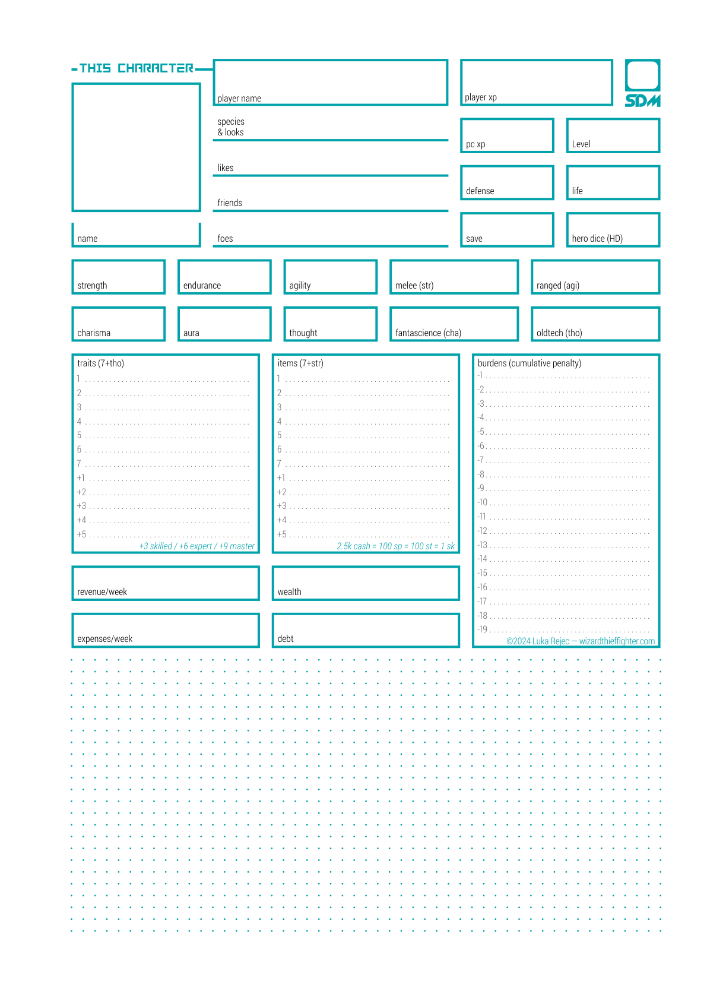

<!-- Vastlands Guidebook, Page 160 -->

# APPNDX

Here we are now, the end of our delightful dreams, the line, the limit, the edge of our builders’ grand design. Behold, they rise ominous, these ramparts. Beyond this _limes_, beyond these wise faces of warning and protection, these good parents who gaze out with death upon our nemeses, that is ruinland, that is despoil, that is nothing, that is _ubi dracones_ .

> [@Vastlands_Guidebook, _p._ _160_]

<!-- Vastlands Guidebook, Page 161 -->

#### I. CHARACTER SHEET

> [@Vastlands_Guidebook, _p._ _161_]

<!-- Vastlands Guidebook, Page 162 -->

#### IV. NPCS OF THE VASTLANDS

Humans living and dead, machines sentient and not, vegetables, fish, beasts, monsters, golems, infections, fungal vectors, spirit creatures, decayed memories, ponderous autofabricators, and slow-drifting airwhales wander onto the stage of the Vastlands to play their part, pose their obstacles, and exit their staged existences.

All these puppets and more serve the referee: non-player characters to awe and surprise the players. To challenge, aid, and join them on their adventures—perhaps even to become player characters in their own right. The following tables summarize four types of NPCs for the referee's convenience—other combinations are possible.

**Encounter in the Vastness**

Roll for each column as required.

| d6 | d20 | Distance | Numbers | Attitude | Potential |
| --- | --- | --- | --- | --- | --- |
| - | 1 | Ambush! | Legion, horde (1d20 x 100) | Murderous, concealed | Lethal |
| 1 | 2–3 | Right here, surprise! | Mob, throng (1d20 x 20) | Aggressive, attacking | Dangerous |
| 2 | 4–6 | Close enough to talk | Many, dozens (2d20) | Hostile, armed | Fierce |
| 3 | 7–10 | Near enough to gesture | Group, band (3d6) | Unfriendly, suspicious | Risky |
| 4 | 11–14 | Far enough to see outlines | Several, party (2d4+1) | Wary, standoffish | Handy |
| 5 | 15–17 | Dust and distant specks | Few, posse (1d3+1) | Civil, attentive | Helpful |
| 6 | 18–19 | Tracks and traces remain | Pair, couple (1d2) | Open, cooperative | Valuable |
| - | 20 | Records and rumors | Lone, solitary, unique | Enthusiastic, allied | Essential |

**Generic Synthesized Creature**

The gods in their post-mechanical kindness, the demiurges, the life generators, the mother machines, the matter makers, the beast spews, they give forth many things. Though many fail to live, some live to terrify. If it's alive and has character, this table will serve.

| d00 | Lvl | Life | Mor | Def | Bon | Dmg |
| --- | --- | --- | --- | --- | --- | --- |
| 01–10 | 0 | 4 | 3 | 10 | +2 | 1d4 |
| 11–20 | 1 | 8 | 4 | 11 | +3 | 1d6 |
| 21–30 | 2 | 12 | 5 | 12 | +4 | 1d8 |
| 31–39 | 3 | 16 | 6 | 12 | +5 | 1d10 |
| 40–48 | 4 | 22 | 6 | 13 | +6 | 1d12 |
| 49–56 | 5 | 29 | 7 | 13 | +7 | 1d8+5 |
| 57–64 | 6 | 38 | 7 | 14 | +8 | 1d10+6 |
| 65–70 | 7 | 52 | 8 | 14 | +9 | 1d12+7 |
| 71–76 | 8 | 68 | 8 | 15 | +10 | 2d8+8 |
| 77–82 | 9 | 90 | 8 | 15 | +11 | 1d20+11 |
| 83–87 | 10 | 120 | 9 | 16 | +12 | 1d20+1d6+12 |
| 88–91 | 11 | 155 | 9 | 16 | +13 | 1d20+1d8+13 |
| 92–94 | 12 | 195 | 9 | 17 | +14 | 1d20+1d10+14 |
| 95–96 | 13 | 240 | 10 | 17 | +15 | 1d20+1d12+15 |
| 97 | 14 | 300 | 10 | 18 | +16 | 2d20+16 |
| 98 | 15 | 375 | 10 | 18 | +17 | 2d20+1d8+17 |
| 99 | 16 | 500 | 10 | 19 | +18 | 2d20+1d12+18 |
| 00 | 17 | 666 | 11 | 20 | +19 | 3d20+20 |

**Humans of the Pananthropy**

Common pan-humanity includes all close‐to-baseline sentient and soulful post-humans, retro-humans, dwarfs, half-elfs, halflings, quarterlings, half-orcs, golems, liches, iron humans, lings, and ghosts. If it lives in a town and does human things, it's probably a human of some sort.

| d00 | Lvl | Life | Mor | Def | Bon | Dmg |
| --- | --- | --- | --- | --- | --- | --- |
| 01–20 | 0 | 4 | 2 | 7 | +3 | 1d4 |
| 20–39 | 1 | 8 | 3 | 8 | +4 | 1d6+1 |
| 40–59 | 2 | 12 | 4 | 9 | +5 | 1d8+2 |
| 60–74 | 3 | 16 | 5 | 10 | +6 | 1d10+3 |
| 75–84 | 4 | 20 | 6 | 11 | +8 | 1d12+5 |
| 85–92 | 5 | 24 | 7 | 12 | +10 | 2d8+6 |
| 93–97 | 6 | 28 | 8 | 13 | +12 | 2d10+9 |
| 98 | 7 | 32 | 9 | 14 | +14 | 2d12+12 |
| 99 | 8 | 36 | 10 | 15 | +16 | 3d10+15 |
| 00 | 9 | 40 | 11 | 16 | +18 | 4d12+20 |

Variant traits (roll d6):

1. **Bonded.** Spend life to grant an ally an equal bonus on their next roll.

2. **Teamwork.** +2 bonus and defense next to an ally.

3. **Toolmaker.** Improvise a weapon or tool in 1 round.

4. **Adaptable.** Copy an enemy's last used special ability.

5. **Tactical**. After being hit by an attack, gains +3 defense against that attack type.

6. **Common Humanity.** Spend 1 life to appeal for understanding and parlay (save).

> [@Vastlands_Guidebook, _p._ _162_]

<!-- Vastlands Guidebook, Page 163 -->

**Brick Bastions**

Floating shields, animated armors, soil golems, lumberlings, horde zombies, crawling flesh centipedes, armor vomes, gelatinous skeletons, and other creatures that can't avoid getting hit. Often slow.

| d00 | Lvl | Life | Mor | Def | Bon | Dmg |
| --- | --- | --- | --- | --- | --- | --- |
| 01–25 | 0 | 12 | 6 | 7 | +0 | 1d6 |
| 26–45 | 1 | 25 | 7 | 7 | +1 | 2d6 |
| 46–59 | 2 | 40 | 8 | 7 | +1 | 3d6 |
| 60–74 | 3 | 60 | 9 | 7 | +2 | 4d6 |
| 75–84 | 4 | 85 | 10 | 7 | +2 | 5d6 |
| 85–92 | 5 | 120 | 11 | 7 | +3 | 6d6 |
| 93–97 | 6 | 160 | 11 | 7 | +3 | 7d6 |
| 98 | 7 | 220 | 11 | 7 | +4 | 8d6 |
| 99 | 8 | 300 | 11 | 7 | +4 | 9d6 |
| 00 | 9 | 400 | 11 | 7 | +5 | 10d6 |

Variant traits (roll d6):

1. **Shieldfriend.** Can take a hit meant for nearby allies.

2. **Steadfast.** Cannot be moved against their will.

3. **Denial.** Adjacent enemies have difficulty moving.

4. **Resistomorph.** After being hit by an attack, ignore that attack type for one round.

5. **Rockblood.** Below half life, double defense.

6. **Slam.** Spend 5 life: knock down adjacent foes (save).

**Crystal Cannons**

Electric wizards, gas goblins, spore shooters, drop bears, doom discs, floating rayballs, porcelain liches, thanatic fanatics, and others that deal damage but can't take it.

| d00 | Lvl | Life | Mor | Def | Bon | Dmg |
| --- | --- | --- | --- | --- | --- | --- |
| 01–20 | 0 | 1 | 2 | 12 | +5 | 1d6+5 |
| 20–39 | 1 | 2 | 3 | 13 | +6 | 1d8+6 |
| 40–59 | 2 | 4 | 3 | 14 | +7 | 1d10+7 |
| 60–74 | 3 | 7 | 4 | 15 | +8 | 1d12+8 |
| 75–84 | 4 | 11 | 4 | 16 | +9 | 2d8+9 |
| 85–92 | 5 | 16 | 5 | 17 | +10 | 3d6+10 |
| 93–97 | 6 | 22 | 5 | 18 | +11 | 2d10+11 |
| 98 | 7 | 29 | 6 | 19 | +12 | 2d12+12 |
| 99 | 8 | 37 | 6 | 20 | +13 | 5d6+13 |
| 00 | 9 | 46 | 7 | 21 | +14 | 6d6+14 |

Variant traits (roll d6):

1. **Overcharge.** Spend level life to double damage.

2. **Desperate Shot.** Deal triple damage when at 1 life.

3. **Feedback.** Each hit suffered adds 1d6 to damage.

4. **Shatter.** On death, level x d4* dmg to all nearby.

5. **Phase.** Spend 1 life to become a ghost for 1 round.

6. **Circle of Pain.** Nearby allies deal and suffer double damage. Adjacent foes just suffer double damage.

**Darting Dodgers**

Hoptoads, lashing leapers, vomitorrials, nimblers, fire furies, nightmare ninjas, neon knights, mercury golems, bioenhanced bandits, and other creatures that depend on their speed to avoid attacks and score hits.

| d00 | Lvl | Life | Mor | Def | Bon | Dmg |
| --- | --- | --- | --- | --- | --- | --- |
| 01–20 | 0 | 3 | 2 | 13 | +3 | 1d4* |
| 20–39 | 1 | 6 | 3 | 14 | +4 | 1d6* |
| 40–59 | 2 | 10 | 4 | 15 | +5 | 2d4* |
| 60–74 | 3 | 14 | 4 | 16 | +6 | 2d6* |
| 75–84 | 4 | 19 | 5 | 18 | +8 | 2d8* |
| 85–92 | 5 | 24 | 6 | 20 | +10 | 3d6* |
| 93–97 | 6 | 30 | 7 | 22 | +12 | 3d8* |
| 98 | 7 | 36 | 7 | 24 | +14 | 4d6* |
| 99 | 8 | 43 | 8 | 26 | +16 | 5d6* |
| 00 | 9 | 50 | 9 | 28 | +18 | 6d6* |

Variant traits (roll d6):

1. **Charger.** Double damage after a direct charge.

2. **Double Attack.** Attacks twice with one action.

3. **Riposte.** Free counterattack against missed attacks.

4. **Evasive.** Sacrifice attack to add bonus to defense.

5. **Springer.** Jump away after attacking without provoking an opportunity attack.

6. **Stabber.** Double damage to surprised opponents.

**Erratic Expendables**

Doom drones, exploding skeletons, suicide squirrels, spitborn ghoulies, shackleminded grenadiers, bicycle cavalry. Not expected to return from the fight.

| d00 | Lvl | Life | Mor | Def | Bon | Dmg |
| --- | --- | --- | --- | --- | --- | --- |
| 01–20 | 0 | 1 | 4 | 7 | +3 | 1d4 |
| 20–39 | 1 | 2 | 5 | 8 | +4 | 1d6 |
| 40–59 | 2 | 3 | 6 | 9 | +5 | 1d8 |
| 60–74 | 3 | 4 | 7 | 10 | +6 | 1d10 |
| 75–84 | 4 | 5 | 8 | 11 | +7 | 1d12 |
| 85–92 | 5 | 6 | 9 | 12 | +8 | 2d8 |
| 93–97 | 6 | 7 | 10 | 13 | +9 | 2d10 |
| 98 | 7 | 8 | 11 | 14 | +10 | 2d12 |
| 99 | 8 | 9 | 11 | 15 | +11 | 3d8 |
| 00 | 9 | 10 | 11 | 16 | +12 | 3d10 |

Variant traits (roll d6):

1. **Death Curse.** Killer suffers a psychic burden.

2. **Martyr.** On death, grants their bonus to nearby allies.

3. **Once Again.** Revives 2 rounds after death. Once.

4. **Killbite.** Gets free attack on death.

5. **Ticking Corpse.** Deals double damage to all nearby 1d4 rounds after death (save to negate).

6. **Frenzy.** Spend 2 defense to get a free attack.

> [@Vastlands_Guidebook, _p._ _163_]

<!-- Vastlands Guidebook, Page 164 -->

#### IX. INSPIRATION

> _"Is this list exhaustive? By the Spheres of Hy-Xaphon, no._ _Some of these are works I enjoyed. Some I found dreadful._ _Others, I just couldn't forget. Still, perhaps it offers novelties_ _apart from those commonplace in this more procedural era."_ —Luka Rejec, Summer 2025

- 2001: A Space Odyssey (1968) - Stanley Kubrick
- 666 (1972) - Aphrodite’s Child
- Advaitic Songs (2012) - Om
- The Adventures of Tintin (1929–76)
- Adventure Time (2010–18) - Pendleton Ward
- Akira (1988) - Katsuhiro Otomo
- Alamut (1937) - Vladimir Bartol
- The Aleph and Other Stories (1949) - Jose Luis Borges
- Alien (1979) - Ridley Scott
- Alphaville (1965) - Jean-Luc Godard
- American Beauty (1970) - Grateful Dead
- Arkhé and Laïlah (1982 and 2001) - Philippe Caza
- Arzach (1975) - Moebius (Jean Giraud)
- Asterix the Gaul (1959–77) - René Goscinny & Albert Uderzo
- At the Edge of Time (2010) - Blind Guardian
- The Bees Made Honey in the Lion’s Skull (2008) - Earth
- Barbarella (1968) - Roger Vadim
- Ben Hur (1959) - William Wyler
- Bhagavad Gita (~100 BC) - Vyasa
- Black Holes and Revelations (2006) - Muse
- Blade Runner (1982) - Ridley Scott
- Blues for the Red Sun (1992) - Kyuss
- The Book of Skulls (1972) - Robert Silverberg
- Brave New World (1932) - Aldous Huxley
- Brazil (1985) - Terry Gilliam
- The Cabin in the Woods (2011) - Drew Goddard
- Cage of Souls (2019) - Adrian Tchaikovsky
- A Canticle for Leibowitz (1959) - Walter M Miller Jr
- The Castle (1926) - Franz Kafka
- Cat’s Cradle (1963) - Kurt Vonnegut
- Childhood’s End (1953) - Arthur C Clarke
- Cities in Flight (1950–62) - James Blish
- Classic Space (1978-88) - Lego
- Cloud Atlas (2004) - David Mitchell
- A Clockwork Orange (1962) - Anthony Burgess
- Conan the Barbarian (1982) - John Milius
- Concorde (1976) - Sud Aviation and BAC
- Dark City (1998) - Alex Proyas
- The Dark Side of the Moon (1973) - Pink Floyd
- Dark Star (1974) - John Carpenter
- Death on the Nile (1937) - Agatha Christie
- Death Race 2000 (1975) - Paul Bartel
- Demons and Wizards (1972) - Uriah Heep
- Deep Purple in Rock (1970) - Deep Purple
- The Diamond Age (1995) - Neal Stephenson
- Dictionary of the Khazars (1984) - Milorad Pavić
- The Dispossessed (1974) - Ursula K Le Guin
- The Doors (1967) - The Doors
- Dopesmoker (2003) - Sleep
- Dracula (1897) - Bram Stoker
- The Drowned World (1962) - J. G. Ballard
- Dune (1965) - Frank Herbert
- Dungeons & Dragons (1974) - Gygax and Arneson
- Egypt (2009) - Egypt
- Epic of Gilgamesh (~1200 BC) - Unknown Sumerian
- Excession (1996) - Iain M Banks
- The Exorcist (1973) - William Friedkin
- Favola di Venezia (1977) - Hugo Pratt
- Fallout 2 (1998) - Black Isle Studios
- Fantastic Planet (1973) - René Laloux
- Fire of Unknown Origin (1981) - Blue Öyster Cult
- Foucault's Pendulum (1988) - Umberto Eco
- Frankenstein (1818) - Mary Shelley
- Garden of Delights (1967) - Ennio Morricone
- The Gates of Hell (1880–1917) - Auguste Rodin
- Gattaca (1997) - Andrew Niccol
- Genesis, Book of (~500 BC) - Unknown
- Ghost in the Shell (1995) - Mamoru Oshii
- GLOG (2016) - Arnold Kemp
- Göbekli Tepe (~9000 BC) - Unknown Hunter-Gatherers
- The Good Soldier Švejk (1921–23) - Jaroslav Hašek
- Goodnight, Civilization (2014) - Zu
- Great Pyramid of Giza (~2600 BC) - Khufu
- Guernica (1937) - Pablo Picasso
- Hall of the Mountain Grill (1974) - Hawkwind

> [@Vastlands_Guidebook, _p._ _164_]

<!-- Vastlands Guidebook, Page 165 -->

- Journey to the West (16th c.) - Wu Cheng’en
- Kon-Tiki expedition (1947) - Thor Heyerdahl
- Korgoth of Barbaria (2006) - Aaron Springer
- Kyoto Gyoen National Garden (17th c.) - Kobori Enshu
- Last and First Men (1930) - Olaf Stapledon
- Lateralus (2001) - Tool
- Life of Brian (1979) - Monty Python
- Lift Your Skinny Fists Like Antennas to Heaven (2000) - Godspeed You! Black Emperor
- Logan’s Run (1976) - Michael Anderson
- Lord of Light (1967) - Roger Zelazny
- The Lost World (1912) - Arthur Conan Doyle
- Low Country (2016) - The Sword
- Lucy (~3000000 BC) - Fossilization
- Mabuta no ura (2005) - Boris
- Mausoleum o. t. First Qin Emperor (208 BC) - Qin Shi Huang
- Macchiato Monsters (2018) - Eric Nieudan
- Mad Max (1979) - George Miller
- Man After Man (1990) - Dougal Dixon
- The Master & Margarita (1928-40) - Mikhail Bulgakov
- Metropolis (1927) - Fritz Lang
- Microlite (2006) - Robin V. Stacey
- Microscope (2011) - Ben Robbins
- Mohenjo Daro (~2500 BC) - Bureau of Waterworks
- Moon City Four (2130–57) - Maj Tom
- Mothership (2024) - Sean McCoy
- Mount Meru (~500) - Matsya Purana
- The Mystery of the Abyss (1966) - Philippe Druillet
- Nausicaä of the Valley of the Wind (1984) - H. Miyazaki
- Nazca Lines (~500BC to ~500) - Nazca Culture
- No Man’s Sky (2016+) - Hello Games
- Nuraghe (~1900 to ~750 BC) - Nuragic Culture
- The Odyssey (~700 BC) - Homer
- The Omega Man (1971) - Boris Sagal
- On the Beach (1959) - Stanley Kramer
- One Hundred Years of Solitude (1967) - Gabriel García Márquez
- One Thousand and One Nights (~1000) - Unknown
- Ötzi (~3200 BC) - Ötztal Alps
- Outlaws of the Marsh (mid 14th c.?) - Shi Nai’an
- Paranoia (1984) - Gelber, Costikyan, and Goldberg
- Paranoid (1970) - Black Sabbath
- Pavji rep: in druge kitajske basni (1986) - Maja Lavrač
- Permutation City (1994) - Greg Egan
- Phaedra (1974) - Tangerine Dream
- Planet of the Apes (1963) - Pierre Boulle
- Planet of the Apes (1968+, 2014+) - F. J. Schaffner et al
- Polygondwanaland (2017) - King Gizzard & the Lizard Wizard
- Potala Palace (~1649) - 5th Dalai Lama
- Princess Mononoke (1997) - Hayao Miyazaki
- Moai Statues (~1000 to 1722) - Rapa Nui
- The Reality Dysfunction (1996) - Peter F Hamilton
- Réquiem (1965) - György Ligeti
- Revelation Space (2000) - Alastair Reynolds
- Roadside Picnic (1972) – Arkady and Boris Strugatsky
- Samurai Champloo (2004) - Shinichirō Watanabe
- Samurai Jack (2001–04) - Genndy Tartakovsky
- Saturn V (1964) - Nasa
- Shahnameh (~977–1010) - Ferdowsi
- Siddhartha (1922) - Hermann Hesse
- Sid Meier's Alpha Centauri (1999) - Firaxis
- Simulacra and Simulation (1981) - Jean Baudrillard
- Slay the Spire (2019) - Mega Crit
- Slumbering Ursine Dunes (2014) - Chris Kutalik
- Soylent Green (1973) - Richard Fleischer
- Spaceballs (1987) - Mel Brooks
- Space Metal (2002) - Star One
- Space Oddity (1969) - David Bowie
- Stalker (1979) - Andrei Tarkovsky
- Stargate (1994) - Roland Emmerich
- The Star Diaries (1976) - Stanisław Lem
- The Stepford Wives (1975) - Bryan Forbes
- Stellaris (2016) - Paradox
- Stories of Your Life and Others (2002) - Ted Chiang
- Super Dimension Fortress Macross (1982–83) - Noboru Ishiguro
- Suspiria OST (1977) - Goblin
- Tale of the Shipwrecked Sailor (~2000–1800 BC) - Amenaa
- Tempel (2006) - Colour Haze
- Teotihuacan (~250) - Unknown
- Theogony (~700 BC) - Hesiod
- The Time Machine (1960) - George Pal
- The Tommyknockers (1987) - Stephen King
- The Thing (1982) - John Carpenter
- Three-Body Problem (2008) - Liu Cixin
- Thundarr the Barbarian (1980–81) - Steve Gerber
- Thundercats (1985–89) - Tobin Wolf
- Tiwanaku (~800) - Tiwanaku
- Total Recall (1990) - Paul Verhoeven
- True History (~150) - Lucian of Samosata
- Ubik (1969) - Philip K Dick
- Ugarit, Fall of (1192 BC) - Ammurapi
- Uluru (~8000+ BC) - Dreamtime Geologies
- Underground (1995) - Emir Kusturica
- Universal Migrator Pt 1 & 2 (2000) - Ayreon
- Vinča-Belo Brdo (~5700 BC) - Vinča Culture
- We (1924) - Yevgeny Zamyatin
- Welcome to Sky Valley (1994) - Kyuss
- Whitehack (2013+) - Christian Mehrstam
- Within the Realm of a Dying Sun (1987) - Dead Can Dance
- The World of Yesterday (1942) - Stefan Zweig
- The Years of Rice and Salt (2002) - Kim Stanley Robinson
- Zardoz (1974) - John Boorman
- Zelda: Breath of the Wild (2017) - Nintendo

> [@Vastlands_Guidebook, _p._ _165_]

<!-- Vastlands Guidebook, Page 166 -->

#### L. 3RD PARTY LICENSE

I’m astonished by the people’s stories of their adventures in the Ultraviolet Grasslands and delighted by the adventures and creatures, stories and locations they’ve created. I promised a third party license a fair while ago, but the life of a solo game creator had its way with me. I played with making my own license for a while, but let’s be real: I’m one, you are many, and there are good licenses about. This one is based on the Mörk Borg license (https://morkborg.com/license/). Check out Mörk Borg if you prefer blackened death metal grim darkness to the polychrome psychedelia of the synthetic dream machine.

Let’s get to it...

**i. Purpose**  
This license lets you write games and build on the Synthetic Dream Machine, without waiting on my review or approval, and without me taking a cut.

As long as you follow a few basic rules.

**ii. Content**

**ii.a.** If you adhere to these terms you can publish free or commercial roleplaying game books and supplements based on and/or declaring compatibility with Synthetic Dream Machine (SDM) without express permission from either Luka Rejec or WTF Studio.  
**ii.b.** You cannot reuse or translate art and text from my works without explicit permission. You may quote passages if you cite the source in-text (e.g. Luka Rejec _Ultraviolet Grasslands 2E_ 2022, 204). You can use the names of creatures, locations, objects, powers and other entities in the game world if you acknowledge the source somewhere in your work. The precise citation style doesn’t matter as long as the source is clear.  
**ii.c.** You can freely reuse and reference the rules and mechanics of Synthetic Dream Machine (SDM).

**iii. Branding**

**iii.a.** You can’t use the SDM, WTF Studio, Exalted Funeral, UVG, VLG, or other logos from my works without explicit permission.

**iii.b.** You are allowed and encouraged (but not required) to use the SDM compatible logo or an SDM compatible logo of your own design.

**iii.c.** You’re not allowed to give the impression that you are making an official SDM product or that I endorse or sponsor you in any way unless I’ve made special arrangements with you.

**iv. Legal**

**iv.a.** Luka Rejec, WTF Studio, Exalted Funeral, or any other publishers of my works take no responsibility for any legal claims against your product.

**iv.b.** Any legal disputes, controversies or claims related to this license shall be governed by and construed in accordance with U.S. copyright laws.

**iv.c.** You must include the following legal text in visible location in your product and on any website or storefront where you promote your product:

> [Product name] is an independent production by [Author or Publisher] and is not affiliated with Luka Rejec or WTF Studio. It is published under the Synthetic Dream Machine Third Party License.

**iv.d.** You must include the following copyright text in a visible location somewhere in your product and websites or storefronts:

> Synthetic Dream Machine (SDM), Ultraviolet Grasslands (UVG), Our Golden Age (OGA), and the Vastlands Guidebook (VLG) are copyright Luka Rejec.

**v. Conclusion**
Make it weird, wonderful, and wild.

Don’t bring modern hatreds and contemporary conflicts into your content. The world of _Our Golden Age_ is at the end of time and space. It faces other issues. Like the dark forest and the heat death of the gods.

> [@Vastlands_Guidebook, _p._ _166_]

<!-- Vastlands Guidebook, Page 167 -->

## C. INDEX

- **ability** 12, 13
  - generate scores 12
- **ability damage** 58
- **abstract damage** 58
- **actions**
  - attack 48
  - free 49
  - movement 48
  - other 49
  - tactical and support 49
- **afflictions** 28
- **alternate abilities** 45
- **anti-canon** 7
- **armor mods**
  - common upgrades 81
  - hallmark xp costs 81
  - post scarcity customizations 81
- **armors** 26, 74, 76
  - armor mods 81
  - classic golem armors 77
  - features 74
  - heavy armors 76
  - light armors 75
  - medium armors 76
  - modern and ancient shields 75
  - standard fabricated armor 74
- **attack** 26
  - fantascience 26
  - melee 26, 68
  - oldtech 26, 68
  - ranged 26, 68
- **autogolem generator** 90
- **automatic success** 41
- **bearer generator** 156
- **bearer, the**
  - bearer generator 156
- **bonus and penalty** 40
- **burden** 28, 59
- **burdenbeast generator** 89
- **burden generator** 59
- **burdens**
  - removing burdens 28
- **burdens from damage** 59
- **burden, wear and tear** 59
- **capacity, ride** 87
- **cash** 23
  - purchases 23
- **chaos reigns** 47
- **character decline** 32
- **character growth** 32
- **character sheet** 161
- **charges vs replenish**
  - score 66
- **chase** 57
- **chase and escape** 57
- **clothes** 21
- **compatible logo** 166
- **conflict goals** 56
- **conflict outline** 46
- **consumables**
  - drink 84
  - drugs 85
  - food 84
  - medicine 84
  - potions 85
  - supplies 85
- **corruption** 98
- **corruption exposure** 98
- **corruption path**
  - blue god 100
- **corruptions, random** 99
- **cradles** 67
- **craft generator** 91
- **damage** 27, 58
  - ability 58, 60
  - abstract 58
  - deadly 58
  - improvised 27
  - unarmed 27
- **dangerous environment** 46
- **dangerous NPCs** 46
- **danger roll, powers** 97
- **deadly combat** 58
- **death** 60, 61
- **defeat** 58, 60
- **defeat table** 60
- **defense** 26
  - more defenses 26
- **dice oracles** 42
- **doing aynthing** 43
- **drinks** 84
- **drugs** 85
- **encounters** 162
- **equipment** 20
  - clothes 21
  - kit 23
  - starting 20, 22, 23
- **equipment, standard attributes** 65

> [@Vastlands_Guidebook, _p._ _167_]

<!-- Vastlands Guidebook, Page 168 -->

- **example characters** 11
  - Cat the referee 11
  - Noë the wizard 11
  - Onion the merchant 11
  - Safir the golem 11
- **experience** 30
  - investing 31
  - recovery 31
  - sources 30
- **exploding dice** 40
- **fabricators** 67
- **fantascience** 26, 27, 68
- **faster recovery** 62
- **fighter** 130, 147
- **foods** 84
- **foolish tasks** 105
- **former master generator** 142
- **friend mimic** 149
- **gadgets**
  - climbing and mobility 82
  - communications 83
  - infiltration 82
  - magielectronics 83
  - outdoors 83
  - rest and recreation 83
  - safety 83
  - stealth 82
  - surveillance and tracking 82
- **given world** 8
- **golem** 77, 90, 122
- **golem armors** 77
  - as NPCs 77
- **group chase** 57
- **group chase roll** 57
- **group roll** 41
- **ha-ka-ba** 61
- **ha, ka, ba** 61
- **hallmark** 31, 80
- **hero dice** 25
- **impossible tasks** 44
- **improvising** 21, 27, 50
- **improvising actions**
  - great idea 50
  - interesting idea 51
  - risky idea 51
  - terrible idea 51
- **initiative** 47
- **interpreting equipment** 65
- **inventory** 28
  - pets 28
  - power 96
  - prosthetics 28
  - traits 14
- **inventory overflow** 28
- **items** 20
  - available items 20
  - consumable 84
  - dropping 21
  - gadgets 82
  - improvising with 21
  - packed items 20
- **items, path**
  - barbarian 117
  - bearer 157
  - bluelander 119
  - bourgeois 121
  - golem 123
  - greenlander 125
  - holy fool 127
  - manager 129
  - noble 131
  - noömagus 133
  - orangelander 135
  - purplelander 137
  - redlander 139
  - scion 141
  - servant 143
  - skeleton 145
  - soldier 147
  - tourist 149
  - trickster 151
  - yellowlander 159
- **kit** 23
- **level** 24, 30
  - **example levels** 24
  - **growth** 31
  - **mindless vehicles** 87
- **life** 24
- **life, death, undeath** 61
- **living weapon forms** 154
- **living weapon purposes** 155
- **magic numbers** 40
- **medicine** 84
- **melee** 26, 27
- **mental defense** 26
- **minions** 163
- **missing skills** 45
- **morale** 56
- **morale test** 56
- **motives for adventure** 29
- **mounts** 86
  - burdenbeasts 89
  - mods 92
  - undead 88
- **movement** 48, 52
  - zones 52, 53, 54, 55
- **movement and range** 52
- **multiple abilities** 45
- **mutation** 98
- **named NPCs**
  - barbarians 117
  - bearers 157
  - bluelanders 119
  - bourgeois 121
  - friend mimic 149
  - golems 123
  - greenlanders 125
  - holy fools 127
  - managers 129
  - nobles 130
  - noömagi 133
  - orangelanders 135
  - purplelanders 137
  - redlanders 139
  - scions 141
  - servants 143
  - skeletons 145
  - soldiers 147
  - tourists 149
  - tricksters 151
  - weapons 153
  - yellowlanders 159
- **names** 33
- **noble origins** 131
- **NPC reactions** 47
- **NPCs** 162
  - archetypes 163
  - autonomous wards 78
  - bastions 163
  - crystal cannons 163
  - dead 145
  - dodgers 163
  - expendables 163
  - fighters 117, 147
  - full auto golems 77
  - generic 162
  - holy 127
  - human 162
  - masters 130, 141, 153
  - mechanical 123
  - morale 56
  - rainbowlanders 119, 125, 135, 137, 139, 159
  - servants 129, 143, 157
  - tricksters 121, 149, 151
  - weapon 153
  - wizards 133
- **odd quirks** 103
- **oldtech** 26, 27
- **organization** 129
- **organization generator** 129
- **out of the fight** 58
- **overloaded encounter dice** 67
- **overloaded ride** 87
- **paths** 16, 114
  - barbarian 17
  - bluelander 118
  - bourgeois 120
  - fighter 17
  - golem 122
  - greenlander 124
  - holy fool 126
  - manager 128
  - noble 130
  - noömagus 132
  - orangelander 134
  - purplelander 136
  - redlander 138
  - scion 140
  - servant 142
  - skeleton 144
  - soldier 146
  - tourist 148
  - traveler 17
  - trickster 150
  - weapon and bearer 152
  - wizard 16
  - yellowlander 158
- **path traits** _See_ **traits, path**
- **pet** 149
  - master 137
- **pet master generator** 137
- **pets and sidekicks** 31
- **potions** 85
- **power** 96
  - acquiring 102
  - albums 106, 107
  - apocrypha 112
  - chromatic 108
  - danger 97
  - gun-fu 109
  - highway 110
  - inventing new 104
  - modifying 103

> [@Vastlands_Guidebook, _p._ _168_]

<!-- Vastlands Guidebook, Page 169 -->

  - purification 111
  - weapon 154
- **power album concepts** 106
- **power album formats** 107
- **power albums**
  - apocrypha of the OS 112
  - dawn's highway 110
  - fundamental purification 111
  - sixfold hexacenter 108
  - viridian practice 109
- **power rules**
  - activating powers 96
  - adjusting through play 104
  - anchored powers 97
  - attack powers 97
  - corruption exposure 98
  - dangerous powers 97
  - danger rolls 97
  - example levels 97
  - focus 97
  - fueled powers 97
  - getting new powers 102
  - hacks, upgrades, quirks 103
  - imbued powers 97
  - inventing new powers 104
  - item powers 97
  - learning to use powers 102
  - life price 96
  - modifying powers 103
  - overcharge 96
  - power attributes 96
  - power duration 96
  - power level 96
  - power range 96
  - power targets 96
  - skills and powers 96
  - spell levels vs power levels 104
  - storing powers 96
- **powers**
  - 1 access noötree 113
  - 1 better pastures 110
  - 1 blue lotus 108
  - 1 can trip 112
  - 1 counterfire 109
  - 1 dampen mass 110
  - 1 dancing in the hail 109
  - 1 depleted heavy metal rain 109
  - 1 eyes of the arrow 109
  - 1 green haven 108
  - 1 highway cruiser 110
  - 1 mother of bullets 109
  - 1 objective telekinesis 154
  - 1 orange dream 108
  - 1 purple memories 108
  - 1 red mist 108
  - 1 ring of lead 109
  - 1 roadfinder 110
  - 1 suspended insight 111
  - 1 suspended in the light 154
  - 1 wing and prayer 110
  - 1 yellow cloud 108
  - 2 tragic missile 112
  - 3 thornstone obelisk 111
  - 4 hlod person 112
  - 6 pyreball 112
  - 6 roadmaker 110
  - 7 invoke Ub dragon 111
  - 8 eyes of Akaula 111
  - 8 nihil est! 112
  - 17 Stoyevod's irreducible crystallization of the ego complex 111
  - 18 big wish 112
  - 21 Akaula's sacrificial hero 111
- **prestige** 26
- **prices overview** 23
- **pure chance** 44
- **purpose** 155
- **purposes** 29
- **random encounter** 162
- **ranged** 26, 27
- **ranges** _See_ **movement and range**
- **referee titles** 7
- **regrowing the body** 63
- **reinstalling the mind** 63
- **relife** 63
- **replenishers**
  - cradles 67
  - other sources 67
  - single-use 67
- **resources** 66
  - charges 66
  - replenish 66
  - running low 66
  - running out 66
  - sources 67
- **rest** 62
  - faster recovery 62
- **reviving the dead** 63
- **rides**
  - aircraft 91
  - autogolems 90
  - beasts of burden 89
  - capacity 87
  - features 86
  - levels and attributes 87
  - modules and upgrades 92
  - size 87
  - speed 87
  - standard cultivated 86
  - undead rides 88
  - wagons 88
  - watercraft 90
- **rides, overloading** 87
- **roll on target** 41
- **roll when it counts** 42
- **rounds** 47
- **running low** 66
- **sacrifice** 25, 41, 65, 87
- **save** 25
  - other modifiers 25
  - relevant abilities 25
- **scion backgrounds** 141
- **setting** 8, 9
- **shared characters** 31
- **shield** 75
- **sidekick**
  - bearer 156
- **size, ride** 87
- **sizes** 20
  - ride 87
- **skeleton** 145
- **social defense** 26
- **specific abilities** 45
- **speed, ride** 87
- **spell levels vs power levels** 104
- **spells** _See_ **powers**
- **starting character**
  - abilities 13
  - ability generator 12
  - attack 26
  - background generator 15
  - cash 23
  - damage 27
  - defense 26
  - growth through play 32
  - growth through xp 31
  - hero dice 25
  - items 20, 28
  - kit 23
  - level 24
  - life 24
  - motives 29
  - names 33
  - overview 34
  - save 25
  - strange item 22
  - trait, background 14
  - trait, free 18
  - trait, path 16
- **strange item**
  - selling oddities 22
- **strange rituals** 105
- **strange stolen goods** 150
- **suitable or unsuitable** 41
- **summoning the shattered husk of the dead from oblivion** 63
- **supplies** 85
- **sure things** 44
- **tables**
  - 50 motives 29
  - 100 ability arrays 12
  - 160 names 33
  - ability generation 12
  - album concepts and contents 106
  - album formats 107
  - armor mods 81
  - armors, golem 77
  - armors, heavy 76
  - armors, light 75
  - armors, medium 76
  - armors, standard 74
  - autonomous wards 78
  - burden generator 59
  - charges v replenish 66
  - consumables 84
  - corruption exposure 98
  - corruptions 99
  - d6 oracle 42
  - d20 oracle, skilled 42
  - defeat table 60
  - drinks 84
  - drugs 85
  - faster recovery 62

> [@Vastlands_Guidebook, _p._ _169_]

<!-- Vastlands Guidebook, Page 170 -->

  - foods 84
  - foolish tasks 105
  - full auto golem NPCs 77
  - gadgets, many kinds 82, 83
  - group chase roll 57
  - ha, ka, ba 61
  - images for zones 55
  - items, barbarian 117
  - items, bearer 157
  - items, bluelander 119
  - items, bourgeois 121
  - items, golem 123
  - items, greenlander 125
  - items, holy fool 127
  - items, manager 129
  - items, noble 131
  - items, noömagus 133
  - items, orangelander 135
  - items, purplelander 137
  - items, redlander 139
  - items, scion 141
  - items, servant 143
  - items, skeleton 145
  - items, soldier 147
  - items, tourist 149
  - items, trickster 151
  - items, yellowlander 159
  - level and power 24
  - manager organizations 129
  - medicines 84
  - NPC, bastion 163
  - NPC, crystal cannon 163
  - NPC, dodger 163
  - NPC, expendable 163
  - NPC, generic 162
  - NPC, human 162
  - NPC morale 56
  - NPC reactions 47
  - one strange item 22
  - overloaded encounter die 67
  - pet masters 137
  - potions 85
  - powers and levels 97
  - powers, modifications 103
  - powers, prices 102
  - powers, studying 102
  - random encounter 162
  - referee titles 7
  - relife consequences 63
  - replenishers 67
  - ride attributes by level 87
  - ride modifications 92
  - ride overloading 87
  - rides, aircraft 91
  - rides, autogolems 90
  - rides, beasts of burden 89
  - ride speed 87
  - rides, standard 86
  - rides, undead 88
  - rides, wagons 88
  - rides, watercraft 90
  - selling strange items 22
  - servant masters 142
  - shields 75
  - size chart 20
  - standard wards 78
  - stolen goods 150
  - strange rituals 105
  - supplies 85
  - testing morale 56
  - the bearer 156
  - the weapon's form 154
  - the weapon's purpose 155
  - traditional backgrounds 15
  - trait, idea seed 19
  - trait, random 18
  - trait skill modifiers 14
  - typical modifiers 40
  - typical target numbers 39
  - ward compatibility errors 78
  - ward mods 81
  - wards, many kinds 79
  - weapon mods 80
  - weapons, melee 70
  - weapons, ranged 71, 72
  - weapons, standard 68
  - what cash buys 23
  - wizard mentors 105
  - xp, hallmark gear 80
  - xp, investing 31
  - zones and ranges 52
  - zones, vehicle action 54
- **thief** 120, 150
- **traits** 14, 18
  - background generator 15
  - gaining traits 31, 32
  - inventing traits 18
  - random trait 18
  - skill modifier 14
  - trait ideas 19
- **traits, path**
  - barbarian 117
  - bearer 157
  - bluelander 119
  - bourgeois 121
  - fighter 17
  - golem 123
  - greenlander 125
  - holy fool 127
  - manager 129
  - noble 131
  - noömagus 133
  - orangelander 135
  - purplelander 137
  - redlander 139
  - scion 141
  - servant 143
  - skeleton 145
  - soldier 147
  - tourist 149
  - traveler 17
  - trickster 151
  - weapon 153
  - wizard 16
  - wizard, proper 105
  - yellowlander 159
- **traits, rides** 92
- **turns** 47
- **undead ride generator** 88
- **using images for zones** 55
- **UVG backstory** 9
- **vehicles and mounts** 86 _See_ **rides**
  - aircraft 91
  - autogolems 90
  - features 86
  - mods 92
  - wagons 88
  - watercraft 90
- **wagon stylings** 88
- **ward mods** _See_ **armor mods**
- **wards** 26, 78
  - bulky 79
  - compatibility errors 78
  - features 78
  - portable 79
  - standard ward attributes 78
  - trinkets 79
  - ward features 78, 81
  - wards as NPCs 78
  - wearable 79
- **weapon and bearer** 152
- **weapon Mods**
  - hallmark xp cost 80
  - postreality customizations 80
  - standard upgrades 80
- **weapons** 68, 70, 71, 72
  - area effects 68
  - attack abilities 68
  - baseline human ranges 68
  - features 69
  - long ago melee wpns 70
  - melee 70
  - melee weapons 70
  - ranged 71, 72
  - ranged weapons 71
  - standard fabricated 68
  - terrible ancient ranged 72
  - the 153
  - throwing 71
  - throwing weapons 71
  - weapon features 69
  - weapon mods 80
- **wizard** 16, 105, 132
- **wizarding quests** 105
- **zones, relative** 53
- **zones, vehicle action** 54

> [@Vastlands_Guidebook, _p._ _170_]
