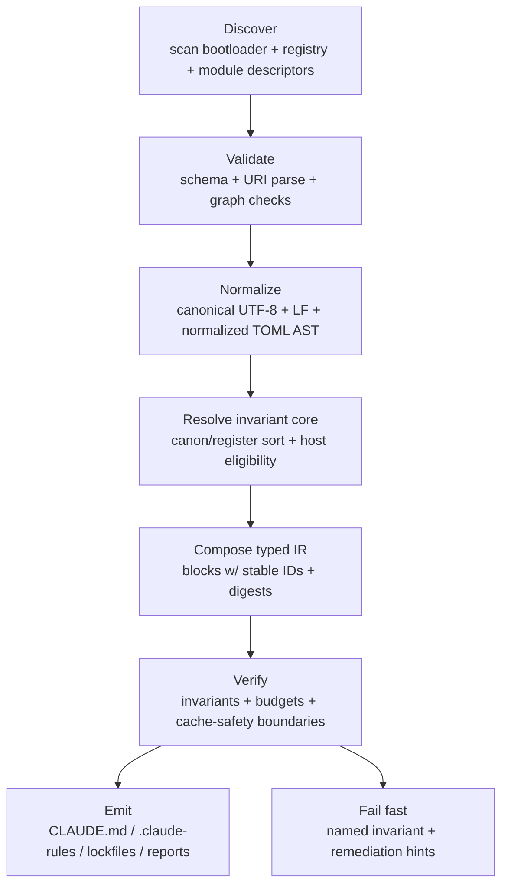

# Phased Deterministic Loading Architecture for Claude Code in VSCode

## Executive summary

Your desired end-state is a **deterministic loader/compiler** that assembles Claude Code / VSCode instruction surfaces from **human-edited TOML manifests**, using **stable `lares:` URIs** and a **Canon register** to enforce a small, cache-friendly invariant core—while still allowing a large “old notes / stuffed archive” corpus to exist under **Maybe Logic** until it is promoted into typed modules.

Primary-source constraints strongly shape what will work in practice:

Claude Code loads **`CLAUDE.md`** (not `AGENTS.md`) at session start, but it supports importing other files via `@path/to/import`, supports hierarchical discovery (walk up the directory tree, and lazy-load subdirectory files when Claude reads in those directories), and offers modular “rules” under `.claude/rules/` including **path-scoped rules** via YAML frontmatter `paths`. citeturn2view0turn3view0turn4view0 Claude also recommends keeping `CLAUDE.md` concise (target under ~200 lines), and notes that duplicates or conflicting rules degrade adherence. citeturn2view0turn2view1

For cache-safety (especially for API/automation or any harness using Anthropic prompt caching), Anthropic’s prompt caching operates on **prefix hashes** up to explicit cache breakpoints, requires stable early blocks (tools → system → messages), allows **up to 4 breakpoints**, uses a **20-block lookback window**, and bills cache writes at **1.25×** (5m) or **2×** (1h) while cache reads cost **0.1×** base input tokens. citeturn2view2turn5view2turn5view3

Under these constraints, the architecture that best matches your goals is:

- a **TOML-first control plane** (module descriptors, registries, bootloaders, invariants)
- a **typed IR** that composes stable blocks in deterministic order (canon first)
- host emitters that produce:
  - `.claude/CLAUDE.md` as a **small dispatcher** that imports compiled module bundles (or imports `AGENTS.md` and then appends Claude-specific rules)
  - `.claude/rules/*.md` for **scoped** and **path-scoped** modules (YAML `paths` frontmatter)
  - optional `.claude/agents/*.md` subagents when desired (YAML frontmatter), rather than overstuffing root context citeturn3view0turn7search1

Deliverables included below:

- updated `_todo/core/AGENTS.md` and `_todo/core/README.md` (archive-aware, migration-oriented)
- TOML schema/templates for module, tool, permission, registry, bootloader
- deterministic hashing + versioning recommendations with `lares:` URI examples
- migration checklist + extraction pseudocode for legacy “Stuffed” and note files
- verification test plan + sample `.claude/CLAUDE.toml` bootloader
- canon band tables + a mermaid flowchart of the loader pipeline

Downloads:
- [Updated AGENTS.md for `_todo/core`](sandbox:/mnt/data/AGENTS_updated.md)
- [Updated README.md for `_todo/core`](sandbox:/mnt/data/README_updated.md)

## Primary-source constraints that shape the design

### Claude Code instruction loading and scoping

Claude Code supports two persistent memory mechanisms: user-authored `CLAUDE.md` files and “auto memory.” Both load at the start of each conversation, but Claude treats them as **context, not enforced configuration**, and more specific guidance tends to work better. citeturn2view0turn4view2

Key mechanics that your loader can and should exploit:

Claude Code can import additional files using `@path/to/import`. Imports resolve relative to the file containing the import, can be absolute or relative, and can recurse up to **five hops**. citeturn3view3turn2view0

Claude Code walks up the directory tree from the working directory, concatenating discovered `CLAUDE.md` / `CLAUDE.local.md` files (rather than overriding), and it lazy-loads instructions from subdirectories when Claude reads files there. citeturn2view0turn4view0

Claude Code provides `.claude/rules/` for modular instruction files. Rules without `paths` load unconditionally (with the same priority as `.claude/CLAUDE.md`), while path-scoped rules use YAML frontmatter `paths:` globs and trigger when Claude works with matching files. citeturn3view0turn3view2turn3view1

Claude Code reads `CLAUDE.md`, not `AGENTS.md`, but Anthropic explicitly recommends importing `AGENTS.md` into `CLAUDE.md` (using `@AGENTS.md`) if your repo already uses `AGENTS.md` for other agents, to avoid duplicating instructions. citeturn4view0

Operational implication: your invariant loader should treat **`.claude/CLAUDE.md` as a dispatcher**, and treat `.claude/rules/` as the main mechanism for local, modular, deterministic scoping.

### Prompt caching constraints for cache-friendly assembly

Anthropic prompt caching caches the **entire prefix** of a request (tools, then system, then messages) up to a designated `cache_control` breakpoint. Cache hits occur when a subsequent request has the same prefix up to a prior written breakpoint. citeturn2view2turn5view3

Important details relevant to how you assemble blocks:

Cache writes happen only at breakpoints (one cumulative prefix hash per breakpoint). Changing anything at or before the breakpoint changes that hash. citeturn5view2

Cache reads “look backward” (up to 20 blocks) for a matching prior write and you can define up to 4 breakpoints to improve hit rates for long or growing prompts. citeturn5view2turn5view0

Pricing multipliers are explicit: 5-minute cache write tokens are **1.25×** base input price, 1-hour cache write tokens are **2×**, and cache read tokens are **0.1×** base input price. citeturn2view2

Operational implication: your deterministic IR must preserve **stable block boundaries** (not “string soup”), and your compiler should be able to emit either (a) a Claude Code file tree, or (b) an API request block layout with explicit breakpoints for caching.

### TOML constraints relevant to determinism

TOML v1.0.0 is case-sensitive, must be valid UTF-8, and maps unambiguously to a hash table; whitespace around key/value syntax is not semantically meaningful. citeturn2view3

Operational implication: TOML is excellent for human-edited manifests and registries, but because key ordering is not semantic, you must define your **own canonicalization** to compute stable digests.

### Event sourcing and tracing best practices for your “crystal” ledger

Event sourcing stores state changes as an immutable sequence of events that can reconstruct past states; snapshots can be derived caches, and replay enables reconstruction and auditing. citeturn2view4turn6search2

OpenTelemetry defines spans (units of work within traces) as having attributes plus timestamped events: Events are tuples of (timestamp, name, attributes), and trace/span identifiers structure causality and replay-like reasoning about execution paths. citeturn7search4turn7search5

Operational implication: keep `STATE.jsonl` semantics **event-sourced** (append-only + replay), and treat your HUD/micro-trace as an operator-readable surface analogous to trace/span/event practices.

## Proposed phased deterministic loading architecture

### Architectural components

The overall architecture is a compiler pipeline:

- **Human-editable control plane (TOML):** module descriptors, tool descriptors, permission descriptors, registries, bootloaders, invariants
- **Human-authored content plane (Markdown):** kernels, core modules, scoped modules, platform notes
- **Typed compiler + IR:** resolves graphs, normalizes content, enforces invariants, emits host artifacts
- **Host surfaces:** `.claude/CLAUDE.md`, `.claude/rules/*.md`, optional `.claude/agents/*.md`, plus any Codex/Copilot targets you generate

This matches Claude Code best practice: keep the root `CLAUDE.md` small, use imports and rules for modular instructions, and avoid bloating every conversation. citeturn2view1turn3view2turn3view3

### Loader pipeline flowchart



### Deterministic rules that make “Maybe Logic” safe

To be comfortable with uncertainty (RAW’s “Maybe Logic”), the architecture must allow ambiguous, legacy, and competing versions to co-exist—without leaking into invariant core behavior.

The mechanism is:

- `canon_scope = advisory` + low `canon_value` for archive/notes and extracted candidates
- promotion into canon requires explicit action (and verification)
- the bootloader must load only canon-scoped invariant modules by default

This prevents “old notes” from silently becoming runtime constraints.

## TOML schemas and URI/hashing standards

TOML does not standardize a schema language; the “schemas” below are **normative templates** with declared required keys, value types, and deterministic rules. TOML semantics relevant here: it is UTF‑8, case-sensitive, and maps to a hash table; whitespace around keys/values is ignored. citeturn2view3

### Module descriptor schema

File: `modules/<module_id>.module.toml`

```toml
# lares.module@1 — Module Descriptor (human-edited TOML)
schema = "lares.module@1"

# Stable identity
module_id = "lares-kernel"
lares_uri = "lares://canon/module/lares-kernel@4.0.1?register=C:1.0&canon=10.0&scope=hard#sha256=__SEMANTIC_SHA256__"

title = "Lares Kernel"
description = "Invariant identity + gates + minimal runtime operating rules."

# Epistemic register (0.0–1.0)
[register]
label = "C"         # C | CS | S | SP | P
value = 1.0         # float in [0.0, 1.0]

# Loader canon (0.0–10.0) + enforcement class
[canon]
value = 10.0        # float in [0.0, 10.0]
scope = "hard"      # hard | soft | advisory
scope_reason = "Invariant core identity floor."

# Classification + loading
[class]
kind = "kernel"     # kernel | core | scoped | tool | permission | platform | worker | reference | archive
phase = 0           # integer phase (boot=0, core=1, scoped=2+)

[load]
always = true
hosts = ["claude-code.vscode"]      # host capability tags
provides_rules = false             # if true, emitter also writes .claude/rules files
paths = []                         # optional: path-scoped intent for rules emission

# Source payload
[source]
format = "markdown"   # markdown | toml | jsonl
path = "sources/kernel/Lares_Kernel.md"
encoding = "utf-8"
normalize_newlines = "lf"          # compiler rule: emit LF regardless of input

# Optional exports (avoid heading extraction; exports must be explicit)
[[exports]]
export_id = "default"
format = "markdown"
# future: export markers, fenced blocks, etc. (explicit, stable, not headings)

# Optional budgets
[budgets]
max_lines_claude_hint = 200        # Claude docs recommend keeping CLAUDE.md concise
max_bytes_emitted = 32768
```

Why this shape: Claude Code encourages small root instruction files and modularization via imports/rules; encoding budgets at descriptor level lets verification fail before emission. citeturn2view1turn3view2

### Tool descriptor schema

File: `tools/<tool_id>.tool.toml`

```toml
# lares.tool@1 — Tool Descriptor (human-edited TOML)
schema = "lares.tool@1"

tool_id = "web_search"
lares_uri = "lares://canon/tool/web_search@1.0.0?register=C:1.0&canon=9.0&scope=hard#sha256=__SEMANTIC_SHA256__"

title = "Web Search Tool"
description = "External web search integration; used only when permitted."

[register]
label = "C"
value = 1.0

[canon]
value = 9.0
scope = "hard"

# Claude API tool definition (expressed in TOML)
[claude_api]
name = "web_search"
# Your compiler may transform this into the JSON payload required by the API.

[claude_api.input_schema]
type = "object"

[claude_api.input_schema.properties.query]
type = "string"
minLength = 1

[claude_api.input_schema.required]
items = ["query"]
```

If you later emit Claude Code hooks or permissions around tool usage, keep those in a permission/grant descriptor, not the tool schema itself. Claude Code tooling and permissions are configured via settings JSON, not via `CLAUDE.md`, so treat tool “meaning” and tool “policy” separately. citeturn7search2

### Permission descriptor schema

File: `permissions/<perm_id>.permission.toml`

```toml
# lares.permission@1 — Permission Policy (human-edited TOML)
schema = "lares.permission@1"

permission_id = "repo-safe-default"
lares_uri = "lares://canon/permission/repo-safe-default@1.0.0?register=C:1.0&canon=9.5&scope=hard#sha256=__SEMANTIC_SHA256__"

title = "Workspace Trust Gate + Safe Defaults"
description = "Deny sensitive file reads; require confirmation for dangerous actions."

[register]
label = "C"
value = 1.0

[canon]
value = 9.5
scope = "hard"

# Target: Claude Code settings.json (machine-applied, not prompt-only)
# Claude Code permission keys include allow/ask/deny lists. citeturn7search2
[claude_code.permissions]
deny = [
  "Read(./.env)",
  "Read(./.env.*)",
  "Read(./secrets/**)"
]
ask = [
  "Bash(git push:*)"
]
allow = [
  "Bash(git diff:*)"
]
```

Claude Code settings precedence (managed policy → CLI → local project → shared project → user) means “hard” canon permissions should ideally live in project settings or managed policy, not in prompt text. citeturn7search2

### Registry schema

File: `registry/lares.registry.toml`

```toml
# lares.registry@1 — Global Registry (compiler-maintained TOML, but still human-readable)
schema = "lares.registry@1"
generated_by = "lares-compiler@0.1.0"
generated_at = "2026-04-07T00:00:00Z"

# Determinism rule: entries sorted lexicographically by lares_uri.
[[entry]]
lares_uri = "lares://canon/module/lares-kernel@4.0.1?register=C:1.0&canon=10.0&scope=hard#sha256=abc..."
kind = "module"
descriptor_path = "modules/lares-kernel.module.toml"
source_path = "sources/kernel/Lares_Kernel.md"

# Two digests: file digest and semantic digest (post-normalization; comment stripping if applicable)
file_sha256 = "..."
semantic_sha256 = "..."

promotion_status = "canon"   # canon | candidate | archive
```

### Bootloader schema

File: `.claude/CLAUDE.toml` (compiler input)

```toml
# lares.boot@1 — Bootloader for Claude Code (VSCode)
schema = "lares.boot@1"

target_id = "claude-code.vscode"
emit_claude_md = ".claude/CLAUDE.md"
emit_rules_dir = ".claude/rules"
emit_agents_dir = ".claude/agents"

# The invariant core: canon hard modules only
[[load]]
lares_uri = "lares://canon/module/lares-kernel@4.0.1?register=C:1.0&canon=10.0&scope=hard#sha256=..."
required = true

[[load]]
lares_uri = "lares://canon/module/lares-epistemology@1.0.0?register=C:1.0&canon=9.6&scope=hard#sha256=..."
required = true

# Optional scoped modules (emit to .claude/rules with paths frontmatter)
[[load]]
lares_uri = "lares://canon/module/lares-vscode-ops@1.0.0?register=C:1.0&canon=8.5&scope=soft#sha256=..."
required = false
emit_as_rule = true
rule_paths = ["_todo/**", "builds/**"]
```

### Deterministic hashing and versioning recommendations

#### How to canonicalize before hashing

Because TOML maps to a hash table (key ordering is not semantic), parse TOML into an AST/data model and hash a **canonical serialization** (e.g., sorted keys; stable float formatting; arrays preserved in order). citeturn2view3

For Markdown modules, normalize:
- UTF‑8
- LF line endings
- trim trailing whitespace

Then compute SHA‑256 over the normalized bytes. SHA‑256 is specified as part of the Secure Hash Standard (FIPS 180‑4). citeturn8search45turn8search0

Recommendation: maintain **two digests** per artifact:
- `file_sha256`: hash of exact file bytes on disk (change detector)
- `semantic_sha256`: hash of normalized, semantically relevant content (determinism + cache safety)

#### Version fields to avoid “seq_num confusion”

To prevent the known ambiguity between “event sequence number” and “module version,” keep these separate:

- `module_version` (SemVer: `MAJOR.MINOR.PATCH`)
- `module_semantic_sha256` (content digest)
- `event_seq` (monotonic integer in `STATE.jsonl` only)

This aligns with event sourcing guidance: event ordering and state reconstruction use a durable log sequence; versioning of code/config is distinct. citeturn2view4turn6search2

#### `lares:` URI examples

Invariant core module:
```text
lares://canon/module/lares-kernel@4.0.1?register=C:1.0&canon=10.0&scope=hard#sha256=0b7c...
```

Scoped rule module:
```text
lares://canon/module/lares-vscode-ops@1.0.0?register=C:1.0&canon=8.5&scope=soft#sha256=91aa...
```

Archive/candidate (not auto-loaded):
```text
lares://archive/note/monoprompt-sketch@0.0.0?register=S:0.65&canon=2.0&scope=advisory#sha256=fe12...
```

## Cache-friendly assembly and breakpoints

### Cache-friendly assembly rules for API/harness usage

Anthropic prompt caching depends on a stable prefix up to designated breakpoints and writes only at breakpoints. citeturn5view2turn2view2

Compiler rules to ensure cache hits:

- keep tool definitions stable and early (`tools` first, then `system`, then `messages`) citeturn5view1turn5view3
- place breakpoints at the end of stable prefixes, not on variable blocks (timestamps, per-request context, user turn) citeturn5view2turn5view0
- keep the number of blocks reasonable; lookback is 20 blocks per breakpoint, and you can define up to 4 breakpoints for stability in long conversations citeturn5view2
- encode breakpoint boundaries in IR (block identities), not by string concatenation

Pricing and TTL strategy (for budgeting):
- 5m TTL cache writes cost 1.25× base input tokens; 1h TTL cost 2×; cache reads are 0.1×. citeturn2view2turn5view2

### Cache-friendly assembly for Claude Code file-tree usage

Claude Code itself is not “prompt caching” in the API sense, but the same principle holds: early always-loaded instructions should be small and stable, and everything else should be modularized so it only loads on demand. Anthropic explicitly recommends splitting large instructions using imports or `.claude/rules/`. citeturn2view0turn3view2

A practical emitter pattern:

- `.claude/CLAUDE.md` (~50–150 lines):
  - imports `@AGENTS.md` (shared cross-agent root)
  - imports `@.claude/generated/invariant-core.md` (compiled, stable)
  - includes a short Claude-specific section if needed
- `.claude/rules/*.md`:
  - one file per scoped module
  - includes YAML `paths:` when scoping is desired citeturn3view0turn3view1

## Migration plan from Stuffed archive and legacy notes

### Migration checklist

Create a deterministic, repeatable migration that does not accidentally promote archive material into runtime canon:

- Inventory the “Stuffed” tree and old notes into a TOML inventory (file digests, inferred class, inferred register/canon defaults).
- Generate a mapping table (old path → new `module_id` + `lares_uri`).
- Extract candidate modules into a clean source tree:
  - whole-file extraction if the file already functions as a module
  - heuristic extraction only to bootstrap candidates, never as runtime dependency
- Generate module descriptors for each candidate with `canon_scope="advisory"` by default.
- Require explicit promotion (human review + verification) to elevate to `canon_scope="soft"` or `"hard"`.

### Automated extraction heuristics

In migration scripts only, allow heuristics such as:

- detect stable identity headers (your existing `[C:1.0] ...` style)
- detect repeated sections across versions: prefer the newest file bytes, but preserve old variants as archive entries
- infer “likely module boundaries” using:
  - heading density
  - stable delimiter lines
  - fenced export blocks (preferred if you add them going forward)

TOML editing ergonomics: if you want to preserve comments and formatting while programmatically editing TOML, TOMLKit explicitly supports style-preserving parsing/editing for TOML v1.0.0. citeturn0search22

### Extraction pseudocode

```python
def migrate_stuffed_archive(archive_root: str, out_root: str):
    # 1) discover
    files = scan_files(archive_root, extensions=[".md", ".toml", ".json", ".jsonl"])

    # 2) inventory
    inventory = []
    for path in files:
        raw = read_bytes(path)
        file_sha = sha256(raw)
        norm = normalize_text_if_applicable(path, raw)  # utf-8, LF, trim
        semantic_sha = sha256(norm)

        meta = infer_candidate_metadata(path, norm)     # class, register label/value, canon defaults
        inventory.append({**meta, "path": path, "file_sha": file_sha, "semantic_sha": semantic_sha})

    write_toml(out_root + "/migrations/stuffed_inventory.toml", inventory_sorted(inventory))

    # 3) mapping
    mapping = []
    for item in inventory:
        module_id = propose_module_id(item)
        lares_uri = propose_lares_uri(item, module_id)
        mapping.append({"old_path": item["path"], "module_id": module_id, "lares_uri": lares_uri})

    write_toml(out_root + "/migrations/stuffed_map.toml", mapping_sorted(mapping))

    # 4) extraction
    for item in inventory:
        module_id = lookup(mapping, item["path"])["module_id"]
        content_md = extract_candidate_module_body(item)   # whole-file or heuristic split
        write_text(out_root + f"/sources/archive/{module_id}.md", content_md)

        descriptor = build_module_descriptor(item, module_id)
        write_toml(out_root + f"/modules/{module_id}.module.toml", descriptor)

    # 5) registry
    registry = build_registry(out_root + "/modules", out_root + "/sources")
    write_toml(out_root + "/registry/lares.registry.toml", registry)

    # 6) verification gates (no canon promotion here)
    run_verification(out_root, target="claude-code.vscode")
```

## Verification and test plan

### Verification goals

A build is “good” only if it is reproducible, auditable, and safe under host constraints:

- deterministic outputs: same inputs → byte-identical outputs
- graph correctness: no cycles, no unknown module IDs, stable ordering
- canon enforcement: canon hard modules load first; conflicts fail
- budget compliance: output byte budgets enforced before emit
- cache-safety (optional harness mode): breakpoints placed at stable prefix boundaries

### Test plan

Keep the tests small but decisive:

- **Schema validation tests:** reject malformed TOML; reject invalid `lares:` URIs; reject invalid canon_scope values; reject out-of-range canon/register floats.
- **Graph resolution tests:** topological sort stable; deterministic tie-breakers; detect cycles.
- **Normalization tests:** CRLF-to-LF; Unicode normalization policy (if adopted); stable float formatting.
- **Determinism tests:** run compile twice; compare semantic digests and emitted files.
- **Claude Code load tests (manual + hook-assisted):**
  - use `/memory` to confirm `CLAUDE.md` and relevant rule files loaded citeturn4view1turn2view0
  - optionally enable an InstructionsLoaded hook to log loaded instruction files (per docs) citeturn4view1
- **Permission enforcement tests:** ensure `.claude/settings.json` deny/ask/allow lists match expectations; settings precedence documented. citeturn7search2
- **Crystal ledger tests (when integrated):** event sourcing replay: reconstruct snapshot from `STATE.jsonl` and compare to expected, consistent with event sourcing “rebuild from event log” guidance. citeturn2view4turn6search2

### Sample `.claude/CLAUDE.toml` bootloader

```toml
schema = "lares.boot@1"
target_id = "claude-code.vscode"

emit_claude_md = ".claude/CLAUDE.md"
emit_rules_dir = ".claude/rules"
emit_agents_dir = ".claude/agents"

# Stable invariant core (canon hard)
[[load]]
lares_uri = "lares://canon/module/lares-kernel@4.0.1?register=C:1.0&canon=10.0&scope=hard#sha256=0b7c..."
required = true

[[load]]
lares_uri = "lares://canon/module/lares-permissions@1.0.0?register=C:1.0&canon=9.7&scope=hard#sha256=31aa..."
required = true

[[load]]
lares_uri = "lares://canon/module/lares-epistemology@1.0.0?register=C:1.0&canon=9.6&scope=hard#sha256=98bd..."
required = true

# Scoped modules as rules (path-scoped; lazy-load)
[[load]]
lares_uri = "lares://canon/module/lares-vscode-ops@1.0.0?register=C:1.0&canon=8.5&scope=soft#sha256=12ef..."
required = false
emit_as_rule = true
rule_paths = ["_todo/**", "builds/**"]

# Archive material never auto-loaded
[[load]]
lares_uri = "lares://archive/note/old-monoprompt@0.0.0?register=S:0.65&canon=2.0&scope=advisory#sha256=fe12..."
required = false
emit_as_rule = false
```

## Updated owner files for `_todo/core`

These two files are intended to “own” `_todo/core` by giving local agents deterministic rules, a canon/register semantics table, and explicit migration steps.

### Updated `_todo/core/AGENTS.md`

[Download AGENTS.md](sandbox:/mnt/data/AGENTS_updated.md)

```md
# AGENTS.md — `_todo/core` Control Plane (Deterministic Loading + Archive Migration)

> Scope: applies to `_todo/core/**`
> Audience: local repo-connected coding agents (Claude Code / VS Code; Codex; Copilot) working inside the design-control plane
> Status: **authoritative working contract** for designing and implementing Lares’ next invariant loading architecture
> Maybe Logic: this directory contains **multiple competing historical drafts**. Treat disagreements as signal, not error.

## Why this file exists

`_todo/core/` is where we take a pile of “old note files” / prior versions and **turn them into executable, deterministic contracts**.

This folder contains:
- structural maps of legacy prompt sources (what’s in them, where the bulk is, what should split)
- draft architecture docs and epics for the Signal HUD + Archive Crystals state machine
- packaging research across hosts (Claude Code, Codex, Copilot, browser/API contexts)
- trust and governance research

This folder does **not** directly ship runtime behavior. It *owns the control plane* that produces runtime behavior.

## Canon, Register, and “agentic files”

### Two related but distinct axes

Lares already uses “register” as epistemic confidence. The new loader also needs a *compile-time enforcement axis*.

We therefore track **both**:

- **Register** (`register_value` in `[0.0, 1.0]`) — epistemic confidence / truth-weight.
- **Canon** (`canon_value` in `[0.0, 10.0]` with `canon_scope`) — enforcement priority in the loader and conflict resolver.

**Rule of thumb:** register answers “how sure are we”; canon answers “how hard does the build enforce this.”

### Canon hierarchy flag

All “agentic files” that belong to the Canon hierarchy must:
- have a parseable `lares:` URI in their descriptor
- declare `register_value = 1.0` **and** `register_label = "C"` (canonical register)
- declare `canon_scope = "hard"` or `"soft"` (not `"advisory"`)
- carry a `lares:` URI where the path begins with `lares://canon/...` (preferred)

This is the *mechanical* meaning of “canon=1.0 marks agentic files”: **register=C:1.0** is the membership flag for Canon-hierarchy runtime artifacts.

### Canon bands and enforcement

| canon_value | canon_scope (default) | Meaning in the loader | Build behavior |
|---:|---|---|---|
| 9.5–10.0 | hard | Invariant core / gates / identity floor | conflicts → **fail build** |
| 8.0–9.49 | soft | Strong defaults / stable conventions | conflicts → require explicit override or supersession |
| 5.0–7.99 | advisory | Useful guidance / host-specific tuning | may be trimmed under budget pressure |
| 0.0–4.99 | advisory | archive, experiments, sketches | never auto-promoted |

## Non-negotiable compiler rules (design constraints)

### Compiler, not concatenator

Do **not** reintroduce heading-text extraction or marker slicing as a production dependency.
Extraction may exist only as a **one-way migration tool** from the frozen archive into typed modules.

### TOML is the human-editable control surface

Human-edited control artifacts must be TOML (TOML v1.0.0).
Use Markdown for content modules. Use JSON only where append-only logs or strict interchange are materially better (e.g., STATE.jsonl).

### Stable identity uses `lares:` URIs

Every module/tool/permission/grant must have a stable URI.

**Preferred URI form**
`lares://canon/<kind>/<name>@<semver>?register=C:1.0&canon=9.8&scope=hard#sha256=<digest>`

Rules:
- the URI is *machine identity*, not a prose title
- the URI must be parseable without reading the module body
- the hash fragment must match the semantic digest emitted by the compiler

### Root instruction surfaces stay small

Claude Code guidance recommends keeping CLAUDE.md concise and modularizing when it grows.
Budget pressure solves nothing if the root becomes unreadable.

### Host adapters stay thin

Wrappers/emitter templates may reformat or reorder, but they may not redefine runtime semantics.

### Replayable runtime state stays append-only

Archive Crystals depend on event sourcing discipline:
- STATE.jsonl is append-only and authoritative
- SNAPSHOT.json is derived
- debug.jsonl is a projection

## Deterministic loader pipeline (required phases)

The loader/compiler must implement these phases **in order**, with explicit artifacts per phase:

discover → validate → normalize → resolve invariant core → compose IR → verify → emit

A “single script that concatenates” is not compliant.

## Archive context: the Stuffed failure corpus

The historical packed system (`builds.stuffed.failed/` in the repo) is treated as:
- a **frozen failure corpus**
- an evidence set for what not to rebuild
- a source for automated extraction during migration

It is **not** the implementation target. Do not patch it forward.

### Archive migration outputs (required)

Any migration work must output:
- an inventory report (files, digests, inferred classes)
- a mapping file (old path → new module_id / lares_uri)
- extracted candidate modules as Markdown + TOML descriptors
- a “promotion queue” list: what still needs human review before becoming Canon

## What agents should do in this directory

Agents operating in `_todo/core` may produce only:

- design docs (drafts, maps, research)
- TOML schema specs and templates
- migration plans, inventories, and mapping rules
- compiler pseudocode, test plans, and invariant catalogs

Agents must not:
- commit generated runtime outputs here
- claim a draft is canonical without explicitly promoting it
- blur archive sketches with Canon modules

## Concrete migration steps (local-agent checklist)

1. **Inventory**: scan the archive + current sources; compute semantic digests.
2. **Classify**: label each file as kernel/core/scoped/platform/worker/reference/archive.
3. **Extract**: generate candidate modules + descriptors (TOML) from legacy files.
4. **Registry**: write a registry entry per candidate module, including digest + provenance.
5. **Assemble**: create a minimal bootloader (CLAUDE.toml) that loads only the invariant core.
6. **Verify**: determinism checks + budget checks + graph invariants, then emit compiled outputs.
7. **Promote**: only after verification + human review: raise canon_scope / canon_value.

## Quick links (this folder)

- PIPELINE.md — what the current and old build/dataflow actually do
- Modular_Architecture-draft.md — compiler-centric rebuild direction
- TODO_Deterministic_Build_Plan.md — phased rebuild plan
- Signal_HUD_Tagspace-draft.md + TODO_Signal_HUD_Crystal_Plan.md — state machine + seq semantics
- TRUST_MODELS.md — authority control plane
```

### Updated `_todo/core/README.md`

[Download README.md](sandbox:/mnt/data/README_updated.md)

```md
# `_todo/core` — Deterministic Loading Architecture and Archive Migration

This directory is the **control plane** for rebuilding Lares as a deterministic, modular runtime:

- TOML manifests + module descriptors
- `lares:` URI identity
- canon/register-aware loading
- phased deterministic compilation
- cache-friendly assembly (prefix stability + breakpoints)
- replay-safe integration with Archive Crystals (`STATE.jsonl`)

It also stores the “old note files” (multiple historical designs). Treat them under Maybe Logic: **inconsistent notes are expected**.

## What “done” looks like

A local agent should be able to:

1. load a small, invariant core for Claude Code in VS Code
2. add scoped modules on-demand via `.claude/rules/` and `@imports`
3. emit deterministic host artifacts (Claude, Codex, Copilot) from the same TOML manifests
4. produce provenance + checksums + invariant reports
5. migrate legacy Stuffed archive content into reviewable candidate modules without reintroducing marker extraction as runtime dependency

## Directory map

This folder contains four classes of documents:

- **Maps** (`*-map.md`): structural “what’s inside” audits of legacy sources
- **Drafts** (`*-draft.md`): future-state specs still under revision
- **Plans** (`TODO_*.md`, `EP-*.md`): execution sequencing, epics, open decisions
- **Research** (`PROMPTCRAFT.md`, `MULTIPLATFORM_PACKAGING_RESEARCH.md`, `TRUST_MODELS.md`): external best practices translated into Lares terms

## Reading order for a new agent

Start with:
- `README.md` (this file)
- `AGENTS.md` (directory contract)
- `PIPELINE.md` (current vs old build pipeline)
- `Modular_Architecture-draft.md` (target compiler architecture)
- `TODO_Deterministic_Build_Plan.md` (phases and invariants-first approach)
- `Signal_HUD_Tagspace-draft.md` + `TODO_Signal_HUD_Crystal_Plan.md` (state machine, seq semantics)

## Archive migration context: `builds.stuffed.failed/`

The Stuffed tree is:
- a frozen failure corpus
- a source for automated extraction (one-way)
- a regression reference (do not patch forward)

All migration work must produce *new* artifacts in the clean tree:
- extracted candidate modules (Markdown)
- typed descriptors/manifests (TOML)
- a registry index (TOML)
- verification reports (machine-readable)

## Concrete migration workflow

### Inventory

Create/maintain an inventory TOML at:

`_todo/core/migrations/stuffed_inventory.toml`

Minimum fields:
- original path
- file digest (sha256)
- inferred class: kernel/core/scoped/platform/worker/reference/archive
- inferred register and canon (default archive = advisory)
- notes on extraction confidence (maybe logic)

### Mapping rules

Create a mapping TOML at:

`_todo/core/migrations/stuffed_map.toml`

Minimum fields:
- old path → new module_id
- old path → new `lares:` URI
- extraction method (whole-file vs heuristic extraction)
- promotion status (archive → candidate → canon)

### Extraction heuristics (allowed only for migration)

Migration scripts may:
- split by explicit markers *if present*
- split by stable fenced export blocks
- infer “likely module” segments using headings + density heuristics

…but **production manifests must never depend on those heuristics**. The end state is authored modules + explicit exports.

## Host integration targets

Claude Code prefers:
- a small `.claude/CLAUDE.md`
- modular rules under `.claude/rules/`
- imports via `@path/to/file`
- subagents under `.claude/agents/`

This folder produces the architecture that makes those files deterministic and reviewable.

## Output discipline

This folder should not contain generated host outputs.
Generated artifacts belong in the compiler output directory (e.g., `builds/outputs/`), not `_todo/core/`.

## Where schemas live

This directory drafts the TOML schemas; the clean tree should eventually contain:

`builds/schemas/*.md` — human-readable schema specs
`builds/schemas/*.toml` — TOML templates / fixtures
`builds/compiler/` — typed loader, compositor, verify, emit

## Quick glossary

- **Register**: epistemic confidence (0.0–1.0; C/S/SP/P language)
- **Canon**: enforcement priority (0.0–10.0 with scope hard/soft/advisory)
- **Invariant core**: smallest always-loaded subset that bootstraps identity, tools, permissions, protocol
- **IR**: intermediate representation; compiler output before host formatting
- **Stuffed archive**: legacy failure corpus used for extraction, not as target implementation
```